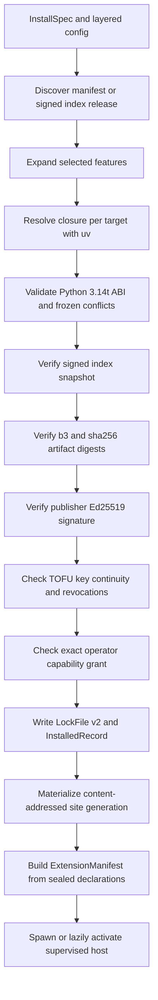
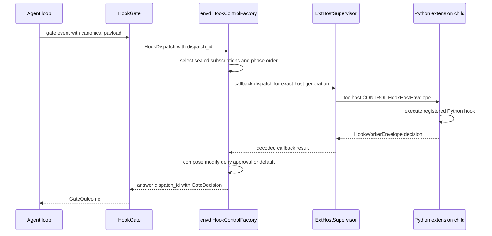
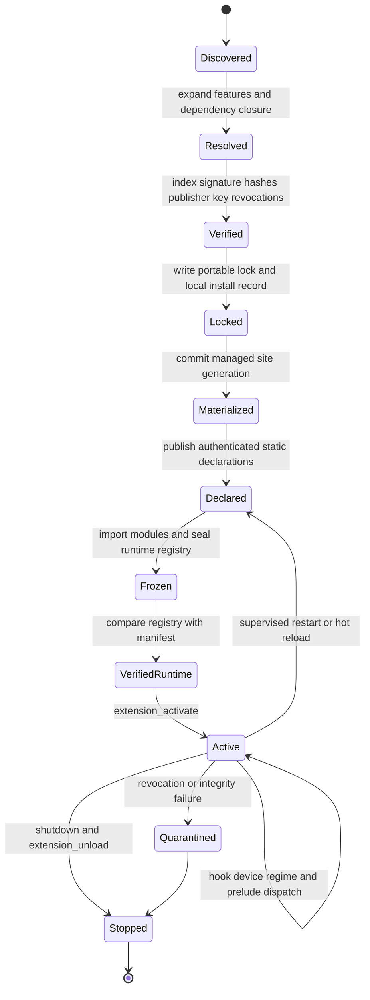

# Extension system

OMP extensions are signed Python distributions whose deployment manifest declares executable and static capabilities before any Python code runs. The manifest model is `DeploymentManifest` and `StaticDeclarations` in `crates/ext/src/config.rs`; an admitted runtime instance is represented by `ExtensionManifest` in `crates/envd/src/exthost/lifecycle.rs`. Extension configuration, resolution, locks, and trust are data-plane concerns in `crates/ext`; execution is owned by the supervised extension host in `crates/envd`; the interpreter comes from `crates/py`. Process and daemon boundaries are summarized rather than repeated here; see [`processes.md`](processes.md).

## Definition and authority

An extension has a stable `id`, a canonical Python `entry`, dependencies, capabilities, optional features, binaries, settings, and a sealed declaration inventory (`DeploymentManifest` in `crates/ext/src/config.rs`). `StaticDeclarations` partitions that inventory into tools, hooks, services, providers, regimes, UI contributions, telemetry, prompt slots, credentials, secrets, workers, placement, agents, LSP servers, and DAP adapters. Each `StaticDeclaration` carries its module, activation trigger, API revision, failure behavior, grants, optional hook filter, and class-specific signed properties.

This separation is an authority boundary:

- Discovery and admission read deployment metadata; they do not import the entry module. `ExtensionManifest::new_with_static` receives authenticated `StaticDeclarations` before a child starts (`crates/envd/src/exthost/lifecycle.rs`).
- Python registration supplies runtime detail but cannot silently widen the signed surface. `LifecycleMachine::activate_declared` checks `DeclarationDrift`, freezes regime declarations, calls the host `freeze`, then activates (`crates/envd/src/exthost/lifecycle.rs`).
- Static activation classes are `Static`, `FirstReach`, `BeforeFirstPrompt`, and `BeforeUiInput` (`ActivationTrigger` in `crates/envd/src/exthost/lifecycle.rs`). `Static` requires no Python host; the other classes can start a child.
- `ExtHostSpec` binds one admitted manifest to a `HostKey`, data grants, managed Python site, settings, optional pool, and optional linked-source watch root (`crates/envd/src/worker.rs`). Extensions share a process only when they explicitly name the same pool in the same layer and tier; otherwise `ExtHostSupervisor::spawn` isolates them.

## Discovery and layered configuration

`SourceSpec::parse` accepts native index distributions, PyPI distributions, commit-pinned Git repositories, local paths, and SHA-256-pinned archive URLs (`crates/ext/src/config.rs`). Native installation is narrower: `install_index_source` accepts a signed `index:` source, while local development installation accepts `path:`; other source classes are exposed to dependency-resolution inspection by `omp ext resolve` (`crates/app/src/ext_cli/mod.rs`).

`ambient_paths` builds deterministic discovery locations (`crates/ext/src/config.rs`):

- client config at the data directory's `config.toml` and install records at `ext/installed.toml`;
- workspace manifests under `.omp/extensions`, workspace config at `.omp/config.toml`, and install records at `.omp/installed.toml`;
- `.claude`, `.codex`, and `.gemini` roots are diagnostic-only foreign roots and are not loaded.

`fold_extension` applies ordered `ScopedOverlay` values. A later feature selection replaces rather than merges an earlier one, settings override by key, resource-filter layers remain ordered, and any `disabled` occurrence wins. `workspace_replacement` permits one workspace instance to replace a client instance only when replacement is declared, publisher identities match, and policy permits it (`crates/ext/src/config.rs`). Package resources are independently filterable as extensions, skills, prompts, and themes through `ResourceFamily` and `PackageResourceFilter`.

Environment controls are parsed centrally by `ExtensionEnvironment::from_environment` (`crates/ext/src/config.rs`). They include content store/cache roots, ordered indexes and keys, offline policy, lock refusal, upload-time clamp, disable set, workspace suppression, grants, signing key, target triples, and the `uv` path. `OMP_PY_SITE` is recorded as `site_override`; `site_override_warning` reports `W-SITE-OVERRIDE` because it bypasses managed per-host site selection.

## Resolution and lock materialization

Dependency resolution is explicit and reproducible:

1. Feature selection is expanded by `selected_requirements`; unknown features fail before a resolver process exists (`crates/ext/src/resolver.rs`).
2. `ResolvePlan::build` creates exactly one `UvRequest` per target. Its argv fixes Python 3.14, binary-only wheels, `first-index`, target platform, ordered indexes, and optional `--exclude-newer` (`crates/ext/src/resolver.rs`).
3. `UvRequest::reject_frozen_conflicts` checks requested requirements against `omp_py::frozen_distributions()` before invoking `uv`. Accepted wheel ABI tags are `cp314t`, `abi3t`, and `none`; `validate_target` requires a wheel for every materializing target.
4. `LockFile` version 2 records Python `==3.14.*`, ABI `cp314t`, targets, first-index order, exact extension roots, dependency closure, and frozen runtime distributions (`crates/ext/src/lock.rs`). `LockFile::validate_for` rejects a wrong layer, newer lock version, Python/ABI drift, non-first-index locks, duplicate ids, noncanonical features, and incomplete digest sets.
5. `InstalledRecord` is local state and may contain development links. `omp.lock` is portable and never contains link sources. `package_snapshot` emits the verified site-tree and distribution envelope consumed before extension code starts; development sources deliberately return no reproducible package snapshot (`crates/ext/src/lock.rs`).

A signed native install uses `materialize_signed_wheel` and one batch-level
`commit_generation` transaction (`crates/app/src/ext_cli/mod.rs`). The wheel is fetched into the
configured cache with a 256 MiB ceiling, checked again by byte length and both digests, promoted
atomically into the configured immutable store, unpacked by `uv --no-deps --no-index`, rejected if
it contains symlinks or non-regular files, placed into the environment blob store, and committed as
a generation only after every requested extension is prepared. Resolver and unpacker children are
kill-on-drop, so Ctrl+C cannot leave an executing installer behind.

## Registry integrity and trust

The native registry schema has two independent signature levels (`crates/ext/src/index.rs`):

- `SignedIndex` is canonical JSON signed by the configured index Ed25519 key. `SignedIndex::verify_at` checks schema version, issuance/expiry, strict id ordering, uniqueness, release version validity, target uniqueness, and canonical manifest capability-graph digests.
- Each `IndexArtifact` carries byte length, a BLAKE3 digest prefixed `b3:`, a SHA-256 digest prefixed `sha256:`, and a publisher Ed25519 signature. `verify_artifact_signature` verifies the signature over decoded `blake3 || sha256 || capability_digest` bytes (`crates/ext/src/trust.rs`). `verify_signed_wheel_bytes` independently recomputes both hashes after download (`crates/app/src/ext_cli/mod.rs`).

The complete trust decision also includes:

- publisher identity and TOFU continuity in `KeysFile`; `verify_or_pin` rejects a changed key unless `KeyRotation` is signed by the previous key (`crates/ext/src/trust.rs`);
- exact operator consent in `GrantsFile`; `grant_covers` matches extension id, publisher, layer/workspace specificity, capability digest, tier, and shipping level;
- a canonical capability grant key from `capability_digest`, including `tools.hard:<name>` claims;
- signed `RevocationsFile` state, with stale ordinary-offline state warning and strict-offline state failing closed;
- selected-feature `declaration_digest`, `capability_digest`, and complete `manifest_capability_digest` persisted in `LockedExtension` (`crates/ext/src/lock.rs`).

`install_index_source` performs revocation, artifact-signature, TOFU, exact grant, lock, and materialization checks before committing installation records (`crates/app/src/ext_cli/mod.rs`). `omp ext verify` rechecks the current signed index against the lock and local publisher pin, verifies the artifact signature, and optionally performs deep site and revocation checks in the same file.

## Runtime loading and supervision

`ExtHostSupervisor` is the runtime owner (`crates/envd/src/worker.rs`). `ExtHostConfig` supplies the authenticated principal, session and host generation fences, workspace root, active `ExtHostSpec` values, frame limits, health/spawn timeouts, interrupt grace, retry backoff, DATA authority, journal routing, and CONTROL authority factories. An empty extension set starts no interpreter.

For a CONTROL-capable extension, `ExtHostSupervisor::spawn` derives a `ControlConnectionIdentity`, builds a manifest snapshot, calls `exthost::spawn` with the managed Python site and environment socket, and binds the resulting child to composed CONTROL authorities (`crates/envd/src/worker.rs`, `crates/envd/src/exthost/spawn.rs`). Registry evidence is fenced by `(layer, tier, extension, generation)` and sealed by `seal_registry_evidence`; hook, tool, UI, service, and regime runtime declarations are checked against authenticated manifest facts before publication (`crates/envd/src/worker.rs`).

The activation path is sequential and generation-fenced:

1. `ExtensionManifest::lifecycle` creates a `LifecycleMachine` in `Declared` state.
2. Its module iterator orders `entry` first, followed by distinct declaration modules in manifest order.
3. Runtime declarations and UI/regime tables are checked, then FREEZE closes registration.
4. `activate_declared` moves through `Frozen` and `Verified`, calls the host activation handler, and enters `Active`; drift, stale generations, import failures, or callback failures enter `Degraded` (`crates/envd/src/exthost/lifecycle.rs`).
5. `activate_control_hosts` waits for sealed CONTROL registry evidence and publishes `extension_load` through the hook gate (`crates/envd/src/worker.rs`).

Tool invocations use `WorkerInvocation`, an RAII handle receiving ordered `WorkerEvent::{Update, Pull, ProtocolError, Complete, Aborted}`. Dropping a live handle requests cancellation; the supervisor owns escalation, process-group replacement, host-generation advancement, health probes, bounded respawn backoff, and effects-unknown reporting (`crates/envd/src/worker.rs`). Linked roots are watched and replaced by `reload_extension`; `shutdown` cancels watchers, signals every actor, and awaits each child. `quarantine` immediately stops process groups containing newly revoked extensions while leaving fail-closed unavailable routes.

The same executable enters the Python worker at `run_py_worker_entry`. It boots `omp_py::Engine`, installs the authenticated manifest and package snapshot, imports admitted modules, freezes declarations, activates extensions, and serves length-prefixed `toolhost/v1` frames (`crates/envd/src/worker.rs`). Detailed OS process and protobuf topology belongs in [`processes.md`](processes.md).

## Embedded Python runtime

`crates/py/src/lib.rs` statically links free-threaded CPython 3.14t and registers the standard library plus OMP Python modules as frozen, uncompressed blobs. `Builder::init` uses `PyConfig_InitIsolatedConfig`, disables bytecode writes and ambient site import, enables frozen modules, and installs one filesystem search-path entry. `Engine::attach` attaches a Rust thread to the interpreter; `bootstrap_extension_host` explicitly attaches the inherited CONTROL descriptor after interpreter initialization.

The one authorized site directory is selected by `Builder::site_packages`; the fallback from `default_site_packages` is `~/.local/share/omp-py/site-packages`, while `$OMP_PY_SITE` overrides it. `SitePolicy` controls whether the host exposes the directory directly, processes `.pth` files, or also imports `sitecustomize`; `usercustomize` and ambient global/user sites remain disabled (`crates/py/src/lib.rs`). Managed runtime hosts pass their lock-materialized site through `ExtHostSpec::python_site`, rather than relying on the ambient fallback.

## Python extension surfaces

The Python authoring contracts live under `docs/py/`; their registry is implemented by the frozen `omp` package and sealed by envd at FREEZE. The relevant surfaces are:

| Surface | Contract and runtime route |
|---|---|
| Devices and tools | `@omp.device` and `@omp.tool` declare host-facing capabilities; soft devices remain behind the `dyn` catalog while granted hard tools may occupy model slots (`docs/py/01-devices.md`). Runtime tools are checked as `SealedToolRegistration` and invoked through `ExtHostSupervisor::open` (`crates/envd/src/worker.rs`). |
| Typed call outcomes | A tool emits updates and one durable `CallOutcome`: success, typed fault, argument rejection, or abort. Prompt and UI representations are projections, not execution truth (`docs/py/02-verdicts.md`; Rust types are `Ev`, `ToolTerminal`, and `CallOutcome` in `crates/tool/src/lib.rs`). |
| Hooks | `@omp.hook` returns allow, deny, modify, defer, require-approval, or a bounded domain result (`docs/py/05-hooks.md`). `HookControlFactory::compose` sorts sealed subscriptions by phase/order/name/extension and invokes callbacks through the live dispatcher (`crates/envd/src/tools.rs`). |
| Regimes | `@omp.regime` installs durable middleware at the fixed agent points CONTEXT, TOOL_CHOICE, PRE_MODEL, STREAM, ADMISSION, BATCH, TURN_END, SETTLE, and IDLE. Handlers stage effects through `ctx` and select at most one control through `next_` (`docs/py/15-regimes.md`). Envd encodes `RegimeDispatch`, while `ExtensionRegimeResolver` creates the generation-fenced `omp_agent::Regime` adapter (`crates/envd/src/exthost/dispatch.rs`, `crates/envd/src/worker.rs`). |
| Eval prelude | `@omp.prelude` publishes a synchronous JSON-bound helper stub into newly created eval namespaces; the implementation may be sync or async in the extension worker (`docs/py/16-prelude.md`). Worker-side discovery and invocation are handled by `load_prelude` and the ordinary supervised invocation path (`crates/envd/src/worker.rs`). |

## Hook dispatch

The admission/event producer first checks the `HookGate` subscription bitmap. Envd's `HookControlFactory` owns a delegated gate: it receives a complete `HookDispatch`, resolves the sealed live subscription set, composes callback decisions, and answers the pending gate (`crates/agent/src/hooks.rs`, `crates/envd/src/tools.rs`). `NestedCallbackDispatcher` and `ExtHostSupervisor` route the callback to the exact authenticated host generation; the child executes the registered Python callback and returns a typed decision over CONTROL.

## Lifecycle summary
The following is an operational lifecycle assembled from the install transaction and supervisor APIs; its labels are not variants of `LifecyclePhase`. The runtime enum itself is driven by `LifecycleMachine` in `crates/envd/src/exthost/lifecycle.rs`.

## Key files

| Component | Path |
|---|---|
| Extension data model and layered configuration | `crates/ext/src/config.rs` |
| Dependency resolver and Python ABI policy | `crates/ext/src/resolver.rs` |
| Portable lock and local installation records | `crates/ext/src/lock.rs` |
| Signed index schema | `crates/ext/src/index.rs` |
| Grants, TOFU pins, revocations, Ed25519 verification | `crates/ext/src/trust.rs` |
| CLI install, resolve, trust, verify transactions | `crates/app/src/ext_cli/mod.rs` |
| Extension host lifecycle machine | `crates/envd/src/exthost/lifecycle.rs` |
| Hook and regime callback transport | `crates/envd/src/exthost/dispatch.rs` |
| Extension and Python worker supervisor | `crates/envd/src/worker.rs` |
| Live hook composer | `crates/envd/src/tools.rs` |
| Embedded CPython engine | `crates/py/src/lib.rs` |
| Python extension contract index | `docs/py/00-overview.md` |
| Device API | `docs/py/01-devices.md` |
| Typed outcome API | `docs/py/02-verdicts.md` |
| Hook API | `docs/py/05-hooks.md` |
| Regime API | `docs/py/15-regimes.md` |
| Eval prelude API | `docs/py/16-prelude.md` |
