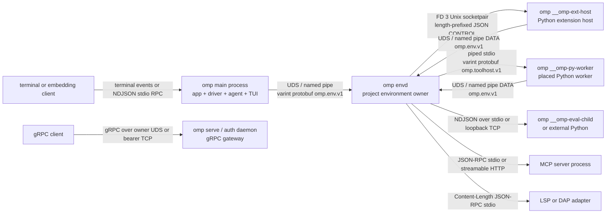
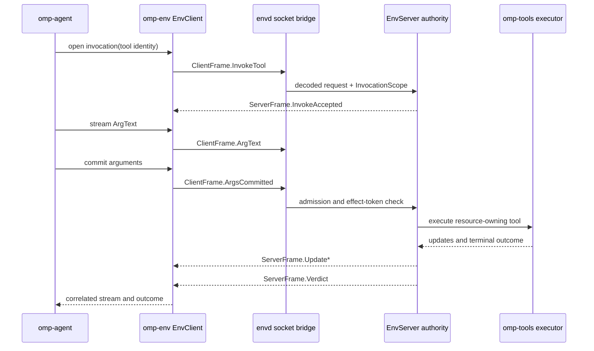
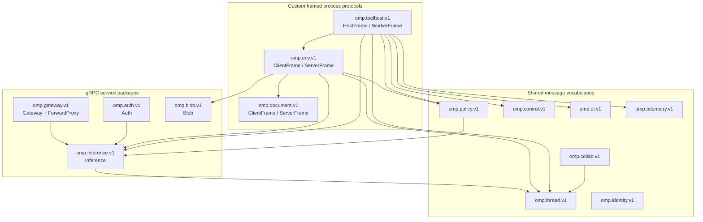

# Process and protocol architecture

OMP separates presentation and agent orchestration from project-scoped resource ownership. The `omp` executable is the ordinary application and also re-enters selected `omp-envd` runtimes under private arguments; the persistent project host is the public `omp envd` subcommand. Typed environment clients live in `crates/env`, while filesystem, process, document, tool, policy, and child-process authorities live in `crates/envd`.

## Runtime process topology

The default interactive process contains `omp-app`, `omp-driver`, `omp-agent`, inference services, and a terminal or GUI presentation. `crates/app/src/main.rs` performs process bootstrap and recognizes the private eval, extension-host, and Python-worker selectors before normal CLI parsing. The durable project owner is started by `ProjectEnvironment::connect_or_start`: `crates/envd/src/lib.rs` runs the current executable as `envd --root ...`, creates a new process group, appends output to `envd.log`, waits for its environment endpoint, and then lets it outlive the initiating app. If startup fails, the code explicitly falls back to an embedded environment.

`omp envd` hosts the document authority as a task, not as another mandatory OS process. `EnvServer::open_project` calls `connect_or_start_docserver` in `crates/envd/src/server.rs`; the document service is framed behind its own local endpoint, but its owning task runs in the envd process. `EnvServer::open_local` uses a Tokio duplex stream for the same protocol. LSP and DAP adapters spawned by the document authority are separate child processes when configured (`crates/envd/src/docserver/lsp_process.rs`, `crates/envd/src/docserver/dap_protocol.rs`).

On Unix, the document authority creates its shared lock directory with mode
`0700` in the creation syscall. A separate creation-then-chmod sequence would
let another authority observe and reject a briefly public directory. Existing
entries still require the effective user's ownership, directory type (not a
symlink), and no group/other permissions; startup never repairs an untrusted
existing entry. The creation regression runs with umask `000` in an isolated
child test process and inspects permissions before validation.

Linux Check 34255949854 failed one of 1113 tests during document initialization
with the owner-only lock-directory error (1112 passed, one failed, two skipped).
The old source permits the interleaving above, but that run did not capture the
observed mode or creation ordering. Attribution of that particular failure to
the race remains a hypothesis. The atomic-creation change and regressions have
only been formatted and statically reviewed; affected runtime validation is
pending.

The optional `omp serve`, auth-broker, and auth-gateway commands are independent daemon processes, not part of the project-environment owner. `DaemonHandle::start_rpc` registers `Gateway`, `ForwardProxy`, `Inference`, `Blob`, and `Auth` Tonic servers in `crates/app/src/daemon.rs`.

## Process creation and supervision

| Process | Spawn and lifetime | Supervisor / termination |
|---|---|---|
| Main `omp` | User, shell, SDK, or embedding client starts the binary; normal dispatch ends in `omp_app::run` (`crates/app/src/main.rs`). | Owns telemetry and presentation lifetime. `omp-driver` retains the joined headless session composition (`crates/driver/src/headless.rs`). |
| Project `omp envd` | `spawn_project_daemon_with` starts `current_exe() envd ...`, detached from stdin and in a new process group (`crates/envd/src/lib.rs`). | Readiness is an environment hello on the owner endpoint. The daemon owns idle timeout, presence leases, retirement, and shutdown (`crates/envd/src/server.rs`, `crates/envd/src/presence.rs`). |
| Python extension host | `exthost::spawn` re-enters the same executable with `__omp-ext-host`; it receives a private Python site and DATA socket (`crates/envd/src/exthost/spawn.rs`). | `ExtHostSupervisor` owns one process group per active host, captures stdout/stderr as logs, generation-fences connections, and shuts down or replaces failed hosts (`crates/envd/src/worker.rs`). |
| Placed Python worker | `WorkerProcess::spawn` re-enters the executable with `__omp-py-worker`, piped stdin/stdout, inherited stderr, and manifest/session environment (`crates/envd/src/worker.rs`). | `run_supervisor` pings, applies health deadlines and restart backoff, kills the process group on cancellation/failure, increments generation, and rejects stale responses. |
| Eval kernel | Embedded Python evaluation re-enters with `__omp-eval-child`; a configured external interpreter runs the staged `external_runner.py` (`crates/envd/src/eval/process.rs`). | `EvalChild` creates a process group, uses `kill_on_drop`, enforces interrupt grace and idle/session limits, and authenticates the external loopback connection. |
| MCP server | The environment manager starts configured commands for stdio transport; HTTP configurations use streamable HTTP (`crates/envd/src/mcp/manager.rs`, `crates/envd/src/mcp/stdio.rs`). | `McpManager` owns connection health, reconnect, cancellation, and the process tree. |
| LSP / DAP adapter | The document authority starts configured executables with piped stdio (`crates/envd/src/docserver/lsp_process.rs`, `crates/envd/src/docserver/dap_protocol.rs`). | Document-owned session tasks frame requests, dispatch responses/events, and terminate child processes with the authority. |
| Served gateway | A user starts `omp serve`, `omp auth-broker serve`, or `omp auth-gateway serve`; construction is in `crates/app/src/daemon.rs`. | `DaemonHandle` owns Tonic tasks, token watching for TCP mode, registry/storage authorities, and graceful shutdown. |

For extension activation, lifecycle, declarations, and trust policy, see [`extensions.md`](extensions.md). For turn mechanics and presentation event flow, see [`agent-loop.md`](agent-loop.md).

## IPC boundaries

| Boundary | Transport and framing | Wire contract |
|---|---|---|
| App or peer environment ↔ envd owner | Unix domain socket on Unix; owner pipe on Windows. Each record is a bounded, Prost varint-length-delimited protobuf (`crates/envd/src/server.rs`, `crates/envd/src/windows.rs`). An in-process deployment substitutes decoded channels without changing `EnvClient` (`crates/env/src/client.rs`). | `omp.env.v1.ClientFrame` / `ServerFrame`. Their arms include lifecycle hello/presence, tool invocation and streaming arguments, exec sessions and named processes, HTTP, DATA operations, and nested `omp.blob.v1` messages. DATA document arms contain `omp.document.v1` messages. |
| envd ↔ document authority | Owner-local UDS or Windows pipe in project mode; Tokio duplex in local embedded mode. Bounded length-delimited protobuf (`crates/envd/src/docserver/connection.rs`, `crates/envd/src/docs.rs`). | `omp.document.v1.ClientFrame` / `ServerFrame`: document leases, revisioned reads/edits/transactions, filesystem operations, watches, LSP and DAP operations/events. |
| envd ↔ extension host CONTROL | Dedicated Unix socketpair inherited as descriptor 3; stdout/stderr are logs only (`crates/envd/src/exthost/spawn.rs`). CONTROL is bounded JSON prefixed by a four-byte big-endian length with correlated `Request`, `Response`, `DispatchResponse`, registry/effect, and cancellation frames (`crates/envd/src/exthost/control.rs`). | JSON CONTROL envelopes, not protobuf. Typed protobuf payloads may be carried inside domain operations, but the outer frame is JSON. |
| extension host or worker ↔ envd DATA | Per-host UDS on Unix or owner pipe on Windows, with a capability-reduced `ExtensionEnvClient` / `WorkerEnvClient` (`crates/env/src/client.rs`, `crates/envd/src/server.rs`). | The same length-delimited `omp.env.v1.ClientFrame` / `ServerFrame`, always stamped with `InvocationScope`; document and blob packages are nested where applicable. |
| envd ↔ placed Python worker | Piped stdin/stdout; stderr is diagnostic output. Bounded varint-length-delimited protobuf (`crates/envd/src/worker.rs`). | `omp.toolhost.v1.HostFrame` / `WorkerFrame`: hello/registration, invocation/cancellation/update/completion, lifecycle, arguments, hooks, projections, UI, context, journal, control, inference, telemetry, and regime envelopes. These envelopes reuse `omp.inference.v1`, `omp.thread.v1`, `omp.ui.v1`, `omp.telemetry.v1`, and `omp.control.v1` types. |
| envd ↔ eval child | Same-binary child: NDJSON on piped stdin/stdout. External Python: authenticated loopback TCP carrying the same NDJSON (`crates/envd/src/eval/process.rs`). | Serde parent/child frames, not protobuf. |
| envd ↔ MCP server | JSON-RPC over piped stdio, or streamable HTTP, selected by `TransportKind` (`crates/envd/src/mcp/config.rs`, `crates/envd/src/mcp/stdio.rs`). | MCP JSON-RPC, not an OMP protobuf package. |
| document authority ↔ LSP/DAP | Piped stdio with `Content-Length` JSON-RPC framing (`crates/envd/src/docserver/lsp_process.rs`, `crates/envd/src/docserver/dap_protocol.rs`). | Standard LSP or DAP JSON messages, not OMP protobuf. |
| Client ↔ served gateway | Tonic gRPC over an owner-only UDS for `LocalEndpoint::Local`; TCP requires a watched bearer-token file (`crates/app/src/daemon.rs`, `crates/rpc/src/uds.rs`). | gRPC services `omp.gateway.v1.Gateway`, `omp.gateway.v1.ForwardProxy`, `omp.inference.v1.Inference`, `omp.auth.v1.Auth`, and `omp.blob.v1.Blob`. Standard `grpc.health.v1` support is provided by `crates/rpc/src/health.rs`. |
| Embedding parent ↔ `omp rpc` | stdin/stdout newline-delimited JSON; protocol v2 can chunk and reassemble logical frames (`crates/app/src/rpc_mode.rs`, `crates/rpc/src/framing.rs`). | Serde `ReadyFrame`, `RpcRequest`, `RpcResponse`, events, host-tool and host-resource frames from `crates/rpc/src/protocol.rs`; this is not gRPC or protobuf. |

### One environment effect

The connected path below shows the wire boundary. Embedded composition replaces the socket bridge with `InProcessEnvTransport`, while request correlation and protobuf frame types remain the same.

`omp-tool` supplies the deterministic contract and registry; the resource-owning implementation is selected inside envd from `omp-tools`. The commit frame is the authorization boundary: `InvokeTool` and `ArgText` may prepare work, but effects wait for `ArgsCommitted` (`crates/proto/proto/omp/env/v1/env.proto`, `crates/envd/src/server.rs`).

## Protobuf packages and sources

`crates/proto/build.rs` recursively gathers every schema below `crates/proto/proto`, compiles descriptors with pure-Rust `protox`, and passes them to `tonic-prost-build`. Message bindings are unconditional; gRPC clients and servers are generated only with the `tonic` feature. Generated byte fields use `bytes::Bytes`, maps use `BTreeMap`, and generated files are included from `OUT_DIR` by `crates/proto/src/lib.rs`.

| Source | Package | Coverage |
|---|---|---|
| `crates/proto/proto/omp/auth/v1/auth.proto` | `omp.auth.v1` | `Auth` gRPC service: credential inventory/watch, login, secret ingress, enable/disable/delete, reveal, blocks, and usage. |
| `crates/proto/proto/omp/blob/v1/blob.proto` | `omp.blob.v1` | `Blob` gRPC service and reusable stat/get/streamed-put/delete messages. |
| `crates/proto/proto/omp/collab/v1/collab.proto` | `omp.collab.v1` | Relay control, encrypted collaboration frames, snapshots, journal records, tool execution, notices, and session state. |
| `crates/proto/proto/omp/control/v1/control.proto` | `omp.control.v1` | Agent spawn/cancel/revive/steer, budgets, isolation, continuation ledger, usage, and loop signals. |
| `crates/proto/proto/omp/document/v1/document.proto` | `omp.document.v1` | Framed document authority: revisions, leases, edits, transactions, watches, filesystem operations, LSP, and DAP. It defines messages, not a gRPC service. |
| `crates/proto/proto/omp/env/v1/env.proto` | `omp.env.v1` | Multiplexed environment `ClientFrame` / `ServerFrame`: hello/presence/lifecycle, tool streams, exec and named processes, DATA operations, HTTP, blobs, workers, workspaces, resources, and MCP. It defines custom framed messages, not a gRPC service. |
| `crates/proto/proto/omp/gateway/v1/gateway.proto` | `omp.gateway.v1` | `Gateway.Hello` negotiation and allowlisted `ForwardProxy.Forward` streaming. |
| `crates/proto/proto/omp/identity/v1/identity.proto` | `omp.identity.v1` | Opaque session/item/tool/device/generation/revision/effect identities and effect envelopes. |
| `crates/proto/proto/omp/inference/v1/common.proto` | `omp.inference.v1` | Recursive values, capability fallback/effort, usage, cost, and unsupported-feature evidence. |
| `crates/proto/proto/omp/inference/v1/inference.proto` | `omp.inference.v1` | `Inference` gRPC service: bidirectional turns/realtime, context lifecycle, text utilities, media, search, usage/native calls, and catalog/provider operations. |
| `crates/proto/proto/omp/inference/v1/media.proto` | `omp.inference.v1` | Image, speech, transcription, and asynchronous video request/event/status types. |
| `crates/proto/proto/omp/inference/v1/models.proto` | `omp.inference.v1` | Provider/model cards, facets, modalities, availability, pricing, list/watch/refresh types. |
| `crates/proto/proto/omp/inference/v1/search.proto` | `omp.inference.v1` | Search requests, options, citations, and responses. |
| `crates/proto/proto/omp/policy/v1/policy.proto` | `omp.policy.v1` | Parsed shell effect IR, filesystem/network facts, typed denials, and authority effect envelopes. |
| `crates/proto/proto/omp/telemetry/v1/telemetry.proto` | `omp.telemetry.v1` | Trace/session/turn/model/tool/compaction/issue/host events and telemetry envelopes. |
| `crates/proto/proto/omp/thread/v1/thread.proto` | `omp.thread.v1` | Canonical revisioned conversation AST: items, roles, parts, blobs, tool calls/results, and model metadata. |
| `crates/proto/proto/omp/toolhost/v1/toolhost.proto` | `omp.toolhost.v1` | Host/worker process protocol: declarations, tool streams, lifecycle, hooks, UI, context, journal, control, inference, telemetry, regimes, and protocol errors. |
| `crates/proto/proto/omp/ui/v1/ui.proto` | `omp.ui.v1` | TML, retained frames/actions, slots, patches, status/progress/notifications, and UI dispatch results. |

## Client/host split

`omp-env` is deliberately transport-facing and resource-free. `EnvClient`, streaming guards, correlation, generated-frame re-exports, and project endpoint derivation belong in `crates/env`; it must not open workspace files, execute processes, own document leases, supervise Python, or implement tools. `omp-envd` is the sole live host and owns those resources (`crates/env/README.md`, `crates/envd/README.md`). A decoded in-process transport is an optimization of the same boundary, not permission to construct a second host.

Likewise, `omp-rpc` owns transport, negotiation, health, framing, TLS, UDS, and embedding protocol types; `omp-serve` projects injected inference/auth/blob authorities onto generated Tonic interfaces. Neither crate is a second inference or storage implementation (`crates/rpc/src/lib.rs`, `crates/serve/src/lib.rs`).

## Key files

| Component | Path |
|---|---|
| Executable bootstrap and private child dispatch | `crates/app/src/main.rs` |
| CLI `envd` / `serve` dispatch | `crates/app/src/cli.rs` |
| Headless composition | `crates/driver/src/headless.rs` |
| Project daemon connect, spawn, and fallback | `crates/envd/src/lib.rs` |
| Environment authorities and framed server | `crates/envd/src/server.rs` |
| Typed resource-free environment client | `crates/env/src/client.rs` |
| Extension host spawn and FD 3 CONTROL | `crates/envd/src/exthost/spawn.rs` |
| Extension CONTROL JSON runtime | `crates/envd/src/exthost/control.rs` |
| Python worker protocol and supervisor | `crates/envd/src/worker.rs` |
| Eval process protocol | `crates/envd/src/eval/process.rs` |
| Document authority connection | `crates/envd/src/docserver/connection.rs` |
| gRPC daemon assembly | `crates/app/src/daemon.rs` |
| gRPC transport utilities | `crates/rpc/src/lib.rs` |
| Inference/auth/blob projections | `crates/serve/src/lib.rs` |
| Schema compiler | `crates/proto/build.rs` |
| Environment schema | `crates/proto/proto/omp/env/v1/env.proto` |
| Tool-host schema | `crates/proto/proto/omp/toolhost/v1/toolhost.proto` |
