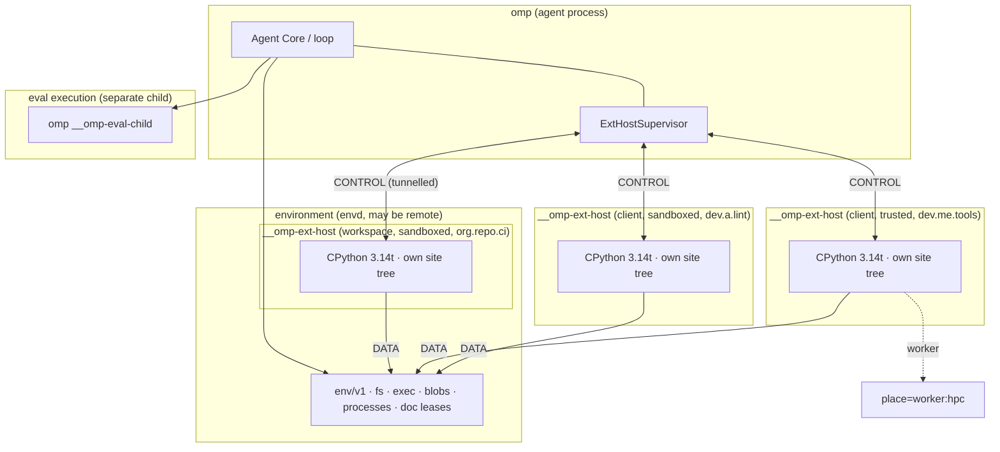

# The extension host

> **Design document, not a runtime API guarantee.** This corpus includes proposed
> interfaces and historical implementation observations. See
> [implementation status](implementation-status.md) for current owners and known gaps.

omp's Python extension surface, from the process outward.

| Doc | Owns |
|---|---|
| **00-overview.md** (this file) | host children, the two sockets, the six verbs and their `OperationSpec` gating, the phase legality matrix, the manifest, lifecycle and activation triggers, trust tiers, `omp.Context`, `omp.LifecyclePhase`, `omp.Duration`, principal identity, idempotency and generation fencing, per-extension quotas, `@omp.service` / `omp.services`, cancellation, crash/restart, package-root constants and exceptions |
| [01-devices.md](01-devices.md) | `@omp.device`, `@omp.tool` (soft/hard intent, `kind`), the `dyn` shell builtin and its schema-derived CLI grammar, the dynamic tool policy (`tools.policy`), `omp.ToolPath`, schema-on-demand, precedence, MCP mounting |
| [02-verdicts.md](02-verdicts.md) | `omp.Payload` / `omp.Fault`, `omp.CallOutcome`, `PolicyDenied`, `prompt(view, caps)`, `omp.PromptCaps`, `lift()`, `family@rev`, `schema_rev` vs `artifact_digest`, spill budget, `@omp.renderer` |
| [03-params.md](03-params.md) | `omp.InvocationPhase` (the invocation state machine), `IncomingParams` (core-internal), the `Ev` vocabulary, charitable decoding |
| [04-placement.md](04-placement.md) | `place=` semantics, `omp.Place`, `omp_remote`, `omp.workers`, `omp.WorkerSpec`, `omp.Spill` |
| [05-hooks.md](05-hooks.md) | `@omp.hook`, the event catalog, the `tool_call` target union, `omp.HookDecision` (`Allow` / `Deny` / `Modify` / `Defer` / `RequireApproval`), `omp.HookPhase`, failure table |
| [06-policy.md](06-policy.md) | verdict-based policy, bash AST IR, `omp.SandboxProfile`, `SandboxEnforcement`, `ApprovalSpec` and durable approval tickets |
| [07-ui.md](07-ui.md) | `omp.ui.*`, TML, slots, dialogs, triggers, ghost text, `@omp.command`, `@omp.shortcut`, `@omp.message_renderer` |
| [08-context.md](08-context.md) | `omp.MessageRef`, `omp.ContextPatch`, `thread_projection`, `@omp.prompt_slot`, `CompactionEvent`, compaction verdicts, memory |
| [09-journal.md](09-journal.md) | `omp.journal` (`append`, `append_many`, `append_atomic`), `omp.sessions`, `omp.artifacts`, `ArtifactUrl` / `HistoryUrl` / `AgentUrl`, durable state scopes, the state directory |
| [10-telemetry.md](10-telemetry.md) | `@omp.telemetry`, event kinds, AutoQA / `report_issue`, per-rev metrics |
| [11-env.md](11-env.md) | `omp.env`: doc leases, fs, exec, named processes, blobs, walker, capabilities, `EnvPath` / `ClientPath` / `BlobRef`, `EnvError` |
| [12-agents.md](12-agents.md) | `omp.agents`: subagents, goal loops, schedules, messaging, rewind |
| [13-inference.md](13-inference.md) | `@omp.provider`, the provider surface, `omp.creds`, request intents |
| [14-deploy.md](14-deploy.md) | packaging, distribution, dependency resolution, install/trust lifecycle, `(publisher_key, extension_id)` identity, the manifest declaration table, `WorkspaceUri`, client↔remote layering |
| [15-regimes.md](15-regimes.md) | `@omp.regime`, fixed loop events, transactional `ctx` / `next_` handlers, durable state, exclusive resources, and modes |
| [16-prelude.md](16-prelude.md) | `@omp.prelude`, extension-declared eval-namespace helpers, declaration and manifest identity, generated sync stubs, JSON call boundary, lifecycle, and failure semantics |
| [17-scribe.md](17-scribe.md) | `omp.scribe`: `Template`, `render`, `canonicalize`, `TemplateError` — deterministic prompt templating, the props value model, the template grammar, and the builtin helper set |

Rule of the set: the owner defines, everyone else links. This file names sibling symbols but never redefines them. The rule is machine-enforced, not merely stated: the generated spec (*The generated spec*, build section) fails CI on a duplicate public symbol owner, because the review caught the rule being violated by the most central symbols in the set.

## Purpose

The extension host is the process that runs extension Python. It is a child of the agent, it embeds its own free-threaded CPython 3.14t interpreter, it holds exactly two sockets, and it can be killed and replaced at any instant without the agent losing a turn. Everything else in this document is a consequence of those four sentences.

The pi failure it removes is Lesson #2: extensions sharing the engine's isolate. In pi, a handler that hangs is a handler that hangs forever. `raceHandlerWithTimeout` (`/work/pi/packages/coding-agent/src/extensibility/extensions/runner.ts:241`) resolves the *race* at the deadline and hands the loop a `Deny`, but the handler's promise keeps running — the code explicitly awaits one microtask of the loser and moves on (`runner.ts:301-310`). The gate closes; the work does not stop. A plugin that scheduled its own `setInterval` used to be able to kill the whole session, because a throw on a fresh stack becomes a process-level `uncaughtException` that pi's postmortem handler treats as fatal; the entire `ManagedTimers` class exists to paper over that one hole (`/work/pi/packages/coding-agent/src/extensibility/extensions/managed-timers.ts:1-16`). And 34 of the 194 catalogued packages bundle native binaries (`.plan/user-requests/2026-08-10-pi-extension-survey/catalog.md:18`) — `@amaster.ai/pi-computer-use` lazy-starts a precompiled Rust driver, `@ff-labs/pi-fff` ships an N-API index, `pi-onnx` loads ONNX Runtime, `@shinynito/pi-menshen` loads tree-sitter WASM — every one of them a segfault away from taking the harness with it.

Out-of-process makes all three the same problem with one answer: the supervisor owns the process, so the supervisor owns cancellation, crash containment, and hot reload. A hung handler is a killed process group. A segfaulting wheel is a respawn. A code change is a respawn with a different reason code.

That answer is not complete, and this document says so where it matters rather than at the end. Killing a process is a coarse instrument: one host child holds one interpreter, so a cancelled device call still takes whatever else its own extension had in flight — under the actor default (*Process model*) that is queued work; under opt-in `concurrency=N`, running work. See *Cancellation* for exactly how much and what is unresolved.

## Concepts

### Process model



One interpreter per **host child**, and by default **one child per extension**. Children are keyed by `(layer, tier, extension)`:

- **layer** — where the extension was declared. The *client* layer sits next to Agent Core; the *workspace* layer sits next to the Environment, with CONTROL tunnelled back. In a purely local session there is one layer. [14-deploy.md](14-deploy.md) owns layer resolution and precedence.
- **tier** — `sandboxed` or `trusted` (*Trust tiers*, below).
- **extension** — the manifest `id`. This is the default isolation unit.

`pool` remains, inverted from a splitting escape hatch into an opt-in **sharing group**: several extensions may be deliberately installed into one child to save resident memory, at the cost of explicit fate-sharing — extensions in one group share failure fate, dependency fate, and cancellation fate, and every mention of pooling in this document set carries that sentence ([14-deploy.md](14-deploy.md)). Default is isolated.

This topology is **final**, not provisional: one process and one site tree per extension, children keyed `(layer, tier, extension)`, pooling as the explicit opt-out. The review asked whether the per-extension boundary was still open — sibling documents were still describing shared same-tier site trees and `(layer, tier, pool)` keys. It is not open; those passages were stale remnants of the superseded design and are rewritten in their owners.

**Actor semantics.** Within one extension's child, callback entry is **serialized by default**: one hook handler, device call, command, or telemetry callback runs at a time, so ordinary module globals never race and extension authors on a free-threaded interpreter are not opted into concurrency by surprise. Reentrancy is explicit. Concurrency is opt-in — `concurrency=N` on a declaration that can safely serve N invocations at once, `threadsafe=True` on a callback that may overlap arbitrarily. Different extensions are different processes and always proceed concurrently, which recovers most of the parallelism without making ordinary extension code concurrent by accident. Free-threaded CPython stays an implementation advantage — the host's own frame pump, the interrupt machinery, `place=` bodies — not an ecosystem-wide invitation for module globals to race.

Isolation per extension buys three things that no runtime check can:

1. **A bounded unit of loss under cancellation.** D5 makes cancellation of Python `SIGKILL + respawn` (`PLAN.md` §D5, as amended 2026-08-19). If a child hosted every extension, killing one device call would kill its neighbours. Per-extension, the blast radius is the extension whose call was cancelled. See *Cancellation* for what remains unbounded.
2. **A stalled extension blocks only itself.** Approval no longer suspends a Python coroutine at all — an APPROVAL-phase hook returns `RequireApproval(ApprovalSpec(...))` and Core owns the durable ticket ([06-policy.md](06-policy.md)) — but an extension wedged in its own slow work still occupies only its own interpreter, never anyone else's.
3. **No import shadowing.** Each child has its own `sys.path` and site tree, so one extension's dependency graph cannot define a module another extension imports. Joint dependency resolution is then required only *within* one extension's own closure — an ordinary solvable problem. This beats PEP 734 subinterpreters on every axis except memory: native modules work unmodified with no `Py_mod_multiple_interpreters` requirement, and nothing has to cross an interpreter boundary.

The memory objection is weaker than it looks, for two reasons. Every child is the same executable, so the frozen stdlib is `include_bytes!` static data (`crates/py/src/lib.rs:45-50`) shared read-only across children by the page cache; what is per-child is the unmarshalled subset actually imported plus the interpreter heap. And the count is driven by *distinct installed extensions*, not by devices: the catalogue's umbrella bundles are one extension declaring many devices — `@bdsqqq/pi`'s 33 entrypoints are one `omp.toml`, hence one child, not 33.

A session boots at most `omp.MAX_HOST_CHILDREN`, and boots them lazily. A session with no extensions never starts an interpreter; an installed extension that is never reached this session never starts one either. Lazy spawn is only possible because the manifest is authoritative for what an extension *offers* — see *Manifest* and *Lifecycle*.

Every Python extension child re-enters the `omp` binary through the single private `__omp-ext-host` role and communicates with its supervisor over CONTROL. Eval execution re-enters through the separate `__omp-eval-child` role. There is no Python tool-worker child: named workers are placement targets owned by the named-worker facility, not an extension or eval process. The app and environment parents dispatch these roles without initializing CPython or performing an interpreter preflight. Only the selected child boots an `omp-py` `Engine`; `omp-py` statically links CPython 3.14t and freezes the stdlib into the binary, so no `python3` on `$PATH` is involved.

**What this costs, stated plainly.** Extensions no longer share `sys.modules`, so the in-process inter-extension event bus is gone. Twenty-eight catalogued packages use pi's shared emitter as an RPC channel between extensions; under omp that traffic routes over CONTROL, and the sanctioned shape is the typed service surface — `@omp.service` / `omp.services.connect` (*Extension services*, below). Agent messaging and journal entries are explicitly **not** an RPC substrate ([12-agents.md](12-agents.md), [09-journal.md](09-journal.md)). This was already going to be true across layers and tiers; per-extension keying makes it true everywhere. A sharing group is the opt-out, and it is an explicit install-time choice rather than an accident of co-residence.

`place=` moves a function body out of the child — to an ephemeral worker beside the environment, or to a named persistent worker that may be on another machine. A worker is a leaf **with respect to Agent Core**: no hooks, no UI effects, no journal writes, no credential or subagent requests. It is *not* a leaf with respect to the Environment. See [04-placement.md](04-placement.md).

### Why eval stays in a separate child

Eval is LLM scratch execution. Cells are hostile by construction — the model writes them, and they are expected to crash, hang, and leak threads — so the killable `EvalExec` boundary runs them in `__omp-eval-child`. The built-in `py_eval` tool uses that same machinery through an Environment route and gives every call a fresh, disposable namespace; it is not declared by an extension manifest and never takes a Worker route.

The extension host is session infrastructure. Its declarations must be stable for the life of the session, its state is not the model's to discard, and replacing its interpreter for an eval reset would silently unregister devices. Sharing one interpreter between the two would mean either the model can discard the user's extensions, or extensions leak into the model's namespace.

They share `omp-py`'s engine and frozen-module building blocks, but not a process or protocol role: extension calls use the `__omp-ext-host` CONTROL connection, while eval calls use the eval-child protocol. Each child creates its sole process-local `Engine`; neither parent preflight-boots CPython.

### Two sockets

Every host child holds exactly two, and the split is a security boundary rather than a layering preference.

**CONTROL ⇄ Agent Core.** One multiplexed, reentrant, bidirectional channel carrying `toolhost/v1` frames (`crates/proto/proto/omp/toolhost/v1/toolhost.proto`): declarations, hook dispatch and decisions, device invocation and updates, UI effects, journal requests, request mutations, credential and subagent requests, session queries. Reentrant in the strict sense — a device body may `await omp.ui.confirm(...)` and core must service that request while the device's own invocation is still outstanding. Round-trip is tens of microseconds over varint-framed protobuf on a **dedicated inherited descriptor** — deliberately not the child's stdio, so a stray `print()` can never be a protocol violation (*Idempotency and generation fencing*); for a workspace-layer child it is tunnelled and correspondingly slower. **CONTROL carries no world access.** Nothing on this channel reads a file, runs a command, or opens a connection.

**DATA → Environment.** A scoped `env/v1` client (`crates/env/README.md`). Files, exec sessions, blobs, named processes, doc leases, workspace search. Policy is enforced env-side, in Rust, against the scope the child was granted at spawn — never by a Python-side check, because a Python-side check inside a shared interpreter is a suggestion. `crates/env` "deliberately owns no world resources"; the host inherits that discipline.

The consequence worth internalizing: **an extension's `omp.env` is the environment of the workspace that declared it, which need not be the client's disk.** A workspace-layer extension gets the remote environment. Never assume `ctx.roots` are local paths — they are typed `WorkspaceUri` values ([14-deploy.md](14-deploy.md)), and their scheme says which machine. [11-env.md](11-env.md) owns the surface, [14-deploy.md](14-deploy.md) owns how the layers stack.

Latency classes, because they decide what a hook may be:

| Class | Budget | Sanctioned |
|---|---|---|
| per-session | ~10 ms | yes — activation, resource discovery |
| per-turn | ~1 ms | yes — context patches, prompt slots |
| per-call | ~200 µs | yes — tool-call policy, device invocation |
| per-keystroke | — | **no** — declare a trigger; the TUI matches locally ([07-ui.md](07-ui.md)) |
| per-token | — | **prohibited** — there is no such hook and there will not be one |

### Runtime boundaries

The two-socket extension-host topology is live and distinct from eval-child and named-worker execution:

**CONTROL is live.** `toolhost/v1` is framed, supervised, health-checked, multiplexed, and reentrant. Alongside declarations, device invocation, updates, terminal verdicts, and cancellation, it carries hook dispatch and decisions, UI effects, host-initiated requests and their responses, and the published subscription mask. The mask is installed into Core's `HookGate`, so an unsubscribed event takes the bitmap-only path and constructs no payload or CONTROL frame.

**DATA is live and invocation-scoped for Python.** Every admitted extension `HostKey` receives a private owner-mode endpoint through `OMP_EXT_ENV_SOCKET`. Import and declaration remain worldless: the child opens no DATA connection until an active invocation carries Core-minted effect authority. At first reach, `omp.env` connects through `ExtensionEnvClient` with the exact invocation id, effect token, host generation, and session generation.

`EnvServer` serves each endpoint with an extension-scoped `ConnectionPolicy`, intersects the requested capabilities with that extension's manifest grants, and checks the generation-fenced invocation envelope before dispatch to the live document and workspace owners. Endpoint teardown removes the socket and cancels accepted connections; another extension's credentials cannot reuse it. DATA remains separate from CONTROL and stdio.

**Lesson #6 is enforced in the live registry.** `Registry::advertise` delegates to `advertise_matching`, whose inclusion predicate requires both slot presentation and `is_model_callable(entry.tool.route())` (`crates/tool/src/registry.rs::advertise`, `::advertise_matching`, and `::is_model_callable`). Worker-routed device declarations therefore remain resolvable through the device route without occupying the model's advertised tool array. Under the default dynamic tool policy (`tools.policy = "auto"`, [01-devices.md](01-devices.md)), the advertised array contains core tools plus granted hard tools, and nothing else.

The cache identities are split along that same boundary. `Registry::slot_hash` digests only policy-resolved model-visible slots and applies the route predicate; `Registry::device_hash` separately digests device-catalog availability, including claimant and route identity (`crates/tool/src/registry.rs::slot_hash`, `::device_hash`). A device registration can therefore change availability without falsely reporting a prompt-toolset change, which is the notification contract in [01-devices.md](01-devices.md).

### The six verbs

Every one of the 194 catalogued extensions reduces to six interaction shapes. Naming them is what keeps this API from growing one bespoke call per pi feature.

| Verb | Meaning | Channel | Surface |
|---|---|---|---|
| **Declare** | register a static fact at import | CONTROL | `@omp.device` / `@omp.tool` ([01](01-devices.md)), `@omp.prompt_slot` ([08](08-context.md)), `@omp.provider` ([13](13-inference.md)), `@omp.command` / `@omp.shortcut` / `@omp.message_renderer` ([07](07-ui.md)), `@omp.renderer` ([02](02-verdicts.md)), `@omp.service` (this file) |
| **Hook** | observe or veto a core event, return a decision or patch | CONTROL | `@omp.hook` ([05](05-hooks.md)), `@omp.telemetry` ([10](10-telemetry.md)) |
| **Effect** | fire-and-forget, non-durable state push | CONTROL | `omp.ui.*` ([07](07-ui.md)) |
| **Request** | ask core for something, await an acknowledged result | CONTROL | `omp.journal.append` / `append_many` / `append_atomic` ([09](09-journal.md)), `omp.agents.*` ([12](12-agents.md)), `omp.ui.confirm` ([07](07-ui.md)), `omp.creds.*` ([13](13-inference.md)), `omp.sessions.*` ([09](09-journal.md)), `omp.services.connect` (this file) |
| **Own** | hold a long-lived resource on the host's behalf | DATA | `omp.env.proc.*`, blobs, doc leases, state dir ([11](11-env.md), [09](09-journal.md)) |
| **Place** | move a function body to where the data is | DATA + worker | `place=` ([04](04-placement.md)) |

An earlier revision classified `omp.journal.append` as an Effect. That was wrong on the taxonomy's own terms — `journal.append` returns only after the record has been durably assigned and written, which makes it an acknowledged, durable Request, not a fire-and-forget push — and the misclassification mattered, because Effects were exempt from phase gating and a durable journal write must never be. The row above is the correction; [09-journal.md](09-journal.md) owns the surface.

Notice what is missing: there is no per-extension *tool slot*. **Extensions register with the host, never with the model.** The host must know a tool's name, family, rev, schema, and constraints — that is what `RegisterTools` is for, and it is what makes the catalog answerable at all. What never happens is unbounded registration with the *model*: no schema slot per extension, no tool-array growth, no `setActiveTools`, no `loadMode`. On Codex, TTFT scales roughly 1:1 with registered tool count because every schema feeds the sampler's grammar — 40 dormant MCP endpoints tax every token of every turn. Extension capabilities ride the device catalog instead, reached through the permanently stable `dyn` builtin inside the core `shell` tool ([01-devices.md](01-devices.md) owns its CLI grammar and `omp.ToolPath`): `dyn` lists, `dyn <name> --help` fetches full docs and schema-derived usage on demand, and `dyn <name> [args…]` dispatches with CLI arguments mapped into one nested JSON document. Which declarations also occupy model-facing slots is the user's call, not the extension's: the **dynamic tool policy** (`tools.policy`, [01-devices.md](01-devices.md)) resolves each declaration's soft/hard *intent* into a surface. Under the default `auto` policy **hard tools** are the one sanctioned exception to extension-driven slot growth — `@omp.tool(kind="hard")` declarations granted a budgeted, audited model-facing slot each while remaining in the device catalog, addressable by `omp.ToolPath`; devices ride `dyn` inside the existing `shell` slot. Under `tool_only` the user has explicitly bought slot growth wholesale — every declaration surfaces as a slot and the `dyn` builtin is dropped; `device_only` demotes even hard intent to a device. Availability changes append one system-notification item; the request's tool array is byte-identical before and after, so the prompt prefix cache survives. (Rev 2 of this passage dispatched and read docs through the retired read/write device URL scheme; the Rev 2.1 rulings replaced that scheme with `dyn` ops, and Revision 2.2 supersedes those ops with the `dyn` shell builtin — both reversals are recorded in their historical addenda below and at the transport's owner.)

`@amaster.ai/pi-computer-use` registers 49 version-pinned tools in pi. In omp it is one device and zero schema slots.

### Every symbol carries an `OperationSpec`

The review's sharpest structural finding: "the world untouched before authorization" was written as an Environment invariant, which gates DATA — but CONTROL has durable and cost-bearing operations too. Nothing env-side stops a speculative or pre-admission caller from appending a durable journal entry, spawning a subagent, starting an inference request, mutating provider state, or creating a schedule. An earlier revision left that gap to prose ("effects are cosmetic by definition"); Revision 2 closes it with metadata.

Every public API symbol carries generated metadata (full type under *Value types* in the Reference):

```python
OperationSpec(
    minimum_phase=InvocationPhase.EFFECTS_AUTHORIZED,   # 03-params.md
    durability=Durability.DURABLE,
    cost=CostClass.NONE,
    authority=Authority.CORE,
)
```

**Core enforces `minimum_phase` for CONTROL operations; the Environment enforces it for DATA operations.** An extension author never memorizes which namespace happens to require a preceding gate — a call either is legal in the current `omp.InvocationPhase` ([03-params.md](03-params.md)) or raises `omp.EffectsNotAuthorized` from the enforcing side. Concretely: `journal.append` is durable, so its `minimum_phase` is `EFFECTS_AUTHORIZED`; the same holds for subagent spawn, inference requests, provider mutation, and schedule creation. Non-durable UI pushes may be legal earlier — and the matrix, not folklore, says exactly which and when, per symbol.

The whole table is published as one generated **phase legality matrix**: one row per public symbol, one column per `InvocationPhase`, produced from the machine-readable spec (*The generated spec*, build section) rather than maintained by hand. This document owns the matrix contract; sibling documents own their symbols' rows.

### Lifecycle

Two phases, and the split is what makes lazy spawn work. The first runs once per session over manifests only; the second runs per host child, the first time that extension is actually reached.

```
 ── session start, no interpreter anywhere ──────────────────────────
DISCOVER ──► ADMIT ──► PUBLISH
   │           │          │
manifests   api level,  declaration table +
only, no    caps,       subscription mask handed
code runs   routing     to core; nothing booted

 ── first reach of one extension ────────────────────────────────────
SPAWN ──► IMPORT ──► FREEZE ──► VERIFY ──► ACTIVATE
   │         │          │          │           │
 child    manifest   registry   against    extension_activate
 boots    order,     sealed     the        (reason=FIRST_REACH)
          sequential;           manifest
          import IS
          declaration
```

**DISCOVER** reads `omp.toml`. No extension code executes. This ordering is load-bearing: you cannot execute code to decide whether you are allowed to execute code. Which layer wins when two layers declare the same `id` is [14-deploy.md](14-deploy.md)'s.

**ADMIT** rejects, per extension: an `omp_api` outside `omp.API_LEVELS`; a capability the install grant does not cover; a malformed `settings` schema. It also *routes* — `(layer, tier, extension)` names the child this extension will eventually get. Rejection raises `ManifestError` or a subclass, is journaled, and removes that extension only.

**PUBLISH** hands core the union of every admitted manifest's declaration tables — tools, hooks, services, and every other lazy-reachable surface kind ([14-deploy.md](14-deploy.md) owns the schema): the device catalog behind `dyn`, the subscription mask, and the activation-trigger index. **Nothing has booted.** A session whose extensions are never reached pays one TOML parse each and no interpreter at all.

**SPAWN** happens the first time an extension is actually needed — an `dyn <name> --help` fetch for one of its tools, an `dyn <name> [args…]` dispatch, a hook it subscribed to firing, or any other declared surface's activation trigger (*Activation triggers*, below). The child boots; the model's turn waits on it exactly as it would wait on any tool.

**IMPORT is declaration.** The host resolves a canonical module order from the manifest — `entry` first, then every distinct `module` named in the declaration tables, in manifest order — and imports them **sequentially, in that order**. Python module bodies and decorators execute *during* import; there is no later phase in which they could run. Decorators record declarations into the registry as import executes. An import that raises fails the spawn and marks the extension `LifecyclePhase.DEGRADED`.

> An earlier revision described concurrent imports followed by a separate, sequential DECLARE phase. That was wrong twice over: module bodies and decorators cannot run after import as an independent phase, because executing them *is* importing; and concurrent import made registration order nondeterministic exactly where declarations may consult process-global state. Both claims are retracted. Sequential import in manifest order is the semantic contract; if import time ever matters, the optimization is precompiled or frozen modules — never concurrency reintroduced into the semantics.

"No I/O during declaration" is enforced, not requested: the import phase runs with CONTROL not yet accepting requests, DATA not yet connected, and the OS sandbox already active, so a module body that reads a file or opens a socket fails the spawn rather than succeeding quietly on the author's machine and failing on someone else's. Declarations must be a pure function of the installed code, which is what makes them verifiable. Collisions are resolved with explicit `precedence` and `replaces` ([01-devices.md](01-devices.md)); an unresolved collision raises `DuplicateRegistration` — pi's loader binds factories sequentially for determinism (`loader.ts:434-437`) and still produces last-writer-wins collisions in the wild, because ordering alone does not make a collision *intentional*.

**FREEZE** seals the registry after the last manifest-named module finishes importing. No further declaration is accepted; a decorator that runs later — a lazy `import` inside a handler — raises `DeclarationSealed`. Freezing is what makes VERIFY meaningful: it compares a completed set, not a moving one.

**VERIFY** sends `RegisterTools` and checks it against the manifest the host already published. The manifest wins: registration carries the detail core could not know statically (full JSON schema, docs, examples) but may not add, remove, or rename a device or subscription. Divergence marks the extension `LifecyclePhase.DEGRADED`, unloads it, and is journaled — and since the tables ship inside the wheel under its digest, divergence means the artifact was built from different code than it claims, not that someone forgot to regenerate ([14-deploy.md](14-deploy.md)).

**ACTIVATE** dispatches `extension_activate(reason=FIRST_REACH | RESTART | HOT_RELOAD, session_started_at=..., generation=...)` ([05-hooks.md](05-hooks.md) owns the event's catalog row) under `omp.ACTIVATION_TIMEOUT`. This is where an extension opens its state, adopts its named process, warms its index. It is also the replay point after a restart.

> An earlier revision fired `session_start` here, so an extension first reached on turn 40 observed a "session start" forty turns after the session started, and a restart replayed an event whose name claims a transition that did not happen. That naming was misleading and is retracted. `session_start` is reserved for the real session-level transition and is delivered only to extensions already active when it fires — in practice, eagerly activated ones. The activation payload carries what the misnamed event obscured: `reason` (`omp.ActivateReason`) distinguishes first reach from restart from hot reload, `session_started_at` dates the session the extension is joining late, and `generation` is this child's restart counter. Handlers must be idempotent either way — activation replays.

#### Activation triggers

Lazy spawn only works if *every* declared surface names what wakes it. Rev 1 answered that for devices and hooks and left providers, prompt slots, commands, renderers, and telemetry implicit — the review's P0 #8. The manifest's declaration table ([14-deploy.md](14-deploy.md)) now carries `declaration_id, kind, module, static key, activation trigger, required API level, failure class` for every lazy-reachable surface, and every surface kind is classified into exactly one of four boot classes:

| Class | Meaning | Examples (the linked owner states each trigger) |
|---|---|---|
| static, no Python | served from the manifest alone; the child never boots for it | the device catalog behind `dyn`; the subscription mask; command and completion *names* |
| lazy on first reach | the child boots when the surface is used | device dispatch ([01](01-devices.md)); a subscribed hook firing ([05](05-hooks.md)); `omp.services.connect` to a declared service; a command body on invocation, a completion/trigger body on match ([07](07-ui.md)); a verdict/entry-kind renderer when a replayed session declares that entry kind ([02](02-verdicts.md), [09](09-journal.md)) |
| eager before first prompt | must be active before the first model request | `@omp.provider` (model resolution, [13](13-inference.md)); `@omp.prompt_slot` ([08](08-context.md)) |
| eager before UI input | must be active before the UI first paints or accepts input | message renderers needed to draw a resumed session's visible history ([07](07-ui.md)) |

Each sibling document states the trigger for its own surfaces; this file owns the four classes and the rule that a declaration without a trigger classification is a `ManifestError` at ADMIT.

**Across children**, spawn and activation are independent; core does not serialize on the slowest one.

Hook dispatch starts as a fan-out and ends as a decision, and Revision 2 stops pretending otherwise. **Core runs the per-invocation decision procedure.** For each invocation it walks the hook phases — PRECHECK, TRANSFORM, REVIEW, APPROVAL, OBSERVE ([05-hooks.md](05-hooks.md)) — dispatching to every subscribed host child, composing their decisions, recomputing derived facts after each accepted transform ([06-policy.md](06-policy.md)), and producing one admission answer. **The environment owns the gate**: the admission query emitted after `InvokeTool` and before `ArgsCommitted` authorizes effects remains the wire mechanism, and the environment executes against nothing but a composed answer to it. Core decides; env enforces. A gate the loop could bypass would be theatre — and so would a "gate" whose deciding logic nobody owned.

This reads locked decision **D6, "One mailbox, no gate chain"** (`PLAN.md` §D6) as forbidding **batch-level admission scheduling in the mailbox loop** — no approval prompts serializing the batch, no admission scheduler reordering it, no parallelism detection — and *not* as forbidding the per-invocation decision procedure, which runs off the mailbox loop and is per-invocation by construction. The invariant D6 protects is kept verbatim: **each invocation gates independently; one slow approval never serializes the batch.** That scope reading was once an interpretation this document could only flag — Rev 2 wrote "**D6 wording amendment recommended**" here. The amendment is ratified: D6 was amended 2026-08-19, and its text now says each invocation gates independently through a per-invocation admission query that Core answers by running the hook phase procedure, with the prohibition clarified to bind the batch dispatch path, "not the per-invocation decision procedure" (`PLAN.md` §D6). The reading above is no longer a reading; it is the letter of the text.

> This paragraph has now flipped twice, and the record matters more than the tidiness. The first draft put an ordered priority-band chain inside Agent Core. Rev 1 retracted it against D6 and declared Agent Core "a pure courier" holding one flume oneshot per invocation, with composition living env-side. The review demolished the courier description on its own evidence: the hook contract still required Core to sort subscriptions, dispatch a band, wait for every host in it, compose mutations, dispatch the next band, and stop on denial — a decision-graph orchestrator, whatever the prose called it. Calling that a courier obscured where correctness lives. Rev 2's position is the ruling: Core runs the per-invocation decision procedure, the environment enforces its output, and the phrase "pure courier" is deleted from this document set. The record now closes ratified rather than flagged: what Rev 2 could only recommend, PLAN.md's D6 amendment of 2026-08-19 adopted, so the third state of this paragraph is the first one locked by the plan itself.

What remains true and is genuinely this document's: the decision procedure must consult **every** subscribed host child, because a session may have several. Within a parallel phase — PRECHECK, REVIEW — consultation latency is the *maximum* over subscribed children, not the sum, which is what makes the tunnelled workspace layer affordable. TRANSFORM is ordered, so its cost is the sum over accepted transforms — one more reason transforms must be deterministic and cheap ([05-hooks.md](05-hooks.md)).

### Hot reload

Hot reload is a supervised respawn. It is not `importlib.reload`, which leaks old class objects, keeps stale closures alive in already-registered callbacks, and leaves the module graph half-updated — the Python-shaped version of exactly the problem Lesson #2 describes.

A reload request (an explicit command, or a manifest/source change under a watched install layer) drains one child: device invocations not yet `EFFECTS_AUTHORIZED` are dropped, authorized ones get `omp.SHUTDOWN_GRACE` to settle, `session_shutdown` fires, the process exits, a fresh one boots and runs the full lifecycle. `omp.restart_reason()` returns `RestartReason.HOT_RELOAD` and `ctx.generation` increments. Other children are untouched — a reload of a sandboxed community extension does not disturb your trusted personal one.

Because nothing before `EFFECTS_AUTHORIZED` has touched the world ([03-params.md](03-params.md)), a reload landing before authorization costs nothing at all. A reload landing after `EFFECTS_AUTHORIZED` reports `effects_unknown` on that one invocation, the same as a crash. This is the dividend Lesson #2 promised: "beyond making (proper) hot-reload almost impossible" is a cost you stop paying the moment the extensions are not in your isolate.

### Crash and restart

The extension-host supervisor treats crash and reload as one mechanism with different reason codes:

1. CONTROL EOF, protocol violation, or health-probe timeout marks that `__omp-ext-host` child unhealthy.
2. Every in-flight invocation on that child receives a terminal abort with `effects_unknown: true`. Invocations that never reached `EFFECTS_AUTHORIZED` get `effects_unknown: false` — no effect token was ever issued, so nothing can have escaped.
3. The supervisor respawns the extension host with bounded backoff.
4. The new host repeats SPAWN → VERIFY against the authenticated, sealed manifest evidence published before boot. It never trusts a remembered first registration. Drift marks the extension `LifecyclePhase.DEGRADED`, unloads it, and is journaled.
5. `extension_activate(reason=RESTART)` replays on that child with `ctx.generation` incremented and `omp.restart_reason()` set to the finer-grained cause.

**Replay is the contract.** `extension_activate` handlers must be idempotent. They are re-entered after every restart, so "create the table if it does not exist" is correct and "insert the initial row" is a bug. State that must survive lives in the journal or the state directory ([09-journal.md](09-journal.md)) or in an env-owned named process ([11-env.md](11-env.md)) — never in host memory. `pi-intercom` auto-spawns an out-of-process IPC broker; under omp that broker is env-owned, so it survives host restarts untouched and activation merely re-attaches.

### The subscription bitmap

Every hook event has a fixed ordinal. At PUBLISH — from manifests, before anything boots — core is handed one mask per admitted extension with a bit per event that extension's `[[hooks]]` table names, plus their union. Dispatch is a bit test against the union, then a bit test per extension to pick recipients.

An unsubscribed hook therefore costs: one bit test. No frame is encoded, no mailbox is touched, no socket is written, no interpreter is *started*, no Python is entered, no timeout is armed. This is what makes a rich event catalogue affordable — ship 40 events and a session that subscribes to two pays for two. It is also what lets `tool_call` be a per-call hook at all: in a session with no policy extension, the per-call cost of the entire extension system is a single `u128 & (1 << n)`.

Deriving the mask from the manifest rather than from registration is what makes lazy spawn coherent. A mask that only existed after import would force every installed extension to boot at session start purely to answer "do you care about this event", which is the expensive half of eager loading with none of the benefit.

The mask is recomputed at every PUBLISH — on install, uninstall, enable, disable, and reload. It is not mutable at runtime; an extension cannot subscribe to an event its manifest does not name, and VERIFY rejects a boot whose handlers disagree with it.

### Cancellation

Cancellation is resource-owned, per locked decision **D5** (`PLAN.md` §D5, as amended 2026-08-19). There is no `interruptible` flag, no per-handler opt-in, no taxonomy for an author to get wrong. There is a guard, and dropping it is real.

D5 is explicit about what "real" means for this subsystem, and its amended text states the per-extension shape directly: "Py/extension tools: supervised worker processes, one per active extension, keyed `(layer, tier, extension)`; pooling is explicit opt-in fate-sharing. Cancel = **SIGKILL** of that extension's process group + respawn; blast radius is one extension. Interpreter interrupts are **courtesy, never the mechanism**." Read the ladder below with that ordering in mind — stages 1 and 2 are the courtesy, stage 3 is the mechanism, and only stage 3 is guaranteed to work.

Agent Core holds an RAII guard per invocation — `omp_env::RunGuard` today, whose drop compare-and-swaps `armed` and queues cancellation for exactly that request id (`crates/env/src/guard.rs:58-79`), and whose `relinquish()` is the only way to detach work without cancelling it. Dropping the guard sends one CONTROL frame. What follows uses the three levers a CPython interpreter actually offers:

**Stage 1 — `asyncio.CancelledError` at the next await point.** The invocation runs in a task owned by a scope; the host cancels the task. Async code unwinds through `finally` blocks, `async with` exits run, and `ctx.on_cancel` callbacks fire. Doc leases, blob writes, and exec sessions release because their owner is the environment, not the extension — a lease drops when its request is cancelled whether or not the Python that opened it cooperates. This handles well-behaved code and is the only stage most extensions ever see.

**Stage 2 — `KeyboardInterrupt` in the executing thread, after `omp.CANCEL_GRACE` (150 ms).** Cancellation cannot reach a synchronous frame; a plain `for` loop over a million paths has no await point. The host raises asynchronously through `PyThreadState_SetAsyncExc`, which the interpreter checks between bytecodes — the identical mechanism the eval-child watchdog uses — and deliberately does not add Python-side line tracing, which would deoptimize the whole call without covering anything the async interrupt cannot.

**Stage 3 — process-group kill and respawn, after a second grace. This is the mechanism.** A thread blocked inside a C extension checks no bytecodes and receives nothing. There is no fourth lever inside the interpreter, so the supervisor stops trying to be inside it: it kills that `__omp-ext-host` process group, reports `effects_unknown` for anything past `EFFECTS_AUTHORIZED`, and replaces the child before accepting its next invocation. Which effects may have landed is reported by the owner in the abort payload, "because only the owner knows" (D5).

Stage 3 is loud on purpose. It is journaled with the offending extension and the frame it was last seen in, it is a metric, and an extension that reaches it twice in a session is disabled for the remainder of it.

> **What stage 3 still costs, and what remains unresolved.** Stage 3 kills a *process*. Per-extension keying bounds that: cancelling a call in `dev.example.lint`'s child cannot touch `dev.other.tool`'s. Two residues survive, and neither is hidden by the keying.
>
> **Residue 1 — an extension's own concurrent calls die together, when there are any.** If the model dispatches two `dyn lint [args…]` invocations in one batch and one is cancelled, what dies depends on the concurrency the extension opted into. Under the actor default (*Process model*) callback entry is serialized, so the second call was queued rather than running — the loss is a queued call, requeueable in principle. An extension that declares `concurrency=N` makes the loss real: N in-flight calls share one `__omp-ext-host` process group, and stage 3 kills them together, reported as `effects_unknown` on every sibling. That is the stated price of the opt-in, printed where the opt-in is declared — not an accident. An earlier revision ended this paragraph with "this document does not claim the design is safe under concurrent same-extension device calls", because concurrency within a child was undefined; the actor default defines it, and the residual risk now attaches to an explicit declaration rather than to everyone.
>
> **Residue 2 — a sharing group re-widens the radius to the group.** That is the price of the memory it saves, it is an explicit install-time choice, and [14-deploy.md](14-deploy.md) should say so at the point of choosing.
>
> The remaining options for the `concurrency=N` case, each with a real cost: a small per-call slot pool inside one extension's child (bounds the loss, multiplies interpreters per extension); cooperative cancellation as the mechanism (cheapest, most honest about real extension behaviour, but contradicts D5's "interrupts are courtesy, never the mechanism" and reintroduces the unenforceable-signal failure the blogpost indicts pi for); or accepting the coarse loss and reporting `effects_unknown` honestly on every sibling. Leaning the third, because a device call cancelled by the user is rarely alone in being abandoned — but it is not chosen here.
>
> An earlier draft of this document made this the top unresolved item in the design, on the assumption that one child hosted every extension. Per-extension keying removed most of it; what is written above is what is left.

One more thing this revision flagged against D5 — and the flag worked. Rev 2 recommended amending D5's "warm pool of one" (written when a single Python worker served the whole session), arguing that under per-extension keying the natural shape is a warm process per *active extension*, SIGKILL granularity of one extension's process group, and durable approval tickets ([06-policy.md](06-policy.md)) removing the long-suspension pressure that made a single warm slot tenable. **D5 is amended (2026-08-19)**: `PLAN.md` §D5 now locks exactly that shape — supervised worker processes, one per active extension, keyed `(layer, tier, extension)`, pooling as explicit opt-in fate-sharing — and its amendment note records that per-extension processes resolve the cancellation-vs-concurrency deadlock this review surfaced. What stood here as "**D5 amendment recommended**" is ratified; the amended text is the locked decision this section already describes.

Compare pi anyway, because the contrast still holds at stage 3. `emitToolCall` normalizes `extensionHandlers.toolCallTimeoutMs`, races each handler, and on expiry synthesizes `{ block: true, reason: "Extension … timed out after Nms" }` (`runner.ts:1444-1485`). That is a correct fail-closed *gate*. But the handler is still running: `raceHandlerWithTimeout` awaits exactly one microtask of the loser and returns (`runner.ts:301-310`). The `AbortSignal` composed into `handlerSignal` (`runner.ts:249`) is advisory — nothing enforces it, and as the blogpost puts it, it "also doesn't save me from an infinite retry loop that just decided to ignore it." omp's ladder makes the signal enforceable by making the last stage a kill. What omp has not yet solved is who else that kill takes with it.

**Steering** is separate from cancellation. A steering interrupt does not drop the guard; it resolves the pending pulls of a core streaming tool marked `.interruptable()`, so a tool that is merely waiting can yield partial truth as a normal `Done` ([03-params.md](03-params.md)).

### Trust tiers

A trust tier is a property of a host **child**, not of an extension object. Since children are already keyed per extension, no two extensions share an interpreter by default and the tier is simply one more component of the key — but it is the component that would still be load-bearing even if the others were dropped:

1. **OS-level confinement is applied to a process.** There is no per-object Landlock and no per-import Seatbelt. A tier that is not a process boundary is not a tier.
2. `sys.modules` is one dict. A sandboxed extension able to rebind `omp.env` inside a shared interpreter has already escaped, so tier and interpreter must coincide even inside a sharing group — a group never spans tiers.

pi's answer to the same problem was to forbid the combination: `--trusted-extension` is mutually exclusive with `--extension` (`.plan/feature-map/cli.md:41`). That was a workaround for having exactly one runtime. omp has cheap children, so it does not need it: one trusted personal extension alongside twenty sandboxed community ones is twenty-one children, spawned only as they are reached, and works exactly as written.

| | `Trust.SANDBOXED` (default) | `Trust.TRUSTED` |
|---|---|---|
| Child process confinement | OS-level: Landlock/bubblewrap on Linux, Seatbelt on macOS, applied at spawn | none beyond the user's own |
| Filesystem | only through `omp.env`, only within the declared scopes | `omp.env` plus the user's own ambient access |
| Network | only through `omp.env`'s HTTP surface, against the manifest allowlist | direct sockets |
| Subprocesses | only `omp.env.proc.*` with a declared name | `subprocess`, `os.exec*` |
| Native wheels | permitted — the process is confined, not the imports | permitted |
| `ctypes` / raw FFI | permitted, same reason | permitted |
| Site tree | its own, shared with no other tier | its own |
| Credentials | scoped to declared providers, brokered ([13-inference.md](13-inference.md)) | same — the broker is a correctness feature, not a trust feature |

A Python-side allowlist is unenforceable, and this table does not pretend otherwise. The sandboxed tier's network restriction is real only because the child *process* is confined and egress is filtered by the environment. Where the OS layer is unavailable, the tier is unenforced and ADMIT says so rather than implying a guarantee it cannot keep.

`trust` is not a manifest key. An extension cannot grant itself a tier; the tier is conferred by the install record and the CLI ([14-deploy.md](14-deploy.md)).

### Principal identity

Sessions, projects, layers, agents, and extensions were all identified in Rev 1; the *person* was not. The host now carries an authenticated **principal** — who is acting — distinct from all five, exposed as `ctx.principal` (`omp.Principal`, *Value types*), stamped by core and never self-reported.

The questions this exists to answer, answered:

- **Who owns a schedule?** The principal that created it, recorded on the schedule ([12-agents.md](12-agents.md)).
- **Who pays for a scheduled inference request?** The owning principal's budget — never "whoever's session happened to be open" ([13-inference.md](13-inference.md)).
- **Who may read project telemetry?** Read access is granted to principals, not to extensions ([10-telemetry.md](10-telemetry.md)).
- **Whose approval policy applies when two clients attach?** The session's owning principal's; a second attached client observes, it does not arbitrate.
- **Can one daemon serve two OS users?** **No — refused in v1.** One OS user per daemon. Serving two would require authentication, per-principal credential isolation, and per-principal budgets that this design has not built; refusing is honest, and silently sharing would be a security hole.
- **What identity is stamped on extension-authored journal entries?** The principal, alongside the extension ([09-journal.md](09-journal.md)).

Every durable or effectful record carries the quintet: **principal, extension artifact digest, layer, trust tier, host generation.** [09-journal.md](09-journal.md) and [10-telemetry.md](10-telemetry.md) apply the stamping; this file owns the identity.

### Idempotency and generation fencing

A durable request that races a restart is the classic double-write, and *Crash and restart* makes restarts routine. Every durable or effectful request — journal appends, schedule creation, provider replacement, process creation, blob adoption, approval resolution — carries four fields:

```text
request_id           unique per attempt; correlation
idempotency_key      stable across retries of one logical operation; dedupe
host_generation      this child's restart counter
session_generation   the session epoch this child was spawned into
```

Core and the Environment **reject old-generation frames**: after a hot reload or reconnect, a frame stamped with a previous `host_generation` is refused, not applied — the restarted extension re-derives intent from durable state instead of a zombie write landing after its author died. Retries of one logical operation reuse the `idempotency_key`, so exactly-once-as-observed holds across the crash/replay cycle. [09-journal.md](09-journal.md) and [11-env.md](11-env.md) apply the fence to their surfaces; this file owns the rule.

Fencing needs a channel that cannot be corrupted by accident, so CONTROL rides a **dedicated inherited descriptor**, not the child's stdio. An earlier revision inherited the tool worker's protocol-on-stdio framing; that is retracted — on a protocol-on-stdout design, one stray `print()` in extension code is a protocol violation and a killed child, which converts the mildest debugging habit into an outage. Now `print()` and stderr are captured into structured extension logs (tagged like `Context.log` output), and stray stdout can never be a protocol violation, because stdout is not a protocol surface.

### Quotas and fairness

A hostile or merely buggy extension can exhaust resources without ever violating a capability: thousands of UI effects, floods of updates, high-cardinality telemetry instruments, journal-append storms, document-lease hoarding, thread creation, CPU-bound spins, worker churn, repeated provider discovery, repeated approval requests. Capabilities gate *kinds* of access; quotas gate *amounts*.

Every extension runs under per-extension quotas. CONTROL-side quotas — UI effects, updates, telemetry cardinality, journal appends, approval requests, provider discovery — are enforced by core and owned here. DATA-side quotas — leases, processes, blob bytes — are enforced by the environment ([11-env.md](11-env.md)). Threads and CPU are bounded by the child's own supervisor. Exhaustion is visible, not mysterious: soft quotas drop and count (effects already do — `omp.MAX_PENDING_EFFECTS`), hard quotas raise `omp.QuotaExceeded`, and both surface in the extension's **resource receipt** (`omp.resources()`, *Value types*). Fairness is two-level: across extensions within a session, and across sessions served by one daemon — one extension in one session can saturate neither.

### Extension services

Per-extension processes delete pi's in-process event bus (*Process model*), and *something* sanctioned has to replace it, or authors will smuggle RPC through whatever moves. Agent messaging and journal entries are explicitly **not** an RPC substrate — both are quota-limited enough to make the abuse unattractive, and both say so in their owners.

The sanctioned surface is a typed service:

```python
@omp.service("dev.acme.index", rev=2)
class IndexService:
    async def lookup(self, symbol: str) -> IndexHit | None: ...
```

consumed through a typed client (full semantics under `@omp.service` / `omp.services` in the Reference):

```python
@omp.command("index-lookup")
async def lookup_cmd(invocation, ctx: omp.Context) -> None:
    index = await omp.services.connect("dev.acme.index", rev=2)
    hit = await index.lookup(invocation.args[0])
```

Grants are manifest-declared on both sides — the provider names the service in its declaration table, the consumer declares the dependency in `[requires]`, and connecting to an undeclared service is a `CapabilityError` — so there is **no ambient discovery** of another extension's internals. Version compatibility rides `rev` exactly as devices do; calls carry the caller's deadline and cancellation propagates as for any Request; the wire is CONTROL, brokered by core, so a sandboxed consumer needs no socket to the provider's child.

## Reference

Everything in this section lives at the package root: `import omp`.

### Manifest

`omp.toml`. Static, parsed without executing extension code. [14-deploy.md](14-deploy.md) owns where the file comes from — hand-authored, or generated at wheel-build time by `omp-build` importing the extension in a subprocess and reading its decorator registry into `<dist>-<ver>.dist-info/omp.toml` — and which layer wins on conflict. What the host parses is always `omp.toml`; what the keys mean is here.

**The manifest is authoritative for what an extension offers.** Its declaration tables — `[[tools]]` (named `[[devices]]` before the Rev 2.1 rulings), `[[hooks]]`, `[[services]]`, and one table per lazy-reachable surface kind ([14-deploy.md](14-deploy.md) owns the full schema; its normalized declaration table carries every entry as one row with a `kind` column) — are the existence set: enough to serve the device catalog behind `dyn`, build the subscription mask, index the activation triggers, and decide whether an extension is reachable this session — all without booting anything. `RegisterTools` at handshake **verifies** that set; it does not define it. Divergence marks the extension `LifecyclePhase.DEGRADED` and is journaled, and because the generated tables ship inside the wheel and are covered by its digest, divergence is evidence the artifact was built from different code than it claims, not a mere warning ([14-deploy.md](14-deploy.md)).

This is what makes lazy spawn possible, and it is the same principle as ADMIT-before-IMPORT one step further: you cannot run code to find out what code offers, if the whole point is to avoid running it. Detail that genuinely requires import — the full JSON schema, docs, examples — is fetched by `dyn <name> --help`, which may boot the child. That is a deliberate model action and an acceptable place to pay for a boot.

```toml
id          = "dev.example.lint"
name        = "Lint Gate"
version     = "1.4.0"
omp_api     = 1
description = "Blocks writes that would fail the project linter."
entry       = "example_lint"

capabilities = ["env.fs.read", "env.doc.write", "env.exec", "ui.status", "journal.append"]

[[tools]]
name    = "lint"
kind    = "soft"
family  = "lnt"
rev     = 2
module  = "example_lint.devices"
summary = "Run the project linter over a path and return structured findings."

[[hooks]]
event    = "tool_call"
phase    = "precheck"
module   = "example_lint.policy"

[workers.index]
place   = "worker:index"
restart = "on-failure"

[settings.severity]
type    = "enum"
values  = ["error", "warning", "off"]
default = "warning"

[requires]
python = ">=3.14"
wheels = ["ruff==0.14.*"]
```

| Key | Type | Required | Semantics |
|---|---|---|---|
| `id` | `str` | yes | Stable identity. Reverse-DNS form, `[a-z0-9.\-]{3,128}`. Keys the state directory, the journal author field, settings, every metric, and collision resolution. Changing it publishes a different extension. |
| `name` | `str` | no | Display string. Defaults to `id`. Never used for identity. |
| `version` | `str` | yes | Semver. Recorded on every declaration and journal entry, so `family@rev` metrics ([02-verdicts.md](02-verdicts.md)) can be attributed to a build. |
| `omp_api` | `int` | yes | The API level the code is written against. Admitted only if present in `omp.API_LEVELS`. No range, no caret, no "compatible with": one integer matched against a published set. pi has no equivalent — its `PluginManifest` (`/work/pi/packages/coding-agent/src/extensibility/plugins/types.ts:27-49`) carries `version` but nothing about which engine it targets. |
| `description` | `str` | no | One line, shown by install and doctor surfaces. |
| `entry` | `str` | yes | Dotted import name imported first at IMPORT. Must be importable from the extension's own package root. |
| `capabilities` | `list[str]` | no | Requested `omp.Capability` values. A capability the install grant does not cover is a hard `CapabilityError` at ADMIT, not a runtime surprise. Empty means the extension can Declare and Hook but never touch the world. |
| `tools` | `array of table` | no | The tool existence set — `[[devices]]` until the Rev 2.1 rulings renamed it. Each entry: `name` (wire name, the `omp.ToolPath` leaf), `kind` (`"soft" \| "hard"`, default `"soft"` — **intent**, not surface: `@omp.device` entries carry implicit soft intent (the decorator has no `kind` parameter), and the surface each declaration gets — device in the device catalog behind `dyn` or model-facing slot — is resolved by the dynamic tool policy, `tools.policy` ([01-devices.md](01-devices.md)); under the default `auto` policy a hard-intent entry additionally requires the `tools.hard` capability in the install grant, [14-deploy.md](14-deploy.md)), `family` and `rev` (together the `family.n` revision, [02-verdicts.md](02-verdicts.md)), `module` (imported at IMPORT so the decorator runs), and `summary` (one line, shown by `dyn`). Full schema, docs, and examples are *not* here — they come from the decorator at import and are served on demand by `dyn <name> --help` ([01-devices.md](01-devices.md)). |
| `hooks` | `array of table` | no | The subscription set. Each entry: `event` (name from the catalogue in [05-hooks.md](05-hooks.md)), `phase` (one of `omp.HookPhase`, [05-hooks.md](05-hooks.md)), `order` (int, TRANSFORM only), and `module`. This table alone produces the subscription mask, so an extension that is never dispatched to is never imported. Split from `tools` so an extension contributing only policy never imports its device dependencies. |
| `services` | `array of table` | no | Services this extension provides (`@omp.service`, *Extension services*): `name`, `rev`, `module`. Consumed services are declared under `[requires]`, never here. |
| `workers` | `table[str, WorkerSpec]` | no | Named persistent workers this extension may address with `place="worker:<name>"`. Each entry is an `omp.WorkerSpec` ([04-placement.md](04-placement.md)). Declaring a worker does not start it; the first `place=` invocation does. |
| `settings` | `table[str, SettingSchema]` | no | Typed, user-editable settings. `type` is `"string" \| "number" \| "boolean" \| "enum"`, with `default`, `description`, `values` (enum), `min`/`max`/`step` (number), `secret`, and `env`. Exposed as `ctx.settings`. Deliberately identical in shape to pi's `PluginSettingSchema` (`plugins/types.ts:58-93`) so ported extensions need no rewrite here. |
| `requires` | `table` | no | Dependency declaration: `python` (version specifier), `wheels` (PEP 508 requirements), and `services` (other extensions' services this one consumes, as `"id@rev"`). **Declaration only.** Resolution, lockfiles, pools, and installation are [14-deploy.md](14-deploy.md). |

Not keys, deliberately: `trust` (conferred, never claimed); `layer` and `pool` (install facts, not code facts); anything about provenance — publisher key, artifact digest, trust tier ([14-deploy.md](14-deploy.md)).

#### `omp.Manifest`

```python
@dataclass(frozen=True, slots=True)
class Manifest:
    id: str
    name: str
    version: str
    omp_api: int
    description: str | None
    entry: str
    capabilities: frozenset[Capability]
    tools: tuple[ToolEntry, ...]
    hooks: tuple[HookEntry, ...]
    services: tuple[ServiceEntry, ...]
    workers: Mapping[str, WorkerSpec]      # 04-placement.md
    settings: Mapping[str, SettingSchema]
    requires: Requires
```

Frozen and hashable. Obtained with `omp.manifest()`. Five supporting types are also package-root:

```python
type SettingType = Literal["string", "number", "boolean", "enum"]
type ToolKind = Literal["soft", "hard"]   # intent, not surface — 01-devices.md owns the vocabulary

@dataclass(frozen=True, slots=True)
class SettingSchema:
    type: SettingType
    default: str | float | bool | None = None
    description: str | None = None
    values: tuple[str, ...] | None = None       # enum only
    min: float | None = None                    # number only
    max: float | None = None                    # number only
    step: float | None = None                   # number only
    secret: bool = False                        # masked in UI and logs
    env: str | None = None                      # environment-variable fallback

@dataclass(frozen=True, slots=True)
class ToolEntry:
    name: str                                   # wire name; the omp.ToolPath leaf — 01-devices.md
    kind: ToolKind                              # "soft" | "hard" intent; surface via tools.policy
    family: str                                 # dialect family; with rev forms "family.n"
    rev: int
    module: str                                 # imported at IMPORT so the decorator runs
    summary: str                                # one line, shown by dyn

@dataclass(frozen=True, slots=True)
class HookEntry:
    event: str                                  # 05-hooks.md catalogue
    phase: str                                  # omp.HookPhase name — 05-hooks.md
    module: str
    order: int | None = None                    # TRANSFORM only; deterministic tie-break beyond it

@dataclass(frozen=True, slots=True)
class ServiceEntry:
    name: str                                   # service id, e.g. "dev.acme.index"
    rev: int
    module: str                                 # imported so @omp.service runs

@dataclass(frozen=True, slots=True)
class Requires:
    python: str | None = None                   # version specifier
    wheels: tuple[str, ...] = ()                # PEP 508 requirements
    services: tuple[str, ...] = ()              # consumed services, "id@rev"
```

`SettingSchema` is validated at ADMIT, not at first read: a `default` outside `values`, a `min` above `max`, or an unknown `type` is a `ManifestError` before any code runs. `secret` settings are redacted from `ctx.settings.__repr__`, from `Context.log` fields, and from telemetry attributes — the value is still readable, the accidental disclosure paths are not.

`Requires` is inert here. The host records it and reports it; [14-deploy.md](14-deploy.md) resolves it.

### Module functions

#### `omp.manifest() -> Manifest`

The parsed manifest of the *calling* extension, resolved from the module executing. Valid during import and afterwards.

- **Channel** — none; the manifest is delivered at spawn.
- **Latency** — nanoseconds.
- **Raises** — `LookupError` if called from a module the host does not attribute to an extension (a REPL, a `place="env"` worker body).

```python
import omp

MANIFEST = omp.manifest()
LOG_PREFIX = f"{MANIFEST.id}@{MANIFEST.version}"
```

#### `omp.host() -> HostInfo`

Identity and health of this host child.

```python
@dataclass(frozen=True, slots=True)
class HostInfo:
    api_level: int          # the level this child serves; == omp.API_LEVEL
    host_version: str       # the omp build, e.g. "0.14.2"
    schema_rev: int         # omp_proto SCHEMA_REV
    python_rev: str         # "3.14t"
    layer: Layer            # client | workspace — see 14-deploy.md
    trust: Trust            # the tier this child runs at
    pool: str               # "main" unless installed into a named sharing group
    generation: int         # 0 on cold start, +1 per restart of THIS child
    pid: int
    started_at: float       # time.time() at boot
    place: Place            # Place.HOST inside the child — see 04-placement.md
```

- **Channel** — none; captured at boot.
- **Latency** — nanoseconds.

`(layer, trust, extension-or-sharing-group)` is the child's key. Two extensions with different keys are in different `__omp-ext-host` processes and share nothing.

#### `omp.Context.current() -> Context`

The active `Context`, or raises. Sugar for `Context.current()`.

- **Raises** — `LookupError` outside any invocation (module import time, a bare thread not started from a handler).

#### `omp.is_subscribed(event: str) -> bool`

Whether *this child* declared a handler for `event` — whether the bit is set in the mask sent at REGISTER. Answers locally; no round trip. Says nothing about other children.

- **Channel** — none.
- **Latency** — nanoseconds.
- **Fail** — an unknown event name returns `False` rather than raising, because event vocabularies grow and a probe must not become a version check.

```python
if omp.is_subscribed("tool_call"):
    _warm_rule_index()      # only build what the policy hook needs
```

#### `omp.restart_reason() -> RestartReason | None`

Why this child generation exists. `None` on a cold start (`generation == 0`).

- **Channel** — none; delivered at spawn.
- **Latency** — nanoseconds.

```python
@omp.hook("extension_activate")
async def activate(event, ctx: omp.Context) -> None:
    if omp.restart_reason() is omp.RestartReason.CRASH:
        await _reconcile_after_unknown_effects(ctx)
```

#### `omp.require(*caps: Capability) -> None`

Assert that every named capability is granted, at import time rather than at first use.

- **Raises** — `CapabilityError` naming the first missing capability.
- **Latency** — nanoseconds.

Called at import time, this turns a late runtime failure into an admission failure with a legible message.

### `omp.Context`

The scope a handler runs in. The callback ABI is uniform — **`(payload, ctx)`**: hooks receive `(event, ctx)`, devices `(args, ctx)`, commands `(invocation, ctx)`, telemetry `(event, ctx)`; the payload first, the `Context` second, no other shapes. (An earlier revision delivered the `Context` first, and the review found the document set shipping several inconsistent orders — exactly the drift a hand-maintained ABI produces. The order is `(payload, ctx)` everywhere now, and the generated spec enforces it.) Immutable. Namespaces (`omp.ui`, `omp.env`, `omp.journal`, …) are ambient and resolve the current `Context` internally, so you rarely thread it by hand — but you always have it when you need to branch.

#### Attributes

| Attribute | Type | Semantics |
|---|---|---|
| `extension` | `str` | The declaring extension's `id`. |
| `session` | `str` | Session identifier. Stable across host restarts and identical across host children. |
| `principal` | `Principal` | The acting principal (*Principal identity*, Concepts). Stamped by core; readable, never writable. |
| `generation` | `int` | This child's generation; equals `omp.host().generation`. On `Context` because handlers reason about it far more than about the host object. |
| `turn` | `int \| None` | Zero-based turn ordinal, or `None` outside a turn (activation, telemetry drain, shutdown). |
| `event` | `str \| None` | Event name inside a hook; `None` inside a device call. |
| `call` | `str \| None` | Invocation id inside a device call; `None` inside a hook. Exactly one of `event`/`call` is set. |
| `device` | `str \| None` | `family@rev` of the device being invoked, when `call` is set. |
| `trust` | `Trust` | This child's tier. |
| `caps` | `frozenset[Capability]` | Capabilities granted to *this* extension — a subset of what the child can do. |
| `place` | `Place` | Where this code is running ([04-placement.md](04-placement.md)). |
| `phase` | `LifecyclePhase` | This extension's lifecycle state in this child. `ACTIVE` in the steady state; `DECLARED` during activation; `UNLOADED` during shutdown. The *invocation* state machine is `omp.InvocationPhase` ([03-params.md](03-params.md)) and is deliberately not on `Context`. |
| `roots` | `tuple[WorkspaceUri, ...]` | Workspace roots as typed `WorkspaceUri` values ([14-deploy.md](14-deploy.md)), primary first. May be remote. The authoritative containment boundary — pass the whole tuple to a predicate, never just the first element, because multi-root workspaces are a shipped feature (`workspace.additionalDirectories`, `/dir add`). |
| `root` | `WorkspaceUri` | `roots[0]`. A convenience for the common single-root case and for display. Never a containment check. |
| `remote` | `bool` | True when `omp.env` addresses a remote environment rather than the client's disk. |
| `has_ui` | `bool` | A TUI is attached and can render effects. pi's `ctx.hasUI`, used by 96 of 194 catalogued packages. |
| `headless` | `bool` | `not has_ui`, plus the stronger guarantee that no interactive prompt can ever be answered. Dialogs degrade rather than hang ([07-ui.md](07-ui.md)). |
| `model` | `omp.ModelRef \| None` | Currently selected model ([13-inference.md](13-inference.md)). `None` before model resolution. |
| `settings` | `Mapping[str, object]` | This extension's resolved settings, typed per the manifest `settings` schema. |
| `deadline` | `float \| None` | `time.monotonic()` value past which this scope is cancelled, or `None` when unbounded. |
| `signal` | `asyncio.Event` | Per-invocation cancellation event. Poll with `is_set()` or `await signal.wait()`; a replacement generation receives a different event. |

> **Never derive a path from `os.getcwd()`, `Path.cwd()`, or `__file__`.** Those name the host child's own filesystem. For a workspace-layer child that is not the client's disk; for a sandboxed child it may be a confined view of neither; for `place="env"` code it is a third machine. `ctx.roots` and `omp.env` are the only correct sources of workspace location, and a sandbox profile built from `getcwd()` is the single easiest way to write a policy that is silently wrong against a remote workspace ([06-policy.md](06-policy.md)).

#### Methods

##### `Context.current() -> Context` *(classmethod)*

The active context. Backed by a `contextvars.ContextVar`, so it is inherited by threads and asyncio tasks started inside a handler — the same propagation the eval kernel uses to route cell output (`crates/tools/src/eval/kernel.rs:6-11`).

- **Raises** — `LookupError` outside any scope.

##### `Context.deadline_in() -> Duration | None`

Time remaining as an `omp.Duration` (*Value types*), or `None` when unbounded. Never negative; clamps at zero.

```python
async def gate(call, ctx: omp.Context) -> omp.HookDecision:
    budget = ctx.deadline_in()
    if budget is not None and budget < omp.Duration("500ms"):
        return omp.Defer()      # let a later phase decide; see 05-hooks.md
    return await _expensive_check(call, ctx)
```

##### `Context.cancelled() -> bool`

Whether cancellation has been requested for this scope. Non-raising; suitable inside a tight synchronous loop with no await point.

##### `Context.checkpoint() -> None`

Raise `omp.CancelledError` now if cancellation is pending, otherwise return. The cooperative half of stage 2 — call it in synchronous loops so cancellation lands at a clean boundary instead of wherever the async exception happens to hit.

- **Raises** — `omp.CancelledError`.

```python
for path in candidates:
    ctx.checkpoint()
    findings.extend(_scan(path))
```

##### `Context.on_cancel(fn: Callable[[], None]) -> Callable[[], None]`

Register a synchronous cleanup callback, fired once when this scope is cancelled. Returns a de-registration callable. Callbacks run in reverse registration order, each guarded — a raising callback is journaled and does not prevent the rest.

Prefer `try`/`finally` and `async with`. This exists for resources acquired in synchronous code that cannot be wrapped.

##### `Context.shield() -> AbstractAsyncContextManager[None]`

Protect a critical section from stage 1 for at most `omp.SHUTDOWN_GRACE`. Cancellation requested inside the shield is deferred to the exit. Stages 2 and 3 are **not** shielded — nothing inside the interpreter can be.

- **Raises** — `omp.CancelledError` at exit if cancellation arrived while shielded.

```python
async def record(ctx: omp.Context, findings: list) -> None:
    async with ctx.shield():
        # LintRun: a declared entry type — typed entries only, 09-journal.md
        await omp.journal.append(LintRun(findings=len(findings)))
```

##### `Context.require(*caps: Capability) -> None`

Per-scope form of `omp.require`. Raises `CapabilityError` naming the first missing capability.

##### `Context.log(level: LogLevel, message: str, /, **fields: object) -> None`

Structured log into the host's stream, tagged with `extension`, `session`, `generation`, and `event`/`call`. Fire-and-forget over CONTROL; never blocks, never raises, dropped under mailbox pressure. Not a substitute for [10-telemetry.md](10-telemetry.md) (measurement) or [09-journal.md](09-journal.md) (durable record).

##### `Context.child(**overrides: object) -> Context`

A derived scope for work handed to another task. Narrowing only: `caps` may shrink, `deadline` may shorten, `trust` may not change. Attempting to widen raises `ValueError`. Cancelling the parent cancels every child scope.

### Value types

#### `omp.Duration`

The one time-span type in the API. Every timeout, budget, grace, and interval in the public surface is a `Duration`; there is no `timeout_ms`, no `timeout_s`, and no bare float-of-seconds in any signature.

```python
omp.Duration("500ms")       # config-string form: "500ms", "30s", "10m"
omp.Duration(seconds=0.5)   # explicit constructor
```

Immutable, ordered, hashable. `d.seconds` is the float value for interop; `Duration` values compare and subtract among themselves. Config files use the string form, and an unparseable string is a `ManifestError` at ADMIT, not a runtime surprise.

> An earlier revision mixed unit-suffixed wire names (`timeout_ms`), float seconds (the constants table), and prose units. The review called it: three spellings for one concept invite the classic off-by-1000. One type, everywhere. On the wire, durations serialize as whole milliseconds; that is a transport detail, not an API shape.

#### `omp.OperationSpec`

The generated per-symbol metadata behind the phase legality matrix (*Every symbol carries an `OperationSpec`*, Concepts). Never hand-written; produced by the generated spec (build section) and attached to every public API symbol.

```python
@dataclass(frozen=True, slots=True)
class OperationSpec:
    minimum_phase: InvocationPhase      # 03-params.md — earliest phase the call is legal
    durability: Durability              # EPHEMERAL | DURABLE
    cost: CostClass                     # NONE | METERED | PAID
    authority: Authority                # CORE | ENVIRONMENT — who enforces
```

`omp.operation_spec(symbol)` returns the spec for any public symbol — the same data the generated matrix renders. Calling a symbol before its `minimum_phase` raises `omp.EffectsNotAuthorized` from the enforcing side (`authority`), never from a Python-side courtesy check.

`omp.Durability` is the closed `EPHEMERAL | DURABLE` enum, `omp.CostClass`
is `NONE | METERED | PAID`, and `omp.Authority` is `CORE | ENVIRONMENT`.
Together they are the three immutable policy axes carried by every operation spec.

`omp.RUNTIME_METADATA` is the immutable generated mapping from public symbol to owner,
signature, callback ABI, operation spec, timeout, and examples.
`omp.PHASE_LEGALITY_MATRIX` is its immutable symbol-to-legal-phases projection.

`omp.DeclarationRegistry` is the process-local declaration authority sealed exactly once
at FREEZE; `omp.DeclarationSnapshot` is its immutable existence-set view.
`omp.DeclarationDrift` is raised when that frozen snapshot differs from the admitted
manifest, carrying the missing and undeclared tools, hooks, services, and declarations.

#### `omp.Principal`

Who is acting (*Principal identity*, Concepts). Stamped by core; an extension reads it and can never write it.

```python
@dataclass(frozen=True, slots=True)
class Principal:
    id: str            # stable identifier; "os:<user>" in v1
    display: str       # human-readable name for UI surfaces
```

v1 is deliberately narrow: one OS user per daemon, so `id` derives from the daemon's OS user. The type exists now so every durable record is stamped from day one and a later, richer principal model changes the derivation, not the schema.

#### `omp.resources() -> ResourceReceipt`

This extension's live quota standing (*Quotas and fairness*, Concepts).

```python
@dataclass(frozen=True, slots=True)
class QuotaStatus:
    limit: int
    used: int
    window: Duration | None     # None for absolute (non-windowed) quotas

@dataclass(frozen=True, slots=True)
class ResourceReceipt:
    quotas: Mapping[str, QuotaStatus]   # keyed by quota name, e.g. "ui.effects"
    dropped: Mapping[str, int]          # soft-quota drops so far, by quota name
```

- **Channel** — none; the receipt is pushed with quota updates and read locally.
- **Latency** — nanoseconds.

A soft quota (effects, updates) drops and counts; a hard quota (journal appends, approval requests) raises `omp.QuotaExceeded` carrying the receipt. The receipt is also what doctor surfaces render when a user asks why an extension is throttled.

### `@omp.service` / `omp.services`

The typed inter-extension surface (*Extension services*, Concepts).

#### `@omp.service(name: str, *, rev: int)`

Declares a service implementation. The decorated class's public `async def` methods are the service's methods; inside them, `omp.Context.current()` is the **caller-scoped** context — `ctx.extension` names the caller, `ctx.deadline` is the caller's deadline, and cancelling the caller's scope cancels the method. The service must be named in the manifest's `[[services]]` table; a decorator without a manifest row fails VERIFY.

#### `await omp.services.connect(name: str, *, rev: int) -> ServiceClient`

**Resolved (2026-08-20 ruling):** `connect` is async and must be awaited. It is a Request over
CONTROL, brokered by core; there is no direct socket between children.

- **Channel** — Request over CONTROL, brokered by core; no direct socket between children.
- **Raises** — `CapabilityError` if this extension's manifest does not declare the dependency under `[requires]`; `LookupError` if no admitted extension provides `name` at a compatible `rev`.
- **Latency** — one CONTROL round trip per call plus the provider's work; connecting may boot the provider's child (lazy on first reach).

The client's methods mirror the service's. Deadlines and cancellation propagate; the provider crashing mid-call fails that call only. Version compatibility follows device `rev` semantics ([02-verdicts.md](02-verdicts.md)): a provider serves an older `rev` only by explicit declaration, never by silent coercion.

`omp.ServiceDefinition` is the frozen provider declaration (name, revision,
implementation, method set); `omp.ServiceClient` is the exact-revision async proxy returned
by connect. `omp.Services` is the manifest-gated connector type of the singleton
`omp.services`. `omp.service` declares implementations, and `omp.resources()` returns the
current local quota receipt.

### Enumerations

#### `omp.Trust`

| Member | Value | Meaning |
|---|---|---|
| `Trust.SANDBOXED` | `"sandboxed"` | Host child is OS-confined; world access only through `omp.env`; its own site tree. The default for anything installed from an index. |
| `Trust.TRUSTED` | `"trusted"` | No confinement beyond the user's own; its own site tree. Conferred explicitly ([14-deploy.md](14-deploy.md)). |

Ordered: `SANDBOXED < TRUSTED`. The ordering exists for policy comparisons, not for demotion — a tier is never lowered at runtime, it selects a child.

#### `omp.LifecyclePhase`

A child's lifecycle state for one extension, reported by `ctx.phase` on host-lifecycle events.

> Renamed from `Phase` (review P0 #1): Rev 1 shipped two public `Phase` types — this lifecycle enum and 03-params' invocation state — which cannot coexist in one package and invited conflating an extension's lifecycle with a call's progress. The old name is deleted, not aliased. The invocation machine is `omp.InvocationPhase` ([03-params.md](03-params.md)); the hook phases are `omp.HookPhase` ([05-hooks.md](05-hooks.md)).

| Member | Meaning |
|---|---|
| `LifecyclePhase.DISCOVERED` | Manifest read, no code executed. |
| `LifecyclePhase.ADMITTED` | Passed api-level and capability admission; routed to a child key. Nothing booted. |
| `LifecyclePhase.PUBLISHED` | Declaration table and subscription mask handed to core. The steady state for an extension never reached this session. |
| `LifecyclePhase.DECLARED` | Child spawned; manifest modules imported in order (import is declaration) and the registry frozen, not yet verified. Replaces Rev 1's separate `IMPORTED`/`DECLARED` pair, which described an import/declare split that cannot exist in Python (see *Lifecycle*). |
| `LifecyclePhase.ACTIVE` | Verified against the manifest and activated. The steady state for a reached extension. |
| `LifecyclePhase.DEGRADED` | Admitted but not dispatched to — import failure, declaration divergence from the manifest, or repeated stage-3 cancellation. |
| `LifecyclePhase.UNLOADED` | Shut down; no further dispatch. |

#### `omp.RestartReason`

| Member | Meaning |
|---|---|
| `RestartReason.CRASH` | Child exited or violated protocol. In-flight authorized calls reported `effects_unknown`. |
| `RestartReason.HOT_RELOAD` | Requested reload or watched source change. |
| `RestartReason.CANCEL_ESCALATION` | Stage 3 of the cancellation ladder. |
| `RestartReason.PROTOCOL_ERROR` | Frame the child could not honour — schema-rev mismatch, oversize frame, unknown required field. |
| `RestartReason.OOM` | Killed by the OS memory limiter. |
| `RestartReason.HEALTH_TIMEOUT` | Missed `omp.PING_INTERVAL` probes for longer than `omp.HEALTH_TIMEOUT`. |

`RestartReason` is the supervisor's finer-grained cause; `extension_activate.reason` (`omp.ActivateReason`, below) is the coarse class a handler branches on. `HOT_RELOAD` maps to `reason=HOT_RELOAD`; every other member maps to `reason=RESTART`.

#### `omp.ActivateReason`

The `reason` on the `extension_activate` payload (*Lifecycle*).

| Member | Meaning |
|---|---|
| `ActivateReason.FIRST_REACH` | First activation this session; the extension was just reached — which may be turn 40 (*Lifecycle*). |
| `ActivateReason.RESTART` | The child restarted — crash, stage-3 escalation, OOM, protocol error, health timeout. `omp.restart_reason()` has the finer cause. |
| `ActivateReason.HOT_RELOAD` | Supervised respawn after a reload request or watched source change. |

#### `omp.Capability`

The closed vocabulary a manifest requests and an install grants. Each member is a string,
so manifests and grant records stay readable; an unknown spelling is rejected at admission.
The table matches the frozen Environment/placement/scheduling grant keys that have an
enforcing surface—UI, policy, journal, session, agent, credential, and provider declarations
do not invent parallel capability names here.

| Member | Value | Grants |
|---|---|---|
| `Capability.ENV_DOC_READ` | `"env.doc.read"` | Check out a document through the document authority: content pinned to a revision. |
| `Capability.ENV_DOC_WRITE` | `"env.doc.write"` | Compare-and-swap a document against a pinned revision. Distinct from `ENV_FS_WRITE` because rewriting a file's bytes and unlinking a tree are different code paths and different blast radii. |
| `Capability.ENV_FS_READ` | `"env.fs.read"` | Stat and list through `omp.env`, within the declared scopes. |
| `Capability.ENV_FS_WRITE` | `"env.fs.write"` | Create, move, and unlink. An extension that may rewrite a file must not thereby be able to `rm -r` a tree. |
| `Capability.ENV_EXEC` | `"env.exec"` | Open exec sessions and run scripts. |
| `Capability.ENV_PROCESS` | `"env.process"` | Start, adopt, and signal named processes. |
| `Capability.ENV_BLOB` | `"env.blob"` | Put and get content-addressed blobs. |
| `Capability.ENV_SEARCH` | `"env.search"` | Walker queries. A glob result is names and sizes, not content, so a glob-only extension needs strictly less than a reader. |
| `Capability.ENV_LSP` | `"env.lsp"` | Query a language server. A server-initiated `workspace/applyEdit` lowers into a document transaction and additionally requires `ENV_DOC_WRITE`. |
| `Capability.ENV_NET` | `"env.net"` | Outbound HTTP through the environment, against the manifest allowlist. |
| `Capability.ENV_WORKSPACE_SNAPSHOT` | `"env.workspace.snapshot"` | Snapshot and restore the workspace, for `rewind` ([12-agents.md](12-agents.md)). |
| `Capability.ENV_WORKTREE` | `"env.worktree"` | Copy-on-write worktree isolation for subagents ([12-agents.md](12-agents.md)). |
| `Capability.PLACE_ENV` | `"place.env"` | Ship function bodies to an environment-side worker. |
| `Capability.PLACE_WORKER` | `"place.worker"` | Ship function bodies to a named, possibly remote worker. |
| `Capability.SCHEDULES_PROJECT` | `"schedules:project"` | Create and manage project-scoped durable schedules. |

Semantics of each grant live with the namespace that enforces it; this table is the enumeration.

#### `omp.LogLevel`

The argument to `Context.log`. A plain `str` enum so a handler can pass a literal.

| Member | Value | Meaning |
|---|---|---|
| `LogLevel.TRACE` | `"trace"` | Frame-level detail. Dropped unless the host was started with trace logging. |
| `LogLevel.DEBUG` | `"debug"` | Developer detail; off by default. |
| `LogLevel.INFO` | `"info"` | Normal operation worth a line. |
| `LogLevel.WARNING` | `"warning"` | Recovered from something the author did not intend. |
| `LogLevel.ERROR` | `"error"` | Did not recover. Surfaced to the user as an extension error notification. |

There is no `critical`. An extension cannot declare a session-fatal condition; the supervisor decides that, and the mechanism is the process exiting.

`omp.Layer` (`client` / `workspace`) is defined in [14-deploy.md](14-deploy.md); `omp.Place` in [04-placement.md](04-placement.md). Both appear on `HostInfo` and `Context`.

### Constants

#### Identity

| Constant | Type | Value | Meaning |
|---|---|---|---|
| `omp.API_LEVEL` | `int` | `1` | The extension API level this host implements. What a new manifest should declare. |
| `omp.API_LEVELS` | `frozenset[int]` | `frozenset({1})` | Every level this host can admit. Older levels stay in the set until dropped in a release note; membership is the entire compatibility story. |
| `omp.HOST_VERSION` | `str` | build-stamped | The omp build string. Informational — never branch on it; branch on `API_LEVEL`. |
| `omp.SCHEMA_REV` | `int` | `7` | Wire schema revision, mirroring `omp_proto::SCHEMA_REV` (currently `7` at `crates/proto/src/lib.rs:42`). A mismatch between child and core is a startup failure, not a negotiation. |
| `omp.PYTHON_REV` | `str` | `"3.14t"` | Interpreter ABI revision used by `__omp-ext-host`. Native wheels in a site tree must match it. |

#### Limits

| Constant | Type | Value | Meaning |
|---|---|---|---|
| `omp.MAX_FRAME_BYTES` | `int` | `67_108_864` | Largest encoded CONTROL or DATA frame. Exceeding it raises `FrameTooLarge`; the payload was never sent. Anything near this bound belongs in a blob or an artifact ([09-journal.md](09-journal.md)). |
| `omp.MAX_DECLARATIONS` | `int` | `256` | Declarations (devices + commands + prompt slots + providers + renderers + services) per extension. Exceeding it fails the import phase with `DeclarationLimit`. A number this high is already a smell — `@bdsqqq/pi` registers 33 entrypoints and is the ecosystem's outlier. |
| `omp.MAX_PENDING_EFFECTS` | `int` | `1024` | Shared bound for pending CONTROL correlations and the fire-and-forget effect mailbox per child. Past the effect bound the oldest cosmetic effects drop and the drop is counted. |
| `omp.MAX_WORKERS` | `int` | `8` | Concurrent named workers per extension ([04-placement.md](04-placement.md)). |
| `omp.MAX_HOST_CHILDREN` | `int` | `32` | Live host children per session across every `(layer, tier, extension \| group)` key. Under per-extension keying this bounds *installed and reached* extensions, so it is deliberately generous rather than tight; a tighter number would be a user-facing cap on how many extensions may be installed. Exceeding it fails the install, not the session. [14-deploy.md](14-deploy.md) keeps a lower advisory warning targeted at total resident cost rather than raw count. |

#### Timeouts

All are `omp.Duration` values (*Value types*). An earlier revision wrote this table in float seconds while wire fields carried `_ms` suffixes; the rename table (§0 of the review rulings) deletes both spellings from the public surface — one type, one column.

| Constant | Value | Meaning |
|---|---|---|
| `omp.DEFAULT_HOOK_TIMEOUT` | `omp.Duration("5s")` | Host-level fallback budget for one handler when its event declares none. Deliberately much tighter than pi's default, which is `EXTENSION_HANDLER_TIMEOUT_MS = 30_000` (`/work/pi/packages/coding-agent/src/extensibility/extensions/runner.ts:85`, overridable by `extensionHandlers.toolCallTimeoutMs`). Most events *do* declare one: the per-latency-class table in [05-hooks.md](05-hooks.md) is authoritative, and notably sets the per-call class to 30 s because that is the number the ecosystem's external approvers were written against. Expiry behaviour is likewise per-event, fail-open or fail-closed, and also [05-hooks.md](05-hooks.md)'s. |
| `omp.ACTIVATION_TIMEOUT` | `omp.Duration("10s")` | Per-extension budget for `extension_activate`. Expiry marks that extension `DEGRADED`; the rest of the child proceeds. |
| `omp.SHUTDOWN_GRACE` | `omp.Duration("2s")` | Time authorized work gets to settle on reload or shutdown, and the maximum a `ctx.shield()` can hold. |
| `omp.CANCEL_GRACE` | `omp.Duration("150ms")` | Stage 1 → stage 2 interval. The same value again separates stage 2 from stage 3. |
| `omp.HEALTH_TIMEOUT` | `omp.Duration("5s")` | Handshake, registration, ping, and single-frame-read budget. |
| `omp.PING_INTERVAL` | `omp.Duration("15s")` | Idle health-probe interval. |

Timeouts are host defaults, not policy. Settings may shorten them; nothing may lengthen `CANCEL_GRACE`.

### Exceptions

```
BaseException
└── Exception
    └── omp.OmpError
        ├── omp.ManifestError
        │   ├── omp.ApiLevelError
        │   └── omp.DeclarationLimit
        ├── omp.CapabilityError
        │   └── omp.TrustError
        ├── omp.DuplicateRegistration
        ├── omp.DeclarationSealed
        ├── omp.EffectsNotAuthorized
        ├── omp.QuotaExceeded
        ├── omp.DeadlineExceeded
        ├── omp.HostDisconnected
        └── omp.FrameTooLarge
```

Two more derive from `omp.OmpError` and are defined elsewhere, so `except omp.OmpError` catches everything omp can raise: `omp.EnvUnavailable` ([11-env.md](11-env.md)) — there is no env client at this placement at all, which is a manifest or placement error caught at load, distinct from `omp.env.Disconnected` for a DATA transport that existed and closed — and the placement exceptions ([04-placement.md](04-placement.md)). `omp.CancelledError` is deliberately outside the tree; see below.

| Exception | Raised when | Recoverable |
|---|---|---|
| `omp.OmpError` | never directly; the base for `except omp.OmpError` | — |
| `omp.ManifestError(path, key, detail)` | a manifest is malformed, or a key is out of range | no — the extension is not admitted |
| `omp.ApiLevelError(requested, supported)` | `omp_api` is not in `omp.API_LEVELS`. Carries both sides so the message can say what to do | no |
| `omp.DeclarationLimit(count, limit)` | the import phase exceeded `omp.MAX_DECLARATIONS` | no |
| `omp.CapabilityError(capability)` | an operation needs a capability the extension did not declare or was not granted | no — declare it and reinstall |
| `omp.TrustError(required, actual)` | an operation needs `Trust.TRUSTED` and the child is `SANDBOXED` | no |
| `omp.DuplicateRegistration(name, holder)` | two declarations claim one name without `precedence`/`replaces` ([01-devices.md](01-devices.md)). Names the incumbent | no |
| `omp.DeclarationSealed(name)` | a decorator ran after FREEZE — typically a lazy `import` inside a handler tried to declare. Declarations happen during manifest-ordered import or not at all (*Lifecycle*) | no |
| `omp.EffectsNotAuthorized(invocation, spec)` | an operation ran before its `OperationSpec.minimum_phase` (*Value types*). Raised by the enforcing side (`spec.authority`) and carried across the wire — the gate is protocol, not type gymnastics. Renamed from Rev 1's `NotCommitted` spelling: "commit" is reserved for `ASSISTANT_ITEM_COMMITTED` ([03-params.md](03-params.md)), and this exception is about effect authorization, not commitment. v1 device bodies start at `EFFECTS_AUTHORIZED`, so a device that sees it has found a core sequencing bug, not an author error | yes — reach the required phase |
| `omp.QuotaExceeded(quota, receipt)` | a hard per-extension quota was exhausted (*Quotas and fairness*). Carries the `ResourceReceipt` | yes — back off; the window slides |
| `omp.DeadlineExceeded(deadline)` | a scope's `deadline` passed and the operation refused to start rather than start doomed | yes |
| `omp.HostDisconnected()` | CONTROL reached EOF. The agent is gone; nothing this process does matters. Handlers should unwind, not retry | no |
| `omp.FrameTooLarge(actual, limit)` | an encoded frame exceeded `omp.MAX_FRAME_BYTES`; nothing was sent | yes — spill to a blob |

#### `omp.CancelledError`

An alias for `asyncio.CancelledError`, re-exported so extension authors have one obvious name and never catch the wrong one.

It derives from `BaseException`, not `Exception`. **`except Exception:` does not catch it, and must not.** A bare `except:` or an `except BaseException:` that swallows it converts stage 1 into stage 2 and then into stage 3 — that is, it converts a clean unwind into a killed child and an `extension_activate` replay for every other extension sharing that child.

```python
async def analyze(event, ctx: omp.Context) -> omp.HookDecision:
    try:
        return await _slow_analysis(ctx)
    except omp.CancelledError:
        await _release_partial(ctx)    # clean up
        raise                          # then re-raise, always
    except Exception as error:
        ctx.log("warning", "analysis failed", error=str(error))
        return omp.Defer()
```

The host defines no timeout-specific compatibility alias. A deadline surfaces as `omp.DeadlineExceeded` when it is refused up front and as `omp.CancelledError` when it interrupts work in progress — two names for two genuinely different situations, and neither is a subclass of the other.

## Patterns

Four extensions from the catalogue, in pi shape and in omp shape.

### 1. `pi-muselinn-harness` — an 18-level permission chain

> "Intercepts every tool_call to enforce an 18-level permission policy chain and plan mode restrictions, rendering braille progress bars via `ctx.ui.setWidget`." — `catalog.md:60`

In pi: 18 handlers, each an `await` in a `for` loop inside `emitToolCall` (`runner.ts:1451-1479`), each racing its own timeout, each able to leave a runaway promise behind on expiry. Ordering is whatever the loader happened to bind. One slow handler at position 3 costs its full 5-second budget before position 4 starts, and the model waits.

In omp the chain is declared, the ordering is explicit, the target is tagged, and the whole thing costs one bit test when it is not installed.

The `target` union members below follow [05-hooks.md](05-hooks.md), which owns the event and its payload; read this for the shape, not for the spelling.

```python
import omp


@omp.hook("tool_call", phase=omp.HookPhase.PRECHECK)
async def deny_outside_workspace(call, ctx: omp.Context) -> omp.HookDecision:
    match call.target:
        case omp.CoreTool(name="shell", args=args):
            # The bash AST arrives parsed. No bundled tree-sitter,
            # no regexing `rm -rf` like it is 2023.
            if args.shell.writes_outside(ctx.roots):
                return omp.Deny("writes outside the workspace")
        case omp.DeviceCall(family="fs", args=args):
            if not _within(args["path"], ctx.roots):
                return omp.Deny("device write outside the workspace")
        case _:
            # A target kind this policy does not understand.
            # Defer honestly; never accidentally allow.
            return omp.Defer()
    return omp.Allow()


@omp.hook("tool_call", phase=omp.HookPhase.APPROVAL)
async def review_dynamic_eval(call, ctx: omp.Context) -> omp.HookDecision:
    match call.target:
        case omp.CoreTool(name="shell", args=args) if args.shell.has_dynamic_eval:
            # ApprovalSpec and the durable ticket are 06-policy.md's;
            # headless behaviour is a ticket property, not a hook branch.
            return omp.RequireApproval(
                omp.ApprovalSpec(title="Dynamic eval", detail=args.shell.text)
            )
        case _:
            return omp.Allow()
```

What changed, concretely:

- **One event, one chain.** `tool_call` fires exactly once per logical dispatch, carrying a tagged `target` — core tool, device, or MCP endpoint ([05-hooks.md](05-hooks.md)). A device invocation through `dyn shell_exec [args…]` fires one `tool_call` with the RESOLVED `target=DeviceCall(...)` and **decoded** args — the `dyn` builtin is transport, never the policy subject, so a guard on the resolved device cannot be bypassed by the shell command. The catalog and docs reads fire `tool_call` with `target=CoreTool("shell")`. A policy author cannot accidentally guard `bash` while waving through the device that does the same thing, and cannot double-prompt the user for one action.
- **Unrecognized targets `Defer`.** The `case _` arm is not boilerplate; it is the difference between a policy that fails safe on a target kind added after it shipped and one that silently allows.
- **Ordering is a phase, not a number.** PRECHECK is consulted before APPROVAL because the phases themselves are ordered — PRECHECK → TRANSFORM → REVIEW → APPROVAL → OBSERVE ([05-hooks.md](05-hooks.md)) — and a `Deny` in an earlier phase short-circuits the rest. Rev 1 spelled this `priority=900` versus `priority=500` and implied that arbitrary integers sequenced handlers even inside one concurrent band; that pretense is retracted. Core runs the per-invocation phase walk and the environment enforces the composed answer (the D6 scope reading, *Lifecycle*).
- **The bash AST comes from core.** `@shinynito/pi-menshen` bundles tree-sitter WASM to do this itself — 1.3 MB and 50–200 ms of init per session, with its own idea of what counts as evasion. omp already ships a real bash parser (`crates/shell/src/parser/ast.rs`) and attaches a normalized IR with an explicit `has_dynamic_eval` flag, so `eval "$CMD"` forces review instead of quietly satisfying an allowlist ([06-policy.md](06-policy.md)).
- **Approval is a ticket, not a suspended coroutine.** `RequireApproval(ApprovalSpec(...))` returns immediately; Core persists one durable approval ticket per invocation carrying every unresolved reason, renders exactly one unspoofable dialog, and survives this extension restarting while the human thinks ([06-policy.md](06-policy.md)). Rev 1 held the hook open across `await omp.ui.confirm(...)` under a shield — which occupied the interpreter for human-scale latency, died with the child, and could stack one dialog per hook. Retracted. Headless sessions are a ticket property: the ticket resolves per its declared headless policy instead of hanging, and — unlike pi — nothing keeps running past the decision.
- **Not installed costs one bit test.** The `tool_call` bit is clear and core never leaves Rust.

### 2. `@amaster.ai/pi-computer-use` — 49 tools and a native driver

> "Lazy-starts a precompiled Rust native driver binary and registers 49 version-pinned MCP tools for desktop automation." — `catalog.md:194`

In pi this is Lesson #6 made concrete: 49 schemas in the request on every turn of every session where the plugin is installed, whether or not the user touches the desktop. On Codex that is 49 tools' worth of TTFT, permanently. Plus a native binary spawned from the harness's own process.

In omp it is one device and one env-owned process.

```python
import omp

omp.require(omp.Capability.ENV_PROCESS)


@omp.hook("extension_activate")
async def adopt_driver(event, ctx: omp.Context) -> None:
    # Idempotent by construction: extension_activate replays after every child
    # restart (event.reason says which), and `ensure` adopts a live process
    # instead of racing a second one.
    await omp.env.proc.ensure(
        "computer-driver",
        "computer-driver --stdio",
        restart="on-failure",
        ready=omp.env.ReadyLog(r"driver listening"),
    )


@omp.device("computer", family="cu", rev=2, place="env")
async def computer(args: ComputerArgs, ctx: omp.Context) -> ComputerResult:
    """Desktop automation: windows, mouse, keyboard, accessibility tree."""
    # ComputerArgs / ComputerResult: declared arg and payload types
    # (01-devices.md, 02-verdicts.md). `args` are FINAL, policy-approved
    # effective arguments; this body starts only at EFFECTS_AUTHORIZED.
    return ComputerResult(await _driver_call(args.action, args))
```

- **Zero schema slots.** The model sees `computer` in the catalog (`dyn`), pulls the full schema with `dyn computer --help` only in the turn it needs it, and dispatches with `dyn computer [args…]`, whose CLI arguments become one nested JSON document. Malformed args produce a usage hint so the model self-corrects in place ([01-devices.md](01-devices.md)).
- **The driver outlives the child.** It is a named process owned by the environment, so a crash, a hot reload, or a stage-3 kill leaves it running; `extension_activate` re-attaches. In pi the driver is a child of the harness and dies with it.
- **`place="env"` keeps frames small.** Screenshots never transit the host to reach the environment's blob store ([04-placement.md](04-placement.md)).
- **The native binary cannot kill the session.** Worst case it kills its host child, and that child comes back.
- **One device shape.** Rev 1's version of this example pulled `action` from the core-internal `IncomingParams` stream and awaited `params.committed()` by hand. Retracted (P0 #2): the only v1 third-party device contract is final-args-in, `Payload | Fault | AsyncIterator[Update | Done]` out, body starting at `EFFECTS_AUTHORIZED` ([01-devices.md](01-devices.md)). The separately proposed, not-in-v1 `@streaming_device` spelling remains historical ([03-params.md](03-params.md)), and protocol selection is only ever by decorator — never inferred from a return annotation.

### 3. `pi-intercom` — a broker that must survive its owner

> "Auto-spawns an out-of-process local IPC broker to route non-blocking and blocking inter-session messages." — `catalog.md:59`

The interesting property here is not the messaging; it is ownership. An extension that spawns a daemon in pi owns a process it cannot reliably reap, cannot restart after its own crash, and cannot share with the other agents the user runs in the same directory — Lesson #4's complaint about multiplexed agents, exactly.

```python
import omp


@omp.hook("extension_activate")
async def announce_presence(event, ctx: omp.Context) -> None:
    roster = await omp.agents.peers(scope="project")
    await omp.agents.broadcast(
        f"{ctx.session} online with {len(roster)} peers",
        scope="project",
    )


@omp.hook("agent_settled")
async def announce(settled, ctx: omp.Context) -> None:
    await omp.agents.broadcast(
        f"{ctx.session} idle after {settled.turns} turns",
        scope="project",
    )
```

- **The broker belongs to the daemon, not the extension.** `omp.agents` ([12-agents.md](12-agents.md)) is a Request surface over CONTROL; the bus is shared across every agent in the directory because it lives one level up. No port to bind, no lock file, no "is the broker already running" race written in Python.
- **Restart is a first-class state.** `event.reason` (`omp.ActivateReason`) distinguishes first activation from replay; project-scoped roster lookup and broadcast remain valid across either, while `omp.restart_reason()` carries the finer cause when it matters.
- **`agent_settled` is a per-turn hook**, which the latency table permits and which the bitmap makes free for everyone who does not install this.

### 4. `pi-cache-optimizer` — the extension that should not need to exist

> "Optimizes prompt and KV cache hit rates by reordering system prompts, inserting cache keys, and tracking stats." — `catalog.md:105`

This package exists to repair damage done by other packages. Extensions rewrite `systemPrompt` freely; each rewrite invalidates the prefix cache; someone writes an extension to reorder the wreckage. It is the clearest possible evidence that free-form prompt mutation is the wrong primitive.

omp deletes the category. Prompt contributions are slots with a stability class, and Rust assembles a prefix-stable prompt:

```python
@omp.prompt_slot("memory", priority=100, stability=omp.Stability.SESSION)
def memory_slot(slot, ctx: omp.Context) -> str:
    return _recall_policy_text(ctx.session)
```

- **No extension can reorder another's contribution**, because no extension holds the prompt string.
- **Cache optimization becomes a property of the architecture**, not a package fighting other packages ([08-context.md](08-context.md)).
- **The pi shape is unrepresentable**, not merely discouraged: there is no API that hands an extension the assembled prompt.

The omp version of `pi-cache-optimizer` is: nothing. That is the strongest form the win takes.

-----

## Implementation architecture

Current ownership and runtime boundaries, per crate.

### `crates/py`

**Runtime.** `Engine` / `Builder` provide the one-shot process guard, isolated-mode boot, and frozen stdlib plus repo modules. `build.rs` packs `crates/py/python/**` and pinned pure-Python wheels into `OMP_PY_MODULES_BLOB`. `omp_remote` implements content-addressed one-time code shipping in three modes, pickle-5 out-of-band buffers, HMAC-SHA256 mutual handshake, and threaded named-worker execution under the free-threaded runtime. Native modules register with `pyo3::append_to_inittab!` before `Builder::init`.

> **Known defects, verified on disk, not fixed here.** Two, in `crates/py/python/omp_remote.py`.
>
> *Authentication is opt-in and defaults to off.* `serve(sock, authkey=None)` (`:357`) and `serve_forever(address, authkey=None)` (`:414`) are legal calls, and `:360` guards the handshake on `authkey is not None`. In the default configuration `_recv` (`:119`) is reachable by anyone who can connect, and its header is `pickle.loads`-ed at `:121` — so the default is unauthenticated arbitrary code execution, from the network on a TCP address. The module docstring does already warn to connect only mutually trusted peers and states that `authkey` authenticates without encrypting (`:38-43`); the defect is that the dangerous configuration is the default on a function whose job is to bind a socket.
>
> *Post-authentication unbounded allocation.* `_recv` unpacks `hlen, nbufs` and immediately calls `_recv_exact(sock, hlen)` (`:120-121`), which does `bytearray(n)` before a single byte is validated — an authenticated or compromised peer claims a `u32` header length and gets a ~4 GiB buffer, and `nbufs` is an unbounded `u32` loop count. The asymmetry is the tell: the per-buffer length `blen` *is* checked against `_MAX_FRAME` at `:125-126`; `hlen` and `nbufs` are not.
>
> This is **not** reachable before the HMAC handshake. `_authenticate` (`:138-159`) reads only `_recv_exact(sock, 32)` at `:146` and `:151` and never calls `_recv`; `serve` authenticates at `:360-361` before its first `_recv` at `:366`. An earlier draft of this document claimed otherwise and was wrong.
>
> Fix shape, now normative rather than suggested (P0 #19): bound `hlen` and `nbufs` against explicit constants before allocating, raising the connection-level protocol error `:125` already raises; refuse `authkey=None` on any non-`AF_UNIX` address — authentication is mandatory in v1, and today's opt-out default is documented as a defect; require an encrypted or already-authenticated tunnel for any non-UDS transport, because `authkey` authenticates without encrypting (the docstring says so itself, `:38-43`); and reject old-generation frames after a reconnect (*Idempotency and generation fencing*). A worker socket is an authentication boundary, and a default of "no authentication" does not make it one ([06-policy.md](06-policy.md), [04-placement.md](04-placement.md)).

**Extension-host surface.**

1. `crates/py/python/omp/` is the frozen `omp` package, packed by the existing build script:
   - `__init__.py` — constants, `manifest()`, `host()`, `context()`, `is_subscribed()`, `restart_reason()`, `require()`, `resources()`, `operation_spec()`, the value types (`Duration`, `Principal`, `OperationSpec`), the `CancelledError` re-export.
   - `_host.py` — the CONTROL client: frame codec over the dedicated inherited descriptor, request correlation, reentrancy, the effect mailbox, stdout/stderr capture into structured logs.
   - `_scope.py` — `Context`, the `ContextVar`, `checkpoint`, `shield`, `on_cancel`, `child`.
   - `errors.py`, `manifest.py`, `enums.py`.
   - `_registry.py` — the import-time collector every decorator writes into; sealed at FREEZE (`DeclarationSealed` past it).
   - `services.py` — `@omp.service` and the CONTROL-brokered service client.

   Constraint: this package must import with **zero** I/O and zero socket work, because it is imported before ADMIT completes for later extensions.

2. The `_omp` native module is `#[pymodule(gil_used = false)]`. It exposes `#[pyclass(frozen)]` handles for the CONTROL and DATA channels plus the cancellation primitives. `frozen` matters: these objects are touched from many Python threads at once under the free-threaded build, and `frozen` is what makes that sound without a lock.

3. Cancellation plumbing maps each invocation to its executing thread so stage 2 can deliver `PyThreadState_SetAsyncExc`. Extension-host and eval-child execution share the `omp_py` interrupt primitive rather than maintaining two implementations.

4. Per-child site tree selection. `Builder::site_packages` takes one path, and `default_site_packages()` reads `$OMP_PY_SITE`; each `__omp-ext-host` child gets the value for its extension key. [14-deploy.md](14-deploy.md) owns the naming scheme. Separate `sys.path` values, not a runtime check, provide isolation from import shadowing.

**Risk.** Free-threaded 3.14t plus arbitrary native wheels is the least-tested corner of this design. A wheel built without `Py_GIL_DISABLED` support re-enables the GIL process-wide on import, silently turning parallel extension work serial. The child must detect `sys._is_gil_enabled()` flipping after IMPORT and journal it — a performance cliff that is invisible is worse than one that is loud.

### `crates/app` and `crates/envd`

`crates/app` dispatches exactly two embedded-Python child roles before loading the public CLI: `__omp-ext-host` and `__omp-eval-child`. It owns neither runtime and never initializes CPython as a preflight.

`crates/envd` owns both implementations. `ExtHostSupervisor` launches each Python extension through `__omp-ext-host`, derives its declarations from authenticated sealed CONTROL evidence, and invokes tools, prompts, and services over that same multiplexed CONTROL connection. The lazy, killable eval executor launches `__omp-eval-child`; built-in `py_eval` is registered at the Environment locus and runs each call in a fresh disposable namespace through that executor. It has no extension manifest and no Worker route.

Named-worker placement remains a third, distinct facility owned by `worker_pool`. A named worker may be persistent or remote and serves explicit `place="worker:<name>"` execution; it is not a hidden Python child role and is not used to host extensions or `py_eval`.

**Tradeoff, resolved twice.** The first draft used one child at the weakest tier present, demoting trusted extensions loaded beside sandboxed ones. The second keyed children by `(layer, tier, pool)`, isolating tiers but still co-residing every extension of a tier. Both are superseded by `(layer, tier, extension)`, and the reasons are cumulative rather than competing: tier co-residence made the sandbox unenforceable per-object; extension co-residence made a shared site tree, so one extension's dependency graph could define a module another imports, which no runtime check repairs; and extension co-residence made D5's SIGKILL the blast radius of a whole session rather than of one extension. What per-extension keying costs is resident memory and the in-process inter-extension event bus — the first is mitigated by the shared frozen-stdlib image and by umbrella packages counting as one extension, the second is a real loss documented in *Process model*. A sharing group buys the old behaviour back for anyone who wants it, as an explicit choice rather than a default.

### `crates/proto`

`crates/proto/proto/omp/toolhost/v1/toolhost.proto` is the varint-framed CONTROL contract between the supervisor and `__omp-ext-host`. It is not stdio: CONTROL uses a dedicated inherited descriptor, while stdout and stderr remain extension output. The protocol includes:

- `WorkerHello` / `RegisterTools` / `Ping` / `Pong` / `ProtocolError` on `request_id` 0; nonzero, unique request ids per in-flight exchange; a terminal result or `ToolAborted` fuses an invocation.
- `HostFrame` and `WorkerFrame` oneof envelopes with one top-level tag per CONTROL domain.
- `InvokeTool` / `CancelTool` / `ToolUpdate` / `ResultWorkerEnvelope` / `ToolAborted` carry the device lifecycle, with `ToolAborted.effects_unknown` carrying the exact abort truth the cancellation ladder needs.
- **`family@rev` is implemented, not proposed.** `omp_tool::Rev { family: Str, n: u16 }` renders `family.n`, so a `ToolDecl.rev` of `"hl.3"` carries both halves. `ToolSpec::identity()` returns the durable `(name, family/n)` pair; `TOOL_REV_PROP = "omp/tool-rev"` is the namespaced thread-item property that stamps the committed rev. Any doc needing per-rev attribution should stamp `TOOL_REV_PROP` rather than invent a parallel marker.
- **Verdicts, spill, and capability identities are implemented too.** `Verdict<P, F>` and `VerdictDetails` retain the four durable outcome branches; `ToolResultStart.kind` carries those branches before the chunk stream; envd's `SpillDiverter` implements `VerdictSpill`. `Registry::slot_hash` is the stable prompt-toolset identity and `Registry::device_hash` independently tracks device-catalog availability. `Tool::lift` still defaults to `None`, so historical device-call migration remains opt-in per tool ([02-verdicts.md](02-verdicts.md)).
  > **Known defect, verified on disk, not fixed here.** `verdict_details` (`crates/tool/src/lib.rs:455-476`) serializes unconditionally — `serde_json::to_vec(verdict)` at `:466` — and only then compares `json.len()` against `inline_limit` at `:467`. The gate prevents *storing* a large verdict inline; it does not prevent *building* it, and JSON encoding inflates byte fields on the way. Under the workspace allocation discipline that is a real defect on a path a device hits on every call. Fix shape: a counting or budget-limited serializer that aborts past `inline_limit` and re-serializes into the spill sink, so the peak is bounded by the limit rather than by the payload. This is also why out-of-band frame diversion at the worker boundary ([04-placement.md](04-placement.md)) is complementary rather than redundant: it keeps the bytes from ever reaching a serializer in the host at all.
- **Constraint-as-intent is already wired.** `SchemaConstraint { uint32 priority }` and `GrammarConstraint { GrammarSyntax syntax; string definition; uint32 priority }`, with the comment: "the host lowers it against the selected inference route rather than silently discarding unsupported forms" (`toolhost.proto:27-50`). That is the blogpost's constrained-sampling budget, in the protocol, today. Nothing here should invent a parallel intent mechanism; what is missing is the arbitration that spends the budget, owned by [13-inference.md](13-inference.md).

The evolution rules are binding: additive fields only, field numbers never reused, unknown fields and enum values skipped, experimental extensions on the namespaced `ValueMap` at tag 15.

**Host identity and fencing.** `WorkerHello` carries the schema and Python revisions, host identity, layer, tier, pool, host version, and both generation fences. Core and the Environment reject stale-generation requests after a restart or reconnect.

**Authenticated declarations.** Registration frames carry extension-attributed tool and slot declarations. `ExtHostSupervisor` validates this CONTROL traffic, seals the accepted evidence, and derives the public declarations from that evidence. Later tool, prompt, and service invocations return over the same authenticated CONTROL connection; there is no parallel stdio worker protocol.

**Multiplexed CONTROL.** Correlated host and extension envelopes carry tool invocation and cancellation, hooks and decisions, effects, subscriptions, prompts, services, health traffic, and reentrant extension-initiated requests. `CancelScope` is separate from call-id cancellation because hook and service work can have a CONTROL request id without a tool call id. Stdout and stderr remain ordinary extension output and cannot corrupt framing.

**Committed-arguments boundary.** `env/v1` keeps speculative `ArgText` inside Core and treats `ArgsCommitted` as the sole effect-authorization gate. Extension hosts receive only final, policy-approved arguments. The separate future `@streaming_device` facility is specified in [03-params.md](03-params.md); it does not revive the removed Python worker route.

`SCHEMA_REV` is checked exactly. A version-skewed workspace host fails its handshake instead of degrading onto a partially understood CONTROL vocabulary; [14-deploy.md](14-deploy.md) owns that deployment requirement.

### `crates/agent`, `crates/env`, `crates/observability`

- **`crates/agent`** — hook dispatch points in the loop, and nothing more than dispatch: each point is a bit test against the union mask, then, only if set, a handoff to the supervisor's per-invocation decision procedure. The union lives in the loop's own state, not behind an `Arc<Mutex<…>>`; it is replaced wholesale at REGISTER with a single atomic store. The mailbox loop holds one flume oneshot per invocation and never schedules admission across the batch (D6); composition happens in `relay.rs`, off the loop, one composed answer per oneshot.
- **`crates/env`** — extension scopes are a scope kind on the existing `env/v1` handshake; there is no new plane. Named-worker clients are a narrower variant of the same scope ([04-placement.md](04-placement.md), [11-env.md](11-env.md)). `RunGuard` provides drop-cancellation with CAS disarm and explicit `relinquish` for detached work.
- **`crates/observability`** — extension identity (`extension`, `version`, `layer`, `tier`, `pool`, `generation`) as span attributes, plus counters for stage-2 and stage-3 escalations, mask hit rate, and effect-mailbox drops. Stage-3 rate is the health metric for this entire subsystem.

### Feature-map reconciliation

**Satisfies.**

- `FEATURES.md:969-980` "Extensions runtime" — registration, events, custom providers, UI context — in redesigned form.
- `FEATURES.md:918-928` "Discovery & extensibility", capability kinds, `disabledExtensions` filtering.
- `FEATURES.md:1073` `/reload-plugins` full re-discovery — now a supervised respawn, per child.
- `FEATURES.md:1195-1197` `extension_error` notifications, fail-closed on disconnect, registry reload on extension reload.
- `.plan/feature-map/cli.md:40-60` — `--extension`, `-e`, `--hook`, `--trusted-extension` with absolute-path validation; `--no-extensions`.
- `.plan/feature-map/config.md:76`, `:120` — `extensionHandlers.toolCallTimeoutMs` → `omp.DEFAULT_HOOK_TIMEOUT`; `extensions` / `disabledExtensions`.
- `ROADMAP.md` M3, "Discovery & extensibility" — this is the M3 landing.

**Conflicts, named.**

- `FEATURES.md:970` "Bun TS module loading, host guard: process.exit intercept, stdin restore" — **dead**. There is no TS runtime. `process.exit` interception and stdin restoration are artifacts of running plugin code inside the harness process; out-of-process makes both meaningless. Nothing is ported.
- `FEATURES.md:971` "registration: tools, commands, shortcuts, flags, renderers … ArkType/TypeBox/Zod schemas" — **partially redesigned**. Tools become devices, registered with the host and never with the model ([01-devices.md](01-devices.md)); the three schema libraries become Python type hints, since the schema is derived from the annotated signature. Flags do **not** survive: pi's two-pass argv reparse against an `ExtensionFlagSink` (`.plan/feature-map/cli.md:55-58`) requires extension code to run before argument parsing finishes, which directly contradicts ADMIT-before-IMPORT. The replacement is a manifest setting plus a command ([07-ui.md](07-ui.md)).
- `.plan/feature-map/cli.md:41` — `--trusted-extension` mutual exclusivity with `--extension`/`-e`/`--hook` is **not** ported. It existed because pi had one runtime; omp routes the two tiers to different children, so the combination is ordinary rather than forbidden. `--trusted-extension`'s other properties — absolute paths, exact-module load, hard-fail on load error — are kept.
- `ROADMAP.md:988` "events: … provider payload interception … ⚠ redesign: no client-side context hooks" — respected. Context manipulation is a patch protocol ([08-context.md](08-context.md)), not free rewriting.
- `ROADMAP.md:993` "tool interception: pre-execution block/rewrite … ⚠ redesign: env invariants, no gate chain" — **the sharpest conflict, and it constrains this document.** The roadmap's position is that safety belongs to environment invariants, not to a chain of client-side gates. The reconciliation, in Rev 2's vocabulary: the per-invocation phase walk is a policy-evaluation mechanism whose output is a decision the **environment** enforces, not a client-side veto the loop is asked to honour. A `Deny` does not stop a call by convincing the loop; it produces a decision the environment refuses to execute against. Policy decisions are separate from observation, and [06-policy.md](06-policy.md) owns the enforcement half. A gate the loop could bypass would be theatre — and the D6 scope reading (*Lifecycle*) is exactly the line between this mechanism and the batch scheduling the roadmap forbids.
- `ROADMAP.md:992` "custom compaction + command-list handlers … ⚠ redesign: compaction stays env/loop-side" — respected; compaction is a verdict, not a callback ([08-context.md](08-context.md)).

### Performance

Against the workspace discipline (`AGENTS.md:216-258`, `:259-370`):

- **The negative path is a bit test.** No allocation, no `Box`, no future, no mailbox for an unsubscribed event. This is the single most important number in the subsystem: it is what lets the event catalogue be generous.
- **No `BoxFuture` on dispatch.** `ExtHostSupervisor`'s client methods are plain RPITIT (`fn dispatch(&self, …) -> impl Future<Output = …> + Send + '_`). The one `dyn` boundary — the erased hook-handler table — boxes once at REGISTER behind a `type BoxFut<'a, T>` alias, never per call.
- **One reusable encode scratch per child.** `BytesMut` is threaded through the CONTROL codec. Frames are encoded in place; nothing is concatenated.
- **`Str` for every identity.** Extension ids, device names, event names, worker names, pool names, `family@rev` — all stored, cloned, and sliced, all under 23 bytes in practice, all inline in `omp_core::Str` with O(1) clone.
- **`CowBytes` for payload bodies** crossing the boundary, so a JSON body handed from the codec to the dispatcher to the journal is sliced, not copied.
- **`SparseMap<HostKey, Child>`** for the child table, sized once at PUBLISH. Keys are dense because they are assigned in admission order; most slots stay vacant because a key is created at ADMIT and a child only at first reach, so the common session allocates the table once and never spawns into most of it.
- **`flume` mailboxes**, unbounded for commands and bounded at `MAX_PENDING_EFFECTS` for effects with drop-oldest.
- **`SparseMap<u64, Pending>`** for in-flight correlation. Request ids are dense and monotonic; a `HashMap` would hash a `u64` for nothing.
- **Spawn cost.** Interpreter boot dominates the one-time cost, and it is the price of the child-per-key decision. Frozen modules point straight into the mapped binary and are never paged in unless imported (`crates/py/src/lib.rs:45-49`), so the floor is low but not zero — hence lazy spawn per key, and hence the hard requirement that a zero-extension session spawns nothing.

### Failure and cancellation semantics

| Event | Result |
|---|---|
| hook handler exceeds its budget | per-event policy in [05-hooks.md](05-hooks.md); fail-closed events synthesize `Deny`, journaled. Stage 1 fires on the handler immediately |
| handler raises | same as timeout for the verdict; the traceback is journaled, never swallowed into an `Allow` |
| handler swallows `CancelledError` | stage 2 after `CANCEL_GRACE`, stage 3 after another. Journaled with the extension id and last frame |
| child crash mid-invocation | past `EFFECTS_AUTHORIZED` → `Aborted{Crashed, effects_unknown: true}`; before it → `effects_unknown: false`. Respawn, `extension_activate(reason=RESTART)` replay on that child only |
| CONTROL EOF | in-flight aborted on that child, fail-closed events denied, child restarts, replay |
| DATA transport closes | `omp.env.Disconnected` to the caller ([11-env.md](11-env.md)); the child stays up; already-authorized effects are the environment's to reconcile |
| declaration drift after restart | `LifecyclePhase.DEGRADED`, that child's extensions unloaded, journaled |
| extension unloaded mid-call | pending listener aborted → `Deny` for gating events |
| stalled `ui.confirm` (device or command body) | bounded by the caller's deadline → the request fails, dialog auto-dismissed. Approval tickets never stall a hook: Core-owned, durable ([06-policy.md](06-policy.md)) |
| frame over `MAX_FRAME_BYTES` | `FrameTooLarge`; nothing sent; caller spills to a blob |
| durable Request before its `minimum_phase` | `omp.EffectsNotAuthorized` from the enforcing side; journaled |
| hard quota exhausted | `omp.QuotaExceeded` carrying the resource receipt; soft quotas drop and count |
| one child dead, others alive | the union mask is recomputed without it; surviving children continue to be dispatched to |
| two stage-3 escalations in one session | that extension disabled for the rest of the session |

### Implementation order (roadmap ADR)

Adopted from the review as the sequencing decision for everything above. Each step freezes a layer the next depends on, and nothing in a later step may reopen an earlier one without a recorded amendment:

1. **Freeze the vocabulary.** The renames (`CallOutcome`, `HookDecision`, `LifecyclePhase`, `InvocationPhase`, `HookPhase`, `append_many`, `extension_activate`, `omp.Duration`), the `(payload, ctx)` callback ABI, and one owner per public symbol.
2. **Freeze the invocation state machine.** The seven phases of [03-params.md](03-params.md); v1 has no speculative third-party execution (P0 #2).
3. **Freeze policy semantics.** Hook phases, automatic derived-data regeneration, durable approval tickets, persistent fail-closed stubs ([05-hooks.md](05-hooks.md), [06-policy.md](06-policy.md)).
4. **Freeze identity and lifecycle.** Publisher-qualified IDs and shadowing rules ([14-deploy.md](14-deploy.md)), the complete manifest declaration table, every activation trigger.
5. **Freeze authority boundaries.** Typed locations, durable state scopes, worker per-call scopes, sandbox enforcement grades, CONTROL gating via `OperationSpec`, generation fencing.
6. **Generate the reference; every example passes.** Only then the long tail — UI, agents, telemetry, providers, deployment — implemented against a spec that cannot silently drift.

### The generated spec

The document set is already too interconnected to maintain by hand — the review caught the owner-defines rule being violated by the most central symbols in the set. One machine-readable spec becomes the source of truth. Per public symbol it records: owner, public name, signature, callback ABI, channel, allowed phases (`OperationSpec`), durability, failure class, wire revision, capability requirements, event payload, return/decision type, and manifest declaration kind.

Generated from it: Python type stubs; event dataclasses; the manifest schema; protobuf compatibility assertions; the reference tables in these documents; owner/cross-reference checks; the API availability matrix (the phase legality matrix is one projection of it); the example test harness; docs link validation.

CI enforces, on every change: no duplicate public symbol owner; exactly one payload definition per event in the catalog; every decorator surface has a manifest declaration kind or an explicit eager-loading rule; every example type-checks; runnable examples execute against a protocol simulator; every target/current status claim is tagged.

The prose itself splits into four layers — recorded here as the documentation roadmap rather than done piecemeal: (1) architecture and ADRs, short stable decisions; (2) the normative API reference, generated, no historical essays; (3) implementation status, what exists and what is target; (4) migration and case studies, the pi archaeology and catalog examples — valuable, and currently obscuring the normative contract. The 15 files of this set are today all four layers interleaved; they migrate outward as the generator lands.

### Open questions

1. **Resolved (2026-08-19 user ruling): ship nothing. v1 ships no sandbox enforcement. Extensions are not a security boundary — they load and run unconfined on every platform. Long-term isolation is VM-grade (vibevmm) plus a dedicated sandbox layer (isobox), integrated later and explicitly deferred; neither (a), (b), nor (c) proceeds now.** **Sandbox on unsupported platforms.** Landlock needs a recent kernel; Seatbelt is macOS-only; Windows has neither. Options: (a) refuse to load sandboxed extensions, (b) load them and declare the tier unenforced, (c) fall back to a container. (a) is honest and unusable on Windows; (b) is a lie by omission unless it is extremely loud. Leaning (a) with an explicit override flag, but this is unresolved and it blocks the Windows story.
2. **Resolved (2026-08-19 user ruling): accept the coarse loss — opt-in concurrency (`concurrency=N`) and pooling explicitly buy shared cancellation fate; no per-call slot pool, no cooperative-cancellation mechanism.** **Residue of stage-3 cancellation under opt-in concurrency.** Stated in full in *Cancellation*: under the actor default the collateral is a queued call; `concurrency=N` makes N in-flight calls die together, and a sharing group re-widens the radius to the group. A per-call slot pool, cooperative cancellation, and accepting the coarse loss each cost something real; leaning the third for the opt-in case, none chosen.
3. **Resolved (2026-08-19 user ruling): the two never coexist — 14-deploy §3.8 P4 gating decides one winner (publisher match + explicit replace + policy, deterministic fallback to the client version), so exactly one instance is ever active and holds the state directory.** **Same `id` in two layers.** Shared edge with [14-deploy.md](14-deploy.md), unsettled. The runtime consequence is concrete: two versions of one extension cannot both hold the state directory, and they are in different processes so they cannot coordinate.
4. **Resolved (2026-08-19 user ruling): mooted by the no-sandbox ruling — extensions run unconfined, so a second confinement axis for workers does not exist in v1; revisit with the deferred vibevmm/isobox integration.** **Worker trust.** `place="worker:<name>"` workers are separate processes and could be confined independently, letting a sandboxed extension ship a body to a *more* confined worker. Attractive; adds a second confinement axis; deferred to [04-placement.md](04-placement.md).
5. **Event ordinals and the 128-bit ceiling.** A `u128` mask is free today. The catalogue will grow. The fallback (`SparseSet` plus a `bytes` mask) costs an allocation at PUBLISH, not at dispatch, so the ceiling is not urgent — but ordinal assignment must be append-only from day one and there is currently no mechanism enforcing that.
6. **Resolved (2026-08-19 user ruling): report and degrade — journal the flip loudly, never refuse the wheel; per-extension keying already bounds the loss to the one extension.** **GIL re-enablement by a native wheel.** Detectable after the fact, not preventable. Whether a child should *refuse* a wheel that flips `sys._is_gil_enabled()` — killing the extension to save the parallelism — or accept the degradation and report it, is unresolved. Leaning report, because the alternative bricks working extensions over a performance property. Per-extension keying makes this much less severe than it was: the wheel serializes only its own extension's interpreter, and every other extension is a different process.

7. **Resolved (2026-08-20 ruling): `omp.services.connect` is async, is spelled `await omp.services.connect(...)`, and performs a Request over CONTROL.** **Service connection awaitability.** The usage example awaited the connection (`docs/py/00-overview.md:390-392`), while the API heading presented a synchronous return even though the channel description called it a Request (`docs/py/00-overview.md:790-795`); the competing readings were an immediately returned client versus an awaited CONTROL request.

### Revision 2 (post-review)

Changes this file made in response to the external review, by review point:

- **P0 #1** — the old `Phase` spelling was deleted, not aliased; the lifecycle enum is `omp.LifecyclePhase` (this file), the invocation machine `omp.InvocationPhase` ([03-params.md](03-params.md)). `IMPORTED` merged into `DECLARED` (a separate import/declare split cannot exist — see P0 #9). The doc-ownership table was updated to the ruled owners, and the owner-defines rule is now machine-enforced (*The generated spec*).
- **P0 #5** — new concept section *Every symbol carries an `OperationSpec`*, the `omp.OperationSpec` value type, `omp.operation_spec()`, and the generated phase legality matrix (owned here). `omp.journal.append` reclassified from Effect to Request in the six-verbs table, with the reversal recorded at the table. `omp.EffectsNotAuthorized` added as the enforcement error (renamed from the Rev-1 `NotCommitted` spelling, since "commit" is reserved for `ASSISTANT_ITEM_COMMITTED`).
- **P0 #6** — every "pure courier" phrase deleted. Core runs the per-invocation decision procedure; the environment owns the gate. D6 is cited with its explicit scope reading — batch scheduling prohibited, per-invocation decisions in scope — and **D6 wording amendment recommended** was flagged as an open item rather than silently assumed. The double reversal of this position is recorded in prose in *Lifecycle*. `relay.rs`, `dispatch.rs`, and the `crates/agent` notes were rewritten to match; pattern 1's approval hook now returns `RequireApproval(ApprovalSpec(...))` instead of awaiting a dialog. *(Since ratified: D6 amended 2026-08-19, `PLAN.md` §D6 — see Revision 2.1.)*
- **P0 #8** — ACTIVATE dispatches `extension_activate(reason, session_started_at, generation)`; `session_start` is reserved for the real session transition, with the misnaming reversal recorded at ACTIVATE. `omp.ActivateReason` added, with its mapping to `RestartReason`. New *Activation triggers* subsection classifies every declare surface into four boot classes and links the manifest declaration table ([14-deploy.md](14-deploy.md)). Every example, the failure table, and the crash/restart procedure migrated off `session_start`.
- **P0 #9** — lifecycle rewritten: sequential manifest-ordered import *is* declaration; FREEZE seals the registry (`omp.DeclarationSealed`); concurrent import deleted from the semantic contract, with the reversal recorded in prose at IMPORT; "no I/O during declaration" enforced by CONTROL/DATA-unavailable plus sandbox-active during import, not by prose.
- **P0 #10** — topology stated as final: per-extension process and site tree, `(layer, tier, extension)` key, actor semantics (serialized callback entry by default; `concurrency=N` / `threadsafe=True` opt-in), pooling described as explicit fate-sharing wherever it appears. Cancellation Residue 1 rewritten against the actor default (the old "does not claim safety under concurrency" hedge retired in place); **D5 amendment recommended** was flagged after the residue discussion (warm pool of one → warm process per active extension), never silently contradicted. *(Since ratified: D5 amended 2026-08-19, `PLAN.md` §D5 — see Revision 2.1.)*
- **P0 #19** — the `omp_remote.py` defect passage's fix shape made normative: mandatory authentication, mandatory encrypted/authenticated tunnel off-UDS, `hlen`/`nbufs` bounded before allocation, old-generation frame rejection.
- **Rulings §4** — four new owned sections: *Principal identity* (`omp.Principal`, `ctx.principal`, the v1 one-OS-user-per-daemon refusal, the durable-record stamping quintet), *Idempotency and generation fencing* (the request quartet, old-generation rejection, CONTROL on a dedicated inherited descriptor with the protocol-on-stdio reversal recorded, `print()`/stderr into structured logs), *Quotas and fairness* (`omp.resources()`, `ResourceReceipt`, `omp.QuotaExceeded`, two-level fairness), *Extension services* (`@omp.service`, `omp.services.connect`, manifest-declared grants, agent messaging and journal explicitly not an RPC substrate). WorkerHello gained the two generation fields; `quota.rs` added to the exthost module list.
- **Rulings §5 / UX #6** — *Implementation order (roadmap ADR)* and *The generated spec* (spec fields, generated artifacts, CI enforcement list, four-layer documentation split) added to this build section.
- **§0 rename table, applied file-wide** — hook examples use `omp.HookDecision` and `omp.HookPhase` (manifest `[[hooks]]` entries now carry `phase`/`order`; `HookEntry` updated); the callback ABI is `(payload, ctx)` in every example, with the Context-first reversal recorded at `omp.Context`; every timeout is `omp.Duration` (constants table rewritten from float seconds); `ctx.roots`/`ctx.root` are `WorkspaceUri`; the journal example uses a typed declared entry; pattern 2's device was rewritten to the single v1 device contract (P0 #2) with the `IncomingParams` retraction recorded as a bullet; the Subscribe-frame description dropped `priority`/`timeout_ms` for `phase`/`order`/`timeout`.

#### Revision 2.1 (rulings addendum, 2026-08-19)

User rulings, decided — recorded with the reversals of Rev-2 positions stated in prose:

- **URL dispatch deleted; the `dyn` core tool is the sole model-facing surface.** Rev 2 dispatched and read device docs through a read/write device URL scheme and deferred the tool-vs-URI choice to a committed benchmark. Both positions are superseded — and Rev 2.1's own first cut, which retired only the write half and kept the read half, is superseded with them: the device URL scheme is deleted entirely, reads included. Dispatch is `{"do_": "invoke/<path>", ...flattened args}` on the one fixed, always-advertised `dyn` core tool; discovery is `{"do_": "search"}`; docs are `{"do_": "docs/<path>"}`; journal, UI, and provenance references carry an `omp.ToolPath` (`name[/sub]`, claimant-qualified when shadowed) plus provenance chrome, never a URL. The typed `DeviceUrl` value is deleted in favor of `omp.ToolPath`, and the former transport vocabulary is retired with it — the transport *is* the `dyn` tool ([01-devices.md](01-devices.md) owns it, the `do_` op grammar, subtool spelling, and the reserved `_`-suffix parameter rule). The former benchmark is re-pointed at `do_` grammar variants, no longer tool-vs-URI. This file migrated the six-verbs slot discussion, PUBLISH and SPAWN, the activation-trigger classes, the manifest section, cancellation Residue 1, and both worked patterns onto the `dyn` ops, and the one-event-one-chain guarantee is restated against the envelope: an invoke fires one `tool_call` with the RESOLVED `target=DeviceCall(...)`, while `search`/`docs` fire `target=CoreTool("dyn")`.
- **`@omp.tool` added beside `@omp.device`; soft/hard is intent, not surface.** `@omp.device` stays the advanced, path-aware export (implicit soft intent; it has no `kind` parameter); `@omp.tool` is the ergonomic default — `kind="soft"` (default) or `kind="hard"` states intent, and the harness resolves the surface from the **dynamic tool policy** (`tools.policy`, [01-devices.md](01-devices.md)): under the default `auto`, soft ships as a device (zero model schema slots) and hard claims a granted, budgeted, audited model-facing slot gated by the `tools.hard` capability ([14-deploy.md](14-deploy.md)); `device_only` demotes hard intent to a device; `tool_only` never advertises `dyn` and surfaces every declaration as a slot, the user explicitly buying the cost. Extension code is oblivious to the mode — body contract, gating, journaling, and `CallOutcome` are identical; only advertisement and the dispatch envelope differ, and policy hooks gate the RESOLVED target in every mode. This bounds Lesson #6's "never with the model" with its sanctioned, mode-dependent exceptions, stated at the six-verbs table. Registry `advertise`'s target behavior under `auto` narrows to core tools + `dyn` + granted hard tools (*What exists today*). The Declare row and the ownership table gained the symbol; [01-devices.md](01-devices.md) defines it.
- **Manifest `[[devices]]` renamed `[[tools]]`, entries gaining `kind = "soft" | "hard"` (default soft).** The example manifest, the key table, `omp.Manifest.tools`, and `ToolEntry` (formerly `DeviceEntry`, now carrying `kind: ToolKind`) updated; [14-deploy.md](14-deploy.md)'s normalized declaration table represents the same entries as rows with a `kind` column, and hard-intent entries require the `tools.hard` capability in the install grant under the default `auto` policy. (Rev 2.1-internal correction: an earlier cut of this addendum spelled the vocabulary `"device" | "tool" | "hard"`; `kind` states intent only, and the surface is decided by the dynamic tool policy — [01-devices.md](01-devices.md).)
- **D5 and D6 amendments ratified.** Rev 2 flagged "D5 amendment recommended" and "D6 wording amendment recommended" as open items, never silently assumed. `PLAN.md` §D5/§D6 was amended 2026-08-19: D5 now locks supervised worker processes one per active extension with pooling as explicit opt-in fate-sharing, and D6 now states that the no-gate-chain prohibition binds the batch dispatch path, not the per-invocation decision procedure. Every "recommended" passage in this file (*Lifecycle*, *Cancellation*, this section's Rev-2 items) is updated to cite the amended text as ratified; the flip records are extended, never deleted.

**Revision 2.2** — the `dyn` shell-builtin transport ruling: the dedicated `dyn` core tool and its `do_` envelope are deleted. Devices are discovered, documented, and dispatched through the `dyn` builtin of the embedded shell, inside the core `shell` tool: `dyn` lists the catalog (`dyn --q <text>` searches), `dyn <device> --help` returns docs plus schema-derived CLI usage, and `dyn <device> [args…]` (or `dyn <device> --json '<payload>'`) invokes — arguments arrive as one nested JSON document mapped from the CLI ([01-devices.md](01-devices.md) owns the schema→CLI grammar). Staged-proposal resolution is `dyn resolve "<reason>"` / `dyn reject "<reason>"`. The `do_`/trailing-underscore reserved-parameter rule is deleted with the envelope. The one-gate rule transfers intact: an `dyn` device dispatch fires one `tool_call` with the RESOLVED `target=DeviceCall(...)`; catalog and docs reads fire `target=CoreTool("shell")` — the builtin is transport, never the policy subject. The model's tool array shrinks by the `dyn` slot; a device still has no schema in the request.

In this file, the ownership table, slot accounting, lifecycle and activation examples, manifest/catalog prose, cancellation example, policy-gate account, and computer-use example now use `dyn`; the prior Revision 2.1 ruling remains unchanged as the historical record it supersedes.
