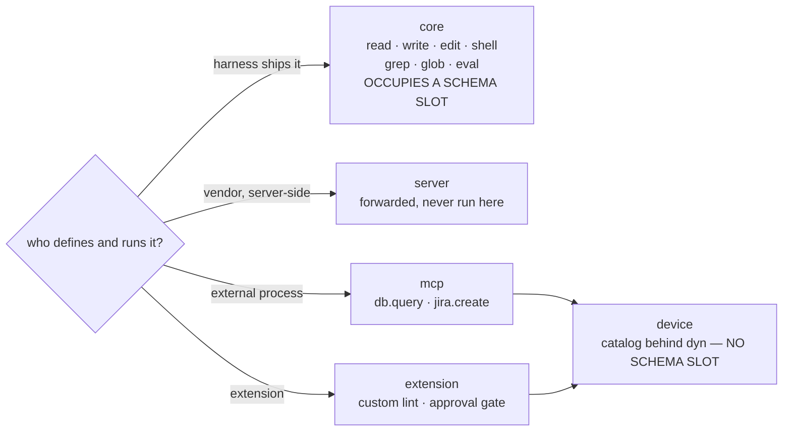

# Devices

> **Design document, not a runtime API guarantee.** This corpus includes proposed
> interfaces and historical implementation observations. See
> [implementation status](implementation-status.md) for current owners and known gaps.

Two decorators produce every extension capability in omp, and both land in one
catalog. `@omp.tool` is the ergonomic default: "agent, build me a tool"
produces one of these, and by default it ships as a **soft** device — a
catalog entry behind the `dyn` shell builtin, a tool-tree path, and zero model
schema slots. `@omp.device` is the advanced, device-aware export: the path-aware
form that owns its address and its tree placement — its `ToolPath`,
sub-tool subtrees, `family=`/`rev=`, `place=`, the full declaration surface.
Everything either decorator produces is a **device** in the sense this
document defines.

Revision 2 of this document opened: "`@omp.device` is the unit of
extensibility in omp. There is no other one." That sentence is superseded by
the Rev 2.1 rulings, and the reversal is recorded rather than edited away:
there are two decorators now, because one decorator forced every five-line
tool through the full path-aware declaration surface, and the pit of success
was on the wrong side of that surface. What survives unchanged is the claim
the sentence was protecting — one catalog, one transport, no third
registration path. `@omp.tool` is sugar over the same registry, not a
parallel mechanism, and `@streaming_device` keeps its name and its
not-in-v1 status.

## Purpose

An extension registers with the **host**, never with the **model**. The
distinction is the whole design. The host must know a device's name, schema,
revision, docs, and constraint requests — otherwise it could not serve
`dyn <name> --help` at all, and `RegisterTools` in
`crates/proto/proto/omp/toolhost/v1/toolhost.proto:61-64` is exactly that
host-facing declaration. What the *model* sees — under the default dynamic
tool policy, `auto` (the `tools.policy` setting owned in the reference
below) — is a tool array containing exactly the core harness tools plus any
**hard** tools this session has granted, and nothing else: no dedicated
transport slot, no per-extension schema by default, no MCP endpoint, no
dynamically discovered integration. Everything an extension exposes to the
model is a **device**, addressed by a path in one catalog and reached through
the `dyn` builtin inside the core `shell` tool:

| Model action | Meaning |
|---|---|
| `dyn` or `dyn --q <text>` | list the device catalog or search it; catalog filters also include `--tag`, `--provenance`, `--offset`, `--limit`, `--depth`, and `--under` |
| `dyn <path> --help` | full docs plus JSON args schema, worked examples, effects envelope, and schema-derived CLI usage |
| `dyn <path> [args…]` | dispatch; the CLI is mapped to one nested JSON argument document (`--json '<payload>'` supplies that object directly) |

Revision 2 routed all three actions through a device URL scheme riding the
core `read` and `write` tools. Revision 2.1 replaced that scheme with a
dedicated transport tool. Revision 2.2 supersedes both: the ruling is now the
`dyn` shell builtin, with no dedicated model tool and no transport envelope.
There is no read-URL alternative surface: journal, UI, and provenance
references to a device carry an [`omp.ToolPath`](#omptoolpath) plus provenance
chrome, never a URL.

This deletes the failure that made pi's tool slot the wrong unit of
extensibility. In pi, 111 of 194 catalogued extensions call `registerTool`
(`.plan/user-requests/2026-08-10-pi-extension-survey/catalog.md:8`), and every
one of those schemas is billed to every token of every turn — on Codex, TTFT
scales close to 1:1 with registered tool count, because each schema feeds the
grammar the sampler carries. Forty dormant MCP endpoints tax the turn where
they are never called. pi's mitigation was `loadMode: "essential" |
"discoverable"`, which solves the wrong variable: it shrinks the schema text
while leaving the slot, and Anthropic's variant — registering discovery itself
as a native tool — charges a prompt-cache miss for the privilege of *maybe*
loading something later.

omp's boundary is structural instead of a flag. If a capability must be in
every request, it is a core tool, versioned with the harness. If it must not,
it is a device. Extensions produce devices by default — zero new schema
slots, nothing new for a provider dialect to normalize, and availability
changes cost one system-notification item rather than a re-registration. The
one deliberate exception is narrow and priced: `@omp.tool(kind="hard")`
claims a model-facing schema slot, and the claim is manifest-declared,
consent-gated, budgeted per session, and audited — the reference section on
`@omp.tool` below owns every one of those gates. A soft tool costs nothing
until reached; a hard tool costs what a core tool costs, on purpose and on
the record.

Say it precisely, because the imprecise version invites the wrong design:
**registration is host-facing and always happens; advertisement is
model-facing and is decided by the dynamic tool policy — under the default
`auto`, it happens only for core tools and granted hard tools; devices ride
the `dyn` builtin inside `shell`.**
Revision 2 ended that sentence "never happens for a device"; the hard-tool
exception and the `tools.policy` modes are why the ending changed, and under
`auto` a soft device is still never advertised.

Devices also delete pi's second registration failure: silent
last-writer-wins. `packages/coding-agent/src/sdk.ts:2650-2652` resolves
extension tools with a bare `Map.set` in load order —

```typescript
for (const tool of wrappedExtensionTools) {
	toolRegistry.set(tool.name, tool);
	builtInRegistryToolNames.delete(tool.name);
}
```

— so two extensions claiming `write` produce whichever one loaded last, with no
warning and no way for either author to reason about it. The cost is visible in
the catalog and in the shipped source. `@heyhuynhgiabuu/pi-pretty` "takes
ownership of Pi's built-in `read`, `bash`, `ls`, `find`, and `grep` tool names
rather than merely decorating their existing renderers" (`catalog.md:120`) — and
its `dist/tools/read.js` does exactly that, claiming the name while borrowing
the incumbent's own description as a fallback:

```javascript
function registerReadTool(pi, cwd, _fffService, sdkTool, TextComp) {
	pi.registerTool({
		name: "read",
		label: "Read",
		description: sdkTool.description ?? "Read file contents",
		// …
	});
}
```

That is a decoration wearing a replacement's clothes: the intent is a nicer
renderer, the mechanism is total name capture, and the registry cannot tell the
difference. Meanwhile `pi-cc-extensions` "conditionally re-registers Pi's
built-in `write` tool [...] while avoiding a collision with an external
write-tool owner" (`catalog.md:131`). That avoidance
is hand-rolled load-order archaeology, and its author documented why, in
`pi-cc-extensions@0.8.61/extensions/renderer/index.ts`:

> 延迟到 `session_start` 注册 write override：加载阶段 `getAllTools` 不可用且其他扩展
> 尚未注册工具，无法检测外部 write 所有者（如 `pi-spark`），直接注册会与对方撞名。

*(Defer registering the write override to `session_start`: during load
`getAllTools` is unavailable and other extensions have not registered their
tools yet, so an external `write` owner — e.g. `pi-spark` — cannot be
detected, and registering directly would collide with them.)*

An extension author should not be writing that comment. In omp, ownership of a
name is declared with `precedence=`, resolved once at load, introspectable, and
a tie is a hard load failure naming both claimants.

## Concepts

### Where devices sit

There are four kinds of tool in an agent loop, and they are not equal.



Core tools are the harness skeleton: `read`, `edit`, `shell`, `grep`, `glob`,
`write`, and `eval` (`crates/app/src/envd/tools.rs:40-56`). They are registered
with the model, versioned with the harness, and the loop was designed around
them. `dyn` is a builtin of the embedded `shell`, not another registered tool
slot. Extensions cannot add to or remove from the core set — a hard tool
claims a slot *beside* it, never a place in it, and stays a device underneath:
core names remain prohibited to it, and it remains invocable through `dyn`.
Everything else becomes a device.

### The `dyn` path, end to end

```mermaid
sequenceDiagram
    participant M as Model
    participant S as Embedded shell
    participant R as device router (env)
    participant H as Extension host (Python)

    Note over M: turn opens; tool array = core tools (+ granted hard tools)
    M->>S: dyn --q grep
    S->>R: catalog read (target=CoreTool("shell"))
    R-->>M: catalog fragment (paths, badges, one line per device)
    M->>S: dyn fff_grep --help
    S->>R: docs read (target=CoreTool("shell"))
    R-->>M: docs + JSON schema + schema-derived CLI usage
    M->>S: dyn fff_grep --pattern "…"
    S->>R: InvokeTool (OPEN — nested JSON args relayed)
    R->>R: ARGS_FINALIZED — canonical requested args fixed
    R->>S: admission query — one tool_call, target=device
    Note over S: ADMISSION → ADMITTED (hook phases; Core answers)
    S->>R: ArgsCommitted (ASSISTANT_ITEM_COMMITTED)
    R->>R: EFFECTS_AUTHORIZED — scoped effect token issued
    R->>H: toolhost/v1 InvokeTool (final effective args only)
    H-->>R: Update* → Done(outcome)
    R-->>M: prompt(outcome, caps)
```

Four properties of that diagram are load-bearing:

1. **The catalog and the docs are catalog reads, not schema.** `dyn` listing,
   search, and help results are model-visible *content*, never request schema: they
   cost nothing when unused and are not part of the request prefix, so a
   device appearing or disappearing does not invalidate the prompt cache.
2. **Dispatch is one gate, and the gate binds the resolved target.**
   `dyn <path> [args…]` produces exactly one `tool_call` with
   `target=DeviceCall(path, family, rev, decoded_args)` — the *resolved*
   device, carrying *decoded* arguments — never a `shell` gate followed by a
   device gate. Double-gating would double-prompt the user for one action,
   and gating the builtin instead of the target would let a policy author
   gate the transport while believing they had gated the capability; a guard
   on the resolved device cannot be bypassed by the builtin, because the
   builtin is never the dispatch policy subject.

   The gate is the environment's per-invocation admission query, emitted
   between `InvokeTool` and `ArgsCommitted` — that wire mechanism is
   unchanged. Agent Core is what answers it: Core runs the per-invocation
   decision procedure, the hook phases of
   [docs/py/05-hooks.md](05-hooks.md), while the environment owns the gate
   and the enforcement.

   **Resolved (2026-08-20 R-invoke ruling):** host-placed composition uses the
   async `omp.devices.invoke(path: str, args: Mapping[str, object], *,
   deadline: omp.Duration | None = None) -> object` surface. The CONTROL host
   arm opens a fresh ordinary device invocation and its DATA dispatch: every
   inner call receives its own admission and policy decision, and inherits no
   ambient authority from the parent invocation. The surface is legal only
   from `place="host"`; the host rejects calls from `place="env"` and
   `worker:<name>` placements. The worker re-entrancy prohibition remains
   unchanged ([docs/py/04-placement.md](04-placement.md),
   [docs/py/11-env.md](11-env.md)).

   An earlier revision of this passage called Agent
   Core "a pure courier"; that is retracted here rather than silently
   edited, because it over-read D6. `PLAN.md` §D6 (D6, *One
   mailbox, no gate chain*) is explicit that a tool batch "runs concurrently
   exactly as the model issued it: no batch-level admission scheduler, no
   parallelism detection, no reordering" — which prohibits batch-level
   admission *scheduling* in the mailbox loop, not the per-invocation
   decision procedure itself. The D6 wording amendment this document
   previously flagged for the .plan owner has been made: D6 as amended
   2026-08-19 states that each invocation gates independently — "the
   environment asks a per-invocation admission query, and Core answers it by
   running the hook phase procedure" — and that the prohibition on approval
   prompts "binds the batch dispatch path, not the per-invocation decision
   procedure" (`PLAN.md` §D6). This document now cites the
   ratified text rather than recommending it. The invariant D6
   protects survives verbatim: each invocation gates independently, and one
   slow approval never serializes the batch. The still-earlier draft that
   described a priority-band chain resolved inside the loop remains wrong
   and remains retracted. The event and its `target` union are defined in
   [docs/py/05-hooks.md](05-hooks.md); the admission query and its D6
   framing in [docs/py/06-policy.md](06-policy.md); the seven-state
   `omp.InvocationPhase` machine in [docs/py/03-params.md](03-params.md).

   The payoff of the split is unchanged: the environment is where
   enforcement already had to live, so the gate and the enforcement cannot
   drift apart — and Core, which sees every extension's hooks, is the one
   place the decision procedure can run without handing any extension a veto
   over another.
3. **Only final effective arguments reach Python.** The speculative
   argument-streaming phase belongs to the core `write` tool; the device body
   receives one complete, policy-approved effective argument object, and only
   at `EFFECTS_AUTHORIZED`. `env/v1` already carries `ArgText` and
   `ArgsCommitted` in its invocation union, and `toolhost/v1` states the
   invariant explicitly: "Python workers receive only committed args;
   speculative `ArgText` never crosses this boundary"
   (`crates/proto/proto/omp/toolhost/v1/toolhost.proto:66-67`). That is a
   deliberate boundary, not an oversight — a device that wants to act during
   argument streaming is asking to be a core tool, and in v1 the answer is
   no. The invocation machine, and `IncomingParams` — the streaming-pull
   surface, re-scoped to core internals plus the future
   `@streaming_device` — are in [docs/py/03-params.md](03-params.md);
   the body contract itself is in the body-contract section below.
4. **Constraint requests are already intents on the wire.** A declaration
   carries `ToolConstraint`, whose `SchemaConstraint { uint32 priority }` and
   `GrammarConstraint { syntax, definition, priority }` exist precisely so that
   "the host lowers it against the selected inference route rather than
   silently discarding unsupported forms"
   (`crates/proto/proto/omp/toolhost/v1/toolhost.proto:27-50`). `intents=` on
   `@omp.device` is the Python spelling of that field, not a parallel
   mechanism. Values and budget arbitration:
   [docs/py/13-inference.md](13-inference.md).

### One body contract, and nothing before authorization

Revision 1 of this docset described two different device products. This
document said a device receives one complete, committed JSON object;
[docs/py/03-params.md](03-params.md) said every device is an async generator
that starts while arguments are still streaming, pulls values as delimiters
arrive, opens document leases, and waits for commitment; examples elsewhere
mixed a third shape. The review called this out, correctly, and the
resolution is recorded rather than silently converged: this document's shape
won. The v1 public contract — the **only** third-party device shape — is:

```python
@omp.device(...)
async def device(args: Args, ctx: omp.Context) -> Payload | Fault | AsyncIterator[Update | Done]: ...
```

Three clauses, each deliberate:

- **`args` are final.** The body receives the policy-approved *effective*
  arguments — after charitable decoding, after every accepted transform,
  after admission: the same canonical object policy evaluated, the journal
  records, and telemetry measures. The body does not start until
  `EFFECTS_AUTHORIZED` in the `omp.InvocationPhase` machine
  ([docs/py/03-params.md](03-params.md) owns it); no third-party device
  executes from speculative fragments in v1.
- **Returning is the whole protocol.** `Payload` for one-shot success; a
  `Fault` value for a domain failure the device can describe
  ([docs/py/02-verdicts.md](02-verdicts.md)); or an async iterator of
  `Update` events fused by one `Done` for progressive *output*. Output
  streaming is in v1. Input streaming is not — a distinction Revision 1
  left implicit and this revision states.
- **Protocol selection is only by decorator.** `@omp.device` is this
  contract; `@streaming_device` is the other one — named, specified in
  the reference below, and not in v1. The active protocol is never inferred
  from a return annotation, an omitted `parts`, or a manifest subtlety: the
  difference decides *when extension code may run*, which is too
  load-bearing to infer.

And the rule that makes the phase gate worth having: **extension code never
touches DATA before admission** — and in v1 never before
`EFFECTS_AUTHORIZED`, since the body does not exist earlier. Both bounds are
stated because they will differ the day speculative preparation exists. The
rationale is confidentiality, not tidiness: "world untouched" is the wrong
test for a read. A speculative body that opened `secret.txt` and was then
denied has mutated nothing — and has still leaked the content to an
untrusted extension; and if a later policy transform redirected `path` to
`safe.txt`, the body's local variables and its lease could not be
retroactively rewritten. So policy transformation completes before extension
execution, always. If latency someday justifies speculative preparation, the
facility is a **prepare token** — future work, with one invariant fixed now:
a prepare token is issued only after read/confidentiality policy has
approved the requested resources, and the later effect token may authorize a
*subset* of the prepared plan but may never change the identity of resources
already read.

### Identity: `family@rev`

Every device carries a stable name plus a revision, exactly as core tools do:
`ToolIdentity { name, rev }` over `Rev { family, n }`
(`crates/tool/src/lib.rs:49-75`). The rendered form is `name@family.n` —
`fff_grep@idx.3` — and where `family` is empty it degrades to `name@n`
(`crates/tool/src/lib.rs:58-66`).

The revision never rides the wire. The model sees the path `fff_grep`. The rev
travels with the call into the journal, the transcript, and every metric, under
the namespaced thread-item property `omp/tool-rev`
(`crates/tool/src/lib.rs:46`). This is what makes accumulated sessions
queryable and what makes `lift()` possible; see
[docs/py/02-verdicts.md](02-verdicts.md).

`rev` is a *semantic* revision: it moves only when the argument shape or the
outcome shape changes decode compatibility, because those are the only
changes `lift()` has to know about. The exact build of a device — its docs,
its prompt projection, its renderer, its code — is identified by the
`artifact_digest` that [docs/py/02-verdicts.md](02-verdicts.md) defines
alongside `schema_rev`, and per-build metrics key on the digest, never the
rev. Revision 1 of this document required a `rev` bump for docs-only edits;
that was wrong — it forced a choice between revision churn and authors
trained not to bump — and the digest split is what replaces it.

### Availability is a notification, not a re-registration

pi's dynamic tool control is `getActiveTools` / `setActiveTools` /
`unregisterTool` — used 45, 42, and fewer times respectively across the catalog
(`catalog.md:13`). Every one of those calls mutates the array the model sees,
and MCP made it worse: pi sorts MCP tools alphabetically purely so that
background connections do not shift the array and shatter Anthropic's cache
breakpoints (`.plan/feature-map/mcp.md:95`).

omp has none of those calls. The request's tool array is byte-stable across
every availability change, because devices were never in it. A device becoming
available, unavailable, or shadowed appends exactly one system thread item
naming the delta, built on the same mechanism that already delivers job
settlements (`crates/agent/src/jobs.rs:341-350`,
`crates/agent/src/mailbox.rs:64-71`). The model reads the notice, and runs
`dyn` if it wants the new catalog.

This is the ratified redesign in the port tree:
`.plan/feature-map/ROADMAP.md:901` — "background connects with dynamic
tool-list updates, embedder change callback **⚠ redesign: device-tool listing,
not live registry mutation**" — and `:905` — "stable alphabetical tool ordering
for prompt-cache safety **⚠ redesign: moot under single device tool**".

### Namespacing and ordered precedence

A device name is a flat token in one session-wide namespace shared with core
tools. There is no `mcp__<server>_<tool>` mangling
(`.plan/feature-map/mcp.md:149`) because there is no wire name to sanitize —
device names appear only in tool-tree paths and in docs.

Collisions resolve by declared precedence, never by load order:

```
CORE (1000) → INTEGRATION (700) → ENHANCEMENT (500) → DEFAULT (0) → FALLBACK (-500)
```

- The highest-precedence *device* claimant of a name is **live**.
  `dyn` lists it; `dyn <name> [args…]` dispatches to it.
- Lower claimants are **shadowed**, not discarded. A shadowed device stays
  reachable at its claimant-qualified path — `grep@ff-labs/fff`, the
  `(publisher, extension)` identity of
  [docs/py/14-deploy.md](14-deploy.md) — so an extension can layer without
  deleting, and a user can diagnose without uninstalling. Revision 1
  qualified a shadowed device by schema revision, `grep@idx.3`. That was
  wrong: it conflated the implementation claimant (an extension, which is
  what shadowing is about) with the schema revision (a decode-compatibility
  axis), and it implied an older revision is dispatchable when older
  revisions are lift-only — history written by them projects forward through
  `lift()` ([docs/py/02-verdicts.md](02-verdicts.md)); they never execute
  again. A shadowed *implementation* is addressable; a superseded *revision*
  is not.
- **Equal precedence for the same name is a load error**, `PrecedenceConflict`,
  naming both claimant keys and the source package. This is the deliberate
  opposite of `Map.set`: ambiguity fails loudly at load rather than silently at
  the first call.
- A device can **never** claim a core tool name at or above
  `Precedence.CORE`. There is no manifest grant, no trust tier, and no flag
  that permits it: the claim is a `DeviceNameError` at load. Revision 1
  allowed exactly this — "claiming a core tool name requires `replaces=`
  naming it explicitly and a precedence above `Precedence.CORE`, which the
  manifest must grant" — and that was wrong twice over. A device lives in the
  catalog behind `dyn` and occupies no schema slot, so it *cannot* replace the
  model-facing core tool; a grant that pretends otherwise grants an
  incoherence. And the intent behind such a claim is almost always
  pi-pretty's: a nicer presentation wearing total name capture as its
  mechanism. The sanctioned mechanisms say what they mean — renderer
  decoration keyed by `(name, rev)`
  ([docs/py/02-verdicts.md](02-verdicts.md)) for presentation, and a
  core-tool adapter — a harness-owned, reviewed extension point on the core
  tool itself — for behaviour. What `replaces=` naming a core tool *does*
  mean is a sub-CORE transport claim: core tools hold their names at
  `Precedence.CORE` but are never dispatched through `dyn` — they have
  slots — so the highest device claimant below CORE is what the device path
  `grep` addresses, while the   model-facing `grep` remains exactly the core
  tool.

**Resolved (2026-08-20 ruling):** cross-claimant live-winner, qualified-shadow, and
hidden-catalog arbitration is core-registry-owned (`crates/tool`, `Claim` /
`PrecedenceTie` per `PLAN.md:252`). The frozen Python registry holds one extension identity
and enforces only intra-extension claims. Its public error spelling remains
`PrecedenceConflict`, naming both claimant keys and the source package.

**Resolved (2026-08-20 ruling):** the sanctioned presentation spelling is
`@omp.renderer("grep", decorates=True)`. A decoration registration records that mode in
the frozen renderer snapshot; its fold returns augmentation TML, and the host composes it
after the winning base render. It does not claim or replace the core tool, and extensions
never perform composition or cache invalidation themselves. The presentation cache and
per-verdict-state purity contract are specified in
[docs/py/07-ui.md](07-ui.md#413-renderers).

## Reference

Everything below is importable from `omp`.

### `@omp.device`

```python
def device(
    name: str | None = None,
    *,
    family: str = "",
    rev: int = 1,
    place: str = "host",
    summary: str | None = None,
    docs: str | os.PathLike[str] | None = None,
    schema: type | dict[str, object] | None = None,
    examples: Sequence[Example] = (),
    available: Callable[[], bool | Availability] | None = None,
    precedence: int = Precedence.DEFAULT,
    replaces: str | None = None,
    intents: Sequence[Intent] = (),
    effects: Effects | None = None,
    tier: Tier = Tier.WRITE,
    deadline: Duration | None = None,
    aliases: Mapping[str, str] | None = None,
) -> Callable[[DeviceBody], Device]: ...
```

Declares one device revision. The decorated callable is the device **body**;
the decorator returns a [`Device`](#ompdevice) handle, and the body remains
directly callable from Python so a device can be unit-tested without a running
session. The body's signature and return union are the single v1 contract
defined under "One body contract" above.

Channel: CONTROL, at load. Latency class: per-session — declaration happens
once during activation and never again. Failure: **fail-closed at load** — a
malformed declaration aborts activation of its extension with a structured
error; a session never runs with a half-registered device set.

**Arguments**

- `name` — the model-facing token, the head of the device's
  [`ToolPath`](#omptoolpath). Defaults to the body's
  `__name__` with a leading underscore stripped. Must match
  `^[a-z][a-z0-9_]{0,63}$`; anything else raises `DeviceNameError`. Rejecting
  uppercase and punctuation is deliberate: the name lands in tree paths, in
  prompt text, and in metric labels, and case-folding surprises there are
  permanent.
- `family` — the argument-dialect family, mapped onto `Rev.family`
  (`crates/tool/src/lib.rs:52-53`). Empty means "this device has one dialect".
  Use a family when you intend to ship a second incompatible argument shape for
  the same capability — `hl` and `rep` for hashline vs replace-based editing —
  and keep both liftable.
- `rev` — the monotonic *semantic* revision inside `family`, mapped onto
  `Rev.n`, a `u16`. Bump it when the argument shape or the outcome shape
  changes — the changes `lift()` must know about — and for nothing else;
  docs, projections, and renderers are identified by the build's
  `artifact_digest` per the split recorded under Identity above and owned by
  [docs/py/02-verdicts.md](02-verdicts.md). Two
  declarations with the same `(name, family, rev)` are a `SchemaError`; the
  registry refuses duplicate revisions outright
  (`crates/tool/src/registry.rs:401-403`).
- `place` — `"host"`, `"env"`, or `"worker:<name>"`. Defaults to `"host"`. The
  meaning of each value, worker lifecycle, and the boundary rules belong to
  [docs/py/04-placement.md](04-placement.md); this document only guarantees
  that a device's `place` does not change how the model reaches it.
- `summary` — the one-line catalog entry shown by `dyn`. Defaults to the
  first non-empty line of the docs. Rendered with control characters and
  Unicode line/paragraph separators collapsed to spaces, then bounded in UTF-8
  **bytes** on a code-point boundary. Devices declared by third-party
  integrations (MCP endpoints, in particular) are additionally bounded to
  `devices.EXTERNAL_SUMMARY_CAP`; their full docs stay readable on demand.
- `docs` — the model-facing documentation body. A `str` is used verbatim. A
  path is resolved against the extension root through the source layer
  described in [docs/py/14-deploy.md](14-deploy.md), which matters because an
  extension declared by a remote workspace has no local file. Omitted, the docs
  are the body's `__doc__`. Docs are rendered once at declaration and cached
  per `(name, rev)`; a read never re-renders.
- `schema` — the argument shape. Given a `dict`, it is used as a complete JSON
  Schema. Given a type — a dataclass, a `TypedDict`, or a `NamedTuple` — the
  schema is derived from its annotations, with field descriptions taken from
  `typing.Annotated` metadata (`Annotated[str, omp.Field("File to lint.")]`),
  from dataclass `field(metadata=...)`, or from an explicit `omp.Field(...)`
  default — the decoding pipeline that consumes them belongs to
  [docs/py/03-params.md](03-params.md). Revision 1 said descriptions came
  from "field docstrings"; that was wrong — CPython does not reliably retain
  a bare string expression under a field, so a schema derived from one would
  silently lose its descriptions. Omitted, the schema is derived from the
  annotation of the body's `args` parameter. Derivation targets exactly the
  shape `omp_tool::schema::<T>()` produces for core tools
  (`crates/tool/src/lib.rs:29-44`): draft 2020-12, subschemas inlined, no
  `$schema`, no `title`, generated for deserialization. Anything undecidable —
  a bare `object`, an un-annotated field — raises `SchemaError` at load rather
  than producing a schema the model cannot satisfy.
- `examples` — a sequence of [`Example`](#ompexample). Examples are rendered
  into `dyn <device> --help` and, critically, into the schema echo a malformed
  dispatch returns. A schema alone trains nothing; a schema plus a worked
  example trains the retry.
- `available` — a zero-argument predicate returning `bool` or
  [`Availability`](#ompavailability). Evaluated once at declaration and again on
  every `omp.devices.refresh()`. **Never** evaluated per turn, per call, or per
  keystroke: an availability predicate that needs to run that often is
  describing a policy hook, and belongs in
  [docs/py/05-hooks.md](05-hooks.md). Raising inside the predicate is treated
  as unavailable, with the traceback journaled.
- `precedence` — an `int`, conventionally one of the
  [`Precedence`](#ompprecedence) constants. Governs name ownership as described
  above.
- `replaces` — the name this device intends to shadow. Required to claim any
  name already claimed at load; without it, a second claimant is a
  `PrecedenceConflict` even at a different precedence, because silently
  shadowing something you did not name is how pi's collisions happened.
  `replaces` may name a core tool only as the sub-CORE transport claim
  described under precedence above; at or above `Precedence.CORE` it is a
  `DeviceNameError`.
- `intents` — a sequence of `omp.Intent` values requesting harness-level
  inference behavior. The device declares a *preference with a priority*; the
  harness, which is the only party that can see every declaration, spends a
  budget by priority and returns receipts. Values, strengths, constructors, and
  budget resolution are defined in
  [docs/py/13-inference.md](13-inference.md). Two consequences are specific to
  devices and stated here: a device has **no wire schema**, so
  `intent.strict(...)` and `intent.grammar(...)` cannot constrain sampling of
  its arguments and resolve to a recorded `Adjustment` with reason
  `device.dyn-transport` — a normal receipt, not an error;
  `intent.force_call(...)` and the request-shaping intents are unaffected,
  because they act on the turn rather than on a schema slot.
- `effects` — the device's maximum declared effect envelope, an
  [`omp.Effects`](#ompeffects). Hooks may narrow it per invocation; nothing
  may widen it; escalation beyond it fails inside the call rather than
  re-prompting the user. Omitted, the device is bounded only by its `tier`,
  which approves coarsely — declaring an envelope is what buys one approval
  per logical action. Semantics under [`omp.Effects`](#ompeffects).
- `tier` — the approval tier the dispatch is gated at. Values and their
  semantics belong to [docs/py/06-policy.md](06-policy.md). Declared on the
  device rather than inferred from `place`, because where code runs says
  nothing about what it touches. `tier` is the coarse approval default; what
  the device may actually touch is its `effects` envelope.
- `deadline` — the invocation deadline, an `omp.Duration`
  (`omp.Duration("90s")`; configuration strings such as `500ms`, `30s`, and
  `10m` parse into it). Omitted, the loop's default applies. The deadline is
  the loop's, not the device's: blowing it drops the invocation guard and the
  resource owner reclaims whatever escaped. A device cannot extend its own
  deadline, and there is no `interruptible` flag — cancellation is
  structural. See [docs/py/03-params.md](03-params.md).
- `aliases` — a mapping from argument names models actually emit to the names
  this device declares: `{"file_path": "path"}`. Applied by the tolerant
  decoder before validation. Alias tables are data about model behaviour, not
  accidents, and belong on the device that knows them.

**Raises** — `DeviceNameError`, `SchemaError`, `PrecedenceConflict`,
`DocsBudgetError`, all at load.

```python
import omp
from dataclasses import dataclass
from typing import Annotated


@dataclass(slots=True)
class LintArgs:
    """Arguments for one workspace lint sweep."""

    path: Annotated[str, omp.Field("File, directory, or glob to lint.")]
    fix: Annotated[bool, omp.Field("Apply mechanical fixes instead of only reporting.")] = False


@omp.device(
    "house_lint",
    family="v",
    rev=2,
    place="env",
    summary="Lint the workspace against house rules; optionally auto-fix.",
    schema=LintArgs,
    examples=[
        omp.Example({"path": "crates/tool/src"}, note="report only"),
        omp.Example({"path": "crates/tool/src", "fix": True}, note="apply fixes"),
    ],
    effects=omp.Effects(
        documents=omp.DocEffects(read=True, write_globs=("**",)),
        exec=omp.ExecEffects(commands=("ruff",), network=False),
    ),
    tier=omp.Tier.WRITE,
    deadline=omp.Duration("90s"),
    aliases={"file_path": "path", "target": "path"},
)
async def house_lint(args: LintArgs, ctx: omp.Context) -> omp.Payload:
    """
    Enforce the repository's house rules over `path`.

    Reports one finding per violated rule with its exact location. With
    `fix: true`, mechanical fixes are applied through document leases so a
    concurrent edit becomes a structured conflict rather than a lost write.
    """
    ...
```

### `@omp.tool`

```python
def tool(
    name: str | None = None,
    *,
    kind: str = "soft",
    effects: Effects | None = None,
    tier: Tier | None = None,
    rev: int = 1,
) -> Callable[[DeviceBody], Device]: ...
```

New in Rev 2.1, and the ergonomic default: "agent, build me a tool" produces
one of these. Usable bare (`@omp.tool`) or with arguments; either way it
returns the same [`Device`](#ompdevice) handle `@omp.device` returns, because
it is sugar over the same registry — one catalog, one transport, no parallel
mechanism. The division of labour with `@omp.device` is path awareness:
`@omp.tool` never sees its own address. Everything positional about a device —
its `ToolPath` placement, sub-tool subtrees, `family=`/`rev=` dialects, `place=`,
`intents=`, `schema=`, `available=`, precedence and shadowing — belongs to
`@omp.device`, the advanced export. `@omp.tool` deliberately has none of it:

- **Name** defaults to the function name, under the same
  `^[a-z][a-z0-9_]{0,63}$` grammar and the same `DeviceNameError` rules as
  `@omp.device`.
- **Schema is inferred from the typed signature.** The body's parameters *are*
  the arguments — `Annotated[str, omp.Field("…")]` metadata becomes field
  descriptions, defaults become optional fields — and the decorator lowers
  them into exactly the derived-schema pipeline `@omp.device` uses, then
  registers the one v1 body contract underneath (`(args, ctx)`; the "One body
  contract" section above is not a second contract short). A parameter named
  `ctx` annotated `omp.Context` is injected, not part of the schema.
- **Family auto-derives from the extension id**, so `lift()` and the journal
  identity work without the author naming a dialect. An explicit `family=` is
  the signal you wanted `@omp.device`.
- **`place` is always `"host"`.** Anything fancier — `"env"`,
  `"worker:<name>"` — is a placement decision, and placement is path-aware
  work: use `@omp.device`.
- **Always a leaf.** No sub-tools; subtrees are declared through the
  `@omp.device` handle's `subtool` (see [`omp.Device`](#ompdevice)).
- `effects`, `tier`, and `rev` mean exactly what they mean on `@omp.device`.

**Soft and hard.** `kind` selects between the two vocabulary words this
docset uses from here on — and it states **intent, never surface**. The
declaration says what the author wants; the harness decides what the model
sees, under the session's [dynamic tool policy](#the-dynamic-tool-policy-toolspolicy)
below. The descriptions here are the surfaces under the default policy,
`auto`:

- `kind="soft"` (the default): a **soft tool** *is* a device. It ships as a
  catalog entry behind `dyn` with its own path, and claims zero
  model-facing schema slots. This is the pit of success: the cheap thing is
  what the bare decorator does.
- `kind="hard"`: a **hard tool** declares the intent to claim a model-facing
  schema slot — its schema riding in the request tool array beside the core
  tools. Under `auto` the claim is honored only when priced and gated, every
  gate explicit:
  - the manifest entry must declare `kind = "hard"`
    ([docs/py/14-deploy.md](14-deploy.md) owns the `[[tools]]` schema);
  - the install grant must carry the `tools.hard` capability, and the
    capability digest lists each hard slot claim **by name**, so adding or
    widening a hard claim re-prompts user consent while a patch upgrade does
    not ([docs/py/14-deploy.md](14-deploy.md));
  - a per-session hard-slot budget (`devices.HARD_SLOT_BUDGET`) bounds how
    many granted hard tools are advertised at once;
  - core tool names remain prohibited, with no grant that permits them — the
    Rev 2 core-name correction (smaller #4) applies to hard tools unchanged;
  - a granted hard tool participates in `slot_hash()`, the prompt-cache
    identity, as any slotted tool must.

  A hard tool **remains in the device catalog and remains path-addressable**:
  `dyn <name> [args…]` dispatches to it exactly as to any soft device. That is deliberate — a demoted hard tool (a session declining the
  grant, the budget excluding it, or a `device_only` policy) never breaks a
  caller, because every caller path that worked without the slot still works.

`kind` exists on `@omp.tool` **only**. Neither `@omp.device` nor
`@streaming_device` accepts it — an `@omp.device` declaration carries
implicit soft intent, always. The slot claim is the one costly thing in this
design, and it is confined to the decorator whose whole surface is auditable
at a glance. If a path-aware device deserves a slot, that is a core tool by
pull request, per the promotion rule in Architectural choices below.

**Raises** — the same load-time table as `@omp.device` (`DeviceNameError`,
`SchemaError`, `DocsBudgetError`). A `kind="hard"` declaration whose manifest entry does not say
`kind = "hard"` is a fail-closed activation error from
[docs/py/14-deploy.md](14-deploy.md) — the manifest and the code must agree.
A *granted-but-unbudgeted* or *ungranted* hard tool is not an error: it is
demoted to a device, per the dynamic tool policy below.

The worked example is the point, so here it is verbatim — the code an agent
generates from "build me a lint tool", with nothing else required:

```python
import omp
from typing import Annotated


@omp.tool
async def house_lint(
    path: Annotated[str, omp.Field("File, directory, or glob to lint.")],
    fix: Annotated[bool, omp.Field("Apply mechanical fixes instead of only reporting.")] = False,
) -> omp.Payload:
    """
    Enforce the repository's house rules over `path`.

    Reports one finding per violated rule with its exact location. With
    `fix: true`, mechanical fixes are applied through document leases.
    """
    ...
```

That declaration mounts `house_lint` as a soft device — under the default
`auto` policy (next section): discoverable via `dyn --q lint`, documented via
`dyn house_lint --help`, dispatched via
`dyn house_lint crates/tool/src` — and absent from every request's tool array. Compare the full `@omp.device` spelling of
the same capability above: every argument that example passes is one this
decorator inferred or refused to offer.

### The dynamic tool policy (`tools.policy`)

Declarations state intent; the **dynamic tool policy** decides surface. It is
a user/org setting named `tools.policy` — never something an extension can
read, set, or condition on — with three values:

| Value | Meaning |
|---|---|
| `auto` (default) | the default surface is device; a declaration's `hard` intent is honored when its gates pass (`tools.hard` consent, per-claim digest, `devices.HARD_SLOT_BUDGET`) |
| `device_only` | every non-core declaration surfaces as a device; `hard` intent is demoted to a device, no extension ever gets a slot, and `tools.hard` grants are inert |
| `tool_only` | the `dyn` builtin is dropped; every declaration, soft and hard, `@omp.tool` and `@omp.device` alike, surfaces as a model-facing tool slot |

The full resolution, intent × mode → surface:

| Declaration | `auto` | `device_only` | `tool_only` |
|---|---|---|---|
| `@omp.tool(kind="soft")` | device behind `dyn` | device | slot |
| `@omp.tool(kind="hard")` | slot when granted and budgeted, else device | device (grants inert) | slot |
| `@omp.device` (implicit soft) | device | device | slot |

`tool_only` is the user explicitly buying the prompt-cache and TTFT cost this
document's Purpose section prices: every schema rides every request,
discovery is the tool array itself, and `slot_hash()` covers the whole set —
the cache-stability invariant holds trivially because there is no
out-of-array mounting left to protect. Consent framing follows: per-claim
`tools.hard` consent applies in `auto`; `tool_only` is itself the global
consent, so per-claim prompts are subsumed.

**Sub-tool paths under `tool_only`.** A slot name is flat, so subtree paths
flatten deterministically: `/` becomes `_`, and `jira/create` surfaces as the
slot `jira_create`. A flattened name that collides with any other extension
slot name — another flattened path or a leaf device — is an activation
error naming both claimants, fail-closed like every other load-time
collision in this document. The one exception is the legitimate sub-CORE
transport claim on a core name (the `replaces=` mechanism above): under
`tool_only` it cannot surface — the core tool keeps its slot and there is no
`dyn` device surface to fall back to — so it is unmounted with one notification naming
the mode, never a brick. The `ToolPath` `jira/create` remains the journal
and policy identity in every mode; the flattened spelling is
advertisement-only.

**Extension code is oblivious to the mode.** The body contract, the gate on
the resolved target, journaling, and `omp.CallOutcome` are identical in all
three modes; only advertisement and the dispatch transport differ. A policy
hook written against `DeviceCall(path, ...)` fires identically whether the
call arrived through `dyn` or through a direct slot call under `tool_only` —
the builtin is never the dispatch policy subject, in any mode. An extension cannot detect the mode, and a device that behaves
differently per surface has no API through which to try.

### `omp.Effects`

```python
@dataclass(frozen=True, slots=True)
class Effects:
    documents: DocEffects | None = None
    exec: ExecEffects | None = None
    inference: InferenceEffects | None = None
    subagents: int = 0


@dataclass(frozen=True, slots=True)
class DocEffects:
    read: bool = False
    write_globs: tuple[str, ...] = ()


@dataclass(frozen=True, slots=True)
class ExecEffects:
    commands: tuple[str, ...] = ()
    network: bool = False


@dataclass(frozen=True, slots=True)
class InferenceEffects:
    max_requests: int = 0
    max_usd: float = 0.0
```

A device's maximum declared effect envelope: the static answer to "what can
this call do to me", written where policy can read it before anything runs.
`tier` approves coarsely; the envelope says which documents may be read,
which globs may be written, which commands may run, whether the network is
reachable, how much inference may be spent, and how many subagents may be
spawned. A policy hook deciding whether to admit `house_lint` reasons over
`DocEffects(read=True, write_globs=("**",))` and `commands=("ruff",)` — a
useful, static subject — instead of inferring what a black-box device might
eventually do from its name and arbitrary JSON arguments.

The lifecycle is fixed and has exactly one prompt in it:

1. The device declares its maximum envelope, here, at load.
2. During admission, hooks may **narrow** the envelope for one invocation —
   never widen it ([docs/py/05-hooks.md](05-hooks.md)).
3. Core issues a scoped capability token for the narrowed envelope at
   `EFFECTS_AUTHORIZED`.
4. The Environment enforces the token on every DATA call **without
   re-prompting** — enforcement and the token belong to
   [docs/py/06-policy.md](06-policy.md) and
   [docs/py/11-env.md](11-env.md).

One approval per logical action, and escalation **fails rather than
re-prompts**: a "read" device that tries to open a network socket gets a
structured denial inside its own call, never a second surprise dialog. The
second dialog is how approval fatigue gets trained, and approval fatigue is
a security defect, not a UX blemish.

### `@streaming_device` — named, specified, not in v1

```python
@streaming_device(...)
async def device(params: IncomingParams, ctx: omp.Context) -> AsyncIterator[Ev]: ...
```

The second protocol, and deliberately not a variant of the first: a
streaming device pulls argument values through `IncomingParams` while the
model is still emitting them — the surface
[docs/py/03-params.md](03-params.md) documents in full and scopes to core
internals plus this facility. It exists in the design so that the name, the
shape, and the boundary are fixed *now*, before anyone needs them; it does
not exist in v1, and no third-party device executes from speculative
fragments until it ships. Shipping it is gated on the prepare-token
machinery described under the body contract, because a body that runs before
`EFFECTS_AUTHORIZED` needs an authority model for what it may read.
Selection between the two protocols is only ever the decorator name.

### `omp.Device`

The handle `@omp.device` returns. Devices are declared once and mutated only
through this handle; there is no global registry mutation API.

| Member | Type | Meaning |
|---|---|---|
| `name` | `str` | model-facing token |
| `family` | `str` | dialect family |
| `rev` | `int` | revision inside `family` |
| `identity` | `str` | rendered `name@family.rev` — the schema identity, for the journal and `lift()` |
| `claimant` | `str` | `publisher/extension` of the declaring extension |
| `path` | `ToolPath` | `name` (or `name/sub`) for the live claimant, `name@publisher/extension` otherwise |
| `place` | `str` | as declared |
| `precedence` | `int` | as declared |
| `enabled` | `bool` | read/write; assignment is equivalent to `enable()` / `disable()` |
| `mounted` | `bool` | read-only; `enabled` **and** `available` **and** live |
| `shadows` | `tuple[str, ...]` | claimant identities this device shadows, highest first |
| `shadowed_by` | `str \| None` | claimant identity currently shadowing this device |
| `schema` | `dict[str, object]` | the derived or supplied JSON Schema |
| `docs` | `str` | the rendered docs body |

Methods:

- `enable() -> None` / `disable(reason: str | None = None) -> None` — flip
  mountedness. CONTROL, per-event, fail-open: a failed effect leaves the prior
  state and journals the failure. Each transition that changes the mounted set
  emits one system-notification item; a no-op transition emits nothing.
- `__call__(*args, **kwargs)` — invokes the body directly, in-process, with no
  gate, no journal entry, and no notification. For tests and for one device
  composing another inside the same extension.
- `subtool(path: str, **overrides) -> Callable[[DeviceBody], Device]` —
  declare a leaf under this device's path. `path` may contain multiple
  segments. The declarator returned by `omp.device(...)` doubles as the
  subtree handle:

  ```python
  dev = omp.device("jira", tier=omp.Tier.WRITE)


  @dev.subtool(
      "issue/create",
      place=omp.Place.HOST,
      effects=omp.Effects(),
      summary="Create a Jira issue.",
  )
  async def create(
      project: Annotated[str, omp.Field(description="Project key.")],
      ctx: omp.Context,
  ) -> omp.Payload: ...
  ```

  This registers `jira/issue/create`, dispatched as
  `dyn jira/issue/create [args…]`, documented via
  `dyn jira/issue/create --help`, and listed under the `jira` node of the
  device catalog. Each leaf's schema and `omp.Field` argument metadata
  are derived from its handler signature by the ordinary device declaration
  extractor. The accepted overrides are `family`, `place`, `precedence`,
  `tier`, `effects`, `docs`, and `summary`; each property inherits the
  parent's value when omitted. Sub-trees are an `@omp.device` affordance
  only — `@omp.tool` is always a leaf.
- `mount(router: omp.Router) -> tuple[Device, ...]` — register all routes
  previously declared on a standalone router. `omp.router(prefix)` creates a
  mountable router without requiring the parent to exist in the same module:

  ```python
  issues = omp.router("issue")


  @issues.subtool("list", summary="List Jira issues.")
  async def list_issues(args: ListArgs, ctx: omp.Context) -> omp.Payload: ...


  dev.mount(issues)  # registers jira/issue/list
  ```

  Router route paths may also contain multiple segments. Their overrides and
  inheritance are identical to `Device.subtool`; the parent and router
  prefixes are concatenated only when mounted. Routes must be mounted during
  declaration import; mounting after FREEZE raises `DeclarationSealed`.

**Resolved (2026-08-20 ruling):** `Device` is the router. `subtool` is a
decorator that registers a projected child, while `omp.router(prefix)` is the
standalone, mountable form; neither API is an address-value constructor.

```python
lint = house_lint  # the decorator returned the handle

if not _workspace_has_house_rules():
    lint.disable(reason="no houserules.toml in this workspace")
```

### `omp.ToolPath`

```python
class ToolPath:
    def __init__(self, path: str) -> None: ...

    name: str
    sub: str | None
    claimant: str | None

    def __str__(self) -> str: ...
```

The typed tool-tree location value, owned by this document under the
harness-wide rule that raw location-bearing strings never cross a public
signature (`EnvPath`/`ClientPath`/`BlobRef` are owned by
[docs/py/11-env.md](11-env.md); `ArtifactUrl`/`HistoryUrl`/`AgentUrl` by
[docs/py/09-journal.md](09-journal.md); `WorkspaceUri` by
[docs/py/14-deploy.md](14-deploy.md)). New in Rev 2.1, replacing the typed
URL value of Revision 2 — there is no device URL scheme any more, so the
typed location is the path itself. The grammar is `name[/sub]`, each segment
matching the device-name grammar, with the claimant-qualified form
`name@publisher/extension` addressing a shadowed implementation — never a
schema revision, which is the Rev 2 shadowed-claimant correction (smaller
#5) respelled on the path. Construction applies the same parse the device
router uses and raises `DeviceError` eagerly, so a malformed path fails
where it was written rather than at dispatch. `name` is the device token,
`sub` the sub-tool segment when present, and `claimant` the
`publisher/extension` qualifier when the path addresses a shadowed claimant,
else `None`. `str(path)` renders the canonical spelling. `Device.path`,
`DeviceInfo.path`, and `devices.resolve` traffic in this type; prose that
shows bare `house_lint` or `jira/create` strings is showing what the model
passes as the first argument to `dyn`, which the router parses into exactly
this value.
Journal, UI, and provenance references to a device carry a `ToolPath` plus
provenance chrome.

### `omp.Devices`

The namespace type behind the singleton `omp.devices`. It exposes frozen declarations and the
session's mounted view without performing import-time I/O:

- `parent(name, *, family, rev, place="host") -> DynamicDeviceParent` declares a manifest-backed
  dynamic parent during IMPORT.
- `list(*, mounted_only=True) -> tuple[DeviceInfo, ...]` synchronously snapshots the frozen
  declarations and any installed host catalog view.
- `set_availability(*deltas)`, `enable(*paths)`, `disable(*paths, reason=None)`, and `refresh()`
  are asynchronous, atomic mounted-set transitions.
- `invoke(path, args, *, deadline=None)` dispatches an independently admitted nested call and
  therefore inherits no ambient authority.

The mutating operations require their host arms and raise `NotWiredError` when those arms are
not installed.

### `omp.MountSpec`

An immutable runtime leaf specification with fields `subpath: str`, `body: Callable`,
`schema: Mapping[str, object]`, `summary: str`, and optional `docs: str`. Construction
validates the relative subpath and callable body, copies `schema` into a read-only mapping,
and rejects non-string summaries.

### `omp.DynamicDeviceParent`

An immutable manifest-authorized parent with `name`, `family`, `rev`, and `place` fields.
`path(subpath)` validates a relative leaf and returns its absolute device path.
`await mount(spec)` and `await mount_many(*specs)` install discovered leaves beneath that
parent only; they cannot change the parent's family, revision, placement, or provenance.
Until the dynamic-mount host arm is installed, both mounting operations raise
`NotWiredError`.

### `omp.devices`

The session-scoped singleton instance of `omp.Devices`; its methods and host-arm behavior are
listed above. `list()` is the only operation that can complete from frozen declarations alone.
All other runtime operations ride CONTROL.

Constants:

| Constant | Value | Meaning |
|---|---|---|
| `omp.HARD_SLOT_BUDGET` / `omp.devices.HARD_SLOT_BUDGET` | `8` | per-session cap on granted hard tools advertised at once |
| `omp.DOCS_TOTAL_BUDGET` / `omp.limits.DOCS_TOTAL_BUDGET` | `48_000` | aggregate character budget when device docs are inlined into the system prompt |
| `omp.devices.PER_DEVICE_CAP` | `10_000` | per-device character cap, so one pathological docstring cannot starve later devices |
| `omp.EXTERNAL_SUMMARY_CAP` / `omp.devices.EXTERNAL_SUMMARY_CAP` | `200` | UTF-8 byte cap on catalog summaries for third-party devices |

### `omp.DeviceInfo`

An immutable snapshot, safe to hold across turns. Fields: `name`, `family`,
`rev`, `identity`, `claimant`, `path` (a [`ToolPath`](#omptoolpath)),
`summary`, `place`, `precedence`, `tier`, `effects`, `mounted`, `enabled`,
`available`, `reason`, `shadowed_by`, `source` (the declaring package).
`reason` carries the `Availability` explanation when `available` is false,
and is what the notification item quotes.

### `omp.Example`

```python
@dataclass(frozen=True, slots=True)
class Example:
    args: Mapping[str, object]
    note: str | None = None
    result: str | None = None
```

One worked invocation. `args` must validate against the device's schema —
examples are checked at load, so a stale example is a `SchemaError` rather than
a lie shipped to the model. `note` is a short intent line. `result` is an
optional abbreviated expected outcome, useful where the shape of success is
non-obvious.

Examples appear in three places: the docs body, the schema echo on a malformed
dispatch, and per-build metrics — keyed by the build's `artifact_digest`
([docs/py/02-verdicts.md](02-verdicts.md)) — that measure whether an example
correlates with first-try success.

### `omp.Availability`

```python
@dataclass(frozen=True, slots=True)
class Availability:
    mounted: bool
    reason: str | None = None
```

Returned from an `available` predicate when the reason matters. A bare `False`
is equivalent to `Availability(False, None)`, but an unexplained absence is a
support ticket: prefer the reason, because it is what the model and the user
both see in the notification item.

```python
@dataclass(slots=True)
class HpcGrep:
    """Arguments for a grep against the HPC cluster's shared tree."""

    pattern: Annotated[str, omp.Field("Regex to search for.")]
    path: Annotated[str, omp.Field("Root to search under.")] = "."


@omp.device("hpc_grep", place="worker:hpc", schema=HpcGrep, available=lambda: _hpc_reachable())
async def hpc_grep(args: HpcGrep, ctx: omp.Context) -> omp.Payload: ...


def _hpc_reachable() -> omp.Availability:
    if not _configured_hpc_host():
        return omp.Availability(False, "the HPC host is not configured")
    return omp.Availability(True)
```

### `omp.Precedence`

An `IntEnum`. Each member is a band, not a slot: pick the band and offset
within it if you need ordering against a sibling you know about.

| Member | Value | Intended claimant |
|---|---|---|
| `Precedence.CORE` | `1000` | harness core tools; a device claim at or above this band is a `DeviceNameError` — no grant exists |
| `Precedence.INTEGRATION` | `700` | an integration that owns a capability end to end (a code-intelligence suite replacing text search) |
| `Precedence.ENHANCEMENT` | `500` | a strict improvement over an incumbent, same contract (a faster index behind the same arguments) |
| `Precedence.DEFAULT` | `0` | a new capability claiming a fresh name |
| `Precedence.FALLBACK` | `-500` | a deliberate loser: mounted only when nothing better claims the name |

`FALLBACK` exists so that "provide `pdf_extract` unless something better does"
is expressible without the extension inspecting its peers — the exact
inspection `pi-cc-extensions` had to hand-roll.

One disambiguation, because the vocabulary collides with a locked decision.
`precedence` orders **claims on a name**, resolved once at load, and the shadow
ordering it produces is a static registry fact. It is not a gate chain and not
an admission order: nothing is evaluated per call, nothing short-circuits, and
no claimant can veto another's invocation. D6 (`PLAN.md` §D6)
prohibits batch-level admission scheduling in the loop (the scope reading in
the `dyn` path section above), and this mechanism is not scheduling of any
kind — by the time a device is dispatched, precedence has already been spent and only
one claimant is live. Per-call policy is the environment's admission query; see
[docs/py/06-policy.md](06-policy.md).

### `omp.DocsMode`

A `StrEnum` selecting how much device documentation is inlined into the system
prompt, as opposed to left for on-demand reads.

| Member | Meaning |
|---|---|
| `DocsMode.CATALOG` | one summary line per device; no schemas inlined. The default, and the only mode that keeps the prompt prefix independent of the mounted set's size. |
| `DocsMode.BUILTINS` | full docs inlined for harness-owned devices, catalog lines for everything else. |
| `DocsMode.INLINE` | full docs inlined for every device matching the session's inline allowlist, subject to `DOCS_TOTAL_BUDGET` and `PER_DEVICE_CAP`. |

Devices do not choose their own mode; the session does. A device that assumes
its docs are always in the prompt is wrong under `CATALOG`, which is why the
docs body must be self-contained and must not reference "as described above".

### Exceptions

All derive from `omp.DeviceError`, which derives from `omp.ExtensionError`.

| Exception | Raised when | When |
|---|---|---|
| `DeviceNameError` | name fails the grammar, claims a reserved name, or claims any name at or above `Precedence.CORE` | load |
| `SchemaError` | schema underivable, duplicate `(name, family, rev)`, or an example that fails its own schema | load |
| `PrecedenceConflict` | two claimants of one name at equal precedence, or an unnamed shadow attempt | load |
| `DocsBudgetError` | a single device's docs exceed `PER_DEVICE_CAP` and no `summary` was supplied to fall back on | load |
| `DeviceUnavailable` | `devices.get` finds no claimant, or a direct call targets a device whose `available` predicate is false | runtime |

Load-time members of that table are fail-closed by construction: they abort
activation. `DeviceUnavailable` at runtime is a structured fault, projected to
the model through the device's own verdict projection — never an ad-hoc string.
See [docs/py/02-verdicts.md](02-verdicts.md).

### The `dyn` shell builtin

`dyn` is the device transport, implemented by `crates/envd/src/devices_host.rs` over the
schema compiler in `crates/tools/src/device_ctl.rs` and installed as a builtin
of omp's embedded brush shell. It is not a core-tool schema slot: the model invokes it by
running the core `shell` tool. Consequently the mounted device set, device
docs, and schema-derived usage remain model-visible content rather than
request schema, and changes to them do not churn the request prefix.

The builtin has these live command forms:

| Command | Meaning |
|---|---|
| `dyn` | list the live device catalog |
| `dyn --q <text>` | search the catalog |
| `dyn <device> --help` | render that device's docs and JSON schema, followed by schema-derived CLI usage |
| `dyn <device> [args…]` | invoke the device with one nested JSON argument object compiled from the CLI |
| `dyn <device> --json '<payload>'` | invoke with a raw JSON object instead of schema-derived flags |

Catalog listing and search accept `--q TEXT`, repeatable `--tag TAG`,
`--provenance OWNER`, `--offset N`, `--limit N`, `--depth N`, and
`--under SUBTREE`. A bare `dyn` is the full listing. `--under` limits the
catalog to a subtree; the other flags filter or page the same live catalog.

`dyn <device> --help`, `dyn <device> -h`, `dyn <device> help`, and
`dyn help <device>` return the same authoritative device documentation plus
the compiler's deterministic usage and flags block. A schema whose root
cannot be represented as flags still has a complete invocation surface:
help says that it accepts only `--json '<payload>'`.

The schema-to-CLI compiler obeys these rules:

| Rule | Mapping |
|---|---|
| R1/R2 | Up to the first two entries in the root `required` array whose schemas are scalar (`string`, `integer`, `number`, or `boolean`) or enums become positionals, in required-array order. Every other leaf is a flag. |
| R3 | A plain `boolean` leaf is `--flag` / `--no-flag` and takes no value token. |
| R4 | An `enum` takes one value and validates it against the declared members; usage renders `{a\|b\|c}`. |
| R5 | An array of scalar items is a repeatable flag. Every occurrence is also comma-split: `-l a,b -l c` becomes `["a", "b", "c"]`, with each item coerced by the item schema. |
| R6 | Nested objects with `properties` flatten to dotted flags. Path segments replace `_` with `-`, so `pr_meta.priority` becomes `--pr-meta.priority`. A child's requiredness propagates only when its parent is required. |
| R7 | An object with `additionalProperties` is a repeatable `--flag KEY=VALUE`; each value is coerced by the `additionalProperties` schema. |
| R8 | A string leaf named `content`, `body`, `sql`, `text`, `data`, `message`, or `query_text`, or with `maxLength > 1024`, is blob-capable. A literal stays literal, `@path` reads a UTF-8 file relative to the shell's current directory, and `-` reads standard input. This applies to flags and positionals. |
| R9 | A root `oneOf` whose every branch has exactly one `const` property becomes subcommands. The first token selects the branch; the discriminator is injected into the JSON object and is never exposed as a flag. A missing or unknown token reports the valid variants. |
| R10 | `--json '<payload>'` (or `-j`) is accepted only as the first argument after the device path, or after an R9 subcommand token. It must decode to a JSON object, is used verbatim, and rejects all additional argv; an R9 discriminator is still injected. |
| R11 | Short flags use the first available ASCII letter in each long name, assigned in schema-property order. Already-taken letters are skipped; `h` and `j` are reserved for help and JSON. |

For every flag, both `--flag value` and `--flag=value` are accepted. Scalar
strings, integers, numbers, and booleans are coerced to their JSON types.
Arrays of objects, `anyOf`, typeless leaves, and other non-mappable leaf
shapes fall back to a value parsed as JSON when possible and otherwise kept
as a string. Properties named `i` are ordinary optional flags. Defaults are
not injected: absent CLI arguments remain absent so device-side schema
defaults apply. Unknown flags report a near spelling when one is sufficiently
close; missing required leaves and invalid scalar values fail before dispatch.

For example:

```
→ dyn house_lint crates/tool/src --fix
← 3 findings, 3 fixed. crates/tool/src/registry.rs:412 …
```

Static routes declared with `Device.subtool` or mounted from `omp.router` are
separate frozen child declarations. The host projects each child's derived
argument schema, docs, summary, placement, effects, tier, family, and
precedence at its full concatenated address; dispatch does not fall back to
the parent's schema or policy metadata.

The first tokens `resolve`, `reject`, and `help` are reserved by the builtin.
`dyn resolve "<one-sentence reason>"` and
`dyn reject "<one-sentence reason>"` finalize the newest pending staged
proposal directly against the environment registry. A reason is mandatory.
Devices literally named `resolve`, `reject`, or `help` are therefore
shadowed by these builtin verbs.

**Policy: one gate, bound to the resolved target.** A device dispatch fires
exactly one `tool_call` with
`target=DeviceCall(path, family, rev, decoded_args)`. `dyn` is transport, never
the dispatch policy subject: no `shell` gate precedes the device gate.
Catalog and docs reads instead fire `target=CoreTool("shell")`; they are
CONTROL, no DATA, non-effectful, and remain visible to policy and telemetry
without prompting.

Exit status `0` means a catalog/docs operation or device dispatch completed,
including a detached dispatch. Status `1` means catalog availability,
proposal finalization, or device dispatch failed. Status `2` means command
usage, device lookup, CLI parsing, or required-reason failure. Status `130`
means the shell cancelled an in-flight dispatch.

`dyn` is reachable only in omp's embedded brush shell. It is not installed in
external user-shell profiles or ACP-routed commands. Under `tool_only`, the
builtin is dropped and every declaration surfaces directly as a
model-facing tool slot; under `auto` and `device_only`, devices remain
reachable through `dyn`.

### Dispatch semantics

Revision 2 defined dispatch as a JSON write against the retired device URL
scheme, and Revision 2.1 replaced that with a dedicated tool. Both surfaces
are deleted; `dyn <device> [args…]` in the embedded shell is the dispatch
spelling. The reversals are recorded in the Purpose section above.

**Help.** `dyn <device> --help` returns the authoritative docs, JSON schema,
and schema-derived usage without dispatching. `-h`, a `help` token after the
device, and `dyn help <device>` are equivalent.

**The habitual intent field.** A property named `i` has no transport meaning
and receives no special treatment. When a device schema declares it, it is an
ordinary optional flag; otherwise `--i` is unknown like any undeclared flag.

**Malformed arguments expose the schema.** CLI compilation, coercion, and
requiredness failures happen before dispatch, exit 2, and point to
`dyn <device> --help`, where the resolved schema and usage are available.
Arguments that reach device decoding and fail its validation settle
`ArgsRejected` ([docs/py/02-verdicts.md](02-verdicts.md)); that projection
carries the failing path, expected shape, full schema, and examples. The raw
emission is recorded with the repair flagged alongside it, because arguments
laundered silently cannot be measured. Device-side validation remains shared
with core tools and is documented in [docs/py/03-params.md](03-params.md).

### MCP mounting

MCP endpoints are devices. There is no MCP-specific tool, no proxy tool with
sub-actions, and no promotion of "hot" endpoints to first-class tools —
`MCP-as-device-tool` is a locked decision
(`.plan/feature-map/ROADMAP.md:5`).

```python
omp.mcp.mount(
    omp.mcp.McpMount(
        server="github",
        transport=omp.mcp.Http(url="https://api.githubcopilot.com/mcp/"),
        auth=omp.mcp.McpAuth.oauth(scopes=("repo", "read:org")),
        include=("create_issue", "search_issues", "get_pull_request"),
        precedence=omp.Precedence.DEFAULT,
        tier=omp.Tier.WRITE,
    )
)
```

Surface:

- `omp.mcp.mount(spec: McpMount) -> tuple[Device, ...]` — declare a server and
  mount its endpoints as devices named `<server>.<tool>`
  (path `github.create_issue` in the catalog behind `dyn`). Returns a handle per mounted endpoint. CONTROL,
  per-session, fail-closed at load; a server that is unreachable at load mounts
  nothing and emits one notification, rather than failing activation.
- `omp.mcp.unmount(server: str) -> None` — remove every device from one server and
  release the connection.
- `omp.mcp.servers() -> tuple[omp.mcp.McpServer, ...]` — connection state per mounted
  server: `name`, `state` (an `omp.mcp.McpServerState`), `protocol_version`,
  `instructions`, `endpoints`, `resources`, `prompts`, `last_error`.
- `omp.mcp.McpMount` — the declaration: `server`, `transport`, `auth`, `include`,
  `exclude`, `rename`, `docs`, `precedence`, `tier`, `timeout` (an
  `omp.Duration`), `restart`.
  `include`/`exclude` are glob sequences over endpoint names; `rename` is a
  mapping from endpoint name to device name, for the cases where a server's
  naming is actively hostile.
- `omp.mcp.Stdio(command, args=(), env=None, cwd=None)`,
  `omp.mcp.Http(url, headers=None)`, `omp.mcp.Sse(url, headers=None)` — the three
  transports, closed as the `omp.mcp.McpTransport` union with the
  `omp.mcp.McpTransportKind` discriminant.
- `omp.mcp.McpAuth.oauth(scopes=...)`, `omp.mcp.McpAuth.api_key(name=...)`,
  `omp.mcp.McpAuth.none()` — the `omp.mcp.McpAuth` *requirements*, declared (discriminated by
  `omp.mcp.McpAuthKind`). The extension never runs an OAuth flow.
- `omp.mcp.McpResource` — a discovered resource: `uri`, `name`, `media_type`,
  `template`. Resources are addressable through the same `read` that accepts
  files and `artifact://`; see
  [docs/py/09-journal.md](09-journal.md).

**MCP children live env-side. This is the decision, and here is the defence.**

Every stdio MCP server is a child process, and every remote MCP server is
network egress. Both are world access, and CONTROL carries no world access —
that is the topology, not a preference. Putting MCP children host-side would
mean the extension host owns process trees and sockets, which is the property
the two-socket split exists to prevent.
For `mcp_notification`, Envd first completes all built-in MCP cache, list, resource, and prompt
handling, then offers the notification to Core-owned hook dispatch. Server-to-client requests and
responses never enter that event; unknown custom notifications do. The payload's `server` is the
raw `McpMount.server` name, never a device-name prefix.

Concretely, env-side buys four things Python-side cannot have:

1. **Lifecycle that already exists.** The env's named-process supervisor owns
   start, restart, generation counters, and process-tree termination.
   `JobOwner::NamedProcess { name, generation }`
   (`crates/tool/src/lib.rs:349-357`) is already the authority that reports
   settlement for detached work. An MCP child is exactly that shape. pi
   hand-rolls the same machinery — reconnect-storm circuit breaker, exponential
   backoff, epoch invalidation (`.plan/feature-map/mcp.md:88-96`) — inside the
   plugin, once per plugin.
2. **Enforceable policy.** A Python-side network allowlist is a suggestion. The
   env enforces egress in Rust, identically for MCP and for everything else,
   and `env-only world boundary` is a locked decision
   (`.plan/feature-map/ROADMAP.md:5`).
3. **Survival across host restarts.** The extension host restarts on crash and
   on hot-reload. A warm MCP connection with a negotiated session ID and a
   cached tool list must not die with it. Env-side, the connection outlives
   both, and the host re-attaches by name.
4. **Bytes that never transit Python.** A 40 MB MCP result should reach the
   spill gate and the blob store without being decoded into a Python object
   first. Env-side, it does not touch the interpreter at all.

The cost is real and worth naming: an extension cannot implement a bespoke MCP
dialect, because the JSON-RPC client, the `initialize` handshake, session-ID
tracking, protocol-version echoing, and SSE resumption are Rust. The escape
hatch is the same one [docs/py/13-inference.md](13-inference.md) uses for
custom inference wire protocols: declare a named process that presents a
standard transport, and let the env speak to that. Python declares; Python does
not sit in the byte path.

What Python does own is exactly the part that needs taste: which endpoints to
mount, what to call them, and what their docs say. pi's `pi-mcp-adapter`
carried a `mcp` proxy tool with `search` / `list` / `describe` / `call` /
`status` / `auth_start` / `auth_complete` sub-actions specifically to avoid
flooding context with hundreds of schemas, then re-introduced the flood by
dynamically promoting endpoints to real tools and hot-swapping them with
`setActiveTools` / `unregisterTool`. In the catalog behind `dyn`, the proxy
trick is unnecessary — every endpoint is already schema-free until read — and the
promotion path does not exist, because there is nothing to promote to.

## Patterns

### `pi-mcp-adapter` → native mounting

**pi shape.** One multiplexed proxy tool, registered so the model never sees the
underlying schemas:

```typescript
function registerProxyTool(description: string): void {
	(pi.registerTool as (tool: unknown) => unknown)({
		name: "mcp",
		label: "MCP",
		description,
		promptSnippet: "MCP gateway — status, search, describe, auth, and single MCP tool calls",
		renderShell: toolRenderer,
		// …
	});
}
```

*(`pi-mcp-adapter@2.26.1/index.ts`)*

Then a second path that undoes the first: `syncProxyTool(config, cache,
directSpecs)` promotes selected endpoints to first-class tools via
`registerTool(spec.prefixedName)` and reconciles the set with
`getActiveTools` / `setActiveTools` / `unregisterTool`. Around that: five slash
commands, `registerFlag("--mcp-config")`, a spawned supervisor for stdio
children, a local HTTP server bound to a random loopback port for OAuth
callbacks, a keyring helper shelling out to the OS secret store, and a disk
metadata cache. Roughly a harness inside a plugin — and note the shape of the
`registerTool` call itself: a cast to `(tool: unknown) => unknown`, because the
declaration it wants to make does not fit the type the API offers.

**omp shape.**

```python
import omp

CONFIGS = ("~/.omp/mcp.json", ".omp/mcp.json")


@omp.hook("extension_activate")
async def mount_servers(event: omp.ExtensionActivateEvent, ctx: omp.Context) -> None:
    for entry in _load_configs(CONFIGS):
        if entry.disabled:
            continue
        omp.mcp.mount(
            omp.mcp.McpMount(
                server=entry.name,
                transport=_transport(entry),
                auth=_auth(entry),
                include=entry.include or ("*",),
                exclude=entry.exclude,
                rename=entry.rename,
                precedence=omp.Precedence.DEFAULT,
                restart="on-failure",
            )
        )


@omp.hook("resources_changed")
async def announce(event: omp.ResourcesChangedEvent, ctx: omp.Context) -> None:
    await omp.devices.refresh()
```

That is the whole thing — and it mounts on `extension_activate`, not
`session_start`: a lazily activated extension's mounting moment is its own
activation (`reason=FIRST_REACH`), while `session_start` is reserved for the
real session transition and fires only for eager extensions
([docs/py/00-overview.md](00-overview.md)). Everything deleted, and why:

| pi mechanism | omp replacement |
|---|---|
| `mcp` proxy tool with 7 sub-actions | unnecessary — endpoints carry no schema until read |
| dynamic promotion to direct tools | no target to promote to; every endpoint is already a device |
| `setActiveTools` / `unregisterTool` hot-swap | `devices.refresh()`, one notification item, byte-stable tool array |
| stdio child supervision | env named process, `restart="on-failure"` |
| loopback OAuth callback server | `McpAuth.oauth(...)`; the redirect capture is Rust |
| OS keyring helper subprocess | scoped credential store; see [docs/py/13-inference.md](13-inference.md) |
| disk metadata cache with TTL | env-side connection state; `mcp.servers()` reads it |
| `mcp__<server>_<tool>` name mangling | `<server>.<tool>` in the device catalog — no wire name to sanitize |
| alphabetical sort for cache safety | moot; the array never changes |
| `/mcp`, `/mcp-auth`, `/mcp-setup`, `/mcp-tools`, `/mcp-prompts` | `@omp.command`, see [docs/py/07-ui.md](07-ui.md) |
| `createMcpToolResultRenderer` | `@omp.renderer` keyed by `(name, rev)`, see [docs/py/02-verdicts.md](02-verdicts.md) |

The `mcp_tools_changed` hook is the only place the plugin still participates in
a world change, and its entire body is one refresh. Compare
`.plan/feature-map/mcp.md:99` — pi's `setOnToolsChanged` embedder callback
firing on background connects, list-changed refreshes, and server tool removal,
each one mutating the live tool registry.

### `@ff-labs/pi-fff` → precedence over `grep`

**pi shape.** Its own module header states the intent —

> `pi-fff`: FFF-powered file search extension for pi
>
> Overrides built-in `find` and `grep` tools with FFF and adds FFF-backed
> `@`-mention autocomplete suggestions to the interactive editor.

*(`@ff-labs/pi-fff@0.10.5/src/index.ts`)*

— and the mechanism is a name-dependent `registerTool`:
`pi.registerTool({ name: toolNames.grep, … })`, where `toolNames` resolves from
a `--fff-mode` flag. In `override` mode it claims the built-in `grep`, `find`,
and `multi_grep` names outright; otherwise it registers `ffgrep`, `fffind`, and
`fff-multi-grep`, so the model has to be told which to use. Its TypeBox schema
carries its own pagination vocabulary —
`limit: Type.Optional(Type.Number({ description: "Max matches (default …)" }))`
and `cursor: Type.Optional(Type.String({ description: "Pagination cursor from
previous result" }))` — which the incumbent `grep` does not have, so the two
names are not interchangeable even though they claim the same capability. Four
`registerFlag` calls configure it. `ui.setStatus` streams index progress.
`registerEditorAutocompleteProvider` answers `@`-mention completion per
keystroke. It bundles a compiled Rust N-API addon (`@ff-labs/fff-node`),
maintains SQLite/LMDB frecency and history databases on disk, and runs a
background multithreaded directory scanner with its own CPU and memory bounds.

**omp shape.** The name choice disappears: one device claims `grep`'s
capability at a declared precedence, and the incumbent stays reachable.

```python
import omp
from dataclasses import dataclass
from typing import Annotated


@dataclass(slots=True)
class IndexGrep:
    """Arguments for an index-backed workspace search."""

    pattern: Annotated[str, omp.Field("Regex to search for.")]
    path: Annotated[str, omp.Field("File, directory, glob, or semicolon-delimited roots.")] = "."
    case: Annotated[bool, omp.Field("Case-sensitive matching.")] = False


@omp.device(
    "grep",
    family="idx",
    rev=3,
    place="env",
    replaces="grep",
    precedence=omp.Precedence.ENHANCEMENT,
    schema=IndexGrep,
    summary="Index-backed regex search; falls back to a live walk on a cold index.",
    examples=[omp.Example({"pattern": "fn advertise", "path": "crates"})],
    effects=omp.Effects(documents=omp.DocEffects(read=True)),
    tier=omp.Tier.READ,
    available=lambda: _index_is_ready(),
)
async def index_grep(args: IndexGrep, ctx: omp.Context) -> omp.Payload:
    """
    Search the workspace using a frecency-ranked index.

    Results are ordered by index frecency rather than path order, so the
    file you are most likely to want is first. On a cold or stale index the
    device degrades to a live walk over the same roots and reports the
    degradation in its outcome.
    """
    ...
```

What each pi mechanism becomes:

- **Two names for one capability.** Gone. The model keeps exactly one `grep`
  — the core slot, which a device can never displace (the Rev 2 rule above).
  `replaces="grep"` at `ENHANCEMENT` makes this device the transport
  claimant, so the device path `grep` addresses the index-backed dialect
  while the core tool's slot, schema, and dispatch are untouched. The model is never asked
  to choose between `grep` and `ffgrep`, and no prompt engineering is needed
  to steer it.
- **`override` / non-override modes.** Gone. Precedence *is* the mode, it is
  declared once, and `devices.list(mounted_only=False)` shows exactly who won.
- **A divergent argument vocabulary presented under a borrowed name.** This is
  the subtle harm and the reason `family=` exists. pi's `override` mode gives
  the model a tool called `grep` whose arguments include `cursor` and `limit`
  that the real `grep` never had; a transcript recording `grep` calls is
  therefore ambiguous about which schema produced them. Here the device is
  `grep@idx.3` in the journal, and its outcome is stamped with that rev
  (`TOOL_REV_PROP`), so "did the index-backed dialect change the retry rate"
  becomes a query rather than an archaeology project.
- **Four flags.** Manifest configuration; see
  [docs/py/00-overview.md](00-overview.md).
- **`ui.setStatus` index progress.** A status slot effect; see
  [docs/py/07-ui.md](07-ui.md). It is not a device concern.
- **Per-keystroke autocomplete.** Prohibited across the CONTROL socket. The
  device declares a completion *trigger*; the TUI matches at zero latency. See
  [docs/py/07-ui.md](07-ui.md).
- **The N-API addon.** Cannot load in CPython, and the design does not pretend
  otherwise: this index belongs in the env next to `omp-walker`, which is
  already the cached, gitignore-aware walker the rest of the harness shares.
  `place="env"` is where the device body runs; the index it consults is env
  capability, not extension code. Named honestly in the build section below.
- **Its own SQLite/LMDB files and its own thread pool.** The env owns the
  state directory and the scan; a second scanner beside `omp-walker` would be
  the duplicated-work pathology this whole design exists to delete.

### `pi-hashline-edit-pro` → a second dialect, not a deleted tool

**pi shape.** `registerTool` for `read`, `replace`, and `undo_last_replace`
(`pi-hashline-edit-pro@2.6.1/index.ts:27-31`). Then, on `session_start`,
`setActiveTools` strips the built-in `edit` from the active list (`:35-37`).
Then an `on("tool_result")` hook intercepts `write` results to append a hashline
preview block (`:58-106`), and rewrites `replace` and `undo_last_replace`
results into unified diffs with collision warnings (`:108-132`). It maintains
line-hash state and undo buffers across invocations
(`src/hash-store.ts`, `src/replace-undo.ts`) and performs direct filesystem
reads and writes with its own content verification. Its entry module imports
`DEFAULT_MAX_BYTES` from the harness SDK and `initHasher` from its own
`./src/hashline` — it is reimplementing a harness-owned mechanism beside the
harness, using the harness's own constant to stay approximately in sync.

`pi-cc-extensions` shows the same pathology from the other end: its
`write-execution.ts` imports `withFileMutationQueue` from the SDK *and*
`readFile`/`writeFile` from `node:fs/promises`, with its own
`MAX_COMPARABLE_WRITE_BYTES = 512_000` bound. Two extensions, two private
file-mutation paths, one filesystem, and a harness queue that only sees the
calls that chose to route through it.

Four separate failures in one plugin: a tool is deleted from the model's view
by mutating the tool array; the model-facing text is reconstructed by
string-rewriting another tool's output *after* the fact; edit state lives in
plugin memory instead of the document authority; and the filesystem is touched
directly, bypassing revision pinning.

**omp shape.**

```python
import omp
from dataclasses import dataclass
from typing import Annotated


@dataclass(slots=True)
class ReplaceOps:
    """Replace-dialect edit arguments for weaker models."""

    path: Annotated[str, omp.Field("File to edit.")]
    ops: Annotated[
        list[dict[str, str]],
        omp.Field('Ordered {"old": ..., "new": ...} replacements, applied in sequence.'),
    ]


@omp.device(
    "edit",
    family="rep",
    rev=1,
    place="env",
    replaces="edit",
    precedence=omp.Precedence.FALLBACK,
    schema=ReplaceOps,
    summary="Replace-based file editing for models that struggle with hashline anchors.",
    examples=[
        omp.Example(
            {"path": "src/lib.rs", "ops": [{"old": "fn old()", "new": "fn new()"}]},
            note="a bare string in `ops` is charitably read as one op",
        )
    ],
    aliases={"file_path": "path", "edits": "ops", "replacements": "ops"},
    effects=omp.Effects(documents=omp.DocEffects(read=True, write_globs=("**",))),
    tier=omp.Tier.WRITE,
)
async def edit_replace(args: ReplaceOps, ctx: omp.Context) -> omp.Payload:
    """
    Apply ordered literal replacements to one file.

    Each op must match exactly once. A non-unique or absent `old` returns a
    structured fault naming the op index and the candidate lines, and no
    part of the edit is applied.
    """
    ...
```

The four failures, resolved:

1. **Nothing is deleted from the model's view.** `edit` is a core tool and
   stays one — under the Rev 2 core-name rule a device could not displace it
   if it tried. This device makes a sub-CORE transport claim at `FALLBACK`,
   live only while its `available` predicate says the current model cannot
   handle the hashline dialect; when a stronger model is switched to
   mid-session, one `devices.refresh()` unmounts it with a single
   notification and a byte-identical tool array.
2. **The model-facing text is a projection, not a rewrite.** There is no
   `tool_result` interception, because there is nothing to intercept: the
   device settles into one durable `omp.CallOutcome` — the resolved diff, the
   before and after revisions, whether a fuzzy rebase fired — and
   `prompt(view, caps)` projects it, sized to the running model's budget. The
   unified diff the TUI shows and the terse confirmation the model reads are
   two projections of one outcome, not a string parsed twice. See
   [docs/py/02-verdicts.md](02-verdicts.md).
3. **Edit state is not plugin state.** Line hashes and undo are properties of
   the document authority. `undo_last_replace` therefore does not exist as a
   device: the transcript already records the outcome with its before-revision,
   and rewind is a session operation
   ([docs/py/12-agents.md](12-agents.md)).
4. **`family="rep"` is the point.** This is the blogpost's worked example
   inverted into an extension. The device is a second *dialect* of `edit`, not
   a replacement for it, and because the outcome is dialect-neutral — a diff
   does not know whether hashline or replace produced it — history written by
   `edit@rep.1` lifts into `edit@hl.N` and back. A mid-session model switch
   does not rot the thread. `lift()` and dialect neutrality are documented in
   [docs/py/02-verdicts.md](02-verdicts.md).

The `aliases` table is the fourth quiet win. pi's Ajv rejected `file_path` for
`path` and burned a round-trip on a call whose intent nobody doubted. Here the
names models actually emit are declared data on the device that knows them.

-----

## What this requires us to build

### What already exists

More than the design needs, and one thing it must undo.

`crates/tool` is already the revisioned contract this design assumes. `Rev`,
`ToolIdentity`, `ToolSpec`, `Constraint` with priorities, the four-branch
`Verdict` (`crates/tool/src/lib.rs:251-260`), `ArgIssue`, `Abort`,
`RecordedCall`/`LiftedCall`, `VerdictDetails` with its inline-versus-spilled
discriminant (`:420-433`), the `VerdictSpill` trait (`:436-442`), and
`TOOL_REV_PROP` (`:46`) are all present. `Registry` keys every revision under
`versions: BTreeMap<Str, BTreeMap<Rev, Arc<dyn ErasedTool>>>` and composes
adjacent lift steps toward the live revision, falling back to
`ProjectedCall::Data` rather than exposing partially migrated history
(`crates/tool/src/registry.rs:377-381`, `:544-581`). Capability-aware
constraint lowering with explicit `Adjustment` receipts is written
(`:648-712`), against real catalog bitsets — `ToolFeatureBits::STRICT_SCHEMA`,
`GrammarBits::{LARK, REGEX, EBNF}`, `ToolCapabilities::maximum_tools`
(`crates/catalog/src/capability.rs`). `live_hash()` already produces a
stable blake3 digest over the ordered live identities, registration-order
independent (`registry.rs:458-467`).

Three of those are contracts with nothing behind them yet, and one of the three
has a defect underneath it. This document's claims depend on closing exactly
these gaps rather than on inventing replacements:

- `Tool::lift` defaults to `None` (`crates/tool/src/lib.rs:214-216`), so
  `Registry::project` currently walks a chain in which every step declines and
  every historical call degrades to `ProjectedCall::Data`. Dialect-neutral
  history is a designed capability with no implementations. The
  `family="rep"` port below is the first thing that would need one; see
  [docs/py/02-verdicts.md](02-verdicts.md) for the Python side.
- `VerdictSpill` is a trait with no wired environment implementation, so
  `verdict_details` (`:456-476`) never actually spills — every verdict is
  inline today, whatever its size. **And the gate is in the wrong place.**
  `verdict_details` serializes unconditionally at `:466` and only then tests
  `json.len() <= inline_limit` at `:467`, so the full JSON — with byte fields
  inflated by JSON encoding — is materialized in memory before the budget is
  consulted. The gate prevents *storing* a large verdict inline; it does not
  prevent *building* it. Under the workspace allocation discipline that is a
  defect, not a style preference, and it matters directly here: a device that
  returns a 40 MB payload is exactly the artifactization case the central spill
  gate exists for, and today that payload is fully realized as a `Vec<u8>` on
  the way to being spilled. The fix shape is a size-aware serialization path —
  serialize into a counting sink that aborts into the blob writer once
  `inline_limit` is passed, so the inline case still produces `Bytes` in one
  pass and the spilled case streams — rather than serialize-then-measure. This
  is complementary to, not redundant with, the out-of-band buffer diversion in
  [docs/py/04-placement.md](04-placement.md): that one keeps worker bytes out
  of the host process, this one keeps oversized verdicts out of the
  environment's heap. Reported as a known defect; this document does not
  describe the current behaviour as correct.
- `live_hash()` is one digest over every live identity, which is correct only
  while everything live is also advertised. The moment devices exist, that
  digest changes when a device mounts, and using it as the prompt-cache identity
  would make this document's central claim false. Splitting it is not a new
  mechanism; it is finishing this one. Detailed below.

The Python worker path exists end to end, over a real wire contract. `omp/toolhost/v1`
defines `WorkerHello`, `RegisterTools`, `ToolDecl`, `ToolConstraint`,
`SchemaConstraint`, `GrammarConstraint`, `GrammarSyntax`, `InvokeTool`,
`CancelTool`, `ToolUpdate`, `ToolComplete`, `ToolAborted`, `Ping`, `Pong`,
`ProtocolError`, `ProtocolErrorCode`, and the `HostFrame`/`WorkerFrame`
envelopes as varint-length-delimited protobuf over stdio, with `request_id` 0
reserved for hello, registration, and health traffic, nonzero ids unique per
in-flight invocation, and a terminal `ToolComplete`/`ToolAborted` fusing the
invocation stream
(`crates/proto/proto/omp/toolhost/v1/toolhost.proto:9-18`, `:133-156`).

Two parts of this design are therefore already wired, and must be built on
rather than reinvented:

- **Lesson #8 has a wire home.** `ToolDecl` "adds revision and constraint
  identity to the canonical inference tool definition instead of duplicating
  name/description/schema" (`toolhost.proto:52-59`). `family@rev` travels as
  `ToolDecl.rev`, parsed by `parse_revision` into `Rev`
  (`crates/app/src/envd/tools.rs:103-113`).
- **Constraint-as-intent is wired too.** `SchemaConstraint { uint32 priority }`
  and `GrammarConstraint { syntax, definition, priority }` exist under the
  comment "the host lowers it against the selected inference route rather than
  silently discarding unsupported forms" (`toolhost.proto:27-50`), and
  `worker_constraint` already lowers them into `omp_tool::Constraint`
  (`crates/app/src/envd/tools.rs:115-153`). `GrammarSyntax` already carries
  `LARK` and `REGEX`, which is the lark-vs-JSON-Schema problem anticipated on
  the wire. What is missing is not the field but the *arbitration*: nothing
  spends a per-request budget by priority across every declaration, so today
  the only outcomes are the two `ConstraintDisposition` values assigned
  per-tool in isolation (`crates/tool/src/registry.rs:651-700`).

`crates/app/src/envd/worker.rs` re-enters the `omp` binary under
`__omp-tool-worker`, boots free-threaded CPython 3.14t, imports the modules
named by `OMP_PY_MODULES`, reads each module's `OMP_TOOLS` declarations
(`name`, `description`, `schema`, `rev`, `strict`, `handler` —
`worker.rs:1048-1113`), and serves invocations.
`Registry::register_worker` gives those declarations a `ToolRoute::Worker`
entry which cannot be invoked natively (`crates/tool/src/registry.rs:409-426`,
`:184-222`) — and which is also advertised to the model, which is the defect
named below.
`production_registry` wires it together and already refuses name collisions
against core tools with `ensure_name_absent`, both for built-ins and for every
worker declaration (`crates/app/src/envd/tools.rs:40-42`, `:57-61`).

And the device seam was already anticipated in the tools adjacent to it —
for the retired surface. `crates/tools/src/write.rs:736-777` refuses
URI-like write targets and, in doing so, teaches the retired device URL
scheme's spelling, complete with did-you-mean corrections for its
misspellings. Those diagnostics predate the Rev 2.1 rulings and now point at
a surface that no longer exists: the refusal stays (a URI-like write target
is never valid), but the teaching text must steer to
`dyn <tool> [args…]` for dispatch and
`dyn <tool> --help` for docs, and the retired scheme's spelling is
removed from the diagnostic strings rather than kept as a museum piece.

**The thing that must be undone.** Today, a Python worker declaration *does*
occupy a slot in the model's advertised tool array. `register_worker` inserts
into `self.live` at `crates/tool/src/registry.rs:424`, and its own doc comment
at `:411` says so out loud: worker declarations "participate in identity,
hashing, and advertisement". `advertise` (`:483-492`) then iterates all of
`self.live` and lowers every entry with no route check — its doc comment claims
it lowers "for one selected route", but the body contains no such filter. So
`production_registry` puts every `OMP_TOOLS` entry into the request, which is
precisely Lesson #6's failure, shipped.

Two things make this a clean fix rather than a rework. First, route-awareness
already exists next door and is used correctly: `invoke` refuses
`ToolRoute::Worker` outright (`:476-478`), and `live_identities` documents that
"callers still need to inspect `route` before granting an execution capability"
(`:439-440`). `advertise` is the one place that skipped the check. Second, the
correct filter is not `route` but the new `Presentation` — a device may be
native or worker-routed, and neither should be advertised — so the fix
introduces the distinction rather than reusing an approximation of it.
The target behaviour, stated once so every later section can lean on it: the
registry's `advertise` emits exactly what the dynamic tool policy resolves —
under the default `auto`, **core tools + granted hard tools, nothing else**;
devices ride the `dyn` builtin inside `shell`. Soft tools, `@omp.device`
declarations, MCP endpoints, and shadowed claimants are never advertised
under `auto` or `device_only`, whatever their route; `tool_only` advertises
every declaration and drops `dyn`.

`live_hash` (`:458-467`) inherits the same conflation: one digest over every
live identity, which is only correct while everything live is also advertised.
Reused as prompt-cache identity once devices exist, it would falsify this
document's central claim.

This is the single most important correction here, and it is a small diff in a
load-bearing place.

**The other honest gap: Python has no DATA edge today.** This document's
examples use cached synchronous availability predicates and place device bodies
with `place="env"`; those bodies assume a Python client for the environment. That client does not exist yet. The Python side is a
`toolhost/v1` stdio worker with no world access at all, and the environment's
own server holds `_documents: DocumentHost` and `_workspace: WorkspaceHost` as
underscore-prefixed, never-dispatched fields (`crates/app/src/envd/server.rs:179`,
`:182`) — so documents, filesystem, LSP, and search have no reachable frame for
any client, let alone a Python one. `env/v1` is wire-complete for exec, named
processes, and blobs, which is what the MCP-mounting argument above actually
leans on; it is not complete for the rest. Nothing in this document's device
model depends on closing that gap — the transport, the catalog, precedence, and
dispatch are all agent-and-env-side Rust — but the examples do, and a reader
should not infer otherwise. The topology as it stands and the additive path to
the second socket belong to [docs/py/00-overview.md](00-overview.md) and
[docs/py/11-env.md](11-env.md).

Also present and directly reusable: the RAII cancellation guard whose drop
non-blockingly sends a cancel for one request id
(`crates/env/src/guard.rs:13-60`); speculative-then-committed invocation
framing (`crates/agent/src/batch.rs:360-420`); and the system-item constructor
plus interrupt mailbox that will carry availability notices
(`crates/agent/src/jobs.rs:341-350`, `crates/agent/src/mailbox.rs:64-71`).

### `crates/tool` — presentation, precedence, and two hashes

Three changes, all in `registry.rs`.

**1. Split presentation from route.** Route says who executes; presentation says
whether the model sees a schema slot. They are independent — a core tool is
native and slotted, a soft device may be native or worker-routed and is never
slotted, and a granted hard tool is slotted whatever its route.

```rust
/// Whether a live declaration occupies a model-visible schema slot.
#[derive(Clone, Copy, Debug, Eq, PartialEq)]
pub enum Presentation {
	/// Advertised in the request tool array and billed to every turn:
	/// core tools and granted hard tools.
	Slot,
	/// Reachable only through the `dyn` builtin in `shell`; never advertised.
	Device,
}
```

`advertise` filters to `Presentation::Slot` — which, per the target behaviour
above, is core tools + granted hard tools and nothing else. A new
`Registry::devices(&self) -> impl Iterator<Item = MountedDevice<'_>>` yields the
device set with borrowed name, rev, summary, schema, and docs — no allocation
per call, and no `Vec` where the caller only iterates.

**2. Ordered precedence on the live pointer.** Replace
`live: BTreeMap<Str, Rev>` with a claim record:

```rust
struct Claim {
	rev:        Rev,
	precedence: i32,
	claimant:   Str,
	shadowed:   SmallVec<[(Rev, Str); 1]>,
}
```

`register` gains a `Claims` argument carrying precedence, claimant, and an
optional `replaces`. Higher precedence takes the live pointer and pushes the
incumbent onto `shadowed`; lower precedence is inserted into `shadowed` in
order; equal precedence returns a new
`RegistryError::PrecedenceTie { name, first, second }`. `SmallVec<[_; 1]>` is
right here: shadowing is usually zero or one deep, and this map is read on
every dispatch.

**3. Two hashes, not one.** `live_hash` currently blake3s every live identity
in `BTreeMap` order (`registry.rs:458-467`). Split it: `slot_hash()` over
`Presentation::Slot` entries only — that is the digest the request and the
prefix cache care about — and `device_hash()` over device entries, which feeds
the availability notification and nothing else. Without this split, "device
availability does not disturb the prompt cache" is an aspiration; with it, it
is a checkable invariant, and worth a test that mounts and unmounts a device
and asserts `slot_hash()` is unchanged.

**One thing Revision 1 could not resolve is now decided, ratified, and
recorded here.** `ToolWorkerSupervisor` is documented as a "One-worker warm
supervisor" whose invocation drop "kills only the worker process group,
reports effects-unknown, and replaces the worker before it accepts the next
invocation" (`crates/app/src/envd/worker.rs:168-179`, `:231-237`). That
matched D5 *as originally written* — "warm pool of one". D5 has since been
amended (2026-08-19) and now specifies "supervised worker processes, one per
active extension, keyed `(layer, tier, extension)`; pooling is explicit
opt-in fate-sharing. Cancel = SIGKILL of that extension's process group +
respawn; blast radius is one extension. Interpreter interrupts are courtesy,
never the mechanism" (`PLAN.md` §D5) — so the shipped one-worker
supervisor is now the thing to change, not the thing to match.

With one interpreter hosting every extension, the consequence is that
cancelling *one* device call kills *every* concurrently running device in the
session. That is Lesson #2 — tool calls that cannot be cancelled because
extensions share the engine's isolate — reproduced one layer down, inside the
out-of-process design built to escape it. The design in this document does not
make it worse, but it does make it reachable far more often: pi's catalog shows
extensions that mount dozens of endpoints, and once MCP endpoints are devices, a
session routinely has several device calls in flight.

An earlier draft of this section asserted the fix outright — per-invocation
cancellation inside the interpreter, `CancelTool` landing on the invocation's
own thread. That contradicts D5's "interpreter interrupts are courtesy, never
the mechanism", so asserting it was wrong and it is retracted here. Three
genuine exits exist and each costs something real:

| Exit | Cost |
|---|---|
| **Per-invocation isolation** — one child process, or one subinterpreter, per in-flight call | Loses the warm-pool property D5 names. A child per call pays interpreter startup on the hot path; subinterpreters avoid that but cannot share module state, so a device holding a warm index or an open connection stops working — which is much of why `place="worker:<name>"` exists at all. |
| **Cooperative cancellation for Python** — `CancelTool` unwinds the invocation's own thread, SIGKILL reserved for a worker that ignores it past a grace window | Directly contradicts D5. Buys correct concurrent cancellation and is the only exit the free-threaded runtime makes cheap, but a device that blocks in a C extension is uncancellable, so the guarantee is conditional — and D5 exists precisely to refuse conditional guarantees. |
| **A pool keyed finer than one** — a worker per extension, or per trust tier | Keeps SIGKILL as the mechanism and shrinks the blast radius to one extension's own devices. Costs N interpreters of resident memory and makes cross-device state sharing within an extension the only sharing that survives — which may be the right boundary anyway, since sharing state *across* extensions was never intended. |

Revision 1 leaned toward the third exit, said the decision was not this
document's to make, and refused to claim safety under concurrent device
calls. The decision has since been made, and the third exit is the topology:
**one process and one site tree per extension**, host key
`(layer, tier, extension)`, SIGKILL granularity of exactly one extension's
process group ([docs/py/00-overview.md](00-overview.md) owns the topology,
[docs/py/04-placement.md](04-placement.md) the worker semantics). Cancelling
one device call now kills, at worst, the same extension's own in-flight
calls — a fate an author can reason about, because callback entry is
serialized per extension by default and concurrency inside one extension is
an explicit opt-in (`concurrency=N`, `threadsafe=True`). `--pool` collapses
several extensions into one process only as explicit opt-in fate-sharing:
failure, dependency, and cancellation fate are shared, and every mention of
pooling says so. The resident-memory bill Revision 1 flagged is real and is
paid deliberately; the benchmark matrix that decides whether pooling stays a
rare exception belongs to [docs/py/14-deploy.md](14-deploy.md). The flag this
document previously carried for the .plan owner is discharged: the D5 wording
amendment has been made. D5 as amended 2026-08-19 reads "supervised worker
processes, one per active extension, keyed `(layer, tier, extension)`", with
the amendment note recording why — "per-extension processes resolve the
cancellation-vs-concurrency deadlock the docs/py review surfaced — policy
approvals force concurrency, and SIGKILL against one shared interpreter
destroys every extension's in-flight state" (`PLAN.md` §D5). This
document cites the ratified text. D5's core sentence survives unmodified:
interpreter interrupts are courtesy, never the mechanism; the mechanism is
SIGKILL of the extension's own process group. This document therefore no
longer claims concurrent device calls are unsafe; they fate-share per
extension, by design.

### `crates/tools` — catalog rendering and the `dyn` CLI compiler

`crates/tools/src/device.rs` owns device catalog, docs, near-miss, and prompt
rendering. `crates/tools/src/device_ctl.rs` owns the pure schema-to-CLI
compiler documented above. Envd binds those pieces to the `dyn` builtin in the
embedded shell and owns dispatch. There is one implementation of device
semantics without a dedicated model-facing transport slot.

The path value mirrors [`omp.ToolPath`](#omptoolpath) on the Rust side:

```rust
/// A tool-device target, optionally qualified to a shadowed claimant.
pub struct DevicePath<'a> {
	/// Device name; a sub-tool path keeps its `/`-separated tail.
	name: &'a str,
	/// Explicit `@publisher/extension` qualifier addressing a shadowed claimant.
	claimant: Option<Claimant<'a>>,
}
```

**A struck plan, recorded.** Revision 2 planned a read-side arm for the
device catalog: a new scheme in `read`'s selector classifier
(`crates/tools/src/read/selector.rs:511-524`), a `UriTarget` variant, a
catalog handle in `read`'s constructor state, and selector slicing over
rendered docs. That work is struck, not deferred: with the device URL scheme
deleted there is nothing for `read` to classify, and `read` never serves
device content. Catalog pagination belongs to `dyn` through `--offset` and
`--limit`; device docs are rendered by `dyn <device> --help`.

**The write side becomes a pure refusal.** `write.rs:736-777` currently
converts URI-like targets into `Fault::UnsupportedScheme`; that stays a
refusal, with its diagnostics re-pointed at the `dyn` builtin per the seam
note above. Dispatch faults remain device verdicts projected by the registry:

```rust
/// A device dispatch failed before or during the device's own execution.
Device {
	/// Device path as addressed.
	path:  Str,
	/// Exact live revision that refused the call.
	rev:   Rev,
	/// Tool-owned structured reason, projected through the device's schema echo.
	issue: DeviceIssue,
},
```

`DeviceIssue` carries the failing `ArgPath`, the expected shape, the schema
bytes, and the examples — reusing `ArgIssue` where the shape matches
(`crates/tool/src/lib.rs:290-303`) rather than inventing a parallel error type.
The projection of that fault is the schema echo, which makes the echo a
*verdict projection* rather than an ad-hoc error string, satisfying Lesson #7
for the failure path as strictly as for the success path.

The tree and docs strings are rendered once and cached as `Str`. `Str` is 32
bytes with a `Bytes`-backed heap side, so handing the same catalog to a
hundred `search` calls is a hundred O(1) clones and zero copies. Cache
invalidation is keyed on `device_hash()`.

### `crates/proto` — additive fields on `toolhost/v1`

The protocol is close, and its own evolution rules bound what may be proposed:
field numbers are never reused, removed fields are reserved, receivers skip
unknown fields and enum values, and experimental extensions ride the namespaced
`ValueMap` at tag 15 (`toolhost.proto:14-18`). Everything below is additive; no
existing field is renamed or renumbered.

**Declaration fields.** `ToolDecl` carries `definition`, `rev`, `constraint`,
and `props` (`toolhost.proto:54-59`), so precedence, shadowing intent, the
catalog summary, the docs body, and examples currently have nowhere to travel.
Add `int32 precedence = 4;`, `string replaces = 5;`, `string summary = 6;`,
`string docs = 7;`, and `repeated ToolExample examples = 8;`, plus a new
`ToolExample { bytes args_json = 1; string note = 2; string result = 3; }`.

A weaker alternative deserves naming and rejecting: all five could ride the
`ValueMap` at tag 15 with namespaced keys, which is what tag 15 is for. That is
the right move for a genuinely experimental field, and the wrong move here —
precedence decides which claimant is live, and a load-time hard error must not
depend on a string-keyed map the receiver is permitted to skip. Real fields,
because the semantics are load-bearing.

**Registration generation.** `RegisterTools` carries only `tools` and `props`
(`:61-64`). Add `int32 generation = 2;`, so a re-registration after a host
restart is distinguishable from a duplicate and `validate_registrations`
(`crates/app/src/envd/worker.rs:823-848`) can reject a stale set rather than
accept it.

**Availability transitions.** No message in either `toolhost/v1` or `env/v1`
expresses "the mounted set changed"; the closest precedent is `env/v1`'s
unsolicited `ProcessStateEvent { ProcessInfo process = 1; }` on `ServerFrame`
(`crates/proto/proto/omp/env/v1/env.proto:355-359`), which is the right shape
to copy. Add to `WorkerFrame` a `SetAvailability { repeated AvailabilityDelta
deltas = 1; omp.inference.v1.ValueMap props = 15; }` where
`AvailabilityDelta { string name = 1; bool mounted = 2; string reason = 3; }`.
The supervisor folds a batch into one mount-set change, one system item, and
one journal entry — regardless of how many devices moved. The alternative, one
frame per device, is how a fifty-endpoint MCP server would produce fifty
notices.

**One existing field is genuinely lossy, and this document depends on the fix.**
`ToolComplete` carries `parts`, `details_json`, and a single
`bool is_error = 4` (`toolhost.proto:89-97`), and the environment "wraps it as
the value of an omp-tool `Verdict::Ok` or `Verdict::Fault` according to
`is_error`". But `Verdict` has four branches — `Ok`, `Fault`, `Args`, and
`Aborted` (`crates/tool/src/lib.rs:251-260`) — and the harness deliberately
forces `useless` false for the latter two while preserving the recorded hint for
the former (`crates/tool/src/registry.rs:339-348`). A single boolean collapses
all three failure branches into `Fault`, which means a device's malformed-args
fault and a device's genuine domain fault are indistinguishable in the journal.
That directly defeats the schema-echo design above, whose whole value is that
an argument failure is a *different, measurable* thing from a device failure.

`env/v1`'s `Verdict` has exactly the same collapse (`env.proto:97-106`, "Whether
the structured verdict is a fault, argument error, or abort"), so this is one
correction in two places. The additive fix is a `VerdictBranch` enum field on
both — `VERDICT_BRANCH_UNSPECIFIED = 0` falling back to today's boolean
reading, so an old worker keeps working — rather than reinterpreting
`is_error`. Naming it here because it is the one place where this design needs
the wire contract to change in a way that is not purely additive *in meaning*,
even though it is additive in encoding.

### `crates/agent` — one notification, and no gate at all

The availability notice is a `thread::Item` with `Role::System`, which
`system_item` already builds (`jobs.rs:341-350`), delivered as an `Interrupt`
with `class: TurnBoundary` (`mailbox.rs:64-71`) — never `Immediate`, because a
device appearing mid-tool-call must not preempt the call. `Immediate |
TurnBoundary | Idle` in one flume mailbox is D6's own vocabulary
(`PLAN.md` §D6), so this needs no new mechanism. The item text names
the delta and quotes each `reason`.

**Retraction.** An earlier draft of this section asserted that the loop must
recognise a device dispatch before firing `tool_call`, decode the arguments
in a pre-gate path, and that this "has a real cost in `loop.rs` ordering".
That is wrong against D6, which prohibits a batch-level admission scheduler
in the loop outright (`PLAN.md` §D6). Recording the retraction
rather than editing it away, because the wrong version is the intuitive one
and a future reader will re-derive it.

The correct shape gives `crates/agent` *less* to do than the retracted
draft — but Revision 1 overshot in the opposite direction, and that is
reversed here too. It described Agent Core as a courier that "does not
inspect, order, or decide"; that framing is retracted. Core *does* decide:
it runs the per-invocation decision procedure — the hook phases of
[docs/py/05-hooks.md](05-hooks.md) — and answers the admission query the
environment emits between `InvokeTool` and `ArgsCommitted`, while the
environment owns the gate and the enforcement. What Core never does is
schedule: no batch-level admission scheduler, no approval prompts in the
mailbox loop, no parallelism detection — the scope D6 actually protects,
now in D6's own amended words (`PLAN.md` §D6; the amendment this
document once flagged is ratified — see the `dyn` path section). Agent Core
opens the invocation, relays fragments, sends one commit frame, holds the
RAII guard (`crates/agent/src/batch.rs:360-420`), and gates each invocation
independently, so one slow approval never serializes the batch. Path
resolution and schema-derived CLI nesting happen env-side in the device
router, which is where the schema and the device catalog live anyway.

The practical consequence for this document: `loop.rs` needs no dedicated
device transport. The model runs `dyn` through `shell`; the env-side builtin
resolves a dispatch before emitting the one device-targeted policy event.
That is a strictly better outcome than the draft it replaces, and it is the
second time in this document that following a locked decision produced a
smaller diff than working around it would have.

### Feature-map reconciliation

**Satisfied.** The entire tool-devices block —
`.plan/feature-map/tools-misc.md:43-59` and its ROADMAP M3 restatement at
`.plan/feature-map/ROADMAP.md:821-826`: catalog listing, on-demand schema docs,
JSON dispatch, `?`/empty help, intent-field stripping, doc-inlining modes with
character budgets, and the 200-byte external summary cap. Also
`ROADMAP.md:729-731` (device docs with inlined schemas, dynamic-device
warning, mount-notice baselining; device names satisfying prompt gates and
being filtered from the inventory list), `:717` (device mounting: notices,
projection formatting), `:707` (device mounting/docs as orchestration
configuration), and `FEATURES.md:637-643`, `:471-472`, `:319-321`, `:913`.

The MCP redesigns land whole: `ROADMAP.md:919` (MCP→CustomTool conversion,
namespaced naming, dedup, collision resolution → *route through ONE device
tool*), `:901` (dynamic tool-list updates → *device-tool listing, not live
registry mutation*), `:905` (alphabetical ordering for cache safety → *moot*),
`:924` (deferred lazy-connect tools → *device-tool lazy semantics*), `:56`
(MCP prefix isolation → *MCP via one device tool*), and the `mcp.md:147-160`
tool bridge in its entirety.

**Conflicts, resolved in favour of the blogpost.** Three, and they should be
struck from the port tree rather than ported:

1. `tools-misc.md:44-45` — only "discoverable"-mode tools may mount as
   devices; essential-mode tools never mount. There is no `loadMode` in
   omp. The boundary is core-vs-device and it is structural, not a per-tool
   flag: "if you want a tool in every request, make it a core tool." This also
   retires `FEATURES.md:625`'s "essential loadMode protection" and `:697`'s
   "discoverable load mode".
2. `tools-misc.md:46` and `ROADMAP.md:822` — the retired transport's master
   switch, its gating on the session having been granted a `write` tool, and
   the transport auto-grant that adds `read`/`write` when devices are mounted
   (`tools-misc.md:47`). All three are artifacts of the old design
   retrofitting device dispatch over the core `read`/`write` tools of a
   slotted registry. In omp the transport is the `dyn` builtin inside the
   embedded `shell`, so there is no dedicated slot to switch or auto-grant;
   the keep-top-level and transport-tool constants of
   `tools-misc.md:48-49` similarly have no referent.
3. `mcp.md:149` — `mcp__<server>_<tool>` naming with dedup and redundant-prefix
   stripping. Device names appear only in tree paths and docs, so the mangling
   and its collision resolution are replaced by `<server>.<tool>` plus
   declarative `rename`. Relatedly `mcp.md:160` — MCP's `strict: false` opt-out
   — is moot: no soft device has a wire schema to be strict about.

**Adjacent, owned elsewhere, flagged here because this document assumes them.**
`ROADMAP.md:442` (approval tiers including device payload tiers → *env-side
policy, no gate chain*) and `:1717` (ACP tool-kind classification and device
dispatch mapping) both depend on the single-gate rule above.
`ROADMAP.md:788` (the device scheme in the internal-URL dispatch list) is
struck rather than sequenced: with the device URL scheme deleted there is
nothing for the internal-URL design pass to resolve, and `read` never serves
device content.

### Architectural choices and their tradeoffs

**Where the device catalog is computed.** Env-side, in the registry, not
agent-side. The alternative — agent computes the catalog from `LoweredTool`
data it already holds — avoids a round-trip on a `search`. It also puts the
mounted-set truth in two places, which is how availability and dispatch drift
apart. The registry already owns identity, route, and lift composition; it
should own presentation too. The round-trip is tens of microseconds on
CONTROL, and the tree is cached against `device_hash()`, so a repeated
bare `search` inside one turn does not even reach the registry.

**Whether shadowed devices stay reachable.** They do, at their
claimant-qualified path — `name@publisher/extension`, never a schema
revision. The alternative is to drop them, which is simpler and
loses the ability to diagnose a bad override without uninstalling the
extension that shipped it. The cost is one extra catalog line per shadowed
device and a slightly larger claim record; `SmallVec<[_; 1]>` absorbs the
common case inline.

**Whether a tie is an error or a warning.** An error. A warning reproduces
pi's failure with better logging: the session still runs, the winner is still
arbitrary, and the user still cannot fix it. Failing activation with both
package names is actionable, and precedence bands make the fix a one-line
edit. The cost is that two independently-installed extensions can brick
activation — mitigated by bands wide enough that unrelated extensions do not
collide, and by `replaces=` being mandatory for any second claim, which makes
an accidental collision nearly impossible to write.

**Whether MCP children could be host-side.** Argued above; the short version
is that host-side MCP requires CONTROL to carry world access, and that is the
one thing the topology forbids. The honest cost is that a bespoke MCP dialect
needs the named-process escape hatch, and that hatch is real work for whoever
needs it.

**Whether devices should ever be promoted into slots at runtime.** No, and
this stays a closed question. Promotion is what pi's `loadMode` and
`pi-mcp-adapter`'s direct-tool mode both tried, and both re-introduced the
tax they existed to avoid. A hard tool is not runtime promotion: it is a
declared, manifest-gated, consent-audited slot claim, fixed at
install/activation, budgeted, and visible in `slot_hash()` — the opposite of
a runtime flag flipping a device into the request array mid-session. If a
capability outgrows even that, it deserves harness ownership, review, and a
rev history — a core tool, by pull request.

**Whether the transport should occupy a dedicated tool slot.** No. Revision 2
used the core `read`/`write` tools via the retired device URL scheme, and
Revision 2.1 replaced that with a dedicated tool. Revision 2.2 removes the
dedicated slot and installs `dyn` inside the embedded `shell`. The useful
measurement questions now concern discovery quality, schema-to-CLI repair
rates on weaker models, and token cost. If a grammar variant wins, the
investment goes into the catalog and CLI compiler: structured search,
pagination, tags, provenance filters, and deterministic usage.

### Performance consequences

Under omp's allocation and async discipline:

- **Zero per-turn cost for a mounted device.** No schema in the request, no
  grammar for the sampler, no prefix-cache invalidation. This is the entire
  point and it is measurable: `slot_hash()` unchanged across a mount is a
  test, not a claim.
- **Catalog and docs are `Str`, rendered once.** 32 bytes, ≤23 bytes inline,
  `Bytes`-backed above that, so serving the same catalog N times is N O(1)
  clones. Rendering happens at registration and on `device_hash()` change.
- **Precedence resolution is load-time.** Dispatch is one `BTreeMap` lookup on
  a `Str` key. The shadow chain is `SmallVec<[_; 1]>` — inline for the
  overwhelmingly common zero-or-one case, and never touched on the hot path.
- **No `BoxFuture` on the device path.** The router's parse, catalog, and docs
  functions are synchronous and borrow-returning. `ErasedStream` is already
  `Pin<Box<dyn Stream>>` (`registry.rs:88-89`), allocated exactly once per
  invocation at the cold device boundary whose latency is dominated by real
  I/O — the sanctioned exception, not a new one. Everything above it is RPITIT.
- **Arguments cross as `Bytes`, not `String`.** The builtin serializes the
  schema-derived nested JSON object once into the `args_json` field of
  `InvokeTool` (`toolhost.proto:71`); the device boundary does not add a
  second textual envelope.
- **Availability deltas batch.** One `SetAvailability` frame, one system item,
  one journal entry per `devices.refresh()`, regardless of device count. The
  alternative — one frame per device — is how a fifty-endpoint MCP server would
  produce fifty notices.
- **Notification items are `TurnBoundary`, never `Immediate`.** A mount during
  a tool call cannot preempt the call, so there is no interaction between
  availability churn and invocation latency.
- **`SparseMap` is not the right tool here** and is deliberately not used:
  device names are unbounded strings, not small dense integers. `BTreeMap<Str,
  _>` keeps the deterministic iteration order the catalog and both hashes
  depend on.

### Failure and cancellation semantics

| Event | Result |
|---|---|
| malformed device declaration | fail-closed at load; extension activation aborts, structured error names the field |
| precedence tie | fail-closed at load; both claimants and both packages named |
| `available` predicate raises | device unmounted, traceback journaled, one notification with the exception text as `reason` |
| unknown `dyn` command or flag | exit 2 with a usage error and, for close flag spellings, a suggestion |
| unknown device path in invoke/help | exit 2 with a near-miss fragment from the live catalog |
| malformed device arguments | structured fault whose projection is the schema echo plus examples; raw emission recorded with the repair flagged |
| device body raises | a known `EnvError` is lowered to a `Faulted` outcome carrying its `fault` value; any other exception settles `Aborted`; ad-hoc error strings are not representable ([docs/py/02-verdicts.md](02-verdicts.md)) |
| deadline exceeded | invocation guard drops; for a Python device that is SIGKILL of the owning extension's process group + respawn per D5, so **that extension's concurrent calls die with it** — other extensions are untouched, and `--pool` widens the fate-sharing only by explicit opt-in; the call settles `Aborted` |
| steering interrupt | `CancelTool` is sent as a courtesy, never relied on (`PLAN.md` §D5); the guard drop after the grace window is the mechanism, with the same per-extension blast radius |
| worker crash or EOF mid-call | `Abort::EffectsUnknown`; supervisor respawns and re-registers with a new `generation`; in-flight call never silently succeeds |
| host restart | devices re-declared under a new `generation`; `slot_hash()` unchanged; one notification describing the whole set |
| MCP server unreachable at mount | mounts nothing, activation proceeds, one notification; a dead integration never fails a session |
| MCP server drops mid-call | env reconnects and retries once for a transient failure; otherwise a typed fault |

The rule underneath the table: a device never invents a terminal state. If the
executor stream ends without a terminal event, the registry synthesises
`Abort::MissingOutcome` (`crates/tool/src/registry.rs:307-316`), which is
already implemented and is exactly the behaviour a shared interpreter needs.

Two rows have the harness choosing on the extension's behalf, and that needs
justifying rather than assuming, because the general rule is the opposite: the
harness must never substitute a default for a decision only the extension can
make. A guardian hook's safe answer might be `deny` or might be `allow`, and the
harness cannot know which, so it must not pick — see
[docs/py/05-hooks.md](05-hooks.md) and
[docs/py/12-agents.md](12-agents.md), where that principle is load-bearing.

Availability is the narrow case where a default is legitimate, because it has a
conservative direction that policy verdicts do not. A device that is absent
cannot be called, so it cannot do harm; a device that is wrongly present can.
So a raised `available` predicate unmounts, and an unreachable MCP server mounts
nothing — in both cases the harness picks the direction that removes capability,
never the one that grants it, and journals the reason so the choice is visible
rather than silent. The test to apply before adding a third row here: if both
directions of the default could plausibly be the wrong one, the harness has no
business choosing, and the correct behaviour is to fail the declaration at load
where a human can see it.

One row of that table is currently weaker than it reads. "Worker crash or EOF
mid-call" assumes the worker transport is a sound framing boundary, and for a
device declared `place="worker:<name>"` over `omp_remote` it is not yet. Two
distinct exposures, and it is worth being exact about which is which, because
the obvious framing of this is wrong:

- **The dangerous configuration is the default.** `serve(sock, authkey=None)`
  (`crates/py/python/omp_remote.py:357`) guards authentication on
  `authkey is not None` at `:360`, so the default call authenticates nothing and
  goes straight to `_recv` at `:366`. `_recv` `pickle.loads` its header at
  `:121`. On a TCP address that is unauthenticated arbitrary code execution from
  the network, not merely unauthenticated framing.
- **The allocation bound is missing post-authentication.** `_recv` unpacks
  `hlen` and `nbufs` as unchecked `u32`s at `:120` and hands `hlen` straight to
  `_recv_exact`, which allocates `bytearray(n)` before reading a byte
  (`:107-108`). The asymmetry is the tell: per-buffer `blen` *is* checked
  against `_MAX_FRAME` at `:125-126`; `hlen` and the `nbufs` loop count are not.

What is **not** true — and I initially wrote it before checking — is that this
is reachable during the handshake. `_authenticate` (`:138-159`) reads only two
fixed 32-byte frames via `_recv_exact` at `:146` and `:151` and never calls
`_recv`, and both `serve` and the client session authenticate before their first
`_recv`. The handshake itself is sound; the problem is that it is optional.

The fix shape is refusing `authkey=None` on any non-`AF_UNIX` address, plus
bounding `hlen` and `nbufs` before allocating. The analysis belongs to
[docs/py/04-placement.md](04-placement.md) and
[docs/py/06-policy.md](06-policy.md); it is named here so that no reader of this
table concludes worker-placed devices already have a hardened boundary. In
fairness to the existing code, the module docstring already warns that
deserializing shipped code is arbitrary code execution and that peers must be
mutually trusted — the defect is that a socket-binding function defaults to the
unguarded case.

The `toolhost/v1` path is unaffected: it bounds every frame against
`DEFAULT_MAX_FRAME_BYTES` before decoding
(`crates/app/src/envd/worker.rs:53`, `:1471-1477`).

### Open questions

Two items Revision 1 listed here are closed and have moved into the prose
above: per-invocation cancellation under a shared interpreter (resolved by
the per-extension process topology — see the `crates/tool` section), and
docs-versus-rev churn (resolved by the `schema_rev` / `artifact_digest`
split — the second version axis Revision 1 declined to invent already exists
in [docs/py/02-verdicts.md](02-verdicts.md), and per-build metrics key on
the digest). What remains genuinely open:

1. **Catalog ordering.** `BTreeMap` gives deterministic name order, which is
   stable but puts `zzz_tool` last regardless of relevance. A relevance
   ordering — recently used, or precedence-descending — would help the model
   pick, and would make the catalog unstable across turns. Determinism is the
   safer default and is what this document specifies, but I have no data on
   whether ordering measurably affects device selection; per-build metrics
   over accumulated sessions, and the re-pointed UX#4 benchmark's discovery
   axes, could
   answer it.
2. **Resolved (2026-08-19 user ruling): never listed — the catalog omits
   shadowed devices under every DocsMode; the claimant-qualified path
   name@publisher/extension stays a documented-but-unlisted affordance.**
   **Whether shadowed devices belong in the catalog at all.** Listing them
   costs a line each and is honest; omitting them keeps the catalog terse and
   makes the claimant-qualified path `name@publisher/extension` a
   documented-but-unlisted
   affordance. I lean toward listing them only under `DocsMode.INLINE`, but
   that couples two settings that are otherwise independent.
3. **Resolved (2026-08-19 user ruling): the harness clamps the declared deadline
   against the placement's floor and journals an Adjustment receipt, the same shape
   as constraint lowering (registry.rs:648-711); workers do not declare floors.**
   **Per-device deadline defaults.** `deadline=` is per-device, but a device
   placed on a remote worker has a floor set by network RTT that the author
   cannot know. Either the worker declaration reports a floor, or the harness
   clamps against the placement — I do not know which produces fewer
   surprises, and pi's global `tools.maxTimeout` clamp (`tools-misc.md:25`)
   suggests the clamp direction has been contentious before.
4. **Whether `available` should ever see the model.** The earlier
   `edit_replace` sketch gated on an unspecified model-capability helper.
   That helper is not part of the Python surface, so the example no longer
   makes a model-dependent availability claim. If such a gate is specified
   later, model switching will need an ordered mounted-set transition before
   the first turn on the new model.

5. **Resolved (2026-08-20 ruling): cross-claimant live-winner, claimant-qualified shadow, and hidden-catalog arbitration is owned by the core registry in `crates/tool` (`Claim`/`PrecedenceTie`, `PLAN.md:252`); the frozen Python registry holds one extension identity and enforces intra-extension claims only. Python keeps the spelling `PrecedenceConflict`, whose message names both claimant keys and the source package.** **Precedence arbitration owner.** The public contract describes a session-wide winner, qualified shadows, and equal-precedence errors across claimants (`docs/py/01-devices.md:389-416`), while the frozen Python registry stores one configured extension identity and checks only its local claim table (`crates/py/python/omp/_registry.py:418-442,557-574,1136-1140`); the competing readings were Python-owned global arbitration versus core-owned cross-claimant arbitration with Python enforcing only local collisions.

### Revision 2 (post-review)

Changes this file made in the Rev 2 sweep, and the review point that drove
each:

- **One device contract (review P0#2).** The v1 body contract is stated
  canonically — `async def device(args, ctx) -> Payload | Fault |
  AsyncIterator[Update | Done]` — with `args` the final, policy-approved
  effective arguments and the body starting at `EFFECTS_AUTHORIZED`.
  `@streaming_device` is documented as a separate, explicitly named,
  not-in-v1 facility; protocol selection is by decorator only. The sequence
  diagram and the properties of what is now the three-ops section were rewritten in
  `omp.InvocationPhase` terms ([docs/py/03-params.md](03-params.md) owns the
  machine), and the docset's second, streaming-by-default device contract is
  reversed in prose in the body-contract section.
- **No DATA before authorization (P0#4).** The body-contract section states
  the rule — no DATA before `ADMITTED`, and in v1 none before
  `EFFECTS_AUTHORIZED`, since bodies only start there — with the
  confidentiality rationale and the prepare-token future-work invariant.
- **Effect envelopes (review UX#1).** `omp.Effects`, `DocEffects`,
  `ExecEffects`, and `InferenceEffects` are declared here (enforcement in
  [docs/py/06-policy.md](06-policy.md) / [docs/py/11-env.md](11-env.md)):
  hooks narrow, Core issues a scoped capability token, the Environment
  enforces it without re-prompting, escalation fails rather than re-prompts,
  one approval per logical action. `effects=` was added to `@omp.device` and
  to every worked example.
- **Dispatch benchmark (UX#4).** Rev 2 kept dispatch on the core
  `read`/`write` tools via the device URL scheme "for now" and committed a
  six-axis benchmark against a dedicated transport tool with
  `op: list|search|describe|call`, recorded in Architectural choices.
  *Superseded in Rev 2.1: the decision was made by user fiat — the dedicated
  tool won, named `dyn`, with the `do_` grammar — and the benchmark is
  re-pointed; see the Rev 2.1 list below.*
- **`schema_rev` vs `artifact_digest` (UX#5).** `rev` is semantic — decode
  compatibility and `lift()` only; docs/projection/renderer/build identity
  is the `artifact_digest` owned by [docs/py/02-verdicts.md](02-verdicts.md),
  and per-build metrics key on the digest. The Rev 1 requirement to bump
  `rev` for docs-only edits is reversed in prose, and the docs-vs-rev-churn
  open question is closed by it.
- **Core tool names (smaller #4).** The Rev 1 manifest-grant path for
  claiming a core name above `Precedence.CORE` is reversed: prohibited
  outright, `DeviceNameError` at load; renderer decoration or a sanctioned
  core-tool adapter are the mechanisms; `replaces=` on a core name now means
  a sub-CORE transport claim only.
- **Shadowed-claimant identity (smaller #5).** Shadowed devices are
  qualified by claimant — `name@publisher/extension` — never by schema
  revision; the Rev 1 `name@family.rev` addressing is reversed in
  prose; older revisions stay lift-only. *(Rev 2 spelled these as device
  URLs; Rev 2.1 respells them as `ToolPath` values with identical
  semantics.)*
- **Field descriptions (smaller #3).** "Field docstrings" is reversed to
  `typing.Annotated` / dataclass field metadata / `omp.Field(...)`; every
  worked example updated.
- **`DeviceUrl` (§0 typed locations).** The typed device location value was
  owned and defined here, and `Device`, `DeviceInfo`, and `devices.resolve`
  were typed with it. *Superseded in Rev 2.1: the URL scheme is deleted and
  the typed location is [`omp.ToolPath`](#omptoolpath).*
- **Global renames (§0).** `Done(outcome)` / `prompt(outcome, caps)` and
  durable-outcome prose in `omp.CallOutcome` terms; `deadline` is an
  `omp.Duration`; every callback example uses the `(args, ctx)` /
  `(event, ctx)` ABI; the MCP pattern mounts on `extension_activate` rather
  than `session_start`.
- **Decision-procedure framing (P0#6, P0#3).** The "pure courier"
  description of Agent Core is retracted in place (three-ops property 2
  and the `crates/agent` build section): Core runs the per-invocation
  decision procedure, the environment owns the gate, and D6 is read as
  prohibiting batch-level admission scheduling — with the wording amendment
  flagged for the .plan owner rather than silently assumed. *(Ratified since;
  see the Rev 2.1 list.)*
- **Cancellation topology (P0#10).** Revision 1's top open question is
  closed: one process per extension is final, SIGKILL granularity is one
  extension's process group, `--pool` is explicit fate-sharing, and the D5
  warm-pool-of-one wording amendment is flagged. The failure table's
  session-wide blast-radius rows were corrected accordingly. *(Ratified
  since; see the Rev 2.1 list.)*

#### Revision 2.1 (rulings addendum)

Changes this file made applying the Rev 2.1 rulings, each reversal in prose:

- **Two decorators, one catalog.** Rev 2 opened "`@omp.device` is the unit of
  extensibility in omp. There is no other one." Superseded: `@omp.tool` is
  the new ergonomic default and `@omp.device` stays as the advanced,
  path-aware export. What the sentence protected — one catalog, one
  transport, no third registration path — survives; the reversal is recorded
  in the opener.
- **`@omp.tool`, `kind`, and the soft/hard vocabulary.** New reference
  section: bare-usable decorator, schema inferred from the typed signature,
  family auto-derived, `place` always host, always a leaf. `kind` is
  `"soft" | "hard"` and states *intent only*; an interim draft of this
  addendum gave the manifest a three-value `"device" | "tool" | "hard"`
  vocabulary, which is retracted — manifest `[[tools]]` entries carry
  `kind = "soft" | "hard"`, nothing else, and `@omp.device` has no `kind`.
- **The dynamic tool policy.** New `tools.policy` user/org setting owned
  here: `auto` (default; device surface, hard intent honored through
  `tools.hard` consent and the hard-slot budget), `device_only` (hard intent
  demoted, grants inert), `tool_only` (`dyn` does not exist; every
  declaration surfaces as a slot; sub-tool paths flatten `/`→`_` with
  collisions as activation errors). Extension code is mode-oblivious.
- **The `dyn` core tool.** Rev 2 dispatched devices as JSON written to a
  device URL over the core `write` tool, kept a read-URL catalog, and said
  the tool-vs-URL choice was "committed to measurement rather than taste"
  (UX#4). All three are superseded: the transport is the dedicated `dyn`
  core tool — flat schema, `do_` op grammar, `search`/`docs`/`invoke` —
  decided by user fiat rather than the promised benchmark, and the benchmark
  is re-pointed at `do_` grammar variants, discovery quality, and weak-model
  malformed-call rates (Architectural choices records the supersession).
- **The device URL scheme is deleted entirely.** No read-URL surface
  survives: discovery, docs, and dispatch are `dyn` ops only, and the
  read-side selector/`UriTarget` plan is struck in the build section.
  `DeviceUrl` is replaced by [`omp.ToolPath`](#omptoolpath) — `name[/sub]`,
  claimant-qualified `name@publisher/extension` — which is what journal, UI,
  and provenance references carry. The reserved-name rule arrives with the
  envelope: no parameter named `do_`, none ending in `_`, enforced at
  activation.
- **Sub-tools.** `dev = omp.device("jira", ...)` doubles as the subtree
  handle; `@dev.subtool("create")` mounts `jira/create`. `@omp.tool` is
  always a leaf.
- **Registry advertisement.** `advertise`'s target behaviour is
  policy-resolved: under `auto`, core tools + `dyn` + granted hard tools and
  nothing else. The shipped no-route-filter defect note stands, with this as
  the target.
- **D5/D6 ratified.** The wording amendments Rev 2 flagged for the .plan
  owner were made on 2026-08-19: D6 now states the per-invocation admission
  query and scopes its prohibition to the batch dispatch path, and D5 now
  specifies one supervised worker process per active extension
  (`PLAN.md` §D5/§D6). Every "amendment recommended" passage in this
  file now cites the amended text as ratified.

**Revision 2.2** — the `dyn` shell-builtin transport ruling: the dedicated
`dyn` core tool and its `do_` envelope are deleted. Devices are discovered,
documented, and dispatched through the `dyn` builtin of the embedded shell,
inside the core `shell` tool: `dyn` lists the catalog (`dyn --q <text>`
searches), `dyn <device> --help` returns docs plus schema-derived CLI usage,
and `dyn <device> [args…]` (or `dyn <device> --json '<payload>'`) invokes —
arguments arrive as one nested JSON document mapped from the CLI
([01-devices.md](01-devices.md) owns the schema→CLI grammar). Staged-proposal
resolution is `dyn resolve "<reason>"` / `dyn reject "<reason>"`. The
`do_`/trailing-underscore reserved-parameter rule is deleted with the
envelope. The one-gate rule transfers intact: an `dyn` device dispatch fires
one `tool_call` with the RESOLVED `target=DeviceCall(...)`; catalog and docs
reads fire `target=CoreTool("shell")` — the builtin is transport, never the
policy subject. The model's tool array shrinks by the `dyn` slot; a device
still has no schema in the request. This file replaces its live transport
table, ruling record, sequence, reference, policy, build, and failure prose
with the authoritative `dyn` catalog and schema-to-CLI contract, and deletes
the live reserved-parameter `SchemaError` rulings.
