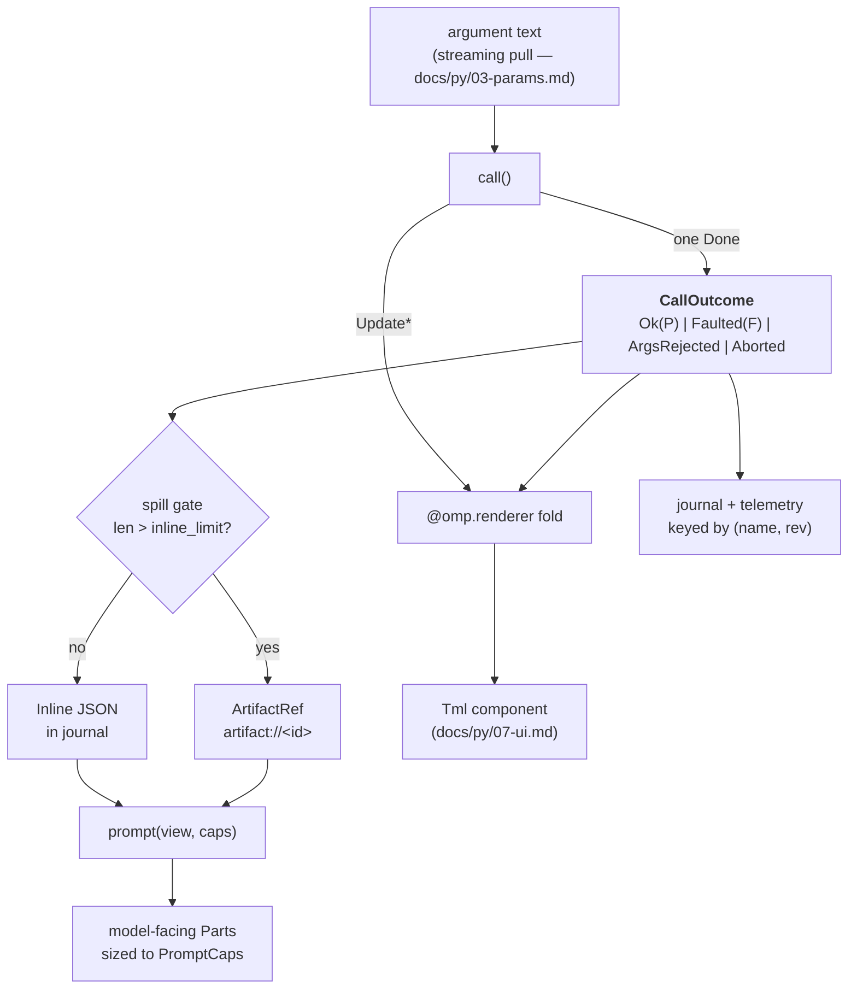

# Call outcomes, projections, and revisions

> **Design document, not a runtime API guarantee.** This corpus includes proposed
> interfaces and historical implementation observations. See
> [implementation status](implementation-status.md) for current owners and known gaps.

`omp.CallOutcome` · `omp.Payload` · `omp.Fault` · `omp.PolicyDenied` · `omp.Postcondition` ·
`prompt(view, caps)` · `omp.PromptCaps` · `@omp.renderer` · `lift(from_rev, call)` ·
`family@rev` · `schema_rev` vs `artifact_digest` · the spill gate

The file keeps its historical name, and "verdict" survives in prose as the informal noun
for a settled call's durable outcome; the former `Verdict` symbol in the `omp` namespace
is gone (renamed — see `omp.CallOutcome`).

## Purpose

Every call made through the extension host settles into exactly one durable artifact: a
typed **call outcome** (`omp.CallOutcome`) — a *verdict*, informally. Nothing else is
truth. The text the model reads, the component the TUI
draws, the row a metrics query aggregates, and the JSON a future analysis reads back are
all *projections* of that one verdict, computed by pure functions that ship and version
with the device that produced it.

This removes pi's central defect. A pi tool returned `AgentToolResult` — a bag pairing
model-facing `content: (TextContent | ImageContent)[]` with an untyped `details?: T`
(`/work/pi/packages/agent/src/types.ts:678-689`). Three consumers shared one blob, so the
blob served none of them: `renderResult` re-parsed the string the executor had just
formatted (`fetch.ts:1835-1845` splits `result.content[0].text` on `"---\n\n"` and counts
lines back out of it; `read-renderer.ts:127-128` strips `/^Error:\s*/` off the model-facing
error text; `edit/renderer.ts:857-861` walks a three-deep fallback chain ending at
`result.content?.find(c => c.type === "text")?.text`). Truncation was per-tool and
destructive, with each tool inventing its own budget and its own ellipsis
(`FETCH_DEFAULT_MAX_LINES = 300`, `SCAN_FILE_DEFAULT_MAX_BYTES = 10MB`,
`DEFAULT_MAX_BYTES = 50KB`, `DEFAULT_MAX_LINES = 3000`). And nothing was versioned at all:
`version`, `rev`, and `schemaVersion` do not exist on pi's `Tool`, `AgentTool`, or
`ToolDefinition`, so thousands of recorded sessions say `edit` where they should say
`edit@hl.3` — the data is there and the signal is destroyed.

omp inverts it. The executor produces structured truth and *nothing else*. Ad-hoc success
strings and ad-hoc error strings are both banned; an error message is a projection of a
typed `Fault`, and it trains the model at least as hard as a confirmation does, so it gets
the same versioning and the same budget discipline. Because the verdict is
**dialect-neutral**, history survives mid-session model switches: a resolved diff does not
know whether hashline or a replace dialect produced it, so `lift()` can re-express old
calls in the live dialect instead of leaving the model to read one format while being told
to emit another.

Projections are pure, so they are location-neutral: an extension declared by a remote
workspace (see `docs/py/14-deploy.md`) executes next to the remote environment, but its
verdict travels to the host and projects identically wherever the host runs. The only part
of a verdict that is *not* self-contained is an `omp.ArtifactRef`, which addresses bytes in
the environment blob namespace — possibly a remote one (`docs/py/11-env.md`).

## Concepts

### One call, one truth, three projections



Three rules follow, and they are the whole design:

1. **The executor never formats.** `call()` yields typed `Update`s and one terminal
   outcome. It never produces a user- or model-facing string. If you find yourself building
   prose inside `call()`, that prose belongs in `prompt()` or in the renderer.
2. **Projections are pure and versioned.** `prompt()` and the renderer are deterministic
   functions of `(verdict, caps)` and `(fold state, render context)` respectively. They may
   not read the filesystem, the network, the clock, or device instance state that changed
   after the call. Determinism is what makes transcript rebuilds byte-stable, which is what
   makes provider prefix caches survive a replay.
3. **The rev travels with the call, never on the wire.** The model sees `edit`. The journal,
   the transcript item, every metric, and every AutoQA report see `edit@hl.3`.

### "During" and "after" are one fold

pi needed `renderCall` *and* `renderResult` because callbacks share no state, which is
exactly why its edit tool opened the file once to preview and again to apply. omp has one
renderer, and it is a fold over the call's own event stream:

```
        Update  Update  Update        Done(CallOutcome)
          │       │       │                │
          ▼       ▼       ▼                ▼
 ┌───────────────────────────────────────────────┐
 │  omp.View : updates[…]  verdict = None → set  │
 └───────────────────────────────────────────────┘
          │       │       │                │
          ▼       ▼       ▼                ▼
       render   render  render          render      ← same function, four times
       (live)   (live)  (live)         (settled)
```

`view.verdict is None` during the call and set after it. There is no separate "result
render". A collapsed transcript row, a live progress frame, an expanded overlay, and a
rebuild three days later all call the same function; what differs is the fold position and
the `omp.ui.RenderCtx` handed in.

### Two budgets, two consumers, one truth

`PromptCaps` bounds what the *model* sees. `RenderCtx` bounds what the *terminal* sees.
Neither bounds the verdict. This is the inversion that deletes an entire pi extension
category: `pi-rtk-optimizer` (`catalog.md:111`), `pi-slim-tools` (`catalog.md:363`), and
`pi-lean-ctx` (`catalog.md:108`) all exist to shrink *already-formatted strings* after the
fact, and `@eleboucher/pi-memini` (`catalog.md:95`) keeps full payloads in model context
while using renderers to show one-line transcript views — three different workarounds for
one missing abstraction.

### Revisions and the lift chain

```
   registered revisions for name "edit"
   ┌──────────┬──────────┬──────────┬──────────┐
   │ rep.1    │ hl.1     │ hl.2     │ hl.3 ◀── live
   └──────────┴──────────┴──────────┴──────────┘
        │          │          │          │
        └── pure lift steps ──┴──────────┘   (never dispatched, never advertised)

   recorded call at rep.1  ──lift(rep.1)──▶  hl.3   ⇒ emitted as a live tool item
   any step returns None   ───────────────▶  bytes retained verbatim as transcript data
```

Only the live revision is dispatched and advertised. Older registered revisions survive
solely as lift steps and as decoders for their own historical verdicts. A partial migration
is never exposed: either the whole chain succeeds or the original bytes are kept exactly.

## Reference

Every fenced `python` example in this reference is a conformance-harness input: the
generated spec (`docs/py/00-overview.md`) extracts it, parses it, type-checks it against
the generated stubs, and executes the runnable ones against the protocol simulator in CI.
Two rules the harness enforces mechanically, because Revision 1 examples in this set broke
them (review, smaller correction #9): **marker bases are never instantiated** —
`omp.Payload(...)` and `omp.Fault(...)` raise `TypeError`, because durable truth is always
a frozen dataclass *subclass* — and **revision literals are typed**: `rev=` takes an
`int`, `omp.Rev.parse` takes a `str`, and an example passing `rev="hl.3"` where a
signature says `int` fails CI rather than waiting for review.

### Declaring durable truth

#### `omp.Payload`

```python
class Payload:
    """Base class for a device's durable success type."""
```

Marker base for the dataclass a device declares as its success truth. Subclasses MUST be
`@dataclasses.dataclass(frozen=True, slots=True)` (or attach `__slots__` by hand) and MUST
be round-trippable: `omp.loads(omp.dumps(p), type(p)) == p` for every reachable value. The
host derives a JSON codec from the annotations at import time and raises
`omp.VerdictSchemaError` if a field's type is not serializable. (Do not confuse this with
`omp.SchemaError`, which `docs/py/01-devices.md` raises for a malformed *device* schema.)

Permitted field types: `bool`, `int`, `float`, `str`, `bytes`, `None`, `enum.Enum`,
`datetime.datetime`, `omp.Duration` (`docs/py/00-overview.md`), `omp.ArtifactRef`, other
`Payload`/`Fault`/plain dataclasses, and
`list[T]` / `dict[str, T]` / `T | None` / tagged unions of the above. `bytes` fields encode
as base64 and count against the spill gate at their encoded length.

##### `omp.dumps` and `omp.loads`

```python
def dumps(value: object) -> bytes: ...
def loads(data: bytes, shape: type[T]) -> T: ...
```

The canonical codec for verdict values. `dumps` produces deterministic UTF-8 bytes — object keys in sorted order, no insignificant
whitespace, no non-finite floats, and integers never widened to floats — which is what
makes `blake3(verdict)` a usable cache key and a rebuilt transcript byte-stable.
`loads` decodes against an explicit `shape`, which is required rather than inferred because
a `lift()` step must decode a *previous* revision's types (see `omp.RecordedCall`).

`loads` raises `omp.VerdictShapeError` when the bytes are not valid UTF-8 JSON, contain
trailing data, or do not match `shape` exactly. Fields annotated `Any` or `object` are an
explicit canonical-JSON passthrough: their nested values are preserved without further
shape narrowing, while sorted keys, unique keys, and finite numbers remain mandatory.
It is not charitable: verdicts are machine-written, so a mismatch is a bug, not a
repairable emission. Charitable decoding applies to model-written *arguments* only
(`docs/py/03-params.md`).

- **Channel** — CONTROL (the serialized verdict rides the invocation's terminal frame).
- **Latency class** — per call, once.
- **Failure** — a field that fails to serialize is fail-closed: the invocation settles as
  `omp.Aborted` with a `serialization` reason, and the traceback is journaled. A verdict is
  never silently truncated into validity.

```python
import dataclasses
import omp


@dataclasses.dataclass(frozen=True, slots=True)
class Diagnostic:
    path: str
    line: int
    column: int
    severity: str            # "error" | "warning" | "hint"
    code: str | None
    message: str


@dataclasses.dataclass(frozen=True, slots=True)
class DiagPayload(omp.Payload):
    server: str              # language-server id that answered
    revision: str            # document revision the diagnostics were pinned to
    diagnostics: list[Diagnostic]
    suppressed: int          # count elided by workspace config, not by budget
    full: omp.ArtifactRef | None = None   # set by the gate when the list is huge
```

##### `Payload.useless() -> bool`

```python
def useless(self) -> bool:
    return False
```

Declares that this verdict's *model-facing projection* carries no information worth keeping
once consumed — zero search matches, an elapsed wait, a no-op poll. Compaction may drop the
projection and keep the verdict. Override it; never lie about it. The default is `False`.

`useless` is advisory for compaction only. It never affects storage, never affects the
renderer, and is forced to `False` for the `ArgsRejected` and `Aborted` branches because a rejected
call is a training signal that compaction must not erase.

- **Channel** — CONTROL, evaluated once when the terminal outcome is lowered.
- **Latency class** — per call. MUST be O(1); it is not a place to compute.
- **Failure** — an exception is fail-open: treated as `False`.

```python
@dataclasses.dataclass(frozen=True, slots=True)
class SearchPayload(omp.Payload):
    hits: list[Hit]

    def useless(self) -> bool:
        return not self.hits
```
##### `Payload.terminate` / `Fault.terminate`

Every payload and fault constructor accepts the keyword-only `terminate: bool = False`.
When `True`, the terminal frame opts this result into ending the tool loop without an
automatic model follow-up. A batch ends only when every finalized result opts in; a mixed
batch always stages the normal follow-up. The hint is execution control, not durable verdict
truth: `omp.dumps` omits it and `omp.loads` restores the default `False`. The finalized tool
results and the decision to stop are still journaled.

#### `omp.Fault`

```python
class Fault:
    """Base class for a device's durable typed failure."""
```

Same construction and serialization rules as `omp.Payload`. A `Fault` is a *first-class
result*, not an exception: it is journaled, it is projected through the same
`prompt(view, caps)`, it is rendered by the same fold, and it is queryable by the same
per-rev metrics. Model everything the model could act on — the path that failed, the
expected shape, a worked example, the conflicting ranges — as fields.

`Fault` is a **value, never an exception base**. It does not derive from `BaseException`,
and nothing may inherit from both. The one sanctioned bridge between the two worlds is
`omp.env.EnvError` (`docs/py/11-env.md`): an `Exception` subclass that *carries* a `Fault`
as its `.fault` attribute. When a known `EnvError` escapes `call()`, the framework catches it
and lowers `exc.fault` to `Faulted` — ergonomic exception-based control flow, durable
typed truth. An arbitrary exception settles as `omp.Aborted` with the traceback journaled,
which tells the model only that something broke; reserve that path for genuine bugs.

**Reversal (review P0#16).** Revision 1 of this set had it both ways:
`docs/py/11-env.md` claimed `EnvError` *derives from* `omp.Fault`, so any uncaught
environment exception would "automatically" become a typed fault, while this document said
an unhandled exception settles as `Aborted`. Both cannot hold, and the derivation was the
wrong half: a serializable frozen value and a Python exception hierarchy have incompatible
contracts (mutability, tracebacks, `raise ... from`, pickling), and making every exception
a `Fault` erases the load-bearing distinction between an expected domain failure and a
bug. That claim is deleted. `Fault` is exclusively a value, owned here;
`EnvError(Exception)` is owned by `docs/py/11-env.md` and carries one.

- **Channel** — CONTROL.
- **Latency class** — per call, once.
- **Fail** — closed, as with `Payload`.

```python
@dataclasses.dataclass(frozen=True, slots=True)
class DiagFault(omp.Fault):
    kind: str                # "no_server" | "timeout" | "crashed" | "unsupported"
    server: str | None
    detail: str
    restartable: bool
```

#### `omp.CallOutcome`

```python
type CallOutcome[P: Payload, F: Fault] = Ok[P] | Faulted[F] | ArgsRejected | Aborted
```

The four durable branches of a settled call. Exactly one is journaled per call. The union
is closed; extensions produce the first two, the harness and Core produce the last two.

**Renamed (review P0#1).** Revision 1 called this type `Verdict` in the `omp` namespace —
and so did `docs/py/05-hooks.md`, for the *hook decision* union
`Allow | Deny | Modify | Defer`. Two
flagship types sharing one name in one namespace was an outright collision, not a nuance,
so both sides renamed: the durable call outcome is `omp.CallOutcome`, the hook decision is
`omp.HookDecision` (`docs/py/05-hooks.md`). The four arms are unchanged and stay aligned
with the Rust `Verdict<P, F>` (`crates/tool/src/lib.rs:251`), which keeps its name — the
collision was Python-side only. Prose in this file still says "verdict" where it reads
naturally; code says `CallOutcome`.

This document owns `CallOutcome`, `AbortKind`, `PolicyDenied`, `Postcondition`, `Payload`,
`Fault`, and the `schema_rev`/`artifact_digest` split; sibling documents link to these
symbols and never redefine them. Owner-defines/others-link is not a convention: the
generated spec's CI enforces unique symbol ownership mechanically
(`docs/py/00-overview.md`).

| Branch | Constructor | Produced by | `is_error` | `useless` |
|---|---|---|---|---|
| `omp.Ok` | `Ok(payload)` | device | `False` | `payload.useless()` |
| `omp.Faulted` | `Faulted(fault)` | device | `True` | `fault.useless()` |
| `omp.ArgsRejected` | `ArgsRejected(issue)` | harness (parameter pull) | `True` | forced `False` |
| `omp.Aborted` | `Aborted(abort, kind, policy=None)` | harness (cancel/skip/crash); Core (policy denial) | `True` | forced `False` |

```python
@dataclasses.dataclass(frozen=True, slots=True)
class Ok[P: Payload]:
    payload: P

@dataclasses.dataclass(frozen=True, slots=True)
class Faulted[F: Fault]:
    fault: F

@dataclasses.dataclass(frozen=True, slots=True)
class ArgsRejected:
    issue: omp.ArgIssue      # defined in docs/py/03-params.md

@dataclasses.dataclass(frozen=True, slots=True)
class Aborted:
    abort: omp.Abort         # fine-grained reason — docs/py/00-overview.md
    kind: AbortKind
    policy: PolicyDenied | None = None
```

When device code yields the terminal event form `omp.Aborted(abort)`, the constructor derives
`SKIPPED` from `Abort.kind == "skipped"` and `CANCELLED` from the other device-producible
abort kinds. `POLICY_DENIED` is host-owned and always requires the explicit `kind` and
`policy` payload; it cannot be produced by that one-argument convenience.

##### `omp.AbortKind`

```python
class AbortKind(enum.Enum):
    CANCELLED = "cancelled"
    SKIPPED = "skipped"
    POLICY_DENIED = "policy_denied"
```

The coarse, machine-readable class of an abort — the field telemetry reads instead of
parsing prose (`docs/py/10-telemetry.md` aligns its `SKIPPED`/`BLOCKED` statuses to it).

- `CANCELLED` — the call was dispatched and did not settle on its own: user or system
  cancellation, a crashed host, a missing terminal event, a serialization or spill
  failure. The fine-grained reason lives in `abort: omp.Abort`.
- `SKIPPED` — the call was never dispatched: an earlier failure skipped the remainder of
  its batch, or the stream was abandoned before `EFFECTS_AUTHORIZED`
  (`omp.InvocationPhase` — `docs/py/03-params.md`).
- `POLICY_DENIED` — admission denied the call. `policy` carries the structured denial, and
  the invariant is exact: `policy is not None` iff `kind is AbortKind.POLICY_DENIED`.

`ArgsRejected` and `Aborted` are projected by the harness, not by the device — a device
cannot see them in `prompt()`, and it does not need to: the harness owns their wording so
that argument-repair, cancellation, and denial messages are identical across every device
in the system. `omp.ArgIssue` is defined in `docs/py/03-params.md` (charitable decoding);
`omp.Abort` in `docs/py/00-overview.md` (cancellation).

#### `omp.PolicyDenied`

```python
@dataclasses.dataclass(frozen=True, slots=True)
class PolicyDenied(omp.OmpError):
    reason: str
    code: str
    decision_id: str
    rules: tuple[omp.RuleRef, ...]
```

**Resolved (2026-08-20 ruling):** `PolicyDenied` is a frozen dataclass deriving
`omp.OmpError`, and `code` is required. It is both the structured payload carried by
`Aborted` and a raisable exception with the same durable fields.

The structured form of a policy denial, carried as
`Aborted(kind=AbortKind.POLICY_DENIED, policy=...)`. Keeping denial *inside* the `Aborted`
arm keeps `CallOutcome` at four arms, aligned with the Rust `Verdict<P, F>`; a fifth arm
would fork every match site for a branch that is still "the call did not run".

Revision 1 lowered policy denial into a bare skip: the denial's `code` had nowhere durable
to land, and telemetry inferred "blocked" by parsing harness prose — the review (P0#18)
ruled that unacceptable, and the structure is now the record. `reason` is the human
sentence, `code` is the stable machine identifier, `decision_id` names the durable
admission decision it came from, and `rules` cites the matching policy rules
(`omp.RuleRef` — `docs/py/06-policy.md`). Telemetry, AutoQA, and the approval UI read
fields, never prose. Denial semantics — who decides, when, and what the model is told —
are owned by `docs/py/06-policy.md`; this document owns only the durable shape. A
`PolicyDenied` originates in Core's per-invocation admission procedure and never crosses
the toolhost wire: a denied call has no worker dispatch to abort.

#### `omp.Postcondition`

```python
class PostconditionStatus(enum.Enum):
    PASSED = "passed"
    REJECTED = "rejected"


@dataclasses.dataclass(frozen=True, slots=True)
class Postcondition:
    status: omp.PostconditionStatus
    reason: str
    code: str | None
    decision_id: str
    rules: tuple[omp.RuleRef, ...] = ()
```

A durable *finding about* a settled call, journaled beside the call outcome and never
inside it. **A landed outcome is immutable.** Once a call settles `Ok` and the effect
landed, nothing may rewrite it into a failure — a `tool_result` review
(`docs/py/05-hooks.md` records the reversal of its old rewrite power) that rejects what it
sees attaches a `Postcondition` with `status=REJECTED` as a separate durable record:

```text
CallOutcome:   Ok(EditPayload(...))
Postcondition: Rejected("secret scanner matched in written content", code="dlp.secret")
```

The model-facing wording is harness-owned and *accurate*: "the write landed, but
downstream verification failed" — never "the write failed", because it did not, and a
model told otherwise learns to retry effects that already happened (review P0#18 quotes
the hooks document admitting exactly that failure mode). `REJECTED` findings are always
journaled; `PASSED` findings are journaled when the reviewing hook requests an audit
trail. Which hooks may attach findings and how they escalate is owned by
`docs/py/05-hooks.md` and `docs/py/06-policy.md`; this document owns the pair of shapes
and the immutability rule.

#### `omp.Ev` and the terminal event

The event vocabulary a device yields — `Update`, `Args`, `Aborted`, `Done` — is defined in
`docs/py/03-params.md`. This document owns only what `Done` *carries*: a
`CallOutcome`-producing `Result`. From this document's side the contract is: yield exactly one
terminal event, and it MUST resolve to exactly one of the four branches above. A stream
that ends without one settles as `omp.Aborted(MissingOutcome)`.

### Projecting for the model

#### `Device.prompt(view, caps)`

```python
def prompt(
    self,
    view: Ok[P] | Faulted[F],
    caps: omp.PromptCaps,
) -> list[omp.Part]:
    ...
```

Deterministically projects either durable branch into the parts one specific model sees.
This is the *only* path from a verdict to model-facing content. It is required on every
device that declares a `Payload` (see `docs/py/01-devices.md` for `@omp.device`).

**Purity is a hard requirement, not a style note.** `prompt()` MUST be a pure function of
`(view, caps)` and immutable device configuration fixed at registration. It MUST NOT:

- read or write files, sockets, environment variables, or the clock;
- `await` anything (it is synchronous by signature — there is nothing to wait for);
- consult mutable device state, module globals, or another device;
- emit a different result for the same `(view, caps, rev)` in a later process.

Two consequences make this worth enforcing. First, ordinary replay reuses the *originally
materialized* projection (see `schema_rev` and `artifact_digest` below), but on an
explicit model or dialect transition the loop calls `prompt()` again for every historical
call being re-expressed; if it were impure the reprojected prefix would drift and every
prefix cache in the session would miss. Second, reprojection at the same rev and digest
must be byte-identical with the stored original, which is what makes a rebuilt transcript
reusable rather than merely plausible.

**Success and failure are covered equally.** `view` is a two-branch union and both arms MUST
be handled. There is no other place to put an error message: the executor has no string
channel, and the harness will not invent one. A `Fault` projection should carry what the
model needs to retry correctly — the specific conflicting lines, the expected shape, a
worked example — because that text is the retry's training signal.

**Two identities version the projection.** The *semantic* contract — argument schema and
verdict shape — is versioned by `rev` (the schema revision): change what a recorded call
*means* and you bump `rev`, and the old revision stays registered so its own historical
verdicts keep decoding exactly as they did. Wording, ordering, and budget behaviour are
versioned by the `artifact_digest` of the build that produced the projection — they do
*not* bump `rev`. Revision 1 of this document required a `rev` bump for any wording
change; the review (UX#5) ruled that conflation wrong, and the split is specified under
`schema_rev` and `artifact_digest` below.

- **Channel** — CONTROL, batched (one frame projects many verdicts; see the closing
  section).
- **Latency class** — per call for live results; for history, only on an explicit
  model/dialect transition, O(items being re-expressed) — ordinary replay reads the stored
  materialization and never calls `prompt()`. It must be cheap: budget on the order of
  tens of microseconds per verdict.
- **Fail** — closed. An exception, a non-`Part` return, or a return exceeding `caps` is
  journaled and replaced by a harness-owned diagnostic part naming `name@rev`. It is never
  silently dropped, because a device whose projection is broken must be visible in AutoQA.

```python
def prompt(self, view, caps):
    match view:
        case omp.Ok(payload):
            if not payload.diagnostics:
                return [omp.Part.text(f"{payload.server}: no diagnostics at {payload.revision}.")]
            out = omp.Budget(caps)
            out.push(f"{len(payload.diagnostics)} diagnostic(s) at {payload.revision}:\n")
            for d in payload.diagnostics:
                if not out.push(f"{d.path}:{d.line}:{d.column} {d.severity}: {d.message}\n"):
                    break
            if payload.full is not None:
                out.push(f"\nFull list: {payload.full.url} (slice it like a file)\n")
            return out.finish()
        case omp.Faulted(fault):
            hint = ' Retry with `dyn lsp/restart`.' if fault.restartable else ""
            return [omp.Part.text(f"language server unavailable ({fault.kind}): {fault.detail}.{hint}")]
```

#### `omp.PromptCaps`

```python
@dataclasses.dataclass(frozen=True, slots=True)
class PromptCaps:
    maximum_parts: int
    maximum_text_bytes: int
    media: bool
    dialect: Dialect
    model_class: ModelClass
```

The deterministic projection budget for one model. Constructed by the harness — never by an
extension — and passed to `prompt()` by value. It is frozen for the duration of one request
assembly, so every projection in one request sees the same caps.

| Field | Type | Meaning |
|---|---|---|
| `maximum_parts` | `int` | Hard ceiling on `len(prompt(...))`. `0` means the model accepts no tool content at all; `prompt()` MUST return `[]`. |
| `maximum_text_bytes` | `int` | Hard ceiling on the summed UTF-8 length of every `TextPart.text`. Counted in bytes, not codepoints, not tokens. `0` behaves like `maximum_parts == 0`. |
| `media` | `bool` | Whether `omp.BlobPart` may be emitted. When `False`, a projection that wants to show an image MUST fall back to its `alt` text. Never emit inline base64. |
| `dialect` | `omp.Dialect` | Which argument dialect the *live* revision speaks for this model. Lets one projection phrase its retry advice in the dialect the model will actually reply in. |
| `model_class` | `omp.ModelClass` | Coarse capability band. Use it to choose verbosity, not to choose correctness. |

##### `omp.Dialect`

```python
class Dialect(enum.StrEnum):
    HASHLINE = "hl"
    REPLACE = "rep"
    PATCH = "patch"
    NATIVE = "native"
```

- `HASHLINE` — the `[PATH#TAG]` + `PUT`/`CUT`/`REM`/`MV` line-anchored dialect.
- `REPLACE` — an old-text/new-text dialect handed to weaker models.
- `PATCH` — a unified-diff / `*** Begin Patch` envelope dialect.
- `NATIVE` — the model's own vendor-trained dialect, where the harness presents a
  vendor-specific wire name.

The value is the `family` half of `omp.Rev`, so `caps.dialect == Dialect.HASHLINE` and
`rev.family == "hl"` agree by construction.

##### `omp.ModelClass`

```python
class ModelClass(enum.IntEnum):
    TINY = 0
    SMALL = 1
    STANDARD = 2
    FRONTIER = 3
```

- `TINY` — embedded classification/titling models. Projections should be one line.
- `SMALL` — local 7–30B class. Terse; prefer counts and paths over content.
- `STANDARD` — mainstream hosted models. The default target.
- `FRONTIER` — long-context flagships. May receive fuller structure, still bounded by
  `maximum_text_bytes`.

Ordering is meaningful (`IntEnum`), so `if caps.model_class >= omp.ModelClass.STANDARD:` is
the intended idiom. `model_class` MUST NOT gate *whether* a fault is reported — only how
much prose accompanies it.

The class is derived by the harness from model-catalog capability data, never declared by an
extension; see `docs/py/13-inference.md` for the catalog and for how a provider entry
contributes to it.

##### `PromptCaps.fits(text: str) -> bool`

Returns whether `text` would fit the remaining text budget assuming nothing else is
emitted. A convenience for single-part projections; multi-part projections should use
`omp.Budget`.

#### `omp.Budget`

```python
class Budget:
    def __init__(self, caps: omp.PromptCaps) -> None: ...
    def push(self, fragment: str) -> bool: ...
    def push_json(self, value: object) -> bool: ...
    def push_blob(self, ref: omp.ArtifactRef, alt: str) -> bool: ...
    def finish(self) -> list[omp.Part]: ...
    @property
    def remaining(self) -> int: ...
```

The accumulator every projection should use instead of hand-rolling a byte count. It
appends *whole caller-owned fragments*: a fragment either fits entirely or is refused, so a
projection never emits half a line, a split grapheme, or a truncated path.

- `push(fragment)` — appends `fragment` to the pending text part if it fits; returns
  `False` and marks the budget truncated otherwise. Returning `False` is the loop-exit
  signal.
- `push_json(value)` — appends an `omp.JsonPart` carrying the canonical serialization of
  `value`. Counts its encoded length against `maximum_text_bytes` and one slot against
  `maximum_parts`.
- `push_blob(ref, alt)` — appends an `omp.BlobPart` when `caps.media` is `True`; otherwise
  appends `alt` as text. Returns `False` if neither fits.
- `finish()` — seals the budget and returns the parts. If anything was refused, appends the
  harness-owned marker `\n[truncated]` when it fits, so the model always knows the view is
  partial rather than silently believing it is complete. Returns `[]` when nothing was
  accepted.
- `remaining` — bytes still available. Use it to decide between a full and a compact form
  *before* building the expensive one.

`omp.Budget` is the one legitimate place to make a truncation decision, and it makes a
*display* decision: the bytes still exist in the verdict, and if the verdict spilled they
are addressable at `artifact://<id>`.

- **Channel** — none (host-local).
- **Latency class** — per projection.
- **Fail** — closed; a `push` of a non-`str` raises `TypeError` out of `prompt()`, which
  the harness treats as a broken projection.

#### `omp.Part`

```python
type Part = TextPart | JsonPart | BlobPart
```

One model-facing result part. Construct through the `omp.Part` factory rather than the
dataclasses directly; the factory validates against `PromptCaps` invariants that the raw
dataclasses cannot.

| Symbol | Fields | Notes |
|---|---|---|
| `omp.TextPart` | `text: str` | UTF-8 model-visible text. |
| `omp.JsonPart` | `json: bytes` | Structured JSON retained as exact bytes; canonical ordering, so replay is byte-stable. |
| `omp.BlobPart` | `blob: omp.ArtifactRef`, `alt: str \| None` | Blob-backed media. Never inline base64. `alt` is the deterministic fallback used when `caps.media` is `False`. |

```python
class Part:
    @staticmethod
    def text(text: str) -> TextPart: ...
    @staticmethod
    def json(value: object) -> JsonPart: ...
    @staticmethod
    def blob(ref: ArtifactRef, alt: str | None = None) -> BlobPart: ...
```

### Rendering: the update fold

#### `@omp.renderer(name, *, family=None, rev=None, reduce=None, decorates=False)`

```python
def renderer(
    name: str,
    *,
    family: str | None = None,
    rev: int | None = None,
    reduce: Callable[[object, object], object] | None = None,
    decorates: bool = False,
) -> Callable[[RenderFn], RenderFn]:
    ...
```

Registers the UI fold for one `(name, rev)` pair. The decorated function is the whole
renderer: there is no separate call-preview and no separate result view.

```python
RenderFn = Callable[[omp.View, omp.ui.RenderCtx], omp.ui.Tml | None]
```

Arguments:

- `name` — the device's stable wire name. MUST match a registered device.
- `family`, `rev` — the revision this fold renders. Omitted, they default to the device's
  own declared `family`/`rev`, which is what you want almost always. Supply them explicitly
  to keep an old revision's renderer alive after bumping the device, so that historical
  calls that could not be lifted still draw correctly.
- `reduce` — an optional pure `(accumulator, update) -> accumulator` used to collapse the
  update stream incrementally. When supplied, `view.state` is the accumulator and
  `view.updates` is empty; the fold becomes O(1) per frame instead of O(updates). Supply it
  for any device that can emit more than a few dozen updates.
- `decorates` — when true, the returned TML augments the winning native or extension base
  renderer instead of replacing it. The host appends the augmentation; `None` declines it.

Registration is keyed strictly by `(name, rev)`. A second registration for the same key
raises `omp.DuplicateRenderer` at import time — renderers do not race for ownership the way
pi's tool names did (`pi-pretty` and `pi-cc-extensions` both claiming `write`).

The renderer MUST be pure in exactly the sense `prompt()` is, and for the same reason: the
transcript is redrawn on resize, on theme change, on scroll-back, and on session reload.
It returns `omp.ui.Tml` and receives `omp.ui.RenderCtx`; both are defined in
`docs/py/07-ui.md`, and this document treats `Tml` as opaque.

Returning `None` declines the frame and lets the harness draw its own row. That is the
correct answer for the `ArgsRejected` and `Aborted` branches: their wording is harness-owned
so that argument-repair and cancellation rows read identically across every device, exactly
as their model-facing projection is harness-owned. A renderer that tries to word them itself
is reintroducing the per-tool divergence this design removes.

- **Channel** — CONTROL (the host receives the fold's inputs and returns markup; the TUI
  never runs Python).
- **Latency class** — per frame for a live call, per repaint for history. Hard budget: a
  renderer that exceeds it is dropped for that frame and the harness draws a minimal
  fallback row, once, with the overrun journaled.
- **Fail** — open. A raising renderer degrades to the harness's default row; a broken
  renderer never blocks a turn, and never blocks the verdict from being journaled.

```python
@omp.renderer("lsp_diagnostics")
def render(view: omp.View[DiagUpdate, DiagPayload, DiagFault], ctx) -> omp.ui.Tml | None:
    if view.verdict is None:                       # during
        seen = view.updates[-1].files_scanned if view.updates else 0
        return omp.ui.tml(f"<row><ico:search/> scanning… {seen} file(s)</row>")
    match view.verdict:                            # after — same function
        case omp.Ok(payload):
            rows = [
                omp.ui.tml(
                    f"<row><sev:{d.severity}/> {omp.ui.text(d.path)}:{d.line} "
                    f"{omp.ui.text(d.message)}</row>"
                )
                for d in payload.diagnostics[: 3 if ctx.collapsed else None]
            ]
            return omp.ui.tml(f"<box title='{payload.server}'>{''.join(rows)}</box>")
        case omp.Faulted(fault):
            return omp.ui.tml(f"<row><ico:error/> {omp.ui.text(fault.detail)}</row>")
        case omp.ArgsRejected() | omp.Aborted():
            return None                             # harness owns these two rows
```

#### `omp.View`

```python
@dataclasses.dataclass(frozen=True, slots=True)
class View[U, P: Payload, F: Fault]:
    identity: omp.ToolIdentity
    call_id: str
    updates: tuple[U, ...]
    state: object | None
    verdict: CallOutcome[P, F] | None
    elapsed: omp.Duration
    phase: omp.InvocationPhase
    presentation: Mapping[str, object] = dataclasses.field(
        default_factory=lambda: MappingProxyType({})
    )
```

**Resolved (2026-08-20 ruling):** `presentation` is the eighth `View` field. It defaults
to an empty read-only mapping and carries the host-materialized immutable presentation
snapshot described by `docs/py/07-ui.md:1509-1514`.

The fold state handed to a renderer. One object serves both the live and the settled
render; `verdict is None` distinguishes them.

| Field | Meaning |
|---|---|
| `identity` | `(name, rev)` of the call being rendered — the rev the *verdict was recorded at*, which may differ from the live rev if the call was retained unlifted. |
| `call_id` | Provider-assigned call identifier; stable across the fold. |
| `updates` | Every `Update` observed so far, in order. Empty when `reduce=` was supplied. |
| `state` | The `reduce=` accumulator, or `None`. |
| `verdict` | `None` while the call is live; the settled four-branch verdict afterwards. |
| `elapsed` | Monotonic time since the invocation opened, as an `omp.Duration` (`docs/py/00-overview.md`) — Revision 1's `elapsed_ms: int` went with every other unit-suffixed field (§0 rename table). Advisory; the renderer must stay deterministic *given* it, and the harness quantizes it so repaints do not thrash. |
| `phase` | The `omp.InvocationPhase` the invocation has reached (`docs/py/03-params.md` owns the machine). Revision 1 exposed `committed: bool`, "whether the commit frame has arrived"; "commit" is now reserved for `ASSISTANT_ITEM_COMMITTED` (P0#3), and a bool cannot say which of seven states a call is in. A third-party device body only starts at `EFFECTS_AUTHORIZED` (v1), so its live renders never see an earlier phase; core streaming tools may. |
| `presentation` | Read-only `Mapping[str, object]` materialized by the host from the extension's declared presentation state. The immutable snapshot is shared with `RenderCtx`, defaults empty, and binds the host's presentation-cache entry (`docs/py/07-ui.md:1509-1514`). |

### Revisions

#### `omp.Rev`

```python
@dataclasses.dataclass(frozen=True, slots=True, order=True)
class Rev:
    family: str
    n: int
```

One argument-and-projection dialect revision. `family` names the dialect (`"hl"`, `"rep"`,
`"patch"`, or `""` for a device with a single dialect); `n` is a monotonic `u16` within that
family.

- `str(Rev("hl", 3)) == "hl.3"`; `str(Rev("", 7)) == "7"`.
- `omp.Rev.parse("hl.3") -> Rev("hl", 3)`; raises `omp.RevError` on a malformed value.
- Ordering is `(family, n)` lexicographic-then-numeric, which is what makes the lift walk
  deterministic.

**Stamping rules — all four are load-bearing:**

1. **The wire name stays clean.** The model sees `edit`. It never sees `edit@hl.3`, and
   `Rev` never appears in a schema, a description, or an argument.
2. **The rev never rides the wire.** It is not a request field and not a tool property. A
   provider has nothing to normalize.
3. **The rev rides the record.** Every committed tool-call and tool-result item carries the
   rev as the namespaced item property `omp/tool-rev` with the value `str(rev)`.
4. **The rev keys every semantic metric.** Tool-call counters, duration histograms, AutoQA
   reports, and analytics rows are partitioned by `(name, rev)` — never by `name` alone.
   This is the difference between "how often does the fuzzy rebase fire and the model
   retries anyway" being a query and being an afternoon of regex archaeology. Per-*build*
   attribution — did this exact projection wording regress retries — slices by
   `artifact_digest` instead (below); the two axes never share a key.

#### `omp.ToolIdentity`

```python
@dataclasses.dataclass(frozen=True, slots=True, order=True)
class ToolIdentity:
    name: str
    rev: Rev
```

Durable identity of a call in a transcript. `str(ToolIdentity("edit", Rev("hl", 3)))` is
`"edit@hl.3"`, which is the form to use in log lines, AutoQA reports, and prose. It is
*not* a wire value.

#### `schema_rev` and `artifact_digest`

`omp.Rev` is the **schema revision** — where this document set contrasts the two
identities it writes `schema_rev`, but they are one value. It governs exactly two things:
decode compatibility (which registered types decode a recorded call) and the `lift()`
chain (which steps re-express it). It bumps when the argument schema or the verdict shape
changes *meaning*, and for nothing else.

The **artifact digest** is the second identity: a BLAKE3-256 content digest over the exact
build that produced a projection — device docs wording, `prompt()` code, renderer code,
and the package build they shipped in. It is the projection half of the provenance septet
(`docs/py/14-deploy.md` owns package identity); the Rust-side computation is
`Registry::projection_hash` (build item 6). Per-build metrics and AutoQA attribution use
the digest; lift logic follows schema revisions only, and the digest never appears in a
lift key.

**Reversal (review UX#5).** Revision 1 forced every change — wording, part ordering,
budget behaviour, schema, verdict shape — through one `rev` bump. The review ruled that
conflation wrong on both horns: it either produces revision churn, where a typo fix spawns
a lift step and fractures metrics continuity, or it teaches authors not to bump — and an
unbumped semantic change is exactly the `VerdictShapeError` bug class. The split above
replaces it.

**Replay stores the materialization.** For every settled call the durable record holds:

1. the structured truth — the `CallOutcome`, inline or spilled;
2. the originally materialized model-facing parts, exactly as first projected;
3. the originally materialized UI summary, where one was rendered;
4. the `artifact_digest` that produced projections 2 and 3.

The journal already has the shape: `Msg::ToolResult { content, details, … }`
(`crates/storage/src/transcript/msg.rs:60-76`) stores parts beside verdict, and the split
blesses that pairing instead of fighting it. Ordinary replay — same model, same dialect —
reuses the materialized original byte-for-byte, with no Python in the loop. Reprojection
runs only on an **explicit model or dialect transition**, which is exactly when `lift()`
runs and the one case `prompt()` purity exists to serve. Revision 1 instead had the loop
reproject history on every request assembly for every call whose caps or rev changed;
that is reversed — it made byte-stability hinge on purity alone and would have required
the producing package forever.

Which is the package-GC consequence (`docs/py/14-deploy.md`): an old session never needs
old Python code merely to *look the same*. Rendering and replay read the stored
materialization; only a transition needs live code, and a call whose package is gone falls
back the same way an unliftable call always has — original bytes, retained verbatim.

#### `omp.RecordedCall`

```python
@dataclasses.dataclass(frozen=True, slots=True)
class RecordedCall:
    identity: ToolIdentity
    raw_args: bytes
    verdict: bytes
```

A historical call, byte-exact, as the lift input. `raw_args` is the *original* model-emitted
argument bytes including whatever charitable decoding later repaired — the raw emission is
the signal versioning exists to preserve, so a lift receives it unlaundered. `verdict` is
the canonical serialized verdict JSON.

Both are `bytes`, not decoded objects, deliberately: a lift step from `rep.1` must be able
to decode `rep.1`'s own types, which the *current* revision's dataclasses may no longer
describe. Decode explicitly with `omp.loads(call.verdict, OldVerdictShape)`.

#### `omp.LiftedCall`

```python
@dataclasses.dataclass(frozen=True, slots=True)
class LiftedCall:
    raw_args: bytes
    verdict: bytes
```

The result of one successful lift step: the same call expressed in the target revision's
argument dialect and verdict shape. Build it with `omp.LiftedCall.of(args, verdict)`, which
serializes canonically so the output is byte-stable.

#### `Device.lift(from_rev, call)`

```python
def lift(self, from_rev: omp.Rev, call: omp.RecordedCall) -> omp.LiftedCall | None:
    return None
```

Deterministically migrates one historical call *one step* toward this revision. Optional;
the default returns `None`, which means "no upgrade path" and is the correct answer for a
device whose history need not be re-expressed.

**Who calls it, and when.** The loop calls `lift()` during request assembly, once per turn,
for exactly those recorded calls whose `omp/tool-rev` differs from the live rev for that
name. Calls already at the live rev are *not decoded at all* — their bytes and field
presence are preserved verbatim, which is what keeps a long session's prompt prefix stable
across turns. The walk is:

```
current = recorded rev
while current != live:
    next = (current.family == live.family and current.n < live.n)
             ? Rev(current.family, current.n + 1)     # adjacent step within the family
             : live                                   # cross-family: one jump
    step = registered device at `next`
    lifted = step.lift(current, RecordedCall(...))
    if step is missing or lifted is None:
        return the ORIGINAL bytes, retained as transcript data
    current = next
```

So a lift is implemented on the *destination* revision and asked about its immediate
predecessor. `hl.3` implements `lift(hl.2, …)` and `lift(rep.1, …)`; it never needs to know
about `hl.1`, because `hl.2` handles that step. Cross-family history jumps directly to the
live revision, because interpolating a foreign family's intermediate revisions is
meaningless.

**Why it works at all: the verdict is dialect-neutral.** A resolved diff, a before/after
revision pair, and a rebased flag describe *what happened to the file*. They do not encode
which dialect asked for it. That is why the verdict half of a lift is usually a
field-for-field re-shape (often the identity function), and the argument half is the only
part that needs real translation. If you find yourself unable to lift a verdict, that is
strong evidence the verdict is carrying dialect artifacts it should not.

**Return `None` rather than guessing.** A lossy lift is worse than no lift: the model reads
a coherent-looking history that misdescribes what happened. Returning `None` retains the
original bytes as inert transcript data, which is honest.

- **Channel** — CONTROL, batched with the projection pass.
- **Latency class** — per turn, O(calls whose rev differs). Called at most once per call
  per turn; results are cached by `(call_id, target rev)`.
- **Fail** — open-and-honest: an exception is journaled and treated as `None`. Partially
  migrated history is never exposed.

##### Worked example: `edit@rep.1` → `edit@hl.3`

The session opened on a small local model, so `edit` spoke the replace dialect: a list of
`{path, old, new}` triples. The user switched to a flagship mid-session, so `edit` is now
live at `hl.3` and speaks hashline. Without a lift, the model reads a history of
`{path, old, new}` calls sitting directly beside a schema telling it to emit `[PATH#TAG]`
sections — and its next call comes out in the wrong dialect. Real pi extensions collide
here today: `pi-hashline-edit-pro` (`catalog.md:198`) and `@piex-dev/hashline`
(`catalog.md:282`) install hash-anchored dialects while `pi-readseek` (`catalog.md:165`)
swaps in `LINE:HASH` anchored file tools, and pi has no rev to tell any of them apart.

```python
import omp


@dataclasses.dataclass(frozen=True, slots=True)
class RepOp:                       # edit@rep.1 arguments
    path: str
    old: str
    new: str


@dataclasses.dataclass(frozen=True, slots=True)
class RepArgs:
    edits: list[RepOp]


@dataclasses.dataclass(frozen=True, slots=True)
class HlArgs:                      # edit@hl.3 arguments
    input: str


@omp.device("edit", family="hl", rev=3)
class HashlineEdit:
    Payload = EditPayload          # sections: list[SectionPayload]
    Fault = EditFault

    def lift(self, from_rev, call):
        if from_rev != omp.Rev("rep", 1):
            return None            # hl.2 -> hl.3 handled separately; anything else: no path

        # 1. Arguments: rebuild hashline text from the verdict, not from the old args.
        #    The verdict knows the resolved line ranges; the replace args only knew
        #    substrings, and a substring cannot be re-anchored after the fact.
        old = omp.loads(call.verdict, omp.CallOutcome[EditPayload, EditFault])
        if not isinstance(old, omp.Ok):
            # A failed replace-dialect call has no resolved ranges to anchor. Keep the
            # verdict (it lifts cleanly) and synthesize args that describe the attempt.
            sections = []
        else:
            sections = [
                f"[{s.path}#{s.tag}]\n"
                + "".join(
                    f"PUT {op.start}.={op.end}:\n"
                    + "".join(f"+{line}\n" for line in op.body)
                    for op in s.applied_ops
                )
                for s in old.payload.sections
            ]
        args = HlArgs(input="".join(sections))

        # 2. The verdict half: identity. SectionPayload is dialect-neutral — path, old/new
        #    revision, resolved diff, rebased flag. Nothing in it names a dialect.
        return omp.LiftedCall.of(args, old)
```

After the lift, the transcript item's `omp/tool-rev` is rewritten to `hl.3`, its arguments
are the synthesized hashline text, its verdict is re-serialized at `hl.3`, and its
model-facing parts are re-projected through `hl.3`'s `prompt()` under the *current* caps —
an explicit dialect transition, the one case where reprojection replaces the stored
materialization (`schema_rev` and `artifact_digest`).
The flagship model reads one coherent thread in the one dialect it was told to use. Nothing
migrated on disk: the journal still holds the original `rep.1` bytes, and switching back to
the small model re-derives the `rep.1` view from the same source.

### Artifactization

#### The spill gate

One gate, centrally owned, applied to every verdict from every source — core tool, MCP
endpoint, extension device, backgrounded job. It runs after `call()` settles and before the
verdict is journaled:

```
serialize verdict canonically
        │
        ├── len ≤ inline_limit  →  store inline in the journal item
        └── len >  inline_limit →  store whole in the blob namespace
                                   journal an ArtifactRef + original byte length
```

Three properties follow, and they are the reason the gate is not a per-device concern:

- **Nothing is ever lost.** Past the budget the payload is stored *whole*. The model sees a
  bounded view (from `prompt()`) plus an `artifact://<id>` it can slice exactly like a file.
  Truncation becomes a display decision.
- **There is one ellipsis.** `omp.Budget` appends the single harness-owned `[truncated]`
  marker. pi had `FETCH_DEFAULT_MAX_LINES`, `SCAN_FILE_DEFAULT_MAX_BYTES`,
  `DEFAULT_MAX_BYTES`, `DEFAULT_MAX_LINES`, and a different notice string per tool.
- **Extensions never mint ids.** The gate is harness-owned. `omp.artifacts.put()` — see
  `docs/py/09-journal.md` — is the only explicit mint, and it returns the same
  `omp.ArtifactRef` documented below.

The gate composes with, but is independent of, `PromptCaps`. `PromptCaps` bounds what the
model reads; the gate bounds what the *journal line* holds. A verdict can be small enough
to inline and still be far too large to project, and vice versa.

##### `omp.SPILL_INLINE_LIMIT`

```python
SPILL_INLINE_LIMIT: int = 16 * 1024
```

Default inline ceiling in bytes for a serialized verdict, measured on the canonical
encoding. Sized so an ordinary verdict — a diff, a match list, a diagnostics batch —
inlines, while a build log or a 40 MB MCP response spills. Read it; do not assume it.

##### `omp.SpillBudget`

```python
@dataclasses.dataclass(frozen=True, slots=True)
class SpillBudget:
    inline_limit: int = SPILL_INLINE_LIMIT
    media_type: str = "application/json"
    lifetime: omp.ArtifactLifetime = omp.ArtifactLifetime.SESSION
    always: bool = False
```

Per-device override of the gate's behaviour, declared as the `__spill__` class attribute on
a device. It tunes the gate; it cannot disable it.

`SpillBudget` is *policy*: when the gate fires and where the bytes land. It is not the
worker-result marker `omp.Spill`, which is a *mechanism* — a value a worker body returns so
its pickle-5 out-of-band buffer is moved into the blob store without ever entering the host
process. `omp.Spill` and `omp.BlobRef` are defined in `docs/py/04-placement.md`. The two
meet at exactly one point: when a device's `call()` receives an `omp.BlobRef` back from a
worker, embedding it in a `Payload` field converts it to an `omp.ArtifactRef` — same bytes,
same hash, now addressable at `artifact://<id>`. A `BlobRef` never appears in a journaled
verdict; only `ArtifactRef` does.

| Field | Meaning |
|---|---|
| `inline_limit` | Bytes below which the verdict inlines. Lower it for a device whose verdicts are numerous and rarely re-read; raise it for one whose verdicts are small but constantly re-projected. Values above `4 * SPILL_INLINE_LIMIT` are clamped, with the clamp journaled. |
| `media_type` | MIME type recorded on the spilled `ArtifactRef`. Set it when the verdict body is meaningfully something else (`text/plain` for a captured log) so `read artifact://<id>` picks the right extractor. |
| `lifetime` | Minimum retention. Defined in `docs/py/09-journal.md`. |
| `always` | Spill unconditionally. For devices whose verdicts are large *by contract* — full-file captures, screenshots, build logs — so the journal line stays a fixed size. |

```python
@omp.device("build", family="v", rev=1)
class Build:
    __spill__ = omp.SpillBudget(media_type="text/plain", always=True)
    Payload = BuildPayload
    Fault = BuildFault
```

- **Channel** — none from Python. The gate runs env-side in Rust, downstream of the device's
  terminal frame, and writes through the environment's blob host; a device declares the budget
  and never performs the write. This matters because the Python host has no DATA edge today
  (`docs/py/00-overview.md`, `docs/py/11-env.md`) — the gate is unaffected by that gap, whereas
  an explicit `omp.artifacts.put()` (`docs/py/09-journal.md`) is blocked by it.
- **Latency class** — per call, only on the spill path; one blob round trip, env-side.
- **Fail** — closed. If the blob write fails, the verdict settles as `omp.Aborted` with a
  `spill_failed` reason rather than being silently shrunk. Losing truth is not an acceptable
  degradation.

##### `omp.ArtifactRef`

```python
@dataclasses.dataclass(frozen=True, slots=True)
class ArtifactRef:
    id: str
    hash: str
    media_type: str
    byte_len: int

    @property
    def url(self) -> omp.ArtifactUrl: ...
```

A content-addressed reference to durable bytes. This is the type that appears *inside* a
`Payload` or `Fault` when a device stores something too large to carry inline, and the type
the gate writes when it spills a whole verdict.

| Field | Meaning |
|---|---|
| `id` | Stable artifact identifier within the session's artifact namespace. The `<id>` in `artifact://<id>`. |
| `hash` | Content hash in the environment blob namespace. Equal hash means equal bytes, across sessions and across machines. |
| `media_type` | MIME type of the stored bytes, chosen by the producer. |
| `byte_len` | Exact stored length. Present so a projection can say "12.4 MB" without fetching anything. |
| `url` | The typed `omp.ArtifactUrl` (`docs/py/09-journal.md`), rendering as `artifact://<id>`. The form to put in a projection; raw URL strings left every public signature with the typed-location ruling (UX#2). |

On the wire this is `omp.thread.v1.Blob { hash (BLAKE3-256), mime, size, inline }`
(`crates/proto/proto/omp/thread/v1/thread.proto:110-119`), whose own contract already states
the rule this section exists to enforce: "inline/thumbnail/stub treatment is projection
policy, never part shape." `hash` and `byte_len` are that message's `hash` and `size`;
`media_type` is its `mime`; `id` is the session-local name the artifact namespace assigns so
the model has something short to type.

`ArtifactRef` is a *reference*, and referencing is the point: results reference, they do not
embed. A projection that inlines artifact bytes has defeated the gate. Resolution, slicing
(`artifact://<id>:50-200`, `:raw`), and retention are documented in
`docs/py/09-journal.md`; `artifact://` is read-only and slice-addressable with the same
selector grammar as a file read, which is exactly why truncation can be a display decision.

### Compaction

Compaction drops projections and keeps verdicts. This is a consequence of the design rather
than a feature bolted onto it, and it is the one place where "the string is not the truth"
pays for itself directly.

For each settled call, compaction may:

| Element | Kept | Dropped |
|---|---|---|
| `CallOutcome` (inline JSON or `ArtifactRef`) | always | never |
| `omp/tool-rev` | always | never |
| `is_error` | always | never |
| model-facing `Part`s | while in the live window | when `useless()` is `True`, or when the prefix is summarized |
| `Update` stream | never durable to begin with | — |

Three rules govern it:

1. **`useless()` authorizes dropping the projection, never the verdict.** After the model
   has consumed a zero-match search, the parts are noise; the verdict still answers "did
   this device ever return zero matches for this query."
2. **`ArgsRejected` and `Aborted` projections are never dropped.** A rejected call is the
   highest-value training signal in the transcript. `useless` is forced `False` for both
   branches for exactly this reason.
3. **Re-projection is always available.** Because `prompt()` is pure and the verdict is
   retained, a dropped projection can be regenerated at any later time under different caps,
   stamped with the regenerating build's `artifact_digest`.
   Nothing about compaction is irreversible except the summary itself. pi could not do this:
   it stored the model-facing text as the record, so once compaction pruned the string, the
   information was gone. Its own `prunedAt` field marks the moment.

**What the transcript can express today, honestly.** The live chain is reconstructed by one
forward fold, `Log::live() -> Vec<u64>` (`crates/storage/src/transcript/reader.rs:69-177`),
which splices `Reset`, `Rewind`, and `Compact` over the physical event-index list —
`Kind::Compact { first_kept, … }` rotates the chain so the summary stands in for the
discarded prefix (`reader.rs:123-133`). That is the patch protocol, and it operates at
**whole-event granularity**. Field-level correction is `Kind::Amend { target, patch }`
carrying `AmendPatch::{Prune { keep_blocks }, RetryRecovery { … }, Seq { seq }}`
(`transcript/types.rs:203-228`), and `Prune` prunes an *assistant* message to a prefix of its
blocks. **No existing amendment drops a tool result's `content` while retaining its
`details`.** So rule 1 above is a property of this design, not yet a capability of the
journal; build item 6 specifies the missing amendment and why adding one is less trivial
than it looks.

Compaction events, their verdicts, and the context-patch protocol live in
`docs/py/08-context.md`. This document owns only what survives compaction.

### Errors

| Symbol | Raised when |
|---|---|
| `omp.VerdictSchemaError` | A `Payload`/`Fault` field type is not serializable, at import time. Distinct from `omp.SchemaError` (device schema — `docs/py/01-devices.md`). |
| `omp.RevError` | `Rev.parse` received a malformed revision string. |
| `omp.DuplicateRenderer` | Two `@omp.renderer` registrations claim one `(name, rev)`. |
| `omp.VerdictShapeError` | A stored verdict does not decode against the revision it was recorded at — a torn journal or a revision registered with changed types under an unchanged rev. Always a bug; bump the rev. |
| `omp.BudgetError` | `omp.Budget` received a non-string fragment or was used after `finish()`. |

## Patterns

### 1. Web fetch and library docs — `@mrclrchtr/supi-web`

The pi extension (`catalog.md:80`) ships three tools that convert pages to Markdown and
search Context7 docs. All three "include custom call/result renderers and spill full
truncated output to a readable temp artifact." Read that again: three tools, three
hand-rolled renderers, three hand-rolled spill paths, three temp-file lifecycles, and a
`mkdtemp()` path handed back to the model as if it were an address.

Every one of those is a symptom of the missing gate.

```python
import dataclasses
import omp


@dataclasses.dataclass(frozen=True, slots=True)
class FetchUpdate:
    stage: str               # "connect" | "impersonate" | "extract"
    bytes_read: int


@dataclasses.dataclass(frozen=True, slots=True)
class FetchPayload(omp.Payload):
    url: str
    final_url: str           # after redirects
    status: int
    title: str | None
    markdown: str            # the WHOLE reader-mode extraction, never truncated here
    tls_profile: str         # which impersonation profile got past the interstitial
    line_count: int


@dataclasses.dataclass(frozen=True, slots=True)
class FetchFault(omp.Fault):
    kind: str                # "dns" | "tls" | "blocked" | "http" | "not_html"
    status: int | None
    detail: str


@omp.device("web_fetch", family="v", rev=2, place="env")
class WebFetch:
    """Reader-mode fetch with browser TLS impersonation."""

    Payload = FetchPayload
    Fault = FetchFault
    __spill__ = omp.SpillBudget(media_type="text/markdown")

    def prompt(self, view, caps):
        match view:
            case omp.Ok(p):
                out = omp.Budget(caps)
                out.push(f"# {p.title or p.final_url}\n")
                if p.final_url != p.url:
                    out.push(f"(redirected from {p.url})\n")
                out.push("\n")
                for line in p.markdown.splitlines(keepends=True):
                    if not out.push(line):
                        break
                return out.finish()
            case omp.Faulted(f):
                match f.kind:
                    case "blocked":
                        return [omp.Part.text(
                            f"{f.detail} The site fingerprinted the client. "
                            f"Retry once; the next attempt escalates the impersonation tier."
                        )]
                    case "not_html":
                        return [omp.Part.text(
                            f"{f.detail} Not an HTML document — read it as a file instead: "
                            f"`read {view.fault.detail}`."
                        )]
                    case _:
                        return [omp.Part.text(f"fetch failed ({f.kind}): {f.detail}")]
```

What changed:

- **One spill path, and it is not the device's.** `markdown` holds the full extraction. If
  the verdict exceeds the limit, the gate stores it whole and journals an `ArtifactRef`; the
  model gets a bounded view plus `artifact://<id>` it can slice with `:200-400` — the same
  selector grammar it already uses on files. No `mkdtemp()`, no path leak, no orphaned temp
  directory when the session dies.
- **The projection adapts instead of the executor truncating.** A `TINY` model gets the
  title and the first few hundred bytes; a `FRONTIER` model gets thousands. The verdict is
  identical. In pi, `FETCH_DEFAULT_MAX_LINES = 300` applied to everybody, forever, and the
  bytes past line 300 were gone.
- **The failure text is versioned with the fetch semantics.** pi's `fetch.ts` renderer
  reconstructed metadata by splitting `result.content[0].text` on `"---\n\n"`
  (`fetch.ts:1835-1845`). Here the renderer reads `p.status`, `p.line_count`, and
  `p.tls_profile` as fields, because the executor never destroyed them.
- **`place="env"` keeps the bytes out of the host.** A 4 MB page is extracted next to the
  environment; only the verdict crosses (`docs/py/04-placement.md`).

### 2. LSP diagnostics — `@mrclrchtr/supi-code-intelligence`

The pi extension (`catalog.md:159`) "maintains workspace-bound LSP server lifecycles across
session events and provides custom TUI call/result renderers." The lifecycle half becomes a
named environment process (`docs/py/11-env.md`). The renderer half is the interesting part,
because diagnostics are the case where the model's needs and the terminal's needs diverge
maximally: the model wants `path:line:col severity: message` and nothing else; the user
wants a foldable, severity-coloured, clickable tree.

```python
@omp.device("lsp_diagnostics", family="v", rev=3, place="worker:lsp")
class Diagnostics:
    Payload = DiagPayload        # declared above
    Fault = DiagFault
    __spill__ = omp.SpillBudget(inline_limit=64 * 1024)

    def prompt(self, view, caps):
        ...                      # as shown in the prompt() reference above

    def lift(self, from_rev, call):
        if from_rev != omp.Rev("v", 2):
            return None
        # v.2 recorded a flat list[str] of formatted lines and no `revision`.
        # That is exactly the mistake this document exists to prevent, and it is
        # why v.2 can be lifted only lossily -- so it isn't.
        return None


@omp.renderer("lsp_diagnostics", reduce=lambda acc, u: u.files_scanned)
def render(view, ctx):
    ...                          # as shown in the @omp.renderer reference above


@omp.renderer("lsp_diagnostics", family="v", rev=2)
def render_v2(view, ctx):
    """Registered so unliftable v.2 rows draw the harness default, not a v.3 fold
    misreading v.2's shape."""
    return None
```

What changed:

- **The model and the terminal read the same truth and never each other's output.** pi's
  `read-renderer.ts` had to `stripOutputNotice(rawText, details?.meta)` — strip the
  *model-facing* notice out of the text before showing it to the user
  (`read-renderer.ts:150-155`), because one string served both. Here there is no notice to
  strip: the model-facing sentence exists only in `prompt()`'s return value, which the
  renderer never sees.
- **`reduce=` keeps the fold O(1).** A workspace-wide diagnostics run emits thousands of
  `files_scanned` updates. Without `reduce=`, every repaint would walk them all.
- **An honest `None` from `lift()`.** `v.2` stored formatted strings. There is no way to
  recover `path`, `line`, and `severity` from them without a parser that would be wrong for
  some inputs — so `lift()` returns `None`, the `v.2` bytes stay inert, and the registered
  `v.2` renderer declines the frame so the harness draws a plain row instead of a `v.3` fold
  misreading `v.2`'s shape. Compare pi, where nothing distinguishes a `v.2` call from a
  `v.3` one in the first place.
- **Per-rev metrics make the fix measurable.** "Show me every `lsp_diagnostics@v.*` call
  whose fault kind was `timeout`, by rev" is a query, which is how you find out whether
  `v.3`'s timeout change helped (`docs/py/10-telemetry.md`).

### 3. A dialect swap that does not rot history — `pi-hashline-edit-pro` and `pi-readseek`

`pi-hashline-edit-pro` (`catalog.md:198`) disables the built-in `edit` on `session_start`
and installs hash-anchored line editing. `pi-readseek` (`catalog.md:165`) swaps in
`LINE:HASH` anchored file tools. `@piex-dev/hashline` (`catalog.md:282`) installs a third
line-anchored patch language. In pi all three replace `edit` by name, none of them records
a revision, and a session that changes model mid-flight ends up with a history written in
one dialect and a schema demanding another.

The `lift()` walkthrough above is the omp shape, so the point to draw here is the
*registration* discipline that makes it work:

```python
# Three revisions of one name coexist. Only hl.3 is dispatched or advertised.
@omp.device("edit", family="rep", rev=1)
class ReplaceEdit:               # kept registered SOLELY as a lift source + v-decoder
    Payload = EditPayload
    Fault = EditFault
    def prompt(self, view, caps): ...

@omp.device("edit", family="hl", rev=2)
class HashlineEditV2:
    Payload = EditPayload
    Fault = EditFault
    def prompt(self, view, caps): ...
    def lift(self, from_rev, call):
        return _identity_lift(call) if from_rev == omp.Rev("rep", 1) else None

@omp.device("edit", family="hl", rev=3)          # live
class HashlineEdit:
    ...
```

What changed:

- **Registering a revision is not claiming a slot.** `rep.1` and `hl.2` are registered and
  will never be dispatched or advertised; they exist so their own historical verdicts stay
  decodable and so the lift chain has steps. pi's registration was last-writer-wins over a
  single name.
- **Replacement is ordered and introspectable.** Which revision is live is a declared fact
  (`docs/py/01-devices.md` covers `precedence` and `replaces=`), not the outcome of module
  import order.
- **A model switch is a re-projection, not a migration.** Switching back to the small model
  swaps `caps.dialect` to `REPLACE`, re-derives the view, and changes nothing on disk. There
  is no dual-format history and no "restart your session."

### 4. Deleting the output-compaction extension category — `pi-rtk-optimizer`, `pi-slim-tools`, `pi-lean-ctx`

`pi-rtk-optimizer` (`catalog.md:111`) "rewrites eligible shell tool calls through RTK and
compacts or sanitizes their streamed and final outputs." `pi-slim-tools` (`catalog.md:363`)
compresses `bash`/`read`/`edit`/`write`/`grep`/`find`/`ls` output into one-line summaries
with `Ctrl+O` to expand. `pi-lean-ctx` (`catalog.md:108`) suppresses the built-in tools
entirely and pipes reads and shell output through an external binary to save tokens.
`@zhcsyncer/pi-tool-display-intent` (`catalog.md:250`) does "output compaction" as a
rendering concern. `pi-tian-compact-output` (`catalog.md:283`) does the same for the TUI
only.

Five extensions, one missing abstraction. Every one of them is downstream of a formatted
string, so every one of them is a parser of prose their sibling produced, and none of them
can recover what the tool already knew. `pi-slim-tools`' `Ctrl+O` expansion is the tell: the
information the user wants on expand was thrown away, so the extension re-derives it.

In omp none of these is an extension. They are two knobs and one fold:

```python
# The "one-line summary, Ctrl+O to expand" behaviour, correctly located.
@omp.renderer("shell")
def render(view, ctx):
    if view.verdict is None:
        return omp.ui.tml(f"<row><ico:run/> {omp.ui.text(view.updates[-1].line)}</row>")
    match view.verdict:
        case omp.Ok(p):
            head = f"<row><ico:ok/> exit {p.exit_code} · {p.wall} · {p.line_count} lines"
            if p.output is not None:                 # spilled
                head += f" · {p.output.url}"
            head += "</row>"
            if ctx.collapsed:                        # the Ctrl+O state, owned by the TUI
                return omp.ui.tml(head)
            return omp.ui.tml(f"{head}<pre>{omp.ui.text(p.tail)}</pre>")
        case omp.Faulted(f):
            return omp.ui.tml(f"<row><ico:error/> {omp.ui.text(f.detail)}</row>")
```

What changed:

- **Collapse is a render state, not a data transformation.** `ctx.collapsed` flips and the
  same fold draws more. Nothing was destroyed to collapse, so nothing must be re-derived to
  expand. `Ctrl+O` costs a repaint.
- **Token reduction is `PromptCaps`, not a rewrite hook.** The `prompt()` of `shell` already
  sizes itself to the model's budget. There is nothing left for an optimizer extension to
  optimize, and no result-rewriting hook fighting three other extensions for the right to
  reformat a string.
- **Sanitization is a policy decision, not a string edit.** Redacting a secret out of shell
  output belongs to a policy decision over the *structured* verdict, made by the
  per-invocation decision procedure Core runs, with the Environment owning the gate
  (`docs/py/06-policy.md`) — where "redact `p.output`" is a field operation with an
  `ArtifactRef` swap, not a regex over prose that also has to avoid corrupting the
  renderer's ability to parse it back. `PLAN.md` §D6 (D6, amended 2026-08-19)
  now says this in its own text — "no batch-level admission scheduler, no parallelism
  detection, no reordering", with each invocation gated independently by the
  per-invocation admission query Core answers — so the scope reading this document once
  had to flag is ratified, not interpreted; the flag's history stays recorded in
  `docs/py/06-policy.md`.
- **`@joshbochu/pi-recall`** (`catalog.md:272`) — fast full-text search over sessions —
  becomes a query over structured verdicts partitioned by `(name, rev)` instead of an FTS
  index over model-facing prose (`docs/py/09-journal.md`).

-----

## What this requires us to build

### What already exists

More of this design is already implemented in Rust than the Python surface suggests. The
following are load-bearing and shipped:

**`crates/tool`** — the whole contract layer.

- `trait Tool` with the four associated types (`Params`, `Update`, `Payload`, `Fault`), the
  single `call() -> impl Stream<Item = Ev<…>>` lifetime, `prompt(view, caps) -> Vec<Part>`,
  `invoke_input(&Update, invocation_id) -> Option<InvokeInput>`, and
  `lift(&Rev, RecordedCall) -> Option<LiftedCall>` (`crates/tool/src/lib.rs:179-217`).
- `Rev { family: Str, n: u16 }` with `Display` producing `hl.3` / bare `7`, and
  `ToolIdentity { name, rev }` (`lib.rs:49-75`).
- `Verdict<P, F>` with exactly the four branches `Ok` / `Fault` / `Args` / `Aborted`
  (`lib.rs:248-260`), and `Outcome<P, F>::Done { result, useless } | Detached(JobRef)`
  (`lib.rs:233-246`).
  The Rust type keeps its `Verdict` name — the review's collision (P0#1) was Python-side
  only, so `omp.CallOutcome` is the Python spelling of this exact enum.
- `PromptCaps { maximum_parts: u16, maximum_text_bytes: u32, media: bool }`
  (`lib.rs:133-142`) and `Part::{Text, Json, Blob}` with `BlobRef { hash, media_type,
  byte_len }` (`lib.rs:144-176`).
- The spill gate, as a function: `verdict_details(verdict, inline_limit, spill)` returning
  `VerdictDetails::{Inline { json }, Spilled { blob, byte_len }}` behind `trait VerdictSpill`
  (`lib.rs:417-476`). The shape is right; the implementation has a known defect — it decides
  too late (see build item 3).
- `Registry` with `versions: BTreeMap<Str, BTreeMap<Rev, Arc<dyn ErasedTool>>>` plus
  `live: BTreeMap<Str, Rev>` — one-time type erasure at `register`, live-only `advertise`
  and `invoke`, and `project()` composing adjacent lift steps with exact-bytes fallback to
  `ProjectedCall::Data` (`crates/tool/src/registry.rs:377-581`). The adjacent-step-then-jump
  walk documented above is `registry.rs:558-575` verbatim.
- Harness-owned `Args`/`Aborted` projection, with `useless` forced false for both
  (`registry.rs:339-348`, `render_arg_issue` at `:603-632`, `render_abort` at `:634-646`).
- `live_hash()` — a BLAKE3 digest over ordered live `(name, family, n)` identities, order
  independent of registration (`registry.rs:458-467`). This is already the right primitive
  for detecting when the advertised set changed.

**`crates/agent`** — the loop-side wiring.

- `TOOL_REV_PROP = "omp/tool-rev"` stamped onto both the tool-call and tool-result thread
  items (`crates/agent/src/project.rs:257-261`, `:164-173`) and parsed back by
  `tool_revision()` (`:278-299`).
- `project_thread_history(thread, registry, caps)` — the exact "call `lift()` once per turn
  for calls whose rev differs, skip already-live calls without decoding them" pass
  (`project.rs:87-186`).
- `batch.rs:811-818` — harness branches projected first, then `registry.prompt`, with
  canonical wire parts as the fallback.

**`crates/storage`** — the durable shape.

- `Msg::ToolResult { call, tool, content, details: Option<Box<RawValue>>, error, useless,
  provider_meta }` (`crates/storage/src/transcript/msg.rs:60-76`). `details` is already the
  verdict slot and already holds verbatim JSON; `PartialEq` on `Msg` is byte equality of
  stored JSON text specifically to preserve verbatim round trips (`msg.rs:78-80`).
- `Kind::Compact { summary, short, first_kept, tokens_before, warning }`
  (`event.rs:243-255`), `Kind::Amend { target, patch }` (`:298-304`),
  `Kind::ToolBatchAuthorized` (`:317-318`), and content-addressed `BlobRef` throughout.
- **The transcript patch protocol already ships**, and it is `Log::live() -> Vec<u64>`
  (`transcript/reader.rs:69-177`) — one forward fold splicing `Reset` / `Rewind` / `Compact`
  over the physical event-index list, replacing what the doc comment records as 6.1 million
  explicit parent pointers across 5,257 rewinds in the measured corpus. Note for anyone
  building on this: it is *not* `transcript/patch.rs`, which is `Patch<T>` — a tri-state
  unchanged/set/clear **field** patch for partial record updates, unrelated to rewriting a
  message list.
- `AmendPatch::{Prune { keep_blocks }, RetryRecovery { … }, Seq { seq }}`
  (`transcript/types.rs:203-228`) is the append-only field-level correction vocabulary, and
  `Entry::{Ok, Tombstone}` (`reader.rs:15-19`) plus `Kind::Unknown(Box<RawValue>)`
  (`event.rs:344-345`) are how unrecognized and malformed journal data stay addressable
  instead of failing a load.

**`crates/tools`** — the reference implementations. `edit@hl.1` is the worked case:
`SectionPayload` carries `old_revision`, `new_revision`, `applied_ops`, `rebased`, exact
`before`/`after` bytes, the resolved `diff`, `block_resolutions`, and `warnings`
(`crates/tools/src/edit.rs:92-134`); `Fault { reason: RejectionReason, conflicts:
Vec<Conflict> }` is the typed failure (`:234-275`); `prompt()` handles both branches through
`projection::render_section` and `rejection_text` (`:593-633`). `TextProjection::{new, push,
finish}` (`crates/tools/src/render/mod.rs:9-45`) is `omp.Budget` in Rust, including the
single `\n[truncated]` marker.

**`crates/envd/src/docserver`** supplies the dialect-neutral revision that makes edit verdicts
liftable: `Revision { sequence: u64, content_hash: [u8; 32] }`, `LeaseId`,
`TransactionOutcome::{Committed, Rejected, PartiallyCommitted}`, and `DocumentConflict`
carrying `expected`/`current`/`conflicting_ranges` (`crates/envd/src/docserver/types.rs:69-80`,
`transaction.rs:679-758`). `crates/edit` supplies `omp_edit::store::file_hash` (xxHash32 over
normalized bytes, masked to 4 hex digits, `snapshots.rs:566-570`) and the dialect-neutral
`ApplyResult { bytes, edits, first_changed_line, warnings, block_resolutions }`
(`apply.rs:33-41`).

**`crates/proto`** — the wire contract, and more of Lesson #8 is already on it than the
Rust-side survey suggests.

- `omp/toolhost/v1/toolhost.proto` is the Python worker stdio protocol: varint-length-
  delimited protobuf, `request_id` 0 reserved for hello/registration/health, nonzero and
  unique per in-flight invocation, and a terminal `ToolComplete`/`ToolAborted` fusing the
  stream (`toolhost.proto:9-18`).
- **`ToolDecl.rev` (tag 2)** — `family@rev` already has a wire home, and the file's own
  comment states the intent exactly: a declaration "adds revision and constraint identity to
  the canonical inference tool definition instead of duplicating name/description/schema"
  (`toolhost.proto:52-59`). `InvokeTool.rev` (tag 5) echoes it back on every dispatch
  (`:68-75`), so `(name, rev)` keying needs no new plumbing.
- **Constraint-as-intent is already wired.** `SchemaConstraint { priority }`,
  `GrammarConstraint { syntax, definition, priority }`, `GrammarSyntax::{LARK, REGEX}`, and
  `ToolConstraint`'s oneof (`toolhost.proto:27-50`), with the comment "the host lowers it
  against the selected inference route rather than silently discarding unsupported forms."
  That is the blogpost's constrained-sampling budget, in the protocol, today; the lark-vs-
  JSON-Schema problem has a representation. `docs/py/13-inference.md` owns the arbitration.
- **`ToolComplete` already separates truth from projection.** `details_json` (tag 3) is
  documented as the "exact tool-owned JSON value" that "the environment wraps … as the value
  of an omp-tool Verdict::Ok or Verdict::Fault according to is_error"
  (`toolhost.proto:89-97`). The split this document describes exists on the wire; what is
  missing is laziness and branch fidelity (see build item 1).
- `omp/thread/v1/thread.proto` supplies the blob shape a spilled verdict needs:
  `Blob { hash (BLAKE3-256), mime, size, inline }` with the explicit rule that
  "inline/thumbnail/stub treatment is projection policy, never part shape"
  (`thread.proto:110-119`), and `Part`'s oneof of `text | thinking | blob | fallback`
  (`:67-75`). The design's "results reference, they do not embed" rule is already the
  protocol's rule.
- `omp/env/v1/env.proto` already carries `ArgText` (`:70-75`) and the commit gate
  `ArgsCommitted` — "the sole effect-commit gate. raw is the exact committed UTF-8 argument
  text" (`:76-78`). Streaming arguments exist one boundary below the toolhost;
  `docs/py/03-params.md` owns closing that gap.

Evolution rules are part of the contract and constrain every proposal below: receivers skip
unknown fields and enum values, field numbers are never reused, removed fields are reserved,
and experimental extensions ride a namespaced `ValueMap` at tag 15 (`toolhost.proto:14-18`).
Nothing here renames or renumbers anything.

### What must be built

#### 1. Make worker projection lazy and re-runnable (`toolhost/v1`, `registry.rs`)

There is no missing route. `ToolRoute::Worker` already exists, and `toolhost/v1` already
carries the worker's settlement. The gap is *when* projection happens.

Today a worker **pre-projects eagerly**: `ToolComplete` carries `parts` (tag 2, already
`repeated omp.thread.v1.Part`) *and* `details_json` (tag 3) *and* `is_error` (tag 4)
(`toolhost.proto:89-97`). The environment wraps `details_json` as `Verdict::Ok` or
`Verdict::Fault` per `is_error`, the parts are taken as authoritative, and
`registry.rs:202-221` consequently rejects `project_verdict` for the `Worker` route because
it never needs to run. `crates/agent/src/batch.rs:817`'s `lower_canonical_parts(…,
wire.parts)` is exactly that fallback path in the loop.

Eager projection is not wrong; under the `schema_rev`/`artifact_digest` split it is half
the design — the settle-time parts are exactly the materialized original that same-model
replay reuses (Revision 1 called storing them a defect; UX#5 reversed that). Three gaps
remain:

1. The materialization cannot be *refreshed*. Reprojection is required on an explicit
   model or dialect transition, and there is no frame that asks a worker to project
   anything — so a transitioned session keeps the old model's budget forever, in the one
   case reprojection exists for.
2. `lift()` is unreachable for the same reason: re-expressing a recorded call requires
   decoding and re-projecting it worker-side, and no frame requests either.
3. `is_error: bool` collapses three distinct branches. `Verdict::Fault`, `Verdict::Args`,
   and `Verdict::Aborted` all arrive as `is_error = true`, which is why per-branch metrics
   and the "never drop an argument-error projection" rule cannot be enforced for workers.
   `ToolAborted` (`toolhost.proto:101-106`) covers the abort case with `reason` and
   `effects_unknown`; nothing covers `Args`.

The fix is additive frames on the existing envelopes, never a renumber. Field numbers 5–14
are free on `ToolComplete`; `HostFrame.body` has tags 5+ free; `WorkerFrame.body` has tags
10+ free.

**On `ToolComplete` (additive fields):**

| Tag | Field | Why |
|---|---|---|
| 5 | `optional bool useless` | Carries `Payload.useless()`. `ErasedOutcome::Done` already has the field (`registry.rs:76-82`); the wire drops it today, so a Python device cannot declare it. `optional` so absent means `false` and old workers are unchanged. |
| 6 | `optional omp.tool.v1.ArgIssue args_issue` | Expresses the `Verdict::Args` branch, so it stops masquerading as a `Fault`. When set, `details_json` and `is_error` are ignored. Mirrors `omp_tool::ArgIssue { path, expected, kind, example, found }` (`crates/tool/src/lib.rs:290-303`). |
| 7 | `optional omp.thread.v1.Blob details_blob` | The spilled arm of the gate. `omp.thread.v1.Blob { hash, mime, size, inline }` (`thread.proto:114-119`) already is the content-addressed shape and already documents "inline/thumbnail/stub treatment is projection policy, never part shape" — precisely this design's rule. Exactly one of `details_json` / `details_blob` is set. |

`parts` (tag 2) stays, and its *presence* becomes the discriminator: present means the
worker pre-projected and the host takes the parts verbatim (the current behaviour, which
remains correct for a device with no meaningful caps sensitivity); absent means the host
will project on demand. That is a clean per-device cutover with no flag day and no field
churn.

**On `HostFrame` / `WorkerFrame` (additive request/response pairs):** `ProjectVerdicts` →
`ProjectedVerdicts`, and `LiftCalls` → `LiftedCalls`. Both are **batched**, and the batching
is the whole design decision:

| Option | Shape | Cost | Ruling |
|---|---|---|---|
| **A. One frame per projection** | reuse the existing per-`request_id` pattern, one round trip each | 1 RTT × items; `project_thread_history` walks every item, so ~400 items at ~30 µs is ~12 ms serialized behind request assembly, every turn | Rejected. A visible stall on long sessions, and it forces `ErasedTool::project_verdict` to become async on a path that is synchronous for every native tool. |
| **B. Ship the projection to Rust** | compile a declarative projection DSL at `RegisterTools` time, evaluate in-process | 0 RTT | Rejected. `prompt()` is where a device expresses judgement. A DSL expressive enough to replace it is a language; one that is not pushes authors back to formatting inside `call()` — the exact disease. |
| **C. Batched frames + content-addressed cache** | one `ProjectVerdicts` carrying every `(name, rev, details, caps)` still needed; reply carries parts in request order. Cache by `blake3(verdict ‖ caps ‖ rev ‖ projection_hash)` | 1 RTT per turn, amortized ~0 once warm | **Recommended.** |

Option C keeps `ErasedTool::project_verdict` synchronous by splitting it: a synchronous cache
probe (`fn project_cached(&self, key: &ProjectionKey) -> Option<&ProjectedVerdict>`) plus one
async pre-pass the loop runs before assembly
(`async fn warm(&self, requests: &[ProjectionRequest]) -> Result<(), RegistryError>`). The
existing signature is untouched for native tools, and worker entries are guaranteed warm
because `project_journal` / `project_thread_history` already enumerate their full work set up
front (`project.rs:48-186`).

`LiftCalls` follows the same shape for the same reason. `ToolUpdate` (`toolhost.proto:83-87`)
is already the per-update push with no reply, which is what `invoke_input` needs — nothing to
add there.

**Where the pure functions live matters.** `RegisterTools` (`toolhost.proto:61-64`) is
host-facing registration — the host must know a device's name, schema, `rev`, and constraint
to answer the device catalog and `dyn <name> --help` request at all. That is registration with the *host*, never with the
*model*; see `docs/py/01-devices.md`. Since the host already holds `ToolDecl.rev` (tag 2) and
`InvokeTool.rev` (tag 5) echoes it back, `(name, rev)` keying for projection, lift, and the
renderer fold needs no new identity plumbing at all.

##### Known defect: worker declarations reach the model's tool array today

The "never with the model" half of that paragraph is the design, not the current behaviour.
`register_worker` inserts into `self.live` (`registry.rs:424`) under a doc comment stating that
worker declarations "participate in identity, hashing, and advertisement" (`:411`), and
`advertise` iterates all of `self.live` and lowers every entry with **no route check**
(`:483-492`) — despite its own comment claiming it lowers "for one selected route". So every
externally supervised declaration currently occupies a schema slot in the advertised tool
array. That is precisely the tax Lesson #6 exists to delete, and it is live in checked-in
code.

The fix is small because route-awareness already exists and is used elsewhere: `invoke`
consults `route()` and refuses `ToolRoute::Worker` (`registry.rs:476-478`), and
`live_identities` documents that callers "still need to inspect `route` before granting an
execution capability" (`:439-443`). `advertise` simply does not follow the convention its
neighbours do. Filter it to `ToolRoute::Native`, and correct the doc comment to say what the
body does.

One consequence for this document's own claims: `live_hash` (`registry.rs:458-467`) is a single
digest over *all* live identities, so it cannot serve as the prompt-cache identity while worker
entries share that map — a device toggling would change the hash even though the advertised
array should be byte-identical. Build item 6 keys the projection cache on
`projection_hash`, which is a separate digest and unaffected; the advertised-slot identity
needs the split `docs/py/01-devices.md` specifies. Do not reuse `live_hash` for both.

Cache sizing: bound by total cached part bytes, not entry count — a `SparseMap` keyed by a
dense worker-local device id at the outer level, an LRU of
`[u8; 32] -> Arc<ProjectedVerdict>` inside. `Arc` because `ProjectedVerdict` is cloned into
thread items today (`project.rs:153-157`); handing out `Arc<[Part]>` removes that clone.

#### 2. `PromptCaps` gains `dialect` and `model_class` (`crates/tool/src/lib.rs`)

`PromptCaps` is `Copy` and 8 bytes today (`u16`, `u32`, `bool`). Adding two field-less
`#[repr(u8)]` enums keeps it `Copy` and lands it at 12 bytes with padding — still register
sized, still passed by value. `Dialect` must be derived from, not stored independently of,
the live `Rev::family` for the tool being projected, which means `PromptCaps` construction
moves behind a constructor that takes `&Registry`:

```rust
impl PromptCaps {
	/// Builds the projection budget for one model and one live tool identity.
	pub fn for_tool(base: CapsBase, live: &Rev) -> Self { … }
}
```

`ModelClass` derives from `crates/catalog` capability data (context window plus a
capability bit), not from a hand-maintained model-name table. Wire it as a catalog-derived
field so a new model gets the right class without a code change.

**Conflict to resolve.** `PromptCaps` is `Deserialize` today, which means recorded caps
would gain fields. Since caps are an *input* to projection and never journaled, drop the
`Deserialize` derive rather than versioning it — but confirm nothing in
`crates/app/src/rpc_adapter.rs:50` deserializes caps off the wire first.

#### 3. Wire the spill gate into the loop (`crates/agent`, `crates/app/src/envd`)

`verdict_details()` exists and is exercised only by `crates/tool/tests/contracts.rs:731-736`.
Nothing in the loop calls it: `build_tool_result_item` puts the whole verdict inline into
`details` unconditionally (`project.rs:256`, `:270`), and `erased_outcome_wire`
(`crates/app/src/envd/server.rs:2484-2491`) passes `verdict: Bytes` straight through.

##### Known defect: the gate decides after the allocation it is guarding

`verdict_details` serializes unconditionally and consults the limit afterwards
(`crates/tool/src/lib.rs:465-469`):

```rust
let json = Bytes::from(serde_json::to_vec(verdict)?);   // always runs, unbounded
if json.len() <= inline_limit {                          // limit consulted here
	return Ok(VerdictDetails::Inline { json });
}
```

The gate prevents *storing* a large verdict inline. It does not prevent *building* one. Peak
memory is the full encoded size, and JSON inflates the worst case: `bytes` fields encode as
base64, so `edit`'s `SectionPayload.before` / `.after` (`crates/tools/src/edit.rs:111-114`)
turn a 30 MB before/after pair into roughly 40 MB of transient `Vec<u8>` — heap the gate was
supposed to be the defence against. Under the workspace allocation discipline this is a real
defect, not a nitpick.

It is **not** fixed by reordering the two statements: the encoded length is unknowable without
encoding. Three shapes:

| Option | Shape | Cost | Ruling |
|---|---|---|---|
| **A. Size-hint first** | ask the payload for an estimated size before serializing | O(1) | Rejected. Pushes an easy-to-get-wrong estimate onto every device author, and a wrong hint silently reintroduces the spike. |
| **B. Count, then serialize** | serialize once into a discarding counter, decide, serialize again | 2 passes | Rejected. Two full passes over a 40 MB payload to save one allocation is the wrong trade, and it doubles the CPU on the *large* path that is already the slow one. |
| **C. Threshold-switching sink** | `serde_json::to_writer` into a sink that buffers up to `inline_limit`, then flips to streaming straight into the blob upload on the first byte past it | 1 pass, peak = `inline_limit` | **Recommended.** |

Option C needs one trait change: `VerdictSpill::spill(&self, json: Bytes)` (`lib.rs:441`) takes
the payload whole, which is precisely the shape that forces full materialization. It must gain
a streaming form — open an upload, write chunks, finish — which `crates/env/src/client.rs:401`
(`blob_put() -> BlobUpload`) already provides on the env side, so the capability exists and
only the trait is in the way. Keep the whole-`Bytes` method as the convenience path for values
already in memory.

This item is unblocked in a way most of the surrounding work is not, and the distinction is
worth being precise about. `EnvServer` holds `blobs: BlobHost` as a dispatched field, while
`_documents: DocumentHost`, `_document_authority`, and `_workspace: WorkspaceHost` are
underscore-prefixed — constructed and never dispatched (`crates/app/src/envd/server.rs:177-188`).
The blob path the gate needs is live; documents, fs, and search are not. And because the gate
executes env-side after a device's terminal frame rather than inside the device, it is
independent of the Python host's missing DATA edge entirely (`docs/py/00-overview.md`). A
correct spill gate is therefore shippable today; a Python-callable `omp.artifacts.put()` is not.

Two properties to preserve while doing it. The sink writes in serialization order and reorders
nothing, so canonical byte-stability (build item 6) composes for free. And the crossover must
be byte-exact: bytes already buffered are flushed to the upload before streaming continues, so
the blob content is identical to what the whole-buffer path would have produced — otherwise the
same verdict hashes two ways depending on which arm ran.

This is also why PlaceDoc's `omp.Spill` out-of-band diversion (`docs/py/04-placement.md`) is
complementary rather than redundant: it keeps a worker's large buffer from ever *becoming*
JSON, one boundary upstream of this gate. Fixing the gate does not remove the need for it, and
shipping it does not excuse the gate.

##### Remaining wiring

- Implement `VerdictSpill` over the env blob client. `crates/env/src/client.rs:401`
  (`blob_put() -> BlobUpload`) is the streaming upload; the impl is a thin adapter, and its
  future is nameable via an associated type so no `BoxFuture` appears. This is a genuine
  network/IPC boundary, so the one allocation per spill is noise by the AGENTS.md rule.
- Change `Msg::ToolResult.details` from `Option<Box<RawValue>>` to a shape that can hold
  either arm. The type to reach for already exists: `omp.thread.v1.Blob { hash, mime, size,
  inline }` (`crates/proto/proto/omp/thread/v1/thread.proto:110-119`), whose own comment
  states the invariant this design depends on — "inline/thumbnail/stub treatment is
  projection policy, never part shape." Two options:

| Option | Shape | Tradeoff |
|---|---|---|
| **A. Tag inside `details`** | Store `VerdictDetails` as the JSON in `details`, i.e. `{"storage":"inline","json":…}` | No schema change to `Msg`; but every existing reader that treats `details` as the verdict breaks, and `raweq.rs` byte equality now compares an envelope rather than the verdict. |
| **B. Sibling field** | Add `details_blob: Option<BlobRef>` beside `details`, exactly one set, mirroring the additive `ToolComplete.details_blob` (tag 7) from build item 1 | **Recommended.** Additive, so transcript v4 readers keep working; `details.is_some()` remains the "has structured truth" predicate that `project.rs:124` already relies on; the spilled arm is visible to blob GC without parsing JSON; and journal and wire agree on one shape instead of two. |

- `ItemRecord` (`event.rs:33-42`) carries no props, while the proto thread item does
  (`project.rs:164-173`). Confirm the rev survives a journal→thread→journal round trip;
  if `Kind::Item(ItemRecord)` is the durable form, the rev must be reachable from it, or the
  transcript is rev-blind on reload while the in-memory thread is not. This is the one place
  where the design's stamping rule (#3, "the rev rides the record") may not currently hold
  end to end, and it is worth resolving before Python devices exist, because a Python
  device's `lift()` is unreachable without a recorded rev.
- Add the per-device budget to `ToolSpec` as `spill: SpillPolicy` (a `Copy`, 16-byte struct
  mirroring `omp.SpillBudget`), so the gate reads its limit from the registered spec rather
  than a global. Note this is unrelated to the worker-result spill *marker* in
  `docs/py/04-placement.md`, which is a pickle-5 out-of-band frame concern on the DATA
  socket and never reaches `ToolSpec`.

#### 4. Renderer registry and the fold (`crates/tui`, `crates/tool`)

`Tool::invoke_input(&Update, invocation_id) -> Option<InvokeInput>` (`lib.rs:205-211`) is
already the typed-update-to-live-frame seam, `Registry::invoke_input(identity,
invocation_id, json)` (`registry.rs:526-538`) already does the `(name, rev)`-keyed typed
decode, and `ToolUpdate { call_id, json }` (`toolhost.proto:83-87`) is already the wire
frame a worker pushes per update with no reply. What is missing is the *fold*: a registry of
`(name, rev) -> renderer` and a `ViewState` that accumulates updates and then the verdict.

The renderer needs one additive request/response pair on the existing envelopes —
`RenderView` → `RenderedView` — carrying `(call_id, name, rev, ctx digest)` out and validated
`Tml` back. It does *not* need a new transport: `HostFrame`/`WorkerFrame` already multiplex
by `request_id` with tags free above the current oneof range.

Design points:

- `ViewState` must not be `Vec<Update>` for unbounded devices. Store `SmallVec<[Bytes; 4]>`
  of serialized updates for the common short case, and switch to a single `reduce`
  accumulator `Bytes` when the device declared one. The `reduce=` knob exists in the Python
  surface precisely so the Rust side can be O(1).
- Renderer output is `Tml`, which the TUI already parses into its component model
  (`crates/tui/README.md`). The Python renderer returns a string; validation happens in
  Rust, and a validation failure is the fail-open path (harness fallback row).
- Per-frame CONTROL round trips for a *live* renderer are the concerning path: a device
  emitting updates at 30 Hz would drive 30 RTT/s. Mitigation: the host pushes the rendered
  `Tml` as a state effect (the same mechanism exposed by `omp.ui.mount` and
  `SlotHandle.set`), coalesced by the host at a frame budget, rather than the TUI pulling.
  The TUI never blocks on Python.
- Ownership: `docs/py/07-ui.md` owns `Tml`, `RenderCtx`, and the effect channel; this
  document owns the `(name, rev)` keying and the fold semantics.

#### 5. An amendment that drops a projection and keeps the verdict (`crates/storage`)

This design's central compaction claim has no mechanism behind it yet, and the reason is
worth stating precisely rather than working around.

The live chain fold is `Log::live() -> Vec<u64>`
(`crates/storage/src/transcript/reader.rs:69-177`). It is the real patch protocol —
`Kind::Rewind` truncates the working chain (`reader.rs:108-118`), `Kind::Reset` starts a new
boundary (`:119-122`), `Kind::Compact { first_kept }` rotates the summary in front of the
retained suffix (`:123-133`), and tombstones stay addressable as opaque ordinary events
(`:173`). Every one of those operations removes or replaces **whole events**.

Field-level correction is `Kind::Amend { target, patch }` with
`AmendPatch::{Prune { keep_blocks }, RetryRecovery { … }, Seq { seq }}`
(`crates/storage/src/transcript/types.rs:203-228`). `Prune` truncates an *assistant* message
to a prefix of its blocks. Nothing drops a `Msg::ToolResult`'s `content` while retaining its
`details`. Until that exists, "compaction drops projections and keeps verdicts" is a design
property, not a shipped one — the only available move is to discard the whole tool-result
event, which takes the verdict with it and defeats the entire point.

The missing piece is one additive variant, `AmendPatch::DropParts` (op string `drop_parts`),
targeting a tool-result event and clearing `content` while leaving `details`, `error`,
`useless`, and `omp/tool-rev` untouched. Applying it is cheap: the projection is regenerable
from the retained verdict whenever caps change, which is exactly what makes the drop safe.

Two non-obvious constraints:

- **Adding an amendment op is currently forward-incompatible.** `AmendPatch`'s hand-written
  `Deserialize` matches on the `op` probe and returns
  `Err("unknown amendment operation `{op}`")` for anything else (`types.rs:253-282`). This is
  deliberately stricter than the journal's other extension points — `Kind::Unknown(Box<RawValue>)`
  preserves foreign events verbatim (`event.rs:344-345`) and `Entry::Tombstone` retains
  malformed lines at their physical index (`reader.rs:15-19`, `:173`). So an older binary
  reading a newer journal fails the amendment rather than skipping it. Either relax
  `AmendPatch` to an `Unknown(Box<RawValue>)` fallback variant mirroring `Kind`, or accept
  that amendment ops are a hard journal-version bump. **Recommended: add the fallback
  variant.** An amendment nobody understands should be inert, not fatal — that is already the
  rule everywhere else in this file, and the asymmetry looks like an oversight rather than a
  decision.
- **Do not add a second allocation to the `live()` path.** `live()` returns a freshly
  allocated `Vec<u64>` per call and is invoked per projection. Amendment application must not
  add another pass over it. Plan the amendments once into a `SparseMap` keyed by target event
  index plus a bitvec of dropped-projection targets, then have the single existing fold
  consult it — treating an untouched event as a move, not a copy. Anything that walks
  `live()` a second time to apply patches is the wrong shape under the workspace allocation
  discipline.

#### 6. Byte-stable replay (`crates/storage`, `crates/tool`)

"Replaying a transcript at the same rev gives byte-identical output" is the invariant that
makes provider prefix caches survive a session reload. It is *asserted* by this design and
not currently *enforced* anywhere. Enforcing it is discrete work.

What already holds: `Msg` and `Kind` implement `PartialEq` as byte equality over stored JSON
text specifically to preserve verbatim round trips
(`crates/storage/src/transcript/msg.rs:78-80`, `event.rs:347-349`), and
`Kind::Unknown(Box<RawValue>)` preserves foreign journal objects verbatim
(`event.rs:344-345`). `project_thread_history` deliberately does not decode calls already at
the live rev, so their bytes and field presence pass through untouched
(`crates/agent/src/project.rs:88-91,111-113`).

What does not hold yet, in dependency order:

1. **Canonical verdict serialization is not pinned.** `verdict_details` uses
   `serde_json::to_vec` (`crates/tool/src/lib.rs:466`), which is deterministic for a given
   Rust type but not for a Python-authored value where field order comes from a dict.
   `omp.dumps` must emit declaration order, and the host must reject a device whose codec is
   not order-stable. Without this, `blake3(verdict)` is not a valid cache key and re-running
   a lift produces different bytes for the same input.
2. **Projection is not fingerprinted.** Add `Registry::projection_hash(&self) -> [u8; 32]`
   alongside `live_hash` (`registry.rs:458-467`), digesting `(name, rev, projection code
   identity)` for every registered revision. For native tools the code identity is the crate
   build id; for Python devices it is the content hash of the module the projection came
   from, which `crates/py`'s frozen-module machinery already computes. Store the hash in the
   `TurnStart`/`TurnReceipt` prompt identity chain (`event.rs:99-119`, `:48-60`) beside the
   existing `prompt_hash: [u8; 32]`. A mismatch on reload means "projections changed under
   you" — surface it, drop the prefix-cache assumption for that session, and journal it.
   Silently reusing a cache key whose generator changed is the failure this prevents.
   This hash is the `artifact_digest` of the `schema_rev`/`artifact_digest` split, computed
   Rust-side; storing it per turn is what makes materialized projections attributable to
   the build that produced them (UX#5).
3. **`LiftedCall` is not verified idempotent.** `Registry::project` composes N lift steps
   (`registry.rs:544-581`); nothing checks that running the same chain twice yields identical
   bytes. Add a debug-assertion path and an `omp-e2e` proof in the style of
   `crates/e2e/tests/p5_prefix_stability.rs`: journal a session at `rep.1`, switch the live
   rev to `hl.3`, project twice, assert byte equality of both the lifted args and the lifted
   verdict, then assert the projected `Vec<Part>` is byte-identical across the two passes.
4. **The projection cache must be keyed on everything that can change it.** From item 1 and
   2: `blake3(verdict ‖ caps ‖ rev ‖ projection_hash)`. Omitting `projection_hash` is the
   subtle bug — a hot-reloaded extension would serve stale parts from cache while claiming
   determinism.

Tradeoff worth stating: item 2 costs one extra 32-byte field per turn record and one hash
per registry mutation, and it turns "projections changed" from an invisible cache-poisoning
event into a loud one. That is the right trade; the alternative is a class of bug that
manifests as unexplained cache misses and subtly different history weeks later.

#### 7. Per-rev metrics and AutoQA attribution (`crates/observability`)

Feature-map `observability.md:101` records `pi.omp.agent.tool.calls` partitioned by *tool
name and status* and `observability.md:193` records a `tool_calls` table keyed on tool name.
Both **conflict** with stamping rule #4: neither carries `rev`. Add `rev` as a metric
attribute and as a column. The cardinality cost is real but bounded — `edit` has ~100
revisions across all history and at most a handful live in any window — and it is precisely
the axis that makes "does the fuzzy rebase fire and the model retry anyway, by rev" a query
(`docs/py/10-telemetry.md`). Per-build slices carry `artifact_digest` as a second,
never-mixed attribute: rev answers "did the semantics change", digest answers "did this
exact wording build regress retries". `docs/py/10-telemetry.md` also aligns its
`SKIPPED`/`BLOCKED` statuses to `omp.AbortKind` and reads `PolicyDenied` fields instead of
parsing harness prose (review P0#18).

`report_issue` (feature-map `tools-misc.md:71-75`) must record `name@rev`, the raw
arguments, and the structured verdict — the last of which is only possible because the
verdict is retained. Structured verdicts make reports *diffable*; the rev makes them
*attributable*.

#### 8. Feature-map reconciliation

**Satisfied by this design:**

- `tools-exec.md:19-20` — `OutputSink` head/tail capture with spill to a disk artifact plus
  an `inlineByteCap` final defense: becomes the one central gate plus `omp.Budget`.
- `tools-exec.md:93` — `[raw output: artifact://<id>]` footer: becomes an `ArtifactRef` field
  on the payload and a projection line, so the renderer gets the ref as data.
- `tools-file.md:23,28,29` — the `artifact://<id>:raw:1-3000` guidance, URL reads spilled to
  an artifact via `ensureArtifact`, and internal URL dispatch across `agent://`,
  `artifact://`, `local://`, `skill://`, `mcp://`: already the one-namespace rule;
  `crates/tools/src/read/selector.rs:565-567` lists the schemes today.
- `tools-file.md:127-131` — the edit mode-resolution hierarchy (model rules force `replace`,
  then `PI_EDIT_VARIANT`, then setting, then hashline) and `customFormat` Lark grammars:
  becomes `family@rev` selection plus `caps.dialect`, with `lift()` covering the switch the
  pi hierarchy cannot.
- `session.md:143` — `pruneSupersededToolResults` with `compaction.dropUseless`: becomes
  `Payload.useless()` plus "drop projections, keep verdicts."
- `ROADMAP.md:57` — "result envelopes: text, image, structured": already `Part::{Text,
  Blob, Json}`.

**Conflicts to retire, not port:**

- `tools-file.md:12-13` — head/byte truncation with `DEFAULT_MAX_LINES`/`DEFAULT_MAX_BYTES`
  and a continuation footer baked into the result string. The *behaviour* is right and
  becomes a `prompt()` under `PromptCaps`; the *location* is wrong. Do not port the
  string-level truncation into the executor.
- `session.md:83` — `MAX_PERSIST_CHARS = 500_000` clamping persisted strings with a
  truncation notice. Directly opposed to "the verdict is stored whole." Replace with the
  spill gate; a 500 KB verdict spills, it does not get clipped.
- `tools-file.md:119` and `tools-exec.md:210-219` — renderers living inside `write.ts`,
  `bash.ts`, and `hub/index.ts`, with a "partial JSON streaming recovery" step that extracts
  in-flight env assignments from the raw stream. Both are the co-location this design
  forbids: the renderer moves to a `(name, rev)` fold, and partial-argument semantics move
  to the parser (`docs/py/03-params.md`), which is where pi's `dropIncompleteLastEdit`
  character scanner (`/work/pi/packages/coding-agent/src/edit/streaming.ts:133-186`) should
  have lived.
- `observability.md:101,193` — name-only metric partitioning, as above.

### Performance consequences

- **No per-call `Box` on the projection path.** `project_verdict` stays synchronous and
  returns `ProjectedVerdict`; the Python route's asynchrony is confined to the once-per-turn
  `warm` pre-pass. The only per-invocation allocation is the existing `ErasedStream`
  `Box::pin`, which is the sanctioned cold-dispatch case.
- **No `BoxFuture` anywhere new.** `VerdictSpill::spill` is already RPITIT
  (`lib.rs:441`); the env-blob impl names its future via an associated type. The batched
  `warm` future is `impl Future` on a per-turn boundary.
- **`Str` / `CowBytes` / `SmallVec` placement.** Renderer keys are `(Str, Rev)` with `Str`'s
  O(1) clone; `Vec<Part>` in `prompt` returns become `Arc<[Part]>` at the cache boundary to
  kill the `project.rs:153-157` clone; `ViewState` update storage is
  `SmallVec<[Bytes; 4]>`; spilled verdict bytes are `Bytes` end to end, so the blob upload
  is zero-copy from `serde_json::to_vec`.
- **`flume` mailboxes for the CONTROL multiplex.** `InvocationFeed` already uses
  `flume::Sender` (`crates/tool/src/incoming.rs:5,54`); batched projection/lift frames ride
  the same mailbox discipline. Renderer output is a coalesced state push, so the TUI's frame
  loop never awaits Python.
- **Cache-key hashing is BLAKE3 over `verdict ‖ caps ‖ rev ‖ projection_hash`**, matching
  `live_hash`'s length-delimited style (`registry.rs:597-601`) so the digest is
  unambiguous; build item 6 explains why omitting `projection_hash` (the
  `artifact_digest`) is the subtle bug.
- **The gate's cost is one comparison on the common path — but its peak memory is not
  bounded today.** `verdict_details` compares `json.len() <= inline_limit` and returns without
  touching the network (`lib.rs:467-469`), so the *inline* path is I/O-free as designed. What
  the comparison does not do is prevent the allocation it is testing: `serde_json::to_vec`
  already ran at `lib.rs:466`. Peak memory is therefore the full encoded size, not
  `inline_limit`. Build item 3 specifies the fix; until it lands, do not describe the gate as
  bounding memory.

### Failure and cancellation semantics

| Situation | Result |
|---|---|
| `prompt()` raises, returns a non-`Part`, or exceeds caps | Fail-closed. Journaled with `name@rev`; a harness diagnostic part replaces the projection. Never silently empty. |
| `Payload`/`Fault` fails to serialize | Fail-closed. Settles `Aborted { reason: "serialization" }`; traceback journaled. |
| Spill write fails | Fail-closed. Settles `Aborted { reason: "spill_failed" }`. Truth is never shrunk to fit. |
| `lift()` raises or returns `None` | Fail-open-and-honest. Original bytes retained as `ProjectedCall::Data` (`registry.rs:564-572`). Partial migration is never exposed. |
| Renderer raises or overruns its frame budget | Fail-open. Harness fallback row; the overrun is journaled once per `(name, rev)`. Never blocks a turn. |
| `useless()` raises | Fail-open. Treated as `False` — keep the projection. |
| Host dies mid-call | The invocation's guard drops; the executor's resource owner reclaims (doc lease releases, exec session kills that process tree). The verdict is `Aborted::Interrupted` or `Aborted::EffectsUnknown` — the owner reports which, because only the owner knows (`lib.rs:305-328`). |
| Stream ends with no terminal event | `Aborted::MissingOutcome`, synthesized by the registry (`registry.rs:307-316`). |
| Verdict fails to decode at its recorded rev | `RegistryError::VerdictShape` (`registry.rs:146-147`). Always a bug: a rev's types changed without a rev bump. |
| Admission denies the call | `Aborted(kind=POLICY_DENIED, policy=PolicyDenied(reason, code, decision_id, rules))`. Structured, never prose; the device body never ran (`docs/py/06-policy.md`). |
| **A sibling call in the same extension is killed collaterally** | `Aborted::EffectsUnknown` with `kind=CANCELLED`, indistinguishable from a call that was actually cancelled. Blast radius is one extension's process group (P0#10); the residual defect is the missing distinct reason — see open question 8. |

Cancellation is structural throughout: there is no per-device `interruptible` flag, because
pi's was a taxonomy tool authors had to get right and did not
(`/work/pi/packages/agent/src/types.ts:762-835`). The guard drop is the cancellation, the
resource owner is the cleanup, and the verdict records which of the two honest outcomes
occurred. `docs/py/00-overview.md` owns the mechanism.

That holds for Rust built-ins and for exec, whose `RunGuard` drop kills one command's process
tree while the session survives (`PLAN.md` §D5, D5). For Python devices the unit is
coarser: the topology ruling (one process and one site tree per extension, keyed
`(layer, tier, extension)` — `docs/py/00-overview.md`) makes SIGKILL granularity one
*extension's* process group, so cancelling one call takes down that extension's concurrent
calls — not, as Revision 1 of this document said, every extension's. Open question 8 records
what the ruling resolved, what it did not, and does not claim the residue is safe.

### Open questions

1. **Resolved (2026-08-19 user ruling): add an additive Msg::ToolResult.rev field — the rev
   survives the journal round trip independent of item-props fidelity, and GC/lift read it
   without parsing props; Kind::Msg is not declared legacy.**
   **Where does the durable rev live?** `Msg::ToolResult` (`msg.rs:60-76`) has no rev field;
   the rev is stamped on the *proto thread item* props (`project.rs:257-261`), and
   `ItemRecord` (`event.rs:33-42`) wraps an `Item` whose props may or may not survive the
   journal round trip. If `Kind::Msg` is a live durable form alongside `Kind::Item`, one of
   them is rev-blind. Resolving this is a prerequisite for Python `lift()`, and the answer
   determines whether stamping rule #3 needs a `Msg::ToolResult.rev` field or whether
   `Kind::Msg` is already legacy.

2. **Resolved (2026-08-19 user ruling): keep it, plus a lint against projection branches that
   change facts rather than verbosity.**
   **Should `ModelClass` be a projection input at all?** It lets a projection be terse for a
   small model, which is right. It also lets a projection be *differently correct* per
   model, which is a footgun: the same verdict projecting materially different facts to
   different models makes AutoQA reports harder to compare. Options: keep it and lint for
   branches that change facts rather than verbosity; or drop it and let
   `maximum_text_bytes` carry the whole signal. Leaning toward keeping it, because
   `caps.dialect` already has the same shape and is unambiguously necessary — but this needs
   a real corpus of projections to judge.

3. **Resolved (2026-08-20): a third family shipped (examples/patch-dialect);
   direct destination-owned pairwise steps sufficed for `rep.1 -> patch.1` and
   `hl.1 -> patch.1`, so no canonical hub family emerged. The evidence confirms the live
   destination carries one lift arm per historical foreign family, while the existing
   all-or-original walk supplies composition and byte-verbatim fallback.**
   **Cross-family lift semantics under three-plus families.** The walk jumps straight from a
   foreign family to the live rev (`registry.rs:558-575`). With `rep`, `hl`, and `patch` all
   registered, `patch.2 -> hl.5` requires `hl.5` to implement `lift(patch.2, …)` directly.
   That is O(families) lift implementations on the newest revision, and the newest revision
   is exactly the one whose author knows the old families least. An alternative is a
   declared canonical family that every family lifts *into* first, making the graph a star
   rather than a clique — but that adds a hop and a shape nobody has needed yet. That alternative was left pending the third-family evidence resolved above.

4. **Renderer replay cost on long transcripts.** Scroll-back over a 2000-item session
   re-folds every visible renderer. With `reduce=` this is O(1) per item, but the *verdict*
   still has to be decoded per item. Whether to cache rendered `Tml` by
   `(call_id, rev, RenderCtx digest)` depends on how much of `RenderCtx` actually varies
   (width and collapsed state vary constantly; theme and charset almost never). Needs
   measurement against a real transcript before committing to a cache.

5. **Resolved (2026-08-19 user ruling): yes — always applies only above a ~1 KiB floor; a
   200-byte verdict never becomes a blob write plus a journal reference.**
   **Does `SpillBudget.always` need a size floor?** A device that always spills turns a 200-byte
   verdict into a blob write plus a journal reference — strictly worse. A floor
   (`always` only applies above, say, 1 KB) fixes the pathological case but makes the
   journal line size non-uniform again, which was the reason to offer `always` at all.
   Unresolved.

6. **`omp.Budget` counts bytes; models bill tokens.** `maximum_text_bytes` is honest,
   cheap, and deterministic, which is why it is the wire contract. But a projection that
   fits 8 KB of dense JSON and one that fits 8 KB of English differ by roughly 2× in tokens.
   Exposing a tokenizer to `prompt()` would break purity and determinism (tokenizers are
   model-specific and change). The current answer is to keep bytes and let the harness
   choose a conservative `maximum_text_bytes` per model class. Whether that conservatism
   costs enough context to matter is unmeasured.

7. **Resolved (2026-08-19 user ruling): parts presence is the discriminator, ratified — omitted
   parts means lazy, with the lint rejecting an empty non-absent parts list so the mode cannot
   flip silently; no WorkerHello capability key, no ToolDecl bit.**
   **Is `ToolComplete.parts` presence the right eager/lazy discriminator?** Build item 1
   proposes that a worker sending `parts` (tag 2) means "I pre-projected, take these" and
   omitting them means "call `ProjectVerdicts`." It is additive, needs no version negotiation,
   and keeps every existing worker working unchanged — which is why it is the recommendation.
   The cost is that `parts` becomes a mode signal as well as data, so a device that
   accidentally emits an empty `parts` list silently switches modes. The alternative is an
   explicit `WorkerHello.props` capability key (`toolhost.proto:24` already reserves a
   namespaced `ValueMap` at tag 15 for exactly this), declared once per worker rather than
   inferred per call. That is cleaner but couples the mode to the worker instead of the
   device, and a single worker can host both kinds. Leaning toward presence-as-discriminator
   with a lint that rejects an empty non-absent `parts`, but this should be settled before the
   first lazy worker ships, because changing it afterwards is a wire behaviour change.

8. **Cancelling one call kills its extension's other in-flight calls — Lesson #2, one
   layer down, now bounded.** Revision 1 presented this as an open contradiction between
   two locked decisions and a shared-interpreter topology: one interpreter hosted every
   extension, so `killpg(…, SIGKILL)` against the worker's process group destroyed every
   extension's in-flight calls at once, and this section weighed three isolation options
   without choosing. The Revision 2 topology ruling (review P0#10) resolves the
   cross-extension half outright: one process and one site tree per extension, host key
   `(layer, tier, extension)`, so the process group — and the SIGKILL blast radius — is
   one extension. `--pool` re-widens it, and is documented everywhere as explicit
   fate-sharing for exactly that reason.

   The shipped mechanism is unchanged and still matches D5's mechanism clause.
   `ToolWorkerSupervisor` is a "One-worker warm supervisor for Python extension tools"
   (`crates/app/src/envd/worker.rs:231-237` — note: `crates/tool/src/worker.rs` does not
   exist; the supervisor lives in the app crate). `WorkerInvocation`'s `Drop` sends
   `SupervisorCommand::Cancel` (`:220-229`), and the handle's own doc comment states the
   consequence: "Dropping a live handle requests cancellation. The supervisor then kills
   only the worker process group, reports effects-unknown, and replaces the worker"
   (`:169-172`). The kill is `killpg(…, SIGKILL)` against a process group the worker leads
   (`:404`, `:513-517`), followed by `respawn` (`:806`). `PLAN.md` §D5 (D5)
   fixes that mechanism — "Cancel = SIGKILL of that extension's process group +
   respawn"; "Interpreter interrupts are courtesy, never the mechanism" — and it stands.
   The wording mismatch this question used to carry is gone: D5 was amended 2026-08-19,
   and its third clause now reads "supervised worker processes, one per active
   extension, keyed `(layer, tier, extension)`; pooling is explicit opt-in
   fate-sharing", with approval "a durable Core-owned ticket" so cancellation never has
   to reach across extensions. The amendment this document flagged as recommended is
   ratified; the flag is kept in this passage as the historical record of why it was needed.

   What the ruling does not resolve is the intra-extension residue, and that is what lands
   in this namespace as verdict fidelity. Two devices from one extension still share a
   process group; actor semantics serialize callback entry by default, but a device that
   opted into `concurrency=N` or `threadsafe=True` can have siblings in flight when one is
   cancelled. A collaterally killed sibling settles as `Abort::EffectsUnknown`
   (`crates/tool/src/lib.rs:319-323`), the same branch as a genuinely cancelled call —
   both honest about uncertainty, which is what makes it corrosive: per-rev metrics and
   AutoQA (build item 7) cannot separate "flaky under cancellation" from "standing next to
   a cancellation", so the accumulated data quietly misattributes. Two pieces remain open:

   - `omp.Abort` needs a distinct reason for collateral loss (`AbortKind` stays
     `CANCELLED`; the fine-grained `abort` value is where the distinction belongs).
     Overloading `EffectsUnknown` destroys the signal versioning exists to preserve.
   - A device that genuinely needs independent cancellation should be able to opt into
     per-invocation isolation — one child process or subinterpreter per call — paying the
     startup cost knowingly. Subinterpreter limits are real: 3.14 per-interpreter GIL
     support does not extend to arbitrary native extension modules, and native wheels are
     exactly why site-packages is loaded from disk (`crates/py/README.md:30`).

   Both should be settled before any concurrent-device workload ships, because each
   changes what a cancellation verdict *means*.

9. **Resolved (2026-08-20 ruling): `PolicyDenied` is the frozen dataclass deriving `omp.OmpError` with required `code: str`; it is both a carriable `Aborted` payload and raisable.** **Policy denial shape.** The prose sketch made `code` optional and did not derive from the exception root (`docs/py/02-verdicts.md:367-377`), while the frozen surface requires `code` and derives from `OmpError` (`crates/py/python/omp/policy.py:672-681`); the competing readings were an optional payload-only record versus the frozen required-code payload exception.

10. **Resolved (2026-08-20 ruling): `View.presentation` is a real eighth field, a host-materialized immutable `Mapping[str, object]` snapshot defaulting to an empty read-only mapping.** **Renderer presentation input.** The verdict-owned `View` sketch and table exposed seven fields and omitted presentation (`docs/py/02-verdicts.md:738-760`), while the UI contract requires the synchronous fold input to carry the same immutable presentation snapshot as `RenderCtx` (`docs/py/07-ui.md:1487-1514`); the competing readings were no presentation field versus a real host-materialized field.

### Revision 2 (post-review)

Changes made in this file, and the review points that drove them:

- **P0#1 — `Verdict` in the `omp` namespace → `omp.CallOutcome`.** The durable outcome
type collided with `docs/py/05-hooks.md`'s decision type of the same name; renamed file-wide (title, symbol
  list, both diagrams, `View.verdict`'s type, the compaction table, the lift example's
  `omp.loads` call). The Rust `Verdict<P, F>` (`crates/tool/src/lib.rs:251`) keeps its
  name; the four arms are unchanged. Reversal recorded under `omp.CallOutcome`, and
  owner-defines/others-link is stated as machine-enforced via the generated spec (UX#6).
- **P0#18 — structured denial and postconditions.** `Aborted` gained
  `kind: omp.AbortKind = CANCELLED | SKIPPED | POLICY_DENIED` and
  `policy: omp.PolicyDenied | None`; new owned types `omp.PolicyDenied(reason, code,
  decision_id, rules)` and `omp.Postcondition`/`PostconditionStatus`. A landed outcome is
  immutable: a `tool_result` review attaches a separate durable `Postcondition` finding,
  and the model-facing wording is "the write landed, but downstream verification failed" —
  never a rewritten `Ok`. The failure table gained the admission-denial row; build item 7
  notes telemetry reads `AbortKind`/`PolicyDenied` fields, never prose.
- **P0#16 — `Fault` is a value.** `omp.Fault` now states it is never an exception base;
  `omp.env.EnvError(Exception)` (`docs/py/11-env.md`) *carries* `.fault`, the framework lowers
  known `EnvError` → `Faulted` and arbitrary exceptions → `Aborted`. The reversal of
  11-env's "EnvError derives from omp.Fault" is recorded in prose.
- **UX#5 — `schema_rev` vs `artifact_digest`.** New Revisions subsection specifying the
  split, the materialized-replay storage rule (structured truth + original model-facing
  projection + UI summary + producing digest), reprojection only on explicit model/dialect
  transition, and the package-GC consequence. Two reversals recorded in prose: Rev 1's
  "any wording change bumps `rev`" and "the loop reprojects history on every request
  assembly". Stamping rule 4, the `prompt()` purity and latency paragraphs, compaction
  rule 3, the lift worked example, and build items 1, 6, and 7 were aligned to it.
- **Smaller correction #9 — conformance examples.** The Reference section now states that
  every fenced `python` example is a conformance-harness input (`docs/py/00-overview.md`),
  that marker bases (`omp.Payload`, `omp.Fault`) are never instantiated, and that revision
  literals are typed (`rev=` is an `int`, never a string); the `Args` → `ArgsRejected`
  shorthand in the `useless()` prose was fixed.
- **§0 rename table, file-wide.** `View.committed: bool` → `phase: omp.InvocationPhase`
  ("commit" is reserved for `ASSISTANT_ITEM_COMMITTED`, P0#3); `View.elapsed_ms: int` →
  `elapsed: omp.Duration`, and the shell example's `wall_ms` → `wall`, with `omp.Duration`
  added to permitted `Payload` field types; `ArtifactRef.url` returns the typed
  `omp.ArtifactUrl` (UX#2/P0#12); the D6 citation in Pattern 4 now states the ruled scope
  reading — Core runs the per-invocation decision procedure, D6 forbids batch-level
  admission scheduling — and names the flagged D6 amendment (P0#6) instead of implying an
  env-side-only chain.
- **P0#10 — cancellation blast radius.** The failure table, the cancellation prose, and
  open question 8 were rewritten: per-extension processes bound collateral loss to one
  extension's process group, reversing Rev 1's "cancelling one device call takes every
  concurrently running device with it"; the recommended D5 amendment is stated and flagged
  against `PLAN.md`, never silently contradicted; the residual open items (a
  distinct collateral-loss abort reason, per-invocation isolation opt-in) stay in open
  question 8.

**Revision 2.1** — the `dyn`/`@omp.tool` rulings addendum and the PLAN.md amendment:

- **Dispatch surface.** The `Faulted` hint in the `prompt()` example now retries via the
  `dyn` core tool (`{"do_": "invoke/lsp/restart"}`) where it previously named the retired
  write-URL dispatch. Rev 2 kept the read/write device URL scheme pending a benchmark; the
  Rev 2.1 ruling deletes that scheme entirely: discovery, docs, and dispatch are `dyn` ops
  (`search`/`docs`/`invoke`), defined in `docs/py/01-devices.md` — which also defines
  `@omp.tool`, the ergonomic soft default alongside the path-aware `@omp.device`, and
  `omp.ToolPath`, the typed tool-tree path that replaces the retired device URL type.
- **D5/D6 ratified.** `PLAN.md` §D5/§D6 was amended 2026-08-19: D5's third clause is
  now per-extension worker processes keyed `(layer, tier, extension)`, with pooling as
  explicit opt-in fate-sharing and approval as a durable Core-owned ticket; D6 explicitly
  permits the per-invocation decision procedure while prohibiting batch-level scheduling.
  Pattern 4 and open question 8 now cite the amended text as ratified where Rev 2 could
  only flag a recommended amendment; the historical flags are kept as records.

**Revision 2.2** — the `dyn` shell-builtin transport ruling: the dedicated `dyn` core tool and its `do_` envelope are deleted. Devices are discovered, documented, and dispatched through the `dyn` builtin of the embedded shell, inside the core `shell` tool: `dyn` lists the catalog (`dyn --q <text>` searches), `dyn <device> --help` returns docs plus schema-derived CLI usage, and `dyn <device> [args…]` (or `dyn <device> --json '<payload>'`) invokes — arguments arrive as one nested JSON document mapped from the CLI ([01-devices.md](01-devices.md) owns the schema→CLI grammar). Staged-proposal resolution is `dyn resolve "<reason>"` / `dyn reject "<reason>"`. The `do_`/trailing-underscore reserved-parameter rule is deleted with the envelope. The one-gate rule transfers intact: an `dyn` device dispatch fires one `tool_call` with the RESOLVED `target=DeviceCall(...)`; catalog and docs reads fire `target=CoreTool("shell")` — the builtin is transport, never the policy subject. The model's tool array shrinks by the `dyn` slot; a device still has no schema in the request.

In this file, the restartable `Faulted` hint now says `dyn lsp/restart`, and host-registration prose names the device catalog and `dyn <name> --help`; the prior Revision 2.1 account remains unchanged.
