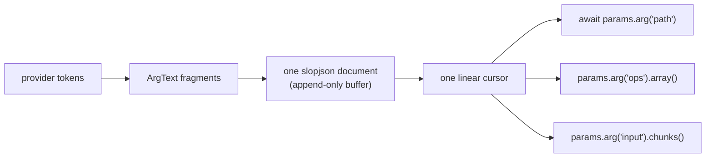

# Parameters: the invocation state machine and the streaming pull cursor

> **Design document, not a runtime API guarantee.** This corpus includes proposed
> interfaces and historical implementation observations. See
> [implementation status](implementation-status.md) for current owners and known gaps.

This document owns two things. First, `omp.InvocationPhase` — the single seven-state machine every tool invocation walks from first stream delta to durable outcome; [00-overview.md](00-overview.md), [01-devices.md](01-devices.md), [05-hooks.md](05-hooks.md), and [06-policy.md](06-policy.md) link here rather than defining their own. Second, `omp.IncomingParams` — a typed, linear, streaming cursor over the argument document: you *pull* the values you need, each one resolving the instant its closing delimiter arrives.

Scope, stated before anything else because Revision 1 got it wrong: **the pull cursor is core-tool-internal machinery in v1.** The first revision of this document opened with "`omp.IncomingParams` is the only way a device sees its arguments," which quietly made speculative streaming the public contract for every extension device — while [01-devices.md](01-devices.md) described a device receiving one complete, committed object. The review called this "two different products," and the resolution is the review's: the v1 public device contract is `async def device(args: Args, ctx: omp.Context)` — the body receives **final, policy-approved effective arguments** and starts only at `EFFECTS_AUTHORIZED` ([01-devices.md](01-devices.md) owns that contract). Core tools keep the streaming cursor internally, in Rust. The Python surface documented in this file reaches third parties only through `@streaming_device`, a separate, explicitly named facility that is **not in v1** and will not ship until the benefit is measured. Protocol selection is only ever by decorator — never inferred from a return annotation, an omitted field, or a manifest subtlety. Everything below is therefore fully specified — the cursor exists and core tools exercise it — but nothing below is a thing a v1 extension author writes.

This removes pi's central defect at the input boundary. Pi streamed arguments as `Partial<T>` snapshots, smuggled the raw text into the args object under a magic `__partialJson` key (`/work/pi/packages/coding-agent/src/tools/xdev.ts:236-237`), and left every tool to re-derive JSON structure by hand from that string. `dropIncompleteLastEdit` counts braces, tracks escapes, and probes with `/\{/.test(tail)` to guess whether a trailing array element has closed (`/work/pi/packages/coding-agent/src/edit/streaming.ts:134-190`). `extractPartialBashEnv` regex-searches `"env"\s*:\s*\{` and re-lexes the object body (`/work/pi/packages/coding-agent/src/tools/bash.ts:468-474`). And because the magic key is an ordinary property, a renderer has to hide it again (`json-tree.ts:16`). Partial-JSON semantics are computed once, by the parser, and handed out through a cursor. Nobody counts braces.

## Concepts

### One function, one lifetime

A streaming device is one async generator. It receives the cursor, yields progress, and yields exactly one terminal event. There is no `renderCall`, no `execute`, no `renderResult`; the "during" and "after" pictures are the same fold over the same stream (see [02-verdicts.md](02-verdicts.md)). The v1 `(args, ctx)` device keeps the same event vocabulary when it returns an iterator — one lifetime, one terminal event — it just starts later, at `EFFECTS_AUTHORIZED`.

```python
from collections.abc import AsyncIterator

import omp

@streaming_device("lint", family="lint", rev=2, place="env")   # not in v1; see above
async def lint(params: omp.IncomingParams, ctx: omp.Context) -> AsyncIterator[omp.Ev]:
    path = await params.arg("path")             # resolves at the closing quote
    yield omp.Update(stage="parsing", path=path)
    ...
    await params.committed()                    # EFFECTS_AUTHORIZED from here
    yield omp.Done(LintPayload(...))
```

Because there is one function, there is one lifetime and therefore one piece of state. Pi opened the file in `renderCall` to compute a preview and opened it *again* in `execute`; nothing connected the two. Here the document lease taken before effect authorization is the same lease the effect runs against.

### The cursor is linear



One invocation owns one append-only text buffer and exactly one cursor over it. In Rust that linearity is the borrow checker: `IncomingDoc::json` hands out a cursor that mutably reborrows the document, and every child cursor retains that borrow (`crates/core/src/slopjson/incoming.rs:250-259`). Python has no borrow checker, so linearity is enforced dynamically: **at most one pull may be pending at a time.** `asyncio.gather(params.arg("a"), params.arg("b"))` raises `omp.ParamsMisuse`; awaiting them in sequence is correct and cheap.

This is not an implementation limitation being papered over. Fan-out is what makes a stuck invocation invisible: two coroutines each waiting on a key that will never arrive look exactly like two coroutines making progress. Serialized pulls turn the same situation into one `ArgFault` naming one path.

There are no snapshots, no per-field events, and no broadcast channels — the same guarantee the Rust module header states (`crates/core/src/slopjson/incoming.rs:6-9`).

### Completeness is a delimiter, not a flag

Nothing tells you arguments are "complete". A value *is* complete when its delimiter closes, and the cursor resolves at that moment.

| Shape | Resolves when | Notes |
|---|---|---|
| string | closing `"` (or `'`) arrives | `chunks()` yields decoded prefixes before that |
| number | a value terminator follows the digits | a bare `12` at end-of-buffer is still incomplete |
| `true`/`false`/`null` | value terminator follows the literal | including Python `True`/`False`/`None` |
| array | closing `]` arrives | `array()` hands you each element as it *starts* |
| object | closing `}` arrives | `object().key(k)` resolves when `k`'s value starts |

Two consequences worth internalising. First, a scalar is not complete merely because it parsed — structural garbage after a value surfaces as `omp.ArgIssueKind.INCOMPLETE` rather than a silently misparsed pull (`crates/core/src/slopjson/incoming.rs:29-34`). Second, string chunks contain only bytes whose *decoded meaning is stable*, so a `\uD83D\uDE00` surrogate pair spanning three fragments is never emitted half-decoded.

### One state machine, seven phases

Revision 1 of this document drew a two-phase picture here — `SPECULATION | EFFECT`, one gate between them, named `Phase`. That machine is deleted, and the deletion is a material reversal worth spelling out. Two things were wrong with it. The name collided outright with [00-overview.md](00-overview.md)'s extension lifecycle enum (now `omp.LifecyclePhase`; the invocation machine is `omp.InvocationPhase`). And the single gate forced the word "commit" to carry three meanings at once — the assistant item becoming durable, policy admission completing, and effects becoming authorized — which produced a real ordering contradiction across the document set: 06-policy had admission answered while the invocation was still speculative and preceding the gate, while a proposed hooks wire addition had the admission query emitted after `ArgsCommitted`. A two-state machine cannot even express that question, let alone answer it.

This document now owns the one machine, and every sibling links here:

```text
OPEN
  raw fragments accumulate; preview pulls resolve as their delimiters close

ARGS_FINALIZED
  requested target and canonical requested args are fixed
  surface-syntax repairs recorded; duplicate-key checks passed

ADMISSION
  hook phases inspect and transform the requested call
  (phase order: 05-hooks; policy semantics: 06-policy)

ADMITTED
  effective target and effective args are immutable
  approval/policy receipt fixed

ASSISTANT_ITEM_COMMITTED
  the model call is durable and was not abandoned

EFFECTS_AUTHORIZED
  Core/Environment issues an unforgeable effect token

SETTLED
  one durable CallOutcome (02-verdicts)
```

**"Commit" is reserved for exactly one transition.** `ASSISTANT_ITEM_COMMITTED` — the streamed assistant item landed durably — is the only thing this document set calls a commit. What Revision 1 called "the commit gate" was two transitions wearing one name: the assistant-item commit and effect authorization. What it occasionally called "committing arguments" is now finalization (`ARGS_FINALIZED`), and what policy does is admission (`ADMISSION → ADMITTED`). The renames are not cosmetic: a call can be `ADMITTED` — arguments finalized, hooks run, approval receipt in hand — and *never* reach `EFFECTS_AUTHORIZED`, because the streamed assistant item was abandoned: the model changed its mind mid-stream, the turn was lost, the user hit Esc. Under the old vocabulary that call was "uncommitted" in three different senses; under this one it is precisely `ADMITTED`, dropped before `ASSISTANT_ITEM_COMMITTED`, world untouched by construction.

Each transition fixes journal facts, and the machine is exactly the list of facts it pins:

| Transition reached | Journal fact fixed, immutably |
|---|---|
| `ARGS_FINALIZED` | `requested_args` — the raw emission plus the canonical requested object, with every surface-syntax repair recorded alongside |
| `ADMITTED` | the transformation trail, `effective_args`, and the admission receipt |
| `ASSISTANT_ITEM_COMMITTED` | the durable assistant item this invocation answers |
| `EFFECTS_AUTHORIZED` | the effect-authorization timestamp and the effect token's scope |
| `SETTLED` | the one durable `CallOutcome` ([02-verdicts.md](02-verdicts.md)) |

On the wire today, the loop opens an invocation the moment a stream delta names the device and sends exactly one `ArgsCommitted` frame once the assistant item actually lands. **A call that exists only in stream deltas never gets that frame**, and the environment refuses effect operations before authorization. The env-side contract already says so: "The env may prepare work after this request, but must not perform effects until ArgsCommitted arrives" (`crates/proto/proto/omp/env/v1/env.proto:56-57`), and `ArgsCommitted` is annotated "The sole effect-commit gate" (`env.proto:76`). Read that annotation with today's wire in mind: the current frame collapses `ASSISTANT_ITEM_COMMITTED` and `EFFECTS_AUTHORIZED` into one instant, which is exactly the conflation the machine above names apart — the frame marks the assistant-item commit, and the effect token becomes a distinct grant once admission and authorization carry their own receipts.

Pi has no pre-settlement phases to name. Nothing runs until the assistant message has settled and its stop reason qualifies — `const runnableStop = message.stopReason === "toolUse" || message.stopReason === "stop"` (`/work/pi/packages/agent/src/agent-loop.ts:1306-1307`) — after which a "prepare phase" validates arguments and only then dispatches (`agent-loop.ts:2097`, `2447-2449`). That is the whole multi-second window in which the path was already known and nothing could use it. omp names the same window's states explicitly — and, for core streaming tools, does real disposable work inside it.

Three properties of the machine are easy to get wrong:

- **Authorization authorizes; it validates nothing.** `await params.committed()` (below) does not check your arguments, your permissions, or your plan — those questions were settled at `ARGS_FINALIZED` and `ADMITTED` respectively. It tells you exactly one thing: the effect token exists.
- **Pre-authorization work is disposable, but the lease is not.** A preview document lease taken by a core streaming tool during the open phases *survives* authorization, so the revision your dry-run pinned is the revision your effect targets. No reopen, no race. Leases are [11-env.md](11-env.md). (Third-party device bodies start at `EFFECTS_AUTHORIZED` in v1, so for them there is nothing earlier to preserve — deliberately: code must not read DATA a denial would have kept from it, the confidentiality rule [06-policy.md](06-policy.md) states.)
- **The refusal is enforced where the resources are.** The authorization gate is checked env-side, in Rust, never in Python. For a device with `place="env"` or a `place="worker:<name>"` that is co-located with an omp Environment, that means the environment holding the documents — which for a remote workspace is the remote environment, not the client's disk (see [04-placement.md](04-placement.md), [11-env.md](11-env.md), and [14-deploy.md](14-deploy.md)). The gate travels with the invocation. The one place it cannot be enforced is a `place="worker:<name>"` on a bare host with no omp Environment: there is no docserver there, so there is no gate and no guarantee, which is exactly why such a worker must declare itself compute/read-only. Do not write a device that performs effects on a bare-host worker and expect the authorization gate to have protected anything.

### Charitable decoding in three layers

Strict validation burns money. The model writes `file_path` when the schema says `path`, sends `"true"` for a boolean, emits a bare string where a one-element list was wanted. Rejecting those costs a round-trip on a call whose intent was never ambiguous.

Pi's answer was a 2,100-line central validator that guesses repairs from outside the tool: `validateToolArguments` runs seven pre-validation normalization passes and then up to `MAX_COERCION_PASSES` issue-driven coercion rounds, re-running every normalization after each round (`/work/pi/packages/ai/src/utils/validation.ts:1911-2120`). It has a hardcoded list of identifier-ish key names including `"file_path"` and `"filePath"` (`validation.ts:984-986`) because the framework, not the tool, was forced to know what tools mean. It still cannot express "for `edit`, a bare string is a one-op list."

omp splits the job by who actually knows the answer:

1. **A tolerant parser at the bottom.** `omp_core::slopjson` accepts single-quoted strings, unquoted keys, Python literals, comments, trailing and stray commas, invalid escapes, hex/binary integers, relaxed numbers, raw control characters inside strings, and bareword values — while still refusing input that is not complete enough to trust (`crates/core/README.md`). No tool sees a parse error for something a human would call obviously valid.
2. **Declared aliases and coercions on the pulled types.** The names models are RL'd against are data about model behaviour, so they are declared, versioned with the rev, and owned by the device.
3. **Validation scoped to what you pulled — for previews only.** During `OPEN`, a param you pull is required and a param you never touch is never type-checked, so a preview can begin before the document finishes. This is asserted today: `pull_validates_only_the_requested_value_and_ignores_unknown_malformed_json` (`crates/tool/tests/contracts.rs:552`) pulls `wanted` out of the literal text `{"wanted":7,"unknown":[}` — a document that no complete parse could ever accept. Revision 1 presented that as the validation story; it is now the *preview* story. A document whose tail is structurally malformed never reaches `EFFECTS_AUTHORIZED`: partial pulls are preview-only, and finalization requires the whole document to parse.

And one invariant keeps the data honest: **the raw emission is journaled with every repair flagged alongside it.** Launder arguments silently and you cannot measure model argument quality against data you have already corrected.

### Strict at ARGS_FINALIZED

Charitable decoding repairs **surface syntax only** — quoting, literal dialect, delimiter noise, declared aliases and coercions. It never repairs semantic ambiguity, because a repair that picks one of two meanings is a guess wearing a uniform. Revision 1 tolerated exactly such a guess: duplicate keys resolved by position or by last-write-wins depending on which API you asked (see `omp.ArgObject` below for the recorded reversal), which opened the three-interpretations hole the review named — policy evaluates one `path`, a device pull evaluates another, a whole-object decode a third.

At `ARGS_FINALIZED` the finalizer therefore rejects, as `ArgIssueKind.AMBIGUOUS`:

- a duplicate canonical key;
- a canonical key and one of its aliases both present;
- two aliases mapping to the same canonical field.

Every repair that *is* applied — alias match, coercion, parser tolerance, elision — is recorded exactly, alongside the raw emission. The output is **one canonical effective object**, and policy, the device body, the journal, and telemetry all read that one object; no consumer ever re-derives its own interpretation from the raw text. Open passthrough maps (an `env` block, an MCP payload) do not weaken this: they must be declared with an explicit `additional_properties=True` marker on the params field, and their members are still checked for duplicates.

## Reference

Everything in this section rides the CONTROL socket, multiplexed per invocation. Pull latency is bounded by provider token cadence, not by the harness: a pull that resolves "immediately" resolves in one CONTROL round trip (tens of µs) once the bytes are present. Nothing here is per-token from Python's side; the fragment feed is consumed in Rust and Python is woken only when a pull can be answered.

One thing to hold while reading, stated once here rather than repeated per symbol: **this is the target contract, and the transport under it is not finished.** CONTROL exists in embryo as the `toolhost/v1` stdio protocol, which today ships committed arguments in one frame and carries no speculative feed at all (`crates/proto/proto/omp/toolhost/v1/toolhost.proto:66-67`). The DATA edge that the effect phase depends on is specified and partly wire-complete but not reachable from Python. [00-overview.md](00-overview.md) states the topology and its current gaps; the closing section of this document states exactly which frames and which wiring the pull cursor needs, and none of it requires renumbering anything that exists.

### Event vocabulary

A device yields `Ev` values. `Update` may be yielded any number of times; exactly one terminal event ends the stream. The host fuses the stream after a terminal event — anything yielded afterwards is discarded, which `aborted_verdict_is_terminal_and_fuses_every_later_event` (`crates/tool/tests/contracts.rs:381`) and `pulled_mismatch_erases_to_args_verdict_and_fuses_every_later_event` (`contracts.rs:350`) both pin.

```python
type Ev = Update | Args | Aborted | Done | Detached
```

#### `omp.Update(**fields)` / `omp.Update(payload)`

Ephemeral typed progress. Never enters transcript history; it is folded by the UI renderer keyed by `(name, rev)` (see [02-verdicts.md](02-verdicts.md)) and mirrored to the telemetry firehose ([10-telemetry.md](10-telemetry.md)). Fields must be JSON-serializable. Rides CONTROL; latency class per-update; fail-open — a malformed update is dropped with a journal note and the invocation continues.

```python
yield omp.Update(stage="dry_run", section=path, added=12, removed=3)
```

#### `omp.Args(issue: ArgIssue)`

Terminal. Structured failure of a parameter the device *pulled*. Yielding this is equivalent to letting `omp.ArgFault` escape the generator; prefer raising, and use the explicit form only when you are converting an issue you caught. Settles the invocation as `CallOutcome: ArgsRejected` (Rust `Verdict::Args`) in the journal.

#### `omp.Aborted(abort: Abort)`

Terminal. Structured cancellation, skip, or effect-uncertainty report. Settles the invocation as `CallOutcome: Aborted`.

#### `omp.Done(result, *, useless: bool = False)`

Terminal. `result` is either a `Payload` or a `Fault` instance ([02-verdicts.md](02-verdicts.md) owns both). `useless=True` marks the result as one whose model-facing projection may be compacted away while the structured truth survives — a no-op edit, a read whose content the model already has.

#### `omp.Detached(job: JobRef)`

Terminal for this turn only. Work continues outside the turn and settles through the job board; the artifact appears under an `artifact://` or `job://` URL in a later turn ([09-journal.md](09-journal.md)). The environment resource named in `job` remains the authoritative owner and remains killable.

#### `omp.Abort`

Structured reason an invocation produced no normal verdict. Its frozen fields are `kind: str`
(`"skipped"`, `"interrupted"`, `"effects_unknown"`, `"input_dropped"`, or
`"missing_outcome"`) and `detail: str | None`; the constructors below are the
authoritative way to build each variant.

| Constructor | Meaning | Typical origin |
|---|---|---|
| `omp.Abort.skipped(reason: str)` | The call was deliberately not started | a hook returned `Deny`; a precondition made execution pointless |
| `omp.Abort.interrupted(reason: str)` | Interruption observed *before* any effect could land | steering before effect authorization |
| `omp.Abort.effects_unknown(reason: str)` | Cancellation raced an effect; only the resource owner can report | interrupt arriving mid-transaction |
| `omp.Abort.input_dropped()` | The invocation feed disappeared before the assistant item committed | turn loss, abandoned call |
| `omp.Abort.missing_outcome()` | The generator ended without a terminal event | device bug; synthesized by the host |

`effects_unknown` is not a softer `interrupted`. Use it whenever you cannot prove the world is untouched — the honest answer is always cheaper than a wrong one.

Every `omp.Abort` settles as `CallOutcome: Aborted`; the durable shape — `kind: CANCELLED | SKIPPED | POLICY_DENIED` and the structured `PolicyDenied` payload a hook denial carries — is [02-verdicts.md](02-verdicts.md)'s to define.

### `omp.IncomingParams`

The cursor. Constructed by the host, never by extension code.

#### Properties

| Property | Type | Semantics |
|---|---|---|
| `name` | `str` | Wire name of the device as the model saw it (`"edit"`, not `"edit@hl.3"`). |
| `rev` | `omp.Rev` | `family@rev` of the revision being executed. Never rode the wire; see [02-verdicts.md](02-verdicts.md). |
| `invocation_id` | `str` | Stable id correlating this invocation across CONTROL, DATA, journal, and telemetry. |
| `owner` | `str \| None` | Authenticated owner of the persistent resources this invocation may touch. `None` for unscoped invocations. Mirrors `IncomingParams::owner` (`crates/tool/src/incoming.rs:180-183`). |
| `phase` | `omp.InvocationPhase` | The phase this invocation has reached. Non-blocking observation. |
| `is_authorized` | `bool` | `phase >= omp.InvocationPhase.EFFECTS_AUTHORIZED`. Non-blocking; never awaits. Revision 1 named this `is_committed`; renamed because "commit" is reserved for `ASSISTANT_ITEM_COMMITTED`. |
| `deadline` | `omp.Duration \| None` | Remaining time budget for this invocation, or `None` when the loop set none. The loop owns the deadline; you do not enforce it. Revision 1 typed this as bare float seconds; the value type is `omp.Duration` — bare-seconds floats are gone from every public signature. |

`phase` and `is_authorized` are observations, not gates. Branching on `is_authorized` to decide whether to attempt an effect is a bug: await `committed()` instead, so the environment and the journal agree on when your effects began.

#### `params.arg(name, *, alias=(), coerce=None, example=None) -> Arg`

Returns a cursor bound to one top-level argument. Cheap and synchronous: no I/O, no waiting, no allocation beyond the path segment. The pull happens when you await the `Arg` or one of its shape methods.

- `name` — the canonical key. During `OPEN`, a preview pull resolves against the first occurrence, matching `IncomingObject::key` (`crates/core/src/slopjson/incoming.rs:444-448`); a duplicate canonical key is rejected at `ARGS_FINALIZED` as `ArgIssueKind.AMBIGUOUS`, so no interpretation a preview showed can diverge from the one object everything downstream shares.
- `alias` — additional accepted key names for this pull, merged with any declared on the params type. Exactly one of `(name, *alias)` may appear in the document; two of them present is `AMBIGUOUS` at finalization. The repair record names which alias matched.
- `coerce` — an `omp.Coerce` member or tuple of members applied to the pulled value, overriding the declared coercions for this pull.
- `example` — a worked example string attached to any `ArgFault` raised by this pull.

Awaiting the `Arg` directly decodes against the declared type for that key on the device's params type. Raises `omp.ArgFault`. Rides CONTROL; latency class per-value (provider-bound). Fail-closed: an unresolvable pull terminates the invocation with `CallOutcome: ArgsRejected`.

```python
path = await params.arg("path", alias=("file_path", "filename", "file"))
```

#### `await params.args(shape=None) -> Any`

Explicitly opts into decoding the *complete* argument shape. Waits for input completion and strict finalization (`ARGS_FINALIZED`), then decodes the canonical effective document into `shape` (defaulting to the device's declared params type). Inside `@streaming_device` this is the "simple" path and it is itself a pull — though note that in v1 the genuinely simple device never touches this file at all: it is an ordinary `(args, ctx)` device and receives this same finalized object as its argument. Mirrors `IncomingParams::whole` (`crates/tool/src/incoming.rs:200-204`).

Raises `omp.ArgFault` with `path=()` and `kind=MALFORMED` when the finished document does not decode, `kind=AMBIGUOUS` when finalization rejected a duplicate key or alias collision, or `kind=ABORTED` when input was abandoned. Note the ordering: `args()` never decodes aborted input, so a dropped feed is `ABORTED`, never a spurious malformed-JSON complaint.

```python
@streaming_device("edit", family="hl", rev=3, place="env")
async def edit(params, ctx):
    args = await params.args()          # hashline is one text field; nothing to stream
```

#### `await params.raw() -> str`

The exact requested argument text — byte-identical to what the provider emitted, before any repair. Resolves as soon as the document is complete. This is the value the journal keeps as `requested_args`, and reading it is how a device double-checks a repair it did not expect. Raises `omp.ArgFault` (`kind=ABORTED`) if the feed is abandoned first.

The invocation framing guarantees the journal and the feed agree: fragments are accumulated and the finalized text is compared against them, and a mismatch is a protocol violation rather than a silent overwrite (`crates/tool/src/incoming.rs:326-333`).

#### `await params.committed() -> str`

The effect-authorization gate. Resolves when the invocation reaches `EFFECTS_AUTHORIZED`, with the canonical effective argument text — the text of the one object frozen at `ADMITTED`, the same object policy evaluated and the journal holds as `effective_args`. Reaching it requires the whole chain: finalization passed, admission froze the effective call, the assistant item durably committed, and the effect token was issued. An invocation whose assistant item is abandoned never resolves this await.

Revision 1 described this method as "everything before this line is speculation; everything after is effect," and described its resolution as "the call is durable." Both formulations are retired with the two-phase machine: durability is `ASSISTANT_ITEM_COMMITTED`, one transition earlier, and what this await actually delivers is authorization — the effect token exists and the environment will now accept effect operations for this invocation. It still validates nothing: argument validity was settled at `ARGS_FINALIZED`, policy at `ADMITTED`.

Raises:
- `omp.CommitAborted` — the assistant item was never committed: the feed dropped, the model abandoned the call mid-stream, the turn was lost. The correct response is almost always to yield nothing and let the host synthesize `Abort.input_dropped()`; the world is untouched by construction.
- `omp.ParamsProtocol` — framing violated the linear stream contract (duplicate commit frame, argument text after the commit frame, finalized text disagreeing with the fragments).

Rides CONTROL; latency class per-call. `commitment_is_explicit_and_feed_guard_drop_aborts` (`crates/tool/tests/contracts.rs:591`) pins both arms, and `erased_tool_does_not_run_before_explicit_argument_commitment` (`contracts.rs:332`) pins that nothing executes without it.

```python
lease = await omp.env.docs.open(path)          # OPEN: lease pins revision N
ops = []
async for op in params.arg("ops").array():
    ops.append(await op)
    yield omp.Update(preview=await dry_run(lease, ops[-1]))
await params.committed()                  # EFFECTS_AUTHORIZED
yield omp.Done(await lease.edit(ops))     # still revision N
```

#### `params.interruptable() -> InterruptibleParams`

Returns a view over the same cursor whose pulls and `committed()` wait resolve early when a steering interrupt arrives. This is the *entire* cancellation surface for the argument phase — there is no per-device `interruptible` flag, because pi proved that taxonomy is one tool authors get wrong.

Marking a pull interruptable is a statement about *your* work, not about the tool: it means "if the user is steering, my remaining pre-authorization work is worthless, resolve early." A device that purely waits selects on it and yields partial truth as a normal `Done`. A device that ignores interrupts gets its invocation guard dropped after `omp.params.INTERRUPT_GRACE`, and in a runtime with structural cancellation that drop is real.

```python
try:
    await params.interruptable().committed()
except omp.Interrupted as stop:
    yield omp.Aborted(omp.Abort.interrupted(stop.reason))
    return
```

The core `glob`, `grep`, and `write` tools already use exactly this shape (`crates/tools/src/glob.rs:271`, `crates/tools/src/grep.rs:414`, `crates/tools/src/write.rs:415`).

#### `params.take_interrupt() -> Interrupt | None`

Removes and returns the oldest interrupt observed by a *non*-interruptable operation, or `None`. Non-blocking. Use it after a pull you did not mark interruptable, to notice steering that arrived while you were waiting without having abandoned the pull.

#### `await params.next_interrupt() -> Interrupt`

Waits for and consumes the next structured interrupt. This is the cooperative-cancellation arm for resource operations that begin *after* effect authorization: race it against your effect and report honestly.

Raises `omp.InterruptClosed` when the invocation owner disappeared before sending another interrupt. That is reported separately from an interrupt on purpose — when the owner is gone, you must establish terminal effect truth yourself, which usually means `Abort.effects_unknown`.

```python
done, pending = await asyncio.wait(
    {asyncio.create_task(apply_edit()), asyncio.create_task(params.next_interrupt())},
    return_when=asyncio.FIRST_COMPLETED,
)
```

The core `edit` tool uses the Rust equivalent — `select_biased!` over the document transaction and `next_interrupt()`, reporting `Abort::EffectsUnknown` on either arm of the interrupt branch (`crates/tools/src/edit.rs:562-575`).

### `omp.Arg`

A cursor for one JSON value. Every method below is an awaitable or an async iterator; none of them do work until awaited.

| Method | Returns | Resolves at | Raises |
|---|---|---|---|
| `await arg` | declared type | value's closing delimiter | `ArgFault` |
| `await arg.text()` | `str` | closing quote | `ArgFault(TYPE_MISMATCH)` if not a string |
| `arg.chunks()` | `AsyncIterator[str]` | each stable decoded prefix | `ArgFault` |
| `arg.lines()` | `AsyncIterator[str]` | each `\n` inside the string | `ArgFault` |
| `await arg.number()` | `float` | value terminator | `ArgFault(TYPE_MISMATCH)` |
| `await arg.integer()` | `int` | value terminator | `ArgFault(TYPE_MISMATCH)` for non-integral |
| `await arg.boolean()` | `bool` | value terminator | `ArgFault(TYPE_MISMATCH)` |
| `await arg.null()` | `None` | value terminator | `ArgFault(TYPE_MISMATCH)` |
| `await arg.value()` | `str \| int \| float \| bool \| None \| list \| dict` | closing delimiter | `ArgFault` |
| `await arg.typed(T)` | `T` | closing delimiter | `ArgFault(MALFORMED)` |
| `await arg.raw()` | `str` | closing delimiter | `ArgFault` |
| `arg.array()` | `ArgArray` | — (cheap) | — |
| `arg.object()` | `ArgObject` | — (cheap) | — |
| `await arg.optional(default)` | declared type or `default` | closing delimiter, or container close | never raises `MISSING` |

`arg.path` is the pulled path as a tuple of `str | int`, the same path that appears in any `ArgIssue` this cursor produces. `arg.raw()` returns the exact source span of this value, which is how a device that wants to journal or re-parse a subtree gets the bytes without re-deriving the span itself.

`chunks()` and `lines()` are the answer to "I want a growing preview." They emit in order, without overlap, and stop after the closing quote. `lines()` is `chunks()` split on newlines with the trailing partial line withheld — precisely the behaviour pi hand-rolled as `trimTrailingPartialLine` (`/work/pi/packages/coding-agent/src/edit/streaming.ts:459-463`), except the withholding happens once, in the parser, instead of once per edit dialect.

`optional(default)` is the only way to pull a value without making it required. It is deliberately explicit: `arg("limit")` on a missing key is `ArgFault(MISSING)`, because a device that pulls a value has declared it needs one.

### `omp.ArgArray`

A linear cursor over array elements.

- `__aiter__() -> AsyncIterator[Arg]` — yields one `Arg` per element **as that element starts**, not when it finishes. Iteration ends only after the array's closing `]`. Each element cursor reborrows the array, so you must finish with one element before advancing — `async for` does this naturally; stashing element cursors for later does not, and raises `omp.ParamsMisuse`.
- `await next() -> Arg | None` — the explicit form of one iteration step. `None` after the closing bracket.
- `await collect() -> list` — waits for the closing bracket and returns every fully parsed element. The whole-array pull.
- `index` — number of elements handed out so far.

This is the method that deletes `dropIncompleteLastEdit`. The element cursor exists as soon as the element opens; awaiting it resolves when the element closes. There is nothing left to guess.

```python
ops = params.arg("ops").array()
async for op in ops:
    spec = await op                      # resolves at this element's `}`
    yield omp.Update(dry_run=await preview(lease, spec))
```

### `omp.ArgObject`

A linear cursor for keyed pulls.

- `key(name, *, alias=(), coerce=None, example=None) -> Arg` — a cursor bound to `name` (or its declared alias). Cheap. Awaiting it resolves as soon as the key's value starts. Duplicate-key semantics are `params.arg()`'s: the first occurrence answers preview pulls during `OPEN`; any duplicate among the canonical name and its aliases is `AMBIGUOUS` at `ARGS_FINALIZED`.
- `await collect() -> dict` — waits for the closing brace and returns the object. A duplicate key raises `omp.ArgFault` with `kind=AMBIGUOUS`.
- `keys()` — `AsyncIterator[tuple[str, Arg]]`, yielding each member as it opens. Only fields declared `additional_properties=True` (see `@omp.params` below) support it; calling it on a closed-schema field raises `omp.ParamsMisuse`. Use it for genuinely open maps (an `env` block, an MCP passthrough payload); use `key()` for anything you named in a schema.

Revision 1 documented a load-bearing divergence here: `key()` bound the first occurrence of a duplicate key while `collect()` used last-write-wins, mirroring the split the Rust cursors document (`crates/core/src/slopjson/incoming.rs:23-27`), and told consumers who cared about duplicates to detect them themselves via `raw()`. That is deleted, deliberately. Two resolution rules over one document meant a preview pull, a whole-object decode, and a policy evaluation could each act on a *different* value of the same argument — the review's three-interpretations hole. The Rust crate still carries the split today; the finalizer work item in the build section closes it by rejecting duplicates outright, which is the only answer that leaves one canonical object.

### `omp.InterruptibleParams`

The view returned by `params.interruptable()`. Exposes exactly the pull surface, with interrupt observation: `arg`, `whole`, `raw`, `committed`. It holds no state of its own — it is a thin view over the same cursor, so mixing interruptable and non-interruptable pulls in one device is fine and common (pull the cheap keys plainly, mark the long wait interruptable).

Interruptable operations raise `omp.Interrupted` instead of returning. Non-interruptable operations queue the interrupt for `take_interrupt()`.

### `omp.Interrupt`

```python
@dataclass(frozen=True, slots=True)
class Interrupt:
    kind: str      # stable interrupt class supplied by the loop
    reason: str    # human-readable reason or steering item
```

`kind` is the Rust `class` field renamed, because `class` is a Python keyword; the wire name is unchanged. The loop is the only producer. Classes shipped today:

| Constant | Value | Meaning |
|---|---|---|
| `omp.Interrupt.STEERING` | `"steering"` | The user sent a new message mid-turn. `reason` carries the steering text. |
| `omp.Interrupt.ESCAPE` | `"escape"` | The user explicitly cancelled. |
| `omp.Interrupt.DEADLINE` | `"deadline"` | The loop's deadline for this invocation expired. |
| `omp.Interrupt.SHUTDOWN` | `"shutdown"` | The session is terminating. |

Treat `kind` as an open set: match the ones you handle, fall through on the rest. An unknown class is still an interrupt.

### `omp.ArgIssue` and `omp.ArgIssueKind`

```python
@dataclass(frozen=True, slots=True)
class ArgIssue:
    path: tuple[str | int, ...]   # full pulled key/index path
    expected: str                 # requested shape, in prose the model can act on
    kind: ArgIssueKind            # stable failure class
    example: str | None = None    # a valid worked example
    found: str | None = None      # observed shape, for TYPE_MISMATCH
```

`path` is what makes a fault trainable. `"validation error at $.ops[0]"` trains nothing; a path plus an expected shape plus a worked example trains the retry. The projection into model-facing text is the device's `prompt()` ([02-verdicts.md](02-verdicts.md)) — `ArgIssue` is structured truth, not a message.

This is the input-side half of Lesson #7's ban on ad-hoc strings. In pi a validation failure becomes a text content block on an error tool result — `content: [{ type: "text", text: record.validationErrorMessage }]` with the same string duplicated into `details.error` (`/work/pi/packages/agent/src/agent-loop.ts:2450-2459`). One prose string served the model, the transcript, and any future analysis, and none of them could size it, re-render it under a different rev, or count it. `ArgIssue` is the same information with the string removed.

`ArgIssueKind` has exactly seven members:

| Member | Meaning | Who caused it |
|---|---|---|
| `MISSING` | A required pulled value was absent when its container completed | the model |
| `INCOMPLETE` | Input ended before the pulled value's closing token | truncated generation |
| `ABORTED` | Input was explicitly or implicitly abandoned | the loop (turn loss, cancellation) |
| `MALFORMED` | Complete input could not be parsed or decoded into the requested type | the model |
| `TYPE_MISMATCH` | A value was present with another JSON shape; `found` is set | the model |
| `AMBIGUOUS` | Two candidate values for one canonical field: a duplicate key, a canonical key plus its alias, or two aliases | the model |
| `PROTOCOL` | Invocation framing violated the linear stream contract | the harness — file it |

`ABORTED` deserves special handling: it is not the model's fault and it should not be projected to the model as an argument error. Convert it to `Abort.input_dropped()`, exactly as the core `read` tool does (`crates/tools/src/read.rs:361`).

### `omp.InvocationPhase`

Seven members, ordered: `OPEN`, `ARGS_FINALIZED`, `ADMISSION`, `ADMITTED`, `ASSISTANT_ITEM_COMMITTED`, `EFFECTS_AUTHORIZED`, `SETTLED`. Defined in the concepts section above and owned by this document — [00-overview.md](00-overview.md) (`OperationSpec.minimum_phase` and the phase legality matrix), [01-devices.md](01-devices.md) (the v1 body start), [05-hooks.md](05-hooks.md) (the ADMISSION window), and [06-policy.md](06-policy.md) (admission receipts) link here rather than redefining it. Members compare by order: `params.phase >= omp.InvocationPhase.EFFECTS_AUTHORIZED` is what `is_authorized` reads. An abandoned invocation is dropped from whatever phase it reached — it never regresses, and without `ASSISTANT_ITEM_COMMITTED` it can never reach `EFFECTS_AUTHORIZED`.

Revision 1 defined `Phase = SPECULATION | EFFECT` in this slot. Deleted: the name collided with the extension lifecycle enum, and the two states blurred three distinct transitions under one word. The full reversal is recorded in the concepts section.

### Charitable decoding

#### `@omp.params`

Declares a device's argument shape, with aliases, coercions, and examples attached to the fields. The class is a dataclass; the decorator derives the JSON Schema the model sees, the alias table the cursor consults, and the coercion table applied to pulled values — all versioned with the device's rev.

```python
from typing import Annotated

@omp.params
class EditParams:
    path: Annotated[str, omp.Alias("file_path", "filename", "file"),
                         omp.Example("src/main.rs")]
    ops: Annotated[list[Op], omp.Coerce.SINGLETON, omp.Coerce.JSON_STRING]
    dry_run: Annotated[bool, omp.Coerce.LOOSE_BOOL] = False
    limit: Annotated[int | None, omp.Coerce.INTEGER] = None
    env: Annotated[dict[str, str], omp.Field(additional_properties=True)] | None = None
```

Fields never pulled are never validated during `OPEN`, so adding an optional field is not a breaking change to any existing call. Fields *are* part of the schema the model sees, which is why adding one bumps the rev. The full document must still parse structurally at `ARGS_FINALIZED` — an unknown extra key is tolerated and preserved in the canonical effective object, but a malformed tail is not, and duplicates are `AMBIGUOUS`. An open map like `env` above is open only because it is declared so: `omp.Field(additional_properties=True)` is the explicit marker the finalizer requires before accepting arbitrary members. (Field metadata rides `typing.Annotated` and `omp.Field` — never docstrings on fields, which Python does not reliably retain.)

#### `omp.Alias(*names)`

Declares additional accepted key names. Aliases exist because the names models are RL'd against are data about model behaviour, not accidents — `file_path` is what Claude Code trained on, and refusing it is a round-trip you paid for nothing. Aliases participate in schema generation only as documentation; the wire schema still advertises the canonical name, so the model is nudged toward it while the alias catches the reflex.

Resolution is unambiguous by construction: exactly one of the canonical name and its declared aliases may appear in the document, and the repair record names which one matched. Revision 1 resolved collisions by earliest document-order occurrence; that rule is deleted with the rest of the ambiguity tolerance — a call carrying both `path` and `file_path` is rejected at `ARGS_FINALIZED` as `AMBIGUOUS`, because any priority rule (document order, declaration order) is a guess about which of two values the model meant. Declaration order is not a priority ordering, because there is nothing left to prioritize.

#### `omp.Coerce`

Coercions applied to a pulled value before it is handed to you. Each member is a total function from one JSON shape to another; a coercion that does not apply is skipped, and a value that no coercion rescues raises `ArgFault(TYPE_MISMATCH)` with the original `found` shape. Every coercion that fires is journaled as an `omp.Repair`.

| Member | Accepts | Produces | Rationale |
|---|---|---|---|
| `Coerce.LOOSE_BOOL` | `"true"`, `"false"`, `"yes"`, `"no"`, `"1"`, `"0"`, `1`, `0` | `bool` | Models stringify booleans constantly, especially behind grammar-free sampling. |
| `Coerce.INTEGER` | `"42"`, `42.0` | `int` | Numeric arguments arrive quoted from providers that serialize args as strings. |
| `Coerce.NUMBER` | `"3.5"` | `float` | Same, for reals. |
| `Coerce.STRING` | `42`, `True`, `None` | `str` | A path or identifier emitted unquoted. |
| `Coerce.SINGLETON` | any non-list `v` | `[v]` | "a bare string means a one-op list" — the tool-specific knowledge pi's validator could not express. |
| `Coerce.JSON_STRING` | a `str` whose content parses as the target shape | that shape | Double-serialized arguments; pi called this `normalizeStringEncodedArrayUnions` and had to guess when to apply it (`validation.ts:1244`). |
| `Coerce.STRIP` | `str` with leading/trailing whitespace | trimmed `str` | Pi's `normalizeIdentifierStringWhitespace` with a hardcoded key list (`validation.ts:984-1032`), reduced to one opt-in per field. |
| `Coerce.CSV` | `"a,b,c"` | `["a", "b", "c"]` | Models flatten lists into comma strings when the schema is unconstrained. |
| `Coerce.NULL_ELISION` | `None`, `"null"`, `""` on an optional field | field absent | Pi ran this unconditionally over every schema (`validation.ts:1932-1959`); here it is a declaration. |

Coercions compose in declaration order. `Coerce.JSON_STRING` followed by `Coerce.SINGLETON` handles `'"{\"path\":\"a\"}"'` → `[{"path": "a"}]`, which is a real provider failure mode and a two-line declaration.

#### `omp.Example(text)`

Defined in [01-devices.md](01-devices.md), where it supplies a device's documented examples. Used as params-field metadata it additionally lands in the `example` of any `ArgIssue` raised on that field's path — one declared value, two consumers, both of which are the model.

#### `omp.Field(description=None, *, additional_properties=False)`

The general metadata carrier for params fields, defined here and used as `Annotated` metadata everywhere a params class is declared ([01-devices.md](01-devices.md) uses it for field descriptions and links here). Two jobs:

- `description` — human- and model-facing field documentation, lowered into the generated JSON Schema. Descriptions are **never** taken from docstrings under a field, because Python does not reliably retain those; `Annotated` metadata is the one carrier that survives (dataclass field metadata is accepted as an equivalent spelling).
- `additional_properties=True` — the explicit open-map marker. The finalizer refuses arbitrary members on any `dict`-shaped field that does not carry it, and `ArgObject.keys()` refuses to iterate one. Openness is a declaration, never an inference from the annotation being `dict`.

#### `omp.Repair` and `omp.RepairKind`

```python
@dataclass(frozen=True, slots=True)
class Repair:
    path: tuple[str | int, ...]
    kind: RepairKind
    detail: str          # e.g. "file_path -> path", "\"true\" -> true"
```

`RepairKind` members: `ALIAS` (a non-canonical key matched), `COERCION` (a declared coercion fired), `TOLERANCE` (the parser accepted a malformation — single quotes, trailing comma, Python literal, unquoted key, invalid escape), `ELISION` (an optional field was dropped as an empty placeholder).

Repairs are read-only from the device's side. `params.repairs()` returns the list observed so far; the host journals them against the raw emission automatically. Attribution rides the existing carrier — `TOOL_REV_PROP` (`"omp/tool-rev"`, `crates/tool/src/lib.rs:46`) is the namespaced thread-item property the loop already stamps every call with (`crates/agent/src/loop.rs:1368-1370`, read back at `loop.rs:1129-1131`) — so "which alias fires under `edit@rep.1` versus `edit@hl.3`" is a query over data already being written, not a parallel stamp this namespace invents ([10-telemetry.md](10-telemetry.md)).

### Exceptions

| Exception | Raised by | Fail behaviour |
|---|---|---|
| `omp.ArgFault(issue: ArgIssue)` | any pull | Escaping the generator settles the invocation as `CallOutcome: ArgsRejected` (Rust `Verdict::Args`). Fail-closed. |
| `omp.CommitAborted` | `committed()` | The assistant item was never committed. Host synthesizes `Abort.input_dropped()`. Fail-closed, world untouched. |
| `omp.Interrupted(interrupt: Interrupt)` | interruptable pulls and waits | Yours to handle; escaping yields `Abort.interrupted(reason)`. |
| `omp.InterruptClosed` | `next_interrupt()` | Yours to handle; escaping yields `Abort.effects_unknown`. |
| `omp.ParamsProtocol(str)` | any pull, `committed()` | Framing violation. Journaled as `ArgIssueKind.PROTOCOL` and reported through `report_issue` ([10-telemetry.md](10-telemetry.md)). |
| `omp.ParamsMisuse(str)` | any pull | The device fanned out, reused a consumed cursor, or stashed an element cursor. A bug in the extension; journaled with a traceback. |
| `omp.EffectsNotAuthorized(invocation, spec)` | `omp.env` effect operations | The environment refused an effect before `EFFECTS_AUTHORIZED`. `.invocation` is the invocation id string and `.spec` is the `OperationSpec` (or its qualified-name string after transport). [00-overview.md](00-overview.md) owns the exception and the `OperationSpec.minimum_phase` rule it enforces; [11-env.md](11-env.md) owns the refusal path. Revision 1 called this `Uncommitted`. Never catch and retry: await `committed()`. |

**Resolved (2026-08-20 ruling):** `EffectsNotAuthorized` carries the positional
`(invocation, spec)` payload owned by `docs/py/00-overview.md`; it is not a one-string error.

`ArgFault` subclasses both `ValueError` and `omp.OmpError`; it exposes `.issue` plus
the direct payload fields `.path`, `.kind`, `.detail`, and `.example`.
`CommitAborted`, `Interrupted`, and `InterruptClosed` subclass
`omp.InvocationEnded`, so `except omp.InvocationEnded` is the one-line
"clean up and stop" handler.

### Constants

| Constant | Value | Meaning |
|---|---|---|
| `omp.params.MAX_NESTING_DEPTH` | `128` | Parser nesting limit; deeper input is `ArgIssueKind.MALFORMED`. Mirrors `Parser::MAX_DEPTH` (`crates/core/src/slopjson/parser.rs:34`). |
| `omp.params.INTERRUPT_GRACE` | `omp.Duration("150ms")` | Time between an interrupt the device ignores and the resource owner reclaiming. Mirrors `ToolWorkerConfig::interrupt_grace`, whose default is `Duration::from_millis(150)` (`crates/app/src/envd/worker.rs:96`) and whose own doc calls it the "courtesy-interrupt grace period before the process group is killed" (`worker.rs:74`). An earlier draft of this document guessed two seconds and typed the constant as bare float seconds; the shipped value is 150 ms and the type is `omp.Duration`. The courtesy window is not the mechanism — see the closing section. |
| `omp.params.MAX_PENDING_PULLS` | `1` | The linearity constant. Documented, not configurable — it exists so the error message can name it. |

## Patterns

A scope note before the worked examples, because Revision 1 blurred it: patterns 1 and 2 are **core tools** — the streaming cursor is theirs, and the shipped implementations are Rust. They are rendered here in Python as the future `@streaming_device` would write them, because that rendering is the clearest specification of the cursor's semantics; no v1 extension author writes this shape. Patterns 3 and 5 are third-party devices in the v1 contract — `(args, ctx)`, final effective arguments, body starting at `EFFECTS_AUTHORIZED` ([01-devices.md](01-devices.md)). Pattern 4 is a hook.

### 1. Hashline `edit` — one text field, whole-pull

`edit` is a core tool, not an extension device, and after Lesson #6 that distinction is structural: core tools ship their schema in every request, everything else is dispatched and documented through the `dyn` builtin inside the core `shell` tool ([01-devices.md](01-devices.md), which also defines `@omp.tool` — the ergonomic soft default — and the dynamic tool policy that decides the surface). It is shown here because it is the canonical cursor example, and because it is the direct answer to `@piex-dev/hashline` and `pi-hashline-edit-pro` (`catalog.md:282`, `catalog.md:198`) — two extensions that existed only to disable pi's built-in `edit` via `setActiveTools` and re-implement streaming previews around `Partial<T>`. In omp there is nothing for them to replace: hashline *is* the core dialect. The Python rendering below is the contract the future `@streaming_device` would get; a v1 device receives the same finalized arguments without the cursor.

The hashline dialect takes a single text field, so there is nothing to stream key-by-key; what it needs is to open documents before effect authorization and dry-run the whole patch first.

```python
@omp.params
class HashlineParams:
    input: Annotated[str, omp.Alias("_input", "patch", "text"),
                          omp.Example("[src/a.rs#1A2B]\nPUT 1.=1:\n+replacement")]

@streaming_device("edit", family="hl", rev=3, place="env", params=HashlineParams)
async def edit(params: omp.IncomingParams, ctx: omp.Context) -> AsyncIterator[omp.Ev]:
    args = await params.args()
    patch = omp.hashline.parse(args.input)          # raises ArgFault(MALFORMED) with example

    # before effect authorization: one lease per section, pinned to the previewed revision
    leases = [await omp.env.docs.open(s.path, expect=s.tag) for s in patch.sections]
    previews = [await lease.dry_run(section) for lease, section in zip(leases, patch.sections)]
    yield omp.Update(
        applied_ops=sum(len(p.ops) for p in previews),
        added=sum(p.added for p in previews),
        removed=sum(p.removed for p in previews),
        preview=omp.diff.compact(previews),
    )

    await params.committed()                        # EFFECTS_AUTHORIZED

    try:
        async with omp.env.docs.transaction() as txn:
            for lease, section in zip(leases, patch.sections):
                await lease.hashline(section)
            receipt = await txn.commit()            # docserver transaction commit (11-env), not the reserved phase word
    except omp.env.Conflict as conflict:
        yield omp.Done(EditFault.stale(conflict))
        return
    yield omp.Done(EditPayload.from_applied(previews, receipt), useless=receipt.no_op)
```

Two pi problems evaporate. The `_input` alias that pi's streaming code had to special-case with `args?.input ?? args?._input` and an apologetic comment about the schema declaring one name while streaming sees another (`streaming.ts:442-449`) is one `omp.Alias`. And the lease that produced the preview is the lease the transaction applies, so pi's "renderCall opens the file, execute opens it again, did it change in between?" question does not arise. (One vocabulary note: `txn.commit()` above is [11-env.md](11-env.md)'s docserver transaction commit, matching its wire frame — a document-domain term, not the reserved invocation-phase word.)

This is the shape the Rust `edit` tool has today, including `whole::<Params>()`, the per-section prepare, the single `Ev::Update` carrying the compact diff, and `params.committed()` immediately before the transaction (`crates/tools/src/edit.rs:377-530`).

### 2. Replace-dialect `edit` — path first, ops streamed

The replace dialect (`edit@rep.1`) is what weaker models get, and it is the shape the blogpost's worked example uses. The extensions it subsumes are `mitsupi`, whose bundle "replaces the normal edit surface with multi-edit/patch support" (`catalog.md:51`), and `pi-readseek`, which "dynamically swaps or extends Pi's built-in file tools with LINE:HASH anchored versions using pi.setActiveTools()" (`catalog.md:165`) — both of which had to reimplement partial-JSON handling from scratch. Here the path completes seconds before the ops do, so the lease opens immediately and each op is dry-run as it closes.

```python
@omp.params
class ReplaceParams:
    path: Annotated[str, omp.Alias("file_path", "filename", "file"), omp.Example("src/main.rs")]
    ops: Annotated[list[ReplaceOp], omp.Coerce.SINGLETON, omp.Coerce.JSON_STRING]

@streaming_device("edit", family="rep", rev=1, place="env", params=ReplaceParams)
async def edit_replace(params: omp.IncomingParams, ctx: omp.Context) -> AsyncIterator[omp.Ev]:
    path = await params.arg("path")
    lease = await omp.env.docs.open(path)                 # pins revision N, seconds early

    previews = []
    async for element in params.arg("ops").array():
        op = await element                           # resolves at this element's `}`
        try:
            previews.append(await lease.dry_run(op))
        except omp.env.Invalid as miss:
            raise omp.ArgFault(omp.ArgIssue(
                path=element.path,
                expected="an `old` string occurring exactly once in the file",
                kind=omp.ArgIssueKind.MALFORMED,
                found=miss.describe(),
                example='{"old": "fn main() {", "new": "fn main() -> Result<()> {"}',
            ))
        yield omp.Update(op=len(previews), preview=previews[-1].compact())

    await params.committed()
    receipt = await lease.edit([p.op for p in previews])
    yield omp.Done(EditPayload.from_applied(previews, receipt))
```

Compare directly against pi. `patchStrategy.extractCompleteEdits` calls `dropIncompleteLastEdit(args.edits, partialJson, "edits")` (`streaming.ts:390-393`), which walks the raw string tracking `depth`, `inString`, `escaped`, records `lastClose`, then regex-tests the tail for `/\{/` to decide whether a new object opened (`streaming.ts:143-190`). `replaceStrategy.extractCompleteEdits` solves the same problem a *different* way in the same tool: it treats `old_string` as untrustworthy until the literal substring `'"new_string"'` appears in the raw JSON, and blanks both fields until then (`streaming.ts:341-348`). `hashlineStrategy` solves it a third way, deliberately *not* trimming the trailing line because trimming would collapse a single-op preview to "No changes" for almost the whole stream (`streaming.ts:531-540`). Three hand-rolled projections of partial JSON, in one tool, each with a comment explaining why the other two are wrong for it. All three are `async for element in params.arg("ops").array()`.

The `ArgFault` raised mid-stream is the other half of the win. In pi, a no-match came back as a rendered `EditMatchError` string from `execute`; here it is a structured issue with the element's path, so `prompt()` can size it to the model's budget and telemetry can count per-rev match failures.

### 3. Deleting `@r3b1s/pi-repair-layer`

`@r3b1s/pi-repair-layer` is described in the catalog as a "tool-input repair layer for the pi coding agent: validate-then-repair for built-in tool calls, ported from the behavior of commandcode's repair layer" (`catalog.md:243`). It exists because pi's validator is central, schema-blind, and not extensible by the tool that knows the answer — so a *third party* shipped a repair pass in front of it. `pi-thinking-only-guard` (`catalog.md:373`) is the same genre, recovering "trapped tool calls from thinking blocks."

In omp there is nothing left for such an extension to do for core tools, because the repairs are declarations on the tools themselves. What remains legitimate is repairing *other people's* devices — an MCP endpoint whose schema says `snake_case` while the model reliably emits `camelCase`. That is a device wrapper, not a global validator — and in v1 it is an ordinary `(args, ctx)` device. Revision 1 wrote this example with cursor pulls, which the re-scoped contract no longer gives third parties; it never needed them, because the declarations do all the work:

```python
@omp.params
class JiraParams:
    summary: Annotated[str, omp.Alias("title", "subject")]
    project_key: Annotated[str, omp.Alias("projectKey", "project")]
    labels: Annotated[list[str], omp.Coerce.CSV, omp.Coerce.SINGLETON]

@omp.device("jira.create", family="mcp-jira", rev=2, place="host", params=JiraParams)
async def jira_create(args: JiraParams, ctx: omp.Context) -> JiraPayload:
    # v1 contract: args are final effective arguments; the aliases and coercions
    # above fired at ARGS_FINALIZED and their repairs are already journaled.
    return JiraPayload(await upstream.create(args.summary, args.project_key, args.labels))
```

Two things are true here that were not true in pi. The aliases are attributable — they carry `jira.create@mcp-jira.2` into the journal, so "which alias actually fires, and is the model learning the canonical name" is a query. And the repair is scoped: it cannot accidentally rewrite an unrelated tool's arguments, which pi's `normalizeIdentifierStringWhitespace` — operating on a hardcoded global key list including `file_path` and `filePath` (`validation.ts:984-986`) — structurally could.

### 4. `@mrclrchtr/supi-bash-timeout` without a hook

`@mrclrchtr/supi-bash-timeout` "mutates the bash tool call input before execution, preserving shorter explicit timeouts while clamping overly long ones" (`catalog.md:184`). In pi that required a `tool_call` hook that received the whole args object, rewrote it, and handed it back — a pre-execution gate whose timeout policy is fail-closed, so a slow hook blocks every bash call (`runner.ts:1437-1443`).

Clamping is a property of the argument, and the place it is decided is the `ADMISSION` phase — after `ARGS_FINALIZED` fixes the canonical requested args, before `ADMITTED` freezes the effective ones. Two boundaries matter here. First, `PLAN.md` §D6 (**D6, One mailbox, no gate chain**, amended 2026-08-19): "A tool batch runs concurrently exactly as the model issued it: no batch-level admission scheduler, no parallelism detection, no reordering. Each invocation gates independently." The scope reading Revision 2 could only state as an interpretation — D6 forbids *batch-level* admission scheduling in the mailbox loop, not the per-invocation decision procedure, which Core runs — is now D6's own text; the wording amendment this document flagged as recommended was ratified in that amendment, and the flag is kept in this sentence as the historical record. Each invocation still gates independently, and one slow approval never serializes the batch; [06-policy.md](06-policy.md) owns the framing. (Revision 1's "Agent Core is a courier" sentence is deleted with that re-read; the reversal is recorded in [05-hooks.md](05-hooks.md).) Second, [05-hooks.md](05-hooks.md) owns the event and the tagged `target` union; the tag is what makes a policy safe, because one that matched on `args["command"]` without checking the target kind would wave through a device dispatch it never inspected.

An earlier draft of this section wrote the handler with an `omp.Priority.NORMALIZE` band; the priority bands are themselves gone in Revision 2, replaced by hook phases. The handler lives where mutation now exclusively lives — `omp.HookPhase.TRANSFORM`, the only phase allowed to return `Modify`, ordered by an explicit `order` ([05-hooks.md](05-hooks.md)) — and uses the uniform `(event, ctx)` callback ABI:

```python
MAX_TIMEOUT = omp.Duration("10m")

@omp.hook("tool_call", phase=omp.HookPhase.TRANSFORM, order=100)
async def clamp_bash_timeout(event, ctx):
    match event.target:
        case omp.CoreTool(name="bash", args=args):
            timeout = args.get("timeout")
            if timeout is None or timeout <= MAX_TIMEOUT:
                return omp.Allow()
            return omp.Modify({"timeout": MAX_TIMEOUT},
                              note=f"clamped timeout {timeout} to {MAX_TIMEOUT}")
        case _:
            return omp.Defer()
```

The interesting part is what the *device* side no longer has to tolerate. `bash`'s params declare `timeout: omp.Duration` — a bare number decodes as seconds, config-style strings (`"90s"`, `"10m"`) parse, and the `"600"` a provider serializes as a string is a declared coercion with a journaled repair — not, as in pi, a value `extractPartialBashEnv` and friends had to reconstruct from `__partialJson` (`bash.ts:468-474`) and the central validator had to guess at. Revision 1 typed this field `Annotated[int, omp.Coerce.INTEGER]`; bare integer-seconds are gone with the rest of the untyped durations.

### 5. `cc-safety-net` — a refusal that cannot leak

`cc-safety-net` "analyzes shell tool calls and blocks destructive git or filesystem commands before execution... The Pi adapter fails closed when a shell call is malformed or command analysis throws" (`catalog.md:186`). Failing closed on a malformed call is correct, and in pi it is also *unavoidable*, because the adapter only ever sees a completed args object and has no way to distinguish "the model is still typing" from "the model emitted garbage."

In the v1 contract the distinction costs nothing either — it just lives one layer down: a truncated generation is rejected at `ARGS_FINALIZED` with `ArgIssueKind.INCOMPLETE` before any device body exists, so the guard below never sees "still typing" at all; it receives final effective arguments. Note what this device is *not*: it does not shadow the core `bash` tool. Extensions register with the *host*, never with the *model* ([01-devices.md](01-devices.md)) — the host must know a device's name, schema, and rev to answer the device catalog and `dyn <name> --help` request at all, which is what `RegisterTools`/`ToolDecl` carries (`crates/proto/proto/omp/toolhost/v1/toolhost.proto:52-64`). So this device is invoked as `dyn shell_guard [args…]`; the schema-derived CLI maps those arguments into one nested JSON document decoded against the device's schema at `ARGS_FINALIZED` ([01-devices.md](01-devices.md) owns the grammar). Gating core `bash` is the job of [05-hooks.md](05-hooks.md)'s `tool_call` event — a PRECHECK deny or a REVIEW classifier, per its phases. What the device owns is the guarded execution path a user or a policy routes to.

That is the target, and it does not hold in the shipped registry yet. `register_worker` inserts worker declarations straight into `self.live` (`crates/tool/src/registry.rs:425`) with a doc comment stating they "participate in identity, hashing, and advertisement" (`registry.rs:409-412`), and `advertise` iterates all of `self.live` and lowers every entry with no route filter — its comment says "for one selected route" but the body contains no route check (`registry.rs:483-492`). So today a Python worker declaration does occupy a slot in the advertised tool array, which is precisely the Lesson #6 failure the design exists to prevent. The fix is small and the seam already exists: `invoke` refuses `ToolRoute::Worker` explicitly (`registry.rs:476-478`) and `live_identities` documents that callers "still need to inspect `route` before granting an execution capability" (`registry.rs:438-440`) — route-awareness is present, `advertise` simply does not consult it. Relatedly, `live_hash` is one digest over every live identity (`registry.rs:458-467`), so it cannot serve as prompt-cache identity once devices exist without falsifying the availability-as-notification claim; [01-devices.md](01-devices.md) owns that split.

```python
@omp.device("shell_guard", family="guard", rev=4, place="env", params=ShellParams)
async def shell_guard(args: ShellParams, ctx: omp.Context) -> AsyncIterator[omp.Ev]:
    ast = omp.shell.parse(args.command)            # real AST, not a regex

    findings = [rule(ast) for rule in RULES]
    blocking = [f for f in findings if f.blocks]
    yield omp.Update(analyzed=len(findings), blocking=len(blocking))

    if blocking:
        # Refused without performing any effect: the world stays untouched.
        yield omp.Done(GuardFault.refused(blocking))
        return

    async with omp.env.sh.session() as session:
        run = await session.run(ast)
        async for event in run:
            yield omp.Update(output=event)
        yield omp.Done(GuardPayload(await run.wait()))
```

Three structural gains. `ArgIssueKind.INCOMPLETE` distinguishes truncation from malformation at finalization, so a cut-off generation is reported as truncation rather than as a policy refusal the model will argue with — and the guard body never runs against it. The refusal performs no effect operation, so the world is untouched not because a gate intervened but because the device never asked the environment for anything — and the arguments it analyzed are the canonical effective object policy admission saw, so the guard and the hooks can never disagree about what was analyzed. And the analysis reads a shell AST (`crates/shell/src/parser/ast.rs`), so "pipes to a network sink" is a question about `Pipeline` and `IoRedirect` nodes rather than a regex over a string, which is what let `cc-safety-net` need a whole second layer for "shell-composition and interpreter bypass patterns."

-----

## What this requires us to build

### `crates/core/src/slopjson`

The cursor machinery is already the right shape and already path-addressed internally, which is the single most important fact for this design: `wait_for(shared, path, mode, expected)` (`crates/core/src/slopjson/incoming.rs:487-496`) and `locate(src, path, ended)` (`incoming.rs:615`) resolve an arbitrary `&[PathPart]` against the append buffer on every poll. The typed cursors (`IncomingJson`, `IncomingString`, `IncomingArray`, `IncomingObject`) are ergonomic wrappers over that. A path-addressed pull service for a non-Rust host is therefore an exposure, not a rewrite.

Four concrete additions:

1. **A public path-addressed handle.** New type `IncomingCursor { shared: Arc<Shared> }` with

   ```rust
   pub fn pull_at(
   	&self,
   	path: &[PullPathSegment],
   	mode: PullMode,
   	expected: &'static str,
   ) -> impl Future<Output = Result<Pulled, IncomingError>> + '_
   ```

   where `PullMode` is the public form of the private `WaitMode` (`incoming.rs:463-472`) — `Started`, `Complete`, `Chunk(usize)` — and `Pulled` carries `kind`, plus `span: Range<usize>` so `Arg.raw()` has bytes. RPITIT, no `BoxFuture`; the future holds only `&self` and a borrowed path.

2. **A repair log.** This is the largest real gap. The tolerant parser accepts single quotes, Python literals, unquoted keys, trailing commas, invalid escapes, hex/binary integers, and bareword values (`parser.rs:70-77`, `177-259`, `374-454`) and reports *nothing* about having done so. The invariant "record the raw emission with the repair flagged alongside it" is therefore not implementable today. Thread a `RepairLog(SmallVec<Repair, 4>)` through `Parser`, pushed only when a tolerance branch fires — zero allocation on clean input, which is the overwhelmingly common case — and expose `IncomingDoc::repairs() -> &[Repair]`. `Repair` is `{ span: Range<usize>, kind: RepairKind }` with `RepairKind` covering the tolerance set the parser already implements.

3. **Alias-aware key selection.** `select_key(parser, wanted: &str, rest, ended, depth)` (`incoming.rs:632-703`) matches one name. Generalize `wanted` to `&[Str]` and return which name matched, so the alias that fired can be journaled. The scan already walks members in document order, so first-occurrence-among-a-set is O(1) extra per member and needs no allocation when the alias list is precomputed at registration as a `SmallVec<Str, 4>`.

4. **Line-delimited chunk mode.** `PullMode::Chunk(emitted)` emits at the stable-decoded frontier. `Arg.lines()` wants the frontier rounded down to the last `\n`. Add `PullMode::Line(emitted)` rather than making Python re-split, because the whole point is that the withholding logic exists once.

Tolerances to leave alone: `NaN`/`Infinity`/`undefined` rejection, number-overflow rejection, strict closing rule for double-quoted strings in `Mode::Incoming`, and the 128-depth limit. Each preserves a corruption signal; loosening any of them re-enables a class of silently misparsed pull.

### `crates/tool`

1. **`ArgSpec`, and the example gap it closes.** `ArgIssue` carries `example: Option<Str>` (`crates/tool/src/lib.rs:298`), but the conversion from a parser issue hardcodes `example: None` (`crates/tool/src/incoming.rs:418-440`). Every structured argument fault produced by a pull therefore loses exactly the field the blogpost says trains the retry. Add

   ```rust
   pub struct ArgSpec {
   	pub path:     SmallVec<ArgPath, 4>,
   	pub aliases:  SmallVec<Str, 4>,
   	pub coerce:   SmallVec<Coerce, 2>,
   	pub expected: Str,
   	pub example:  Option<Str>,
   }
   ```

   registered per `Rev` in a `SparseMap` keyed by an interned path id, consulted by `arg_issue`. The table is built once at registration and is immutable thereafter, so lookups are index reads with no locking.

2. **`Coerce`, applied in `omp-tool`, not `omp_core::slopjson`.** The recommended split: the parser stays shape-faithful and the tool crate owns coercion, because coercion is tool-specific knowledge (the blogpost's whole argument) and because putting it in the parser would make `Value` semantics depend on who is asking. `Coerce` operates on the pulled `Value` (or on the raw span for `JSON_STRING`, which re-enters `from_str`) and pushes a `Repair` on success. Nine members, matching the Python table above.

   The alternative — coercion as a serde `Deserializer` adapter — is tempting because it composes with `whole::<T>()`, but it cannot express `SINGLETON` for a field whose target type is only known at the pull site, and it would make coercion invisible to the repair log. Rejected.

3. **A re-entrant pull service.** `IncomingParams::pull` takes `FnOnce(IncomingDoc) -> Fut` and moves the document into the closure (`crates/tool/src/incoming.rs:186-192`, `incoming.rs:218-220`). That signature is uncallable across an FFI boundary: there is no Rust future to hand a Python coroutine. Add, beside it and without changing it,

   ```rust
   pub fn cursor(&mut self) -> Result<IncomingCursor, ParamError>
   ```

   which takes the document exactly once (same "already consumed" protocol error) and hands back the path-addressed handle. The existing closure API stays the ergonomic Rust path; the handle is what the host drives.

   Linearity across the boundary is then enforced by the host, not the type system: one outstanding pull slot per invocation. A second concurrent request is answered with `ParamError::Protocol("concurrent pull")` — the Python surface's `omp.ParamsMisuse` — rather than queued. Queueing is the wrong choice because a queued pull on a key that never arrives is an invisible deadlock, whereas a refused one names the path.

4. **Chunk cursor state.** `IncomingString` keeps `emitted: usize` in the cursor (`crates/core/src/slopjson/incoming.rs:355-358`). A stateless-per-request host needs that state keyed by `(invocation, path)`. A `SparseMap<u32, usize>` per invocation, allocated lazily on the first `chunks()` call, sized by the number of distinct string cursors — one or two in practice.

5. **Interrupt classes.** `Interrupt { class: Str, reason: Str }` (`crates/tool/src/incoming.rs:34-41`) and `env.proto`'s `Interrupt` (`env.proto:83-87`) carry no class at all on the wire — only `reason`. `.interruptable()` cannot mean anything portable until the class exists end to end. Add `class` to the proto message and a `const` set for the four shipped classes. This is additive; the field number is new.

6. **The finalizer.** `ARGS_FINALIZED` is a new, real component: one pass, run when the document completes, that (a) requires the whole document to parse structurally — the preview-only tolerance for malformed tails ends here; (b) rejects duplicate canonical keys, canonical-plus-alias pairs, and two-aliases-to-one-field as `AMBIGUOUS`, using the alias-aware key scan from `omp_core::slopjson` addition 3; (c) refuses undeclared open maps unless the field carries `additional_properties=True`; (d) fixes the repair record against the raw emission; and (e) emits the one canonical effective object that policy, the device, the journal, and telemetry share. Nothing like it exists today — the Rust cursors deliberately tolerate `{"wanted":7,"unknown":[}` forever (`crates/tool/tests/contracts.rs:552`), and `IncomingObject`'s two duplicate-key behaviours (`incoming.rs:23-27`) are exactly the ambiguity the finalizer exists to reject.

### `crates/proto`

The environment plane already has the whole argument vocabulary: `InvokeTool`, `ArgText`, `ArgsCommitted`, `Interrupt`, `Update`, `Verdict` (`crates/proto/proto/omp/env/v1/env.proto:57-107`), muxed into `ClientFrame`/`ServerFrame` (`env.proto:432-468`), with the gate written into the comments — `InvokeTool` says "must not perform effects until ArgsCommitted arrives" (`env.proto:56-57`) and `ArgsCommitted` is annotated "The sole effect-commit gate" (`env.proto:76`). Nothing to add there for the cursor. The one semantic note is the concepts section's: today's `ArgsCommitted` collapses `ASSISTANT_ITEM_COMMITTED` and `EFFECTS_AUTHORIZED` into one instant, and the admission/authorization receipts that split them arrive with [06-policy.md](06-policy.md)'s wire work, additively.

The Python worker plane does not carry them, and the comment says so plainly: "Python workers receive only committed args; speculative ArgText never crosses this boundary" (`crates/proto/proto/omp/toolhost/v1/toolhost.proto:66-67`). `InvokeTool` carries `args_json` whole (`toolhost.proto:68-75`) and the only cancellation frame is `CancelTool` (`toolhost.proto:77-81`). **Every claim in this document is unimplementable over the current toolhost protocol** — but the deficit is narrower than it looks, because three of the four missing pieces already exist one package over.

**Forward, do not redesign.** `HostFrame` should carry the `omp.env.v1` messages directly rather than growing parallel worker-plane copies:

| Added to `HostFrame.body` | Message | Notes |
|---|---|---|
| `arg_text` | `omp.env.v1.ArgText` | The speculative feed the boundary currently refuses. |
| `args_committed` | `omp.env.v1.ArgsCommitted` | The assistant-item commit, verbatim. |
| `interrupt` | `omp.env.v1.Interrupt` | Distinct from `CancelTool`: an interrupt is observable and survivable, a cancel is terminal. Both stay. |

Cross-package reuse inside a frame union is the file's own established pattern — `ClientFrame` already carries `omp.blob.v1.StatRequest`, `omp.blob.v1.GetRequest`, `omp.blob.v1.Chunk`, and `omp.blob.v1.DeleteRequest` at tags 21-25 (`env.proto:445-449`), and `toolhost.proto` already imports `omp/inference/v1` and `omp/thread/v1` (`toolhost.proto:5-7`). Forwarding also means one definition of the assistant-item commit for both planes, so the two can never drift into disagreeing about when effects are authorized — which is the entire property the gate exists to guarantee.

There is one correlation-key mismatch to resolve, not paper over: the env plane keys on `invocation_id` (a string) while the toolhost plane keys on `call_id` plus the envelope's `request_id`, "nonzero and unique while in flight" (`toolhost.proto:10-12`). A forwarded `ArgText` therefore carries an `invocation_id` the worker does not index by. The host owns the mapping — it is the only party holding both — so the forwarded frames ride under the invocation's existing `request_id` and the worker never reads `invocation_id`. Rewriting the field would violate the file's additive-only rule for no benefit.

**Genuinely new, because no message anywhere models them.** A grep across `crates/proto/proto/omp/` finds no pull, cursor-pull, or argument-issue message; the only `Cursor` types are watch cursors in `auth/v1` and `inference/v1/models.proto` and are unrelated. So:

| Frame | Direction | Body |
|---|---|---|
| `PullRequest` | worker → host | `call_id`, `pull_id`, repeated `PullPathSegment` (`oneof { string key, uint32 index }`), `PullMode`, `expected`, repeated `alias`, repeated `Coerce` |
| `PullReply` | host → worker | `call_id`, `pull_id`, `oneof { bytes value_json, string chunk, ByteSpan span, ArgIssue issue }` |
| `ToolArgs` | worker → host | `call_id`, `ArgIssue issue` — terminal `CallOutcome: ArgsRejected` (Rust `Verdict::Args`) |

`ToolArgs` is not redundant with `ToolComplete`. `ToolComplete.is_error: bool` (`toolhost.proto:89-97`) collapses `Verdict::Fault`, `Verdict::Args`, and `Verdict::Aborted` into one flag; `ToolAborted` recovers the third with `effects_unknown` (`toolhost.proto:99-106`), and `ToolArgs` recovers the second. Without it a Python device's argument fault is journaled as a tool fault, and every per-rev "how often do arguments actually fail" query — the Lesson #8 payoff — returns a wrong number forever. Both new terminal frames fuse the invocation stream exactly as `ToolComplete`/`ToolAborted` do (`toolhost.proto:18`).

All additions are new field numbers in the existing `oneof`s; no field is renamed, renumbered, or repurposed; unknown bodies are skipped by receivers per the file's evolution rules (`toolhost.proto:14-18`). `ArgIssue` is worth defining once in `omp.env.v1` beside `Verdict` and importing into `toolhost.proto`, for the same anti-drift reason as the gate.

**`InvokeTool.args_json` stays — it is the v1 public contract's wire shape.** A v1 device receives the final effective arguments in one frame, and shipping them whole is strictly cheaper than replaying fragments plus a pull round trip. That is every third-party device in v1, and the overwhelming majority forever. The host picks the mode from the device's host-side registration — `RegisterTools`/`ToolDecl` (`toolhost.proto:52-64`) already carries rev and constraint identity, and a `streams_args` bit belongs there, set only by the future `@streaming_device` decorator — so protocol selection is a declaration, never an inference, and a device that declares no streaming pulls never receives `ArgText` and pays nothing for a capability it does not use. One correction to what the frame carries: after finalization it is the canonical effective text, not the raw emission — the raw text and its repairs live in the journal as `requested_args`.

**Bounded framing is part of the frame definition, not a later hardening pass.** Two checked-in defects show what happens when a length is trusted, and both are live today — neither is fixed by this design, and neither should be described as if it were.

`omp_remote.py`'s frame reader unpacks `hlen, nbufs = struct.unpack("<II", _recv_exact(sock, 8))` and immediately does `pickle.loads(_recv_exact(sock, hlen))` (`crates/py/python/omp_remote.py:120-121`). `_recv_exact` allocates `bytearray(n)` up front, so a peer may claim a ~4 GiB header and force the allocation. The asymmetry is the tell: per-buffer `blen` *is* checked against `_MAX_FRAME` three lines later (`omp_remote.py:124-125`) — and `_MAX_FRAME` is itself `1 << 34`, a 16 GiB "sanity bound" (`omp_remote.py:74`) — while `hlen` is never checked and `nbufs` is an unbounded `u32` loop count.

An earlier draft of this section claimed the path is reachable before the HMAC handshake. That is wrong and is corrected here rather than quietly dropped. `_authenticate` reads only two fixed 32-byte nonces via `_recv_exact(sock, 32)` (`omp_remote.py:146`, `:151`) and never calls `_recv`, so the handshake itself is not exposed. The two accurate exposures are worse in one way and narrower in another:

1. **Authentication is opt-in and defaults to off.** `def serve(sock, authkey=None)` (`omp_remote.py:357`) guards the handshake on `authkey is not None` (`:360`) and then calls `_recv` (`:366`); `serve_forever(address, authkey=None)` (`:414`) is the same default and binds TCP when handed a tuple. Under the default, `_recv` — and therefore `pickle.loads` on attacker-controlled bytes — is reachable by anyone who can connect. That is unauthenticated arbitrary code execution, not merely unauthenticated framing.
2. **Post-auth unbounded allocation.** An authenticated or compromised peer still gets the ~4 GiB `bytearray` and the unbounded `nbufs` loop.

In fairness to the code, the module docstring already warns to connect only mutually trusted peers and states that `authkey` authenticates without encrypting (`omp_remote.py:38-44`). The defect is that the dangerous configuration is the *default*, on a function whose job is to bind a socket. The fix shape is to refuse `authkey=None` on any non-`AF_UNIX` address and to bound `hlen`/`nbufs` before allocating; [06-policy.md](06-policy.md) owns the threat model, [04-placement.md](04-placement.md) the worker transport.

Applied to the frames above, that means declared bounds, enforced before any allocation, with violations raised as `ProtocolError` with `PROTOCOL_ERROR_CODE_INVALID_ARGUMENT` (`toolhost.proto:118-131`) and the invocation fused:

| Field | Bound | Why |
|---|---|---|
| `PullRequest.path` | 128 segments | `Parser::MAX_DEPTH` is 128 (`crates/core/src/slopjson/parser.rs:34`); a deeper path cannot resolve, so accepting one only buys an allocation. |
| `PullRequest.path[].key` | 1 KiB | A JSON key longer than that is not a key a schema declared. |
| `PullRequest.alias` | 16 entries | Alias sets are `SmallVec<Str, 4>` by design; 16 is generous headroom that still fits the inline capacity story. |
| `PullRequest.expected` | 256 B | It is a shape name, not prose. |
| `PullReply.chunk` | 64 KiB per reply | A chunk is a decoded prefix for a preview, not a payload. Explicitly *not* `omp_remote`'s `_MAX_FRAME`, which is 16 GiB (`crates/py/python/omp_remote.py:74`) and is a sanity bound rather than a budget. |
| `PullRequest` per invocation | one outstanding | The linearity constant `MAX_PENDING_PULLS`; a second is refused, not queued. |

The second defect is about *ordering*, and it is the one my `PullReply` shape exists to avoid. `verdict_details` runs `let json = Bytes::from(serde_json::to_vec(verdict)?)` unconditionally and only then tests `json.len() <= inline_limit` (`crates/tool/src/lib.rs:466-467`). The gate prevents *storing* a large verdict inline; it does not prevent *building* it, with byte fields inflated by JSON encoding along the way. Under the workspace allocation discipline that is a real defect ([02-verdicts.md](02-verdicts.md) owns the spill budget and the fix). `PullReply` must not repeat it: the host knows the pulled value's span length from `Pulled.span` *before* serializing anything, so the size decision happens on the span and only a value that fits is ever materialized as `value_json` — anything larger replies with `ByteSpan` and lets the device slice it, which is the same "results reference, they don't embed" rule the artifactization gate applies to outputs.

### The DATA edge, which is not reachable from Python today

The effect phase of every example in this document calls `omp.env` — `docs.open`, `Doc.edit`, `docs.transaction`, and `sh.session`. None of that is reachable from a Python worker as the code stands, and the gap is wiring rather than protocol.

`EnvServer` holds `_documents: DocumentHost` and `_document_authority: Option<DocumentAuthority>` (`crates/app/src/envd/server.rs:179-180`) plus `_workspace: WorkspaceHost` (`server.rs:182`) as underscore-prefixed fields — constructed and never dispatched — while `exec` (`server.rs:181`), `blobs`, `eval_bridge`, and `workers` beside them are wired. `env/v1` is wire-complete for exec, named processes, and blobs, but documents, fs, LSP, and search have no reachable frame for a Python client. Meanwhile the Python side is a `toolhost/v1` stdio worker with no world access at all. So the two-socket topology this document assumes is, today, **one socket carrying no DATA plane** ([00-overview.md](00-overview.md) states the topology and its current state; [11-env.md](11-env.md) owns the client surface).

This matters specifically for the authorization gate rather than being a general caveat. The gate's entire value is that a *resource owner* refuses effects before `EFFECTS_AUTHORIZED` — and the resource owner for documents is the docserver reached through `DocumentAuthority`, the field that is currently unwired. Until that edge exists, `await params.committed()` is a correct protocol observation with nothing behind it: a Python device that ignored it and wrote through ordinary `open(path, "w")` would not be refused by anything. That is also why the invariant is stated as "document effects MUST route through the env client" and not as a style preference — the enforcement point and the correctness invariant are the same object.

The additive path, and the reason this is a small change rather than a redesign: `EnvServer::serve_io` already accepts any `AsyncRead + AsyncWrite` (`crates/app/src/envd/server.rs:412`) and differentiates per connection through `ConnectionPolicy` (`server.rs:130-135`), which already distinguishes `in_process()` from `external(...)` at its two call sites (`server.rs:407`, `:417`). A Python host therefore needs a connection and a scope, not a new server. Hand it the env UDS path in one `OMP_*` variable beside the existing `OMP_PY_SITE` (`crates/py/src/lib.rs:157-158`), let it speak `env/v1` as an ordinary scoped client, and dispatch the three parked fields. Nothing renumbers; `ServerHello` (`crates/proto/proto/omp/env/v1/env.proto:29`) already negotiates the connection.

### `crates/py` and the extension host

**How Python asyncio maps onto Rust invocation guards.** This is the part with real teeth.

The host runs one asyncio event loop on a dedicated OS thread. That is not a new arrangement: the eval kernel already compiles cells with `PyCF_ALLOW_TOP_LEVEL_AWAIT` "against a persistent asyncio event loop" (`.plan/feature-map/eval-sdk.md:89`), so a long-lived loop hosting `await`-shaped user code is proven. Under free-threaded CPython 3.14t, Rust worker threads `attach` (`crates/py/src/lib.rs:144`) without contending for a GIL, so the loop thread is never blocked by the transport. Each invocation is one `asyncio.Task` wrapping the device's async generator. The real `IncomingParams` and its `IncomingCursor` live in Rust, host-side, one per invocation, in a `flume` mailbox pair — the same pattern the eval kernel already uses for its child worker (`crates/tools/src/eval/kernel.rs:704-721`, `776`).

A pull is then four hops with no polling anywhere:

1. Python awaits an `Arg`. The native `Arg.__await__` allocates one `loop.create_future()`, registers it against a `pull_id`, and sends a `PullRequest` into the invocation's `flume` sender. No `Box`, no per-pull task.
2. The Rust invocation task takes the outstanding-pull slot and awaits `cursor.pull_at(path, mode, expected)`. If the slot is occupied it replies immediately with a `concurrent pull` protocol issue.
3. `wait_for` registers one waker in the document's `WakerSet` (`SmallVec<Waker, 4>`, `incoming.rs:135`) and parks. Each `ArgText` fragment wakes it once; it re-`locate`s and either resolves or re-parks. This is where the "no per-token Python" guarantee comes from: fragments are consumed entirely in Rust, and Python is woken once per *resolved value*, not once per token.
4. The reply crosses back via `loop.call_soon_threadsafe(future.set_result, value)`.

Cancellation composes in both directions, and the directions are not symmetric:

- **Rust → Python.** The invocation's `RunGuard` (`crates/env/src/guard.rs:13-24`, dropped at `guard.rs:58`) is dropped by the loop on timeout, turn loss, or Esc. Drop sets the invocation's cancel flag, aborts the `IncomingFeed` (which makes every parked pull resolve `IncomingError::Aborted`, `crates/core/src/slopjson/incoming.rs:203-207`), and posts `task.cancel()` through `call_soon_threadsafe`. Python sees `CancelledError` at its next await point; `finally` blocks run, `async with` leases release, `aclose()` runs on the generator. Ordinary Python cancellation, structurally driven.
- **Python → Rust.** Dropping a pull is exactly cancelling its future, which is what Rust already relies on: "pulls are ordinary futures whose cancellation releases that borrow" (`crates/core/src/slopjson/incoming.rs:7-8`). `asyncio.wait_for(params.arg("x"), 0.5)` cancels the future, the host drops the Rust pull, the borrow is released, and the next pull works. No leak, no half-consumed cursor.
- **The gap Python cannot close — and the ruling that resizes it.** A device that ignores `CancelledError` — `while True: pass`, or `except BaseException: continue` — cannot be forcibly stopped. Lesson #2's answer is *the resource owner reclaims, not the tool*, and `PLAN.md` §D5 (**D5, Cancellation is resource-owned**, amended 2026-08-19) makes that concrete for this boundary: "Py/extension tools: supervised worker processes, one per active extension, keyed `(layer, tier, extension)`; pooling is explicit opt-in fate-sharing. Cancel = SIGKILL of that extension's process group + respawn; blast radius is one extension. Interpreter interrupts are courtesy, never the mechanism." SIGKILL-and-respawn stays the mechanism, and the topology this document described ahead of the amendment is now D5's own text: **one process and one site tree per extension**, host key `(layer, tier, extension)`, callback entry serialized per extension by default with concurrency an explicit opt-in (`concurrency=N` / `threadsafe=True`). SIGKILL granularity is one extension's process group.

  Revision 1 recorded here, honestly, that the shipped supervisor made this much worse than one device: `WorkerInvocation::drop` sends `SupervisorCommand::Cancel` (`crates/app/src/envd/worker.rs:220-229`), the supervisor's own doc says it "kills only the worker process group, reports effects-unknown, and replaces the worker before it accepts the next invocation" (`worker.rs:169-172`), with `SIGKILL` at `worker.rs:515-517` after the 150 ms courtesy window and `respawn` at `:806` — and `ToolWorkerSupervisor` is a "One-worker warm supervisor" (`worker.rs:232`), so the killed process group was *every device in the session*. That analysis stands as a description of the shipped code, which still implements pre-amendment D5's warm pool of one — `run_invocation` still serializes one invocation at a time (`worker.rs:592-598`), so the defect is latent rather than live. But it is no longer an open design question. The per-extension process ruling makes the target blast radius one extension: cancelling a call can only take down sibling calls *of the same extension* — fate-sharing that is explicit and author-legible, since opting into `--pool` or into intra-extension concurrency is opting into shared fate. The amendment to D5's "warm pool of one" wording that this document flagged as recommended was ratified 2026-08-19 (`PLAN.md` §D5): D5's third clause now reads per-extension worker processes, and the remaining delta between the shipped one-worker supervisor and the per-extension target is purely implementation. Durable approval tickets ([06-policy.md](06-policy.md)) remove the other half of the old deadlock — D5 as amended says approval "is a durable Core-owned ticket" — so nothing suspends a Python coroutine across an approval, and a long wait never holds an interpreter hostage. Until the per-extension supervisor exists, the shipped code remains unsafe under concurrent device calls, exactly as Revision 1 said.

The native module surface is small: `omp._params` exposes `IncomingParams`, `Arg`, `ArgArray`, `ArgObject`, `InterruptibleParams` as `#[pyclass(frozen)]` handles over `u32` invocation and cursor ids, plus `Interrupt` and `ArgIssue` as plain dataclass-shaped `#[pyclass(get_all)]` values. Values cross as `str`/`int`/`float`/`bool`/`None`/`list`/`dict` built directly from `Value` — one conversion, no intermediate JSON text — except `typed(T)` and `args(T)`, which hand the span to the declared type's own decoder. String chunks cross as `Str` → `PyString`, one copy, unavoidable at the boundary.

Arguments never travel over the `omp_remote` pickle transport, and that is deliberate rather than incidental. Pickle-5 out-of-band buffers (`crates/py/python/omp_remote.py`) exist for bulk binary payloads; arguments are text, so the params path rides varint-framed protobuf on the toolhost socket and inherits neither the pickle deserialization surface nor the unbounded-header defect documented above. A device that wants to *hand* arguments to a remote worker does so explicitly through [04-placement.md](04-placement.md)'s surface, after effect authorization — at which point the values are ordinary Python objects and the boundary is that transport's problem, with that transport's bounds.

`omp.params` decorator machinery is pure Python — `Annotated` metadata walked once at import, lowered into the registration frame. No per-call reflection.

### Feature-map reconciliation

Satisfied outright:

- `FEATURES.md:254` "streaming edit guard: live patch validation, abort broken diffs" — the guard becomes the core edit tool's own pre-authorization phases (pattern 1's rendering). Nothing external validates a patch mid-stream, because the tool dry-runs each op as it closes and its `Update` stream *is* the live validation.
- `FEATURES.md:543` "streaming previews: partial-JSON parsing, monotonic windows, cached reads" — partial-JSON parsing moves into `omp_core::slopjson`; monotonic windows fall out of `chunks()`/`lines()` being append-only; cached reads become the doc lease, which also fixes the read-twice race the cache was hiding.
- `FEATURES.md:526` "permissive params schema" and `FEATURES.md:533-534` the replace-mode fallback ladder — both become declared coercions on the params type, versioned with the rev, with journaled repairs. The ladder's *matching* half stays in the device; only the argument-shape half moves.
- `FEATURES.md:379` "lenient args: flat-spawn back-compat, arktype-failed forwarding, double-escaped JSON auto-repair" — `omp.Alias` plus `Coerce.JSON_STRING` plus `Coerce.SINGLETON`.
- `tools-file.md:188` `dropIncompleteLastEdit` and `tools-file.md:121` the write tool's streaming tail window — `ArgArray` and `Arg.lines()` respectively.
- `eval-sdk.md:103` the prelude's `tool.<name>()` bridge calls "auto-inject default intent field `i=\"py prelude\"` when omitted, and accept dict-or-kwargs argument forms" — these are coercions. They should be declared through `omp.Coerce`, not kept as a second lenient path inside the prelude; two lenient paths means two different answers to the same malformed call.

Conflicts that need a decision, not a note:

- **`FEATURES.md:1852-1855` TTSR mid-stream matching on tool arguments** (regex and AST-grep patterns against streaming tool args, scoped by tool name and path glob) requires a *second reader* of the same argument stream while the device pulls. That is exactly the fan-out linearity forbids. Resolution: TTSR is a hook, not a device, and it must observe the raw fragment feed rather than the cursor. Concretely, the loop must tee `InvocationEvent::ArgText` to the hook bus *before* feeding the document. `InvocationFeed` is `Clone` over a `flume::Sender` (`crates/tool/src/incoming.rs:52-55`), which clones the *producer*, not the consumer — so this is a new broadcast at the loop, not a change to `InvocationFeed`. Cost: one `Str` clone per fragment when at least one stream rule is armed, zero when none are. `Str` is cheap to clone; the tee must be skipped entirely when the armed-rule set is empty, or it becomes a per-token allocation on every turn.
- **`FEATURES.md:1132` "expand/collapse args, streaming arg reveal"** in the TUI's live tool cards read `__partialJson` in pi. There is no such field to read. The card must fold the device's `Update` stream ([07-ui.md](07-ui.md)), which means a device that streams nothing shows nothing during its argument phase. That is the correct trade — a card that reveals raw JSON is showing the user the harness's internals — but it does mean "streaming arg reveal" as a *generic* behaviour is gone, replaced by per-device update folds.
- **`FEATURES.md:983` "strict schema validation, tool proxy wrapper"** — resolved the other way around in Revision 2: strict validation of the declared fields at `ARGS_FINALIZED` *is* the contract now — one canonical effective object, duplicates rejected — and the v1 device body simply receives it, so the proxy wrapper has nothing left to wrap. What did not return is pi's schema-blind central validator: repairs remain per-device declarations, and an unknown extra key still never fails a call.
- **`FEATURES.md:971` "pending-action staging"** in pi's custom-tool factory API existed because `renderCall` could not do work. The pre-authorization phases replace it — core streaming tools do disposable work there, and gating belongs to hooks — so there is no staging area.

### Performance consequences

The design's cost centre is the pull round trip, and the numbers that matter are: one `flume` send, one waker registration in a `SmallVec<Waker, 4>`, one `locate` re-scan of the buffer per fragment, one `call_soon_threadsafe`. The `locate` re-scan is the honest cost — it is O(buffer) per fragment per outstanding pull, which for a 40 KB argument payload arriving in 400 fragments with one outstanding pull is ~8 MB of scanning. That is fine for arguments and would not be fine for a megabyte payload. Two mitigations exist, and I recommend the first: (a) resume scanning from a per-path checkpoint offset, since the path prefix already located cannot move in an append-only buffer; (b) cap streamed arguments and route large payloads through `artifact://` — which the design already does for *results* and which is the right answer for a device whose arguments are genuinely megabytes.

Everything else is designed to allocate nothing on the common path. Paths are `SmallVec<ArgPath, 4>`; alias sets are `SmallVec<Str, 4>` precomputed at registration; the repair log allocates only when a tolerance fires; `pull_at` is RPITIT so no `BoxFuture` appears on the hot path; the per-invocation mailbox is one `flume` bounded pair, not a task per pull. `Str` and `CowBytes` carry values across the boundary without re-encoding to JSON text. The one unavoidable copy is `Str` → `PyString` at the FFI boundary, once per resolved value.

### Failure and cancellation semantics, in one table

| Situation | Journal | Model sees | World |
|---|---|---|---|
| Pulled param missing/mistyped/malformed | `CallOutcome: ArgsRejected` | `prompt()` of the `ArgIssue`, with path + expected + example | untouched |
| Unpulled param malformed | ignored during `OPEN` previews; `CallOutcome: ArgsRejected` at finalization — a malformed tail never reaches `EFFECTS_AUTHORIZED` | argument projection | untouched |
| Duplicate canonical key, canonical+alias, or two aliases | `CallOutcome: ArgsRejected` (`kind=AMBIGUOUS`) | argument projection naming both occurrences | untouched |
| Feed dropped before the assistant item committed | `CallOutcome: Aborted` (`Abort.input_dropped()`) | nothing (call never landed) | untouched, by construction |
| Interrupt before effect authorization | `CallOutcome: Aborted` (`Abort.interrupted`) | abort projection | untouched |
| Interrupt during effect, device reports | `CallOutcome: Aborted` (`Abort.effects_unknown`) | abort projection | possibly changed; owner reclaimed |
| Device ignores interrupt past grace | `CallOutcome: Aborted` (`effects_unknown` if authorized, else `interrupted`) | abort projection | owner reclaimed; the extension's process group SIGKILLed and respawned (`worker.rs:515-517`, `:806`) |
| A sibling call of the *same extension* was cancelled past grace | `CallOutcome: Aborted` (`Abort.effects_unknown`) | abort projection | possibly changed — intra-extension fate-sharing, explicit under the per-extension topology; cross-extension collateral is structurally gone |
| Framing violation | `CallOutcome: ArgsRejected` (`kind=PROTOCOL`) + `report_issue` | argument projection | untouched |
| Generator ends with no terminal event | `CallOutcome: Aborted` (`Abort.missing_outcome()`) | abort projection | unknown — device bug |
| Python fan-out / cursor reuse | `CallOutcome: ArgsRejected` (`kind=PROTOCOL`) + traceback | argument projection | untouched |

Every row is fail-closed toward "the world is untouched" except the ones that cannot be, and each of those says `effects_unknown` rather than guessing. The sibling row changed meaning in Revision 2: it used to record cross-extension collateral damage and carried the note "this row should not exist"; with the per-extension process topology settled, it records intra-extension fate-sharing — a documented, author-visible deal — and the cross-extension version of the row is gone.

### Resolved since Revision 1

Three of Revision 1's open questions were closed by review rulings rather than by new evidence, and the closures are recorded because each reverses something this document previously leaned on:

- **"Cancelling one device kills them all" (old question 0) — resolved: one process per extension is final.** Revision 1 laid out three ways out and recommended the third, a pool keyed per extension; the ruling adopted it. Host key `(layer, tier, extension)`, actor-style serialized callback entry per extension, concurrency opt-in (`concurrency=N` / `threadsafe=True`), pooling only as explicit fate-sharing via `--pool`, SIGKILL granularity one extension's process group. The corresponding amendment to D5's "warm pool of one" — flagged here in Revision 2 — was ratified 2026-08-19 (`PLAN.md` §D5): D5's third clause now reads per-extension worker processes keyed `(layer, tier, extension)`, with pooling as explicit opt-in fate-sharing and approval as a durable Core-owned ticket. The shipped one-worker supervisor (`crates/app/src/envd/worker.rs:232`) implements the pre-amendment letter of D5 and is now the migration source, not the target.
- **Alias duplicates (old question 1) — resolved: rejected, not prioritized.** Revision 1 asked whether document order or declaration order should pick between `path` and `file_path` when a call carries both; strict finalization answers "neither": duplicates among a canonical key and its aliases are `AMBIGUOUS` at `ARGS_FINALIZED`. Per-rev repair metrics still matter — they now measure how often models emit the collision at all, which is the retraining signal.
- **Whether `args()` should imply commitment (old question 6) — dissolved by the v1 contract.** The device that "only ever calls `args()`" is, in v1, not a cursor user at all: it is an ordinary `(args, ctx)` device and receives the finalized effective object as its argument, no awaits involved. The two-awaits boilerplate this question worried about no longer exists for anyone. Inside the future `@streaming_device`, `args()` and `committed()` stay separate on purpose: hiding the authorization gate is how pi's tools ended up not knowing when they were allowed to act.

### Open questions

1. **Resolved (2026-08-19 user ruling): section framing belongs in the device — section syntax is dialect knowledge; PullMode gains no caller-supplied delimiter.** **Pre-completion spans.** `Arg.raw()` deliberately resolves only at the closing delimiter, because exposing a growing span re-enables exactly the hand-scanning this design deletes. But apply-patch-style envelopes want a *line-complete* prefix, which `lines()` covers, and hashline previews want a *section-complete* prefix, which nothing covers. Whether `PullMode` needs a caller-supplied delimiter (`Chunk(until="\n[")`) or whether section framing belongs in the device is unresolved. Leaning toward the device, on the grounds that section syntax is dialect knowledge.
2. **Resolved (2026-08-19 user ruling): per-turn disposition — extend the existing ConstraintDisposition receipt with a reachability marker; no per-call flag.** **Coercion reachability under grammar constraints.** When `Constraint::Grammar` or `Constraint::Schema` is honored on the wire (`crates/tool/src/lib.rs:100-119`), declared coercions become unreachable — the sampler cannot emit the malformation. Per-rev metrics then cannot distinguish "this coercion is never needed" from "this coercion is never reached," which is precisely the signal you want when deciding whether to drop it. The fix is a reachability marker on the constraint receipt (`ConstraintDisposition` already exists in `crates/tool/src/registry.rs`), but the exact shape — per-call flag versus per-turn disposition — is undecided.
3. **Resolved (2026-08-19 user ruling): closed — interrupt classes stay loop-owned; an extension that wants to stop a call returns Deny.** **Interrupt class authorship.** The loop is the only producer today, and `class` is a free-form `Str` (`crates/tool/src/incoming.rs:36-41`). Should extensions be able to mint classes — a policy hook interrupting a device it disapproves of? It would be useful and it would also make `.interruptable()` unpredictable across installed extension sets. Leaning closed: interrupts stay loop-owned, and an extension that wants to stop a call returns `Deny` ([05-hooks.md](05-hooks.md)).
4. **`INTERRUPT_GRACE` is not the knob it looks like.** The shipped default is 150 ms (`crates/app/src/envd/worker.rs:96`), and an earlier draft of this document guessed `2.0` seconds — a twelve-fold error that mattered less than it appears, because D5 says the courtesy interrupt is "never the mechanism" (`PLAN.md` §D5). Tuning it only changes how long a well-behaved device gets to unwind before the kill; it cannot make an ill-behaved one stoppable. The real answer is the per-extension topology recorded above, not this number. It should still be a setting and it should still be observable in telemetry, because "how often does the grace window actually save an unwind" is the measurement that tells you whether cooperative unwinding is worth keeping at all.

5. **Resolved (2026-08-20 ruling): `omp.EffectsNotAuthorized(invocation, spec)` carries `.invocation` (invocation id string) and `.spec` (the `OperationSpec` or its qualified-name string).** **Effect-authorization error payload.** The params exception table reduced the error to `EffectsNotAuthorized(str)` (`docs/py/03-params.md:501-502`), while the owning exception table specifies `EffectsNotAuthorized(invocation, spec)` (`docs/py/00-overview.md:963-964`); the competing readings were one prose string versus two structured positional fields.

### Revision 2 (post-review)

Changes made in this file, and the ruling that drove each:

- **Owns `omp.InvocationPhase` (P0#1, P0#3).** Deleted the two-state `Phase = SPECULATION | EFFECT` machine and its name collision with the lifecycle enum; defined `OPEN → ARGS_FINALIZED → ADMISSION → ADMITTED → ASSISTANT_ITEM_COMMITTED → EFFECTS_AUTHORIZED → SETTLED` with the journal facts each transition fixes (`requested_args`; transformation trail + `effective_args` + admission receipt; effect-authorization timestamp; the settled `CallOutcome`). "Commit" is reserved for `ASSISTANT_ITEM_COMMITTED`; admission and effect authorization no longer borrow the word. `params.committed()` was rewritten in the machine's terms, `is_committed` became `is_authorized`, and the ADMITTED-but-abandoned path (assistant item never committed) is stated explicitly. Reversals recorded in prose in the concepts section and at `omp.InvocationPhase`.
- **Re-scoped `IncomingParams` (P0#2).** The pull cursor is core-tool-internal machinery plus the future, explicitly decorated, not-in-v1 `@streaming_device`; the v1 public device contract is `(args, ctx)` with final effective arguments, owned by [01-devices.md](01-devices.md). Patterns 3 and 5 were rewritten into the v1 contract; patterns 1–2 are labeled core-tool renderings; the build section's `streams_args` registration bit makes protocol selection a declaration. Reversal of Revision 1's "the only way a device sees its arguments" opener recorded in the scope note.
- **Strict finalization (P0#14).** Charitable decoding repairs surface syntax only; `ARGS_FINALIZED` rejects duplicate canonical keys, canonical+alias pairs, and two-aliases-to-one-field as the new `ArgIssueKind.AMBIGUOUS` (seventh member); exact repairs are recorded; one canonical effective object is shared by policy, device, journal, and telemetry; malformed-tail documents never reach `EFFECTS_AUTHORIZED` (partial pulls are preview-only); open maps require the explicit `additional_properties=True` marker (`omp.Field`). `ArgObject.collect()` last-write-wins is deleted with the reversal recorded at `omp.ArgObject`, and the build section gained the finalizer work item.
- **Hook alignment (P0#6).** The `supi-bash-timeout` example moved to `omp.HookPhase.TRANSFORM` with explicit `order` and the `(event, ctx)` ABI; the D6 passage states the settled scope reading (per-invocation decision procedure runs in Core; batch-level scheduling remains prohibited) and flags the recommended D6 wording amendment instead of contradicting the locked decision.
- **Topology alignment (P0#10).** The D5/warm-pool passage, the failure table's sibling row, and old open question 0 were rewritten for the settled per-extension process topology (key `(layer, tier, extension)`, serialized callbacks, opt-in concurrency, SIGKILL per extension); the recommended D5 "warm pool of one" amendment is flagged, not silently applied to the citations.
- **Global renames and vocabulary (§0).** Durable outcomes read `CallOutcome: Ok | Faulted | ArgsRejected | Aborted` wherever Revision 1 wrote `Verdict::…` for the journal (Rust `Verdict<P,F>` citations stay, as Rust); `Uncommitted` → `omp.EffectsNotAuthorized` (owner [00-overview.md](00-overview.md)); example effect verbs use [11-env.md](11-env.md)'s real surface (`omp.env.docs.open`, `Doc.edit`, `Doc.hashline`, `omp.env.docs.transaction()`, and `omp.env.sh.session()` — whose `txn.commit()` is the document-domain transaction, noted as such); durations are `omp.Duration` everywhere (`deadline`, `INTERRUPT_GRACE`, the bash `timeout` field); every callback example uses the uniform `(payload, ctx)` ABI; field metadata rides `Annotated`/`omp.Field`, never field docstrings.

**Revision 2.1** — the `dyn`/`@omp.tool` rulings addendum and the PLAN.md amendment:

- **Dispatch surface.** Pattern 5's dispatch sentence now reads as a `dyn` invoke
  (`{"do_": "invoke/shell_guard", …}`, the flat envelope re-nested at `ARGS_FINALIZED`)
  where Rev 2 named the retired write-URL dispatch, and pattern 1's core-vs-device
  sentence says devices are dispatched and documented through the `dyn` core tool rather
  than riding the retired device URL scheme. Rev 2 kept that scheme as the dispatch
  surface; the Rev 2.1 ruling deletes it entirely — discovery, docs, and dispatch are
  `dyn` ops (`search`/`docs`/`invoke`), owned by [01-devices.md](01-devices.md) along
  with the new ergonomic `@omp.tool` decorator and the typed `omp.ToolPath`.
- **D5/D6 ratified.** `PLAN.md` §D5/§D6 was amended 2026-08-19. The D6 passage in
  pattern 4 now quotes the amended text ("no batch-level admission scheduler … each
  invocation gates independently") instead of flagging a recommended wording amendment;
  the D5 passages (the cancellation-gap bullet, resolved question 0, and the
  `INTERRUPT_GRACE` citation) now quote D5's amended third clause — per-extension worker
  processes keyed `(layer, tier, extension)`, pooling as opt-in fate-sharing, durable
  approval tickets — and cite `PLAN.md` §D5/`:116-129`. The Rev 2 flags are kept
  in prose as historical records of why the amendments were needed.

**Revision 2.2** — the `dyn` shell-builtin transport ruling: the dedicated `dyn` core tool and its `do_` envelope are deleted. Devices are discovered, documented, and dispatched through the `dyn` builtin of the embedded shell, inside the core `shell` tool: `dyn` lists the catalog (`dyn --q <text>` searches), `dyn <device> --help` returns docs plus schema-derived CLI usage, and `dyn <device> [args…]` (or `dyn <device> --json '<payload>'`) invokes — arguments arrive as one nested JSON document mapped from the CLI ([01-devices.md](01-devices.md) owns the schema→CLI grammar). Staged-proposal resolution is `dyn resolve "<reason>"` / `dyn reject "<reason>"`. The `do_`/trailing-underscore reserved-parameter rule is deleted with the envelope. The one-gate rule transfers intact: an `dyn` device dispatch fires one `tool_call` with the RESOLVED `target=DeviceCall(...)`; catalog and docs reads fire `target=CoreTool("shell")` — the builtin is transport, never the policy subject. The model's tool array shrinks by the `dyn` slot; a device still has no schema in the request.

In this file, the core-versus-device explanation and `shell_guard` dispatch example now use the `dyn` shell builtin and its nested JSON argument mapping; the prior Revision 2.1 account remains unchanged.
