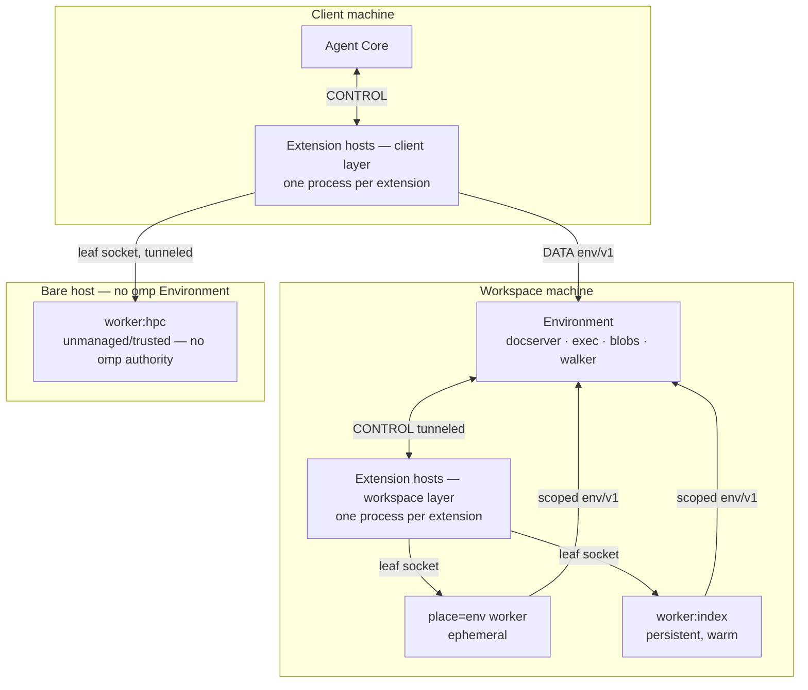
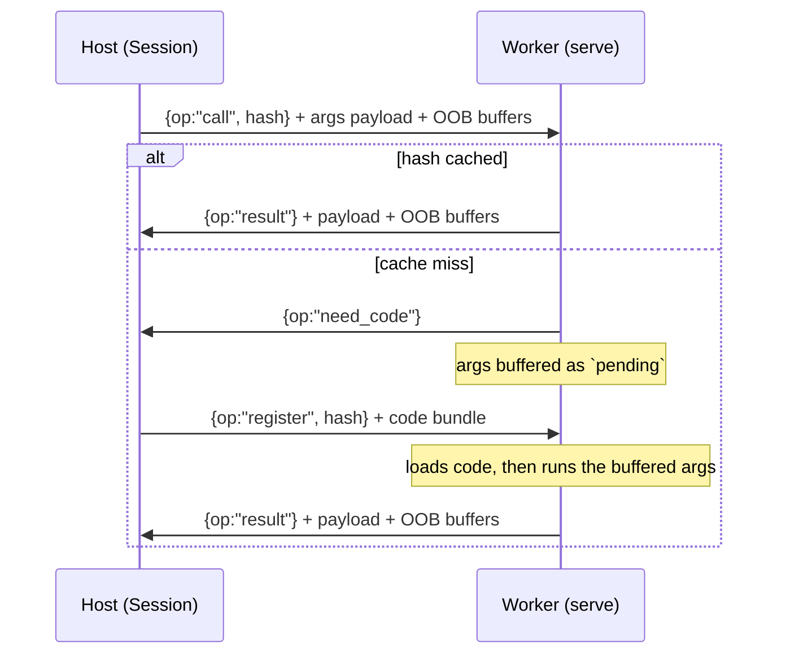

# Placement

> **Design document, not a runtime API guarantee.** This corpus includes proposed
> interfaces and historical implementation observations. See
> [implementation status](implementation-status.md) for current owners and known gaps.

Where an extension's code runs, how it gets there, and what is allowed to cross.

## Purpose

`omp_remote` and the `place=` axis exist because a function body and the data it
touches are two different things, and pi kept them in two different processes on
two different machines. In pi, every extension callback executes inside the agent's
own JavaScript event loop. There is no placement concept anywhere in
`ExtensionAPI` — no `place`, no `worker`, no `remote`, no `sandbox`
(`/work/pi/packages/coding-agent/src/extensibility/extensions/types.ts:1171`). The one
world-touching primitive extensions get is buffered and local:

```ts
/** Execute a shell command. */
exec(command: string, args: string[], options?: ExecOptions): Promise<ExecResult>;
```

— `types.ts:1392`. So an extension that wants to search a supercomputer builds the
only shape that interface permits: shell out locally to an SSH client, let the
remote command print, and pull the entire output back into the harness heap as a
string. That is literally what `@sreetej510/pi-hpc-tools` does, and it is the
poster child for this document.

Placement removes the failure by making the location of a function body a declared
property of the device that uses it. A body marked `place="env"` runs beside the
Environment, where the files are. A body marked `place="worker:index"` runs in a
warm, persistent process that keeps a loaded index across calls. Arguments go in,
a result comes out, and bulk bytes never traverse the extension host on their way
to a place they were never needed. The mechanism is not new: content-addressed
one-time code shipping, pickle protocol 5 out-of-band buffers, an HMAC handshake,
and threaded workers under the free-threaded runtime already ship in
`crates/py/python/omp_remote.py`. `place=` is the policy layer that makes it a
first-class part of the extension surface instead of an escape hatch.

## Concepts

### The placement axis

Every device declares where its body runs. See `docs/py/01-devices.md` for
`@omp.device` itself; the `place=` argument is the only part of that decorator
documented here.

```python
@omp.device("grep_hpc", family="hpc", rev="2", place="worker:hpc")
async def grep_hpc(args: GrepHpcArgs, ctx: omp.Context) -> GrepHpcResult: ...
```

Three kinds:

| `place=` | Where the body runs | Lifetime | Machine |
|---|---|---|---|
| `"host"` (default) | The extension host that loaded this extension | The session | The loading layer's machine |
| `"env"` | A worker beside the Environment | One invocation | The Environment's machine |
| `"worker:<name>"` | A named, persistent worker | Declared TTL, spans invocations | The worker's declared site |

`place="host"` means *the host process that loaded this extension* — never "the
local machine". Hosts are per-extension: one process and one site tree per
extension, keyed `(layer, tier, extension)`, with `--pool` as the only exception
and an explicitly opt-in one — pooled extensions share failure, dependency, and
cancellation fate, and the flag exists precisely so that sharing is a choice
rather than an accident. (An earlier revision of this document described one
shared host per layer; that was wrong, and everything downstream of it — blast
radius, cancellation granularity, site-tree ownership — was wrong with it. The
per-extension topology is final; see *Cancellation granularity* in the closing
section for what the correction resolves.) In remote topology the two layers
place their hosts on different machines: the client layer (`~/.omp`, the thin
client's own `.omp`) spawns its extensions' hosts colocated with Agent Core, and
the workspace layer (`<workspace cwd>/.omp`) spawns its extensions' hosts
colocated with the Environment. All-local topology collapses the machines, not
the processes. `docs/py/14-deploy.md` owns that layering and the precedence
rules.

The consequence is that `place=` means different things depending on which layer
declared the extension, and that is the point:

- A **workspace-layer** extension's host is already env-colocated. `place="env"`
  buys it process isolation and per-invocation lifetime, not a machine hop, and
  its `place="host"` bodies are not crossing a boundary at all.
- A **client-layer** extension operating on a remote workspace has a host next to
  Agent Core and a DATA socket that is remote-transparent. For it, `place="env"`
  is a genuine machine hop and the *only* way its code gets to be next to the
  files.

### Two hosts, one axis



### The decision rule

Ask what dominates the body's cost.

- **Coordination-heavy → `place="host"`.** The body's work is talking: reading a
  verdict, asking a hook chain, pushing a UI slot, spawning a subagent, calling a
  provider. CONTROL round-trip time is tens of microseconds; a body that does
  three RPCs and a little arithmetic has nothing to gain from moving, and moving
  it costs a code-ship on first call plus argument marshalling forever after.
  Everything in `docs/py/05-hooks.md`, `docs/py/07-ui.md`, and
  `docs/py/12-agents.md` is host work by construction, because those namespaces
  ride CONTROL and workers have no CONTROL edge.

- **Data-heavy → `place="env"`.** The body touches many files, large buffers, or
  the output of a process that lives on the workspace machine. The test is
  brutally simple: *would bytes cross a socket only to be discarded?* If the body
  reads 400 MB to emit 40 matched lines, it belongs where the 400 MB already is.
  This is the placement that deletes the `pi-hpc-tools` failure mode.

- **Warm state → `place="worker:<name>"`.** The body needs something expensive
  that must survive between calls: a built index, a loaded embedding model, an
  open SSH multiplex, a warmed ONNX session, a connected database handle. A named
  worker is the only kind whose process outlives one invocation, so it is the only
  kind that can hold state. Everything else about it — supervision, restart,
  eviction — follows from that one property.

Two anti-rules, because both were guessed wrong in review:

- Do **not** use `place="env"` for isolation. If the reason you want another
  process is that a native module segfaults, that is `Site.LOCAL` on a named
  worker (a persistent process on the host's own machine), not a machine hop.
- Do **not** use `place="worker:<name>"` merely because a body is slow. Slowness
  is the loop's problem: the deadline is the loop's and backgrounding is a
  per-call runtime decision. A named worker exists for *state*, not for duration.

### What crosses the boundary, and what must not

Exactly two things cross a placement boundary: **the call's arguments** and **the
call's result**. Nothing else. Concretely:

- **File bytes never round-trip to the host to be filtered.** A body that greps,
  indexes, hashes, parses, or summarizes files must be placed with the files. A
  host-side body that reads a file in order to send it to a worker for filtering
  has recreated exactly the shape this axis exists to delete.
- **No CONTROL edge.** A worker cannot fire a hook, write a journal entry, set a
  UI slot, request a credential, spawn a subagent, or invoke another device. Those
  are Agent-Core edges and they belong to the host. A worker that needs a hook
  verdict returns a value and lets its host ask.
- **Results larger than the spill threshold do not travel as values.** See
  *Large payloads* below.

### Leaf topology

A worker is a leaf: **no edge to Agent Core**. It has one socket back to its host
for calls and results, and — when it is co-located with an omp Environment — a
scoped `env/v1` client. "Leaf" is a statement about *authority*, not about
sockets: a worker can reach the world, but it cannot reach the agent.

The env client is not optional, and this is a correctness constraint rather than a
convenience. The docserver is the only process permitted to hold a file open; a
read pins a revision and an edit is a compare-and-swap against that revision, with
fuzzy three-way rebase and the LSP mux sitting inside the same authority
(`/tmp/x.md` — *The Architecture*, the racing-patch flow). A worker that called
plain `open(path, "w")` beside the Environment would clobber revisions, desync the
language server, and reintroduce the partial-read/lost-write class that
centralizing the docserver exists to delete. Placement is a performance
optimization. It does not get to opt out of an invariant.

| Placement | env client | Bulk reads | Document effects |
|---|---|---|---|
| `place="host"` | full host client (`docs/py/11-env.md`) | via env | via env |
| `place="env"` | scoped client | **direct local I/O** — that is the point | **MUST route through the env client** |
| `worker:<name>`, site is an omp Environment | scoped client | direct local I/O | MUST route through the env client |
| `worker:<name>`, bare host, no Environment | none | direct local I/O | **unmanaged/trusted — outside omp's guarantees** |

The last row is an escape hatch and is documented as one. A machine with no omp
Environment has no docserver, therefore no revision authority, therefore no
invariant to honour. Such a worker is classified **unmanaged/trusted**: the
manifest must declare it as such (`WorkerSpec.unmanaged` is `True`, the extension
is at the `trusted` tier, and the declaration table in `docs/py/14-deploy.md`
says so), and omp makes no claim about what the code running there does. An
earlier revision of this document called this row "compute/read-only by
declaration" and required `WorkerSpec.readonly = True` on it. That was wrong,
and wrong in the way that matters most for a security boundary: a declaration
cannot make arbitrary Python read-only. `readonly` is meaningful exactly where
something env-side enforces it — the scoped client refusing effect requests —
and on a machine with no Environment there is nothing to do the refusing, so a
`readonly` flag there was a promise the system could not keep, dressed as a
guarantee. The honest classification is trust, not restriction: effects
performed on that machine are the extension author's problem, in the same
category as the extension-owned local proxy in `docs/py/13-inference.md`. It is
not the normal path.

The scoped client is narrower than the host client, and for a named worker it is
also *fresher*: a persistent worker receives a **new per-call scoped Environment
handle** with every call, derived from that invocation's effect token
(`docs/py/03-params.md` owns the invocation machine; the token is issued at
`EFFECTS_AUTHORIZED`), and the handle is revoked when the call settles. A named
worker never retains a broad ambient env capability between calls — warm *state*
persists across calls, warm *authority* does not. An earlier revision defined
worker scope as "the declaring extension's granted scope intersected with the
invocation's scope" and then admitted in its open questions that the arithmetic
was ill-defined for a worker outliving one invocation. The per-call handle is
the resolution: there is no standing scope to intersect, only the current
call's, so the arithmetic question dissolves. This is also the placement half of
the no-DATA-before-authorization rule: a worker body cannot touch DATA before
`EFFECTS_AUTHORIZED` because the handle it would touch it with does not exist
until then. `docs/py/11-env.md` owns the method-level surface; the shape of the
restriction is that a worker may issue document, blob, and scoped exec requests,
and may not issue tool invocations, named-process lifecycle commands, blob
deletion, or a fresh protocol handshake. A disposable worker owning a supervised
named process would orphan it on eviction, and a worker able to invoke devices
would be a re-entrant path into the tool registry — the exact ambient-authority
hole the leaf rule closes. Enforcement is env-side, in Rust; the handle is never
wider than the invocation's effect token. Host-placed composition instead uses
`omp.devices.invoke`, whose every inner call opens a fresh independently
admitted and policy-gated invocation (`docs/py/01-devices.md`).

One rule follows from the table and is easy to get wrong: **a value read directly
off local disk carries no revision, so it can never be the base of a
compare-and-swap.** Direct reads are for bulk scanning — grep, index, hash,
summarize — and even they are typed: a placed body holds `omp.EnvPath` values
(`docs/py/11-env.md` owns the class), and "read directly" is spelled
`path.local_path()`, which returns a real `pathlib.Path` only where the call is
truly colocated with the Environment *and* the sandbox scope covers the
directory, and raises `omp.PlacementError` everywhere else. Env-colocated
workers — `place="env"` and named workers on `Site.ENV` — are exactly where
`local_path()` is legal; the same source moved to `place="host"` on a remote
workspace fails loudly instead of reading the wrong machine's disk. A body that
reads directly and then wants to edit must re-open through the env client to
obtain a pinned revision; otherwise it has reconstructed the lost-write class by
hand. `docs/py/11-env.md` states the same rule from the env side, along with the
fact that a lease *id* is not transferable across the boundary: ownership is
checked per connection, so a host cannot hand its lease to a worker or vice
versa.

Reaching either non-`host` placement is a declared capability —
`Capability.PLACE_ENV` and `Capability.PLACE_WORKER`, defined in
`docs/py/00-overview.md` — and the number of concurrent named workers one extension
may hold is `omp.MAX_WORKERS`, also from `docs/py/00-overview.md`. An extension
without the capability cannot declare a device with that `place=`; the failure is at
load, not at call.

### Large payloads

`omp_remote` will happily pickle a gigabyte. It should not have to. Two rules:

1. **A worker's result is either small or a reference.** A return value whose
   serialized size exceeds `omp.workers.RESULT_SPILL_BYTES` is a design error;
   wrap the buffer in `omp.Spill` instead. The env-side supervisor diverts that
   buffer's out-of-band frame straight into the content-addressed blob store and
   the host receives an `omp.BlobRef` in its place. The bytes never enter the host
   process. `omp.BlobRef` is defined in `docs/py/11-env.md`;
   `omp.artifacts.adopt()` in `docs/py/09-journal.md` promotes it to a sliceable
   `artifact://<id>`; `docs/py/02-verdicts.md` owns the spill budget that decides
   how much of it the model sees.

2. **This replaces the `mkdtemp()` pattern.** `@mrclrchtr/supi-code-intelligence`
   writes oversized analysis output to `mkdtempSync(join(tmpdir(), "supi-ci-"))`
   and returns an absolute path in prose; `@mrclrchtr/supi-web` and
   `pi-smart-fetch` do the same to their own temp directories. A path in a string
   is not an address: nothing GCs it, nothing slices it, nothing knows its media
   type, and on a remote workspace it names a file the client cannot open. A
   `BlobRef` is all four.

### Remote-first: the users table

Lesson #4 of the design notes is that multiple and remote instances must be
first-class. The table it draws is the reason the placement axis has three kinds
rather than one:

| | Execution | Interface | Auth | Storage |
|---|---|---|---|---|
| User, Yolo | Local | UI | `.env` / OAuth store | Local |
| User, Paranoid | **VM** | UI | **Gateway** (isolated from exec) | Local |
| User, Remote | **Remote** | UI | **Broker** (sync across devices) | Local |
| Auto, Service | **VM** | **RPC/Lib** | **Secret Manager** | **DB/EventStore** |

The interface, auth, and storage columns are refactors. The execution column is
architecture: once execution can be elsewhere, every subsystem that assumed local
disk becomes wrong at once, and "clawd plz refactor all fs users" is not a
recovery plan. Placement is how the extension surface pays that cost up front.
Read the rows as placement requirements:

- **Yolo.** One host, one Environment, same machine. `place="env"` is a process
  boundary and nothing more. Cost of the axis: one extra process and a code-ship.
- **Paranoid.** Environment inside a VM. `place="env"` crosses into the VM, so an
  extension that greps the workspace runs inside the sandbox and inherits its
  limits automatically instead of being an unsandboxed peer that reads through a
  hole. `pi-sandbox`, `pi-landstrip`, and `pi-playpen` exist because pi had no way
  to express this; under placement, the extension keeps the rulebook
  (`docs/py/06-policy.md`) and the env keeps the enforcement.
- **Remote.** Environment on another machine. This is the row that breaks a
  local-only design, and the row where `place=` earns its keep: the same device
  source, unchanged, runs its body next to the files instead of streaming them
  across a WAN.
- **Service.** No UI, RPC interface, secrets from a manager. Workers are the only
  extension processes in this topology whose lifetime is declared rather than
  interactive, which is why `WorkerSpec` carries TTL, restart policy, and resource
  limits as data rather than as UI-driven decisions.

### Trust tiers and code shipping

**Deserializing shipped code is arbitrary code execution. That is the feature.**
The module docstring of `crates/py/python/omp_remote.py` says so in a warning
block, and it is not hyperbole: `_load_function` will `exec()` a module's source
text or `marshal.loads` a code object handed to it by its peer.

Shipping is therefore gated by an install-time capability named `ship`, granted per
extension and ceilinged by trust tier. `docs/py/14-deploy.md` owns the grant, the
consent text, and the integrity chain; this document owns the runtime refusal.

| `ship` grant | Permits | Tier |
|---|---|---|
| `"installed"` (default) | `ship="import"` only — the worker imports the function from its own site tree | any, no prompt |
| `"source"` | additionally `ship="source"` — module source re-executed under a synthetic name | prompted at install |
| `"pickle"` | additionally `ship="pickle"` and `ship="code"` — cloudpickle by value, marshalled bytecode | `trusted` only; hard-refused at `sandboxed` regardless of manifest |

The gate is the install record's level intersected with the tier ceiling, and it is
evaluated **at pack time on the host, before any bytes leave**. A refused ship
raises `omp.ShipError` and is not an effect: nothing reached a worker, nothing ran.
`docs/py/00-overview.md` owns tier definitions.

`ship="import"` carries a second, sharper check. An earlier revision justified it
by saying two same-tier extensions share their host's site tree; under the final
per-extension topology they do not — one process, one site tree per extension —
so that justification is retracted. The check survives it, because the situation
it guards against still exists in exactly one place: `--pool`, where extensions
that opted into fate-sharing genuinely share a process and its site tree, and
"resolves inside an installed package" would let one pooled extension
ship-by-import a module belonging to a *different* extension and execute it on a
worker with arguments of its own choosing. The predicate is therefore ownership,
not mere presence — the resolved module's file must lie under the declaring
extension's own `RECORD`-listed paths — and it is applied unconditionally rather
than only under `--pool`, because a one-line ownership check is cheaper than a
topology-conditional security rule. `docs/py/14-deploy.md` provides that
ownership map as install-side machinery; this document consumes it as a boolean
and raises `omp.ShipError` when it is false.

Three properties that are not negotiable and hold at every tier:

- **Authentication is mandatory.** The supported surface refuses `authkey=None`
  on any transport other than `AF_UNIX`; an unauthenticated listener whose first
  act on a connection is `pickle.loads` of a peer-supplied header is arbitrary
  code execution, not a configuration choice. Today's `omp_remote` defaults the
  other way — `serve` and `serve_forever` accept `authkey=None` and that is a
  verified defect, not a documented behaviour; see *Known defects in the shipped
  code* in the closing section.
- **`authkey` authenticates; it does not encrypt.** The handshake is a mutual
  HMAC-SHA256 challenge-response over a plaintext socket. Off-UDS, an encrypted
  or already-authenticated tunnel (SSH, TLS, WireGuard) is mandatory, not
  advisory — and in omp's topology it is already present, because a worker socket
  is carried inside `env/v1` rather than dialed by the host.
- **OS isolation is the real boundary.** A Python-side allowlist inside a worker
  is unenforceable by the worker itself. Resource limits and syscall policy come
  from the Environment that spawned it (`docs/py/06-policy.md`).

### Site trees

A worker inherits its parent host's site tree. Dependency resolution is a property
of the host, so `import numpy` works in both host and worker or in neither; a
function does not silently acquire a dependency by being moved to a worker.

The sharp edge is the bare-host case. A machine with no omp Environment has no site
tree omp resolved, because there was nothing to install into. Such a worker gets
pure-Python code through the ship path and nothing else — no third-party
distributions, no native modules — until it is explicitly provisioned
(`docs/py/14-deploy.md`). An unprovisioned bare-host worker whose body imports a
third-party dependency fails at **first call**, not at declaration, and it fails
loudly: the worker's real `ModuleNotFoundError` is re-raised on the host chained
onto a `RemoteTraceback` carrying the worker-side stack.

## Reference

### `omp.PlaceKind`

```python
class PlaceKind(enum.StrEnum):
    HOST = "host"
    ENV = "env"
    WORKER = "worker"
```

The three placement kinds. Members individually:

- **`PlaceKind.HOST`** — the extension host that loaded the declaring extension.
  No boundary crossing, no code shipping, full `omp.env` host client, full CONTROL
  access. The default.
- **`PlaceKind.ENV`** — an ephemeral worker beside the Environment, created for one
  invocation and disposed when the invocation's guard drops. Receives a scoped env
  client. No CONTROL access.
- **`PlaceKind.WORKER`** — a named, persistent worker. Always paired with a name;
  `Place.worker` is the only constructor that produces it.

### `omp.Place`

```python
@dataclasses.dataclass(frozen=True, slots=True)
class Place:
    kind: PlaceKind
    name: str | None = None

    HOST: ClassVar[Place]
    ENV: ClassVar[Place]

    @classmethod
    def worker(cls, name: str) -> Place: ...
    @classmethod
    def parse(cls, spec: str | Place) -> Place: ...
    def __str__(self) -> str: ...
```

A resolved placement. Immutable, hashable, cheap to compare.

- **`Place.kind`** — the `PlaceKind`.
- **`Place.name`** — the worker name for `PlaceKind.WORKER`, `None` otherwise.
- **`Place.HOST`** — the singleton `Place(PlaceKind.HOST)`.
- **`Place.ENV`** — the singleton `Place(PlaceKind.ENV)`.
- **`Place.worker(name)`** — constructs `Place(PlaceKind.WORKER, name)`. Raises
  `ValueError` if `name` is empty or contains a character outside
  `[A-Za-z0-9._-]`; worker names appear in supervision records and env/v1 process
  names, which share that alphabet.
- **`Place.parse(spec)`** — accepts `"host"`, `"env"`, `"worker:<name>"`, or an
  existing `Place` (returned unchanged). Raises `omp.PlacementError` on anything
  else. This is what `place=` runs on every argument it receives, so
  `place="worker:hpc"` and `place=omp.Place.worker("hpc")` are interchangeable.
- **`Place.__str__()`** — round-trips `parse`: `"host"`, `"env"`,
  `"worker:<name>"`.

Channel: none — placement is resolved at declaration time in the host, before any
socket is touched. Latency class: load-time. Failure: fail-closed; a device whose
`place=` cannot be resolved is not registered and the extension's load fails with
the `PlacementError` attached.

```python
@omp.device("index_query", family="idx", rev="4", place=omp.Place.worker("index"))
async def index_query(args: IndexQueryArgs, ctx: omp.Context) -> IndexQueryResult: ...
```

### `omp.SiteKind`

```python
class SiteKind(enum.StrEnum):
    ENV = "env"
    LOCAL = "local"
    ATTACHED = "attached"
```

Where a named worker's *process* lives. Distinct from `PlaceKind`, which says which
kind of placement a device body wants; `SiteKind` says which machine and which
supervisor a named worker is realized on.

- **`SiteKind.ENV`** — beside the Environment, spawned and supervised by it.
  Receives a scoped env client. The default and the only site that participates in
  the docserver invariant on the workspace machine.
- **`SiteKind.LOCAL`** — a separate process on the host's own machine, supervised
  by the host. Exists for crash isolation of native extension modules: a
  segfaulting ONNX or `transformers` runtime takes down a worker, not the host.
  Receives a scoped env client only when the host is itself env-colocated.
- **`SiteKind.ATTACHED`** — the worker is a supervised env named process whose
  stdio carries the worker protocol. This is how a worker reaches a machine that is
  neither the client nor the Environment: the Environment starts
  `ssh user@host omp-py-worker`, and the host speaks worker frames through
  `env/v1` process input/output. No env client on the far side.

### `omp.Site`

```python
@dataclasses.dataclass(frozen=True, slots=True)
class Site:
    kind: SiteKind
    process: str | None = None
    ready: omp.env.Ready | None = None

    ENV: ClassVar[Site]
    LOCAL: ClassVar[Site]

    @classmethod
    def attached(cls, process: str, *, ready: omp.env.Ready | None = None) -> Site: ...
```

- **`Site.kind`** — the `SiteKind`.
- **`Site.process`** — for `SiteKind.ATTACHED`, the env named-process name that
  carries the worker. `None` otherwise. The process must already be declared with
  `omp.env.proc.start` or atomically adopted with `omp.env.proc.ensure`; see
  `docs/py/11-env.md`.
- **`Site.ready`** — an optional `omp.env.Ready` value applied before the handshake, so a
  worker behind a slow SSH connection is not declared `READY` on spawn alone. The concrete
  `omp.env.ReadyLog`, `omp.env.ReadyTcp`, `omp.env.ReadyPing`, and `omp.env.ReadyAll` values are
  defined in `docs/py/11-env.md`.
- **`Site.ENV`** / **`Site.LOCAL`** — singletons.
- **`Site.attached(process, ready=None)`** — constructs an attached site.

### `omp.Restart`

```python
class Restart(enum.StrEnum):
    NO = "no"
    ON_FAILURE = "on-failure"
    ALWAYS = "always"
```

Restart policy for a named worker, mirroring `env/v1`'s `RestartPolicy` so the
supervisor does not need a second vocabulary.

- **`Restart.NO`** — a dead worker stays dead. The next `omp.workers.get()` spawns a
  fresh generation; calls in flight fail with `omp.WorkerUnavailable`. The default,
  because a worker whose boot is broken should surface that on the next call rather
  than in a restart loop.
- **`Restart.ON_FAILURE`** — respawn on nonzero exit or signal, with bounded
  exponential backoff. Not on clean exit, not on eviction.
- **`Restart.ALWAYS`** — respawn on any exit, including clean. For workers that own
  an external connection whose remote end may close it.

### `omp.WorkerState`

```python
class WorkerState(enum.StrEnum):
    SPAWNING = "spawning"
    BOOTING = "booting"
    READY = "ready"
    DRAINING = "draining"
    EVICTED = "evicted"
    FAILED = "failed"
```

- **`WorkerState.SPAWNING`** — process created, handshake not complete. Calls queue.
- **`WorkerState.BOOTING`** — handshake done, `WorkerSpec.boot` running. Calls queue.
  A worker with no `boot` never enters this state.
- **`WorkerState.READY`** — accepting calls.
- **`WorkerState.DRAINING`** — stop or eviction requested; in-flight calls are
  allowed to finish, new calls are rejected with `omp.WorkerEvicted`.
- **`WorkerState.EVICTED`** — terminal for this generation, reached deliberately
  (idle TTL, `max_calls`, explicit `evict()`). The generation counter has advanced;
  a held `WorkerHandle` from the previous generation raises `omp.WorkerEvicted`.
- **`WorkerState.FAILED`** — terminal for this generation, reached by crash, boot
  error, handshake failure, or readiness timeout. `WorkerInfo.fault` carries why.

### `omp.WorkerResources`

```python
@dataclasses.dataclass(frozen=True, slots=True)
class WorkerResources:
    memory_bytes: int | None = None
    cpu_shares: float | None = None
    open_files: int | None = None
    wall_clock: omp.Duration | None = None
```

Limits requested at spawn, applied by the supervisor's OS mechanism (cgroups,
`rlimit`, job objects). Every field is a request, not a guarantee: a supervisor that
cannot enforce a limit reports it in `WorkerInfo.enforced` rather than silently
dropping it, because an extension that asked for a memory cap and did not get one
needs to know.

- **`memory_bytes`** — resident-set ceiling. Exceeding it kills the generation with
  `WorkerState.FAILED`.
- **`cpu_shares`** — relative CPU weight. `1.0` is one core's worth of share.
- **`open_files`** — descriptor ceiling.
- **`wall_clock`** — hard lifetime for the *generation*, independent of idle TTL.
  For workers holding a credentialed connection that must be re-established.
  Like every duration in this API it is an `omp.Duration` (`docs/py/00-overview.md`
  owns the type); config strings such as `"30s"` and `"10m"` parse into it.

### `omp.WorkerSpec`

```python
@dataclasses.dataclass(frozen=True, slots=True)
class WorkerSpec:
    name: str
    site: Site = Site.ENV
    boot: omp_remote.RemoteFunction | None = None
    idle_ttl: omp.Duration = omp.workers.DEFAULT_IDLE_TTL
    max_concurrency: int = 1
    max_calls: int | None = None
    restart: Restart = Restart.NO
    resources: WorkerResources = WorkerResources()
    cwd: omp.EnvPath | None = None
    env_delta: Mapping[str, str | None] = types.MappingProxyType({})
    readonly: bool = False
    unmanaged: bool = False
    warm: bool = False
```

The declaration of a named worker. Data, not code — the supervisor is in Rust and
reads this as a record.

- **`name`** — the name `place="worker:<name>"` refers to. Unique per session per
  layer; two extensions declaring the same name is an error at load, not a silent
  merge, because they would share an address space.
- **`site`** — see `omp.Site`.
- **`boot`** — a `@omp_remote.remote` function run exactly once per generation after the
  handshake and before the first call. Its return value is discarded; its side
  effects on the worker's module globals are the warm state. Boot runs inside
  `WorkerState.BOOTING`, and a boot that raises moves the generation to
  `WorkerState.FAILED` with the exception in `WorkerInfo.fault` — calls queued
  behind it fail with `omp.WorkerUnavailable` chained onto the boot fault, so an
  extension never sees a half-warmed worker.
- **`idle_ttl`** — how long the worker may sit with no in-flight call before the
  generation is evicted, as an `omp.Duration`. A zero duration disables eviction
  (the worker lives until session teardown). Default
  `omp.workers.DEFAULT_IDLE_TTL`.
- **`max_concurrency`** — how many calls may be in flight. Each concurrent slot is
  one connection to the worker, because `omp_remote.Session` serializes calls under
  a lock; `serve_forever` runs one thread per connection and free-threaded CPython
  executes them in parallel. Values above `1` are meaningful only for bodies that
  are actually thread-safe — and concurrent calls on one generation share a
  `SIGKILL` fate by construction: the generation is the declared unit of warm
  state, and it is also the cancellation blast radius (see *Cancellation
  granularity and the D5 amendment*).
- **`max_calls`** — evict the generation after this many completed calls. For
  bodies with unavoidable leaks (a native library that grows a cache it will not
  release). `None` disables.
- **`restart`** — see `omp.Restart`.
- **`resources`** — see `omp.WorkerResources`.
- **`cwd`** — working directory for the worker process, an `omp.EnvPath`
  (`docs/py/11-env.md`) resolved by the site's supervisor. Defaults to the
  Environment's root. Must be `None` for an unmanaged bare-host site — there is no
  Environment there to resolve against; the attached named process's own
  declaration owns its working directory.
- **`env_delta`** — environment variables to set (`str`) or unset (`None`). Only
  `OMP_*` names and names the extension's manifest declares are accepted; the
  supervisor rejects the spec otherwise. Never a place to smuggle credentials —
  see `omp.creds` in `docs/py/13-inference.md`.
- **`readonly`** — declares that this worker performs no effects, and is
  meaningful exactly where something env-side can enforce it: a `readonly`
  worker's scoped env client refuses document effect requests outright rather
  than relying on the body's good behaviour. On a site with no omp Environment
  the flag is rejected at `declare()` — nothing exists there to do the refusing,
  and an unenforceable `readonly` is a promise, not a property. (An earlier
  revision *required* `readonly=True` on exactly those sites; that requirement is
  retracted — see `unmanaged`.)
- **`unmanaged`** — declares that this worker runs on a machine where omp has no
  Environment and therefore no authority: no docserver, no scoped client, no
  sandbox receipt. Required to be `True` for `SiteKind.ATTACHED` sites with no
  omp Environment, requires the `trusted` tier, and surfaces in the manifest
  declaration table (`docs/py/14-deploy.md`). This replaces the earlier
  revision's "read-only by declaration" classification, which was wrong: a
  declaration cannot make arbitrary Python read-only, and pretending otherwise
  labelled the least-guaranteed placement as the most constrained one.
- **`warm`** — spawn and boot at extension load rather than on first call. Trades
  session-start latency for first-call latency. Off by default because a worker
  nobody calls is pure cost.

### `omp.WorkerInfo`

```python
@dataclasses.dataclass(frozen=True, slots=True)
class WorkerInfo:
    name: str
    generation: int
    state: WorkerState
    site: Site
    pid: int | None
    spawned_at_ms: int
    last_call_at_ms: int | None
    calls: int
    in_flight: int
    code_cached: int
    enforced: frozenset[str]
    fault: str | None
```

An observation of one worker generation. Returned by `omp.workers.list()` and
carried as the payload of the `worker_state` event (`docs/py/05-hooks.md`).

- **`name`**, **`site`** — from the spec.
- **`generation`** — monotonic per name, starting at `1`. Advances on every
  respawn. Acts as the tombstone: a stale `WorkerHandle` is one whose generation no
  longer matches, and it raises `omp.WorkerEvicted` rather than silently talking to
  a different process.
- **`state`** — see `omp.WorkerState`.
- **`pid`** — the OS process id where the supervisor can supply one. `None` for
  `SiteKind.ATTACHED` (the far side's pid is not the supervisor's to report).
- **`spawned_at_ms`**, **`last_call_at_ms`** — epoch milliseconds. `last_call_at_ms`
  is what the idle TTL measures from; `None` before the first call.
- **`calls`** — completed calls this generation, the counter `max_calls` compares
  against.
- **`in_flight`** — currently executing calls, at most `max_concurrency`.
- **`code_cached`** — distinct function bundles this generation has registered. A
  monotonically climbing value across a long session is the signature of a
  cache-invalidation bug; see the closing section.
- **`enforced`** — which `WorkerResources` fields the supervisor actually applied.
  A field present in the spec and absent here was not enforced.
- **`fault`** — for `WorkerState.FAILED`, a single-line summary. Full detail rides
  the chained `RemoteTraceback` on the call that observed it.

### `omp.WorkerHandle`

```python
class WorkerHandle:
    name: str
    generation: int
    site: Site

    async def state(self) -> WorkerState: ...
    async def info(self) -> WorkerInfo: ...
    async def call(self, fn: omp_remote.RemoteFunction, /, *args, **kwargs) -> Any: ...
    async def map[T, R](
        self,
        fn: omp_remote.RemoteFunction,
        items: Iterable[T],
        *,
        concurrency: int | None = None,
    ) -> list[R]: ...
    async def warm(self) -> None: ...
    async def stop(self, *, grace: omp.Duration = omp.Duration("5s")) -> None: ...
    def session(self) -> AbstractAsyncContextManager[omp_remote.Session]: ...
```

A reference to one worker generation, returned by `omp.workers.get()`. Handles are
cheap, not pooled, and safe to hold across `await` points; they are *not* safe to
hold across generations, which is the entire reason `generation` is a field.

- **`WorkerHandle.name`** — the declared worker name.
- **`WorkerHandle.generation`** — the generation this handle is bound to. Every
  method compares it against the supervisor's current generation and raises
  `omp.WorkerEvicted` on mismatch, rather than silently retargeting a different
  process that happens to share the name.
- **`WorkerHandle.site`** — the resolved `Site`, so a body can branch on whether it
  has an env client without consulting the spec.

- **`await handle.state() -> WorkerState`** — the current state, one round trip.
  Channel: DATA. Latency: per-call. Failure: fail-open — returns
  `WorkerState.FAILED` if the supervisor is unreachable, because a caller asking
  "is it alive" that gets an exception has learned less than one that gets "no".

- **`await handle.info() -> WorkerInfo`** — the full observation. Same channel,
  latency, and failure class as `state()`, except that unreachability raises
  `omp.WorkerUnavailable`: there is no honest degenerate `WorkerInfo`.

- **`await handle.call(fn, /, *args, **kwargs) -> Any`**

  Runs `fn` on this generation and returns its result. `fn` must be a
  `RemoteFunction`; a plain callable is wrapped, which means it is packed with the
  default ship mode and therefore subject to the `ship` gate.

  Acquires one of `max_concurrency` connections, opening a new one if the pool is
  below the ceiling and waiting if it is at it. Ships the function body on first
  use per connection — one extra round trip, arguments not resent.

  Re-raises the worker's exception chained onto a `RemoteTraceback`, or
  `RemoteError` when the type cannot be reconstructed on this side. Raises
  `omp.WorkerEvicted` if the generation has advanced — and retries **once** against
  a fresh generation before surfacing it, because a worker evicted by idle TTL
  between two calls is normal operation rather than an error the extension author
  should have to write a loop for. A second eviction is surfaced.

  Raises `omp.ShipError` before sending anything when the mode exceeds the grant,
  and `omp.BoundaryError` when the body attempted a CONTROL operation.

  Channel: DATA. Latency: per-call, plus per-ship on a cold connection. Failure:
  fail-closed — the device's invocation faults. Cancellation: the invocation's
  guard drop cancels the call, and what dies with it is the worker's own process
  group — this generation and every call in flight on it, which fate-share by
  construction, and nothing else. An earlier revision described the blast radius
  as an unresolved architectural question; the per-extension process topology
  resolves it — see *Cancellation granularity and the D5 amendment* in the
  closing section.

```python
async def first_hits(ctx: omp.Context) -> list:
    worker = await omp.workers.get("index")
    return await worker.call(query, "symbol", "TurnClient", 50)
```

- **`await handle.map(fn, items, *, concurrency=None) -> list`**

  Runs `fn` once per item, up to `concurrency` calls in flight (defaulting to the
  spec's `max_concurrency`), and returns results **in input order**. Ordering costs
  buffering; see open questions for the unordered variant.

  Fail-fast: the first exception cancels the outstanding calls and propagates, with
  the remaining items never dispatched. This is deliberate — a fan-out over 200
  files where file 3 raises should not spend the next two minutes analysing 197
  more before reporting it. An extension that wants all-settled semantics builds it
  from `call()`.

  Channel: DATA. Latency: per-call ×⌈len(items)/concurrency⌉. Failure: fail-closed.

- **`await handle.warm() -> None`**

  Ensures the generation has reached `WorkerState.READY`, running `boot` if it has
  not. Idempotent, and a no-op on a ready worker. Useful at `extension_activate`
  (or `session_start`, for an eagerly loaded extension) to move
  a spawn cost off the first user-visible call without setting `WorkerSpec.warm`
  (which pays it for every session, whether or not the worker is used).
  Channel: DATA. Latency: per-spawn. Failure: fail-closed —
  `omp.WorkerUnavailable`.

- **`await handle.stop(*, grace: omp.Duration = omp.Duration("5s")) -> None`**

  Drains and terminates *this* generation. Equivalent to
  `omp.workers.evict(handle.name)` except that it is a no-op if the generation has
  already advanced, so two racing callers do not evict each other's replacement.
  Channel: DATA. Latency: bounded by `grace`. Failure: fail-open.

- **`handle.session() -> AbstractAsyncContextManager[omp_remote.Session]`**

  The escape hatch: borrows one raw `omp_remote.Session` from the connection pool
  for the duration of the context, returning it on exit. For code that needs to
  issue many calls with strict ordering, or that wants `omp_remote` semantics
  directly.

  Requires the `trusted` tier; raises `omp.PlacementError` otherwise, because a
  borrowed `Session` bypasses the per-call ship gate — `Session.call` will happily
  pack a closure. Holding the context blocks one concurrency slot for its whole
  duration, and holding it across a generation change raises `omp.WorkerEvicted` on
  the next use rather than on entry.

```python
async def stat_all(paths: list) -> None:
    async with (await omp.workers.get("hpc")).session() as s:
        for path in paths:                       # strict order, one connection
            await asyncio.to_thread(s.call, stat_one, path)
```

Note the `to_thread`: `Session.call` is blocking and serialized under a lock.
`handle.call` does this for you; a borrowed session does not.

### `omp.workers`

The placement namespace. Every function is `async` and rides DATA except
`declare()`, which is load-time and local to the host.

- **`omp.workers.declare(spec: WorkerSpec) -> None`**

  Registers a named worker. Called at extension load, from module scope. Raises
  `omp.PlacementError` if the name is already declared in this layer, if the spec
  requests an `env_delta` key the manifest does not declare, if
  `spec.site.kind is SiteKind.ATTACHED` on a site with no Environment and
  `spec.unmanaged` is not `True` (or the extension is below the `trusted` tier),
  or if `spec.readonly` is `True` on a site where nothing env-side exists to
  enforce it. Declaring does not spawn unless `spec.warm` is `True`.
  Channel: none. Latency: load-time. Failure: fail-closed — the extension does not
  load.

- **`await omp.workers.get(name: str) -> WorkerHandle`**

  Returns a handle to the current generation, spawning and booting one if none is
  ready. Concurrent callers coalesce onto one spawn rather than racing two
  processes. Raises `omp.WorkerUnavailable` if the generation cannot be brought to
  `READY` (spawn failure, handshake failure, readiness timeout, boot fault — the
  cause is chained). Channel: DATA. Latency: per-call, and *per-spawn* on a cold
  name — a cold `get()` on an attached SSH site can be seconds. Failure:
  fail-closed.

- **`await omp.workers.list() -> list[WorkerInfo]`**

  Every worker declared by this extension, one `WorkerInfo` per current generation,
  including generations in `FAILED` and `EVICTED`. Never other extensions' workers.
  Channel: DATA. Latency: per-call. Failure: fail-open — returns `[]` if the
  supervisor is unreachable, because observation must not break a turn.

- **`await omp.workers.evict(name: str, *, grace: omp.Duration = omp.Duration("5s")) -> bool`**

  Moves the generation to `DRAINING`, lets in-flight calls finish for up to
  `grace`, then terminates the process tree and advances the generation.
  Returns whether a live generation was found. Idempotent. Channel: DATA. Latency:
  per-call, bounded by `grace`. Failure: fail-open.

- **`await omp.workers.restart(name: str, *, grace: omp.Duration = omp.Duration("5s")) -> WorkerInfo`**

  `evict()` followed by a fresh spawn and boot. Returns the new generation's info.
  The one supported way to pick up a changed `boot` body mid-session. Channel:
  DATA. Latency: per-spawn. Failure: fail-closed — raises
  `omp.WorkerUnavailable` if the new generation cannot reach `READY`.

- **`omp.workers.DEFAULT_IDLE_TTL: Final[omp.Duration] = omp.Duration("7m")`**

  Seven minutes. Chosen to match the subagent idle-park TTL so a session's warm
  processes and its parked agents decay on the same clock.

- **`omp.workers.RESULT_SPILL_BYTES: Final[int] = 262_144`**

  256 KiB. A worker result whose serialized payload exceeds this logs a
  `placement.oversize_result` telemetry event (`docs/py/10-telemetry.md`) naming the
  device and rev. It is not an error — a hard failure here would turn a
  performance bug into an outage — but it is the number that says "use
  `omp.Spill`".

- **`omp.workers.MAX_CONCURRENT_SPAWNS: Final[int] = 4`**

  Cold spawns in flight across all of a layer's workers. Bounds the thundering herd
  when a session starts and six devices all want their first call at once. This is a
  *rate* limit, not a population limit: the number of named workers one extension
  may hold live is `omp.MAX_WORKERS` (`docs/py/00-overview.md`), and exceeding that
  fails `omp.workers.get()` with `omp.WorkerUnavailable` rather than queueing —
  a queue here is a hang the user cannot see.

### `omp.Spill`

```python
@dataclasses.dataclass(frozen=True, slots=True)
class Spill:
    value: bytes
    media_type: str = "application/octet-stream"
```

A marker a worker returns instead of a large buffer.

`Spill` participates in pickle protocol 5: `value` is emitted as an out-of-band
`PickleBuffer`, so it leaves the worker as its own length-prefixed frame and never
enters the pickle stream. The supervisor reads the frame index from the message
header, streams that frame directly into the content-addressed blob store, drops it
from the reply, and rewrites the header with the resulting digest. The host
unpickles a `omp.BlobRef` (`docs/py/11-env.md`) where the `Spill` was.

The supervisor performs no unpickling to do this. That is the whole reason the
marker is shaped this way: out-of-band buffers are *already* separate frames, so
diverting one is frame surgery on a length-prefixed stream, not deserialization of
untrusted data in a privileged process.

`omp.BlobRef` is the Python projection of `omp_tool::BlobRef`
(`crates/tool/src/lib.rs:146`), the same reference type
`VerdictDetails::Spilled { blob, byte_len }` (`:417-433`) already uses. So a spilled
worker buffer and a spilled verdict name content in one namespace with one minting
authority; `docs/py/02-verdicts.md` covers the second path.

- **`value`** — any object supporting the buffer protocol. Must be contiguous; a
  non-contiguous buffer raises `TypeError` at pickle time, since `PickleBuffer`
  cannot emit it out-of-band and silently falling back to in-band would defeat the
  purpose.
- **`media_type`** — carried into the eventual artifact so `read artifact://<id>`
  knows how to present it.

**Resolved (2026-08-20 ruling):** the spill field is `value`, not `buf`; all
buffer-protocol and contiguity requirements above apply to `value`.

```python
import omp_remote

@omp_remote.remote
def render_report(rows: list[dict]) -> omp.Spill:
    body = build_html(rows).encode()          # 40 MB, on the env machine
    return omp.Spill(body, media_type="text/html")
```

A `Spill` returned by a worker with no Environment on its site (the bare-host
escape hatch) raises `omp.BoundaryError`: there is no blob store to divert into, and
silently in-lining 40 MB across a WAN is not an acceptable fallback.

### Placement exceptions

- **`omp.PlacementError(Exception)`** — a placement claim is false. At load or at
  `declare()`: unparseable `place=`, duplicate worker name, undeclared `env_delta`
  key, an unmanaged bare-host worker declared without `unmanaged=True` or below
  the `trusted` tier, a `readonly` flag on a site where nothing can enforce it.
  Fail-closed: the extension does not load. It is also the exception
  `omp.EnvPath.local_path()` raises when the calling code is not truly colocated
  with the Environment or the sandbox scope does not cover the directory —
  `docs/py/11-env.md` owns that method; this class is the shared vocabulary for
  "you are not where you claimed to be".
- **`omp.WorkerUnavailable(Exception)`** — a worker generation could not be brought
  to `READY`, or a call was issued against a name whose generation is `FAILED`.
  Chains the underlying cause (`RemoteTraceback` for a boot fault, `OSError` for a
  spawn failure, `TimeoutError` for a readiness timeout).
- **`omp.WorkerEvicted(omp.PlacementError)`** — the handle's generation is no longer current.
  Distinct from `WorkerUnavailable` because it is *not* an error condition in the
  system: the correct response is `await omp.workers.get(name)` and retry, which is
  what `WorkerHandle.call` does once before giving up.
- **`omp.ShipError(Exception)`** — the requested ship mode exceeds the extension's
  `ship` grant or the tier ceiling, or the function is not shippable in the
  requested mode at all (`ship="source"` on a closure, `ship="code"` on a function
  with a `__closure__`). Raised on the host at pack time, before any bytes leave.
- **`omp.BoundaryError(Exception)`** — an operation is meaningless across the
  boundary it was attempted on: `omp.Spill` from a worker with no blob store, a
  doc lease handed to a worker that cannot hold it, an attempt to reach CONTROL
  from a worker body.

### `worker_state` event

Per-worker lifecycle transitions arrive as `@omp.hook("worker_state")` with an
`omp.WorkerInfo` payload. Latency class: per-transition. Failure policy: fail-open
(dropped). The event catalog and hook semantics live in `docs/py/05-hooks.md`.

---

### `omp_remote`

The mechanism `place=` is built on, shipping today as
`crates/py/python/omp_remote.py` and frozen into the interpreter alongside the
stdlib (`crates/py/README.md`). Extensions rarely touch it directly —
`omp.workers` is the supported surface — but it is a supported module, because the
escape hatch is real and because understanding it is the only way to reason about
the boundary's cost.

```python
__all__ = [
    "RemoteError", "RemoteFunction", "RemoteTraceback", "Session",
    "connect", "remote", "serve", "serve_forever",
]
```

#### Module constants

- **`omp_remote._MAX_FRAME: int = 1 << 34`** — 16 GiB. A sanity bound checked on
  every *buffer* frame received: `_recv` raises
  `ConnectionError(f"oversized frame ({blen} bytes)")` before allocating. It is not
  a policy limit and it is not a memory limit; it is the value that stops a
  corrupted or hostile length prefix from being interpreted as an allocation
  request. It covers exactly one of the three length prefixes `_recv` reads: the
  per-buffer `blen` is checked (`omp_remote.py:125`), the header length `hlen` and
  the frame count `nbufs` are not. That asymmetry is a known defect, described with
  its fix shape in the closing section, and it is not fixed by extending
  `_MAX_FRAME` to cover `hlen` — `hlen` is a `u32`, so its ceiling is already below
  `1 << 34`.

#### Exceptions

- **`omp_remote.RemoteTraceback(Exception)`**

  Carries the worker-side traceback as its single string argument. Never raised on
  its own; always the `__cause__` of a re-raised remote exception, so
  `raise exc from RemoteTraceback(tb)` gives a host-side traceback with the remote
  stack attached below it. This is the whole error-transport story: an extension
  catching `ValueError` from a worker call catches a real `ValueError`, and the
  remote frames are one `__cause__` away.

- **`omp_remote.RemoteError(Exception)`**

  Stands in for a worker exception that cannot cross the wire intact — unpicklable
  on the worker, or unloadable on the host because its type only exists in shipped
  code (the common case: an exception class defined in a module that was
  source-shipped, so the type lives in the worker's synthetic
  `_omp_remote_<hash>` module and nowhere else). Its message is the
  `f"{type(exc).__name__}: {exc}"` summary the worker computed, so the type name
  survives even when the type does not.

#### `remote()`

```python
def remote(fn=None, *, ship=None): ...
```

Marks a function for remote execution, returning a `RemoteFunction`. Usable bare or
with keywords:

```python
import omp_remote

@omp_remote.remote
def double(a): return a * 2

@omp_remote.remote(ship="source")
def scan(root): ...
```

- **`fn`** — the function, when applied bare.
- **`ship`** — overrides the shipping mode: `"import"`, `"source"`, `"pickle"`, or
  `"code"`. `None` selects per function (see *Ship-mode selection*).

Raises nothing itself; mode validity is checked lazily at pack time, on the first
remote call.

#### `RemoteFunction`

```python
class RemoteFunction:
    def __init__(self, fn, ship=None): ...
    def __call__(self, *args, **kwargs): ...
    def remote(self, *args, **kwargs): ...
```

The wrapper `remote()` produces. `functools.update_wrapper` copies `__name__`,
`__qualname__`, `__module__`, `__doc__`, and `__dict__` from the wrapped function,
so introspection and the ship-mode heuristic both see the original.

- **`RemoteFunction.fn`** — the wrapped function. Public because `_load_function`
  unwraps it on the worker side: a source-shipped module whose function is itself
  decorated with `@remote` would otherwise materialize as a nested
  `RemoteFunction`, so the loader returns `fn.fn if isinstance(fn, RemoteFunction)`.
- **`RemoteFunction.__call__(*args, **kwargs)`** — calls the function **locally**.
  A `@remote` function is a normal function until you ask for a remote call, which
  is what makes a placed body testable in-process.
- **`RemoteFunction.remote(*args, **kwargs)`** — executes on the module-default
  session installed by `connect()`. Raises `RuntimeError("no default session; call
  omp_remote.connect() first")` if there is none. Blocking.

The packed bundle is memoized on the instance after the first remote call, so a
function's source is read, hashed, and pickled exactly once per host process
regardless of how many sessions or workers it is sent to.

#### `Session`

```python
class Session:
    def __init__(self, sock, authkey=None): ...
    def call(self, rf, /, *args, **kwargs): ...
    def close(self): ...
    def __enter__(self): ...
    def __exit__(self, *exc): ...
```

One connection to one worker. Thread-safe, and **calls are serialized** under an
internal `threading.Lock` — one call in flight per `Session`, always. Concurrency
comes from multiple sessions, which is why `WorkerSpec.max_concurrency` is
implemented as a connection count.

- **`Session(sock, authkey=None)`** — wraps a connected socket. When `authkey` is
  not `None`, performs the client half of the handshake immediately, before any
  frame is sent. When it is `None`, **no authentication happens at all**.
- **`Session.call(rf, /, *args, **kwargs)`** — runs `rf` on the worker and returns
  its result. A plain callable is wrapped in `RemoteFunction(rf)` on the way in, so
  `session.call(some_function, x)` works without the decorator. On worker failure,
  re-raises the worker's exception chained onto a `RemoteTraceback`; substitutes
  `RemoteError` when the exception cannot be reconstructed on this side. The
  positional-only `rf` exists so a remote function may itself take a keyword named
  `rf`.
- **`Session.close()`** — closes the socket. In-flight calls on other threads see
  `ConnectionError`.
- **`Session.__enter__` / `__exit__`** — context manager; `__exit__` closes
  unconditionally.

The call path is one round trip when the worker already has the code and two when
it does not, and the two-trip path does **not** resend arguments:



That buffering is the reason a cold call costs one extra round trip rather than a
full re-marshal of what may be a multi-megabyte argument. It is also the one piece
of per-connection state that matters for correctness: `pending` holds exactly one
buffered call, so a `register` for a different hash discards it.

#### `connect()`

```python
def connect(address, authkey=None): ...
```

Connects and installs the resulting `Session` as the module default, returning it.

- **`address`** — a filesystem path (`AF_UNIX`) or a `(host, port)` tuple
  (`AF_INET`, with `TCP_NODELAY` set, because the traffic is request/response and
  Nagle would add a round trip's worth of delay to every small call).
- **`authkey`** — passed through to `Session`.

Mutates module state: `_default_session`. A second `connect()` replaces the
default without closing the previous session, which is deliberate — the previous
`Session` object remains usable by whoever holds it — and is a footgun worth
knowing about if you call `connect()` twice and expect the first connection to be
gone.

#### `serve()`

```python
def serve(sock, authkey=None): ...
```

Serves one connected socket until the peer disconnects or sends `shutdown`. When
`authkey` is not `None`, performs the server half of the handshake first.

Function bodies are cached **per connection**, in a local `fns` dict keyed by code
hash. Two connections to the same worker process each ship and hold their own copy.
Returns on `ConnectionError` from `_recv` (peer closed) or on the `shutdown` op.
An unknown op raises `ValueError(f"unknown op {op!r}")` — deliberately fatal for
that connection, because an unrecognized op means the peer is speaking a protocol
this build does not implement and continuing would be guessing.

Ops accepted:

| op | Carries | Effect |
|---|---|---|
| `call` | `hash`; args payload + OOB buffers | Execute if cached, else buffer as `pending` and reply `need_code` |
| `register` | `hash`; code bundle | Load the bundle; if it satisfies `pending`, execute immediately |
| `shutdown` | — | Return from `serve` |

A `register` whose bundle fails to load replies with the load exception and clears
`pending`, so a bad bundle fails the call rather than hanging the peer. The
`except BaseException` there is intentional and annotated as such in the source:
every failure must cross the wire, because a worker that dies quietly leaves the
host blocked on a `recv`.

#### `serve_forever()`

```python
def serve_forever(address, authkey=None): ...
```

Accept loop. One daemon thread per connection, each running `serve`. Under
free-threaded CPython connections execute in parallel — this is the property that
makes `WorkerSpec.max_concurrency > 1` meaningful. Never returns.

- **`address`** — a `(host, port)` tuple binds with `socket.create_server`; a path
  binds `AF_UNIX`, **unlinking an existing path first**. That unlink is a real
  hazard for a supervisor that reuses socket paths across generations: two
  concurrently live workers on the same path silently steal each other's listener.
  The supervisor therefore mints a fresh path per generation.
- **`authkey`** — passed to every `serve`.

#### The wire format

A message is a pickled header dict plus *N* raw buffer frames, all length-prefixed.

```
┌──────────┬──────────┬────────────┬──────────┬──────────────┬─────┐
│ u32 LE   │ u32 LE   │ header     │ u64 LE   │ frame bytes  │ ... │
│ hlen     │ nframes  │ (pickled)  │ len      │              │     │
└──────────┴──────────┴────────────┴──────────┴──────────────┴─────┘
```

- The 8-byte prefix is `struct.pack("<II", len(header_bytes), nframes)`, where
  `nframes` counts the args/result payload plus every out-of-band buffer.
- Each frame is `struct.pack("<Q", nbytes)` followed by the bytes, written as a
  `memoryview(...).cast("B")` — no concatenation, no intermediate copy.
- `_recv_exact` reads into a preallocated `bytearray` via `recv_into` on a
  `memoryview` slice, so a large frame is filled in place and never grows a buffer.
  A zero-length `recv_into` raises `ConnectionError("peer closed")`.
- Frame `0` is the pickle payload; frames `1..n` are its out-of-band buffers, and
  they are handed straight back as `pickle.loads(frames[0], buffers=frames[1:])`.

Arguments and results are pickled with `_dumps_oob`, which is
`cloudpickle.dumps(obj, protocol=5, buffer_callback=...)`. Protocol 5's
`buffer_callback` receives a `PickleBuffer` for every large contiguous buffer;
`b.raw()` yields the underlying memory without copying it, and the callback appends
it to the out-of-band list. The consequence is the one that matters for placement:
a `numpy` array or a `bytes` object crosses the socket **once**, from its own
memory into the socket, with no staging copy on either side.

#### The handshake

```python
def _authenticate(sock, authkey, *, server): ...
```

Mutual HMAC-SHA256 challenge-response. Authenticates; **never encrypts**.

- Raises `TypeError("authkey must be bytes")` on a non-`bytes` key.
- A challenge sends 32 bytes of `os.urandom`, reads a 32-byte reply, and compares
  `hmac.digest(authkey, nonce, "sha256")` against it with
  `hmac.compare_digest` — constant-time, so the handshake leaks no timing signal.
  Mismatch raises `ConnectionError("authentication failed")`.
- A response reads the 32-byte nonce and sends back its digest.
- The server challenges then responds; the client responds then challenges. Both
  ends prove knowledge of the key, so a worker cannot be commandeered by an
  unauthenticated peer and a host cannot be fed results by an impostor.

`authkey=None` skips authentication entirely on both `Session` and `serve`, and it
is the **default** on `serve`, `serve_forever`, and `connect`. The contract this
document specifies is stricter than the code: **`authkey=None` is refused on any
transport other than `AF_UNIX`** — an abstract or mode-`0600` `AF_UNIX` socket the
supervisor created is the one place where the transport itself is the
authenticator, so a keyless session there is authenticated by the filesystem
rather than by nothing. Every TCP or tunnelled worker carries a key, the tunnel
off-UDS must itself be encrypted or already authenticated, and the supervisor
always supplies both. Nothing in `omp_remote` enforces any of that today; the
permissive default is a verified defect, the first entry under *Known defects in
the shipped code* below. Under the default the first thing a connection does is
`pickle.loads` a peer-supplied header, so this is not a missing-authentication
problem but an arbitrary-code-execution one.

#### Ship-mode selection

```python
def _default_ship(fn): ...
```

The exact rule, in order:

1. If `"." in fn.__module__` (the function lives in a package submodule) **or**
   `"<locals>" in fn.__qualname__` (it is nested, a closure, or a lambda) → **
   `"pickle"`**.
2. Otherwise, look up `sys.modules[fn.__module__]` and its `__file__`. If that path
   exists and is a regular file → **`"source"`**.
3. Otherwise → **`"pickle"`**.

The reasoning behind step 1 is worth stating because it is not obvious: a package
submodule is something the worker can be *expected* to have, and cloudpickle
pickles such functions **by reference** — the bundle names the module and the
worker imports it. A top-level module in a bare `.py` file cannot be assumed
present, and cloudpickle would still pickle it by reference and fail on the worker,
so source shipping is correct there. Dynamic functions (`<locals>`, `__main__`,
REPL) have no importable identity at all, so cloudpickle pickles them **by value**.

One mode, two behaviours: `"pickle"` means by-reference for package modules and
by-value for dynamic functions, and nothing in the bundle distinguishes them. That
is why the `ship="installed"` grant needs the deterministic `"import"` mode rather
than being layered on top of `"pickle"`.

#### Packing and loading

```python
def _pack_function(fn, ship): ...   # -> (hash, pickled bundle bytes)
def _load_function(payload, code_hash): ...
```

`_pack_function` builds a mode-tagged bundle and hashes it:
`hashlib.sha256(pickle.dumps(bundle, protocol=5)).hexdigest()[:16]` — 16 hex
characters, 64 bits of the digest. The hash is over the *bundle*, so it changes
whenever the shipped bytes change, which is exactly the invalidation property the
cache needs.

| mode | Bundle | Refuses | Worker-side materialization |
|---|---|---|---|
| `"import"` | `{modname, qualname}` | anything not resolvable inside the installed package root | ordinary import, then `getattr` walk down `qualname` |
| `"pickle"` | `{data: cloudpickle.dumps(fn)}` | — | `cloudpickle.loads` |
| `"source"` | `{source, modname, qualname}` — the defining module's **bytes**, read from `__file__` | no `__file__`, or `"<locals>"` in `qualname` → `RuntimeError` | new `types.ModuleType(f"_omp_remote_{hash}")`, cached in `sys.modules`, `__omp_remote_origin__` set to the real module name, `compile(source, f"<remote {modname}>", "exec")`, `exec` into its dict, then `getattr` walk down `qualname` |
| `"code"` | `{code: marshal.dumps(fn.__code__), name, defaults, kwdefaults}` | `fn.__closure__` non-empty → `RuntimeError` | `marshal.loads`, then `types.FunctionType(code, {"__builtins__": __builtins__}, name, defaults)` with `__kwdefaults__` reattached |

Three properties of these modes that decide when each is usable:

- **`"source"` runs module-level side effects on the worker.** The whole module is
  executed, not just the function. Imports, decorators, and module constants all
  run. This is Modal-style and it is usually what you want, but a module that opens
  a file or connects to something at import time will do so on the worker.
- **`"source"` is keyed by content hash, so the synthetic module name is stable
  across identical sources and distinct across changed ones.** Two workers shipped
  the same module get the same `_omp_remote_<hash>` name; a source edit produces a
  different name and a fresh module object, with the old one still resident in
  `sys.modules`. Generational eviction is what reclaims it.
- **`"code"` is same-runtime only.** A marshalled code object is version-specific
  bytecode. omp-py pins its interpreter, so omp-py→omp-py always qualifies, and
  nothing else does. The function must additionally be self-contained: no closures
  (refused outright), and no references to module globals (accepted, then fails at
  call time with `NameError`, because the namespace it is given contains only
  `__builtins__`).

#### Error transport

```python
def _execute(sock, fn, frames): ...
def _send_error(sock, exc): ...
```

`_execute` unpickles `(args, kwargs)` with the out-of-band frames reattached, calls
the function, and replies `{op: "result"}` with the pickled return value plus its
own out-of-band buffers. Any `BaseException` — including `KeyboardInterrupt` and
`SystemExit` — is routed to `_send_error` rather than escaping, because the host is
blocked on a `recv` and a silent death is the worst available outcome.

`_send_error` sends three things: a `summary` string
(`f"{type(exc).__name__}: {exc}"`), the formatted `traceback`, and the exception
itself pickled with cloudpickle — falling back to a pickled `RemoteError(summary)`
when the exception is unpicklable. The host then tries `pickle.loads` on the
exception frame and falls back to `RemoteError(header["exc"])` when the type cannot
be reconstructed locally. Both ends degrade to the summary rather than losing the
failure.

## Patterns

### 1. `@sreetej510/pi-hpc-tools` — remote grep where file bytes never transit the host

Catalog entry (`catalog.md:84`):

> **@sreetej510/pi-hpc-tools** — Provides remote HPC exploration tools (ls_hpc,
> read_file_hpc, grep_hpc) via SSH/plink, gated per project by slash commands.
> *(Uses plink.exe SSH child process to proxy ls/read/grep operations on a remote
> HPC host, toggled per project using slash commands)*

The pi shape, from `dist/index.js` (minified; identifiers restored):

```js
function q(s) { return `'${s.replace(/'/g, "'\\''")}'`; }

async function hpcExec(api, command, opts) {
  const cfg = loadConfig();                     // ~/.pi/hpc-config.json, plaintext
  if (!cfg) throw new Error(`HPC not configured. ${USAGE}`);
  const line = `${q(plinkPath())} -batch -pw ${q(cfg.password)} `
             + `${cfg.username}@${cfg.host} ${q(command)}`;
  const r = await api.exec(shellPath(), ["-c", line],
                           { signal: opts?.signal, timeout: opts?.timeout ?? 60_000 });
  return { stdout: r.stdout ?? "", stderr: r.stderr ?? "", exitCode: r.code ?? 0, killed: r.killed };
}

// ls_hpc, recursive:
`find ${q(path)} -type f 2>/dev/null | head -n 50000 | sort`
// grep_hpc:
`grep -rn ${grepOpts} -e ${q(pattern)} ${q(path)}`
// then, locally:
const t = truncateHead(stdout, { maxLines: DEFAULT_MAX_LINES, maxBytes: DEFAULT_MAX_BYTES });
```

Count what is wrong, because every item is structural rather than sloppy:

1. **Up to 50,000 lines of remote output enter the harness heap** to be truncated
   there. The remote `head -n 50000` is the extension author doing capping by hand
   because the interface gave them nowhere else to put it — exactly the "forty
   different ellipsis styles and the bytes are gone forever" failure the central
   spill gate exists to delete.
2. **The password is an argv element.** `-pw '<password>'` is visible in the local
   process table and, on many systems, in the remote one.
3. **Credentials live in plaintext JSON** at `~/.pi/hpc-config.json`, which the
   README acknowledges.
4. **Local shell quoting is the security boundary.** Two hand-rolled quoters exist
   in one file because the author needed two escaping conventions.
5. **Timeout is a per-call number the extension invented** (60 s; 120 s for grep),
   duplicating the loop's deadline with different semantics.
6. **Nothing about it works if the harness is not the machine with the SSH client.**

The omp shape:

```python
import dataclasses, json, subprocess

import omp
import omp_remote

# The Environment owns the connection. One SSH multiplex, supervised, credentials
# from the scoped store — never an argv element. See docs/py/11-env.md for
# proc.start / proc.ensure and docs/py/13-inference.md for omp.creds.
omp.workers.declare(omp.WorkerSpec(
    name="hpc",
    site=omp.Site.attached("hpc-login", ready=omp.env.ReadyLog(r"omp-py-worker ready")),
    unmanaged=True,                      # bare host: no Environment, no omp authority — trusted tier
    idle_ttl=omp.Duration("30m"),        # keep the multiplex warm
    max_concurrency=4,
    restart=omp.Restart.ON_FAILURE,
))


@omp_remote.remote(ship="import")
def grep(pattern: str, root: str, *, glob: str | None = None, limit: int = 2_000) -> dict:
    """Runs on the login node. Files never leave it.

    `root` is a plain string deliberately: it names a path on the unmanaged
    host, where omp has no Environment and therefore no typed location classes
    (docs/py/11-env.md). An `omp.EnvPath` cannot exist here; pretending one
    could would claim an authority the bare host does not have.
    """
    argv = ["rg", "--json", "--max-count", str(limit), "-e", pattern, root]
    if glob:
        argv[1:1] = ["--glob", glob]
    proc = subprocess.run(argv, capture_output=True, text=True, check=False)
    hits, truncated = [], False
    for line in proc.stdout.splitlines():
        ev = json.loads(line)
        if ev["type"] != "match":
            continue
        if len(hits) >= limit:
            truncated = True
            break
        d = ev["data"]
        hits.append({
            "path": d["path"]["text"],
            "line": d["line_number"],
            "text": d["lines"]["text"].rstrip("\n"),
        })
    return {"hits": hits, "truncated": truncated, "root": root}


@dataclasses.dataclass(frozen=True, slots=True)
class GrepHpcArgs:
    pattern: str
    path: str = "."                # a path on the unmanaged host — see grep()
    file_pattern: str | None = None


@dataclasses.dataclass(frozen=True, slots=True)
class GrepHpcResult(omp.Payload):
    hits: list[dict]
    truncated: bool
    root: str


@omp.device("grep_hpc", family="hpc", rev="2", place="worker:hpc")
async def grep_hpc(args: GrepHpcArgs, ctx: omp.Context) -> GrepHpcResult:
    # `args` are final, policy-approved effective arguments; the body starts at
    # EFFECTS_AUTHORIZED (docs/py/03-params.md owns the invocation machine).
    worker = await omp.workers.get("hpc")
    found = await worker.call(grep, args.pattern, args.path, glob=args.file_pattern)
    return GrepHpcResult(**found)
```

What changed, item for item:

- **`rg` runs on the cluster and only matched lines come back.** No `head -n
  50000`, no local `truncateHead`. The function body is 20 lines of ordinary Python
  that happens to execute 3,000 km away.
- **The credential never becomes an argument.** The Environment holds the
  connection as a supervised named process with key auth; the worker inherits a
  connected stdio pipe and knows nothing about how it was authenticated.
- **No shell quoting anywhere.** `subprocess.run` takes a list. There is no shell
  on either side of the boundary to quote for.
- **The timeout is the loop's.** The invocation carries a deadline; when it expires
  the invocation's guard drops, the supervisor terminates that call, and the model
  receives a structured timeout fault. The extension declares no timeouts.
- **`ship="import"` means the body came out of the installed package**, which
  matters more here than anywhere: this is the one placement kind that runs on a
  machine omp does not control.
- **The body never sees a speculative fragment.** An earlier revision had the
  device pull arguments itself and then call `await params.committed()` before
  the worker call, implying the body ran while arguments were still streaming.
  Under the v1 device contract that is gone: `args` arrive final and
  policy-approved, the body starts only at `EFFECTS_AUTHORIZED`, and
  `omp.IncomingParams` is core-internal (`docs/py/03-params.md` records that
  re-scoping).
- **The output is a typed `Payload`, not a string.** `prompt(view, caps)` decides
  what the model sees, at whatever budget it is running under
  (`docs/py/02-verdicts.md`). A result that grows past the spill budget becomes
  an `artifact://<id>` the model can slice like a file, with no work from this
  extension.
- **`unmanaged=True` says the honest thing.** An earlier revision wrote
  `readonly=True` here and claimed it was load-time *enforced* — that a version
  of this device that tried to write on the login node would fail `declare()`.
  That claim was wrong: `declare()` can check a flag, but nothing on a machine
  with no Environment can check the *body*, and a Python function on a bare host
  can write anything its OS user can. The declaration is now `unmanaged=True` —
  trust, stated once in the manifest and gated to the `trusted` tier, instead of
  a restriction the system could not enforce being discovered during an
  incident.

### 2. A warm index worker — `@ff-labs/pi-fff` and `opencode-codebase-index`

`@ff-labs/pi-fff` (`catalog.md:158`) overrides the built-in grep and find tools with
"fast fuzzy file search and content grep tools powered by native FFF indexing".
`opencode-codebase-index` (`catalog.md:163`) does the same for semantic, symbol, and
call-graph queries. Both have the same shape and the same two problems: the native
index loads into the harness process (`@ff-labs/fff-node` is an N-API addon —
unloadable in CPython, and a crash in it takes the agent with it), and the index is
rebuilt or re-mmapped per process because there is nowhere to keep it.

Warm state is exactly what a named worker is for:

```python
import dataclasses

import omp
import omp_remote

omp.workers.declare(omp.WorkerSpec(
    name="index",
    site=omp.Site.ENV,               # beside the files, and inside the env sandbox
    boot=build_index,                # once per generation
    warm=True,                       # pay at session start, not at first query
    idle_ttl=omp.Duration("0s"),     # an index is the session's; do not decay it
    max_concurrency=8,               # queries are read-only and independent
    max_calls=None,
    restart=omp.Restart.ON_FAILURE,
    resources=omp.WorkerResources(memory_bytes=4 << 30, cpu_shares=4.0),
))

_INDEX: object | None = None


@omp_remote.remote(ship="import")
def build_index() -> None:
    global _INDEX
    # Env-colocated: local_path() is legal here and nowhere else — it raises
    # omp.PlacementError off-placement (docs/py/11-env.md owns EnvPath).
    root = omp.env.info().root.local_path()
    _INDEX = SymbolIndex.open(root)          # mmap, parse, populate — once
    _INDEX.warm()


@omp_remote.remote(ship="import")
def query(kind: str, needle: str, limit: int) -> dict:
    assert _INDEX is not None, "boot did not run"
    return {"kind": kind, "results": _INDEX.search(kind, needle, limit=limit)}


@dataclasses.dataclass(frozen=True, slots=True)
class IndexQueryArgs:
    kind: str
    q: str
    limit: int = 50


@dataclasses.dataclass(frozen=True, slots=True)
class IndexQueryResult(omp.Payload):
    kind: str
    results: list[dict]


@omp.device("index_query", family="idx", rev="4", place="worker:index")
async def index_query(args: IndexQueryArgs, ctx: omp.Context) -> IndexQueryResult:
    worker = await omp.workers.get("index")
    found = await worker.call(query, args.kind, args.q, args.limit)
    return IndexQueryResult(**found)
```

The properties that matter:

- **`boot` runs once per generation.** `_INDEX` is a module global in the worker's
  interpreter, which is the warm state. `omp.workers.restart("index")` is the one
  supported way to rebuild it, and it is observable: the generation counter
  advances and a `worker_state` event fires.
- **A crash is contained and reported.** `resources.memory_bytes` gives the
  supervisor a limit to enforce; exceeding it moves the generation to
  `WorkerState.FAILED` with a fault, and `Restart.ON_FAILURE` brings up a fresh one
  with backoff. The host does not die. This is the property `@ff-labs/fff-node`
  cannot have in pi at any price.
- **`max_concurrency=8` is real parallelism**, because the worker runs eight
  connections on eight threads under free-threaded CPython. The lock inside
  `omp_remote.Session` is per-connection, not per-worker.
- **`idle_ttl=omp.Duration("0s")`** is the correct choice here and the wrong
  choice for most workers. An index that took 40 seconds to build must not be
  evicted seven minutes into a session; a worker holding a 200 MB model the user
  may never touch again should be.
- **The native index moves to Rust eventually.** `pi-fff`'s index belongs beside
  `omp-walker` in the Environment as a core capability, at which point this worker
  disappears and the device calls `omp.env` instead. Placement is what makes that
  migration invisible to the device's callers: the `place=` changes, the schema does
  not, and the rev bumps.

### 3. Parallel fan-out — `@mrclrchtr/supi-code-intelligence`

`supi-code-intelligence` (`catalog.md:159`) provides "LSP navigation, AST structural
search, call graphs, diagnostics, and refactoring tools", and when its output
exceeds 2,000 lines or 50 KB it calls `mkdtempSync(join(tmpdir(), "supi-ci-"))`,
writes the full Markdown there, and hands the model an absolute path. Two problems
compound: analysing *N* files means *N* rounds of reading them into the harness, and
the overflow path invents a private artifact store nobody else can address.

Placement fixes both, and the fan-out is one line:

```python
import dataclasses

import omp
import omp_remote

omp.workers.declare(omp.WorkerSpec(
    name="ast",
    site=omp.Site.ENV,
    max_concurrency=8,
    idle_ttl=omp.Duration("2m"),
    resources=omp.WorkerResources(memory_bytes=1 << 30, cpu_shares=8.0),
))


@omp_remote.remote(ship="import")
def analyse(path: omp.EnvPath) -> dict:
    """Runs beside the files. Reads locally, returns a summary."""
    src = path.local_path().read_bytes()      # direct read: legal env-colocated, and the point
    tree = parse(src)
    return {"path": path.uri, "symbols": symbols(tree), "diagnostics": lint(tree)}


@omp_remote.remote(ship="import")
def render(reports: list[dict]) -> omp.Spill:
    body = format_markdown(reports).encode()  # may be tens of MB
    return omp.Spill(body, media_type="text/markdown")


@dataclasses.dataclass(frozen=True, slots=True)
class AstSurveyArgs:
    paths: tuple[omp.EnvPath, ...]


@dataclasses.dataclass(frozen=True, slots=True)
class AstSurveyResult(omp.Payload):
    files: int
    report: str
    diagnostics: int


@omp.device("ast_survey", family="ci", rev="7", place="host")
async def ast_survey(args: AstSurveyArgs, ctx: omp.Context) -> AstSurveyResult:
    worker = await omp.workers.get("ast")
    reports = await worker.map(analyse, args.paths, concurrency=8)
    spilled = await worker.call(render, reports)      # -> omp.BlobRef, bytes stayed env-side
    art = await omp.artifacts.adopt(spilled, media_type="text/markdown",
                                    description="AST survey")
    return AstSurveyResult(
        files=len(reports),
        report=art.url,
        diagnostics=sum(len(r["diagnostics"]) for r in reports),
    )
```

- **The orchestrating body stays on the host** (`place="host"`) because its work is
  coordination: fan out, adopt an artifact, build a payload. Only the
  file-touching bodies are placed.
- **The fan-out starts at `EFFECTS_AUTHORIZED`, not during argument streaming.**
  An earlier revision showed this device pulling `paths` element by element and
  dispatching each analysis "the moment its element closes", overlapping work
  with argument arrival, then calling `await params.committed()` afterwards.
  That shape is deleted, not just restyled: under the v1 contract a third-party
  device body never executes from speculative fragments — `args` arrive final
  and policy-approved, and running `analyse` against a path the policy layer had
  not yet approved would have been a DATA read before authorization, the exact
  confidentiality hole `docs/py/03-params.md` closes. The overlap was a real
  latency win and it is genuinely given up; core streaming tools keep it
  internally, and the `streaming_device` decorator is the named, not-in-v1 facility that
  may eventually return it to extensions (`docs/py/01-devices.md`).
- **Paths are typed end to end.** The model's arguments materialize as
  `omp.EnvPath` values, the worker body calls `path.local_path()` where that is
  legal — env-colocated, exactly this worker — and the same body moved to a
  non-colocated placement fails with `omp.PlacementError` instead of reading the
  wrong disk (`docs/py/11-env.md`).
- **`worker.map` is eight connections, not eight processes.** One worker generation
  with `max_concurrency=8` serves the fan-out; the supervisor opens connections
  lazily up to the ceiling and reuses them across the batch.
- **`render` returns `omp.Spill`.** Tens of megabytes of Markdown go from the
  worker's memory into the env blob store as a diverted out-of-band frame. The host
  receives a `BlobRef` (`docs/py/11-env.md`), promotes it with
  `omp.artifacts.adopt` (`docs/py/09-journal.md`), and puts a URL in the payload.
  `mkdtemp` never happens; the artifact is GC-tracked, media-typed, sliceable, and
  reachable from a remote client.
- **Cancellation needs no code from the extension** — the invocation's guard drops
  and the supervisor reclaims the outstanding calls; nothing here declares itself
  interruptible. An earlier draft of this document claimed the worker generation
  survives for the next invocation; a later one retracted that and warned that
  the kill also took *other* extensions' concurrent calls, because it assumed one
  shared host interpreter. Both are superseded by the final topology: cancelling
  this fan-out `SIGKILL`s the `ast` worker's own process group — this extension's
  declared unit, generation advances, `worker_state` fires — and no other
  extension is touched, because no other extension shares the process. See
  *Cancellation granularity and the D5 amendment* below.

### 4. Native-crash isolation — `pi-onnx` and vector-memory extensions

`pi-onnx` (`catalog.md:332`) runs ONNX text-generation and embedding models in
process; `@galvinsan/pi-mentis` (`catalog.md:96`), `pi-mentis-memory`
(`catalog.md:98`), and `pi-lcm-memory` (`catalog.md:414`) load vector stores the
same way. In pi these are the extensions most likely to take the agent down,
because a native destructor running in the parent address space is a segfault in
the parent address space — which is why pi eventually grew a whole subprocess worker
layer for exactly ONNX, transformers, embeddings, STT, and TTS
(`.plan/feature-map/FEATURES.md:1727-1731`).

Under placement this is a `WorkerSpec` and nothing else:

```python
omp.workers.declare(omp.WorkerSpec(
    name="embed",
    site=omp.Site.LOCAL,             # host's machine, separate process: crash isolation
    boot=load_model,
    idle_ttl=omp.Duration("10m"),    # a 400 MB model should decay
    max_calls=100_000,               # bound an unavoidable native cache leak
    restart=omp.Restart.ON_FAILURE,
    resources=omp.WorkerResources(memory_bytes=6 << 30),
))
```

`Site.LOCAL` is the answer to "I need another process but not another machine". The
whole of pi's `subprocess/worker-client.ts` — spawn-command resolution, stderr
capture with crash-tail attachment, intentional-exit tracking, refcounted handles,
the unavailable-stub fallback (`collab.md:204-214`) — becomes properties of the
supervisor that every worker gets, rather than a bespoke layer each native
extension reimplements.

-----

## What this requires us to build

Three things need work: generalizing the existing one-worker supervisor to named
generations, socket tunnelling through `env/v1`, and bounding the code-shipping
cache. None of the three is new from nothing, and the sections below name the
existing symbol each one extends. Everything else is wiring between pieces that
already exist.

**What is not new, stated first, because a build section that invents a protocol
beside a real one is a wish rather than a design.** Two wire contracts already
exist and neither is replaced here:

- **`crates/proto/proto/omp/toolhost/v1/toolhost.proto`** is the host↔Python
  tool-worker stdio protocol: varint-length-delimited protobuf, `request_id` 0
  reserved for `WorkerHello`/`RegisterTools`/health, nonzero unique per in-flight
  invocation, and a terminal `ToolComplete`/`ToolAborted` fusing the stream. It is
  *not* the placement transport, and the file says why: "Python workers receive only
  committed args; speculative `ArgText` never crosses this boundary"
  (`toolhost.proto:66-67`). A placement worker carries pickled Python values, not
  thread `Part`s. What placement *does* take from it is `Ping`/`Pong` — an existing
  protocol-level liveness pair, which is the natural third `ReadyProbe` variant
  discussed under open questions — and its evolution discipline, which every
  proposal below obeys: additive fields only, field numbers never reused, unknown
  fields and enum values skipped, experimental extensions on the namespaced
  `ValueMap` at tag 15.
- **`crates/py/python/omp_remote.py`** is the placement transport, already
  implemented. Nothing in this section proposes a replacement for its framing, its
  handshake, or its ship modes; the additions to it are one new mode and three
  bounded fixes.

Existing messages the supervisor reuses rather than redefining: `RestartSpec` and
`RestartPolicy`, `ReadyProbe`/`ReadyLog`/`ReadyTcp`, `EnvironmentDelta`, `PtySpec`,
`ExecStatusMsg`, `omp.blob.v1.Chunk`/`PutResponse`, and `ProtocolError`/
`ProtocolErrorCode`. One deliberate divergence: `ProcessState`
(`env.proto:290-298`) has `STARTING`/`READY`/`RUNNING`/`EXITED`/`STOPPED`/`FAILED`
and lacks the two states placement needs — `BOOTING` (handshake done, `boot`
running) and `DRAINING` (eviction requested, in-flight calls finishing). Rather
than widen a shared enum used by every named process, `WorkerInfo` carries its own
`WorkerState`, and the mapping to `ProcessState` is lossy in exactly those two
states. That is the right side of the trade: a named process has no boot function
and no call queue to drain.

### What exists today, stated before anything is designed on top of it

Everything in the Concepts and Reference sections above describes the target
architecture. Two load-bearing parts of it are not reachable in the shipped code,
and this document does not pretend otherwise.

**The Python side has no DATA edge.** The extension host today is a `toolhost/v1`
stdio worker with zero world access: `crates/app/src/envd/server.rs:179,182` holds
`_documents: DocumentHost` and `_workspace: WorkspaceHost` as underscore-prefixed
fields — constructed and never dispatched — so documents, filesystem, LSP, and
workspace search have no reachable frame for a Python client. `env/v1` is
wire-complete for exec, named processes, and blobs (`env.proto:126-362`), with a
`ClientHello`/`ServerHello` handshake at `:21-40`, but nothing routes a Python
process to it. So the two-socket topology this document assumes is **one socket
today, carrying no world access**: CONTROL exists in embryo as `toolhost/v1`, and
DATA is specified, partly wire-complete, and unreachable from Python.

The consequences for placement are specific rather than general. `place="host"` is
implementable now, because a host-side body needs only CONTROL. `place="env"` and
`place="worker:<name>"` are **not** implementable until the DATA edge exists, because
the scoped env client the leaf-topology table requires has nothing to connect to —
and without it, an env-colocated worker cannot route document effects through the
docserver, which is the one thing the placement design is not permitted to skip. The
additive path is small: `EnvServer::serve_io` already accepts any
`AsyncRead + AsyncWrite` and differentiates connections through `ConnectionPolicy`,
so passing the env UDS path to the worker in one `OMP_*` variable beside the existing
`OMP_PY_SITE`/`OMP_PY_MODULES` (`crates/app/src/envd/worker.rs:387-400`) is the whole
of the wiring. `docs/py/11-env.md` and `docs/py/00-overview.md` carry this gap for
their namespaces; it is repeated here because two of the three placement kinds
depend on it and a reader who skipped those docs would otherwise be misled.

**Worker declarations currently leak into the model's tool array.** This is a
Lesson #6 violation in shipped code, not a design question.
`Registry::register_worker` (`crates/tool/src/registry.rs:413-426`) inserts into
`self.live` at `:424`, and its doc comment at `:411` says worker declarations
"participate in identity, hashing, and advertisement". `advertise`
(`registry.rs:483-492`) then iterates all of `self.live` and lowers every entry:

```rust
/// Lowers every live spec and no historical spec for one selected route.
pub fn advertise(&self, caps: LoweringCaps) -> Vec<LoweredTool> {
	self
		.live
		.iter()
		.filter_map(|(name, rev)| {
			let entry = self.versions.get(name)?.get(rev)?;
			Some(lower(entry.as_ref(), caps))
		})
		.collect()
}
```

The doc comment says "for one selected route" and the body contains no route check —
the `filter_map` only skips a missing version. So every Python worker declaration
occupies a slot in the advertised array, which is precisely the per-turn sampler tax
that Lesson #6 exists to delete.

The fix is small because route-awareness already exists everywhere else: `invoke`
(`registry.rs:470-479`) does check, refusing `ToolRoute::Worker` with
`external_error`, and `live_identities` (`:437-443`) documents that "callers still
need to inspect `route` before granting an execution capability." `advertise` simply
does not use it. One `filter` on `entry.route() == ToolRoute::Native` closes it.

A second, related caution for anyone building on registry identity:
`live_hash` (`registry.rs:458-467`) is one blake3 digest over *all* live identities,
so it cannot serve as prompt-cache identity once devices exist — adding a device
would change it and falsify the availability-as-notification property. The split
into a slot-facing hash and a device-facing hash belongs to `docs/py/01-devices.md`.
Placement's own requirement — that moving a device between `place=` values change the
*device-facing* identity, because it changes where effects happen — attaches to that
split, not to `live_hash` as it stands.

### What already exists to build on

| Piece | Where | What it gives placement |
|---|---|---|
| `omp_remote` in full | `crates/py/python/omp_remote.py` | Ship modes, content-addressed bundles, pickle-5 OOB path, HMAC handshake, per-connection code cache, threaded parallel workers, error transport with remote tracebacks |
| Embedded free-threaded CPython 3.14t | `crates/py/src/lib.rs:1-2`, `Engine::builder().init()` at `:117`, `Engine::attach` at `:144` | The worker runtime. `omp_remote` and `cloudpickle` are frozen in (`OMP_MODULES_BLOB`, `crates/py/src/lib.rs:56`), so a worker needs no site-packages to speak the protocol |
| Same-binary child re-exec | `crates/app/src/envd/eval/process.rs:40` (`EVAL_CHILD_ARG`), spawn at `:228-231` | The pattern for spawning a worker: `Command::new(executable).arg(ARG)`, piped stdio, `kill_on_drop(true)` |
| A Python tool worker with a protobuf stdio protocol | `crates/app/src/envd/worker.rs:379-433`; `crates/proto/proto/omp/toolhost/v1/toolhost.proto` | `WorkerHello`/`RegisterTools` handshake with `schema_rev` + `python_rev` validation (`worker.rs:435-463`), process-group isolation (`:401-410`), `OMP_PY_SITE`/`OMP_PY_MODULES` injection (`:387-400`) |
| Named-process supervision in `env/v1` | `crates/proto/proto/omp/env/v1/env.proto:230-362` | `RestartSpec` + `RestartPolicy`, `ReadyProbe` (`ReadyLog` regex, `ReadyTcp`), `ProcessState`, `ProcessInfo`, `StartProcess`/`StopProcess`/`SignalProcess`/`AttachOutput`/`SendInput`, `generation` counters |
| Content-addressed blob store | `crates/proto/proto/omp/blob/v1/blob.proto` | BLAKE3-256 digests, streaming `Put`/`Get` with first-chunk hash+size, idempotent puts. Client surface at `crates/env/src/client.rs:381-416` |
| Verdict spill contracts | `crates/tool/src/lib.rs:146` (`BlobRef`), `:417-433` (`VerdictDetails::{Inline,Spilled}`, discriminated by `#[serde(tag = "storage")]`), `:435-442` (`trait VerdictSpill`), `:444-453` (`VerdictDetailsError`), `:455-476` (`verdict_details`) | The durable half of spilling already exists as a contract: a serialized verdict above `inline_limit` becomes `Spilled { blob, byte_len }`. `omp.BlobRef` is this `BlobRef` |
| Request-scoped structural cancellation | `crates/env/src/guard.rs` | `RunGuard`: armed-on-create, `Drop` queues cancellation for exactly one `request_id` over an unbounded flume control channel (`:69-79`), `relinquish()` to transfer ownership |
| Correlated multiplexed client | `crates/env/src/client.rs:175-482` | `EnvClient` with request-id allocation, `open_guarded`, `RequestStream` correlation, an in-process transport for colocated deployment (`:208-215`) |
| Revisioned streaming-pull tool contracts | `crates/tool/README.md` | Where a placed device's `Params`/`Update`/`Payload`/`Fault` types and its `rev` come from |
| A one-worker warm supervisor | `crates/app/src/envd/worker.rs:232` (`ToolWorkerSupervisor`, "One-worker warm supervisor for Python extension tools"), config at `:57`, held by `EnvServer` at `crates/app/src/envd/server.rs:187` | Already the actor shape placement needs: a `flume::Sender<SupervisorCommand>` mailbox with `Invoke`/`Cancel`/`Interrupt`/`Shutdown` (`worker.rs:355-360`), spawn + handshake + declaration verification |

### 1. Worker supervision (extends `crates/app/src/envd`, `crates/env`)

Not new from nothing: `ToolWorkerSupervisor` (`crates/app/src/envd/worker.rs:232`)
already exists and is already held by `EnvServer` (`server.rs:187`). Its own doc
comment names the limit — "**One-worker** warm supervisor for Python extension
tools" — and that limit is the whole gap. It supervises exactly one process, has no
notion of a name, a generation, a site, an idle TTL, or a call ceiling, and its
command mailbox speaks invocations (`SupervisorCommand::{Invoke, Cancel, Interrupt,
Shutdown}`, `worker.rs:355-360`) rather than lifecycle.

The work is to generalize it to *N* named workers with generations, keeping the actor
shape it already has — one flume mailbox, spawn-and-handshake, verification before
first use — and adding `Open`/`Close`/`Data`/`Info` alongside the existing invocation
commands. Nothing here proposes a second, parallel supervisor beside it.

New `env/v1` frames, in `crates/proto/proto/omp/env/v1/env.proto`, following the
existing `ClientFrame`/`ServerFrame` oneof convention (`:432-467`) and the file's
own evolution rules (never reuse field numbers, unknown fields skipped,
experimental extensions at tag 15):

```protobuf
message WorkerSpec {
  string name = 1;
  WorkerSite site = 2;
  RestartSpec restart = 3;
  ReadyProbe ready = 4;
  uint64 idle_ttl_ms = 5;
  uint32 max_concurrency = 6;
  optional uint64 max_calls = 7;
  WorkerLimits limits = 8;
  string cwd_uri = 9;
  EnvironmentDelta env_delta = 10;
  bool readonly = 11;
  bool unmanaged = 12;
  omp.inference.v1.ValueMap props = 15;
}

message OpenWorker  { string name = 1; WorkerSpec spec = 2; }
message WorkerOpened { string name = 1; uint64 generation = 2; bytes authkey = 3; }
message WorkerData  { string name = 1; uint64 generation = 2; uint32 channel = 3; bytes data = 4; }
message CloseWorker { string name = 1; uint64 generation = 2; uint64 grace_ms = 3; }
message WorkerEvent { WorkerInfo info = 1; }
```

The wire keeps integer milliseconds (`idle_ttl_ms`, `grace_ms`): `omp.Duration`
is the Python-side value type and lowers to milliseconds at the boundary, the
same way `omp.EnvPath` lowers to `cwd_uri`. Python names the typed value; the
protocol names the representation.

Rust surface, respecting the async discipline (RPITIT, no `BoxFuture` on the call
path, one flume mailbox per actor):

```rust
pub struct WorkerSupervisor {
	workers: HashMap<Str, WorkerRecord>,
	commands: Receiver<WorkerCommand>,
	blobs: BlobStore,
}

impl WorkerSupervisor {
	pub fn open(&self, spec: &WorkerSpec) -> impl Future<Output = Result<WorkerLease, WorkerError>> + Send + '_;
	pub fn info(&self, name: &str) -> Option<WorkerInfo>;
}

/// Advances the generation and terminates the process tree on drop unless
/// `relinquish`ed, mirroring `RunGuard`.
pub struct WorkerLease { /* … */ }
```

`WorkerLease` deliberately copies `RunGuard`'s shape (`crates/env/src/guard.rs`):
armed `AtomicBool`, `Drop` queues termination on an unbounded flume channel so drop
never blocks, `relinquish()` to hand a `warm`/zero-`idle_ttl` worker to the
supervisor's own lifetime. This is what makes worker cancellation structural rather
than a flag: the invocation guard drops, the lease drops, the process tree dies.

Supervision behaviour to implement, and the prior art to port from:

- **Coalesced cold start.** Concurrent `OpenWorker` for one name must produce one
  process. Port `kernel-session-registry.ts`'s coalescing (`eval-sdk.md:49`).
- **Dead-worker detection with transparent replacement** (`eval-sdk.md:50`), gated
  on `Restart`.
- **Exponential backoff with a success reset.** Port the launch broker's 1 s → 30 s
  ladder with a 30-second-uptime reset (`collab.md:168`).
- **Graceful process-tree kill with signal escalation** (`collab.md:170`), reusing
  the process-group isolation already in `worker.rs:401-410`.
- **Ownership-scoped disposal.** `disposeByOwner` (`eval-sdk.md:53`) is the model
  for tearing down one extension's workers on unload without touching siblings'.

### 2. Socket tunnelling through `env/v1` frames

The host must speak the `omp_remote` wire protocol to a process it did not spawn
and cannot address. Three designs; the third is the recommendation.

**(a) Host dials the worker directly.** `Session` over `AF_UNIX` when colocated,
TCP when not. Simplest, and correct for `Site.LOCAL`. Wrong for everything else: it
requires the host to have network reach and address knowledge the Environment was
introduced to encapsulate, and on a remote workspace the host has neither. Keep it
for `Site.LOCAL` only.

**(b) Reuse named processes as-is.** The Environment starts the worker as a named
process; the host writes worker frames with `SendInput` and reads them from
`ProcessOutput` (`env.proto:325-341`). Zero new frame types. But `ProcessOutput`
carries a single `sequence` per process, so a large result head-of-line-blocks
everything else on that process, and stdio is already the worker's diagnostic
channel — mixing framed binary with a Python traceback on the same fd is the class
of bug the eval kernel's fd-1/fd-2 capture pipes exist to prevent
(`eval-sdk.md:12`).

**(c) A dedicated `WorkerData` channel — recommended.** `WorkerData` carries
`(name, generation, channel, data)` on its own `request_id` stream, so per-worker
flow control is independent, the `channel` field separates protocol traffic from
stderr, and `generation` fences frames: a frame bearing a generation older than
the supervisor's current one is **rejected**, not delivered — the same
old-generation-frame rule every durable and effectful request obeys after a
reload or reconnect (`docs/py/00-overview.md` owns generation fencing) — so a
frame from a dead worker is unambiguously stale rather than misrouted, and a
respawned worker can never be fed a predecessor's buffered traffic. The
Environment terminates the far socket and re-frames; for `Site.ATTACHED` the far
end is `ssh host omp-py-worker` and the env is doing exactly what it already
does for exec output, one layer down.

Design consequences of (c) that must be built, not assumed:

- **The supervisor sits in the data path, and that is a feature.** It is the only
  party positioned to perform the `omp.Spill` frame surgery: read the header's
  spill index list, stream those frames into `blob_put`, rewrite the header with
  BLAKE3 digests, forward the rest. It never unpickles. Implement this as a framing
  codec over `CowBytes` slices, not as a parse-and-rebuild.
- **`omp.Spill` is not redundant with `verdict_details`, and the reason is the
  order of operations.** `verdict_details` (`crates/tool/src/lib.rs:455-476`)
  serializes first and decides second: `serde_json::to_vec(verdict)?`, then compare
  against `inline_limit`, then `spill.spill(json)`. That is correct for a verdict
  that is *structurally* large — a thousand-entry diff — and wrong for a verdict
  carrying one large opaque buffer, because a 40 MB payload becomes roughly 53 MB of
  base64 inside a JSON document, fully materialized in memory, before the spill gate
  is consulted. Diverting the buffer's out-of-band frame at the boundary means it is
  never serialized at all: it goes from the worker's memory into the blob store as
  bytes, and the verdict that later reaches `verdict_details` contains a `BlobRef`
  and is therefore small by construction. The two mechanisms compose — frame
  diversion handles opaque bulk, `inline_limit` handles structural bulk — and
  neither replaces the other.
- **`VerdictSpill` has no wired implementation.** It is a trait with an associated
  error and one method (`crates/tool/src/lib.rs:435-442`); nothing in the
  environment implements it yet. The supervisor's blob-put path is the natural
  implementor, since it is already streaming into `omp.blob.v1` for frame diversion,
  and doing both in one place keeps a single `BlobRef` minting authority. Wiring it
  is `docs/py/02-verdicts.md`'s concern as much as this document's; flagged here
  because the spill diverter should not be built as a second, parallel blob path.
- **Backpressure is real.** `EnvClient::in_process(capacity)` already applies
  backpressure to ordinary frame sends while keeping guard cancellation on a
  separate unbounded channel (`crates/env/src/client.rs:201-215`). `WorkerData`
  must use the same split, or a worker streaming a large result will deadlock its
  own cancellation.
- **A chunk-size choice with a measurable cost.** `WorkerData.data` is a protobuf
  `bytes`; too small and per-frame overhead dominates a 40 MB transfer, too large
  and head-of-line latency returns. 256 KiB matches `RESULT_SPILL_BYTES` and the
  collab snapshot chunk size (`collab.md:68`); it needs measuring rather than
  asserting.
- **`_MAX_FRAME` is not the tunnel's limit.** 16 GiB is `omp_remote`'s sanity bound
  on a single buffer frame. The tunnel needs its own per-message ceiling, and it
  needs to be a policy number an operator can set — unlike the launch broker's
  hard-coded 1 MB JSON-RPC cap (`collab.md:132`), which is the failure mode this
  design is trying not to repeat.

### 3. Code-shipping cache invalidation

The cache is content-addressed and therefore correct, but it has three real leaks
and two of them are unbounded.

**What the hash covers.** `_pack_function` hashes
`pickle.dumps(bundle, protocol=5)`, 16 hex characters of SHA-256. For `"source"`
the bundle contains the module's exact bytes, so an edit changes the hash. For
`"pickle"` it contains cloudpickle's output, which includes the code object for
by-value functions. For `"import"` it contains only `(modname, qualname)`, so the
hash does **not** change when the imported module changes — correctly, because that
mode ships no code and the worker resolves against its own installed tree, which
`docs/py/14-deploy.md` versions.

**Leak 1: `RemoteFunction._packed` is memoized forever.** The bundle is built once
per host process. A host that hot-reloads an extension (`docs/py/00-overview.md`)
gets new `RemoteFunction` objects, so this is correct for reload — but a long-lived
host accumulates one memoized bundle per distinct decorated function, including the
full module source for every `"source"`-mode function. Fix: hold the packed payload
behind a weak cache keyed by `(hash, mode)` so distinct functions from one
source-shipped module share the bytes, and drop it after the last worker
acknowledges registration.

**Leak 2: `serve`'s `fns` dict grows without bound, per connection.** Nothing
evicts. Each `"source"` registration also leaves a permanent
`sys.modules["_omp_remote_<hash>"]` entry — a hash-keyed synthetic module that is
never removed, so editing a source-shipped module ten times leaves ten module
objects resident with their globals and any state they built at import. Today the
only reclamation is process death.

The recommendation is to lean on that rather than to build an evictor:
**generational eviction is the invalidation mechanism.** `WorkerInfo.code_cached`
makes the leak observable; `max_calls`, `idle_ttl`, and
`omp.workers.restart(name)` bound it. Adding LRU eviction to `fns` would be
strictly worse — evicting a body costs a re-ship on the next call, and the memory
it reclaims is small compared to the module globals that cannot be reclaimed at
all. What must be built is the *policy*: the supervisor restarts a generation whose
`code_cached` exceeds a ceiling, and emits telemetry naming the extension.

**Leak 3: a hot-reloaded extension does not invalidate a warm worker.** The host's
new `RemoteFunction` produces a new hash and the worker registers the new body, but
`boot` already ran and the worker's module globals hold state built by the *old*
code. There is no honest way to reconcile that in place. Fix: extension reload
evicts every worker that extension declared. Cold, correct, and observable —
`worker_state` fires and `WorkerInfo.generation` advances. Reload latency is the
price and it is the right price.

**64-bit truncation.** Sixteen hex characters is 64 bits. Collision probability is
negligible for a session's function population, but the consequence of a collision
is *silently executing the wrong body*, which is the worst failure class in this
document. It is also nearly free to fix: `Str` inlines up to 23 bytes
(`crates/core/src/str.rs`), so a 22-hex-character hash — 88 bits — still lives
inline with zero allocation per cache lookup. Widen it.

### Rust work, per crate

**`crates/proto`** — new `env/v1` messages (`WorkerSpec`, `WorkerSite`,
`WorkerLimits`, `OpenWorker`, `WorkerOpened`, `WorkerData`, `CloseWorker`,
`WorkerEvent`, `WorkerInfo`) plus new `ClientFrame`/`ServerFrame` oneof arms at
fresh tags. Compiled with `protox` alongside the existing families; the
`omp.inference.v1.ValueMap props = 15` convention and the never-reuse-field-numbers
rule both apply.

**`crates/env`** — `EnvClient` methods `open_worker`, `worker_data`,
`close_worker`, following the existing `open_guarded`/`one_shot` pattern
(`client.rs:428-458`); a `WorkerStream` type in the shape of `ProcessAttachment`
(`client.rs:133-137`, `739-772`); `WorkerLease` beside `RunGuard`. No new
world-resource ownership: this crate "deliberately owns no world resources"
(`crates/env/README.md`) and worker supervision belongs behind the boundary.

**`crates/app/src/envd`** — the `WorkerSupervisor` actor. Spawn via same-binary
re-exec with a new argv selector (`__omp-py-worker`, mirroring
`EVAL_CHILD_ARG`/`WORKER_ARG`); `OMP_PY_SITE` and `OMP_PY_MODULES` injection reused
verbatim from `worker.rs:387-400`; process groups from `:401-410`; `kill_on_drop`
and stderr capture from the eval child. The Rust half of the framing codec, the
`omp.Spill` frame diverter, and the scoped-`EnvClient` derivation for worker-issued
requests.

**`crates/py`** — the `"import"` ship mode in `python/omp_remote.py`: a bundle of
`{modname, qualname}` only, resolved by ordinary import, packing refused unless the
resolved module file lies under the declaring extension's own `RECORD`-listed paths
(`docs/py/14-deploy.md` supplies the ownership map). This is what makes
`docs/py/14-deploy.md`'s default `ship="installed"` grant statically checkable
instead of a cloudpickle heuristic. Also the widened hash and the weak bundle cache,
plus the two framing defects below.

**`crates/tool`** — a correction to what an earlier draft of this section claimed.
The registry does **not** need a placement concept invented for it: it already has
one. `ToolRoute` (`crates/tool/src/registry.rs:41-47`) has variants `Native`
("in-process typed Rust executor erased at registration") and `Worker`
("externally supervised worker executor"), `register_worker`
(`registry.rs:409-424`) registers a declaration whose "execution and pure typed
projection remain owned by the worker route", and `RegistryError::UnsupportedExternal`
(`registry.rs:121-124`) already refuses native-only registry operations on a
worker-routed entry with `"tool {name}@{rev} is worker-routed and cannot perform
registry operation {operation}"`. That is exactly the constraint placement needs,
already enforced.

What is missing is *resolution*, not the axis. `ToolRoute::Worker` is one bit: it
says "somebody else executes this" and cannot say *which* somebody. The work is to
carry the resolved target — kind plus, for `PlaceKind.WORKER`, the name — alongside
that variant, and to thread it through `live_hash()` (`registry.rs:450-458`) so that
moving a device from `place="host"` to `place="env"` changes the live registry
identity. It must, because it changes where effects happen; a placement change that
left `live_hash()` byte-identical would be an invisible authority change. This stays
within the crate's remit — `omp-tool` "contains contracts and deterministic lowering
only" (`crates/tool/README.md`) and placement resolution is lowering.

**`crates/observability`** — event kinds `placement.spawn`, `placement.ship`,
`placement.oversize_result`, `placement.worker_state`. Attribution uses the existing
carrier rather than a parallel one: `TOOL_REV_PROP` (`crates/tool/src/lib.rs:46`,
the `"omp/tool-rev"` thread-item property) is already stamped by
`crates/agent/src/loop.rs:1368-1370` and read back at `:1129-1131`, so per-rev
placement metrics are a query over data that is already recorded
(`docs/py/10-telemetry.md`).

### Known defects in the shipped code

Two bugs exist on disk today. Neither is fixed by this design work, and neither is
described anywhere above as though it were correct behaviour.

**Authentication defaults to off, and the header is unpickled** —
`crates/py/python/omp_remote.py:119-127`. `_recv` reads three length prefixes and
validates one:

```python
hlen, nbufs = struct.unpack("<II", _recv_exact(sock, 8))
header = pickle.loads(_recv_exact(sock, hlen))       # hlen unbounded
bufs = []
for _ in range(nbufs):                               # nbufs unbounded
    (blen,) = struct.unpack("<Q", _recv_exact(sock, 8))
    if blen > _MAX_FRAME:                            # only blen is checked
        raise ConnectionError(f"oversized frame ({blen} bytes)")
    bufs.append(_recv_exact(sock, blen))
```

`_recv_exact` allocates `bytearray(n)` before reading a byte, so a peer claiming a
~4 GiB header forces that allocation immediately; and a peer claiming
`nbufs = 2**32 - 1` forces up to four billion loop iterations appending to `bufs`,
each drip-fed with eight zero bytes. The asymmetry at `:125-126` is the tell: the
per-buffer `blen` *is* compared against `_MAX_FRAME`, `hlen` and `nbufs` are not.

Reachability, stated precisely, because it is easy to get wrong in both directions.
The handshake itself is not exposed: `_authenticate` (`:138-159`) reads only fixed
32-byte quantities via `_recv_exact` at `:146` and `:151` and never calls `_recv`,
and `serve` authenticates at `:360-361` before its first `_recv` at `:366`, as does
`Session.__init__`. The two real exposures are:

1. **Authentication is opt-in and defaults to off — and the consequence is worse
   than allocation.** `def serve(sock, authkey=None)` (`:357`) and
   `def serve_forever(address, authkey=None)` (`:414`) are legal calls, and `:360`
   guards authentication on `authkey is not None`. Under the default, the first
   thing that happens on a connection is `pickle.loads` of a peer-supplied header
   (`:121`). That is unauthenticated arbitrary code execution, and on a
   `(host, port)` address it is arbitrary code execution from the network —
   `socket.create_server` binds every interface when the host is empty. Memory
   exhaustion is the lesser half of this bug.
2. **Post-authentication unbounded allocation.** With an `authkey` set, an
   authenticated-but-compromised or merely buggy peer still gets a ~4 GiB
   `bytearray` from an unchecked `u32`, and an unbounded loop count from another.
   An unvalidated length prefix is a defect independent of who may send it.

In fairness to the code as written, the module docstring already warns to connect
only mutually trusted peers and states plainly that `authkey` authenticates without
encrypting. The defect is that the dangerous configuration is the *default*, on a
function whose entire job is to bind a listening socket.

The fix is not optional hardening; it is the v1 worker-transport contract, stated
normatively in *Trust tiers and code shipping* above and mandated in two parts.
First, refuse `authkey=None` on any non-`AF_UNIX` address: a TCP listener with no
key has no defensible use, and an `AF_UNIX` path can at least be protected by
filesystem permissions — though `serve_forever` binds with no explicit mode
today, so the resulting permissions come from the process umask and should be set
deliberately. Off-UDS, the transport must additionally be an encrypted or
already-authenticated tunnel; a bare-TCP worker with a key is authenticated but
still plaintext, and the key never substitutes for the tunnel. Second, bound
`hlen` and `nbufs` **before allocation**, symmetrically with the `blen` check
that already exists at `:125-126`: `hlen` against a header-appropriate ceiling —
a header is a small dict of a few keys, so kilobytes, not gigabytes — and `nbufs`
against a plausible maximum buffer count, treating a violation as a
connection-level protocol error consistent with the existing `blen` branch. Note
that extending `_MAX_FRAME` to cover `hlen` would be a no-op: `hlen` is a `u32`,
so its ceiling is already below `1 << 34`.

Because the placement design terminates worker sockets at the Environment rather
than letting the host dial them, the supervisor's framing codec is the second place
these bounds must exist, and for a tunnelled worker it is the one that matters. A
worker socket is an authentication boundary that requires *bounded framing and a
mandatory key*, not merely an available HMAC; `docs/py/06-policy.md` carries that in
its threat model.

**The verdict spill gate decides after materializing** —
`crates/tool/src/lib.rs:455-476`. `verdict_details` runs
`serde_json::to_vec(verdict)?` unconditionally at `:466` and only then tests
`json.len() <= inline_limit` at `:467`. The gate prevents *storing* a large verdict
inline; it does not prevent *building* it, and JSON encoding inflates byte fields on
the way. Under the workspace allocation discipline that is a real defect. It is also
the concrete reason `omp.Spill` is complementary rather than redundant: diverting the
buffer's out-of-band frame at the placement boundary means the bytes are never
serialized at all, so the verdict that reaches `verdict_details` is small by
construction. A fix on the Rust side would need a size estimate or a streaming
serializer ahead of the gate; that belongs to `docs/py/02-verdicts.md`.


### Feature-map entries this satisfies

`.plan/feature-map/FEATURES.md` is a compact port-planning tree, two to three levels
deep, one section per subsystem, with full detail in the sibling `<key>.md` files.
`ROADMAP.md` assigns every entry to a milestone and marks 94 of them
`⚠ redesign:` where they conflict with omp's locked decisions.

- **`FEATURES.md:1727-1731` — Subprocess workers.** "Process isolation for native
  runtimes: ONNX, transformers, embeddings, STT, TTS"; "spawn cmd resolution:
  compiled binary, worker host, src script; env snapshot merge"; "Bun serialization
  IPC, file-backed stderr capture, crash-tail attachment"; "intentional-exit
  tracking, refcounted unref'd handles, unavailable stub fallback, ping smoke
  probe". Fully absorbed: `Site.LOCAL` + `WorkerSpec.restart` + `WorkerState` +
  `WorkerInfo.fault` + `WorkerResources` replace the whole layer with one supervisor
  every worker shares. `ROADMAP.md:1214` already marks the IPC entry
  `⚠ redesign: Rust-native IPC framing` — `WorkerData` is that redesign.
- **`FEATURES.md:1732-1737` — Worker runtime.** "error serialization, log
  forwarding, progress transports"; "model ready-event replay cache". Satisfied by
  `omp_remote`'s `_send_error`/`RemoteTraceback` and by `WorkerSpec.boot` +
  `WorkerState.BOOTING` + `warm=True`, which is precisely a ready-event replay
  cache: concurrent `get()` calls coalesce onto one boot and all see it complete.
- **`FEATURES.md:1698-1717` — Launch broker.** Lifecycle states, restart policies,
  readiness spec (log regex / TCP port / timeout), exclusive lease, orphan recovery,
  exponential backoff, process-tree kill, atomic metadata persistence. Subsumed
  rather than ported: `env/v1` already carries `RestartSpec`, `ReadyProbe`,
  `ProcessState`, and `generation` (`env.proto:230-362`), so `WorkerSpec` maps onto
  the existing supervisor instead of standing up a second broker in Python.
- **`.plan/feature-map/eval-sdk.md:46-53` — kernel session registry.** Registry
  keyed by session + cwd + interpreter, coalesced concurrent startup, dead-kernel
  detection with transparent replacement, ownership tracking, `disposeByOwner`.
  These are the `omp.workers` registry semantics one-for-one; the port target is
  named, not reinvented.
- **`eval-sdk.md:16` — runner staging with version hashing and self-healing.** The
  direct ancestor of code-shipping invalidation: pi hashes a staged runner script
  and re-stages when the hash changes. Content-addressed bundles are the same idea
  with the file removed.
- **`eval-sdk.md:13-14` — two-stage cancellation and multi-step shutdown.** SIGINT
  then escalation, graceful exit then `SIGTERM`/`SIGKILL`. Preserved as
  `evict(grace=…)` and the lease's drop path, but driven by guard drop rather
  than by an extension-declared flag.
- **`.plan/feature-map/task.md:120-126` — concurrency and parallel batch.**
  Session-scoped semaphore, `mapWithConcurrencyLimit`. Becomes
  `WorkerSpec.max_concurrency` plus `WorkerHandle.map(concurrency=…)`, with the
  ceiling enforced by connection count instead of by a counting semaphore around
  in-process work.
- **`task.md:146-160` — idle parking and cold revival.** Idle TTL (default 420 000
  ms), disposal with lazy revival, race-free park/revive, corpse reclamation,
  tombstone sidecars. `DEFAULT_IDLE_TTL` deliberately matches that TTL, and
  `WorkerInfo.generation` is the tombstone in monotonic-integer form — cheaper and
  race-free by construction, since a stale handle is detected by comparison rather
  than by a filesystem probe.
- **`.plan/feature-map/collab.md:204-214` — subprocess worker client scaffolding.**
  Spawn-command resolution, parent-env snapshotting, stderr capture with a 16 KB
  crash tail, intentional-exit tracking, refcounted unref'd handles, unavailable
  stub fallback, ping smoke probe. All supervisor properties.
- **`FEATURES.md:1347-1350` — Vibe mode's director-worker loop.** "persistent worker
  sessions"; "worker lifecycle: registry, TTL parking, JSONL revival, teardown
  deadline, tombstones". Not the same kind of worker — those are agent sessions,
  `docs/py/12-agents.md` — but the lifecycle vocabulary is identical and should stay
  identical, so an operator reading `/jobs` and `omp.workers.list()` learns one
  model.

### Feature-map entries this conflicts with

- **`eval-sdk.md:19` — managed env vars `PI_TOOL_BRIDGE_URL`,
  `PI_TOOL_BRIDGE_TOKEN`, `PI_TOOL_BRIDGE_SESSION`; `eval-sdk.md:59` — loopback
  HTTP tool bridge with Bearer auth.** Direct conflict, twice over. A bearer token
  in an environment variable pointing at a loopback server that dispatches *host
  tools* is precisely the ambient authority the leaf rule removes: any process that
  can read the worker's environment gets the agent's tool surface. Workers get a
  single authenticated socket to their supervisor and a scoped `env/v1` client, and
  no tool-dispatch path at all. Separately, `AGENTS.md:131` bans `PI_*` names
  outright — `OMP_*` or nothing.
- **`collab.md:157` and `FEATURES.md:1712` — `launchDetached`, "detached background
  execution surviving broker shutdown", "detached daemon re-adoption on broker
  restart".** Conflicts with structural cancellation. A worker that outlives its
  session is a worker whose guard drop means nothing, and re-adopting one on
  restart means adopting a process whose code generation is unknown. Recommendation:
  **workers are never detached.** Work that must outlive an invocation is either a
  supervised named process (`docs/py/11-env.md`) or a backgrounded call — a per-call
  runtime decision that turns the invocation into a supervised job, still owned and
  still killable. `WorkerSpec` has no `detached` field and should not gain one.
- **`task.md:102-118` — worktree isolation.** Isolated spawns clear
  `workspace.additionalDirectories` so no roots outside the sandbox are exposed
  (`task.md:115`). A `place="env"` worker spawned inside an isolated worktree must
  inherit the sandbox's root, not the parent repository's, and its `cwd` default
  must resolve against the isolated Environment. Getting this wrong would let
  placement silently escape an isolation boundary — the worst possible interaction
  between two features that are individually correct. Needs an E2E proof, not a
  code comment.
- **`collab.md:36-41` — replication shrink, `MAX_REPLICATED_PAYLOAD_BYTES` 1 MB with
  a seven-level progressive reduction schedule.** Superficially the same problem as
  oversized worker results; genuinely a different one. Collab *destroys* data to fit
  a transport ceiling; placement *relocates* data and hands back an address. Do not
  unify them, and do not let a shrink pass anywhere near a worker result — the
  bytes are the payload, not a projection of it.
- **`FEATURES.md:1720` (marked `⚠ redesign: Rust vt-parser, no xterm` at
  `ROADMAP.md:1206`) — out-of-process xterm rendering worker.** Noted only to say
  that it is not a placement customer: it is a Rust concern, and reaching for a
  Python worker there would be the wrong tool.

### Architectural choices and their tradeoffs

**Where does policy live for a worker's world access?** Options: (a) no env client,
plain local I/O with the OS sandbox as the only boundary; (b) a scoped env client
with document effects mandatory through it; (c) a full env client identical to the
host's. (a) is simplest and was the initial design — and it is *wrong*, because it
breaks the docserver invariant: a worker doing `open(path, "w")` beside the
Environment clobbers revisions, desyncs the LSP mux, and reintroduces the
lost-write class that centralizing the docserver exists to delete. (c) hands a
disposable process the authority to start named daemons and invoke devices.
**(b) is the answer**, sharpened by the per-call rule from the leaf-topology
section: the scoped client a named worker holds is derived fresh from each
invocation's effect token and revoked when the call settles, so "scoped" is a
property of the current call, never a standing grant. Bulk reads are direct
local I/O via `EnvPath.local_path()`, because that is the entire performance
argument for placement; every document effect routes through the client so CAS
and rebase stay linear. Cost: two read paths in the same body, and an author who
writes `open(p, "w")` instead of the client gets no compile-time complaint. Only
an env-side check catches it — a worker-scoped client whose `readonly` flag makes
the mistake loud is the mitigation, not a cure.

**Where does the worker socket terminate?** Recommended: at the Environment
(design (c) above). The host never dials a worker except at `Site.LOCAL`. Cost: one
extra copy per frame at the supervisor, and the supervisor becomes a throughput
bottleneck for a fan-out that saturates it. Benefit: the host needs no network
reach, the tunnel is auditable in one place, per-worker flow control is real, and
the spill diverter has somewhere to live. The copy is worth it; the bottleneck is
measurable and, if it bites, the answer is more supervisor threads rather than a
different topology.

**Is `place=` per-device or per-function?** Per-device. A device is the unit the
model addresses and the unit `family@rev` versions, so placement belongs on it. The
cost is that a device wanting some work host-side and some env-side must declare
`place="host"` and call a worker explicitly — Pattern 3's shape. That is more
verbose than a per-function annotation would be, and it is the right trade: the
verbosity is *the boundary being visible*, which is the property that makes
"do file bytes cross this line?" answerable by reading the source.

**Should ephemeral `place="env"` workers pool?** A fresh process per invocation is
the cleanest possible isolation and costs an interpreter boot plus a code-ship per
call. Recommendation: **pool them, keyed by (extension, site), with a short idle
TTL and no boot function.** The key is the whole answer to "is this safe": a pool
is fate-sharing — pooled calls share failure, dependency, and cancellation fate,
exactly as `--pool` does for hosts — so the pool key must never span extensions,
and keyed by extension it shares fate only with the extension's own calls, which
already fate-share through their declaring extension. An ephemeral worker by
definition carries no declared warm state, so reuse is observationally equivalent
to a fresh process except for module-level state a body created as a side effect
— which is exactly what `readonly` and code review are for. The alternative,
paying interpreter startup on every `place="env"` call, would make the correct
placement the slow one and push authors back to `place="host"`.

**Should the supervisor cap total workers?** Yes, and the cap must be per-layer
rather than global, because a workspace-layer extension misbehaving should not
starve the client layer. `MAX_CONCURRENT_SPAWNS` bounds the cold-start herd;
a per-layer live-worker ceiling bounds steady state. Exceeding it fails
`omp.workers.get()` with `WorkerUnavailable` rather than queueing indefinitely,
because a queue here is a hang the user cannot see.

### Performance consequences

- **A warm call is two syscalls and no allocation on the Rust side.** Header +
  frames are written from `memoryview`s with no concatenation; the supervisor
  forwards `CowBytes` slices of its read buffer. Cache keys are `Str`, and a
  22-hex-character hash is inline (≤23 bytes, `crates/core/src/str.rs`), so a cache
  lookup allocates nothing.
- **A cold call costs one extra round trip and one code-ship.** Arguments are *not*
  resent on the `need_code` path — the worker buffers them as `pending` — so the
  extra cost is the bundle, once per (function, connection).
- **Large buffers cross once.** Protocol 5 out-of-band buffers mean a `numpy` array
  or `bytes` object goes from its own memory to the socket with no staging copy, and
  arrives via `recv_into` on a preallocated `bytearray`. This is the single most
  important performance property of the mechanism and it is already implemented.
- **No `BoxFuture` on the call path.** `WorkerSupervisor::open` and the client's
  worker methods are RPITIT; the framing codec is a state machine over `CowBytes`,
  not an async trait. `#[async_trait]` and per-call `Box::pin` stay quarantined to
  cold `dyn` boundaries dominated by real I/O (`AGENTS.md`, Async Discipline) —
  process spawn qualifies, per-call framing does not.
- **Mailboxes are flume, and cancellation gets its own unbounded channel.** Exactly
  the split `EnvClient` already uses (`crates/env/src/client.rs:184-197`,
  `201-215`): ordinary frame sends take backpressure, guard cancellation is queued
  on a separate unbounded queue so `Drop` never blocks.
- **`SmallVec` for out-of-band frame lists.** A message carries zero to a few
  buffers in the overwhelming majority of calls; a heap `Vec` per message is a
  needless allocation on the hot path.
- **`SparseMap` is the wrong tool here** and worth saying so, because the
  allocation-discipline guidance invites it: worker names are strings and
  generations are unbounded monotonic integers, so a plain `HashMap<Str, _>` is
  correct. Reaching for `SparseMap` without a small dense index would be churn.
- **Free-threaded parallelism is load-bearing.** `serve_forever` runs one thread
  per connection and 3.14t executes them in parallel, which is why
  `max_concurrency > 1` means anything at all. Under a GIL build the entire
  concurrency model of this document collapses to one process per concurrent
  call. An earlier revision warned here that any throughput measured at
  `max_concurrency > 1` was measuring an unsafe configuration, because a
  process-group `SIGKILL` would take unrelated extensions' calls with it; that
  warning assumed the shared host interpreter and is retired with it. Under the
  per-extension topology, `max_concurrency > 1` is declared fate-sharing within
  one generation of one extension's worker — a documented property, not a
  latent defect — see *Cancellation granularity and the D5 amendment*.

### Failure and cancellation semantics

| Event | Result |
|---|---|
| Worker spawn fails | `omp.WorkerUnavailable` chaining the `OSError`. Fail-closed; the device's call faults. |
| Handshake fails (`authentication failed`) | Generation → `FAILED`, process killed, `omp.WorkerUnavailable`. Never retried against the same key — a failed HMAC is a security event, not a transient. |
| Readiness probe times out | Generation → `FAILED` with `TimeoutError`. Distinguished from spawn failure so an attached SSH site reports "connected but never announced" rather than "could not start". |
| `boot` raises | Generation → `FAILED`, `WorkerInfo.fault` set, queued calls fail with `WorkerUnavailable` chaining the boot fault. No call ever runs against a half-warmed worker. |
| Worker crashes mid-call | Socket EOF → `ConnectionError("peer closed")` on the host; surfaces as a device `Fault` with `effects_unknown` set, because the call may have completed its effects before dying. This is the honest answer and it is why `readonly` workers are cheaper to reason about. |
| Worker exceeds `resources.memory_bytes` | Supervisor kills it; same path as a crash, with `fault` naming the limit. |
| Invocation deadline expires | The loop drops the invocation's guard → the lease drops → the supervisor `SIGKILL`s that worker generation's process group and respawns. What dies with it is that extension's own fate-sharing unit — the generation and every call in flight on it — and nothing else, because no other extension shares the process. D5 as amended 2026-08-19 prescribes exactly this: per-extension worker processes keyed `(layer, tier, extension)`, blast radius one extension (see *Cancellation granularity and the D5 amendment*). The model gets a structured timeout fault either way. |
| Steering interrupt arrives | Delivered as `Interrupt` on the invocation channel. Pulls marked `.interruptable()` resolve early (`docs/py/03-params.md`). A worker call already in flight is *not* interrupted mid-body — there is no safe way to interrupt arbitrary Python on another machine — but the host stops awaiting it and the guard drop reclaims it after the grace window. |
| Host crashes | Every worker socket EOFs. `SiteKind.ENV`/`ATTACHED` workers are reaped by the supervisor, which observes the host's departure. `SiteKind.LOCAL` workers must additionally carry a parent-death watchdog, exactly as the eval runner does (`eval-sdk.md:92`) — the one place a Python-side mechanism is unavoidable. |
| Extension unloads or hot-reloads | Every worker that extension declared is evicted. Generation advances; `worker_state` fires. |
| Worker calls a CONTROL operation | `omp.BoundaryError`, raised in the worker before anything is sent, because the worker has no CONTROL channel to send on. |
| Ship mode exceeds the grant | `omp.ShipError` on the host at pack time. No bytes left, so no effect occurred. |
| `omp.Spill` from a bare-host worker | `omp.BoundaryError`. No blob store on that site; in-lining is refused rather than silently performed. |

The through-line: **cancellation is structural, never a per-tool flag.** Pi's
`interruptible?: boolean | ((args) => boolean)` was a taxonomy tool authors had to
get right and did not. Here the guard drops, the lease drops, the process tree dies,
and cleanup for anything that escaped belongs to the resource owner — doc leases
release on drop, the exec session kills that command's tree while surviving itself,
the worker supervisor `SIGKILL`s its child. No extension declares any of it.

Granularity — what *else* dies when the process group dies — is settled by
topology rather than by the mechanism, and the next section records how, what it
cost an earlier revision to get wrong, and what it asks of a locked decision.

### Cancellation granularity and the D5 amendment

An earlier revision called this "the top unresolved item in this document". It
had itself already retracted one wrong claim — three separate assertions that a
named worker's generation survives the cancellation of one call, which it does
not — and then, having composed the process-group `SIGKILL` with a shared host
interpreter, concluded that cancelling one device call would kill every device
call concurrently in flight in the session, laid out three ways out, and held
its recommendation "loosely because it partly contradicts a locked decision".
That analysis was sound given its premise. The premise is retired: the shared
host interpreter never survives to v1. The topology is final — one process and
one site tree per extension, host key `(layer, tier, extension)` — and with it
the granularity question is resolved, not deferred.

The locked decision is `PLAN.md` §D5, **D5 — Cancellation is
resource-owned**, amended 2026-08-19 to say for this case exactly:

> 3. Py/extension tools: supervised worker processes, one per active
>    extension, keyed `(layer, tier, extension)`; pooling is explicit opt-in
>    fate-sharing. Cancel = SIGKILL of that extension's process group +
>    respawn; blast radius is one extension. Interpreter interrupts are
>    courtesy, never the mechanism. Approval never suspends a worker — it is
>    a durable Core-owned ticket — so cancellation never has to reach across
>    extensions.

The pre-amendment text prescribed a "supervised worker (same-binary re-entry,
warm pool of one)"; the amendment note records that per-extension processes
resolve the cancellation-vs-concurrency deadlock this very document surfaced.

"`SIGKILL` + respawn" is load-bearing and stays: interpreter interrupts remain
courtesy, never the mechanism, and the shipped code implements the kill
faithfully. In `crates/app/src/envd/worker.rs` (not `crates/tool/src/worker.rs`,
which does not exist), a cancel whose id matches the running invocation reaches
`cancel_worker` at `:701-702`, which calls
`process.terminate(config.interrupt_grace)` at `:774`; `terminate` (`:506-524`)
sends a courtesy signal, waits `interrupt_grace` (default 150 ms, `:96`), then
`killpg(SIGKILL)` at `:514-517` against the group the worker was made leader of
at `:404`. The handle's own doc comment states the design plainly at `:170-171`:
dropping a live handle "kills only the worker process group, reports
effects-unknown, and replaces the worker".

What changes is what shares that process group. Under the final topology:

- **Each extension's host is its own process**, so a `place="host"` body killed
  mid-flight takes down its own extension's interpreter and nobody else's.
  Callback entry is serialized per extension by default — reentrancy is
  explicit, concurrency is opt-in via `concurrency=N` / `threadsafe=True` — so
  in the default configuration there is exactly one body in flight per
  extension and the kill is per-call by construction. Opting into concurrency
  is opting into shared fate *within your own extension*, which is the
  fate-sharing an extension already has with itself.
- **Each named worker is its own process** under its declaring extension, so
  the `SIGKILL` blast radius equals the declared unit of warm state — which is
  what an author would expect, and what `WorkerSpec.max_concurrency` documents:
  concurrent calls on one generation die together, by declaration.
- **Different extensions proceed concurrently and die separately.** D6
  (`PLAN.md` §D6, amended 2026-08-19) requires that "a tool batch
  runs concurrently exactly as the model issued it: no batch-level admission
  scheduler, no parallelism detection, no reordering" — and that batch
  concurrency is now safe against
  cancellation, because a kill never crosses a process boundary between
  extensions. The earlier revision's Lesson #2 alarm — one cancellation taking
  unrelated extensions with it — described a real property of the shared-host
  premise and describes nothing in the final topology.
- **`--pool` is the one way back**, and it is explicit fate-sharing: pooled
  extensions share failure, dependency, and cancellation fate, stated wherever
  pooling appears, chosen by the operator rather than imposed by the runtime.

The second half of the resolution is durable approval tickets
(`docs/py/06-policy.md`): an approval never suspends a Python coroutine, so a
long-pending approval never holds an interpreter hostage, and cancellation
never has to choose between killing a suspended approval and letting a call
linger. Per-extension processes fix *what* the kill hits; durable tickets
remove the last reason a kill would have to hit something long-lived at all.
Together they resolve the cancellation-vs-concurrency deadlock the earlier
revision documented.

What this asked of D5 was one wording change, and an earlier revision of this
document flagged it rather than silently contradicting the decision: **"warm
pool of one" should be amended to a warm process per active extension, with
`SIGKILL` granularity per extension's process group.** That amendment was
ratified 2026-08-19: D5's third clause (`PLAN.md` §D5) now prescribes
per-extension worker processes keyed `(layer, tier, extension)`, with pooling
as explicit opt-in fate-sharing and approval as a durable Core-owned ticket.
Every other clause survived unchanged — `SIGKILL` + respawn, interrupts as
courtesy — and only the pool's key changed. The cost is real and bounded: N
interpreters instead of one, so N× the interpreter memory floor and N× the
cold-start surface. Whether that cost
makes `--pool` a rare exception or a common UX path is precisely what
`docs/py/14-deploy.md`'s benchmark matrix (extension count × workload × latency
× lifecycle) exists to measure before pooling policy freezes.

### Open questions

1. **Can a worker hold a doc lease across an `await` inside its own body?** Within
   one call, yes in principle: a lease is connection-owned, and the worker's
   env handle is scoped to the invocation, so the lease is pinned to the
   invocation guard and released on drop. Across calls the question an earlier
   revision left open — may a *named* worker hold a lease between invocations —
   is now structurally closed by the per-call handle rule: the handle the lease
   rode in on is revoked when the call settles, so the lease cannot outlive it.
   What remains genuinely open is the replacement for the use case: an
   incremental indexer that wants to observe revision changes needs a revision
   *watch* rather than a lease, and the shape of that watch needs docserver
   input. (The earlier revision also posed the general scope-arithmetic
   question — declaring scope vs. invocation scope for a shared worker — as its
   own open item; the per-call scoped handle resolves it, as recorded under
   *Leaf topology*.)

2. **Resolved (2026-08-19 user ruling): add the protocol-level probe — a third
   ReadyProbe kind in env/v1 that sends toolhost Ping and awaits Pong, available to
   named processes generally.**
   **Does `Site.ATTACHED` need its own readiness vocabulary?** `ReadyProbe` offers a
   log regex and a TCP connect (`env.proto:253-271`). Neither describes "the SSH
   multiplex is up and `omp-py-worker` answered a `Ping`". A protocol-level probe —
   send `Ping`, await `Pong`, both of which already exist in `toolhost/v1` — is
   almost certainly the right third variant, but adding a probe kind to `env/v1`
   affects named processes generally and should not be decided from this document
   alone.

3. **Resolved (2026-08-19 user ruling): the key crosses as the worker's first stdin
   frame before any protocol traffic — never argv, never environment.**
   **Is `authkey` derivable, or must it be transported?** The supervisor mints it and
   returns it in `WorkerOpened`, which is fine when the tunnel is already trusted.
   For `Site.ATTACHED` the key must reach the far side somehow, and putting it in the
   worker's argv or environment is the exact mistake `pi-hpc-tools` makes with
   `-pw`. Passing it on the worker's stdin as its first frame before any protocol
   traffic is the obvious answer; it needs review by someone who will argue with it.

4. **Resolved (2026-08-19 user ruling): refuse only the modes that require runtime
   identity — ship="code" is refused on mismatch, ship="import" remains usable against
   a foreign omp build; the line is documented in 14-deploy.**
   **How is a worker's `python_rev` validated against the host's?** The existing tool
   worker compares `schema_rev` and `python_rev` in its handshake and refuses on
   mismatch (`crates/app/src/envd/worker.rs:443-454`). A worker on a foreign machine
   may legitimately run a different omp build, which makes `ship="code"` unusable
   there but does not necessarily make `ship="import"` unusable. Where the line falls
   — refuse the connection, or refuse only the modes that require runtime identity —
   is unresolved, and the answer probably belongs in `docs/py/14-deploy.md`.

5. **Does `WorkerHandle.map` need ordered results?** It returns results in input
   order today, which requires buffering. An unordered streaming variant would let a
   fan-out emit `Update` events as each element completes — visibly better UI for a
   200-file survey — at the cost of a second method. Whether that belongs here or in
   `docs/py/02-verdicts.md`'s update vocabulary is not settled.

6. **Resolved (2026-08-19 user ruling): drain in-flight worker calls inside the retire
   window and refuse new OpenWorker immediately so the host fails over for new work.**
   **What happens to a `place="env"` worker when the Environment retires?** `env/v1`
   has `Retire`/`RetireStarted`, where the server stops accepting new connections but
   drains existing ones (`crates/env/src/client.rs:251-266`). Whether draining
   includes finishing in-flight worker calls, or whether a retiring Environment
   should refuse `OpenWorker` immediately and let the host fail over, is unspecified.
   It matters for zero-downtime daemon upgrades and it has no obviously correct
   answer.

7. **Resolved (2026-08-20 ruling): the `omp.Spill` field is `value`, and the buffer-protocol and contiguity rules apply to `value`.** **Spill buffer field name.** The dataclass sketch and pickle description name `value` (`docs/py/04-placement.md:905-918`), while the field bullet called the same input `buf` (`docs/py/04-placement.md:930-933`); the competing readings were `Spill(value=...)` versus `Spill(buf=...)`.

### Revision 2 (post-review)

Changes this file made in response to the external review, by review point:

- **P0#19 (worker hardening).** Authentication is now stated as mandatory
  contract, not available option: `authkey=None` is refused outside `AF_UNIX`,
  and *Trust tiers and code shipping*, *The handshake*, and *Known defects in
  the shipped code* all state that `omp_remote`'s current permissive default
  (`serve`/`serve_forever` at `crates/py/python/omp_remote.py:357,414`, with
  `pickle.loads` reachable at `:121`) is a verified defect. Off-UDS transport
  must be an encrypted or already-authenticated tunnel. `hlen`/`nbufs` bounding
  before allocation moved from "fix shape" recommendation to mandated contract,
  symmetric with the `blen` check that already exists at `:125-126`.
  Old-generation `WorkerData` frames are rejected, tied to the generation
  fencing rule (`docs/py/00-overview.md`). Named persistent workers now receive
  a **fresh per-call scoped Environment handle** derived from the invocation's
  effect token, never a retained ambient capability (*Leaf topology*; this also
  resolved former open question 2 on scope arithmetic). Attached bare workers
  are reclassified **unmanaged/trusted**: the earlier "compute/read-only by
  declaration" claim and the `readonly=True` requirement on bare hosts are
  retracted in prose — a declaration cannot make arbitrary Python read-only —
  and `WorkerSpec` gained `unmanaged` while `readonly` was narrowed to sites
  where the scoped client can enforce it (diagram, leaf-topology table,
  `WorkerSpec`, `declare()`, Pattern 1).
- **P0#12 (typed locations).** Direct reads are now spelled
  `EnvPath.local_path()`, placement-checked and raising `omp.PlacementError`
  unless truly colocated and sandbox-covered (`docs/py/11-env.md` owns
  `EnvPath`; the exception definition here gained the `local_path` case).
  Env-colocated workers are documented as exactly where `local_path()` is
  legal. `WorkerSpec.cwd_uri: str` became `cwd: omp.EnvPath`; Patterns 2 and 3
  use typed paths end to end; Pattern 1 documents why the unmanaged bare host
  is the one place plain strings remain honest.
- **P0#10 (topology).** The per-extension process — one process and site tree
  per extension, key `(layer, tier, extension)` — is stated as final, with
  reversal prose where the old shared-host premise leaked: the placement-axis
  intro (one host per layer), the ship-by-import rationale (shared site trees),
  the Pattern 3 cancellation bullet, and the free-threaded performance bullet.
  *Cancellation granularity: the D5 tension* became *Cancellation granularity
  and the D5 amendment*: the question the earlier revision held open is
  resolved by per-extension processes plus durable approval tickets, the
  failure-table row and `WorkerHandle.call` prose now state the blast radius
  exactly, and the recommended amendment to D5's "warm pool of one"
  (`PLAN.md` §D5) is flagged explicitly rather than silently
  contradicted. Pooling is described as explicit fate-sharing everywhere it
  appears, including the ephemeral-worker pooling recommendation.
- **P0#4 linkage.** Worker bodies never touch DATA before authorization: the
  per-call env handle does not exist before `EFFECTS_AUTHORIZED`, so the rule
  is structural (*Leaf topology*). Pattern 3's speculative fan-out — dispatch
  overlapping argument streaming, then `await params.committed()` — is deleted
  with reversal prose; v1 third-party bodies start at `EFFECTS_AUTHORIZED` with
  final args.
- **P0#2 / §0 ABI.** Every device example now uses the `(args, ctx)` callback
  ABI with typed args/payload dataclasses; `omp.IncomingParams` and
  `params.committed()` are gone from examples (`docs/py/03-params.md` records
  the re-scoping); marker payloads are subclassed, never instantiated.
- **§0 renames.** `idle_ttl_ms`/`grace_ms`/`wall_clock_ms` and millisecond
  constants became `omp.Duration` values (`DEFAULT_IDLE_TTL_MS` →
  `DEFAULT_IDLE_TTL`), with the wire keeping integer milliseconds;
  late-activation warm-up now names `extension_activate` with `session_start`
  reserved for eager extensions.
- **Python fences.** The three blocks that failed `ast.parse` (the bare
  decorator in the placement-axis intro and the two indented call snippets
  under `WorkerHandle`) now parse: the decorator gained its stub signature and
  the snippets are wrapped in minimal `async def` context.

**Revision 2.1** — the PLAN.md amendment:

- **D5/D6 ratified.** `PLAN.md` §D5/§D6 was amended 2026-08-19. *Cancellation
  granularity and the D5 amendment* now quotes D5's amended third clause — supervised
  worker processes, one per active extension, keyed `(layer, tier, extension)`; pooling
  as explicit opt-in fate-sharing; approval as a durable Core-owned ticket — where Rev 2
  quoted the pre-amendment "warm pool of one" and flagged the amendment as recommended.
  The failure-table deadline row and the D6 bullet were aligned: D6 (`PLAN.md` §D6)
  now says "no batch-level admission scheduler, no parallelism detection, no reordering"
  in its own text, explicitly permitting the per-invocation decision procedure. The Rev 2
  flag prose is kept as the historical record of why the amendment was needed.
- **Dispatch surface.** This file contains no device-dispatch mentions; the Rev 2.1
  `dyn` core tool ruling (`docs/py/01-devices.md`) required no changes here, and every
  `@omp.device` example remains valid.

**Revision 2.2** — the `dyn` shell-builtin transport ruling: the dedicated `dyn` core tool and its `do_` envelope are deleted. Devices are
discovered, documented, and dispatched through the `dyn` builtin of the embedded shell,
inside the core `shell` tool: `dyn` lists the catalog (`dyn --q <text>` searches),
`dyn <device> --help` returns docs plus schema-derived CLI usage, and
`dyn <device> [args…]` (or `dyn <device> --json '<payload>'`) invokes — arguments arrive
as one nested JSON document mapped from the CLI
([01-devices.md](01-devices.md) owns the schema→CLI grammar). Staged-proposal
resolution is `dyn resolve "<reason>"` / `dyn reject "<reason>"`. The
`do_`/trailing-underscore reserved-parameter rule is deleted with the envelope. The
one-gate rule transfers intact: an `dyn` device dispatch fires one `tool_call` with the
RESOLVED `target=DeviceCall(...)`; catalog and docs reads fire
`target=CoreTool("shell")` — the builtin is transport, never the policy subject. The
model's tool array shrinks by the `dyn` slot; a device still has no schema in the
request.

- **Dispatch surface.** This file required no live transport edits for Revision 2.2;
  its placement claims and examples remain unchanged.
