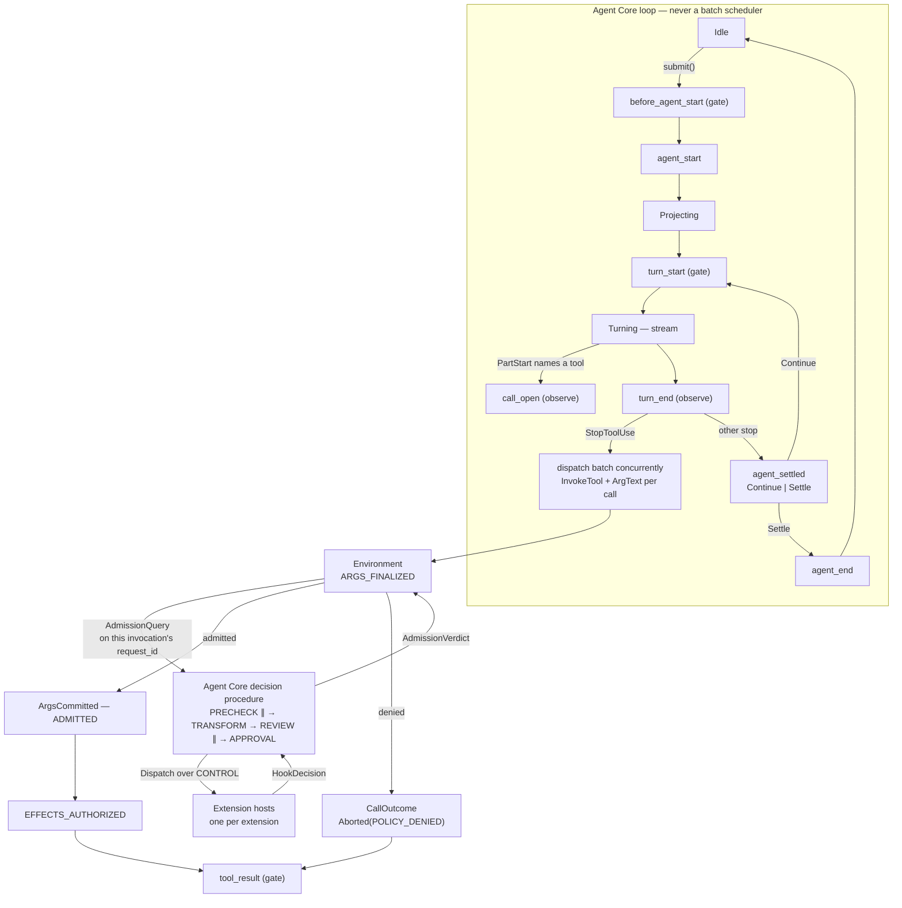

# Hooks — the event and decision spine

> **Design document, not a runtime API guarantee.** This corpus includes proposed
> interfaces and historical implementation observations. See
> [implementation status](implementation-status.md) for current owners and known gaps.

> Owner doc for `@omp.hook`, the event catalog, `omp.HookDecision` and its arms `omp.Allow` /
> `omp.Deny` / `omp.Modify` / `omp.Defer` / `omp.RequireApproval`, `omp.CallTarget` and its
> variants, `omp.HookPhase`, `omp.Composition`, `omp.OnFailure`, `omp.When`, the per-invocation
> decision procedure, the failure-semantics table, the subscription bitmap, and the reentrancy
> protocol.
> Siblings: [`00-overview.md`](00-overview.md) (host, sockets, manifest, trust tiers,
> `omp.Context`, activation order, cancellation),
> [`01-devices.md`](01-devices.md) (`@omp.device`, `@omp.tool`, the `dyn` shell builtin, `omp.devices`),
> [`02-verdicts.md`](02-verdicts.md) (`omp.Payload`, `omp.Fault`, `prompt()`, `lift()`,
> `family@rev`, spill budget),
> [`03-params.md`](03-params.md) (`IncomingParams`, `omp.InvocationPhase` — the seven-state
> invocation machine, `Ev`),
> [`04-placement.md`](04-placement.md) (`omp.Place`, `omp.workers`, `omp.WorkerInfo`),
> [`06-policy.md`](06-policy.md) (`BashIR`, `omp.SandboxProfile`, `omp.Tier`, `ApprovalSpec` and
> the durable approval ticket, env-side admission),
> [`07-ui.md`](07-ui.md) (`omp.ui.confirm`, `omp.ui.DialogOutcome`, `omp.ui.InvocationMode`,
> `@omp.command`, TML),
> [`08-context.md`](08-context.md) (`omp.MessageRef`, `Role`, `StopReason`,
> `CompactionEvent`, `CompactionAction`, `thread_projection`, `ContextPatch`, `DelegateSpec`,
> prompt slots),
> [`09-journal.md`](09-journal.md) (`omp.journal`, `omp.sessions`, `artifact://`),
> [`10-telemetry.md`](10-telemetry.md) (`@omp.telemetry`, `report_issue`),
> [`11-env.md`](11-env.md) (`omp.env`, doc leases, exec),
> [`12-agents.md`](12-agents.md) (`omp.agents`, `Continue`/`Settle`, `SubagentSpec`, `Usage`),
> [`13-inference.md`](13-inference.md) (`ModelRef`, `RouteRef`, `omp.Failover`,
> `CapabilityIntent`, provider event payloads),
> [`14-deploy.md`](14-deploy.md) (how extension code arrives, layering, install-time trust),
> [`15-regimes.md`](15-regimes.md) (stateful multi-turn regimes, transactional middleware isolation,
> durable bounds, and modes).

## 1. Purpose

A hook is a subscription to one named point in the agent's life that returns a **decision**: a
typed value the harness acts on. `@omp.hook` is the only way an extension observes or vetoes core
behaviour, and it is deliberately the only extensibility unit that can say "no". Capabilities the
model can invoke are devices ([`01-devices.md`](01-devices.md)); contributions to the prompt are
slots ([`08-context.md`](08-context.md)); everything that is a *decision about what the harness is
already doing* is a hook.

The pi failure this removes is not one bug, it is a shape. pi's `ExtensionRunner` fans 45 event
names out to whatever handlers happen to be registered, in whatever order the loader discovered
the extensions (`/work/pi/packages/coding-agent/src/extensibility/extensions/loader.ts:435-458`,
`612-730`), with no priority mechanism of any kind, and resolves conflicts by a convention that
differs per emitter: `tool_call` is first-block-wins for the block flag but *last-writer-wins* for
the rewritten input, and later handlers never see earlier handlers' rewrites
(`runner.ts:1451-1484`); `tool_result` is field-by-field last-writer-wins over a mutated event
(`runner.ts:1402-1413`); `input` is first-handled-wins (`runner.ts:1580`);
`resources_discover` additively concatenates whatever anyone returns (`runner.ts:1545-1554`).
The failure policy is likewise per emitter and undiscoverable from the outside: `emitToolCall` is
fail-closed with a comment explaining why (`runner.ts:1439-1442`), while `emitToolResult`,
`emitUserBash`, `emitContext`, `emitBeforeProviderRequest` and the generic `emit()` are all
fail-open. In the wild this produces an 18-link policy chain whose evaluation order is a function
of filesystem discovery order, in which one extension's rewrite is silently discarded by the next,
and where nobody — extension author or user — can predict whether a hung handler allows or blocks.

omp fixes the shape. Every gateable hook returns one of exactly five decision arms
(`omp.HookDecision`), with three narrowly-scoped domain-return families where the decision space
genuinely is not allow-or-modify. Every hook declares a **phase** (`omp.HookPhase`), and the phase
— not an integer priority — is what orders and parallelizes evaluation. Every event declares, as
data the host can query, its latency class, its channel, its failure policy, its default decision
when everyone defers, and the composition rule for each mutable field of its payload. Exactly one
phase may mutate and it is totally ordered, denial short-circuits everything that costs money or
attention, approval is a durable Core-owned ticket rather than a suspended coroutine, and an
unsubscribed event costs one bit test in Rust.

## 2. Concepts

### 2.1 One shape

```python
import omp

@omp.hook("tool_call", phase=omp.HookPhase.PRECHECK)
async def block_credential_reads(event: omp.ToolCallEvent, ctx: omp.Context) -> omp.HookDecision:
	if event.kind is omp.TargetKind.MCP:
		return omp.Defer()                     # not a shape this rule understands
	if ".env" in event.args.get("path", ""):
		return omp.Deny("credential files are not readable in this workspace")
	return omp.Defer()
```

A handler takes `(event, ctx)` and returns a decision. `ctx` is the `omp.Context` documented in
[`00-overview.md`](00-overview.md). Both `def` and `async def` are permitted, and both run under
**actor semantics**: callback entry is serialized per extension by default — one callback in one
extension runs at a time, reentrancy is explicit (§2.6), and concurrent entry is opt-in via
`concurrency=N` or `threadsafe=True` on the decorator. Different extensions always proceed
concurrently, each in its own host process, keyed `(layer, tier, extension)`
([`00-overview.md`](00-overview.md)).

A previous revision of this document said the opposite: synchronous handlers ran on a shared host
worker pool and `async def` handlers overlapped freely on the free-threaded event loop. The review
called that what it was — an unsafe default for an ecosystem API, an open invitation for every
extension author's module globals to race. It was wrong because free-threaded CPython is an
implementation advantage of the *host*, not a memory model extension authors opted into. The
default is now serialization per extension; free threading is what makes the opt-in cheap, not a
license to make ordinary extension code concurrent by surprise.

### 2.2 One decision type, not callback soup

The five arms of `omp.HookDecision` are total over every gateable event:

| Decision | Means | Effect on the procedure |
|---|---|---|
| `Allow` | "I have decided this is fine." | Recorded as an affirmative vote; later phases still run |
| `Deny` | "This must not happen." | **Short-circuits.** No later phase runs, no paid classifier is invoked, no approval ticket is opened |
| `Modify` | "Proceed, but with this input." | Legal only in TRANSFORM. Every later hook sees the mutated payload, because TRANSFORM is totally ordered |
| `Defer` | "Not my business." | Procedure continues unchanged; not a vote |
| `RequireApproval` | "A human (or external approver) must decide." | Legal only in APPROVAL. Its `ApprovalSpec` is merged into the invocation's single durable approval ticket, owned by Core ([`06-policy.md`](06-policy.md)) |

`None` returned from a handler is exactly `Defer()`. There is no per-event result dialect — the
thing that made pi's `ToolCallEventResult`, `InputEventResult`, `SessionBeforeSwitchResult`,
`SessionStopEventResult` and `ContextEventResult` five mutually incompatible protocols with five
different conflict-resolution rules.

**Domain returns.** Exactly three event families return a domain-specific type instead, because
their decision space is bounded and genuinely not expressible as allow-or-modify:

| Event | Returns | Owner |
|---|---|---|
| `agent_settled` | `omp.agents.Continue \| omp.agents.Settle` | [`12-agents.md`](12-agents.md) |
| `provider_error` | `omp.Failover` (a `RetryAction`: same route, refresh credential, rotate account, reselect route, reseed session, semantic retry, never) | [`13-inference.md`](13-inference.md) |
| `thread_projection` | `omp.ContextPatch` — bounded, validated projection operations against stable item IDs | [`08-context.md`](08-context.md) |

A previous revision counted exactly two families and prohibited the third outright, stating "there
is no client-side context event in omp" and citing it as a locked decision. That prohibition
over-read what the roadmap markers protect. What they forbid is pi's shape — hand the whole
message array to a callback and accept a whole message array back. `thread_projection`
([`08-context.md`](08-context.md)) is not that shape: extensions may not replace or reserialize
the provider message array; they may return bounded, validated projection operations against
stable item IDs. The prohibition prose is deleted, the invariant is amended to exactly that
sentence, and the catalog row lives in §3.11 family H.

`omp.events.spec(event).returns` reports the return type, so this is discoverable rather than
folklore. A domain return is not an escape hatch for new event families: adding one requires that
the decision space already exists as a typed enumeration owned by a sibling document — `omp.Failover`
mirrors `crates/ai/src/error.rs`, `ContextPatch`'s op set is closed and validated by
[`08-context.md`](08-context.md) — not merely that five arms feel awkward.

### 2.3 Where hooks attach — and who decides

Hook sites are the seams the loop already has. omp's loop is a four-phase machine
(`AgentPhase::{Idle, Projecting, Turning, ToolBatch}`, `crates/agent/src/events.rs:19-29`), and
every hook attaches at a transition or at a durable journal write, never inside a stream.

The single most important thing about this design is **where the `tool_call` decision is made and
who runs it.** Locked decision D6 (`PLAN.md` §D6, amended 2026-08-19) states: "One
mailbox, no gate chain… A tool batch runs concurrently exactly as the model issued it: no
batch-level admission scheduler, no parallelism detection, no reordering. Each invocation gates
independently: the environment asks a per-invocation admission query, and Core answers it by
running the hook phase procedure." That division of labour is now D6's own text, and it is this
document's: the **environment owns the gate** (an invocation's effects
are authorized or refused env-side, at the same place they are enforced), and **Agent Core runs
the per-invocation decision procedure** — it sorts subscriptions into phases, dispatches them,
composes transforms, aggregates review, and owns the durable approval ticket. A loop that
evaluated policy before dispatching a batch would be an admission scheduler, and it would
serialize the batch behind the slowest gate — that is what D6 forbids.

A previous revision described Agent Core as a "pure courier, never decider" with no gate chain
anywhere in it. The review was right to call that obscurantism: a component that globally sorts
subscriptions, dispatches them stage by stage, waits for every host in a stage, composes
mutations, and stops on denial is a decision orchestrator, whatever it is named — and pretending
otherwise hid where correctness lives. The courier language is deleted throughout. What remains
true, and what D6 actually protects, is the invariant kept verbatim from the first revision:
**each invocation gates independently; one slow approval never serializes the batch.** Because
"Core runs the per-invocation decision procedure" stretched D6's pre-amendment wording, this
document flagged a **D6 wording amendment as recommended**; the amendment was ratified 2026-08-19
— the prohibition binds the batch dispatch path, not the per-invocation decision procedure — so
the scope reading is no longer an interpretation but the decision's own text. The flag is kept
here as the historical record.

Admission is a property of the invocation, enforced where effects are authorized. On the wire the
admission query rides between `InvokeTool` and `ArgsCommitted` (`ArgsCommitted`'s own comment in
`crates/proto/proto/omp/env/v1/env.proto:76` reads "The sole effect-commit gate"): the environment
emits the query once the invocation reaches ARGS_FINALIZED (`omp.InvocationPhase`,
[`03-params.md`](03-params.md)) — requested target fixed, canonical requested args fixed, repairs
and duplicate-key checks complete — Core answers it by running the phases, and `ArgsCommitted` is
written only after the answer, freezing the effective target and args (ADMITTED). Effects wait
further still, for EFFECTS_AUTHORIZED. A previous revision emitted the admission query *after*
`ArgsCommitted`, which contradicted [`06-policy.md`](06-policy.md)'s speculative-admission story
and left "commit" meaning three different transitions at once; the seven-state machine in
[`03-params.md`](03-params.md) is now the single vocabulary, and "commit" is reserved for
ASSISTANT_ITEM_COMMITTED.



Three consequences follow, and they are the reasons this arrangement is worth the indirection.

**Each invocation gates itself, concurrently.** Ten calls in a batch raise ten independent
admission queries. The loop's mailbox never blocks on any of them; `ToolBatch::drive_interruptible`
(`crates/agent/src/loop.rs:508-513`) is untouched and the batch runs "exactly as the model issued
it". A slow approval on one call does not delay the other nine.

**Speculation needs no decision.** omp opens a speculative invocation the moment a stream delta
names a tool (`SpeculativeCall::open`, `crates/agent/src/batch.rs:371`) and relays raw argument
fragments as they arrive (`batch.rs:394`), but the environment refuses effect operations before
EFFECTS_AUTHORIZED ([`03-params.md`](03-params.md)). Everything before ARGS_FINALIZED is
disposable, so there is nothing to authorize; `call_open` is observation-only for exactly this
reason. pi has no such gate, which is why its `tool_call` handler must run inside
`ExtensionToolWrapper.execute` and why a hung extension "would park `ExtensionToolWrapper.execute`
indefinitely and freeze tool dispatch — see issue #3948" (`runner.ts:1434-1437`).

**Denial is a structured value, not an ad-hoc string.** A denied call settles into the same
journaled `omp.CallOutcome` shape as any other call —
`Aborted(kind=AbortKind.POLICY_DENIED, policy=PolicyDenied(reason, code, decision_id, rules))`
([`02-verdicts.md`](02-verdicts.md)) — so it is dialect-neutral, liftable, compactable, and
queryable, and telemetry reads structure instead of parsing prose ([`10-telemetry.md`](10-telemetry.md)).
The wire vocabulary already exists: `PROTOCOL_ERROR_CODE_PERMISSION_DENIED` (`env.proto:418`) and
`EXEC_OUTCOME_DENIED` (`env.proto:211`). Lesson #7 and Lesson #8 apply to refusals exactly as they
apply to successes.

The input-family gates (`user_input`, `user_bash`, `user_eval`, `command_invoke`) are the one
exception, and only because no invocation exists yet: they are dispatched by the input pipeline
before anything is journaled, and a `Deny` there consumes the submission.

**Nothing attaches per token.** `message_update` and `tool_update` are coalesced with a declared
window and refuse a zero window at registration. Per-keystroke work is not a hook at all; the TUI
owns keystrokes and extensions declare triggers ([`07-ui.md`](07-ui.md)).

### 2.4 Channel, latency class, failure class

Every event carries three fixed properties, queryable at runtime:

- **Channel.** Every hook rides **CONTROL**, the multiplexed reentrant socket to the Agent Core.
  CONTROL carries no world access; a hook that needs the filesystem uses `omp.env`
  ([`11-env.md`](11-env.md)) on the **DATA** socket, scoped to the environment the extension was
  declared by — for a remote-workspace extension that is the *remote* filesystem, not the client's
  disk ([`14-deploy.md`](14-deploy.md)). Path-bearing event fields are therefore env-scoped URIs,
  never assumed-local paths.

  Both channels are live. CONTROL is the dedicated inherited, multiplexed `omp.toolhost.v1`
  descriptor and carries hook dispatch and decisions, effects, host-initiated requests, and the
  subscription mask without world access. Invocation-scoped DATA is reachable from Python through
  `ExtensionEnvClient`; envd authenticates its invocation id, effect token, host generation, and
  session generation before routing documents, workspace operations, processes, and blobs.
- **Latency class.** How often the event can fire, hence what a handler may afford. CONTROL
  round-trip on a local socket is tens of microseconds; `SESSION`, `SUBMISSION`, `TURN`, `CALL` and
  `INPUT` hooks may do real work, `STREAM` hooks must be coalesced and cheap, `ASYNC` hooks are off
  the critical path entirely. There is no `TOKEN` class.
- **Failure class.** What the harness does when the host cannot answer. `OnFailure.DENY`
  (fail-closed) for anything whose omission would authorize an effect; `OnFailure.DEFER`
  (fail-open) for everything else. A subscription may raise its own strictness, never lower it.
  Fail-closed is durable across host loss: a fail-closed subscription whose implementation is
  unavailable is answered by a synthetic-`Deny` stub built from its manifest declaration, and only
  an explicit user/org disable removes the policy (§3.13).

### 2.5 The subscription bitmap

Every event name has a stable dense integer id (`omp.events.EVENT_IDS`). At activation, and on
every subsequent registration change, each extension host sends a `Subscribe` frame carrying its
bitmap over those ids; the core ORs the per-host bitmaps (plus the stub bits from manifest
declarations of currently-unavailable fail-closed subscriptions, §3.13) into one mask — one bit
per event, set if *anything* answers for it. The core stores it as `[AtomicU64; N]` and the emit
site is a single masked bit test.

An unsubscribed event therefore costs one `u64` load, one AND, one branch. No payload dataclass is
constructed, no protobuf message is encoded, no CONTROL frame is written, no per-extension map is
walked. pi has the right instinct — `hasHandlers(eventType)` and the zero-handler bypass avoid
`structuredClone(messages)` in `emitContext` (`runner.ts:1328`, `1600`) — but pays a `Map` lookup
per extension per emit and still allocates a context object per event that has any subscriber at
all. The bitmap collapses that to a constant, and it is what makes it honest to ship 57 events
instead of 12.

The bitmap is per-*event*: the emit-site test stays one bit no matter how many extensions
subscribe. The core does, however, know exactly which subscriptions exist — `Subscribe` carries
per-subscription `SubscriptionSpec`s and the manifest declares every hook surface — and that
knowledge is load-bearing: the `When` filter runs core-side against it, phase sorting needs it,
and the fail-closed stub table is built from it. A previous revision claimed the core "never
learns which extension subscribed to what"; with one host process per extension and
manifest-declared subscriptions that was both false and undesirable — a core that cannot name the
dead extension's subscriptions cannot keep them fail-closed.

Hook subscription is the sibling of device registration, and the distinction Main settled applies
to both: **extensions register with the HOST, never with the MODEL.** `RegisterTools` / `ToolDecl`
(`crates/proto/proto/omp/toolhost/v1/toolhost.proto:54-64`) exists because the host must know a
device's name, schema, rev and constraints in order to render `dyn <name> --help` from the device
catalog at all; `Subscribe`
exists because the core must know which events are worth constructing. Neither is meant to add a
schema slot to a request.

**Today it does.** `Registry::register_worker` (`crates/tool/src/registry.rs:413-426`) inserts the
worker declaration into `self.live` at L424, and its own doc comment at L411 says worker
declarations "participate in identity, hashing, and advertisement". `Registry::advertise`
(`registry.rs:483-492`) then iterates all of `self.live` and lowers every entry with **no route
filter**, despite the doc comment at L482 claiming "for one selected route". So every Python worker
declaration occupies a slot in the model's advertised tool array as shipped — precisely the failure
Lesson #6 exists to prevent. The fix is small and the route-awareness already exists next door:
`Registry::invoke` (`registry.rs:470-480`) does check the route and refuses `ToolRoute::Worker` at
L476-478, and `live_identities` (`registry.rs:437-443`) documents that "callers still need to
inspect [`Self::route`] before granting an execution capability". `advertise` simply does not use
it. Every claim in §3.11 and §4 about devices staying out of the tool array describes the target
behaviour, not today's.

### 2.6 Reentrancy — and what approval is not

A hook must be able to consult the world in the middle of forming its decision — read the journal,
read a file through `omp.env`, run a budgeted completion in REVIEW or the turn-scoped `turn_start`
TRANSFORM — without deadlocking anything.
CONTROL is full-duplex and request-multiplexed: when a handler awaits `omp.state.latest(DeclaredKind, scope=...)`,
the
host allocates a fresh `request_id` and writes a request frame on the same connection the pending
decision is riding.

**User approval is not reentrancy.** A previous revision's motivating example here was a
`tool_call` handler awaiting `omp.ui.confirm(...)` for up to fifteen minutes — the
`@robhowley/pi-yolo-seatbelt` `ASK` tier transplanted verbatim, with the handler's deadline budget
suspended while the dialog hung. That is now prohibited, and the reversal is deliberate: an
approval that suspends a Python coroutine dies with the extension, occupies the host for minutes
or hours, and lets every extension paint its own approval dialog — spoofable chrome, multiplied
per hook. A hook that needs a human returns `RequireApproval(ApprovalSpec(...))` from the APPROVAL
phase (§3.4). Core persists exactly one durable approval ticket per invocation, merging every
unresolved reason; the ticket survives extension restarts, renders as exactly one unspoofable
dialog, and treats headless and external approvers as properties of the ticket, not of a Python
call stack ([`06-policy.md`](06-policy.md)). Raising a dialog from inside a gate dispatch raises
`omp.HookContractError`.

Four properties make the round-trips that remain safe:

1. **The loop is not waiting.** Under D6 the loop dispatched the batch and moved on; the
   environment holds the pending invocation and the Agent Core is running the decision procedure
   off the loop. There is no phase to starve. `crates/agent/src/loop.rs:516-533`'s `select!` over
   `drive`, `wait_deadline`, `abort_rx` and `mailbox.wait()` continues to run throughout.
2. **The decision deadline is suspended for the interactive round-trips that remain legal.**
   `omp.agents` waits, and dialogs raised from surfaces where dialogs are still allowed
   (OBSERVE handlers, `@omp.command` flows, [`07-ui.md`](07-ui.md)), pause the handler's deadline
   budget and resume it on settle. This is pi's one good idea in this area —
   `timeoutBudget.pause()` / `resume()` around every dialog, including pausing only once a
   `ui.custom` component actually mounts (`runner.ts:146-187`, `runner.ts:282-298`) — kept in
   intent, but made explicit on the wire (`BudgetPause`) instead of inferred from which request is
   in flight, which is why pi has to special-case component mounting. Non-interactive round-trips
   (`omp.journal.append`, reads through `omp.env.docs.open`) do **not** suspend it. Approval waits no longer
   appear here at all: the ticket is Core's, so no handler budget is suspended for one.
3. **Dialogs never raise.** `omp.ui.confirm` / `select` / `input` / `ask_user` return
   `omp.ui.DialogOutcome` and, absent a TUI, return
   `DialogOutcome(cancelled=True, reason=DialogCancel.UNAVAILABLE)` unless the session exposes an
   RPC dialog client ([`07-ui.md`](07-ui.md)). Policy no longer gates on dialogs directly — the
   approval ticket does — but the same never-raise contract is what makes an unresolved ticket
   resolve to a decision rather than an exception ([`06-policy.md`](06-policy.md)).
4. **Phase conflicts are refused, not deadlocked.** Each in-flight hook carries the set of *loop*
   phases (`AgentPhase`, not `omp.HookPhase`) its pending decision is blocking. Any CONTROL
   request from that hook whose service requires a blocked phase is rejected immediately with
   `omp.PhaseConflict`. Spawning a subagent from a `tool_call` hook is fine (its own session, its
   own phases); awaiting an injection into the *current* session from inside a
   `before_agent_start` hook is a phase conflict and fails fast.

Reentrancy depth is capped at `omp.limits.REENTRANCY_DEPTH`; exceeding it raises
`omp.ReentrancyError`, which becomes a synthetic `Deny` on fail-closed events.

## 3. Reference

### 3.1 `@omp.hook`

```python
def hook(
	event: str,
	*,
	phase: omp.HookPhase | None = None,
	order: int = 0,
	on_failure: omp.OnFailure | None = None,
	timeout: omp.Duration | None = None,
	coalesce: omp.Duration | None = None,
	when: omp.When | None = None,
	provider: str | None = None,
	concurrency: int = 1,
	threadsafe: bool = False,
	name: str | None = None,
) -> Callable[[HookFn], HookFn]: ...
```

Registers `fn` as a handler for `event`. Registration happens at module import, before
`session_start` (eager extensions) or `extension_activate` (lazily activated extensions) is
dispatched; registering after the host has completed activation raises `omp.LateRegistration`.

| Argument | Semantics |
|---|---|
| `event` | Event name from the catalog in §3.11. An unknown name raises `omp.UnknownEvent` at registration — never a silent no-op, which is how pi extensions end up subscribing to typos |
| `phase` | The `omp.HookPhase` this subscription runs in (§3.4). Required for gateable events — there is no safe default phase, so omitting it raises `omp.HookContractError`. For observation-only events `None` means `OBSERVE`, the only legal value |
| `order` | Legal only with `phase=TRANSFORM`; supplying it in any other phase raises `omp.HookContractError`. Lower runs first. Equal `order` on the same event breaks ties deterministically by `(layer, publisher, extension_id)` — never by install or discovery order |
| `on_failure` | Raises this subscription's strictness. `None` uses the event default. Lowering strictness raises `omp.HookContractError`; supplying it for an observation-only event raises `omp.HookContractError` |
| `timeout` | Per-handler deadline as an `omp.Duration` (config strings such as `"500ms"`/`"30s"` parse into it). `None` uses the event default (§3.7). A value above the event's ceiling raises `omp.HookContractError`. Suspended across the interactive round-trips that remain legal (§2.6) |
| `coalesce` | Required for `LatencyClass.STREAM` events; forbidden elsewhere. Minimum `16ms`, default `50ms`. A zero duration raises `omp.HookContractError` — per-token dispatch is prohibited, not discouraged |
| `when` | Declarative pre-filter evaluated in Rust before the payload is built. See §3.6 |
| `provider` | Sugar for `when=When(provider=frozenset({value}))`, for the provider-scoped events in family G. Supplying both `provider=` and `When.provider` raises `omp.HookContractError` |
| `concurrency` | Actor opt-in (§2.1): how many dispatches of *this subscription* may be entered concurrently. Default 1 — serialized |
| `threadsafe` | Actor opt-in: declares the whole handler safe for concurrent entry alongside the extension's other callbacks. Default `False` |
| `name` | Stable identifier for this subscription in journal records, telemetry and error messages. Defaults to `f"{module}.{fn.__qualname__}"` |

Every subscription also appears in the extension manifest's declaration table
([`14-deploy.md`](14-deploy.md)): `declaration_id, kind, module, static key, activation trigger,
required API level, failure class`. The declaration is what makes the fail-closed stub in §3.13
constructible without running any Python: the core knows, before the extension is ever imported,
which events this extension gates and what its failure class is.

**Channel:** CONTROL. **Latency:** the event's. **Failure:** the event's, as raised by
`on_failure`. **Reentrant:** the event's.

**Raises:** `omp.UnknownEvent`, `omp.HookContractError`, `omp.LateRegistration`.

**Returns:** the undecorated function, so one callable may carry several `@omp.hook` decorators and
remain directly unit-testable.

```python
@omp.hook("tool_call", phase=omp.HookPhase.PRECHECK, on_failure=omp.OnFailure.DENY,
          timeout=omp.Duration("2s"), when=omp.When(name={"bash"}))
def no_curl_pipe_shell(event: omp.ToolCallEvent, ctx: omp.Context) -> omp.HookDecision:
	if event.bash is None or event.bash.has_dynamic_eval:
		return omp.Deny("shell command could not be statically resolved")
	names = {cmd.name for cmd in event.bash.commands}
	if names & {"curl", "wget"} and "sh" in names:
		return omp.Deny("piping a download into a shell is blocked", code="pipe_to_shell")
	return omp.Defer()
```

### 3.2 Decisions

#### `omp.Allow`

```python
@dataclass(frozen=True, slots=True)
class Allow:
	reason: str | None = None
```

An affirmative decision. `reason` is journaled and shown in the approval trail; it is never sent to
the model.

`Allow` differs from `Defer` in exactly one way that matters: `Allow` is a vote, `Defer` is
abstention. An event whose default decision is `Deny` (§3.8) requires at least one `Allow` among
non-deferring hooks; universal `Defer` leaves the default standing. `Allow` is legal from `REVIEW`
and `APPROVAL`; `PRECHECK` is deny-only (§3.4), so an `Allow` returned there raises
`omp.HookContractError` — a pre-filter that cannot pay for judgment is not entitled to vouch.

```python
return omp.Allow("approved by on-call via #ops")
```

#### `omp.Deny`

```python
@dataclass(frozen=True, slots=True)
class Deny:
	reason: str
	fatal: bool = False
	code: str | None = None
```

| Field | Semantics |
|---|---|
| `reason` | Required. Model-facing for `tool_call`, `command_invoke` and `subagent_spawn`; user-facing for `user_input`, `user_bash` and `user_eval`; journaled always. This is the one string an extension authors that the model may read, and it is a structured field of a decision, not an executor return value — [`02-verdicts.md`](02-verdicts.md) |
| `fatal` | `True` aborts the whole submission, transitions the loop to `AgentPhase::Idle` and surfaces the reason to the user. **Legal only on `before_agent_start`, `user_input`, `turn_start` and the `session_*` gates.** On any `CALL`-class event — including `tool_call` — it raises `omp.HookContractError`, because admission is per-invocation and a single call's gate is not entitled to end a submission |
| `code` | Stable machine-readable classifier, carried durably in `PolicyDenied.code` and correlated by metrics and `report_issue` ([`10-telemetry.md`](10-telemetry.md)). Convention: `snake_case`, extension-scoped |

`Deny` short-circuits: no later phase runs, no paid classifier is invoked, no approval ticket is
opened. That is the point — a cheap regex gate that denies must not pay for the LLM classifier
behind it.

For `tool_call`, `Deny` becomes an environment-side refusal: the invocation settles as
`omp.CallOutcome.Aborted(kind=AbortKind.POLICY_DENIED, policy=PolicyDenied(reason, code,
decision_id, rules))` ([`02-verdicts.md`](02-verdicts.md)), surfaced on the wire through the
existing vocabulary (`PROTOCOL_ERROR_CODE_PERMISSION_DENIED`, `env.proto:418`;
`EXEC_OUTCOME_DENIED` for exec, `env.proto:211`). The shipped Rust lowering is
`Abort::Skipped { reason }` (`crates/tool/src/lib.rs:310-313`); the `POLICY_DENIED` kind and the
structured `PolicyDenied` payload are the target shape, owned by [`02-verdicts.md`](02-verdicts.md),
so telemetry distinguishes "skipped" from "blocked" by structure, never by parsing prose.

```python
return omp.Deny("workspace is in read-only audit mode", fatal=True, code="audit_lock")
```

#### `omp.Modify`

```python
@dataclass(frozen=True, slots=True)
class Modify:
	target: omp.CallTarget | None = None
	args: Mapping[str, Any] | None = None
	patch: Mapping[str, Any] | None = None
	reason: str | None = None
```

| Field | Semantics |
|---|---|
| `target` | Replacement `CallTarget` for `tool_call`, when the redirect changes identity and not merely arguments. Resolution goes through the device/tool registry, so a `Modify` cannot conjure an unregistered target. Target redirection additionally requires an explicit manifest capability and is always visible in user approval ([`06-policy.md`](06-policy.md)) |
| `args` | Full replacement of the payload's mutable mapping |
| `patch` | Shallow key→value overlay applied over the current mapping. Keys mapped to `omp.UNSET` are removed |
| `reason` | Journaled explanation |

`Modify` is legal only from `phase=TRANSFORM`; returning it from any other phase raises
`omp.HookContractError`. Exactly one of `args` / `patch` may be set; both raises
`omp.HookContractError`. `patch` is the form you want alongside other transforms, because it does
not silently discard a sibling's edit.

`Modify` composes in `order` within TRANSFORM and **each later transform sees the mutated
payload** — the thing pi's `emitToolCall` does not do, where every handler receives the original
`event.input` and the last returned `input` wins. TRANSFORM is totally ordered (§3.4), so this
promise is satisfiable rather than aspirational. After every *accepted* transform the harness
invalidates and recomputes all derived facts — `event.bash` and its `BashIR`, path resolutions,
the effect envelope — before the next handler or phase sees the call, and records the full
transformation trail (`requested_args`, `transformations[]`, `effective_args`,
`derived_ir_revision`) in the admission audit record ([`06-policy.md`](06-policy.md)). The
composition rule per field is data, not convention: §3.5.

Two constraints the harness enforces, rejecting the operation as malformed if violated:

1. The result must remain schema-valid for the resolved target.
2. `Modify` may not introduce keys the event declares immutable. In particular no `tool_result`
   hook may write model-facing text: `prompt`, `text`, `content` and `parts` are immutable on every
   payload, because the model-facing projection is a pure function of the durable outcome, owned by
   the device and versioned with it ([`02-verdicts.md`](02-verdicts.md)). Attempting it raises
   `omp.HookContractError`.

```python
@omp.hook("tool_call", phase=omp.HookPhase.TRANSFORM, order=10, when=omp.When(name={"bash"}))
def force_workspace_cwd(event: omp.ToolCallEvent, ctx: omp.Context) -> omp.HookDecision:
	if event.args.get("cwd") is None:
		return omp.Modify(patch={"cwd": ctx.session.root}, reason="pin cwd to workspace root")
	return omp.Defer()
```

#### `omp.Defer`

```python
@dataclass(frozen=True, slots=True)
class Defer:
	note: str | None = None
```

Abstention. `note` is journaled at debug level only. Returning `None` is identical.

Deferring is the correct default for a policy hook that did not recognize its input, and it is
what makes the phase procedure composable: a rule that cannot judge should *defer* so a later
phase still runs, not `Allow` and thereby out-vote it. It is also the honest answer to a
`CallTarget` variant a rule was not written for — see §3.3.

#### `omp.RequireApproval`

```python
@dataclass(frozen=True, slots=True)
class RequireApproval:
	spec: omp.ApprovalSpec
```

"A human — or an external approver — must decide, and here is what to ask." Legal only from
`phase=APPROVAL`; returning it from any other phase raises `omp.HookContractError`. The
`ApprovalSpec` and the durable approval ticket it feeds are owned by
[`06-policy.md`](06-policy.md); this document owns only the decision arm.

The contract that matters: **returning `RequireApproval` completes the handler.** The coroutine is
not suspended, no dialog is raised from Python, and the host holds nothing while the human thinks.
Core merges every `RequireApproval` from one invocation's APPROVAL phase into a single durable
ticket carrying all unresolved reasons; the ticket survives extension restarts and host crashes,
renders as exactly one unspoofable dialog, and resolves the admission when answered. Two APPROVAL
hooks therefore cost the user one prompt, not two — the multiple-concurrent-dialogs failure the
review identified in the band model is structurally impossible here.

#### `omp.HookDecision`

```python
type HookDecision = Allow | Deny | Modify | Defer | RequireApproval
```

A previous revision named this type `Verdict`, colliding with
[`02-verdicts.md`](02-verdicts.md)'s durable call outcome of the same name. The collision was real,
not cosmetic — one symbol meant "a hook's answer" in this document and "what a call settled as" in
its sibling. Both are renamed: the hook decision is `omp.HookDecision`, the durable outcome is
`omp.CallOutcome`.

Handlers for observation-only events are typed `-> None`; returning anything but `None` or
`Defer()` raises `omp.HookContractError`. Handlers for the three domain-return families return
their own types (§2.2).

#### `omp.UNSET`

```python
UNSET: Final[object]
```

Sentinel used in `Modify.patch` to delete a key. Distinct from `None`, which sets the key to JSON
`null`.

### 3.3 `omp.CallTarget` — the discriminated dispatch target

One `tool_call` event fires per logical dispatch, whatever the dispatch mechanism. Its identity is
a tagged union, so a policy hook can neither mistake one mechanism for another nor accidentally
wave through a mechanism it was not written for.

```python
class TargetKind(enum.StrEnum):
	CORE = "core"      # a core harness tool the model sees in every request
	DEVICE = "device"  # an extension or MCP-mounted device, dispatched via the dyn shell builtin
	MCP = "mcp"        # an MCP endpoint reached through a mounted server

@dataclass(frozen=True, slots=True)
class CoreTool:
	kind: ClassVar[TargetKind] = TargetKind.CORE
	name: str
	rev: str
	args: Mapping[str, Any]

@dataclass(frozen=True, slots=True)
class DeviceCall:
	kind: ClassVar[TargetKind] = TargetKind.DEVICE
	name: str
	family: str
	rev: str
	args: Mapping[str, Any]

@dataclass(frozen=True, slots=True)
class McpCall:
	kind: ClassVar[TargetKind] = TargetKind.MCP
	server: str
	tool: str
	args: Mapping[str, Any]

type CallTarget = CoreTool | DeviceCall | McpCall
```

| Symbol | Semantics |
|---|---|
| `TargetKind.CORE` | `read`, `write`, `edit`, `bash`, `glob`, `grep` and the rest of the harness skeleton. `rev` is the dialect-qualified revision (`"hl.3"` for hashline `edit`), so `When(rev="hl.*")` is meaningful |
| `TargetKind.DEVICE` | Everything extensions and MCP mounts expose. `family` and `rev` together are the `family@rev` identity from [`02-verdicts.md`](02-verdicts.md); `f"{name}@{family}.{rev}"` is the display form |
| `TargetKind.MCP` | An endpoint on a mounted MCP server addressed as `(server, tool)`. There is no meaningful flat `name`, which is exactly why the union has no top-level `name` field |
| `.args` | Present on all three variants with the same name, and **always decoded**. The `dyn` CLI transport and its raw `--json` payload never reach a policy hook |

Two rules make this safe, both binding.

**One gate per action.** An `dyn <name> [args…]` invocation through the `dyn` builtin of the
embedded shell ([`01-devices.md`](01-devices.md)) fires exactly one `tool_call`, with the RESOLVED
`target=DeviceCall(...)` carrying decoded nested arguments. It does **not** first fire a gate on
`CoreTool("shell")`: the builtin is transport, never the policy subject for a device dispatch, so
a guard on the resolved device cannot be bypassed by CLI spelling. Catalog and docs reads — `dyn`,
`dyn --q <text>`, and `dyn <path> --help` — instead fire `tool_call` with
`target=CoreTool("shell")`, because there the shell-hosted catalog itself is the thing being
touched. Double-gating would prompt the user twice for one action and, worse, would let an author
gate the transport while believing they had gated the capability. The one-gate rule therefore
binds the resolved target regardless of transport.

**One event, one procedure.** There is no separate `device_call` event. Policy extensions must
gate core tools, devices and MCP endpoints with identical phase ordering, deny short-circuit and
failure semantics. Two event names would mean every policy author subscribes twice, and the one
who forgets ships a guard that blocks `bash` and waves through the `dyn shell_exec …` device
dispatch.
That is a privilege escalation, and splitting the event would be designing it in on purpose.

The correct handling of an unrecognized variant is `Defer()`:

```python
@omp.hook("tool_call", phase=omp.HookPhase.PRECHECK, on_failure=omp.OnFailure.DENY)
def guard_writes(event: omp.ToolCallEvent, ctx: omp.Context) -> omp.HookDecision:
	match event.target:
		case omp.CoreTool(name="write" | "edit", args={"path": str() as path}):
			return omp.Deny(f"{path} is protected") if _protected(path) else omp.Defer()
		case omp.DeviceCall(name=name) if name in _WRITING_DEVICES:
			return omp.Deny(f"device '{name}' may not write in this session")
		case _:
			return omp.Defer()   # honest abstention, never accidental consent
```

### 3.4 `omp.HookPhase`

```python
class HookPhase(enum.StrEnum):
	PRECHECK = "precheck"
	TRANSFORM = "transform"
	REVIEW = "review"
	APPROVAL = "approval"
	OBSERVE = "observe"
```

Phases run in this sequence for one gateable event, and a `Deny` in any phase short-circuits every
later one. Within a phase the execution model is fixed per phase, not per subscription:

| Phase | Execution | May return | Intended work | Semantics |
|---|---|---|---|---|
| `PRECHECK` | **Parallel** across subscriptions and hosts | `Deny`, `Defer` | Deterministic blocklists, path guards, static shell-AST rules | Pure and deterministic: a function of the event and readable state, no externally visible effects, no paid calls. Deny-only, so parallelism is safe — abstentions cannot conflict and denies compose as OR |
| `TRANSFORM` | **Totally ordered** by `order`, ties broken by `(layer, publisher, extension_id)` | `Modify`, `Defer` | Argument normalizers, cwd pinning, sandbox-envelope narrowing, once-per-turn selection | Deterministic except for the bounded `turn_start` classifier exception below. Each accepted transform is applied before the next handler runs, and all derived facts (`BashIR`, path resolutions, the effect envelope) are recomputed after every accepted transform, so every later handler and phase sees a consistent call |
| `REVIEW` | **Parallel**, with an explicit aggregate policy | `Allow`, `Deny`, `Defer` | Secondary-model classifiers, lint gates, circuit breakers | Budgeted. **Paid inference is allowed; externally visible effects are not.** Aggregate: any `Deny` denies (all denials journaled); else any `Allow` is an affirmative vote; else defer |
| `APPROVAL` | Handlers run after REVIEW; tickets merge | `RequireApproval`, `Allow`, `Deny`, `Defer` | "A human must see this" rules, external-approver routing | Never suspends a coroutine (§2.6). Core merges every `RequireApproval` into one durable ticket per invocation — one unspoofable dialog, survives restarts, headless/external approval is a ticket property ([`06-policy.md`](06-policy.md)) |
| `OBSERVE` | Asynchronous, off the critical path | `None` | Metrics, journal annotation, side dashboards | Cannot change the decision. Runs after the outcome is fixed; a slow or dead observer delays nothing |

**Paid-completion exception.** `omp.agents.completion()` is also legal in a turn-scoped
`TRANSFORM` hook — today, exactly `turn_start` — so one bounded classifier may select a mutable
turn field and return `Modify`. This does not generalize to per-call TRANSFORM hooks:
`tool_call`, `before_call`-class events, and every other CALL-latency event remain ineligible for
paid inference. REVIEW remains the paid-classifier phase for those events.

A hook registered at `OBSERVE` that returns anything other than `Defer()`/`None` raises
`omp.HookContractError`. This makes "I only wanted to watch" enforceable instead of aspirational.

**This replaces `Priority`, and the replacement is a reversal, not a rename.** A previous
revision ordered hooks by arbitrary integer priority with six named band anchors (`PRE_FILTER`
900, `MUTATE` 700, `AUTO_REVIEW` 500, `INTERACTIVE` 300, `REMOTE` 100, `OBSERVE` 0) and dispatched
band-by-band, concurrently within a band. The review demonstrated the model was incoherent on its
own terms, and it was right on every count: arbitrary integers implied a total ordering the
concurrent bands could not deliver (`priority=699` and `priority=701` promised observable
sequencing that did not exist); `Modify`'s every-later-hook-sees-mutations promise was
unsatisfiable for same-band handlers; `AUTO_REVIEW` was simultaneously required to run paid
secondary inference and to have no externally visible effects — a contradiction this document
papered over; and multiple `INTERACTIVE` hooks could raise multiple concurrent approval dialogs
for one action. The phase model fixes each directly: only TRANSFORM mutates and it is totally
ordered, so Modify-visibility is now satisfiable; REVIEW's rule is explicit — paid inference is
budgeted and allowed, external effects are not, so the auto-review contradiction is resolved by
definition rather than by hope; and APPROVAL produces one Core-owned ticket, so one action costs
one dialog. The `INTERACTIVE` and `REMOTE` bands are gone entirely — what they existed for is the
approval ticket.

**Purity requirement, restated for phases.** `PRECHECK`, `TRANSFORM` and `REVIEW` handlers MUST be
free of externally visible side effects (budgeted inference is metered and journaled, not
"external" in this sense, both in REVIEW and under the narrow `turn_start` TRANSFORM exception); `APPROVAL` handlers describe, in an `ApprovalSpec`, the effectful step
Core will own; `OBSERVE` may write the journal. This is not style advice: PRECHECK and REVIEW
dispatch concurrently, so a deny-capable handler can run alongside a peer that is about to deny.
Keeping effects out of every phase that can be short-circuited is what makes "no effect happens
before a denial" true rather than hopeful.

`omp.HookPhase` orders hooks within the decision procedure. It is unrelated to `omp.Tier`
([`06-policy.md`](06-policy.md)), which is a device's default approval tier; to
`omp.LifecyclePhase` and `omp.InvocationPhase` ([`00-overview.md`](00-overview.md),
[`03-params.md`](03-params.md)); and to `CapabilityIntent` priority
([`13-inference.md`](13-inference.md)), which spends the constrained-sampling budget.

### 3.5 `omp.Composition`

```python
class Composition(enum.StrEnum):
	REPLACE = "replace"
	APPEND = "append"
	INTERSECT = "intersect"
```

The per-field rule for combining `Modify` results from the TRANSFORM phase — the only phase that
mutates.

| Member | Rule | Used for |
|---|---|---|
| `REPLACE` | Later transform's value wins, in `order` | Scalars: `cwd`, `deadline`, `target` |
| `APPEND` | Values concatenate in `order`, duplicates preserved | Additive sequences: `resources_discover.add`, `tool_result.annotate`, `user_input.images` |
| `INTERSECT` | Result is the set intersection of every supplied value | Allowlists: `device_list.devices`, `resources_discover.keep`, `turn_start.enabled_tools`, `before_request.intents` |

`INTERSECT` is the one that earns its keep. Narrowing what is visible is always safe; widening it is
privilege escalation. pi's `emitResourcesDiscover` concatenates additively
(`runner.ts:1545-1554`), so an extension cannot remove a resource another extension exposed, and
`setActiveTools` is a whole-set write where the last caller wins. Under `INTERSECT`, a
read-only-audit extension and a plan-mode extension both restricting the device list compose to the
*intersection* without either knowing the other exists, and neither can be widened by a
later transform.

**Total order dissolves the old conflict rule.** A previous revision prohibited two same-band
hooks from writing the same `REPLACE` field, rejecting the composition as a `FieldError`, because
band-internal execution was concurrent and a scalar write race had no deterministic winner. That
rule existed only to patch the band model's own incoherence, and it is deleted with the bands:
TRANSFORM is totally ordered by `(order, layer, publisher, extension_id)`, so `REPLACE` now
composes deterministically — the later transform wins and the earlier value is journaled in the
transformation trail, visible rather than silently lost. A transform that must overwrite a peer's
scalar declares a higher `order`.

```python
def field_composition(event: str) -> Mapping[str, Composition]: ...
```

Returns the composition rule for each mutable field of `event`'s payload. Raises
`omp.UnknownEvent`.

### 3.6 `omp.When`

```python
@dataclass(frozen=True, slots=True)
class When:
	target: frozenset[TargetKind] | None = None
	name: frozenset[str] | None = None
	server: frozenset[str] | None = None
	rev: frozenset[str] | None = None
	path_globs: tuple[str, ...] = ()
	origin: frozenset[CallOrigin] | None = None
	reason: frozenset[str] | None = None
	provider: frozenset[str] | None = None
	once: bool = False
	after_gap: omp.Duration | None = None
```

A declarative pre-filter evaluated **in Rust, before the payload is constructed or sent**. A hook
whose `When` does not match costs nothing beyond the field comparisons — no CONTROL frame, no
Python call.

| Field | Semantics |
|---|---|
| `target` | Match `TargetKind`. `When(target={TargetKind.CORE})` is how a rule written only for core tools avoids being asked about devices at all |
| `name` | Match `CoreTool.name` or `DeviceCall.name`, and the command name for `command_invoke`. Never matches an `McpCall`, which has no `name` |
| `server` | Match `McpCall.server` |
| `rev` | Match the dialect-qualified revision. A trailing `*` is permitted (`"hl.*"`) |
| `path_globs` | Match any path-shaped argument against these globs, against env-scoped URIs |
| `origin` | Restrict to model-issued, user-issued, subagent-issued or replayed calls |
| `reason` | Match the payload's `reason` field for events that have one (`session_switch`, `compaction`, `resources_discover`) |
| `provider` | Match the provider id for family-G events. `provider=` on `@omp.hook` is sugar for this |
| `once` | Fire at most once per session for this subscription |
| `after_gap` | Fire only if this subscription has not fired within the window |

`once` and `after_gap` are the declarative form of the ad-hoc repeat gating catalogued in
`.plan/feature-map/FEATURES.md:1854` ("scoping: tool names, file path globs; repeat gating
once/after-gap"). There is no callback form of `When`, because the predicate must be evaluatable
core-side to be worth anything; a hook that needs richer conditions returns `Defer()`.

### 3.7 `omp.OnFailure`, `omp.LatencyClass`, `omp.Channel`

```python
class OnFailure(enum.StrEnum):
	DEFER = "defer"
	DENY = "deny"
```

| Member | Meaning |
|---|---|
| `DEFER` | Fail-open. Host failure is treated as `Defer()`; the operation proceeds as if the hook were absent |
| `DENY` | Fail-closed. Host failure is treated as `Deny("…")`, journaled with the concrete cause |

```python
class LatencyClass(enum.StrEnum):
	SESSION = "session"
	SUBMISSION = "submission"
	TURN = "turn"
	CALL = "call"
	INPUT = "input"
	STREAM = "stream"
	ASYNC = "async"
```

Timeouts are `omp.Duration` values throughout (config strings such as `"5s"` parse into it):

| Member | Fires | Default timeout | Ceiling |
|---|---|---|---|
| `SESSION` | Once per session, or per session-shape change | `5s` | `60s` |
| `SUBMISSION` | Once per caller submission, including all its tool follow-ups | `5s` | `30s` |
| `TURN` | Once per model turn | `5s` | `30s` |
| `CALL` | Once per admitted invocation | `30s` | `15m` (suspended budget only) |
| `INPUT` | Once per user submission | `5s` | `15m` (suspended budget only) |
| `STREAM` | Per coalesced stream window | `250ms` | `1s` |
| `ASYNC` | Off the critical path; never awaited | n/a | n/a |

`omp.DEFAULT_HOOK_TIMEOUT` (`Duration("5s")`) and `omp.ACTIVATION_TIMEOUT`
([`00-overview.md`](00-overview.md)) are the host-level defaults applied when an event declares
none; the table above is the per-event override
and wins where the two differ. The one place they differ is `CALL`, deliberately: 30 seconds is pi's
`EXTENSION_HANDLER_TIMEOUT_MS` (`runner.ts:85`), the number the ecosystem's external
approvers were written against. pi's `SESSION_SHUTDOWN_HANDLER_TIMEOUT_MS` is a separate
2 000 ms (`runner.ts:109`), preserved here as `omp.limits.SHUTDOWN_BUDGET`. The `15m` ceiling is
`omp.limits.INTERACTIVE_CAP` and applies only while the deadline budget is suspended for one of
the interactive round-trips that remain legal (§2.6); approval waits no longer consume any handler
budget at all, because the durable ticket is Core's, which is what removed the pressure for
quarter-hour hook deadlines.

```python
class Channel(enum.StrEnum):
	CONTROL = "control"
```

Present so the property is queryable and so a future channel is an additive change, not a signature
change. Every event in this document is `Channel.CONTROL`.

### 3.8 `omp.events` — introspection

The event catalog is data. Extensions, tests and `omp doctor` read it rather than hardcoding it.

```python
EVENT_IDS: Mapping[str, int]
```
Stable dense id per event name, and the bit position in the subscription bitmap (§2.5). Ids are
append-only; a removed event's id is never reused.

`omp.events.EventSpec` is the frozen row type returned by catalog lookup:

```python
@dataclass(frozen=True, slots=True)
class EventSpec:
	name: str
	id: int
	rev: int
	payload: type
	returns: type | None
	channel: Channel
	latency: LatencyClass
	on_failure: OnFailure
	default_decision: type[Allow] | type[Deny]
	reentrant: bool
	gateable: bool
	fields: Mapping[str, Composition]
	default_timeout: Duration
	ceiling_timeout: Duration
```

`rev` is the payload-schema revision, stamped into every journaled hook outcome so accumulated hook
data stays attributable (Lesson #8).

```python
def spec(event: str) -> EventSpec: ...
def specs() -> Iterator[EventSpec]: ...
def subscribed(event: str) -> bool: ...
def default_decision(event: str) -> type[Allow] | type[Deny]: ...
def field_composition(event: str) -> Mapping[str, Composition]: ...
```

`omp.events.specs()` iterates the immutable rows in event-id order, and
`omp.events.default_decision(event)` returns the catalog fallback. `spec` and `default_decision`
raise `omp.UnknownEvent` for an unknown name. `subscribed` reports whether the *core* currently has
this event's bit set — useful to skip building an expensive
`omp.journal` annotation nobody will read.

### 3.9 `omp.limits`

| Constant | Value | Semantics |
|---|---|---|
| `omp.limits.REENTRANCY_DEPTH` | 4 | Maximum nested CONTROL round-trips from inside a hook. Exceeding raises `omp.ReentrancyError` |
| `omp.limits.INTERACTIVE_CAP` | `15m` | Wall-clock ceiling (`omp.Duration`) for a suspended deadline budget across all legal interactive round-trips in one hook invocation. Approval waits are excluded: the ticket is Core's (§2.6) |
| `omp.limits.SETTLE_CONTINUATION_CAP` | 8 | Maximum consecutive `agent_settled` continuations per session before the core refuses further continuation. |
| `omp.limits.SHUTDOWN_BUDGET` | `2s` | Total budget (`omp.Duration`) for all `session_shutdown` handlers, dispatched concurrently. |
| `omp.limits.OBSERVE_CAP` | 64 | Maximum `OBSERVE` subscriptions dispatched for one event; beyond it observers are truncated and the truncation journaled. **Gate phases have no truncation cap**: exceeding mandatory gate capacity is an activation-time error, never a runtime truncation (§3.13). A previous revision applied this cap to whole chains, silently dropping policy past the 64th hook — proceeding with "the top 64" of a mandatory policy set is not defensible, and that rule is reversed |
| `omp.limits.MODIFY_ROUNDS` | 1 | The decision procedure runs exactly once per invocation. There is no re-run after mutation; a transform that needs to see final arguments declares a higher `order` |

### 3.10 Exceptions

| Exception | Raised when | Consequence |
|---|---|---|
| `omp.UnknownEvent` | `@omp.hook` names an event not in the catalog; `omp.events.spec` is given an unknown name | Registration fails at import; the extension does not activate |
| `omp.HookContractError` | Contract violation: lowering `on_failure`, a zero `coalesce`, both `args` and `patch`, a non-`Defer` return from `OBSERVE`, `Allow` from `PRECHECK`, `Modify` outside `TRANSFORM`, `RequireApproval` outside `APPROVAL`, `order=` outside `TRANSFORM`, omitting `phase=` on a gateable event, raising a dialog from a gate dispatch, writing an immutable field, `fatal=True` on a `CALL`-class event, both `provider=` and `When.provider` | At registration, activation fails. At return time, treated as the event's failure decision and journaled with the traceback |
| `omp.LateRegistration` | `@omp.hook` runs after host activation completed | Registration is rejected; the callable is returned unmodified |
| `omp.ReentrancyError` | A hook exceeds `omp.limits.REENTRANCY_DEPTH` | Propagates out of the awaited call; uncaught, becomes the event's failure decision |
| `omp.PhaseConflict` | A hook awaits a CONTROL operation whose service requires a loop phase (`AgentPhase`) its own pending decision is blocking | Propagates immediately rather than deadlocking |
| `omp.HostShuttingDown` | A hook awaits anything after `session_shutdown` began | Propagates; handlers should treat it as "stop cleanly" |

`omp.hooks.APPROVAL_DEADLINE` is `omp.Duration("5m")`, the default wall-clock deadline carried by
durable approval requests. `omp.hooks.dispatch_hook` is the public CONTROL dispatch arm; until a
host transport installs that arm, awaiting it raises `omp.NotWiredError` rather than performing I/O
or silently accepting an event.

An exception the handler does not catch is **never** silently swallowed into `Allow`. It becomes the
event's failure decision, with the Python traceback journaled. This is pi's rule for `emitToolCall`
(`runner.ts:1462-1468`) generalized to the whole catalog.

### 3.11 Event catalog

Read the tables as: **Ret** = return type; **Ph** = phases a subscription may declare — `any`
means all five `omp.HookPhase` members are legal, `OBSERVE` means the event is observation-only,
`domain` means a domain-return family (§2.2): no `phase=` or `order=`, deterministic
`(layer, publisher, extension_id)` ordering, resolution rule owned by the family;
**Lat** = latency class; **Fail** = default `on_failure`; **Re** = reentrant; **Def** = default
decision when every hook defers. `—` in **Ret** means observation-only (`-> None`).

Shared payload types owned by this document:

```python
@dataclass(frozen=True, slots=True)
class CallRef:
	call_id: str
	target: CallTarget

@dataclass(frozen=True, slots=True)
class ItemRef:
	event_index: int
	item_id: str
	kind: ItemKind
	role: Role | None

@dataclass(frozen=True, slots=True)
class SessionOrigin:
	session_id: str
	at_event: int | None

@dataclass(frozen=True, slots=True)
class RunSummary:
	committed_turns: int
	interrupted: bool
	stop: StopReason | None

@dataclass(frozen=True, slots=True)
class RewindTarget:
	event_index: int
	keep_event: int | None
	text: str

@dataclass(frozen=True, slots=True)
class ResourceRef:
	uri: EnvPath
	kind: ResourceKind
	origin: str

@dataclass(frozen=True, slots=True)
class Annotation:
	kind: str
	data: Mapping[str, Any]
	display: bool = True

class CallOrigin(enum.StrEnum):
	MODEL = "model"        # emitted by the model in a committed assistant item
	USER = "user"          # user-issued (`!` bash, `$` eval, slash command)
	SUBAGENT = "subagent"  # issued inside a subagent session
	REPLAY = "replay"      # re-issued during durable turn recovery

class InputSource(enum.StrEnum):
	INTERACTIVE = "interactive"
	RPC = "rpc"
	EXTENSION = "extension"
	SCHEDULE = "schedule"

class ItemKind(enum.StrEnum):
	MESSAGE = "message"
	TOOL_CALL = "tool_call"
	TOOL_RESULT = "tool_result"
	REASONING = "reasoning"

class ResourceKind(enum.StrEnum):
	SKILL = "skill"
	PROMPT = "prompt"
	THEME = "theme"
	RULE = "rule"
	AGENT = "agent"

class OutcomeKind(enum.StrEnum):
	OK = "ok"                        # durable success payload
	FAULTED = "faulted"              # tool-owned durable typed failure
	ARGS_REJECTED = "args_rejected"  # structured failure of a parameter the tool pulled
	ABORTED = "aborted"              # cancellation, skip, policy denial, or effect-uncertainty report

class ArtifactLifetime(enum.StrEnum):
	EPHEMERAL = "ephemeral"
	SESSION = "session"
	DURABLE = "durable"
```

`OutcomeKind` is the four-arm discriminant of `omp.CallOutcome` ([`02-verdicts.md`](02-verdicts.md))
and maps one-to-one onto `omp_tool::Verdict` (`crates/tool/src/lib.rs:251-260`);
`ArtifactLifetime` onto `omp_tool::ArtifactLifetime` (`crates/tool/src/lib.rs:336-344`). A previous
revision called this enum `VerdictKind`; it is renamed with the rest of the verdict vocabulary
(§3.2).

Types owned elsewhere and referenced here: `Role`, `StopReason`, `omp.MessageRef`,
`CompactionEvent`, `CompactionAction`, `ContextView`, `ContextPatch`, `DelegateSpec`
([`08-context.md`](08-context.md)); `omp.Place`,
`omp.WorkerInfo` ([`04-placement.md`](04-placement.md)); `omp.ui.InvocationMode`,
`omp.ui.DialogOutcome` ([`07-ui.md`](07-ui.md)); `BashIR`, `ApprovalSpec`, `ApprovalTicket`,
`PolicyDenied` ([`06-policy.md`](06-policy.md));
`DeviceRef` ([`01-devices.md`](01-devices.md)); `ModelRef`, `RouteRef`, `Effort`, `RequestError`,
`CapabilityIntent`, `omp.Failover` ([`13-inference.md`](13-inference.md));
`omp.agents.Continue`, `omp.agents.Settle`, `omp.agents.SubagentSpec`, `omp.agents.Usage`
([`12-agents.md`](12-agents.md)); `TrustTier` ([`00-overview.md`](00-overview.md));
`EnvPath`, `BlobRef` ([`11-env.md`](11-env.md)); `ArtifactUrl` ([`09-journal.md`](09-journal.md));
`omp.Duration` ([`00-overview.md`](00-overview.md)).

---

#### A. Session lifecycle

| Event | Payload | Ret | Ph | Lat | Fail | Re | Def |
|---|---|---|---|---|---|---|---|
| `session_start` | `SessionStartEvent` | `HookDecision` | any | SESSION | DEFER | yes | `Allow` |
| `session_shutdown` | `SessionShutdownEvent` | — | OBSERVE | SESSION | DEFER | no | — |
| `session_switch` | `SessionSwitchEvent` | `HookDecision` | any | SESSION | DEFER | yes | `Allow` |
| `session_switched` | `SessionSwitchedEvent` | — | OBSERVE | SESSION | DEFER | yes | — |
| `session_branch` | `SessionBranchEvent` | `HookDecision` | any | SESSION | DEFER | yes | `Allow` |
| `session_branched` | `SessionBranchedEvent` | — | OBSERVE | SESSION | DEFER | yes | — |
| `session_rewind` | `SessionRewindEvent` | `HookDecision` | any | SESSION | **DENY** | yes | `Allow` |
| `session_rewound` | `SessionRewoundEvent` | — | OBSERVE | SESSION | DEFER | yes | — |
| `session_reset` | `SessionResetEvent` | — | OBSERVE | SESSION | DEFER | yes | — |
| `session_renamed` | `SessionRenamedEvent` | — | OBSERVE | ASYNC | DEFER | no | — |

`session_rewind` is fail-closed because a rewind with `restore_workspace=True` destroys working
files; a host that cannot answer must not be read as consent.

`session_start` fires for the real session transition only, and only extensions declared eager in
the manifest receive it. A lazily activated extension receives `extension_activate` (family I)
when it is first reached — a previous revision replayed `session_start` at late activation and on
host restart, which forced every handler to distinguish "the session started" from "you just
arrived"; the two are now distinct events with distinct payloads (P0#8).

```python
@dataclass(frozen=True, slots=True)
class SessionStartEvent:
	session_id: str
	root: EnvPath
	cwd: EnvPath
	dirs: tuple[EnvPath, ...]
	resumed: bool
	forked_from: SessionOrigin | None
	agent: str | None
	trust: TrustTier
	head_event: int
	prompt_rev: str
	previous_session: str | None = None

@dataclass(frozen=True, slots=True)
class SessionShutdownEvent:
	session_id: str
	reason: ShutdownReason
	budget: Duration
	target_session: str | None = None

@dataclass(frozen=True, slots=True)
class SessionRenamedEvent:
	session: str
	name: str | None

@dataclass(frozen=True, slots=True)
class SessionSwitchEvent:
	reason: SwitchReason
	from_session: str | None
	to_session: str | None
	target_cwd: EnvPath | None

@dataclass(frozen=True, slots=True)
class SessionSwitchedEvent:
	reason: SwitchReason
	from_session: str | None
	to_session: str
	head_event: int

@dataclass(frozen=True, slots=True)
class SessionBranchEvent:
	at_event: int
	keep_event: int | None
	reason: BranchReason
	summarize: bool

@dataclass(frozen=True, slots=True)
class SessionBranchedEvent:
	at_event: int
	new_head: int
	summary_event: int | None

@dataclass(frozen=True, slots=True)
class SessionRewindEvent:
	to_event: int | None
	restore_workspace: bool
	targets: tuple[RewindTarget, ...]
	dropped_items: int

@dataclass(frozen=True, slots=True)
class SessionRewoundEvent:
	to_event: int | None
	new_head: int
	restored_workspace: bool
	running_jobs: tuple[str, ...] = ()
	cancelled_jobs: tuple[str, ...] = ()

@dataclass(frozen=True, slots=True)
class SessionResetEvent:
	at_event: int
	kept_events: int
```

```python
class ShutdownReason(enum.StrEnum):
	USER_EXIT = "user_exit"          # user quit the client
	SIGNAL = "signal"                # SIGINT/SIGTERM delivered to the harness
	SWITCH = "switch"                # this session is being replaced by another
	FATAL = "fatal"                  # unrecoverable core error
	HOST_REPLACED = "host_replaced"  # a newer build retired this daemon

class SwitchReason(enum.StrEnum):
	NEW = "new"
	RESUME = "resume"
	FORK = "fork"
	HANDOFF = "handoff"

class BranchReason(enum.StrEnum):
	USER = "user"              # explicit branch command
	REWIND = "rewind"          # branch created to preserve an abandoned tail
	COMPACTION = "compaction"  # branch created by a handoff compaction
```

`session_rewind` is the admission gate for **user-initiated UI rewinds only**; loop-internal
flavors (retry, checkpoint-regime rewinds, extension-requested `omp.agents.rewind`) are core turn
machinery and are never gateable. `session_rewound` fires after **every** history rewrite — UI
rewind, retry, checkpoint-regime rewind, and `omp.agents.rewind` — once the agent has reconciled
journal-derived environment state (todo slot restore, background-job policy). `running_jobs` lists
background jobs still pending after the rewrite; `cancelled_jobs` lists jobs whose launch the
rewrite dropped and which were therefore cancelled (checkpoint rewinds cancel nothing). State
rehydration remains fold-on-hook: `omp.sessions.journal(live=True)` opens a fresh reader per
request and is immediately consistent with the truncated view. `session_reset` corresponds to
journal `Kind::Reset`; `session_branch*` to `Kind::Branch`; `forked_from` to `Kind::ForkedFrom`
(`crates/storage/src/transcript/event.rs:256-283`). `restore_workspace=True` is served by env
snapshot/restore ([`11-env.md`](11-env.md)), not by an extension's shadow git repository — the
`@ayulab/pi-rewind` pattern of maintaining `.git_checkpoint` is a dead end.

Mutable fields: `session_branch.summarize` (REPLACE), `session_rewind.restore_workspace`
(REPLACE — only `False` can usefully be composed in, so this behaves as a narrowing).

```python
@omp.hook("session_shutdown")
async def flush_index(event: omp.SessionShutdownEvent, ctx: omp.Context) -> None:
	# every shutdown handler shares omp.limits.SHUTDOWN_BUDGET; do bounded work only
	await omp.journal.append(IndexFlush(session=event.session_id))
```

---

#### B. Turn and submission lifecycle

| Event | Payload | Ret | Ph | Lat | Fail | Re | Def |
|---|---|---|---|---|---|---|---|
| `before_agent_start` | `BeforeAgentStartEvent` | `HookDecision` | any | INPUT | DEFER | yes | `Allow` |
| `agent_start` | `AgentStartEvent` | — | OBSERVE | SUBMISSION | DEFER | yes | — |
| `turn_start` | `TurnStartEvent` | `HookDecision` | any | TURN | DEFER | yes | `Allow` |
| `turn_end` | `TurnEndEvent` | — | OBSERVE | TURN | DEFER | yes | — |
| `agent_settled` | `AgentSettledEvent` rev 2 | `Continue \| Settle` | domain | SUBMISSION | DEFER | yes | `Settle` |
| `agent_end` | `AgentEndEvent` | — | OBSERVE | SUBMISSION | DEFER | yes | — |
| `interrupt` | `InterruptEvent` | — | OBSERVE | TURN | DEFER | no | — |
| `deadline` | `DeadlineEvent` | — | OBSERVE | TURN | DEFER | no | — |

**`turn_end` fires after every committed turn, including tool follow-ups. `agent_settled` fires
exactly once per caller submission.** This distinction is load-bearing: pi goal extensions injected
continuations from `turn_end` and consequently fought the model mid-batch.

```python
@dataclass(frozen=True, slots=True)
class BeforeAgentStartEvent:
	submission_id: str
	text: str
	items: tuple[ItemRef, ...]
	source: InputSource
	prompt_rev: str
	staged_interrupts: int
	resuming: bool
	schedule_id: str | None = None

@dataclass(frozen=True, slots=True)
class AgentStartEvent:
	submission_id: str
	from_phase: AgentPhase
	pending_items: int

@dataclass(frozen=True, slots=True)
class TurnStartEvent:
	turn_id: str
	turn_index: int
	prompt_hash: str
	toolset_hash: str
	enabled_tools: tuple[str, ...]
	input_mode: TurnInputMode
	model: ModelRef
	route: RouteRef
	thinking: Effort
	deadline: Duration | None
	attempt: int
	prompt_changed: bool
	toolset_changed: bool

@dataclass(frozen=True, slots=True)
class TurnEndEvent:
	turn_id: str
	turn_index: int
	event_index: int
	stop: StopReason
	usage: omp.agents.Usage
	session_usage: omp.agents.Usage
	revision: str | None
	calls: tuple[CallRef, ...]
	items: tuple[ItemRef, ...]

@dataclass(frozen=True, slots=True)
class TodoRef:
	phase: str
	text: str
	status: Literal["pending", "in_progress"]

@dataclass(frozen=True, slots=True)
class AgentSettledEvent:
	submission_id: str
	reason: SettleReason
	committed_turns: int
	last_stop: StopReason | None
	pending_jobs: tuple[str, ...]
	continuations_used: int
	incomplete_todos: tuple[TodoRef, ...] = ()

@dataclass(frozen=True, slots=True)
class AgentEndEvent:
	submission_id: str
	summary: RunSummary
	continued: bool
	error: str | None

@dataclass(frozen=True, slots=True)
class InterruptEvent:
	source: InterruptSource
	reason: str
	klass: InterruptClass
	drain_point: DrainPoint
	turn_id: str | None

@dataclass(frozen=True, slots=True)
class DeadlineEvent:
	scope: DeadlineScope
	elapsed: Duration
	budget: Duration
	turn_id: str | None
	call_id: str | None
```

```python
class AgentPhase(enum.StrEnum):
	IDLE = "idle"
	PROJECTING = "projecting"
	TURNING = "turning"
	TOOL_BATCH = "tool_batch"

class TurnInputMode(enum.StrEnum):
	FULL = "full"    # whole projected thread submitted
	DELTA = "delta"  # revision-pinned delta submitted

class SettleReason(enum.StrEnum):
	STOP = "stop"                    # model produced a terminal stop
	INTERRUPTED = "interrupted"      # user or producer interrupt exhausted the turn
	EMPTY_OUTPUT = "empty_output"    # capped empty-output retry chain
	MAILBOX_EMPTY = "mailbox_empty"  # nothing left to drain at DrainPoint::Idle

class InterruptClass(enum.StrEnum):
	IMMEDIATE = "immediate"
	TURN_BOUNDARY = "turn_boundary"
	IDLE = "idle"

class DrainPoint(enum.StrEnum):
	IMMEDIATE = "immediate"
	TURN_BOUNDARY = "turn_boundary"
	IDLE = "idle"

class InterruptSource(enum.StrEnum):
	JOB = "job"            # detached-job settlement
	PRODUCER = "producer"  # named producer (steering, advisor, schedule)
	USER = "user"          # abort handle fired
	DEADLINE = "deadline"  # agent deadline elapsed

class DeadlineScope(enum.StrEnum):
	AGENT = "agent"
	TURN = "turn"
	CALL = "call"
	HOOK = "hook"
```

`AgentPhase`, `InterruptClass`, `DrainPoint` and `InterruptSource` mirror the Rust enums exactly
(`crates/agent/src/events.rs:19-29`, `crates/agent/src/mailbox.rs:10-60`), so an extension that
reasons about interrupt timing reasons about the same taxonomy the loop does rather than a
reinvented one. A previous revision exported the loop mirror as bare `Phase`, colliding with
two other "phase" meanings across the set; it is renamed `AgentPhase` (matching the Rust name),
with `omp.LifecyclePhase` and `omp.InvocationPhase` owned by [`00-overview.md`](00-overview.md)
and [`03-params.md`](03-params.md), and `omp.HookPhase` in §3.4.

**`agent_settled` is the domain-only goal-loop seam.** It fires at exactly the point the loop drains
`DrainPoint::Idle` and would otherwise publish `AgentPhase::Idle`
(`crates/agent/src/loop.rs:580-597`). It returns `omp.agents.Continue | omp.agents.Settle`
([`12-agents.md`](12-agents.md)): resolution is first-`Continue`-wins in the deterministic
`(layer, publisher, extension_id)` order — domain-return hooks take no `phase=` or `order=` —
later hooks observe a pending continuation in `ctx.pending_continuation` and may veto with
`Settle()`, and a raising or timing-out hook
contributes `Settle()` — which is why the event is fail-open and why an extension crash can never
spin the loop. `omp.limits.SETTLE_CONTINUATION_CAP` bounds consecutive continuations; past the cap
the core refuses, journals the refusal, and settles.

Mutable fields: `before_agent_start.{text, items}` (REPLACE, APPEND),
`turn_start.enabled_tools` (INTERSECT), `turn_start.{model, route, thinking, deadline}` (REPLACE).

**Resolved (2026-08-20 ruling): `turn_start.thinking` uses the portable `Effort` vocabulary and
is patchable alongside the model and route. Three independent extensions — plan-mode, profiles,
and project-model-pin — required that selection across three review rounds; the former restriction
to model, route, and deadline was ruled wrong.**

`agent_settled` has no mutable payload fields; its outcome is the domain return.
At `DrainPoint::Idle`, Core snapshots the built-in `todo@1` state into
`incomplete_todos` in stable phase/item order. Only `pending` and `in_progress` items are
actionable; completed, abandoned, and blocked items are omitted. The snapshot is read-only.
An extension can use the existing bounded continuation protocol rather than inject a hidden
reminder:

```python
@omp.hook("agent_settled")
async def continue_unfinished(
	event: omp.AgentSettledEvent,
	ctx: omp.Context,
) -> omp.agents.Continue | omp.agents.Settle:
	if not event.incomplete_todos:
		return omp.agents.Settle()
	body = "\n".join(
		f"- {todo.phase}: {todo.text}" for todo in event.incomplete_todos
	)
	return omp.agents.Continue(
		prompt=f"Continue or resolve these unfinished tasks:\n{body}"
	)
```

---

#### C. Message and item events

| Event | Payload | Ret | Ph | Lat | Fail | Re | Def |
|---|---|---|---|---|---|---|---|
| `message_start` | `MessageStartEvent` | — | OBSERVE | STREAM | DEFER | no | — |
| `message_update` | `MessageUpdateEvent` | — | OBSERVE | STREAM | DEFER | no | — |
| `message_end` | `MessageEndEvent` | — | OBSERVE | STREAM | DEFER | no | — |
| `item_committed` | `ItemCommittedEvent` | — | OBSERVE | TURN | DEFER | yes | — |

```python
@dataclass(frozen=True, slots=True)
class MessageStartEvent:
	turn_id: str
	item_id: str
	role: Role
	index: int

@dataclass(frozen=True, slots=True)
class MessageUpdateEvent:
	turn_id: str
	item_id: str
	part_index: int
	kind: PartKind
	delta: str
	coalesced: int
	total_chars: int

@dataclass(frozen=True, slots=True)
class MessageEndEvent:
	turn_id: str
	item_id: str
	role: Role
	parts: int
	finish: FinishReason

@dataclass(frozen=True, slots=True)
class ItemCommittedEvent:
	event_index: int
	turn_id: str | None
	item: ItemRef
```

```python
class PartKind(enum.StrEnum):
	TEXT = "text"
	REASONING = "reasoning"
	TOOL_ARGS = "tool_args"
	IMAGE = "image"

class FinishReason(enum.StrEnum):
	COMPLETE = "complete"
	TRUNCATED = "truncated"
	INTERRUPTED = "interrupted"
	ERROR = "error"
```

`message_update` requires `coalesce`. `coalesced` reports how many raw deltas the window folded
and `total_chars` the running length, so a handler never needs its own accumulator. These three
events ride the *lossy* UI subscription (`EventBus::subscribe_ui`,
`crates/agent/src/events.rs:161-172`) and may be dropped under saturation; a handler that must not
miss anything subscribes to `item_committed`, which rides the lossless subscription and corresponds
to the durable journal write (`Kind::Item`).

No gate exists here on purpose. A hook cannot rewrite streamed assistant text: the durable truth
is the item, and the model-facing projection of a call is `prompt(view, caps)`
([`02-verdicts.md`](02-verdicts.md)).

---

#### D. Call events

| Event | Payload | Ret | Ph | Lat | Fail | Re | Def |
|---|---|---|---|---|---|---|---|
| `call_open` | `CallOpenEvent` | — | OBSERVE | STREAM | DEFER | no | — |
| `tool_call` | `ToolCallEvent` | `HookDecision` | any | CALL | **DENY** | yes | `Allow` |
| `tool_execution_start` | `ToolExecutionStartEvent` | — | OBSERVE | CALL | DEFER | no | — |
| `tool_update` | `ToolUpdateEvent` | — | OBSERVE | STREAM | DEFER | no | — |
| `tool_execution_end` | `ToolExecutionEndEvent` | — | OBSERVE | CALL | DEFER | no | — |
| `tool_result` | `ToolResultEvent` | `HookDecision` | any | CALL | DEFER | yes | `Allow` |
| `tool_approval_requested` | `ToolApprovalRequestedEvent` | — | OBSERVE | CALL | DEFER | yes | — |
| `tool_approval_resolved` | `ToolApprovalResolvedEvent` | — | OBSERVE | CALL | DEFER | yes | — |
| `device_list` | `DeviceListEvent` | `HookDecision` | any | TURN | **DENY** | no | `Allow` |

`tool_call` is fail-closed, quoting pi's own reasoning verbatim: "an unresponsive extension MUST NOT
be treated as silent consent to run the tool" (`runner.ts:1441-1442`). `device_list` is fail-closed
for the mirror reason — a host that cannot answer must not widen what the model can discover.
`tool_result` is fail-open: the effect already happened, and refusing to journal an outcome because
an annotator crashed loses truth.

```python
@dataclass(frozen=True, slots=True)
class CallOpenEvent:
	call_id: str
	target: CallTarget
	kind: TargetKind
	turn_id: str
	place: omp.Place

@dataclass(frozen=True, slots=True)
class ToolCallEvent:
	call_id: str
	invocation_id: str
	target: CallTarget
	kind: TargetKind
	args: Mapping[str, Any]
	raw_args: bytes
	repaired: bool
	turn_id: str
	session_id: str
	cwd: EnvPath
	origin: CallOrigin
	batch: tuple[CallRef, ...]
	deadline: Duration | None
	bash: BashIR | None

@dataclass(frozen=True, slots=True)
class ToolExecutionStartEvent:
	call_id: str
	invocation_id: str
	target: CallTarget
	place: omp.Place
	deadline: Duration | None

@dataclass(frozen=True, slots=True)
class ToolUpdateEvent:
	call_id: str
	target: CallTarget
	update: Mapping[str, Any]
	coalesced: int

@dataclass(frozen=True, slots=True)
class ToolExecutionEndEvent:
	call_id: str
	target: CallTarget
	outcome: OutcomeKind
	duration: Duration
	spilled: bool
	artifact: ArtifactUrl | None
	effects_unknown: bool

@dataclass(frozen=True, slots=True)
class ToolResultEvent:
	call_id: str
	target: CallTarget
	outcome: OutcomeKind
	payload: Mapping[str, Any] | None
	fault: Mapping[str, Any] | None
	abort: Mapping[str, Any] | None
	artifact: ArtifactUrl | None
	useless: bool
	annotate: tuple[Annotation, ...] = ()
	spill: bool | None = None

@dataclass(frozen=True, slots=True)
class ToolApprovalRequestedEvent:
	call_id: str
	ticket_id: str
	target: CallTarget
	reasons: tuple[str, ...]
	requested_by: str

@dataclass(frozen=True, slots=True)
class ToolApprovalResolvedEvent:
	call_id: str
	ticket_id: str
	target: CallTarget
	approved: bool
	reason: str | None
	resolved_by: str
	waited: Duration

@dataclass(frozen=True, slots=True)
class DeviceListEvent:
	reason: DeviceListReason
	devices: tuple[DeviceRef, ...]
	turn_id: str | None
```

```python
class DeviceListReason(enum.StrEnum):
	SESSION_START = "session_start"
	TOOLSET_CHANGED = "toolset_changed"
	MODE_CHANGED = "mode_changed"
	MODEL_CHANGED = "model_changed"
	MANUAL = "manual"
```

`invocation_id` is the environment's invocation correlation id (`env.proto`'s `InvokeTool`,
`ArgText`, `ArgsCommitted` all key on it), which is how a `tool_call` decision is routed back to
the right pending admission query. `call_id` is the transcript-visible identity. `ticket_id` on
the two approval-observation events names the durable approval ticket
([`06-policy.md`](06-policy.md)), so an observer correlates the request, the dialog, and the
resolution without parsing reasons.

`raw_args` plus `repaired` is the charitable-decoding record: the raw emission with the repair
flagged alongside it, so model argument quality is measurable against data that has not already been
laundered.

`tool_result` mutations are deliberately narrow. `annotate` (APPEND) attaches structured
annotations that ride the journal and the UI fold but are not model-facing text. `spill` (REPLACE)
forces or forbids artifactization for this one outcome, overriding the central spill gate's budget
decision ([`02-verdicts.md`](02-verdicts.md), [`09-journal.md`](09-journal.md)).

**`Deny` on `tool_result` no longer rewrites history.** A previous revision let a `tool_result`
`Deny` escalate a landed success into a fault — the model received a fault projection for a write
that had in fact happened. This document itself conceded the problem in its open questions ("the
model's view is now 'this failed' for something that succeeded") and shipped the lie anyway. The
review's resolution is adopted: the original `CallOutcome` is immutable once landed. A
`tool_result` `Deny` now records a separate durable **postcondition finding**
(`CallOutcome: Ok / Postcondition: Rejected`, [`02-verdicts.md`](02-verdicts.md)), journaled with
the denying subscription's name, and the model is told, accurately, "the write landed, but
downstream verification failed" — so a lint gate still triggers a retry without falsifying what
happened to the world. Nothing here can write `prompt`, `text`, `content` or `parts`.

`device_list` replaces pi's whole family of tool-visibility hacks — `setActiveTools`,
`restoreIdleTools`, `hidden`, `loadMode` — with one `INTERSECT`-composed allowlist over what
the device catalog exposed through `dyn` reports. In the target design, because extensions
register with the host and not with the model, narrowing the list appends one system-notification
thread item naming the delta and leaves the request's tool array byte-identical, so the prompt
prefix cache survives
([`01-devices.md`](01-devices.md)) and `pi-cache-optimizer` has no counterpart here.

That property is enforced by the registry. `Registry::advertise` delegates to
`advertise_matching`, which requires slot presentation and
`is_model_callable(entry.tool.route())`; worker-routed devices never enter the model's advertised
array (`crates/tool/src/registry.rs::advertise`, `::advertise_matching`,
`::is_model_callable`). Cache identity is split as specified in
[`01-devices.md`](01-devices.md): `Registry::slot_hash` covers policy-resolved model-visible slots,
while `Registry::device_hash` covers device-catalog availability
(`crates/tool/src/registry.rs::slot_hash`, `::device_hash`), with
`TurnStartEvent.toolset_hash` carrying the former.

Mutable fields: `tool_call.{target, args, cwd, deadline}` (REPLACE each),
`tool_result.annotate` (APPEND), `tool_result.spill` (REPLACE), `device_list.devices` (INTERSECT).

---

#### E. Input events

| Event | Payload | Ret | Ph | Lat | Fail | Re | Def |
|---|---|---|---|---|---|---|---|
| `user_input` | `UserInputEvent` | `HookDecision` | any | INPUT | DEFER | yes | `Allow` |
| `user_bash` | `UserBashEvent` | `HookDecision` | any | INPUT | **DENY** | yes | `Allow` |
| `user_eval` | `UserEvalEvent` | `HookDecision` | any | INPUT | **DENY** | yes | `Allow` |
| `command_invoke` | `CommandInvokeEvent` | `HookDecision` | any | INPUT | DEFER | yes | `Allow` |

```python
@dataclass(frozen=True, slots=True)
class UserInputEvent:
	text: str
	images: tuple[BlobRef, ...]
	source: InputSource
	session_id: str
	pasted: bool

@dataclass(frozen=True, slots=True)
class UserBashEvent:
	command: str
	cwd: EnvPath
	exclude_from_context: bool
	bash: BashIR | None
	env_overrides: Mapping[str, str | None]

@dataclass(frozen=True, slots=True)
class UserEvalEvent:
	code: str
	language: EvalLanguage
	cwd: EnvPath
	exclude_from_context: bool

@dataclass(frozen=True, slots=True)
class CommandInvokeEvent:
	name: str
	argv: tuple[str, ...]
	raw: str
	mode: omp.ui.InvocationMode
	source: InputSource
```

```python
class EvalLanguage(enum.StrEnum):
	PY = "py"
	JS = "js"
```

`Deny` on `user_input` consumes the submission: nothing is journaled as a user message, and `reason`
is shown to the *user*, never to the model. This is the honest form of pi's
`InputEventResult.handled`, which conflated "I rewrote this" with "I swallowed this"
(`runner.ts:1580`).

Pi `ToolDefinition.shellEnv(ctx)` migrates to a fail-closed `user_bash/TRANSFORM` returning `omp.Modify(env_overrides={...})`; values are `str | None`, `None` unsets, and later TRANSFORM handlers observe the earlier ordered REPLACE result.
A device that executes for itself does not trigger `user_bash`; pass the same one-run delta explicitly as `await omp.env.sh.run(script, env=delta)`.

`user_bash` and `user_eval` are fail-closed because they are the seam sandbox extensions attach to —
`pi-sandbox` intercepts `user_bash` to inject proxy environment variables and a sandbox profile. If
the host cannot answer, running the command unsandboxed is the wrong default. The sandbox *profile*
is data compiled by the extension and enforced env-side in Rust
([`06-policy.md`](06-policy.md), [`11-env.md`](11-env.md)); a hook never enforces isolation.

`command_invoke` gates invocation only. Declaring commands, argument tokenization, completion
callbacks and precedence live in [`07-ui.md`](07-ui.md), as does `omp.ui.InvocationMode`, which
carries the interactive/headless/RPC distinction. There is no second execution site: every handler
runs in the host and the mode only changes what it returns.

Mutable fields: `user_input.{text, images}` (REPLACE, APPEND),
`user_bash.{command, cwd, env_overrides}` (REPLACE each), `user_eval.code` (REPLACE),
`command_invoke.{name, argv}` (REPLACE each).

---

#### F. Resource discovery

| Event | Payload | Ret | Ph | Lat | Fail | Re | Def |
|---|---|---|---|---|---|---|---|
| `resources_discover` | `ResourcesDiscoverEvent` | `HookDecision` | any | SESSION | **DENY** | yes | `Allow` |
| `resources_changed` | `ResourcesChangedEvent` | — | OBSERVE | SESSION | DEFER | yes | — |

```python
@dataclass(frozen=True, slots=True)
class ResourcesDiscoverEvent:
	reason: DiscoverReason
	root: EnvPath
	found: tuple[ResourceRef, ...]
	add: tuple[ResourceRef, ...] = ()
	keep: frozenset[str] | None = None

@dataclass(frozen=True, slots=True)
class ResourcesChangedEvent:
	added: tuple[ResourceRef, ...]
	removed: tuple[ResourceRef, ...]
	reason: DiscoverReason
```

```python
class DiscoverReason(enum.StrEnum):
	STARTUP = "startup"
	RELOAD = "reload"
	WORKSPACE_CHANGED = "workspace_changed"
	EXTENSION_CHANGED = "extension_changed"
```

Two mutable fields with deliberately different composition. `add` is `APPEND`: contributing a skill
path is additive and safe. `keep` is `INTERSECT`: `None` means "no opinion", and any hook supplying
a set narrows the result. Every resource location is a typed `EnvPath`, so a remote-workspace
extension contributes resources from the remote filesystem ([`14-deploy.md`](14-deploy.md)).

For skills, a TRANSFORM handler appends
`ResourceRef(uri=EnvPath("…/SKILL.md"), kind=ResourceKind.SKILL,
origin="publisher.extension")`. The host accepts only a regular, at-most-64,000-byte `SKILL.md`
whose canonical path remains under a root granted to that invocation. It then reads the file into
the first session snapshot; changing the file does not mutate that snapshot, and reload or a new
session reruns discovery. Static `@omp.skill` content does not use this hook and does not activate a
Python child; [`08-context.md`](08-context.md) owns decorator, precedence, and snapshot semantics.

Fail-closed, on the exact reasoning the surveys produced: omitting a resource is safe, adding one is
not, so a host failure must not be read as "keep everything". pi's `emitResourcesDiscover` is
fail-open and purely additive (`runner.ts:1522-1563`), which means a read-only-audit extension there
cannot hide a skill that grants write access.

---

#### G. Provider events

Payloads for the provider-scoped decision events are catalog-typed and defined in
[`13-inference.md`](13-inference.md); this document owns only their catalog properties. All provider events
accept `provider=` scoping (§3.1).

| Event | Payload | Ret | Ph | Lat | Fail | Re | Def |
|---|---|---|---|---|---|---|---|
| `provider_login` | `13-inference.md` | `HookDecision` | any | SESSION | **DENY** | yes | `Allow` |
| `provider_refresh` | `13-inference.md` | `omp.Credential` | domain | SESSION | **DENY** | no | — |
| `provider_sign` | `13-inference.md` | `HookDecision` | any | TURN | **DENY** | no | `Allow` |
| `before_request` | `13-inference.md` | `HookDecision` | any | TURN | DEFER | no | `Allow` |
| `models_discover` | `13-inference.md` | `Sequence[omp.ModelSpec] \| omp.DiscoveryPage` | domain | SESSION | DEFER | yes | — |
| `provider_error` | `13-inference.md` | `omp.Failover` | domain | TURN | **DENY** | yes | — |
| `provider_usage` | `13-inference.md` | `omp.UsageReport \| None` | domain | TURN | DEFER | no | — |
| `provider_response` | `ProviderResponseEvent` | — | OBSERVE | ASYNC | DEFER | no | — |
| `capability_budget` | `CapabilityBudgetEvent` | — | OBSERVE | TURN | DEFER | no | — |
| `model_changed` | `ModelChangedEvent` | — | OBSERVE | TURN | DEFER | yes | — |
| `credential_disabled` | `CredentialDisabledEvent` | — | OBSERVE | SESSION | DEFER | yes | — |

```python
@dataclass(frozen=True, slots=True)
class CapabilityBudgetEvent:
	turn_id: str
	provider: str
	granted: tuple[CapabilityIntent, ...]
	degraded: tuple[CapabilityIntent, ...]
	refused: tuple[CapabilityIntent, ...]

@dataclass(frozen=True, slots=True)
class ProviderResponseEvent:
	provider: str
	model: ModelRef
	status: int
	headers: Mapping[str, str]
	request_id: str | None

@dataclass(frozen=True, slots=True)
class ModelChangedEvent:
	from_model: ModelRef | None
	to_model: ModelRef
	role: str
	reason: ModelChangeReason
	previous_thinking: Effort | None = None
	thinking: Effort | None = None

@dataclass(frozen=True, slots=True)
class CredentialDisabledEvent:
	provider: str
	account: str | None
	cause: str
```
`model_changed` fires immediately when either the selected model or its effective thinking effort
changes. A thinking-only change repeats the same model in `from_model` and `to_model` and reports
the transition through `previous_thinking` and `thinking`; extensions need not wait for the next
`turn_start` to observe it.

```python
class ModelChangeReason(enum.StrEnum):
	USER = "user"          # explicit user selection
	FALLBACK = "fallback"  # retry fallback applied
	ROLE = "role"          # role switch (plan/code/title)
	POLICY = "policy"      # policy hook or trust tier forced it
```

Two catalog-level rules that are this document's, not `13-inference.md`'s:

**`before_request` may not mutate the messages.** It is restricted to request parameters, headers
and capability intents; attempting to write a message field raises `omp.HookContractError`. A
previous revision went much further here, declaring "there is no client-side context hook in omp"
and citing the roadmap markers (`.plan/feature-map/roadmap/session.md:67`,
`roadmap/auto-loops.md:15`) as a locked prohibition. That prose is deleted, and the reversal is
recorded: the markers forbid pi's whole-message-array rewriting, and `before_request` still
enforces exactly that — but bounded context projection now exists as the `thread_projection`
domain-return hook, owned by [`08-context.md`](08-context.md) (family H), which returns validated
`ContextPatch` operations against stable item IDs and can never replace or reserialize the
provider message array. Context *contribution* remains `@omp.prompt_slot` and the `compaction`
gate ([`08-context.md`](08-context.md)). `before_request` is also non-reentrant: raising a dialog
while a request is being assembled stalls the turn for no benefit.

**`capability_budget` exists because degradation must be observable.** The blogpost's rule is that
"degradation without notification is worse than no constraint at all". An extension that declared a
schema or grammar constraint on a device learns, per turn, whether the harness granted it, degraded
it to unconstrained sampling with charitable decoding, or refused it — instead of discovering it
from malformed output. The constraint request itself already has a wire home:
`SchemaConstraint { uint32 priority }` and `GrammarConstraint`
(`crates/proto/proto/omp/toolhost/v1/toolhost.proto:35-50`), whose own comment states that "the host
lowers it against the selected inference route rather than silently discarding unsupported forms".

Mutable fields for the events this document owns: none — all three are observation-only.
`before_request` and `models_discover` mutability is specified in
[`13-inference.md`](13-inference.md); `before_request.intents` composes `INTERSECT` and
`models_discover`'s result set composes `INTERSECT`, so a later transform can never widen
either.

---

#### H. Compaction and context events

| Event | Payload | Ret | Ph | Lat | Fail | Re | Def |
|---|---|---|---|---|---|---|---|
| `compaction` | `omp.CompactionEvent` — [`08-context.md`](08-context.md) | `omp.CompactionVerdict \| None` | domain | TURN | DEFER | yes | `None` |
| `compaction_done` | `omp.CompactionOutcome` — [`08-context.md`](08-context.md) | — | OBSERVE | TURN | DEFER | yes | — |
| `thread_projection` | `omp.ContextView` — [`08-context.md`](08-context.md) | `omp.ContextPatch \| None` | domain | TURN | DEFER | yes | — |

**The payloads here are owned by [`08-context.md`](08-context.md); this document owns only the
catalog rows.** A previous revision defined its own `CompactionEvent` dataclass here — ten fields,
materially different from the sibling's definition of the same name — which was exactly the
owner-defines/others-link violation the review flagged in its first finding, on the most central
symbols in the set. The local definition (and the local `CompactionDoneEvent` shape,
a divergent restatement of what is now `omp.CompactionOutcome`) is deleted; the single definitions
live in [`08-context.md`](08-context.md), together with `compaction`'s mutable fields and their
composition rules.

`Deny` on `compaction` cancels compaction for this trigger and is journaled with the reason — the
honest form of `SessionBeforeCompactResult.cancel`. `Modify` supplies a custom preparation and can
hand summarization to a subagent via a `DelegateSpec` transform
([`08-context.md`](08-context.md), [`12-agents.md`](12-agents.md)). Fail-open, degrading to the
harness's default compaction with the degradation recorded in `CompactionOutcome.warning`, because
a session that cannot compact eventually cannot continue.

`thread_projection` is the third domain-return family (§2.2), and its presence in this catalog is
itself a reversal: a previous revision of this document prohibited any client-side context event
outright and cited the prohibition as locked. The design in [`08-context.md`](08-context.md) won,
renamed to make the distinction from pi's `context` hook explicit. The amended invariant, verbatim:
**extensions may not replace or reserialize the provider message array; they may return bounded,
validated projection operations against stable item IDs.** Payload `ContextView`, return
`ContextPatch | None` (`None` abstains), per turn, fail-open; resolution, patch validation,
conflict detection and the closed op set are all specified by the owner. Handlers run in the
deterministic `(layer, publisher, extension_id)` order, like every domain-return family.

---

#### I. Agent, worker, job, host and extension events

| Event | Payload | Ret | Ph | Lat | Fail | Re | Def |
|---|---|---|---|---|---|---|---|
| `subagent_spawn` | `12-agents.md` | `HookDecision` | any | CALL | **DENY** | yes | `Allow` |
| `worker_state` | `omp.WorkerInfo` | — | OBSERVE | ASYNC | DEFER | yes | — |
| `job_registered` | `JobRegisteredEvent` | — | OBSERVE | TURN | DEFER | yes | — |
| `job_settled` | `JobSettledEvent` | — | OBSERVE | TURN | DEFER | yes | — |
| `extension_activate` | `ExtensionActivateEvent` | — | OBSERVE | SESSION | DEFER | yes | — |
| `extension_load` | `ExtensionLoadEvent` | — | OBSERVE | SESSION | DEFER | yes | — |
| `extension_unload` | `ExtensionUnloadEvent` | — | OBSERVE | SESSION | DEFER | no | — |
| `host_reconnect` | `HostReconnectEvent` | — | OBSERVE | SESSION | DEFER | yes | — |

`subagent_spawn` is the policy gate before a child session is admitted. Its payload carries the
decoded `omp.agents.SubagentSpec` plus the resolved depth and remaining concurrency
([`12-agents.md`](12-agents.md)), and a `Deny` surfaces to the caller as `omp.agents.SpawnDenied`.
It is deliberately separate from `tool_call`: a spawn can originate from a schedule firing or a
continuation, where there is no dispatch to gate and therefore no admission query to answer.

`worker_state` reports one worker lifecycle transition, with `omp.WorkerInfo` defined in
[`04-placement.md`](04-placement.md). `ASYNC` and fail-open: a dropped transition notice must never
delay or fail a call.

```python
@dataclass(frozen=True, slots=True)
class JobRegisteredEvent:
	job_id: str
	owner: str
	call_id: str | None
	lifetime: ArtifactLifetime
	expected_artifact: ArtifactUrl | None

@dataclass(frozen=True, slots=True)
class JobSettledEvent:
	job_id: str
	owner: str
	artifact: ArtifactUrl | None
	failed: bool
	duration: Duration

@dataclass(frozen=True, slots=True)
class ExtensionActivateEvent:
	extension: str
	reason: ActivateReason
	session_started_at: datetime
	generation: int
	trigger: str | None

@dataclass(frozen=True, slots=True)
class ExtensionLoadEvent:
	extension: str
	version: str
	source: str
	trust: TrustTier
	reloaded: bool

@dataclass(frozen=True, slots=True)
class ExtensionUnloadEvent:
	extension: str
	reason: UnloadReason
	pending_hooks: int

@dataclass(frozen=True, slots=True)
class HostReconnectEvent:
	generation: int
	missed_events: int
	restart_cause: str
	uptime: Duration
```

```python
class ActivateReason(enum.StrEnum):
	FIRST_REACH = "first_reach"  # a declared lazy surface was reached for the first time
	RESTART = "restart"          # the host was respawned after a crash or retirement
	HOT_RELOAD = "hot_reload"    # the extension was reloaded in place

class UnloadReason(enum.StrEnum):
	USER = "user"
	RELOAD = "reload"
	ERROR = "error"
	QUARANTINE = "quarantine"  # repeated failures tripped the breaker
	SHUTDOWN = "shutdown"
```

`job_registered` / `job_settled` mirror `AgentEvent::JobRegistered` / `JobSettled`
(`crates/agent/src/events.rs:102-111`) and journal `Kind::JobRegistered` / `JobSettled`.

`extension_activate` is the activation event for every lazily loaded extension, and its existence
is a rename with teeth (P0#8): a previous revision *replayed `session_start`* at late activation,
on host restart, and on hot reload, distinguishing the replay only by a `replay: bool` field. That
overloaded one event with two meanings — "the session began" and "you just arrived in a session
that began earlier" — and every handler had to know the difference. `session_start` is now
reserved for the real session transition and fires for eager extensions only;
`extension_activate(reason=FIRST_REACH | RESTART | HOT_RELOAD)` carries `session_started_at` and
the host `generation` so a late arrival can date everything it missed, and `trigger` names the
manifest declaration whose first reach caused a `FIRST_REACH` activation
([`14-deploy.md`](14-deploy.md)).

`host_reconnect` is the event that makes the failure table survivable. After a host crash the core
restarts the host, delivers `extension_activate(reason=RESTART)` to each extension in it, then
`host_reconnect` carrying how many events were missed — so an extension resyncs from `omp.journal`
([`09-journal.md`](09-journal.md)) instead of assuming its in-memory state is still coherent.
`extension_load` / `extension_unload` are host-local dispatches and never cross CONTROL.

---

#### J. MCP notifications

| Event | Payload | Ret | Ph | Lat | Fail | Re | Def |
|---|---|---|---|---|---|---|---|
| `mcp_notification` | `McpNotificationEvent` | — | OBSERVE | ASYNC | DEFER | yes | — |

```python
@dataclass(frozen=True, slots=True)
class McpNotificationEvent:
	server: str
	method: str
	params: Any | None
	sequence: int

@omp.hook(
	"mcp_notification",
	when=omp.When(
		server=frozenset({"github"}),
		method_globs=("notifications/*", "acme/*"),
	),
)
async def observe(
	event: omp.McpNotificationEvent,
	ctx: omp.Context,
) -> None:
	...
```

This revision-1 observation is declaration-filtered before Python starts or `params` is decoded.
`params` is a validated JSON value (or `None`), never a request or response/result frame.
`When.server` matches raw `McpMount.server` names exactly and `When.method_globs` contains anchored
JSON-RPC method globs. At least one must be non-empty; `method_globs=("**",)` explicitly opts into
all methods. The event accepts only OBSERVE, never `coalesce=`, has no return/default/composition,
and carries no ambient authority to call its source server. Per-session delivery retains at most
100 matching notifications, dropping the oldest with a journaled count; `sequence` is monotonic
per server so a subscriber can observe the gap. Delivery preserves arrival order within each
server while independent servers may dispatch concurrently.

### 3.12 The decision procedure

A previous revision specified nine-step "chain semantics" over hooks sorted by descending integer
priority, dispatched band-by-band and concurrently within a band. Those semantics are replaced
wholesale by the phase model (§3.4); the reversal and its reasons are recorded there. For one
gateable event — per invocation for `tool_call`, per submission, turn or input for the rest — Core
runs:

1. **Bitmap test.** If the event's bit is clear, nothing happens. No payload is built.
2. **`When` filter.** Each subscription's `When` is evaluated in Rust against the raw event fields.
   Non-matching subscriptions are removed before the payload is constructed.
3. **Payload construction.** Built once, encoded once, sent once per extension host holding a
   surviving subscription. `n` hooks in one host cost one CONTROL round-trip per phase the host
   participates in, not `n`.
4. **PRECHECK**, dispatched concurrently to every participating host. Handlers are pure and
   deny-only, so concurrency is safe by construction: abstentions cannot conflict and denies
   compose as OR. Any `Deny` ends the procedure; every denial that arrives is journaled, the first
   in the deterministic order is the attributed decider.
5. **TRANSFORM**, in the total order `(order, layer, publisher, extension_id)`. Each accepted
   `Modify` is applied — composed per field by `omp.events.field_composition(event)` — and every
   derived fact is recomputed before the next handler runs (§3.4). Writing an immutable field
   raises `omp.HookContractError`. The composed payload is validated against the resolved target's
   schema; invalid composition rejects the operation as malformed and journals which subscription
   produced the invalid state.
6. **REVIEW**, dispatched concurrently, budgeted. The aggregate policy is explicit: any `Deny`
   denies (all denials journaled); otherwise `Allow`s are recorded as affirmative votes. Paid
   inference is allowed here; externally visible effects are not.
7. **APPROVAL.** Handlers run concurrently and return immediately. Any `Deny` denies. Every
   `RequireApproval(ApprovalSpec)` is merged into one durable, Core-owned approval ticket for this
   invocation; the procedure then waits **in Core, not in Python** for the ticket's resolution
   ([`06-policy.md`](06-policy.md)). One invocation, one ticket, one unspoofable dialog.
8. **Outcome.** If anything denied → `Deny`. Else if the ticket (when opened) resolved approve,
   or any hook voted `Allow` → `Allow` with the composed payload. Else → the event's
   `default_decision`. Execution therefore requires **zero denies among all non-deferring hooks**.
9. **OBSERVE**, dispatched asynchronously after the outcome is fixed, truncated at
   `omp.limits.OBSERVE_CAP`, never awaited. Observers cannot change the decision.
10. **One round.** `omp.limits.MODIFY_ROUNDS = 1`. The procedure is not re-evaluated after
    mutation; a transform that must see final arguments declares a higher `order`. This is a
    deliberate refusal of fixpoint iteration, whose cost is unbounded and whose termination is
    undecidable when two hooks each undo the other.

**Domain-return procedures** replace steps 4–9 with their own resolution, documented by the owning
namespace: `agent_settled` is first-`Continue`-wins with `Settle()` veto and `Settle()` on failure;
`provider_error` composes to the first non-`Never` `omp.Failover` in deterministic order, with
`Never` from any hook terminal; `thread_projection` composes validated `ContextPatch` operations
([`08-context.md`](08-context.md)). Ordering for all three is `(layer, publisher, extension_id)`.
Steps 1–3 and 10 are unchanged.

**Cross-host dispatch is phase-by-phase.** Extension hosts are per-extension processes
([`00-overview.md`](00-overview.md), keyed `(layer, tier, extension)`), so almost every dispatch
fans out. For PRECHECK, REVIEW and OBSERVE the core dispatches concurrently to every host holding
a matching subscription and joins before the next phase; a slow host delays only the phases it
participates in, and a `Deny` short-circuits everything later — no paid classifier runs after a
precheck denial, no ticket is opened after any denial. TRANSFORM is the exception: it is
sequential across hosts in the total order, because ordered visibility is its entire point. A
transform sequence spanning three extensions costs three ordered round-trips; that is the price of
the promise that every transform sees its predecessors, it is bounded by the manifest's declared
transforms, and it is paid only by calls that extensions actually rewrite. Phase, not locality,
decides order.

### 3.13 Failure semantics

The complete table. Every row is journaled with the event name, the subscription `name`, the
extension, the elapsed time, and the synthesized decision.

| Failure | Fail-closed event (`OnFailure.DENY`) | Fail-open event (`OnFailure.DEFER`) | Model sees | User sees | Journal | Recovery |
|---|---|---|---|---|---|---|
| **Hook timeout** (per-handler deadline elapses, budget not suspended) | Synthetic `Deny("hook '<name>' timed out after <duration>")`; the gate denies | `Defer()`; the procedure continues | For `tool_call`: a structured `Aborted(POLICY_DENIED)` outcome with the reason. Otherwise nothing | Warning toast naming the extension and event | `hook_timeout` with `(event, event_rev, name, extension, elapsed, decision)` | The dispatch guard drops and its CONTROL request is cancelled. Repeated timeouts trip the breaker → `extension_unload(QUARANTINE)`, which **preserves the fail-closed stub** |
| **Exception in hook** (uncaught Python exception) | Synthetic `Deny("hook '<name>' raised <type>: <msg>")` | `Defer()` | Same as timeout | Error in the notification panel | `hook_exception` with the full Python traceback | Never swallowed into `Allow`. Repeated exceptions trip the breaker; the stub survives the quarantine |
| **Contract violation** (`omp.HookContractError` at return time) | Synthetic `Deny` naming the violated contract | `Defer()` | Same as timeout | Error naming the field and rule | `hook_contract` with the offending field, rule and value | Deterministic and extension-authored; surfaced as a bug, not a policy outcome |
| **Host crash / socket EOF** (SIGSEGV, OOM, `SIGKILL`) | Every in-flight gate resolves to `Deny("extension host terminated unexpectedly")`, and every fail-closed subscription **remains registered as a synthetic-`Deny` stub** built from its manifest declaration until the host is back. Once the DATA edge exists (Gap 1 below), env work a hook had started also has its `RunGuard` dropped, so the env reclaims what escaped | Every in-flight gate resolves to `Defer()`; fail-open subscriptions are absent until reconnect | For `tool_call`: the invocation settles as `Abort::Interrupted`, or `Abort::EffectsUnknown` only if the env reports uncertainty | Red notice: host crashed, restarting | `host_crash` with exit code or signal | Core respawns the host, delivers `extension_activate(reason=RESTART)`, then `host_reconnect(missed_events=…)`. The loop is **not** aborted; the submission continues with fail-open hooks absent and fail-closed gates denying from stubs until reconnect |
| **CONTROL disconnect** (clean EOF: host retired, transport closed) | In-flight gates `Deny("extension host disconnected")`; the subscription bitmap **keeps every fail-closed bit set** — those events are still built and answered by the stubs — while fail-open bits are cleared so their events are not built at all | In-flight gates `Defer()`; fail-open bits cleared | Same as host crash | Dialog: lost host communication | `control_disconnect` with the generation number | Bounded reconnect with backoff. While disconnected the session runs degraded: fail-open hooks absent, fail-closed gates denying — never widened |
| **Extension unloaded mid-decision** (user disabled it, hot-reload, breaker tripped) | The pending listener's decision resolves to `Deny("extension '<id>' unloaded during evaluation")`. **Explicit user/org disable removes the policy entirely; quarantine and reload preserve the fail-closed stub** | `Defer()` | Same as timeout | Notice: extension disabled during evaluation | `extension_unloaded` with `pending_hooks` | New calls are evaluated against the updated registry. A reloaded extension receives `extension_activate(reason=HOT_RELOAD)` |
| **Approval ticket expires** (`ApprovalSpec.timeout` elapses unresolved) | The ticket resolves per its spec; the default is deny: synthetic `Deny("approval ticket expired after <duration>")`. No coroutine was waiting, so nothing leaks ([`06-policy.md`](06-policy.md)) | Same, ending in `Defer()` | For `tool_call`: `Aborted(POLICY_DENIED)` with the approval reason | The dialog is withdrawn with a timeout notice | `approval_timeout` with `waited` and the ticket id | Session stays fully interactive. The model is told the action was not approved, so it can ask the user directly |
| **No TUI attached** (headless, no RPC dialog client) | The ticket stays pending for its external/headless routes (`ApprovalSpec.route`, `approver`); with no reachable resolver it resolves per spec, default deny. Dialogs never raise, so the terminal state is a decision, not an exception | Same, ending in `Defer()` | Same as ticket expiry | Nothing; there is no surface | `approval_unavailable` | Operator supplies a non-interactive policy or an external approver on the ticket |
| **External approver unreachable** (webhook DNS failure, 5xx, TLS error) | Determined by `ApprovalSpec.unreachable` ([`06-policy.md`](06-policy.md)); the default is `FAIL_CLOSED` → `Deny` | `Defer()` | Same as ticket expiry | Warning naming the unreachable approver | `approver_unreachable` with the endpoint and error class | The ticket decides whether to escalate to a local dialog; the harness only supplies the deadline |
| **Reentrancy exceeded** (`omp.limits.REENTRANCY_DEPTH`) | `Deny("reentrancy depth exceeded")` | `Defer()` | Same as timeout | Error naming the nesting chain | `reentrancy_exceeded` with the request chain | Extension bug; deterministic |
| **Phase conflict** (`omp.PhaseConflict`) | The awaited call raises immediately; if uncaught → `Deny` | `Defer()` | Same as timeout | Error naming the blocked loop phase | `phase_conflict` with the blocked phase and requested service | Deterministic. Fails fast rather than deadlocking, which is the whole reason it exists |
| **Observer truncation** (`omp.limits.OBSERVE_CAP` exceeded) | Cannot occur: gate phases are never truncated | OBSERVE subscriptions past the cap are not dispatched | unchanged | Warning: observers truncated | `observe_truncated` with the count and dropped subscription names | User reduces installed observer extensions |
| **Mandatory gate capacity exceeded** (activation would register more gate-phase subscriptions than the core accepts) | Activation-time error: the extension fails to activate and says why. **Never a runtime truncation** | same | nothing — no session impact | Activation error naming the extension | `activation_refused` with the declared counts | User reduces installed policy extensions or raises the configured capacity |
| **Admission query lost** (core→env relay fails after the host answered) | The env's own invocation deadline elapses and the invocation settles `Abort::Interrupted`; the decision is journaled as delivered-but-unapplied | same | Structured abort | Warning: admission relay failed | `admission_lost` with the `invocation_id` | Env owns the timeout, so no invocation can hang waiting for the relay |
| **Worker disconnect** (`place="env"` / `place="worker:<n>"` leaf died) | Not a hook failure — the *call* fails. The invocation's guard drops; the outcome is `Abort::EffectsUnknown` if effects may have landed, else `Abort::Interrupted` | same | Structured abort with the reason | Warning: execution environment lost connection | `worker_disconnect` | Env reallocates a leaf for subsequent calls ([`04-placement.md`](04-placement.md)) |
| **Deadline elapsed** (agent or turn deadline, not a hook deadline) | Not a hook failure. `deadline` fires as observation; the loop's interrupt path runs | same | Structured timeout fault for in-flight calls | Deadline notice | `deadline_elapsed` | Structural: the invocation's guard drops and the resource owner reclaims. No per-tool `interruptible` flag exists |

The stub rows implement one rule, stated once (P0#7):

```text
registered + healthy     → consult implementation
registered + unavailable → synthetic Deny (fail-closed stub, from the manifest declaration)
explicitly disabled      → removed
```

Crash, quarantine, and a lost remote workspace host ([`14-deploy.md`](14-deploy.md)) all preserve
the stub for fail-closed subscriptions; only an explicit user or org disable removes policy.
"This policy is buggy" and "therefore its protected operations are now allowed" are never the same
transition.

Two rows deserve emphasis because they are where pi's design and omp's diverge most.

**Fail-closed-on-timeout is not an omp invention; it is pi's own documented conclusion.**
`runner.ts:1439-1442` states it outright: "On-timeout policy: **fail-closed** (return
`{ block: true }`). This is symmetric with the existing error path below and safer for a
pre-execution gate — an unresponsive extension MUST NOT be treated as silent consent to run the
tool." What pi does not do is generalize it. `emitToolResult`, `emitUserBash`, `emitUserPython`,
`emitContext`, `emitBeforeProviderRequest` and the generic `emit()` are all fail-open, so whether an
unresponsive extension is treated as consent depends on which emitter happens to be running — and
that is not discoverable from the extension side. In omp the policy is a queryable property of the
event (`omp.events.spec(event).on_failure`), raisable per subscription, uniform across the catalog,
and never inferable from which code path fired.

**A dead host degrades the session; it never bricks it — and it never widens it.** A previous
revision cleared the whole subscription bitmap on disconnect, so a session with a dead host
stopped constructing events entirely and "ran with zero extensions". The review named the
consequence precisely: fail-closed policy became fail-open after the first failure — a crashed
security extension silently widened what was allowed, which is the one thing a security policy
must never do. That behaviour is reversed. Fail-open subscriptions still degrade to absence,
because for optimizers and observers absence is correct. Fail-closed subscriptions degrade to
their synthetic-`Deny` stubs, constructible from the manifest alone, so the protected operations
stay protected while the session stays alive and interactive. The alternative refinement —
treating CONTROL loss as session-fatal — remains rejected: one crashed Python extension must not
take the user's work with it (Lesson #2).

## 4. Patterns

### 4.1 An 18-link permission chain — `@gotgenes/pi-permission-system`

The package composes non-terminal `NamedAuthorizer`s ending in a `TerminalAuthorizer`, each
returning `allow`, `deny(reason)` or `defer`, plus a `ParentAuthorizer` that relays a subagent's
request to its parent through filesystem envelopes. Its whole architecture — ADR 0007's authorizer
chain, the forwarded-ask delegation envelope, `bash-path-resolver.ts`'s AST traversal to find
canonical file targets — is machinery to obtain, inside a plugin, what pi's event system does not
give it: declared ordering, structured shell parsing, and a cross-process ask channel.

In omp all three are ambient.

```python
import omp

SENSITIVE = (".env", "id_rsa", ".aws/credentials", ".ssh/")

@omp.hook("tool_call", phase=omp.HookPhase.PRECHECK, on_failure=omp.OnFailure.DENY,
          timeout=omp.Duration("250ms"))
def deny_credentials(event: omp.ToolCallEvent, ctx: omp.Context) -> omp.HookDecision:
	targets = [event.args.get("path", "")]
	if event.bash is not None:
		targets += [p for cmd in event.bash.commands for p in (*cmd.reads, *cmd.writes)]
	hit = next((t for t in targets if any(s in t for s in SENSITIVE)), None)
	return omp.Deny(f"credential path '{hit}' is not accessible", code="cred_path") if hit \
		else omp.Defer()

@omp.hook("tool_call", phase=omp.HookPhase.PRECHECK, on_failure=omp.OnFailure.DENY)
def deny_unresolvable_shell(event: omp.ToolCallEvent, ctx: omp.Context) -> omp.HookDecision:
	if event.bash is not None and event.bash.has_dynamic_eval:
		return omp.Deny("command contains dynamic evaluation and cannot be statically approved",
		                code="dynamic_eval")
	return omp.Defer()

@omp.hook("tool_call", phase=omp.HookPhase.TRANSFORM, order=10, when=omp.When(name={"bash"}))
def pin_cwd(event: omp.ToolCallEvent, ctx: omp.Context) -> omp.HookDecision:
	if event.args.get("cwd") in (None, ""):
		return omp.Modify(patch={"cwd": ctx.session.root})
	return omp.Defer()

@omp.hook("tool_call", phase=omp.HookPhase.APPROVAL)
def ask_the_human(event: omp.ToolCallEvent, ctx: omp.Context) -> omp.HookDecision:
	if event.origin is omp.CallOrigin.SUBAGENT:
		return omp.Defer()   # subagent asks are relayed by the core, not by us
	if not _risky(event):
		return omp.Defer()
	return omp.RequireApproval(omp.ApprovalSpec(
		title="Approve destructive command?",
		body=event.args["command"],
		subject=event.args["command"],
		kind=omp.ApprovalKind.EXEC,
		scopes=(omp.PolicyScope.ONCE, omp.PolicyScope.SESSION),
	))
```

What disappears: the AST walker (`event.bash` is produced once, in Rust, by
`crates/shell/src/parser/ast.rs`); the terminal-authorizer construct (the event's
`default_decision` *is* the terminal authorizer, and it is data); the filesystem ask envelope
(subagent approval requests ride the durable ticket, so a child cannot widen its own permissions
by evaluating a local config); the fragile ordering (two prechecks that cannot conflict, one
ordered transform, one approval rule — evaluated that way regardless of install order); and the
suspended coroutine (`ask_the_human` returns immediately; the ticket waits, not the host). What is
gained: the 250 ms deadline on the cheap gate means a hung regex cannot cost 30 seconds; the
APPROVAL phase is never reached when a PRECHECK hook denies, so a blocked command does not raise a
dialog the user then dismisses; two approval rules firing on one call cost the user one merged
dialog, not two; and because each invocation gates itself at the environment's admission point, a
10-minute approval on one call does not stall the other nine calls in the batch — the ticket
outlives even an extension restart in the middle of it.

### 4.2 An autonomous goal loop — `@narumitw/pi-goal`

pi's version hooks `agent_settled` and `turn_end`, calls `sendMessage` to inject a continuation
prompt, and records progress with `appendEntry`. It works until a second continuation loop is
installed, at which point the two race: pi's `session_stop` result is a single object and the last
handler's `continue` flag wins.

```python
import omp
from omp.agents import Continue, Settle


def active_goal() -> GoalState | None:
	entry = omp.journal.latest(GoalState)
	return entry.value if entry is not None else None


@omp.hook("turn_end")
def account_tokens(event: omp.TurnEndEvent, ctx: omp.Context) -> None:
	goal = active_goal()
	if goal is None:
		return
	# reused cache reads are not new spend
	delta = event.usage.input + event.usage.cache_write + event.usage.output
	omp.journal.append(GoalSpend(goal=goal.id, delta=delta))


@omp.hook("agent_settled")
def continue_or_stop(event: omp.AgentSettledEvent, ctx: omp.Context) -> Continue | Settle:
	goal = active_goal()
	if goal is None:
		return Settle()
	if event.reason is omp.SettleReason.INTERRUPTED:
		omp.journal.append(GoalPaused(goal=goal.id, reason="interrupted"))
		return Settle()
	if goal.spent >= goal.budget:
		return Settle()
	if event.continuations_used + 1 >= omp.limits.SETTLE_CONTINUATION_CAP:
		return Settle()
	return Continue(prompt=goal.continuation_prompt)
```

Three things the omp shape gets for free. Resolution is first-`Continue`-wins in the deterministic
`(layer, publisher, extension_id)` order with an explicit `Settle()` veto — domain-return hooks
take no `phase=` — so an autoresearch auto-resume hook and this goal loop
compose deterministically instead of one silently losing. `event.reason is
SettleReason.INTERRUPTED` is the loop's own taxonomy (`crates/agent/src/mailbox.rs:10-17`,
`loop.rs:386-411`), not a heuristic over message shapes — so "pause on SIGINT, preserve budget on
internal aborts" is a two-line distinction rather than a guess. And `agent_settled` fires exactly
once per submission at the `DrainPoint::Idle` boundary (`loop.rs:580-597`), never after a tool
follow-up, so the continuation cannot land mid-batch and fight the model.

### 4.3 Two-phase plan mode — `@dreki-gg/pi-plan-mode`

The pi version calls `setActiveTools(PLAN_TOOLS)` on entry and `restoreIdleTools()` on exit,
intercepts `tool_call` to deny dangerous bash during planning, filters stale messages through a
`context` hook, and hosts a loopback HTTP viewer. Three of those four are structural problems:
`setActiveTools` is a whole-set write that fights any other extension doing the same; re-registering
the toolset costs a prompt-cache miss every transition; and the `context` hook rewrites history
client-side.

```python
from dataclasses import dataclass

import omp

PLAN_DEVICES = frozenset({"read", "grep", "glob", "plan"})

@omp.entry_kind("dev.dreki_gg.plan.state", rev="v.1")
@dataclass(frozen=True, slots=True)
class PlanState:
	mode: str
	model: omp.ModelRef

async def current_plan_state() -> PlanState | None:
	record = await omp.state.latest(PlanState, scope=omp.StateScope.PROJECT)
	return None if record is None else record.value

@omp.hook("device_list", phase=omp.HookPhase.TRANSFORM, order=50, on_failure=omp.OnFailure.DENY)
async def narrow_to_plan_devices(event: omp.DeviceListEvent, ctx: omp.Context) -> omp.HookDecision:
	state = await current_plan_state()
	if state is None or state.mode != "plan":
		return omp.Defer()
	keep = tuple(d for d in event.devices if d.name in PLAN_DEVICES)
	return omp.Modify(patch={"devices": keep}, reason="plan mode is read-only")

@omp.hook("tool_call", phase=omp.HookPhase.PRECHECK, on_failure=omp.OnFailure.DENY)
async def no_writes_while_planning(event: omp.ToolCallEvent, ctx: omp.Context) -> omp.HookDecision:
	state = await current_plan_state()
	if state is None or state.mode != "plan":
		return omp.Defer()
	match event.target:
		case omp.CoreTool(name="write" | "edit"):
			return omp.Deny("plan mode may not write to the filesystem", code="plan_readonly")
		case omp.CoreTool(name="bash") if event.bash is not None:
			if any(cmd.writes for cmd in event.bash.commands):
				return omp.Deny("plan mode may not write to the filesystem", code="plan_readonly")
	return omp.Defer()

@omp.hook("turn_start", phase=omp.HookPhase.TRANSFORM, order=50)
async def use_plan_model(event: omp.TurnStartEvent, ctx: omp.Context) -> omp.HookDecision:
	state = await current_plan_state()
	if state is None or state.mode != "plan":
		return omp.Defer()
	return omp.Modify(patch={"model": state.model})
```

`device_list` composes `INTERSECT`, so plan mode and a read-only-audit extension narrow
independently and correctly, and neither can be widened by a later transform. Because extensions
register with the host and not the model, narrowing devices appends one system-notification item and
leaves the request's tool array byte-identical, so no cache is invalidated — the pi version's
per-transition re-registration was the reason `pi-cache-optimizer` had to exist. `turn_start` is the
right seam for the model switch, since it fires after the journal `TurnStart` is fixed but before
transport opens (`crates/agent/src/loop.rs:804-851`), making pi's "defer model switches if triggered
while a turn is actively streaming" workaround unnecessary. And the `tool_call` gate here is
advisory UX layered over an env-enforced read-only scope, per
`.plan/feature-map/roadmap/auto-loops.md:6` — it gives the model an early, well-worded error; it is
not the enforcement.

### 4.4 Guardian auto-review with a circuit breaker — `@shinynito/pi-menshen`

pi-menshen is a four-stage pipeline: rule matching, tree-sitter WASM bash parsing, deterministic
read-only fast paths, and an asynchronous secondary-LLM review with a rejection circuit breaker. It
bundles a 1.3 MB `tree-sitter-bash.wasm`, pays 50–200 ms initializing it, and degrades to forced
review when parsing fails.

```python
from dataclasses import dataclass

import omp

READ_ONLY = frozenset({"ls", "cat", "grep", "rg", "find", "head", "tail", "wc", "git"})

@omp.entry_kind("dev.shinynito.menshen.breaker", rev="v.1")
@dataclass(frozen=True, slots=True)
class BreakerState:
	denials: int

@omp.hook("tool_call", phase=omp.HookPhase.PRECHECK, on_failure=omp.OnFailure.DENY,
          timeout=omp.Duration("100ms"), when=omp.When(name={"bash"}))
async def breaker_gate(event: omp.ToolCallEvent, ctx: omp.Context) -> omp.HookDecision:
	record = await omp.state.latest(BreakerState, scope=omp.StateScope.PROJECT)
	if record is not None and record.value.denials >= 3:
		return omp.Deny("guardian circuit breaker is open", code="breaker_open")
	return omp.Defer()

@omp.hook("tool_call", phase=omp.HookPhase.REVIEW, on_failure=omp.OnFailure.DENY,
          timeout=omp.Duration("20s"), when=omp.When(name={"bash"}))
async def guardian(event: omp.ToolCallEvent, ctx: omp.Context) -> omp.HookDecision:
	ir = event.bash
	if ir is not None and not ir.has_dynamic_eval \
			and all(cmd.name in READ_ONLY and not cmd.writes for cmd in ir.commands):
		return omp.Allow("statically proven read-only")   # fast path: no paid call
	answer = await omp.agents.completion(
		role="tiny",
		system="Answer ALLOW or DENY with one sentence of justification.",
		prompt={"command": event.args.get("command"), "ast": event.bash, "cwd": event.cwd.uri},
		# no `default=`: a guardian's safe answer is Deny, and the harness cannot know that
	)
	if answer.strip().upper().startswith("DENY"):
		await omp.journal.append(GuardianDenial(call=event.call_id, why=answer))
		return omp.Deny(answer, code="guardian_deny")
	return omp.Defer()              # an APPROVAL rule can still have its say
```

The WASM module is gone: `event.bash` is one normalized IR produced by the shell engine omp already
runs in-process, so every policy extension in the session sees identical tokenization and identical
evasion handling — the survey's finding that bundled parsers disagree about evasion stops being
possible. `has_dynamic_eval` is a field, not an inference: `rm -rf $(echo /etc)` deterministically
fails the fast path instead of maybe passing an allowlist. The deterministic read-only fast path
lives *inside* the reviewer, not as an earlier hook: REVIEW is parallel, so there is no earlier
deny-capable position from which an `Allow` could pre-empt a peer, and returning before the
`completion` call is what actually saves the money. The breaker is a PRECHECK, where deny-only
parallelism makes it free. And the reviewer's own 20 s fail-closed deadline means a stalled
classifier denies its own invocation rather than hanging tool dispatch, which is `runner.ts`'s
issue #3948 made structurally impossible: under D6 there is no shared dispatch path left to hang.

Note the deliberate omission of `default=` on `omp.agents.completion`
([`12-agents.md`](12-agents.md)). Supplying a default makes the call never raise and report
`fell_back=True`; omitting it makes the call raise `CompletionFailed`. Omitting it is correct here,
and the reason generalizes: the harness must never substitute a default for a policy decision,
because it cannot know that a guardian's safe answer is `deny` rather than `allow`. The uncaught
`CompletionFailed` becomes this subscription's failure decision, and because the subscription
declared `on_failure=omp.OnFailure.DENY`, that is a `Deny` — the safe answer, chosen by the
extension that
knows which answer is safe, not by the harness.

-----

## What this requires us to build

### Existing substrate

Much of the plumbing already exists in a shape this design consumes rather than replaces, and the
next subsection is an equally honest list of what does not. Nothing below proposes renaming or
renumbering an existing field; every wire change is additive, per the evolution rules written into
the protobuf files themselves.

- **`crates/proto/proto/omp/toolhost/v1/toolhost.proto` is the host protocol, and it already
  exists.** `WorkerHello`, `RegisterTools`, `ToolDecl`, `SchemaConstraint`, `GrammarConstraint`,
  `ToolConstraint`, `GrammarSyntax`, `InvokeTool`, `CancelTool`, `ToolUpdate`, `ToolComplete`,
  `ToolAborted`, `Ping`, `Pong`, `ProtocolError`, `ProtocolErrorCode`, and the
  `HostFrame` / `WorkerFrame` envelopes (`toolhost.proto:20-156`). Varint-length-delimited protobuf
  over stdio; `request_id` 0 reserved for hello, registration and health; nonzero unique per
  in-flight invocation; a terminal `ToolComplete` / `ToolAborted` fuses the invocation stream.
  Three things in it are already the design this document assumes: `ToolDecl` "adds revision and
  constraint identity to the canonical inference tool definition instead of duplicating
  name/description/schema" (`toolhost.proto:52-59`), which is Lesson #8's wire home;
  `SchemaConstraint { uint32 priority }` with the comment that "the host lowers it against the
  selected inference route rather than silently discarding unsupported forms"
  (`toolhost.proto:27-37`), which is the constrained-sampling budget as intent rather than flag; and
  `GrammarSyntax { LARK, REGEX }` (`toolhost.proto:29-33`), which is the lark-vs-JSON-Schema problem
  already named on the wire.
- **`crates/proto/proto/omp/env/v1/env.proto` already has the commit gate and the invocation
  vocabulary.** `InvokeTool`, `ArgText` (`env.proto:70-74`), `ArgsCommitted` (`env.proto:76-81`,
  commented "The sole effect-commit gate"), `Interrupt` (`env.proto:83-87`), `CancelRequest`,
  `Update`, `Verdict`, and the `ClientFrame` / `ServerFrame` envelopes
  (`env.proto:432-491`). Denial vocabulary exists: `EXEC_OUTCOME_DENIED` (`env.proto:211`) and
  `PROTOCOL_ERROR_CODE_PERMISSION_DENIED` (`env.proto:418`).
- **`crates/agent`** owns every attach site and the mailbox discipline. `AgentPhase` and
  `AgentEvent` (`crates/agent/src/events.rs:19-119`) already enumerate the observations hooks need;
  `EventBus` already distinguishes a lossless journal subscription from a bounded lossy UI
  subscription with drop accounting (`events.rs:140-149`, `222-253`); `Mailbox` / `MailboxSender` /
  `Interrupt` / `InterruptClass` / `DrainPoint` (`crates/agent/src/mailbox.rs:8-94`) are the exact
  taxonomy `InterruptEvent` exposes; and the loop already carries a deadline (`wait_deadline`,
  `loop.rs:1177-1182`; `sleep_with_deadline`, `loop.rs:1184-1192`) and an out-of-band abort
  (`AbortHandle`, `loop.rs:101-114`).
- **`crates/env`** already has the cancellation primitive. `RunGuard`
  (`crates/env/src/guard.rs:12-80`) is a nonblocking, idempotent, drop-cancels guard over one
  `request_id` with an explicit `relinquish` for ownership transfer. A hook dispatch guard is the
  same type with a different sender; there is nothing to invent.
- **`crates/tool`** already defines the vocabulary a denied or failed call lowers into: `Verdict`
  (`crates/tool/src/lib.rs:251-260`), `Abort` (`308-328`, including the `Skipped`,
  `Interrupted` and `EffectsUnknown` variants this document's failure table depends on),
  `ArgIssue` / `ArgIssueKind` (`275-303`), `ArtifactLifetime` (`336-344`), `PromptCaps`
  (`134-142`).
- **`crates/storage`** already has a durable, verbatim-preserving journal: `Kind::Custom`
  (`crates/storage/src/transcript/event.rs:334-343`) plus `Kind::ToolBatchAuthorized`,
  `Kind::TurnStart`, `Kind::TurnReceipt`, `Kind::JobRegistered`, `Kind::JobSettled`,
  `Kind::Rewind`, `Kind::Branch`, `Kind::Reset`, `Kind::ForkedFrom` — one journal event per hook
  site in families A, B and I. (Not `transcript/patch.rs`: its `Patch<T>`
  (`patch.rs:7`) is a tri-state *field* patch — unchanged / set / clear — for partial record
  updates, and has nothing to do with rewriting a message list. The shipped projection patch
  protocol is `Log::live` (`transcript/reader.rs:81`), which splices `Reset` / `Compact` / `Rewind`
  over the live event-index list, with `AmendPatch::{Prune, RetryRecovery, Seq}`
  (`transcript/types.rs:206-228`). Neither is on a hook path; they are named here only so this
  document does not repeat a citation error other docs had to correct.)
- **`crates/tool` already implements the revision and verdict architecture this design assumes.**
  It is not to be invented: `TOOL_REV_PROP = "omp/tool-rev"` (`crates/tool/src/lib.rs:46`) is the
  existing namespaced thread-item property carrying the committed rev, stamped by
  `crates/agent/src/project.rs:165,171,258` and `crates/agent/src/loop.rs:1368-1370` and read at
  `loop.rs:1129-1131`; `VerdictDetails` (`lib.rs:420`) already discriminates inline JSON from
  spilled by `#[serde(tag = "storage")]`; `Registry::project_verdict`, `lift` and
  `project(RecordedCallOwned) -> ProjectedCall` (`registry.rs:202`, `219`, `544`) already implement
  the adjacent-lift walk. Anything in this document needing per-rev attribution — `HookOutcome`,
  telemetry, audit records — rides `TOOL_REV_PROP` rather than a parallel stamp. Note that
  `EventSpec.rev` / `HookOutcome.event_rev` are a *different* axis: the hook payload schema
  revision, not the tool dialect revision. Both are recorded; neither substitutes for the other.
- **`crates/py`** already boots free-threaded CPython 3.14t in isolated mode with a frozen stdlib
  (`Engine::builder().init()`, `engine.attach`, `crates/py/README.md`), and
  `crates/py/python/omp_remote.py` already implements the mutual-HMAC handshake (`_authenticate`,
  32-byte `os.urandom` nonces, `hmac.compare_digest`), pickle-5 out-of-band buffers (`_dumps_oob`),
  content-addressed one-time code shipping (`_pack_function`, `_load_function`) and
  length-prefixed framing (`_send` / `_recv`). `crates/tools/src/eval/kernel.rs` is the child-worker
  pattern to copy, including the async interrupt path (`PyThreadState_SetAsyncExc` with
  `PyExc_KeyboardInterrupt`).

### Implementation status and bounded gaps

The joined Python host has both live edges: multiplexed CONTROL carries hook dispatch and
decisions, UI effects, host-initiated requests, and the subscription mask; invocation-scoped DATA
routes through the extension's generation-fenced `ExtensionEnvClient`. The registry applies
`is_model_callable` during advertisement and exposes separate `slot_hash` and `device_hash`
identities. `ToolComplete.kind` carries the four `OutcomeKind` branches at tag 16, and envd's
`SpillDiverter` implements `VerdictSpill`.

The emission ledger is
private historical `.plan/ext-gaps/emit-coverage.md` (not shipped). Every non-tombstoned
ordinal is wired except `provider_login`, `provider_refresh`, `provider_sign`, `models_discover`,
`capability_budget`, and `worker_state`; those six await the owning provider-callback or worker
lifecycle authority rather than a fabricated emit. Partial payload facts at otherwise real emit
sites are recorded in
private historical `.plan/ext-gaps/emit-remainder.md` (not shipped).

**Defect 1 — `omp_remote.py` framing.** Two distinct exposures, and the first is the serious one.
(a) *Authentication is opt-in and defaults to off.* `serve(sock, authkey=None)`
(`crates/py/python/omp_remote.py:357`) and `serve_forever(address, authkey=None)` (L414) are legal
calls, and L360 guards authentication on `authkey is not None`. With the default, `_recv` is
reachable by anyone who can connect, and `_recv` does `pickle.loads` on the header at L121 — which on
a TCP address is unauthenticated remote code execution. (b) *Post-auth unbounded allocation.* `hlen`
is an unchecked `u32` fed to `_recv_exact`, which does `bytearray(n)` immediately, and `nbufs` is an
unbounded `u32` loop count; the asymmetry is the tell, since per-buffer `blen` *is* checked against
`_MAX_FRAME` at L125-126. Note for accuracy: `_authenticate` (L138-159) reads only fixed 32-byte
chunks via `_recv_exact` at L146 and L151 and never calls `_recv`, and both `serve` (L360-361, L366)
and `Session.__init__` authenticate before their first `_recv` — so the handshake itself is not
exposed. The module docstring already warns to connect only mutually trusted peers; the defect is
that the dangerous configuration is the default on a function whose job is to bind a socket. Fix
shape: refuse `authkey=None` on any non-`AF_UNIX` address, and bound `hlen` and `nbufs` before
allocating, treating violations as connection-level protocol errors. Why it belongs in this
document: the hook channel is an authentication boundary with the same properties, so `Subscribe`,
`Dispatch` and `HookDecision` framing must bound every length before allocating — the existing code
is the reason to state that as a requirement rather than assume it.

**Defect 2 — the spill gate decides too late.** `verdict_details`
(`crates/tool/src/lib.rs:455-476`) computes `let json = Bytes::from(serde_json::to_vec(verdict)?)`
at L466 unconditionally and only then tests `json.len() <= inline_limit` at L467. A large payload is
therefore fully materialized as JSON in memory — with byte fields inflated by JSON encoding — before
the gate is consulted. The gate prevents storing it inline; it does not prevent building it. Fix
shape: a size estimate or a counting serializer ahead of materialization, so the gate can divert to
`VerdictSpill` before the allocation. Consequence for this document: `tool_result`'s `spill=False`
cannot avoid that cost as currently written, and out-of-band diversion at the worker boundary
([`04-placement.md`](04-placement.md)) is complementary rather than redundant.

### New Rust work, per crate

**`crates/proto` — extend `omp.toolhost.v1` additively; do not create a parallel family.** Bump
`SCHEMA_REV` from 6 to 7 (`crates/proto/src/lib.rs:42`). Field numbers 1–14 are exhausted in
`HostFrame` only up to 4 and in `WorkerFrame` up to 9, with 15 reserved for `props`; `env.proto`
already establishes that tags ≥ 16 are the continuation space (`ClientFrame`'s `list_processes = 16`
sits after `props = 15`, `env.proto:448`). New variants therefore take 16+ in `HostFrame` and 10–14
then 16+ in `WorkerFrame`, accepting the two-byte tag cost on the frames that are not per-token.

Additions to `HostFrame.body` (core → host):

```proto
    Dispatch dispatch = 16;         // one event to this host; payload encoded once
    CancelDispatch cancel = 17;     // deadline elapsed, phase lost, or guard dropped
    Reply reply = 18;               // answer to a host-initiated Request (reentrancy)
    Notify notify = 19;             // observation-only event; no decision expected
```

Additions to `WorkerFrame.body` (host → core):

```proto
    Subscribe subscribe = 10;       // the bitmap + specs; at activation and on change
    HookDecision decision = 11;     // terminal for one dispatch
    HookFailed failed = 12;         // terminal: timeout, exception, contract violation
    Request request = 13;           // reentrant call out; reply_expected = false for effects
    BudgetPause budget = 14;        // suspend/resume this dispatch's deadline
```

`Dispatch { uint32 event_id = 1; uint32 event_rev = 2; uint64 dispatch_id = 3; HookPhase phase = 4; bytes payload = 5; uint64 deadline_ms = 6; repeated uint32 subscription_ids = 7; }` — one frame per
phase per host; the payload is encoded once per host per phase, and `subscription_ids` names the
subscriptions that survived the core-side `When` filter.
`HookDecision { uint64 dispatch_id = 1; oneof kind { Allow allow = 2; Deny deny = 3; Modify modify = 4; Defer defer = 5; RequireApproval require_approval = 6; bytes domain = 7; } uint32 deciding_subscription = 8; }` —
`require_approval` carries the serialized `ApprovalSpec` for Core's ticket
([`06-policy.md`](06-policy.md)); `domain` carries the serialized `omp.Failover`,
`Continue`/`Settle`, or `ContextPatch` for the three domain-return families, so no new frame is
needed per domain type. `Modify { bytes patch_json = 1; bool full = 2; }`.
`Subscribe { repeated uint64 mask = 1; repeated SubscriptionSpec specs = 2; }`, with
`SubscriptionSpec` carrying `{ uint32 subscription_id; uint32 event_id; HookPhase phase; sint32 order; When when; uint64 timeout_ms; OnFailure on_failure; string name; }` — `phase` and `order` replace the
previous revision's `sint32 priority`, and `on_failure` in the spec is what lets the core build the
fail-closed stub (§3.13) from registration data alone, cross-checked against the manifest
declaration. `Subscribe` is the deliberate sibling of
`RegisterTools`: the same host-facing registration idea, and the same rule — extensions register
with the host, never with the model. `BudgetPause { uint64 dispatch_id = 1; bool paused = 2; }`
makes §2.6's suspension explicit on the wire instead of inferred from which request is in flight,
which is why pi has to special-case `ui.custom` mounting (`runner.ts:172-186`).

**`crates/proto` — extend `omp.env.v1` for admission.** Two additive variants, next free tags:

```proto
// ClientFrame.body
    AdmissionVerdict admission_verdict = 27;
// ServerFrame.body
    AdmissionQuery admission_query = 26;
```

`AdmissionQuery { string invocation_id = 1; string name = 2; string rev = 3; bytes args_json = 4; bytes raw_args = 5; bool repaired = 6; uint64 deadline_ms = 7; }` is emitted at ARGS_FINALIZED —
after the final `ArgText` fixes the canonical requested args, **before** `ArgsCommitted` — on that
invocation's `request_id`. A previous revision emitted it *after* `ArgsCommitted`, which was the
ordering conflict the review's third finding pinned down: `ArgsCommitted` is ADMITTED, the freeze
of effective target and args, so the query must precede it and the answer produces it
([`03-params.md`](03-params.md)).
`AdmissionVerdict { string invocation_id = 1; bool admitted = 2; string reason = 3; bytes patch_json = 4; bytes policy_denied = 5; }` carries the composed procedure result back, with `policy_denied`
the serialized `PolicyDenied` for structured denial ([`02-verdicts.md`](02-verdicts.md)). Denial
then flows through the existing
`PROTOCOL_ERROR_CODE_PERMISSION_DENIED` and `EXEC_OUTCOME_DENIED` paths; no new error vocabulary is
required. This is what makes D6 hold under its scope reading (§2.3): the mailbox loop is not in the
decision path, each invocation gates itself, and the environment owns the timeout so no invocation
can hang waiting for Core's answer.

**Known wire gaps this design depends on and does not paper over.**
`ToolComplete.is_error` is a single `bool` (`toolhost.proto:95`), which collapses the four-way
`omp_tool::Verdict` distinction (`Ok` / `Fault` / `Args` / `Aborted`) that `ToolResultEvent.outcome`
exposes as `OutcomeKind`. Until that is widened — additively, e.g. an `OutcomeKind kind = 5` field
whose absence keeps meaning `is_error` — a Python-hosted device cannot report a structured
`ArgIssue` or an `EffectsUnknown` abort distinctly, and `tool_result` hooks on such devices will see
`FAULTED` where `ARGS_REJECTED` or `ABORTED` is true. Separately, `toolhost.proto:66-67` states that "Python
workers receive only committed args; speculative ArgText never crosses this boundary", so
`call_open` for a host-placed device fires from core-side speculation, not from the host: the host
learns of a call only at `InvokeTool`. Closing that is forwarding the existing `env/v1` `ArgText`
and `ArgsCommitted` frames across the toolhost boundary, not new frame design — see
[`03-params.md`](03-params.md).

**`crates/agent` — new `hooks.rs`.** One type, `HookGate`, owned by `Agent` beside `events` and
`mailbox`:

```rust
pub struct HookGate {
	mask:     [AtomicU64; hooks::MASK_WORDS],
	dispatch: flume::Sender<Dispatch>,
	pending:  Mutex<SparseMap<u64, PendingDispatch>>,
	next_id:  AtomicU64,
}

impl HookGate {
	#[inline]
	pub fn subscribed(&self, event: EventId) -> bool {
		self.mask[event.word()].load(Ordering::Relaxed) & event.bit() != 0
	}

	pub fn gate<E: HookEvent>(
		&self,
		event: &mut E,
		deadline: Option<Instant>,
	) -> impl Future<Output = GateOutcome> + Send + '_ { /* … */ }

	pub fn notify<E: HookEvent>(&self, event: &E) { /* … */ }
}
```

`subscribed` is the only cost at an unsubscribed site and must inline to a load-and-test. `gate` is
an inherent async fn returning an unboxed future (RPITIT/TAIT), never `BoxFuture` —
`crates/tool/src/lib.rs:441` and `crates/tools/src/read.rs:173` are the workspace precedent.
`HookEvent` is a trait with `const ID: EventId`, `const REV: u16`,
`fn encode_into(&self, buf: &mut BytesMut)` so payloads serialize into a reused buffer rather than a
fresh `Vec<u8>` per dispatch, and `fn apply(&mut self, patch: &RawValue) -> Result<(), FieldError>`
applying composed mutations in place against a `const` per-field `Composition` table on the impl.

Attach sites, all at existing seams:

| Hook | Site |
|---|---|
| `before_agent_start` | `submit_inner`, after the `DrainPoint::Idle` drain and before `append_turn_input` (`loop.rs:353-367`) |
| `agent_start` | in `transition`, on `Idle → Projecting`/`Turning` |
| `turn_start` | after `Journal::start_turn` and before `transition(AgentPhase::Turning)` (`loop.rs:850-851`) |
| `call_open` | in `SpeculativeCall::open`, beside `AgentEvent::ToolOpened` (`crates/agent/src/batch.rs:371`) |
| `tool_call` | **not in `crates/agent`'s loop.** The gate is served by the env admission query; the loop only feeds `AdmissionQuery` → `HookGate` and `HookGate`'s composed answer → `AdmissionVerdict`. No loop code awaits a decision |
| `tool_result` | in the result loop, before `append_pending` (`loop.rs:536-550`) |
| `turn_end` | after the outcome is validated and `AgentEvent::Snapshot` is published (`loop.rs:446-452`) |
| `agent_settled` | at the idle settle, in front of the `DrainPoint::Idle` drain and before the final `transition(AgentPhase::Idle)` (`loop.rs:580-597`) |
| `agent_end` | immediately before each `Ok(AgentRunSummary { … })` return |
| `interrupt` | in `stage_interrupts` (`loop.rs:623-646`), which already sees every drained `Interrupt` |
| `deadline` | in `wait_deadline`'s `select!` arms (`loop.rs:518-521`) |

Session-family hooks attach in the session manager around `Agent::rewind` (`loop.rs:235`),
`rewind_targets` (`loop.rs:251`) and the switch/branch paths; provider-family hooks attach in
`crates/ai` at request assembly and error classification; `compaction` attaches wherever
`Kind::Compact` is written. The decision procedure for `tool_call` runs in `HookGate`, off the
mailbox loop — the loop never awaits it, which is what keeps the batch invariant intact. A previous
revision called this component "a small, self-contained courier task"; per §2.3 that framing is
retired — `HookGate` *is* the per-invocation decision orchestrator, and the honest claim is that it
has no access to loop state and no view of the batch, so it cannot become a batch scheduler.

**New `crates/exthost`.** The child-process binary embedding `omp_py::Engine`, following
`crates/tools/src/eval/kernel.rs`'s worker re-exec pattern — **one process per extension**, keyed
`(layer, tier, extension)` per the final topology ([`00-overview.md`](00-overview.md)); `--pool` is
opt-in fate-sharing and says so wherever it appears. It must in any case be *separate* from the
eval kernel: the eval kernel is model-facing scratch space with a user-visible `reset`, and
extensions are session infrastructure that must not share its fate. Each exthost owns its toolhost
client, its extension's handler table, the phase sort and TRANSFORM `order` sort, the
`Composition` tables, the deadline timers, the actor-serialization queue (§2.1) and the reentrancy
depth counter — and, once Gap 1 is closed, the DATA client (`omp_env::Client`). Within one host,
callback entry is serialized by default; `concurrency=N` / `threadsafe=True` opt-ins relax it.
Across hosts, different extensions' handlers run concurrently in the parallel phases — which is
where the free-threaded interpreter and the per-process split, not handler overlap, deliver the
parallelism.

**`crates/py`** gains the `omp` package under `crates/py/python/omp/`: `_control.py` (frame codec
over the generated descriptors), `hooks.py` (`@omp.hook`, the five decision dataclasses,
`CallTarget` and its variants, `HookPhase`, `Composition`, `OnFailure`, `When`), `events.py`
(generated payload dataclasses plus `EVENT_IDS`, emitted from the same `.proto` as the Rust side so
the two cannot drift), and the exceptions in §3.10. Generation from one source is not optional: 57
events × ~10 fields hand-mirrored in two languages is a drift factory.

**`crates/storage`** gains one typed journal variant. `Kind::Custom` works today and is the tempting
shortcut, but Lesson #8 says otherwise: hook outcomes are exactly the data we will want to query per
revision six months from now ("show me every `tool_call` denied by a timeout on `edit@hl.*`"), and
`Kind::Custom { kind: "omp/hook", data: RawValue }` is write-only data by construction. Add:

```rust
/// Durable record of one decision procedure's outcome.
pub struct HookOutcome {
	pub event:       Str,
	pub event_rev:   u16,
	pub dispatch_id: u64,
	pub subject:     Option<Str>, // invocation_id, turn_id, or session_id
	pub decision:    HookDecision,
	pub phase:       HookPhase,   // phase that produced the decision
	pub deciding:    Option<Str>, // subscription name
	pub extension:   Option<Str>,
	pub elapsed_us:  u32,
	pub handlers:    u16,         // handlers evaluated across all phases
	pub failure:     Option<HookFailure>,
}
```

with `Kind::HookOutcome(HookOutcome)`.

**`crates/observability`** gains a per-`(extension, event, subscription)` latency histogram and a denial
counter, plus the breaker state that trips `extension_unload(QUARANTINE)`. **`crates/tui`** needs
nothing beyond the dialog surface [`07-ui.md`](07-ui.md) already requires.

### Feature-map reconciliation

**Satisfied.** `.plan/feature-map/session.md`'s "Session lifecycle hooks (session_before_compact,
session_before_switch, session_before_branch, session_before_tree, session_shutdown) with extension
runner integration" [M3] is satisfied by family A plus the `compaction` gate, with
`session_before_tree` folded into `session_branch` because omp's journal models the tree as
`Kind::Branch` over an event index rather than a separate leaf-pointer operation.
`FEATURES.md:180` ("lifecycle hooks: before-compact/switch/branch/tree, shutdown"), `:972`
("events: input intercept, per-turn prompt injection, provider payload interception,
streaming/approval observation, user bash/python override, mcp notifications"), `:976` ("handler
timeouts, dialog-paused budgets, managed timer cleanup"), `:977-:980` (the Hooks block, including
"tool interception: pre-execution block/rewrite, post-execution result modification" and "before_*
cancellation"), `:991-:992` ("Lifecycle events … session, agent/turn, tool, compaction, retry,
ttsr, todo events") and `:1179` ("turn ownership tracking, `session_start` event, error reporting")
are covered by §3.11. `:1854` ("scoping: tool names, file path globs; repeat gating once/after-gap")
is `omp.When`. `.plan/feature-map/auto-loops.md`'s goal runtime — the `goal_updated` /
`goal_continuation_requested` events, the token-delta accounting that excludes reused `cacheRead`,
the `budget-limited` transition, "pauses on user interrupt (SIGINT), resumes on session reload" — is
satisfied by `agent_settled` + `turn_end` + `omp.journal`, and `SESSION_STOP_CONTINUATION_CAP = 8`
becomes `omp.limits.SETTLE_CONTINUATION_CAP`.

**Conflicts, resolved in favour of the locked decisions — with one reversal recorded.**
`.plan/feature-map/roadmap/session.md:67` marks the lifecycle hooks `⚠ redesign: env-side, no
context mutation`, and `roadmap/auto-loops.md:15` marks goal-mode prompt injection `⚠ redesign: no
client-side context hooks; inject via turn seam`. A previous revision honoured both by prohibition:
"there is no `context` event in this catalog", stated as locked. Rev 2 reverses the prohibition
while keeping what the markers actually protect: pi's `context` hook and `before_provider_request`
*message rewriting* still have no counterpart — `before_request` is restricted to params, headers
and intents, and mutating messages raises `omp.HookContractError` — but bounded context projection
exists as `thread_projection` ([`08-context.md`](08-context.md)), which returns validated
`ContextPatch` operations against stable item IDs and cannot replace or reserialize the provider
message array. That is not the failure mode the markers name. Goal injection still goes through
`agent_settled`'s `Continue`, which is the turn seam; contribution is `@omp.prompt_slot` and the
`compaction` gate ([`08-context.md`](08-context.md)).

`roadmap/session.md:98` and `roadmap/auto-loops.md:11` mark the ACP permission gate and the plan
approval popup `⚠ redesign: … no approval gate chain`, and D6 (`PLAN.md` §D6, amended
2026-08-19) says "no batch-level admission scheduler, no parallelism detection, no reordering".
The resolution — worked out with
[`06-policy.md`](06-policy.md), under D6's amended text (§2.3) — is that
the **agent loop has no gate chain**, which is what those markers protect: Core runs the decision
procedure off the loop, dispatches it over CONTROL, and answers the environment's per-invocation
admission query. There is no admission scheduler, no batch
serialization, and no loop-side approval step. A denied procedure also cannot grant capability: it
can
only narrow what the environment would already permit, and enforcement (path confinement,
Landlock/Seatbelt, SOCKS egress) stays env-side in Rust ([`06-policy.md`](06-policy.md),
[`11-env.md`](11-env.md)). `roadmap/auto-loops.md:6` marks plan-mode read-only enforcement
`⚠ redesign: enforce read-only via env invariants, not loop gating`; §4.3's `tool_call` gate is
accordingly advisory UX layered over an env-enforced read-only scope, not the enforcement itself.

### Architectural choices and tradeoffs

**Where the `tool_call` decision lives.** Three options. (a) The loop evaluates the procedure
before dispatching a batch — simplest to implement, and forbidden by D6, because it is an admission
scheduler and it serializes the batch behind the slowest gate. (b) The host is consulted
asynchronously and the loop proceeds optimistically — no serialization, but effects can land before
the decision arrives, which makes the gate advisory in the worst possible way. (c) The environment
emits an admission query at ARGS_FINALIZED and Core answers it by running the phases.
**Recommend (c).** It is the only option where the deny is enforced at the same place effects are
authorized, where each invocation gates itself concurrently, and where the loop's mailbox never
blocks. The costs are real and worth naming: one extra round-trip per admitted call (env → core →
hosts → core → env, all local UDS, tens of microseconds each); the env now depends on an answerer
it does not own, mitigated by the env owning the timeout (`admission_lost` in §3.13); and `Deny`
can no longer abort a submission, which is why `fatal=True` is refused on `CALL`-class events.

**Decision transport: one round-trip per host, or per hook?** Per-hook gives the core exact
attribution and lets it interleave hooks from different children without their cooperation, at `n` ×
RTT. Per-host costs one RTT and one payload encoding per child, but the host must report which
subscription decided. **Recommend per-host dispatch, phase-by-phase** (§3.12): for the parallel
phases (PRECHECK, REVIEW, OBSERVE) dispatch concurrently to every child holding a matching
subscription and join; for TRANSFORM, dispatch in the total order. A policy suite living in one
extension costs one round-trip per phase it spans, and a slow child delays only the phases it
participates in. The cost is the rules the phase model forces — deny-only purity in PRECHECK,
effect-freedom in REVIEW, mutation confined to ordered TRANSFORM — which are constraints on
extension authors, not just on the implementation, and are documented as such (§3.4) rather than
discovered. A previous revision recommended band-by-band dispatch here; the band model is
withdrawn for the reasons recorded in §3.4.

**`When` as data or as a callback?** A callback is more expressive and is what every pi extension
does today (an `if` at the top of the handler). It also means every event must cross the process
boundary to be filtered, defeating the bitmap for the common case of "I only care about `bash`".
**Recommend data-only `When`**, with the explicit escape hatch that a handler may still `Defer()`
for anything the declarative filter could not express. `When` will grow fields over time; the
benefit is that a session with twelve `bash`-only policy hooks pays zero CONTROL traffic for every
`read`.

**Mutation as full replacement or as patch?** Replacement is simpler to validate. Patches are the
only form that composes without silently discarding a sibling's edit. **Recommend both, with
`patch` documented as the composition form** and `args` retained for the single-transform rewrite
where the hook genuinely owns the whole argument set. Cost: a slightly larger decision message.
Conflicting `REPLACE` patches are no longer an error path: TRANSFORM's total order resolves them
deterministically and the transformation trail journals the overwritten value, so the loser is
visible rather than silent (§3.5).

**Journal outcomes as `Kind::Custom` or a typed variant?** `Custom` ships today with no schema work.
A typed `Kind::HookOutcome` costs a wire-visible storage change and a migration. **Recommend the
typed variant**, for exactly the reason `edit` has no queryable history of its ~100 revisions: the
data we most want in six months is the data we are most tempted to dump into an untyped blob today.

**Fixpoint procedure evaluation?** Re-running TRANSFORM after mutation would let a transform react
to a later transform. It also has unbounded cost and undecidable termination with two hooks that
undo each other. **Recommend `MODIFY_ROUNDS = 1`** and the documented remedy of declaring a higher
`order`. The constant exists so the decision is visible and revisitable. Derived-data
recomputation after every accepted transform (§3.4) is not fixpoint iteration: it recomputes
*facts about* the call, never re-runs handlers.

**Extending `omp.toolhost.v1` versus a new `omp.control.v1`.** A fresh package would give clean
naming (`CoreFrame`/`HostFrame` reads better than `HostFrame`/`WorkerFrame` for this direction) and
independent versioning. It would also mean two connections to the same child, two handshakes, two
`SCHEMA_REV` negotiations, and a real risk of the hook channel and the invocation channel
disagreeing about whether the host is alive. **Recommend extending the existing family.** The
naming is slightly wrong and the tags cost two bytes; the alternative costs a second liveness
domain, which is worse.

### Performance consequences

The unsubscribed path is one `AtomicU64::load(Relaxed)`, one AND, one branch — no allocation, no
encoding, no frame. This is what makes 57 events affordable, and it is why `EventId` must be a
compile-time constant on `HookEvent` rather than a string looked up at emit time.

The subscribed path allocates once per dispatch, into a pooled `BytesMut` reused across dispatches,
and returns decisions through a `SmallVec<[FieldPatch; 4]>` so a procedure mutating two or three fields
never touches the heap. Reasons and names are `Str` (`crates/core/src/str.rs` — 32 bytes, up to 23
inline, `O(1)` clone, `&'static str` without allocation), so `Deny("…")` with a static reason
allocates nothing; payload byte fields are `CowBytes` so a borrowed `raw_args` slice is not copied to
be sent. `pending` is a `SparseMap<u64, PendingDispatch>` (bitmap occupancy plus packed values), not
a `HashMap`, because in-flight dispatch ids are dense and short-lived.

Every future on the path is unboxed: `HookGate::gate` is an inherent async fn, the frame codec is a
`Stream` impl, and no `BoxFuture` appears in the dispatch path — the workspace already establishes
this with RPITIT on `VerdictSpill::spill` (`crates/tool/src/lib.rs:441`) and `ReadSource::read_all`
(`crates/tools/src/read.rs:173`). Channels are `flume` per `clippy.toml`'s `disallowed-types` ban on
`tokio::sync::mpsc::*`: one unbounded dispatch mailbox (dispatches must never be dropped), one
unbounded guard-cancellation queue mirroring `RunGuard`'s, where `try_send` is nonblocking by
construction (`crates/env/src/guard.rs:75-78`), and a bounded notify mailbox for observation-only
events so a slow host cannot back-pressure the loop — `Notify` frames are droppable and the drop is
counted, exactly as `EventBus`'s lossy subscription counts drops
(`crates/agent/src/events.rs:122-125`). Locks are `parking_lot::Mutex` per the same lint file.

The pathological case, budgeted: an 18-handler policy suite in one host, all matching, spanning
all four gate phases, is four CONTROL round-trips (one per phase; TRANSFORM handlers in one host
share a frame), one payload encoding per phase, and 18 Python calls on the free-threaded
interpreter — plus, for `tool_call`, the env→core and core→env admission legs. pi's equivalent is
18 sequential `await`s each allocating an `AbortController`, an `AbortSignal.any`, a
`Promise.withResolvers` and a per-event context object (`runner.ts:241-300`), which the surveys
measured at 80–250 ms once tree-sitter initialization is counted. The batch-level difference is
larger than the per-call one: under D6 ten calls gate concurrently, so the batch pays one gate
latency, not ten.

### Failure and cancellation semantics

Cancellation is structural, never a flag. Each dispatch is held by a guard — `RunGuard`
(`crates/env/src/guard.rs:12-80`) with a different sender — whose drop enqueues `CancelDispatch` for
exactly that `dispatch_id`. The guard drops when the deadline elapses, when the loop loses the phase
the decision was gating (turn interrupted, submission aborted via `AbortHandle`, user mashed Esc),
when the extension is unloaded, or when the host disconnects. On `CancelDispatch` the host raises
`asyncio.CancelledError` into the handler's task and, for a synchronous handler that ignores it,
delivers `PyThreadState_SetAsyncExc` with `KeyboardInterrupt` after a grace window — the mechanism
`crates/tools/src/eval/kernel.rs` already uses, and, per D5 (`PLAN.md` §D5), courtesy rather
than the mechanism: "Interpreter interrupts are courtesy, never the mechanism."

**This is where a previous revision carried its largest unresolved problem, and the topology
ruling resolves it.** D5's pre-amendment text specified for Python and extension tools a
"supervised worker (same-binary re-entry, **warm pool of one**); cancel = **SIGKILL + respawn**",
and the shipped supervisor implements exactly that. (Citation correction, kept from Rev 1: the
file is `crates/app/src/envd/worker.rs`, not `crates/tool/src/worker.rs` — `crates/tool/src/`
contains only `incoming.rs`, `lib.rs` and `registry.rs`.) `WorkerInvocation`'s own doc comment
reads: "Dropping a live handle requests cancellation. The supervisor then kills only the worker
process group, reports effects-unknown, and replaces the worker before it accepts the next
invocation" (`worker.rs:168-172`). The implementation matches: `process_group(0)` at L404, a
courtesy-interrupt grace period at L74, `killpg(…, SIGKILL)` at L514-516, and `respawn` at
L546/L579/L806. `ToolWorkerSupervisor::spawn` (L245-250) starts exactly one `WorkerProcess`.

Composed with *one shared interpreter hosting every extension* — the previous revision's topology
— that meant cancelling one hook dispatch killed every concurrently running device and hook in the
session: Lesson #2 reproduced one layer down, inside the very thing built to escape it, and worse
for hooks than devices because under D6 ten invocations gate concurrently. That revision listed
three ways out as its top open question and recommended, weakly, a pool keyed by trust tier. The
question is now closed by the final topology: **one process per extension** (§2.1,
[`00-overview.md`](00-overview.md)). SIGKILL granularity is one extension's process group; a
cancelled dispatch takes at most that extension's other in-flight handlers (which its actor
serialization already bounds), never its neighbours'. Durable approval tickets (§2.6) remove the
other half of the old deadlock — there is no minutes-long suspended coroutine for a SIGKILL to
orphan, because approval state lives in Core. What remained for PLAN.md was the wording: this
document flagged a **D5 amendment as recommended**, and it was ratified 2026-08-19 — D5's third
clause (`PLAN.md` §D5) now reads "supervised worker processes, one per active extension,
keyed `(layer, tier, extension)`; pooling is explicit opt-in fate-sharing", with approval "a
durable Core-owned ticket". The flag is kept here as the historical record of why the amendment
was needed.

Nothing about a hook's cancellation is a per-hook declaration. There is no `interruptible` flag,
because the taxonomy pi asked tool authors to get right is exactly the thing they got wrong.

A denied `tool_call` settles as `Aborted(kind=POLICY_DENIED, policy=PolicyDenied(...))`
([`02-verdicts.md`](02-verdicts.md)); the shipped lowering is `Abort::Skipped { reason }`
(`crates/tool/src/lib.rs:310-313`) until the `POLICY_DENIED` kind lands. Either way a denial is a
normal journaled outcome: dialect-neutral, liftable, compactable, queryable. A timed-out
fail-closed hook lowers the same way with the reason naming the subscription. Denial adds a `kind`
and a structured payload to the existing `Aborted` arm — it does not add a fifth `CallOutcome`
arm, keeping the four-arm alignment with Rust `Verdict<P,F>`.

The host is restartable at any point. On crash the core drops every in-flight dispatch guard,
resolves pending gates by their `on_failure`, keeps fail-closed bits set (answered by stubs) while
clearing fail-open bits, respawns, delivers `extension_activate(reason=RESTART)`, then
`host_reconnect(missed_events=…)`. The session never halts on host loss — and never widens
(§3.13).

### Open questions

Two items a previous revision listed here are no longer open: the cancellation blast radius
(resolved by the per-extension topology and the D5 amendment ratified 2026-08-19, above) and whether
`tool_result` should convert a landed success into a failure (resolved as the postcondition
finding, §3.11 family D). What remains:

1. **Resolved (2026-08-19 user ruling): refuse the mismatch — negotiation fails the
   handshake until both sides ship, for OutcomeKind and Subscribe alike; a core that cannot
   honor Subscribe must report hooks unavailable, never silently receive none.** **Ordering
   the two toolhost widenings against `SCHEMA_REV`.** Gaps 3 and 4 both want additive
   fields, and Gap 3's `OutcomeKind kind = 16` leaves a window where a new host and an old core
   disagree about whether an `ArgIssue` is a `Fault`. Whether `SCHEMA_REV` negotiation should refuse
   that mismatch outright or accept the lossy `is_error` mapping is unresolved; refusing is safer and
   blocks rollout until both sides ship. The same question applies to `Subscribe`: a core that does
   not understand it must be told that hooks are unavailable rather than silently receiving none.
2. **Resolved (2026-08-19 user ruling): additive-only evolution plus ValueMap props is the whole
   mechanism — no lift() analogue for hook payloads and no rev-pinned dispatch refusal;
   meaning-changing field edits are prohibited by contract.** **Payload schema versioning
   without a lift matrix.** `EventSpec.rev` and `HookOutcome.event_rev`
   record the payload revision, and additive-only evolution plus `ValueMap props` covers most
   change. Neither covers a field whose *meaning* changes. Whether hook payloads need a `lift()`
   analogue, or whether a rev bump should refuse to dispatch to a subscription pinned to an older
   rev (failing closed on fail-closed events), is unresolved. Refusing is safer and more annoying.
3. **Resolved (2026-08-19 user ruling): the core re-derives order from SubscriptionSpec and
   validates the reported deciding_subscription — the check is cheap and closes the
   malicious-host reorder gap.** **`Deny` attribution across hosts.** With per-host phase dispatch
   the core knows which host and
   which subscription denied, but does not independently verify that the host ran its TRANSFORM
   handlers in the declared `order`. A malicious host could reorder. Whether the core should
   re-derive order from `SubscriptionSpec` and validate the reported `deciding_subscription` —
   cheap — or accept host self-reporting, is a trust-tier question overlapping
   [`00-overview.md`](00-overview.md) and [`14-deploy.md`](14-deploy.md).
4. **Resolved (2026-08-19 user ruling): a Continue is subject to defer_interrupts — a
   deferred-interrupt session also defers hook-driven continuations, consistent with every other
   drain point.** **`agent_settled` and `defer_interrupts`.** The loop already has a
   `defer_interrupts` snapshot
   flag consulted at every `mailbox.drain` (`crates/agent/src/loop.rs:355`, `455`, `458`, `582`).
   Whether a `Continue` should be subject to it — i.e. whether a deferred-interrupt session should
   also defer hook-driven continuations — is genuinely ambiguous. Deferring is consistent; not
   deferring is what goal loops expect. Needs a user-facing decision, not an engineering one.
5. **Resolved (2026-08-19 user ruling): design the daemon-scoped host tier now rather than
   deferring it — org-wide policy loads once with whole-daemon visibility, accepting the second
   lifetime, trust boundary, and session_start fan-out semantics as v1 design work.**
   **Cross-session hook scope.** The daemon is shared across sessions in the same directory. Some
   hooks are legitimately global (a cross-session lock, an org-wide policy). The current design
   scopes every host and therefore every hook to one session, so an org policy is loaded N times and
   cannot see N−1 of the sessions it governs. A daemon-scoped host tier would fix it and introduces
   a second lifetime, a second trust boundary, and a fan-out question for `session_start`.
6. **Hook latency under a remote CONTROL socket.** The tens-of-microseconds RTT assumption holds for
   a local UDS. A client-local host gating calls in a remote workspace, or the reverse, pays network
   RTT on each of the admission legs, turning a `CALL`-class hook into something closer to `TURN`
   class. Whether the `When` filter and the bitmap are sufficient mitigation, or whether remote
   layers must co-locate their hooks with the environment they gate, needs measurement before it
   needs a design.

### Revision 2 (post-review)

Changes made in this revision, each named with the review point that drove it. Reversals are
recorded in prose at the site of the change, per the verify-then-retract standard.

- **P0#1 (symbol collisions).** `Verdict` (hook decision) → `omp.HookDecision`; handler
  signatures, tables and examples updated file-wide. `VerdictKind` → `OutcomeKind`, aligned with
  `omp.CallOutcome`'s four arms (§3.2, §3.11). The local `CompactionEvent` and `CompactionDoneEvent`
  definitions are deleted; family H links [`08-context.md`](08-context.md)'s single definitions,
  with the duplication called out as the owner-defines/others-link violation it was.
- **P0#6 (phases replace chain semantics).** `Priority` bands, the purity-by-band rule, the
  same-band `REPLACE` `FieldError`, and the nine-step chain semantics are replaced by
  `omp.HookPhase = PRECHECK | TRANSFORM | REVIEW | APPROVAL | OBSERVE` (§3.4), the per-field
  composition rules restated for ordered TRANSFORM (§3.5), and the ten-step decision procedure
  (§3.12). The band model's four internal contradictions are recorded in §3.4. `RequireApproval`
  and the Core-owned durable approval ticket added (§2.2, §3.2, §2.6); approval never suspends a
  coroutine, and the "pure courier" framing of Agent Core is deleted with the D6 scope reading and
  a flagged "D6 wording amendment recommended" (§2.3). Admission-query timing corrected to
  ARGS_FINALIZED, before `ArgsCommitted` (§2.3, wire section). §4.1–§4.4 rewritten to the phase
  model.
- **P0#7 (fail-closed stays closed).** The failure table no longer clears the subscription bitmap:
  fail-closed subscriptions degrade to synthetic-`Deny` stubs built from manifest declarations;
  only explicit disable removes policy; quarantine preserves the stub (§3.13, §2.4, §3.1). The
  64-handler truncation now applies to OBSERVE only (`omp.limits.OBSERVE_CAP`); exceeding mandatory
  gate capacity is an activation-time error (§3.9, §3.13).
- **P0#8 (late activation).** `extension_activate(reason=FIRST_REACH | RESTART | HOT_RELOAD,
  session_started_at, generation)` added to family I; `session_start` reserved for the real
  session transition; every `session_start(replay=True)` replay claim rewritten; hook
  subscriptions cited into the manifest declaration table (§3.1).
- **P0#10 (actor semantics; topology final).** Sync-on-worker-pool and overlapping-async defaults
  reversed: callbacks serialized per extension, `concurrency=N` / `threadsafe=True` opt-in (§2.1,
  §3.1); `crates/exthost` re-specified as one process per extension; the former top open question
  (cancellation blast radius vs D5) closed by the per-extension topology, with "D5 amendment
  recommended" flagged for PLAN.md.
- **P0#11 (thread_projection).** The "no client-side context event" prohibition deleted with
  reversal prose (§2.2, family G, feature-map reconciliation); `thread_projection` added as the
  third domain-return family with the amended invariant stated verbatim (family H).
- **P0#18 (structured denial; postconditions).** Denial settles as
  `Aborted(kind=POLICY_DENIED, policy=PolicyDenied(...))`; `Deny.code` lands durably in
  `PolicyDenied.code` (§2.3, §3.2). `tool_result` can no longer convert a landed `Ok` into a
  fault: the outcome is immutable and a separate durable postcondition finding is recorded (family
  D), closing the former open question 7.
- **§0 renames and conventions, file-wide.** `(event, ctx)` callback ABI in every example;
  `timeout_ms`/`coalesce_ms`/`*_ms` API fields → `omp.Duration`; typed locations (`EnvPath`,
  `BlobRef`, `ArtifactUrl`) replace raw path/URL strings in payloads and examples; bare `Phase`
  → `AgentPhase`; `SHUTDOWN_BUDGET_MS` → `SHUTDOWN_BUDGET`; journal examples use typed
  entry instances (P0#17); the proto sketch renames `HookVerdict` → `HookDecision` and
  `SubscriptionSpec.priority` → `phase`/`order`.

**Revision 2.1** — the `dyn`/`@omp.tool` rulings addendum and the PLAN.md amendment:

- **Dispatch surface.** `TargetKind.DEVICE`'s comment, the `.args` row, the "One gate per
  action" rule and the privilege-escalation example were rewritten from the retired
  write-URL dispatch to the `dyn` core tool: `{"do_": "invoke/<path>"}` fires one
  `tool_call` with the RESOLVED `target=DeviceCall(...)`;
  `{"do_": "search"}`/`{"do_": "docs/<path>"}` fire `target=CoreTool("dyn")`; `dyn` is
  transport, never the policy subject. Rev 2 kept the read/write device URL scheme as the
  dispatch surface; the Rev 2.1 ruling deletes that scheme entirely — discovery, docs, and
  dispatch are `dyn` ops, and the grammar, the ergonomic `@omp.tool` soft default beside
  `@omp.device`, and the typed `omp.ToolPath` are owned by
  [`01-devices.md`](01-devices.md). The one-gate rule transfers to `dyn` unchanged.
- **D5/D6 ratified.** `PLAN.md` §D5/§D6 was amended 2026-08-19. §2.3 now quotes D6's
  amended text — "no batch-level admission scheduler, no parallelism detection, no
  reordering", each invocation gated by the per-invocation admission query Core answers —
  instead of flagging a recommended wording amendment; the cancellation section quotes
  D5's amended third clause (per-extension worker processes keyed `(layer, tier,
  extension)`, pooling as opt-in fate-sharing, durable approval tickets) instead of
  flagging the "warm pool of one" change. Both Rev 2 flags are kept in prose as
  historical records.

**Revision 2.2** — the `dyn` shell-builtin transport ruling: the dedicated `dyn` core tool and its `do_` envelope are deleted. Devices are discovered, documented, and dispatched through the `dyn` builtin of the embedded shell, inside the core `shell` tool: `dyn` lists the catalog (`dyn --q <text>` searches), `dyn <device> --help` returns docs plus schema-derived CLI usage, and `dyn <device> [args…]` (or `dyn <device> --json '<payload>'`) invokes — arguments arrive as one nested JSON document mapped from the CLI ([01-devices.md](01-devices.md) owns the schema→CLI grammar). Staged-proposal resolution is `dyn resolve "<reason>"` / `dyn reject "<reason>"`. The `do_`/trailing-underscore reserved-parameter rule is deleted with the envelope. The one-gate rule transfers intact: an `dyn` device dispatch fires one `tool_call` with the RESOLVED `target=DeviceCall(...)`; catalog and docs reads fire `target=CoreTool("shell")` — the builtin is transport, never the policy subject. The model's tool array shrinks by the `dyn` slot; a device still has no schema in the request.

In this file, the live hook ABI and one-gate examples now name the `dyn` shell builtin, keep device arguments decoded and transport-independent, and assign catalog/docs reads to `CoreTool("shell")`.
