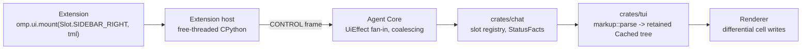
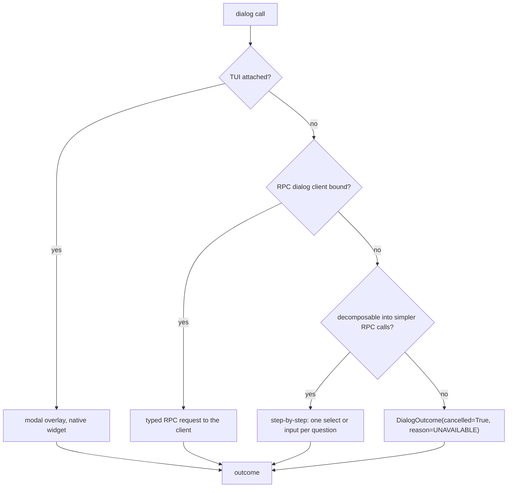

# `omp.ui` — UI as data

> **Design document, not a runtime API guarantee.** This corpus includes proposed
> interfaces and historical implementation observations. See
> [implementation status](implementation-status.md) for current owners and known gaps.

## 1. Purpose

`omp.ui` is the only way a Python extension changes what a user sees. It carries no
code into the renderer: an extension emits **TML markup and typed effects as data**
over the CONTROL socket, the Agent Core forwards them, and the retained DOM in
`crates/tui` renders them the same way it renders omp's own chrome. Extensions never
run on the render path, never receive a terminal handle, never learn the terminal
width in order to lay something out, and never emit a byte of ANSI. Glyphs come from
`crates/tui/icons.tsv` and follow the user's charset; colors are semantic theme tokens
resolved after the extension is out of the picture; layout is solved by the layout
engine that already solves it for everything else.

This deletes the failure the blogpost calls Lesson #3: *an ANSI-escaped array of
strings and `render()` does not make a rendering primitive*. In pi, an extension's
`Component.render(width): readonly string[]` ran **synchronously inside the repaint
loop** (`/work/pi/packages/tui/src/tui.ts:151-182`), so every widget author inherited
grapheme math, padding, truncation, ANSI decoding, theme threading, and sanitization —
and, being the last developer in the chain, did none of it. The measurable results were
a renderer that consumed 267 seconds of a single session's CPU, 20% of it inside one
`.includes` check for base64 image lines; a sidebar that redefined the terminal's
column count out from under the host; and catalog renderers that concatenated
unsanitized remote strings into the frame, which is an ANSI injection primitive with a
CVE lineage. None of that is reachable from `omp.ui`, because none of the hard parts
were ever handed down.

The rest of this document is the reference. Sibling namespaces own their own symbols:
device registration is `docs/py/01-devices.md`, the device update-fold renderer
(`@omp.renderer`, keyed by `(name, rev)`) is `docs/py/02-verdicts.md`, hooks and the
`omp.HookDecision` arms (`Allow`/`Deny`/`Modify`/`Defer`/`RequireApproval`) are
`docs/py/05-hooks.md`, the extension host's process model, `omp.Context`,
`omp.Duration`, and the `OperationSpec` metadata are `docs/py/00-overview.md`, and the
`(publisher_key, extension_id)` identity and provenance septet are
`docs/py/14-deploy.md`.

## 2. Concepts

### 2.1 Three shapes, and only three

Everything in this namespace is one of three shapes. Knowing which shape you are
holding tells you its channel, its latency class, and its failure mode without looking
anything up.

| Shape | Example | Direction | Reply | Failure |
| --- | --- | --- | --- | --- |
| **Effect** | `omp.ui.mount(...)`, `notify`, `set_title`, `set_ghost` | host → core, fire-and-forget | none | fail-open: dropped, journaled |
| **Request** | `await omp.ui.confirm(...)`, `await omp.ui.ask_user(...)` | host → core → user → host | awaited `DialogOutcome` | never raises; returns `cancelled=True` |
| **Fold** | `@omp.message_renderer`, `@omp.markdown_transformer`, `@omp.completion` | core → host, on demand | `Tml` / `str` / `Completion` | fail-open: default rendering or original markdown, empty list |

Effects are `async def` in name only — they return as soon as the frame is queued. A
turn is never blocked by a UI effect, and a UI effect never blocks a turn. Requests
are the only place `omp.ui` suspends, and they always terminate: a missing TUI is a
value, not an exception. Folds are called by the host when the renderer needs
something; they are deadline-bounded and pure.

One more thing is uniform across all three shapes: every symbol here carries generated
`OperationSpec(minimum_phase, durability, cost, authority)` metadata
(`docs/py/00-overview.md` owns the spec and the phase legality matrix), because a UI
push is an Effect like any other — §3 states which operations are legal before
`EFFECTS_AUTHORIZED` and which are not.

### 2.2 The pipeline



The extension's output stops being text at `markup::parse`
(`crates/tui/src/markup.rs:210`). From there it is a retained component tree measured
and painted by the same code path as omp's own transcript. There is no layer where an
extension's bytes reach the terminal directly, so there is no layer where an extension
can corrupt the screen.

### 2.3 TML is a document, not a frame

TML is `crates/tui`'s runtime markup dialect — the same language `Ui::from_markup`
accepts. It is a *document*: you describe structure and intent, the layout engine
resolves geometry. Concretely, this is what an extension does **not** do:

- Not measure text. `<text truncate>` clips at the cell the solver assigns.
- Not compute the terminal width. `<row>` distributes it; `grow`, `min`, `max`, and
  `w=40%` express what you meant.
- Not choose glyphs. `<ico:check/>` is a check mark in Unicode, a Nerd Font glyph on a
  patched font, and `[x]` on a VT100.
- Not choose colors. `fg=warn` is whatever the active theme says warn is, in dark and
  light, in truecolor and 256-color.
- Not sanitize. Text content is decomposed once at the boundary
  (`crates/tui/src/rich.rs:152`): SGR sequences become `Style` spans, and OSC, CSI
  cursor motion, and every other control sequence are **discarded**. A remote string
  containing `\x1b]0;pwned\x07\x1b[2A` renders as `pwned` at its own position, or as
  nothing, and cannot move the cursor.

The retained tree stores zero escape bytes. ANSI is re-emitted only by the frame
renderer, from `(Style, Range)` spans, at stdout materialization.

### 2.4 Degradation is the contract

TML degrades like HTML. This is not politeness, it is the versioning story: an
extension pinned against last month's omp must not blank the screen.

- **Unknown tag** → `CustomElement`, which retains and paints its children. `<panel
  title="Git">…</panel>` from an older extension shows its contents unframed rather
  than vanishing.
- **Unknown attribute** → retained as a custom property, ignored by built-ins.
- **Known attribute, bad value** → that one property is dropped with a `PropError`
  recorded; siblings are unaffected.
- **Malformed structure** (unclosed tag, data tag under the wrong parent) → the mount
  is refused with a `TmlError` carrying `message` and `at` (a byte offset), the
  previous content for that slot key stays on screen, and the failure is journaled.
  A broken emit never fails a document into a raw-text dump.

### 2.5 Slots

A slot is a named, placement-typed mount point. The extension owns a key; the layout
owns the geometry. Every placement, and where it lands:

```
┌───────────────────────────────────────────────────────────────────────────┐
│  native terminal scrollback (committed transcript — no slot may write it) │
├───────────────────────────────────────────────────────────────────────────┤
│  Slot.HEADER                    pinned band, full live-region width       │
├──────────┬──────────────────────────────────────────────┬─────────────────┤
│ SIDEBAR_ │  transcript / live region                    │ SIDEBAR_RIGHT   │
│ LEFT     │                                              │ (non-modal rail,│
│          │                                              │  full height)   │
├──────────┴──────────────────────────────────────────────┴─────────────────┤
│  Slot.ABOVE_EDITOR              inside the composer stack                 │
├───────────────────────────────────────────────────────────────────────────┤
│  STATUS_LEFT ──── composer status band ──────────────── STATUS_RIGHT      │
│  ┌─────────────────────────────────────────────────────────────────────┐  │
│  │ composer (editor + ghost text + completion popup)                   │  │
│  └─────────────────────────────────────────────────────────────────────┘  │
├───────────────────────────────────────────────────────────────────────────┤
│  Slot.BELOW_EDITOR                                                        │
├───────────────────────────────────────────────────────────────────────────┤
│  Slot.FOOTER                    pinned band, full live-region width       │
└───────────────────────────────────────────────────────────────────────────┘
```

Two invariants make sidebars safe, and they are the reason the pi sidebar hack is
unnecessary rather than merely forbidden:

1. **A rail reserves columns from the layout, it does not steal them.** The live region
   is laid out at `viewport.width - reserved`, where `reserved` is contributed by
   visible rails. `crates/chat/src/sidebar.rs:59` already exposes exactly this as
   `Sidebar::reserved(viewport) -> u16`.
2. **A rail never enters scrollback.** Rails are composited as non-modal viewport
   layers; a row leaving the viewport is repainted from the raw document before it
   commits to terminal history, so a rail's cells can never reach your scrollback.

### 2.6 Input never crosses the boundary

The CONTROL socket round-trips in tens of microseconds, which is fine per turn and per
call and catastrophic per keystroke. So keystrokes do not cross it. Ever. Three
declarative mechanisms replace the three things extensions used raw input for:

| Extension wants | Declares | TUI does locally | Host receives |
| --- | --- | --- | --- |
| A hotkey | `@omp.shortcut("ctrl+alt+h", action_id="toggle")` | matches the chord, consumes it | one `action_id` |
| Completions after a trigger | `@omp.completion(Trigger(prefix="@", debounce=omp.Duration("90ms")))` | matches prefix, debounces, caches, filters, ranks, renders the popup, applies the accepted insert | one query string, once per debounce window |
| Inline suggestion | `omp.ui.set_ghost(Ghost(text=...))` | renders dim, accepts on Tab/Right, dismisses on Esc, suppresses while typing | an optional `ghost_accepted` telemetry event, after the fact |

Nothing in that table has a latency budget the boundary can violate, because in every
row the boundary is crossed at most once per user *decision*, never per user *action*.

### 2.7 Renderers are folds, and the fold is the projection

Lesson #7: the string is not the truth. A call settles into one typed
`omp.CallOutcome`; every
rendering is a projection of it. The UI projection is a **fold**: a pure function from
`(accumulated state, RenderCtx) -> Tml`. The "during" render and the "after" render are
the same fold evaluated at different points in the update stream, which is why there is
no separate result callback and no chance of the two disagreeing.

`omp.ui` owns two things about folds: the `omp.ui.RenderCtx` they receive (§4.13) and
the `omp.ui.Tml` they return (§4.1). The device fold itself — `@omp.renderer`, its
`(name, rev)` keying, its purity requirement — is `docs/py/02-verdicts.md`. The
transcript-message fold, which has no call outcome behind it, is `@omp.message_renderer`
(§4.13).

### 2.8 What dies

Named cases, from the real catalog. Corpus: 194 extension-bearing packages;
`ui.notify` appears in 140 of them, `ui.custom` in 73, `ui.setStatus` in 71,
`ui.select` in 67, `ui.confirm` in 44, `ui.setWidget` in 41, and raw input
interception in 73.

**`@esso0428/pi-sidebar` v0.1.36 — redefining the terminal.** From
`extensions/sidebar/compositor.ts`, verbatim: `Object.defineProperty(terminal,
"columns", { get() { … return Math.max(1, raw - SIDEBAR_WIDTH - 1); } })` with
`SIDEBAR_WIDTH = 34`, then `tuiAny.doRender = () => { self.originalDoRender!();
self.paint(); }`, and `paint()` writing, per row, `\x1b[${row};${sepCol}H` plus
`\x1b[${row};${sidebarCol}H` plus content, the whole batch fenced in `\x1b[?2026h` …
`\x1b[?2026l` with `\x1b7`/`\x1b8` around it and autowrap disabled via `\x1b[?7l`.

That is careful work — synchronized output, cursor save/restore, autowrap
suppression, and a `MIN_TERMINAL_WIDTH = 120` cutoff. It is careful work that cannot
be correct, for reasons no amount of care inside the extension reaches:

- **The host's width is now a lie.** Every truncation, wrap, and column solve in the
  transcript is computed against a viewport that does not exist, and the host has no
  way to know it is being lied to. In pi, `columns` is a read-only getter
  (`/work/pi/packages/tui/src/terminal.ts:1770-1778`) — this is defeating an
  encapsulation boundary, not using an API.
- **Nothing repaints the rail out of scrollback.** The paint happens after the host's
  render; a row leaving the viewport commits to terminal history with the rail's cells
  still in it. Your scrollback is now 34 columns of stale git stats wide.
- **The threshold and the width are the extension author's constants**, not the user's
  preference and not the layout's decision. Two such extensions do not compose: both
  shrink `columns`, neither knows about the other, and the second one's rail lands on
  top of the first one's.

**Replacement:** `omp.ui.mount(Slot.SIDEBAR_RIGHT, tml)`. The layout reserves the
columns (`Sidebar::reserved`, `crates/chat/src/sidebar.rs:59`), the compositor owns
z-order and the pre-commit repaint, and `SlotOptions(width=…, min_width=…)` makes the
34-and-120 constants declared values the user can override instead of literals inside a
bundle. Worked port in §5.3.

**`pi-cc-extensions` v0.8.61 — writing mouse-tracking escapes.** It writes
`\x1b[?1000h` (VT200 click reporting) into `tui.terminal.write` to get clicks and hover
over its collapsed tool cards, and `\x1b[?1000l` to turn it back off — and the code
that turns it off is guarded by `if (tui && !isLazyProxyTui(tui))`, with a comment
explaining that in two of three render modes the extension does not own the reporting
state and therefore must not touch it. The extension knows it is racing the host for a
terminal mode and cannot win; it ships anyway, because there was no declarative way to
say "this card is clickable".

Two modes are now enabled that the host did not enable: the host's inline mouse policy
(deliberately leaving the mouse to the terminal so native selection and scrollback keep
working) is silently overridden, teardown may leave the terminal in a state the host's
restore path does not know about, and a second extension doing the same thing wins or
loses by load order.

**Replacement:** mouse is a *prop*, not a mode. `hover=accent` recolors chrome under
the pointer, `lift` elevates it, `focus` joins the focus ring, and an `id`-bearing
`<box focus>` emits activation on click or Enter. Whether pointer reporting is
negotiated at all stays the TUI's decision, and the same markup is correct either way —
which is precisely the guard `pi-cc-extensions` had to write by hand and could only
approximate.

**The catalog renderer in the blogpost — unsanitized external input.** It slices text
by codepoint rather than display width (so it overflows its line and smashes the rows
below once the terminal narrows past 40 columns), it has no width awareness (so it
ellipsizes content that would have fit), and it concatenates a fetched remote string
straight into a frame line. The third is the security bug: whatever it fetched can
send ANSI and repaint your UI, or worse.
**Replacement:** all three failure modes are structurally absent. `truncate` clips at
display width because the solver knows the width; `grow`/`min`/`max` mean content is
not ellipsized while space remains; and `decompose` strips control sequences at the
boundary before the text is ever a cell. There is no code path from extension bytes to
the terminal.

**`ctx.ui.onTerminalInput(handler)` — raw stdin (73 packages).** Dies with no
replacement of the same shape. §2.6 is the substitute.

**`ctx.ui.setEditorComponent(factory)` — replacing the composer.** Used by
`pi-powerline-footer` to swap in a bash-mode sub-editor and by
`@mrclrchtr/supi-prompt-suggestions` to subclass `CustomEditor` and intercept every
keystroke for ghost text. Dies: it ships an executable component into the render path,
which is the whole disease. The two legitimate uses split cleanly — a sub-editor
becomes a modal overlay or a built-in composer mode, and ghost text becomes push-only
state (§4.11).

**`ctx.ui.setFooter(factory)` / `setHeader(factory)` — component factories.** Die as
factories, survive as slots: `Slot.FOOTER` and `Slot.HEADER` take TML, so the same
powerline band renders without the extension knowing what a cell is (§5.1).

**`ctx.ui.custom(factory, {overlay: true})` — arbitrary focused component (73
packages).** Dies as a factory. The capability behind it — a data-driven modal that
collects structured input — becomes `omp.ui.overlay()` plus interactive TML, whose
submitted values come back as a JSON object from `Ui::values()` (§4.9, §5.2).

### 2.9 Attribution is chrome the extension cannot draw

A workspace extension is allowed to push UI, and the review's conclusion stands: that
is prompt-injection-grade influence, so provenance must be unspoofable. Every
extension-originated dialog, overlay, notification, rail, and approval-adjacent
component is composited under an **attribution band** the renderer paints itself,
outside the mount's TML tree. The band renders the provenance septet — `publisher,
extension id, version, artifact digest, layer, trust tier, generation` — whose identity
model `docs/py/14-deploy.md` owns; the compositor takes the values from the
authenticated CONTROL connection of the emitting host, never from the markup.

Three properties make it unforgeable:

1. **Out-of-tree.** The band is not a node in the extension's document. No TML the
   extension emits can add, move, restyle, or remove it, and `z` cannot place a layer
   above it — attribution occupies a reserved z-band above every extension layer.
2. **Origin-tagged parsing.** Every parse is tagged with the origin of its source.
   Reserved chrome tags (§4.2) degrade to `CustomElement` for extension-origin sources,
   so internal components cannot be instantiated from a mount.
3. **Reserved presentation for Core approvals.** The policy-approval dialog
   (`docs/py/06-policy.md` owns the durable approval ticket) renders in a presentation
   TML cannot reproduce — §4.2 specifies the mechanism. An extension can imitate the
   layout, but the imitation renders under its own attribution band naming its
   publisher, which is exactly what a fake approval prompt cannot afford.

Users own the final statusline and rail layout. An extension's `order` is a suggestion
that seeds the default; a user-level layout preference keyed by `(extension, key)`
overrides it (§4.6, §4.7). Rev 1 left statusline ordering and multi-rail arbitration
open; this ruling closes both.

## 3. Failure and latency, in one table

Every symbol in §4 appears here. `fail-open` means the effect is dropped and the
session continues; `fail-closed` never applies in this namespace, because no UI outcome
is allowed to gate a turn — `docs/py/05-hooks.md` owns what a *hook* does with a
dialog's outcome.

| Symbol | Channel | Latency class | Failure |
| --- | --- | --- | --- |
| `mount`, `unmount`, `unmount_all`, `SlotHandle.set`, `SlotHandle.patch` | CONTROL, one-way | per-turn or per-event | fail-open, coalesced by `(extension, key)` |
| `handle` | none — host-local registry mirror | immediate | raises `KeyError` for an unknown key |
| `focus_slot`, `blur_slot` | CONTROL, one-way | per-event | fail-open |
| `set_status`, `clear_status` | CONTROL, one-way | per-event | fail-open, coalesced by `(extension, key)` |
| `set_working_message`, `set_working_indicator` | CONTROL, one-way | per-turn | fail-open; built-in message and spinner restored |
| `notify` | CONTROL, one-way | per-event, rate-limited | fail-open |
| `set_title`, `set_progress`, `bell`, `open_url` | CONTROL, one-way | per-turn | fail-open |
| `image` | CONTROL, round trip for the transfer | per-render | returns markup with a cell fallback; a failed transfer yields empty `Tml` |
| `set_ghost`, `clear_ghost` | CONTROL, one-way | per-turn | fail-open |
| `set_editor_text`, `paste_to_editor`, `submit` | CONTROL, one-way | per-invocation | fail-open |
| `editor_text` | CONTROL, round trip | per-invocation | returns `""` when no composer |
| `presentation`, `icons` | CONTROL, round trip | per-invocation, cold | returns defaults (`Charset.UNICODE`, `has_ui=False`) / empty tuple |
| `overlay`, `OverlayHandle.*` | CONTROL, round trip | per-invocation | `overlay` raises `DialogUnavailable`; handle methods after close are no-ops |
| `confirm`, `select`, `multi_select`, `input`, `editor`, `form`, `ask_user` | CONTROL, round trip | per-invocation, human-bounded | `DialogOutcome(cancelled=True)`, never raises |
| `@omp.completion` fold | core → host | debounced, default 90 ms | fail-open: empty list; cancelled on next keystroke |
| `@omp.shortcut` dispatch | core → host | per-press | fail-open: chord consumed, action dropped |
| `@omp.command` dispatch | core → host | per-invocation | exception journaled, `<callout fg=err>` in transcript |
| `@omp.message_renderer` fold | core → host | per-render, deadline 50 ms | fail-open: built-in rendering |

Per-keystroke work is prohibited: there is no symbol in this namespace that the TUI
invokes on a key press other than the chord matcher, which is Rust.

### 3.1 Phase legality

UI pushes are Effects, and every effect and request here carries generated
`OperationSpec(minimum_phase, durability, cost, authority)` metadata
(`docs/py/00-overview.md`); `docs/py/03-params.md` owns the `omp.InvocationPhase`
machine those minimums refer to. The default in this namespace is permissive because
its default shape is harmless: a viewport-scoped, non-durable effect (`mount`, `patch`,
`set_status`, `set_working_message`, `set_ghost`, `set_title`, `set_progress`, `bell`,
`focus_slot`) has `minimum_phase = OPEN` — legal from a hook running during ADMISSION,
before the call is admitted, because it changes nothing durable and touches no machine
beyond the attached client's live screen. The exceptions are the operations that escape
the viewport:

| Symbol | Why it is gated | Minimum phase inside an invocation |
| --- | --- | --- |
| `notify` | Appends a durable transcript notice; `desktop=True` escapes the terminal | `EFFECTS_AUTHORIZED` |
| `open_url` | Acts on the user's machine | `EFFECTS_AUTHORIZED` |
| `submit` | Starts a turn | `EFFECTS_AUTHORIZED` |
| `image` | Materializes bytes as a durable, addressable artifact | `EFFECTS_AUTHORIZED` |
| dialog helpers, `overlay` | Interrupt the user; during ADMISSION that is the APPROVAL hook phase's job (`RequireApproval`, `docs/py/05-hooks.md`), never a side channel | `EFFECTS_AUTHORIZED` |

In v1 the distinction is mostly invisible from a device body, which only starts at
`EFFECTS_AUTHORIZED` (`docs/py/01-devices.md`); it binds hooks, which do run earlier.
Outside any invocation — a `turn_end` hook painting a statusline — no invocation phase
applies and only the §4.17 capability keys gate the effect.

## 4. Reference

```python
import omp
from omp import ui
```

Every symbol below is reached as `omp.ui.<name>`, except the five decorators
(`@omp.command`, `@omp.shortcut`, `@omp.completion`, `@omp.message_renderer`,
`@omp.markdown_transformer`), which are
module-level on `omp` because they are Declare verbs.

### 4.1 `Tml` — validated markup nodes

#### `class Tml`

An **opaque node type**: an immutable handle to a parsed, validated markup tree. It is
not a `str`, not a `str` subclass, and has no string operations; composition happens in
the constructors (`ui.tml` fields, `ui.join`), never by concatenation. Nothing in
`omp.ui` accepts a bare `str` where markup is expected, and the guarantee is enforced
twice: statically — every markup-bearing parameter is typed `Tml`, so a checker rejects
a plain string, including any f-string — and at runtime, at ingestion: every value is
parsed and validated when it is constructed, and the CONTROL encoder refuses anything
that is not a `Tml` node. Raw markup text still exists, but as the **wire format** —
what a `Tml` serializes to at the encoder — not as the authoring API.

**Reversal.** Rev 1 specified `class Tml(str)` and claimed the subclass made an
accidental `f"<text>{user_input}</text>"` "a type error at the call site". The review
is right that this claim is false, and it was false in the load-bearing direction: an
f-string produces an ordinary `str` no matter what is interpolated into it, and because
a `str` subclass IS-A `str`, the `Tml(str)` design let markup-typed values flow
anywhere strings do — the exact laundering the type existed to prevent. The subclass
bought nothing; the safety was always going to come from static typing plus runtime
validation at ingestion, so the type is now shaped to deliver exactly those two and
nothing else.

#### `ui.tml(template: str, /, **fields: object) -> Tml`

Builds a `Tml` node from a template, parsing and validating it immediately — the value
that exists after this call is already a tree, not text. `{name}` placeholders are
substituted according to the field's type; literal braces are `{{` and `}}`.

| Field value | Substitution |
| --- | --- |
| `Tml` | Inserted verbatim, so composition nests without double-escaping |
| `Sequence[Tml]` | Each element verbatim, in order, with no separator |
| `str` | `ui.text(...)`-escaped |
| `Sequence[str]` | Escaped element-wise, joined with a single space |
| anything else | `str(value)`, then escaped |

The `Sequence[Tml]` row is the N-rows case, and it is the reason a table or a roster
needs no loop construct in the markup language: build the rows in Python, pass the list.

**Raises** `TmlError` when the assembled source does not parse, `KeyError` for a
placeholder with no field, and `TypeError` for a positional argument — the template is
positional-only and everything else is keyword, so a stray second string cannot be
mistaken for content.

```python
row = ui.tml(
    "<row gap=1><ico:git/><text bold>{branch}</text><text fg=warn>{dirty}</text></row>",
    branch=branch,          # "feature/<script>" renders as literal text
    dirty=f"*{count}" if count else "",
)

rail = ui.tml(
    "<box title='agents' border=round>{rows}</box>",
    rows=[ui.tml("<row gap=1>{icon}<text>{name}</text></row>",
                 icon=ui.icon(ref.status.value), name=ref.name)
          for ref in roster],
)
```

#### `ui.text(value: object) -> Tml`

Escapes `str(value)` into a single verbatim text leaf. Backslash-escapes `<` and `\`,
never emits a bare `</`, and strips C0 control characters other than tab. The result is
`<text>`-wrapped, so it carries no Markdown interpretation: a value containing `# `,
`*`, or a table pipe shows those characters instead of becoming a heading, emphasis, or
a table.

#### `omp.ui.md(source: object) -> Tml`

Wraps `str(source)` as a `<md>` leaf **without** escaping Markdown syntax, because
Markdown is the point. Still strips control characters. Use this for text you authored;
use `ui.text` for text that came from somewhere else.

#### `omp.ui.join(parts: Iterable[Tml], sep: Tml | str = "") -> Tml`

Composes already-validated nodes into one node. A plain-`str` `sep` is escaped exactly
like `ui.text` — it is content, never markup — so there is no character-class caveat to
remember; pass `Tml` when the separator should carry markup.

#### `ui.icon(name: str, *, fg: str | None = None) -> Tml`

Emits `<ico:name/>`, or `<icon icon=… fg=…/>` when `fg` is given. Prefer this over
writing the markup by hand when the name is a variable: `<ico:{status}/>` cannot work,
because the name is part of the tag and templates substitute values, not tags. See §4.5.

#### `Tml.raw(source: str) -> Tml`

Ingests wire-format markup an extension generated itself, parsing and validating it at
the call — the explicit opt-out from the escaping constructors, and the only place the
wire format appears in the authoring API. The argument is a string of markup, but the
result is the same opaque node every other constructor returns; nothing downstream of
ingestion handles text. Passing untrusted bytes through `Tml.raw` is the one way back
to pi's failure mode, which is why it is a classmethod with an ugly name and not the
default constructor.

**Raises** `TmlError` if `source` does not parse.

#### `class TmlError(ValueError)`

| Field | Type | Meaning |
| --- | --- | --- |
| `message` | `str` | Parser diagnostic, e.g. `<option> is not allowed directly inside <col>` |
| `at` | `int` | Byte offset into the source |
| `source` | `str` | The rejected markup, for the journal entry |

Mirrors `omp_tui::markup::ParseError` (`crates/tui/src/markup.rs:194-199`) one-for-one.

### 4.2 Element vocabulary

These are the tags an extension may emit. They are exactly the runtime-markup catalog
of `crates/tui` (`markup::is_catalog_tag`, `crates/tui/src/markup.rs:1001-1038`); the
`dom!`-only spellings and the Rust-only components are listed after the table so their
absence is documented rather than surprising.

**Availability** column: `any` = every surface; `interactive` = overlays and dialogs
only, because a slot and a transcript fold have no keyboard focus of their own and a
focusable widget there would be unreachable. Emitting an interactive tag into a slot
degrades it to its non-interactive label and records a warning; it is not an error.

#### Layout

| Tag | Children | Behavior props | Availability |
| --- | --- | --- | --- |
| `<col>` | any | `gap`, `align`, `valign` | any |
| `<row>` | any | `gap`, `align`, `valign`, `justify`, `wrap` | any |
| `<box>` | any | `gap`, `align`, `valign`, `title`, `footer`, `title-align`, `footer-align`, `border`, `bc`/`edge`, `bleed` | any |
| `<scroll>` | any | `h` fixes the viewport; defaults to 8 rows | interactive |
| `<hr/>` | none | `border`, `title`, `fg`, `bc`/`edge`, `vertical` | any |
| `<spacer/>` | none | sizing only; runtime markup defaults `grow=1` | any |
| `<table>` | `<tr>` only | `gap` (column spacing, default 2) | any |
| `<tr>` | `<td>` only | `bg` paints a full-width row band | any |
| `<td>` | any | `align`, `w`, `min`, `max`, `grow`, `truncate` | any |

`<row>` sets `vertical` on an `<hr/>` child automatically. `<table>` solves every column
once across all rows, so a status table stays aligned as the terminal narrows — which is
the fix for the "slices by codepoint and smashes the rows below" failure, applied by
construction.

#### Text and media

| Tag | Content | Behavior props | Availability |
| --- | --- | --- | --- |
| `<text>` | verbatim body | `fg`, `bold`, `dim`, `italic`, `underline`, `reverse`, `strike`, `align`, `truncate`, `wrap`, `shimmer`, `reveal`, `partial` | any |
| `<md>` | Markdown body | text styles, `align`, `truncate` | any |
| `<latex>` | math body | text styles, `align`, `truncate` | any |
| `<pre>` | verbatim art | text styles, `align` | any |
| `<callout>` | Markdown body | `title`, `icon`, `badge`, `truncate`, text styles | any |
| `<icon>` | icon name as body, or `icon=` | `fg`, text styles | any |
| `<spinner>` | label body | `fg`, text styles | any |
| `` | none | `src`, `w`, `h`, `trim` | any |
| `<progress/>` | none | `value`, `max`, `label` | any |

`<md>` renders tables, links, code highlighting, math, and `mermaid` / `dot` /
`graphviz` / `gv` fences — Graphviz is pure Rust and never shells out. Interactive tags
are rejected inside `<md>`, and only line-start block markup is recognized there.

`` names a PNG or binary P6 PPM resource the *renderer's* process can read.
The attribute is wire format, not an authoring surface: extension code never writes a
raw path string into `src`. `ui.image(...)` (§4.8) takes a typed location —
`omp.BlobRef`, `omp.EnvPath`, `omp.ArtifactUrl` — materializes the bytes client-side,
and returns the `` markup with `src` already filled with the client-local
reference it minted.

`<text partial>` marks content as an unfinished stream so final-only repairs stay
disabled — set it while folding an in-flight device update, clear it on the terminal
`Done`.

#### Status band

| Tag | Children | Behavior props |
| --- | --- | --- |
| `<status>` | `<segment>` only | `fg`, `bg`/`on`, text styles, `align=end` mirrors the powerline caps for a right-docked band |
| `<segment>` | label body | `label`, `fg`, `bg`/`on`, text styles |

Segment style inherits the band's and may override it. A `Slot.STATUS_LEFT` /
`Slot.STATUS_RIGHT` mount accepts `<segment>` fragments directly and supplies the
enclosing `<status>` itself, so extension segments compose with omp's own instead of
replacing the band.

#### Structured display

| Tag | Children | Behavior props | Availability |
| --- | --- | --- | --- |
| `<todo>` | `<task>` only | `guides` | any |
| `<task>` | nested `<task>` | `label`, `status`, `desc` | any |
| `<tree>` | `<node>` only | `id`, `guides` | interactive |
| `<node>` | nested `<node>` | `label`, `open` | interactive |
| `<tabs>` | `<tab>` only | `id` | interactive |
| `<tab>` | any | `title` | interactive |

`<task status=…>` accepts `pending`, `active`, `done`, `dropped`, `blocked`, plus the
agent aliases `in_progress`, `completed`, `abandoned`. A `<task>` with children becomes
a bold group header carrying an automatic `done/total` over its descendant leaves.
`<todo>` is display-only in every surface: no focus, no keys, no collapse state, so it
is safe in a slot.

#### Interactive

| Tag | Children | Behavior props | Value in `values()` |
| --- | --- | --- | --- |
| `<input/>` | none | `id`, `value`, `placeholder`, `mask`, `required`, `match` | JSON string |
| `<editor>` | ≤1 input child, ≤1 `<status>` | `id`, `value`, border/sizing | expanded editor text |
| `<button>` | text | `id`, `label`, `submit`, `cancel`, `confirm`, `accent` | — (emits an event) |
| `<radio/>` | none | `id`, `options`, `value` | JSON string |
| `<select>` | `<option>` only | `id`, `label`, `multi`, `filter`, `custom`, `h`, `gap` | string / `null`, or array with `multi` |
| `<option>` | label, preview children, `<td>` cells | `value`, `label`, `desc`, `recommended` | — |
| `<form>` | `<field>` only | `id` | one JSON object keyed by field id |
| `<field>` | none | `id`, `kind`, `label`, `desc`, `value`, `options`, `min`, `max`, `step`, `required`, `match` | typed per `kind` |
| `<wizard>` | `<step>` only | `submit` | — |
| `<step>` | any | `title` | — |

`<field kind=…>` is one of `text` (default), `bool`, `enum`, `select`, `multi`,
`number`; `bool` and `number` export JSON booleans and numbers, `multi` exports an
array. A filterable single `<select>` types-to-filter directly with fuzzy ranking; a
`multi` select keeps the `/`-armed query so `Space` still toggles. `required` and
`match` are enforced inside an active `<wizard>` step; `match` is anchored at both ends
and supports literals, `.`, classes, escapes, and postfix `*`, `+`, `?` — it is
deliberately smaller than a regular expression.

#### Unknown tags

Any other tag becomes a `CustomElement` that retains and paints its children. This is
the forward-compatibility hinge described in §2.4. An extension **may** rely on it:
wrapping content in `<my-panel>` is a stable no-op today and a hook for a future
registered element.

#### Availability notes

| Spelling | Status |
| --- | --- |
| `<i:name/>` | `dom!` macro shorthand, compile-time only. Extensions use `<ico:name/>` or `<icon/>`. |
| `<diff>` | **Available.** The TUI catalog parses the unified-diff body into `DiffView`; `context=N` limits unchanged lines around each change; `path=` names the source file so context rows syntax-highlight. |
| `<scene>`, `<shader>` | The shader *is* code. Rust-only by definition. |
| `<tool-card>`, `<transcript>`, `<logo>` | Internal chrome components, deliberately not addressable by extensions. |
| `<approval>`, `<attribution>` | **Reserved.** The Core policy-approval dialog and the provenance band (§2.9). Never instantiable from extension-origin markup. |
| bare Markdown between tags | **Available**, and is the runtime-markup default: text between tags is an implicit Markdown leaf. `<text>` is the verbatim escape hatch. |

#### How the reservation works

Every parse carries the origin of its source: core chrome, or an extension mount
identified by its authenticated CONTROL connection. For extension-origin sources the
reserved names (`approval`, `attribution`, `tool-card`, `transcript`, `logo`) are not
in the catalog: they take the §2.4 unknown-tag path and degrade to a `CustomElement`
that paints only its children, so the tags cannot summon the components. The reserved
presentation is unreachable one level deeper as well: the approval dialog's frame style
and background fill come from renderer-internal theme slots that are not members of
`ui.Token` and are rejected as color values in extension markup, and the attribution
band occupies a reserved z-band above `OverlayOptions.z`. The result is that extension
markup can approximate an approval dialog's text but cannot produce its chrome — and
whatever it draws renders under an attribution band naming the extension's own
publisher, digest, layer, and trust tier (`docs/py/14-deploy.md`).

### 4.3 Property reference

Every property the parser type-checks. A property a given element does not consume is
stored and ignored, so setting `gap` on a `<text>` is legal and inert. Sourced from
`crates/tui/src/props.rs:300-452`.

#### Identity, sizing, chrome

| Prop | Values | Effect |
| --- | --- | --- |
| `id` | string | Stable key for `patch`, `values()`, `when=`, and events |
| `when` | `"src=val"` / `"src!=val"` | Removes the component from layout, paint, focus, and values while false |
| `w` | cells or `40%` | Preferred width |
| `min` | integer | Minimum row-child width; lower bound of a number field |
| `max` | integer | Maximum row-child width; number-field upper bound; `<progress>` maximum |
| `h` | rows | Fixed outer height |
| `grow` | flag or weight | Claims remaining width in a row, remaining height in a fixed-height column |
| `pad` | `N` or `"Y X"` | Inner padding on both axes |
| `pad-x`, `pad-y` | integer | Per-axis inner padding |
| `border` | `square`, `round`, `heavy`, `double`, `dash` | Frame chrome; on `<hr>`, the stroke family |
| `bc`, `edge` | color or `a..b` | Border color aliases |
| `bleed` | flag | Extends a background behind border cells |
| `noselect` | flag | Excludes the subtree's text from host-driven selection and copy |
| `title` | string | Border title, callout heading, tab/step title |
| `footer` | string | Label woven into the bottom border line |
| `title-align`, `footer-align` | `start`/`left`, `center`/`middle`, `end`/`right` | Placement along the frame line |

`noselect` is the right prop for a sidebar rail: the user dragging a selection across
the transcript should not pick up your git stats.

#### Layout and text flow

| Prop | Values | Effect |
| --- | --- | --- |
| `gap` | integer | Spacing between children of `<col>`, `<row>`, `<box>` |
| `align` | `start`/`left`, `center`/`middle`, `end`/`right` | Horizontal text placement, stack main-axis placement |
| `valign` | `start`/`top`, `center`/`middle`, `end`/`bottom`, `stretch`/`fill` | Cross-axis placement |
| `justify` | `start`, `center`, `end`, `between` | Distribution of leftover row width |
| `wrap` | flag, or `char` on text | Flag: a row may stack when it cannot fit. `char`: terminal-exact grapheme flow whose width breaks re-join in native copy |
| `truncate` | flag, `start`, `end` | One-line clip with an ellipsis; `start` keeps the tail |
| `vertical` | flag | Forces vertical rendering; set automatically on `<hr>` inside `<row>` |
| `guides` | flag or `square`/`round`/`heavy`/`double`/`dash` | `<tree>` and `<todo>` connector gutters |

#### Color and style

| Prop | Values | Effect |
| --- | --- | --- |
| `fg` | theme token, CSS color, or `a..b` gradient | Foreground |
| `bg`, `on` | same | Background; `bg` wins when both appear |
| `angle` | degrees, optional `deg` | Gradient direction, normalized to `0..359`; 0 is left-to-right, 90 top-to-bottom |
| `bold`, `dim`, `italic`, `underline`, `reverse`, `strike` | flag | Text style |
| `anim` | flag (200 ms), ms, `250ms`, `0.4s` | Tweens `fg`/`bg`/`on`/`bc`, gradient endpoints, `w`, `h` from the on-screen value when the target changes |
| `ease` | `linear`, `in`, `out`, `in-out` | Easing for `anim`; defaults to `out` |
| `spin` | flag (3 s), ms, s | Rotates a gradient one revolution per period, on top of `angle` |
| `shimmer` | flag (2 s), ms, s | Sweeps a brightness crest across `<text>` once per period |
| `reveal` | flag (250 ms), ms, s; `0` disables | Types streamed `<text>` out by grapheme cluster, draining its backlog exponentially, never below 90 clusters/s |
| `hover` | color or gradient | Border chrome while the pointer or focus rests on the component or a descendant |
| `lift` | flag (1 row) or rows | Reserves headroom and raises chrome into it while hovered, leaving a `shadow`-token drop shadow |
| `focus` | flag | Joins the keyboard focus ring; an `id`-bearing focusable `<box>` emits activation on Enter or click |

CSS color forms accepted: HTML names, `#rgb`, `#rrggbb`, `rgb()`, `rgba()`, `hsl()`,
`hsla()`, `hwb()`, `hsv()`, `lab()`, `lch()`, `oklab()`, `oklch()`, and `color()`. Use a
theme token unless the color *is* the content (a language badge, a syntax sample); a
hardcoded color is the one thing in this namespace that will look wrong under a theme
the author never tried.

`hover` and `lift` are the replacement for `pi-cc-extensions`' raw mouse-tracking
escapes. The extension states the intent; whether pointer reporting is negotiated at all
is the TUI's decision, and the same markup is correct either way.

#### Data and action

| Prop | Values | Consumers |
| --- | --- | --- |
| `value` | string, number, bool | Input/editor text, radio selection, option value, field value, `<progress>` amount |
| `options` | whitespace-delimited string | `<radio>` choices, enum/select/multi fields |
| `label` | string | Buttons, selects, options, fields, nodes, tasks, progress |
| `desc` | string | Supporting text on `<option>`, `<field>`, `<task>` |
| `kind` | `text`, `bool`, `enum`, `select`, `multi`, `number` | `<field>` control type |
| `step` | integer | Number-field increment |
| `multi` | flag | `<select>` exports an array |
| `filter` | flag or seed string | Interactive filtering on `<select>` |
| `custom` | flag | `<select>` accepts a free-form value |
| `mask` | flag | Obscures displayed input text without changing its exported value |
| `recommended` | flag | Initial preferred `<option>` in a single select |
| `open` | flag | Expands a `<node>` initially |
| `status` | `pending`, `active`, `done`, `dropped`, `blocked` | `<task>` lifecycle |
| `required` | flag | Wizard validation |
| `match` | anchored simple pattern | Wizard validation after trimming nonempty text |
| `src` | client-local resource reference | `` source; wire format minted by `ui.image` (§4.8), never authored as a raw path |
| `icon` | icon name | `<callout>` leading icon, `<icon>` name |
| `badge` | string | Compact `<callout>` header badge |
| `submit`, `cancel` | flag | `<button>` emits submit / cancel |
| `confirm` | flag | `<button>` requires a second activation |
| `placeholder` | string | Empty unfocused `<input>` hint |
| `accent` | flag | Accent-filled button treatment |
| `trim` | flag | Crops transparent `` margins before cell sampling |
| `partial` | flag | Content is still streaming; final-only repairs stay off |

#### `@omp.ui.on_activate(prefix: str)`

Registers a handler for a focusable, id-bearing transcript element. The decorated
callable receives `(activation: omp.ui.Activation, ctx)`; exact ids and descendants
separated by `.` match, and the closest registered prefix wins.

`omp.ui.Activation` is the frozen payload with `element_id: str` and
`source: omp.ui.ActivationSource`. The source enum has `KEY = "key"` for Enter and
`MOUSE = "mouse"` for a click.

### 4.4 Theme, charset, appearance

#### `class ui.Token(StrEnum)`

The semantic palette. Members mirror `omp_tui::Theme`
(`crates/tui/src/context.rs`), one field to one member, so a token added to the theme
becomes available without a protocol change.

| Member | Value | Meaning |
| --- | --- | --- |
| `Token.FG` | `"fg"` | Default foreground |
| `Token.ACCENT` | `"accent"` | Primary interactive accent: focus, active controls, links |
| `Token.INFO` | `"info"` | Informational values |
| `Token.OK` | `"ok"` | Success, enabled |
| `Token.WARN` | `"warn"` | Caution, modified |
| `Token.ERR` | `"err"` | Errors, destructive |
| `Token.MUTED` | `"muted"` | De-emphasized chrome and hints |
| `Token.BORDER` | `"border"` | Container borders and rules |
| `Token.SURFACE` | `"surface"` | Neutral chip or button fill |
| `Token.HOVER` | `"hover"` | Hover row tint |
| `Token.SELECTION` | `"selection"` | Text-selection background tint |
| `Token.SHADOW` | `"shadow"` | Drop shadow under lifted surfaces |
| `Token.PANEL` | `"panel"` | Elevated panel fill: composer, overlay cards |
| `Token.SECONDARY` | `"secondary"` | Secondary accent, e.g. cost figures, carrying no ok/warn/err semantics |
| `Token.CONTRAST` | `"contrast"` | Text painted on top of accent or warn fills |

An unstyled `<box>` frame or `<hr>` uses `border`; `bc=`, `edge=`, and `fg=` override it.
`Token` is a `StrEnum`, so `fg={Token.WARN}` and `fg=warn` are the same markup.

#### `class ui.Charset(StrEnum)`

| Member | Value | Glyph tier |
| --- | --- | --- |
| `Charset.UNICODE` | `"unicode"` | Full box drawing, geometric shapes, half blocks (default) |
| `Charset.NERD_FONT` | `"nerd"` | Unicode plus Nerd Font private-use glyphs where they read better |
| `Charset.ASCII` | `"ascii"` | Pure 7-bit ASCII |

#### `class ui.Appearance(StrEnum)`

`Appearance.DARK` (`"dark"`) and `Appearance.LIGHT` (`"light"`), classified from the
terminal background's BT.601 luminance. An extension reads it from `RenderCtx` to pick
*content*, never to pick a color — the theme already flipped.

#### `await ui.presentation() -> Presentation`

Reads the active presentation context. **Request**; one CONTROL round trip. Frozen
dataclass:

| Field | Type | Meaning |
| --- | --- | --- |
| `charset` | `Charset` | Active glyph tier |
| `appearance` | `Appearance` | Dark or light |
| `width` | `int` | Live-region width in cells, rails already deducted |
| `height` | `int` | Live-region height in rows |
| `graphics` | `Graphics` | `CELLS`, `SIXEL`, `KITTY_PLACEHOLDERS`, `KITTY_DIRECT`, `ITERM2` |
| `hyperlinks` | `bool` | Whether OSC 8 materializes |
| `has_ui` | `bool` | A TUI is attached |

This exists for *content* decisions — how many rows of history to include, whether to
emit an `` at all. It is not for layout. An extension that computes a column count
from `width` has reintroduced the bug this namespace deletes; `grow` and `w=40%` are the
supported spellings, and they keep working across a resize the extension never hears
about.
Theme mutation is deliberately narrow. `await ui.themes()` lists installed theme names,
and `await ui.set_appearance(name, persist=False)` switches the live session theme only
when called by the handler of a user-invoked interactive `@omp.command`. Other invocation
origins receive `UiMutationDenied`. `persist=True` has the same origin gate and writes
through the ordinary settings authority; there is no raw palette inspection. Extensions
still style with semantic `ui.Token` values and use `Appearance` only when content differs.

### 4.5 Icons

`crates/tui/icons.tsv` is the catalog: 1065 rows of `name`, optional qualified `alias`,
and one glyph per tier (`ascii`, `unicode`, `nerd_font`). `build.rs` validates it and
generates the lookup table, so a name either resolves at every tier or the build fails.

Emit an icon three ways:

| Form | Where it works |
| --- | --- |
| `<ico:name/>` | Anywhere text appears, and inside a `title=` attribute value |
| `<icon>name</icon>` | As a standalone element |
| `<icon icon=name fg=warn/>` | When the name is dynamic or needs a color |

`ui.icon("git")` produces the first form. Dashed names such as `<ico:log-in/>` are
accepted.

**Unknown names degrade to the bare name**, not to nothing and not to a replacement
glyph. `<ico:kubernetes/>` renders as `kubernetes` — legible, obviously wrong, and
trivially greppable, which is the correct behavior for a typo in a slot that repaints
every turn.

An extension never picks a codepoint. That is the whole point: the same `<ico:check/>`
is `✔`, a Nerd Font check, or `[x]`, chosen by the user's `OMP_TUI_CHARSET` or the
detected emulator, not by whichever glyph the extension author's font happened to have.

#### `await ui.icons(prefix: str = "") -> tuple[str, ...]`

Lists catalog names, optionally filtered by prefix. **Request.** For extensions that
let the *user* choose an icon in settings; not for hot paths.

### 4.6 Slots

#### `class ui.Slot(StrEnum)`

| Member | Value | Placement | Accepts |
| --- | --- | --- | --- |
| `Slot.STATUS_LEFT` | `"status_left"` | Left group of the composer status band | `<segment>` fragments |
| `Slot.STATUS_RIGHT` | `"status_right"` | Right group of the composer status band, powerline caps mirrored | `<segment>` fragments |
| `Slot.HEADER` | `"header"` | Pinned band at the top of the live region, below scrollback | any non-interactive tree |
| `Slot.FOOTER` | `"footer"` | Pinned band below the composer | any non-interactive tree |
| `Slot.ABOVE_EDITOR` | `"above_editor"` | Inside the composer stack, above the input | any non-interactive tree |
| `Slot.BELOW_EDITOR` | `"below_editor"` | Inside the composer stack, below the input | any non-interactive tree |
| `Slot.SIDEBAR_LEFT` | `"sidebar_left"` | Full-height non-modal rail, left | any non-interactive tree; focusable on request |
| `Slot.SIDEBAR_RIGHT` | `"sidebar_right"` | Full-height non-modal rail, right | same |

There is no slot for the transcript. Transcript content comes from folds (§4.13) or from
`ui.notify`; a slot that could write committed history would break byte-stable replay.
There is no slot for the working message or the terminal title either — those are
single-valued session state with their own setters (§4.8).

#### `@dataclass(frozen=True) class ui.SlotOptions`

| Field | Type | Default | Meaning |
| --- | --- | --- | --- |
| `order` | `int` | `100` | Suggestion only: seeds the default sort among mounts in the same placement (lower is closer to the edge omp's own chrome occupies; ties break by extension id). A user-level layout preference keyed by `(extension, key)` overrides it outright (§2.9). |
| `width` | `int \| None` | `None` | Rail width in cells, including its vertical rule. Ignored outside `SIDEBAR_*`. Defaults to 30, matching `crates/chat/src/sidebar.rs:16`. |
| `min_width` | `int` | `0` | Hide the mount when the live region is narrower. Rails default to 96. |
| `min_height` | `int` | `0` | Hide the mount when the viewport is shorter. Rails default to 20. |
| `max_height` | `int \| None` | `None` | Cap on rows for band placements; content beyond scrolls internally. |
| `visible_in` | `frozenset[Phase]` | all phases | Restrict to agent phases; e.g. `{Phase.WORKING}` for a progress band. |
| `focusable` | `bool` | `False` | Rails only: the rail may take keyboard focus on click or `focus_slot()`. |
| `collapse` | `Collapse` | `Collapse.HIDE` | What happens when the mount does not fit. |
| `title` | `str \| None` | `None` | Convenience: wraps the content in a titled `<box border=round>`. |

`min_width` and `min_height` are the documented, enforced form of the responsiveness
that `@esso0428/pi-sidebar` did not have. The defaults are omp's own rail thresholds, so
an extension that sets nothing behaves like the built-in.

**Multiple rails on one side** were an open question in Rev 1 — additive reservation
squeezes the transcript, and letting `order` pick one felt arbitrary. The attribution
ruling (§2.9) settles who decides: the user owns rail layout. The user's layout
preference names which rails show, on which side, in what order; `order` only seeds
the default for rails the preference does not name. Absent any preference, a placement
admits visible rails in ascending `order` until the reservation would push the live
region below its own minimum, and every rail it could not admit is listed in
`/extensions` with its provenance — hidden is a visible state, not a silent one.

#### `class ui.Collapse(StrEnum)`

| Member | Behavior when space is short |
| --- | --- |
| `Collapse.HIDE` | Remove the mount entirely (default) |
| `Collapse.TRUNCATE` | Keep the mount, clip content to the available rows or cells |
| `Collapse.SHRINK` | Rails only: reduce toward `width // 2` before hiding |

#### `class ui.Phase(StrEnum)`

`Phase.IDLE`, `Phase.WORKING`, `Phase.WAITING` (a dialog or approval is blocking),
`Phase.ERROR`. Mirrors the agent's published *presentation* phase;
`docs/py/00-overview.md` owns that machine. It is a third thing carrying this word, so
to be unambiguous: it is neither `omp.LifecyclePhase` (the extension lifecycle,
`docs/py/00-overview.md`) nor `omp.InvocationPhase` (the per-call state machine,
`docs/py/03-params.md`) — it is what the user is watching, which is why slot
visibility keys off it.

#### `ui.mount(placement: Slot, content: Tml, options: SlotOptions | None = None, *, key: str | None = None) -> SlotHandle`

Mounts or replaces content at `(extension, key)`. `key` defaults to the caller's
qualified function name, which is almost always what a single-slot extension wants.

**Effect.** One CONTROL frame, no reply. Repeated mounts with the same key coalesce:
only the newest frame in a presentation window is parsed, so a mount in a tight loop
costs one parse per frame, not one per call.

**Cost.** A mount reparses the subtree. That is correct for per-turn updates and wrong
for per-second ones; use `SlotHandle.patch` for the latter.

**Raises** `SlotDenied` when `placement` is not in the manifest's `ui.slots`, and
`TmlError` when `content` does not parse — both synchronously, before the frame is
queued, so a bad mount cannot leave a half-updated screen.

```python
handle = ui.mount(
    ui.Slot.SIDEBAR_RIGHT,
    ui.tml("<col pad='0 1' gap=1>{body}</col>", body=body),
    ui.SlotOptions(width=30, min_width=96, focusable=True, title="Session"),
)
```

#### `class ui.SlotHandle`

| Member | Signature | Notes |
| --- | --- | --- |
| `key` | `str` | The mount key |
| `placement` | `Slot` | Where it lives |
| `set(content: Tml) -> None` | | Replace the whole subtree; identical to re-`mount` with the same key |
| `patch(id: str, *, text: Tml \| str \| None = None, **props: object) -> None` | | Retained mutation of one node |
| `visible` | `bool` property, settable | Park the mount without losing its content |
| `unmount() -> None` | | Remove it |

`patch` maps to `Ui::set_text` / `Ui::set_prop` / `Ui::set_height`
(`crates/tui/src/ui.rs:276`, `:338`, `:522`): it does not reparse, and it repaints the
smallest damaged region. `text=` requires the node to be a text-bearing component. An
unknown `id` is a no-op with a journaled warning — the node may legitimately be hidden
by `when=`.

This is the whole update vocabulary. There is no `insert_child`, no `remove_child`, no
DOM diff: structural change means `set()`, and the retained-tree mutation surface in
`crates/tui` is exactly `set_text`, `set_prop`, `set_height`, `invalidate`. Documenting
that honestly beats inventing an API the renderer does not have.

#### `ui.handle(key: str) -> SlotHandle`

Returns the handle for an existing mount belonging to the calling extension, so a
shortcut handler or a later hook can patch or hide a mount it did not create in the same
function. **Local**; no CONTROL traffic — the host keeps the mount registry mirrored.

**Raises** `KeyError` for an unknown key.

#### `ui.unmount(key: str) -> None` / `ui.unmount_all() -> None`

Removes one mount, or every mount belonging to the calling extension.
`unmount_all()` runs automatically on extension unload, so a crashed extension does not
leave a stale rail on screen.

#### `ui.focus_slot(key: str) -> None` / `ui.blur_slot() -> None`

Hands the keyboard to a `focusable` rail, or back to the composer. **Effect.** A click
inside the rail, a click outside it, an unconsumed `Esc`, or a `<button cancel>` inside
it do the same thing without a round trip, so an extension rarely calls these.

### 4.7 Status segments

#### `ui.set_status(key: str, content: Tml | None, *, order: int = 100, side: Slot = Slot.STATUS_RIGHT) -> None`

Sets or clears one status-band contribution. `content=None` clears it. Shorthand for a
`mount` into `STATUS_LEFT` / `STATUS_RIGHT`; the two are the same registry, and this
form exists because a one-segment mount is the single most common UI effect in the
corpus (`ui.setStatus`: 71 of 194 packages).

**Effect.** Coalesced per `(extension, key)`.

#### Overflow

The band is solved against the available width. When contributions do not fit, segments
are dropped **highest `order` first** — omp's own segments sit at low orders and survive
— and an ellipsis segment is painted to show something was elided, the same behavior the
built-in band already has (`crates/chat/src/scene.rs:356-357`). An extension does not
need to know the width, and must not try to.

Rev 1 left statusline ordering across owners as an open question — a user who wanted
git before the model name could not express it, because `order` was the extension
author's number. Resolved by the attribution ruling (§2.9): the user owns the final
statusline layout. A user-level layout preference names segment keys — `(extension,
key)`, with omp's own segments addressable the same way — and fully determines order
and grouping for the keys it names; `order` seeds the default for the rest. `order`
collisions between two extensions in the default layout still tie-break by manifest
precedence, but that is now the fallback ordering of an overridable default, not the
arbitration.

```python
ui.set_status(
    "git",
    ui.tml("<segment fg=info><ico:branch/> {branch}{dirty}</segment>",
           branch=branch, dirty="*" if dirty else ""),
    order=200,
)
```

### 4.8 Transient chrome

#### `ui.notify(message: str | Tml, *, level: Level = Level.INFO, title: str | None = None, desktop: bool = False, sound: Sound | None = None, urgency: Urgency | None = None) -> None`

Appends a notice to the transcript and, with `desktop=True`, raises a system
notification. **Effect**, rate-limited per extension (default 10 per turn; excess is
dropped and counted).

`level` selects the transcript presentation and the default urgency:

| `Level` | Value | Transcript | Default urgency |
| --- | --- | --- | --- |
| `Level.DEBUG` | `"debug"` | `<text dim>`, suppressed unless verbose | `LOW` |
| `Level.INFO` | `"info"` | `<callout icon=info>` | `NORMAL` |
| `Level.WARN` | `"warn"` | `<callout icon=warning fg=warn>` | `NORMAL` |
| `Level.ERROR` | `"error"` | `<callout icon=error fg=err>` | `CRITICAL` |

`Urgency` is `LOW`, `NORMAL`, `CRITICAL`; `Sound` is `SILENT`, `SYSTEM`, `INFO`,
`WARNING`, `ERROR`, `QUESTION`. Both mirror `omp_tui::notify`
(`crates/tui/src/notify.rs:26-105`), whose delivery picks Kitty OSC 99, OSC 9, the
freedesktop D-Bus service, or the terminal bell by capability. The extension never
chooses a protocol.

A notice is extension-originated transcript content, so it renders under the §2.9
attribution chrome — the septet band comes from the compositor, and no `level` or
markup choice suppresses it. `notify` is also the one common effect that is durable
(the notice enters the transcript), which is why its `OperationSpec` minimum phase is
`EFFECTS_AUTHORIZED` inside an invocation (§3).

#### `ui.set_working_message(content: Tml | None) -> None`

Replaces the animated banner shown while a turn runs; `None` restores the built-in.
**Effect.** Last writer wins across extensions, and the winner is journaled so a fight
is diagnosable. A `<spinner>` and a `shimmer`-styled `<text>` both belong here; this is
the slot `pi-cc-extensions` and `pi-powerline-footer` both reach for.
#### `ui.set_working_indicator(frames: tuple[str, ...], interval_ms: int | None = None) -> None`

Replaces the themed working spinner for the current turn. **Effect.** The host accepts
up to eight frames, each at most eight terminal display columns according to `xutf`;
an empty tuple hides the indicator, while invalid input is refused as
`InvalidWorkingIndicator`. Core owns the clock and selects non-empty frames at
`interval_ms` (or its default cadence), so Python is never entered per frame. The
override is cleared automatically when the active turn settles, exactly like the
working-message override.

#### `ui.set_title(title: str | None) -> None`

Sets the terminal window and tab title; `None` restores omp's generated title.
**Effect.** The string is emitted through `Terminal::set_title`, which sanitizes it and
uses the xterm title stack so the shell's title is restored on exit. Control characters
in `title` are stripped, so this is not an OSC injection vector.

#### `ui.set_progress(state: Progress) -> None`

Reports taskbar-style progress to terminals that support it. **Effect.** `Progress` is a
tagged union mirroring `omp_tui::Progress` (`crates/tui/src/terminal.rs:1149-1160`):

| Constructor | Meaning |
| --- | --- |
| `Progress.clear()` | Clear the indicator |
| `Progress.value(pct: int)` | Determinate, `0..100` |
| `Progress.error(pct: int)` | Determinate in an error state |
| `Progress.indeterminate()` | Running, completion unknown |
| `Progress.paused(pct: int)` | Determinate, paused |

#### `ui.bell() -> None`

Rings the terminal bell. **Effect**, rate-limited to once per turn. Present because
several catalog extensions want an attention cue without a desktop notification;
`notify(..., desktop=True)` is almost always better.

#### `ui.image(source: omp.BlobRef | omp.EnvPath | omp.ArtifactUrl | bytes, *, w: int | None = None, h: int | None = None, trim: bool = False) -> Tml`

Materializes image bytes where the renderer can read them and returns the ``
markup pointing at them. `source` is a typed location, never a raw path string:
`omp.BlobRef` (`docs/py/04-placement.md`) for bytes already staged, `omp.EnvPath`
(`docs/py/11-env.md`) for a file in the extension's environment — which may be a
machine the renderer cannot reach, which is exactly why the transfer exists —
`omp.ArtifactUrl` (`docs/py/09-journal.md`) for a journaled artifact, or `bytes` the
extension holds in memory. PNG and binary P6 PPM are accepted.

**Effect** plus one round trip for the transfer. On a terminal without graphics the
markup still renders — `` always retains a cell-sampled fallback. Because the
transfer adopts the bytes as a durable, addressable artifact, `image` is phase-gated
to `EFFECTS_AUTHORIZED` inside an invocation (§3).

### 4.9 Overlays

An overlay is a composited viewport layer above the document: a picker, a confirmation,
a two-pane browser. Each is its own retained tree, so the base tree's focus, scroll,
selection, and editor text survive untouched — closing an overlay restores the previous
interaction exactly.

An extension-originated overlay renders under the §2.9 attribution band; `z` stacks
extension layers among themselves and never above the band or the Core approval
presentation (§4.2).

#### `@dataclass(frozen=True) class ui.OverlayOptions`

Mirrors `omp_tui::OverlayOptions` (`crates/tui/src/overlay.rs:60-99`) field for field, so
placement semantics are the renderer's and not a reinterpretation.

| Field | Type | Default | Meaning |
| --- | --- | --- | --- |
| `width` | `int \| Pct \| None` | `None` | Resolved against the full viewport width; default is `min(80, available)` |
| `min_width` | `int \| None` | `None` | Applied before fitting to margins |
| `max_height` | `int \| Pct \| None` | `None` | Resolved against the viewport height |
| `anchor` | `Anchor` | `Anchor.CENTER` | Position when no explicit `row`/`col` is given |
| `offset_x` | `int` | `0` | Horizontal nudge from the resolved position |
| `offset_y` | `int` | `0` | Vertical nudge |
| `row` | `int \| Pct \| None` | `None` | Explicit row override |
| `col` | `int \| Pct \| None` | `None` | Explicit column override |
| `margin` | `Margin` | all zero | Insets from viewport edges |
| `z` | `int` | `0` | Stacking height; ties stack newest-on-top |
| `min_viewport` | `tuple[int, int]` | `(0, 0)` | Smallest `(width, height)` in which the layer appears |
| `modal` | `bool` | `True` | Captures the keyboard; see below |
| `fill_height` | `bool` | `False` | Stretch the tree to the available height so `grow`/`valign` lay out like a rail |

`omp.ui.Pct(n)` is a frozen percentage viewport dimension; a bare `int` is cells. `ui.Margin(top, right,
bottom, left)` defaults every side to zero.

#### `class ui.Anchor(StrEnum)`

Nine positions: `Anchor.CENTER` (default), `TOP_LEFT`, `TOP`, `TOP_RIGHT`, `RIGHT`,
`BOTTOM_RIGHT`, `BOTTOM`, `BOTTOM_LEFT`, `LEFT`.

#### `async ui.overlay(content: Tml, options: OverlayOptions | None = None, *, watch: Sequence[str] = ()) -> OverlayHandle`

Shows an overlay and returns a handle. **Request** — one round trip to obtain the
overlay id; the layer is on screen when the call returns.

`modal=True` (the default) means the topmost visible modal layer receives every key and
paste; `Esc` or a `<button cancel>` inside dismisses it before anything else sees the
key. `modal=False` makes a persistent pane instead: keys stay with the base tree, `Esc`
never dismisses it, and the document keeps committing to native scrollback beneath it.
A non-modal overlay is what a slot mount into `SIDEBAR_*` is built from — prefer the
slot, which handles width reservation and responsive thresholds for you.

`watch` names the `id`s whose interaction the extension wants to observe. Omit it and
the overlay is transactional: nothing crosses CONTROL until submit or cancel. Name ids
and `OverlayHandle.events()` yields coalesced, debounced change notices — this is how a
two-pane browser drives a detail pane from the selected row without a keystroke ever
leaving the TUI.

**Raises** `DialogUnavailable` when there is no TUI **and** no RPC dialog client. Unlike
the dialog helpers, `overlay` raises rather than returning an outcome, because an
arbitrary TML tree has no headless equivalent to degrade to. Guard with
`ctx.has_ui` (`docs/py/00-overview.md`) or use a dialog helper, which degrades.

#### `class ui.OverlayHandle`

| Member | Signature | Notes |
| --- | --- | --- |
| `id` | `str` | Stable overlay identity, journaled |
| `set(content: Tml) -> None` | | Replace the tree; widget state is discarded |
| `patch(id, *, text=None, **props) -> None` | | Retained mutation, same semantics as `SlotHandle.patch` |
| `values() -> dict[str, object]` | `async` | Current `Ui::values()` snapshot of the layer |
| `events() -> AsyncIterator[OverlayEvent]` | | Watched-id notices, then exactly one terminal event |
| `hidden` | `bool` property, settable | Park the layer without losing editor text, selection, or scroll |
| `focus() -> None` / `blur() -> None` | | Non-modal layers only |
| `close() -> None` | `async` | Dismiss; idempotent |
| `wait() -> DialogOutcome` | `async` | Await the terminal event and return its outcome |

`OverlayHandle` is an async context manager: `async with await ui.overlay(...) as ov:`
closes the layer on every exit path, including cancellation. Use it. An overlay left
open by a crashed extension is closed on unload, but not before the user has stared at
it.

#### `@dataclass(frozen=True) class ui.OverlayEvent`

| Field | Type | Meaning |
| --- | --- | --- |
| `kind` | `EventKind` | Which interaction |
| `id` | `str \| None` | The widget's `id`, when the kind carries one |
| `value` | `str \| None` | Highlighted or committed option value |
| `query` | `str \| None` | Filter query, for `FILTERED` |
| `values` | `dict[str, object]` | Snapshot of the layer's values at the time of the event |

`class ui.EventKind(StrEnum)` — mirrors `omp_tui::UiEvent`
(`crates/tui/src/input.rs:1431-1468`):

| Member | Fires when | Debounced |
| --- | --- | --- |
| `EventKind.HIGHLIGHTED` | A watched `<select>` cursor rests on a new option | yes, `60 ms`, coalesced to latest |
| `EventKind.CHANGED` | A watched `<select>` commits an option (Enter or click) | no |
| `EventKind.FILTERED` | A watched filterable `<select>`'s query changed | yes, `60 ms`, coalesced to latest |
| `EventKind.PRESSED` | A watched `id`-bearing `<button>` fired | no |
| `EventKind.SUBMIT` | A `<button submit>` fired, or a `<wizard submit>` finished — terminal | no |
| `EventKind.CANCEL` | `Esc`, a `<button cancel>`, or the layer was closed — terminal | no |

**Resolved (2026-08-20 ruling):** `OverlayHandle.events()` is a host-fed stream. The
Python layer decodes the watched `HIGHLIGHTED`, `CHANGED`, `FILTERED`, and `PRESSED`
frames and the final `SUBMIT` or `CANCEL` frame into `OverlayEvent` values; it never
derives or fabricates events from `wait()`.

`HIGHLIGHTED` and `FILTERED` are the only chatty kinds, and they are exactly the two the
TUI debounces and coalesces. Holding `↓` through a 500-row list produces one CONTROL
frame per debounce window, not 500. This is the bounded, opt-in version of the thing
§2.6 forbids: it is per-*decision* traffic, not per-keystroke traffic, and an extension
that does not pass `watch` generates none of it.

### 4.10 Dialogs

Seven helpers over the overlay primitive. They exist because seven shapes cover the
corpus, and because a helper can degrade to a headless equivalent where an arbitrary TML
tree cannot.

Every one of them returns `DialogOutcome` and **never raises** for a UI-availability
reason.

Every one of them is extension-originated, so the modal renders under the §2.9
attribution band. None of them can imitate the Core policy-approval dialog: that
presentation is reserved (§4.2), owned by `docs/py/06-policy.md`'s durable approval
ticket, and an extension that needs an approval decision returns
`RequireApproval(ApprovalSpec(...))` from a hook (`docs/py/05-hooks.md`) instead of
hand-rolling a dialog.

#### `@dataclass(frozen=True) class ui.DialogOutcome`

| Field | Type | Meaning |
| --- | --- | --- |
| `cancelled` | `bool` | The user did not complete the dialog |
| `reason` | `DialogCancel \| None` | Why, when `cancelled` |
| `confirmed` | `bool` | `confirm` only: the affirmative was chosen |
| `value` | `str \| None` | `select`, `input`, `editor`: the single result |
| `values` | `tuple[str, ...]` | `multi_select`: selected values, in option order |
| `fields` | `dict[str, object]` | `form`: one entry per `<field>` id |
| `answers` | `tuple[AskAnswer, ...]` | `ask_user`: one per question |
| `elapsed` | `omp.Duration` | Wall time the dialog was on screen |

`bool(outcome)` is `not outcome.cancelled`, so `if await ui.confirm(...):` reads
correctly. Do not rely on it for `confirm` — a cancelled confirm and a declined confirm
are both falsy, which is usually what you want, but `outcome.reason is None` is how you
tell them apart.

#### `class ui.DialogCancel(StrEnum)`

| Member | Meaning |
| --- | --- |
| `DialogCancel.DISMISSED` | The user pressed `Esc` or chose cancel |
| `DialogCancel.TIMED_OUT` | `DialogOptions.timeout` elapsed, or the host's interactive cap fired |
| `DialogCancel.UNAVAILABLE` | No TUI and no RPC dialog client |
| `DialogCancel.SUPERSEDED` | The extension was unloaded, the session ended, or the owning invocation was cancelled |

Four distinguishable reasons, because collapsing them is how pi extensions ended up
treating "running under `--print`" as "the user said no". `docs/py/05-hooks.md` owns what
a policy hook does with each — a `TIMED_OUT` confirmation becomes a synthetic `Deny`
there, not here.

#### `@dataclass(frozen=True) class ui.DialogOptions`

| Field | Type | Default | Meaning |
| --- | --- | --- | --- |
| `timeout` | `omp.Duration \| None` | `None` | Auto-dismiss after this long on screen |
| `timeout_starts_on_present` | `bool` | `True` | Count from first paint, not from the call |
| `countdown` | `bool` | `True` | Show the remaining time when `timeout` is set |
| `initial` | `int` | `0` | Initial cursor index for choice dialogs |
| `marker` | `Marker \| None` | `None` | `Marker.RADIO` or `Marker.CHECKBOX` leading markers |
| `help` | `str \| None` | `None` | Footer hint line |
| `overlay` | `OverlayOptions \| None` | `None` | Placement override |
| `context` | `Tml \| None` | `None` | Supporting content shown beside or above the choices |

#### `@dataclass(frozen=True) class ui.SelectItem`

| Field | Type | Default | Meaning |
| --- | --- | --- | --- |
| `value` | `str` | required | What the outcome carries |
| `label` | `str \| None` | `None` | Display text; defaults to `value` |
| `desc` | `str \| None` | `None` | Supporting line |
| `preview` | `Tml \| None` | `None` | Detail-pane content shown while highlighted |
| `cells` | `tuple[str, ...]` | `()` | Aligned columns, rendered as `<td>` cells across every option |
| `recommended` | `bool` | `False` | Initial selection |
| `group` | `str \| None` | `None` | Category separator label |

`cells` is how a picker gets pi-style aligned stat columns that survive narrow widths:
every option's cells go through the shared table solver, so the columns line up and the
widest flexible one shrinks first.

#### The seven

| Function | Signature | Result field | Headless degradation |
| --- | --- | --- | --- |
| `confirm` | `(title: str, message: str \| Tml = "", *, options: DialogOptions \| None = None) -> DialogOutcome` | `confirmed` | RPC `confirm`, else `UNAVAILABLE` |
| `select` | `(title: str, items: Sequence[SelectItem \| str], *, options=None) -> DialogOutcome` | `value` | RPC `select`, else `UNAVAILABLE` |
| `multi_select` | `(title, items, *, checked: Sequence[str] = (), options=None) -> DialogOutcome` | `values` | RPC `select` with `multi`, else `UNAVAILABLE` |
| `input` | `(title, *, placeholder: str = "", prefill: str = "", mask: bool = False, match: str \| None = None, options=None) -> DialogOutcome` | `value` | RPC `input`, else `UNAVAILABLE` |
| `editor` | `(title, *, prefill: str = "", syntax: str \| None = None, options=None) -> DialogOutcome` | `value` | `$EDITOR` on a temp file when a tty exists; RPC `input`; else `UNAVAILABLE` |
| `form` | `(title, fields: Sequence[Field], *, options=None) -> DialogOutcome` | `fields` | RPC `form`; else field-by-field RPC `input`; else `UNAVAILABLE` |
| `ask_user` | `(questions: AskQuestion \| Sequence[AskQuestion], *, options=None) -> DialogOutcome` | `answers` | RPC `ask`; else question-by-question RPC `select`/`input`; else `UNAVAILABLE` |

`omp.ui.Field` is the frozen Python mirror of `<field>`: `Field(id, kind, label, desc=None,
value=None, options=(), min=None, max=None, step=None, required=False, match=None)`,
with `kind` in `"text" | "bool" | "enum" | "select" | "multi" | "number"`.

#### The degradation chain



The chain is the harness's, not the extension's. This is the correction to
`pi-ask-user`, which hand-rolled it: it tried `ctx.ui.custom` with a two-pane overlay,
then fell back to `askDialog`, then to `select`, then to `input`, then to `confirm`, with
its own ANSI box-drawing and its own fuzzy matcher at the top of the stack. Five
fallbacks in an extension means five code paths that drift, and the one that runs under
`--print` is the one nobody tested. Here there is one call and one outcome type.

#### `@dataclass(frozen=True) class ui.AskQuestion`

| Field | Type | Default | Meaning |
| --- | --- | --- | --- |
| `id` | `str` | required | Correlates the answer |
| `question` | `str` | required | The prompt |
| `header` | `str \| None` | `None` | Group heading when several questions share a modal |
| `context` | `Tml \| None` | `None` | Supporting detail shown beside the choices |
| `options` | `tuple[SelectItem, ...]` | `()` | Offered choices; empty means free-form only |
| `multi` | `bool` | `False` | Allow several selections |
| `allow_freeform` | `bool` | `True` | Offer an "other…" row that opens an input |
| `allow_note` | `bool` | `False` | Offer a free-text note alongside the selection |
| `recommended` | `str \| None` | `None` | Value of the initially selected option |

#### `@dataclass(frozen=True) class omp.ui.AskAnswer`

| Field | Type | Meaning |
| --- | --- | --- |
| `question_id` | `str` | Matches `AskQuestion.id` |
| `selected` | `tuple[str, ...]` | Chosen option **values** |
| `freeform` | `str \| None` | Text entered instead of, or in addition to, a choice |
| `note` | `str \| None` | The note, when `allow_note` |
| `timed_out` | `bool` | This question specifically expired |

Answers carry values, not indices. An index is meaningless the moment the option list is
regenerated, and a device that stores an index in its outcome has recorded nothing
useful.

### 4.11 Ghost text

Push-only inline suggestion state. The host writes it; the TUI owns every key.

#### `@dataclass(frozen=True) class ui.Ghost`

| Field | Type | Default | Meaning |
| --- | --- | --- | --- |
| `text` | `str` | required | The suggestion, rendered dim after the cursor |
| `id` | `str \| None` | `None` | Correlates acceptance telemetry |
| `only_when_empty` | `bool` | `True` | Show only while the composer is empty |
| `expires` | `omp.Duration \| None` | `None` | Self-clear after this long |

#### `ui.set_ghost(ghost: Ghost | None) -> None` / `ui.clear_ghost() -> None`

**Effect**, coalesced: last writer wins, and the winning extension is journaled.

The TUI handles the rest at zero latency, in Rust: rendering it dim, `Tab` and `Right`
to accept, `Esc` to dismiss, suppression while the user types, and re-show when the
composer empties again. This maps onto `EditorCompletion::hint`
(`crates/tui/src/editcore.rs:1463`) — the editor *pulls* the current hint after every
edit, so the host's job is to keep one cell up to date, not to answer a question per
keystroke.

What the extension learns afterwards, and only afterwards: `ghost_accepted` and
`ghost_dismissed` telemetry events carrying `id` and `elapsed` (an `omp.Duration`). They are
`@omp.telemetry` subscriptions (`docs/py/10-telemetry.md`), async and lossy, because
acceptance statistics are analytics and must not be on any critical path.

This is the whole replacement for `@mrclrchtr/supi-prompt-suggestions`' `CustomEditor`
subclass with its `handleInput(data)` keystroke interception. Worked port in §5.4.

### 4.12 Completion providers

#### `@dataclass(frozen=True) class ui.Trigger`

| Field | Type | Default | Meaning |
| --- | --- | --- | --- |
| `prefix` | `str` | required | Literal sigil that arms the provider: `"@"`, `"#"`, `"!"`, `"/cmd "` |
| `at_line_start` | `bool` | `False` | Arm only when the prefix begins the line |
| `min_chars` | `int` | `0` | Query characters required before the host is asked |
| `debounce` | `omp.Duration` | `90ms` | Quiet period before a query crosses CONTROL |
| `max_results` | `int` | `20` | Cap; the TUI truncates beyond it |
| `cache` | `omp.Duration` | `2s` | How long the TUI reuses a result set for the same query |
| `refine_locally` | `bool` | `True` | While the query only grows, filter and rank the cached set in Rust instead of re-asking |

`refine_locally` is what makes this cheap. One CONTROL round trip yields a candidate
set; every subsequent keystroke narrows it with the TUI's own fuzzy ranker. Typing a
twelve-character path costs one query, not twelve.

#### `@omp.completion(trigger: Trigger)`

Registers a **fold**. The decorated coroutine is `async def f(query: str, ctx:
omp.Context) -> Iterable[CompletionItem]`.

- **Channel:** core → host, one frame per debounce window.
- **Latency class:** debounced, default 90 ms. A provider that exceeds
  `ui.limits.COMPLETION_DEADLINE` (250 ms) is abandoned for that query.
- **Failure:** fail-open. An exception, a timeout, or an empty return contributes
  nothing; other providers on the same trigger are unaffected. A provider that fails
  three times in a row is muted for the session and journaled.
- **Cancellation:** the next keystroke cancels an in-flight query. The coroutine is
  cancelled with `asyncio.CancelledError` at its next await point, so a provider doing
  I/O should simply let the exception propagate.

The query the provider receives is the text *after* the prefix, up to the cursor. The
provider never sees the rest of the composer, never sees a keystroke, and never sees the
cursor's cell position — three things that would each be a boundary crossing per key.

**Declaration and activation.** A completion provider is a row in the manifest's
declaration table (`docs/py/14-deploy.md`): `kind = completion`, static key = the
trigger prefix. The trigger itself is static-no-Python — the TUI arms, debounces, and
caches from the manifest row without booting anything. The extension is
lazy-on-first-reach: it activates (`extension_activate`, `docs/py/00-overview.md`)
when the first query actually crosses CONTROL, not when the user types the prefix.

#### `@dataclass(frozen=True) class omp.ui.CompletionItem`

| Field | Type | Default | Meaning |
| --- | --- | --- | --- |
| `insert` | `str` | required | Replaces the trigger's prefix range verbatim on acceptance |
| `label` | `str \| None` | `None` | Popup row text; defaults to `insert` |
| `desc` | `str \| None` | `None` | Explanatory text beside the label |
| `hint` | `str \| None` | `None` | Ghost text shown after the cursor while this row is selected |
| `group` | `str \| None` | `None` | Category separator |
| `icon` | `str \| None` | `None` | Catalog icon name for the row |
| `sort` | `int` | `0` | Tie-break within the fuzzy ranking; higher first |

Maps onto `omp_tui::editcore::Suggestion` (`crates/tui/src/editcore.rs:1373-1417`), whose
`with_description` and `with_hint` are the same two fields. Scrolling, match
highlighting, category separators, and the accept edit are all the TUI's.

```python
@omp.completion(ui.Trigger(prefix="#", min_chars=1))
async def issues(query: str, ctx: omp.Context):
    for issue in await search_issues(query, limit=20):
        yield ui.CompletionItem(
            insert=f"issue://{issue.number}",
            label=f"#{issue.number}",
            desc=issue.title,
            icon="bug" if issue.is_bug else "info",
        )
```

An async generator is accepted anywhere an iterable is; the TUI shows rows as they
arrive, so a slow source populates the popup progressively instead of after a stall.

### 4.13 Renderers

#### `@dataclass(frozen=True) class ui.RenderCtx`

The read-only presentation context every fold receives as its second argument. Passed by
value with the fold's invocation, so a fold never round-trips to learn its environment.

| Field | Type | Meaning |
| --- | --- | --- |
| `width` | `int` | Cells available to this fold's subtree |
| `charset` | `Charset` | Active glyph tier |
| `appearance` | `Appearance` | Dark or light |
| `graphics` | `Graphics` | Image protocol, or `CELLS` |
| `hyperlinks` | `bool` | Whether OSC 8 materializes |
| `focused` | `bool` | The pointer or keyboard focus rests on this subtree |
| `collapsed` | `bool` | The user has this entry folded; emit a summary |
| `place` | `RenderPlace` | Which surface is asking |
| `presentation` | `Mapping[str, object]` | Immutable host-materialized snapshot of the extension's declared presentation state; empty when none is declared |

`await ui.tools_expanded()` reads the attached transcript's global disclosure state.
`await ui.set_tools_expanded(value)` applies that state to current and future tool cards
only from a user-invoked interactive `@omp.command`; hooks, devices, turns, shortcuts, and
headless invocations receive `UiMutationDenied`. `RenderCtx.collapsed` remains the
read-only per-entry fold input. `await ui.set_hidden_thinking_label(text_or_none)` uses
the same origin gate and changes only the placeholder for reasoning the user has chosen
to hide; it never reveals or rewrites reasoning.

`width` is present for *content* decisions — how many rows of a diff to include, whether
to emit a two-column table at all. It is not for arithmetic layout; `<row>` and `grow`
still own geometry, and they keep being right after a resize the fold never observes.

`class ui.RenderPlace(StrEnum)`: `RenderPlace.TRANSCRIPT`, `RenderPlace.OVERLAY`,
`RenderPlace.SLOT`, `RenderPlace.EXPORT` (a static HTML or Markdown export, where
animation props and `` protocol images are inert).

A fold **must** be pure and deterministic in `(state, ctx)`. The transcript stores the
outcome (`omp.CallOutcome`), not the rendering, so a rebuild re-runs the fold; a fold that reads the clock,
the filesystem, or a mutable global makes replay unstable and breaks prefix-cache
byte-stability. `docs/py/02-verdicts.md` owns that requirement for device folds; it
applies identically here.

`presentation` defaults to an empty read-only mapping. Before each fold, the host
materializes it from the extension's declared presentation state and passes the same
immutable snapshot on `RenderCtx` and the fold's first input (`omp.View` or
`MessageView`). A synchronous fold reads this snapshot instead of awaiting SESSION state
or consulting an extension-global cache. Because the snapshot is part of the fold input,
this preserves purity and makes replay depend only on recorded or host-materialized
inputs.

#### The device update-fold

`@omp.renderer` — the fold keyed by `(name, rev)` that projects a device's `Update`
stream and terminal outcome (`omp.CallOutcome`) into a component — is defined in `docs/py/02-verdicts.md`.
It receives `RenderCtx` and returns `Tml`. The "during" and "after" renders are one fold
at different points in the stream, which is why there is no `render_call` /
`render_result` pair anywhere in this namespace. Its `omp.View.presentation` field is
the same read-only `Mapping[str, object]` snapshot and likewise defaults empty.

A renderer replaces the base presentation by default. `@omp.renderer(..., decorates=True)`
instead registers an augmentation: the fold returns only its additional TML, and the host
composes that value after the winning base renderer. `None` declines the augmentation.
The registration snapshot carries `decorates`, so composition remains host-owned and works
for core tools as well as devices; an extension never captures a core tool name merely by
decorating its presentation.

Purity is scoped to one immutable verdict state, not across state transitions. The host
re-folds when a call moves `pending → settled → cached` and owns the presentation cache,
keyed by `(identity, call_id, state)`. A cache entry is never reused for another state.
Extensions neither invalidate that cache nor request a repaint; they return a deterministic
value for the `View` and `RenderCtx` supplied at each host-observed transition.

**Resolved (2026-08-20 ruling):** renderer decoration is declared with
`decorates=True`, base/augmentation composition is host-owned, and renderer purity is per
verdict state. The host alone re-folds transitions and owns the
`(identity, call_id, state)` presentation cache.

**Resolved (2026-08-20 ruling):** synchronous render inputs carry the host-materialized
immutable `presentation` snapshot. Folds read that input instead of awaiting SESSION
state; each host-owned presentation-cache entry is bound to that snapshot and is not
reused after the declared presentation state changes.

#### `@omp.message_renderer(kind: str)`

Registers a fold for a transcript message *kind* — a surface with no call outcome behind it.
The decorated function is `def f(message: MessageView, ctx: RenderCtx) -> Tml | None`.
Returning `None` falls through to the built-in rendering.

- **Channel:** core → host.
- **Latency class:** per-render, deadline `ui.limits.RENDER_DEADLINE` (50 ms).
- **Failure:** fail-open — the built-in rendering is used, the failure is journaled once
  per `(kind, extension)` per session rather than once per frame.

Kinds an extension may claim:

| `kind` | Message |
| --- | --- |
| `"reasoning"` | An assistant reasoning/thinking block |
| `"notice"` | A harness notice appended by `ui.notify` or by core |
| `"user"` | A user turn |
| `"assistant"` | An assistant text turn |
| `"custom:<name>"` | A custom journal entry the extension itself appended (`docs/py/09-journal.md`) |

Claiming `"reasoning"` is the replacement for pi's
`registerAssistantThinkingRenderer`; claiming `"assistant"` or `"custom:*"` replaces
`registerMessageRenderer`. Two extensions claiming one kind resolve by manifest
precedence, and the loser is journaled — not last-writer-wins, which is how `pi-pretty`
and `pi-cc-extensions` ended up silently fighting over `write`.

```python
@dataclass(frozen=True, slots=True)
class MessageView:
    id: str
    kind: str
    role: str | None
    text: str
    presentation: Mapping[str, object] = MappingProxyType({})
```

| Field | Meaning |
| --- | --- |
| `id` | Stable opaque transcript-message identity. |
| `kind` | The claimed message kind, including the full `custom:<name>` spelling. |
| `role` | `"user"` or `"assistant"` when the entry has a conversational role; otherwise `None`. |
| `text` | The host-owned original UTF-8 display text. A fold may project it but never mutate it. |
| `presentation` | The same immutable declared-presentation snapshot carried by `RenderCtx`; defaults empty. |

`MessageView` is the synchronous presentation counterpart to
`docs/py/08-context.md`'s body-free `omp.MessageRef`: it has no pull methods and performs no
I/O.

**Declaration and activation.** Each claimed kind is a manifest declaration-table row
(`docs/py/14-deploy.md`): `kind = message_renderer`, static key = the message kind
string. Activation is lazy-on-first-render: the extension boots when the renderer
first needs a claimed kind — including historical replay, where opening an old session
whose entries declare `custom:<name>` kinds lazily boots the extension claiming them
(`docs/py/00-overview.md`'s `extension_activate` with `reason=FIRST_REACH`).
#### `@omp.markdown_transformer(name: str)`

Registers a synchronous `def transform(markdown: str) -> str` fold applied to assistant
transcript markdown before TML/Markdown parsing. Typical uses preprocess Mermaid or math.
The fold runs once when a streamed item settles (and once for each later item revision);
the core caches the result by exact item revision, so paint, resize, and scrollback replay
never enter Python. Every fold has the same 50 ms deadline as `@omp.message_renderer`.

Transformers compose in verified manifest precedence order. Raising, timing out, or
returning a non-string fails open to the item’s original markdown, and the failure is
journaled once rather than emitted per frame. Each decorator requires a static
`kind = message_renderer` declaration row whose key is `name`; runtime registration is
verified against that row before FREEZE.

### 4.14 Shortcuts

#### `@omp.shortcut(chord: str, *, action_id: str | None = None, description: str = "", when: frozenset[Phase] | None = None)`

Declares a key chord. The TUI matches it and consumes it; the host receives exactly one
dispatch naming `action_id`. The decorated coroutine is `async def f(action: Action,
ctx: omp.Context) -> None` — the uniform `(payload, ctx)` callback ABI every dispatch
surface uses.

**Resolved (2026-08-20 ruling):** the frozen extension spelling is
`@omp.shortcut` (the same decorator as `@omp.ui.shortcut`). Decoration validates and
normalizes the chord, then records its chord, action id, description, phase filter, and
callback in the frozen declaration snapshot.

**Chord grammar.** Modifiers `ctrl`, `alt`, `shift`, `super`, joined by `+`, then one
key: a single printable character, or a named key from `enter`, `tab`, `backspace`,
`delete`, `insert`, `escape`, `space`, `up`, `down`, `left`, `right`, `home`, `end`,
`pageup`, `pagedown`, `f1`–`f24`. Case-insensitive. `"ctrl+alt+h"`, `"alt+shift+m"`,
`"f5"` are valid; `"ctrl+alt"` and `"ctrl+up+down"` raise `ShortcutError` at import.

- **Channel:** core → host, one frame per press.
- **Latency class:** per-press. The chord match is Rust; the CONTROL frame is fire-and-
  forget from the TUI's perspective, so a slow handler delays the extension's work and
  never the keypress.
- **Failure:** fail-open. An exception is journaled and shown as a `<callout fg=err>`
  notice. The chord stays consumed.

**Conflicts.** A chord already bound by a core action is refused at load with
`ShortcutError` naming the incumbent; the extension is not silently shadowed and the
user's `Ctrl+C` cannot be stolen. Two extensions requesting the same chord resolve by
manifest precedence, and the loser is journaled and appears in `/hotkeys` as shadowed.
Chords must be declared in the manifest's `ui.shortcuts`, so the binding is visible in
the install-time capability diff (`docs/py/14-deploy.md`).

**Declaration and activation.** `kind = shortcut`, static key = the normalized chord,
in the manifest declaration table (`docs/py/14-deploy.md`). The chord match is
static-no-Python — the table is loaded before any extension code runs, which is what
makes load-time conflict refusal possible. Dispatch is lazy-on-first-press: the first
press of a declared chord activates the extension (`extension_activate`), then
delivers the action.

#### `@dataclass(frozen=True) class ui.Action`

| Field | Type | Meaning |
| --- | --- | --- |
| `action_id` | `str` | The declared id, defaulting to the function name |
| `chord` | `str` | Normalized chord that matched |
| `phase` | `Phase` | Agent phase at the moment of the press |

```python
@omp.shortcut("ctrl+alt+h", action_id="toggle_history", description="Toggle prompt history")
async def toggle_history(action: ui.Action, ctx: omp.Context) -> None:
    global showing
    showing = not showing
    ui.mount(ui.Slot.ABOVE_EDITOR, history_tml() if showing else ui.tml(""))
```

There is no way to observe a key the TUI did not match, and no way to register a
catch-all. That is the point: `ctx.ui.onTerminalInput` in 73 catalog packages is 73
opportunities to swallow a keystroke the user needed.

### 4.15 Commands

#### `await omp.ui.commands() -> tuple[dict[str, object], ...]`

Returns the current invokable command roster. Each row has `name`, `aliases`,
`description`, and `source`; aliases are returned as a tuple. This is a CONTROL request
over the app-owned live roster, so it reflects precedence and dynamically mounted
commands rather than only the calling extension's declarations. It fails open to an
empty tuple when no presentation owner is available.

#### `@omp.command(name: str, *, aliases: Sequence[str] = (), description: str = "", args: Sequence[Arg] = (), hint: str | None = None, arg_completions: ArgCompleter | None = None)`

Declares a slash command. `registerCommand` is the single most-used extension point in
the corpus (134 of 194 packages), so this surface is load-bearing.

The decorated coroutine is `async def f(inv: Invocation, ctx: omp.Context) ->
CommandResult | None` — the `(payload, ctx)` ABI.

**One handler, one execution site.** There is no TUI-side handler. The mode the command
was invoked in arrives on the invocation, and what differs between interactive and
headless is what the handler *returns*, not where it runs. An extension that wants a
modal in the TUI and a synthesized prompt under `--print` branches on `inv.mode` — or
better, calls a dialog helper and lets §4.10's chain do the branching.

#### `@dataclass(frozen=True) class ui.Invocation`

| Field | Type | Meaning |
| --- | --- | --- |
| `name` | `str` | The spelling the user typed, which may be an alias |
| `argv` | `tuple[str, ...]` | Tokenized arguments |
| `raw` | `str` | Everything after the command name, untokenized |
| `mode` | `InvocationMode` | Interactive, headless, or RPC |

**Tokenization.** Whitespace-delimited, with single- and double-quote grouping. The
command name is separated from its arguments by whitespace **or** a colon, so `/mcp:add`
and `/mcp add` are the same invocation.

**Substitution.** When the handler returns `Prompt`, positional references in the
returned text are expanded before the prompt reaches the model: `$1`, `$2`, … for
positionals, `$@` for all of them, `$ARGUMENTS` as a synonym, and slices `$@[N]` and
`$@[N:len]`. Substitution is **non-recursive** — an argument whose value contains `$1`
is inserted literally, which closes the injection hole a recursive expander would open.
Arguments not referenced anywhere are appended to the end of the prompt, so
`/review src/foo.rs` reaches the model with the path even when the template forgot it.

#### `class ui.InvocationMode(StrEnum)`

| Member | Meaning |
| --- | --- |
| `InvocationMode.INTERACTIVE` | A TUI is attached; overlays and dialogs render natively |
| `InvocationMode.HEADLESS` | `--print`, a subagent, or a scheduled run; no dialog client |
| `InvocationMode.RPC` | An external client is bound; dialogs round-trip as typed RPC |

#### `omp.ui.CommandResult`

The closed command-return type is `omp.ui.Consumed | omp.ui.Prompt`; handlers may also
return `None` to consume silently.

| Return | Effect |
| --- | --- |
| `None` | Consumed silently |
| `ui.Consumed(notice: Tml \| None = None)` | Consumed; `notice` is appended to the transcript |
| `ui.Prompt(text: str, *, submit: bool = True)` | A synthesized prompt goes to the model, after substitution. `submit=False` places it in the composer for the user to edit instead |

`Prompt(submit=False)` is the shape `@sreetej510/pi-prompt-manager` wanted: selecting a
saved prompt should populate the composer, not start a turn, leaving the user in control
of the final message. It needed `ctx.ui.pasteToEditor` for that; here it is a return
value.

#### Argument completion

`args` declares static argument candidates for the popup:
`omp.ui.Arg(name: str, description: str = "", usage: str | None = None)` is a frozen
declaration row. `usage` ghosts
after the argument pi-style (`<path>`, `<a> <b>`). These map onto
`omp_tui::editcore::Command` and its `CommandArg` rows
(`crates/tui/src/editcore.rs:2002-2032`), which the built-in `SlashCommands` completion
engine already ranks and renders.

`arg_completions` supplies them dynamically:
`async def f(query: omp.ui.ArgQuery, ctx: omp.Context) -> Iterable[CompletionItem]`,
where `omp.ui.ArgQuery` is a frozen dataclass
of `prefix: str` (the token under the cursor) and `argv: tuple[str, ...]` (the
arguments before it) — one payload, so the callback keeps the uniform `(payload, ctx)`
ABI. Same **fold** semantics as `@omp.completion` — debounced, deadline-bounded,
cancelled on the next keystroke, fail-open to the static `args`.

#### Precedence

Resolution order, first source wins: **builtins → skills → extension commands →
MCP prompts → file-based Markdown commands** in `.omp/commands/`. A reserved builtin
name shadows a colliding extension command, and the collision is journaled and shown in
`/extensions` rather than silently dropped. Nested directories in file-based commands map
to colon-separated names, so `git/commit.md` is `/git:commit`.

**Declaration and activation.** `kind = command`, static key = the name plus aliases,
in the manifest declaration table (`docs/py/14-deploy.md`), mirrored by the
`ui.commands` capability key (§4.17). Listing and completion are static-no-Python:
`/`-popup ranking, argument usage ghosts, and the precedence table above are all
served from manifest rows without booting the extension. Invocation is
lazy-on-first-reach: `/cmd` activates the extension (`extension_activate`), then
dispatches. `arg_completions` follows the completion-provider rule (§4.12) — the
static `args` rows serve until the first dynamic query crosses CONTROL.

#### Interception

Declaring a command is this document's; *gating* one is not. A hook may block or rewrite
any invocation — a plan-mode extension refusing `/compact` while planning is the real
case — through the `command_invoke` event and the ordinary `omp.HookDecision` arms
(`Allow`/`Deny`/`Modify`/`Defer`/`RequireApproval`) across the `omp.HookPhase` decision
procedure. See `docs/py/05-hooks.md`.

```python
@omp.command(
    "prompts",
    aliases=("pr",),
    description="Insert a saved prompt",
    args=(ui.Arg("list", "Show saved prompts"), ui.Arg("add", "Save the composer text")),
)
async def prompts(inv: ui.Invocation, ctx: omp.Context) -> ui.CommandResult | None:
    if inv.argv and inv.argv[0] == "add":
        text = await ui.editor_text()
        await store.add(text)
        return ui.Consumed(ui.tml("<callout icon=check fg=ok>Saved {n} prompts</callout>",
                                  n=await store.count()))
    picked = await ui.select("Saved prompts", [
        ui.SelectItem(value=p.id, label=p.title, desc=p.preview) for p in await store.all()
    ])
    if picked.cancelled:
        return None
    return ui.Prompt(await store.text(picked.value), submit=False)
```

### 4.16 Composer and client actions

| Symbol | Shape | Semantics |
| --- | --- | --- |
| `ui.set_editor_text(text: str) -> None` | Effect | Replaces composer contents outright |
| `ui.set_clipboard(text: str) -> None` | Effect | Writes text to the client-owned clipboard |
| `ui.paste_to_editor(content: str \| omp.EnvPath \| omp.ClientPath \| omp.BlobRef \| omp.ArtifactUrl) -> None` | Effect | Routes through the composer's paste pipeline, so large-paste collapse, attachment chips, and drag-and-drop path classification all apply |
| `await ui.editor_text() -> str` | Request | The composer's expanded text; `""` when there is no composer |
| `ui.submit(text: str \| None = None) -> None` | Effect | Submits the composer, optionally replacing its text first |

`set_clipboard` stays on the synchronous, fail-open effect channel: the presentation
client prefers its native clipboard integration, may degrade to OSC 52 when the
terminal supports and permits it, and otherwise drops and journals the effect. Python
never writes an escape sequence, starts a clipboard subprocess, or reports success by
inventing a notification. This keeps a shortcut handler independent of whether the
extension Environment and the user's terminal are on the same machine.

`paste_to_editor` is not a convenience wrapper around `set_editor_text`. Pasting 4000
lines should become an attachment chip, and pasting a quoted path should become a file
reference — that logic lives in the composer and the effect exists so an extension gets
it for free.

A typed location skips the classifier: `omp.EnvPath` and `omp.ClientPath`
(`docs/py/11-env.md`) become file references on the right machine, `omp.BlobRef` and
`omp.ArtifactUrl` (`docs/py/09-journal.md`) become attachment chips directly. A quoted
path inside a plain `str` still classifies heuristically — that is the paste pipeline's
job for human text — but extension code that *has* a location holds it typed and passes
it typed, never flattened into a string (`docs/py/11-env.md` owns the location types).

#### `ui.open_url(url: str) -> None`

Asks the client to open `url` in the user's browser. **Effect.** The URL is opened on the
machine the *terminal* runs on, not the machine the extension's `omp.env` points at —
which is why this is a UI effect and not an `omp.env` one (`docs/py/11-env.md`). Only
`http`, `https`, and `mailto` schemes are accepted; anything else is dropped and
journaled. Requires `ui.title` — the capability that already covers "may act on the
user's window".

`url` stays a plain string deliberately: it names an external web resource, not a
harness location, so none of the typed location classes applies — the validation is
the scheme allowlist. Inside an invocation, `open_url` is phase-gated to
`EFFECTS_AUTHORIZED` (§3): it acts on the user's machine.

On a terminal with OSC 8 support, prefer a Markdown link in your markup: following it is
then the user's decision, and a link cannot be triggered by a turn the user never read.

### 4.17 Capability keys

A UI effect is refused unless the manifest declares it. Consent happens once, at install
time, over the manifest diff (`docs/py/14-deploy.md`); enforcement happens per effect,
with no mid-turn permission prompt anywhere in this namespace.

Each key corresponds to rows in the manifest's declaration table
(`docs/py/14-deploy.md`): commands, shortcuts, and completion triggers are individual
declarations with a `kind`, a static key, and an activation trigger (§4.12, §4.14,
§4.15); the remaining keys are blanket effect permissions. The install-time diff the
user consents to is the declaration table, so nothing is granted that was not visible.

| Key | Grants | Refusal |
| --- | --- | --- |
| `ui.slots` | List of `Slot` values the extension may mount into | `SlotDenied` |
| `ui.shortcuts` | List of chords | `ShortcutError` at load |
| `ui.commands` | List of command names | `CommandDenied` at load |
| `ui.dialogs` | Permission to interrupt the user with a modal | `DialogOutcome(UNAVAILABLE)` |
| `ui.ghost` | Permission to write ghost text | effect dropped, journaled |
| `ui.notify` | Permission to append notices and raise desktop notifications | effect dropped, journaled |
| `ui.title` | Permission to set the terminal title and progress | effect dropped, journaled |

```toml
[capabilities]
ui.slots     = ["status_right", "sidebar_right", "above_editor"]
ui.shortcuts = ["ctrl+alt+h", "ctrl+alt+q"]
ui.commands  = ["powerline", "queue"]
ui.notify    = true
ui.title     = true
```

`ui.dialogs` is deliberately coarse and deliberately conspicuous. An extension that can
put a modal in front of the user can stall a turn indefinitely, and the honest way to
express that is one loud capability rather than five quiet ones.

### 4.18 Exceptions

| Exception | Base | Raised by |
| --- | --- | --- |
| `ui.TmlError` | `ValueError` | Any constructor or effect given unparseable markup; carries `message`, `at`, `source` |
| `ui.SlotDenied` | `PermissionError` | `mount` into a placement absent from `ui.slots` |
| `ui.CommandDenied` | `PermissionError` | `@omp.command` for a name absent from `ui.commands` |
| `ui.ShortcutError` | `ValueError` | Malformed chord, or a chord bound by a core action |
| `ui.DialogUnavailable` | `RuntimeError` | `ui.overlay` with no TUI and no RPC client. **The dialog helpers never raise it** |

Effects do not raise for delivery failure. A dropped frame is a journal entry, not an
exception, because an extension cannot usefully handle "the renderer was busy" and code
that tries will get it wrong.

### 4.19 Limits

`omp.ui.limits` is the read-only object holding tunables an extension may inspect but not set.
Durations are `omp.Duration` values (`docs/py/00-overview.md`); the table shows their
config-string spellings.

| Constant | Value | Meaning |
| --- | --- | --- |
| `ui.limits.TML_MAX_BYTES` | `262144` | Largest markup source accepted by one effect |
| `ui.limits.TML_MAX_DEPTH` | `64` | Nesting depth before the parse is refused |
| `ui.limits.SLOT_MAX_PER_EXTENSION` | `16` | Concurrent mounts per extension |
| `ui.limits.NOTIFY_PER_TURN` | `10` | Notices per extension per turn |
| `ui.limits.COMPLETION_DEADLINE` | `250ms` | Completion fold budget |
| `ui.limits.RENDER_DEADLINE` | `50ms` | Message-renderer fold budget |
| `ui.limits.OVERLAY_MAX_CONCURRENT` | `2` | Overlays one extension may hold open |
| `ui.limits.WATCH_DEBOUNCE` | `60ms` | Coalescing window for `HIGHLIGHTED` and `FILTERED` |


## 5. Patterns

Four ports of real catalog extensions. Each shows what the pi version had to do, and
what the omp version does not have to do.

### 5.1 `pi-powerline-footer` — statusline and footer segments

**What pi required.** `ctx.ui.setFooter((tui, theme) => Component)` returning a
component whose `render(width)` produced ANSI-styled powerline strings with `\uE0B0`
separators; `ctx.ui.setStatus(key, text)`; three `setWidget` mounts
(`powerline-status`, `powerline-queue-preview`, `powerline-last-prompt`);
`ctx.ui.setWorkingMessage`; `ctx.ui.onTerminalInput` for `ctrl+alt+h`, `ctrl+alt+q`,
`ctrl+shift+b`; `ctx.ui.setEditorComponent` to swap in a bash-mode sub-editor;
`ctx.ui.addAutocompleteProvider`; and ten `pi.on(...)` subscriptions whose only purpose
was, in the catalog's own words, "to keep terminal chrome repainting accurately".

`buildSegmentContext` in `index.ts` is 300 lines of cache plumbing that reconstructs
token totals, cost, context percentage, and git state from event replay, because none of
it was available as a snapshot.

**What omp requires.** The data is a snapshot. The chrome is markup. The hotkeys are
declarations.

```python
import omp
from omp import ui

SEPARATORS = {"powerline": "\ue0b0", "dot": "·", "bracket": "]"}


@omp.hook("turn_end")
@omp.hook("extension_activate")   # session_start is eager-only; late activation gets this
async def paint(event, ctx: omp.Context) -> None:
    s = omp.sessions.current()                # docs/py/09-journal.md
    git = await ctx.env.git_facts()           # docs/py/11-env.md
    model = s.models[-1] if s.models else "—"

    ui.set_status("model", ui.tml(
        "<segment fg=accent><ico:robot/> {model}</segment>", model=model), order=10)

    ui.set_status("ctx", ui.tml(
        "<segment fg=muted>{tokens} ctx</segment>",
        tokens=f"{s.usage.context or 0:,}"), order=20)

    ui.set_status("cost", ui.tml(
        "<segment fg=secondary>${cost}</segment>", cost=f"{s.cost.usd:.2f}"), order=30)

    if git:
        ui.set_status("git", ui.tml(
            "<segment fg=info><ico:branch/> {branch}{flags}</segment>",
            branch=git.branch,
            flags="".join(("*" if git.dirty else "", "+" if git.staged else "",
                           "?" if git.untracked else "")),
        ), order=40)

    ui.mount(ui.Slot.FOOTER, ui.tml(
        "<row gap=1 justify=between>"
        "  <text fg=muted truncate=start>{cwd}</text>"
        "  <text fg=muted>{tokens} tok</text>"
        "</row>",
        cwd=s.cwd, tokens=f"{s.usage.total:,}",
    ))
```

The queue preview becomes a slot that exists only while something is queued:

```python
@omp.hook("queue_changed")
async def queue(event, ctx: omp.Context) -> None:
    if not event.queued:
        ui.unmount("queue")
        return
    ui.mount(
        ui.Slot.ABOVE_EDITOR,
        ui.tml("<box border=round bc=muted title='queued'>{rows}</box>",
               rows=[ui.tml("<row gap=1><ico:dot/><text truncate>{t}</text></row>", t=q.text)
                     for q in event.queued]),
        ui.SlotOptions(order=50, max_height=6, collapse=ui.Collapse.TRUNCATE),
        key="queue",
    )
```

The three hotkeys and the shell completions:

```python
@omp.shortcut("ctrl+alt+h", description="Toggle prompt history")
async def toggle_history(action: ui.Action, ctx: omp.Context) -> None:
    ...


@omp.completion(ui.Trigger(prefix="!", at_line_start=True, debounce=omp.Duration("60ms")))
async def shell_paths(query: str, ctx: omp.Context):
    for entry in await ctx.env.glob(f"{query}*", limit=20):
        yield ui.CompletionItem(insert=str(entry.path), label=entry.name,
                                icon="folder" if entry.is_dir else "file")
```

**What went away.** The separator table is three glyphs instead of a styling engine,
because `<segment>` and `<status align=end>` already mirror the powerline caps. There is
no `render(width)`, so no truncation math, no padding, no ANSI, and no theme threading.
There is no `setEditorComponent`: `!` is a completion trigger, and a full bash mode is a
composer mode the harness owns, not a component an extension injects. There is no
`onTerminalInput`: three declarations replace a raw stdin handler that could have
swallowed any key. And `buildSegmentContext`'s 300 lines are `omp.sessions.current()` — the
harness already has the indexed snapshot, and 71 packages reconstructing it from event replay
is 71 chances to get cost accounting wrong.

### 5.2 `pi-ask-user` — questionnaire with headless degradation

**What pi required.** A `ctx.ui.custom<AskUIResult | null>(customFactory, …)` call whose
factory constructed an `AskComponent` taking eleven constructor arguments including
`tui`, `theme`, `keybindings`, and a `done` callback; a hand-rolled two-pane layout with
its own ANSI box drawing; its own fuzzy matcher; its own `matchesKey` handling and
`VIM_SELECT_UP_KEY` bindings; its own page scrolling; a `setTimeout(() => done(null),
timeout)` timer; a `signal.addEventListener("abort", …)` bridge; and, when
`ctx.ui.custom` returned `undefined`, a separate `askViaDialogs` implementation walking
`select` → `input` → `confirm` for headless and RPC. It also emitted
`pi.events.emit("herdr:blocked", { active: true, label: "Waiting for user response" })`
so *other* extensions could tell the agent was stalled, because the harness did not
publish that.

**What omp requires.** One device, one call, one outcome type.

```python
import omp
from omp import ui


# AskArgs and AskAnswers are the device's declared argument and payload types;
# docs/py/01-devices.md and docs/py/03-params.md own the declaration pattern.


@omp.device("ask", family="ask", rev="1")
async def ask(args: AskArgs, ctx: omp.Context):
    # `args` are the FINAL, policy-approved effective arguments, and the body only
    # starts at EFFECTS_AUTHORIZED (docs/py/01-devices.md) — there is no
    # params.committed() to await and no speculative fragment to guard against.
    questions = [
        ui.AskQuestion(
            id=q.id,
            question=q.question,
            context=ui.md(q.context) if q.context else None,
            options=tuple(
                ui.SelectItem(value=o.value, label=o.label, desc=o.desc,
                              preview=ui.md(o.preview) if o.preview else None)
                for o in q.options
            ),
            multi=q.multi,
            allow_freeform=q.allow_freeform,
            allow_note=q.allow_note,
        )
        for q in args.questions
    ]

    outcome = await ui.ask_user(
        questions, options=ui.DialogOptions(timeout=omp.Duration("10m")))

    if outcome.cancelled:
        return omp.Fault("cancelled", reason=outcome.reason.value)
    return AskAnswers(answers=outcome.answers)
```

```python
@omp.renderer("ask", rev="1")           # docs/py/02-verdicts.md owns the decorator
def render(state, ctx: ui.RenderCtx) -> ui.Tml:
    if state.pending:
        return ui.tml("<row gap=1><spinner/><text fg=muted>{q}</text></row>",
                      q=state.question)
    if state.fault:
        return ui.tml("<callout icon=warning fg=warn>Question {r}</callout>",
                      r=state.fault.reason)
    return ui.tml(
        "<col>{rows}</col>",
        rows=[ui.tml("<row gap=1><ico:check/><text bold>{sel}</text>"
                     "<text fg=muted truncate>{q}</text></row>",
                     sel=", ".join(a.selected) or (a.freeform or ""), q=a.question)
              for a in state.answers],
    )
```

**What went away.** The two-pane layout is `SelectItem.preview`, which the native
`<select>` renders in a detail pane. The fuzzy matcher is the TUI's, and it is the same
one `/` and `@` use, so the ranking behaves the way the user already expects. The
keybindings are the TUI's, including the vim spellings, so a user who rebound them gets
their bindings and not the extension author's. The timeout is `DialogOptions.timeout`
with a countdown the extension does not draw. The abort bridge is structural
cancellation: dropping the invocation dismisses the dialog. And `askViaDialogs` is gone
entirely — §4.10's chain is the harness's, so the `--print` path is the tested path.

`herdr:blocked` is unnecessary: a pending dialog puts the session in `Phase.WAITING`,
which every extension can see and which `SlotOptions.visible_in` can key off.

### 5.3 `@esso0428/pi-sidebar` — a rail without redefining the terminal

**What pi required.** §2.8, verbatim.

**What omp requires.**

```python
import omp
from omp import ui

RAIL = ui.SlotOptions(width=34, min_width=120, min_height=20,
                      focusable=True, collapse=ui.Collapse.SHRINK)


@omp.hook("extension_activate")   # session_start is eager-only; late activation gets this
@omp.hook("turn_start")
@omp.hook("turn_end")
async def rail(event, ctx: omp.Context) -> None:
    git = await ctx.env.git_facts()
    s = omp.sessions.current()
    model = s.models[-1] if s.models else "—"
    ui.mount(ui.Slot.SIDEBAR_RIGHT, ui.tml(
        "<col pad='0 1' gap=1 noselect>"
        "  <text bold fg=accent>{title}</text>"
        "  <hr/>"
        "  <table gap=1>"
        "    <tr><td><text fg=muted>model</text></td><td truncate=start><text>{model}</text></td></tr>"
        "    <tr><td><text fg=muted>turns</text></td><td><text>{turns}</text></td></tr>"
        "    <tr><td><text fg=muted>ctx</text></td><td><text>{tokens} tok</text></td></tr>"
        "  </table>"
        "  {git}"
        "  <spacer grow/>"
        "  <text dim>ctrl+alt+b toggles</text>"
        "</col>",
        title=s.title or "session",
        model=model,
        turns=s.turns,
        tokens=f"{s.usage.context or 0:,}",
        git=git_block(git) if git else ui.tml(""),
    ), RAIL)


def git_block(git) -> ui.Tml:
    return ui.tml(
        "<col gap=0>"
        "  <hr title='git'/>"
        "  <row gap=1><ico:branch/><text truncate>{branch}</text></row>"
        "  <row gap=1><text fg=ok>+{ins}</text><text fg=err>-{del_}</text></row>"
        "  {files}"
        "</col>",
        branch=git.branch, ins=git.insertions, del_=git.deletions,
        files=[ui.tml("<row gap=1><text fg=muted truncate=start>{p}</text>"
                      "<spacer grow/><text fg=muted>{d}</text></row>", p=f.path, d=f.delta)
               for f in git.files[:8]],
    )


@omp.shortcut("ctrl+alt+b", description="Toggle the session rail")
async def toggle(action: ui.Action, ctx: omp.Context) -> None:
    handle = ui.handle("rail")
    handle.visible = not handle.visible
```

**What went away.** No `Object.defineProperty`. No `doRender` wrap. No cursor
positioning, no synchronized-output fence, no autowrap suppression, no cursor
save/restore — all four of which existed only to make the blit survive a race the
extension should not have been in. `truncate=start` keeps the tail of a long path
visible, which is the thing `truncateToWidth(line, sw, "", true)` was approximating.
`noselect` keeps a drag-select over the transcript from picking up the rail. The
`min_width=120` cutoff is now a declared option instead of a `MIN_TERMINAL_WIDTH`
constant inside a bundle, so a user on a 100-column terminal can lower it, and
`Collapse.SHRINK` gives them a 17-column rail instead of nothing.

And the rail does not reach scrollback, because `crates/tui` repaints a row from the raw
document before it commits to terminal history. That is not an option the extension
enables; it is a property of using the layer system at all.

### 5.4 `@mrclrchtr/supi-prompt-suggestions` — ghost text without touching a key

**What pi required.** `class GhostTextEditor extends CustomEditor` with an
`override handleInput(data: string)` that ran on **every keystroke**, calling
`matchesKey(data, "right") || matchesKey(data, "tab")` to accept, `matchesKey(data,
"escape")` to dismiss, `syncSuppression()` after `super.handleInput(data)` to hide the
ghost while the buffer was non-empty, and `ctx.ui.setEditorComponent(...)` to install
the whole thing in place of the composer. Its own comment records why: *"Use PI's
matchesKey (not raw escape sequences) — it handles CSI (`\x1b[C`), SS3 (`\x1bOC`), and
Kitty keyboard protocol correctly."* The extension author had to know about three
keyboard encodings to render one line of dim text.

**What omp requires.**

```python
import omp
from omp import ui


@omp.hook("agent_settled")
async def suggest(event, ctx: omp.Context) -> None:
    tail = await ctx.transcript.tail(chars=8000)        # docs/py/08-context.md
    reply = await omp.agents.completion(                # docs/py/12-agents.md
        role="suggest", system=SYSTEM, prompt=tail, max_tokens=48, default="")
    if text := reply.text.strip():
        ui.set_ghost(ui.Ghost(text=text, id=event.turn_id, expires=omp.Duration("2m")))


@omp.hook("turn_start")
async def clear(event, ctx: omp.Context) -> None:
    ui.clear_ghost()


@omp.telemetry(["ghost_accepted"])                      # docs/py/10-telemetry.md
async def learn(event, ctx) -> None:
    await store.record(event.id, accepted=True, elapsed=event.elapsed)
```

**What went away.** Everything on the key path. `Tab`, `Right`, `Escape`, and
suppression-while-typing are `crates/tui`'s, handled at zero latency in Rust by
`EditorCompletion::hint` (`crates/tui/src/editcore.rs:1463`) pulling one cell of state.
CSI, SS3, and the Kitty keyboard protocol are the input decoder's problem, which is
where they belong — the extension does not know those words. The composer is not
replaced, so the user keeps history search, kill-ring, attachment chips, bracketed
paste, and every other composer behavior that a `CustomEditor` subclass silently forfeits
or must re-implement. And acceptance feedback arrives as async telemetry after the fact
rather than as a callback on the key path, so a slow learning store cannot make typing
stutter.

One line deserves attention: `default=""` on the completion call. A ghost suggestion is
cosmetic, so a provider outage must degrade to no suggestion, never to a raised exception
inside a lifecycle hook. Supplying `default` is what makes the call non-raising
(`docs/py/12-agents.md`), and it is the right choice *here* precisely because the harness
could not have picked it — a guardian extension asking the same question wants the
opposite, and would omit `default` so that failure surfaces.

The blogpost's rule for this case, from the survey's own arbitration: the TUI owns
keystrokes, extensions declare triggers, ghost text is push-only state. All three appear
in these three handlers, and nothing else does.

-----

## 6. What this requires us to build

### 6.1 What exists today, stated plainly

The rest of this section reads as additive work, so the baseline has to be honest first.
Verified by inspection, not assumed:

- **There is no UI channel from Python.** The extension host today is a `toolhost/v1`
  stdio worker. `HostFrame.body` carries `InvokeTool`, `CancelTool`, `Ping`;
  `WorkerFrame.body` carries `WorkerHello`, `RegisterTools`, `ToolUpdate`,
  `ToolComplete`, `ToolAborted`, `Pong`, `Ping`, `ProtocolError`. Nothing else. Every
  symbol in §4 needs the frames proposed in §6.3.
- **There is no UI message anywhere in `crates/proto/proto/omp/`.** The tree is `auth`,
  `blob`, `document`, `env`, `gateway`, `inference`, `thread`, `toolhost`.
- **The Python side has no DATA edge.** `crates/app/src/envd/server.rs:179,182` holds
  `_documents: DocumentHost` and `_workspace: WorkspaceHost` as underscore-prefixed
  fields — constructed, never dispatched. So the §5 examples' `ctx.env.git_facts()` and
  `ctx.env.glob(...)` are not reachable from Python today; `docs/py/11-env.md` owns that
  gap and the additive path to closing it. The UI half of those examples does not depend
  on it — a slot mount needs no world access — but the data feeding the slot does.
- **Worker declarations currently leak into the model's tool array.**
  `Registry::advertise` (`crates/tool/src/registry.rs:483-492`) iterates all of
  `self.live` and lowers every entry with no route filter, despite its doc comment saying
  "for one selected route"; `register_worker` (`:413-426`) inserts worker declarations
  into `self.live`. `invoke` (`:476-478`) *does* check route and refuses
  `ToolRoute::Worker`, so route-awareness exists and `advertise` simply does not use it.
  That is Lesson #6 violated in shipped code. It does not affect this namespace's design —
  `omp.ui` registers commands, shortcuts, triggers, and folds with the **host**, and none
  of them has ever been a model-facing schema — but a reader comparing this document to
  the running binary should know which one is currently right.

Nothing below assumes any of the above is already fixed.

**Inventory.** More than the design needs, in the renderer; almost nothing, in the
transport.

| Capability | Where it lives now | Usable as-is? |
| --- | --- | --- |
| TML parse with HTML-style degradation | `crates/tui/src/markup.rs:210` (`parse`), `:1001` (`is_catalog_tag`), `:1167` (`build`) | Yes. Unknown tag → `CustomElement`, bad prop → `PropError`, both already non-fatal. |
| ANSI decomposition at the boundary | `crates/tui/src/rich.rs:152` (`decompose`) | Yes. SGR → `Style` spans; OSC and CSI cursor motion discarded. This is the sanitizer. |
| Retained mutation | `crates/tui/src/ui.rs:276` `set_text`, `:338` `set_prop`, `:435` `invalidate`, `:522` `set_height` | Yes, and it is the complete set — there is no structural mutation API, which is why §4.6 offers `set()` or `patch()` and nothing between. |
| Non-modal full-height rail with column reservation | `crates/tui/src/ui.rs:1055` `show_overlay` + `OverlayOptions::non_modal`/`fill_height`; `crates/chat/src/sidebar.rs:16,18,59` (`WIDTH = 30`, `MIN_VIEWPORT = 96×20`, `reserved()`) | Yes. `Sidebar` is a working single-tenant instance of the slot design. |
| Overlay placement, z-order, focus hand-off, pre-commit scrollback repaint | `crates/tui/src/overlay.rs:60-99` | Yes. `OverlayOptions` is mirrored field-for-field by §4.9 on purpose. |
| Status band with powerline caps | `crates/tui/src/components/status.rs`; band assembly at `crates/chat/src/scene.rs:250-313` | Component yes; **assembly no** — the band is built from a closed `StatusFacts` struct. |
| Icon catalog with charset tiers | `crates/tui/icons.tsv` (1065 rows), validated and codegen'd by `crates/tui/build.rs` | Yes. Unknown names already degrade to the bare name. |
| Theme tokens | `crates/tui/src/context.rs` `Theme` (15 fields) | Yes. §4.4 enumerates the struct rather than the README's shorter list, which omits `selection`, `panel`, and `secondary`. |
| Structured notifications | `crates/tui/src/notify.rs:26-264` (`Urgency`, `NotificationAction`, `NotificationSound`, `Notification`, `notify`) | Yes. Protocol selection (OSC 99 / OSC 9 / D-Bus / bell) is already capability-driven. |
| Terminal title and progress | `crates/tui/src/terminal.rs:1149` `Progress`, `set_title`, `set_progress`, xterm title stack | Yes. |
| Editor completion and inline hint | `crates/tui/src/editcore.rs:1456` `EditorCompletion` (`suggest`, `hint`, `tab`), `:1373` `Suggestion`, `:2002` `Command`/`CommandArg`, `SlashCommands` | Trait yes; **synchronous** — see §6.3. |
| Widget event vocabulary | `crates/tui/src/input.rs:1431-1468` `UiEvent`; `crates/tui/src/runtime.rs:433-475` `AppEvent` | Yes. `Highlighted`/`Changed`/`Filtered` are exactly §4.9's watched kinds. |
| Chord decoding and keymaps | `Chord`, `Mods`, `Keymap::{bind, disable, unbind}`, `Terminal::edit_keymap` | Yes for decoding. An *action* table is new but trivial (§6.4). |
| Lossy, non-blocking event fan-out to the UI | `crates/agent/src/events.rs:167` `EventBus::subscribe_ui(capacity)`, `LossySender { dropped: Arc<AtomicU64> }`, `:217` `dropped_lossy()` | Yes, and it is the right pipe for effects — a UI flood cannot backpressure the loop, and the drop count already reaches the user via `StatusFacts.dropped`. |
| Off-screen debug protocol | `crates/tui/src/debug.rs`, `OMP_TUI_DEBUG` with `info`/`text`/`frame`/`tree`/`values`/`keys`/`mouse`/`paste`/`resize` | Yes, and it is how extension UI gets tested headlessly. Two ops to add (§6.7). |
| Verdict, rev stamping, spill, lift | `crates/tool/src/lib.rs:251` `Verdict`, `:420` `VerdictDetails`, `:436` `VerdictSpill`, `:214` `Tool::lift`, `:46` `TOOL_REV_PROP`; `crates/tool/src/registry.rs:544` `project` | Contracts exist. `Tool::lift` defaults to `None`, `VerdictSpill` has no wired env implementation. `docs/py/02-verdicts.md` owns that gap. |
| Live registry identity | `crates/tool/src/registry.rs:458` `live_hash() -> [u8; 32]` (blake3) | Partly. It is one digest over **all** live identities, so it cannot answer "did the model-advertised set change" separately from "did any device change". `docs/py/01-devices.md` splits it; do not reuse the single hash as prompt-cache identity. |
| **A UI wire protocol** | Nowhere | **No.** `crates/proto/proto/omp/` contains `auth`, `blob`, `document`, `env`, `gateway`, `inference`, `thread`, `toolhost`. There is no UI message anywhere in the tree. |
| **A `(name, rev)`-keyed UI fold registry** | Nowhere | **No**, and today's substitute is the problem — see §6.2. |

### 6.2 The finding that matters most: omp currently reproduces pi's shape

`crates/app/src/chat_ui.rs:1199-1334` is `tool_summary`, `specialized_tool_summary`,
`edit_summary`, `match_summary`, `status_summary`, `write_summary`, and
`collect_summary_strings`. They take a finished `Item`, reach into
`details_json`, and match on the tool's **name** — `"glob"`, `"shell"`, `"eval"`,
`"write"`, `"edit"` — to produce a `Vec<Str>` of summary lines. `tool_update_text` at
`:1081` does the same for live updates, pulling a `preview` string out of the update JSON.

That is Lesson #7's disease with the language changed. It is a presentation layer
reconstructing structure from a payload the executor already held in typed form; it is
keyed on a name with **no rev**, so an `edit@hl.3` verdict and an `edit@rep.1` verdict
hit the same match arm; and it produces an array of strings, which is precisely the
primitive the blogpost's Lesson #3 removed from every layer below the frame renderer.

The Python fold surface cannot be built on top of that. It has to replace it. Concretely:
`chat_ui.rs`'s summary functions become the *built-in* entries of a fold registry keyed
by `(name, rev)`, with the same signature the Python folds get, and
`BackendEvent::ToolFinished { summary: Vec<Str> }` /
`BackendEvent::ToolOutput { chunk: Str }` (`crates/chat/src/lib.rs:215,233`) become
`BackendEvent::ToolRendered { call_id, tml: Str }`. Doing it in the other order — adding a
Python fold path beside the Rust string path — ships two projections of one verdict, which
is the specific failure the design exists to prevent.

### 6.3 Rust work, per crate

#### `crates/proto` — new `omp/ui/v1/ui.proto`, additive hooks into `toolhost/v1`

A new package so `crates/tui` and `crates/chat` can depend on the UI messages without
pulling in `toolhost`. `toolhost.proto` imports it and grows oneof arms at unused tags —
no renumbering, no reuse, per the file's own evolution rules
(`crates/proto/proto/omp/toolhost/v1/toolhost.proto:14-18`).

```proto
// HostFrame.body currently occupies 2..4.
message HostFrame {
  uint64 request_id = 1;
  oneof body {
    InvokeTool invoke_tool = 2;
    CancelTool cancel_tool = 3;
    Ping ping = 4;
    omp.ui.v1.UiResponse ui_response = 5;   // reply to a WorkerFrame.ui_request
    omp.ui.v1.UiDispatch ui_dispatch = 6;   // core asks the host: fold, action, command, query
  }
  omp.inference.v1.ValueMap props = 15;
}

// WorkerFrame.body currently occupies 2..9.
message WorkerFrame {
  // … 2..9 unchanged …
  oneof body {
    omp.ui.v1.RegisterUi register_ui = 10;          // request_id 0, alongside RegisterTools
    omp.ui.v1.UiEffect ui_effect = 11;              // request_id 0, fire-and-forget
    omp.ui.v1.UiRequest ui_request = 12;            // nonzero request_id, awaits UiResponse
    omp.ui.v1.UiDispatchResult ui_dispatch_result = 13;
  }
}
```

`omp/ui/v1/ui.proto` carries:

| Message | Contents |
| --- | --- |
| `Tml` | `bytes source = 1; uint64 hash = 2;` — markup source plus an `xxh3_64` of it |
| `UiEffect` | `oneof kind` over `MountSlot`, `UnmountSlot`, `PatchNode`, `SetStatus`, `SetWorking`, `Notify`, `SetTitle`, `SetProgress`, `SetGhost`, `ComposerEdit`, `FocusSlot`, `OpenUrl`, `Bell` |
| `MountSlot` | `string key`, `SlotPlacement placement`, `Tml content`, `SlotOptions options` |
| `PatchNode` | `string key`, `string node_id`, `optional Tml text`, `map<string, PropValue> props` |
| `UiRequest` | `uint64 owner_invocation`, `oneof kind` over `ShowOverlay`, `OverlayValues`, `CloseOverlay`, `Dialog`, `ComposerText`, `Presentation`, `IconList` |
| `UiResponse` | `oneof kind` over `DialogOutcome`, `OverlayOpened`, `Values`, `Text`, `Presentation`, `Names`, `UiError` |
| `UiDispatch` | `oneof kind` over `ActionFired`, `CommandInvoked`, `CompletionQuery`, `RenderRequest`, `OverlayEvent` |
| `RegisterUi` | `repeated CommandDecl`, `repeated ShortcutDecl`, `repeated TriggerDecl`, `repeated RendererDecl` |

`RegisterUi` sits beside `RegisterTools` for the reason `RegisterTools` exists: the host
must know a command's name and a trigger's prefix in order to complete it and dispatch it.
This registers with the **host**, never with the model — no schema slot, no tool array
growth (`docs/py/01-devices.md`).

`RegisterUi` is verified against the manifest's declaration table
(`docs/py/14-deploy.md`): a command, chord, trigger, or renderer kind that the manifest
did not declare is refused at registration, because the lazy-activation machinery
(§4.12, §4.14, §4.15) dispatches from manifest rows before the extension has ever run.

**Resolved (2026-08-20 ruling): activate-time command discovery uses
`await omp.ui.dynamic_mount(*specs)`, where every `omp.ui.CommandMountSpec` carries
`name`, `handler`, `aliases`, `description`, `args`, `hint`, and
`arg_completions`.** The host handles the batch atomically through the CONTROL
registration arm and installs dispatch only after accepting it. This is the command
counterpart of dynamic device mounting: it admits names discovered from configured
content after FREEZE without reopening or mutating the sealed import-time declaration
collector.

**Why markup source on the wire, not a node tree.** Three options, and the choice matters:

| Option | Cost | Consequence |
| --- | --- | --- |
| (a) `bytes source`, parse in Rust | One parse per distinct mount | One grammar, one degradation implementation, Python needs zero knowledge of the component model |
| (b) `repeated UiNode { tag, props, children }` | No parse; a proto walk instead | The grammar exists twice. Every degradation rule, the implicit-Markdown-text rule, and `<ico:…/>` resolution must be reimplemented on the proto path, and the two paths will diverge |
| (c) source + content hash, parse only on change | One parse per *change* | (a)'s properties, and a repainting extension costs a hash compare |

**Recommend (c).** (b) is the tempting one and it is wrong for the same reason pi's
`string[]` was wrong: it moves rendering knowledge outward. The hash is not a
micro-optimization — `pi-powerline-footer` repaints on `message_end`, which during
streaming fires many times per second with byte-identical content, and `@esso0428/pi-sidebar`
repaints on every host render. Gating on `xxh3_64` of the source turns the common case
into an 8-byte compare and keeps the uncommon case honest.

#### `crates/tui` — vocabulary and one composition primitive

1. **`<segment>` fragments.** `set_status` accepts bare `<segment>` fragments, but
   `markup::parse` rejects a data tag outside its parent
   (`markup.rs:313` `parent_error`). No parser change: the effect handler wraps the
   fragment in `<status>` before parsing. Recording this as a deliberate non-change,
   because "add a fragment parse entry point" is the answer that looks right and costs a
   second grammar surface.
2. **`<diff>` markup tag — already shipped.** `markup::is_catalog_tag` admits `"diff"` and
   `markup::build` parses the unified-diff body into `DiffView`; `context=N` limits unchanged lines
   through the frozen `Context("context")` property. There is no palette property.
3. **`<task count="…">`.** `Todo` already computes leaf `(done, total)` and exposes
   `Todo::counts()`. A `count` prop overrides the automatic string so a run card can show
   `12 turns · 4.1k` where a todo shows `3/14`. Requested by `docs/py/12-agents.md`, which
   names the same prop.
4. **`status=` alias set on `<task>`.** It already accepts `in_progress`, `completed`,
   `abandoned` as agent aliases. Add `settled`, `failed`, `cancelled`, `queued` so
   `str(status)` maps one-to-one and no caller needs a translation dict.
5. **`icons.tsv` rows.** Nine additions across all three tiers: `pending`, `running`,
   `settled`, `completed`, `failed`, `cancelled`, `idle`, `parked`, `queued`. (`aborted`
   already exists.) These make `ui.icon(str(status))` total for both
   `omp.agents.RunStatus` and `omp.agents.AgentStatus`. `build.rs` already fails the build
   on a row missing a tier, so partial additions are impossible.
6. **Band composition without a per-frame `Vec<Line>`.** N mounts in one placement must
   stack into the scene's output. Each mount is its own `Ui` (§6.5), and the scene already
   streams rows through `ViewportFrame { frame, damage: SmallVec<(u16,u16), 4> }`
      (`crates/chat/src/scene.rs`). The addition is a `Bands` type that measures each
mount at the available width, sums heights, and streams each mount's frame rows in order
   — no intermediate line vector, per AGENTS.md's prohibition on per-frame `Vec<Line>`
   allocation.

#### `crates/chat` — the slot registry and the input adapters

Four new modules. This is where most of the work is, and it is deliberately *not* in
`crates/tui`: the renderer must not know that extensions exist.

`slots.rs`

```rust
pub struct Mount {
	key:       Str,
	owner:     Str,
	placement: Placement,
	order:     u16,
	opts:      SlotOptions,
	hash:      u64,
	ui:        Ui,
	visible:   bool,
}

pub struct Slots {
	mounts:  SparseMap<MountId, Mount>,
	by_slot: [SmallVec<MountId, 4>; Placement::COUNT],
}
```

`SparseMap` and `Str` are `omp_core`; `SmallVec<MountId, 4>` because the realistic
per-placement count is one or two and the cap is `SLOT_MAX_PER_EXTENSION = 16`.
`apply(&mut self, effect: &UiEffect) -> Damage` is a synchronous, non-allocating-in-the-common-case
function: a `MountSlot` whose `hash` matches the stored one returns `Damage::NONE` before
touching the parser.

`bands.rs` — the composition primitive from §6.3.6, plus the rail width accumulator that
generalizes `Sidebar::reserved` to N rails.

`completion.rs` — the async adapter. `EditorCompletion` is synchronous
(`crates/tui/src/editcore.rs:1456`) and is consulted after **every edit**, so it cannot
await. The adapter:

```rust
pub struct DeferredCompletion {
	triggers: SmallVec<Trigger, 4>,
	cache:    RwLock<CandidateSet>,   // parking_lot
	queries:  flume::Sender<Query>,
	ghost:    Arc<ArcSwapOption<Str>>,
}

impl EditorCompletion for DeferredCompletion {
	fn suggest(&mut self, text: &str, cursor: usize) -> Option<Suggestions> { … }
	fn hint(&mut self, text: &str, cursor: usize) -> Option<Str> { … }
}
```

`suggest` matches the trigger table, returns cached candidates re-ranked by the existing
fuzzy scorer when the query only grew (`Trigger::refine_locally`), and otherwise posts a
`Query` into a flume channel and returns the stale set for this keystroke. `hint` is an
`ArcSwapOption::load` — one relaxed atomic, no lock, no allocation — because it is the one
function in this design that genuinely runs per keystroke. A `RwLock` there would be a
contended read on the key path against a background writer; `ArcSwap` is the correct
primitive and is worth the dependency if it is not already present.

`actions.rs` — the shortcut table. `SmallVec<(Chord, ActionId), 8>` consulted in the
scene's unclaimed-key path, which already exists as `AppEvent::Key`
(`crates/tui/src/runtime.rs:440`, documented as "for scene-level hotkeys without
intercepting the widget path"). Registration refuses a chord that a core action owns; the
refusal happens at `RegisterUi` time, not at press time.

#### `crates/agent` — one event variant, and the fold registry's home

```rust
pub enum AgentEvent {
	// … existing variants …
	/// A presentation effect emitted by the extension host.
	Ui(Box<UiEffect>),
}
```

Boxed for the same reason `Turn { event: Box<TurnEvent> }` is boxed
(`crates/agent/src/events.rs:64-69`): `AgentEvent` is cloned to every subscriber on every
publish, so the enum's size is paid by `ToolArgs` frames that arrive per token. An inline
`UiEffect` would tax the hottest path in the loop to save a cold allocation.

Routing effects through `EventBus` rather than a direct channel to the presentation
bridge costs one hop and buys two things: ordering against the agent events that motivated
them (a `set_status` cannot land before the `turn_end` that produced it), and
`subscribe_ui`'s bounded-lossy semantics, so an extension emitting effects in a loop is
dropped and counted rather than allowed to backpressure the loop.

The fold registry is the larger piece. `crates/tool` has `Tool::prompt` (model-facing,
`lib.rs:199`) and `Tool::invoke_input` (`lib.rs:205`) but **no UI projection**. A new
`crates/tool/src/render.rs`:

```rust
pub trait Render {
	type State: Default;
	fn fold(&self, state: &mut Self::State, update: &RawJson);
	fn view(&self, state: &Self::State, verdict: Option<VerdictRef<'_>>, ctx: &RenderCtx) -> Str;
}
```

`view` returns markup, not a component tree, so the trait has no `omp-tui` dependency and
a remote or web frontend consumes the same output. Registry dispatch mirrors
`Registry::invoke_input`'s `(name, rev)` decode (`crates/tool/src/registry.rs:526-538`) and
the rev comes from the existing `TOOL_REV_PROP` stamp (`crates/tool/src/lib.rs:46`) rather
than a parallel one.

#### `crates/py` — the thin part

`omp/ui/__init__.py`: the dataclasses and enums of §4, the effect encoder, the fold
dispatch table, and the request-correlation map. The only non-obvious piece is that
effects must be *synchronous* from Python's perspective — `ui.mount()` returns after
queueing, never awaits — so the encoder writes into a `flume`-backed queue drained by the
socket task rather than awaiting the write. An `async def mount` would make every UI call
a suspension point and put the extension author one forgotten `await` away from silently
doing nothing.

### 6.4 What the design gives up, deliberately

Naming these so a reviewer does not read them as oversights.

| pi capability | Status | Why |
| --- | --- | --- |
| `ctx.ui.onTerminalInput` (73 packages) | **Dropped** | Per-keystroke boundary crossing. §2.6 replaces the three real uses. |
| `ctx.ui.setEditorComponent` | **Dropped** | Ships executable UI into the render path. Ghost text and completion triggers cover the two real uses. |
| `ctx.ui.custom(factory)` (73 packages) | **Dropped as a factory** | `ui.overlay` + interactive TML covers the capability; the factory cannot cross a process boundary. |
| `ctx.ui.setTheme` / `getAllThemes` / `getTheme` | **Adopted narrowly** | `ui.themes()` returns names; `ui.set_appearance()` is admitted only from a user-invoked interactive command, is session-only by default, and persists only explicitly through settings. Raw theme objects remain unavailable. |
| `getToolsExpanded` / `setToolsExpanded` / `setHiddenThinkingLabel` | **Adopted narrowly** | Read-only expansion queries are unrestricted. Both disclosure mutations are origin-gated to a user-invoked interactive command and affect presentation only. |
| `registerComposerShape` / `ComposerShapeDefinition` | **Dropped** | Composer geometry and styling remain host-owned. Use `Slot.ABOVE_EDITOR` / `Slot.BELOW_EDITOR`, status segments, and `set_ghost` for adjacent state, branding, and inline guidance. |
| `pi.setLabel(entryIdOrLabel, label)` | **Dropped** | Retitling someone else's transcript entry from a distance. A fold renders its own entry; a journal annotation is `docs/py/09-journal.md`. |
| Scribe command templating (`{{ args }}`, `{{ arguments | bullets }}`, `table(...)`, ``) | **Not provided to Python** | A second template language inside the command layer is unnecessary for code that already has f-strings. File-based Markdown commands keep Scribe because they have no other way to compute; a `@omp.command` returns the `Prompt(text)` it built in Python. See §6.6. |

### 6.5 One architectural choice worth arguing

**Is a slot mount its own `Ui`, or a subtree of the scene's tree?**

| | Own `Ui` per mount | Spliced subtree |
| --- | --- | --- |
| Structural mutation | Not needed — `Ui::from_markup` per `set()` | Needs an `insert_child`/`replace_child` API `crates/tui` deliberately does not have |
| Fault isolation | A malformed mount affects one tree | A malformed mount is adjacent to the composer's retained state |
| Patching | `set_text`/`set_prop` on the mount's own `Ui`, damage scoped to it | Same, but id collisions across extensions become real |
| Memory | One retained tree + one `Frame` per mount | One tree total |
| Composition | Needs the `Bands` streaming primitive (§6.3.6) | Free — the layout engine already stacks children |
| Precedent | `crates/chat/src/sidebar.rs` is exactly this, working | None |

**Recommend own `Ui` per mount.** The deciding factor is not memory, it is that the
spliced design requires inventing structural mutation on the retained tree — and the
absence of that API is not an oversight, it is what makes damage tracking tractable.
Adding `replace_child` to serve extensions would put a mutation path into the renderer
that omp's own chrome does not use, which is how a renderer acquires a slow path nobody
profiles. The memory cost is bounded by `SLOT_MAX_PER_EXTENSION`, and `Bands` is a
streaming primitive we want regardless, because the alternative for stacking N mounts is
the per-frame line vector AGENTS.md prohibits.

The id-collision point cuts the same way: with one `Ui` per mount, `patch("git-branch")`
is unambiguous within its owner and cannot reach another extension's node. In the spliced
design every extension shares one id namespace with the composer, and the first collision
is a cross-extension write.

### 6.6 Feature-map reconciliation

**Satisfied.** From `.plan/feature-map/interactive-ui.md`:

- M2 *"status line segments (powerline/dot/bracket separators) & footer bar"* — §4.6, §4.7,
  and the `Bands` primitive make it multi-tenant. The separator presets stay a user
  setting; an extension contributes `<segment>` and does not choose the separator, which is
  the fix for `pi-powerline-footer` shipping its own separator table.
- M2 *"dialogs (Ask, countdown timers, pause screen, `/copy`, hook selector/editor, advisor
  config)"* — §4.10. `DialogOptions.timeout` + `countdown` is the countdown-timer entry;
  `ask_user` is the Ask entry.
- M2 *"desktop toasts"* and *"window title with attention state"* — §4.8. Attention state
  is `Phase.WAITING`, which a pending dialog already produces.
- M3 *"extension UI host (dialogs, custom renderers, inspector panels, status indicators)"* —
  this document is that entry.
- `FEATURES.md:987-988` *"registration: tools, commands, shortcuts, flags, renderers, file
  fallbacks, argument autocomplete"* and *"UI context: dialogs, overlays, modal editor,
  header/footer widgets, terminal title/raw input, working message"* — every item except
  `flags` and `raw input`. CLI flag registration is not a UI concern and belongs with the
  manifest (`docs/py/00-overview.md`); raw input is dropped on purpose.
- `FEATURES.md:664` *"terminal title: ANSI sanitization, Windows FFI, xterm title stack
  push/pop"* — `ui.set_title` requires all three, and `Terminal::set_title` provides them.
- `.plan/feature-map/slash-commands.md` — dispatch, `:`-or-whitespace delimiter,
  quote-aware tokenization, `$1`/`$@`/`$ARGUMENTS`/`$@[N:len]` substitution,
  non-recursive expansion, trailing-arg append, subcommand autocomplete with usage ghosting,
  dynamic argument completion, and first-source-wins precedence with reserved-name shadowing.

**Conflicts, and how they resolve.**

1. `FEATURES.md:1056` — *"extension UI bridging: dialogs, notify, status/widget/title,
   open_url; **fail-closed on disconnect**"*. This document makes effects **fail-open**.
   The entry conflates two shapes. Resolution: on host disconnect, in-flight *requests*
   resolve `DialogOutcome(cancelled=True, reason=UNAVAILABLE)` — fail-closed in the sense
   that matters, because a policy hook awaiting a confirmation gets a refusal
   (`docs/py/05-hooks.md` converts it to a synthetic `Deny`). *Effects* fail open, because
   the alternative is aborting a turn over an undrawn status segment. The feature-map entry
   should be split.
2. `slash-commands.md` documents the Scribe command vocabulary (`{{ args }}`,
   `{{ arguments[0] }}`, filters such as `join` and `bullets`, `table(...)`, and the
   `codeblock`/`xml` blocks). §6.4 does not offer it to Python. Resolution: the templating
   layer stays scoped to file-based Markdown commands, which have no other way to compute.
   Making it available to `@omp.command` would mean exposing a template engine for code that
   can already interpolate.
3. `interactive-ui.md` M2 lists *"50+ slot JSON themes"* with `/theme` live preview.
   §6.4 adopts only origin-gated switching among installed names. An extension ships a
   theme as a manifest asset for the normal theme loader; `ui.set_appearance()` cannot
   inject a palette or bypass the settings authority.
4. `interactive-ui.md` M3 lists a *"live hierarchy tree"* and *"subagent HUD"* as core
   features. §5 shows an extension building a roster rail from `omp.agents.AgentRef`. Both
   should exist, and the extension one must not be the reason the core one is skipped —
   the core HUD has access to snapshots an extension polls for.

### 6.7 Testing, and the debug protocol

The blogpost's advice — *always write an off-screen debug protocol for anything that takes
user input* — already applies: `OMP_TUI_DEBUG` (`crates/tui/src/debug.rs`) answers `tree`,
`values`, `text`, and injects `keys`, `mouse`, and `paste`. Two additions make extension UI
testable without a terminal:

| Op | Fields | Effect |
| --- | --- | --- |
| `slots` | | List every mount: `key`, `owner`, `placement`, `order`, `visible`, `hash`, resolved rect |
| `effect` | `effect` | Inject a serialized `UiEffect` as if it arrived from the extension host |

With those, an extension's UI is a pure function test: inject the effect, dump the `tree`,
assert on the rects and the text. No pty, no extension host, no agent. That closes the
loop the blogpost names — the agent that wrote the markup can look at what it drew.

### 6.8 Failure and cancellation semantics

| Situation | Behavior |
| --- | --- |
| Effect on a saturated lossy channel | Dropped, counted in `LossySender::dropped`, aggregated by `EventBus::dropped_lossy()`, surfaced through the existing `StatusFacts.dropped` segment. The user sees that something was elided. |
| Malformed markup | Refused at the effect handler before parse damage; previous content for the key stays on screen; `TmlError` raised **synchronously in Python**, so the extension sees it at the call site. |
| Host crash or socket EOF | Core runs the teardown: `unmount_all` for that extension, close its overlays, clear its ghost, restore the working message and title. In-flight requests resolve `UNAVAILABLE`. Chrome never outlives its owner. |
| Invocation cancelled (RAII guard drop) | `UiRequest.owner_invocation` lets the guard's drop close every dialog and overlay the invocation opened; those requests resolve `SUPERSEDED`. Without that field, a cancelled tool call leaves a modal on screen with nobody waiting for it — this is why the field is not optional. |
| Fold exceeds its deadline | The client's `tokio::time::timeout` fires, the built-in rendering is used, the Python coroutine receives `CancelledError`. Logged once per `(kind, extension)` per session, not once per frame — a fold that fails every frame must not produce a journal entry every frame. |
| Completion query superseded | Cancelled at the next keystroke; the stale set stays visible until the new one arrives, so the popup never flickers empty. |
| Extension exceeds `SLOT_MAX_PER_EXTENSION` | The mount is refused, not the oldest evicted. Evicting silently makes a leak look like a bug in the extension's own UI. |

**Bounded framing is a requirement, not a nicety.** `UiEffect` carries the largest
attacker-influenced payload in this namespace: `Tml.source` is markup an extension may
have assembled from a fetched page, an MCP server's reply, or a repository file. The
decoder MUST reject a length above `TML_MAX_BYTES` and a nesting depth above
`TML_MAX_DEPTH` **before allocating**, as a connection-level `ProtocolError`, not after
building the buffer.

There is checked-in precedent for getting this wrong, worth naming so the UI decoder does
not repeat it. `crates/py/python/omp_remote.py:119-127` reads `hlen, nbufs =
struct.unpack("<II", …)` and passes `hlen` straight to `_recv_exact`, which does
`bytearray(n)` immediately — an unchecked `u32`, so ~4 GiB on demand, and `nbufs` is an
unbounded loop count. The tell is the asymmetry: the per-buffer `blen` **is** checked
against `_MAX_FRAME` at `:125-126` and the header length is not. Two clarifications, since
the exposure has been overstated once already: `_authenticate` (`:138-159`) reads only a
fixed 32 bytes and never calls `_recv`, and both `serve` and `Session.__init__`
authenticate before their first `_recv`, so the handshake itself is not exposed. The real
exposures are that `authkey` defaults to `None` (`serve(sock, authkey=None)` at `:357`,
`serve_forever(address, authkey=None)` at `:414`, with authentication guarded on
`authkey is not None` at `:360`), which makes a `pickle.loads` at `:121` reachable by any
peer that can connect — arbitrary code execution on a TCP address — and that the
allocation is unbounded post-auth. `docs/py/06-policy.md` owns the threat model and the
fix shape (refuse `authkey=None` on any non-`AF_UNIX` address, bound `hlen` and `nbufs`
before allocating). This document's obligation is narrower and absolute: the UI decoder
bounds before it allocates.

### 6.9 Open questions

Rev 1 listed eight. Three are closed: statusline ordering and multi-rail arbitration by
the attribution ruling — the user owns final layout, `order` is a suggestion — with the
resolutions recorded where the symbols live (§2.9, §4.6, §4.7), and the cancellation
blast radius by the per-extension process ruling, recorded below. Five remain.

1. **`RenderPlace.EXPORT` and the TML subset.** `/export` runs folds without a terminal.
   Folds are pure, so this works — but `` protocol images, `<scene>`, `<shader>`, and
   the animation props have no HTML equivalent. Which subset the exporter guarantees is
   undefined, and a fold cannot currently discover it beyond the `place` tag.
2. **Sync-only renderer folds.** §4.13 makes `@omp.message_renderer` synchronous with a
   50 ms deadline. A fold that must read a file to render then has to cache by hand.
   Allowing `async` would make the deadline routinely missed and the failure mode
   invisible. The sync choice is deliberate but the pressure is real, and the honest
   mitigation — a fold-scoped cache the host owns — is not designed.
3. **Packaged assets in ``.** Rev 1 worried about a raw `` from a
   remote-declared extension naming a path on the wrong machine. Typed locations closed
   the transfer case: `src` is wire format an extension never authors (§4.2), and
   `ui.image` takes `BlobRef | EnvPath | ArtifactUrl` and materializes client-side
   (§4.8). What remains is the case refusal would break: an extension shipping a logo
   as a packaged asset should reference it without a byte transfer per mount. That
   wants `docs/py/14-deploy.md`'s asset story — a package-relative asset reference
   resolved on the renderer's side — to land first. Narrowed, not closed.
4. **Fold input fidelity across the toolhost boundary.** `ToolComplete.is_error` is a
   single bool (`toolhost.proto:97`) and cannot express the four arms of
   `omp.CallOutcome` (`Ok | Faulted | ArgsRejected | Aborted`, aligned with Rust
   `omp_tool::Verdict`, `crates/tool/src/lib.rs:251`). A Python fold that wants to
   render an argument-decoding fault differently from an execution fault cannot
   distinguish them today. `docs/py/02-verdicts.md` owns the fix; noting it here
   because it bounds what §4.13 can actually render until then.
5. **Charset detection versus content.** `RenderCtx.charset` tells a fold which glyph
   tier is active, and §4.5 forbids picking codepoints — but an extension rendering,
   say, a sparkline has no catalog icon and must choose characters. Either the catalog
   grows a "block element" family, or `<pre>` content is exempt from the rule and the
   extension author is on their own at `Charset::Ascii`. Currently the latter,
   undocumented, which is the worst of the two.

#### Closed since Rev 1: cancelling one call no longer tears down every extension's UI

Rev 1 ended this list with its largest problem, stated as "this design is not safe
under concurrent device calls today": D5 (`PLAN.md` §D5) makes cancellation
SIGKILL + respawn of the supervised worker, and the shipped worker is one process
holding one interpreter with every extension inside it
(`crates/app/src/envd/worker.rs:170-172`, `:404`, `:514-516`) — so cancelling one
device call fired §6.8's teardown row for **every** extension at once: every slot
unmounted, every overlay closed, every dialog resolved `UNAVAILABLE`, the working
message and title restored. Rev 1 leaned toward a worker per extension and said it was
not this document's call to make.

The call has been made. The extension-host topology is now FINAL
(`docs/py/00-overview.md`): one process and one site tree per extension, host key
`(layer, tier, extension)`, with `--pool` as explicit opt-in fate-sharing — pooled
extensions share failure, dependency, and cancellation fate, and choose to. SIGKILL
granularity is one extension's process group, so §6.8's teardown row fires for the
cancelled extension only: extension A's cancelled device call cannot clear extension
B's rail, statusline, or open questionnaire. The blast radius now matches the ownership
model this document already used everywhere — effects keyed `(extension, key)`,
capabilities per extension, teardown per extension. Durable approval tickets
(`docs/py/06-policy.md`) remove the long-suspension pressure that made killing a host
mid-dialog likely in the first place. What Rev 1 described remains true of the shipped
single-worker implementation until the per-extension host lands; it is no longer true
of the design.

D5 itself is a locked decision, and this document did not silently contradict it:
D5's pre-amendment "warm pool of one" wording predated the per-extension topology, and
the recorded recommendation was to amend it — warm pool of one → warm process per active
extension, SIGKILL granularity per extension. That amendment was ratified 2026-08-19:
D5's third clause (`PLAN.md` §D5) now reads "supervised worker processes, one
per active extension, keyed `(layer, tier, extension)`; pooling is explicit opt-in
fate-sharing", with approval a durable Core-owned ticket. The flag is kept here as the
historical record of why the amendment was needed.

### 6.10 Revision 2 (post-review)

Changes this file made in Rev 2, and the review point that drove each:

- **`Tml` respecified as an opaque node type; the f-string safety claim retracted**
  (smaller correction #1). §4.1 records the reversal in prose: the `str`-subclass
  design made the laundering easier, not harder. Raw markup is now the wire format;
  `Tml.raw` is the only wire-format ingestion point; `ui.join`'s separator caveat is
  replaced by escape-at-ingestion; examples stopped writing `ui.Tml("")` (§4.14, §5.3).
- **Unspoofable attribution** (UX#3, P0#15): new §2.9; reserved `<approval>` /
  `<attribution>` rows and the "How the reservation works" mechanism in §4.2;
  attribution notes on notify (§4.8), overlays (§4.9), and dialogs (§4.10). Septet
  identity linked to `docs/py/14-deploy.md`.
- **User-owned statusline and rail layout** (UX#3): Rev 1's open questions #1 and #2
  resolved — §4.7 (statusline) and §4.6 (multi-rail) record the previous open state
  and the ruling; `SlotOptions.order` and `set_status(order=)` are suggestions.
- **Typed locations** (UX#2, P0#12): `ui.image` takes `BlobRef | EnvPath | ArtifactUrl
  | bytes`; `` respecified as wire format (§4.2, §4.3); `paste_to_editor`
  accepts typed locations (§4.16); `open_url`'s plain-`str` URL documented as
  deliberate. Rev 1's open question #5 narrowed to the packaged-asset case (§6.9).
- **UI pushes are Effects with `OperationSpec`** (P0#5): §2.1 names the metadata; new
  §3 "Phase legality" states the per-symbol minimums — `notify`, `open_url`, `submit`,
  `image`, and the dialog surfaces gated to `EFFECTS_AUTHORIZED` inside an invocation,
  viewport-scoped non-durable effects legal from `OPEN` — with gating notes threaded
  into §4.8 and §4.16.
- **Manifest declaration + activation trigger per lazy surface** (P0#8): declaration
  and activation paragraphs for completions (§4.12), message renderers including
  historical-replay boot (§4.13), shortcuts (§4.14), and commands (§4.15); §4.17 tied
  to the 14-deploy declaration table; `RegisterUi` verified against it (§6.3).
- **Cancellation blast radius closed** (P0#10): §6.9's former #8 rewritten — Rev 1's
  "not safe under concurrent device calls" conclusion is retracted for the design and
  recorded as still true of the shipped single-worker implementation; per-extension
  process topology is final; the D5 amendment recommendation is stated explicitly
  rather than silently contradicting the locked decision.
- **§0 global renames applied file-wide**: `omp.HookDecision` arms wherever hook
  decisions appear (§1, §4.15 interception); `omp.Duration` for every duration
  (`DialogOptions.timeout`, `Trigger.debounce`/`cache`, `Ghost.expires`,
  `DialogOutcome.elapsed`, the `ui.limits` deadlines); the uniform `(payload, ctx)`
  callback ABI on shortcuts, commands, telemetry, and `arg_completions` (new
  `ui.ArgQuery` payload; `Action.ctx` and `Invocation.ctx` fields removed in favor of
  the second argument); the §5.2 device rewritten to the v1 `(args, ctx)` contract
  with no `IncomingParams` and no `params.committed()`; `extension_activate` replacing
  late-activation `session_start` in §5.1 and §5.3; `omp.CallOutcome` naming for the
  durable outcome behind folds (§2.7, §4.13, §6.9); `ui.Phase` explicitly
  disambiguated from `omp.LifecyclePhase` and `omp.InvocationPhase` (§4.6).

**Revision 2.1** — the PLAN.md amendment:

- **D5/D6 ratified.** `PLAN.md` §D5/§D6 was amended 2026-08-19. The "Closed since
  Rev 1" item above now records the D5 amendment as ratified — per-extension worker
  processes keyed `(layer, tier, extension)`, pooling as explicit opt-in fate-sharing,
  durable approval tickets — where Rev 2 could only flag it as a recommendation against
  the locked "warm pool of one" text. The Rev 2 flag prose is kept as the historical
  record. D6's amendment (per-invocation decision procedure permitted, batch-level
  scheduling prohibited) does not touch this file's claims.
- **Dispatch surface.** This file contains no device-dispatch mentions; the Rev 2.1 `dyn`
  core tool ruling (`docs/py/01-devices.md`) required no changes here.

**Revision 2.2** — the `dyn` shell-builtin transport ruling: the dedicated `dyn` core tool and its `do_` envelope are deleted. Devices are
discovered, documented, and dispatched through the `dyn` builtin of the embedded shell,
inside the core `shell` tool: `dyn` lists the catalog (`dyn --q <text>` searches),
`dyn <device> --help` returns docs plus schema-derived CLI usage, and
`dyn <device> [args…]` (or `dyn <device> --json '<payload>'`) invokes — arguments arrive
as one nested JSON document mapped from the CLI
([01-devices.md](01-devices.md) owns the schema→CLI grammar). Staged-proposal
resolution is `dyn resolve "<reason>"` / `dyn reject "<reason>"`. The
`do_`/trailing-underscore reserved-parameter rule is deleted with the envelope. The
one-gate rule transfers intact: an `dyn` device dispatch fires one `tool_call` with the
RESOLVED `target=DeviceCall(...)`; catalog and docs reads fire
`target=CoreTool("shell")` — the builtin is transport, never the policy subject. The
model's tool array shrinks by the `dyn` slot; a device still has no schema in the
request.

- **Dispatch surface.** This file required no live transport edits for Revision 2.2;
  its UI claims and examples remain unchanged.
