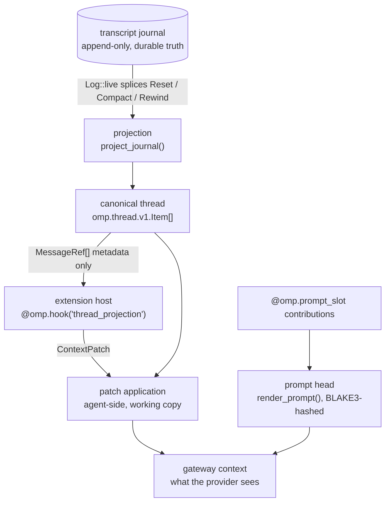
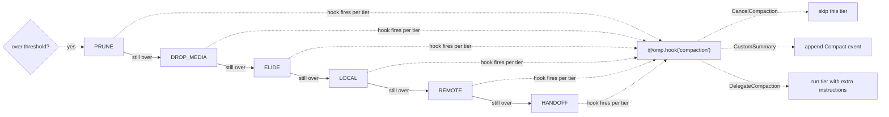

# 08 — Context, prompt assembly, compaction, memory

> **Design document, not a runtime API guarantee.** This corpus includes proposed
> interfaces and historical implementation observations. See
> [implementation status](implementation-status.md) for current owners and known gaps.

## Purpose

`omp.context`, `@omp.prompt_slot`, and the `thread_projection` / `compaction` hook payloads are the
one place an extension is allowed to influence *what the model reads*. The namespace exists
to make three things structurally impossible that pi made routine. First, an extension can
no longer re-serialize the conversation: it receives metadata for the live thread and
returns a patch of operations against it, so the per-turn cost of installing a context
rewriter is bounded by the number of *items it names*, not by the length of the session.
Second, an extension can no longer mutate the system prompt as a string: it fills a
declared slot with a declared stability class, and the harness — the only party that sees
every registration — decides ordering and cache-breakpoint placement. Third, compaction is
no longer "cancel it and hope": it is a typed verdict per rescue tier, and the summary an
extension supplies lands as the same `Compact` journal event the built-in path writes, so
history stays one shape.

The pi failure this removes is the twenty-three-way fight. pi's `context` hook hands each
handler a `structuredClone` of the full `AgentMessage[]` and pipes the result into the next
handler; `before_agent_start` hands each handler the `string[]` system prompt and pipes that
too. Twenty-three context-management packages in the catalog write into those two mutable
values, and a twenty-fourth — `pi-cache-optimizer` — exists solely to reorder the wreckage
afterwards so the provider's prefix cache survives. That package is not a competitor to the
other twenty-three. It is a symptom of them, and under prompt slots it has nothing left to
do: its entire behaviour is the definition of `omp.SlotClass`.

## Concepts

### Two copies, one truth



The journal is durable truth and extensions never rewrite it. `ContextPatch` operates on
the *working copy* — the thread the gateway is about to send. A patch is re-derived every
turn from the same inputs, so it is a pure function of the thread, and a host crash simply
means the unpatched thread goes out.

Compaction is the exception, and deliberately so: a compaction verdict is durable. It
appends `Kind::Compact { summary, short, first_kept, tokens_before, warning }`, which
`Log::live` already honours by splicing the live event list — the summary event replaces
everything before `first_kept`. A compaction survives restart; a context patch does not.
That is the whole distinction between the two hooks.

### Why full-history re-serialization is banned

pi's contract is one line:

```typescript
export interface ContextEvent {
	type: "context";
	/** Messages about to be sent to the LLM (deep copy, safe to modify) */
	messages: AgentMessage[];
}
```

`extensions/runner.ts` builds that event once per handler per LLM call, and
`ContextEventResult.messages` is spliced back in. Costs, per turn, per installed handler:

- One `structuredClone` of the whole conversation. At 200k tokens of history that is tens of
  megabytes of JS objects, including every base64 image block.
- One serialization across the process boundary if the handler is out-of-process — in omp it
  always is.
- One full deserialization on the way back, plus a diff nobody computes, so the agent cannot
  tell whether the handler changed one item or all of them.
- Loss of identity: the returned array is a new array of new objects. Nothing ties the item
  the handler kept to the item the journal recorded, which is exactly why pi cannot
  attribute a prefix-cache miss to a handler.

Three handlers installed, three clones. Under omp the same three handlers see one
`ContextView` built once and shared by reference — `MessageRef` carries no bodies — and each
returns a `ContextPatch` naming ids. A patch that prunes forty stale tool results is forty
strings, and the ids are the physical transcript event indexes the projection already holds,
so application is an index operation over the live list.

Bodies are *pulled*, never pushed. `MessageRef.verdict()` and `MessageRef.parts()` are
awaited round-trips for the items a handler actually wants to inspect. A memory extension
that only needs role, token count, and tool identity never transfers a byte of content.

The dispatch cost compounds with pi's own failure policy. `extensions/runner.ts` runs each
handler under a 30 000 ms timeout and fails open, so a handler that hangs adds thirty seconds
of dead time to a turn — and because the pipe is sequential, the next handler does not even
start until the timer fires. omp keeps fail-open, which is right for an optimization, but
bounds the handler deadline as a *fraction of the turn's own deadline* and dispatches handlers
concurrently against the one shared view — concurrently *across extensions*, that is: within
one extension, callback entry is serialized by default (actor semantics,
`docs/py/00-overview.md`), and an extension that wants overlap opts in explicitly. A hung
projection extension costs a slice of one turn, not thirty seconds times the number installed.

The hook's name is `thread_projection`, and the name is a review outcome worth recording.
Rev 1 of this document called it `@omp.hook("context")` while `docs/py/05-hooks.md`
simultaneously declared, as a locked decision, that there is no client-side context hook in
omp — two documents in the same set shipped in direct contradiction (review P0#11). The
review resolved the contradiction in this design's favor, and the reasoning is the point:
what the locked decision was written to prohibit is pi's whole-array-in, whole-array-out
rewriting hook, and this is not that hook. A handler here never holds the message array — it
receives body-free refs and may only return bounded, validated operations naming stable ids.
The rename makes the distinction load-bearing: you are projecting a patch against the thread,
not receiving the context. The amended invariant, verbatim: **Extensions may not replace or
reserialize the provider message array. They may return bounded, validated projection
operations against stable item IDs.** `docs/py/05-hooks.md` deletes its prohibition prose,
records the reversal on its side, and now counts three domain-return hook families —
`agent_settled`, `provider_error`, and `thread_projection` — whose handlers return domain
values rather than an `omp.HookDecision`.

### Prompt slots and prefix stability

A prompt is not a string; it is an ordered sequence of slot contributions, each carrying a
stability class. The harness sorts by class first, declared order second, within-slot
priority third; the inference layer then places each provider's cache markers at class
transitions, as many as that provider's budget allows (`docs/py/13-inference.md`).

```
   FROZEN ─────────── STABLE ──────────── EPOCHAL ─────────── VOLATILE ── │ messages
   conventions        tools               memory              recall      │
   role               policy              standing            status      │
   runtime            skills                                              │
   workflow           rules                                               │
   delivery           guidance                                            │
                      workspace                                           │
        ▲                  ▲                    ▲                    ▲
   breakpoint 1       breakpoint 2         breakpoint 3        trailing window
```

The diagram shows four classes landing on four breakpoints because that is how the packing
falls out on a provider with a four-marker budget — Anthropic's `cache_control` limit today.
Rev 1 of this document claimed more: that the class count itself "was chosen to fit the
tightest provider budget so no extension can ever exhaust it." That claim is retracted
(review, smaller correction #7). It welded a semantic vocabulary to one vendor's current wire
format, and the day a provider ships six markers — or two — the justification collapses while
the API cannot move. What is actually true: the classes express *semantic* stability — which
class of event invalidates the bytes — and nothing else. The inference layer owns the
packing: it maps class transitions onto each provider's real marker budget, four on Anthropic
today, zero on providers with implicit prefix caching, fewer under a smaller budget with
transitions dropped from the `VOLATILE` end first (`docs/py/13-inference.md`). A provider
budget change is a packing-pass change in one crate, not a vocabulary change in every
extension.

The guarantee this buys: content whose value can change between turns of a single session is
*structurally* below every breakpoint that matters. A `VOLATILE` slot cannot be written above
the last breakpoint because its class determines its position, and `render_prompt` already
refuses to accept a head whose two renders differ — so a slot that returns non-deterministic
output for identical input is rejected rather than silently cached wrong.

`pi-cache-optimizer` is worth reading as a bill of indictment against the string contract,
because it performs four separate repairs in `before_agent_start` and three of them are
structural problems that cannot recur here:

1. `stripSessionOverviewChurn` deletes git commit hashes, directory listings, and journal
   line counts out of pi's own `<session-overview>` block — the *harness* put volatile data
   in the prefix, and an extension has to cut it back out. Under slots that data is a
   `VOLATILE` contribution by declaration and was never in the prefix.
2. `compressSkillsInSystemPrompt` rewrites verbose `<skill>` XML into a one-line index.
   The `skills` slot is `STABLE` and already renders `name: description` lines pointing at
   `skill://<name>`; the compression has nothing left to compress.
3. `optimizeSystemPrompt` lifts stable segments above dynamic ones. That is precisely
   `SlotClass` ordering, computed in Rust at assembly time from declarations, over the whole
   registration set — which is the part no extension could ever do correctly, because no
   extension can see the others' contributions.
4. Wire normalization: `PI_CACHE_RETENTION=long` in the process environment, an injected
   OpenAI `prompt_cache_key`, stripping `prompt_cache_retention` on models that 400 on it,
   and reordering Anthropic's mixed cache-control TTLs. This one is real work and it does
   not belong to an extension either — it is provider-dialect normalization, and it belongs
   in `crates/ai` beside every other quirk (`docs/py/13-inference.md`).

So the useful reading of that package is not "a competing context extension." It is a bug
report with four items, filed against the harness, three of which are answered by making
ordering a type and one by moving it behind the provider boundary.

### Compaction as a tiered negotiation

omp does not have one compaction; it has a rescue ladder (`.plan/feature-map/FEATURES.md`
"multi-tier rescue: prune, drop images, elide, local, remote/native, handoff"). The
`compaction` hook fires once per tier attempt, named, so an extension can take over the
cheap tier and leave the expensive ones alone, or vice versa.



## Reference

`@omp.hook` itself, the hook-phase vocabulary (`omp.HookPhase`), and the global failure table
live in `docs/py/05-hooks.md`. The three events below are **domain-return hooks** — their
handlers return the domain values defined here, never an `omp.HookDecision` — and this
document is the single owner of their payload and verdict types; 05-hooks' catalog rows link
here and define nothing. Rev 1 asserted that ownership and did not deliver it: 05-hooks
carried its own, materially different `CompactionEvent` (review P0#1). The duplicate is
deleted, the field-by-field reconciliation is recorded under `omp.CompactionEvent` below, and
the owner-defines/others-link rule is to be machine-enforced by the generated spec rather
than trusted to prose (`docs/py/00-overview.md`).

| Event | Payload | Return | Latency | Failure |
|---|---|---|---|---|
| `thread_projection` | `omp.ContextView` | `omp.ContextPatch \| None` | per-turn | fail-open |
| `compaction` | `omp.CompactionEvent` | `omp.CancelCompaction \| omp.CustomSummary \| omp.DelegateCompaction \| None` | per-compaction | fail-open to default tier |
| `context_reset` | `omp.ContextResetEvent` | `None` | per-reset | fail-open |

All three handlers take the uniform callback shape `(event, ctx)` — the payload above, then
`omp.Context`. `omp.CompactionVerdict` is the union alias for the three compaction return
types; it is a `type` alias, not a base class, so a handler annotated with it type-checks
without inheriting anything.

Every public symbol in this reference carries generated
`OperationSpec(minimum_phase, durability, cost, authority)` metadata, and the phase legality
matrix in `docs/py/00-overview.md` is the authority on when each is legal. The shape for this
namespace: a `ContextPatch` and a prompt-slot contribution are non-durable CONTROL operations
— they edit a per-turn working copy or a cached prompt band, and the harness discards or
recomputes them freely. `omp.context.pin` and `omp.context.compact` are durable Requests:
acknowledged, recorded, and carrying the idempotency key and host-generation fence every
durable request carries. Nothing in this namespace authorizes a DATA effect, which is why no
symbol here ever waits on `EFFECTS_AUTHORIZED`.

---

### `omp.MessageKind`

Enumeration of thread-item classes visible to a thread-projection handler. Projected from
`omp.thread.v1.Item`; stable across revisions.

| Member | Meaning |
|---|---|
| `MessageKind.SYSTEM` | A prompt-head item. Present in the view, never patchable. |
| `MessageKind.USER` | User input, including steering interjections. |
| `MessageKind.ASSISTANT` | Assistant text and reasoning blocks. |
| `MessageKind.TOOL_CALL` | A tool invocation item. Carries `MessageRef.tool`. |
| `MessageKind.TOOL_RESULT` | A settled call's projected verdict. Carries `MessageRef.tool`. |
| `MessageKind.COMPACTION` | A summary standing in for a spliced-out prefix. |
| `MessageKind.BRANCH_SUMMARY` | A summary standing in for an abandoned branch. |
| `MessageKind.NOTICE` | Harness-authored system notification (availability changes, reminders). |
| `MessageKind.CUSTOM` | An item an extension appended through `omp.journal` (`docs/py/09-journal.md`). |

### `omp.ToolRef`

```python
@dataclass(frozen=True, slots=True)
class ToolRef:
    name: str
    family: str
    rev: int
```

Durable `(name, family@rev)` identity of the tool that produced a `TOOL_CALL` /
`TOOL_RESULT` item, mirroring Rust's `ToolIdentity` and `Rev` (`crates/tool/src/lib.rs`).
`str(ToolRef)` renders `edit@hl.3`. Revision semantics and `lift()` belong to
`docs/py/02-verdicts.md`; the reason this appears in a context view is that pruning
decisions are almost always per-tool ("drop every `read@1` result older than ten turns") and
must be attributable per revision.

### `omp.MessageRef`

```python
@dataclass(frozen=True, slots=True)
class MessageRef:
    id: str
    event: int
    seq: int
    kind: MessageKind
    role: str
    turn_id: str | None
    created_at_ms: int
    tokens: int
    byte_len: int
    part_count: int
    media_count: int
    tool: ToolRef | None
    is_error: bool
    useless: bool
    pinned: bool
    elided: bool
    superseded_by: str | None
    artifacts: tuple[ArtifactUrl, ...]
    preview: str
```

An immutable, body-free handle to one live thread item. Constructed agent-side during
projection and shipped as a flat array; never constructed by extension code.

| Field | Semantics |
|---|---|
| `id` | Stable opaque item identifier. The only value patch operations accept. Unique within a session for the item's lifetime, including across compaction. |
| `event` | Physical transcript event index — the `u64` the live chain in `crates/storage/src/transcript/reader.rs` manipulates. Exposed because `omp.journal` and `omp.sessions` (`docs/py/09-journal.md`) key on it, and because ordering comparisons are integer comparisons. |
| `seq` | Dense gateway thread sequence assigned when the item was accepted. `0` for items appended optimistically whose `amend_seq` correction has not landed. |
| `kind` | See `omp.MessageKind`. |
| `role` | Wire role: `"system"`, `"user"`, `"assistant"`, `"tool"`. Derived from `kind`; present because provider-shaped reasoning is more natural for some rules. |
| `turn_id` | Logical turn that produced the item, or `None` for prompt-head and pre-turn items. Grouping by `turn_id` is how "older than N turns" is expressed. |
| `created_at_ms` | Unix milliseconds recorded on the transcript event. |
| `tokens` | Token count under the *active model's* tokenizer, from the same accounting the context-usage breakdown uses. Estimated, never re-tokenized per hook call. |
| `byte_len` | Exact UTF-8 byte length of the item's model-facing parts. Cheap and exact where `tokens` is approximate. |
| `part_count` | Number of model-facing parts. |
| `media_count` | Number of blob-backed parts. Non-zero identifies the items the `DROP_MEDIA` tier targets. |
| `tool` | `ToolRef` for `TOOL_CALL` / `TOOL_RESULT`, else `None`. |
| `is_error` | Whether a `TOOL_RESULT` projected a `Fault` rather than a `Payload`. |
| `useless` | Whether the tool marked its own result as carrying no information (an empty search, a no-op). Set by the tool, honoured by omp's projection. This is the single highest-yield pruning signal in the view and it costs nothing to compute. |
| `pinned` | Item is protected from `prune` and `replace`. Set by the harness for the prompt head, the most recent user turn, unsettled calls, and reads of `local://` plan artifacts. |
| `elided` | Item's parts have already been reduced by an earlier tier or patch. Prevents double-elision accounting. |
| `superseded_by` | For a `TOOL_RESULT` whose content a later result fully replaces (a re-read of the same document revision), the id of that later result. Populated by the harness; `None` otherwise. |
| `artifacts` | `omp.ArtifactUrl` values — the typed location `docs/py/09-journal.md` owns, never raw URL strings — for artifacts the item's parts reference. Pruning an item does not delete its artifacts; the model can still read them. |
| `preview` | Bounded, redacted, single-line excerpt — at most 200 UTF-8 bytes. Enough to classify, never enough to reconstruct. |

**`await ref.parts() -> list[omp.Part]`** — Pulls the item's model-facing parts. CONTROL, one
round-trip, per-item. Raises `omp.ContextGone` if the item left the live chain since the view
was built.

**`await ref.verdict() -> omp.Payload | omp.Fault`** — Pulls the durable structured verdict
for a `TOOL_RESULT` — the payload or fault arm of the call's settled `omp.CallOutcome`
(`docs/py/02-verdicts.md`). CONTROL, one round-trip. Raises `omp.NoVerdict` for other kinds,
and for tool results recorded before the tool declared a verdict schema. This is the accessor a
memory pipeline should use: the verdict is dialect-neutral, so extracting "which files were
edited this session" reads `Payload` fields instead of regexing prose that changes every
time the tool's `prompt()` is revised.

**`await ref.raw_args() -> bytes | None`** — Pulls the raw argument emission recorded for a
`TOOL_CALL`, including any repair flag. CONTROL. `None` when the call predates raw capture.
Present for exactly one reason: measuring model argument quality against uncorrected data.

### `omp.ContextUsage`

```python
@dataclass(frozen=True, slots=True)
class ContextUsage:
    total_tokens: int
    context_window: int
    reserve_tokens: int
    usable_tokens: int
    fraction: float
    prompt_head_tokens: int
    device_catalog_tokens: int
    message_tokens: int
    catalog_notice_tokens: int
    media_tokens: int
    compaction_epoch: int
    threshold_fraction: float
    in_flight: bool
```

`usable_tokens` is `context_window - reserve_tokens`; `fraction` is
`total_tokens / usable_tokens`, so `fraction >= 1.0` means the next turn will not fit.
`threshold_fraction` is the configured auto-compaction trigger, exposed so extensions
threshold against the *user's* setting rather than a hardcoded 0.8. `in_flight` is true while
a turn is streaming, meaning `total_tokens` is an extrapolation. `compaction_epoch`
increments on every durable `Compact` or `Reset` event.


`catalog_notice_tokens` is the subset of `message_tokens` consumed by
device-catalog mount notifications; it is an explanatory echo and is never
added again when computing `total_tokens`.
### `omp.ContextView`

```python
@dataclass(frozen=True, slots=True)
class ContextView:
    session_id: str
    turn_id: str
    model: str
    provider: str
    epoch: int
    messages: tuple[MessageRef, ...]
    usage: ContextUsage
    prompt_hash: str
    reset_event: int | None
```

The immutable argument to a `thread_projection` handler. `messages` is in projection order and includes
prompt-head items so index arithmetic never lies about position. `prompt_hash` is the hex
BLAKE3 of the canonical prompt head (`crates/agent/src/prompt.rs`), which is what a
cache-health extension should key on instead of hashing prompt options the way
`@mrclrchtr/supi-cache` does. `reset_event` is the transcript index of the live `Reset`
boundary, or `None` if the chain reaches the session root.

**`view.since(turn_id) -> Iterator[MessageRef]`** — Items at or after the named turn. Pure,
host-local, no round-trip.

**`view.by_turn() -> Iterator[tuple[str | None, tuple[MessageRef, ...]]]`** — Items grouped
into turns in order. Pure.

**`view.tokens_of(ids: Iterable[str]) -> int`** — Summed `tokens` for the named ids. Pure.
Missing ids are ignored, not an error, because a handler chained behind another may name
something already pruned.

### Patch operations

Each op is a frozen dataclass. There are five op lists, applied in this fixed order:
`prune → drop_parts → replace → insert → reorder`. Conflicts are resolved
earlier-op-wins; the later offending op is dropped and journaled. Application is a single
plan-building pass, described under *What this requires us to build*.

**Resolved (2026-08-20 ruling):** operation order is semantic, not order-independent.
Within any one op, a duplicate id is a validation failure for that op: it is dropped and
journaled with `duplicate id`, never coalesced. Any other invalid op is likewise dropped and
journaled with the rule it broke; the remaining ops continue.

#### `omp.Prune`

```python
@dataclass(frozen=True, slots=True)
class Prune:
    ids: tuple[str, ...]
    reason: str = ""
    keep_placeholder: bool = True
```

Removes items from the working copy for this turn only.

- `ids` — items to remove. An op naming a `pinned` item is dropped and journaled with
  `omp.PatchRejected`. Naming an unknown id is ignored.
- `reason` — recorded in the patch-application telemetry record (`docs/py/10-telemetry.md`)
  and shown in the TUI's context breakdown. Not sent to the model.
- `keep_placeholder` — when `True` (default) and the pruned item is a `TOOL_RESULT` whose
  `TOOL_CALL` survives, a minimal placeholder result is substituted so the provider does not
  see a dangling call. Setting it `False` requires also pruning the matching call; if it
  does not, that `Prune` op is dropped and journaled with `omp.PatchRejected`. This is the
  single most common bug in pi context rewriters and it is a validation error here rather
  than a provider 400.

#### `omp.DropParts`

```python
@dataclass(frozen=True, slots=True)
class DropParts:
    ids: tuple[str, ...]
    reason: str = ""
```

Drops the named `PARTS` from the model-facing projection only. The typed verdict and journal
record remain intact, so renderers, telemetry, replay, and later structured reads retain
truth. It is the projection-time sibling of transcript amendment
`AmendPatch::DropParts` (`docs/py/02-verdicts.md:1868`), not a transcript mutation.

- `ids` — projected items whose model-facing parts are omitted. An unknown id drops and
  journals this op; a pinned target does the same.
- `reason` — recorded in the patch-application journal entry and never sent to the model.

`DropParts` marks its targets in the same `bitvec` conflict accounting as the other id-based
ops. If it conflicts with an earlier op, `DropParts` is dropped and journaled; if it precedes
the conflicting op in fixed application order, that later op is dropped and journaled.
Duplicate ids within this op are the general `duplicate id` validation failure.

**Resolved (2026-08-20 ruling):** `DropParts` is a real projection operation with the
semantics above; it is not an alias for pruning a transcript item.

#### `omp.Replace`

```python
@dataclass(frozen=True, slots=True)
class Replace:
    ids: tuple[str, ...]
    parts: tuple[omp.Part, ...]
    role: str = "user"
    label: str = ""
    inherit_position: str = "first"
```

Substitutes one synthetic item for a contiguous or scattered set of real ones.

- `ids` — items to replace. Must be non-empty. `pinned` items are rejected.
- `parts` — the replacement's model-facing parts. Use `omp.Part.text(...)`; blob parts are
  rejected because a synthetic summary that carries media defeats the purpose.
- `role` — `"user"`, `"assistant"`, or `"system"`. `"tool"` is rejected: a synthetic item
  cannot claim a `tool_call_id`.
- `label` — display label for the folded region in the TUI. Not sent to the model.
- `inherit_position` — `"first"` places the replacement where the earliest named item sat,
  `"last"` where the latest sat. Any other value drops and journals this op with
  `omp.PatchRejected`.

If two `Replace` ops name overlapping ids, the earlier op wins and the later op is dropped
and journaled. A `Replace` conflicting with an earlier `Prune` or `DropParts` is likewise
dropped and journaled; the rest of the patch still applies.

#### `omp.Insert`

```python
@dataclass(frozen=True, slots=True)
class Insert:
    parts: tuple[omp.Part, ...]
    anchor: omp.Anchor
    role: str = "user"
    ephemeral: bool = True
    dedupe_key: str | None = None
```

Adds a synthetic item that exists only in this turn's working copy.

- `parts` — model-facing parts.
- `anchor` — see `omp.Anchor`.
- `role` — `"user"`, `"assistant"`, or `"system"`. A `"system"` insert lands as a
  `MessageKind.NOTICE` item and is rendered as such.
- `ephemeral` — `True` means the item is never journaled; the next turn's patch must insert
  it again. `False` requests durability, so that op is dropped and journaled with
  `omp.PatchRejected`: durable additions go through `omp.journal.append`
  (`docs/py/09-journal.md`), where they get an id,
  an event index, and a place in the chain. There is no back door.
- `dedupe_key` — when set, at most one insert with that key survives per turn across all
  handlers. Two nudge-injecting extensions using the same key produce one nudge instead of
  two; the handler earliest in deterministic handler order wins (see **Chaining**).

Inserting above the last cache breakpoint's message-side equivalent is permitted but
reported: the patch-application record carries `broke_prefix_at`, and the TUI marks it. Very
occasionally that is what you want; it should never be accidental.

#### `omp.Reorder`

```python
@dataclass(frozen=True, slots=True)
class Reorder:
    ids: tuple[str, ...]
    before: str
```

Moves the named items, preserving their relative order, immediately before the item `before`.

This op is deliberately weak. It cannot move items across a `turn_id` boundary, cannot move
`TOOL_CALL` and `TOOL_RESULT` apart, cannot move a `pinned` item, and cannot move anything
above the last `COMPACTION` item. Violating any of those rules drops and journals that op
with `omp.PatchRejected`; the remaining ops still apply. It exists for one legitimate use
— hoisting a retrieved memory block to sit adjacent to the
question that retrieved it — and every reorder invalidates the prefix cache from the
earliest touched position, which the application record states plainly.

### `omp.Anchor`

```python
@dataclass(frozen=True, slots=True)
class Anchor:
    relation: str
    id: str | None = None

    @staticmethod
    def before(id: str) -> Anchor: ...
    @staticmethod
    def after(id: str) -> Anchor: ...
    @staticmethod
    def head() -> Anchor: ...
    @staticmethod
    def tail() -> Anchor: ...
```

`relation` is one of `"before"`, `"after"`, `"head"`, `"tail"`. `head()` means immediately
after the prompt head and before the first conversational item — not above the prompt head,
which extensions reach only through `@omp.prompt_slot`. `tail()` means last, immediately
before the pending user turn. `before`/`after` require `id`; `head`/`tail` require `id is
None`. Constructing an inconsistent anchor raises `ValueError` at construction, in Python,
before anything crosses a socket.

### `omp.ContextPatch`

```python
@dataclass(slots=True)
class ContextPatch:
    prune: list[Prune] = field(default_factory=list)
    drop_parts: list[DropParts] = field(default_factory=list)
    replace: list[Replace] = field(default_factory=list)
    insert: list[Insert] = field(default_factory=list)
    reorder: list[Reorder] = field(default_factory=list)
    note: str = ""
```

The return value of a `thread_projection` handler. Returning `None` is equivalent to returning an empty
patch and is measurably cheaper — no frame is sent.

`note` is a human-readable one-liner recorded with the application record; it is what shows
up in the TUI when a user asks why their context shrank.

**`patch.is_empty() -> bool`** — True when all five lists are empty. Pure.

**`patch.merge(other: ContextPatch) -> ContextPatch`** — Concatenates op lists. Provided so
one extension can compose its own sub-rules; it performs no conflict checking, because
conflict checking is the agent's job and duplicating it in Python would let the two drift.

**Channel and latency.** The `thread_projection` event rides CONTROL, once per LLM request, in
the Projecting phase. Latency class: **per-turn**. Failure policy: **fail-open** — a handler
that raises or times out is skipped whole with a journaled diagnostic. If a returned patch
contains an invalid op, only that offending op is dropped and journaled with the rule it
broke; the rest of that patch applies. If every contribution is skipped, the turn proceeds
on the unpatched thread. Rationale: a projection handler is an optimization.
A policy handler denying a call is a safety decision and fails closed
(`docs/py/06-policy.md`); dropping stale tool output is not.

**Resolved (2026-08-20 ruling):** handler failure is whole-handler fail-open, while patch
validation is per-op fail-open. A rejected op never discards its valid siblings.

**Chaining.** Handlers run in deterministic handler order — the `(layer, publisher,
extension_id)` tie-break every hook dispatch uses (`docs/py/05-hooks.md`); there is no
`priority=` knob, because ordering here is a determinism device, not a privilege. Each
receives *the same* `ContextView` — not the previous handler's output. Patches are collected
and applied together, once. This is the deliberate break from pi's sequential piping: piping
means handler N's cost scales with handler N-1's output size and no handler can be reasoned
about in isolation. Collecting means conflicts are detected instead of silently resolved by
ordering, and total application cost is one pass regardless of handler count. When two
patches genuinely conflict, deterministic handler order wins first — the earlier handler's
op is kept and the later handler's op is dropped. Within one handler's patch, the fixed
application order `prune → drop_parts → replace → insert → reorder` and then list order
define which op is earlier. The later op is dropped; both the drop and the winning op are
journaled.

**This is not a gate chain, and the distinction is load-bearing.** `PLAN.md` §D6
locks **D6 — One mailbox, no gate chain**, amended 2026-08-19: a tool batch runs concurrently
exactly as the model issued it, with "no batch-level admission scheduler, no parallelism
detection, no reordering," each invocation gating independently, and safety
living in env invariants. Nothing in this document is an admission decision. A
`thread_projection` handler cannot deny, delay, reorder, or veto a tool call; it edits the
message list the *next* request carries and has no vocabulary for authorizing anything.
Ordering here is a determinism device — two extensions must produce the same result regardless
of load order — not a privilege ladder, and there is no `Deny`. Tool-call admission is a
per-invocation decision procedure Core runs, answering the env-side admission query
(`docs/py/06-policy.md` — which records how the D6 wording amendment Rev 2 flagged was
ratified: the decision procedure is explicitly in D6's scope, batch scheduling is not). It is
a different mechanism at a different point in the call's life.

The one place this document does short-circuit is a compaction verdict: the first
`CancelCompaction` wins and later handlers do not run. That is an optimization, not a gate —
their work would be discarded, and skipping it is observationally identical apart from cost.
Compaction is not a dispatch, so D6 does not reach it. Worth being explicit, since a reader
arriving from `docs/py/06-policy.md` will reasonably ask.

### `omp.context.epoch()` and context control

Module-level accessors. All are `async` and ride CONTROL unless noted.

**`await omp.context.view() -> ContextView`** — The current view outside a `thread_projection`
hook. Latency: per-call, one round-trip. Use inside a command or a background pipeline. Inside
a `thread_projection` handler, use the argument you were given.

**`await omp.context.usage() -> ContextUsage`** — Usage without building a view. Cheap; the
agent already maintains this for the status line.

**`await omp.context.pin(ids: Iterable[str], *, reason: str) -> int`** — Marks items
`pinned`, protecting them from every compaction tier and from other extensions' patches.
Returns the count actually pinned. Durable: recorded so the pin survives restart. Pins are
budgeted — pinning more than a configured fraction of the window raises
`omp.PinBudgetExceeded`, because an unbudgeted pin is a denial-of-service on compaction.

**`await omp.context.unpin(ids: Iterable[str]) -> int`** — Releases pins this extension set.
Raises `omp.PermissionDenied` for pins another extension or the harness owns.

**`await omp.context.compact(*, tier: CompactionTier | None = None, focus: str = "") -> CompactionOutcome`**
— Requests compaction out of band, exactly as `/compact` does. `tier=None` runs the ladder
from the top. `focus` is user-style instruction text passed to whichever tier performs
summarization. Raises `omp.CompactionBusy` if one is already running. This is the sanctioned
form of `pi-observational-memory`'s `ctx.compact()` call from `agent_end`.

**`await omp.context.epoch() -> int`** — The current `compaction_epoch`. A background memory
pipeline compares this against the epoch it started with; a change means the item ids it
captured may have been spliced out, and it should re-read rather than write stale work.

**`omp.context.lane(*, strict_epoch: bool = False)`** — Async context manager marking a block
as auxiliary context work. Completions issued inside it (`omp.agents.completion`,
`docs/py/12-agents.md`) are deprioritized against the conversation and abstain from the
constrained-sampling budget. With `strict_epoch=True`, journal writes from inside the block are
refused with `omp.StaleEpoch` if the compaction epoch moved while the block was open. Entering a
lane never calls a model, and it does not set the cancellation scope — that is
`completion(scope=…)`. See *Background auxiliary inference* below.

### Background auxiliary inference

A memory pipeline must call a model — to extract observations, to consolidate, to embed —
without appearing in the conversation. **The call itself is `omp.agents.completion`
(`docs/py/12-agents.md`); this document defines no second way to invoke a model.** An earlier
draft of this document specified `omp.context.aux` with its own request and response types.
That was wrong, and the argument against it is the one that settled the ownership: calling a
model spends the user's money, which makes it the same class of authority as spawning a
subagent — role indirection, a budget, and attribution — just smaller. Two entry points to
that authority means two budget accountings and two attribution paths, which is how you end up
unable to answer "what did my memory extension cost me." So there is one.

Three properties of an auxiliary call are genuinely this namespace's, because they are about
*context*, not about inference. Together they are what makes a background pipeline correct
rather than merely functional.

**1. Lane priority and constraint abstention.** A completion issued inside
`omp.context.lane()` is strictly deprioritized against the conversation: a pending user turn
preempts it at the gateway. Such calls abstain from the constrained-sampling budget and never
set a forced call. A memory pipeline must not be able to make a user's turn slower or a user's
tool call unconstrained — those are shared resources, and Lesson #5's whole argument is that
only the harness can see the whole picture.

This does *not* need to include "never writes to the transcript," because
`omp.agents.completion` never writes a thread item at all — no journal entry, no transcript row,
no `TOOL_REV_PROP` stamp; the emission exists only in the returned value and in telemetry
(`docs/py/12-agents.md`). Invisibility is a property of the call, not a rule this lane
enforces.

**2. Epoch discipline.** This is the rule extensions get wrong and pi cannot express. A
background pipeline captures `await omp.context.epoch()` before it starts and re-checks it
before it writes:

```python
epoch = await omp.context.epoch()
result = await omp.agents.completion(...)          # seconds later
if await omp.context.epoch() != epoch:
    return                                          # compaction or reset landed; drop the batch
await omp.journal.append(observations)             # a declared @omp.entry_kind instance
```

Without it, a pipeline that started before a compaction writes observations keyed to item ids
that are no longer in the live chain, and a `CustomSummary` built from them describes history the
model can no longer see. `pi-observational-memory` stands a `compactHookInFlight` boolean in for
this check and answers `{ cancel: true }` when it trips — disabling the harness's only overflow
defence to paper over a staleness question. The epoch counter is the actual answer.

**3. Choosing a cancellation scope.** `completion(scope=…)` takes `"turn"` (default) or
`"session"` (`docs/py/12-agents.md`); this document's contribution is knowing which one a
context workload wants, because the two failure modes are opposite. A recall query feeding *this*
turn's prompt takes `scope="turn"`: its answer is worthless once the turn is gone, and a user
pressing Esc expects it dead. A consolidation pass takes `scope="session"`: finishing it after
its originating turn ended is the entire point. Getting this backwards is silent waste in one
direction and lost work in the other.

There is deliberately no scope that outlives the session, and the reason generalizes — an
unowned inference request is an unbilled one. Session shutdown gives survivors a bounded grace
window and then drops them; extensions get one `session_shutdown` to flush, and unflushed work is
lost deliberately rather than delaying exit.

Where the boundary falls, concretely. `omp.agents.completion` owns `role: str = "smol"` and its
resolution, `labels: Mapping[str, str]`, `scope: Literal["turn", "session"]`, the token budget
and its exhaustion behaviour, the `default` fallback contract, `Completion.usage` including
`cost_usd`, and structured faults. This document owns which lane a call runs in, the epoch check
around it, and which scope a context workload should pick. If you need the call, read
`docs/py/12-agents.md`; if you need it to be *correct in a session that is compacting underneath
you*, read this section.

**Inherited caveat, and it lands squarely on this document's use case: per-extension usage
attribution does not exist in Rust today.** `Usage` is accounted per turn and per session;
nothing ties a token to the extension that caused it. So `labels` is specified, and "what did my
memory pipeline cost me" is not yet answerable — which is unfortunate, because a background
consolidation loop is precisely the thing users need that answer about. pi is no better (its
memory backends spend through `ctx.modelRegistry` with no attribution path at all), but "no worse
than pi" is not the bar. The additive path is a label dimension on the usage records the
telemetry firehose already carries (`docs/py/10-telemetry.md`); until it exists, an extension
that runs unbounded background inference is indistinguishable from a bug in the bill.

One principle from that ratification generalizes to every verdict in this document and is worth
stating here because compaction is where it bites hardest: **the harness must never choose a
fallback verdict on an extension's behalf.** A failed `thread_projection` handler is skipped, because a
patch is an optimization and the unpatched thread is a real answer. A failed `compaction`
handler falls through to the *default tier* — the harness's own behaviour — and never to a
synthesized `CustomSummary`, because the harness cannot know what an extension's ledger would
have said, and a fabricated summary is worse than a slower compaction. Where no safe default
exists, the answer is to run the built-in path, not to invent one.

### `@omp.prompt_slot`

```python
@omp.prompt_slot("memory", priority=100)
def contribute(ctx: omp.PromptContext) -> str | None: ...
```

The decorator's full signature is `prompt_slot(slot: str, *, priority: int = 0,
cls: SlotClass | None = None)`. Rev 1 rendered that signature as the decorator line itself,
which is not Python — the fence failed to parse — so the fence now shows a real registration
and the signature lives here.

Declares a contribution to one named prompt slot. The function is **synchronous** and must be
**pure** in its argument: `render_prompt` in `crates/agent/src/prompt.rs` invokes the whole
head twice against identical input and compares byte-for-byte before accepting it. A slot
that reads the clock, a mutable global, or a file gets its extension's contribution rejected
with `omp.VolatilePrompt` and journaled. Read your inputs on `extension_activate` (or
`session_start`, for eager extensions that see the real session transition) or in a telemetry
handler; render from a snapshot.

Returning `None` omits the contribution. Returning `str` contributes text. Returning a
`Tml` object is rejected — TML is a UI type (`docs/py/07-ui.md`); the model reads text.

- `slot` — one of the names below. An unknown slot raises `omp.UnknownSlot` at import.
- `priority` — orders contributions *within* a slot, descending. Ties break deterministically
  on `(layer, publisher, extension_id)`, never on load order.
- `cls` — normally omitted: the class is a property of the slot. Supplying a class *stricter*
  than the slot's default (e.g. `FROZEN` for a `memory` contribution that genuinely never
  changes) is honoured and moves the contribution earlier. Supplying a *looser* class raises
  `omp.SlotClassConflict`; you cannot smuggle volatile content into a stable position.

Latency class: **per-prompt-render**, which is per session and on every explicit head
rewrite, not per turn. The head is rendered, hashed, and reused until an input changes. A
slot function is therefore allowed to be slow-ish (single-digit milliseconds); it is not
allowed to do I/O.

**Activation.** A prompt slot is a manifest-declared surface: the manifest's declaration
table (`docs/py/14-deploy.md`) carries its `declaration_id`, kind, module, static key,
activation trigger, required API level, and failure class. Its activation trigger is
**eager-before-first-prompt** — the head cannot render until every declared contribution has
been pulled, so there is no lazy path for this surface, and a prompt-slot-only extension is
activated before the session's first prompt render via
`extension_activate(reason=FIRST_REACH)` (`RESTART` / `HOT_RELOAD` after a host restart or
reload). A slot that could activate lazily would be a slot the first prompt renders without.

#### Extension-authored skills

`@omp.skill(name, *, description, hidden=False, disable_model_invocation=False,
autoload=False, contain_root=None)` decorates a synchronous zero-argument callable returning
`str`. Declaration lowering calls the body exactly once, normalizes the metadata, and produces
one deterministic generated `SKILL.md`; it is never retained as a per-session callback. Names
are 1–64 lowercase ASCII letters, digits, or hyphens, begin with a letter or digit, and the
complete generated UTF-8 file is bounded to 64,000 bytes. `contain_root`, when present, is a
distribution-relative POSIX path and bounds nested reads below `skill://<name>/…`.

```python
import omp

@omp.skill("review", description="Review a change", autoload=False)
def review() -> str:
	return "# Review\n\nInspect correctness, tests, and maintainability."
```

The generated file is lowered to the static `kind = "skills"` content row specified by
[`14-deploy.md`](14-deploy.md) §3.1.5. A skills-only extension is therefore discoverable and
resolvable through `skill://review` from authenticated manifest bytes without starting Python.
If that extension later starts for another declared surface, FREEZE compares the decorated
skill path and metadata with the admitted row; a mismatch rejects the registry publication.
FREEZE also seals this decorator: a later `@omp.skill` raises `omp.DeclarationSealed`, and
resource discovery never reopens the declaration registry.

Runtime-selected files use
`@omp.hook("resources_discover", phase=omp.HookPhase.TRANSFORM)` instead. A transform may append
`omp.ResourceRef(kind=omp.ResourceKind.SKILL, ...)`; Core admits only a recorded `SKILL.md`
contained by the invocation's Environment roots, reads it once, and merges it through the same
skill discovery path. `add` composes by `APPEND`, while `keep` composes by `INTERSECT`.

The merge is first-winner by the existing source order, after source enablement and skill-name
filters: project and user-authored native skills precede extension static and hook-contributed
skills; extension contributors are ordered by their admitted source order; foreign adapters
follow; managed skills are dead last. A disabled or malformed higher-priority candidate does not
claim its name, while an admitted winner does. The session then freezes the winning bytes,
description, flags, source, base directory, and containment root in one immutable
`SkillSnapshot`. Editing a contributed file cannot change that session's prompt inventory or
`skill://` body. Explicit reload or a new session reruns `resources_discover`, discovery, and
collision resolution and creates a new snapshot.

#### `omp.SlotClass`

| Member | Contract | Cache consequence |
|---|---|---|
| `SlotClass.FROZEN` | Byte-identical for the entire process lifetime, for every session. Depends only on the build and the resolved config. | Sits above breakpoint 1. Shared across every session and every subagent on the machine. |
| `SlotClass.STABLE` | Changes only on an explicit, user-observable event: config change, device registry change, workspace root change, model switch. | Between breakpoints 1 and 2. Survives the whole session unless the user does something. |
| `SlotClass.EPOCHAL` | Changes only at a compaction or reset boundary — i.e. when the prefix is already invalidated. | Between breakpoints 2 and 3. Free to change, because the epoch change already cost the cache. |
| `SlotClass.VOLATILE` | May change on any turn. | Below breakpoint 3, above the message list. Costs exactly the tokens below breakpoint 3 and nothing above it. |

The *Contract* column is the class; the *Cache consequence* column describes how the packing
lands on a provider with a four-marker budget (Anthropic today). The packing itself — how many
transitions become markers, and which are dropped first — belongs to `docs/py/13-inference.md`.

#### Slot catalog

Slots are listed in assembly order. "Writable" marks the slots extensions may target.

| Slot | Class | Writable | Content |
|---|---|---|---|
| `conventions` | `FROZEN` | no | RFC 2119 legend, XML-tag authority rule. First bytes of every request omp ever sends. |
| `role` | `FROZEN` | no | Agent identity and personality preset. |
| `runtime` | `FROZEN` | **yes** | Harness capability announcements and the internal-URL catalog. An extension contributing a URL scheme documents it here. |
| `tools` | `STABLE` | no | Core tool inventory and the device catalog exposed through the `dyn` shell builtin. Devices reach this by registering (`docs/py/01-devices.md`), never by writing text. |
| `policy` | `STABLE` | **yes** | Tool-use policy and specialized-tool enforcement. A policy extension states its rules here so the model knows before it is denied (`docs/py/06-policy.md`). |
| `workflow` | `FROZEN` | **yes** | The engineering-workflow lifecycle. |
| `skills` | `STABLE` | **yes** | Skill inventory: `name: description` lines pointing at `skill://<name>`. |
| `rules` | `STABLE` | **yes** | Always-apply rules and glob-scoped domain-rule descriptors. |
| `guidance` | `STABLE` | **yes** | Standing instructions that are not rules and not memory — a project's review conventions, a user's stated preferences. |
| `workspace` | `STABLE` | **yes** | Workstation block, repo rules, directory context, workspace tree, VCS identity. Rendered by `WorkspacePromptSource` from an immutable `WorkspaceInput`; extensions append. |
| `memory` | `EPOCHAL` | **yes** | Consolidated long-term memory: `MEMORY.md`-class content, mental models, user profile. |
| `standing` | `EPOCHAL` | **yes** | Extension-managed instructions that change when memory consolidates — the "how to use the recall tool" block a memory backend needs adjacent to its memories. |
| `recall` | `VOLATILE` | **yes** | Per-turn retrieved memories, the auto-recall snippet, anything query-dependent. |
| `status` | `VOLATILE` | **yes** | Live counters and pressure notices: context usage nudges, background-job summaries. |
| `delivery` | `FROZEN` | no | The delivery contract and `<critical>` block. Assembled last within the head because trailing instructions are followed best; its class is `FROZEN`, so position within the frozen band is by declared order, not by class. |

The three-way split of `memory` / `standing` / `recall` is the load-bearing part. pi's memory
backends emit one `buildDeveloperInstructions()` string containing static instructions,
mental models, and the volatile recall snippet concatenated together — the Hindsight backend
even documents the ordering contract as a comment. One volatile tail therefore invalidates
the entire block, including the 16 000 characters of mental models that did not change. Three
slots with three classes make the same content cost one recall snippet's worth of cache.

#### `omp.PromptContext`

```python
@dataclass(frozen=True, slots=True)
class PromptContext:
    session_id: str
    model: str
    provider: str
    context_window: int
    epoch: int
    cwd: str
    roots: tuple[str, ...]
    vcs_branch: str | None
    vcs_commit: str | None
    is_subagent: bool
    agent_kind: str | None
    slot: str
    cls: SlotClass
    budget_bytes: int
```

Immutable input to a slot function, mirroring Rust's `WorkspaceInput` plus routing metadata.
`budget_bytes` is the byte budget the harness allocated to this contribution; exceeding it
truncates at a UTF-8 boundary and journals the overflow. `is_subagent` and `agent_kind` let a
memory extension contribute nothing to a scout's prompt — cheap, and it keeps the scout's
frozen prefix identical to every other scout's, which is what makes subagent fan-out cache
well.

**`await omp.prompts.invalidate(slot: str) -> int`** — Marks this extension's contribution to
`slot` stale, forcing a head re-render before the next turn. Returns the new prompt
generation number. This is how an `EPOCHAL` slot legally changes: consolidation finishes,
the extension calls `invalidate("memory")`, and the next render picks up the new snapshot.
Calling it on a `VOLATILE` slot is a no-op returning the current generation, because volatile
slots re-render anyway. Calling it on a `FROZEN` slot raises `omp.SlotClassConflict`. Rate
limited: repeated invalidation of `STABLE`/`EPOCHAL` slots within one turn is coalesced, and
an extension that invalidates on a timer gets a journaled warning naming it, because that is
indistinguishable from turning the prefix cache off.

### Compaction control

#### `omp.CompactionTier`

| Member | What the tier does | Typical extension interest |
|---|---|---|
| `CompactionTier.PRUNE` | Drops `useless` and `superseded_by` tool results and dangling placeholders. Lossless. | Rarely — it is already what a good thread-projection handler does. |
| `CompactionTier.DROP_MEDIA` | Strips blob-backed parts from historical items, leaving `artifact://` references. | An image-heavy workflow may want to cancel this and prune differently. |
| `CompactionTier.ELIDE` | Reduces large historical tool results to bounded views, keeping verdicts. | Extensions that own their own elision policy. |
| `CompactionTier.LOCAL` | Summarizes a prefix with a local model call and appends a `Compact` event. | The main interception point: `CustomSummary` here replaces the summarizer entirely. |
| `CompactionTier.REMOTE` | Uses a provider-native context-management endpoint, preserving provider replay data. | Cancel it when a custom summary must stay portable across providers. |
| `CompactionTier.HANDOFF` | Ends the session and starts a child with a handoff summary and transferred artifacts. | Last resort; extensions usually let it run. |

#### `omp.CompactionEvent`

```python
@dataclass(frozen=True, slots=True)
class CompactionEvent:
    preparation_id: str
    tier: CompactionTier
    reason: str
    epoch: int
    tokens_before: int
    target_tokens: int
    suggested_first_kept: str
    to_summarize: tuple[MessageRef, ...]
    to_retain: tuple[MessageRef, ...]
    split_turn: bool
    previous_summary: str | None
    previous_preserve: dict | None
    custom_instructions: str | None
    deadline: omp.Duration
```

| Field | Semantics |
|---|---|
| `preparation_id` | Identifies this compaction attempt. Include it in journal entries so a later analysis can join an extension's record to the resulting `Compact` event. |
| `tier` | Which rung of the ladder is about to run. |
| `reason` | `"threshold"`, `"idle"`, `"manual"`, `"mid_turn"`, `"extension"`, `"rescue"`. `"rescue"` means a request already failed for length; cancelling here risks an unrecoverable turn. |
| `epoch` | Epoch before this compaction. |
| `tokens_before` | Total tokens in the live chain now. |
| `target_tokens` | What the tier must get below for the ladder to stop. A `CustomSummary` that does not reach it advances to the next tier rather than declaring success. |
| `suggested_first_kept` | The item id the harness would cut at. Use it unless you have a reason; `CustomSummary` may name an earlier or later one. |
| `to_summarize` | Refs the tier plans to fold away. Bodies pulled on demand, so an extension that summarizes from its own ledger transfers nothing. |
| `to_retain` | Refs the tier plans to keep verbatim. |
| `split_turn` | Whether the cut falls inside a turn, meaning a partial-turn prefix summary is also needed. |
| `previous_summary` | Summary text from the previous `Compact` event, for iterative update. |
| `previous_preserve` | The previous compaction's opaque `preserve` payload, round-tripped verbatim. |
| `custom_instructions` | User focus text from `/compact <focus>`, or `None`. |
| `deadline` | Remaining budget for the handler, as an `omp.Duration` — the one duration type every API uses; there is no `_ms` suffix to misread. Exceeding it fails the handler open to the default tier behaviour. |

Latency class: **per-compaction** (seconds are acceptable). Channel: CONTROL, reentrant — a
handler may call `omp.agents.completion` and `omp.sessions.*` while the agent waits.
Failure policy: **fail-open to the default tier**. A handler that raises or times out does
not block compaction, because the alternative is a session that cannot make a request.

**This is the single definition of `CompactionEvent`.** Rev 1 shipped two materially
different payloads under this name — this one, and a second in `docs/py/05-hooks.md` carrying
`reason, action, tokens_before, budget, first_kept: int, refs, instructions` plus mutable
`summary` / `short` / `delegate` fields driven through `Modify(patch=...)` (review P0#1). The
duplicate is deleted; 05-hooks' catalog row links here. What survived, and why:

- `tier` survived over 05's `action` because compaction is a ladder, not one action — the
  hook fires per rung, and an extension takes over exactly the rungs it names.
- `target_tokens` absorbs 05's `budget` under a name that says what it gates.
- `suggested_first_kept` — a stable item id — survived over 05's `first_kept: int` event
  index, because every patch and verdict in this namespace names stable item IDs; a raw
  index is exactly the identity loss the amended invariant forbids.
- The `to_summarize` / `to_retain` pair survived over 05's single `refs`, because a handler
  deciding whether to take a tier over needs the tier's *plan*, not an undifferentiated
  inventory.
- `custom_instructions` absorbs 05's `instructions`; `reason` keeps this document's six
  string values — 05's `OVERFLOW` is `"rescue"` here, and its `INCOMPLETE` is subsumed by
  the ladder advancing.
- `preparation_id`, `epoch`, `split_turn`, `previous_summary`, `previous_preserve`, and
  `deadline` had no 05 counterpart and survive unchanged.

05's mutable `summary` / `short` / `delegate` fields did not survive at all, and that is the
material reversal worth stating plainly: they modeled the return as a `HookDecision.Modify`
against event fields, which made the payload double as the verdict. Compaction is a
domain-return hook. The event is immutable; the return is one of the three typed verdicts
below, and nothing else.

#### Verdicts

```python
@dataclass(frozen=True, slots=True)
class CancelCompaction:
    reason: str
    suppress_for_turns: int = 0

@dataclass(frozen=True, slots=True)
class CustomSummary:
    summary: str
    first_kept_id: str
    short: str | None = None
    warning: str | None = None
    details: dict | None = None
    preserve: dict | None = None

@dataclass(frozen=True, slots=True)
class DelegateCompaction:
    extra_instructions: str = ""
    focus_ids: tuple[str, ...] = ()
    role: str | None = None
    keep_recent_tokens: int | None = None
```

**`CancelCompaction`** — Skip *this tier*. Exact effects: no `Compact` event is appended, the
epoch does not change, item ids stay valid, and the ladder advances to the next tier
immediately. `suppress_for_turns` additionally suppresses the *whole ladder* for that many
turns, which is what an extension doing incremental pruning wants: `pai-acp` cancels because
it is folding continuously, and a bare cancel would just re-run the ladder next turn and burn
the hook round-trip every time. Cancelling at `tier=HANDOFF` with `reason="rescue"` is
refused — `omp.CompactionRefused` — because there is no next rung and the extension would be
choosing a dead session. `reason` is journaled and shown in the TUI.

**`CustomSummary`** — Replace the tier's work with a summary you computed. Exact effects: the
agent appends `Kind::Compact { summary, short, first_kept, tokens_before, warning }` — the
same event the built-in path writes — where `first_kept` resolves from `first_kept_id`.
`Log::live` then splices: the summary event becomes the head of the live chain and everything
before `first_kept` leaves it. The epoch increments. `details` is stored alongside for the
extension's own later queries; `preserve` is returned verbatim as `previous_preserve` on the
next compaction, which is how an extension keeps a running index across many compactions
without a side file. No summarizer model call is made, so this is also the cheap path:
`pi-observational-memory` already has the fold, and paying for a summarization LLM call to
restate it is pure waste. If `first_kept_id` is not in `to_summarize ∪ to_retain`, or is
`pinned`-protected in a way that would strand a call without its result, the verdict is
rejected with `omp.PatchRejected` and the tier runs normally. If the resulting size is still
above `target_tokens`, the summary is kept and the ladder advances — the work is not thrown
away.

**`DelegateCompaction`** — Let the tier do its job, with adjustments. `extra_instructions` is
appended to the summarization prompt. `focus_ids` names items whose content must survive into
the summary; the summarizer is told so explicitly. `role` overrides the model role used for
summarization (`"smol"` for cheap, `"default"` for careful). `keep_recent_tokens` overrides
how much recent history stays verbatim, clamped to the configured window. Returning
`DelegateCompaction()` with no fields set is exactly equivalent to returning `None`, and
`None` is cheaper.

Multiple handlers: verdicts are collected in deterministic handler order (the
`(layer, publisher, extension_id)` tie-break). The first `CancelCompaction` wins and
short-circuits — later handlers do not run, since their work would be discarded. If no
cancel, the first `CustomSummary` in that order wins and later ones are journaled as
superseded. `DelegateCompaction` fields compose across handlers: `extra_instructions`
concatenate in handler order, `focus_ids` union, and the first non-`None` `role` and
`keep_recent_tokens` win.

#### `omp.CompactionOutcome`

```python
@dataclass(frozen=True, slots=True)
class CompactionOutcome:
    preparation_id: str
    tiers_run: tuple[CompactionTier, ...]
    from_extension: str | None
    tokens_before: int
    tokens_after: int
    first_kept_id: str
    epoch: int
    summary_bytes: int
    warning: str | None
```

Returned by `omp.context.compact`, and the payload of the `compaction_done` hook event
(`docs/py/05-hooks.md` links here) and of `compaction_done` telemetry
(`docs/py/10-telemetry.md`). `from_extension` names the extension whose `CustomSummary` won,
or `None` for a built-in tier. `warning` carries the degradation notice when a tier fell back
to default behaviour (a handler failed open, a `CustomSummary` was rejected), or `None` for a
clean run.

### The reset boundary

`Kind::Reset` clears the live chain and starts a fresh one at the reset event. It is not a
compaction: nothing is summarized and nothing is retained. Two consequences extensions must
handle.

1. **Ids before the boundary are unreachable through `ContextView`.** They remain readable
   through `omp.sessions` (`docs/py/09-journal.md`), because the journal is append-only and
   nothing was deleted. A memory pipeline mid-flight when a reset lands sees `epoch` change
   and must decide whether its observations still apply — usually yes, since the user's
   intent did not vanish, only their context.
2. **`EPOCHAL` slots re-render at the boundary.** A reset is the cheapest possible moment to
   change memory content, and the harness invalidates every `EPOCHAL` contribution
   automatically.

The `context_reset` event carries:

```python
@dataclass(frozen=True, slots=True)
class ContextResetEvent:
    reset_event: int
    epoch: int
    kind: str
    tokens_discarded: int
    last_turn_id: str | None
```

`kind` is `"clear"` (chain cleared, session continues), `"fresh"` (chain cleared and
workspace snapshot re-captured), or `"branch"` (chain moved to a sibling with a
`BRANCH_SUMMARY` item standing in). Latency class: **per-reset**. Fail-open: a raising
handler is journaled and the reset proceeds. A reset is a user action and no extension may
veto it, which is why the event has no verdict type.

### Memory integration

Memory is not a namespace; it is a composition of four things this document only points at.

**Where the store lives.** `omp.state_dir()` returns an `omp.EnvPath`
(`docs/py/09-journal.md`; the type itself is `docs/py/11-env.md`'s) — a typed location, never
a string, because the directory may not be on the machine your code assumes. Rev 1 of this
document said the directory "is on the *host*, beside the Agent Core" and treated the return
value as locally openable; that held only when placement happened to colocate, and it is the
same remote-unsafety the review flagged across the SDK (P0#12). The corrected rule:
`path.local_path()` is explicit and placement-checked — it raises `omp.PlacementError` unless
the calling body is truly colocated with the directory *and* its sandbox scope covers it. An
extension's own process passes that check for its own state directory; code placed elsewhere
does not, and uses the env-owned durable state scopes instead
(`SESSION | PROJECT | USER | ORGANIZATION`, `docs/py/09-journal.md`). And `state_dir` is for
*rebuildable indexes only*: an FTS index over sessions can be rebuilt from the journal, so it
belongs there; consolidated memory a user would grieve for belongs in a durable state scope.
Within those rules a memory store is `sqlite3` from the standard library, `fts5` for lexical
recall, a blob column for vectors — never `~/.omp` computed in Python, never a path derived
from `cwd`.

**Where the index lives.** A workspace index is *file*-shaped data and belongs beside the
files. `place="env"` (`docs/py/04-placement.md`) puts the indexing body in an ephemeral worker
next to the Environment; `place="worker:<name>"` keeps a warm index alive across calls. The
rule is one line: **file bytes must never transit the host to be filtered.** `pi-hermes-memory`
walks the repo in the plugin process and pushes every match back; the same logic under
`place="env"` ships the body once and returns matched lines. When the Environment is remote,
this is the difference between a working extension and an unusable one.

An env-colocated worker holds a scoped `omp.env` client (`docs/py/11-env.md`). Bulk *reads*
may be ordinary local I/O — that is the entire point of placing the body there — but any
*effect* on a document must route through the client, so compare-and-swap against a pinned
revision, fuzzy rebase, and the LSP mux stay linear. An indexer that writes its own sidecar
files with `open(path, "w")` reintroduces exactly the lost-write class the docserver exists to
delete. Indexers should not be writing into the workspace at all; write to the host store.

**Where indexing gets its material.** Never from disk. `pi-hermes-memory`,
`@mrclrchtr/supi-cache`, and `@tmustier/pi-usage-extension` all parse
`~/.pi/agent/sessions/*.jsonl` directly — sixteen catalog packages do. `omp.sessions`
(`docs/py/09-journal.md`) is the sanctioned replacement: session descriptors, journal streams
filtered by entry type, and aggregate usage queries. Direct transcript reads are refused, and
that refusal is what lets sessions live on a remote machine or in a database.

**Where the model calls happen.** `omp.agents.completion` (`docs/py/12-agents.md`), inside an
`omp.context.lane(...)` block. Extraction, consolidation, and embedding all run there, so they
carry attributed usage, a real cancellation scope, and the epoch discipline above.

**How the model reaches memory.** A device (`docs/py/01-devices.md`), not a registered tool.
`dyn recall --help` fetches the docs and schema-derived CLI usage when the model wants it;
`dyn recall [args…]` runs the query through the embedded shell. A memory backend that would have
registered `recall`, `retain`, `reflect`, `memory_edit`, and `learn` — five schemas taxing every
token of every turn under Lesson #6 — registers five devices and, under the default dynamic tool
policy
(`docs/py/01-devices.md`), taxes nothing.

### Exceptions

| Exception | Raised when | Effect |
|---|---|---|
| `omp.PatchRejected` | A patch op or compaction verdict violates a structural rule: duplicate id, pinned target, conflicting op, dangling call, illegal reorder, unknown required id. | For a context patch, only the offending op is dropped and journaled; the remaining ops apply. A rejected compaction verdict is dropped as one contribution. |
| `omp.ContextGone` | `MessageRef.parts()` / `.verdict()` names an item no longer in the live chain, or a patch's `ContextView.epoch` predates the live `compaction_epoch`. | A stale patch is rejected whole before validation, projection untouched and rejection journaled; a stale item fetch is the handler's problem to catch. |
| `omp.NoVerdict` | `.verdict()` on a non-`TOOL_RESULT`, or a result with no stored verdict. | — |
| `omp.UnknownSlot` | `@omp.prompt_slot` names a slot outside the catalog. | Raised at import; the extension fails to load. Loud on purpose: a typo'd slot silently contributing nothing is worse. |
| `omp.SlotClassConflict` | `cls=` loosens a slot's class, or `invalidate()` targets a `FROZEN` slot. | Import-time or call-time error. |
| `omp.VolatilePrompt` (`omp.prompts.VolatilePrompt` is the identical defining-module spelling) | A slot function returned different bytes on the harness's two renders. | Contribution dropped for the session, journaled with the slot name and both hashes. |
| `omp.PinBudgetExceeded` | `pin()` would exceed the pin fraction of the window. | Nothing pinned. |
| `omp.CompactionBusy` | `compact()` while one runs. | — |
| `omp.CompactionRefused` | `CancelCompaction` at `HANDOFF` under `reason="rescue"`. | Verdict dropped, handoff proceeds. |
| `omp.StaleEpoch` | `omp.context.lane` block writes to the journal after a compaction or reset changed the epoch, when the lane was entered with `strict_epoch=True`. | Write refused. Opt-in; the default is to let the pipeline check `epoch()` itself. |
| `omp.PermissionDenied` | `unpin()` on another owner's pin; a manifest capability is absent. | — |

## Patterns

### 1. `pai-acp` — active context pruning that replaces compaction

`pai-acp` (published as `billion-context-pi`) cancels compaction outright and does the real
work in pi's `context` hook. Its wiring is two functions:

```typescript
function wireCompactionDisable(pi) {
	pi.on("session_before_compact", () => ({ cancel: true }));
}
function wireContextTransform(pi, runtime) {
	pi.on("context", async (event, ctx) => {
		const sid = ctx.sessionManager.getSessionId();
		const release = await runtime.acquireLock(sid);
		try {
			const { state, coreMessages, entries } = await runtime.stateFor(ctx);
			const turn = runtime.core.processTurn({ messages: coreMessages, state, config, tokenCount });
			await runtime.save(turn.state, ctx);
			const originalById = collectOriginals(entries);
			const rebuilt = coreOutToAgentMessages(turn.messages, originalById);
			if (turn.nudge?.shouldInject) {
				rebuilt.push(nudgeMessage(turn.nudge, turn.state.blocks.filter((b) => b.active)));
			}
			return { messages: rebuilt };
		} finally {
			release();
		}
	});
}
```

Read what that has to do on every single turn: take a session-wide lock, load its own state
from `<sessionFile>.acp.json`, translate the cloned `AgentMessage[]` into its own core block
model, run the fold, atomically rewrite its state file, collect originals by id, translate
back, and hand over a fully rebuilt array. It registers seven tools (`compress`, `decompress`,
`search_context`, `acp_status`, `acp_delegate`, `acp_delegate_wait`, `acp_delegate_cancel`),
four commands, spawns `pi -p --no-session` child processes for delegates, and spills
decompressed content to `~/.cache/pi/acp-decompress/<blockId>-<timestamp>.txt` to keep it out
of context.

Two details are the whole argument. First, ACP assigns its **own** message identifiers —
`m00001`..`m99999` — and injects them into message text as
`<acp tokens="2.1K" type="bash">m00175</acp>`, then strips those tags before anything is
persisted. It invents an id namespace because pi's context event gives it none, and it must
smuggle those ids through the model-facing string because there is nowhere else to put them.
Second, the fold is only *requested*: ACP prompts the primary model to call
`compress({ content: [{ startId, endId, summary }] })`, so the user pays frontier-model tokens
and a round-trip of their own conversation to do bookkeeping.

Under omp, `MessageRef.id` is the id namespace, the fold is expressed as ops naming those ids,
and nothing is smuggled through text:

```python
import omp

TOOL_STALE_TURNS = 10
NUDGE_AT = 0.72

@omp.hook("compaction")
def own_the_ladder(ev: omp.CompactionEvent, ctx: omp.Context) -> omp.CompactionVerdict | None:
    # ACP folds continuously; the cheap lossless tiers are welcome to run.
    if ev.tier in (omp.CompactionTier.PRUNE, omp.CompactionTier.DROP_MEDIA):
        return None
    # Everything above that is ours — and suppress the ladder so we are not
    # re-asked on every single turn while we are demonstrably keeping up.
    return omp.CancelCompaction(
        reason="pai-acp folds tool results incrementally",
        suppress_for_turns=8,
    )

@omp.hook("thread_projection")
def fold(view: omp.ContextView, ctx: omp.Context) -> omp.ContextPatch | None:
    if view.usage.fraction < 0.5:
        return None

    recent = {ref.turn_id for ref in view.messages if ref.turn_id}
    stale_turns = sorted(recent)[:-TOOL_STALE_TURNS]
    patch = omp.ContextPatch(note="acp fold")

    for turn_id, refs in view.by_turn():
        if turn_id not in stale_turns:
            continue
        heavy = tuple(
            r.id for r in refs
            if r.kind is omp.MessageKind.TOOL_RESULT and not r.elided and r.tokens > 200
        )
        if not heavy:
            continue
        saved = view.tokens_of(heavy)
        patch.replace.append(omp.Replace(
            ids=heavy,
            role="user",
            label=f"acp: {len(heavy)} results",
            parts=(omp.Part.text(
                f"[acp folded {len(heavy)} tool results from turn {turn_id}, "
                f"~{saved} tokens. Recover with the acp device.]"
            ),),
        ))

    if view.usage.fraction > NUDGE_AT:
        patch.insert.append(omp.Insert(
            anchor=omp.Anchor.tail(),
            role="system",
            dedupe_key="context-pressure",
            parts=(omp.Part.text(
                f"Context at {view.usage.fraction:.0%} of usable window. "
                "Fold completed steps before starting new work."
            ),),
        ))

    return patch if not patch.is_empty() else None
```

What changed, concretely. The fold is expressed as replace ops naming harness-issued ids —
bytes on the wire scale with the number of folded groups, not with history — so the `m00001`
namespace, the `<acp>` tag injection, and the strip-before-persist step all evaporate together.
No session lock is needed, because handlers no longer race over one mutable array. No state
file beside the session file, because the fold is recomputed from the view each turn and
anything durable goes to `omp.journal`. `useless` and `superseded_by` are already handled by
`CompactionTier.PRUNE`, so ACP stops reimplementing lossless pruning. `dedupe_key` means ACP's
nudge and a memory extension's nudge collapse into one instead of stacking two system
messages. `suppress_for_turns` turns a per-turn cancel round-trip into one per eight turns.
The seven tools become seven devices, taxing zero schema slots and zero sampler grammar
(`docs/py/01-devices.md`). The delegate subprocesses and the `~/.cache` spill become
`omp.agents.spawn` and `artifact://` (`docs/py/12-agents.md`, `docs/py/09-journal.md`) — a
backgrounded delegate is a supervised, killable job whose output has an address, not an orphan
`pi -p` process and a temp file. And the fold no longer costs frontier-model tokens: ACP asks
the primary model to call `compress(...)` because a `thread_projection` handler cannot summarize
anything itself; here the summarization, if any is wanted at all, runs on a `"smol"` role
through `omp.agents.completion` in an auxiliary lane.

### 2. `pi-observational-memory` — an incremental ledger that supplies its own summary

The pi version subscribes to `agent_start` and `turn_end`, compares token growth against a
coverage marker, and launches a three-stage background pipeline on `ctx.modelRegistry`:
`runObserver` when unobserved tokens cross `observeAfterTokens` (~10K), `runReflector` at
`reflectAfterTokens`, and `runDropper` when the observation pool exceeds
`observationsPoolMaxTokens` (~20K). Results are appended to the session journal as custom
entries — `om:observations_recorded`, `om:reflections_recorded`, `om:observations_dropped` —
and the good part is the compaction hook, which folds them deterministically with no LLM call
at compaction time at all:

```typescript
pi.on("session_before_compact", async (event: any, ctx: any) => {
	if (runtime.compactHookInFlight) return { cancel: true };
	runtime.compactHookInFlight = true;
	try {
		const { preparation, branchEntries } = event;
		const { firstKeptEntryId, tokensBefore } = preparation;
		const projection = buildCompactionProjection(branchEntries as Entry[], firstKeptEntryId, {
			observationsPoolMaxTokens: observationsPoolMaxTokens(runtime),
		});
		const summary = renderSummary(projection.reflections, projection.observations);
		return { compaction: { summary, firstKeptEntryId, tokensBefore, details: projection.details } };
	} finally {
		runtime.compactHookInFlight = false;
	}
});
```

The design is right and worth copying. The plumbing is hostile in three specific ways. The
first line is a reentrancy guard that answers `{ cancel: true }` — meaning if compaction is
somehow re-entered, this extension silently disables the harness's only defence against an
overflowing context, because cancel is the only vocabulary it has. Its background model calls
go through `ctx.modelRegistry` with no budget, no attribution, and no cancellation scope. And
`buildCompactionProjection` re-walks `branchEntries` — the serialized branch — on every fold,
because there is no way to ask for a delta. Under omp the design survives intact and all three
problems are gone:

```python
import omp
from dataclasses import dataclass

OBSERVE_EVERY_TOKENS = 20_000
_state = {"observed_at": 0, "epoch": 0}

@omp.entry_kind("dev.om.observations", rev="v.1")
@dataclass(frozen=True, slots=True)
class ObservationsRecorded:
    turn: int
    observations: tuple[str, ...]

@omp.telemetry(["turn_end"])
async def observe(ev: omp.telemetry.TurnEnd, ctx: omp.Context) -> None:
    usage = await omp.context.usage()
    if usage.total_tokens - _state["observed_at"] < OBSERVE_EVERY_TOKENS:
        return
    _state["observed_at"] = usage.total_tokens
    _state["epoch"] = usage.compaction_epoch

    view = await omp.context.view()
    recent = [
        r for r in view.messages
        if r.turn_id == view.turn_id and r.kind is omp.MessageKind.TOOL_RESULT
    ]
    # Read structured verdicts, not prose: dialect-neutral and stable across revs.
    facts = [await r.verdict() for r in recent if not r.is_error and not r.useless]

    out = await omp.agents.completion(
        role="smol",
        system="Extract durable observations. One per line. No speculation.",
        parts=(omp.Part.json({"turn": ev.turn, "verdicts": facts}),),
        max_output_tokens=512,
        effort="low",
        labels={"pipeline": "om", "stage": "observe"},
        scope="session",
    )
    if out.fault is not None:
        return
    if await omp.context.epoch() != _state["epoch"]:
        return  # context was compacted or reset under us; drop this batch
    await omp.journal.append(ObservationsRecorded(
        turn=ev.turn,
        observations=tuple(out.text.splitlines()),
    ))

@omp.hook("compaction")
async def supply_fold(ev: omp.CompactionEvent, ctx: omp.Context) -> omp.CompactionVerdict | None:
    if ev.tier is not omp.CompactionTier.LOCAL:
        return None  # let PRUNE/DROP_MEDIA/ELIDE run; we only replace summarization
    lines = []
    async for entry in omp.sessions.journal(
        ctx.session, kinds=("dev.om.observations",)
    ):
        lines.extend(entry.observations)
    if not lines:
        return None  # nothing folded yet — let the default summarizer earn its keep
    return omp.CustomSummary(
        summary="# Observations\n" + "\n".join(f"- {line}" for line in lines),
        first_kept_id=ev.suggested_first_kept,
        short=f"{len(lines)} observations",
        details={"observation_count": len(lines)},
        preserve={"folded_through": ev.preparation_id},
    )

@omp.prompt_slot("memory", priority=100)
def memory_block(ctx: omp.PromptContext) -> str | None:
    if ctx.is_subagent:
        return None
    return _snapshot.get(ctx.epoch)  # populated by consolidate(), read-only here
```

The wins are specific. `r.verdict()` reads structured truth, so the extractor does not break
when `edit`'s `prompt()` output changes shape — the exact rot Lesson #8 is about. The epoch
check makes the pipeline correct under concurrent compaction, which pi has no way to express;
it is also what lets the reentrancy guard go away, because the guard was standing in for a
staleness check the harness never offered. Running the three stages through
`omp.agents.completion` inside an auxiliary lane gives them a budget, an attributed `label`, and
a real cancellation scope, so `/usage` can answer "what did my
memory extension cost me" — a question pi cannot answer at all.

The compaction verdict gains two abilities pi's cancel-or-summary vocabulary lacks. Scoping to
`tier=LOCAL` means the free lossless tiers still run: the ledger competes with the summarizer,
not with `useless`-result pruning, which it would have suppressed by cancelling everything.
And returning `None` when the ledger is empty hands the turn back to the default summarizer.
pi's shape forces a choice at load time — cancel always, or never — so an extension that has
not warmed up yet leaves an overflowing session with no compaction at all.

Finally, `buildCompactionProjection`'s walk over serialized `branchEntries` becomes a filtered
journal query by entry type. The ledger is read from the journal it was written to, by type,
without materializing the branch.

And the memory block is a `SlotClass.EPOCHAL` contribution invalidated when consolidation
finishes, so it changes exactly when the prefix was already lost and never otherwise.

### 3. `pi-hermes-memory` — cross-session FTS, split across the boundary that matters

The pi version is the most interesting of the three because its *prompt* decision is already
right and its *plumbing* is the worst. It keeps FTS5 trigram virtual tables (`message_fts`,
`memory_fts`) in `~/.pi/agent/pi-hermes-memory/sessions.db`, plus `MEMORY.md`, `USER.md`, and
`STANDING.md` as `\n§\n`-delimited markdown, plus procedural skills as `SKILL.md` files. It
registers six tools (`memory_add`, `memory_replace`, `memory_remove`, `memory_search`,
`session_search`, `skill_manage`) and eight commands, schedules live indexing on `message_end`,
flushes on `session_before_compact` and `session_shutdown` with
`PRAGMA wal_checkpoint(TRUNCATE)`, serializes writers through its own `AtomicLockCoordinator`,
and **parses `~/.pi/agent/sessions/*.jsonl` directly off disk** to backfill.

The right decision: it does *not* inject memories. It injects a policy.

```typescript
// ── 2. Inject memory policy by default; keeps recall largely zero-token ──
pi.on("before_agent_start", async (event, _ctx) => {
	const promptContext = await buildPromptContext(config, store, projectStoreRef(), projectNameRef(), standingStore);
	if (promptContext) {
		return { systemPrompt: event.systemPrompt + "\n\n" + promptContext };
	}
});
```

A `<memory-policy>` block telling the model that searchable memory exists costs a few hundred
tokens once; dumping the memory bank costs thousands every turn. That instinct is exactly right
and omp's slot catalog is built for it — the policy is a `STABLE` contribution to `guidance`,
the searching is a device. What is wrong is `event.systemPrompt + "\n\n" + promptContext`:
append-to-the-end is the worst possible position, since it sits below every other extension's
contribution and above nothing, so any churn anywhere in the prompt invalidates it too.

Under omp the extension splits cleanly along two boundaries — host versus env for the data, and
stability class for the prompt:

```python
import hashlib
import json
import omp
import sqlite3
from dataclasses import dataclass

STATE = omp.state_dir()  # omp.EnvPath — typed; not assumed to be on this machine

def _db() -> sqlite3.Connection:
    # local_path() is placement-checked: it raises omp.PlacementError unless this
    # process is truly colocated with the state directory and sandboxed to cover it.
    # This extension's own process always passes for its own state_dir; the check
    # exists so code pasted into an env worker fails loudly instead of remotely.
    conn = sqlite3.connect(STATE.join("hermes.db").local_path())
    conn.execute("PRAGMA journal_mode=WAL")
    conn.execute(
        "CREATE VIRTUAL TABLE IF NOT EXISTS mem_fts "
        "USING fts5(body, kind UNINDEXED, session UNINDEXED, tokenize='trigram')"
    )
    return conn

# --- conversation-shaped data: sanctioned session API, no disk parsing ---

@omp.hook("extension_activate")
async def backfill(ev: omp.ExtensionActivateEvent, ctx: omp.Context) -> None:
    conn = _db()
    seen = {row[0] for row in conn.execute("SELECT DISTINCT session FROM mem_fts")}
    sessions = await omp.sessions.list(
        omp.sessions.SessionFilter(project=ctx.root.uri, limit=500)
    )
    for desc in sessions:
        if desc.id in seen:
            continue
        rows = []
        async for entry in omp.sessions.journal(desc.id, kinds=("message",)):
            if entry.text:
                rows.append((entry.text, desc.id))
        conn.executemany(
            "INSERT INTO mem_fts(body, kind, session) VALUES (?, 'message', ?)",
            rows,
        )
    conn.commit()

# --- file-shaped data: env side, next to the files, on the machine that has them ---

@dataclass(frozen=True, slots=True)
class IndexArgs:
    root: omp.EnvPath

@omp.device("hermes_index", family="idx", rev=1, place="env")
async def index_workspace(args: IndexArgs, ctx: omp.Context) -> omp.Payload:
    """Index workspace docs for retrieval. Runs beside the files."""
    rows = []
    async for entry in omp.env.find.walk(root=args.root, globs=("**/*.md", "**/*.rst")):
        rows.append((entry.path.uri, await entry.path.read_text()))
    # Only the digest crosses back to the host.
    encoded = json.dumps(rows, separators=(",", ":"), ensure_ascii=False).encode()
    return omp.Payload({
        "files": len(rows),
        "digest": hashlib.sha256(encoded).hexdigest(),
    })

@dataclass(frozen=True, slots=True)
class RecallArgs:
    query: str

@omp.device("recall", family="rc", rev=2, place="host")
async def recall(args: RecallArgs, ctx: omp.Context) -> omp.Payload:
    """Search long-term memory."""
    hits = _db().execute(
        "SELECT body FROM mem_fts WHERE mem_fts MATCH ? LIMIT 8", (args.query,)
    ).fetchall()
    return omp.Payload({"hits": [h[0] for h in hits]})

# --- prompt: four slots, four semantic classes, instead of one appended string ---

@omp.prompt_slot("guidance", priority=200)
def memory_policy(ctx: omp.PromptContext) -> str | None:
    # The zero-token recall instinct, in the position it deserves: STABLE, so it
    # sits above every EPOCHAL and VOLATILE byte in the prompt and is never
    # invalidated by anything below it.
    return (
        "Durable project memory is available through the `dyn` shell builtin. Run "
        "`dyn recall --help` or `dyn session_search --help` for usage before asking the "
        "user to repeat a decision. Memories are background knowledge; current "
        "instructions win."
    )

@omp.prompt_slot("standing", priority=200)
def standing(ctx: omp.PromptContext) -> str | None:
    return _standing_snapshot  # changes only when consolidation runs

@omp.prompt_slot("memory", priority=200)
def profile(ctx: omp.PromptContext) -> str | None:
    return _profile_snapshot   # changes only when consolidation runs

@omp.prompt_slot("recall", priority=200)
def auto_recall(ctx: omp.PromptContext) -> str | None:
    return _recall_snapshot    # may change every turn — and only this pays for it
```

Four things are now true that were not. The index of workspace files is built by a body that
ran *on the machine holding them*, so the extension works against a remote Environment instead
of dragging a repository through two sockets. The session backfill goes through `omp.sessions`,
so it keeps working when sessions live in a database or on another host, and it stops depending
on a private on-disk format — which is the difference between an extension and a fork.

Two mechanical updates from the review batch also show in this code. The devices take the one
public device shape — final, policy-approved `args` and `omp.Context`, bodies starting only at
`EFFECTS_AUTHORIZED` — so Rev 1's `IncomingParams` objects and `await params.committed()`
calls are gone (`docs/py/01-devices.md`, `docs/py/03-params.md`). And the backfill fires on
`extension_activate` rather than `session_start`: activation is when the store must be warm —
including `reason=RESTART` and `HOT_RELOAD`, where `session_start` never fires again — and
`session_start` is reserved for the real session transition.

The memory-policy block moves from the very end of the prompt to a `STABLE` position, so the
one contribution that never changes stops being invalidated by every contribution that does.
And the split by stability means the volatile recall snippet no longer invalidates the profile
and standing blocks above it. Restated plainly: `pi-hermes-memory` appending to the end of
`systemPrompt` is precisely the churn `pi-cache-optimizer` exists to undo. They are the same
bug, filed twice, by two authors who could not see each other.

The six tools become two devices plus commands (`docs/py/07-ui.md`) — six schemas' worth of
per-turn tax and sampler grammar returned to the user. `PRAGMA wal_checkpoint(TRUNCATE)` on
shutdown stays, because that is real SQLite hygiene; `AtomicLockCoordinator` goes, because a
single host process with one interpreter has no cross-process writers to coordinate. The
markdown files it mutated in place become either `omp.env` document edits with revision pinning
(`docs/py/11-env.md`), if the user is meant to read and edit them, or rows in the host database,
if they were only ever a serialization format for the extension's own state. Writing files that
exist solely so the extension can read them back is the pi habit worth dropping.

-----

## What this requires us to build

### Patch application

**Where it goes.** A new module `crates/agent/src/context.rs`, called from `Agent::turn`
between projection and `TurnInput` construction. Today `loop.rs:772-790` calls
`project_journal(&self.journal.load()?, snapshot.registry.as_ref(), &self.caps)?` and hands
the result straight to `TurnInput::Full` / the incremental path. Patch application slots in
after `project_journal` and before that hand-off, operating on `thread_pb::Thread`.

**Data shape.** The projection already materializes `Vec<thread_pb::Item>` plus, in
`journal.rs`, the live event-index list. The view is derived in one pass over that vector:

```rust
pub struct ContextView<'t> {
	pub refs:  SmallVec<[MessageRef; 64]>,
	pub items: &'t [thread_pb::Item],
	pub usage: ContextUsage,
}

pub struct MessageRef {
	pub id:            Str,
	pub event:         u64,
	pub seq:           u64,
	pub kind:          MessageKind,
	pub tokens:        u32,
	pub byte_len:      u32,
	pub part_count:    u16,
	pub media_count:   u16,
	pub tool:          Option<ToolIdentity>,
	pub flags:         RefFlags,
	pub superseded_by: Option<Str>,
	pub preview:       Str,
}
```

`RefFlags` is a `bitflags` byte carrying `IS_ERROR | USELESS | PINNED | ELIDED`, so the whole
struct stays small and the array is one contiguous allocation. `Str` and `SmallVec` are
already the workspace idiom (`crates/core`). No `Box`, no `Vec<Box<dyn …>>`: the ops are a
closed set, so a plain enum is correct.

```rust
pub enum PatchOp {
	Prune { ids: SmallVec<[Str; 8]>, keep_placeholder: bool },
	// To build: crates/agent does not carry DropParts yet.
	DropParts { ids: SmallVec<[Str; 8]>, reason: Str },
	Replace { ids: SmallVec<[Str; 8]>, parts: SmallVec<[Part; 2]>, role: Role, at: InheritPos },
	Insert { parts: SmallVec<[Part; 2]>, anchor: Anchor, role: Role, dedupe: Option<Str> },
	Reorder { ids: SmallVec<[Str; 8]>, before: Str },
}
```

**Algorithm, one pass, no rebuild.** Application must not clone the thread. The shape that
works:

0. Compare the patch's `ContextView.epoch` with the live `compaction_epoch`. If the epoch
   advanced, reject the whole patch before validation with `ContextGone`: leave the
   projection untouched, journal the rejection, and proceed with the turn unpatched.
   `StaleEpoch` remains scoped to strict context-lane journal writes; it is not the patch
   fence error.
1. Build `SparseMap<Str, u32>` from item id to index over the projected slice. `SparseMap` is
   already in `crates/core`.
2. Validate each op and resolve its ids to indexes. A duplicate id, unknown-but-required id,
   pinned target, or other invalid field drops and journals only that op with the rule it
   broke; validation completes before mutation.
3. Visit the five lists in fixed order `prune → drop_parts → replace → insert → reorder`.
   Mark a `bitvec` of touched indexes per op; on overlap, the earlier op wins and the later
   op is dropped and journaled. This is O(ops × ids), with no allocation beyond the bitvec.
4. Compute a `Vec<Slot>` plan where `Slot` is `Keep(u32)`, `Synth(u32)` (index into a side
   vector of synthesized items), or `Placeholder(u32)`. Drop-parts, reorder, and insert are
   edits to this plan, not to journal items.
5. Materialize by walking the plan and cloning only `Synth`/`Placeholder` items. `Keep` items
   are moved out of the projected vector by index. The projection is owned and about to be
   consumed, so `Keep` is a move, not a clone.

**Resolved (2026-08-20 ruling):** the epoch fence precedes all op validation, while op
validation and conflict rejection are per-op. A stale patch is the one whole-patch rejection.

Cost is O(items) for the map plus O(ops × ids) for resolution, with allocations bounded by the
number of synthetic items. That is the whole point of the protocol: no patch, no cost beyond
building the ref array, and building the ref array is one pass over data we already walked.

**Should the ref array be built when no handler is installed?** No. `Agent` gains a
`context_handlers: bool` from the host's registration set and skips step 0 entirely. The
common case — no context extension — must be byte-identical to today's behaviour, and it is.

**What exists today, before any of the above.** Two facts about the shipped code shape this
section, and neither matches the target topology this document has been describing.

CONTROL exists only in embryo. `toolhost/v1` is a stdio worker protocol whose `HostFrame` body
has three variants (`invoke_tool`, `cancel_tool`, `ping`); there is no context, compaction,
prompt, or reset traffic on it at all, and nothing in the agent dispatches such traffic. The
additive frames below are the path, not a description of what runs.

There is no DATA edge from Python. `crates/app/src/envd/server.rs:179,182` holds
`_documents: DocumentHost` and `_workspace: WorkspaceHost` as underscore-prefixed fields —
constructed and never dispatched. `env/v1` is wire-complete for exec, named processes, and
blobs, but documents, fs, LSP, and search have no reachable frame for a Python client. So the
`omp.env` calls in pattern 3 below, and the whole "the index lives beside the files" argument,
are **specified and not reachable today**. The concrete additive path is EnvDoc's
(`docs/py/11-env.md`): pass the env UDS path in one `OMP_*` variable beside the existing
`OMP_PY_SITE` / `OMP_PY_MODULES`, since `EnvServer::serve_io` already accepts any
`AsyncRead + AsyncWrite` and differentiates per connection through `ConnectionPolicy`.

A third fact bears on every claim this document makes about devices costing the model nothing.
`Registry::register_worker` (`crates/tool/src/registry.rs:413-426`) inserts worker declarations
into `self.live` at L424, and `advertise` (L483-492) iterates all of `self.live` and lowers
every entry with no route filter — despite its doc comment saying "for one selected route".
Every Python worker declaration therefore occupies a slot in the model's advertised tool array
today, which is exactly the Lesson #6 failure the device transport exists to prevent. The fix is
narrow because route-awareness already exists and `advertise` simply does not use it: `invoke`
(L476-478) refuses `ToolRoute::Worker`, and `live_identities` (L439-440) documents that callers
must inspect `route` before granting execution. Until `advertise` filters by route, statements
in this document of the form "seven tools become seven devices, taxing zero schema slots"
describe the intended behaviour and not the current one. Owner: `docs/py/01-devices.md`.

**Wire protocol.** These are additive variants on the existing Python worker stdio protocol,
`crates/proto/proto/omp/toolhost/v1/toolhost.proto` — not a new channel. That file already
defines varint-length-delimited `HostFrame` / `WorkerFrame` envelopes with `request_id` 0
reserved for hello, registration, and health, nonzero and unique per in-flight request. The
CONTROL channel this document has been describing *is* that protocol; context and compaction
traffic are new `oneof body` variants at the next free tags:

```proto
// HostFrame.body: invoke_tool = 2, cancel_tool = 3, ping = 4 exist today.
ThreadProjectionRequest thread_projection = 5;
CompactionRequest compaction_request = 6;
PromptPull        prompt_pull        = 7;
ContextResetNotice context_reset     = 8;

// WorkerFrame.body: hello = 2 … error = 9 exist today.
ContextPatch        context_patch       = 10;
CompactionVerdict   compaction_verdict  = 11;
PromptContribution  prompt_contribution = 12;
RegisterSlots       register_slots      = 13;
FetchItem           fetch_item          = 14;   // reentrant host-ward pull
```

Additive only, no renumbering, no reuse of retired numbers; receivers already skip unknown
fields and enum values, so a host and a worker at different `WorkerHello.schema_rev` degrade
to the intersection rather than failing. Anything genuinely experimental rides the namespaced
`omp.inference.v1.ValueMap props` at tag 15 that every message in the file already carries,
which is the sanctioned place to prototype a fifth patch op before it earns a field number.

`RegisterSlots` is deliberately shaped after `RegisterTools`: a repeated `SlotDecl { uint32
slot; SlotClass class; sint32 priority; }` sent at `request_id` 0 during registration. This is
also the precedent for the phrasing that matters — extensions register with the **host**, never
with the model. `RegisterTools` exists because the host must know a device's name, schema, and
rev to list it in `dyn` and render `dyn <name> --help`; `RegisterSlots` exists because the
assembler must know which bands to pull. Neither grows the model's tool array by one entry.

`MessageRef` needs no new payload types, because it is a projection of fields
`omp/thread/v1/thread.proto` already carries. Mapping, field by field:

| `MessageRef` | Source |
|---|---|
| `seq`, `created_at_ms` | `Item.seq` (tag 1), `Item.created_at_ms` (tag 5) |
| `tool` | `ToolResult.name` (tag 4) + the call's `omp/tool-rev` item property |
| `is_error` | `ToolResult.is_error` (tag 3) |
| `useless` | `ToolResult.useless` (tag 8) — already optional, already recorded |
| `elided` | `ToolResult.pruned_at_ms` (tag 7) presence |
| `media_count` | count of `Part.blob` kinds; `Blob` (tag hash/mime/size) already distinguishes stub from inline |
| `part_count`, `byte_len` | derived from `repeated Part parts` |

`ref.raw_args()` reads `ToolCall.raw` (tag 6, already `optional bytes`) — exactly the raw
emission with repair flagged that the Corrective rule requires, already on the wire. The
body-fetch round-trip is therefore one `FetchItem { seq, want }` → one `thread.v1.Item`,
reused verbatim rather than defining a parallel projection, which also means a fetched body is
byte-identical to what the gateway would have sent and cannot drift from it.

`ref.verdict()` needs one more hop, and it is worth being exact because the durable shape
already exists. `crates/tool/src/lib.rs:420` defines
`VerdictDetails::{ Inline { json }, Spilled { blob, byte_len } }`, discriminated by
`#[serde(tag = "storage")]`, with `verdict_details(verdict, inline_limit, spill)` choosing
between them. So a verdict is *not* always inline: past the spill limit the item carries a
`BlobRef` and the bytes live in the blob store. `ref.verdict()` must therefore resolve
`Spilled` through the blob store rather than assuming JSON is present, and a memory pipeline
that folds over thousands of verdicts must expect a second round-trip on the large ones — which
is the correct incentive, since the large ones are the ones it should be summarizing, not
ingesting whole. The `Spilled` branch is also how a verdict and its `artifact://` address stay
the same object (`docs/py/09-journal.md`) instead of two copies of the same bytes.

Two things are genuinely missing rather than merely unexposed. `VerdictSpill`
(`crates/tool/src/lib.rs:436`) is a trait with no wired environment implementation, so today
every verdict is effectively `Inline` and the spill branch is unexercised. And `Tool::lift`
(`crates/tool/src/lib.rs:214`) defaults to `None`, so `Registry::project`'s adjacent-lift walk
(`crates/tool/src/registry.rs:544`) is correct but has nothing to walk — no device migrates
history yet. Neither blocks this namespace: `MessageRef` is dialect-neutral by construction, so
a thread-projection handler's pruning rules keep working through a rev switch whether or not lift is
implemented. It does mean `MessageRef.tool` may report a rev whose dialect the current model
never saw, and a handler matching on `rev` specifically should match on `family` instead.

**Known defect: the spill gate decides after the allocation.** `verdict_details`
(`crates/tool/src/lib.rs:455-476`) runs `serde_json::to_vec(verdict)` unconditionally at L466
and only then tests `json.len() <= inline_limit` at L467. The gate prevents *storing* a large
verdict inline; it does not prevent *building* it, and JSON encoding inflates byte fields on the
way. This document's workloads are the ones that make that bite: a consolidation pass that pulls
verdicts for a whole session multiplies the transient by the number of large results, and an
`ELIDE`-tier accounting pass over `to_summarize` touches every one of them by definition. The
fix shape is to make the size decision before materialization — a counting serializer, or a
`Serialize`-side length probe, so the spill path streams into the blob store instead of through
a `Bytes` on the way to it. Until that lands, `PromptCaps`-style budgets bound what reaches the
*model* but not what the process allocates, so a memory pipeline should prefer
`MessageRef.byte_len` for its own thresholding and pull verdicts only for items it has already
decided to keep. Documented rather than assumed fixed; the owner is
`docs/py/02-verdicts.md`.

**Known defect: worker socket exposure.** Pattern 3 below places an indexing body on a worker,
and a memory extension holds that worker for the whole session — the longest exposure window in
the system — so the current state is worth naming precisely. An earlier draft of this document
said the framing was reachable *pre-authentication*. That is wrong, and the correction is
PolicyDoc's: `_authenticate` (`crates/py/python/omp_remote.py:138-159`) reads only
`_recv_exact(sock, 32)` at L146 and L151 — a fixed 32 bytes — and never calls `_recv`; `serve`
reaches `_recv` at L366 only after authenticating at L360-361. The handshake itself is not
exposed. Two real exposures remain, and one is worse than what I originally claimed:

1. **Authentication is opt-in and defaults to off.** `serve(sock, authkey=None)` (L357) and
   `serve_forever(address, authkey=None)` (L414) are legal calls, and L360 guards
   authentication on `authkey is not None`. Under the default, `_recv` is reachable by anyone
   who can connect, and because the header is `pickle.loads`-ed at L121 that is unauthenticated
   arbitrary code execution — over the network, on a TCP address. The module docstring does warn
   to connect only mutually trusted peers and states that `authkey` authenticates without
   encrypting; the defect is that the dangerous configuration is the *default* on a function
   whose job is to bind a socket. Fix shape: refuse `authkey=None` on any non-`AF_UNIX` address.
2. **Post-auth unbounded allocation.** An authenticated or compromised peer sends `hlen` as an
   unchecked `u32` and gets a `bytearray(hlen)` from `_recv_exact` (L108) before any read;
   `nbufs` is an unbounded `u32` loop count. The asymmetry is the tell — per-buffer `blen` *is*
   checked against `_MAX_FRAME` at L125-126, the header length is not. Fix shape: bound `hlen`
   and `nbufs` before allocating and treat a violation as a connection-level protocol error.

Neither changes a surface in this document. Owners: `docs/py/04-placement.md` for the framing,
`docs/py/06-policy.md` for the trust-boundary statement.

`CompactionVerdict` is a `oneof` of three, and its `CustomSummary` variant maps one-to-one onto
`Kind::Compact`'s existing fields (`summary`, `short`, `first_kept`, `tokens_before`,
`warning`). No new durable representation is introduced, which is the point: an extension's
compaction and a built-in one are indistinguishable in the journal, so every downstream reader
— replay, `/usage`, session analysis — works on both without a special case.

One gap worth naming, because it is the same gap `docs/py/03-params.md` documents from the
other side. `toolhost.proto:66-67` states plainly that "Python workers receive only committed
args; speculative `ArgText` never crosses this boundary," while `env/v1` already defines
`ArgText` and `ArgsCommitted` in its invocation union. Nothing in *this* document needs
speculative args — a thread-projection handler and a compaction handler are both invoked at a
point where everything they read is settled durable truth — so the context surface is
implementable on the protocol as it stands today. The `place="env"` device in pattern 3 is
not, and that is ParamsDoc's forwarding work, not a second protocol.

The one collapse this document does trip over is `ToolComplete.is_error` being a single bool
(`toolhost.proto` tag 4). A device returning a typed `Fault` and a device that was aborted with
`effects_unknown` both arrive as "error", so `MessageRef.is_error` cannot today distinguish
"the tool said no" from "we do not know what happened." That distinction matters for pruning:
the first is safe to fold into a summary, the second must be kept verbatim. VerdictDoc owns the
fix (`docs/py/02-verdicts.md`); until it lands, extensions should treat `is_error` as
"do not fold" and accept the conservatism.

### Prompt-slot assembly

**What exists.** `crates/agent/src/prompt.rs` is already most of the way there and is the
strongest existing foundation in this document's scope. It has `PromptSource` (synchronous,
`&WorkspaceInput` in, `Vec<Item>` out), `render_prompt` invoking the source **twice** and
comparing byte-for-byte, `PromptHash` as a BLAKE3 over canonical items, and
`PromptError::Volatile` for the mismatch case. `loop.rs:679-715` already re-renders on change
and rewrites the durable head through `journal.rewrite_prompt_head`, and `Log::live` already
resolves `PromptRewriteIntent` / `Stage` / `Commit` into a live head. The volatility check
that makes `omp.VolatilePrompt` enforceable is *already shipped*.

**What is missing.** `PromptSource` produces a whole head from one implementation. Slots need
composition:

```rust
pub struct SlotDecl {
	pub slot:     SlotId,
	pub class:    SlotClass,
	pub owner:    Str,
	pub priority: i16,
}

pub trait SlotSource: Send + Sync + 'static {
	fn render(&self, ctx: &PromptContext, out: &mut dyn PromptOut) -> Result<(), PromptError>;
}

pub struct SlotAssembler {
	decls:   Vec<SlotDecl>,           // sorted once at registration
	sources: SparseMap<u32, Arc<dyn SlotSource>>,
	bands:   [BandHash; 4],           // FROZEN / STABLE / EPOCHAL / VOLATILE
}
```

`SlotId` is a `#[repr(u8)]` enum over the fifteen catalog slots — not a string — so ordering
is an integer sort and an unknown slot is a registration-time error. `PromptOut` is a
streaming sink (the same discipline the TUI's `&mut impl Out` uses) so a slot writes into a
shared buffer instead of returning a `String` that is immediately concatenated. `SlotAssembler`
implements `PromptSource`, so `render_prompt`'s double-render and hashing apply unchanged and
the volatility rejection becomes per-slot: render both passes into per-slot byte ranges and
compare ranges, so one bad extension is dropped rather than the whole head failing.

`BandHash` is the real new artifact: a BLAKE3 per stability band, computed during assembly. It
gives us (a) per-band cache-breakpoint placement, (b) the ability to answer "which band
changed" when a prefix cache misses, which today is guesswork, and (c) a cheap
`PromptHash = H(band0 ‖ band1 ‖ band2 ‖ band3)` that stays compatible with the existing
`prompt_hash` in `TurnStart`.

**Slot sources across the socket.** An extension slot cannot be a synchronous Rust call into
Python — that would put a socket round-trip inside a function contractually forbidden from
doing I/O, twice. Resolution: extension contributions are **pulled once, cached, and
invalidated explicitly**. At activation (`extension_activate` — eager-before-first-prompt for
this surface) and on every `omp.prompts.invalidate`, the agent
requests contributions for the affected band; `SlotSource` for extension slots is then a
`CachedContribution` holding `Str` bytes, which renders synchronously and deterministically by
construction. This is what makes the purity requirement enforceable rather than aspirational:
the Python function's determinism is checked at *pull* time by calling it twice host-side,
and after that the agent renders from immutable bytes. A slot that is nondeterministic is
caught in Python, where the traceback names the extension.

**Cache breakpoint emission.** `crates/ai` needs a per-provider breakpoint budget
and a placement pass consuming `[BandHash; 4]` plus the trailing message window — this pass
*is* the semantic-groups-into-marker-budget packing `docs/py/13-inference.md` owns. Anthropic
gets four `cache_control` markers, three at band transitions and one trailing; providers with
implicit prefix caching get none and lose nothing; providers with a smaller budget drop band
transitions from the *back* (VOLATILE boundary first), because the frozen prefix is worth the
most and is shared across sessions and across subagents. Thinking blocks must be excluded from
breakpoint placement, which pi learned the hard way and encodes as an explicit rejection.

Three provider quirks belong in the same pass, and the argument for putting them there is
`pi-cache-optimizer` having to do all three from a plugin:

- OpenAI's `prompt_cache_key` should be emitted from `BandHash[0..2]` — the frozen and stable
  bands — not from a session hash. A session hash makes two sessions with identical prefixes
  miss each other's cache; a band hash makes them share it, which is exactly the win a
  fleet of subagents needs.
- `prompt_cache_retention` must be gated on catalog capability. `pi-cache-optimizer` exists in
  part because pi sends it to every OpenAI-compatible endpoint and third-party proxies answer
  400. `crates/catalog` is where "this endpoint accepts this field" belongs.
- Anthropic rejects mixed cache-control TTL ordering. With bands, TTL is a property of the
  band (frozen bands want the long TTL, volatile the short one) and ordering falls out of
  band order automatically, so the class that produced the bug cannot arise.

### Compaction

Nothing exists agent-side. `Kind::Compact` exists in storage and `Log::live`
(`crates/storage/src/transcript/reader.rs:123-133`) already splices it correctly, which is a
much better starting position than it sounds — the *durable* half of compaction is done and
tested (`crates/storage/tests/transcript_roundtrip.rs`). What is missing is the ladder:

- `crates/agent/src/compact.rs`: tier definitions, threshold evaluation against
  `ContextUsage`, the hysteresis band that prevents compaction loops, and the hook dispatch
  per tier.
- `Journal::compact(ts, Compact { … }) -> Result<u64, JournalError>`, mirroring
  `Journal::rewind`, with the same "reject while a started turn lacks a terminal receipt"
  guard. A compaction that lands mid-turn while a tool batch is authorized would strand the
  batch's results outside the live chain.
- Token accounting good enough to threshold on. `ContextUsage.tokens` per item has to come
  from somewhere; the honest options are the provider's reported usage back-projected across
  items (cheap, drifts) or a local tokenizer per model family (accurate, another dependency).
  See open questions.
- `PRUNE` and `DROP_MEDIA` are pure functions over the projection and should be implemented
  first: they are lossless, need no model call, and `useless` / `superseded_by` are already
  recorded by `project.rs` and `tool_result_item`. They also cover the majority of what the
  catalog's context extensions hand-roll, so shipping them shrinks the problem before any
  extension surface exists.
- The `REMOTE` tier has an unusual amount of groundwork already: `Kind::NativeCheckpoint
  { provider, model, items }` exists in storage for replacing accumulated provider-native
  history with checkpoint items, and `crates/storage/src/transcript/capsule.rs` owns
  provider-native replay residue. What is missing is the portability guard — pi's
  `remotePreserveReusable` judges reusability against the *active* model, and getting that
  wrong left provider-switched sessions permanently context-less (pi #6343). Any
  `CustomSummary` must therefore stay a real textual summary and never an opaque
  provider blob, which is why `CustomSummary.summary` is `str` and not bytes.

There is no `crates/snapcompact`, and `.plan/feature-map/compact/` is a compacted copy of the
feature map, not compaction code — worth stating because both names invite the wrong guess.
The `snapcompact` tier (`FEATURES.md:238`: PNG frames, shape selection, image budget, savings
journal) is a genuinely separate subsystem and is out of this document's scope beyond having
a `CompactionTier` slot reserved for it.

### Feature-map reconciliation

Satisfied by this design:

- `FEATURES.md:225-227` *context construction: leaf-to-root rebuild; transcript vs LLM view;
  superseded summary elision; dangling tool placeholders* — the transcript/LLM split is
  exactly journal versus working copy, and `keep_placeholder` is the dangling-placeholder
  rule made a validation error instead of a silent repair.
- `FEATURES.md:229-235` *auto-compaction strategy/threshold/idle; multi-tier rescue;
  superseded tool-result pruning; `/compact` modes; hysteresis band* — `CompactionTier` is
  the tier list; `reason` distinguishes threshold from idle from manual; hysteresis is
  agent-side and not extension-visible, which is correct since an extension that could
  disable hysteresis could loop the session.
- `FEATURES.md:181` *context reset with durable reset boundary* — `Kind::Reset` plus
  `ContextResetEvent`.
- `prompts.md:2-85` — the entire pi system-prompt builder maps onto the slot catalog:
  `<system-conventions>` → `conventions`, personality → `role`, internal-URL catalog →
  `runtime`, tool inventory plus the device catalog and `dyn` guidance → `tools`, `<skills>` →
  `skills`, `<domain-rules>`/`<generic-rules>` → `rules`,
  `<workstation>`/`<repo-rules>`/`<dir-context>`/
  `<workspace-tree>` → `workspace`, delivery contract → `delivery`.
- `memory.md:7` — pi's universal backend lifecycle (`start`, `buildDeveloperInstructions`,
  `clear`, `enqueue`, `status`, `search`, `save`, `stats`, `diagnose`,
  `beforeAgentStartPrompt`, `preCompactionContext`) decomposes with no residue:
  `buildDeveloperInstructions` + `beforeAgentStartPrompt` → three prompt slots,
  `preCompactionContext` → `DelegateCompaction(focus_ids=…)` or `CustomSummary`, `search`/`save`
  → devices, `enqueue`/`consolidate` → an auxiliary-lane `omp.agents.completion`,
  `stats`/`diagnose` → commands.
- `memory.md:94` — pi's single `summaryInjectionTokenLimit` shared budget over
  `memory_summary.md` + `learned.md` becomes per-slot `PromptContext.budget_bytes`, which is
  strictly better: two contributions with different stability classes should not share one
  budget, because spending it on the volatile one costs cache.

Conflicts we are choosing to accept:

- `memory.md:3-11` assumes **mutually exclusive** memory backends selected by
  `memory.backend`. Prompt slots and devices are additive; two memory extensions coexist,
  contributing to the same slots at different priorities. This is better and it is a
  behaviour change. Users who genuinely want exclusivity get it by not installing two.
- `memory.md:9` auto-registers backend-specific tools (`retain`, `recall`, `reflect`,
  `memory_edit`, `learn`) into the model's tool set. Lesson #6 forbids that. They are devices.
  The observable consequence is that a model must fetch `recall`'s docs through
  `dyn recall --help` before its first recall; in exchange, every turn of every session gets its
  schema tokens and sampler grammar back.
- `memory.md:117` and `memories/index.ts` resolve model **roles** (`default`, `smol`) but also
  allow a `providers.memoryModel` override to a concrete model. `omp.agents.completion` takes a
  role and refuses concrete ids (`docs/py/12-agents.md`). The escape hatch is a role the user maps in config, which keeps the extension
  portable.
- `FEATURES.md:1385` *compaction protection for plan file reads* is implemented in pi as a
  special case inside the compactor. Here it is `pinned`, uniformly, with a budget. The
  special case disappears.

### Architectural choices and tradeoffs

**1. Collect-and-apply versus sequential piping.** Piping (pi) lets handler N see handler
N−1's work, which sounds composable and is the reason no pi context extension can be reasoned
about alone: install order changes behaviour, and cost compounds. Collecting means handlers
are independent, conflicts are detectable, application is one pass, and a slow handler cannot
inflate a fast one's input. The cost is that genuinely dependent handlers cannot chain.
**Recommend collecting.** In the catalog, dependency between context rewriters is not a
pattern anyone uses on purpose — it is a hazard they trip over. Extensions that truly need
composition compose inside one extension via `ContextPatch.merge`.

**2. Patch application agent-side versus env-side.** Env-side would let a patch reference file
content cheaply. Agent-side keeps the thread — which is Agent Core's data — in Agent Core, and
keeps the DATA socket free of conversation. **Recommend agent-side.** A patch that needs file
content is asking the wrong question; that is what a device or a `place="env"` body is for.

**3. Cached prompt contributions versus live pull per render.** Live pull is simpler to
explain and would let a slot read anything. It also puts two socket round-trips inside the
double-render loop, makes `PromptError::Volatile` unenforceable across a network, and makes
head rendering fail when the host is restarting. **Recommend cached with explicit
invalidation.** The cost is that extension authors must remember to call `invalidate`, and
they will forget. Mitigation: invalidate `EPOCHAL` bands automatically on every compaction and
reset, which covers the memory case — the overwhelming majority — without any call at all.

**4. Four stability classes versus per-slot stability metadata.** Per-slot metadata (a
"changes every N turns" number) is more expressive and produces no usable breakpoint plan,
because breakpoints are a small integer budget and continuous metadata has to be bucketed
anyway. **Recommend four classes** — as *semantic* buckets: build-constant, user-event,
epoch-boundary, per-turn are the invalidation classes that actually exist, and the inference
layer packs them into whatever marker budget each provider offers
(`docs/py/13-inference.md`). Rev 1 justified the count as "chosen to equal the tightest
provider budget"; that justification is retracted with the claim it supported (smaller
correction #7) — the count matching Anthropic's current limit is incidental, not load-bearing.

**5. `CustomSummary` durability.** The alternative is treating a custom summary as a working-copy
transform recomputed each turn, which would make it uniform with `ContextPatch`. It would also
mean recomputing a summary on every turn forever, and losing it on host crash, and it would
give the model a summary whose text changes under it. **Recommend durable.** Compaction is
lossy by definition; making a lossy operation non-durable means paying for it repeatedly and
never being able to explain what the model read.

**6. Token accounting.** Provider-reported usage back-projected across items is nearly free
and drifts; a bundled tokenizer per family is accurate and is another dependency, another
model-to-encoder mapping to maintain, and a real chunk of binary size. **Recommend
back-projection with an exact `byte_len` alongside**, and expose both, because most extension
rules ("drop results over 200 tokens") tolerate ±15% and the ones that do not should threshold
on bytes. Revisit if the compaction threshold proves too jittery in practice.

### Performance consequences

- **Zero-handler path is unchanged.** No ref array, no frames, no extra allocation.
  Non-negotiable: context extensions are optional and most sessions will not have one.
- **One ref array per turn per view**, not per handler. `SmallVec<[MessageRef; 64]>` covers
  short sessions without heap traffic; long sessions get one contiguous allocation whose size
  is known before filling. `MessageRef` is `Copy`-adjacent apart from its `Str` fields, and
  `Str` is cheap to clone (`crates/core`).
- **Preview strings are the only per-item byte cost.** Capped at 200 bytes and taken as a
  `Str` slice of existing item bytes where the item is contiguous text, so common cases cost
  a refcount rather than a copy.
- **Body fetches are opt-in.** A handler that pulls every verdict has quadratic-ish behaviour
  and deserves it; that cost is visible in telemetry as N round-trips attributed to the
  extension, which is the pressure needed to make authors stop.
- **No `BoxFuture` on the turn path.** Hook dispatch is a flume send plus an await on a
  oneshot; the dispatch future is an RPITIT `impl Future` on `Agent`. The handler set is
  resolved once per turn into a `SmallVec` of ids.
- **Slot assembly is amortized to near zero.** Bands are hashed once per render, renders
  happen on change, and the common turn does no prompt work at all — `loop.rs` already skips
  re-render when `prompt_hash` matches.
- **Patch application allocates only for synthetic items.** The plan vector is
  `Vec<Slot>` sized to item count; `Keep` moves.

### Failure and cancellation semantics

| Situation | Result |
|---|---|
| `thread_projection` handler raises | Contribution dropped, traceback journaled, turn proceeds unpatched. Fail-open. |
| `thread_projection` handler exceeds deadline | Same, plus a telemetry record naming the extension and its elapsed time. Deadline is a fraction of the turn's own deadline, so a slow handler cannot consume the turn. |
| Patch fails validation | Offending op dropped and journaled with the rule it broke; the rest of that patch still applies. Per-op, not per-patch, because an extension that gets one op wrong should not lose the other forty. |
| Patch epoch predates live `compaction_epoch` | Whole patch rejected with `ContextGone` before validation; projection untouched, rejection journaled, turn proceeds unpatched. |
| Host crash / socket EOF during `thread_projection` | Unpatched thread sent. Host restarts; `extension_activate(reason=RESTART)` fires; nothing is inconsistent because patches are not durable. |
| Host crash during `compaction` | Tier runs its default behaviour. The `Compact` event is appended by the agent, never by the host, so a crash cannot leave a half-written compaction. |
| `CustomSummary` accepted, then turn cancelled | The `Compact` event already landed and stands. Compaction is not part of a turn's transaction; it is a chain edit. Correct, and the reason it must not be entangled with turn commit. |
| Auxiliary completion in flight when turn ends | Lane entered with `scope="turn"` → guard drops, request aborted structurally, the call reports a cancellation fault. `scope="session"` → continues. |
| Auxiliary completion in flight at session shutdown | Bounded grace window, then dropped. Extensions get one `session_shutdown` to flush; unflushed work is lost, deliberately, rather than delaying exit. |
| Compaction lands while a background pipeline holds ids | Epoch changes. `MessageRef` fetches raise `omp.ContextGone`, and the pipeline's own epoch check should have caught it first. Detectable, never silent. |
| Extension unloaded mid-turn | Its handlers are removed from the set before the next dispatch; an in-flight dispatch is cancelled and treated as a raise. Fail-open. |
| Two extensions both return `CustomSummary` | The handler earliest in deterministic order wins; the loser is journaled as superseded with its `preparation_id`. |
| Slot function nondeterministic | Contribution dropped for the session, `omp.VolatilePrompt` journaled with the slot and both hashes. The head still renders from the remaining slots. |

### Open questions

The first item was, in Rev 1, "a defect with no cheap answer" that led this list. The
topology ruling resolved it, and because Rev 1 argued the point at length, the resolution is
recorded rather than silently swapped in.

**Resolved: cancellation blast radius is one extension, not the session.** Rev 1 opened with
"a cancelled device call kills every background pipeline in the session," and it was right
about the code: **D5 — Cancellation is resource-owned** then read "warm
pool of one"; cancel = SIGKILL + respawn; interpreter interrupts are courtesy, never the
mechanism — and `cancel_worker` (`crates/app/src/envd/worker.rs:753-775`) writes a courtesy
`CancelTool` frame and then unconditionally terminates the process group. With one warm
worker hosting one shared interpreter and every extension inside it, cancelling *one* device
call terminated the process hosting *all* of them — Lesson #2 reproduced one layer down — and
this document had to warn that the survivability `scope="session"` promises was not
delivered. Rev 1 listed three ways out and recommended the third: a pool keyed finer than
one. That recommendation won and is now the FINAL topology (`docs/py/00-overview.md`): one
process and one site tree per extension, keyed `(layer, tier, extension)`, so SIGKILL
granularity is one extension's process group, and a `scope="session"` consolidation pass
survives an unrelated `grep` device being interrupted three seconds earlier. `--pool` remains
as explicit opt-in fate-sharing — pooled extensions share failure, dependency, and
cancellation fate, which for a memory extension re-creates exactly the blast radius the
ruling removed, so a memory extension should never opt in. The costs Rev 1 predicted are
still real — N interpreters cost N residencies, and cross-extension coordination that was a
function call becomes `omp.services` (`docs/py/00-overview.md`) — and `docs/py/14-deploy.md`'s
benchmark matrix is what measures them. The one item Rev 2 left flagged rather than
absorbed is now closed: D5's "warm pool of one" wording no longer matched the topology,
the ruling recommended amending it, and the amendment was ratified 2026-08-19 — D5's
third clause (`PLAN.md` §D5) now reads "supervised worker processes, one per
active extension, keyed `(layer, tier, extension)`; pooling is explicit opt-in
fate-sharing", with approval a durable Core-owned ticket (`docs/py/06-policy.md`)
removing the long-suspension pressure that motivated the pool. The Rev 2 flag is kept
in this paragraph as the historical record.

The rest are genuine open questions.

1. **Item identity across compaction.** `omp.thread.v1.Item` has no id field — only `seq`
   (tag 1) — so `MessageRef.id` must be derived, and it must stay stable across a compaction
   or a pin captured before it is worthless. The transcript event index is the obvious
   source: append-only, never reused, and already what `Log::live` manipulates. Two cases
   resist it. A `Compact` event's summary item has no pre-existing item event to derive from
   (its own event index would work, but that makes summary ids a different shape from every
   other id, which invites bugs). And optimistically appended items sit at `seq = 0` until
   `amend_seq` lands, so a view built in that window has two items claiming the same
   sequence. Deriving `id` from the event index and treating `seq` as advisory display data
   probably resolves both; it needs checking against `PromptRewriteCommit` head items, which
   are also event indexes, and against the `FetchItem { seq, want }` pull shape proposed
   above, which would then have to key on the event index instead.
2. **Resolved (2026-08-19 user ruling): ship it — omitting it invites prune-plus-insert
   emulation, which loses the original content and is strictly worse.**
   **Whether `Reorder` should exist at all.** Its only defensible use is memory adjacency, it
   always costs cache, and its constraint list is longer than its body. It may be right to
   ship the protocol without it and add it if a real extension demonstrates need. Leaning
   toward shipping it, because omitting it invites extensions to emulate it with
   prune-plus-insert, which is strictly worse — it loses the original content.
3. **Cross-extension budget arbitration for auxiliary completions.** Per-extension budgets
   are easy; what happens when three memory extensions each stay inside budget and
   collectively double the session's cost is not answered. A session-wide auxiliary ceiling
   with a precedence rule is the obvious shape and needs the same treatment as the
   constraint budget in `docs/py/13-inference.md`. Unresolved.
4. **Mid-turn compaction and the commit gate.** `Journal::compact` must refuse while a turn
   lacks a terminal receipt, but `FEATURES.md:230` lists mid-turn compaction as a real
   feature. Reconciling those means defining a safe cut point inside a turn that does not
   strand an authorized tool batch, and I do not have a proposal I would defend yet.
5. **`ContextUsage` for the device catalog, and which hash gates a re-render.**
   `device_catalog_tokens` assumes the catalog is part of the prompt head and therefore
   countable in the `tools` slot. It is settled that availability changes arrive as one
   system-notification thread item rather than a tool-array mutation
   (`docs/py/01-devices.md`), which means part of that cost lands in the message list and the
   breakdown users see must say so — otherwise `/context` under-reports after every mount.
   **Resolved (2026-08-20 ruling):** mount-notification tokens are counted in
   `message_tokens`, which reports where they live, and echoed in a separate
   `catalog_notice_tokens` field, which reports why that number moved.
   `device_catalog_tokens` continues to count only the catalog in the prompt head.

   **Correction to an earlier draft of this document.** I proposed hashing the `tools` band
   from `Registry::live_hash()` (`crates/tool/src/registry.rs:458`). That is wrong, and the
   reason is instructive. `live_hash` is one digest over *all* live identities, and
   `register_worker` (L413-426) inserts worker declarations into the same `self.live` map at
   L424. So `live_hash` changes when any device mounts — and if the `tools` band hashed from
   it, every mount would invalidate a `STABLE` band and re-render the prompt head, which is
   precisely the prefix-cache miss that availability-as-notification exists to avoid. The band
   must hash only over the identities actually advertised to the model; the split into
   separate slot and device digests is owned by `docs/py/01-devices.md`. `loop.rs`'s
   `last_toolset_hash` (L133, compared at L694-696) remains the right mechanism for
   invalidating *held gateway context* on a revision swap — that is a different question from
   prompt-band identity, and conflating them was my error.
6. **Whether `pinned` should be visible to the model.** A pinned item is one the harness
   promises not to drop. Telling the model that would let it reason about its own context
   budget; it would also invite it to request pins, which is a resource it should not control.
   Currently invisible. Uncertain.

7. **Resolved (2026-08-20 ruling): `DropParts(ids, reason="")` is a fifth `ContextPatch` op that removes named parts from the model-facing projection only; typed verdict and journal truth remain. Unknown or pinned targets drop and journal that op, and it participates in earlier-op-wins bitvec conflict accounting.** **DropParts semantics.** The verdict protocol already has transcript amendment `AmendPatch::DropParts` (`docs/py/02-verdicts.md:1868`), while the context patch listed only four projection ops and offered either whole-item pruning or replacement (`docs/py/08-context.md:403-536`); the competing readings were no projection-time sibling versus a real projection-only `DropParts`.

8. **Resolved (2026-08-20 ruling): a duplicate id within one op is a validation failure that drops and journals that op with `duplicate id`; duplicates are never coalesced.** **Duplicate ids inside one patch op.** The op sketches accept raw id tuples without a uniqueness rule (`docs/py/08-context.md:407-498`), while the proposed resolver and bitvec accounting could either mark the same index once or reject duplicate input (`docs/py/08-context.md:1582-1587`); the competing readings were harmless coalescing versus per-op validation failure.

9. **Resolved (2026-08-20 ruling): same-patch application order is fixed as `prune → drop_parts → replace → insert → reorder`, and conflicts are earlier-op-wins with the later op dropped and journaled.** **Reorder and prune ordering.** The body said all patch ops were order-independent (`docs/py/08-context.md:403-404`), while the plan-building algorithm necessarily resolves removals and moves in some order without specifying which (`docs/py/08-context.md:1579-1593`); the competing readings were order-independent set composition versus a fixed semantic order.

10. **Resolved (2026-08-20 ruling): a patch applies only at the `ContextView` epoch where it was minted; if live `compaction_epoch` advanced, the whole patch is rejected before validation with `ContextGone`, projection untouched and rejection journaled, and the turn proceeds unpatched. `StaleEpoch` remains exclusive to strict-lane journal writes.** **Patch epoch fence.** `ContextView` carries an epoch and compaction advances it (`docs/py/08-context.md:352-377`), but the patch algorithm had no pre-validation epoch comparison (`docs/py/08-context.md:1579-1593`) while `StaleEpoch` was already reserved for strict context-lane journal writes (`docs/py/08-context.md:619-624`); the competing readings were applying ids against the new projection versus whole-patch stale rejection with `ContextGone`.

### Revision 2 (post-review)

Changes this file made in the post-review revision, and the review points that drove them:

- **P0#11** — the hook survived review against 05-hooks' locked-decision prohibition and is
  renamed `@omp.hook("thread_projection")` file-wide (purpose, diagram, catalog row, examples,
  failure table, wire frames). The win, the rename rationale, and the amended invariant —
  "Extensions may not replace or reserialize the provider message array. They may return
  bounded, validated projection operations against stable item IDs." — are recorded in
  *Concepts*; it is the third domain-return hook family alongside `agent_settled` and
  `provider_error`.
- **P0#1** — this document is now the single owner of `omp.CompactionEvent`. 05-hooks'
  divergent payload is deleted and its catalog row links here; the field-by-field
  reconciliation — what survived, what died, and why the mutable `summary`/`short`/`delegate`
  verdict-fields died with `Modify(patch=…)` — is recorded under the definition. The
  Reference intro now states the collision and its resolution instead of asserting an
  ownership that was being violated. To avoid recreating the collision one row down,
  `omp.CompactionOutcome` is also the single payload of the `compaction_done` event (05's
  `CompactionDoneEvent` is deleted; `warning` folded in here).
- **Python fences** — block 11 (`@omp.prompt_slot(slot: str, …)`, a decorator line carrying
  signature syntax) failed `ast.parse`; the fence now shows a real registration and the
  signature moved to prose. Every python fence in this file parses.
- **Smaller correction #7** — "four classes because four Anthropic markers" is retracted with
  reversal prose in *Prompt slots and prefix stability* and in architectural choice 4: slot
  classes express semantic stability; `docs/py/13-inference.md` owns packing semantic groups
  into each provider's marker budget.
- **P0#5** — the Reference intro states the `OperationSpec(minimum_phase, durability, cost,
  authority)` metadata every symbol here carries and classifies this namespace's symbols
  (non-durable CONTROL patches and contributions vs. durable Requests `pin`/`compact`),
  linking `docs/py/00-overview.md`'s phase legality matrix.
- **P0#8** — `@omp.prompt_slot` gains an *Activation* paragraph: manifest declaration-table
  entry, trigger **eager-before-first-prompt**, fired as `extension_activate(reason=…)`
  (`docs/py/14-deploy.md`).
- **P0#10 / D5** — the Rev 1 lead "defect" in *Open questions* (session-wide cancellation
  blast radius) is resolved by the per-extension-process topology this document had
  recommended; rewritten as a recorded resolution, with the D5 amendment recommendation
  flagged against `PLAN.md` rather than silently contradicted. Handler-concurrency
  prose now states actor semantics: serialized within an extension, concurrent across
  extensions.
- **P0#6 linkage** — chaining, dedupe, and `CustomSummary` winner selection replace
  `priority=` with the deterministic `(layer, publisher, extension_id)` handler order; the D6
  paragraph now names the Core-run per-invocation admission procedure and the recommended D6
  wording amendment recorded in `docs/py/06-policy.md`.
- **§0 rename table, file-wide** — `(event, ctx)` callback ABI in every hook, telemetry, and
  device example; `CompactionEvent.deadline_ms: int` → `deadline: omp.Duration`;
  `session_start`-as-activation → `extension_activate` (slot-input prose, backfill example,
  cached-contribution pull, host-crash row of the failure table); typed locations —
  `MessageRef.artifacts: tuple[ArtifactUrl, ...]`, `omp.state_dir() -> EnvPath` with
  placement-checked `local_path()` in pattern 3 and *Memory integration* (P0#12). pi's
  `context` / `before_agent_start` names remain only as pi history.
- **P0#2 / P0#17 alignment** — pattern examples updated: devices take final `(args, ctx)`
  (no `IncomingParams`, no `params.committed()`); journal writes use declared
  `@omp.entry_kind` instances instead of raw string + dict; session reads filter by declared
  entry type.

**Revision 2.1** — the `dyn`/`@omp.tool` rulings addendum and the PLAN.md amendment:

- **Dispatch surface.** The memory-device paragraph now reaches `recall` through the `dyn`
  core tool (`{"do_": "docs/recall"}` for schema, `{"do_": "invoke/recall", …}` for the
  query), the `memory_policy` prompt-slot example names the `recall`/`session_search`
  tools in the `dyn` tree, and the `tools` slot row and pi prompt-builder mapping say
  "`dyn` device catalog/docs". Rev 2 phrased all of these on the retired read/write
  device URL scheme; the Rev 2.1 ruling deletes that scheme entirely — discovery, docs,
  and dispatch are `dyn` ops (`search`/`docs`/`invoke`), owned by `docs/py/01-devices.md`
  along with the ergonomic `@omp.tool` soft default and the typed `omp.ToolPath`.
- **D5/D6 ratified.** `PLAN.md` §D5/§D6 was amended 2026-08-19. The `thread_projection`
  gate-chain paragraph now cites D6's amended text (batch-level scheduling prohibited, the
  per-invocation decision procedure explicitly permitted) instead of the recommended
  wording amendment, and the resolved cancellation item records the D5 amendment as
  ratified — per-extension worker processes keyed `(layer, tier, extension)`, pooling as
  opt-in fate-sharing, durable approval tickets — instead of flagging it. Rev 2's flags
  are kept in prose as historical records.

**Revision 2.2** — the `dyn` shell-builtin transport ruling: the dedicated `dyn` core tool and its `do_` envelope are deleted. Devices are discovered, documented, and dispatched through the `dyn` builtin of the embedded shell, inside the core `shell` tool: `dyn` lists the catalog (`dyn --q <text>` searches), `dyn <device> --help` returns docs plus schema-derived CLI usage, and `dyn <device> [args…]` (or `dyn <device> --json '<payload>'`) invokes — arguments arrive as one nested JSON document mapped from the CLI ([01-devices.md](01-devices.md) owns the schema→CLI grammar). Staged-proposal resolution is `dyn resolve "<reason>"` / `dyn reject "<reason>"`. The `do_`/trailing-underscore reserved-parameter rule is deleted with the envelope. The one-gate rule transfers intact: an `dyn` device dispatch fires one `tool_call` with the RESOLVED `target=DeviceCall(...)`; catalog and docs reads fire `target=CoreTool("shell")` — the builtin is transport, never the policy subject. The model's tool array shrinks by the `dyn` slot; a device still has no schema in the request.

In this file, the live prompt-slot and memory examples now present devices through the `dyn` shell builtin, use `dyn <device> --help` for discovery, and invoke memory without adding schemas to the model's tool array.
