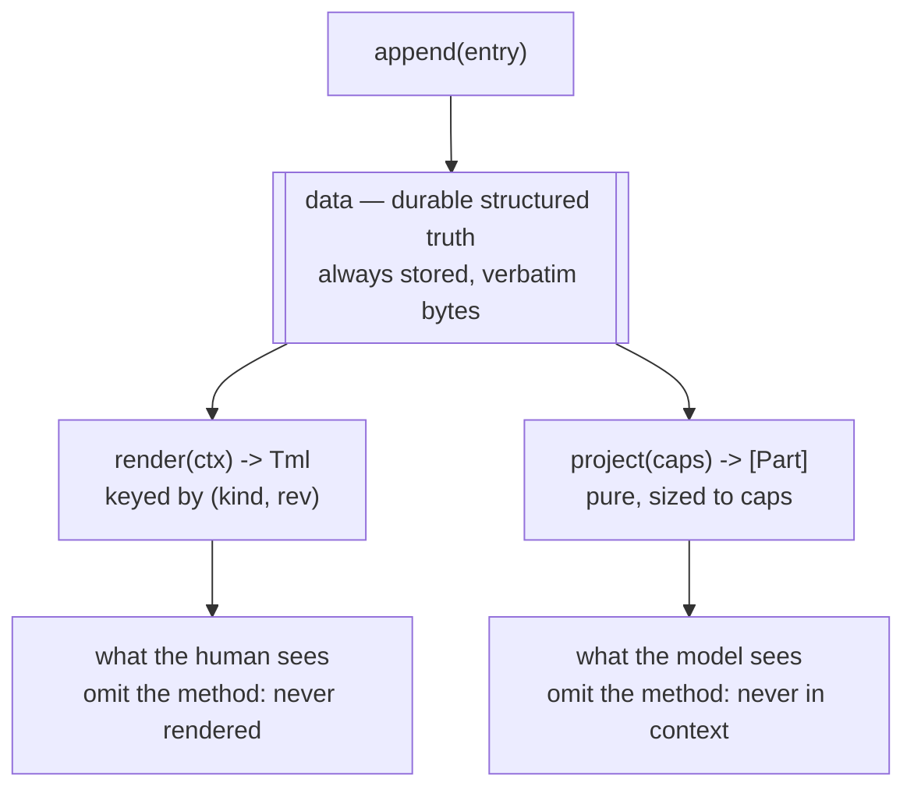
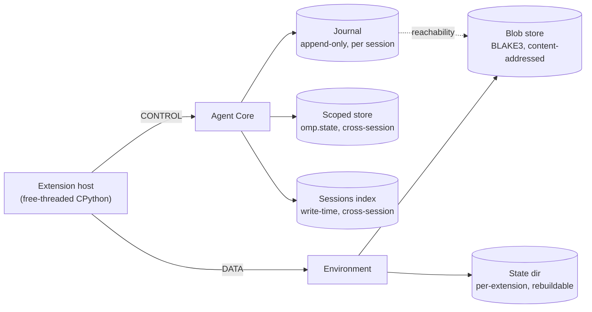

# Durable state, sessions, and the URL namespace

> **Design document, not a runtime API guarantee.** This corpus includes proposed
> interfaces and historical implementation observations. See
> [implementation status](implementation-status.md) for current owners and known gaps.

`omp.journal` · `omp.state` · `omp.sessions` · `omp.artifacts` · `omp.urls` · `omp.state_dir`

## Purpose

This namespace is where an extension's facts go to survive. `omp.journal` appends
typed, versioned entries into the session's append-only journal — the same journal
that holds every message, turn receipt, and durable call outcome
(`omp.CallOutcome`, `docs/py/02-verdicts.md`) — so an extension's state lives
inside session truth instead of beside it. `omp.state` is the same discipline
lifted above one session: a core-owned typed append log and content-addressed
store scoped `SESSION | PROJECT | USER | ORGANIZATION`, the sanctioned
replacement for every cross-session JSON-and-SQLite convention. `omp.sessions`
is the only sanctioned way to read history: other sessions, their journals, and
aggregate usage. `omp.artifacts` addresses large payloads by URL instead of
embedding them. `omp.urls` is the single namespace those addresses live in,
shared with files, web pages, devices, transcripts, and MCP resources — and it
is where the typed URL values `omp.ArtifactUrl`, `omp.HistoryUrl`, and
`omp.AgentUrl` are defined.

The pi failure this removes is the loose state file. pi gave extensions
`appendEntry(customType, data)` — no schema, no revision, no reader, no
projection control — and gave them nothing else. Extensions did what you would
expect: **127 of 194 catalogued packages own their own state files** under
`~/.pi`, `~/.cache`, or the working directory, and **16 parse session JSONL
directly off disk**. `@tmustier/pi-usage-extension` ships a hand-rolled
byte-level JSONL scanner, a 1024-byte prefix pattern matcher, a string-interning
table, and an mtime/size cache in `~/.pi/agent/usage-extension-cache.json` — all
to answer "how much did I spend," and all of it silently wrong the moment a
session lives on another machine. `@xaccefy/pi-xtodo` maintains *three* copies of
one todo list (an LRU-bounded in-memory map, a JSON file per session, and a
replay from transcript tool results) and reconciles them by picking whichever has
the highest `nextId`. Neither extension has a cross-process lock. Neither prunes.
Both are the correct response to an API that offered no alternative.

## Concepts

### One entry, three projections

Lesson #7 applies to journal entries exactly as it applies to tool calls: the
durable structured record is the truth, and everything anyone reads is a
projection of it. An entry kind is one Python class with up to three methods.



This maps one-to-one onto the durable shape that already exists in
`crates/storage/src/transcript/event.rs:334-343`:

```rust
Kind::Custom {
	kind:    Str,                  // declared entry-kind name
	data:    Option<Box<RawValue>>, // durable truth, verbatim bytes
	context: Option<Content>,      // materialized model-facing projection
	display: bool,                 // whether clients render it
}
```

`data` is stored as `Box<RawValue>`, so the bytes an extension sent are the bytes
on disk — no re-serialization, and `raweq.rs` gives byte equality for free. The
`context` field holds the *materialized* output of `project()` at append time:
materialization is what makes replay byte-stable, so prefix caches survive a
reload. `(kind, rev)` is stored alongside, so a model switch can re-materialize
history through `lift()` instead of showing a weak model entries written in a
dialect it never saw.

Three consequences fall out, and they answer the three shapes extensions
actually need:

| You want | Define | Result |
|---|---|---|
| Invisible bookkeeping (a watermark, a cache key) | `data` only | Durable, queryable, never rendered, never in context |
| An entry that renders but never enters model context | `data` + `render` | Human sees a component; the model's token budget is untouched |
| An entry the model should read (memory, observations) | `data` + `project` (+ `render`) | Budget-sized parts enter context; compaction drops them and keeps `data` |

### Four storage classes, three channels

There are exactly four durable places an extension may put bytes, and they are
not interchangeable.



| Class | Holds | Channel | Owner | Lost if deleted |
|---|---|---|---|---|
| **Journal** | Session-scoped truth | CONTROL | Agent Core | Everything. Never deleted per-entry. |
| **Scoped store** | Cross-session truth (`omp.state`) | CONTROL | Agent Core | Everything in that scope. Never deleted per-entry. |
| **Artifacts** | Payloads too large to inline | DATA (bytes) + CONTROL (identity) | Environment blob store | The payload. Reachability is decided by the journal. |
| **State dir** | Indexes, caches, embeddings | DATA | Environment filesystem | Nothing — rebuildable from the journal. |

`omp.journal`, `omp.state`, `omp.sessions`, and artifact *identity* ride CONTROL
because the Agent Core owns storage. Artifact *bytes* and the state dir ride
DATA because
the Environment owns the filesystem — which is why, when an extension is declared
by a remote workspace (see `docs/py/14-deploy.md`), its state dir lives on the
remote machine, beside the files it indexes, while its journal entries land in
the session wherever the Agent Core runs. There is no single local filesystem to
assume.

### The rule of thumb

> **Journal for session-scoped truth. Scoped store (`omp.state`) for truth that
> outlives one session. State dir for indexes and caches, keyed to a
> watermark.**

If losing the file would lose information, it belongs in the journal. If losing
the file would only cost you a rebuild, it belongs in the state dir. A state-dir
file that is the *only* copy of something is a bug — that is `pi-xtodo`'s
`~/.pi/xtodo/<id>.json`, and it is why two subagents mutating one todo list
silently overwrite each other.

The cross-session variant of the same bug is a state-dir file — or a JSON file
under `~/.omp` — that is the only copy of truth more than one session cares
about. That is what `omp.state` exists to make unnecessary.

### Durable-state consistency rules

These are enforced, not advisory.

1. **Append-only.** There is no update and no delete. A later entry supersedes an
   earlier one; the fold decides. The transcript never rewrites existing bytes —
   malformed lines survive as tombstones so physical indexes stay stable
   (`crates/storage/src/transcript/mod.rs:1-11`).
2. **One writer.** Only the Agent Core writes the journal. The host *requests*
   appends over CONTROL and receives the assigned index. There is no path by
   which two processes append concurrently, which is the entire class of bug that
   `usage-extension-cache.json` and `~/.pi/xtodo/` live in.
3. **No parallel source of truth.** State derivable from the journal MUST NOT
   also be stored as truth elsewhere. `pi-xtodo`'s three-way `settleState()`
   reconciliation exists only because pi had no rule here.
4. **Replay determinism.** Folding a kind's entries over the live chain is a pure
   function of those entries. Same entries, same state, on any machine, at any
   time. This forbids `data` that references mutable external state — a journal
   entry saying "see `cache.db` row 42" is not durable truth.
5. **Fail-closed durability.** If an append cannot be *proven* durable, it raises.
   The transcript writer already distinguishes a clean failure from an
   indeterminate one (`codec::Error::AppendRollback`, "partial bytes could not be
   rolled back"); the host surfaces the indeterminate case as
   `omp.JournalIndeterminate` and the session halts rather than continuing on
   unproven state.
6. **Watermarks, not guesses.** An index in the state dir records the journal
   index it is current through. Rebuild is always "replay from watermark," never
   "re-scan everything and hope mtimes were honest."
7. **Idempotent requests, fenced generations.** Every durable request — an
   append, a label, a scoped-store write, a blob adoption, a schedule, an
   approval — carries `request_id`, `idempotency_key`, `host_generation`, and
   `session_generation`. The contract is owned by `docs/py/00-overview.md`;
   this namespace applies it. After a hot reload or a reconnect, the core
   rejects frames from an old generation (`omp.StaleGeneration`) — for journal
   appends, schedules, provider replacement, process creation, blob adoption,
   and approvals alike — so an indeterminate operation retried under its
   idempotency key can never double-append.
8. **Stamped authorship.** Every extension-authored entry is stamped core-side,
   from the authenticated channel and never from a caller-supplied field, with
   the authenticated principal (`omp.Principal`, `docs/py/00-overview.md`) and
   the provenance septet (`omp.Provenance`, `docs/py/14-deploy.md`: publisher,
   extension id, version, artifact digest, layer, trust tier, generation). A
   fold over a corpus can always answer *who wrote this, from which build, at
   which trust tier* — and a compromised worker cannot claim to be someone
   else.

### What the core fixes at each invocation phase

Extension entries share the journal with the core's own per-call record, whose
facts are fixed at the transitions of `omp.InvocationPhase`
(`docs/py/03-params.md` owns the machine): the canonical `requested_args` at
`ARGS_FINALIZED`; the transformation trail, admission receipt, and frozen
`effective_args` at `ADMITTED`; the durable assistant item at
`ASSISTANT_ITEM_COMMITTED` — the only transition this document calls a commit;
the effect-authorization timestamp at `EFFECTS_AUTHORIZED`; and exactly one
durable `omp.CallOutcome` at `SETTLED`. Extension appends slot into that
timeline as durable Requests: within a tool invocation they are legal from
`EFFECTS_AUTHORIZED` — the phase at which a v1 device body starts executing, so
a device body may always append — and the per-symbol legality is generated from
`OperationSpec(minimum_phase, durability, cost, authority)`
(`docs/py/00-overview.md`).

### Versioning

Every entry kind carries `family@rev`, exactly like a device
(`docs/py/02-verdicts.md`). The rev never appears in anything the model reads; it
travels into the journal, the transcript, and every metric. This is Lesson #8
applied to extension data: without it, the accumulated corpus is write-only.
`@mrclrchtr/supi-cache` writes `supi-cache-turn` entries into pi sessions today
and cannot answer "did the fingerprint algorithm change between these two
records," because pi's `CustomEntry` is `{ type, customType, data }` and nothing
more.

## Reference

### `omp.journal`

#### `@omp.entry_kind(name, *, rev, display=None, spill=True)`

Declares one durable entry kind. Applied to a class — normally a frozen
dataclass — whose fields are the entry's schema. Runs at load time on CONTROL;
declaration is idempotent per `(name, rev)`.

**Arguments**

- `name: str` — globally unique, reverse-DNS namespaced (`dev.example.cache.turn`).
  The core reserves every name without a dot and every name beginning `omp.`.
  Registering a name owned by another extension raises `omp.EntryKindConflict`.
- `rev: str` — `"<family>.<n>"`, matching `omp_tool::Rev { family, n }`
  (`crates/tool/src/lib.rs:49-56`). `"v.1"` is the conventional first revision.
  Bumping `n` within a family means "same concept, changed shape"; a new family
  means "different concept."
- `display: bool | None` — force the `display` flag. `None` (default) derives it:
  `True` when the class defines `render`, `False` otherwise.
- `spill: bool` — when `True` (default), a `data` payload over
  `omp.journal.MAX_INLINE_BYTES` is stored whole as an artifact and the entry
  records an `omp.ArtifactRef` in its place. When `False`, an oversized payload
  raises `omp.EntryTooLarge` instead. Set `False` for entries that must be
  readable without a blob round-trip.

**Raises** `omp.EntryKindConflict`, `omp.SchemaError` (fields not serializable).

**Channel** CONTROL. **Latency class** per-session, load time. **Failure**
fail-closed — a declaration that does not land means the extension does not load.

**Recognized methods on the decorated class**

| Method | Signature | Meaning |
|---|---|---|
| `project` | `(self, caps: omp.PromptCaps) -> list[omp.Part] \| None` | Pure model-facing projection, sized to `caps`. Returning `None` keeps this instance out of context. Absent entirely means the kind never enters context. |
| `render` | `(self, ctx: omp.ui.RenderCtx) -> omp.ui.Tml` | Human projection, registered under `(name, rev)`. Absent means `display=False`. |
| `lift` | `@staticmethod (from_rev: str, raw: bytes) -> Self \| None` | Re-express an entry written at an older rev as this rev. `None` means "cannot be lifted"; the entry then projects through its own recorded rev. |

`omp.PromptCaps` and `omp.Part` are defined in `docs/py/02-verdicts.md`;
`omp.ui.RenderCtx` and `omp.ui.Tml` in `docs/py/07-ui.md`.

```python
from dataclasses import dataclass
import omp

@omp.entry_kind("dev.mrclrchtr.cache.turn", rev="v.3")
@dataclass(frozen=True, slots=True)
class CacheTurn:
    turn_id: str
    prompt_fingerprint: str
    cache_read: int
    cache_write: int
    input_tokens: int

    @property
    def hit_rate(self) -> float:
        served = self.cache_read + self.input_tokens
        return self.cache_read / served if served else 0.0

    def render(self, ctx: omp.ui.RenderCtx) -> omp.ui.Tml:
        tone = "ok" if self.hit_rate > 0.7 else "warn"
        return ctx.row(
            ctx.icon("cache"),
            ctx.text(f"{self.hit_rate:.0%} cache", tone=tone),
            ctx.dim(self.prompt_fingerprint[:8]),
        )

    @staticmethod
    def lift(from_rev: str, raw: bytes) -> "CacheTurn | None":
        if from_rev != "v.2":
            return None
        old = omp.journal.decode(raw)          # v.2 had no input_tokens
        return CacheTurn(
            turn_id=old["turn_id"],
            prompt_fingerprint=old["fp"],
            cache_read=old["cache_read"],
            cache_write=old["cache_write"],
            input_tokens=0,
        )
```

`CacheTurn` renders in the transcript and never costs the model a token: it
defines `render`, not `project`. That is the "renders but never enters model
context" shape, and it is one method away from the other two.

#### `omp.journal.append(entry, *, display=None, idempotency_key=None) -> omp.EntryId`

Appends one declared entry to the current session's journal. Returns after the
core has assigned and durably recorded the index.

This is a **Request** — acknowledged and durable — not an Effect. Revision 1 of
this design (and the overview's channel table) classified `journal.append` as
an effect, which its own contract contradicted: an operation that blocks for an
assigned index and a durability acknowledgement is not fire-and-forget. The
classification is corrected here and in `docs/py/00-overview.md`, whose
`OperationSpec` for this symbol reads `minimum_phase=EFFECTS_AUTHORIZED,
durability=DURABLE`.

**Arguments**

- `entry` — an instance of a class declared with `@omp.entry_kind`. Typed
  declared instances are the *only* accepted payload: a raw string, a dict, or
  any undeclared object raises `omp.UnknownEntryKind`. There is no schemaless
  escape hatch, because pi's `appendEntry(customType, data)` is the proof of
  where one leads.
- `display: bool | None` — override the kind's declared `display` for this
  instance. Useful for entries that are usually noise but occasionally
  interesting.
- `idempotency_key: str | None` — caller-chosen key making a retry safe: an
  append replayed under the same key returns the originally assigned
  `omp.EntryId` and appends nothing. The SDK stamps `request_id`,
  `host_generation`, and `session_generation` on the frame regardless
  (consistency rule 7).

**Encoding.** The host encodes the instance once, canonically — UTF-8, sorted
keys, no NaN or infinity, no cosmetic whitespace — and those bytes are what the
core stores verbatim. Canonical encoding is what makes `raweq.rs`'s byte
equality meaningful and replay byte-stable, and it is the encoding strict
decode later checks against.

**Returns** `omp.EntryId`.

**Raises** `omp.UnknownEntryKind` (undeclared type, or not a declared instance
at all), `omp.EntryTooLarge`, `omp.StaleGeneration` (old-generation frame after
a reload; rule 7), `omp.JournalIndeterminate` (durability unproven — the
session is halting), `omp.JournalError`.

**Channel** CONTROL. **Latency class** per-event; RTT is tens of µs plus one
buffered line append. Safe per turn and per tool call; not safe per token.
**Failure** fail-closed.

```python
entry_id = omp.journal.append(CacheTurn(
    turn_id=event.turn_id,
    prompt_fingerprint=fp,
    cache_read=event.usage.cache_read,
    cache_write=event.usage.cache_write,
    input_tokens=event.usage.input,
))
```

#### `async omp.journal.append_many(entries, *, idempotency_key=None) -> list[omp.EntryId]`

Appends several entries as one CONTROL round trip, in the order given. Indexes
are contiguous. **Not a transaction**, and the name now says so: a failure
partway leaves the successful prefix appended and raises with
`omp.JournalError.appended` holding the ids that landed. Use it for a
background pipeline that produced a burst of observations, not to paper over a
design that appends per token. When a durable prefix is unacceptable, use
`append_atomic`.

Revision 1 called this `append_batch`. "Batch" reads as atomic to roughly half
its audience, and a durable API whose name suggests a guarantee it does not
make is a defect; the rename keeps the semantics and fixes the promise.

**Channel** CONTROL. **Latency class** per-event. **Failure** fail-closed.

#### `async omp.journal.append_atomic(entries, *, idempotency_key) -> list[omp.EntryId]`

All or nothing. Either every entry lands, with contiguous indexes, or the
journal is unchanged. The core stages every encoded line and commits at one
durability point; the writer's existing rollback discipline
(`codec::Error::AppendRollback` distinguishes clean rollback from
indeterminate) is what makes "unchanged" provable. `idempotency_key` is
**required**: an atomic group replayed after an indeterminate outcome or a
reconnect returns the originally assigned ids and appends nothing, which is the
property that makes retrying it safe at all.

**Arguments** `entries` — declared instances, at most
`omp.journal.MAX_ATOMIC_ENTRIES`; `idempotency_key: str` — required.

**Raises** everything `append` raises, plus `omp.JournalError` when the group
exceeds `MAX_ATOMIC_ENTRIES`. On any failure short of
`omp.JournalIndeterminate`, the journal is unchanged.

**Channel** CONTROL. **Latency class** per-event. **Failure** fail-closed.

#### `omp.journal.entries(kind=None, *, rev=None, since=None, limit=None, live=True) -> Sequence[omp.JournalEntry]`

Reads this session's own entries. An extension may read any kind in a namespace
it declared, plus core entry kinds; reading another extension's namespace raises
`omp.EntryAccessDenied` unless the manifest requests it (see
`docs/py/00-overview.md` for manifest keys).

**Arguments**

- `kind: str | type | None` — filter to one declared kind. `None` returns every
  readable kind.
- `rev: str | None` — filter to one revision. Omit to receive every revision,
  each lifted to the live rev where `lift` permits.
- `since: omp.EntryId | None` — exclusive lower bound. This is the watermark
  argument; pass the id your index is current through.
- `limit: int | None` — most recent N after filtering.
- `live: bool` — when `True` (default), only entries on the live chain, so
  rewinds and resets are respected. When `False`, every physical entry including
  abandoned branches.

**Returns** entries in ascending index order.

**Channel** CONTROL. **Latency class** per-command. **Failure** fail-closed — an
error raises rather than returning an empty sequence, because "no entries" and
"could not read entries" must never be confused by a fold.

#### `omp.journal.latest(kind) -> omp.JournalEntry | None`

The highest-index live entry of one kind, or `None`. The common case for
latest-wins state; equivalent to `entries(kind, limit=1)[0]` but resolved
core-side without shipping the intermediate rows.

**Channel** CONTROL. **Latency class** per-command. **Failure** fail-closed.

#### `omp.journal.fold(kind, reducer, initial, *, since=None) -> tuple[T, omp.EntryId | None]`

Folds a kind's live entries left-to-right and returns the accumulator together
with the last index folded. The returned id is the watermark to persist. `reducer`
must be pure — rule 4 above is what makes this reproducible.

```python
def apply(state: TodoState, entry: omp.JournalEntry) -> TodoState:
    return state.with_mutation(entry.value)

state, watermark = omp.journal.fold(TodoMutation, apply, TodoState.empty())
```

**Channel** CONTROL. **Latency class** per-command. **Failure** fail-closed.

#### `omp.journal.label(target, label) -> omp.EntryId`

Attaches, replaces, or clears (`label=None`) a short label on an earlier entry by
appending a `Label` event — never by editing the target. Labels are the sanctioned
way to annotate history; they are what the session picker and the HTML export
read. Backed by `Kind::Label` (`event.rs:326-332`).

**Raises** `omp.JournalError` when `target` is not an addressable index.

**Channel** CONTROL. **Latency class** per-event. **Failure** fail-closed.

#### `async omp.journal.label_of(target) -> str | None`

Returns the latest live label assignment for an addressable entry. A durable
clear written by `label(target, None)` resolves to `None`; callers never need
to scan `Label` events or guess whether a later rewind abandoned an assignment.

**Channel** CONTROL. **Latency class** per-command. **Failure** fail-closed.

#### `omp.journal.decode(raw) -> Any`

Parses the verbatim `data` bytes of an entry into plain Python values. Only
useful inside `lift`, where the source rev's class no longer exists in the
extension. **Strict**: the bytes must be exactly the canonical encoding the
host wrote; anything else raises `omp.EntryUndecodable`, and the underlying
record is preserved untouched as a corrupt/unknown entry — `raw` intact,
`value` `None` — never repaired, never dropped.

Revision 1 said the opposite: that `decode` was "tolerant in exactly the way
argument decoding is," accepting trailing commas and truncation. That was
wrong, and the review is right about why: charitable decoding exists for
*surface syntax a model typed* (`docs/py/03-params.md`, and only up to
`ARGS_FINALIZED`); journal bytes are machine-written by this SDK's own
canonical encoder, so a trailing comma in durable truth is not a typo to
forgive — it is corruption to surface. A reader that silently "repairs"
machine-written truth converts a detectable storage fault into an undetectable
data fault.

#### `omp.JournalEntry`

| Field | Type | Meaning |
|---|---|---|
| `id` | `omp.EntryId` | Physical index within the session. |
| `kind` | `str` | Declared entry-kind name. |
| `rev` | `str` | Revision the entry was written at. |
| `ts` | `int` | Epoch milliseconds. |
| `principal` | `omp.Principal` | Authenticated principal that appended it, stamped core-side (`docs/py/00-overview.md`; rule 8). |
| `provenance` | `omp.Provenance` | Provenance septet of the writing extension — publisher, extension id, version, artifact digest, layer, trust tier, generation (`docs/py/14-deploy.md`). Stamped core-side; unforgeable. |
| `value` | `Any \| None` | Decoded instance of the declared class, lifted to the live rev when `lift` allowed it. `None` when the kind is no longer declared, or when the bytes fail strict decode — a corrupt/unknown record, preserved verbatim, never repaired. |
| `raw` | `bytes` | Verbatim `data` bytes as stored. |
| `display` | `bool` | Whether clients render it. |
| `in_context` | `bool` | Whether a materialized projection was stored. |
| `artifact` | `omp.ArtifactRef \| None` | Set when `data` was spilled. |

`value` and `raw` are both present because Lesson #7's honesty rule applies here
too: the decoded, possibly-lifted view is what you compute with, and the raw
bytes are what you audit. Revision 1 carried a bare `source: str` extension id
in place of `principal` and `provenance`; it is subsumed by them, because
"which extension" was never enough — the corpus question is *which build of
which extension, at which trust tier, written by whom*, and a string id
answers none of that.

#### `omp.EntryId`

Opaque, totally ordered, comparable, hashable, and `str()`-able as
`"<session_id>:<index>"`. `index` is the physical journal index — line number
minus one — which is stable across reloads because tombstones are never dropped.

| Field | Type |
|---|---|
| `session` | `str` |
| `index` | `int` |

#### Constants

| Constant | Value | Meaning |
|---|---|---|
| `omp.journal.MAX_INLINE_BYTES` | `65_536` | `data` above this spills to an artifact when the kind declares `spill=True`. Chosen to match the verdict spill gate in `docs/py/02-verdicts.md`, so one budget governs both. |
| `omp.journal.MAX_ENTRY_BYTES` | `16_777_216` | Hard ceiling. An entry over this raises `omp.EntryTooLarge` regardless of `spill`; past 16 MiB you wanted an artifact and a small entry pointing at it. |
| `omp.journal.MAX_LABEL_BYTES` | `256` | Label length ceiling. |
| `omp.journal.MAX_ATOMIC_ENTRIES` | `1_024` | Ceiling on one `append_atomic` group. A transaction needs a bound; past it the design wants a fold, not a bigger transaction. |

#### Exceptions

| Exception | Base | Raised when |
|---|---|---|
| `omp.JournalError` | `omp.OmpError` | Base for this namespace. Carries `appended: list[EntryId]` for partial `append_many` groups. |
| `omp.UnknownEntryKind` | `omp.JournalError` | Appending an instance of an undeclared class. |
| `omp.EntryKindConflict` | `omp.JournalError` | Declaring a name owned by the core or another extension. |
| `omp.SchemaError` | `omp.JournalError` | A declared class has non-serializable fields. |
| `omp.EntryTooLarge` | `omp.JournalError` | Payload over `MAX_ENTRY_BYTES`, or over `MAX_INLINE_BYTES` with `spill=False`. |
| `omp.EntryAccessDenied` | `omp.JournalError` | Reading a namespace the manifest does not grant. |
| `omp.JournalIndeterminate` | `omp.JournalError` | Durability could not be proven. The session is halting; do not retry. |
| `omp.EntryUndecodable` | `omp.JournalError` | An entry's `data` bytes fail strict decode against the recorded `(kind, rev)`. The record is preserved as corrupt/unknown — `raw` intact, `value` `None`. |
| `omp.StateScopeDenied` | `omp.JournalError` | An `omp.state` operation names a scope the manifest or org policy does not grant. |
| `omp.StaleGeneration` | `omp.OmpError` | A durable request carried an old `host_generation`/`session_generation` after a reload or reconnect. Owned, with the fencing contract, by `docs/py/00-overview.md`. |

### `omp.state`

Durable truth that outlives one session. The journal's rule — typed, versioned,
append-only, one writer — is exactly right, and Revision 1 left everything
beyond the session out of scope, which would have reproduced pi's disease one
level up: the **127 of 194 catalogued packages** that own state files are
overwhelmingly holding *cross-session* state, because there was nowhere
sanctioned to put it. `usage-extension-cache.json` spans sessions; so does
every `~/.pi` JSON and SQLite convention in the catalogue. `omp.state` is the
sanctioned replacement: a core-owned typed append log and content-addressed
store, scoped.

#### `omp.StateScope`

| Member | The log/store spans | Writer |
|---|---|---|
| `SESSION` | One session. An alias for the session journal itself — same entries, same ids. | Agent Core |
| `PROJECT` | Every session of one normalized project root. | Agent Core |
| `USER` | Every project of one authenticated principal on one daemon. | Agent Core |
| `ORGANIZATION` | Org-distributed state; writes require an org-level grant. | Agent Core |

Every durable-state consistency rule above applies to every scope verbatim:
append-only, one writer (the core), no parallel source of truth, replay
determinism, fail-closed durability, watermarks, idempotency, stamped
authorship. Two sessions appending to one `PROJECT` log race only for index
order — the core assigns indexes in one critical section, so there is a total
order and no lost update, which is the property `pi-xtodo`'s three-way
reconciliation existed to fake.

#### `omp.state.append(entry, *, scope, idempotency_key=None) -> omp.StateEntryId`

Appends a declared entry — the same `@omp.entry_kind` machinery, including
`rev` and `lift` — to the scoped log. A Request, acknowledged and durable,
carrying the rule-7 stamp. Namespace scoping matches the journal: an extension
appends its own kinds, and reading another's requires a manifest grant.
`ORGANIZATION` writes additionally require the org grant and raise
`omp.StateScopeDenied` without it.

**Channel** CONTROL. **Latency class** per-event. **Failure** fail-closed.

#### `omp.state.entries(kind, *, scope, since=None, limit=None) -> Sequence[omp.StateEntry]`

#### `omp.state.latest(kind, *, scope) -> omp.StateEntry | None`

#### `omp.state.fold(kind, reducer, initial, *, scope, since=None) -> tuple[T, omp.StateEntryId | None]`

Scoped mirrors of the journal read surface, with identical semantics: ascending
order, strict decode, lift to the live rev, fail-closed reads, and a returned
watermark from `fold`. `omp.StateEntry` is `omp.JournalEntry` minus the
session-bound fields (`id` is an `omp.StateEntryId`; there is no `in_context`
or `display`, because scoped entries never enter a session's model context —
projection into context is the journal's job). `omp.StateEntryId` is opaque,
totally ordered within its scope instance, hashable, and `str()`-able.

**Channel** CONTROL. **Latency class** per-command. **Failure** fail-closed.

#### `async omp.state.cas_put(data, *, scope) -> omp.BlobRef`

#### `async omp.state.cas_get(ref, *, scope) -> bytes`

The content-addressed half, for immutable values too large or too cold for log
entries: embedding shards, compiled rule sets, model-weight manifests. Same
BLAKE3 addressing as the blob store (`omp.BlobRef`, `docs/py/11-env.md`);
retention is rooted in the scope rather than in a session journal, so a
`PROJECT` value lives as long as the project retains it. The reachability
discipline applies unchanged: a CAS value referenced by no scoped log entry is
sweepable.

**Channel** CONTROL (identity) + DATA (bytes). **Failure** fail-closed.

#### What this replaces, and what it does not

`omp.state` replaces every hand-rolled cross-session file: the usage cache, the
todo directory, `sessions.db`. It does **not** replace the state dir —
`omp.state_dir()` remains rebuildable-index-only, and an index over scoped-log
entries belongs there exactly as an index over journal entries does, keyed to a
`StateEntryId` watermark. And it is **not** an RPC substrate: two extensions
that want to talk use `@omp.service` / `omp.services.connect`
(`docs/py/00-overview.md`), never a polled log.

**Exceptions** `omp.StateScopeDenied`; otherwise the `omp.JournalError` family
applies unchanged.

### `omp.sessions`

The sanctioned historical read API. It exists because 16 catalogued packages glob
`~/.pi/agent/sessions/**/*.jsonl` and parse it themselves, and every one of them
breaks under any of: a remote Agent Core, a non-file backend, a private layout
change, or an actively-appending file. Lesson #4 is the reason this is not
negotiable — multiple and remote instances are first-class, so the on-disk layout
is private and reading it directly is prohibited.

`@tmustier/pi-usage-extension` is the honest measure of the cost of not having
this: a recursive directory walk, a 1024-byte prefix scanner over four hardcoded
byte patterns (`"role":"assistant"`, `"type":"compaction"`,
`"type":"branch_summary"`, `"type":"thinking_level_change"`), an allocation-free
byte parser for tool results over 64 KB, a string-interning table, a
`CACHE_VERSION = 5` on-disk cache keyed by `(size, mtimeMs)`, and a
`try { JSON.parse } catch { skip }` that silently drops the torn last line of
every live session. Every line of it is competent. All of it is a query.

#### `omp.sessions.current() -> omp.SessionInfo`

Metadata for the session this extension is running in. Cheap; served from core
state without touching storage.

**Channel** CONTROL. **Latency class** per-command. **Failure** fail-closed.

#### `async omp.sessions.list(filter=None) -> Sequence[omp.SessionInfo]`

Lists sessions the caller may see, newest activity first.

**Arguments** `filter: omp.SessionFilter | None` — `None` means every session in
the current project.

**Channel** CONTROL. **Latency class** per-command; served from the write-time
index, so it is not a directory scan. **Failure** fail-closed.

#### `async omp.sessions.get(session_id) -> omp.SessionInfo`

One session's metadata. **Raises** `omp.SessionNotFound`.

#### `async omp.sessions.journal(session_id, *, kinds=None, since=None, until=None, live=True) -> AsyncIterator[omp.JournalEntry]`

Streams another session's journal. Entries arrive in ascending index order and
are decoded and lifted the same way `omp.journal.entries` decodes this session's.

**Arguments**

- `kinds: Sequence[str] | None` — filter core-side. Filtering core-side is the
  point: an extension indexing a million turns should not receive them.
- `since` / `until: omp.EntryId | int | None` — bounds, exclusive lower and
  inclusive upper.
- `live: bool` — live chain only, or every physical entry.

**Channel** CONTROL, streamed. **Latency class** per-command; back-pressured, so
a slow consumer slows the scan rather than buffering it. **Failure** fail-closed.
**Cancellation** the stream is scoped to a `RunGuard`; abandoning the iterator
drops the guard and the core stops scanning. There is no orphaned scan.

```python
async for entry in omp.sessions.journal(sid, kinds=["omp.turn_receipt"], since=mark):
    index.insert(entry)
    mark = entry.id
```

#### `async omp.sessions.usage(query) -> omp.UsageReport`

Aggregate token and cost accounting over sessions. This is a query against the
index the core maintains as it writes turn receipts — not a re-parse. Answering
"cost by model over 30 days" reads rows, never journals.

**Arguments** `query: omp.UsageQuery`.

**Channel** CONTROL. **Latency class** per-command. **Failure** fail-closed.

#### `async omp.sessions.lineage(session_id) -> Sequence[omp.SessionLink]`

The fork/handoff chain reaching a session, oldest first. Backed by
`Kind::ForkedFrom` (`event.rs:277-283`), so it is durable lineage rather than
inference from filenames — which is what pi's advisor/subagent classifier had to
do, keying off `__advisor.jsonl` basenames and path layout.

#### `async omp.sessions.tree(session_id=None) -> tuple[omp.SessionNode, ...]`

Materializes the physical journal as immutable root nodes in durable order.
Each `SessionNode` has `id`, `parent`, `kind`, `ts`, `data`, resolved `label`,
and nested `children`. Rewinds form sibling branches. Broken parent references
are returned as additional roots rather than dropping durable records.

#### `async omp.sessions.branch(from_id=None) -> tuple[omp.SessionNode, ...]`

Returns one root-first path. `from_id` accepts an `EntryId` (including another
visible session) or a non-negative physical index in the current session.
Omitting it selects the current live leaf. An unknown entry returns an empty
path.

#### `omp.sessions.SessionSetup` and `async omp.sessions.create(setup=SessionSetup())`

`SessionSetup` is a frozen declarative value:

```python
setup = omp.sessions.SessionSetup(
    title="Review follow-up",
    parent=omp.sessions.current().id,
    entries=(ReviewState(findings=3),),
    initial_prompt="Continue from the recorded findings.",
)
created = await omp.sessions.create(setup)
```

`entries` accepts only instances of classes declared by the calling extension's
`@omp.entry_kind`. `initial_prompt` is text or a tuple of visible
`omp.Part.text()` / `omp.Part.blob()` values and becomes exactly one visible
user journal item. It never submits a turn, enqueues work, starts a model
request, or encodes hidden context.

Creation is one atomic create/seed/switch transaction. Before allocating
anything, Core validates parent access, declaration ownership, quotas,
invocation phase, and UI state. It stages the header, durable lineage, optional
user title, typed entries, and optional prompt in that order. Journal
publication plus the write-time index/idempotency receipt is the durability
point; only then does the existing interactive owner switch the UI once.
`list`, `get`, `lineage`, `journal`, and `resume` immediately observe the
complete result.

Only an idle, user-initiated interactive `@omp.command` invocation at
`EFFECTS_AUTHORIZED` is admitted. Hooks, tools, shortcuts, headless/RPC
commands, subagents, and a transitioning UI raise
`omp.SessionTransitionDenied` without creating anything. Pre-durability failure
rolls back and leaves the old session current. If durability or switch
acknowledgement is ambiguous, Core fuses the generation- and invocation-bound
idempotency identity and raises `omp.SessionTransitionIndeterminate`; retry
cannot create a duplicate.

No session manager or mutable journal handle crosses CONTROL. A command may
immediately queue the first turn with
`await omp.agents.inject(prompt, session=created.id)` after `create` returns;
the target is accepted only for the authenticated client that created it.
See the create → switch → inject recipe in `docs/py/12-agents.md`. Later
automation can use a durable schedule after the user reaches the new session.

| Symbol | Kind / trigger | `OperationSpec` |
|---|---|---|
| `omp.sessions.SessionSetup` | Declare / static; no manifest row | `minimum_phase=OPEN`, `durability=EPHEMERAL`, `cost=NONE`, `authority=CORE` |
| `omp.sessions.create` | Request / static; no manifest row | `minimum_phase=EFFECTS_AUTHORIZED`, `durability=DURABLE`, `cost=NONE`, `authority=CORE` |

#### Historical session mutation

Historical-session management uses named CONTROL requests; the extension never
opens, rewrites, renames, or removes journal files itself.

| Signature | Semantics | Effect channel | Failure modes |
|---|---|---|---|
| `async get(session_id) -> omp.SessionInfo` | Return the visible indexed row for one stable id. | CONTROL request; no mutation. | `omp.SessionNotFound`; access and host failures fail closed. |
| `async lineage(session_id) -> Sequence[omp.SessionLink]` | Return the durable parent chain, oldest first. | CONTROL request; no mutation. | `omp.SessionNotFound`; access and host failures fail closed. |
| `async omp.sessions.resume(session_id) -> omp.SessionInfo` | Make the historical interactive session current and return its refreshed index row. | CONTROL request; the Core journals a resume receipt before acknowledging. | `omp.SessionNotFound`; non-interactive, access, and host failures fail closed. |
| `async omp.sessions.rename(session_id, title) -> omp.SessionInfo` | Assign a user title and return the refreshed immutable index row. | CONTROL request; the Core journals the rename receipt before acknowledging. | `omp.SessionNotFound`; invalid titles, access, and host failures fail closed. |
| `async delete(session_id) -> None` | Permanently remove the session selected by an approved deletion ticket. | Approval-gated CONTROL request. | `omp.PermissionDenied` without the matching approval grant; `omp.SessionNotFound`; host failures fail closed. |

`delete` never bypasses policy. An extension offering deletion emits the durable
human-approval ticket, and the Core executes the storage mutation only after that
ticket is approved. Calling `delete` without the matching grant raises
`omp.PermissionDenied`; there is no force flag, implicit confirmation, or
extension-owned filesystem fallback.

`SessionLink` is a frozen value with `id: str`, `parent: str | None`, and
`at: int | None`. `id` uses the same stable identifier as `SessionInfo.id`,
`parent` uses the same immediate-parent projection as `SessionInfo.parent`, and
`at` is the source journal index recorded by `Kind::ForkedFrom`.

**Resolved (2026-08-20 ruling):** These CONTROL verbs, typed lineage links, and
the approval-gated deletion contract resolve the Round 4 session-mutation design
gap. Resume and rename are durable acknowledged requests: their receipts are
journaled before their refreshed rows are returned.

#### `omp.SessionInfo`

| Field | Type | Meaning |
|---|---|---|
| `id` | `str` | Stable session identifier. |
| `title` | `str \| None` | Assigned title. |
| `title_source` | `omp.TitleSource` | Who assigned it. |
| `cwd` | `omp.EnvPath` | Working directory at creation, in that session's environment namespace (`docs/py/11-env.md`). |
| `project` | `str` | Normalized project root, worktree suffixes stripped. |
| `created_ms` | `int` | Creation time. |
| `updated_ms` | `int` | Last append time. |
| `status` | `omp.SessionStatus` | Terminal disposition. |
| `kind` | `omp.SessionKind` | Interactive, subagent, or advisor. |
| `parent` | `str \| None` | Immediate lineage parent. |
| `entries` | `int` | Physical entry count, tombstones included. |
| `turns` | `int` | Completed turn receipts. |
| `usage` | `omp.Usage` | Rolled-up token counts. |
| `cost` | `omp.sessions.Cost` | Rolled-up cost. |
| `models` | `Sequence[str]` | Distinct `provider/model` used. |
| `remote` | `bool` | Whether the session's environment was remote. |

`remote` is here on purpose: an extension that assumes local files needs to be
able to see that it is wrong.

#### `omp.SessionFilter`

| Field | Type | Default | Meaning |
|---|---|---|---|
| `project` | `str \| None` | current | Project root. `""` means every project. |
| `since_ms` | `int \| None` | `None` | Lower bound on `updated_ms`. |
| `until_ms` | `int \| None` | `None` | Upper bound on `updated_ms`. |
| `status` | `Sequence[omp.SessionStatus] \| None` | `None` | Terminal dispositions to include. |
| `kind` | `Sequence[omp.SessionKind] \| None` | `(INTERACTIVE,)` | Session kinds. Subagents are excluded by default because including them double-counts usage. |
| `contains_kind` | `str \| None` | `None` | Only sessions containing at least one entry of this kind. Lets an extension find its own sessions without scanning them. |
| `limit` | `int` | `200` | Row cap. |

#### `omp.UsageQuery`

| Field | Type | Default | Meaning |
|---|---|---|---|
| `since_ms` | `int \| None` | `None` | Lower time bound. |
| `until_ms` | `int \| None` | `None` | Upper time bound. |
| `group_by` | `Sequence[omp.GroupBy]` | `(GroupBy.MODEL,)` | Grouping keys, applied in order. |
| `bucket` | `omp.Bucket` | `Bucket.NONE` | Time bucketing for series output. |
| `filter` | `omp.SessionFilter \| None` | `None` | Session scope. |
| `include_subagents` | `bool` | `True` | Whether subagent usage rolls into its parent. |

#### `omp.UsageReport`

| Field | Type | Meaning |
|---|---|---|
| `total` | `omp.UsageBucket` | Grand total. |
| `groups` | `Sequence[omp.UsageBucket]` | One per distinct grouping key. |
| `series` | `Sequence[omp.UsageBucket]` | One per time bucket; empty when `bucket=NONE`. |
| `sessions` | `int` | Sessions contributing. |
| `truncated` | `bool` | Whether the filter's `limit` clipped the scope. |

#### `omp.UsageBucket`

| Field | Type | Meaning |
|---|---|---|
| `key` | `Mapping[str, str]` | Grouping key values (`{"model": "anthropic/claude-opus-5"}`). |
| `start_ms` | `int \| None` | Bucket start, for series rows. |
| `usage` | `omp.Usage` | Token counts. |
| `cost` | `omp.sessions.Cost` | Cost. |
| `requests` | `int` | Inference requests. |
| `errors` | `int` | Failed requests. |
| `duration` | `omp.Duration` | Summed wall time. `omp.Duration` is the single duration value type (`docs/py/00-overview.md`); millisecond ints and float seconds are gone from public signatures. |

#### `omp.Usage`

Mirrors `omp.inference.v1.Usage` (`crates/proto/proto/omp/inference/v1/common.proto:66-90`),
which is the authoritative accounting shape — not the narrower four-field
`omp_storage::transcript::Usage` (`types.rs:40-51`) that the journal records per
turn. Aggregation must not flatten to the narrow form: `reasoning_tokens` and
`premium_requests` are separately billed, and cache reads and cache writes price
differently, so collapsing any of them is how cost dashboards start lying.

| Field | Type | Meaning |
|---|---|---|
| `input` | `int` | Non-cached input tokens. |
| `output` | `int` | Generated output tokens. |
| `cache_read` | `int` | Input tokens served from a provider cache. |
| `cache_write` | `int` | Input tokens written into a provider cache. |
| `reasoning` | `int` | Reasoning/thinking output tokens, where the provider reports them separately. |
| `premium_requests` | `int` | Provider-metered premium request count. |
| `context` | `int \| None` | Context-window occupancy observed for the request. |
| `total` | `int` | Provider-reported total when present, else the sum. |
| `accuracy` | `omp.UsageAccuracy` | Whether these counts are exact, estimated, or mixed. |
| `detail` | `Mapping[str, int \| str]` | Vendor-namespaced raw breakdown, integers kept exact. |

`accuracy` is not decoration. An aggregate mixing exact provider counts with
locally estimated ones is a different number than either, and a dashboard that
cannot say which it is showing invites the user to trust it more than it deserves.

#### `omp.UsageAccuracy`

Mirrors `omp.inference.v1.Usage.Accuracy`.

| Member | Meaning |
|---|---|
| `EXACT` | Every contributing count came from the provider. |
| `ESTIMATED` | Every contributing count was computed locally. |
| `MIXED` | Both, so the aggregate is neither. |

#### `omp.sessions.Cost`

Mirrors `omp.inference.v1.Cost` (`common.proto:108-117`). Cost is carried as
**integer nano-USD**, not a float, because a summed corpus of millions of
requests through IEEE-754 loses cents and then dollars. `usd` is a convenience
for display only; never aggregate on it.

| Field | Type | Meaning |
|---|---|---|
| `nanos_usd` | `int` | Total cost in nano-USD. Authoritative. |
| `estimated` | `bool` | `True` when computed from catalog rates rather than billed in-band. |
| `input_nanos_usd` | `int \| None` | Input-side component when the provider itemizes. |
| `output_nanos_usd` | `int \| None` | Output-side component. |
| `usd` | `float` | `nanos_usd / 1e9`. Display only. |

#### `omp.SessionStatus`

| Member | Meaning |
|---|---|
| `COMPLETE` | Last turn settled with a receipt. |
| `INTERRUPTED` | User aborted the last turn. |
| `ABORTED` | Last turn settled as `TurnAbort` without a gateway outcome. |
| `ERROR` | Last turn recorded a request failure. |
| `PENDING` | A started turn has no terminal receipt; the session may be live. |
| `UNKNOWN` | Disposition not derivable. |

#### `omp.SessionKind`

| Member | Meaning |
|---|---|
| `INTERACTIVE` | A session a user drove. |
| `SUBAGENT` | Spawned by `omp.agents` (`docs/py/12-agents.md`). |
| `ADVISOR` | Background advisory session. |

#### `omp.GroupBy`

| Member | Groups by |
|---|---|
| `MODEL` | `provider/model`. |
| `PROVIDER` | Provider alone. |
| `PROJECT` | Normalized project root. |
| `SESSION` | Session id. |
| `KIND` | `omp.SessionKind`. |

#### `omp.Bucket`

| Member | Bucket width |
|---|---|
| `NONE` | No series output. |
| `HOUR` | One UTC hour. |
| `DAY` | One UTC day. |
| `WEEK` | Seven UTC days from the Unix epoch. |
| `MONTH` | One UTC calendar month. |

#### `omp.TitleSource`

Identifies which frozen Python authority assigned the indexed title.

| Member | Meaning |
|---|---|
| `USER` | Set explicitly by a person. |
| `MODEL` | Generated by a model. |
| `SYSTEM` | Assigned by the runtime. |

#### Exceptions

| Exception | Base | Raised when |
|---|---|---|
| `omp.SessionError` | `omp.OmpError` | Base for this namespace. |
| `omp.SessionNotFound` | `omp.OmpError` | No such session, or not visible to the caller. |
| `omp.SessionAccessDenied` | `omp.SessionError` | The manifest does not grant historical reads. |

### `omp.artifacts`

An artifact is a payload addressed by URL instead of embedded. The spill gate that
*decides* when a verdict becomes an artifact belongs to
`docs/py/02-verdicts.md`, along with `omp.ArtifactRef`'s field list. This section
owns the namespace: how you mint one deliberately, how you read and slice it, and
how long it lives.

#### Reachability is the retention rule

> **A blob is reachable if and only if a journal entry or a verdict references
> it.**

Content-addressing already makes writes idempotent and cross-session deduplicated
(`crates/storage/src/blob.rs:1-12`). What it does not give is a reason to keep a
blob, and that reason has to be a reference from durable truth. So:

- `omp.artifacts.put` returns an `omp.ArtifactRef` that is **not yet durable**.
- Putting the ref into a journal entry, or returning it inside a `Payload` or
  `Fault`, makes it reachable.
- An unreferenced ref is swept once its lifetime window closes.

This means an extension cannot leak permanent storage by accident, and it means
GC is a mark from journal roots rather than a heuristic over mtimes. `pi-rewind`
is the counter-example: it writes working-tree snapshots into
`refs/pi-checkpoints/*` with `DEFAULT_MAX_CHECKPOINTS = 50` and requires manual
pruning, because git refs have no relationship to session truth.

#### `async omp.artifacts.put(data, *, media_type, description=None, lifetime=Lifetime.SESSION) -> omp.ArtifactRef`

Stores bytes or text and returns a reference. Idempotent: identical bytes yield an
identical hash and no rewrite.

**Arguments**

- `data: bytes | str | omp.EnvPath` — an `omp.EnvPath` (`docs/py/11-env.md`) is
  streamed from the environment without transiting the host. Raw `os.PathLike`
  is gone: a plain path cannot say which machine it names (typed locations,
  UX#2).
- `media_type: str` — MIME type. Required; it decides how `read` frames the
  content and whether the model may be shown it as media.
- `description: str | None` — short human label, surfaced in listings.
- `lifetime: omp.ArtifactLifetime` — minimum retention promise.

**Channel** DATA (bytes to the environment blob store) then CONTROL (identity).
**Latency class** per-call. **Failure** fail-closed.

```python
ref = await omp.artifacts.put(
    report_html,
    media_type="text/html",
    description="usage dashboard",
    lifetime=omp.ArtifactLifetime.SESSION,
)
omp.journal.append(UsageReportWritten(artifact=ref, generated_ms=now))
```

The `append` on the second line is what makes the artifact survive. Without it,
the HTML is garbage.

#### `async omp.artifacts.open_write(*, media_type, description=None, lifetime=Lifetime.SESSION) -> omp.ArtifactWriter`

Streaming mint for payloads that should never be materialized in host memory. The
writer is an async context manager; `await writer.write(chunk)` appends and
`writer.ref` is available after the block exits. Digest and length are computed as
bytes flow, and the blob is atomically placed only once both are known — the same
discipline as `BlobStore::put_reader`.

```python
async with omp.artifacts.open_write(media_type="application/jsonl") as w:
    async for row in rows:
        await w.write(row)
ref = w.ref
```

#### `async omp.artifacts.adopt(blob, *, media_type=None, description=None, lifetime=Lifetime.SESSION) -> omp.ArtifactRef`

Promotes an `omp.BlobRef` (defined in `docs/py/11-env.md`) into an addressable
artifact. This is the bridge across the placement spill path: a worker returns
`omp.Spill(value)` (`docs/py/04-placement.md`), the environment supervisor diverts
that pickle-5 out-of-band frame straight into the blob store, and the host
receives an `omp.BlobRef` instead of bytes. `BlobRef` is content identity;
`ArtifactRef` is an addressable, slice-readable resource carrying a retention
promise. `adopt` is the only step that turns the former into the latter, which is
how gigabytes computed in a worker become an `artifact://` URL without ever
entering the host process.

**Size is never taken from the caller.** A `BlobRef` reaching `adopt` carries a
claimed size, and on the worker path that claim originates outside the host's
trust boundary. Because the store computed the digest itself while receiving the
bytes, the authoritative length is `StatResponse.size`, so `adopt` resolves the
digest through `Stat` and records *that* size. A mismatch between the claimed and
stored size raises `omp.ArtifactCorrupt` rather than being silently preferred in
either direction — the digest is the identity, the store is the authority, and the
caller's number is a hint worth checking.

Adoption is a durable request and carries the rule-7 stamp: after a reload or a
reconnect, an adoption frame from an old generation is rejected
(`omp.StaleGeneration`), so an indeterminate adoption cannot be double-applied.

**Raises** `omp.ArtifactNotFound` when the blob is no longer present.

#### `async omp.artifacts.get(ref) -> bytes`

Whole contents. Verifies the stored length against the reference and raises
`omp.ArtifactCorrupt` on mismatch — the same check `BlobStore::get` performs.
Prefer `read` or `open` for anything you do not need entirely in memory.

#### `async omp.artifacts.open(ref) -> omp.ArtifactReader`

Async byte reader with `read(n)`, `seek(offset)`, and async iteration by chunk.
Streams over DATA; nothing is buffered whole.

#### `async omp.artifacts.read(ref, selector=None) -> str`

Reads a text artifact through the same selector grammar as a file read, which is
what makes truncation a display decision rather than data loss. `selector=None`
returns the whole text.

```python
head = await omp.artifacts.read(ref, "1-50")
raw  = await omp.artifacts.read(ref, "raw")
```

**Raises** `omp.SelectorError` on invalid syntax, `omp.ArtifactNotText` when
`media_type` is not textual.

#### `async omp.artifacts.stat(ref) -> omp.ArtifactStat`

Metadata without reading bytes.

#### `async omp.artifacts.list(*, session=None, mine=True, limit=200) -> Sequence[omp.ArtifactStat]`

Artifacts reachable from a session's journal. `mine=True` restricts to artifacts
this extension minted; `False` includes core-minted ones such as spilled verdicts
and detached-job settlements.

#### `async omp.artifacts.pin(ref, lifetime) -> None`

Raises an existing artifact's retention promise. Lowering it is not permitted —
a promise already made to another consumer cannot be withdrawn. Raises
`omp.ArtifactError` on an attempted downgrade.

#### `omp.artifacts.url(ref) -> omp.ArtifactUrl`

The typed `artifact://<id>` address for a reference (`omp.ArtifactUrl` is
defined under `omp.urls`). Pure and local; no round trip. `<id>` is a short
session-local ordinal, not the 64-hex digest, because `str(url)` ends up in
model context and a digest would cost tokens for nothing. The ordinal-to-digest
mapping is journaled, so it survives reload. Revision 1 returned a raw `str`
here; typed locations (UX#2) removed raw URL strings from every public
signature.

#### `omp.ArtifactLifetime`

Mirrors `omp_tool::ArtifactLifetime` (`crates/tool/src/lib.rs:334-344`), wire
values `"ephemeral" | "session" | "durable"`.

| Member | Retention |
|---|---|
| `EPHEMERAL` | Only until the settling call is consumed. For a settlement payload the model reads once. |
| `SESSION` | Default. Retained as long as the session's journal is retained. |
| `DURABLE` | Retained independently of session retention. Requires an external root; use it for exports a user will open next month. |

The default is `SESSION` and deliberately conservative — the same default the
Rust enum already carries.

#### `omp.ArtifactStat`

| Field | Type | Meaning |
|---|---|---|
| `ref` | `omp.ArtifactRef` | The reference itself. |
| `url` | `omp.ArtifactUrl` | The typed `artifact://<id>` address. |
| `media_type` | `str` | MIME type. |
| `byte_len` | `int` | Exact stored length. |
| `description` | `str \| None` | Human label. |
| `lifetime` | `omp.ArtifactLifetime` | Current retention promise. |
| `created_ms` | `int` | Mint time. |
| `source` | `str` | Extension or core component that minted it. |
| `reachable_from` | `Sequence[omp.EntryId]` | Journal entries referencing it. Empty means GC-eligible. |
| `lines` | `int \| None` | Line count for text artifacts; `None` otherwise. |

`reachable_from` being empty is the observable form of the retention rule, and it
is the field to check when an artifact vanished.

#### Exceptions

| Exception | Base | Raised when |
|---|---|---|
| `omp.ArtifactError` | `omp.OmpError` | Base for this namespace; also an illegal lifetime downgrade. |
| `omp.ArtifactNotFound` | `omp.ArtifactError` | Swept, never existed, or not visible. |
| `omp.ArtifactCorrupt` | `omp.ArtifactError` | Stored length disagrees with the reference. |
| `omp.ArtifactNotText` | `omp.ArtifactError` | `read` on a non-textual media type. |
| `omp.SelectorError` | `omp.UrlError` | Invalid selector syntax. The same selector vocabulary and exception are shared by artifact and URL reads. |

### `omp.urls`

One namespace, one reader, one slicing syntax. Files, devices, artifacts,
transcripts, web pages, and MCP resources are all addresses, and a result
*references* rather than embeds. This is what makes artifactization work at all:
the spilled payload needs a name the model can read back, and once that name
exists there is no reason the rest of the world should not share the namespace.

#### `async omp.urls.read(url, selector=None) -> str`

Reads any readable scheme. `url` accepts `str`, an `omp.Url`, or a typed URL or
location value (`omp.ArtifactUrl`, `omp.HistoryUrl`, `omp.AgentUrl`,
`omp.EnvPath`) — strings stay accepted because model-originated text is where
most addresses come from. Text is returned framed the way the `read` tool
frames it — line-numbered with a snapshot anchor unless the selector is `raw`.

**Raises** `omp.SchemeNotReadable`, `omp.SelectorError`, `omp.UrlError`.

**Channel** varies by scheme: `file`/`ssh` over DATA, `artifact` over DATA, the
rest over CONTROL. **Latency class** per-call. **Failure** fail-closed.

#### `omp.urls.parse(url) -> omp.Url`

Pure, local parse. Splits scheme, resource, and any trailing selector using the
same rules the read tool uses — a scheme is alphanumeric with `+`, `.`, `-`, and
only schemes whose resource grammar permits it have selectors split off, so a
`mcp://` URI containing colons is not mangled.

#### `omp.Url`

| Field | Type | Meaning |
|---|---|---|
| `scheme` | `omp.Scheme` | Parsed scheme. |
| `raw_scheme` | `str` | The caller's spelling, case preserved. |
| `resource` | `str` | Everything after `://`, selector removed. |
| `selector` | `omp.Selector \| None` | Parsed selector when present. |
| `text` | `str` | The original string. |
| `value` | `omp.ArtifactUrl \| omp.HistoryUrl \| omp.AgentUrl \| None` | The typed URL value for schemes that define one; `None` otherwise. |

#### Typed URL values: `omp.ArtifactUrl`, `omp.HistoryUrl`, `omp.AgentUrl`

Raw URL strings are gone from every public signature; these three typed values
are owned here. Their cousins live with their subsystems: `omp.EnvPath`,
`omp.ClientPath`, and `omp.BlobRef` in `docs/py/11-env.md`, `omp.ToolPath` in
`docs/py/01-devices.md`, `omp.WorkspaceUri` in `docs/py/14-deploy.md`. Each is
a frozen value: `str()` yields the wire form, `.selector` carries a parsed
selector when present, `.with_selector(sel)` derives a sliced address, and
`await url.read()` is sugar for `omp.urls.read(url)`.

| Type | Wire form | Minted by |
|---|---|---|
| `omp.ArtifactUrl` | `artifact://<id>` | `omp.artifacts.url(ref)`; the core, for spilled verdicts. |
| `omp.HistoryUrl` | `history://<id>` | The core; addresses a read-only agent transcript. |
| `omp.AgentUrl` | `agent://<id>` | The core, when a subagent settles (`docs/py/12-agents.md`). |

They are types and not strings for the same reason `EnvPath` is: a string does
not say which session, machine, or namespace it names, so every consumer
re-parses and some consumer eventually guesses. `omp.urls.parse` returns the
typed value in `omp.Url.value` for these schemes; APIs accept either the typed
value or `str` at the model boundary, where text is all there is.

#### `omp.Scheme`

Every member, with what an extension may do with it. **Mint** means the extension
can bring a new address of that scheme into existence.

| Member | Wire | Read | Mint | Resource |
|---|---|---|---|---|
| `FILE` | none / `file://` | yes | yes, via `omp.env` | Workspace or environment path. Bare paths parse as this. |
| `HTTP` | `http://`, `https://` | yes | no | Reader-mode extraction to markdown; large bodies spill. |
| `ARTIFACT` | `artifact://` | yes | **yes**, via `omp.artifacts.put` | Session-local artifact ordinal. Typed value: `omp.ArtifactUrl`. |
| `HISTORY` | `history://` | yes | no | Read-only agent transcripts; bare form lists the roster. Typed value: `omp.HistoryUrl`. |
| `AGENT` | `agent://` | yes | no | Subagent output artifacts and nested children (`docs/py/12-agents.md`). Typed value: `omp.AgentUrl`. |
| `LOCAL` | `local://` | yes | **yes**, via `omp.env` | Session scratchpad, containment-checked. |
| `MEMORY` | `memory://` | yes | no | Project memory files (`docs/py/08-context.md`). |
| `MCP` | `mcp://` | yes | indirectly, by mounting a server | MCP resource URIs. No selector splitting — MCP owns its grammar. |
| `SKILL` | `skill://` | yes | no | Skill content by name, traversal-confined. |
| `RULE` | `rule://` | yes | no | Rule content by name. |
| `OMP` | `omp://` | yes | no | Bundled harness documentation. |
| `ISSUE` | `issue://` | yes | no | GitHub issues, cached. |
| `PR` | `pr://` | yes | no | GitHub pull requests, cached. |
| `SSH` | `ssh://` | yes | yes, via `omp.env` | Remote file read/write and host listing. |
| `SECURITY` | `security://` | yes, when granted | no | Scan results, findings, coverage. Manifest-gated. |
| `VAULT` | `vault://` | yes, when granted | yes, when granted | Obsidian vault files and operators. Manifest-gated. |
| `JOB` | `job://` | yes | no | Detached-job settlement address. Core-minted only. |
| `UNKNOWN` | any other | no | no | Syntactically valid, unhandled. `read` raises `omp.SchemeNotReadable`. |

**Extensions cannot register new schemes.** The scheme set is a schema the model
sees, so it is versioned with the harness and owned by it (Lesson #8). pi had no
`registerProtocol` either — but by accident rather than by decision, which is why
extensions instead returned `/tmp` paths and hoped.

The sanctioned way to add capability is a device. This is worth being exact
about, because it is the one place where minting an address and registering a
schema are easy to confuse: `@omp.device` places a typed `omp.ToolPath`
(`docs/py/01-devices.md`) in the device catalog behind the `dyn` shell builtin,
with docs and a JSON schema the model fetches on demand with
`dyn <name> --help` and discovers with `dyn` or `dyn --q <text>`. It adds **zero**
registered tool slots to any request; invocation runs `dyn <name> [args…]` inside
the core `shell` tool, where the schema-derived CLI maps arguments into one nested
JSON document. No URL scheme is ever writable by declaring a device. Availability
changes arrive as one
system-notification thread item, never as a mutation of the request's tool array,
so the prompt prefix cache survives (`docs/py/01-devices.md`). An extension never
registers anything with the model. (Rev 2 modeled the device catalog as a mintable
read/write URL scheme with its own row in the table above; the Rev 2.1 ruling
deletes that scheme entirely, so the row is removed and the flip is recorded
here.)

#### `omp.Selector`

Parsed line selection. The grammar is shared with file reads, so anything you
learned reading `src/main.rs:50-200` works on `artifact://7` and
`history://Scout`.

| Field | Type | Meaning |
|---|---|---|
| `ranges` | `Sequence[tuple[int, int \| None]]` | Sorted, merged, one-based inclusive ranges. `None` end means to EOF. |
| `raw` | `bool` | Numbering and framing disabled. |
| `conflicts` | `bool` | Summarize unresolved merge-conflict regions only. |

Accepted forms: `N`, `N-M`, `N-`, `N+K`, `N..M`, `N..`, comma-separated multi-range
(`5-16,960-973`), `raw`, `conflicts`, and `raw` combined with ranges in either
order. Lines are one-based; `0` is an error, not a silent clamp.

#### `omp.urls.parse_selector(text) -> omp.Selector`

Pure parse of a selector fragment. **Raises** `omp.SelectorError`.

#### `omp.urls.schemes() -> Mapping[omp.Scheme, omp.SchemeInfo]`

The live scheme table, including which are readable and mintable in the current
trust tier. `omp.SchemeInfo` carries `readable: bool`, `mintable: bool`,
`selectors: bool`, and `description: str`. Read it rather than hardcoding the
table above — a thin client talking to a remote workspace may not expose the same
set.

#### Exceptions

| Exception | Base | Raised when |
|---|---|---|
| `omp.UrlError` | `omp.OmpError, ValueError` | Base for this namespace; it is both an omp exception and a value/parsing error. |
| `omp.SchemeNotReadable` | `omp.UrlError` | Scheme has no reader in this deployment. |
| `omp.SelectorError` | `omp.UrlError` | Invalid selector syntax or out-of-bounds range. |

**Resolved (2026-08-20 ruling):** `SelectorError` remains one class under `UrlError`,
shared by artifact and URL readers. `UrlError` itself derives from both `omp.OmpError` and
`ValueError`.

### `omp.state_dir`

#### `async omp.state_dir() -> omp.EnvPath`

Returns this extension's private state directory as a typed `omp.EnvPath`
(`docs/py/11-env.md` owns the type), in the **environment's** namespace.
Created on first call. Every filesystem verb you use against it — reading,
writing, opening, spawning a process inside it — belongs to `omp.env` and is
documented in `docs/py/11-env.md`; this function only establishes the
directory's identity and the rules for what may live in it.

Revision 1 returned `str`, and its worked example passed that string straight
to a local `sqlite3.connect()`. The review is right that this was not
remote-safe: it worked only when the host process and the Environment happened
to be colocated, and it silently named a directory on the wrong machine for
any client-layer extension attached to a remote workspace. A raw string cannot
say which machine it names. `EnvPath` can — and its `local_path()` escape
hatch is placement-checked, raising `omp.PlacementError` unless the calling
code is truly colocated with the Environment *and* the sandbox scope covers
the directory.

**Identity.** The path is derived from the extension id and is stable across
restarts and upgrades within a major version. Two extensions never share one,
and an extension cannot name another's.

**Scoping.** Because it rides DATA, the state dir lives wherever the
Environment lives. An extension declared by a remote workspace gets a
directory on the remote machine, beside the files it indexes — which is the
entire point, since shipping a million file chunks across a socket to build an
index is the thing `place="env"` exists to avoid (`docs/py/04-placement.md`).
A thin client and a remote workspace therefore have *different* state dirs for
the same extension, and neither is authoritative. Anything that must agree
across them belongs in the journal or the scoped store.

**What may live here.** Derived data only: SQLite indexes, FTS tables,
embedding stores, parsed caches, downloaded model weights. Every file must be
reconstructible by replaying the journal — or a scoped log — from a recorded
watermark. There are exactly two sanctioned shapes for operating on it, and
"format the path into a local library call" is neither.

**Shape 1 — an env-colocated named worker.** The body that touches the
filesystem runs where the filesystem is (`site=omp.Site.ENV`,
`docs/py/04-placement.md`), and only such a body may call `local_path()`:

```python
import omp
import omp_remote

@omp_remote.remote
def watermark(state: omp.EnvPath) -> str | None:
    import sqlite3
    db = sqlite3.connect(state.local_path() / "index.db")
    db.execute("CREATE TABLE IF NOT EXISTS obs(idx INTEGER PRIMARY KEY, text TEXT)")
    db.execute("CREATE TABLE IF NOT EXISTS meta(k TEXT PRIMARY KEY, v TEXT)")
    row = db.execute("SELECT v FROM meta WHERE k='watermark'").fetchone()
    return row[0] if row else None

@omp_remote.remote
def apply_rows(state: omp.EnvPath, rows: list[tuple[int, str]], mark: str) -> None:
    import sqlite3
    db = sqlite3.connect(state.local_path() / "index.db")
    db.executemany("INSERT OR REPLACE INTO obs(idx, text) VALUES(?, ?)", rows)
    db.execute("INSERT OR REPLACE INTO meta VALUES('watermark', ?)", (mark,))
    db.commit()

omp.workers.declare(omp.WorkerSpec(name="index", site=omp.Site.ENV))

@omp.hook("extension_activate")
async def rebuild(event: omp.ExtensionActivateEvent, ctx: omp.Context) -> None:
    state = await omp.state_dir()                     # omp.EnvPath, not a str
    worker = await omp.workers.get("index")
    raw = await worker.call(watermark, state)
    mark = omp.EntryId.parse(raw) if raw else None
    rows: list[tuple[int, str]] = []
    for entry in omp.journal.entries(Observation, since=mark):
        rows.append((entry.id.index, entry.value.text))
        mark = entry.id
    if rows:
        await worker.call(apply_rows, state, rows, str(mark))
```

If `index.db` is deleted, this rebuilds it. If the journal is deleted, nothing
rebuilds it — which is the difference between the two, stated as code.

**Shape 2 — no filesystem at all.** State that is really a small amount of
cross-session truth does not want SQLite; it wants the scoped store.
`omp.state.fold(kind, reducer, initial, scope=omp.StateScope.PROJECT)`
replaces the entire watermark dance for anything whose working set fits a
fold, and it is the right default before reaching for shape 1.

**Channel** DATA. **Latency class** per-session. **Failure** fail-closed — an
extension that cannot obtain its state dir does not load.

`@omp.hook` and the `extension_activate` event are defined in
`docs/py/05-hooks.md`. Revision 1 hung this rebuild on `session_start` and
said that was right "because it also fires after a host crash and restart" —
under the settled lifecycle that firing was the bug, not the feature:
`session_start` is reserved for the real session transition and is observed
only by eagerly activated extensions, while a lazily activated extension sees
`extension_activate(reason=FIRST_REACH | RESTART | HOT_RELOAD, ...)`.
`RESTART` is the crash-recovery firing, which is exactly when an index may be
behind its journal.

## Patterns

### 1. `@tmustier/pi-usage-extension` — a disk crawler becomes a query

**pi.** Walk `~/.pi/agent/sessions/**/*.jsonl`. For each file, `stat` it and
compare `(size, mtimeMs)` against `usage-extension-cache.json` (`CACHE_VERSION = 5`,
a `names: string[]` interning table, and compact integer tuples per message). For
changed files, scan every line's first 1024 bytes against four hardcoded byte
patterns; hand-parse tool results over 64 KB without allocating; `JSON.parse` the
rest inside `try {} catch {}`. Aggregate `msg.usage.cost?.total`, bucket into
`today`/`thisWeek`/`lastWeek`/`last30Days`/`allTime` plus hourly
`${provider}\0${model}\0${thinkingLevel}` keys. Write the cache back through a
`.usage-cache-${pid}-${Date.now()}.tmp` rename with no cross-process lock. Group
projects by the header's `cwd`.

Four failure modes visible in the source: concurrent instances drop each other's
cache entries; the cache never prunes deleted sessions and grows forever; the live
session's torn last line is silently skipped until its mtime changes; renamed
folders and worktrees appear as phantom duplicate projects.

**omp.** All of it is one call, because the core maintains the aggregate as it
writes turn receipts.

```python
import time
import omp

@omp.command("usage")
async def usage(invocation: omp.ui.Invocation, ctx: omp.Context) -> omp.ui.Tml:
    report = await omp.sessions.usage(omp.UsageQuery(
        since_ms=time.time_ns() // 1_000_000 - 30 * 86_400_000,
        group_by=(omp.GroupBy.PROVIDER, omp.GroupBy.MODEL),
        bucket=omp.Bucket.DAY,
        filter=omp.SessionFilter(project=""),      # every project
        include_subagents=True,
    ))
    est = "~" if report.total.usage.accuracy is not omp.UsageAccuracy.EXACT else ""
    return ctx.table(
        ctx.row("model", "tokens", "cache hit", "cost"),
        *(
            ctx.row(
                g.key["model"],
                f"{g.usage.total:,}",
                f"{g.usage.cache_read / max(g.usage.cache_read + g.usage.input, 1):.0%}",
                f"{est}${g.cost.usd:.2f}",
            )
            for g in report.groups
        ),
        footer=ctx.spark(b.cost.nanos_usd for b in report.series),
    )
```

Every failure mode is gone by construction, not by being handled. There is no
cache to race over, no mtime heuristic, no torn line — the reader never sees the
journal — and `project` is the normalized root the core computed, so worktrees do
not fork into phantoms. Remote sessions are included because the query goes to
whoever owns storage.

Two details that pi's version could not express. The sparkline sums
`cost.nanos_usd`, integers, so a 30-day series does not drift; only the formatted
cell touches a float. And `accuracy` surfaces honestly: pi read
`msg.usage.cost?.total` and rendered it as fact, with no way to know that some
providers had reported exact numbers and others had been priced from a local
catalog. `@omp.command` and `omp.ui.Invocation` are defined in
`docs/py/07-ui.md`; `(invocation, ctx)` is the uniform callback ABI.

### 2. `@xaccefy/pi-xtodo` — three sources of truth become one

**pi.** A `Map<string, TaskState>` bounded to 200 sessions with LRU eviction; a
JSON file at `~/.pi/xtodo/<sanitized-id>.json` holding `{ tasks, nextId }`; and a
third reconstruction by replaying tool results out of
`ctx.sessionManager.getBranch()`. On `session_start`, `session_compact`, and
`session_tree`, `settleState()` picks a winner by comparing `nextId`:

```typescript
const local = mem.nextId >= disk.nextId ? mem : disk;
const next = local.nextId > 1 ? local : replayed.nextId > 1 ? replayed : local;
```

Four failure modes: after compaction discards tool results and the LRU evicts the
in-memory copy, `replayFromBranch` reconstructs a stale truncated snapshot;
`id.replace(/[^a-zA-Z0-9._-]+/g, "_")` plus a 12-char hash can alias two session
ids to one file; the disk files are never GC'd; and `applyMutation`'s
read-modify-write has a race window in which two subagents silently overwrite
each other.

**omp.** The journal *is* the state. Mutations are entries; state is a fold.

```python
from dataclasses import dataclass, replace
import omp

@omp.entry_kind("dev.xaccefy.xtodo.mutation", rev="v.1")
@dataclass(frozen=True, slots=True)
class Mutation:
    op: str                  # "add" | "done" | "drop" | "reorder"
    task_id: int
    text: str | None = None

    def render(self, ctx: omp.ui.RenderCtx) -> omp.ui.Tml:
        return ctx.dim(f"todo {self.op} #{self.task_id}")

@dataclass(frozen=True, slots=True)
class Todos:
    tasks: tuple[tuple[int, str, bool], ...] = ()
    next_id: int = 1

def apply(state: Todos, entry: omp.JournalEntry) -> Todos:
    m: Mutation = entry.value
    match m.op:
        case "add":
            return replace(state,
                           tasks=state.tasks + ((m.task_id, m.text or "", False),),
                           next_id=max(state.next_id, m.task_id + 1))
        case "done":
            return replace(state, tasks=tuple(
                (i, t, True if i == m.task_id else d) for i, t, d in state.tasks))
        case "drop":
            return replace(state, tasks=tuple(
                r for r in state.tasks if r[0] != m.task_id))
    return state

def current() -> Todos:
    state, _ = omp.journal.fold(Mutation, apply, Todos())
    return state

@dataclass(frozen=True, slots=True)
class TodoArgs:
    op: str                  # "add" | "done" | "drop" | "reorder"
    task_id: int | None = None
    text: str | None = None

@omp.device("todo", family="v", rev=1)
async def todo(args: TodoArgs, ctx: omp.Context) -> omp.Payload:
    state = current()
    task_id = state.next_id if args.op == "add" else args.task_id
    omp.journal.append(Mutation(op=args.op, task_id=task_id, text=args.text))
    return omp.Payload(todos=current().tasks)
```

Every one of the four failure modes is structurally impossible. There is no
in-memory cache to evict, so nothing goes stale. There is no file per session, so
there is no id-sanitization collision and nothing to GC. Two subagents cannot
overwrite each other because both append and the fold is order-defined — the only
writer is the core. Compaction cannot lose the todos: it drops model-facing text
and keeps `data`, which is the whole point of Lesson #7. And because `Mutation`
defines `render` but not `project`, the transcript shows the mutations while the
model's context pays nothing; the model reads the current list from the device's
verdict, which is where a current list belongs.

`@omp.device` is defined in `docs/py/01-devices.md`. `args` arrive as the
final, policy-approved effective arguments, and the body starts only at
`EFFECTS_AUTHORIZED` (`docs/py/03-params.md`) — which is what makes the
`append` inside it legal by construction, with no `committed()` gate to
remember.

### 3. `@mrclrchtr/supi-cache` — cross-session forensics without a disk scan

**pi.** Inspect `event.message.usage` on `message_end`, fingerprint the system
prompt with SHA-256 on `before_agent_start`, `appendEntry("supi-cache-turn", …)`,
and — for the forensics command — scan historical session JSONL across projects
directly off disk to find cache-invalidation hotspots. The entries it appended
are unversioned, so a later fingerprint-algorithm change is undetectable in the
accumulated data.

**omp.** Append a versioned entry per turn; query the entries back across
sessions.

```python
import time

@omp.telemetry(["model_request"])
async def record(event: omp.ModelRequest, ctx: omp.Context) -> None:
    omp.journal.append(CacheTurn(
        turn_id=event.turn_id,
        prompt_fingerprint=event.prompt_fingerprint,
        cache_read=event.usage.cache_read,
        cache_write=event.usage.cache_write,
        input_tokens=event.usage.input,
    ))

@omp.command("cache-forensics")
async def forensics(invocation: omp.ui.Invocation, ctx: omp.Context) -> omp.ui.Tml:
    by_fp: dict[str, list[float]] = {}
    for info in await omp.sessions.list(omp.SessionFilter(
            project="", since_ms=time.time_ns() // 1_000_000 - 7 * 86_400_000)):
        async for e in omp.sessions.journal(
                info.id, kinds=["dev.mrclrchtr.cache.turn"]):
            if e.value is not None:                # lifted from v.2 where possible
                by_fp.setdefault(e.value.prompt_fingerprint, []).append(e.value.hit_rate)
    worst = sorted(by_fp.items(), key=lambda kv: sum(kv[1]) / len(kv[1]))[:10]
    return ctx.table(*(ctx.row(fp[:12], f"{sum(r)/len(r):.0%}", str(len(r)))
                       for fp, r in worst))
```

Two things changed that matter. `kinds=` filters core-side, so a week of sessions
delivers cache entries and not a million messages — the query pi could not
express, which is why it hand-wrote a byte scanner. And because `CacheTurn`
declares `rev="v.3"` with a `lift` from `v.2`, the seven-day window is
*comparable*: `e.value` is uniformly v.3 shaped, and `e.rev` still says where each
row came from. That is Lesson #8's dividend, and it is the difference between
having data and having a corpus.

`@omp.telemetry` and `omp.ModelRequest` are defined in `docs/py/10-telemetry.md`.

### 4. `pi-hermes-memory` — the rule of thumb, both halves

**pi.** SQLite `sessions.db` and `memory.db` with FTS5 trigram tables under
`~/.pi/agent/pi-hermes-memory/`, plus `MEMORY.md`, `USER.md`, `STANDING.md`
mutated directly on disk — and to populate the index, it parses
`~/.pi/agent/sessions/*.jsonl` off disk. Truth and index are the same files, so
losing the index loses memories.

**omp.** Truth in the journal, index in the state dir, watermark between them.

```python
@omp.entry_kind("dev.hermes.memory.fact", rev="v.1")
@dataclass(frozen=True, slots=True)
class Fact:
    text: str
    confidence: float
    provenance: str

    def project(self, caps: omp.PromptCaps) -> list[omp.Part] | None:
        if self.confidence < 0.6 or not caps.maximum_text_bytes:
            return None
        return [omp.Part.text(f"- {self.text}")]

@dataclass(frozen=True, slots=True)
class SearchArgs:
    query: str

@omp.device("memory_search", place="env")            # body runs beside the files
async def memory_search(args: SearchArgs, ctx: omp.Context) -> omp.Payload:
    import sqlite3
    state = await omp.state_dir()                     # omp.EnvPath
    db = sqlite3.connect(state.local_path() / "memory.db")
    hits = db.execute(
        "SELECT idx, text FROM fact_fts WHERE fact_fts MATCH ? LIMIT 10",
        (args.query,)).fetchall()
    return omp.Payload(hits=[{"entry": i, "text": t} for i, t in hits])
```

The split is the whole lesson. A `Fact` is truth: it goes in the journal, it is
versioned, and its `project` decides — under the caller's budget — whether the
model sees it, so a low-confidence fact never costs a token. `memory.db` is an
index: it goes in the state dir, it is placed `place="env"` so building it does
not drag file bytes through the host, and if it is lost, replaying `Fact` entries
from the watermark rebuilds it exactly — and `local_path()` is legal in this
body precisely because `place="env"` colocates it with the directory (Revision
1 formatted the raw string into `sqlite3.connect`, the remote-unsafe shape
P0#12 removed). Neither `MEMORY.md` nor a JSONL crawler exists, because
neither has a job.

-----

## What this requires us to build

### `crates/storage` — the durable layer

**Exists and is directly reusable.** `Kind::Custom { kind, data, context, display }`
(`src/transcript/event.rs:334-343`) is already the three-projection shape this
document specifies, already stores `data` as `Box<RawValue>` for verbatim
round-trip, and already encodes/decodes through `codec.rs:292-298` and
`codec.rs:462-467`. `Writer` reuses one `BytesMut` line buffer and rolls back a
partial append, distinguishing clean failure from indeterminate durability
(`writer.rs:20`, `codec::Error::AppendRollback`). `Log::live()` folds the live
chain in one forward pass with no parent map (`reader.rs:69-177`). `BlobStore`
gives BLAKE3 addressing, idempotent writes, `put_reader` streaming, atomic
placement, and `verify` (`blob.rs:128-332`). This is the majority of the work,
already done.

**Mostly exists: revision attribution.** Lesson #8's machinery is already
implemented, and this document must not present it as novel. `omp_tool::Rev`
(`crates/tool/src/lib.rs:49-56`) and `ToolIdentity { name, rev }` (`:68-75`) are
the types; `TOOL_REV_PROP = "omp/tool-rev"` (`:46`) is the durable carrier;
`Tool::lift(&self, from: &Rev, call: RecordedCall) -> Option<LiftedCall>` (`:214`)
is the upgrade path; `Registry::project` performs the adjacent-lift walk and
`Registry::live_hash() -> [u8; 32]` gives the live registry a stable blake3
identity (`registry.rs:544`, `:458`). The stamping is wired end to end:
`crates/agent/src/project.rs:165,171,258`, `crates/agent/src/loop.rs:1368-1370`
writing and `:1129-1131` reading.

What is *not* wired is the migration itself. `Tool::lift` (`lib.rs:214`) and the
erased default in `registry.rs:219` both return `None`, so today no tool actually
re-renders history and `Registry::project`'s adjacent-lift walk always finds
nothing to walk. The entry-kind `lift` staticmethod documented above deliberately
has the same signature shape and the same "`None` means cannot be lifted" rule, so
building lift dispatch once serves both — but it is honest to say that the
worked-example dividend in pattern 3, where a seven-day `CacheTurn` corpus reads
uniformly at `v.3`, depends on work that has a trait method and no implementations.

So the question is not "how do we version entries" but "which existing carrier do
entries use." Two encodings of the same fact already coexist, and inspecting why
is what settles it:

| Carrier | Where | Why that form |
|---|---|---|
| Typed `rev` string field | `ToolDecl.rev`, `InvokeTool.rev` (`toolhost.proto:56`, `:73`) | omp-owned frames; a typed field costs nothing and reads directly. |
| `TOOL_REV_PROP` key in a `ValueMap` | `omp.thread.v1.Item.props`, journaled through `Kind::Item(ItemRecord)` | `Item` is the **canonical gateway** shape shared with providers, so omp-specific metadata must ride a namespaced property rather than pollute a shared schema. |

`Kind::Custom` is not a shared gateway shape — it is omp's own journal variant —
so the typed form applies: add `rev: Option<Str>` (the same string spelling as
`ToolDecl.rev`, parsed into `Rev` in Rust) and `source: Option<Str>` for the
declaring extension id, used for read scoping and attribution. The rule-8 stamp
rides the same variant: the append path records the authenticated principal and
the provenance septet beside `source` (which becomes one component of it), all
written core-side so no worker-supplied byte decides authorship. Everything
here is additive and decodes as `None` on existing lines, so there is no
migration.

The alternative considered and rejected: fold the rev into the name
(`"dev.x.kind@v.3"`). It is free format-wise, but it makes `kind` a parsed field
that every reader re-splits, and it turns kind-filtered queries from an equality
compare into a prefix match — which is the query `omp.sessions.journal(kinds=…)`
runs core-side on every row.

One rule to keep the corpus queryable: **there is exactly one per-rev attribution
key, `TOOL_REV_PROP`.** Anything an extension records that rides a thread item uses
it and does not invent a parallel stamp; `Kind::Custom.rev` is the journal-native
encoding of the same fact for records that are not items, and a metrics query must
be able to treat the two as one column. Documenting that mapping is cheaper than
discovering later that half the corpus stamped its revision somewhere else.

The added fields are a reason to measure `size_of::<Kind>()`. `Kind` already has
wide variants (`Compact` carries two `Str` plus three `u64`); if `Custom` becomes
the largest, box it as `Custom(Box<CustomEntry>)`, matching the newer
`TurnInput(TurnInputItem)` style. Every `Kind` move pays for the largest variant,
and events move through the append path once per entry.

**New: a kind-filtered reader, and a liveness primitive under it.** `Log` has no
query surface at all — it exposes `get`, `len`, `is_empty`, and `live`. The naive
addition is one `filter_map` over `self.live()`, and it is wrong for a reason
worth stating rather than deferring: `Log::live` (`reader.rs:81`, contract at
`:69-79`) returns a freshly allocated `Vec<u64>` and is called **once per
projection**. A kind-filtered reader layered on top of it would allocate that
index vector again on every read, and `omp.journal.fold` invites exactly that
read pattern.

The observation that fixes it: a kind filter does not need the ordered index
*list*, it needs the ordered *events* plus a liveness predicate. Physical order
already equals ascending event index, and a `Compact` summary is not a custom
entry, so nothing a custom reader emits depends on the splice ordering that makes
`live` return a list in the first place. Membership is enough — so compute
liveness once into a reusable bitset and express both readers over it:

```rust
/// Live-chain membership over physical event indexes.
///
/// One bit per event line, so the whole set is `len()/64` words rather than one
/// `u64` per live event. Rewind clears a suffix, reset clears a prefix, and
/// compact clears the span the summary stands in for.
pub struct LiveSet {
	bits: BitBox,
}

impl Log {
	/// Recomputes live-chain membership into a caller-owned set, reusing its
	/// allocation.
	pub fn live_into(&self, out: &mut LiveSet);

	/// Iterates live custom events of one declared kind, oldest first.
	///
	/// Borrows `live` so a repeated fold pays for membership exactly once.
	pub fn custom<'a>(
		&'a self,
		live: &'a LiveSet,
		kind: &'a str,
	) -> impl Iterator<Item = (u64, &'a CustomEntry)> + 'a {
		self
			.entries()
			.enumerate()
			.filter(move |(index, _)| live.contains(*index as u64))
			.filter_map(move |(index, entry)| match entry {
				Entry::Ok(event) => match &event.kind {
					Kind::Custom(custom) if custom.kind == kind => {
						Some((index as u64, &**custom))
					},
					_ => None,
				},
				Entry::Tombstone(_) => None,
			})
	}
}
```

Unboxed RPITIT, no `Box<dyn Iterator>`, and — the point — **zero allocation per
read**. The journal owner holds one `LiveSet`, refreshes it with `live_into` when
the chain actually moves (an append, a rewind, a reset, a compact), and hands
borrows to every reader in between. `live()` stays as-is for callers that genuinely
want the ordered list, implemented over the same set, so no existing caller
changes: additive, in the spirit of the wire protocol's own evolution rules.

This is the same shape `docs/py/08-context.md` arrives at for context patching —
plan over a presence set, treat "keep" as a move rather than a copy — and the two
should share the primitive rather than each growing one.

One correction to note here, because this document could easily have inherited it:
`crates/storage/src/transcript/patch.rs` is **not** a transcript patch protocol. It
defines `pub enum Patch<T> { Unchanged, Set(T), Clear }`, a tri-state *field*
update used by `Kind::Infer` to distinguish omission from explicit clearing. The
real precedent for rewriting a projection is `Log::live` splicing `Kind::Reset`,
`Kind::Compact { summary, short, first_kept, tokens_before, warning }`, and
`Kind::Rewind { to }` (`event.rs:238-264`) over the index list — which is why the
design above builds on `live` and not on `Patch<T>`.

**New: `crates/storage/src/index.rs`, the sessions index.** `omp.sessions.list`
and `omp.sessions.usage` need rows, and pi proves what happens without them: two
independent re-parsers (`stats.db` with a `file_offsets` watermark table, and the
extension's own `(size, mtime)` cache), both racing, both wrong on live files.
Three designs:

1. **Scan on demand with a stat cache.** What pi's `session-listing.ts` did with
   `SESSION_SCAN_CACHE_MAX = 4096`. Zero write-path cost; O(sessions) latency on
   every query and a guaranteed torn read of the live session.
2. **Post-hoc incremental parser with per-file byte watermarks.** pi's `stats.db`.
   Correct eventually; needs a cross-process lock (pi used `<stats.db>.sync` with
   25 ms exponential polling and a one-hour timeout) and still re-reads bytes the
   writer just wrote.
3. **Write-time index.** The Agent Core already appends every `TurnReceipt` and
   `Title` through one owner. Insert the row in the same critical section. No
   parser, no watermark, no lock, no torn read — the index cannot lag the journal
   because the same call produces both.

**Recommend 3**, with a repair path that falls back to 2 for foreign or legacy
journals (pi's `foreign-session-import.ts` shows those exist). SQLite with WAL is
the right store: `omp.sessions.usage`'s `group_by` and `bucket` are exactly what a
`GROUP BY` does, and reimplementing aggregation over a bespoke format to avoid one
dependency is the wrong trade. The index is a cache of the journals by
construction, so a corrupt index is a rebuild, never data loss.

**New: `crates/storage/src/gc.rs`.** No sweep, refcount, or retention logic exists
anywhere in `blob.rs` — confirmed by search; the store only ever grows. Retention
needs:

```rust
/// Removes blobs unreachable from any retained journal.
///
/// Reachability is computed by scanning journal roots, so a blob referenced by
/// an entry or verdict is never swept. `min_age` protects blobs written by a
/// concurrent session that has not yet journaled its reference.
pub fn sweep(
	store: &BlobStore,
	roots: &[SessionId],
	min_age: Duration,
) -> Result<SweepReport, Error>;
```

The `min_age` grace window is load-bearing and is the one genuinely delicate part:
`omp.artifacts.put` writes the blob before the journal entry referencing it
exists, so a sweep in that gap would delete a live artifact. A grace window is
weaker than a lease but does not put a lock on the artifact hot path;
alternatively, a `pending/` directory the mint writes into and the journal append
promotes out of makes reachability exact at the cost of one extra rename. **Prefer
the grace window** initially and record the exact race in the module docs — the
rename design is a strictly better follow-up once artifact volume justifies it.

`ArtifactLifetime` maps onto sweep policy directly: `Ephemeral` is swept as soon
as its settling call is consumed, `Session` while the journal is retained,
`Durable` requires a root outside session retention — which means a durable-roots
table, small and separate.

### `crates/agent` — the journal owner

`Journal` (`src/journal.rs:118`) owns the writer, keeps in-memory receipt and job
indexes, and exposes 25-odd typed append methods. It has **no** custom-entry path
— searching it for `Custom` and `Label` returns nothing. New methods, in its
existing style:

```rust
/// Appends one declared extension entry and returns its event index.
pub fn append_custom(&mut self, ts: u64, entry: CustomEntry) -> Result<u64, JournalError>;

/// Appends a label assignment against an addressable earlier event.
pub fn label(&mut self, ts: u64, target: u64, label: Option<Str>) -> Result<u64, JournalError>;

/// Appends a declared-entry group atomically; a replayed idempotency key
/// returns the recorded indexes without appending.
pub fn append_custom_atomic(&mut self, ts: u64, entries: Vec<CustomEntry>, key: &str) -> Result<Vec<u64>, JournalError>;
```

Both must reject a `target` outside the physical range and must not be permitted
while a started turn lacks a terminal receipt, matching the existing guard in
`rewind` (`journal.rs:576-584`).

Appends arrive from CONTROL concurrently and the `Journal` is `&mut`. Route them
through the existing single-owner task over a flume mailbox — request carries the
`CustomEntry`, reply carries the assigned index — so no lock is held across the
append and the assigned indexes are contiguous by construction.
`append_many` becomes one mailbox message rather than N, which is the whole
reason it exists; `append_atomic` is likewise one message whose handler stages
every encoded line and commits at a single durability point, journaling the
idempotency key beside the group so a replay after a reconnect returns the
recorded indexes instead of appending twice.

The entry-kind registry lives here too, beside the tool registry: a
`HashMap<Str, KindRecord>` populated at extension load, holding the live rev, the
`display` default, whether a projection exists, and the declaring extension. It is
what makes `append` fail-closed on an undeclared kind, and what makes
kind-namespace read scoping enforceable in Rust rather than in Python.

### `crates/proto` — additive frames on `toolhost/v1`

The host wire protocol already exists:
`crates/proto/proto/omp/toolhost/v1/toolhost.proto` is the Python worker stdio
protocol — varint-length-delimited protobuf, `HostFrame`/`WorkerFrame` envelopes,
`request_id` 0 reserved for `WorkerHello`/`RegisterTools`/health and nonzero
unique per in-flight invocation, and a terminal `ToolComplete`/`ToolAborted`
fusing an invocation stream. Nothing below invents a transport. Its stated
evolution rules bind every proposal here: receivers skip unknown fields and enum
values, field numbers are never reused, removed fields are reserved, and
experimental extensions ride a namespaced `ValueMap` at tag 15.

**What exists today, before anything below.** The reference section above is
written for the designed system, and the two-socket topology it assumes is not the
topology on disk. Verified:

- **There is one socket, and it carries no world access.** The Python side is a
  `toolhost/v1` stdio worker — stdin/stdout pipes, configured through
  `OMP_PY_SITE` and `OMP_PY_MODULES` (`crates/app/src/envd/worker.rs:387-400`) —
  and nothing else. So CONTROL exists in embryo as `toolhost/v1`; **DATA does not
  exist from Python at all.** Every "Channel DATA" line in the reference section
  above describes the target, not the present.
- **Env-side blob handling is, by contrast, complete.** `BlobStat`, `BlobGet`
  (with per-request cancellation via `RequestState::BlobGet { cancel }`),
  `BlobPutChunk`, `BlobPutCommit`, and `BlobDelete` all have live dispatch in
  `crates/app/src/envd/server.rs:1073-1113`, and commit runs through
  `blobs.put_checked` (`:1453`). `blobs` is a dispatched field, not a placeholder.
  This namespace is therefore the *least* blocked part of the surface: artifact
  bytes need no new env work, only an edge to reach it.
- **Documents and workspace are placeholders.** `EnvServer` holds `_documents:
  DocumentHost` and `_workspace: WorkspaceHost` (`server.rs:179`, `:182`) —
  underscore-prefixed, constructed, never dispatched. So fs, document leases, LSP,
  and search have no reachable frame for any client. That is a materially harder
  gap than blobs, and it is the one `omp.state_dir()` sits on: a state directory
  whose whole premise is env-side filesystem access cannot be served until those
  fields are wired.
- **The additive path is small and named.** `EnvServer::serve_io` already accepts
  any `AsyncRead + AsyncWrite` (`server.rs:412-418`) and `ConnectionPolicy`
  differentiates per connection (`:130-136`, `::in_process()` at `:407`,
  `::external(...)` at `:550`). So the edge is one env UDS path handed to the host
  in a single `OMP_*` variable beside `OMP_PY_SITE`/`OMP_PY_MODULES`, then a
  `ClientHello`/`ServerHello` exchange. `docs/py/11-env.md` owns that mechanism and
  `docs/py/00-overview.md` owns the topology statement; this section states the
  consequence for durable state rather than restating either.

One further correction this document must not paper over: **Lesson #6 is violated
in shipped code.** `Registry::register_worker` inserts worker declarations into
`self.live` (`crates/tool/src/registry.rs:413-426`, insert at `:424`), and
`advertise` (`:483-492`) lowers every `self.live` entry with no route filter
despite a comment describing "one selected route." So a Python worker declaration
occupies a slot in the model's advertised tool array today — exactly the failure
the `dyn` device transport exists to prevent, and exactly what the device paragraph
under `omp.Scheme` describes as costing "zero registered tool slots." That design is the target. The
fix is clean because route-awareness already exists elsewhere: `invoke` checks
route and refuses `ToolRoute::Worker` (`:476-478`), and `live_identities`
(`:439-440`) documents that callers must inspect `route` before granting execution;
`advertise` simply does not use it. Relatedly, `live_hash` (`:458-467`) is one
digest over *all* live identities, so reusing it unchanged as prompt-cache identity
would falsify the availability-as-notification property the moment devices exist —
the `slot_hash`/`device_hash` split in `docs/py/01-devices.md` is the correction,
and the `schemes()` invalidation note earlier in this section should be read
against that split rather than against today's single digest.

Three things this namespace needs already have a wire home.

**Artifact bytes: `omp.blob.v1`, unchanged.** The `Blob` service
(`crates/proto/proto/omp/blob/v1/blob.proto:11-22`) is exactly this namespace's
byte transport, and it is complete:

| `omp.artifacts` call | Existing RPC | Note |
|---|---|---|
| `put`, `open_write` | `Put(stream Chunk) -> PutResponse` | Server hashes as bytes arrive; idempotent by content addressing, so re-putting returns the same hash. `Chunk.hash`/`Chunk.size` on the first chunk carry the expected digest. |
| `get`, `open` | `Get(GetRequest) -> stream Chunk` | `GetRequest { offset, length }` is ranged, which is the transport half of slicing. |
| `stat` | `Stat(StatRequest) -> StatResponse` | `present` must be inspected rather than inferred from `size`, because an empty present blob also has size zero. |
| GC sweep | `Delete(DeleteRequest) -> DeleteResponse` | Deletion already has a wire form. What is missing is the reachability *policy*, not the frame. |
| `adopt` | none needed | A `BlobRef` is already a digest and a size; `adopt` is a journal append, not a transfer. |

One honest gap: `GetRequest` is a *byte* range, and `omp.artifacts.read`'s
selectors are *line* ranges. Line-to-byte resolution cannot happen on the Python
side without pulling the whole artifact, which defeats the point. It belongs
beside the store — either a line index computed at mint time for textual media
types, or a resolve step in the artifact resolver that scans once and caches
offsets. The former costs mint-time work on every text artifact; the latter costs
a first-read scan. **Prefer the resolver-side scan with a cached offset table**:
most artifacts are never sliced, and paying at mint for a slice nobody requests is
the wrong default.

**Usage accounting: `omp.inference.v1.Usage` and `Cost`, unchanged.**
`common.proto:66-90` and `:108-117` are the authoritative shapes, and
`omp.UsageBucket` projects them verbatim rather than defining a parallel
vocabulary. This is also where the narrow-vs-rich discrepancy has to be resolved
in one direction: `omp_storage::transcript::Usage` records four fields per turn,
while the inference layer reports thirteen. Aggregation that reads only the
journal cannot report `reasoning`, `premium_requests`, or `accuracy` at all. So
the sessions index must be fed from the *inference* `Usage` at receipt time — one
more argument for the write-time index over a post-hoc journal re-parse, since a
re-parse structurally cannot recover data the journal never stored.

**Revision identity: `ToolDecl.rev`, the pattern to follow.** `ToolDecl`
(`toolhost.proto:52-59`) already "adds revision and constraint identity to the
canonical inference tool definition instead of duplicating
name/description/schema," carrying `rev` as a `string` beside the definition, and
`InvokeTool.rev` (`:73`) stamps it onto each call. Entry kinds must use the same
shape rather than a second convention: `rev` is a `string` on the wire, parsed
into `omp_tool::Rev` in Rust. That is the concrete reason the earlier
recommendation was a distinct field rather than a name suffix — the precedent is
already set one file over.

Two existing frames also settle questions this document raised. `ToolComplete`
(`:89-97`) carries `details_json` as "exact tool-owned JSON value," which is the
same verbatim-bytes discipline `Kind::Custom.data` uses, so a journal entry's
`data` field needs no new encoding rule. And `ToolAborted.effects_unknown`
(`:104`) is precisely the "durability indeterminate" distinction
`omp.JournalIndeterminate` needs — the same honesty already exists for effects and
should be reused in wording and semantics rather than reinvented.

Two genuine gaps around the same frames, both of which this namespace inherits
rather than causes:

- **`ToolComplete.is_error` is one bool and cannot express `Verdict`.**
  `omp_tool::Verdict<P, F>` (`crates/tool/src/lib.rs:251-260`) has four branches —
  `Ok(P)`, `Fault(F)`, `Args(ArgIssue)`, `Aborted(Abort)` — and the frame's comment
  says the environment wraps `details_json` "as the value of an omp-tool
  `Verdict::Ok` or `Verdict::Fault` according to `is_error`." So a Python device
  currently cannot durably record a structured argument failure or a structured
  abort as itself; both flatten into `Fault`. That matters here because the journal
  is where those branches were supposed to become queryable: "every call where the
  model mis-shaped an argument" is an `Args` query, and it is unanswerable while
  the boundary carries a bool. The fix belongs to `docs/py/02-verdicts.md` and
  its four-arm `omp.CallOutcome`; the consequence lands on this namespace's
  corpus.
- **`VerdictSpill` is a trait with no wired environment implementation.**
  `VerdictDetails::{Inline, Spilled}` and `verdict_details(verdict, inline_limit,
  spill)` exist (`lib.rs:420-476`), but nothing supplies the `spill` impl yet.
  `omp.journal.MAX_INLINE_BYTES` is deliberately the same gate, so entry spill and
  verdict spill want one implementation over `omp.blob.v1.Put` — not two. Building
  it once, backed by `BlobStore::put_reader`, satisfies both and is the single
  smallest piece of work that makes artifactization real end to end.

**Known defect: the spill gate decides too late.** Stated here because this
namespace shares the gate and must not inherit the bug.
`verdict_details` (`crates/tool/src/lib.rs:455-476`) runs
`let json = Bytes::from(serde_json::to_vec(verdict)?)` unconditionally at `:466`
and only then tests `json.len() <= inline_limit` at `:467`. The gate therefore
prevents *storing* a large payload inline; it does nothing to prevent *building*
it. A 40 MB build log becomes a fully resident `Vec<u8>` — larger than the source
bytes, since JSON string-escapes binary content — before anything consults the
budget. Under the workspace allocation discipline that is a real defect, not a
stylistic one, and it is exactly why `omp.Spill`'s out-of-band frame diversion
(`docs/py/04-placement.md`) is complementary rather than redundant: that path keeps
the bytes out of the host process entirely, whereas this one admits them and then
regrets it.

The journal path must be built so it cannot repeat this, and it is well positioned
not to: `AppendEntry.data_json` arrives as `bytes` on the CONTROL frame, already
serialized by Python, so its length is known *before* any Rust-side allocation.
The gate is a comparison against the received frame's length, and the inline case
moves the same `Bytes` to disk with no second copy. Journal-entry spill does not
need `verdict_details` and must not call it.

Fix shape for the verdict path, so one implementation still serves both: decide
from a length known before materialization. For already-serialized inputs
(`data_json`, `ToolComplete.details_json`) that is the byte length, tested
directly with no serialization at all. For typed verdicts serialized in Rust, run
`serde_json::to_writer` into a sink that counts and, once `inline_limit` is
exceeded, stops buffering and forwards the remainder straight into the blob
writer. That is one serialization pass, resident memory bounded by `inline_limit`
regardless of payload size, and it composes with `BlobStore::put_reader`, which
already hashes while receiving. The gate becomes a decision made *during*
serialization rather than a verdict passed on its corpse.

**Known defects: worker-socket framing.** Recorded here because `adopt` is the
point where worker-supplied bytes become durable storage, so this socket's
trustworthiness is a premise of this namespace. Verified on disk; there are two
distinct exposures, and an earlier framing of this — "reachable before
authentication" — was **wrong** and is corrected below rather than repeated.

`_authenticate` (`crates/py/python/omp_remote.py:138-159`) performs a mutual
HMAC-SHA256 challenge-response using only fixed 32-byte reads (`:146`, `:151`); it
never calls `_recv`. `serve` authenticates at `:360-361` before its first `_recv`
at `:366`. So when a key is configured, the handshake itself is not exposed.

1. **Authentication is opt-in and defaults to off.** `serve(sock, authkey=None)`
   (`:357`) and `serve_forever(address, authkey=None)` (`:414`) are legal calls,
   and `:360` runs the handshake only `if authkey is not None`. With the default,
   `_recv` is reachable by anyone who can connect — and because `_recv`
   `pickle.loads`-es the header at `:121`, that is unauthenticated arbitrary code
   execution. It is not confined to a local socket either: `serve_forever` builds a
   TCP listener via `socket.create_server(address)` when `address` is a tuple
   (`:418-419`), so the reachable-from-the-network configuration is one default
   argument away.
2. **Post-authentication unbounded allocation.** An authenticated or compromised
   peer sends `hlen` as an unchecked `u32`, and `_recv_exact` allocates
   `bytearray(n)` up front (`:107-108`), so a claimed ~4 GiB header is allocated on
   demand. `nbufs` is likewise an unbounded `u32` used as a loop count. The
   asymmetry is the tell: per-buffer `blen` *is* checked against `_MAX_FRAME` at
   `:125-126`, while `hlen` and `nbufs` are not checked at all.

In fairness to the code, the module docstring already warns that peers must be
mutually trusted and that `authkey` authenticates without encrypting. The defect is
that the dangerous configuration is the *default* on a function whose job is to
bind a socket.

Fix shape: refuse `authkey=None` on any non-`AF_UNIX` address, so the network case
cannot be reached by omission; and bound `hlen` against a small header ceiling
(a header is kilobytes) and `nbufs` against a frame-count ceiling *before*
allocating, treating a violation as a connection-level protocol error rather than a
recoverable frame error.

This namespace's stake is narrow but real: a peer that may be unauthenticated is
not a source whose claimed digest and size may be believed, which is the
justification for `adopt` resolving size through `Stat` rather than trusting the
`BlobRef`. The defects themselves belong to `docs/py/04-placement.md` for the
framing and `docs/py/06-policy.md` for the trust boundary; neither this document nor
those should describe the current behavior as correct.

**New, additive frames.** Journal and session access are worker-initiated
requests, which the envelope already permits: `WorkerFrame` carries
worker-originated `RegisterTools` (tag 3) and `Ping` (tag 8) today, so the
direction is not new — only the bodies are. New `WorkerFrame.body` tags continue
from 10; new `HostFrame.body` tags continue from 5. No existing tag moves.

```proto
// WorkerFrame.body additions, tags 10+
message DeclareEntryKinds {
  repeated EntryKindDecl kinds = 1;
  omp.inference.v1.ValueMap props = 15;
}

message EntryKindDecl {
  string name = 1;
  // Same string form as omp.toolhost.v1.ToolDecl.rev.
  string rev = 2;
  bool display = 3;
  bool spill = 4;
  bool has_projection = 5;
  bool has_renderer = 6;
  omp.inference.v1.ValueMap props = 15;
}

message AppendEntry {
  string kind = 1;
  string rev = 2;
  // Exact extension-owned JSON value, stored verbatim as Kind::Custom.data.
  bytes data_json = 3;
  repeated omp.thread.v1.Part context = 4;
  optional bool display = 5;
  // Rule-7 stamp; docs/py/00-overview.md owns the idempotency/fencing contract.
  string idempotency_key = 6;
  uint64 host_generation = 7;
  uint64 session_generation = 8;
  omp.inference.v1.ValueMap props = 15;
}

message AppendEntriesAtomic {
  repeated AppendEntry entries = 1;
  // Required. Replaying a key returns the originally assigned indexes.
  string idempotency_key = 2;
  uint64 host_generation = 3;
  uint64 session_generation = 4;
  omp.inference.v1.ValueMap props = 15;
}

message QueryJournal {
  // Empty session selects the caller's own session.
  string session = 1;
  repeated string kinds = 2;
  optional uint64 since_index = 3;
  optional uint64 until_index = 4;
  optional uint32 limit = 5;
  bool live_only = 6;
  omp.inference.v1.ValueMap props = 15;
}
```

`data_json` is `bytes`, not a `Struct`, for the same reason `details_json` is:
the frame arrives as `Bytes`, goes into `Box<RawValue>`, and reaches disk without
a parse or a re-serialization. A `Struct` would force two conversions and destroy
byte equality, which `raweq.rs` depends on.

Two things are deliberately *absent* from these frames. Principal and
provenance are not fields: the core stamps both from the authenticated
connection identity (consistency rule 8), because an author claim carried in
the frame would be exactly as trustworthy as the worker that wrote it. And
old-generation frames are rejected at dispatch — `host_generation` /
`session_generation` are compared against the live values before any append is
staged, which is what makes a reconnect-after-reload unable to double-apply an
indeterminate operation.

`ListSessions`, `QueryUsage`, `AdoptArtifact`, `StatArtifact`, `ListArtifacts`,
and `PinArtifact` follow the same pattern. Host replies (`EntryAppended { uint64
index }`, streamed `JournalRow`, streamed `SessionRow`, `UsageReport`,
`ArtifactRow`) take `HostFrame.body` tags from 5. Streamed replies reuse the
existing convention that a nonzero `request_id` correlates a multi-frame response
and a terminal frame fuses it — the same rule `ToolUpdate*` → `ToolComplete`
already follows, so there is no second streaming discipline to learn.

One structural consequence worth stating: `toolhost.proto:66-67` records that
"Python workers receive only committed args; speculative `ArgText` never crosses
this boundary," while `env/v1` already defines `ArgText` and `ArgsCommitted` in
its invocation union. Journal appends are unaffected, though Revision 1 gave
the wrong reason — it called an append "an effect" that "belongs after the
commit gate." Under the settled vocabulary both words were wrong: an append is
a durable *Request* whose `OperationSpec` reads
`minimum_phase=EFFECTS_AUTHORIZED`, and "commit" is reserved for the
`ASSISTANT_ITEM_COMMITTED` transition of `omp.InvocationPhase`
(`docs/py/03-params.md`). The conclusion survives the correction: a v1 device
body does not begin executing until `EFFECTS_AUTHORIZED`, so no append can
originate from speculative fragments by construction. The speculative-pull gap
is real but belongs to `docs/py/03-params.md`, and closing it there does not
change anything here.

### `crates/tools` — URL resolution

The scheme table is real but the resolvers are not. `classify_uri_target`
(`read/selector.rs:511-524`) sorts URLs into `LocalOrOther`, `Http`, and
`Unsupported`; `internal_scheme_accepts_selectors` (`:565-571`) already lists
`agent, artifact, issue, history, local, memory, omp, pr, rule, security, skill,
ssh, vault`; and everything internal currently ends at
`"{scheme}:// targets are not supported yet"` (`:533-535`). The parser and
selector grammar (`LineRange`, `ParsedSelector`, `parse_line_range_chunk`) are
done and are what `omp.Selector` mirrors.

What is missing is dispatch. Replace `UriTarget::Unsupported { scheme }` with a
dense `Scheme` enum and a resolver table:

```rust
/// Resolves one URL scheme to readable content.
pub trait Resolve {
	/// Reads the addressed resource, applying `selector` when the scheme supports it.
	fn read(
		&self,
		resource: &str,
		selector: &ParsedSelector,
	) -> impl Future<Output = Result<CowBytes, ReadFault>> + Send;
}
```

Unboxed RPITIT, so no `BoxFuture` on the read path. The table is
`SparseMap<Scheme, ResolverId>` — `Scheme` is a small dense enum, which is
precisely the case `omp_core::SparseMap` exists for, and it beats a `HashMap<&str, _>`
that would re-hash a string per read. Resolvers themselves are constructor state
on the tool (the doc client, the blob store, the sessions index), not a capability
bag threaded per call.

`omp.urls.parse` and `omp.urls.parse_selector` are pure and should run in Python
against the same grammar — the parser is small and stable enough that a
transcription is cheaper than a CONTROL round trip for a pure parse. `schemes()`
must come from Rust, because which schemes resolve depends on the deployment.

And `schemes()` needs no new change-detection mechanism, only the right one.
`Registry::live_hash() -> [u8; 32]` (`crates/tool/src/registry.rs:458-467`) already
gives the live registry a content-derived blake3 identity, which is the shape of
the "did the reachable capability set change" question — so a host that caches
`schemes()` invalidates on that identity rather than growing a parallel version
counter, and two hosts agreeing on the identity agree on the table, which is what
makes the thin-client / remote-workspace split checkable instead of hopeful.

The caveat matters, though: `live_hash` today is **one** digest over all live
identities, so it changes when anything changes. Cache invalidation is the benign
use — an over-eager invalidation costs a recompute. Prompt-cache identity is the
use that would break, because a device appearing would move a digest the prompt
prefix depends on and thereby falsify the availability-as-notification property.
`schemes()` must therefore bind to the device-side digest of the `slot_hash` /
`device_hash` split in `docs/py/01-devices.md`, not to the undifferentiated hash as
it stands. Same primitive, correct half of it.

### Feature-map reconciliation

Satisfied:

- `session.md` "Persistence & storage" — append-only journal, fail-closed
  indeterminate persistence error. The journal is already append-only; the fail-
  closed error becomes `omp.JournalIndeterminate`.
- `session.md` "Content-addressed blob store & artifact management" — `BlobStore`
  supersedes pi's `blob-store.ts` for content addressing;
  `omp.artifacts` supersedes `ArtifactManager`'s sequential ids and per-session
  directories, and `reachable_from` supersedes nothing at all in pi, which had no
  reachability concept.
- `FEATURES.md:217-219` "Blobs & artifacts" — content-addressed store, per-session
  artifact addressing.
- `FEATURES.md:207-211` "Discovery & resume" — `omp.sessions.list` covers fast
  listing and status classification. The write-time index replaces "LRU stat
  cache, prefix extraction," which existed only because listing meant parsing.
- `FEATURES.md:66-67` `gc`: "blob sweep, cold archive, retention" — `gc.rs` is
  this entry.
- `FEATURES.md:901-913` protocol handlers — the `Resolve` table is this entry;
  `artifact://`, `history://`, `local://` are in scope here, the rest
  belong to their owning subsystems.
- `observability.md` "Session Statistics Tracker" and the `/api/stats/*` surface —
  `omp.sessions.usage` is the same aggregation, reached as a query instead of a
  standalone `omp-stats` server with cross-process file locking, port-conflict
  recovery, and a worker-thread parser pool.

Roadmap sequencing, so the dependency order is explicit
(`.plan/feature-map/ROADMAP.md`):

| Milestone | Already sequenced there | What this namespace adds to it |
|---|---|---|
| M0 | Append-only journal, atomic writes, content-addressed store | Nothing — this is the substrate, and it exists. |
| M1 | Event schema versioning, fast session listing, per-session artifact dirs | `rev` and `source` on `Kind::Custom`; the write-time sessions index replaces "fast listing" rather than optimizing it. |
| M2 | Async job artifact spilling above 12k chars | `omp.artifacts` generalizes that one spill site into the namespace, with `ArtifactLifetime` and reachability. |
| M3 | Standalone `gc` command (blob sweep, retention, WAL checkpoint); internal URL routing, already flagged as a redesign | `gc.rs`'s reachability mark-and-sweep is the sweep; the `Resolve` table is the flagged redesign. Both land here. |
| M4 | OTLP telemetry export | Reads `omp.sessions.usage`; no new storage work. |
| M5 | SQL/Redis session backends, foreign session imports | The multi-writer conflict below. Foreign imports are exactly the case the write-time index cannot cover and the post-hoc parser must. |

The useful reading of that table is that the two genuinely new pieces — the
sessions index and reachability GC — sit in M1 and M3, and the internal URL router
is *already* marked as needing a redesign rather than a port. This namespace is
mostly sequencing work that was going to happen anyway, with one honest addition:
nothing in the roadmap currently owns blob reachability, and without it the store
only grows.

Conflicts, stated plainly:

- `FEATURES.md:902` specifies `artifact://` "numeric IDs, size cap with selector
  guidance, path-only mode." Numeric ids are kept — they are short, and short
  matters in model context. The size cap is **not** kept as a cap: an oversized
  artifact read returns a bounded view plus selector guidance, never an error,
  because the spill gate's premise is that truncation is a display decision.
- `session.md:40-46` lists Redis and SQL session-storage backends. The write-time
  index assumes the journal writer and the index are one process. That holds for
  every backend, but a *shared* SQL backend with multiple writers would break the
  "one writer" rule outright. If shared-backend multi-writer sessions are a real
  requirement, the index must move behind the backend and this design needs
  revisiting — it is not a small change.
- `observability.md:16,29-30` "Clear: artifact cache… delete session artifacts
  older than 30 days" is age-based deletion. Reachability-based GC supersedes it.
  Age is not a retention policy; it is a guess that happens to be right most of
  the time. `min_age` survives only as the concurrency grace window, which is a
  different thing wearing the same units.
- `session.md:36` "Draft buffer persistence" writes unsent user input to a session
  directory. That is genuinely not journal truth — it is pre-truth. It belongs in
  the state dir with a clear statement that losing it loses a draft.

### Performance consequences

- **Append path.** One CONTROL frame in, one line out. The host's JSON stays
  `Bytes` from socket to `Box<RawValue>` to `BufMut`; nothing is parsed or
  re-serialized. `Writer` reuses its `BytesMut`. Per append, the only allocation
  is the `Str` kind name, and that is interned in the kind registry — so a
  per-turn append is effectively free, and a per-tool-call append is fine.
  Per-token remains prohibited, and no API here invites it.
- **Read path.** `Log::custom` is a filter over an existing index list — no map,
  no allocation per match. What *is* expensive is `Journal::load()` reparsing the
  whole file (`journal.rs:352`); an extension folding on every turn would make
  that O(turns²). The fold must therefore be served from the core's already-loaded
  `Log`, and `omp.journal.fold` exists partly to make that the natural thing to
  write instead of `entries()` in a loop.
- **Cross-session reads.** `SessionJournal` streams and is back-pressured, so
  memory is one frame regardless of corpus size. Filtering by `kinds` happens
  before the frame is built — the point of pushing the filter core-side.
- **Aggregates.** `usage()` is a `GROUP BY` over rows the writer already inserted.
  Answering a 30-day cost question costs one query, against pi's directory walk of
  every session ever recorded.
- **`Kind` size.** `Custom` grows by `rev`, `source`, and the rule-8 stamp, and
  every event moves by value through the append path. Measure and box the
  largest variant.
- **Scheme dispatch.** `SparseMap<Scheme, _>` is a bitmap presence check and a
  packed index — no string hashing per read, no `Box<dyn>` per resolver, and
  RPITIT futures keep the read path unboxed.

### Failure and cancellation semantics

| Operation | Failure mode | Policy |
|---|---|---|
| `entry_kind` declaration | Conflict or bad schema | Fail-closed; extension does not load. |
| `journal.append` | Core rejects | Fail-closed; raises. |
| `journal.append` | Write failed, bytes rolled back | Fail-closed; raises `JournalError`. The journal is unchanged. |
| `journal.append` | Write failed, rollback failed | `JournalIndeterminate`. Durability is unknown, so the session halts rather than folding over a journal it cannot characterize. |
| `journal.append_many` | Failure partway | Prefix landed; raises with `appended` ids. Not a transaction, and the name says so. `append_atomic` exists for callers who cannot accept a prefix. |
| `journal.append_atomic` | Any failure short of indeterminate | Journal unchanged; a retry under the same idempotency key is safe and returns the recorded ids. |
| Any durable request after reload/reconnect | Old-generation frame | Rejected with `omp.StaleGeneration`; never applied twice. Covers appends, schedules, provider replacement, process creation, blob adoption, approvals (rule 7). |
| Any read | Storage or index error | Fail-closed. Never an empty result — a fold cannot tell "no entries" from "read failed," and treating the second as the first is how state silently resets. |
| Host crash mid-append | Torn trailing line | `Writer::open_append` truncates the malformed trailing run (`writer.rs:73-135`); mid-file malformed lines stay as tombstones so indexes hold. `extension_activate(reason=RESTART)` replay re-derives extension state from a clean journal. |
| Host restart | Extension state lost | Nothing to recover: state is a fold over the journal. This is the payoff for rule 3. |
| `sessions.journal` abandoned | Consumer stops reading | The stream's `RunGuard` drops and the core stops scanning. But see the correction below: under today's supervisor, an *invocation* drop is a process kill, so abandoning a scan is not free. |
| `artifacts.open_write` abandoned | Partial upload | The temporary file is dropped and never placed — atomic placement means a half-written artifact is not addressable, which `TemporaryPath`'s `Drop` already guarantees (`blob.rs:352-358`). |
| GC concurrent with a mint | Blob written, entry not yet appended | `min_age` grace window. The exact race is documented in `gc.rs`; the `pending/`-directory design removes it. |
| Device call cancelled while another extension appends | Per-extension SIGKILL | The kill's granularity is one extension's process group — topology is final: one process per extension, pooling is explicit opt-in fate-sharing (`docs/py/00-overview.md`). The unrelated extension is untouched. The cancelled extension's own in-flight `append_many` may leave a durable prefix, which is the reason `append_atomic` exists. See the correction below. |

Cancellation on the Rust side is structural: no per-operation `interruptible`
flag, because every read is scoped to a guard whose drop is the cancellation.

**Correction to a claim an earlier draft of this section made.** That paragraph
used to end "structural throughout," which is not true across the Python boundary
and this document should not have implied it. D5's pre-amendment text (**D5 —
Cancellation is resource-owned**) specified for Python tools a "supervised worker
(same-binary re-entry, warm pool of one); cancel = SIGKILL + respawn. Interpreter
interrupts are courtesy, never the mechanism." The shipped supervisor matches:
`ToolWorkerSupervisor` is documented as a "One-worker warm supervisor for Python
extension tools" (`crates/app/src/envd/worker.rs:231`), spawns with
`process_group(0)` (`:404`) and `kill_on_drop(true)` (`:386`), and cancels by
`killpg(pid, SIGKILL)` (`:514-517`) followed by `respawn` (`:545-546`, `:578-579`).
So a cancellation is a process-group kill, not a future drop, and it is not scoped
to one invocation.

That is the shipped mechanism, not the settled design. The topology ruling is
final — one process and one site tree per extension, host key `(layer, tier,
extension)` — so a SIGKILL's blast radius is one extension's process group,
and `--pool` is explicit opt-in fate-sharing that shares exactly this failure.
D5's "warm pool of one" wording predated that ruling; it was a locked decision,
so this document did not silently contradict it and instead recorded the flagged
recommendation. That recommendation was ratified 2026-08-19: D5's third clause
(`PLAN.md` §D5) now reads "supervised worker processes, one per active
extension, keyed `(layer, tier, extension)`; pooling is explicit opt-in
fate-sharing", with SIGKILL granularity one extension's process group and
approval a durable Core-owned ticket (`docs/py/06-policy.md`), removing the
long-suspension pressure a shared warm pool was carrying. The flag is kept here
as the historical record.

### Open questions

1. **Resolved (2026-08-19 user ruling): context lifetime moves entirely into 08-context's patch protocol — a nudge is a ContextPatch, not an entry property, and project() stays budget-only; PromptCaps grows no age field.** **Per-kind context TTL.** An entry that should enter model context for three
   turns and then stop — a nudge — has no expression here. `project` sees
   `PromptCaps`, not turn distance. Either `PromptCaps` grows a notion of the
   entry's age, or context lifetime moves entirely into `docs/py/08-context.md`'s
   patch protocol and `project` stays budget-only. The second is cleaner and
   probably right, but it means a nudge is a `ContextPatch`, not an entry, and
   that reshuffles which namespace memory extensions reach for.
2. **Cross-namespace journal reads.** Default is own-namespace plus core kinds.
   Memory and observability extensions legitimately want core turn receipts, which
   the default allows. But `pi-hermes-memory`-class extensions also want *other*
   extensions' entries — a manifest grant is the obvious answer, and it is not
   obvious what the consent UX for "read another extension's durable state" should
   say. `docs/py/14-deploy.md` owns install-time consent; this needs settling with
   it.
3. **Resolved (2026-08-19 user ruling): the remote index is authoritative; the client keeps a read-only cache so offline listing works, served stale and labeled as such — one notion of recent.** **Index authority under a thin client.** When the Agent Core is remote and the
   client is thin, does the client keep its own sessions index for local sessions,
   or is the remote one authoritative for everything? Two indexes means
   `omp.sessions.list` returns a union with two notions of "recent"; one index
   means offline listing stops working. Lesson #4 says design for this now, and
   this document does not resolve it.
4. **Resolved (2026-08-19 user ruling): digest form for the durable tier only — the common case keeps the short session-local ordinal, and durable artifacts gain a content address usable from any session; two syntaxes, one scheme, accepted.** **Cross-session artifact addressing.** `artifact://<id>` uses a session-local
   ordinal to keep model-facing URLs short. That leaves no way to name an artifact
   in *another* session. Candidates: `artifact://<session>/<id>`, or a digest form
   for the durable tier only. The second keeps the common case short and makes the
   long form exactly as long as it needs to be, but it means two syntaxes for one
   scheme.
5. **Resolved (2026-08-19 user ruling): consumed means the referencing entry leaves the live chain — sweep is tied to Log::live membership, so a rewind that resurrects the reference finds the blob alive.** **Ephemeral sweep timing.** `ArtifactLifetime::Ephemeral` is "retain only long
   enough to consume the settlement," and nothing currently defines *consumed*. Is
   it when the model's turn including the reference completes, or when the
   referencing entry leaves the live chain? The two differ after a rewind, and a
   rewind that resurrects a reference to a swept blob is a user-visible bug.
6. **Cancellation granularity: resolved across extensions, residual within
   one.** Revision 1 called this the largest unresolved item touching this
   namespace: D5's pre-amendment text fixed Python cancellation as "warm
   pool of one; cancel = SIGKILL + respawn," the shipped host is one shared
   interpreter, and so cancelling one device call `killpg`s every extension
   executing at that moment (`crates/app/src/envd/worker.rs:514-517`) —
   Lesson #2 reproduced one layer down, inside the thing built to escape it.
   The cross-extension half of that is now settled, and not by this document:
   the topology ruling is final — one process and one site tree per extension,
   host key `(layer, tier, extension)`, SIGKILL granularity one extension's
   process group, `--pool` as explicit opt-in fate-sharing. The D5 wording
   amendment this document flagged was ratified 2026-08-19
   (`PLAN.md` §D5), as the correction above records.

   What remains is the *within-extension* residue, and its durable-state
   consequences are specific — they are why this item stays on the list:

   - A single `append` is safe. One CONTROL round trip; either the index came
     back or it did not, and a torn trailing line is repaired on reopen
     (`writer.rs:73-135`).
   - `append_many` killed partway leaves a durable prefix with no `appended`
     list returned to anyone. Under an idempotency key the retry cannot
     double-append what landed; for a group that must not tear at all,
     `append_atomic` is the tool.
   - An `open_write` in flight loses its upload benignly — nothing is
     addressable until placement — but an already-`put` blob whose journal
     entry never got appended becomes unreachable and is swept after
     `min_age`. Silent, correct, and confusing.
   - A state-dir index mid-write loses its watermark update, which is
     recoverable by design — rule 6 exists for exactly this.

   Those, plus generation fencing (rule 7), make the durable layer survivable
   at any cancellation granularity `docs/py/04-placement.md` ultimately lands
   on, which is the most this namespace needs to promise now that the blast
   radius is bounded to one extension.

7. **Resolved (2026-08-20 ruling): `SelectorError` is one shared class deriving from `UrlError`; artifact reads and URL reads use the same selector vocabulary. `UrlError` is rebased to `omp.OmpError, ValueError`.** **Selector error hierarchy.** The artifact exception table placed `SelectorError` under `ArtifactError` (`docs/py/09-journal.md:1079-1085`), while the URL exception table placed the same public class under `UrlError` and described the wider selector semantics (`docs/py/09-journal.md:1225-1228`); the competing readings were two namespace-specific selector classes versus one shared URL/value-error hierarchy.

### Revision 2 (post-review)

Changes this file made in response to the external review, by review point:

- **P0#17 — journal tightening.** `journal.append` is documented as a Request —
  acknowledged and durable — with `minimum_phase=EFFECTS_AUTHORIZED` under
  `OperationSpec`; Revision 1's effect classification is reversed in prose here
  and flagged against the overview. Typed declared entry instances are stated
  as the only accepted payload. `append_batch` is renamed `append_many` — still
  non-atomic, and the name now says so — and
  `append_atomic(entries, *, idempotency_key)` is added, with
  `MAX_ATOMIC_ENTRIES` and matching wire frames. `journal.decode` is now
  strict: Revision 1 granted it trailing-comma/truncation tolerance, reversed
  with the reasoning recorded — charitable decoding is for model-typed surface
  syntax; machine-written truth is never repaired. Canonical encoding at
  append, strict decode against the recorded rev, and corrupt/unknown-record
  preservation (`omp.EntryUndecodable`, `value=None`, `raw` intact) are
  specified.
- **P0#12 / UX#2 — remote-safe typed locations.** `omp.state_dir()` returns
  `omp.EnvPath` instead of `str`; the `sqlite3.connect(str)` examples (rebuild
  hook and pattern 4) are reversed in prose and rewritten into the two
  sanctioned shapes — an env-colocated named worker using `local_path()`, and
  the scoped store. `omp.ArtifactUrl`, `omp.HistoryUrl`, and `omp.AgentUrl`
  are defined here as owned typed URL values; `omp.artifacts.url` and
  `ArtifactStat.url` carry the typed form; `SessionInfo.cwd` is an
  `omp.EnvPath`; `artifacts.put` takes `omp.EnvPath`, not `os.PathLike`.
- **§4 — durable state scopes.** New `omp.state` section: a core-owned typed
  append log and CAS store scoped `SESSION | PROJECT | USER | ORGANIZATION`,
  the sanctioned replacement for cross-session JSON/SQLite conventions;
  `state_dir` reaffirmed as rebuildable-index-only. The storage-class table,
  diagram, and rule of thumb are extended accordingly.
- **§4 — idempotency & generation fencing.** New consistency rule 7: every
  durable request carries `request_id` / `idempotency_key` /
  `host_generation` / `session_generation` (contract owned by
  `docs/py/00-overview.md`); the fence covers journal appends, schedules,
  provider replacement, process creation, blob adoption, and approvals.
  `idempotency_key` parameters added; the proto sketch gains the stamp and an
  `AppendEntriesAtomic` frame; `omp.StaleGeneration` surfaces the rejection.
- **§4 — principal identity.** New consistency rule 8: extension-authored
  entries are stamped core-side with `omp.Principal` and the provenance septet
  (`omp.Provenance`, `docs/py/14-deploy.md`); `JournalEntry.source: str` is
  subsumed by `principal` + `provenance`, with the change recorded in prose.
- **P0#3 — one state machine.** New concepts subsection records the facts the
  journal fixes at each `omp.InvocationPhase` transition (`requested_args`,
  transformation trail, admission receipt, `effective_args`,
  effect-authorization timestamp, one `omp.CallOutcome` at `SETTLED`); the
  build-section claim that an append is "an effect after the commit gate" is
  reversed — appends are Requests, and "commit" is reserved for
  `ASSISTANT_ITEM_COMMITTED`.
- **P0#10 — topology final.** The failure table, the D5 correction, and open
  question 6 are rewritten: SIGKILL granularity is one extension's process
  group, the cross-extension blast radius Revision 1 left unresolved is
  resolved by the per-extension-process ruling, and the recommended D5
  amendment is stated explicitly against `PLAN.md` §D5 rather than
  silently applied.
- **§0 renames, file-wide.** `append_batch` → `append_many`; late-activation
  `session_start` → `extension_activate` (rebuild example, failure table);
  every example conforms to the `(payload, ctx)` callback ABI — hooks,
  devices, commands, telemetry; devices take final typed args, so
  `IncomingParams` and `params.committed()` are gone from this file's
  examples; `duration_ms` becomes `omp.Duration`; the durable call outcome is
  referred to as `omp.CallOutcome`.

**Revision 2.1** — the `dyn`/`@omp.tool` rulings addendum and the PLAN.md amendment:

- **Device scheme deleted.** Rev 2's `omp.Scheme` table carried a mintable read/write
  device row and named a typed device URL value; the Rev 2.1 ruling deletes the device URL
  scheme entirely. The row is removed, the typed-value cousin list now names
  `omp.ToolPath` (owner `docs/py/01-devices.md`) — the tool-tree path, with a
  claimant-qualified form for shadowed implementations — and the minting-vs-registering
  paragraph re-anchors on the `dyn` core tool: docs via `{"do_": "docs/<name>"}`,
  discovery via `{"do_": "search"}`, invocation via `{"do_": "invoke/<name>", …}`; no URL
  scheme is ever writable. Declarations carry soft/hard intent; the surface is decided by
  the dynamic tool policy (`docs/py/01-devices.md`). The Lesson #6 defect paragraph and
  the protocol-handler reconciliation entry were respelled accordingly.
- **D5/D6 ratified.** `PLAN.md` §D5/§D6 was amended 2026-08-19. The cancellation
  correction and open question 6 now record the D5 amendment as ratified — per-extension
  worker processes keyed `(layer, tier, extension)`, pooling as opt-in fate-sharing,
  durable approval tickets (`PLAN.md` §D5) — where Rev 2 flagged it as a
  recommendation. The Rev 2 flags are kept in prose as historical records.

**Revision 2.2** — the `dyn` shell-builtin transport ruling: the dedicated `dyn` core tool and its `do_` envelope are deleted. Devices are discovered, documented, and dispatched through the `dyn` builtin of the embedded shell, inside the core `shell` tool: `dyn` lists the catalog (`dyn --q <text>` searches), `dyn <device> --help` returns docs plus schema-derived CLI usage, and `dyn <device> [args…]` (or `dyn <device> --json '<payload>'`) invokes — arguments arrive as one nested JSON document mapped from the CLI ([01-devices.md](01-devices.md) owns the schema→CLI grammar). Staged-proposal resolution is `dyn resolve "<reason>"` / `dyn reject "<reason>"`. The `do_`/trailing-underscore reserved-parameter rule is deleted with the envelope. The one-gate rule transfers intact: an `dyn` device dispatch fires one `tool_call` with the RESOLVED `target=DeviceCall(...)`; catalog and docs reads fire `target=CoreTool("shell")` — the builtin is transport, never the policy subject. The model's tool array shrinks by the `dyn` slot; a device still has no schema in the request.

- **Journal and scheme prose.** The live minting-versus-registering account now uses `dyn` catalog, help, and invocation commands, identifies `shell` as the transport's core-tool target, and keeps devices out of the model's registered tool slots.
