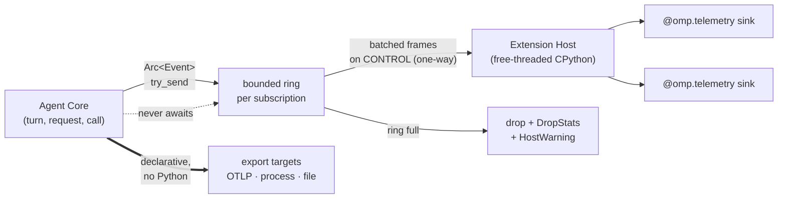
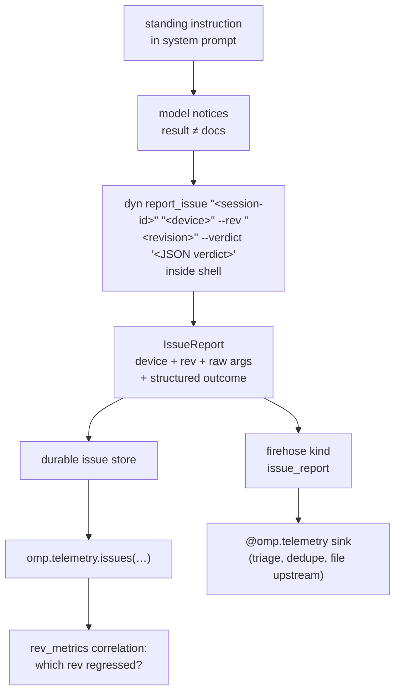

# 10 — Telemetry

> **Design document, not a runtime API guarantee.** This corpus includes proposed
> interfaces and historical implementation observations. See
> [implementation status](implementation-status.md) for current owners and known gaps.

`omp.telemetry` is the observability namespace: a droppable, post-hoc event firehose, extension-owned
metrics and spans, declarative export targets, a query surface over accumulated sessions, and the
AutoQA loop through which the model files bugs against the tools it uses.

## Purpose

An observability extension wants three things: to watch everything, to keep everything, and to cost
nothing. pi gave it the first, denied it the second, and charged for the third.

Watching was easy — `pi.on("message_end", …)` fires on every assistant message and `msg.usage`
carries token counts. Keeping was not. Because a tool call settled into a **string**, the only thing
a sink could record about `edit` was prose; because nothing carried a schema revision, a year of
recorded `edit` calls could not be partitioned by dialect; and because there was no query facility,
sixteen catalog packages resorted to parsing session JSONL off disk with hand-rolled byte-stream
parsers (`@tmustier/pi-usage-extension` ships one). Costing nothing failed too: sinks ran inline on
the event bus, so a slow one taxed the turn, and `@braintrust/pi-extension` had to spawn its own
detached `bt trace daemon` and speak JSON-RPC over a Unix socket precisely because the harness
offered no egress path it could trust.

`omp.telemetry` removes that: every event is a **typed record**, every tool/device event is stamped
`family@rev` and carries the structured outcome (`omp.CallOutcome`, `docs/py/02-verdicts.md`)
rather than its projection, delivery is asynchronous and explicitly droppable, and accumulated
sessions are **queryable** instead of parseable. The
question the blogpost poses — *show me every `edit@hl.*` call where the fuzzy rebase fired and the
model retried anyway* — is a `Query` on this page, not an afternoon of regex archaeology.

## Concepts

### No Python in the token stream

This is the load-bearing constraint of the whole namespace, and it is not negotiable.

> **Nothing in `omp.telemetry` is invoked while a request is streaming.** No sink observes a token,
> a `PartDelta`, or an argument fragment. Usage, cost, latency, and served-model identity arrive
> **post-hoc**, once from the settled `Outcome` of a request, after the turn has already moved on.

Two independent reasons. First, latency: CONTROL round-trips are tens of microseconds, which is fine
per turn and per call and catastrophic per token — a 4 000-token response would pay 4 000 crossings
plus 4 000 Python frames. Second, cancellation: a Python sink in the token path is a Python sink that
can hang the token path, which is Lesson #2 with extra steps.

Mid-stream interception is a real feature, and it is deliberately **not** here. pi's TTSR engine
(`.plan/feature-map/observability.md:150`) matches partial model output and time-travels the request;
that stays a Rust-side facility on the inference path. If you want to react to output as it forms,
the honest answer is that you cannot from Python, and this document says so rather than shipping a
hook that quietly costs a millisecond a token.

### The firehose is droppable by contract



The publishing side calls `try_send` and moves on. It never awaits a subscriber, never awaits the
host, and never awaits an export flush. When a subscription's ring is full the event is **dropped**
and counted; the turn is not delayed by one microsecond. `omp.telemetry.dropped()` reports exactly
what you lost, and a `HostWarning` with code `sink_overflow` lands in the firehose itself.

This is a genuine trade and it is stated plainly: **telemetry is at-most-once**. If your extension
requires that an event is never lost, it is not a telemetry consumer — it is a hook consumer
(`docs/py/05-hooks.md`) or a journal writer (`docs/py/09-journal.md`), both of which are ordered and
durable and both of which can therefore block a turn.

The sharpest corollary, and one this page itself got wrong in its first revision: **at-most-once is
never billing truth.** Any record that must be financially complete — spend, quota consumption,
anything an invoice, a budget, or a reimbursement reads — derives from the durable per-turn
receipts the core writes into the journal, or from a durable hook or declared journal entry
(`docs/py/09-journal.md`, `docs/py/05-hooks.md`), never from a stream whose contract permits silent
gaps. The reversal is recorded in full at the subscription example below.

### One event, three consumers, no string

Lesson #7 applies to telemetry more sharply than anywhere else, because telemetry *is* the third
consumer the blogpost names — "future you, trying to query accumulated session data, needs
everything — forever, in a shape a query can actually run over."

So a `ToolCall` event carries the **outcome** (`payload` or `fault`, structured, round-trippable;
see `docs/py/02-verdicts.md`), the **raw emitted arguments** before charitable repair, the list of
repairs that fired, and the *size* of the model-facing projection — but never the projection's text
as truth. The projection is reconstructible from `(tool, rev, payload)` by the tool's own
`prompt(view, caps)`; the outcome is not reconstructible from the projection. Recording the derived
form and discarding the source is how pi's data became write-only.

### Version everything, or the data is noise

Every `ToolCall`, `IssueReport`, `ArtifactSpill`, and `CapabilityDegraded` event carries a `Rev`
(`edit@hl.3`) whenever one exists. The wire name the model saw stays clean; the rev never rides the
wire. It rides the event, the journal, the transcript, and every metric series. Core tools and
extension devices both have revs; MCP endpoints do not, because their schema arrives from outside.

This is what makes `omp.telemetry.rev_metrics("edit")` meaningful: a hundred revisions of hashline
become a hundred rows with per-rev fault codes, repair paths, retry rates, and latency percentiles.
Without the rev they are one row and the signal is destroyed.

### AutoQA: the model is the QA department

The heaviest user of every device is the model. omp's system prompt therefore carries a standing
instruction: any tool result inconsistent with the tool's documented behaviour gets a one-line report
filed by running `dyn report_issue "<session-id>" "<device>" --rev "<revision>" --verdict '<JSON verdict>'` inside the shell. False positives
are **explicitly welcome** — a false positive is training data for the detector, and a report costs
one line.



Versioning makes reports attributable. Structured outcomes make them diffable. Together they turn
triage into a query, which is how hashline burned through its revisions without anyone maintaining a
spreadsheet.

### Three ways out

| Path | Python per event | Use when |
|---|---|---|
| `omp.telemetry.export(OtlpTarget(…))` | **none** | shipping to a collector, vendor backend, or gateway |
| `omp.telemetry.export(ProcessTarget(…))` | **none** | the backend is a local daemon or sidecar binary |
| `@omp.telemetry([...])` | one call per event | the sink must *decide* something (regression, notify, dedupe) |

Export targets are **declarative**: you hand the harness a description, Rust owns the socket, the
batching, the retry, and the flush. `@braintrust/pi-extension`'s `spawn("bt", ["trace","daemon"],
{detached:true})` plus a hand-rolled JSON-RPC framing layer collapses into a `ProcessTarget` naming
an env-managed process (`docs/py/11-env.md`) or an `OtlpTarget` doing direct egress under an explicit
network capability.

One consequence of remote-first (`docs/py/04-placement.md`, `docs/py/14-deploy.md`): an extension
declared by a **remote** workspace has its `omp.env` scoped to the remote environment. A
`ProcessTarget` from such an extension names a process beside the *remote* Environment, and its
`FileTarget` writes to the *remote* state directory. If your sink must land bytes on the machine the
user is looking at, use `OtlpTarget` (which egresses from wherever the host runs and is explicit
about it) or `omp.journal` (which is session-scoped and follows the session).

### Capture is a grant, not a default

What an extension may observe is a graded grant, not a side effect of being installed. Every event
field is classified — usage, structure, or content — and events cross CONTROL already redacted to
the subscriber's effective capture level; `args_raw` and the provider's raw `detail` map exist only
under an explicit content grant. The query surface is floored at the extension's install time:
installing an observability extension does not hand it the project's history. The full contract —
capture levels, field classes, retention tiers, the encryption boundary, deletion, post-uninstall
behavior — is *Privacy, capture, and retention* in the Reference below; this page owns it, with the
journal-side storage aspects in `docs/py/09-journal.md`.

### Semconv is a compatibility contract

`crates/observability/src/attrs.rs` opens by stating that its literal attribute strings are a contract:
"changing even one breaks downstream dashboards, collectors, and alerts." That authority is *not*
duplicated into Python. `omp.telemetry.semconv` maps event field paths onto those exact keys, and
extension-defined instruments are forced under the `omp.ext.` prefix so no extension can shadow
`gen_ai.*`, `omp.agent.*`, or `omp.gen_ai.*` and silently corrupt a dashboard.

---

## Reference

Everything below is reachable as `omp.telemetry.<symbol>`; the decorator is `omp.telemetry` itself.

This page owns the firehose, its event dataclasses, extension-owned metrics and spans, export
targets, the query surface, and the AutoQA issue store. It **consumes** symbols owned elsewhere and
links rather than restating them:

| Consumed here | Owner |
|---|---|
| `omp.Context`, `omp.CapabilityError`, `omp.Duration`, `omp.state_dir()`, trust tiers, principal identity, the resource receipt (quotas), host generations | `docs/py/00-overview.md` |
| `@omp.device`, `@omp.tool`, `omp.devices`, `omp.mcp`, the `dyn` shell builtin and its schema-derived CLI grammar, `omp.ToolPath`, the dynamic tool policy | `docs/py/01-devices.md` |
| `omp.CallOutcome`, `omp.Payload`, `omp.Fault`, `PolicyDenied`, the postcondition finding, `prompt(view, caps)`, `PromptCaps`, `lift`, spill budget, the `schema_rev`/`artifact_digest` split | `docs/py/02-verdicts.md` |
| `omp.InvocationPhase`, charitable decoding, `Ev`/`Update`/`Done` | `docs/py/03-params.md` |
| `omp.Place`, `omp.PlaceKind`, `omp.workers`, `omp.Spill`/`omp.BlobRef` | `docs/py/04-placement.md` |
| `@omp.hook`, `omp.HookDecision`, `omp.HookPhase`, the `tool_call` event and its `target` union, the failure table | `docs/py/05-hooks.md` |
| the admission gate that produces `POLICY_DENIED` aborts, approval tickets | `docs/py/06-policy.md` |
| `omp.ui.notify`, `@omp.command`, TML | `docs/py/07-ui.md` |
| `@omp.prompt_slot`, `CompactionEvent`, `MessageRef`/`ContextPatch` | `docs/py/08-context.md` |
| `omp.journal`, `@omp.entry_kind` typed entries, turn receipts, `omp.sessions`, `omp.artifacts`, `ArtifactUrl` | `docs/py/09-journal.md` |
| `omp.env`, `EnvPath`, named processes, blobs | `docs/py/11-env.md` |
| capability intents, strength, budget resolution, `omp.creds` | `docs/py/13-inference.md` |
| `(publisher_key, extension_id)` identity, the provenance septet, the manifest declaration table | `docs/py/14-deploy.md` |

### `@omp.telemetry(kinds, *, scope=Scope.TREE, queue=QUEUE_DEFAULT, overflow=Overflow.DROP_OLDEST, coalesce_key=None, batch=None, replay=False, replay_limit=2048)`

Subscribes a coroutine to the firehose. The sink is invoked as `(event, ctx)` — the uniform
callback ABI every omp callback shares (`docs/py/00-overview.md`): `event` is one `Event`, or a
`Sequence[Event]` when `batch` is set, and `ctx` is the ambient `omp.Context`. A subscription is a
declared lazy surface: it appears in the manifest's declaration table with its module, static key,
and activation trigger (`docs/py/14-deploy.md`).

**Arguments**

- `kinds: Sequence[Kind | str]` — event kinds to receive. An empty sequence is rejected; subscribe to
  what you use, because filtering happens **core-side** and unsubscribed kinds never cross CONTROL.
  Unknown strings raise `SubscriptionError` at decoration time, not at first event.
- `scope: Scope` — which agents' events reach the sink. Defaults to `Scope.TREE`.
- `queue: int` — ring capacity in events, `1..=65536`. Defaults to `QUEUE_DEFAULT` (4096).
- `overflow: Overflow` — what happens when the ring is full.
- `coalesce_key: Callable[[Event], Hashable] | None` — required when
  `overflow is Overflow.COALESCE_BY_KEY`, prohibited otherwise. Evaluated **host-side**, not
  core-side, so a slow key function costs your own delivery latency and nothing else.
- `batch: int | None` — when set (`2..=BATCH_MAX`), the sink receives `Sequence[Event]` instead of one
  `Event`, flushed when the batch fills or `FLUSH_INTERVAL` elapses, whichever comes first.
- `replay: bool` — on subscribe, deliver this session's already-recorded matching events before live
  delivery begins. The semantics are three exact steps: the harness **snapshots** the session's
  recorded events at a watermark, delivers the snapshot **chronologically** — oldest first, the
  order a state-folding sink needs — and then switches the subscription to live delivery
  **atomically at the watermark**, so no event between snapshot and live is skipped or delivered
  twice. This is how a **restarted host** regains a coherent view instead of starting blind
  mid-session.
- `replay_limit: int` — cap on replayed events. When the snapshot exceeds it, the **oldest** events
  are dropped from the front, so the replayed suffix plus the live stream is still contiguous and in
  causal order; the skip count lands in `DropStats.replay_skipped`.

> **Reversal.** Revision 1 specified replay as newest-first delivery with older matches silently
> skipped. That was wrong twice over: a sink that folds state (the cache watcher under Patterns)
> needs events in causal order, and a newest-first replay abutting live delivery either re-delivers
> the boundary event or leaves a gap, depending on timing. The contract is now snapshot at a
> watermark → chronological delivery → atomic switch to live.

**Returns** the decorated function, unchanged, so a sink stays directly callable in your own tests.

**Raises** `SubscriptionError` at import/activation time for an empty or unknown `kinds`, an
out-of-range `queue`/`batch`, a `coalesce_key`/`overflow` mismatch, a second subscription with the
same qualified function name, or a subscription beyond the extension's quota — subscription count
and ring memory are per-extension quotas surfaced in the resource receipt
(`docs/py/00-overview.md`).

**Channel** CONTROL, one-way notification frames. The firehose carries no reply token; core does not
await it and cannot observe whether the host consumed it.

**Latency class** post-hoc, batched, coalesced. Never per-token; never on the critical path.

**Failure policy** fail-open, always. An exception escaping a sink is journaled and published as
`HostWarning(code="sink_error")`; it is **not** retried, the event is not redelivered, and the
subscription stays live. A sink that raises on every event produces one warning per event and
nothing worse. A sink that never returns has its ring fill and drop; it does not stall a turn.

```python
import omp

@omp.telemetry(["model_request"])
async def spike_alert(event: omp.telemetry.ModelRequest, ctx: omp.Context) -> None:
    if event.cost is not None and event.cost.usd > 2.00:
        omp.ui.notify(
            f"one request cost ${event.cost.usd:.2f} on {event.served_model}",
            level="warning",
        )
```

The example is deliberately **advisory**: a dropped event costs a missed warning, never a wrong
number. Revision 1 used this slot for a spend tracker — a sink that read each `ModelRequest` and
appended a durable `spend` record to the journal. That example was wrong, and the correction is
recorded rather than swapped silently: the firehose is at-most-once by contract, so one ring
overflow would have put a silent hole in a billing record — converting a droppable stream into
financial truth. Spend accounting derives from the durable per-turn receipts in the journal or from
a durable declared entry written on an ordered path (`docs/py/09-journal.md`); a telemetry sink may
*watch* cost, as here, but never *account* for it.

### `class Kind(StrEnum)`

The complete event vocabulary. Every member is also accepted as its bare string.

- `Kind.SESSION_START` = `"session_start"` — a session begins or is resumed. Payload `SessionStart`.
- `Kind.SESSION_END` = `"session_end"` — a session terminates for any reason. Payload `SessionEnd`.
- `Kind.TURN_START` = `"turn_start"` — a logical turn is admitted. Payload `TurnStart`.
- `Kind.TURN_END` = `"turn_end"` — a turn settles, successfully or not. Payload `TurnEnd`.
- `Kind.MODEL_REQUEST` = `"model_request"` — one request settled with an `Outcome`. Payload
  `ModelRequest`. This is the usage-bearing event.
- `Kind.MODEL_ATTEMPT` = `"model_attempt"` — a capability-resolver or credential-rotation retry
  abandoned an attempt. Payload `ModelAttempt`. Emitted **before** the eventual `MODEL_REQUEST`.
- `Kind.PROVIDER_ERROR` = `"provider_error"` — a request failed terminally. Payload `ProviderError`.
  No `MODEL_REQUEST` follows for that attempt.
- `Kind.TOOL_CALL` = `"tool_call"` — one invocation settled into a `CallOutcome`. Payload
  `ToolCall`. Fires once per logical dispatch for core tools, extension devices, and MCP endpoints
  alike, with a
  `target` discriminant naming which — the same single-event shape as the `tool_call` hook
  (`docs/py/05-hooks.md`).
- `Kind.CAPABILITY_DEGRADED` = `"capability_degraded"` — the harness could not honour a declared
  capability intent. Payload `CapabilityDegraded`.
- `Kind.COMPACTION` = `"compaction"` — a compaction ran. Payload `Compaction`.
- `Kind.BRANCH` = `"branch"` — the session tree changed shape. Payload `Branch`.
- `Kind.ARTIFACT_SPILL` = `"artifact_spill"` — a payload exceeded the spill budget and was stored
  whole. Payload `ArtifactSpill`.
- `Kind.ISSUE_REPORT` = `"issue_report"` — an AutoQA report was filed. Payload `IssueReport`.
- `Kind.HOST_WARNING` = `"host_warning"` — a non-fatal telemetry or host failure. Payload
  `HostWarning`. Subscribing to this and nothing else is a valid, cheap health check.

### `class Scope(StrEnum)`

- `Scope.SELF` = `"self"` — only events from the agent that loaded this extension. A subagent's
  activity is invisible.
- `Scope.TREE` = `"tree"` — this agent plus every descendant subagent, at any depth. The default,
  and what a cost tracker wants: pi's `getSessionStats` had to recursively walk nested `task` tool
  results to reach the same number.
- `Scope.PROJECT` = `"project"` — every session the daemon is currently serving for this project
  directory, including sessions this extension did not load into. Requires the
  `telemetry.project_scope` capability; without it, activation fails with `omp.CapabilityError`
  (`docs/py/00-overview.md`). Access is additionally principal-gated and floored at the extension's
  install watermark — see *Privacy, capture, and retention*. This is the honest answer to "people
  multiplex these agents".

### `class Overflow(StrEnum)`

- `Overflow.DROP_OLDEST` = `"drop_oldest"` — evict the front of the ring. The default: recency
  usually matters more than completeness for a live sink.
- `Overflow.DROP_NEWEST` = `"drop_newest"` — refuse the arriving event, keep the backlog. Correct
  when your sink reconstructs state by replaying a prefix and a hole in the middle is worse than a
  hole at the end.
- `Overflow.COALESCE_BY_KEY` = `"coalesce_by_key"` — replace the newest queued event sharing the
  arriving event's `coalesce_key`. Bounded memory with no gaps in *distinct* keys. A per-tool rollup
  sink keyed on `ev.tool` never drops a tool entirely, only intermediate samples of it.

### `class Accuracy(StrEnum)`

Mirrors `omp.inference.v1.Usage.Accuracy` and `omp_telemetry::config::UsageAccuracy`.

- `Accuracy.EXACT` = `"exact"` — every bucket came from the provider.
- `Accuracy.ESTIMATED` = `"estimated"` — every bucket was counted locally, because the provider
  reported none.
- `Accuracy.MIXED` = `"mixed"` — some buckets provider-reported, some locally counted. Treat sums as
  approximate and **do not** bill against them.

### `class StopReason(StrEnum)`

Mirrors `omp.inference.v1.StopReason`.

- `StopReason.END_TURN` = `"end_turn"` — the model finished normally.
- `StopReason.TOOL_USE` = `"tool_use"` — the model requested one or more calls.
- `StopReason.MAX_TOKENS` = `"max_tokens"` — the output limit was reached.
- `StopReason.CONTENT_FILTER` = `"content_filter"` — the provider filtered the completion.
- `StopReason.UNSPECIFIED` = `"unspecified"` — the provider reported nothing mappable.

### `class FinishReason(StrEnum)`

The normalized value emitted in `gen_ai.response.finish_reasons`, derived from `StopReason` exactly
as `omp_telemetry::semconv::StopReason::finish_reason` does. Present so a Python sink emitting OTLP
attributes produces byte-identical series to the Rust exporter.

- `FinishReason.STOP` = `"stop"`
- `FinishReason.LENGTH` = `"length"`
- `FinishReason.TOOL_CALLS` = `"tool_calls"`
- `FinishReason.ERROR` = `"error"`

### `class CallStatus(StrEnum)`

Terminal status of an invocation, wire-identical to `omp_telemetry::semconv::ToolStatus`. This is the
**metrics-facing** vocabulary, kept byte-exact so `omp.tool.status` series survive; it is *not* the
durable truth, which is `ToolCall.outcome` plus `abort`. Every status derives **structurally** from
the settled `omp.CallOutcome` (`docs/py/02-verdicts.md`) — never from the prose of a fault or a
result string.

- `CallStatus.OK` = `"ok"` — `CallOutcome.Ok`.
- `CallStatus.ERROR` = `"error"` — `CallOutcome.Faulted` **or** `CallOutcome.ArgsRejected`.
- `CallStatus.SKIPPED` = `"skipped"` — `CallOutcome.Aborted` with `kind=AbortKind.SKIPPED`.
- `CallStatus.BLOCKED` = `"blocked"` — `CallOutcome.Aborted` with `kind=AbortKind.POLICY_DENIED`;
  the structured `PolicyDenied(reason, code, decision_id, rules)` rides `ToolCall.abort.policy`
  (`docs/py/02-verdicts.md`; the admission gate that produces it is `docs/py/06-policy.md`).
- `CallStatus.TIMEOUT` = `"timeout"` — the loop's deadline elapsed and the invocation guard dropped.
- `CallStatus.ABORTED` = `"aborted"` — `CallOutcome.Aborted` with `kind=AbortKind.CANCELLED`,
  whatever the finer cancellation detail (`Abort.detail`).

> **Reversal.** Revision 1 defined `BLOCKED` as "a policy verdict denied it" with no structured
> carrier — a sink had to recognize a denial from the shape or prose of the failure, which is
> exactly the projection-as-truth mistake this page exists to prevent. Per the structured-denial
> ruling, a denial now settles as `Aborted(kind=POLICY_DENIED, policy=PolicyDenied(...))`, and
> `SKIPPED` versus `BLOCKED` is a `match` on `abort.kind`, never an inference.

The lossiness is still deliberate and must be stated: six OTel statuses cannot express four
`CallOutcome` arms crossed with the abort kinds and cancellation details. `ERROR` merges a
tool-owned fault with an argument failure, and `ABORTED` merges every cancellation detail including
`effects_unknown` — the one that means the world may have changed. **Group metrics on `status`;
diagnose on `outcome`/`abort`.** A sink that only ever reads `status` is reading the projection,
which is the mistake this whole document exists to prevent.

One thing `status` can *never* express, by design: a postcondition finding. A downstream reviewer
that rejects a landed write does not — cannot — flip the call's `Ok`; the finding is a separate
durable signal (`CallOutcome: Ok / Postcondition: Rejected`, `docs/py/02-verdicts.md`,
`docs/py/05-hooks.md`), surfaced here as `ToolCall.postcondition` and counted separately in
`RevMetrics.postcondition_rejected`. A dashboard that wants "writes that later failed verification"
counts findings, not statuses.

### `class Retryability(StrEnum)`

Mirrors `omp.inference.v1.Retryability` — the safe recovery lane a classified attempt permits.

- `Retryability.NEVER` = `"never"`
- `Retryability.SAME_ROUTE` = `"same_route"`
- `Retryability.AFTER_REPAIR` = `"after_repair"`
- `Retryability.AFTER_CREDENTIAL` = `"after_credential"`
- `Retryability.AFTER_DELAY` = `"after_delay"`
- `Retryability.UNSPECIFIED` = `"unspecified"`

### `class RepairKind(StrEnum)`

Which layer of charitable decoding fired (`docs/py/03-params.md`).

- `RepairKind.ALIAS` = `"alias"` — a declared alias resolved (`file_path` → `path`).
- `RepairKind.COERCE` = `"coerce"` — a declared coercion applied (`"true"` → `True`, bare string →
  one-element list).
- `RepairKind.TOLERANT_PARSE` = `"tolerant_parse"` — the tolerant JSON parser accepted a trailing
  comma, unquoted key, or similar.
- `RepairKind.TRUNCATED_TAIL` = `"truncated_tail"` — generation stopped mid-value and the parser
  closed it.
- `RepairKind.DEFAULTED` = `"defaulted"` — an unpulled optional was absent and took its default.

### `class DegradeAction(StrEnum)`

Mirrors `omp.inference.v1.Unsupported.Action`.

- `DegradeAction.DROPPED` = `"dropped"` — the feature was not sent.
- `DegradeAction.EMULATED` = `"emulated"` — the harness substituted client-side behaviour (a soft
  prompt in place of a native forced call).
- `DegradeAction.CLAMPED` = `"clamped"` — the value was reduced to the provider's admissible range.

### `class IssueStatus(StrEnum)`

- `IssueStatus.OPEN` = `"open"` — filed, untriaged.
- `IssueStatus.CONFIRMED` = `"confirmed"` — reproduced.
- `IssueStatus.FALSE_POSITIVE` = `"false_positive"` — the device behaved as documented. **Not** a
  failure of the loop; explicitly the expected outcome for a healthy share of reports.
- `IssueStatus.FIXED` = `"fixed"` — resolved in a later rev; `Issue.fixed_in` names it.
- `IssueStatus.DUPLICATE` = `"duplicate"` — `Issue.duplicate_of` names the original.

### `class Consent(StrEnum)`

- `Consent.LOCAL` = `"local"` — the report stays on this machine. The default.
- `Consent.SHARED` = `"shared"` — the user has approved upstream submission of this report.
- `Consent.PENDING` = `"pending"` — sharing was requested and the user has not yet answered. The
  report is durable; only its egress waits.

`Consent` governs issue-report egress only; consent for export targets is a separate durable
per-destination grant (see *Privacy, capture, and retention*).

### `class Rev`

`@dataclass(frozen=True, slots=True, order=True)`. The Python view of `omp_tool::Rev`
(`crates/tool/src/lib.rs:50-66`), which is already implemented as `{ family: Str, n: u16 }` with a
`Display` of `family.n` — `"hl.3"`, or bare `"3"` when the family is empty. Core tools and extension
devices both carry one; MCP endpoints do not.

- `tool: str` — the wire name the model saw (`"edit"`). Not part of the Rust `Rev`; it comes from the
  registry key the rev was recorded under, which is why `Rev` here carries three fields where Rust
  carries two.
- `family: str` — the argument-dialect family (`"hl"`, `"rep"`). Empty for a tool with a single
  unnamed dialect.
- `number: int` — the monotonic revision within `family`. Named `n` in Rust; spelled out here because
  `rev.n` reads as noise in a query predicate.
- `__str__() -> str` — `"edit@hl.3"`, or `"edit@3"` when `family` is empty. The `@` is a
  presentational join of the registry key and the Rust `Display`; it never appears on any wire.
- `parse(text: str) -> Rev` (classmethod) — inverse of `__str__`. Raises `ValueError` on malformed
  input.
- `matches(pattern: str) -> bool` — glob match against the canonical string. `"edit@hl.*"` matches
  every hashline revision; `"edit@*"` matches every dialect; `"*"` matches everything.

The rev a call actually settled under is not reconstructed by this namespace. It is read from
`omp_tool::TOOL_REV_PROP` — the namespaced thread-item property `"omp/tool-rev"`
(`crates/tool/src/lib.rs:46`) — which the agent loop already stamps and reads
(`crates/agent/src/loop.rs:1368-1370` and `:1129-1131`, `crates/agent/src/journal.rs:1300-1302`,
`crates/agent/src/project.rs:165,171,258`). Telemetry is a consumer of that stamp, never a second
source of it.

```python
rev = omp.telemetry.Rev.parse("edit@hl.47")
assert rev.matches("edit@hl.*") and not rev.matches("edit@rep.*")
assert str(rev) == "edit@hl.47" and rev.family == "hl" and rev.number == 47
```

### `class Tokens`

`@dataclass(frozen=True, slots=True)`. Every bucket in `omp.inference.v1.Usage`, unabridged. Absent
buckets are `0`, never `None`, so arithmetic never needs a guard.

- `input: int` — total cost-bearing input tokens, **inclusive** of `cache_read` and `cache_write`.
  This matches `gen_ai.usage.input_tokens`, whose documented meaning is the inclusive total.
- `output: int` — output tokens.
- `cache_read: int` — input tokens served from the provider's prompt cache.
- `cache_write: int` — input tokens written into the prompt cache.
- `reasoning: int` — reasoning output tokens, a subset of `output`.
- `total: int` — provider-reported total; derived as `input + output` when the provider omitted it.
- `context: int | None` — provider-reported context occupancy after the request, when supplied.
- `premium_requests: int` — provider-metered premium request units.
- `cache_ttl_5m: int` — cache writes billed at the five-minute ephemeral tier.
- `cache_ttl_1h: int` — cache writes billed at the one-hour tier. The two tiers price differently,
  which is why they are separate fields rather than a sum.
- `server_web_search: int` — server-side web-search requests the provider billed.
- `server_web_fetch: int` — server-side web-fetch requests the provider billed.
- `orchestration_input: int`, `orchestration_output: int`, `orchestration_cache_read: int` — extra
  usage the provider attributes to its own orchestration rather than to your prompt.
- `detail: Mapping[str, int | float | str]` — the provider's raw vendor-namespaced breakdown, integer
  values preserved exactly rather than passed through a float. Keys are provider-specific and
  **unstable**; read them for forensics, never for billing logic.
- `uncached_input: int` (property) — `input - cache_read - cache_write`, floored at `0`.
- `cache_hit_rate: float` (property) — `cache_read / input`, or `0.0` when `input == 0`. The single
  number `@mrclrchtr/supi-cache` exists to compute.

### `class Cost`

`@dataclass(frozen=True, slots=True)`. Nano-USD throughout, because floats are not money.

- `nanos_usd: int` — total.
- `estimated: bool` — `True` when computed from catalog rates, `False` when the provider billed
  in-band.
- `input_nanos_usd: int | None`, `output_nanos_usd: int | None`,
  `cache_read_nanos_usd: int | None`, `cache_write_nanos_usd: int | None` — per-bucket breakdown when
  the pricing card supplied enough detail.
- `unavailable_reason: str | None` — why estimation was impossible, mirroring
  `omp.gen_ai.cost.unavailable_reason`. Non-`None` only on a `Cost` reached through a field that is
  itself `None`-able; a present `Cost` with a present `nanos_usd` always has `unavailable_reason is
  None`.
- `usd: float` (property) — `nanos_usd / 1e9`. For display. Do not aggregate over it.

### `class PromptSlotFingerprint`

`@dataclass(frozen=True, slots=True)`. One assembler-owned prompt-slot contribution.

- `digest: str` — the slot's BLAKE3-128 content digest.
- `size_bytes: int` — encoded size contributed to the assembled prompt.
- `band: SlotClass` — the assembler band that placed the contribution.

### `class PromptFingerprint`

`@dataclass(frozen=True, slots=True)`. The prompt-cache truth, computed by the assembler that built
the prompt rather than reconstructed by an extension hashing whatever it could reach.

- `digest: str` — BLAKE3-128 hex over the assembled cacheable prefix.
- `slots: Mapping[str, PromptSlotFingerprint]` — per-slot facts keyed by prompt-slot key
  (`docs/py/08-context.md`). Each value carries `digest: str`, `size_bytes: int`, and
  `band: SlotClass`; the band uses the frozen stability vocabulary from that page. Covers every
  contribution: harness sections, `AGENTS.md`, skills, device docs fetched with
  `dyn <path> --help` inside the core `shell` tool, and each `@omp.prompt_slot`.

**Resolved (2026-08-20 ruling): slot fingerprints carry their assembled byte size and frozen
stability band; extensions never infer either from a slot key.**

- `changed: tuple[str, ...]` — slot keys whose digest differs from the previous request in this
  session, in assembly order. Empty means the prefix was byte-identical.
  `@mrclrchtr/supi-cache`'s `diffFingerprints(prev, cur)` is this field.
- `prefix_stable_bytes: int` — length of the leading byte run identical to the previous request. The
  direct measure of how much prefix the cache *could* serve, independent of whether it did.
- `cache_key: str` — the `CacheHint.session_key` actually sent, which drives provider cache affinity
  and gateway credential pinning.
- `retention: str` — `"short" | "long" | "none" | "unspecified"`.
- `mode: str` — `"implicit" | "explicit" | "unspecified"`.
- `ttl: str` — `"thirty_minutes" | "unspecified"`.
- `breakpoint: str` — the breakpoint strategy in force: `"latest_stable_message"`, `"tail_two"`,
  `"none"`, `"unspecified"`.
- `breakpoint_indices: tuple[int, ...]` — message indices where cache breakpoints were actually
  placed.

### `class Degradation`

`@dataclass(frozen=True, slots=True)`. One requested feature the resolved provider path could not
honour — the answer to every silent-drop bug.

- `what: str` — the feature path: `"tool_choice.required"`, `"sampling.top_k"`,
  `"response_format.grammar"`, `"props:openai/verbosity"`.
- `detail: str` — human-readable classified explanation.
- `action: DegradeAction` — what the harness did instead.

### `class Diagnostic`

`@dataclass(frozen=True, slots=True)`. One classified route attempt, portable routing evidence only —
never a provider response body.

- `provider: str`, `model: str` — the route attempted.
- `attempt: int` — one-based; `0` when the source supplied none.
- `code: str` — stable portable classification code.
- `detail: str` — classified detail safe to surface to callers.
- `retryability: Retryability`.

### `class ContextSnapshot`

`@dataclass(frozen=True, slots=True)`. Context occupancy at a boundary.

- `prompt_tokens: int` — total prompt tokens at this point.
- `non_message_tokens: int` — the system-prompt, device-docs, and skills portion; the part
  compaction cannot touch.
- `history_rewrite_tokens_removed: int` — tokens a history rewrite removed since the last snapshot.
  Applying this to the anchor is what pi's `recordAnchoredHistoryRewrite` did by hand.
- `last_message_at_ms: int | None` — timestamp of the newest message counted.
- `window: int` — the model's context window at this point.
- `percent: float` — `prompt_tokens / window`, clamped to `0.0..=1.0`.

### `class Repair`

`@dataclass(frozen=True, slots=True)`. One charitable-decoding correction.

- `path: str` — the pull path repaired, `"$.ops[0].range"`.
- `kind: RepairKind`.
- `detail: str` — what was seen and what it became.

### `class TraceRef`

`@dataclass(frozen=True, slots=True)`. The OpenTelemetry span context the event was emitted under, so
a Python-created span can parent correctly into an existing trace.

- `trace_id: str` — 32 lowercase hex characters.
- `span_id: str` — 16 lowercase hex characters.
- `sampled: bool`.

### `class ExtensionRef`

`@dataclass(frozen=True, slots=True)`. The provenance septet (`docs/py/14-deploy.md` owns it),
carried whole so any consumer of a telemetry record can attribute it without a registry lookup.

- `publisher: str` — the publisher key; extension identity is `(publisher_key, extension_id)`.
- `id: str` — the extension identifier from its manifest.
- `version: str`.
- `digest: str` — the artifact digest of the exact installed build. Per-build metrics key on this,
  never on `schema_rev` (`docs/py/02-verdicts.md` owns that split).
- `layer: str` — `"client"` when loaded from the client's `.omp`, `"workspace"` when declared by
  the workspace (the remote layer, for a remote workspace), `"builtin"` for harness-shipped
  extensions.
- `trust: str` — the runtime trust tier (`docs/py/00-overview.md`).
- `generation: int` — the host generation this reference was observed under.

Revision 1 carried only `(id, version, origin, trust)`. `origin` is renamed `layer` and the septet
is completed per the publisher-qualified-identity ruling, so extension-attributed telemetry names
an exact publisher and build, not a name any workspace can claim.

### `class ArgIssueKind(StrEnum)`

The stable class of a parameter-pull failure, mirroring `omp_tool::ArgIssueKind`
(`crates/tool/src/lib.rs:275-288`) member for member. This vocabulary already exists in Rust; nothing
here invents it.

- `ArgIssueKind.MISSING` = `"missing"` — a required pulled value was absent.
- `ArgIssueKind.INCOMPLETE` = `"incomplete"` — input ended before the pulled value completed.
- `ArgIssueKind.ABORTED` = `"aborted"` — input was explicitly or implicitly abandoned.
- `ArgIssueKind.MALFORMED` = `"malformed"` — complete input was malformed.
- `ArgIssueKind.TYPE_MISMATCH` = `"type_mismatch"` — the pulled value had another JSON shape.
- `ArgIssueKind.PROTOCOL` = `"protocol"` — invocation framing violated the linear stream contract.

Note the asymmetry with `RepairKind`: `ArgIssueKind` classifies a decode that *failed* into a
`CallOutcome.ArgsRejected` (Rust `Verdict::Args`); `RepairKind` classifies a decode that
*succeeded after correction*. Both are needed and only the first exists in Rust today.

### `class ArgIssue`

`@dataclass(frozen=True, slots=True)`. The Python view of `omp_tool::ArgIssue`
(`crates/tool/src/lib.rs:292-303`) — the blogpost's "the path that failed, the expected shape, a
worked example", already implemented.

- `path: tuple[str | int, ...]` — the full pulled key/index path. Object keys are `str`, array indices
  are `int`, matching `omp_tool::ArgPath::{Key, Index}`. Structured, not a string: `("ops", 0,
  "range")`, not `"$.ops[0].range"`.
- `path_str: str` (property) — the `"$.ops[0].range"` rendering, for display and for `Query` field
  paths.
- `expected: str` — the requested shape.
- `kind: ArgIssueKind` — the stable failure class.
- `example: str | None` — a valid example supplied for model repair.
- `found: str | None` — the observed shape; populated for `ArgIssueKind.TYPE_MISMATCH`.

### `class Abort`

`@dataclass(frozen=True, slots=True)`. The `Aborted` arm of `omp.CallOutcome`, carried whole
(`docs/py/02-verdicts.md` owns the type) — a structured cancellation report, not a string.

- `kind: str` — `"cancelled"`, `"skipped"`, or `"policy_denied"`: the `AbortKind` discriminant.
  `"policy_denied"` is produced by the admission gate (`docs/py/06-policy.md`) and never by an
  executor; it is what `CallStatus.BLOCKED` derives from.
- `detail: str | None` — the finer cancellation class within `"cancelled"`: `"interrupted"`,
  `"effects_unknown"`, `"input_dropped"`, or `"missing_outcome"`, mirroring the variants of
  `omp_tool::Abort` (`crates/tool/src/lib.rs:308-328`). `None` for the other kinds.
- `reason: str | None` — the explanation, where the source carried one; `None` for
  `"input_dropped"` and `"missing_outcome"`, which carry no field in Rust either.
- `policy: PolicyDenied | None` — present exactly when `kind == "policy_denied"`: the structured
  denial with `reason`, `code`, `decision_id`, and `rules` (`docs/py/02-verdicts.md`). Telemetry
  consumes this structure; it never parses denial prose.

`detail == "effects_unknown"` is the one worth alerting on: it means cancellation raced an effect
and only the resource owner can report the uncertainty. `CallStatus` collapses it to `ABORTED`, so
a sink that reads only `status` cannot distinguish "nothing happened" from "we do not know what
happened".

### `class JobRef`

`@dataclass(frozen=True, slots=True)`. The Python view of `omp_tool::JobRef`
(`crates/tool/src/lib.rs:361-368`), naming detached work and the artifact it will produce.

- `id: str` — the stable environment job identifier.
- `owner_kind: str` — currently always `"named_process"`, the only `omp_tool::JobOwner` variant.
- `owner_name: str` — the named process that authoritatively reports settlement
  (`docs/py/11-env.md`).
- `owner_generation: int` — the exact process generation observed when detaching. A settlement
  arriving against a different generation is a restart, not a result.
- `description: str` — the artifact's human-readable role.
- `media_type: str | None` — the expected MIME type, when known.
- `lifetime: str` — the producer's minimum retention promise: `"ephemeral"`, `"session"`, or
  `"durable"`, from `omp_tool::ArtifactLifetime` (`lib.rs:336-344`). A hint, not ownership: producers
  may retain longer than promised.

### `class Envelope`

`@dataclass(frozen=True, slots=True)`. The common prefix of every event. Never delivered directly;
every concrete kind is a subclass and inherits these fields first.

- `kind: Kind` — discriminant. Safe to `match` on.
- `seq: int` — per-session monotonic firehose sequence, gap-free at the *publisher*. A gap in what
  you observe is a drop, and comparing `seq` deltas against `DropStats` is how you confirm it.
- `at_ms: int` — epoch milliseconds when the event was published.
- `session: str` — session identifier.
- `agent: str` — agent identifier; `"main"` for the top-level agent, the subagent id otherwise.
- `depth: int` — subagent depth; `0` at top level.
- `conversation: str` — conversation identifier, matching `gen_ai.conversation.id`.
- `trace: TraceRef | None` — span context, `None` when tracing is disabled.
- `principal: str` — the authenticated principal (`docs/py/00-overview.md`) the session runs as.
  Telemetry read access is keyed on it, and no record enters the durable store without one.
- `generation: int` — the host generation fence (`docs/py/00-overview.md`) in force when the event
  was published. A record arriving under an older generation after a reload is a stale echo, not a
  fact.

Beyond this prefix, durable telemetry rows are stamped with the provenance of what produced them:
extension-originated records (an `IssueReport` with `reporter="extension"`, an extension-owned
instrument sample) carry the full provenance septet via `ExtensionRef`, so principal, artifact
digest, layer, trust tier, and host generation ride every durable record per the identity ruling
(`docs/py/00-overview.md`, `docs/py/14-deploy.md`).

### `class SessionStart(Envelope)`

- `resumed: bool` — `True` when continuing an existing transcript rather than opening a new one.
- `parent: str | None` — parent session for a subagent, else `None`.
- `cwd: EnvPath` — the workspace root **as the Environment sees it** (`docs/py/11-env.md`); for a
  remote environment that is a remote location, and `cwd.local_path()` raises `PlacementError`
  rather than yielding a string that is only sometimes a local path.
- `place: omp.Place` — where the Environment lives.
- `remote: str | None` — remote target identifier when `place` is not local.
- `model: str`, `provider: str` — the initially selected route.
- `devices: tuple[str, ...]` — extension and MCP device wire names mounted at start, reachable
  through the `dyn` shell builtin (`docs/py/01-devices.md`).
- `core_tools: tuple[str, ...]` — the tool names actually advertised to the model. This is the
  regression detector for Lesson #6, and **it fires today**: `Registry::advertise`
  (`crates/tool/src/registry.rs:483-492`) iterates all of `self.live` with no route filter, while
  `register_worker` (`:413-426`) inserts worker declarations straight into `self.live` at `:424`. So
  every Python worker declaration currently occupies a slot in the advertised array, and
  `len(core_tools)` grows with `len(devices)` instead of staying flat. An extension asserting
  `set(core_tools).isdisjoint(devices)` is asserting a property the shipped code does not yet have —
  which is precisely why the field is here. See `docs/py/01-devices.md` and the build notes.
- `extensions: tuple[ExtensionRef, ...]` — loaded extensions in activation order.
- `schema_rev: str` — the wire schema revision (`omp_proto::SCHEMA_REV`).
- `prompt: PromptFingerprint` — the initial prompt fingerprint. `changed` is empty here by
  definition.
- `registry_hash: str` — hex of `omp_tool::Registry::live_hash()`
  (`crates/tool/src/registry.rs:458-467`): a BLAKE3 digest over the ordered live `(name, family, n)`
  identities, domain-separated by `b"omp-tool/live/v1\0"` and registration-order independent because
  the live map is a `BTreeMap`. Its scope must be stated carefully: it covers **every** live identity,
  worker declarations included, so it is *not* a prompt-cache identity and enabling a device changes
  it even when the advertised array should be byte-identical. Availability-as-notification needs the
  narrower advertised-slot digest that `docs/py/01-devices.md` specifies; this field is the wider one.
  What it is good for is exactly one thing: two sessions with equal `registry_hash` ran against
  byte-identical tool identities, which makes a cross-session `rev_metrics` comparison sound rather
  than approximate.

### `class SessionEnd(Envelope)`

- `reason: str` — `"exit" | "idle" | "error" | "replaced" | "killed"`.
- `turns: int`, `requests: int`, `calls: int` — lifetime counts.
- `tokens: Tokens`, `cost: Cost | None` — lifetime rollup over this session and, when
  `scope=Scope.TREE`, its subagents.
- `wall_ms: int` — wall-clock session duration.
- `faults: int` — device calls that settled into a `Fault`.
- `issues: int` — AutoQA reports filed during this session.

### `class TurnStart(Envelope)`

- `turn: int` — zero-based turn index within the session.
- `trigger: str` — `"user" | "steering" | "tool_result" | "schedule" | "subagent" | "retry"`.
- `input_chars: int`, `input_parts: int`, `attachments: int` — shape of the input, never its content.
- `model: str` — the route selected for this turn.
- `effort: str | None` — reasoning effort in force.

### `class TurnEnd(Envelope)`

- `turn: int`.
- `steps: int` — agent-loop steps executed.
- `requests: int`, `calls: int` — model requests issued and device calls settled.
- `tokens: Tokens`, `cost: Cost | None` — rolled up across the turn.
- `latency_ms: int` — wall-clock turn duration.
- `stop: StopReason` — the terminal stop reason.
- `tools_used: tuple[str, ...]` — sorted, deduplicated dispatched names, across all target kinds.
- `faults: int`, `interrupted: bool`.
- `context: ContextSnapshot` — occupancy after the turn.

### `class ModelRequest(Envelope)`

The usage-bearing event, published once per settled request from its `Outcome`.

- `turn: int`, `step: int` — position in the loop.
- `requested_model: str` — what was asked for: an alias, a role (`"smol"`, `"slow"`), or a concrete
  identifier. Matches `gen_ai.request.model`.
- `served_model: str` — what actually served it after alias, role, and fallback resolution. Matches
  `gen_ai.response.model`. **These differ constantly**, and conflating them is how cost dashboards
  end up attributing spend to a role name.
- `provider: str` — normalized provider name.
- `upstream_provider: str | None` — the provider a gateway reported behind itself.
- `response_id: str | None` — provider-issued response identifier.
- `service_tier: str | None` — the tier actually served.
- `stop: StopReason`, `finish_reason: FinishReason`.
- `usage: Tokens`, `cost: Cost | None`, `accuracy: Accuracy`.
- `latency_ms: int` — request wall-clock duration.
- `ttft_ms: int | None` — time to first chunk, `None` for non-streaming requests.
- `prompt: PromptFingerprint`.
- `context: ContextSnapshot`.
- `request_content: bytes | None`, `response_content: bytes | None` — raw request and response
  content, populated only under `Capture.CONTENT`; both are `None` at lower capture levels.

**Resolved (2026-08-20 ruling): request and response content are separate capture-gated byte
fields; neither is reconstructed from token detail or tool arguments.**

- `effort: str | None`, `tool_choice: str | None`.
- `max_tokens: int | None`, `temperature: float | None`, `top_p: float | None`, `top_k: int | None`,
  `seed: int | None`, `stop_sequences: tuple[str, ...]` — the sampling parameters as sent, after
  clamping. A `Degradation` with `action=CLAMPED` explains any difference from what was asked.
- `core_tools: tuple[str, ...]` — tool wire names registered on this request. Matches
  `omp.gen_ai.request.available_tools`.
- `degraded: tuple[Degradation, ...]` — features the provider path could not honour.
- `attempts: int` — total attempts, including the successful one.
- `diagnostics: tuple[Diagnostic, ...]` — classified attempts in execution order.
- `replayed: bool` — `True` when the assistant item had already been committed
  (`ASSISTANT_ITEM_COMMITTED`, `docs/py/03-params.md`) and its outcome was replayed rather than
  re-executed. Counting a replay as spend double-bills.

### `class ModelAttempt(Envelope)`

- `turn: int`, `step: int`.
- `number: int` — one-based attempt number.
- `reason: str` — why the previous attempt was abandoned.
- `provider: str`, `model: str` — the route being abandoned.

Published so retries surface honestly instead of a stream silently restarting.

### `class ProviderError(Envelope)`

- `turn: int`, `step: int`.
- `error_kind: str` — `"conflict" | "need_full" | "unsupported" | "auth" | "rate_limited" |
  "upstream" | "overloaded" | "invoke_timeout" | "empty_output" | "unspecified"`.
- `detail: str` — classified, caller-safe.
- `provider: str`, `model: str`, `attempt: int`.
- `retryability: Retryability`.
- `retry_after_ms: int | None` — honour this on `rate_limited`.
- `degraded: tuple[Degradation, ...]` — populated on `unsupported`.
- `http_status: int | None`.
- `handled_by: str | None` — the extension whose `provider_error` hook produced a failover decision
  (a domain-return hook family, `docs/py/05-hooks.md`), else `None`.

### `class ToolCall(Envelope)`

Published once per settled invocation, whether the settlement is success, fault, block, timeout, or
abort. **One event covers all three dispatch targets** — core tool, extension device, and MCP
endpoint — mirroring the single `tool_call` hook event and its tagged `target` union defined in
`docs/py/05-hooks.md`. The reasoning is the same in both places: a sink that partitions core tools
from devices under two names is a sink that undercounts whichever one its author forgot, and
`edit@hl.3` — the canonical example of a revisioned dialect — is a *core* tool, so any split would
put the flagship case on the wrong side of it.

The tagged `target` payload shape belongs to `docs/py/05-hooks.md`; this event hoists the
discriminant and the identity fields flat, because that is the shape a `group_by` needs.

- `call_id: str` — the provider's tool-call identifier.
- `target: str` — the discriminant: `"core"`, `"device"`, or `"mcp"`. Matching on it is how a sink
  handles a target kind it does not recognize without silently miscounting it.
- `tool: str` — the dispatched name. The core tool's name for `"core"`, the device's wire name for
  `"device"`, the endpoint's tool name for `"mcp"`.
- `mcp_server: str | None` — the advertising server for `"mcp"`, else `None`.
- `rev: Rev | None` — family and revision that executed. Present for `"core"` and `"device"`, `None`
  for `"mcp"`, whose schema arrives from outside and carries no omp revision.
- `place: omp.Place` — where the executor ran (`docs/py/04-placement.md`).
- `worker: str | None` — worker name for `place="worker:<name>"`, else `None`.
- `status: CallStatus`.
- `phase_reached: str` — the furthest `omp.InvocationPhase` (`docs/py/03-params.md`) the invocation
  reached before settling: `"OPEN"`, `"ARGS_FINALIZED"`, `"ADMISSION"`, `"ADMITTED"`,
  `"ASSISTANT_ITEM_COMMITTED"`, or `"EFFECTS_AUTHORIZED"`. An invocation that never reached
  `ASSISTANT_ITEM_COMMITTED` existed only in stream deltas and every effect it might have had was
  discarded; a call can read `"ADMITTED"` here — admitted, yet abandoned before the assistant item
  became durable. Revision 1 spelled this as `committed: bool`, from the old two-phase model; the
  seven-state machine replaces it, and "commit" on this page now means `ASSISTANT_ITEM_COMMITTED`
  and nothing else.
- `latency_ms: int` — invocation open to settlement. (Measured `*_ms` event fields stay integers;
  the `omp.Duration` rule governs API parameters, not recorded measurements.)
- `speculation_ms: int` — `OPEN` to `ARGS_FINALIZED`: the window in which core streaming machinery
  did disposable work against streaming arguments. Reads `0` for a call that pulls nothing before
  finalization — and, today, for *every* Python-implemented device, because speculative argument
  text does not yet cross the worker boundary, and in v1 no third-party device executes from
  speculative fragments at all (`docs/py/01-devices.md`). See the build notes below and
  `docs/py/03-params.md` before drawing a conclusion from a zero here.
- `effect_ms: int` — `EFFECTS_AUTHORIZED` to settlement: the window in which the executor was
  allowed to touch the world.
- `args_raw: str | None` — the model's **raw emission**, before repair. `None` below
  `Capture.CONTENT` (see *Privacy, capture, and retention*). This is the constraint the blogpost
  insists on: launder the arguments and you cannot measure argument quality against data you already
  corrected.
- `pulls: tuple[str, ...]` — the argument paths the executor actually pulled, in pull order. Paths
  the executor never pulled were never validated, and this field is the record of which.
- `repairs: tuple[Repair, ...]` — corrections that fired.
- `outcome: str` — the arm of `omp.CallOutcome` the call settled into (`docs/py/02-verdicts.md`
  owns the type): `"ok"`, `"faulted"`, `"args_rejected"`, or `"aborted"`, mapping 1:1 onto the four
  branches of Rust `omp_tool::Verdict` (`crates/tool/src/lib.rs:251-260`). There are **four**
  durable arms, not two, and reading only `payload`/`fault` loses the two that carry the most
  diagnostic signal. (Revision 1 named this field `verdict` with the Rust serde spellings; the
  `CallOutcome` rename reserves "verdict" for the Rust type.)
- `payload: object | None` — the `CallOutcome.Ok` success payload, or `None`.
- `fault: object | None` — the `CallOutcome.Faulted` tool-owned typed `Fault` value, or `None`.
- `fault_code: str | None` — the fault's stable discriminant, hoisted out for grouping without
  reaching into `fault`. See the build notes: this is the one field the toolhost boundary cannot
  currently supply for a Python-implemented device.
- `arg_issue: ArgIssue | None` — the `CallOutcome.ArgsRejected` structured parameter failure, or
  `None`. Present exactly when `outcome == "args_rejected"`.
- `abort: Abort | None` — the `CallOutcome.Aborted` structured report, or `None`. Present exactly
  when `outcome == "aborted"`; `abort.kind` is what the `SKIPPED` and `BLOCKED` statuses derive
  from, structurally.
- `postcondition: object | None` — the durable postcondition finding, when a downstream reviewer
  recorded one (`docs/py/02-verdicts.md`, `docs/py/05-hooks.md`); `None` otherwise. A finding never
  rewrites `outcome`: a landed `Ok` is immutable, and "the write landed, but downstream
  verification failed" is this field beside `outcome == "ok"`, never a mutated status.
- `detached: JobRef | None` — set instead of an outcome when the call became supervised background
  work (`omp_tool::Outcome::Detached`, `lib.rs:244-245`). The settlement arrives as a later
  `ToolCall` correlated by `call_id`; treating a detached first event as a completed call
  double-counts every backgrounded job.
- `useless: bool` — the executor's own declaration that its model-facing parts may be compacted
  while the outcome survives (`omp_tool::Outcome::Done { useless }`, `lib.rs:241-242`). This is the
  per-call half of what `Compaction.prompt_text_dropped_bytes` measures in aggregate.
- `decoded_args: object | None` — the arguments as the executor received them, after charitable
  decoding: the one canonical effective object shared by policy, device, journal, and telemetry
  (`docs/py/03-params.md`). Delivered from `Capture.STRUCTURE` up. For a `"device"` target these
  are the one nested JSON argument document mapped from the `dyn` CLI, never the shell argv
  transport that carried them, exactly as at the gate.
- `updates: int` — number of `Update` events the renderer folded.
- `prompt_bytes: int`, `prompt_parts: int` — size of the model-facing projection actually shipped,
  after `PromptCaps` sizing. Not the text: the size. Comparing this against `payload` size is how
  you find a device whose projection is uselessly verbose.
- `artifact: ArtifactUrl | None` — the typed artifact location (`docs/py/09-journal.md`) when the
  result spilled, else `None`. A matching `ArtifactSpill` event carries the detail.
- `interrupted: bool` — a steering interrupt was delivered during the invocation.
- `batch: str | None` — batch identifier when the model issued this call alongside others, else
  `None`. Correlate on it to see the parallel batches the model actually emits.

### `class CapabilityDegraded(Envelope)`

Declaration-time capability budget outcomes, distinct from the per-request `Degradation` records on
`ModelRequest`. Extensions register with the **host**, never with the **model**: a device's name,
schema, revision, and constraint intents reach the host through `RegisterTools`/`ToolDecl` so the
host can answer `dyn <name> --help` inside the core `shell` tool, while the model's tool array never
grows (`docs/py/01-devices.md`). These events record how the harness spent a *provider* constraint
budget across declared intents (`docs/py/13-inference.md`).

- `intent: str` — `"struct.strict" | "grammar.lark" | "grammar.regex" | "grammar.gbnf" |
  "tool_choice.forced" | "wire_name"`.
- `tool: str | None`, `rev: Rev | None` — the declaring tool or device, `None` for a harness-level
  intent.
- `requested_priority: int` — the priority the declaration carried.
- `granted: bool` — whether the intent was honoured.
- `reason: str` — `"budget_exhausted" | "provider_unsupported" | "cost_penalty" |
  "lower_priority" | "dialect_incompatible"`.
- `provider: str` — the provider whose budget was being spent.
- `budget_used: int`, `budget_total: int` — constraint slots consumed and available.

The blogpost's failure mode — three extensions each declaring one strict tool and bricking the
request — becomes three observable events with a priority ordering you can read.

### `class Compaction(Envelope)`

The facts here are the post-hoc projection of the `CompactionEvent` defined once in
`docs/py/08-context.md`; that definition is authoritative, and this event adds only telemetry-side
measurement.

- `reason: str` — `"threshold" | "overflow" | "idle" | "incomplete" | "manual"`.
- `strategy: str` — the strategy that ran, including an extension id when an extension supplied the
  summary (`docs/py/08-context.md`).
- `by: str | None` — extension id when `strategy` came from an extension, else `None`.
- `tokens_before: int`, `tokens_after: int`.
- `items_before: int`, `items_after: int`.
- `prompt_text_dropped_bytes: int` — model-facing projections discarded.
- `outcomes_kept: int` — settled outcomes retained through the compaction. Compaction drops the
  text and keeps the outcome; these two fields are that sentence as data. (Renamed from
  `verdicts_kept` with the `CallOutcome` rename.)
- `artifacts_promoted: tuple[ArtifactUrl, ...]` — typed artifact locations (`docs/py/09-journal.md`)
  that replaced inline payloads.
- `duration_ms: int`.
- `aborted: bool` — the compaction was cancelled and the context is unchanged.
- `epoch: int` — monotonic compaction epoch. A context measurement stamped with an older epoch is
  stale and must not override a newer one.

### `class Branch(Envelope)`

- `op: str` — `"branch" | "fork" | "switch" | "rewind" | "handoff" | "label"`.
- `branch_id: str` — the resulting branch.
- `parent_branch: str | None`.
- `from_entry: int | None`, `to_entry: int | None` — journal entry indices bounding the operation.
- `label: str | None` — user-supplied label, when any.
- `entries_dropped: int` — entries no longer on the active branch. They remain in the append-only
  journal; only reachability changed.
- `workspace_restored: bool` — a workspace snapshot was restored alongside the transcript rewind.

### `class ArtifactSpill(Envelope)`

Two distinct spill gates exist at different layers, and this one event covers both with a `layer`
discriminant, because conflating them is easy and produces nonsense byte counts.

- `layer: str` — `"verdict"` or `"render"`. (The first keeps the Rust gate's name; what it spills
  is the durable `CallOutcome` truth.)
  - `"verdict"` is `omp_tool::VerdictDetails::Spilled { blob, byte_len }`
    (`crates/tool/src/lib.rs:420-433`): the **durable structured truth** exceeded the inline limit and
    was stored by content-addressed reference instead of inline JSON. Produced by
    `omp_tool::verdict_details(verdict, inline_limit, spill)` (`lib.rs:456`).
  - `"render"` is the model-facing projection exceeding a display budget
    (`omp_tools::render::truncate`): the payload is stored whole and the model sees a bounded view
    plus an `artifact://` URL it can slice.
- `artifact: ArtifactUrl` — the typed artifact location (`docs/py/09-journal.md`), readable and
  sliceable through `read` like a file.
- `origin: str` — what produced the payload: a tool or device wire name such as `"read"` or `"grep"`.
- `rev: Rev | None` — the producing tool's rev, `None` for non-tool origins.
- `blob: str` — BLAKE3 digest of the stored payload. Identical bytes from two sessions share it, which
  is what makes `crates/storage`'s blob writes idempotent.
- `bytes_total: int` — stored size. For `"verdict"` this is `VerdictDetails::Spilled.byte_len`, the
  original serialized length.
- `bytes_shown: int` — projected size. Always `0` for `"verdict"`: a spilled verdict is not shown at
  all, it is *referenced*, and reporting a nonzero view size there would invite the reader to compute
  a meaningless truncation ratio.
- `lines_total: int`, `lines_shown: int` — line counts for `"render"`; both `0` for `"verdict"`,
  which has no line structure.
- `reason: str` — which budget tripped: `"inline_limit"` for `"verdict"`; `"bytes"`, `"lines"`,
  `"column"`, or `"binary"` for `"render"`, matching `DEFAULT_MAX_BYTES`, `DEFAULT_MAX_LINES`, and
  `DEFAULT_MAX_COLUMN`.

### `class IssueReport(Envelope)`

- `issue: str` — durable issue identifier.
- `tool: str`, `rev: Rev` — what the report is against.
- `summary: str` — the one-line report.
- `expected: str | None`, `observed: str | None` — the documented behaviour and what happened, when
  the reporter supplied them.
- `reporter: str` — `"model" | "extension" | "user"`.
- `reporter_id: str | None` — extension id when `reporter == "extension"`.
- `call_id: str | None` — the offending invocation, when the report names one.
- `turn: int`.
- `args_raw: str | None` — the raw arguments of the offending call; present only under
  `Capture.CONTENT`, and stripped from the durable report when the owning session is deleted (see
  *Privacy, capture, and retention*).
- `payload: object | None`, `fault: object | None` — its structured outcome.
- `repairs: tuple[Repair, ...]` — repairs that fired on it.
- `labels: tuple[str, ...]`.
- `consent: Consent`.

### `class HostWarning(Envelope)`

- `code: str` — `"sink_error" | "sink_overflow" | "export_failure" | "cost_estimation" |
  "attribute_resolution" | "query_truncated" | "replay_incomplete" | "capability_denied" |
  "cardinality"`.
- `message: str` — human-readable description.
- `error: str | None` — exception or panic text, when available.
- `subject: str | None` — extension id, device name, or export target the warning concerns.

Fail-open all the way down: a warning is published and nothing is aborted.

### `class Event`

`type Event = SessionStart | SessionEnd | TurnStart | TurnEnd | ModelRequest | ModelAttempt |
ProviderError | ToolCall | CapabilityDegraded | Compaction | Branch | ArtifactSpill | IssueReport |
HostWarning`

A closed union. `match ev: case omp.telemetry.ModelRequest(): …` is exhaustive today and will grow;
sinks should carry a `case _:` arm so a new kind cannot raise inside your handler.

### `dropped(sink=None) -> DropStats | Mapping[str, DropStats]`

Reports what a subscription lost. With `sink` given (the decorated function), returns that
subscription's stats; without, returns every subscription this extension owns, keyed by qualified
function name.

**Channel** local to the host — no CONTROL round-trip, because the ring lives host-side.
**Latency class** immediate. **Fails** never.

### `class DropStats`

`@dataclass(frozen=True, slots=True)`.

- `delivered: int` — events handed to the sink.
- `dropped: int` — events discarded by the overflow policy.
- `coalesced: int` — events merged under `Overflow.COALESCE_BY_KEY`.
- `errored: int` — deliveries where the sink raised.
- `replay_skipped: int` — the oldest matching historical events dropped from the front of the
  replay snapshot to honour `replay_limit` (replay stays chronological and contiguous with live).
- `queue_depth: int` — events currently waiting.
- `first_drop_seq: int | None` — `Envelope.seq` of the first drop, or `None` if none.
- `since_ms: int` — when this subscription opened.

### `counter(name, *, unit, description) -> Counter`

Creates or returns an extension-owned monotonic counter.

`name` is forced under `METRIC_PREFIX` (`"omp.ext."`) and namespaced by extension id, so
`counter("cache.regressions", …)` becomes `omp.ext.supi-cache.cache.regressions`. A `name` that
already starts with `omp.`, `gen_ai.`, or `openai.` raises `SubscriptionError`: those namespaces are
a wire contract owned by `crates/observability/src/attrs.rs`, and an extension may not shadow them.

**Channel** CONTROL at creation only; `add` is a host-side accumulation flushed with the exporter.
**Latency class** creation once per activation; `add` is lock-free and allocation-free.
**Fails** open — with no exporter configured the instrument still exists and discards.

Instruments are quota'd with these proposed v1 defaults, exported by this namespace:

```python
omp.telemetry.MAX_INSTRUMENTS = 256
omp.telemetry.MAX_CARDINALITY = 1024
```

`MAX_INSTRUMENTS` counts distinct instruments per extension. Creating instrument 257 raises
`SubscriptionError`. `MAX_CARDINALITY` counts attribute series per instrument; an observation
that would mint series 1025 is folded into the instrument's `overflow="true"` series and
publishes exactly one `HostWarning(code="cardinality")` for that instrument. The series count
therefore stays bounded no matter what an extension does per event. Both quota standings are
surfaced in the extension's resource receipt (`docs/py/00-overview.md`).

**Resolved (2026-08-20 ruling):** the proposed default values are 256 instruments per
extension and 1024 attribute series per instrument, with the failure and overflow behavior
above.

### `class Counter`

- `add(value: int | float = 1, /, **attrs: str | int | float | bool) -> None` — increments. `value`
  must be non-negative; a negative value raises `ValueError`. Attribute keys are namespaced like the
  instrument name.
- `name: str` (property) — the fully-qualified instrument name.

### `histogram(name, *, unit, description, boundaries=None) -> Histogram`

Creates or returns an extension-owned histogram. `boundaries` is an optional explicit bucket
boundary sequence, strictly increasing; `None` takes the exporter's default view. Naming, quota,
and failure rules match `counter`.

### `class Histogram`

- `record(value: int | float, /, **attrs: str | int | float | bool) -> None` — records one
  observation.
- `name: str` (property).

### `span(name, /, **attrs) -> Span`

An async context manager creating a span for extension-owned work — a forensic scan, an index
rebuild, an upstream submission. The span parents to the current invocation's span context when the
extension is running inside a device call or hook, and to the session's `invoke_agent` span
otherwise, so extension work appears nested in the same trace as the turn that caused it rather than
floating unattached.

**Channel** CONTROL on open and close. **Latency class** two round-trips per span; fine for a scan,
wrong for a loop body. **Fails** open — with tracing disabled the context manager is a no-op that
still yields a usable `Span`.

```python
async with omp.telemetry.span("supi_cache.forensics", pattern="hotspots") as sp:
    rows = await scan()
    sp.set(sessions=len(rows))
```

### `class Span`

- `set(**attrs: str | int | float | bool) -> None` — stamps attributes.
- `event(name: str, /, **attrs) -> None` — records a point-in-time span event.
- `fault(kind: str, message: str) -> None` — marks the span failed and sets `error.type`. Calling it
  does not raise or end the span.
- `trace: TraceRef` (property) — this span's context, for correlating with an external system.

Exiting the context manager ends the span. An exception propagating out of the `async with` body
marks the span failed with the exception's class name and re-raises unchanged.

### `class Predicate`

Base of the query predicate types. All are frozen dataclasses, JSON-serializable, and evaluated
core-side.

- `Eq(value)` — equal.
- `Ne(value)` — not equal.
- `Gt(value)`, `Gte(value)`, `Lt(value)`, `Lte(value)` — ordered comparison; numbers and timestamps
  only.
- `In(values: Sequence)` — membership.
- `Glob(pattern: str)` — glob match on a string field. This is what matches `rev` patterns and
  device names.
- `Exists(present: bool = True)` — the field path resolves (`Exists(False)` for absent or `null`).
- `Between(low, high)` — inclusive range.

Field paths address event fields with dots and payload fields through the `payload.`/`fault.` prefix:
`"tokens.cache_read"`, `"payload.rebase.fuzzy"`, `"fault.code"`.

### `class Step`

`@dataclass(frozen=True, slots=True)`. One element of a match sequence.

- `kinds: Sequence[Kind] = ()` — kinds this step accepts; empty accepts all.
- `tool: str | None = None` — dispatched tool or device wire name, exact.
- `target: str | None = None` — restrict to a dispatch target kind: `"core"`, `"device"`, or `"mcp"`.
- `rev: str | None = None` — glob over the canonical rev string, `"edit@hl.*"`.
- `where: Mapping[str, Predicate] = {}` — all predicates must hold (conjunction).
- `name: str | None = None` — binds the matched event under this name in `Row.bindings`.

### `class Query`

`@dataclass(frozen=True, slots=True)`.

- `match: Sequence[Step]` — ordered steps. A single-element sequence is the ordinary filter case; two
  or more express a **correlation**: each later step must match a subsequent event within `window`.
  Required and non-empty.
- `window: int = 8` — maximum intervening events between consecutive steps.
- `same_turn: bool = True` — confine a multi-step match to one turn. This is what makes "and the
  model retried anyway" precise instead of approximate.
- `scope: Scope = Scope.PROJECT` — which sessions to scan. `Scope.PROJECT` requires the
  `telemetry.project_scope` capability.
- `sessions: Sequence[str] = ()` — restrict to explicit session ids; overrides `scope`.
- `since: datetime | timedelta | None = None`, `until: datetime | None = None` — time bounds. A
  `timedelta` is relative to now.
- `select: Sequence[str] = ()` — field paths to project. Empty returns whole events in `Row.events`.
- `group_by: Sequence[str] = ()` — field paths to group on. With `group_by`, `select` entries must be
  aggregates: `"count()"`, `"sum(tokens.output)"`, `"avg(latency_ms)"`, `"p50(latency_ms)"`,
  `"p95(latency_ms)"`, `"p99(latency_ms)"`, `"min(…)"`, `"max(…)"`, `"count_distinct(…)"`.
- `order_by: Sequence[str] = ()` — output field names, `-` prefix for descending.
- `limit: int = 1000` — capped at `QUERY_LIMIT_MAX`.
- `cursor: str | None = None` — resume token from a previous `QueryResult`.

### `await query(q: Query) -> QueryResult`

Runs a query over accumulated sessions.

**Returns** `QueryResult`.
**Raises** `QueryError` for an unresolvable field path, an aggregate without `group_by`, a
non-aggregate `select` entry with `group_by`, an empty `match`, or a `limit` above
`QUERY_LIMIT_MAX`. Raises `omp.CapabilityError` when `scope=Scope.PROJECT` is not granted.
**Floor** — absent the `telemetry.historical` grant, the scan is floored at this extension's
install watermark and `QueryResult.floored` says so; the same floor applies to `rev_metrics` and
`issues` (see *Privacy, capture, and retention*).
**Channel** CONTROL request/response; the scan runs core-side against the telemetry index, never by
shipping events into Python.
**Latency class** cold. Milliseconds against the index, seconds when a backfill scan is required
(`QueryResult.backfilled` says which). Never call it from a hook that gates a turn.
**Fails** closed — a query either answers or raises. Silently returning a partial answer would make
every number derived from it a lie; `QueryResult.truncated` reports a `limit`-bounded result
explicitly.

### `class QueryResult`

`@dataclass(frozen=True, slots=True)`.

- `rows: tuple[Row, ...]`.
- `total: int` — matching rows before `limit`, exact.
- `cursor: str | None` — resume token when more rows remain.
- `truncated: bool` — `limit` cut the result.
- `scanned_sessions: int`, `scanned_events: int` — cost of the scan.
- `backfilled: bool` — `True` when some sessions had no index entry and were replayed from their
  journals.
- `floored: bool` — `True` when the scan's lower time bound was raised to this extension's install
  watermark because `telemetry.historical` is ungranted (see *Privacy, capture, and retention*).
  Reported explicitly so a shortened series is never mistaken for a quiet week.
- `elapsed_ms: int`.

### `class Row`

Mapping-like result row.

- `__getitem__(key: str) -> object` — projected field or aggregate by its `select` name.
- `get(key: str, default=None) -> object`.
- `events: tuple[Event, ...]` — the matched events in step order, when `select` was empty.
- `bindings: Mapping[str, Event]` — matched events keyed by their `Step.name`.
- `session: str`, `turn: int` — where the match occurred.

### `await rev_metrics(tool, *, family=None, since=None, scope=Scope.PROJECT) -> tuple[RevMetrics, ...]`

Per-revision rollup for one core tool or device, newest revision first. The standing answer to "did
the last rev make things better."

**Arguments** `tool` wire name of a core tool or device; `family` to restrict to one dialect; `since`
as `datetime` or `timedelta`; `scope` as for `Query`.
**Raises** `QueryError` for an unknown tool; `omp.CapabilityError` for an ungranted scope.
**Channel** CONTROL request/response. **Latency class** cold. **Fails** closed.

One caveat worth knowing before you read a cross-family comparison as a like-for-like series:
`Tool::lift` currently defaults to `None` (`crates/tool/src/lib.rs:214`), so no tool actually migrates
its recorded calls into the live dialect yet. Rows for `edit@hl.*` and `edit@rep.*` are therefore
*different dialects measured side by side*, not one lifted series. Within a family the comparison is
sound today; across families it becomes sound when devices implement `lift`.

### `class RevMetrics`

`@dataclass(frozen=True, slots=True)`.

- `rev: Rev`.
- `first_seen_ms: int`, `last_seen_ms: int`.
- `sessions: int` — distinct sessions containing this rev.
- `calls: int` — total invocations.
- `ok: int`, `faults: int`, `blocked: int`, `timeouts: int`, `aborted: int`, `skipped: int` — the
  `CallStatus` breakdown. `blocked` and `skipped` are structural counts over `abort.kind`
  (`POLICY_DENIED` / `SKIPPED`); nothing here is inferred from result prose.
- `postcondition_rejected: int` — calls whose outcome stayed `Ok` while a durable postcondition
  finding rejected downstream verification (`docs/py/02-verdicts.md`). Counted beside, never
  inside, `faults`: the landed outcome is immutable.
- `abandoned: int` — invocations that never reached `ASSISTANT_ITEM_COMMITTED` (Revision 1's
  `uncommitted`, renamed now that "commit" means exactly that phase).
- `fault_codes: Mapping[str, int]` — fault discriminant frequencies, descending.
- `repaired_calls: int` — calls where at least one repair fired.
- `repair_paths: Mapping[str, int]` — repair frequency by pull path. The direct measure of which
  argument the model keeps getting wrong, which is the input to the next rev.
- `retry_rate: float` — fraction of calls followed by another call to the same device in the same
  turn. High retry with high `ok` is the interesting pathology: the call "succeeded" and the model
  did not believe it.
- `p50_latency_ms: float`, `p95_latency_ms: float`, `p99_latency_ms: float`.
- `p50_speculation_ms: float` — median disposable-work window.
- `p50_prompt_bytes: float`, `p95_prompt_bytes: float` — projection size distribution.
- `spills: int` — calls whose result spilled to an artifact.
- `issues: int` — AutoQA reports filed against this rev.

### `await report_issue(draft: IssueDraft) -> str`

Files an AutoQA report from extension code, alongside the ones the model files by running
`dyn report_issue "<session-id>" "<device>" --rev "<revision>" --verdict '<JSON verdict>'` inside the shell. Returns the issue identifier.

**Raises** `omp.CapabilityError` without the `telemetry.report_issue` capability; `ValueError` for an
empty `summary` or an unparsable `rev`.
**Channel** CONTROL request/response. **Latency class** per-report, cold. **Fails** closed — you
receive an id or an exception, because a report you believe you filed and did not is worse than none.

### `class IssueDraft`

`@dataclass(frozen=True, slots=True)`.

- `summary: str` — one line. Required, non-empty.
- `tool: str` — the tool or device the report is against. Required.
- `rev: Rev | str | None = None` — defaults to that tool's live rev.
- `call_id: str | None = None` — the offending invocation. When given, the harness attaches its raw
  arguments, outcome, and repairs automatically; do not copy them into the draft.
- `expected: str | None = None`, `observed: str | None = None`.
- `labels: Sequence[str] = ()`.
- `consent: Consent = Consent.LOCAL`.

### `await issues(q: IssueQuery) -> tuple[Issue, ...]`

Queries the durable issue store.

**Raises** `QueryError` for a malformed query. **Channel** CONTROL request/response.
**Latency class** cold. **Fails** closed.

### `class IssueQuery`

`@dataclass(frozen=True, slots=True)`.

- `tool: str | None = None` — the tool or device the report is against.
- `rev: str | None = None` — glob.
- `status: Sequence[IssueStatus] = ()` — empty means all.
- `reporter: str | None = None`.
- `labels: Sequence[str] = ()` — all must be present.
- `since: datetime | timedelta | None = None`, `until: datetime | None = None`.
- `sessions: Sequence[str] = ()`.
- `limit: int = 200`, `cursor: str | None = None`.

### `class Issue`

`@dataclass(frozen=True, slots=True)`. Every `IssueReport` field, plus triage state:

- `issue: str`, `tool: str`, `rev: Rev`, `summary: str`, `expected: str | None`,
  `observed: str | None`, `reporter: str`, `reporter_id: str | None`, `call_id: str | None`,
  `session: str`, `turn: int`, `args_raw: str | None`, `payload: object | None`,
  `fault: object | None`, `repairs: tuple[Repair, ...]`, `labels: tuple[str, ...]`,
  `consent: Consent`.
- `status: IssueStatus`.
- `filed_at_ms: int`, `updated_at_ms: int`.
- `note: str | None` — the triage note from the last `resolve_issue`.
- `duplicate_of: str | None` — set when `status is IssueStatus.DUPLICATE`.
- `fixed_in: Rev | None` — set when `status is IssueStatus.FIXED`.
- `occurrences: int` — reports the store folded into this one by fingerprint. A device that is
  reliably wrong produces one issue with a high count, not a hundred issues.

### `await resolve_issue(issue, *, status, note=None, duplicate_of=None, fixed_in=None) -> Issue`

Transitions an issue and returns its updated record. Marking something
`IssueStatus.FALSE_POSITIVE` is a normal, expected outcome; it keeps the report as detector training
data rather than deleting it.

**Raises** `QueryError` for an unknown `issue`; `ValueError` for `DUPLICATE` without `duplicate_of`
or `FIXED` without `fixed_in`; `omp.CapabilityError` without `telemetry.report_issue`.
**Channel** CONTROL request/response. **Latency class** cold. **Fails** closed.

### `export(target, *, kinds=(), sample=1.0) -> ExportHandle`

Registers a declarative export target. The harness owns the connection, batching, retry, and flush;
**no Python runs per exported event**.

**Arguments** `target` an `ExportTarget`; `kinds` to restrict what is exported (empty exports every
kind); `sample` a `0.0..=1.0` head-based sampling rate applied per trace so a sampled-out trace is
consistently absent rather than half present.

**Returns** `ExportHandle`.
**Raises** `ExportError` for a malformed target — an unsupported protocol, a boundary-violating file
path, a process name that is not a declared named process. `omp.CapabilityError` when an
`OtlpTarget` names a host the extension's network capability does not cover, or when a
`ProcessTarget`/`FileTarget` needs env access the extension lacks.
**Channel** CONTROL at registration only. **Latency class** once per activation.
**Fails** open at run time, closed at registration: a target that cannot be validated raises
immediately, while a validated target that later fails to deliver publishes
`HostWarning(code="export_failure")` and keeps retrying with backoff.

### `class ExportTarget`

Base of the target types. All frozen dataclasses.

### `class OtlpTarget(ExportTarget)`

- `endpoint: str` — base URL. Required.
- `protocol: str = "http/protobuf"` — the only supported value; `"grpc"` and `"http/json"` are
  rejected at registration with `ExportError` rather than silently deactivated.
- `headers: Mapping[str, str] = {}` — additional headers. Values may name credentials by reference
  (`docs/py/13-inference.md`); literal secrets in a manifest-visible field are refused.
- `signals: Sequence[str] = ("traces", "metrics", "logs")` — which OTLP signals to emit.
- `resource_attributes: Mapping[str, str] = {}` — merged over the harness resource, which already
  carries service name and the standard detector attributes.
- `timeout: omp.Duration = omp.Duration("10s")` — per-batch delivery deadline; `omp.Duration`
  (`docs/py/00-overview.md`) is the one duration type, and `timeout_ms` integers are gone from every
  API parameter on this page.
- `compression: str | None = "gzip"`.

Direct network egress under an explicit capability. This is the recommended replacement for a
vendor-specific sidecar, and it is exactly what `@braintrust/pi-extension` would have used had one
existed.

### `class ProcessTarget(ExportTarget)`

- `process: str` — the name of a process started through `await omp.env.proc.start(...)` or
  atomically adopted/started through `await omp.env.proc.ensure(...)` (`docs/py/11-env.md`).
  Required. The process must already be declared; `export` does not spawn
  anything itself, which is the whole point of retiring `spawn(…, {detached: true})`.
- `framing: str = "jsonl"` — `"jsonl"` for newline-delimited JSON, `"lenprefix"` for
  varint-length-prefixed protobuf.
- `flush_every: omp.Duration = omp.Duration("1s")` — maximum buffering delay.
- `handshake: Mapping[str, object] | None = None` — a first frame written on connect, for daemons
  that expect one. `@braintrust/pi-extension`'s `{"method": "initialize", "params": {…}}` goes here.

The process is env-managed: supervised, restartable, and killable, with its lifetime tied to the
Environment rather than to a `child.unref()` and hope. For a remote-declared extension the process
lives beside the **remote** Environment (`docs/py/14-deploy.md`).

> **Not reachable from Python today.** `ProcessTarget` presumes an extension can name an
> env-supervised process, and the extension host currently has no edge to the Environment at all — it
> is a `toolhost/v1` stdio worker with zero world access (`crates/app/src/envd/server.rs:179,182`
> holds `_documents`/`_workspace` as constructed-but-never-dispatched fields). `env/v1` is
> wire-complete for exec, named processes, and blobs, but no Python client can open it. Until the
> DATA edge lands (`docs/py/11-env.md`, `docs/py/00-overview.md`), `OtlpTarget` is the only export
> target an extension can actually register, and the `@braintrust/pi-extension` port below is
> correct in shape while its named-process start is aspirational.

### `class FileTarget(ExportTarget)`

- `path: EnvPath` — where to write, e.g. `omp.state_dir().join("telemetry/out.jsonl")`;
  `omp.state_dir()` returns an `EnvPath` (`docs/py/11-env.md`), and a location escaping the
  extension's state directory is refused. Raw path strings are not accepted anywhere in this
  namespace, per the typed-location rule.
- `framing: str = "jsonl"`.
- `rotate_bytes: int = 64 * 1024 * 1024` — rotate past this size.
- `keep: int = 4` — rotated files retained.

For local forensics and for feeding an external batch pipeline. Writes land in the Environment's
filesystem, which is the remote one for a remote-declared extension — and which, like
`ProcessTarget`, is not reachable from Python until the DATA edge exists.

### `class ExportHandle`

- `await stop() -> None` — deregisters the target after a final flush. Idempotent.
- `await stats() -> ExportStats`.
- `target: ExportTarget` (property).

### `class ExportStats`

`@dataclass(frozen=True, slots=True)`.

- `sent: int`, `dropped: int`, `failures: int`.
- `queue_depth: int`.
- `last_flush_ms: int` — epoch ms of the last successful flush.
- `last_error: str | None`.
- `backoff_ms: int` — current retry backoff, `0` when healthy.

### `await flush(*, timeout=omp.Duration("10s")) -> bool`

Forces every registered export target to flush now, returning `True` when all completed within
`timeout`. The harness already flushes on the `FLUSH_INTERVAL` timer, at turn boundaries, and
on shutdown; call this explicitly only when an extension is about to hand control to something that
will read the backend — a `/report` command, a CI gate.

**Channel** CONTROL request/response. **Latency class** cold, up to `timeout`.
**Fails** open — a timeout returns `False` and publishes `HostWarning(code="export_failure")`; it
does not raise.

### `semconv: Mapping[str, str]`

Frozen mapping from event field path to the exact OpenTelemetry attribute key, so a Python sink
producing its own attributes produces byte-identical series to the Rust exporter:
`semconv["model_request.served_model"] == "gen_ai.response.model"`,
`semconv["tokens.cache_read"] == "gen_ai.usage.cache_read.input_tokens"`,
`semconv["compaction.reason"] == "omp.compaction.reason"`.

The keys themselves are **not** redefined here. `crates/observability/src/attrs.rs` is the single
authority and its own doc comment explains why: these literals are a compatibility contract, and
changing one breaks live dashboards. Look up, never hardcode.

### `attributes(event) -> Mapping[str, object]`

Projects an event onto its wire attribute set using `semconv`, skipping fields that are `None` or
numeric zero exactly as the Rust exporter does. Scalar values retain their scalar type and
homogeneous attribute arrays become tuples. The one-line way to forward an event to a foreign
collector without rebuilding the vocabulary.

```python
@omp.telemetry(["model_request"])
async def forward(event: omp.telemetry.ModelRequest, ctx: omp.Context) -> None:
    await sink.emit(omp.telemetry.attributes(event))
```

### Privacy, capture, and retention

This page owns the privacy contract for observability data; the storage mechanics it leans on are
`docs/py/09-journal.md`'s. Everything here is enforced **core-side**: redaction happens before an
event crosses CONTROL, retention is enforced by `omp gc`, and none of it depends on a sink behaving
well. Revision 1 mentioned privacy only as a build-section redaction recommendation; this section
is that recommendation promoted to contract, plus the parts a recommendation never covered.

#### `class Capture(StrEnum)`

The graded capture level. A subscriber's effective level is the most restrictive of user policy,
org policy for the extension's layer, and the extension's granted capabilities — evaluated per
field, not per extension.

- `Capture.NONE` = `"none"` — the extension receives no events; subscriptions register and stay
  silent. The org kill-switch, distinct from uninstalling.
- `Capture.USAGE` = `"usage"` — counts, sizes, latencies, statuses, token and cost rollups. No
  argument text, no payloads, no prompt material. Sufficient for every dashboard under Patterns
  except argument-quality work.
- `Capture.STRUCTURE` = `"structure"` — adds structured payloads, faults, `decoded_args`, `repairs`,
  and `pulls`, with field-level redaction applied. The default for a trusted-tier extension.
- `Capture.CONTENT` = `"content"` — adds `args_raw`, `ModelRequest.request_content`,
  `ModelRequest.response_content`, and `Tokens.detail`, the content-class fields that can carry
  verbatim user or provider content. Requires the `telemetry.capture_content` capability **and** an
  explicit durable user grant; never implied by trust tier.

#### Field classes and redaction

Every event field is classified `usage | structure | content` in the generated spec
(`docs/py/00-overview.md`), so the class is machine-checked, never prose. Below the subscriber's
effective level a field is delivered as `None` — absent, not a placeholder a sink could mistake for
data. Within `STRUCTURE`, field-level redaction additionally strips values matching the credential
detectors before the event crosses CONTROL, mirroring how `CaptureMode` gates
`gen_ai.tool.call.arguments` on the Rust exporter. Redaction runs core-side, once per level, before
fan-out: two subscribers at different levels receive differently-redacted materializations of the
same event, and no sink is trusted to redact for itself.

#### Retention tiers

Durable telemetry — index rows, telemetry files, the issue store — carries one of three tiers,
swept by `omp gc`:

- **session** — fate-shares with its session: deleting the session deletes the rows.
- **project** — the default for index rows; retained for the project's configured window (default
  90 days), then swept.
- **audit** — issue reports, consent grants, export-destination registrations: retained until
  explicit deletion, because they answer "who saw what".

Subscription rings are ephemeral by construction and are not a retention tier.

#### Encryption boundary

At rest, telemetry files and index rows live inside the same encrypted store boundary as the
journal (`docs/py/09-journal.md`). In flight, firehose frames ride CONTROL — process-local, or the
authenticated encrypted tunnel for a remote host; never a plaintext socket. Bytes leave the
boundary in exactly one sanctioned way: a registered export target, which is a durable,
user-visible registration — never an ambient socket an extension opened itself.

#### Access control and the install watermark

Reads are principal-gated: `query`, `rev_metrics`, and `issues` execute as the session's
authenticated principal (`docs/py/00-overview.md`), and `Scope.PROJECT` additionally requires
`telemetry.project_scope`. An extension cannot query data predating its own install: every scan is
floored at the extension's install watermark unless the user explicitly granted
`telemetry.historical` — installing an observability extension is not retroactive consent — and
`QueryResult.floored` reports when the floor bit. Cross-OS-user access does not arise in v1: one
daemon serves one OS user, by ruling (`docs/py/00-overview.md`).

#### Export consent

Egress is consented per destination. The first `export()` naming a given `OtlpTarget` endpoint or
`ProcessTarget`/`FileTarget` location requires a user grant naming the destination and the exported
kinds; the grant is durable, revocable, and displayed with the extension's provenance septet
(`docs/py/14-deploy.md`). Revocation deregisters the target after a final local flush.
`IssueDraft.consent` is the same idea scoped to one report's upstream submission.

#### Deletion and uninstall

Deleting a session deletes its telemetry rows and files, and strips content-class captures from
issue reports that reference it — the report survives as an audit fact; its captured content does
not. Uninstalling an extension immediately revokes its subscriptions, instruments, export targets,
and grants. Events it originated remain — they are facts about sessions, attributed via the
provenance septet — but its read access ends with it, and a reinstall starts a **new** install
watermark rather than inheriting the old one.

### Constants

- `QUEUE_DEFAULT: int = 4096` — default subscription ring capacity, in events.
- `QUEUE_MAX: int = 65_536` — upper bound on `queue`.
- `BATCH_MAX: int = 1024` — upper bound on `batch`.
- `FLUSH_INTERVAL: omp.Duration = omp.Duration("30s")` — export flush period and batch timeout.
  Matches `omp_telemetry::export::FLUSH_INTERVAL_MS` (the Rust constant keeps its millisecond
  spelling; the Python surface exposes the one duration type per the `omp.Duration` rule): the two
  are one value, not two that agree.
- `QUERY_LIMIT_MAX: int = 10_000` — hard cap on `Query.limit`.
- `METRIC_PREFIX: str = "omp.ext."` — mandatory prefix for extension-defined instruments.
- `DEFAULT_MAX_BYTES: int = 51_200` — default byte budget for an inline rendered result.
- `DEFAULT_MAX_LINES: int = 3_000` — default line budget for an inline rendered result.
- `DEFAULT_MAX_COLUMN: int = 512` — default per-line UTF-16 column budget.
- `SPILL_BYTES: int = DEFAULT_MAX_BYTES` — telemetry name for the byte spill gate, mirroring
  `omp_tools::render::truncate::DEFAULT_MAX_BYTES`.
- `SPILL_LINES: int = DEFAULT_MAX_LINES` — telemetry name for the line spill gate.
- `SPILL_COLUMN: int = DEFAULT_MAX_COLUMN` — telemetry name for the column spill gate.

### Exceptions

- `class TelemetryError(omp.OmpError)` — base of everything below.
- `class SubscriptionError(TelemetryError)` — raised at activation time: empty or unknown `kinds`,
  out-of-range `queue`/`batch`, `coalesce_key`/`overflow` mismatch, duplicate sink, a reserved
  instrument name, or a subscription/instrument beyond the extension's quota (the resource receipt,
  `docs/py/00-overview.md`). Activation-time by design, so a malformed subscription fails at load
  rather than producing a sink that silently never fires.
- `class QueryError(TelemetryError)` — raised by `query`, `rev_metrics`, `issues`, `resolve_issue`
  for an unresolvable field path, a malformed aggregate, an unknown device or issue, or a limit above
  `QUERY_LIMIT_MAX`.
- `class ExportError(TelemetryError)` — raised by `export` for an invalid target.

`omp.CapabilityError` (`docs/py/00-overview.md`) covers ungranted `telemetry.project_scope`,
`telemetry.report_issue`, `telemetry.capture_content`, `telemetry.historical`, and network or env
capabilities needed by a target.

---

## Patterns

### 1. `@braintrust/pi-extension` — vendor tracing without a hand-rolled daemon

The pi extension resolves a socket path across three platforms, spawns `bt trace daemon` detached
and `unref`'d, speaks newline-delimited JSON-RPC 2.0 with its own id/timeout bookkeeping, subscribes
to seventeen lifecycle hooks, and wraps each in an envelope. Roughly:

```javascript
// @braintrust/pi-extension@1.0.0 dist/index.mjs
function daemonSocketPath(env = process.env) {
  if (env.BT_DAEMON_SOCKET) return env.BT_DAEMON_SOCKET;
  if (process.platform === "win32") { /* named pipe from a sha256 of USERDOMAIN\USERNAME */ }
  if (env.XDG_RUNTIME_DIR) return join(env.XDG_RUNTIME_DIR, "braintrust", "daemon.sock");
  return join(env.HOME ?? homedir(), ".braintrust", "run", "daemon.sock");
}
startDaemon() {
  const child = spawn(this.options.btExecutable, ["trace", "daemon"],
    { detached: true, stdio: "ignore", windowsHide: true });
  child.once("error", (e) => this.warnOnce(`start:${String(e)}`));
  child.unref();
}
pi.on("tool_execution_end", async (event, ctx) => forward("tool_execution_end", event, ctx));
// … 16 more, each forwarding an untyped `event` blob
```

Every part of that is infrastructure the extension should not own: process supervision, socket
discovery, framing, request ids, timeouts, reconnect, flush-on-shutdown. And what it forwards is
`nativePayload(event)` — whatever pi happened to put in the event, including tool results as strings.

In omp the whole file is a manifest declaration plus two calls:

```python
import omp

TRACE_KINDS = [
    "session_start", "session_end", "turn_start", "turn_end",
    "model_request", "provider_error", "tool_call", "compaction", "branch",
]

@omp.hook("extension_activate")                  # docs/py/05-hooks.md
async def start_tracing(event, ctx) -> None:
    # Supervised, restartable, killable — not `spawn(..., {detached: true})`.
    # For a remote-declared extension this process lives beside the REMOTE
    # Environment; see docs/py/11-env.md and docs/py/14-deploy.md.
    await omp.env.proc.ensure(
        "bt-trace-daemon",
        "bt trace daemon --stdio",
    )
    omp.telemetry.export(
        omp.telemetry.ProcessTarget(
            process="bt-trace-daemon",
            framing="jsonl",
            handshake={
                "jsonrpc": "2.0",
                "method": "initialize",
                "params": {"protocol_version": 1, "client": {"source": "omp"}},
            },
        ),
        kinds=TRACE_KINDS,
    )
```

(Revision 1 hung this on `@omp.hook("session_start")`. Under the lifecycle rulings that event is
reserved for the real session transition and reaches eager extensions only; a lazily activated
exporter would have waited forever. `extension_activate` fires whenever *this extension* comes up —
first reach, restart, or hot reload — which is exactly when an export target must be re-registered.
The callback is `(event, ctx)`, the uniform ABI.)

Or, skipping the sidecar entirely, straight to the vendor's collector:

```python
import omp

omp.telemetry.export(
    omp.telemetry.OtlpTarget(
        endpoint="https://api.braintrust.dev/otel",
        headers={"authorization": "Bearer ${creds:braintrust}"},
    ),
    kinds=TRACE_KINDS,
)
```

(Revision 1 printed the second snippet as an indented fragment that did not parse on its own — the
one `ast.parse` failure in this file. It is now a complete registration.)

What changed beyond line count. There is **no Python in the export path** — Rust batches and writes,
so a stalled daemon costs export queue depth (`ExportStats.queue_depth`) and not turn latency. The
seventeen ad-hoc subscriptions collapse to a `kinds` list filtered core-side, so unwanted events
never cross a process boundary. And the payloads are typed: `ToolCall` carries `payload`/`fault`,
`rev`, `place`, and `args_raw`, so the trace is queryable at the other end instead of being a pile of
`unknown` blobs whose meaning depends on which pi version emitted them.

### 2. `@mrclrchtr/supi-cache` — cache health where the fingerprint is a field, not a guess

supi-cache is the sharpest example of an extension reimplementing something the harness already
knew. It hashes seven prompt components with a hand-rolled 32-bit hash to detect prompt mutation:

```typescript
// @mrclrchtr/supi-cache@5.0.0 src/monitor/monitor.ts
pi.on("message_end", async (event, ctx) => {
  const msg = event.message;
  if (msg.role !== "assistant") return;
  if (!("usage" in msg) || !msg.usage) return;
  const { cacheRead, cacheWrite, input } = msg.usage;
  const record = state.recordTurn({ cacheRead, cacheWrite, input }, Date.now());
  pi.appendEntry("supi-cache-turn", record);
  const regression = state.detectRegression(getThreshold(ctx));
  if (regression && notificationsEnabled(ctx)) {
    const diffs = regression.cause.type === "prompt_change"
      ? diffFingerprints(state.getPreviousFingerprint() ?? zeroFingerprint(),
                         state.getLatestFingerprint() ?? zeroFingerprint())
      : undefined;
    ctx.ui.notify(formatRegressionMessage(regression, diffs), "warning");
  }
});
pi.on("before_agent_start", async (event, ctx) => {
  state.updatePromptFingerprint(computePromptFingerprint(event.systemPromptOptions));
});
pi.on("session_compact",  async (_e, ctx) => state.flagCompaction());
pi.on("model_select",     async (e, ctx)  => state.flagModelChange(`${e.model.provider}/${e.model.id}`));
pi.on("session_start",    async (_e, ctx) => { state.reset(); state.restoreFromEntries(ctx.sessionManager.getBranch()); });
```

Four hooks exist purely to reconstruct causality — *was it a prompt change, a compaction, or a model
switch?* — because no single event carried it. The fingerprint is guessed from
`systemPromptOptions`, which means anything the harness injects outside that object is invisible.

In omp the causality is already in the event, so the whole state machine is one sink:

```python
from dataclasses import dataclass

import omp

THRESHOLD = 0.10
regressions = omp.telemetry.counter(
    "cache.regressions", unit="{regression}", description="Prompt-cache hit-rate regressions."
)
hit_rate = omp.telemetry.histogram(
    "cache.hit_rate", unit="1", description="Prompt-cache hit rate per model request."
)

@omp.entry_kind("dev.mrclrchtr.cache.turn", rev="v.1")   # docs/py/09-journal.md
@dataclass(frozen=True, slots=True)
class CacheTurn:
    rate: float
    stable_prefix_bytes: int
    changed_slots: tuple[str, ...]

prev: omp.telemetry.ModelRequest | None = None

@omp.telemetry(["model_request", "compaction"], replay=True)
async def watch_cache(event: omp.telemetry.Event, ctx: omp.Context) -> None:
    global prev
    match event:
        case omp.telemetry.Compaction():
            prev = None                       # a compaction legitimately resets the prefix
        case omp.telemetry.ModelRequest() as req:
            rate = req.usage.cache_hit_rate
            hit_rate.record(rate, model=req.served_model)
            omp.journal.append(CacheTurn(
                rate=rate,
                stable_prefix_bytes=req.prompt.prefix_stable_bytes,
                changed_slots=req.prompt.changed,
            ))
            if prev is not None and prev.usage.cache_hit_rate - rate > THRESHOLD:
                cause = (
                    f"prompt slots changed: {', '.join(req.prompt.changed)}"
                    if req.prompt.changed
                    else f"model switch {prev.served_model} → {req.served_model}"
                    if prev.served_model != req.served_model
                    else "provider-side cache eviction"
                )
                regressions.add(1, cause=cause.split(":")[0])
                omp.ui.notify(f"cache hit rate {rate:.0%} — {cause}", level="warning")  # 07-ui.md
            prev = req
```

(The journal write is a **typed declared entry**, not a raw `("cache-turn", dict)` pair — raw
string/dict appends were removed everywhere by the journal-tightening ruling, and the durable record
is what makes this data queryable a year later. The append is durable and ordered; the *alerting*
rides the droppable stream, which is the right division.)

`req.prompt.changed` replaces `diffFingerprints` and, critically, is *correct*: it is computed by the
assembler over every slot it actually emitted, not by an extension over the subset of prompt inputs
pi exposed. `prefix_stable_bytes` gives the physical answer — how much prefix was byte-identical —
independent of whether the provider chose to serve it. `replay=True` replaces
`state.restoreFromEntries(branch)` — and it can, precisely because replay is chronological from a
watermark: a sink that folds `prev` forward through history and then switches atomically to live
events ends up in the same state a never-restarted host would hold. (Under Revision 1's
newest-first replay this pattern was silently wrong.) And the `Compaction`/model-switch flag hooks
disappear because `served_model` and the `Compaction` event are in the same stream in causal order.

Note also what this pattern *deletes*: `pi-cache-optimizer` exists only to reorder system-prompt
sections that other extensions scrambled. With `@omp.prompt_slot` assembling a prefix-stable prompt
(`docs/py/08-context.md`), `prompt.changed` being empty is the normal case, and the optimizer has
nothing left to fix.

### 3. `@tmustier/pi-usage-extension` — cross-session analytics without a JSONL parser

The pi extension ships a custom byte-stream parser over session JSONL on disk, plus recursive
descent into nested `task` tool results to reach subagent tokens, plus its own SQLite mirror. All of
it is a workaround for the absence of a query surface — and all of it breaks the moment a session
lives on a remote machine.

```python
import omp
from datetime import timedelta

@omp.command("usage")                            # docs/py/07-ui.md
async def usage(invocation, ctx) -> str:
    T = omp.telemetry
    result = await T.query(T.Query(
        match=[T.Step(kinds=[T.Kind.MODEL_REQUEST], where={"replayed": T.Eq(False)})],
        since=timedelta(days=30),
        group_by=["served_model", "provider"],
        select=[
            "served_model", "provider",
            "count()",
            "sum(tokens.input)", "sum(tokens.output)",
            "sum(tokens.cache_read)", "sum(tokens.cache_write)",
            "sum(cost.nanos_usd)",
            "p50(latency_ms)", "p95(ttft_ms)",
        ],
        order_by=["-sum(cost.nanos_usd)"],
        limit=50,
    ))
    lines = [f"last 30d — {result.total} requests over {result.scanned_sessions} sessions"]
    for row in result.rows:
        cached = row["sum(tokens.cache_read)"]
        billed = row["sum(tokens.input)"] or 1
        lines.append(
            f"{row['provider']}/{row['served_model']}: "
            f"{row['count()']} req  "
            f"${row['sum(cost.nanos_usd)'] / 1e9:,.2f}  "
            f"cache {cached / billed:.0%}  "
            f"p50 {row['p50(latency_ms)']:.0f}ms  p95 ttft {row['p95(ttft_ms)']:.0f}ms"
        )
    return "\n".join(lines)
```

The command callback is `(invocation, ctx)`, the uniform ABI. `Scope.PROJECT` is the default, so
subagent requests are already included — no recursive walk of `task` results, because a subagent's
`ModelRequest` events carry `depth > 0` and are ordinary rows. The `replayed: Eq(False)` predicate
excludes replayed turns, which the JSONL parser had no way to identify and therefore double-counted.
The disk layout stays private, which is what lets the same command work against a remote session.
And `sum(cost.nanos_usd)` is integer arithmetic — the pi version accumulated floats.

One correctness note, because Revision 1's subscription example earned it: the numbers this command
prints are **analytics**, not accounting. The telemetry index is durable once written, but it is fed
by the firehose and backfill; the ledger a budget or an invoice reads is the journal's per-turn
receipts (`docs/py/09-journal.md`). For a `/usage` display the distinction is invisible; for a
chargeback report it is the whole point.

### 4. AutoQA end-to-end — the query the blogpost asks for

The blogpost's motivating question: *how often does the fuzzy rebase fire and then the model retries
anyway?* Unversioned, unstructured, that is unanswerable. Here it is a correlation query over two
steps.

```python
import omp
from datetime import timedelta

T = omp.telemetry

async def fuzzy_rebase_retries(family: str = "hl") -> T.QueryResult:
    return await T.query(T.Query(
        match=[
            # 1. an edit that succeeded *and* needed a fuzzy 3-way rebase
            T.Step(
                kinds=[T.Kind.TOOL_CALL],
                tool="edit",
                rev=f"edit@{family}.*",
                where={
                    "status": T.Eq(T.CallStatus.OK),
                    "payload.rebase.fuzzy": T.Eq(True),
                },
                name="rebased",
            ),
            # 2. the model editing the same file again in the same turn anyway
            T.Step(
                kinds=[T.Kind.TOOL_CALL],
                tool="edit",
                where={"status": T.In([T.CallStatus.OK, T.CallStatus.ERROR])},
                name="retry",
            ),
        ],
        window=4,
        same_turn=True,
        since=timedelta(days=90),
        group_by=["rebased.rev"],
        select=["rebased.rev", "count()", "avg(retry.prompt_bytes)"],
        order_by=["-count()"],
    ))
```

Three things make it work, and all three are things pi lacked. `rev` exists, so the answer is
per-revision rather than an average over a hundred dialects. The outcome is **structured**, so
`payload.rebase.fuzzy` is a field rather than a substring search for the word "fuzzy" in prose. And
`same_turn` plus `window` make "retried anyway" precise: the retry must be the model's next move, not
some edit twenty minutes later.

Wiring that into the loop closes it. The model files reports by running
`dyn report_issue "<session-id>" "<device>" --rev "<revision>" --verdict '<JSON verdict>'` inside the shell under the standing instruction;
an extension triages them against per-rev metrics and folds the obvious ones:

```python
@omp.telemetry(["issue_report"])
async def triage(event: omp.telemetry.IssueReport, ctx: omp.Context) -> None:
    metrics = await T.rev_metrics(event.tool, since=timedelta(days=14))
    live = next((m for m in metrics if m.rev == event.rev), None)
    if live is None:
        # Reported against a rev nobody runs any more: it is already fixed.
        await T.resolve_issue(event.issue, status=T.IssueStatus.FIXED, fixed_in=metrics[0].rev)
        return
    # A repair path the model trips over constantly is an argument-surface bug,
    # not a behaviour bug — route it, do not close it.
    worst = max(live.repair_paths.items(), key=lambda kv: kv[1], default=None)
    if worst and worst[1] > live.calls * 0.10:
        await T.resolve_issue(
            event.issue,
            status=T.IssueStatus.CONFIRMED,
            note=f"{worst[0]} repaired on {worst[1]}/{live.calls} calls at {event.rev}",
        )
        return
    if live.retry_rate < 0.02 and live.faults == 0:
        # Healthy rev, isolated report. False positives are welcome: keep it as
        # detector training data rather than deleting it.
        await T.resolve_issue(event.issue, status=T.IssueStatus.FALSE_POSITIVE)
```

The model files the bugs, the transcript reproduces them, the rev isolates them, and the extension
sorts the pile. Nobody maintains a spreadsheet.

-----

## What this requires us to build

The firehose does not exist. Nothing in `crates/agent` references `omp_telemetry` today — a grep for
`telemetry|span|metric` across `crates/agent/src` returns zero matches — so `crates/observability` is a
complete, wire-compatible instrumentation library with **no callers**. That is the actual state, and
it is good news: the emit sites are greenfield, so they can be designed around the firehose from the
start instead of retrofitted around an existing span-only API.

### `crates/observability` — a new `firehose` module

The existing modules stay exactly as they are and remain the vocabulary authority. `firehose` is
additive.

```rust
/// One published observation. Boxed variants keep the enum small enough that
/// publishing does not memcpy a kilobyte per subscriber.
#[derive(Clone, Debug)]
#[non_exhaustive]
pub enum Event {
	SessionStart(Box<SessionStart>),
	SessionEnd(Box<SessionEnd>),
	TurnStart(TurnStart),
	TurnEnd(Box<TurnEnd>),
	ModelRequest(Box<ModelRequest>),
	ModelAttempt(ModelAttempt),
	ProviderError(Box<ProviderError>),
	ToolCall(Box<ToolCall>),
	CapabilityDegraded(CapabilityDegraded),
	Compaction(Box<Compaction>),
	Branch(Branch),
	ArtifactSpill(ArtifactSpill),
	IssueReport(Box<IssueReport>),
	HostWarning(HostWarning),
}
```

The boxing is deliberate and is the one place a `Box` is correct on this path: `ModelRequest` carries
a `PromptFingerprint` with a per-slot map, a `Tokens` with sixteen counters, and two `SmallVec`s, so
an unboxed enum would be dominated by its largest variant and every `TurnStart` would pay for it.
One `Box` per published event, amortized across every subscriber via `Arc`, beats a fat enum copied
per subscriber.

```rust
pub struct Firehose {
	subs: RwLock<SmallVec<Subscription, 4>>,
	seq:  AtomicU64,
}

impl Firehose {
	/// Publishes to every matching subscription. Never blocks, never allocates
	/// beyond the single `Arc` and never awaits — callable from any context.
	pub fn publish(&self, event: Event) {
		let arc = Arc::new(event);
		for sub in self.subs.read().iter() {
			if sub.wants(arc.kind()) {
				sub.offer(&arc);
			}
		}
	}
}
```

`publish` is a plain `fn`, not `async` and not returning a future, so no `BoxFuture` and no
`.await` appears at an emit site. `Subscription::offer` is `flume::bounded(queue).try_send` plus an
`AtomicU64` drop counter — copying `crates/agent/src/mailbox.rs`'s `MailboxSender::try_enqueue`
pattern but **bounded**, because that mailbox is deliberately unbounded (`flume::unbounded`,
`mailbox.rs:114`) and an unbounded firehose behind a wedged Python host is a heap leak with a
timestamp on it.

New bounded vocabularies go through the existing `vocab!` macro (`semconv.rs:19-58`). That macro
generates `as_str` and `FromStr` from one literal table, which is exactly the property needed to keep
a Rust wire string and a Python `StrEnum` member from drifting: the Python enum is generated from the
same table. New invocations: `Kind`, `RepairKind`, `DegradeAction`, `SpillReason`, `BranchOp`,
`CompactionReason`, `ExportProtocol`, `IssueStatus`, `Consent`.

Three need **none**, and saying so is the point of this subsection — they exist already and the
firehose consumes them:

- `CallStatus` is `semconv::ToolStatus` verbatim, which is what keeps `omp.tool.status` series
  aligned.
- `ArgIssueKind` is `omp_tool::ArgIssueKind` (`crates/tool/src/lib.rs:275-288`), already a six-variant
  `#[serde(rename_all = "snake_case")]` enum.
- `ArtifactLifetime` is `omp_tool::ArtifactLifetime` (`lib.rs:336-344`).

Because those already serialize with snake_case serde tags, the Python `StrEnum` values are their
serde spellings and no second table is needed. Two vocabularies are **mapped**, not copied, and the
mapping rows live in the same generated table (an earlier revision listed `Abort` as consumed
verbatim; the `AbortKind` restructuring changed that, and the change is stated rather than hidden):

- `omp.CallOutcome`'s arm names (`ok/faulted/args_rejected/aborted`, owned by
  `docs/py/02-verdicts.md`) map 1:1 onto `omp_tool::Verdict`'s serde spellings
  (`ok/fault/args/aborted`, `lib.rs:251-260`).
- `AbortKind` (`cancelled/skipped/policy_denied`, also 02's) maps onto `omp_tool::Abort`'s variants:
  `Skipped → SKIPPED`; `Interrupted`, `InputDropped`, `MissingOutcome`, and `EffectsUnknown` →
  `CANCELLED` with the variant preserved in `Abort.detail`. `POLICY_DENIED` has **no** `omp_tool`
  source at all: it is produced by the admission gate in Core before any executor runs, which is why
  it never appears on the toolhost wire.

**The `Usage` divergence must be settled first.** There are two token structs today:
`omp_telemetry::collector::Usage` (six `u64` buckets, `collector.rs:115`) and
`omp.inference.v1.Usage` (thirteen fields including `orchestration`, `cache_ttl`, `server_tools`,
`premium_requests`, and a `detail` `ValueMap`, `common.proto:66`). The firehose cannot pick one
without either losing provider truth or contradicting the metrics path.

- *Option A — firehose uses `collector::Usage`.* Zero conversion cost on the metrics path. Loses
  `cache_ttl_5m`/`cache_ttl_1h` (which price differently, so cost analysis breaks),
  `premium_requests`, `server_tools`, and `detail`.
- *Option B — firehose uses the proto `Usage`.* Full fidelity, but `MetricRecorder::record_chat_usage`
  (`metrics.rs:121`) takes `collector::Usage` and would need a projection at every call.
- *Option C — promote the proto shape to the single in-process truth and make `collector::Usage` a
  `From` projection of it.*

**Recommend C.** The projection is six field reads and no allocation, it runs once per request rather
than once per metric series, and it makes the proto the single definition of "what the provider told
us" — which it already is on the wire. Option A is how you end up unable to answer a cost question
in six months, which is the failure mode this entire document exists to prevent.

### Semconv alignment — which keys already exist, which do not

The firehose and the OTLP exporter must not grow two vocabularies for one fact. `attrs.rs` already
carries the keys for most of what the events record, and the mapping is mechanical:

| Event field | Existing attribute key | Constant |
|---|---|---|
| `ModelRequest.requested_model` | `gen_ai.request.model` | `gen_ai::REQUEST_MODEL` |
| `ModelRequest.served_model` | `gen_ai.response.model` | `gen_ai::RESPONSE_MODEL` |
| `ModelRequest.provider` | `gen_ai.provider.name` | `gen_ai::PROVIDER_NAME` |
| `ModelRequest.upstream_provider` | `omp.gen_ai.response.upstream_provider` | `omp_gen_ai::RESPONSE_UPSTREAM_PROVIDER` |
| `ModelRequest.ttft_ms` | `gen_ai.response.time_to_first_chunk` | `gen_ai::RESPONSE_TIME_TO_FIRST_CHUNK` |
| `ModelRequest.step` | `omp.gen_ai.agent.step.number` | `omp_gen_ai::AGENT_STEP_NUMBER` |
| `ModelRequest.core_tools` | `omp.gen_ai.request.available_tools` | `omp_gen_ai::REQUEST_AVAILABLE_TOOLS` |
| `ModelRequest.effort` | `omp.gen_ai.request.reasoning.effort` | `omp_gen_ai::REQUEST_REASONING_EFFORT` |
| `ModelRequest.tool_choice` | `omp.gen_ai.request.tool.choice` | `omp_gen_ai::REQUEST_TOOL_CHOICE` |
| `Tokens.input` / `output` | `gen_ai.usage.input_tokens` / `output_tokens` | `gen_ai::USAGE_INPUT_TOKENS`, `USAGE_OUTPUT_TOKENS` |
| `Tokens.cache_read` / `cache_write` | `gen_ai.usage.cache_read.input_tokens` / `cache_creation.input_tokens` | `gen_ai::USAGE_CACHE_READ_INPUT_TOKENS`, `USAGE_CACHE_CREATION_INPUT_TOKENS` |
| `Tokens.reasoning` | `gen_ai.usage.reasoning.output_tokens` | `gen_ai::USAGE_REASONING_OUTPUT_TOKENS` |
| `Tokens.total` | `omp.gen_ai.usage.total_tokens` | `omp_gen_ai::USAGE_TOTAL_TOKENS` |
| `Tokens.server_web_search` + `server_web_fetch` | `omp.gen_ai.usage.server_tool_requests` | `omp_gen_ai::USAGE_SERVER_SIDE_TOOLS` |
| `Cost.nanos_usd` / `input_` / `output_` | `omp.gen_ai.cost.estimated_usd` / `.input_usd` / `.output_usd` | `omp_gen_ai::COST_ESTIMATED_USD`, `COST_INPUT_USD`, `COST_OUTPUT_USD` |
| `Cost.unavailable_reason` | `omp.gen_ai.cost.unavailable_reason` | `omp_gen_ai::COST_UNAVAILABLE_REASON` |
| `Accuracy` | `omp.gen_ai.usage.accuracy` | metric attribute, `metrics.rs:125` |
| `ToolCall.tool` | `gen_ai.tool.name` | `gen_ai::TOOL_NAME` |
| `ToolCall.call_id` | `gen_ai.tool.call.id` | `gen_ai::TOOL_CALL_ID` |
| `ToolCall.status` | `omp.gen_ai.tool.status` | `omp_gen_ai::TOOL_STATUS` |
| `ToolCall.args_raw` | `gen_ai.tool.call.arguments` | `gen_ai::TOOL_CALL_ARGUMENTS` (capture-gated) |
| `Envelope.conversation` | `gen_ai.conversation.id` | `gen_ai::CONVERSATION_ID` |
| `Envelope.agent` | `gen_ai.agent.id` / `gen_ai.agent.name` | `gen_ai::AGENT_ID`, `AGENT_NAME` |
| `ProviderError.error_kind` | `error.type` | `gen_ai::ERROR_TYPE` |
| `ModelRequest.service_tier` | `openai.request.service_tier` | `openai::REQUEST_SERVICE_TIER` |

`omp.telemetry.semconv` is the frozen Python projection of that authority's documented table.
`attributes(event)` applies it with the exporter's own skip-if-zero rule, which is
why a Python sink and the Rust exporter produce identical series rather than similar ones.

Genuinely new keys are needed for the facts `attrs.rs` has never modelled, and they belong in
`omp_gen_ai`/a new `omp_firehose` module rather than in `gen_ai`, whose namespace is OpenTelemetry's:
`omp.gen_ai.prompt.digest`, `omp.gen_ai.prompt.changed_slots`,
`omp.gen_ai.prompt.prefix_stable_bytes`, `omp.gen_ai.cache.key`, `omp.gen_ai.cache.breakpoint`,
`omp.tool.rev`, `omp.tool.place`, `omp.tool.target`, `omp.tool.speculation_ms`,
`omp.tool.prompt_bytes`, `omp.tool.repairs`, `omp.tool.fault_code`, `omp.compaction.reason`,
`omp.compaction.outcomes_kept`, `omp.artifact.id`, `omp.artifact.reason`, `omp.issue.id`,
`omp.constraint.intent`, `omp.constraint.granted`. Each is one `pub const` with a doc comment naming
the spans it appears on, matching the existing style exactly.

Three alignment rules, all enforceable:

1. **Extension instruments are prefixed, not merged.** `METRIC_PREFIX` (`omp.ext.`) plus the
   extension id. An extension cannot emit into `gen_ai.client.token.usage` or `omp.agent.*`, so the
   nine existing instruments (`metrics.rs:71-116`) keep their exact meaning no matter what is
   installed. This is the metrics analogue of Lesson #6: an extension's presence must not change what
   an existing series means.
2. **Bounded vocabularies live in `vocab!`, never in a Python literal.** Any enum a Python sink can
   observe is generated from the same macro invocation that produces the Rust `as_str`/`FromStr`, so
   `"cache_read_input"` exists once in the workspace.
3. **`omp.gen_ai.*` is additive-only, like the protos.** The doc comment at `attrs.rs:5-7` already
   states these literals are a compatibility contract; the firehose adds keys and never edits one.

### `crates/proto` — additive on `toolhost/v1`, plus `omp/telemetry/v1`

The host wire protocol already exists. `crates/proto/proto/omp/toolhost/v1/toolhost.proto` is the
varint-length-delimited protobuf stdio protocol between the environment host and a supervised Python
worker: `WorkerHello`, `RegisterTools`, `ToolDecl`, `SchemaConstraint`, `GrammarConstraint`,
`ToolConstraint`, `InvokeTool`, `CancelTool`, `ToolUpdate`, `ToolComplete`, `ToolAborted`, `Ping`,
`Pong`, `ProtocolError`, and the `HostFrame`/`WorkerFrame` envelopes. Its evolution rules are
explicit (`toolhost.proto:14-18`): unknown fields and enum values are skipped, field numbers are
never reused, experimental extensions ride a namespaced `ValueMap` at tag 15, and a terminal
`ToolComplete`/`ToolAborted` fuses an invocation stream. Nothing below renames or renumbers anything.

Before proposing anything, the corrections. Most of what this document's reference section describes
is already implemented in Rust, and an earlier draft of this build section claimed novelty for three
things that exist. Each is named below with what it actually is and what is genuinely missing around
it, because inheriting the error would have been worse than the error.

**`family@rev` is not a proposal — it is implemented.** I initially wrote that `ToolDecl.rev` was an
opaque string needing a grammar; that was wrong, and the correction belongs in the text rather than
in a quiet rewrite. `omp_tool::Rev` (`crates/tool/src/lib.rs:50-56`) is `{ family: Str, n: u16 }`
with `Ord`, `Hash`, and a `Display` of `family.n` (`lib.rs:58-66`) — so `ToolDecl.rev`'s contents
already are `<family>.<number>`, and `Rev.parse` has a real grammar to parse. `Rev.__str__` joins the
registry key to that `Display` with `@` purely for presentation; the `@` form never rides a wire.

The committed rev is likewise already carried and already stamped. `omp_tool::TOOL_REV_PROP`
(`lib.rs:46`) is the namespaced thread-item property `"omp/tool-rev"`; `crates/agent/src/loop.rs`
stamps it at `:1368-1370` and reads it at `:1129-1131`, `crates/agent/src/journal.rs` at
`:1300-1302`, and `crates/agent/src/project.rs` at `:165`, `:171`, `:258`. Telemetry reads that
property. Proposing a second stamp would have created exactly the divergence Lesson #8 warns about.

`Registry::live_hash()` (`crates/tool/src/registry.rs:458-467`) similarly already answers "did the
reachable identity set change": BLAKE3 over the ordered live `(name, family, n)` triples with
`b"omp-tool/live/v1\0"` domain separation and length-delimited fields, registration-order independent
via `BTreeMap`. `SessionStart.registry_hash` is that digest in hex, not a new identity scheme.

**Verdicts, lift, and verdict spill are implemented too.** `omp_tool::Verdict<P, F>`
(`lib.rs:251-260`) is the four-branch durable truth; `ArgIssue` (`lib.rs:292-303`) already carries
`path: Vec<ArgPath>` / `expected` / `kind` / `example` / `found`, which *is* the blogpost's
structured fault with a worked example; `Abort` (`lib.rs:308-328`) is the structured cancellation
report; `VerdictDetails` (`lib.rs:420-433`) discriminates inline-JSON from blob-spilled via
`#[serde(tag = "storage")]`; `verdict_details()` (`lib.rs:456`) does the spilling; `Tool::lift`
(`lib.rs:214`) and `Registry::project` (`registry.rs:544`) implement the adjacent-lift walk, with
`project` returning `ProjectedCall::Data` unchanged on any failed step so partially migrated history
is never mistaken for a live schema.

What is actually missing around them, precisely:

- `Tool::lift` **defaults to `None`**, so no device migrates history yet. `RevMetrics` spanning a
  family boundary is therefore comparing dialects rather than a lifted series until devices implement
  it — a caveat this doc's `rev_metrics` prose should be read against.
- `VerdictSpill` (`lib.rs:436-442`) is a trait with **no wired environment implementation**, so
  `ArtifactSpill` with `layer="verdict"` has nothing to publish yet. The `"render"` layer works today
  because `omp_tools::render::truncate` is real.
- `Verdict` has no fault **discriminant** field. `fault_code` must come from somewhere; see the
  `ToolComplete.is_error` discussion below.

**Constraint-as-intent is already wired, its arbitration record is not.** `SchemaConstraint` carries
`uint32 priority`, `GrammarConstraint` carries `syntax` + `definition` + `priority`, and the comment
above them says the constraint is "retained at registration; the host lowers it against the selected
inference route rather than silently discarding unsupported forms." That is the blogpost's
constrained-sampling budget, in the protocol, today — `omp.telemetry.CapabilityDegraded` must not
invent a parallel mechanism, and does not: `requested_priority` is `SchemaConstraint.priority` /
`GrammarConstraint.priority`, and `intent` is derived from `ToolConstraint.kind` plus `GrammarSyntax`.
What is missing is the **outcome**: nothing today records which retained intents the host granted and
which it lowered, so the failure mode the blogpost describes is currently unobservable. That gap is
precisely what `CapabilityDegraded` fills, and it needs no new frame — the arbitration happens
host-side where the firehose already runs.

One divergence to flag rather than paper over: `GrammarSyntax` has `LARK` and `REGEX` only, while
`omp.inference.v1.ResponseFormat.Grammar.Flavor` additionally has `FLAVOR_GBNF`. A device declaring a
GBNF grammar has no way to say so at registration. `CapabilityDegraded.intent` lists
`"grammar.gbnf"` in anticipation; closing the gap is one additive enum value
(`GRAMMAR_SYNTAX_GBNF = 3`), which the skip-unknown-enum rule makes safe.

**The firehose is one additive `HostFrame` body variant.** `HostFrame.body` currently holds
`invoke_tool = 2`, `cancel_tool = 3`, `ping = 4`; tag 5 is free. A `Telemetry` variant there rides
the existing envelope with `request_id = 0`, which is already "reserved for `WorkerHello`,
`RegisterTools`, and connection-level health traffic" (`toolhost.proto:10-12`) — telemetry is exactly
connection-level, not invocation-scoped, so the existing convention makes it structurally impossible
for the mux to treat a firehose frame as an awaitable request. No new frame *category* is required,
which retracts an earlier instinct to invent one. Subscription declaration is the mirror: one
additive `WorkerFrame.body` variant (tag 10, since 2–9 are taken) carrying `RegisterSinks`, alongside
`RegisterTools` at `request_id = 0`.

`omp/telemetry/v1/telemetry.proto` remains a new package for the **event bodies** — `Event` as a
`oneof` over the fourteen kinds plus a shared `Envelope` — because they are also what the on-disk
index and any export target serialize, and they must not be reachable only through a stdio envelope.
It imports `omp.inference.v1` rather than restating: `Usage`, `Cost`, `Unsupported`, `Diagnostic`,
`Retryability`, `StopReason`, and `ContextSnapshot` all already exist there with the right shape.
`build.rs` picks the new directory up recursively with no changes. `SCHEMA_REV` bumps, and
`SessionStart.schema_rev` carries it into every recorded session — the same field `WorkerHello`
already sends at tag 1 — so an old telemetry file is readable by a newer binary without guessing.

### `crates/agent`, `crates/env` — the emit sites

`loop.rs` (1889 lines, currently telemetry-free) needs a `Firehose` handle in turn context and
publish calls at exactly nine points: turn admit/settle, request admit/settle/fail, attempt abandon,
invocation settle, compaction settle, branch mutate. Each is a `publish` at a boundary that already
has every field in hand — `TurnEnd` from the turn's own accumulators, `ModelRequest` from the
`Outcome` message the loop already receives.

`ToolCall` is published **agent/env-side, never worker-side**, and that placement is what makes
`args_raw`, `repairs`, and `pulls` obtainable at all. Charitable decoding happens in `omp_core::slopjson`
and `omp-tool` before dispatch, so by the time a worker sees `InvokeTool.args_json` the repair has
already been applied and the raw emission is gone from that side of the boundary. The raw text is
available where it is produced: `env/v1`'s `ArgsCommitted` documents `raw` as "the exact committed
UTF-8 argument text" (`env.proto:76-78`). One publish there, no toolhost change.

Two honest limits follow from the same boundary.

**`ToolComplete.is_error` cannot express `Verdict`.** It is a single `bool` (tag 4) beside an opaque
`details_json` (tag 3), and its comment says the environment "wraps it as the value of an omp-tool
`Verdict::Ok` or `Verdict::Fault` according to `is_error`." But `Verdict` has **four** branches
(`lib.rs:251-260`), and `ToolAborted` is a sibling frame carrying `reason: string` plus
`effects_unknown: bool` rather than an `Abort` — which is five variants squeezed into one string and
one flag. So across the toolhost boundary a Python device today cannot report:

- the difference between `Verdict::Fault` and `Verdict::Args` — both arrive as `is_error = true`, so
  `ToolCall.outcome` collapses to `"faulted"` and `arg_issue` is always `None`;
- a fault **discriminant**, so `ToolCall.fault_code` and `RevMetrics.fault_codes` are empty;
- a structured `ArgIssue`, so the blogpost's "path + expected shape + worked example" repair signal
  exists in `omp-tool` but never reaches a Python-implemented device's callers;
- which of the five `Abort` variants occurred — notably `EffectsUnknown` versus `Interrupted`,
  which differ in whether the world may have changed.

Three ways to close it, all additive:

- *Convention.* Reserve keys inside `details_json` (`kind`, `code`, `path`). Zero wire change,
  entirely unenforced, silently returns `None` the first time an author picks a different key.
- *Ride tag 15.* Put the verdict discriminant in `ToolComplete.props`, the namespaced `ValueMap` the
  file's own evolution rules designate for experimental extensions (`toolhost.proto:16`). Legal
  today, and the right home while the shape is still settling.
- *Additive fields.* `ToolComplete` gains `verdict_kind` (a new enum mirroring `Verdict`'s four
  branches), `fault_code: string`, and an optional `ArgIssue` message; `ToolAborted` gains an
  optional `Abort` message beside its existing `reason`/`effects_unknown`, which stay for
  compatibility.

**Recommend riding `props` first, then promoting to additive fields once the enum stabilizes.** The
evolution rules make the promotion free (skip-unknown, never-reuse), the `props` stage costs nothing
to abandon if the shape changes, and `fault_codes` plus `repair_paths` are the two `RevMetrics` fields
the AutoQA loop actually turns on — shipping them behind an unenforced JSON-key convention would make
the loop's central query quietly incomplete rather than loudly unimplemented.

`ToolCall.speculation_ms` is `0` for every Python-implemented device today, by construction:
`toolhost.proto:66-67` states plainly that "Python workers receive only committed args; speculative
`ArgText` never crosses this boundary." The fix is not new frames — `env/v1` already defines both
`ArgText` (tag 4 on its request union) and `ArgsCommitted` (tag 5) — it is forwarding those existing
frames across the toolhost boundary, which `docs/py/03-params.md` specifies. Until that lands,
`speculation_ms > 0` appears only for env-native tools, and a Python device reading `0` is reading a
boundary limitation rather than a device that declined to use the pull cursor.

`ProtocolError` with its `ProtocolErrorCode` (`UNSPECIFIED`, `INVALID_ARGUMENT`, `NOT_FOUND`,
`UNSUPPORTED`, `INTERNAL`, `BUSY`) already exists on `WorkerFrame` at tag 9 and is the natural
source for `HostWarning` events whose `subject` is a worker: map the code into `HostWarning.code`
rather than adding a second error vocabulary.

`crates/agent/src/journal.rs` (1970 lines) owns durable session events; the firehose must **not**
duplicate it. Journal entries are ordered and durable; firehose events are droppable projections. A
firehose event referencing a journal entry does so by index, and `Branch.from_entry`/`to_entry` are
exactly that.

### `crates/py` — the `omp.telemetry` module

Conversion strategy is the interesting decision.

- *Option A — lazy views.* Ship the encoded protobuf and decode fields on attribute access from a
  `#[pyclass(frozen)]` holding the buffer. Zero cost for a sink that reads two fields.
- *Option B — eager frozen dataclass-like `#[pyclass(frozen, get_all)]`.* One decode per event,
  every field materialized.

**Recommend B.** Under the free-threaded runtime a lazy view has to keep the buffer alive across
arbitrary Python lifetimes and remain safe when the same event object is read from two threads at
once, which means either a lock or a copy — and if it is a copy, the laziness bought nothing. Eager
decode is a few microseconds on a path that is explicitly post-hoc and droppable, and it makes
`frozen` real rather than nominal. Interning the attribute names once at module init keeps the
dataclass construction to one allocation per event plus the tuple/map fields.

`Tokens`, `Cost`, `Rev`, `PromptFingerprint`, and the enums become `#[pyclass(frozen, eq, hash)]`
value types, with the enums generated from the same `vocab!` tables as their Rust counterparts.

### `crates/storage` — the query substrate, and the real work

`query`, `rev_metrics`, and `issues` need an index. Nothing suitable exists: `transcript` is an
append-only event log with a `reader` (`crates/storage/src/transcript/reader.rs`) built for replay,
not for `WHERE payload.rebase.fuzzy = true GROUP BY rev`.

- *Option A — replay-only.* Answer every query by streaming transcripts through `reader`. No new
  store, correct by construction, and O(total bytes) per query. A ninety-day cross-project query
  over thousands of sessions is seconds to minutes.
- *Option B — a side index.* Append a per-session varint-framed `telemetry.bin` next to the
  transcript using the same `codec`, plus an incremental indexer maintaining byte-offset watermarks —
  precisely pi's `file_offsets` design (`.plan/feature-map/observability.md:196`), which
  `ROADMAP.md:1247` already schedules for M3 as `~/.omp/stats.db`.
- *Option C — index only, no raw file.* Smaller, but unindexed fields become unqueryable forever,
  which is the write-only-data failure again.

**Recommend B**, with A as the backfill path and `QueryResult.backfilled` telling the caller which
ran. Sessions recorded before the indexer existed, or on a machine whose index was GC'd, are still
answerable — slowly, honestly flagged. `ROADMAP.md:1248` already marks pi's `worker_threads` parser
`⚠ redesign: Rust threads, not worker_threads`; the indexer is that redesign, and it belongs beside
`omp gc` (`ROADMAP.md:696`) which already owns blob sweep, retention, and cross-process locking.

The issue store is a table in the same database. `FEATURES.md:643` describes `report_issue` as
"consent flow, SQLite queue, telemetry push" and `ROADMAP.md:1665` schedules it at M5 — which is too
late if AutoQA is meant to drive device revisions, because the loop is worth most while devices are
still churning. Pulling it forward is a sequencing recommendation, not a design one.

### `crates/tools`, `crates/tool`, `crates/ai`, `crates/env`

- `crates/tools/src/render/truncate.rs` already computes every `ArtifactSpill` field for
  `layer="render"`: `DEFAULT_MAX_BYTES` (51 200), `DEFAULT_MAX_LINES` (3 000), `DEFAULT_MAX_COLUMN`
  (512), `TruncationResult`, `SpilledText`, and `append_blob_truncation_notice`. It needs one
  `publish` call and the BLAKE3 digest it already has from the blob store.
- `crates/tool` already retains revision and lift behaviour and "advertises only the live revision"
  (`crates/tool/README.md`). `Registry::live_hash()`, `Registry::project`, `project_verdict`, and
  `Tool::lift` all exist, so telemetry needs **no** new rev plumbing here — correcting an earlier
  claim in this document that the loop needed a `rev()` accessor added. It already stamps
  `TOOL_REV_PROP`. What `layer="verdict"` needs is an environment implementation of the existing
  `VerdictSpill` trait, plus the defect below.
- `crates/ai` emits `ModelRequest` where it already holds `Outcome`. Field mapping is
  direct: `Outcome.usage`→`Tokens`, `Outcome.cost`→`Cost`, `Outcome.unsupported`→`Degradation`
  (`Unsupported.Action` maps 1:1 onto `DegradeAction`), `Outcome.diagnostics`→`Diagnostic`,
  `Outcome.duration_ms`/`ttft_ms`, `Outcome.provider`/`model`/`upstream_provider`. `Accepted.replay`
  becomes `ModelRequest.replayed`. This is the payoff for `Unsupported` existing in the proto: silent
  drops are already modelled, so degradation telemetry is a projection rather than an investigation.
- `crates/env` gains nothing new for `ProcessTarget` beyond a framed-write sink onto an existing
  named process. The frames are produced by the exporter in Rust; Python is not in the path.

### Known defects this namespace touches

Two checked-in defects sit directly under the events documented above. Neither is fixed as part of
this documentation work, and neither is described elsewhere in this file as though it were correct.

**The verdict spill gate decides after materializing.** `omp_tool::verdict_details`
(`crates/tool/src/lib.rs:455-476`) reads:

```rust
let json = Bytes::from(serde_json::to_vec(verdict)?);
if json.len() <= inline_limit {
	return Ok(VerdictDetails::Inline { json });
}
```

`serde_json::to_vec` at L466 runs unconditionally; `inline_limit` is consulted at L467. So a
multi-megabyte payload is fully materialized as JSON — with byte fields inflated by JSON encoding,
typically 1.33× under base64 or worse under escaping — *before* the gate is asked anything. The gate
prevents storing it inline. It does not prevent building it. Under the workspace allocation
discipline that is a real defect, and it is the reason `ArtifactSpill.bytes_total` for
`layer="verdict"` currently reports a number whose peak memory cost was already paid.

Fix shape: serialize *through* a counting writer that diverts to the spill sink once it crosses
`inline_limit`, so the inline path keeps its single `Vec` and the spilled path never holds the whole
encoding at once. `serde_json::to_writer` plus a `Write` adapter that buffers up to `inline_limit`
and then streams is enough; no signature change is needed, because `VerdictSpill::spill` could take a
stream instead of `Bytes` additively. This is complementary to, not redundant with, the out-of-band
buffer diversion in `docs/py/04-placement.md`: that keeps large worker results out of the host
process, while this keeps large verdicts out of a single contiguous allocation.

**Worker sockets: authentication defaults off, and framing is unbounded.** An earlier draft of this
section said the exposure was reachable *pre-authentication*. Verified on disk, that is wrong and the
correction is recorded here rather than silently applied: `_authenticate`
(`crates/py/python/omp_remote.py:138-159`) reads only fixed 32-byte nonces and responses via
`_recv_exact(sock, 32)` at L146 and L151, and never calls `_recv`. The handshake itself is not
exposed.

The two real exposures are narrower in one way and worse in another.

1. **Authentication is opt-in and defaults to off.** `def serve(sock, authkey=None)` (L357) guards the
   handshake on `if authkey is not None` at L360, and `serve_forever(address, authkey=None)` (L414) is
   likewise a legal call. With the default, `_recv` is reachable by anyone who can connect — and
   `_recv` calls `pickle.loads` on the header at L121. On a TCP address that is unauthenticated
   arbitrary code execution from the network, not merely unauthenticated framing. In fairness to the
   module, its docstring already warns to connect only mutually trusted peers and states that
   `authkey` authenticates without encrypting; the defect is that the dangerous configuration is the
   *default* on a function whose job is to bind a socket. Fix shape: refuse `authkey=None` for any
   non-`AF_UNIX` address.
2. **Framing is unbounded, even post-authentication.** `_recv` (L119-128) unpacks `hlen, nbufs` as
   unchecked `u32`s and calls `_recv_exact(sock, hlen)`, which does `bytearray(n)` up front
   (L107-108); `nbufs` then drives an unbounded loop. The asymmetry is the tell: per-buffer `blen`
   **is** checked against `_MAX_FRAME` at L125-126, `hlen` is not. An authenticated or compromised
   peer gets a ~4 GiB allocation for one 8-byte send. Fix shape: bound `hlen` (a header is kilobytes)
   and `nbufs` before allocating, and treat a violation as a connection-level protocol error.

The telemetry consequence is worth stating precisely, because it is the kind of thing an observability
doc is tempted to overclaim: a bounded-framing violation *should* surface as
`HostWarning(code="sink_error")` with the worker as `subject`, mapped from the existing
`ProtocolErrorCode::INVALID_ARGUMENT`. Today it does not, because the process dies inside the
allocation before any frame handler runs — so **the firehose cannot observe this failure mode at
all**, and an extension watching `host_warning` sees a silent worker death rather than a diagnosis.
Bounding the framing is therefore a prerequisite for observing it, not merely a hardening step. The
threat model belongs in `docs/py/06-policy.md`; the observability gap belongs here.

### Prompt fingerprint

`PromptFingerprint` requires the prompt assembler to hash per slot. Given slots already render into
owned strings (`docs/py/08-context.md`), this is one BLAKE3 per slot plus one over the concatenation
— BLAKE3 runs at gigabytes per second, so a 100 KB prompt with thirty slots costs well under 100 µs,
once per request, on a path that already spent milliseconds assembling the text.

`changed` is a digest comparison against the previous request's map: thirty `Str` comparisons, no
allocation if the map is a `SparseMap` reused across requests. `prefix_stable_bytes` is a single
forward memcmp against the retained previous prefix, which the cache-breakpoint logic
(`CacheHint.Breakpoint::TAIL_TWO`, chosen because it "measured cheapest over a 1.2k-session replay")
needs anyway.

### Redaction

`crates/observability/src/redact.rs:27-28` says credential redaction is "deliberately off until the host
opts in", and `TelemetryConfig::redact_sensitive_credentials` mirrors a process-global switch. That
default is defensible for a Rust-internal exporter under the operator's control. It is **not**
defensible for `ToolCall.args_raw` and `Usage.detail` delivered into third-party extension code,
which may be remote-declared and loaded from a workspace the user did not audit
(`docs/py/14-deploy.md`).

What Revision 1 stated here as a recommendation is now the contract: the *Privacy, capture, and
retention* section in the Reference specifies redaction-on as the default, with `args_raw` and
`detail` behind `Capture.CONTENT` — the `telemetry.capture_content` capability plus an explicit user
grant — mirroring how `CaptureMode` already gates `gen_ai.tool.call.arguments` (`content.rs`,
`attrs.rs:85-90`). The cost is that argument-quality analysis — the thing `args_raw` exists for —
needs a granted capability. The alternative is that installing an extension hands it every secret
the model ever typed into a tool call.

### Performance summary

- One `Arc<Event>` allocation per published event, shared across subscribers. No per-subscriber copy.
- `Str`/`CowBytes` for every string field; `SmallVec` for `diagnostics`, `degraded`, `repairs`,
  `pulls`, `tools_used` — all of which are empty or tiny in the common case.
- `SparseMap` for `PromptFingerprint.slots` and `Tokens.detail`.
- `publish` is a synchronous `fn` returning `()`. No future, no `Box<dyn Future>`, nothing to poll at
  an emit site.
- Protobuf encoding happens once per host, not once per subscriber, and only for kinds some
  subscription actually wants.
- Metric instruments are created once at activation; `Counter::add`/`Histogram::record` reuse a
  `SmallVec<KeyValue, 8>` exactly as `MetricRecorder::record_chat_usage` does (`metrics.rs:122`).
- Query execution never ships events into Python. Predicates, grouping, and aggregation run
  core-side; only rows cross the boundary.

### Failure and cancellation semantics

- **Sink raises** → journaled, `HostWarning(code="sink_error")` published, event dropped, subscription
  survives. No retry, ever: a retried telemetry event is a duplicate in someone's cost dashboard.
- **Ring full** → overflow policy applies, `DropStats` increments, one
  `HostWarning(code="sink_overflow")` per overflow episode (not per event, or the warning becomes the
  overflow).
- **Host dies** → subscriptions and rings die with it. On restart, `replay=True` subscriptions
  rehydrate from the journal up to `replay_limit`; the rest start blind. Nothing in the agent loop
  notices.
- **Export target unreachable** → exponential backoff, `ExportStats.backoff_ms`, events dropped past
  queue depth, `HostWarning(code="export_failure")`. Turns are never delayed.
- **Cancellation** is structural, per the whole-system rule: a subscription is owned by an activation
  guard, and dropping the guard closes the ring. There is no per-sink `interruptible` flag and no
  cooperative shutdown protocol, because a sink has nothing to clean up — it holds no lease, no
  process, no file.
- **Queries** are cancelled by dropping the future; the core-side scan observes its guard drop and
  abandons the scan. A query is the one cold, potentially long operation in this namespace, and it is
  the one that most needs this to be real.

### Feature-map reconciliation

Satisfied by this design:

- `observability.md:90-106` / `FEATURES.md:1827-1833` — OTLP export over `http/protobuf`, OTEL env
  configuration, the nine agent metric instruments, run-coverage attributes, run-summary and warning
  events, and periodic/turn-boundary/shutdown flush. `crates/observability` already implements all of it;
  the firehose supplies the callers it lacks, and `OtlpTarget` exposes it to extensions.
- `observability.md:107-115` / `FEATURES.md:1834-1837` — session statistics, context breakdown, and
  compaction-aware anchoring. `ContextSnapshot` (with `history_rewrite_tokens_removed`) plus
  `Compaction.epoch` make pi's hand-rolled anchor reconciliation and monotonic epoch check into
  fields. `ROADMAP.md:651-653` schedules these at M2, which the firehose gates.
- `observability.md:168-197` / `FEATURES.md:1858-1865` — the stats server and its SQLite store. The
  telemetry index *is* that database, reached through `query` instead of a REST API and a JSONL
  parser. `ROADMAP.md:695` (M3 `stats`) and `ROADMAP.md:1249` land here.
- `FEATURES.md:643` — the `report_issue` device with consent flow and queue. `IssueDraft.consent`,
  `Consent`, and the issue store are that feature, promoted from an isolated device to a queryable
  facility.
- `FEATURES.md:1169` — "error exit 1 with telemetry flush". `flush()` plus shutdown flush.

Conflicts, stated rather than glossed:

- `observability.md:150-167` (TTSR) is a **token-stream** facility: it matches partial model output
  and interrupts generation. It must stay in Rust on the inference path and MUST NOT be reachable as
  a telemetry sink. An extension that wants to react to forming output gets a `ttsr_triggered`-shaped
  event *after* the fact, not a callback during. This is a real capability reduction relative to pi's
  extension surface, and it is the correct one.
- `observability.md:64-74` (V8/JSC CPU profiler, heap snapshots, remote JSC inspector) has no
  analogue; `ROADMAP.md:1598-1600` already marks all three `⚠ redesign`. `omp.telemetry.span` covers
  extension-scoped timing; process-level profiling is a harness debug facility, not an extension API.
- `observability.md:198-202` (worker-thread session parser) → `ROADMAP.md:1248` `⚠ redesign: Rust
  threads`. The indexer is that redesign.
- `observability.md:203-210` (frustration/sentiment analytics from user prompt text) is deliberately
  **not** exposed. Those metrics require the user's prompt text, and shipping prompt bodies into
  every subscribed extension to compute a profanity score is not a trade worth making. `TurnStart`
  carries `input_chars` and `input_parts`, never content.
- `ROADMAP.md:1265` places "OTLP telemetry init" at M4 while `ROADMAP.md:651-653` places session
  statistics at M2. Statistics without the firehose means a second, parallel accounting path — which
  is how pi ended up with `session-stats.ts` *and* `packages/stats` computing different numbers from
  the same sessions. The firehose should land with M2, not M4.

### Open questions

1. **Resolved (2026-08-19 user ruling): referenced from the transcript — no payload copies in the
   index; an index that outlives a deleted transcript returns rows whose payload cannot be
   re-read, labeled as such.**
   **Index rows versus referenced outcomes.** The retention question Revision 1 left open here is
   now answered by the *Privacy, capture, and retention* section: telemetry rows carry the project
   tier (default 90 days, `omp gc`-swept), issue reports the audit tier, and session-scoped rows
   fate-share with their session. What remains genuinely open is narrower: whether settled outcomes
   are **copied** into the index or **referenced** from the transcript. Copying multiplies the cost
   of every over-limit outcome (see the spill-gate defect above); referencing means an index that
   outlives a deleted transcript returns rows whose `payload` cannot be re-read. `rev_metrics` over
   ninety days is a stated requirement either way.
2. **Resolved (2026-08-19 user ruling): a narrower telemetry.vendor_detail grant — the
   billing-forensics field gets its own grant instead of riding Capture.CONTENT.**
   **`Usage.detail` exposure.** It is provider truth and it is unstructured. Passing it through
   verbatim risks leaking whatever a provider decided to put in a response; dropping it loses the
   only record of vendor-specific billing units. It now rides `Capture.CONTENT` per the privacy
   section; whether content-level is the right granularity for a billing-forensics field — as
   opposed to a narrower `telemetry.vendor_detail` grant — is the part still open.
3. **Resolved (2026-08-19 user ruling): where compiles into SQL against the index — full index
   selectivity; the backfill path keeps its Rust evaluator and the two must agree, defended by a
   shared conformance corpus.**
   **Predicate pushdown.** Should `where` compile into SQL against the index, or run in Rust over
   index-selected candidates? SQL is faster and constrains what predicates can exist; Rust evaluation
   is uniform across the index and backfill paths. The backfill path forces a Rust evaluator to exist
   regardless, which argues for one evaluator and index lookups used only for candidate selection —
   but that gives up most of the index's selectivity on `payload.*` predicates.
4. **Cross-machine aggregation.** `Scope.PROJECT` covers one daemon. A user driving a local client
   against three remote environments has three telemetry stores. Whether `query` should federate, and
   who holds the credential to read a remote store, is unresolved and interacts directly with
   `docs/py/14-deploy.md`'s client/remote layering.
5. **Resolved (2026-08-19 user ruling): preserve the serialization — uniformity wins; a local
   Python sink sees exactly the object a remote subscriber sees, paying the round-trip on large
   payloads.**
   **Firehose events for extension-authored devices.** A `ToolCall` for a device implemented in
   Python carries a `payload` that originated in Python, was serialized, and is being handed back to
   Python — possibly to the same extension. Whether that round-trip should be short-circuited (cheap,
   but then the sink sees a different object than a remote subscriber does) or preserved (uniform, but
   pays serialization for nothing) is unresolved. Uniformity is probably right, but it is a real cost
   on a device that emits large payloads.
6. **Sampling and correlation.** `export(..., sample=)` is head-based per trace, which keeps a trace
   whole but biases per-rev metrics if applied to the firehose itself. Currently sampling applies only
   to export, never to subscriptions or the index — meaning the index grows with full fidelity and
   question 1 gets harder. Whether tail sampling on the index is worth its complexity is open.

7. **Resolved (2026-08-20 ruling): proposed defaults are `omp.telemetry.MAX_INSTRUMENTS = 256` distinct instruments per extension and `omp.telemetry.MAX_CARDINALITY = 1024` attribute series per instrument; exceeding the first raises `SubscriptionError`, while exceeding the second folds observations into `overflow="true"` and emits one `HostWarning(code="cardinality")` per instrument.** **Telemetry quota values.** The overview defines telemetry cardinality as a core-owned per-extension quota without concrete numbers (`docs/py/00-overview.md:368-373`), while this document specified instrument rejection and overflow behavior but left both limits unnamed (`docs/py/10-telemetry.md:1102-1108`); the competing readings were deployment-only unspecified limits versus exported concrete proposed defaults.

### Revision 2 (post-review)

Changes this file made in the post-review revision, and the review point that drove each:

- **Structured denial (P0#18).** `CallStatus.BLOCKED` and `SKIPPED` now derive structurally from
  `Aborted(kind=POLICY_DENIED | SKIPPED)`; `Abort` restructured to `kind`/`detail`/`reason`/`policy:
  PolicyDenied | None`; reversal recorded in prose at `CallStatus` (Revision 1's `BLOCKED` had no
  structured carrier). The build section's "four vocabularies need no new table" claim was corrected
  to three, with the `AbortKind` ↔ `omp_tool::Abort` mapping stated explicitly.
- **Postconditions (P0#18).** `ToolCall.postcondition` and `RevMetrics.postcondition_rejected`
  added; the doc now states that a landed `Ok` is immutable and a postcondition finding is a
  distinct durable signal, never a mutated status.
- **Firehose is never billing truth (review's smaller correction #10).** The `log_spend`
  subscription example — which converted at-most-once delivery into durable billing records — was
  wrong; it is replaced by an advisory spike alert, with the reversal recorded in prose at the
  example and in *The firehose is droppable by contract*. The `/usage` pattern now names the
  journal's per-turn receipts as the accounting ledger.
- **Replay semantics (§4 privacy/retention ruling).** Newest-first replay is deleted; replay is now
  snapshot-at-watermark → chronological delivery → atomic switch to live, with the reversal recorded
  at the decorator and the supi-cache pattern's correctness argument updated to depend on it.
- **Privacy, capture, and retention (§4, owned by this page).** New Reference section: `Capture`
  levels, field classes with core-side redaction, retention tiers, the encryption boundary,
  principal-gated access, the install watermark (`QueryResult.floored`, `telemetry.historical`),
  export consent, deletion semantics, and post-uninstall behavior. Concepts gained *Capture is a
  grant, not a default*; the build-section redaction recommendation is now stated as adopted
  contract; open questions 1 and 2 were narrowed accordingly.
- **Quotas (§4).** Subscription count, ring memory, instrument count, and attribute cardinality are
  per-extension quotas surfaced in the resource receipt (`docs/py/00-overview.md`); `HostWarning`
  gained the `"cardinality"` code.
- **Principal + provenance stamping (§4).** `Envelope` gained `principal` and `generation`;
  `ExtensionRef` now carries the full provenance septet (P0#15), with `origin` renamed `layer`.
- **Rename table (§0).** `Verdict`-as-durable-outcome → `omp.CallOutcome` throughout:
  `ToolCall.verdict` → `ToolCall.outcome` with 02-owned arm names, `Compaction.verdicts_kept` →
  `outcomes_kept` (and the proposed `omp.compaction.outcomes_kept` key), `RevMetrics.uncommitted` →
  `abandoned`. "Commit" is reserved for `ASSISTANT_ITEM_COMMITTED` (P0#3): `ToolCall.committed:
  bool` → `phase_reached`, and `speculation_ms`/`effect_ms` are re-anchored to `omp.InvocationPhase`
  boundaries. `timeout_ms`/`flush_ms` API parameters → `omp.Duration` (`OtlpTarget.timeout`,
  `ProcessTarget.flush_every`, `flush(timeout=)`, `FLUSH_INTERVAL`), with measured `*_ms` event
  fields staying integers by stated rule. Typed locations: `FileTarget.path: EnvPath`,
  `SessionStart.cwd: EnvPath`, and `ArtifactUrl` on `ToolCall.artifact`, `ArtifactSpill.artifact`,
  and `Compaction.artifacts_promoted`. The callback ABI is `(event, ctx)` in every sink, hook, and
  command example; the braintrust port's `@omp.hook("session_start")` became `extension_activate`;
  the supi-cache example's raw `journal.append("cache-turn", {...})` became a typed
  `@omp.entry_kind` `CacheTurn` entry (P0#17). No `AUTO_REVIEW`/`Priority` band usages existed in
  this file, so the `HookPhase` rename required no change here beyond the consumed-symbols table.
- **Python fences.** The indented `OtlpTarget` fragment — the one block in this file that failed
  `ast.parse` — is dedented into a parseable snippet; all ten blocks now parse.
- **Consumed-symbols table** re-pointed at the Rev 2 owners: `CallOutcome`/`PolicyDenied`/the
  postcondition finding → 02, `omp.InvocationPhase` → 03, `omp.HookDecision`/`omp.HookPhase` → 05,
  the admission gate → 06, `CompactionEvent` → 08, typed entries/turn receipts/`ArtifactUrl` → 09,
  `EnvPath` → 11, the provenance septet and manifest declaration table → 14.

**Revision 2.1** — the `dyn`/`@omp.tool` rulings addendum:

- **Dispatch surface.** The AutoQA mermaid node now reads `dyn invoke report_issue`, the
  slot-digest and start-receipt prose say device docs and mounted devices are reachable
  through the `dyn` catalog, the capture note says decoded args are never the `do_`
  envelope that carried them, and the ownership table's `01-devices.md` row names
  `@omp.tool`, the `dyn` core tool, `omp.ToolPath`, and the dynamic tool policy. Rev 2
  phrased all of these on the retired read/write device URL scheme; the Rev 2.1 ruling
  deletes that scheme entirely — discovery, docs, and dispatch are `dyn` ops, declarations
  carry soft/hard intent, and the surface is decided by the dynamic tool policy
  (`docs/py/01-devices.md`).
- **D5/D6.** `PLAN.md` §D5/§D6 was amended 2026-08-19 (D5: per-extension worker
  processes; D6: per-invocation decision procedure permitted). This file carried no
  flagged-amendment passages, so no claims changed.

**Revision 2.2** — the `dyn` shell-builtin transport ruling: the dedicated `dyn` core tool and its `do_` envelope are deleted. Devices are discovered, documented, and dispatched through the `dyn` builtin of the embedded shell, inside the core `shell` tool: `dyn` lists the catalog (`dyn --q <text>` searches), `dyn <device> --help` returns docs plus schema-derived CLI usage, and `dyn <device> [args…]` (or `dyn <device> --json '<payload>'`) invokes — arguments arrive as one nested JSON document mapped from the CLI ([01-devices.md](01-devices.md) owns the schema→CLI grammar). Staged-proposal resolution is `dyn resolve "<reason>"` / `dyn reject "<reason>"`. The `do_`/trailing-underscore reserved-parameter rule is deleted with the envelope. The one-gate rule transfers intact: an `dyn` device dispatch fires one `tool_call` with the RESOLVED `target=DeviceCall(...)`; catalog and docs reads fire `target=CoreTool("shell")` — the builtin is transport, never the policy subject. The model's tool array shrinks by the `dyn` slot; a device still has no schema in the request.

- **Telemetry transport prose.** AutoQA now files through `dyn report_issue` in `shell`; prompt fingerprints, session capture, decoded arguments, device declarations, and ownership tables consistently describe the `dyn` catalog/help/invocation surface without an envelope.
