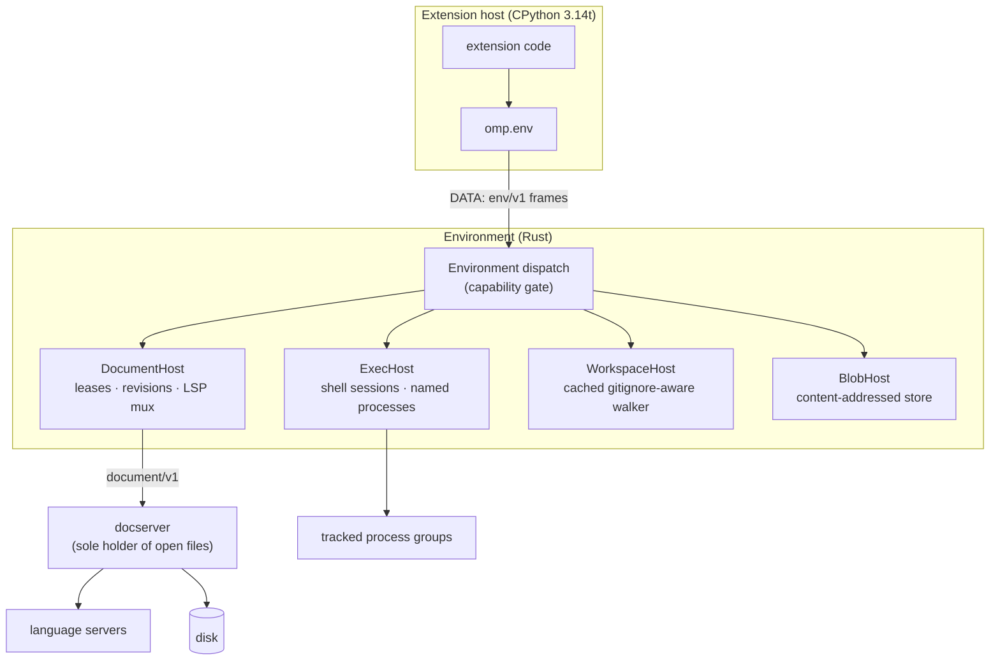

# `omp.env` — the DATA socket

> **Design document, not a runtime API guarantee.** This corpus includes proposed
> interfaces and historical implementation observations. See
> [implementation status](implementation-status.md) for current owners and known gaps.

## Purpose

`omp.env` is the only door to the world. Every byte an extension reads, every process it starts,
every edit it lands, and every directory it walks travels over one scoped `env/v1` client held by
the extension host and served by the Environment. The host process itself owns no files, no
process table, no sockets to third parties: it owns a frame channel, and the Environment owns the
world. That inversion is what removes pi's structural defect. In pi, an extension was a module in
the agent's own isolate with unrestricted `node:fs`, `node:child_process`, and `net`, which meant
three things were simultaneously true and unfixable: an extension's file access could not be
scoped (a "read-only" plugin could `writeFileSync`), an extension's child processes could not be
reclaimed (SIGKILL the agent and `rust-analyzer` outlives it), and an extension's edits raced
every other writer with nothing but `writeFileSync` and hope between them. `omp.env` makes all
three the Environment's problem, in Rust, where a capability check is a branch on a dispatch arm
and a process group is a tracked integer rather than a promise.

Two consequences shape everything below. First, extensions do not read files; they check out
**documents**. A read hands you content pinned to a revision, an edit is a compare-and-swap
against that revision, and a stale write comes back as a structured conflict instead of a clobber.
Second, `omp.env` is not host-only. A body placed with `place="env"`, or with
`place="worker:<name>"` whose site *is* an omp Environment, receives a **scoped** env client:
bulk reads may be direct local I/O — that is the entire point of placing a body next to the data —
but every document **effect** routes through the client, because the docserver is the only process
allowed to hold a project file open and a worker calling `open(path, "w")` would clobber revisions,
desync the LSP mux, and reintroduce exactly the lost-write class centralizing the docserver
deletes. Placement is a performance optimization; it does not opt out of a correctness invariant.
The one exception is a `place="worker:<name>"` site with no omp Environment at all (the HPC/SSH
case): there is no docserver there, so there is no env client and no invariant to honour. Such a
worker is classed **unmanaged/trusted** — the first revision called it "compute/read-only by
manifest declaration", which overstated what a declaration can do: a declaration cannot make
arbitrary Python read-only; only an enforcement boundary can (`docs/py/04-placement.md` records
that reversal). That is an explicit escape hatch, not the normal path. See
`docs/py/04-placement.md` for placement kinds and
[Worker-scoped clients](#worker-scoped-clients) below for the method-level split.

An extension declared by a remote workspace has its `omp.env` scoped to the **remote**
Environment, never the client's disk. There is no local-filesystem fallback anywhere in this
namespace. See `docs/py/14-deploy.md` for how an extension declared remotely differs from one
installed on the client.

## Concepts

### One socket, four resource owners



Four owners, one gate. `omp.env` never hands you a file descriptor, a PID, or a path you can act
on directly; it hands you a handle whose methods are frames. Cancelling the Python coroutine that
holds the handle drops the handle, which drops the guard, which reclaims whatever escaped —
structurally, not by convention. That holds for every *resource* in this document. The *process* a
Python device runs in now follows the same shape at a coarser grain: each extension runs in its
own host process — the topology `docs/py/00-overview.md` fixes as final, keyed
`(layer, tier, extension)` — so cancelling a Python device call has a blast radius of exactly one
extension's process group. Callback entry is serialized per extension (actor semantics;
concurrency is `concurrency=N` / `threadsafe=True` opt-in), different extensions proceed
concurrently, and a long-running approval never suspends a coroutine at all, because approval is
a durable Core-owned ticket (`docs/py/06-policy.md`). This document previously described that
process wrongly, twice; both retractions are recorded under
[Failure and cancellation semantics](#failure-and-cancellation-semantics).

This is also the clause that `PLAN.md` §D6 (D6, one mailbox, no gate chain, amended
2026-08-19) leans on. D6
deletes the batch-level admission scheduler and parallelism detection from the loop, and
says plainly where the guarantees moved instead: "Safety lives in env invariants (docserver
revisions reject stale writes as structured `Fault`s; the exec session serializes its own
requests)." Both halves of that sentence are this namespace. A revision-pinned compare-and-swap
returning `omp.env.Conflict` is the first; `Session.run` serializing its own commands is the
second. A tool batch runs exactly as the model issued it because it does not need admission
control — it needs invariants that make a bad batch a structured fault instead of a corrupted file.
The scope Rev 2 could only state as a reading is now D6's own text: D6 forbids **batch-level
admission scheduling in the mailbox loop**, not the per-invocation decision procedure. Core runs
that procedure during the ADMISSION phase of `omp.InvocationPhase` (`docs/py/03-params.md`), and
the environment's per-invocation admission query — after `InvokeTool`, before the frame that marks
`EFFECTS_AUTHORIZED` — remains the wire mechanism Core answers. Each invocation gates
independently; one slow approval never serializes the batch. The **D6 wording amendment Rev 2
flagged as recommended was ratified 2026-08-19** — the prohibition binds the batch dispatch path,
not the per-invocation procedure — and the flag is kept here as the historical record; see
`docs/py/05-hooks.md`. The env-side refusal for operations attempted before
`EFFECTS_AUTHORIZED` is `omp.EffectsNotAuthorized` (`docs/py/00-overview.md`); this document's
gate sits behind it. See `docs/py/06-policy.md`.

### Why documents, not files

The blogpost's five-step racing-patch flow is the reason. Two agents edit the same file: agent 1
takes it from revision #1 to #2, agent 2 from #2 to #3. Agent 1 now edits again holding #2.
Contrary to popular belief, this does not fail:

```
1. open        →  head is #3, your pin says #2                     (mismatch, not an error)
2. locate      →  apply your ops against retained #2               (your intent, exactly)
3. rebase      →  fuzzy 3-way #2→#3 inside the docserver, → #4     (rebased = true)
4. format      →  LSP roundtrip on the provisional text, → #5      (formatted = true)
5. persist     →  fingerprint recheck, temp file, rename, → #5     (COMMITTED event)
```

Every step happens in one place — the docserver, the only process allowed to hold a project file
open. The rebase at step 3 sees both racing edits instead of guessing about them: it takes a Myers
diff of `base → head`, keeps only the `Equal` regions that occur exactly once on *both* sides, and
maps each of your byte ranges into one of those unique regions. There is no similarity percentage
and no fuzz factor; an edit either lands in a provably unchanged unique region or it does not. If
it does not, you get a `Conflict` carrying the ranges that collided, expressed in *your* base
coordinates, and nothing was written.

The LSP roundtrip at step 4 is muxed next to the same authority, so a language server observes one
linear history instead of three interleaved ones, and the daemon suppresses the echo of its own
edits back to the server that produced them. The rename at step 5 is preceded by a re-check of
both the transaction generation and the on-disk fingerprint, so a background task that finished
computing against a revision you already replaced cannot land. Two agents or twenty, same five
steps, one place.

What this buys an extension: `open` costs one round trip and pins a revision; every subsequent
`read` on that lease is served from the actor's immutable in-memory head and never touches disk;
your edit either commits, rebases, or conflicts, and it tells you which.

### Where policy lives

Capabilities are enforced in Rust on the Environment side of the socket, on the dispatch arm, per
connection. They are not checked in Python, because a check in Python is a check the checked code
could have skipped. `omp.env.has()` exists so you can *degrade gracefully*; it is not the
enforcement point, and calling a denied method without checking first is a perfectly ordinary
thing to do — you get `omp.env.Denied` instead of a silent no-op.

Two layers do the bounding, and they compose. The **capability set** is per connection and
static: the manifest's granted intents, checked on every dispatch arm. The **effect token** is
per invocation and dynamic: the device's declared `omp.Effects` envelope
(`docs/py/01-devices.md`), narrowed — never widened — by hooks at admission
(`docs/py/06-policy.md`), minted by Core at `EFFECTS_AUTHORIZED`, and enforced by the Environment
on every DATA operation without re-prompting. One approval covers one logical action; a call that
tries to escalate beyond its envelope — a "read" device opening a network socket — fails env-side
with `Denied` naming the envelope, rather than producing a second surprise dialog.

The honest caveat, stated once here and again in the closing section: capability enforcement on
the DATA socket bounds what an extension can do *through `omp.env`*. It does not by itself stop
`import os` in the host process. For untrusted extensions the host process must additionally run
under an OS sandbox (Landlock/bwrap on Linux, Seatbelt on macOS) compiled from the manifest, and
that sandbox — not the socket — is what makes `env.fs.read`-only actually mean read-only. What
the sandbox actually delivered is a runtime fact, not a hope: the `SandboxEnforcement` receipt
(`docs/py/06-policy.md`) records the achieved grade per dimension, and when a manifest declares
ENFORCE and the host cannot meet it, the Environment refuses to run the extension — degradation
to observation is never silent. Trust tiers and what each tier grants are
`docs/py/00-overview.md`; profile authoring is `docs/py/06-policy.md`.

### Latency classes

| Class | Meaning | Typical cost |
|---|---|---|
| `local` | Host-side only, no frame | sub-µs |
| `data-rtt` | One DATA round trip | ~tens of µs in-process, ~0.1–1 ms over UDS, network RTT remote |
| `disk` | One round trip plus a filesystem operation the Environment performs | fs-bound |
| `stream` | Opens a correlated event stream; per-event cost is `data-rtt`, total is unbounded | unbounded |

Per-turn and per-call use of any of these is fine. `stream` handles must be consumed or dropped;
an abandoned stream costs the Environment a task until its guard drops.

### Effect authorization

Every DATA operation is checked against the invocation that issued it, and the Environment knows
which phase that invocation is in. Before `EFFECTS_AUTHORIZED` — the `omp.InvocationPhase` state
at which Core issues the invocation's unforgeable effect token (`docs/py/03-params.md`) — the
Environment rejects the call with `omp.EffectsNotAuthorized`. That covers *reads as well as
writes*: a denied read that already happened has leaked content even though the world is
untouched, so confidentiality gates at the same phase effects do. Once authorized, mutating
operations are additionally checked against the token's effect envelope (see
[Where policy lives](#where-policy-lives)); the per-method **Effect** marker below records which
operations that second check applies to.

The first revision of this document split every method into **Speculative** (permitted before
commit) and **Effect** (refused before commit), and promised that a lease opened during
speculation survives commit. Under the Rev 2 rulings that was wrong twice over, and the change is
recorded rather than repainted. First, "commit" is now reserved vocabulary: in the invocation
state machine it names only `ASSISTANT_ITEM_COMMITTED`, and the gate this namespace enforces is
`EFFECTS_AUTHORIZED`, a later state. Second, and more materially: in v1 a third-party device body
does not run before `EFFECTS_AUTHORIZED` at all — it receives final, policy-approved arguments
and starts inside the authorized window (`docs/py/01-devices.md`), so there is no
extension-visible speculative window for the old classification to describe. The speculative half
of the wire (`ArgText` preceding authorization) is real, and core tools use it internally;
extension code never observes it. The per-method classification survives as generated
`OperationSpec(minimum_phase, durability, cost, authority)` metadata and the phase legality
matrix, both owned by `docs/py/00-overview.md`.

What survives untouched is the property that made the old section worth having: a call that only
ever existed in stream deltas is never authorized, so nothing it might have done happens and the
world stays untouched. And within the authorized body, open a document once — `dry_run` and the
subsequent compare-and-swap target the same pinned revision, with no reopen and no race.
"Prepare tokens" — speculative preparation permitted after read/confidentiality policy has
approved the requested resources — are future work specified in `docs/py/03-params.md`, with one
invariant fixed now: an effect token may authorize a subset of a prepared plan, but it may never
change the identity of resources already read.

One vocabulary note so the racing-patch flow above still reads correctly: a document
*transaction* commit (`CommitTransaction`, the `COMMITTED` document event, `txn.commit()`) and a
blob commit (`CommitBlobPut`) are docserver and blob-store domain terms for a revisioned change
becoming durable, and they keep their names; the reserved word applies to the invocation state
machine only.

### Worker-scoped clients

A placed body is a **leaf with respect to Agent Core**: no hooks, no UI effects, no journal
writes, no credential or subagent requests. It is *not* a leaf with respect to the Environment. A
worker co-located with an Environment sits inside the same trust boundary, and the Environment
enforces policy identically regardless of which side of the supervisor the caller is on.

```
                        may issue on DATA                        must not issue
  ────────────────────────────────────────────────  ──────────────────────────────────────────
  host client   every frame in this document        —
  place="env"   OpenDocument · CloseDocument        InvokeTool          (re-entrant dispatch)
  worker:<omp>  ReadDocument · SummarizeDocument    StartProcess        (orphans on eviction)
                CommitTransaction                   StopProcess
                path operations                     SignalProcess
                BlobStat · BlobGet                  ListProcesses
                BlobPut + CommitBlobPut             AttachOutput
                OpenSession · Exec · Stdin · Signal BlobDelete          (not a compute op)
                Interrupt (own invocation only)     Retire · ClientHello
  worker:<bare> — no env client exists —            unmanaged/trusted (docs/py/04-placement.md)
```

Four rules make that table sound:

1. **Scope arithmetic.** A worker's scope is the declaring extension's granted capability set
   intersected with the invocation's scope. It is never wider than the host client's, and it is
   computed and enforced env-side in Rust, never in Python. A worker cannot renegotiate upward
   because the supervisor performs the handshake and the worker inherits the scoped session —
   `ClientHello` is not available to it.
2. **No re-entrant dispatch.** `InvokeTool` is an Agent-Core-side edge. A worker calling devices
   would be the ambient-authority hole placement exists to avoid. Host-placed composition uses
   `omp.devices.invoke`; each inner call opens a fresh independently admitted and policy-gated
   invocation (`docs/py/01-devices.md`).
3. **No named-process ownership.** A worker is disposable; a named process outlives its starter by
   design. A disposable owner is an orphan generator, so the whole `proc` family is host-only.
4. **Direct reads carry no revision.** Reading bytes off local disk beside the Environment is
   permitted and is the reason to place a body there at all — but a value obtained that way has no
   `Revision` and therefore can never be the base of a compare-and-swap. If you read directly and
   then want to edit, re-open through the client. Skipping that step is precisely the lost-write
   class the docserver exists to delete.

Two consequences for handles. A `Doc` opened inside a worker is owned by the *supervisor's*
connection and pinned to the invocation guard, so it releases when that guard drops; the
host-opens-and-ships-bytes pattern remains legal but is no longer the only legal shape. A lease id
is never transferable between connections — the Environment checks ownership per connection, so
handing the host's lease bytes to a worker (or the reverse) is refused rather than honoured.
`doc.pin()` inside a worker warns and does nothing, because there is no post-invocation host
lifetime for it to survive into.

## Reference

### Typed locations

Remote-first architecture and plain path strings do not mix: a bare `str` does not say which
machine it names, and in this SDK that question always has a real answer. Every location-bearing
value is therefore a typed class, and every signature below takes and returns them — no public
method in this namespace accepts a raw path string. The first revision passed
`str | os.PathLike` everywhere; that is gone, not deprecated.

#### `class omp.EnvPath`

A location in the **Environment's** filesystem namespace — the workspace root and everything
under it, wherever that machine is. Owned by this document; `docs/py/09-journal.md`'s
`omp.state_dir()` returns one, and every fs, doc-lease, exec, and process signature below takes
them.

- `omp.EnvPath("src/lib.rs")` — construct from a workspace-relative or absolute string. This
  constructor is the one place a raw string is spelled.
- `path.uri -> str` — the absolute `file://` URI under `info().root`.
- `path.join(*parts) -> EnvPath` — pure path arithmetic; no I/O, `local`.
- `await path.read_text(encoding="utf-8") -> str` / `await path.read_bytes() -> bytes` — sugar
  over a one-shot `omp.env` document read (`DOC_READ`, `data-rtt`); routed over DATA like
  everything else, never local I/O.
- `path.local_path() -> pathlib.Path` — the **only** conversion to a native local path, and it is
  explicit and placement-checked: it raises `omp.PlacementError` (`docs/py/04-placement.md`)
  unless the calling body is genuinely colocated with the Environment *and* the active sandbox
  scope covers the directory. An `EnvPath` is deliberately **not** `os.PathLike`: passing one to
  `open()` fails loudly instead of silently reading the wrong machine.
- `str(path)` — the workspace-relative `/`-separated form, for display and payloads.

#### `class omp.ClientPath`

A location on the **client** machine: an attachment the user dropped, an editor-side file, a UI
image source (`docs/py/07-ui.md`). No `omp.env` method accepts one — the type exists precisely so
that handing the Environment a client-machine location is a type error at the call site rather
than a `NotFound` (or worse, the wrong file) at runtime. It carries the same `.uri` / `.join()`
surface; it has no `local_path()` on the host at all, because the host is not the client either.

#### `omp.BlobRef`

The third typed location this document owns: content-addressed, scoped to one Environment's blob
store. Documented in full under [Blobs](#blobs--ompenvblobs). The remaining typed locations are
owned elsewhere and only referenced here: `ArtifactUrl`/`HistoryUrl`/`AgentUrl`
(`docs/py/09-journal.md`), `omp.ToolPath` (`docs/py/01-devices.md`), `WorkspaceUri`
(`docs/py/14-deploy.md`).

### Connection and capability

#### `omp.env.info() -> EnvInfo`

Returns the identity the Environment advertised during its handshake. Cached at host startup;
never re-fetched, because a new identity means a new connection.

- **Channel** DATA (cached) · **Latency** `local` · **Capability** none · **Fail** open

```python
info = omp.env.info()
if info.remote:
	omp.log(f"workspace {info.root.uri} on {info.server_version}")
```

#### `class omp.env.EnvInfo`

Frozen dataclass.

| Field | Type | Meaning |
|---|---|---|
| `workspace_id` | `bytes` | Canonical 16-byte workspace identity; stable across reconnects to the same project. |
| `root` | `EnvPath` | The workspace root. Every `EnvPath` resolves under it; `info().root.uri` is the absolute `file://` URI. |
| `server_epoch` | `bytes` | Opaque identity regenerated whenever the Environment loses its transaction-outcome ledger. Transaction idempotency keys are scoped to it. |
| `server_version` | `str` | Human-readable build version. |
| `server_build` | `str` | Content hash of the serving executable; empty when the Environment cannot determine its own build identity. |
| `schema_rev` | `int` | Negotiated `env/v1` schema revision. |
| `capabilities` | `frozenset[Capability]` | Exactly what this connection may do. |
| `remote` | `bool` | `True` when the Environment is not on the same machine as the client. |

#### `class omp.env.Capability`

`enum.StrEnum`. Members are the manifest-facing capability strings, so a manifest entry and a
runtime check spell the same thing.

| Member | String | Grants |
|---|---|---|
| `DOC_READ` | `env.doc.read` | `docs.open`, `Doc.read`, `Doc.read_bytes`, `Doc.lines`, `Doc.summary`, `Doc.events`, `Doc.dry_run` |
| `DOC_WRITE` | `env.doc.write` | `Doc.edit`, `Doc.write`, `Doc.hashline`, `Doc.replace`, `Doc.move_to`, `Doc.delete`, `docs.transaction` |
| `FS_READ` | `env.fs.read` | `fs.stat`, `fs.lstat`, `fs.list_dir`, `fs.read_link`, `fs.canonicalize` |
| `FS_WRITE` | `env.fs.write` | `fs.mkdir`, `fs.remove`, `fs.rename`, `fs.copy`, `fs.symlink`, `fs.hard_link`, `fs.chmod` |
| `EXEC` | `env.exec` | `sh.session`, `sh.run`, `Run.*` |
| `PROCESS` | `env.process` | `proc.start`, `proc.ensure`, `proc.adopt`, `proc.list`, `Process.*` |
| `BLOB` | `env.blob` | `blobs.put`, `blobs.get`, `blobs.stream`, `blobs.stat`, `blobs.delete`, `blobs.writer` |
| `SEARCH` | `env.search` | `find.files`, `find.walk`, `find.grep` |
| `LSP` | `env.lsp` | `lsp.bindings`, `lsp.request`, `lsp.notify`, `lsp.events` |
| `NET` | `env.net` | `http_get`, `http_post`, `http_put` through Environment-brokered scoped egress |
| `WORKSPACE_SNAPSHOT` | `env.workspace.snapshot` | `omp.agents.snapshot`, `.snapshots`, `.restore` — the methods live in `docs/py/12-agents.md`; no `env/v1` frame exists yet |
| `WORKTREE` | `env.worktree` | Isolated-worktree creation, destruction, and merge for subagents — `docs/py/12-agents.md`; no `env/v1` frame exists yet |

`SEARCH` does not imply `FS_READ`: a walker result is a list of names and sizes, not content.
`DOC_WRITE` does not imply `FS_WRITE`: replacing a file's bytes is a revisioned content commit,
while unlinking it is a filesystem mutation. `LSP` does not imply `DOC_WRITE`, but a
`workspace/applyEdit` a language server initiates in response to your request is lowered into a
document transaction by the docserver and requires `DOC_WRITE` on your connection; without it the
server's edit is refused and your request returns the server's own result unchanged.

The last two members are granted-but-unimplemented and exist so a caller can degrade rather than
crash: `omp.env.has(Capability.WORKSPACE_SNAPSHOT)` is `False` on every Environment today.

#### `await omp.env.worktree() -> omp.env.WorktreeInfo | None`

Returns the isolated worktree containing the current workspace, or `None` for the primary
workspace. `omp.env.WorktreeInfo` is a frozen dataclass with `id: str`, `root: EnvPath`,
`base: str`, and `generation: int`; the generation fences stale topology. The Python symbol is
frozen ahead of the host arm and currently raises `omp.NotWiredError` without performing I/O.

#### `omp.env.has(*caps: Capability) -> bool`

`True` only when every named capability is granted.

- **Channel** none · **Latency** `local` · **Capability** none · **Fail** open

#### `omp.env.require(*caps: Capability) -> None`

Raises `omp.env.Denied` naming the first missing capability. Use at import time to fail an
extension load loudly rather than at first tool call.

- **Channel** none · **Latency** `local` · **Capability** none · **Fail** closed

```python
omp.env.require(omp.env.Capability.PROCESS, omp.env.Capability.LSP)
```

### Exceptions

Every exception in the table below derives from `omp.env.EnvError`, which derives from
`Exception` and carries a `fault: Fault` attribute — `omp.Fault` being the serializable, durable
*value* that `docs/py/02-verdicts.md` owns. The first revision said `EnvError` derives from
`omp.Fault` itself, so that an uncaught one "becomes a typed fault". That conflated a durable
value with a control-flow hierarchy, and it is retracted: a `Fault` is data that outlives the
call; an exception is how Python unwinds. The two meet by lowering, not inheritance — the
framework catches a known `EnvError` and lowers `exc.fault` into the call's `omp.CallOutcome` as
`Faulted`; an arbitrary exception is a bug, not a domain outcome, and becomes `Aborted`. You keep
ergonomic `try/except omp.env.Conflict` control flow *and* the semantic distinction between an
expected domain failure and a defect.

```python
class Fault: ...            # serializable durable value — docs/py/02-verdicts.md owns it

class EnvError(Exception):  # this document owns it
	fault: Fault
```

Two exceptions sit outside that tree. **`omp.EnvUnavailable`** derives from `omp.OmpError` and
means *there is no env client in this placement at all*: the bare `place="worker:<name>"` case,
a site with no omp Environment, where the body is an unmanaged/trusted worker. It is deliberately
not an `EnvError`, because the remedy is different in kind — a missing client is a manifest or
placement mistake surfaced at load, while every `EnvError` is a runtime outcome of an operation
that really was attempted. Catching `omp.env.EnvError` must not accidentally swallow "this code
cannot run here". See `docs/py/04-placement.md`.

**`omp.EffectsNotAuthorized`** (`docs/py/00-overview.md` owns it) is raised when a DATA operation
arrives before its `OperationSpec.minimum_phase` — for everything in this namespace, before the
invocation reached `EFFECTS_AUTHORIZED`. It replaces the first revision's `env.Uncommitted`:
"commit" is reserved vocabulary now (`docs/py/03-params.md`), and the condition was never about a
commit anyway — it is about authorization. The `env/v1` wire code is still `UNCOMMITTED`, because
wire arms evolve additively and the frame vocabulary predates the rename; only the Python name
changed.

| Exception | Raised when | Wire code |
|---|---|---|
| `EnvError` | Base. Carries `.message: str`, `.capability: Capability \| None`, and `.fault: Fault`. | — |
| `Denied` | The connection lacks the capability, or a sandbox profile refused the operation. | `PERMISSION_DENIED` |
| `QuotaExceeded` | A per-extension DATA quota is exhausted — see [Quotas on the DATA side](#quotas-on-the-data-side). Carries `.quota: str` and `.limit`. | `RESOURCE_EXHAUSTED` |
| `NotFound` | Document, path, session, exec, process name, or blob does not exist. | `NOT_FOUND` |
| `AlreadyExists` | A destination exists and the chosen `Overwrite` policy forbids replacement; or a process name is live. | `ALREADY_EXISTS` |
| `Conflict` | A revisioned mutation could not be rebased. Carries `.expected`, `.current`, `.ranges`. | `PRECONDITION_FAILED` |
| `Stale` | A pinned revision has aged out of retained history and cannot be read or rebased from. | `PRECONDITION_FAILED` |
| `PreconditionFailed` | Any other precondition: an active lease blocks a displacement, a destination revision did not match. | `PRECONDITION_FAILED` |
| `Unsupported` | The Environment or host filesystem cannot perform the operation (independently mutable execute bit, cross-device atomic rename, unknown LSP method). | `UNSUPPORTED` |
| `Invalid` | Malformed argument: empty search pattern, non-absolute path escaping the workspace, unsorted or overlapping edit ranges. | `INVALID_ARGUMENT` |
| `Cancelled` | The operation was cancelled — by coroutine cancellation, guard drop, or interrupt. | `CANCELLED` |
| `TimedOut` | The invocation deadline elapsed while the operation was in flight. | `DEADLINE_EXCEEDED` |
| `Io` | The Environment's filesystem returned an error with no more specific classification. Carries `.errno`. | `IO` |
| `Disconnected` | The DATA transport closed. Terminal for every handle on that connection. | — |
| `StreamLost` | A correlated event stream lost continuity. Carries `.skipped: int` and `.reason`. | — |
| `Partial` | A multi-operation transaction failed after at least one operation became durable. Carries `.committed: list[EditResult]` and `.failed_index: int`. | `PRECONDITION_FAILED` |

`StreamLost` is not recoverable by retrying the read; it means no later event on that stream may
be treated as contiguous. For a document event stream the lease is already closed server-side:
discard the `Doc` and reopen. For the LSP registry stream the connection is being closed:
reconnect, reopen documents, and re-query `lsp.bindings` before issuing another revision-sensitive
request.

### Document leases — `omp.env.docs`

#### `await omp.env.docs.open(path, *, language=None, create=False) -> Doc`

Acquires a lease and pins it to the immutable head the Environment returns. The first lease on a
document may hit disk and installs a native watch on its parent directory before publishing the
head; later opens are memory-only. The lease keeps the document actor, its watch, its cached head,
and its event subscription alive.

- **Arguments** `path: EnvPath` — see [Typed locations](#typed-locations); resolved under
  `info().root`. `language: str | None` — LSP language id (`"rust"`, `"typescript"`); `None`
  infers from the path or leaves the document unclassified. `create: bool` — when `True`, a
  missing document opens with `presence == Presence.MISSING` and byte length 0 so you can commit
  content into it; when `False`, a missing document raises.
- **Returns** `Doc`
- **Raises** `NotFound`, `Denied`, `Invalid`, `Io`
- **Channel** DATA · **Latency** `disk` first open, `data-rtt` after · **Capability** `DOC_READ`
- **Cancellation** Cancelling the open leaks nothing: either the lease was never created or its
  drop releases it.
- **Fail** closed

```python
async with await omp.env.docs.open(omp.EnvPath("src/lib.rs")) as doc:
	head = doc.revision
	body = await doc.read()
```

#### `class omp.env.Doc`

An async context manager. Exiting closes the lease. Dropping it without closing sends a
best-effort close, which is why cancellation is safe.

| Property | Type | Meaning |
|---|---|---|
| `path` | `EnvPath` | Current location. Updated in place by a successful `move_to`. |
| `uri` | `str` | Absolute `file://` URI of the current path. |
| `id` | `bytes` | Canonical daemon document identity. Survives an in-daemon rename; a `Doc` for the same file opened twice has the same `id` and different lease ids. |
| `revision` | `Revision` | The pinned revision. Advances only on a *committed* mutation through this handle. |
| `presence` | `Presence` | `PRESENT` or `MISSING`. |
| `kind` | `Kind` | `TEXT` or `BINARY`. |
| `language` | `str \| None` | Resolved language id; `None` for binary or unclassified text. |
| `byte_length` | `int` | Byte length of the pinned revision. |
| `pinned` | `bool` | `True` when `pin()` was called; a pinned lease is not released by invocation teardown. |

##### `await doc.read(*, lines=None, byte_ranges=None) -> str`
##### `await doc.read_bytes(*, lines=None, byte_ranges=None) -> bytes`

Reads from the exact pinned revision, served from the actor's memory. `lines` and `byte_ranges`
are sequences of `(start, end)` pairs, **zero-based and half-open**; passing both is `Invalid`;
passing neither reads the whole document. Multiple ranges return concatenated in request order,
and `read_bytes` additionally exposes each slice's original offsets via
`doc.last_slices: tuple[Slice, ...]`.

- **Raises** `Stale` (pin aged out of retained history — the read never falls back to disk),
  `Invalid` (range beyond the document), `Denied`, `Disconnected`
- **Channel** DATA · **Latency** `data-rtt` · **Capability** `DOC_READ` · **Fail** closed

##### `await doc.lines(*ranges) -> list[str]`

Convenience over `read`: returns one string per line, one-based inclusive ranges, matching how
line ranges are spelled in tool arguments and in hashline. `doc.lines((10, 20))` returns eleven
strings.

- **Channel** DATA · **Latency** `data-rtt` · **Capability** `DOC_READ` · **Fail** closed

##### `await doc.summary(options=None) -> Summary | SummaryUnavailable`

Structural tree-sitter summary of the pinned revision: declarations kept, bodies elided, with a
rendered form and the exact line ranges that were dropped so a follow-up read can recover them.
This is the same summarizer the `read` core tool uses, so an extension and the harness produce
identical elisions for the same revision.

- **Arguments** `options: SummaryOptions | None`
- **Returns** `Summary` when the document parsed and elided; `SummaryUnavailable` (with a machine
  reason) otherwise. Structural failure is a value, not an exception, because the correct response
  is always "issue an ordinary read instead".
- **Channel** DATA · **Latency** `data-rtt` (summaries are cached per revision) · **Capability**
  `DOC_READ` · **Fail** closed

##### `await doc.dry_run(ops, *, format=Format.OFF) -> EditPlan`

Resolves a mutation against the pinned revision and returns what it *would* do, without touching
disk and without a transaction. This is the plan half of an edit — call it as many times as you
like; nothing becomes durable until the compare-and-swap.

- **Arguments** `ops: Sequence[Edit] | str | HashlinePatch | ReplaceOps` — the same shapes `edit`
  accepts. `format` — whether the plan should include the LSP formatting delta.
- **Returns** `EditPlan(revision, edits, preview, first_changed_line, warnings)`
- **Raises** `Invalid` (unparseable patch, unsorted or overlapping ranges, unresolvable block or
  register), `Stale`, `Denied`
- **Channel** DATA · **Latency** `data-rtt` · **Capability** `DOC_READ` · **Fail** closed

##### `await doc.edit(ops, *, on_stale=OnStale.REBASE, format=Format.BEST_EFFORT, txn_id=None) -> EditResult`

Compare-and-swap. Submits `ops` with the lease's pinned revision as the base. On success the
lease advances to the committed revision; on rejection or partial commit the pin is left
untouched, so you can never write from a head you never observed.

- **Arguments**
  - `ops: Sequence[Edit]` — exact byte replacements in base coordinates, sorted by `start` and
    non-overlapping. Also accepts `str` (whole-content replacement), `HashlinePatch`, or
    `ReplaceOps`; those lower to byte edits inside the docserver's adapter registry, not in Python.
  - `on_stale: OnStale` — what to do when the base is no longer the head.
  - `format: Format` — the LSP formatting roundtrip policy.
  - `txn_id: bytes | None` — idempotency key, unique within `info().server_epoch`. Omit and one is
    generated. Retrying with the same key returns the *original* outcome and never re-applies
    anything, which is what makes a retry after `Disconnected` safe.
- **Returns** `EditResult`
- **Raises** `Conflict` (rebase impossible, or `on_stale=FAIL` and the base moved), `Stale`,
  `PreconditionFailed`, `Unsupported` (`format=REQUIRED` with no server that can synchronize the
  provisional text), `Invalid`, `EffectsNotAuthorized`, `Denied`, `Io`
- **Channel** DATA · **Latency** `disk` (plus one LSP roundtrip when formatting) · **Capability**
  `DOC_WRITE` · **Effect** yes
- **Cancellation** Cancelling before the response leaves the transaction's outcome recorded
  server-side. Re-issue with the same `txn_id` to learn what happened; the operation is not rolled
  back by your cancellation.
- **Fail** closed

##### `await doc.write(content, *, on_stale=OnStale.REBASE, format=Format.BEST_EFFORT, txn_id=None) -> EditResult`

Replaces the whole document. Equivalent to `edit` with a single full-span replacement, except that
on a `MISSING` document it creates it. Creation defaults to failing if the path appeared in the
meantime; pass `on_stale=OnStale.REPLACE` to overwrite through the ordinary revisioned commit path.

- **Capability** `DOC_WRITE` · **Effect** yes · **Fail** closed

##### `await doc.hashline(patch, *, on_stale=OnStale.REBASE, format=Format.BEST_EFFORT) -> EditResult`

Submits a hashline patch as an opaque format proposal. The `[path#TAG]` snapshot tag, `PUT`/`CUT`/
`REM`/`MV` vocabulary, range and block resolution, and named registers are resolved by the
docserver's hashline adapter against the pinned revision — the same code path the core `edit` tool
uses, including the session-shared register clipboard. An extension gets range resolution and
block ops for free and cannot drift from the harness's dialect.

- **Raises** `Invalid` with the parse position and the expected shape, `Conflict`, `Stale`
- **Capability** `DOC_WRITE` · **Effect** yes · **Fail** closed

##### `await doc.replace(old, new, *, count=1, on_stale=OnStale.REBASE, format=Format.BEST_EFFORT) -> EditResult`

Submits a replace-dialect proposal. `count` bounds the number of occurrences; a mismatch between
`count` and the occurrences found is `Invalid` with both numbers, never a partial apply.

- **Capability** `DOC_WRITE` · **Effect** yes · **Fail** closed

##### `await doc.move_to(dest, *, content=None, overwrite=Overwrite.FAIL, txn_id=None) -> EditResult`

Moves the document identity to `dest`, optionally installing exact final bytes at the destination
in the same transaction. The source revision and the destination precondition are both checked
before either path is durably changed. A destination holding any active lease is never displaced,
regardless of precondition — an active document identity is never silently retired or aliased.

- **Raises** `AlreadyExists`, `PreconditionFailed` (destination has a live lease), `Unsupported`
  (cross-device), `Conflict`, `EffectsNotAuthorized`, `Denied`
- **Capability** `DOC_WRITE` · **Effect** yes · **Fail** closed

##### `await doc.delete(*, txn_id=None) -> None`

Deletes the document with the pinned revision as precondition. The lease is invalid afterwards.

- **Capability** `DOC_WRITE` · **Effect** yes · **Fail** closed

##### `await doc.refresh() -> Revision`

Re-pins the lease to the current head and returns it. The `Doc`'s `revision`, `presence`,
`byte_length`, and `path` update in place. Use after observing an external `DocEvent`; do not use
as a substitute for `on_stale=REBASE`, which is strictly better because it preserves your intent
against the old base.

- **Channel** DATA · **Latency** `data-rtt` · **Capability** `DOC_READ` · **Fail** closed

##### `doc.events() -> AsyncIterator[DocEvent]`

Unsolicited events for this lease: your own commits and every external change. External events
arrive only after the actor has discarded provisional state and stably re-read disk, so the read
that follows an event is memory-only and consistent with it.

- **Channel** DATA · **Latency** `stream` · **Capability** `DOC_READ`
- **Raises** `StreamLost` — the lease is already closed server-side; reopen.
- **Fail** open (a dropped iterator is not an error)

##### `doc.pin() -> None`

Marks the lease as surviving the invocation. Without a pin, invocation teardown releases the
lease; a background task keyed on the pinned revision — an indexer, a follow-up turn — would then
have to reopen and would re-pin to whatever the head became. The first revision motivated `pin()`
as "the revision your dry-run pinned survives commit"; that framing described the speculative
window v1 device bodies no longer have (see [Effect authorization](#effect-authorization)).
Within one invocation no pin is needed — the body opens the lease and uses it inside a single
authorized window. `pin()` is idempotent and does not extend the lease past the extension's own
lifetime; `close()` still releases it.

- **Channel** none · **Latency** `local` · **Capability** none · **Fail** open

##### `await doc.close() -> None`

Releases the lease. Idempotent. Prefer `async with`.

#### `omp.env.docs.transaction(*, txn_id=None) -> Txn`

Async context manager producing one multi-operation document transaction. Operations execute in
declared order against a transaction-local overlay, so a create followed by an edit of the same
path works.

```python
async with omp.env.docs.transaction() as txn:
	txn.edit(mod_doc, [omp.env.Edit(0, 0, b"pub mod generated;\n")])
	txn.create(omp.EnvPath("src/generated.rs"), body, format=omp.env.Format.REQUIRED)
	result = await txn.commit()
```

##### `Txn` methods

| Method | Meaning |
|---|---|
| `txn.edit(doc, ops, *, on_stale=..., format=...)` | Queue a text mutation against `doc`'s pin. |
| `txn.create(path, content, *, overwrite=Overwrite.FAIL, format=...)` | Queue a creation. |
| `txn.write(doc, content, *, on_stale=..., format=...)` | Queue a whole-content replacement. |
| `txn.move(doc, dest, *, content=None, overwrite=...)` | Queue a move, optionally with content. |
| `txn.delete(doc)` | Queue a delete. |
| `await txn.commit() -> TxnResult` | Send the transaction and await its terminal outcome. |

- **Raises from `commit`** `Conflict` (carrying every conflicting operation index), `Stale`,
  `PreconditionFailed`, `Partial`, `EffectsNotAuthorized`, `Denied`, `Io`
- **Capability** `DOC_WRITE` · **Effect** yes · **Fail** closed

`omp.env.Partial` is a distinct exception because local filesystems provide no atomic multi-path
replacement. It carries `.committed: list[EditResult]` and `.failed_index: int`. Do **not** infer
rollback. Re-issuing the same `txn_id` returns this same terminal outcome, which is how a retry
after a disconnect learns the truth instead of doubling the damage.

#### Document value types

##### `class omp.env.Revision`

Frozen. `sequence: int` (monotone within one document) and `content_hash: bytes` (BLAKE3-256 over
the exact stored bytes). Compared by value; echoed whole as an optimistic-concurrency precondition.
`revision.hex` is the lowercase hash for logging. Two documents may share a `sequence`; a
`Revision` is only meaningful against the document it came from.

##### `class omp.env.Edit`

`start: int`, `end: int`, `replacement: bytes`. Zero-based half-open byte range in the *base*
revision's coordinate space. Within one mutation, edits must be sorted by `start` and
non-overlapping; violating that is `Invalid`, not silently reordered.

##### `class omp.env.EditResult`

| Field | Type | Meaning |
|---|---|---|
| `revision` | `Revision` | The committed head. |
| `previous` | `Revision` | The base the operation was resolved against. |
| `rebased` | `bool` | A fuzzy 3-way rebase fired. |
| `formatted` | `bool` | An LSP formatting roundtrip changed the text. |
| `changed_ranges` | `tuple[tuple[int, int], ...]` | Ranges in the **finalized** head, after rebase and formatting. |
| `previous_path` | `EnvPath \| None` | Set for a successful move. |

`rebased` is the single most valuable field an extension can journal. It is the signal that made
hashline's ~100 revisions measurable; see `docs/py/10-telemetry.md`.

##### `class omp.env.EditPlan`

`revision`, `edits: tuple[Edit, ...]` (resolved, in base coordinates), `preview: str` (numbered
diff), `first_changed_line: int | None`, `warnings: tuple[str, ...]`. Returned by `dry_run`.

##### `class omp.env.OnStale`

`enum.Enum`.

| Member | Behaviour |
|---|---|
| `FAIL` | Reject with `Conflict` when the base is not the head. |
| `REBASE` | Rebase only ranges whose base context maps unchanged and unambiguously; conflict otherwise. Default. |
| `REPLACE` | Explicit destructive replacement. Valid only with whole-content proposals (`write`, `move_to(content=...)`); `Invalid` with byte edits or a patch dialect. |

##### `class omp.env.Format`

`OFF` — never format. `BEST_EFFORT` — format when a selected server can synchronize the
provisional text, otherwise commit unformatted (default). `REQUIRED` — reject with `Unsupported`
unless formatting succeeded against that exact provisional version.

##### `class omp.env.Overwrite`

`FAIL` — any existing destination is `AlreadyExists`. `REPLACE_FILE` — replace an existing
non-directory without following a destination symlink; never removes a directory.
`REPLACE_EMPTY_DIR` — rename only; replace an existing empty directory. `Invalid` elsewhere.

##### `class omp.env.Presence`

`PRESENT`, `MISSING`.

##### `class omp.env.Kind`

`TEXT`, `BINARY`.

##### `class omp.env.DocEventKind`

| Member | Meaning |
|---|---|
| `COMMITTED` | A transaction committed a new head. `event.txn_id` identifies it. |
| `EXTERNAL_CREATED` | The path appeared outside the daemon. |
| `EXTERNAL_MODIFIED` | Disk content changed outside the daemon. |
| `EXTERNAL_DELETED` | The path was removed outside the daemon. |
| `EXTERNAL_RENAMED` | The path moved outside the daemon; `event.previous_path` is set. |
| `WATCH_RESCANNED` | Native watch overflow or rebind forced a stable disk rescan. Treat as "assume everything changed". |

##### `class omp.env.DocEvent`

`sequence: int`, `kind: DocEventKind`, `revision: Revision`, `previous_revision: Revision`,
`txn_id: bytes | None`, `invalidated_txn_ids: tuple[bytes, ...]`, `previous_path: EnvPath | None`.
`invalidated_txn_ids` names the transactions whose provisional state this event discarded — a
background computation keyed on one of those ids must be abandoned, not retried against the old
base.

##### `class omp.env.SummaryOptions`

`min_body_lines: int = 2`, `min_comment_lines: int = 4`, `unfold_until_lines: int = 0` (0 disables
breadth-first unfolding), `unfold_limit_lines: int = 0` (hard visible-line ceiling),
`prose: bool = False` (enables the markdown/plain-text paths), `min_total_lines: int = 0`,
`render: SummaryRender = SummaryRender.HASHLINE`, `language: str | None = None` (a non-empty value
takes precedence over path inference and does *not* fall back to it).

##### `class omp.env.SummaryRender`

`HASHLINE`, `NUMBERED`, `PLAIN`.

##### `class omp.env.Summary`

`language: str`, `parsed: bool`, `elided: bool`, `total_lines: int`,
`segments: tuple[SummarySegment, ...]`, `text: str`, `display_text: str`,
`elided_ranges: tuple[tuple[int, int], ...]`, `elided_lines: int`. **Summary coordinates are
one-based and inclusive**, deliberately unlike `read`'s zero-based half-open ranges, because they
name source lines a human and a model both count from 1.

##### `class omp.env.SummarySegment`

`kept: bool`, `start_line: int`, `end_line: int`, `text: str | None` (present only for kept
segments, verbatim apart from newline joining).

##### `class omp.env.SummaryUnavailable`

`reason: omp.env.SummaryReason`, `total_lines: int`, `language: str`, `parsed: bool`.
`class omp.env.SummaryReason` has one member per refusal: `BINARY`, `MISSING_DOCUMENT`,
`TOO_LARGE`, `TOO_MANY_LINES`,
`BELOW_MINIMUM_LINES`, `PROSE_DISABLED`, `UNSUPPORTED_LANGUAGE`, `EMPTY`, `SYNTAX_ERROR`,
`NO_ELISIONS`, `PARSER_FAILURE`.

### LSP mux — `omp.env.lsp`

The docserver spawns, initializes, and multiplexes language servers next to the document
authority. An extension never spawns a language server, never sends `initialize`, and never
tracks `didOpen`/`didChange` bookkeeping. All five synchronization notifications
(`textDocument/didOpen`, `didChange`, `didSave`, `didClose`, `willSave`) plus
`textDocument/willSaveWaitUntil` are **actor-owned and refused** on this API; the daemon emits them
according to each server's negotiated `SyncPolicy` as leases open, commit, and release.

#### `await omp.env.lsp.bindings(path) -> list[LspBinding]`

Returns the servers currently bound to a document, with each one's resolved synchronization policy
and its complete `InitializeResult.capabilities` retained losslessly as parsed JSON.

- **Raises** `NotFound`, `Denied` · **Channel** DATA · **Latency** `data-rtt` · **Capability** `LSP`
- **Fail** closed

#### `await omp.env.lsp.request(server, method, params, *, doc=None, on_stale=LspStale.RETRY_HEAD, timeout=None) -> Any`

Sends an arbitrary JSON-RPC request. The daemon injects lifecycle synchronization before
forwarding, so the server has already seen the exact revision you are asking about.

- **Arguments** `server: bytes` — a `LspBinding.server_id`. `method: str`. `params: Any` — JSON.
  `doc: Doc | None` — required for revision-sensitive `textDocument/*` methods, omitted for
  `workspace/*`. `on_stale: LspStale` — `FAIL` or `RETRY_HEAD` when the pinned revision moved.
  `timeout: omp.Duration | None` — durations are `omp.Duration` everywhere
  (`docs/py/00-overview.md` owns the type; config strings like `"30s"` parse into it); `None`
  uses the invocation deadline.
- **Returns** the server's `result`, parsed. The revision actually used is available as
  `omp.env.lsp.last_revision`.
- **Raises** `omp.env.LspFailure` (carrying `.code`, `.message`, `.data` from the server),
  `Unsupported` (lifecycle method, or `willSaveWaitUntil`), `Stale`, `NotFound`, `TimedOut`,
  `Denied`
- **Channel** DATA · **Latency** `stream`-class in the worst case (a cold `rust-analyzer` indexes
  before answering); always give it a `timeout` · **Capability** `LSP` · **Fail** closed

#### `await omp.env.lsp.notify(server, method, params) -> None`

Sends a non-synchronization notification. Acknowledged only after entering that server's ordered
write lane, so a subsequent request cannot overtake it.

- **Raises** `Unsupported` for any of the five lifecycle notifications · **Capability** `LSP`
- **Effect** yes · **Fail** closed

#### `omp.env.lsp.events() -> AsyncIterator[LspEvent | LspBindingEvent]`

Connection-wide server notifications and binding transitions. Document-scoped events carry the
public `Revision` the daemon could prove they belong to; the revision is absent for workspace
events and for unversioned diagnostics that cannot be authoritatively associated with a head — do
not display those as if they described the current text.

- **Latency** `stream` · **Capability** `LSP`
- **Raises** `StreamLost` — the connection is closing; reconnect, reopen, re-query bindings.
- **Fail** open

#### LSP value types

`class omp.env.LspBinding` — `server_id: bytes`, `name: str`, `sync: SyncPolicy`,
`capabilities: dict`.

`class omp.env.SyncPolicy` — `change: omp.env.SyncKind`
(`NONE`/`FULL`/`INCREMENTAL`), `open_close: bool`,
`will_save: bool`, `will_save_wait_until: bool`, `save: bool`, `save_include_text: bool`,
`position_encoding: str` (the exact negotiated `PositionEncodingKind`, normally `utf-8`, `utf-16`,
or `utf-32` — an extension computing offsets from LSP positions must honour it).

`class omp.env.LspEvent` — `server_id: bytes`, `method: str`, `params: Any`, `path: str | None`,
`revision: Revision | None`.

`class omp.env.LspBindingEvent` — `kind: omp.env.LspBindingEventKind`
(`READY`, `POLICY_CHANGED`,
`RESTARTED`, `STOPPED`), `binding: LspBinding`, `path: str | None`. `path` is omitted when an
entire server stopped or restarted and every binding for it must be refreshed.

`class omp.env.LspStale` — `FAIL`, `RETRY_HEAD`.

### Raw filesystem — `omp.env.fs`

These are the only ordinary filesystem operations in the namespace, and **none of them transfers
content**. Reading bytes is `docs`; writing bytes is a revisioned commit. That is not an
inconvenience, it is the invariant: if `fs` could write content, the docserver would stop being the
sole authority and step 5 of the racing-patch flow would be a lie.

Operations that would displace a destination holding an active lease fail with
`PreconditionFailed`. Operations addressing an *active* regular file take a `revision` precondition;
for inactive or resource-only entries it is omitted.

Every `path`, `src`, `dest`, `link`, and `target` argument below is an `omp.EnvPath`; every
returned location is one too.

| Method | Signature | Returns | Capability | Effect |
|---|---|---|---|---|
| `canonicalize` | `await fs.canonicalize(path)` | `EnvPath` — canonical location, every symlink followed, every component must exist | `FS_READ` | no |
| `stat` | `await fs.stat(path)` | `PathMeta` for the dereferenced target | `FS_READ` | no |
| `lstat` | `await fs.lstat(path)` | `PathMeta` for the final entry itself | `FS_READ` | no |
| `list_dir` | `await fs.list_dir(path, *, follow=False)` | `list[DirEntry]` — immediate children, `lstat` metadata, unspecified order | `FS_READ` | no |
| `read_link` | `await fs.read_link(path)` | `SymlinkTarget` | `FS_READ` | no |
| `mkdir` | `await fs.mkdir(path, *, parents=False, exist_ok=False)` | `PathMeta` | `FS_WRITE` | yes |
| `remove` | `await fs.remove(path, *, recursive=False, revision=None)` | `None` | `FS_WRITE` | yes |
| `rename` | `await fs.rename(src, dest, *, overwrite=Overwrite.FAIL, src_revision=None, dest_revision=None)` | `PathMeta` | `FS_WRITE` | yes |
| `copy` | `await fs.copy(src, dest, *, follow=True, overwrite=Overwrite.FAIL, dest_revision=None)` | `CopyResult` | `FS_WRITE` | yes |
| `symlink` | `await fs.symlink(target, link, *, kind=LinkKind.FILE, relative=False, overwrite=Overwrite.FAIL)` | `PathMeta` | `FS_WRITE` | yes |
| `hard_link` | `await fs.hard_link(src, link, *, follow=False, overwrite=Overwrite.FAIL)` | `PathMeta` | `FS_WRITE` | yes |
| `chmod` | `await fs.chmod(path, *, read_only=None, executable=None, follow=True, revision=None)` | `PathMeta` | `FS_WRITE` | yes |

- **Channel** DATA for all · **Latency** `disk` for all · **Fail** closed for all
- **Raises** across the family: `NotFound`, `AlreadyExists`, `Denied`, `PreconditionFailed`,
  `Unsupported` (cross-device rename, non-mutable execute bit, changing permissions on a link
  entry where the host cannot), `Invalid` (a `Overwrite.REPLACE_EMPTY_DIR` outside `rename`, a
  non-recursive removal of a non-empty directory, a directory passed to `copy`), `Io`,
  `EffectsNotAuthorized` for every effect method

`copy` deliberately refuses directories: an extension creates directory trees explicitly. Copying
bytes into an active regular-file destination is not a filesystem copy at all — it is a revisioned
content commit that preserves the destination's document identity, and the Environment performs it
as one.

There is deliberately no pi-style permission-denied write/delete fallback hook. Running Python
after `DOC_WRITE` or `FS_WRITE` rejects an operation would let an extension claim durable success
outside the sole writer, bypassing revision/CAS checks, canonical-path and symlink containment,
transaction atomicity, capability enforcement, and audit state. Permission, read-only-filesystem,
and unsupported-operation failures therefore remain typed `Denied`, `Io`, or `Unsupported`;
no Python callback can convert one into success. The ambient-syscall boundary is the deployment's
[sandbox enforcement](06-policy.md#ompsandboxenforcement), not a post-denial callback.

A deployment that needs privileged storage must implement an Environment backend **below**
`DocumentAuthority`, selected and consented as deployment policy. That backend must preserve the
same revision/CAS, canonical-path containment, symlink, transaction, and durable-success
semantics. Its conformance proof must cover CAS conflicts, symlink escape, delete-versus-directory,
transaction atomicity, and reporting success only after durable commit. Putting that transport
above the dispatch gate, in an extension hook, is not a supported migration.

`remove` on a missing path is an error, not an idempotent success. This is intentional: "delete if
present" is a decision, and the caller makes it.

#### Filesystem value types

`class omp.env.PathMeta` — `path: EnvPath`, `kind: FileKind`, `byte_length: int` (host-defined and
uninterpretable for directories and special files), `read_only: bool | None`,
`executable: bool | None`, `modified: float | None`, `accessed: float | None`,
`created: float | None`. An absent time means the host filesystem does not expose it; an absent
permission means the host cannot report that property.

`class omp.env.FileKind` — `REGULAR_FILE`, `DIRECTORY`, `SYMLINK` (reported only without following
it), `OTHER` (socket, device, fifo).

`class omp.env.DirEntry` — `name: str`, `meta: PathMeta`.

`class omp.env.SymlinkTarget` — `target: EnvPath` (always the absolute lexical target location,
even when the on-disk link is relative), `relative: bool`.

`class omp.env.LinkKind` — `FILE`, `DIRECTORY`. Required by hosts that distinguish the two; the
target need not exist at creation time.

`class omp.env.CopyResult` — `meta: PathMeta`, `bytes_copied: int` (zero when copying a symlink as
a link).

### Exec — `omp.env.sh`

The Environment ships a complete bash parser, interpreter, and coreutils set in-process. No
`/bin/bash` is spawned, no `grep` binary is resolved from `$PATH`; `grep` is a ripgrep-class engine
on the same cached walker the rest of the harness uses, `find`/`ls`/`sed` likewise. External
binaries still run — it is a real shell, not sandbox theatre — but the connective tissue between
them is the Environment's, which is why the same script means the same thing locally and remotely
and on Windows.

A script is **data handed to an environment**. There is exactly one expansion and quoting
implementation, so `omp.env.sh.parse` and the executor agree by construction.

#### `omp.env.sh.session(*, cwd=None, env=None, pty=None, ttl=None) -> Session`

Async context manager over a persistent, server-owned shell session. `cwd`, exported variables,
shell functions, aliases, the directory stack, and background jobs survive across commands because
they are the Environment's data structures, not a process you hope stays alive.

- **Arguments** `cwd: EnvPath | None` — defaults to the workspace root.
  `env: Mapping[str, str | None] | None` — a delta; `None` values unset. `pty: Pty | None` —
  allocate a pseudo-terminal. `ttl: omp.Duration | None` — idleness after which the Environment
  reclaims the session; `None` ties it to the connection.
- **Raises** `Invalid` (cwd outside the workspace), `Denied`, `Disconnected`
- **Channel** DATA · **Latency** `data-rtt` · **Capability** `EXEC` · **Effect** yes
- **Cancellation** Exiting the context closes the session. A cancelled coroutine closes it too;
  commands still running in it are torn down with their process trees.
- **Fail** closed

#### `Session` methods

| Method | Meaning |
|---|---|
| `session.id -> bytes` | Opaque server-owned session identity. |
| `session.cwd -> EnvPath` | Current working directory as the Environment resolved it. |
| `await session.run(script) -> Run` | Start one command. Requests within a session are serialized by the session itself, which is why the loop needs no parallelism planner. |
| `await session.close() -> None` | Close explicitly. Idempotent. |

#### `await omp.env.sh.run(script, *, cwd=None, env=None, pty=None, timeout=None) -> Completed`

One-shot: opens a session, runs one command to completion, closes the session, returns the
terminal status with output collected. The convenience path for the overwhelmingly common case.
`env` is a command-local `Mapping[str, str | None]`: strings add or replace exported variables and
`None` unsets them. The delta overlays the session environment only while this run executes; it
does not alter the workspace snapshot or any later command.

To modify a user-issued shell command, declare a fail-closed
`user_bash/TRANSFORM` hook and return
`omp.Modify(env_overrides={**event.env_overrides, "TOKEN_FILE": token_file})`; ordered REPLACE
composition means the next TRANSFORM receives that updated mapping. Use `None` as a value to unset
a variable for the command. A device that executes its own subprocess does **not** trigger
`user_bash`: it owns that effect and must pass the delta explicitly with
`await omp.env.sh.run(script, env=delta)`. `dyn` dispatch is likewise not shell execution. In both
paths the delta is ephemeral and affects one run only.

- **Raises** `TimedOut`, `Cancelled`, `Denied`, `EffectsNotAuthorized`, `Invalid`
- **Channel** DATA · **Latency** `stream` · **Capability** `EXEC` · **Effect** yes · **Fail** closed

```python
async def preflight() -> omp.Fault | None:
	done = await omp.env.sh.run(
		"cargo metadata --format-version 1 --no-deps",
		timeout=omp.Duration("60s"),
	)
	if done.outcome is not omp.env.Outcome.EXITED or done.exit_code != 0:
		# A Fault is a value, not an exception: return it, never raise it.
		return omp.Fault("cargo metadata failed", detail=done.text(omp.env.Channel.STDERR))
	return None
```

#### `class omp.env.Run`

An async iterator over `Output` and `Exit` events, in order. Iteration ends after `Exit`.

| Member | Meaning |
|---|---|
| `run.id -> bytes` | Opaque exec identity. |
| `await run.wait() -> Completed` | Drain the stream and return the terminal status with output accumulated. |
| `await run.stdin(data: bytes) -> None` | Write to the command's stdin (or PTY master). **Effect**. |
| `await run.eof() -> None` | Close stdin. **Effect**. |
| `await run.signal(name: str) -> None` | Deliver a signal to this command's process group. Accepts `SIGINT`, `SIGTERM`, `SIGHUP`, `SIGQUIT`, `SIGKILL`, `SIGUSR1`, `SIGUSR2`, `SIGCONT`, `SIGSTOP`, `SIGWINCH`; anything else is `Unsupported`. **Effect**. |
| `await run.resize(rows: int, columns: int) -> None` | Resize this command's PTY. `Unsupported` without one. **Effect**. |
| `run.cancel() -> None` | Request TERM-then-KILL teardown of *this command's* process tree. Non-blocking, idempotent. The session survives. |
| `run.detach() -> None` | Relinquish the guard. The command keeps running under Environment ownership and its result is delivered into a later turn as a supervised job. |

Cancellation semantics are structural, not declarative. There is no `interruptible` flag on a
command. Dropping a `Run` cancels that command's process tree — tracked from birth via the
Environment's spawn observer, so there is no orphaned `/bin/sh -c` descendant to leak. `detach()`
is the one way to opt out, and it is explicit at the call site precisely so that "who owns this
now" is never ambiguous.

#### `omp.env.sh.parse(script) -> Script`

Parses a script into the Environment's real bash AST without executing anything: `Program` of
`AndOrList` of `Pipeline` of `Command`, with `SimpleCommand` prefixes and suffixes, every
`IoRedirect` form (file, here-document, here-string, `&>`), process substitutions in both
directions, arithmetic and extended-test expressions, and the full word-piece decomposition
(parameter expansion, command substitution, tilde, ANSI-C quoting, escapes).

This is what makes policy reason over a parse instead of regexing `rm -rf` like it is 2023: "writes
outside the workspace", "pipes to a network sink", "contains `eval` of a variable". Extensions do
not bundle 1.3 MB of tree-sitter WASM to guess at this.

- **Raises** `Invalid` with the source span of the parse failure
- **Channel** DATA · **Latency** `data-rtt` · **Capability** none (parsing is not execution)
- **Fail** closed

The normalized policy IR attached to `tool_call` events — the flattened shape most policy
extensions actually want, including the `has_dynamic_eval` flag — is defined in
`docs/py/06-policy.md`. `sh.parse` is the raw tree for the cases that need it.

#### Exec value types

`class omp.env.Pty` — `rows: int = 24`, `columns: int = 80`, `terminal: str = "xterm-256color"`.

`class omp.env.Channel` — `STDOUT`, `STDERR`, `PTY`.

`class omp.env.Output` — `channel: Channel`, `data: bytes`, `sequence: int`. `sequence` is monotone
across all channels of one command, which is what lets a consumer interleave stdout and stderr the
way the command actually emitted them.

`class omp.env.Exit` — `status: Completed`.

`class omp.env.Outcome` — `EXITED` (ran to completion; `exit_code` is meaningful), `FAILED` (could
not be started or the shell rejected it), `TIMEOUT` (the deadline elapsed), `CANCELLED` (a guard
dropped or a cancel was requested), `DENIED` (policy refused before execution).

`class omp.env.Completed` — `outcome: Outcome`, `exit_code: int | None`, `signal: str`,
`wall: omp.Duration`, `output: bytes`, `artifact: omp.BlobRef | None`, `aborted: bool`. When output
exceeded the spill budget the Environment stored it whole and `artifact` names it; `output` then
holds the bounded view. `text(channel=None)` decodes lossily. `aborted` distinguishes "the
Environment gave up on this invocation" from "the command exited nonzero".

Output capping is never the caller's job. Every result passes through one central spill gate; past
the budget the payload is stored whole and the model sees a bounded view plus a URL it can slice
like a file. See `docs/py/09-journal.md` for the URL namespace and
`docs/py/02-verdicts.md` for the budget.

### Named processes — `omp.env.proc`

This is the sanctioned home for every long-lived child an extension needs, and it is the single
largest deletion of hand-rolled code in the catalog: **55 of 194 packages run their own servers or
daemons**, each with its own spawn, its own port choice, its own restart loop, and its own way of
leaking on SIGKILL. The cohort spans language servers (`@mrclrchtr/supi-code-intelligence`,
`@danypops/pi-lector`, `@wiechsa/pi-ruby-lsp`, `pi-diet-lsp`), MCP children (`pi-mcp-adapter`,
`@houndmcp/hound-mcp-pi`, `bladebro`, `@nilskluewer/pi-atlassian-mcp`,
`@fingerskier/pi-build123d`), protocol proxies and brokers (`pi-intercom`'s IPC broker,
`@senomas/proxy-provider`, `@ryan_nookpi/pi-extension-headroom`'s local compression proxy),
web UIs and daemons (`@jmfederico/pi-web`, `@firstpick/pi-package-webui`,
`@hyperdreamer/pi-webui`), memory daemons (`@remnic/plugin-pi`, `gentle-engram`), and remote
transports (`@sreetej510/pi-hpc-tools`' `plink.exe`).

Their recurring failure modes are exactly what a supervisor removes: orphaned processes surviving a
hard kill; loopback port collisions on 3000/8080; N sessions each booting their own
`rust-analyzer`; stdio deadlocks when a child fills the 64 KB stderr pipe while the parent only
polls stdout; and no watchdog at all.

#### `await omp.env.proc.start(name, script, *, cwd=None, env=None, pty=None, restart=None, ready=None) -> Process`

Starts or replaces a server-owned named process. Names are unique within the Environment, which is
the deduplication: two sessions in the same workspace asking for `rust-analyzer` get the same
process, not two.

- **Arguments** `name: str` — stable identity. `script: str` — a shell script, parsed by the same
  in-process engine, so quoting is not platform roulette. `cwd`, `env`, `pty` as for sessions.
  `restart: RestartPolicy | None` — defaults to `NEVER`. `ready: Ready | None` — readiness probe;
  when given, `start` does not return until the probe passes or its timeout elapses.
- **Returns** `Process` at generation ≥ 1
- **Raises** `AlreadyExists` (a live process holds the name — call `adopt` or `restart`),
  `TimedOut` (the readiness probe did not pass), `Denied`, `EffectsNotAuthorized`, `Invalid`
- **Channel** DATA · **Latency** `stream` when `ready` is set, `data-rtt` otherwise ·
  **Capability** `PROCESS` · **Effect** yes
- **Cancellation** Cancelling `start` before the probe passes tears the process down; the name is
  free afterwards.
- **Fail** closed

**Readiness must be observed.** Process creation is not readiness, and an extension that returns
from `start` and immediately connects to a port it never verified is the bug this argument exists
to remove.

#### `await omp.env.proc.adopt(name) -> Process | None`

Returns a handle to an already-running named process, or `None` if the name is not live. This is
how a resumed session, a second agent in the same workspace, or a reloaded extension reattaches
instead of spawning a duplicate.

- **Channel** DATA · **Latency** `data-rtt` · **Capability** `PROCESS` · **Fail** closed

#### `await omp.env.proc.ensure(name, script, *, cwd=None, env=None, pty=None, restart=None, ready=None) -> Process`

Adopt if live, start if not. The idempotent form, and the one to reach for by default.

`extension_activate` fires again with `reason=RESTART` after every host-child restart and with
`reason=HOT_RELOAD` on reload (`docs/py/00-overview.md` — the first revision said `session_start`
replays here; that event is now reserved for the real session transition), and a resumed session,
a second agent in the same workspace, and a hot-reloaded extension all arrive at the same code
path — so the naive
`adopt` -then- `start` sequence has a real race between the two calls, and every caller writing it
by hand gets it wrong the same way. `ensure` closes the race internally: it adopts, and if the name
is unclaimed it starts, and if `start` loses the race with another connection it re-adopts the
winner rather than raising. Two sessions calling `ensure` concurrently get handles to one process.

- **Arguments** identical to `start`. `ready` is honoured only on the branch that actually starts;
  an adopted process is already past its probe, and re-probing a healthy server would be a lie
  about what was observed.
- **Returns** `Process`
- **Raises** `TimedOut` (the readiness probe did not pass on the starting branch), `Denied`,
  `EffectsNotAuthorized`, `Invalid`. Never `AlreadyExists` — absorbing that is the point.
- **Channel** DATA · **Latency** `stream` when `ready` is set and this call starts the process,
  `data-rtt` otherwise · **Capability** `PROCESS` · **Effect** yes · **Fail** closed

#### `await omp.env.proc.list() -> list[ProcessInfo]`

Every named process visible to this Environment, with its generation, state, and last terminal
status.

- **Channel** DATA · **Latency** `data-rtt` · **Capability** `PROCESS` · **Fail** closed

#### `class omp.env.Process`

| Member | Meaning |
|---|---|
| `process.name -> str` | The stable name. |
| `process.generation -> int` | Increments on every restart. Output and state events carry it, so a consumer can tell "the server restarted" from "the server said something". |
| `await process.info() -> ProcessInfo` | Current snapshot. `data-rtt`. |
| `process.output(*, after=0) -> AsyncIterator[ProcessOutput]` | Ordered output from `after` onward. Retained buffer replays what you missed; beyond it you get `StreamLost` with a skip count. `stream`. |
| `process.states() -> AsyncIterator[ProcessInfo]` | Lifecycle transitions. `stream`. |
| `await process.send(data: bytes) -> None` | Write to stdin (or the PTY master). **Effect**. |
| `await process.eof() -> None` | Close stdin. **Effect**. |
| `await process.signal(name: str) -> None` | Deliver a signal to the process group. **Effect**. |
| `await process.wait(*, for_=Lifecycle.EXIT, pattern=None, timeout=None) -> ProcessInfo` | Block until ready, exit, or an output regex matches. `pattern` takes precedence over `for_`. `stream`. |
| `await process.stop(*, grace=omp.Duration("5s")) -> ProcessInfo` | Graceful process-tree termination, then hard kill after `grace`. **Effect**. |
| `await process.restart() -> Process` | Stop and start again from the retained launch spec, returning the next generation. **Effect**. |

- **Raises** across the family: `NotFound` (the process exited and was reaped), `Unsupported`
  (unknown signal, `send` without stdin), `TimedOut`, `Denied`, `EffectsNotAuthorized`, `StreamLost`
- **Fail** closed for commands, open for streams

Signals and stdin go to a *process group the Environment tracked from birth*. `stop` never kills an
unverified PID.

#### Process value types

`class omp.env.RestartPolicy` — `policy: omp.Restart`, `delay: omp.Duration = omp.Duration("500ms")`
(bounded backoff base), `max_restarts: int | None = None`.

`RestartPolicy.policy` uses the shared top-level `omp.Restart` vocabulary: `NO` (default),
`ON_FAILURE`, `ALWAYS`.

`class omp.env.ReadyLog` — `pattern: str` (a regex matched against the process's combined output),
`timeout: omp.Duration = omp.Duration("30s")`.

`class omp.env.ReadyTcp` — `port: int`, `host: str = "127.0.0.1"`,
`timeout: omp.Duration = omp.Duration("30s")`.

`class omp.env.ReadyPing` — `nonce: int = 1`,
`timeout: omp.Duration = omp.Duration("30s")`; sends toolhost `Ping` and awaits the matching `Pong`.


`class omp.env.ReadyAll` — `probes: tuple[ReadyLog | ReadyTcp | ReadyPing, ...]`; constructed as
`omp.env.ReadyAll(log_probe, tcp_probe)`. Every probe must pass. It lowers to repeated
`ReadyProbe` frames on the wire, where each frame retains its own timeout and the supervisor joins
all waits before reporting readiness.

`omp.env.Ready` is the type alias `ReadyLog | ReadyTcp | ReadyPing | ReadyAll`. Each leaf maps to
one `ReadyProbe.oneof` arm; `ReadyAll` is the Python combining value for the repeated field.

`class omp.env.ProcState` — `STARTING`, `READY`, `RUNNING`, `EXITED`, `STOPPED`, `FAILED`.
`READY` appears only when a probe was supplied; without one a healthy process goes
`STARTING → RUNNING`.

`class omp.env.ProcessInfo` — `name: str`, `generation: int`, `state: ProcState`,
`status: Completed`.

`class omp.env.ProcessOutput` — `generation: int`, `channel: Channel`, `data: bytes`,
`sequence: int`.

`class omp.env.Lifecycle` — `READY`, `EXIT`.

### Blobs — `omp.env.blobs`

Content-addressed storage in the Environment. Hashes are BLAKE3-256. `put` is idempotent by
construction: re-putting existing content is a no-op returning the same reference, so dedup is not
a feature, it is what content addressing means.

This replaces the catalog's pervasive `mkdtemp()`-and-return-a-path pattern —
`@mrclrchtr/supi-code-intelligence` writes spilled markdown into `/tmp/supi-ci-*` and never cleans
it up — with something the Environment owns and can serve from a remote machine. This namespace
owns the transport verbs only; blob **retention** is `docs/py/09-journal.md`, where the reachability
rule lives (a blob survives exactly as long as a journal entry or a durable `CallOutcome`
references it).

#### `await omp.env.blobs.put(data) -> omp.BlobRef`

Stores bytes. Accepts `bytes`, `bytearray`, `memoryview`, an iterable of chunks, or an async
iterable of chunks; large payloads stream and are never materialized twice.

- **Raises** `Denied`, `EffectsNotAuthorized`, `Io`, `Disconnected`
- **Channel** DATA · **Latency** `stream` · **Capability** `BLOB` · **Effect** yes
- **Cancellation** Cancelling mid-upload abandons the staged bytes; visibility is gated by
  `CommitBlobPut`, so a partial upload is never observable.
- **Fail** closed

#### `omp.env.blobs.writer() -> omp.env.BlobWriter`

Returns an `omp.env.BlobWriter`, an async context manager for incremental uploads when the total
size is unknown.

| Member | Meaning |
|---|---|
| `await writer.write(chunk: bytes) -> None` | Append ordered bytes. |
| `await writer.commit() -> omp.BlobRef` | Finish and learn the content identity. |
| `writer.abort() -> None` | Discard without making anything visible. Also the `__aexit__` path on an exception. |

- **Capability** `BLOB` · **Effect** yes · **Fail** closed

#### `await omp.env.blobs.get(ref, *, offset=0, length=None) -> bytes`

Fetches all or a byte range. `offset` may equal the blob size for an empty range; `length=None`
returns the remainder.

- **Raises** `NotFound`, `Invalid` (offset past the end), `Denied`, `Io`
- **Channel** DATA · **Latency** `stream` · **Capability** `BLOB` · **Fail** closed

#### `omp.env.blobs.stream(ref, *, offset=0, length=None) -> AsyncIterator[bytes]`

Chunked download that never materializes the whole blob in the host. Use for anything you are
about to forward or hash rather than hold.

- **Latency** `stream` · **Capability** `BLOB` · **Fail** closed

#### `await omp.env.blobs.stat(ref) -> BlobStat`

Presence and stored size without transferring content. Inspect `.present`; an empty *present* blob
also has size zero, so size alone does not answer the question.

- **Channel** DATA · **Latency** `data-rtt` · **Capability** `BLOB` · **Fail** closed

#### `await omp.env.blobs.delete(ref) -> bool`

Removes content. Returns whether it existed.

- **Channel** DATA · **Latency** `disk` · **Capability** `BLOB` · **Effect** yes · **Fail** closed

#### Blob value types

`class omp.BlobRef` — frozen. `hash: bytes` (raw 32-byte digest), `size: int`, `hex: str`
(lowercase). Hashable and compared by digest, so two references to identical content are equal
regardless of how they were produced. A `BlobRef` is meaningful only within one Environment's blob
store; carrying one to a different workspace is `NotFound`, not silent corruption. It is one of
the three typed locations this document owns (see [Typed locations](#typed-locations)).

`omp.BlobRef` is also what a `place=` worker's `omp.Spill(...)` result becomes: the supervisor
moves the pickle-5 out-of-band buffer straight into this store and the host receives the reference,
so gigabytes never transit the host process. See `docs/py/04-placement.md`. Turning a `BlobRef`
into an `artifact://<id>` URL the model can slice is `docs/py/09-journal.md`.

`class omp.env.BlobStat` — `present: bool`, `size: int`.

### Workspace search — `omp.env.find`

One cached, gitignore-aware walker serves the whole harness: the `glob` and `grep` core tools,
AST scans, the in-process shell's `find`/`ls`/`grep` builtins, and this namespace. An extension
that walks the workspace through `omp.env.find` gets the warm cache and the same ignore semantics
the model already observes, which is why `@ff-labs/pi-fff`'s native index and
`opencode-codebase-index`'s indexer belong here rather than in fifteen separate plugins each
paying their own cold scan.

#### `await omp.env.find.files(*, glob=None, root=None, hidden=False, gitignore=True, follow=Follow.NEVER, depth=None, limit=None, rank=Rank.NONE) -> list[Entry]`

Collects regular-file candidates.

- **Arguments** `glob: str | Sequence[str] | None` — patterns against normalized `/`-separated
  walk-relative paths; wildcards never cross a separator. `root: EnvPath | None` — subtree to
  walk; must be inside the workspace. `hidden` — include dot-entries. `gitignore` — honour
  `.gitignore`, `.ignore`,
  `.git/info/exclude`, and the global gitignore, layered from the repository root down; ancestor
  rules that would exclude an explicitly named root do not apply to that root.
  `follow: Follow` — symlink policy. `depth: tuple[int, int] | None` — inclusive min/max.
  `limit: int | None`. `rank: Rank` — post-filter ordering.
- **Returns** `list[Entry]`
- **Raises** `Invalid` (root outside the workspace, malformed glob), `Cancelled`, `Denied`
- **Channel** DATA · **Latency** `disk`, cached for ~1 s per identical request shape ·
  **Capability** `SEARCH` · **Fail** closed
- **Cancellation** The walk carries a cancellation heartbeat checked every 128 entries, so
  cancelling a scan of a huge tree returns promptly rather than after it finishes.

#### `omp.env.find.walk(**kwargs) -> AsyncIterator[Entry]`

Streaming form of `files`, with the same arguments. Yields entries as they are discovered; prefer
it when you intend to stop early.

- **Latency** `stream` · **Capability** `SEARCH` · **Fail** closed

#### `await omp.env.find.grep(pattern, *, regex=True, case=True, glob=None, root=None, hidden=False, gitignore=True, limit=None, context=0) -> list[Match]`

Searches candidate contents. Discovery and scanning share one cancellation token and the walker's
parallel workers; large files use a bounded leading-window read rather than materializing
arbitrarily.

- **Arguments** `pattern: str | bytes` — regex by default, literal when `regex=False`; empty is
  `Invalid`. `case: bool` — case-sensitive. `limit: int | None` — bound across all workers.
  `context: int` — lines of surrounding context per match.
- **Returns** `list[Match]`, sorted by path then byte offset
- **Raises** `Invalid` (empty or uncompilable pattern), `Cancelled`, `Denied`, `Io`
- **Channel** DATA · **Latency** `disk` · **Capability** `SEARCH` · **Fail** closed

#### Search value types

`class omp.env.Entry` — `path: EnvPath` (`str(path)` is the walk-relative, `/`-separated form), `kind: FileKind`,
`size: int | None`, `modified: float | None`, `depth: int`. `size` and `modified` are `None` when
the platform cannot supply them without an extra syscall per entry.

`class omp.env.Match` — `path: EnvPath`, `line: int` (one-based), `byte_offset: int` (zero-based, in
the whole file), `text: str`, `before: tuple[str, ...]`, `after: tuple[str, ...]`.

`class omp.env.Rank` — `NONE`, `MTIME` (most recently modified first), `PATH` (lexicographic),
`DEPTH_FIRST` (contents before parents).

`class omp.env.Follow` — `NEVER`, `ROOT_ONLY`, `ALWAYS`.

### Scoped HTTP egress

`await omp.env.http_get(url, *, timeout=None, headers={}, redirects=10) -> HttpResponse`,
`await omp.env.http_post(url, *, body=b"", headers={}, timeout=None, redirects=10) -> HttpResponse`,
and `await omp.env.http_put(url, *, body=b"", headers={}, timeout=None, redirects=10) -> HttpResponse`
send one bounded request through the Environment-owned client. `redirects` is the maximum number of
redirect hops and must be an integer from 0 through 10. Use `redirects=0` for no-follow inspection
of the first response and `redirects=1` for at most one hop. Hitting the bound returns that redirect
response rather than following it again. The overall `timeout` covers the whole redirect chain,
and the existing response-size cap applies to the returned body.

`class omp.env.HttpResponse` — `status: int`, immutable `headers: Mapping[str, str]`, `body: bytes`,
and `final_url: str`. `final_url` is the URL that produced the returned response. In particular,
a no-follow redirect response reports the requested URL, allowing callers to inspect `Location`,
resolve and validate the next target, then issue the next no-follow request without an automatic
public-to-private redirect bypass.

### The capability model, as enforced

The manifest declares capability *intents*. The Environment holds the granted set per connection
and checks it on the dispatch arm before the resource owner is ever reached. Refusal is a typed
`PERMISSION_DENIED` frame, surfaced as `omp.env.Denied` naming the capability.

| Surface | Capability | Enforced in | Refusal |
|---|---|---|---|
| `docs.open` / `read` / `summary` / `dry_run` / `events` | `DOC_READ` | Environment dispatch → `DocumentHost` | `Denied` |
| `Doc.edit` / `write` / `hashline` / `replace` / `move_to` / `delete`, `docs.transaction` | `DOC_WRITE` | Environment dispatch → docserver `TransactionCoordinator` | `Denied` |
| `fs.stat` / `lstat` / `list_dir` / `read_link` / `canonicalize` | `FS_READ` | docserver `PathService` under a `cap_std` confined root | `Denied` |
| `fs.mkdir` / `remove` / `rename` / `copy` / `symlink` / `hard_link` / `chmod` | `FS_WRITE` | docserver `PathService`, serialized by the mutation authority | `Denied` |
| `sh.session` / `sh.run` / `Run.*` | `EXEC` | Environment dispatch → `ExecHost` | `Denied`, or `Outcome.DENIED` when a sandbox rule refuses mid-script |
| `proc.*` | `PROCESS` | Environment dispatch → `ExecHost` named-process table | `Denied` |
| `blobs.*` | `BLOB` | Environment dispatch → `BlobHost` | `Denied` |
| `find.*` | `SEARCH` | Environment dispatch → `WorkspaceHost` (root containment checked by canonicalization) | `Denied` |
| `lsp.*` | `LSP` | Environment dispatch → docserver `LspRegistry` | `Denied` |
| `http_get` / `http_post` / `http_put` | `NET` | Environment dispatch → bounded scoped-egress client | `Denied` |

Four properties follow, and they are the point:

1. **A path cannot escape.** Every path argument is resolved to an absolute URI and canonicalized
   against the workspace root before access; a walker root that canonicalizes outside the workspace
   is refused, and `..` is not a loophole because resolution happens after normalization on the
   Rust side.
2. **A capability cannot be forged.** Python never holds a lease id, exec id, or process handle it
   did not receive from the Environment, and every one of those is validated against the
   connection's own ownership table. A lease from another connection is refused even if you learn
   its bytes.
3. **A denial is a value.** `Denied` is a typed fault with a capability name, so the model receives
   "this extension is not permitted to write files" and not a Python traceback. See
   `docs/py/02-verdicts.md`.
4. **An approval cannot be re-litigated.** The effect token minted at `EFFECTS_AUTHORIZED` carries
   the invocation's (possibly hook-narrowed) `omp.Effects` envelope, and the Environment enforces
   it per operation without re-prompting: within the envelope, no second dialog; beyond it,
   `Denied` — never an escalation prompt the user did not expect.

What this does **not** do, stated plainly: it does not prevent `import os` inside the host process.
An untrusted extension's DATA socket can be scoped to `FS_READ` and it will still be able to open a
file with the standard library unless the host process is itself sandboxed. For the untrusted tier
the Environment compiles the manifest into an OS sandbox profile (Landlock/bwrap, Seatbelt) and
applies it to the host process; that sandbox, not the capability set, is the enforcement boundary
for ambient syscalls. What it achieved is reported, not assumed: the `SandboxEnforcement` receipt
(`docs/py/06-policy.md`) records the achieved grade per dimension (`HARD | BROKERED | BEST_EFFORT
| NONE` for filesystem, network, and process), the backend, and any degraded reasons — and a
manifest that declares ENFORCE either gets those grades or the Environment refuses to run the
extension. Silent degradation to observation is not an outcome. A Python-side allowlist alone is
unenforceable, and pretending otherwise would be the same mistake as pi's "read-only" plugins.
Trust tiers: `docs/py/00-overview.md`. Profile authoring: `docs/py/06-policy.md`. Install-time
consent: `docs/py/14-deploy.md`.

### Quotas on the DATA side

A hostile or merely buggy extension can exhaust resources without ever violating a capability:
open a lease per file in a monorepo, churn named processes, firehose blobs, hold exec sessions.
Capabilities answer "may it"; quotas answer "how much". The Environment accounts every DATA
resource per extension — the process-per-extension topology makes attribution exact, since each
connection belongs to exactly one extension — and refuses past the ceiling with
`omp.env.QuotaExceeded`, a typed refusal naming the quota, never a silent stall.

| Quota | Unit | What it bounds |
|---|---|---|
| Document leases | live leases per extension | the actor, watch, cached head, and subscription each lease keeps alive |
| Process churn | named-process starts + restarts per window | supervisor thrash from a crash-looping launch spec |
| Blob ingest | bytes and puts per window | firehosing the content store |
| Exec concurrency | live sessions + concurrent runs per extension | fork bombs with extra steps |
| Stream fan-out | live event streams per extension | abandoned `stream`-class handles costing the Environment a task each |

Ceiling values are configuration, not contract, and the DATA side is only half the ledger:
CONTROL-side quotas (UI effects, journal appends, telemetry cardinality, approval requests) and
the **resource receipt** that exposes both halves are owned by `docs/py/00-overview.md`. Fairness
holds across extensions within a session and across sessions of one daemon. The lease-budget open
question from the first revision is subsumed here: the mechanism is decided (per-extension quota,
typed refusal); the ceilings and the interaction with `pin()` remain open below.

## Patterns

### 1. LSP lifecycle — porting `@mrclrchtr/supi-code-intelligence`

The pi shape (v5.0.0): spawn `typescript-language-server`, `rust-analyzer`, `pyright`, and `gopls`
over stdio JSON-RPC with `vscode-jsonrpc`; hand-roll `initialize`/`initialized`/`shutdown`; map
extensions to servers; reference-count instances across sessions with
`acquireWorkspaceProviderHost(ctx.cwd)`; subscribe to lifecycle on `session_start` and release the
lease on `session_shutdown`; pump `didOpen`/`didChange`/`didClose` by hand and desync anyway
whenever another tool writes to disk; spill results over 2,000 lines or 50 KB into
`mkdtempSync("supi-ci-")` and never clean it up; and orphan `rust-analyzer` on every hard kill.
Roughly a thousand lines of subprocess plumbing, most of it defending against the harness rather
than doing code intelligence.

The omp shape: the docserver already owns the servers, the synchronization, and the revision
tagging. The extension is a device.

```python
import omp
from dataclasses import dataclass

omp.env.require(omp.env.Capability.DOC_READ, omp.env.Capability.LSP)


@dataclass
class ResolveArgs:
	path: omp.EnvPath
	line: int
	column: int


@omp.device("code_resolve", family="ci", rev=1)
async def code_resolve(args: ResolveArgs, ctx: omp.Context):
	"""Resolve the definition of a symbol at a position."""
	# args are FINAL and the body starts at EFFECTS_AUTHORIZED. Open the
	# document ONCE: the lease pins the revision every later step targets.
	async with await omp.env.docs.open(args.path) as doc:
		bindings = await omp.env.lsp.bindings(args.path)
		if not bindings:
			yield omp.Done(omp.Fault(f"no language server bound to {args.path}"))
			return

		yield omp.Update(stage="resolving", server=bindings[0].name)

		result = await omp.env.lsp.request(
			bindings[0].server_id,
			"textDocument/definition",
			{
				"textDocument": {"uri": doc.uri},
				"position": {"line": args.line - 1, "character": args.column - 1},
			},
			doc=doc,
			timeout=omp.Duration("30s"),
		)
		yield omp.Done(Definition.from_lsp(result, revision=doc.revision))
```

What disappeared, and why:

| pi concern | omp answer |
|---|---|
| Spawning four language servers, four binaries to locate | The docserver spawns and initializes them from its own config. Nothing to spawn. |
| `initialize`/`initialized`/`shutdown` handshake | Done once, by the daemon, before you ever see a binding. |
| Extension→server mapping by file extension | `lsp.bindings(path)` returns the servers the daemon actually resolved, with their negotiated `SyncPolicy` and full capabilities. |
| `acquireWorkspaceProviderHost` reference counting | The Environment is the workspace-scoped singleton. Twenty agents, one `rust-analyzer`. |
| `session_start` / `session_shutdown` lease juggling | The document lease *is* the lifecycle. It drops when the coroutine drops. |
| `didOpen`/`didChange`/`didClose` bookkeeping | Actor-owned and refused on this API. The server sees one linear history. |
| Desync when another tool writes the file | Impossible: every writer goes through the same authority, and the commit synchronizes the server before returning. |
| `mkdtempSync("supi-ci-")` spill files | `omp.env.blobs` — or nothing at all, because the central spill gate artifactizes an oversized payload for you. |
| Orphaned `rust-analyzer` on SIGKILL | The Environment supervises its own children and tears down process trees it tracked from birth. |
| Correlating diagnostics with the text they describe | `LspEvent.revision` is the revision the daemon could *prove* the event belongs to; absent means "do not display as current". |

The extension is now about code intelligence. The thousand lines of plumbing were never its
problem, they were the harness's.

### 2. Doc leases — porting `pi-hashline-edit-pro`

The pi shape (v2.6.1): disable the built-in `edit` on `session_start` via `setActiveTools`;
`readNormFile` reads bytes, normalizes line endings, captures the BOM, replaces invalid UTF-8, and
computes a 3-character hash per line up to `MAX_HASH_LINES = 25_000`; a `hash-store` persists
line-hash→content and records which hashes were *served* to the model; `saveUndo` snapshots before
mutating; `withFileMutationQueue` serializes edits *within this process*; anchor validation throws
`RangeStaleError`/`AnchorMismatchError` and helpfully re-serves fresh anchors; `writeAtomic` does
temp-write-plus-rename and calls `undo.restore()` if it throws; `renderCall` debounces a preview by
150 ms against `context.state.previewGeneration`; and a `tool_result` hook on `write` re-reads the
file to append anchors.

Every one of those is a real problem correctly identified. Every one of them is also a *symptom* of
the file being the unit. The in-process mutex does nothing against a second agent. The undo buffer
exists because a write can half-succeed. The re-read after `write` exists because nothing tells you
your own edit's result. The 150 ms debounce exists because `renderCall` and `execute` open the file
separately and neither knows what the other saw.

The omp shape: one lease, one dry-run, one compare-and-swap. One adaptation against the first
revision, recorded because the code below used to show something else: the Rev 1 port dry-ran
each op *as its delimiter closed*, before commit — a speculative window v1 third-party devices no
longer have. Args arrive final and the body starts at `EFFECTS_AUTHORIZED`
(`docs/py/01-devices.md`); streamed-fragment execution is core-internal plus the future
`streaming_device` facility (`docs/py/03-params.md`). What the port keeps is the part that
mattered: the dry-run and the compare-and-swap target the same pinned revision on the same lease,
so preview and effect cannot race.

```python
import omp
from dataclasses import dataclass

omp.env.require(omp.env.Capability.DOC_READ, omp.env.Capability.DOC_WRITE)


@dataclass
class EditProArgs:
	path: omp.EnvPath
	patch: str


@omp.device("edit_pro", family="hl", rev=3)
async def edit_pro(args: EditProArgs, ctx: omp.Context):
	"""Hash-anchored editing with structured conflicts."""
	async with await omp.env.docs.open(args.path) as doc:
		# Plan against the pinned revision: no mutex, no debounce, no second
		# open — the lease is the shared state pi's three callbacks never had.
		plan = await doc.dry_run(args.patch, format=omp.env.Format.BEST_EFFORT)
		yield omp.Update(preview=plan.preview, at=plan.first_changed_line)

		try:
			result = await doc.hashline(
				args.patch,
				on_stale=omp.env.OnStale.REBASE,
				format=omp.env.Format.BEST_EFFORT,
			)
		except omp.env.Conflict as conflict:
			# Not a clobber, not a lost edit, not a stale anchor guess:
			# the exact ranges that collided, in your own coordinates.
			yield omp.Done(
				omp.env.EditConflictFault(
					expected=conflict.expected,
					current=conflict.current,
					ranges=conflict.ranges,
				)
			)
			return

		yield omp.Done(
			EditOutcome(
				before=result.previous,
				after=result.revision,
				rebased=result.rebased,
				formatted=result.formatted,
				changed=result.changed_ranges,
			)
		)
```

| pi mechanism | Why it is gone |
|---|---|
| 3-character per-line hashes, `MAX_HASH_LINES` cap | The revision is a BLAKE3-256 over exact bytes plus a monotone sequence. It does not degrade past 25,000 lines and it identifies the *document*, not a line. |
| `hash-store`, served-hash ledger | The docserver retains history. Your pin *is* the ledger entry, and a pin that aged out is `Stale`, not a wrong answer. |
| `saveUndo` / `undo.restore()` | The commit is two-phase inside the daemon: prepare a same-directory temporary, re-check transaction generation *and* on-disk fingerprint, then rename. There is no window to undo. |
| `withFileMutationQueue` in-process mutex | Serialization is the document actor's, so it covers every agent and every connection, not just this process. |
| `RangeStaleError` / `AnchorMismatchError` + re-serve anchors | `OnStale.REBASE` first *tries to land your intent* via the fuzzy 3-way rebase; only a genuine collision becomes `Conflict`, and it carries ranges instead of asking the model to re-anchor from scratch. |
| `writeAtomic` temp-and-rename | The daemon's, not yours, and it is the only writer. |
| 150 ms preview debounce + `previewGeneration` | `dry_run` against a pinned revision is cheap, deterministic, and cannot race the executor, because they are the same function against the same lease. |
| `tool_result` hook re-reading after `write` | `EditResult` already tells you the committed revision, whether a rebase fired, whether formatting changed the text, and exactly which ranges moved. |
| Disabling the built-in `edit` | Unnecessary by design: an extension's editor is a device dispatched through the `dyn` builtin inside the core `shell` tool (`dyn <device> [args…]`; soft/hard intent, surface decided by the dynamic tool policy — `docs/py/01-devices.md`), so by default it occupies no schema slot and competes with nothing. Note this is the target, not today's behaviour — see [Known defects](#known-defects-in-code-this-namespace-depends-on). |

The interesting part is what the port *gains*: `result.rebased` is now a queryable fact. "Show me
every `edit_pro@hl.*` call where the fuzzy rebase fired and the model retried anyway" is a query,
which is how hashline burned through ~100 revisions without a spreadsheet. See
`docs/py/10-telemetry.md`.

### 3. A supervised daemon — porting `pi-intercom` and `@jmfederico/pi-web`

`pi-intercom` auto-spawns an out-of-process local IPC broker to route messages between sessions.
`@jmfederico/pi-web` runs a background Fastify server and a persistent session daemon behind a
slash command. `@firstpick/pi-package-webui` does the same with a WebSocket RPC bridge. All three
hand-roll: pick a port, spawn, poll until it answers, remember the PID in a state file, hope the
next session finds it, and leak it when the agent is killed. All three collide on 3000/8080.

```python
import omp

omp.env.require(omp.env.Capability.PROCESS)

BROKER = "intercom-broker"


async def broker() -> omp.env.Process:
	"""Return the workspace's single broker. Safe to call from every session."""
	return await omp.env.proc.ensure(
		BROKER,
		"intercom-broker --socket $OMP_INTERCOM_SOCKET",
		env={"OMP_INTERCOM_SOCKET": omp.env.info().workspace_id.hex()},
		restart=omp.env.RestartPolicy(
			policy=omp.Restart.ON_FAILURE,
			delay=omp.Duration("500ms"),
			max_restarts=5,
		),
		ready=omp.env.ReadyLog(r"broker listening", timeout=omp.Duration("15s")),
	)


@omp.hook("session_shutdown")
async def drain(event, ctx):
	# Do NOT stop the broker: other sessions may still hold it. The Environment
	# reclaims it when the workspace goes idle.
	return omp.Allow()
```

| pi failure mode | omp answer |
|---|---|
| Port collision on 3000/8080 | The name is the identity; the broker binds a workspace-scoped socket derived from `workspace_id`. Nothing guesses a port. |
| Two sessions, two brokers | `proc.ensure` adopts if live, starts if not, and re-adopts the winner if it loses the start race. One name, one process, per Environment — and the caller writes no race handling. |
| PID files that outlive the process | There is no PID file. `proc.list()` is the truth. |
| Poll-until-it-answers loops | `ReadyLog` / `ReadyTcp`. `start` does not return until readiness is *observed*. |
| Orphan on SIGKILL | The Environment supervises. Process-group teardown, tracked from birth. |
| Stderr pipe deadlock at 64 KB | The Environment reads both channels with per-channel sequencing and a retained buffer. |
| Hand-rolled restart loop | `RestartPolicy` with bounded backoff and a restart ceiling. |

Note the shutdown hook that deliberately does nothing. In pi, every extension had to guess whether
it was the last owner of its daemon, and guessed wrong. Here ownership is the Environment's, and
"leave it running" is the correct, expressible answer.

### 4. Remote grep without shipping bytes — porting `@sreetej510/pi-hpc-tools`

`pi-hpc-tools` proxies `ls`/`read`/`grep` to an HPC cluster through a `plink.exe` SSH child,
streaming whole remote files back through the extension process to filter them locally. The bytes
cross the wire twice and the host holds all of them.

```python
import omp
from dataclasses import dataclass


@dataclass
class GrepArgs:
	pattern: str
	glob: str = "**/*.f90"
	limit: int = 200


@omp.device("grep_hpc", family="hpc", rev=1, place="env")
async def grep_hpc(args: GrepArgs, ctx: omp.Context):
	"""Runs beside the Environment. Only matched lines cross the socket."""
	matches = await omp.env.find.grep(args.pattern, glob=args.glob, limit=args.limit)
	return [{"path": str(m.path), "line": m.line, "text": m.text} for m in matches]
```

Two things carry the port. First, when the Environment *is* the cluster, there is no SSH child at
all: `omp.env.find.grep` is already remote, already gitignore-aware, and already streaming only
matches. Second, when a body genuinely must run somewhere the Environment is not, `place=` ships
the body once and returns only the result — and a large result becomes `omp.Spill`, which the
supervisor turns into an `omp.BlobRef` without the bytes ever entering the host. Placement rules,
worker lifecycle, and the boundary constraints are `docs/py/04-placement.md`.

One boundary rule worth stating here because it bites: a document lease is **connection-owned**. A
lease a worker opens belongs to the supervisor's connection and is pinned to the invocation guard,
so it releases when that guard drops — that shape is legal and often preferable. What is never
legal is *transferring* a lease: handing the host's lease id to a worker, or the reverse, is refused
because the Environment checks ownership per connection. The host-opens-and-ships-bytes pattern
remains available for the bare-worker case, where no env client exists at all.

-----

## What this requires us to build

### What already exists

Less than the surface above implies, and the shortfall is structural rather than cosmetic. The
`env/v1` protocol and its server are real, the document authority is real, the shell is real, the
walker is real — but **there is no DATA edge from Python to any of it**. The two-socket topology is
one socket today, `toolhost/v1` over stdio, carrying no world access at all. Two gaps separate what
exists from `omp.env`: *the missing DATA edge*, and — behind it — *which frames `env/v1` carries
once the edge exists*.

| Piece | Where | State |
|---|---|---|
| `env/v1` typed client, request correlation, `RunGuard` | `crates/env/src/client.rs`, `crates/env/src/guard.rs` | Complete. `RunGuard::relinquish` already models detached work; drop already queues cancellation on a separate unbounded control channel so drop never blocks. |
| `env/v1` server dispatch, UDS + in-process serving, hello/retire, connection ownership tables | `crates/app/src/envd/server.rs` | Complete for the frames that exist. `MIN_SCHEMA_REV = 4`, 64 MiB frame limit, 300 s default tool deadline, 250 ms native cancel grace. |
| Exec host: persistent sessions, PTY, per-command `ExecRun` with TERM-then-KILL drop, spawn-observed process groups, named processes with restart and readiness | `crates/app/src/envd/exec.rs` | Complete. `ExecRun::drop` → `cancel(250 ms)`; `SpawnBook` implements `SpawnObserver` so every process group is tracked from birth. |
| In-process bash: full AST, expansion, 51 Bash builtins, 58 coreutils, 8 process builtins, job control | `crates/shell/src/builtins/factory.rs`, `crates/shell-builtins/src/factory.rs` | Complete. `sh.parse` is a thin projection of `parser::ast`. Counts are registration-site names, several platform-gated (`exec`, `ulimit`, `umask`, `errno` are Unix-only; `kill`/`printf` Unix-or-Windows). |
| Document authority: leases, `Revision` (BLAKE3-256 + sequence), transactions, fuzzy 3-way rebase, LSP mux, formatting roundtrip, `workspace/applyEdit` lowering, native watches, tree-sitter summaries, hashline/replace edit adapters | `crates/envd/src/docserver/` | Complete, over `document/v1`. |
| Env-side document client with revision-pinned lease type whose `Drop` sends a best-effort close | `crates/app/src/envd/docs.rs` | Complete. `DocumentLease`, `DocumentHost::{open,read,summarize,commit,commit_transaction,close}` — this is exactly the Rust shape `omp.env.docs` mirrors. |
| Walker: cached, gitignore-layered, parallel, cancellation-heartbeat, glob filters, ranking | `crates/walker/` | Complete. `WorkspaceHost` in `crates/app/src/envd/workspace.rs` already enforces root containment by canonicalization. |
| Grep engine: ripgrep regex with PCRE2 fallback, bounded leading-window reads, binary detection, context | `crates/envd/src/grep.rs` | Complete. |
| Blob store over `omp.blob.v1`, streaming put/get with commit-gated visibility | `crates/proto/proto/omp/blob/v1/blob.proto`, `crates/app/src/envd/blobs.rs` | Complete. |
| Hashline: `#TAG` as `{:04X}` of `normalized_file_xxh32(bytes) & 0xffff` with the UTF-8 BOM stripped and pre-newline whitespace ignored, full op vocabulary, strict/partial apply, named registers, numbered diff | `crates/edit/src/store.rs`, `crates/edit/src/modes/hashline/apply.rs`, `crates/edit/src/modes/hashline/clipboard.rs` | Complete. |
| Free-threaded CPython 3.14t embedding and the child-worker re-exec pattern | `crates/py/`, `crates/tools/src/eval/kernel.rs` | Complete. |
| Python worker protocol: `toolhost/v1` over varint-delimited protobuf on stdio, with `WorkerHello`, `RegisterTools`/`ToolDecl` (carrying `rev` and `ToolConstraint`), `InvokeTool`, `CancelTool`, `ToolUpdate`, `ToolComplete`, `ToolAborted`, `Ping`/`Pong`, `ProtocolError` | `crates/proto/proto/omp/toolhost/v1/toolhost.proto`, `crates/app/src/envd/worker.rs` | Complete as a **CONTROL-shaped** channel. Supervisor with bounded-backoff respawn and registration-equality checks on restart; `sys.stdout` is redirected to stderr in the child so `print()` cannot corrupt the frame stream. |

`toolhost/v1` also already carries two things this namespace depends on and must not duplicate:
`ToolDecl.rev` gives `family@rev` a wire home (Lesson #8 — see `docs/py/02-verdicts.md`), and
`SchemaConstraint { priority }` / `GrammarConstraint { syntax, definition, priority }` are
constraint-as-*intent* with the host lowering against the selected route rather than silently
dropping unsupported forms (Lesson #5's budget — see `docs/py/13-inference.md`). Nothing below
proposes a parallel mechanism for either.

The verdict half of this namespace's contract is likewise already in Rust and must not be presented
as novel: `crates/tool/src/lib.rs` has `Verdict<P, F>`, `VerdictDetails` (inline-vs-spilled,
discriminated by `#[serde(tag = "storage")]`), the `VerdictSpill` trait, `TOOL_REV_PROP`
(`"omp/tool-rev"`), and `Tool::lift`; `crates/tool/src/registry.rs` has `project_verdict`, `lift`,
`project`, and `live_hash() -> [u8; 32]`. Three consequences bear directly on `omp.env`:
`VerdictSpill` is a trait with no wired Environment implementation, so `Completed.artifact` and
every "the spill gate stores it whole" claim above depend on `BlobHost` being connected to it;
`Tool::lift` defaults to `None`, so no device migrates history yet; and `ToolComplete.is_error` is
one bool, which cannot express four `Verdict` branches — which is why `Denied` versus
`EffectsNotAuthorized` versus `Conflict` survives the toolhost trip only once that field is
widened additively. Ownership
of all three is `docs/py/02-verdicts.md`; this namespace only records the dependency.

#### Known defects in code this namespace depends on

Two are checked in today. Neither is fixed by this document, and nothing above should be read as
describing the buggy behaviour as correct.

**1. The spill gate decides after materializing.** `crates/tool/src/lib.rs:466` runs
`serde_json::to_vec(verdict)` unconditionally and only then tests `json.len() <= inline_limit` at
`:467`. The gate prevents *storing* an oversized payload inline; it does not prevent *building* it,
and JSON encoding inflates byte fields on the way. Every claim above of the form "past the budget
the payload is stored whole and the model sees a bounded view" — `Completed.artifact`, the oversized
`sh.run` output, an oversized device verdict — is therefore correct about the durable outcome and
wrong about the peak allocation. Under the workspace's allocation discipline that is a real defect,
not a nitpick: a 40 MB build log becomes a >40 MB `Vec<u8>` in the Environment before anything
decides it should have been a blob.

Fix shape: decide before or during serialization rather than after. Either serialize into a
counting/streaming sink that diverts to `VerdictSpill` the moment it crosses `inline_limit` (so the
inline path still ends with one `Bytes` and the spill path never holds the whole value), or have the
payload declare a size estimate the gate can consult first. This is also why the out-of-band frame
diversion in `docs/py/04-placement.md` is complementary rather than redundant — it keeps large
worker results out of the host process entirely, which no amount of gate-ordering inside
`verdict_details` can do. Ownership of the fix is `docs/py/02-verdicts.md`.

**2. Two distinct exposures on the worker socket, and the allocation bug is the smaller one.**
`crates/py/python/omp_remote.py:120-121` reads `hlen, nbufs = struct.unpack("<II", ...)` and then
`pickle.loads(_recv_exact(sock, hlen))`.

*2a — insecure default on the socket-binding entry point.* Executing shipped code is this module's
documented *feature*, not an accident: the docstring states outright that "Deserializing and
executing shipped code IS arbitrary code execution — that is the feature. Only ever connect
mutually trusted peers", and it names `authkey` as the control. The defect is that the entry point
whose entire job is to bind a listener defaults that control off. `def serve_forever(address,
authkey=None)` (`:414`) accepts a tuple and calls `socket.create_server(address)` (`:418-419`), so
`serve_forever(("0.0.0.0", 5000))` is one legal call that binds every interface, and the guard at
`:360` is `if authkey is not None`. The first code to touch peer bytes is then `pickle.loads` of a
peer-supplied header (`:121`). The module's own mitigation is precisely what the default omits.

Two adjacent gaps in the same ten lines, both verifiable by contrast with `env/v1`. The `AF_UNIX`
branch (`:421-425`) unlinks and binds without setting a mode, leaving the socket at the process
umask — where `EnvServer` explicitly sets `0o600` after bind and re-stats the path, and rejects a
peer socket whose uid or group/other bits are wrong. And `env/v1`'s `ClientHello` is mandatory,
not defaulted.

*2b — post-authentication unbounded allocation.* An authenticated or compromised peer sends `hlen`
as an unchecked `u32` and `_recv_exact` allocates `bytearray(n)` up front, so `hlen = 0xFFFFFFFF`
forces a ~4 GiB allocation before a single header byte is validated. `nbufs` is likewise an
unbounded `u32` loop count. The asymmetry is the tell: per-buffer `blen` *is* checked against
`_MAX_FRAME` at `:125-126`; `hlen` and `nbufs` at `:120` are not.

One correction worth recording rather than inheriting, because it changes the fix. Neither exposure
is reachable *before* the HMAC handshake when a key is supplied: `_authenticate` reads only
fixed-size `_recv_exact(sock, 32)` (`:146`, `:151`) and never calls `_recv`; `serve` authenticates
at `:360-361` strictly before its first `_recv` at `:366`, and `Session.__init__` does the same at
`:296` before `:311`. The problem is the default argument, not the handshake ordering — which
matters, because bounding the frame does not help a listener that never authenticates, and adding
an HMAC does not help one that allocates on an unvalidated prefix. Both need fixing, separately.

Fix shape, three parts: refuse `authkey=None` for any non-`AF_UNIX` address so a network listener
cannot be served unauthenticated by omission; `chmod` the `AF_UNIX` socket to owner-only after bind
rather than inheriting the umask, matching what `EnvServer` already does; and bound `hlen` to a
header-sized ceiling (kilobytes) and `nbufs` to a small count *before* allocating, treating a
violation as a connection-level protocol error exactly as `:125-126` already does for `blen`.

Why this lands in *this* document rather than only in the placement one: the recommended DATA edge
below is a socket handshake, and a worker holding a scoped env client is holding world access. A
worker socket is an authentication boundary, and it needs bounded framing *and* a
non-optional identity check — bounded length prefixes alone do not help a listener that never
authenticates, and an HMAC alone does not help one that allocates on an unvalidated prefix. Any new
`env/v1` transport handed to a host or worker must do both; `env/v1` already bounds its prefixes
with a 64 MiB `FRAME_LIMIT` checked before allocation, and its `ClientHello` is mandatory rather
than defaulted. The threat model is `docs/py/06-policy.md`; the worker socket itself is
`docs/py/04-placement.md`.

#### The prerequisite: the host has no DATA socket today

This is the single largest piece of work and it is invisible from the surface above. A Python tool
worker today is spawned by `WorkerProcess::spawn` as `omp <worker-arg>` with `stdin`/`stdout`
piped, `stderr` inherited, and configuration passed in `OMP_PY_SITE` and `OMP_PY_MODULES`. It
speaks `toolhost/v1` on those two pipes and **nothing else**. It receives `InvokeTool` with
`args_json` already complete — `toolhost.proto` says so explicitly: *"Python workers receive only
committed args; speculative `ArgText` never crosses this boundary"* — and it answers with
`ToolUpdate`\* then one `ToolComplete` or `ToolAborted`. There is no file access, no exec, no blob
store, no document authority. `omp.env` is not a thin binding over an existing edge; the edge does
not exist.

Note what this implies about `env/v1`'s invocation union: `ArgText` and `ArgsCommitted` are
*already there*, and the authorization gate this document relies on is already the Environment's
contract for native executors (the frame is still *named* `ArgsCommitted`; the wire vocabulary
predates the Rev 2 rename and evolves additively — it is the frame that marks
`EFFECTS_AUTHORIZED` for the Environment). The gap is that the toolhost boundary drops the
speculative half. Closing it is **forwarding existing frames across one more boundary**, not
designing new ones; the pull cursor and its `Ev` vocabulary are `docs/py/03-params.md`'s
specification, and this namespace only requires that `EffectsNotAuthorized` be enforceable, which
needs the forwarded `ArgsCommitted` to arrive.

Three ways to give the host its DATA edge:

**(A) A UDS path in the environment, host connects and helloes.** The Environment passes
`OMP_EXT_ENV_SOCKET` alongside the existing `OMP_PY_*` variables; the host opens it, sends
`ClientHello` with its requested capability set, and gets a `ServerHello` carrying the granted set.
**Recommended.** `EnvServer::serve_io` already accepts any `AsyncRead + AsyncWrite` external
connection and already differentiates policy per connection —`ConnectionPolicy::external` sets
`allow_eval: false` today, which is precisely the right idea at the wrong granularity. Frame-level
bridging over a stream already exists in the e2e support's `connect_env`. It is genuinely two
sockets, matching `docs/py/00-overview.md`'s topology, it gives each host its own grant set and its
own cancellation domain, and it works unchanged for a remote Environment because the transport is
abstract. Cost: one more `OMP_*` variable and a Windows story (a named pipe, since
`EnvServer::run` is `#[cfg(unix)]` today).

**(B) A third inherited file descriptor.** No path, no socket file, no rendezvous — the supervisor
hands the child fd 3 and the host frames `env/v1` over it. Cheaper and unspoofable, and it avoids
the socket-permission dance the UDS path already carries (the listener binds `0o600` and re-stats
the path after bind; the connecting side rejects a socket whose uid is not the effective uid or
whose group/other mode bits are nonzero). Against
it: no reconnect after a worker respawn, since the fd dies with the process, and the supervisor's
bounded-backoff respawn path is a designed-for behaviour, not an edge case. Viable second choice.

**(C) Multiplex `env/v1` inside `toolhost/v1` frames.** Rejected. It makes the Environment forward
its own protocol to itself through the worker supervisor, it serializes DATA behind CONTROL on one
stdio pipe — a 40 MB blob read head-of-line-blocks a hook verdict — and it collapses two
cancellation domains into one, so dropping an invocation guard could not cancel a document read
without also disturbing the control stream. It also breaks the property that makes the two-socket
topology worth having: CONTROL carries no world access.

Whichever is chosen, the host-side Python surface is the same, which is why this document does not
branch on it.

### Which `env/v1` request types exist today versus need adding

This is the concrete deliverable. Today's `ClientFrame` oneof — `crates/proto/proto/omp/env/v1/env.proto`
— carries exactly 24 arms, and the server advertises exactly four capabilities in `ServerHello`:
`["invocation", "exec", "named-process", "blob"]`.

**Exists.**

| Area | Frames |
|---|---|
| Handshake / lifecycle | `ClientHello`/`ServerHello`, `Retire`/`RetireStarted` |
| Invocation | `InvokeTool`, `ArgText`, `ArgsCommitted`, `Interrupt`, `CancelRequest` → `InvokeAccepted`, `Update`, `Verdict`, `EventStreamError`, `ProtocolError` |
| Exec | `OpenSessionRequest`, `CloseSessionRequest`, `ExecRequest`, `StdinFrame`, `SignalRequest`, `ResizeRequest` → `OpenSessionResponse`, `CloseSessionResponse`, `ExecStarted`, `OutputFrame`, `ExitEvent` |
| Named processes | `StartProcess`, `ListProcesses`, `AttachOutput`, `SendInput`, `SignalProcess`, `StopProcess` → `ProcessStarted`, `ProcessList`, `OutputAttached`, `ProcessOutput`, `ProcessStateEvent`, `ProcessCommandAccepted` |
| Blobs | `blob.v1.StatRequest`, `GetRequest`, `Chunk`, `CommitBlobPut`, `DeleteRequest` → `StatResponse`, `Chunk`, `BlobGetComplete`, `PutResponse`, `DeleteResponse` |

So `omp.env.sh`, `omp.env.proc`, and `omp.env.blobs` are **wire-complete today**. Everything they
need is a Python binding over `EnvClient` plus a capability check on dispatch.

**Missing entirely.** There is no document frame, no filesystem frame, and no search frame in
`env/v1`. Not one. `grep -i 'search\|glob\|walk'` over both `env.proto` and `document.proto`
returns nothing for search; `EnvServer` holds `_documents: DocumentHost` and
`_workspace: WorkspaceHost` as underscore-prefixed fields, i.e. kept alive for the tool registry's
clones and never reached by `dispatch`. Documents and search are today accessible *only* by
invoking the `read` / `edit` / `search` tools through `InvokeTool` — which is fine for the model
and useless for an extension that wants a lease.

| Area | Needs | Owner crate |
|---|---|---|
| Documents | `open`, `close`, `read`, `summarize`, `commit_transaction` and the `DocumentEvent` stream | `crates/proto`, `crates/app/src/envd` |
| Filesystem | `canonicalize`, `stat`, `list_directory`, `create_directory`, `remove`, `rename`, `copy`, `read_link`, `create_symlink`, `create_hard_link`, `set_permissions` | same |
| LSP | `get_lsp_bindings`, `lsp_request`, `lsp_notification`, plus the `LspEvent`/`LspBindingEvent` streams | same |
| Search | `WalkRequest`/`WalkResponse`, `WalkEntry` stream, `SearchRequest`/`SearchMatch` stream | `crates/proto`, `crates/app/src/envd/workspace.rs` |
| Capability grants | `ClientHello.capabilities` is currently advisory; needs to become the *requested* set, with `ServerHello.capabilities` the *granted* set, and a per-connection grant table checked on dispatch | `crates/app/src/envd/server.rs` |
| Workspace snapshot / restore | `SnapshotWorkspace`, `WorkspaceSnapshot`, `RestoreWorkspace`, `ConflictReason` — surface owned by `docs/py/12-agents.md`; storage should be a blob-store manifest of `(path, mode, hash)` with the manifest hash as the generation, reusing `blob.v1` + `CommitBlobPut` | `crates/proto`, `crates/app/src/envd` |
| Worktrees | `CreateWorktree`, `DestroyWorktree`, `MergeWorktree` — nothing exists; `crates/app/src/chat.rs` explicitly rejects isolated/apply/merge today | same |
| Detach in place | `DetachExec { exec, name }` — converts an in-flight foreground `ExecRequest` into a retained named job without tearing down its process tree. `RunGuard::relinquish` gives the client half; the Environment half is missing | `crates/proto`, `crates/app/src/envd/exec.rs` |

#### The architectural choice: how documents reach the host

Three options, and they are genuinely different.

**(A) Reuse `document/v1` messages inside new `env/v1` frames.** Add
`import "omp/document/v1/document.proto"` to `env.proto` and two frame arms carrying wrapper
messages whose oneof arms are the existing document request/response messages:

```protobuf
message DocumentOp {
	oneof op {
		omp.document.v1.OpenDocumentRequest open = 1;
		omp.document.v1.CloseDocumentRequest close = 2;
		omp.document.v1.ReadDocumentRequest read = 3;
		omp.document.v1.SummarizeDocumentRequest summarize = 4;
		omp.document.v1.CommitTransactionRequest commit = 5;
		omp.document.v1.StatPathRequest stat = 6;
		// ... the remaining path ops and the three LSP arms
	}
	omp.inference.v1.ValueMap props = 15;
}
```

The Environment's dispatch arm checks the capability, then forwards to its existing `DocumentHost`,
recording lease ownership in the connection's table exactly as it records exec and invocation
ownership. **Recommended.** Zero message re-typing (all 87 messages and 22 enums in `document/v1`
are reused verbatim),
`props` evolution preserved on both envelopes, one handshake, one cancellation domain, and the
capability gate stays on a single dispatch surface — which is the whole reason there are two
sockets and not five. Cost: `omp-proto` gains a cross-package dependency inside `env/v1`, and
`ClientFrame` grows two arms rather than twenty-two.

**(B) Opaque envelope: `bytes document_frame`.** Cheapest diff, worst contract. The host must link
`document/v1` itself, the Environment cannot inspect what it is forwarding (so the capability check
degrades to "may this connection speak documents at all", losing read/write separation), and
unknown-field evolution stops working at the boundary. Rejected.

**(C) A third socket from the host straight to the docserver.** Correct layering in the abstract,
wrong for us. It doubles handshakes, splits cancellation across two guard domains (a dropped
invocation would have to cancel work on a socket the Environment does not own), breaks the "exactly
two sockets" invariant from `docs/py/00-overview.md`, and — decisively — removes the single policy
chokepoint. Also, `EnvServer::run_with_registry` deliberately *refuses* to start while another
process owns the project document authority, because joining a foreign authority as a client chains
daemon lifetimes across builds; a host doing exactly that would reintroduce the problem. Rejected.

Search takes option (A)'s shape too, but with new messages rather than reused ones, because
`WalkRequest`/`WalkOptions`/`FileCandidate` are plain Rust types with no proto today. The wire shape
should mirror `WalkOptions` field-for-field so the projection is mechanical, and both walk and
search must be **streaming** responses (`WalkEntry` / `SearchMatch` frames terminated by a
completion marker), not a single repeated field — a `collect()` over a monorepo is exactly the
40 MB payload the artifactization gate exists to catch, and a stream lets the host stop early.

Every proposal in this section is **additive** and respects `env.proto`'s stated evolution rules:
new oneof arms and new messages only, no field renumbering, no reuse of retired numbers, unknown
fields and enum values skipped by older receivers, and anything genuinely experimental riding the
namespaced `ValueMap` at tag 15 until it earns a field number. A proposal that renamed or
renumbered an existing field would be wrong on its face; none here does.

#### Rust work, per crate

- **`crates/proto`** — `env.proto`: the `DocumentOp`/`DocumentResult` arms above; new
  `WalkRequest`, `WalkOptionsMsg`, `WalkEntry`, `WalkComplete`, `SearchRequest`, `SearchMatchMsg`,
  `SearchComplete`; new `EventStreamKind` variants for `DOCUMENT`, `LSP_REGISTRY`, `WALK`,
  `SEARCH`. `ClientHello.capabilities` documented as the requested set. Bump `SCHEMA_REV`; keep
  `MIN_SCHEMA_REV` where it is, since every added arm is skippable by an older receiver.
- **`crates/env`** — new typed client methods and handle types mirroring the existing shape:
  `DocumentLease`/`DocumentRead`/`TransactionOutcome` one-shots, `DocumentEvents`/`LspEvents`/
  `WalkStream`/`SearchStream` as `RequestStream` wrappers with the same `next_event()` pattern as
  `Invocation`, `ExecRun`, `ProcessAttachment`, and `BlobDownload`. `RunGuard` is reused unchanged —
  it is already the right primitive. No new trait, no new async machinery.
- **`crates/app/src/envd/server.rs`** — new dispatch arms; a `Grants` type on `ConnectionPolicy`
  replacing today's single `allow_eval: bool` (which is exactly the right idea at the wrong
  granularity); per-connection lease-ownership table alongside the existing invocation/exec tables;
  `ServerHello.capabilities` computed from the grant set instead of the current fixed four-string
  vector.
- **`crates/app/src/envd/docs.rs`** — expose the path-operation and LSP request families that
  `DocumentHost` does not yet wrap (it currently wraps open/read/summarize/commit/close only).
  These are mechanical additions over the existing `request()` correlator.
- **`crates/app/src/envd/workspace.rs`** — a streaming variant of `search`. The current
  implementation collects into a `Mutex<Vec<SearchMatch>>` and sorts at the end, which is right for
  a tool call and wrong for a stream; add a sink-based path over
  `for_each_file_candidate_parallel` so matches leave the process as they are found. Also replace
  the fixed-byte matcher with `omp-grep`, which already has the regex/PCRE2 engine and bounded
  reads — `WorkspaceHost::search` currently does literal byte matching only.
- **`crates/py`** — the binding layer: a `PyO3` module exposing the handle types, translating
  `ClientError`/`ProtocolError` into the exception table above, and bridging Python awaitables to
  the client's futures. Under the free-threaded runtime the GIL is not the serialization point,
  so per-handle state needs real locks (`parking_lot::Mutex`), not GIL-implied exclusion.
- **`crates/app/src/envd/worker.rs`** — the DATA edge. `WorkerProcess::spawn` gains the socket
  handoff (option (A): one more `OMP_*` variable beside `OMP_PY_SITE`/`OMP_PY_MODULES`); the
  supervisor's respawn path must re-hand it, since a respawned worker needs a fresh connection and
  therefore a fresh grant negotiation. Separately, the invocation path must forward `ArgText` and
  `ArgsCommitted` from `env/v1` across `toolhost/v1` instead of only delivering
  `InvokeTool.args_json`, which is what makes `EffectsNotAuthorized` enforceable for a Python
  device at all.
  Also worth fixing while here: `ToolComplete.is_error` is a single bool, so fault, argument error,
  and abort collapse into one wire state — the split belongs to `docs/py/02-verdicts.md`, but this
  namespace's `Denied`/`EffectsNotAuthorized`/`Conflict` distinctions survive the trip only if it
  happens.

#### Performance consequences

- **No per-call boxing.** Every new client method should be an `async fn` returning an
  unboxed future (RPITIT), exactly as `EnvClient::invoke`, `open_session`, and `blob_stat` do
  today. `BoxFuture` on `docs.read` would put an allocation on the hottest path in the namespace —
  a memory-served read is otherwise allocation-free apart from the response `Bytes`.
- **`Str` and `CowBytes`, not `String`.** Paths, URIs, names, and error messages already use
  `omp_core::Str`; document content and blob chunks use `Bytes` and are cloned by refcount. The
  Python boundary is the only place a copy is unavoidable, and even there `read_bytes` can hand
  CPython a buffer over the `Bytes` rather than a fresh `PyBytes`, keeping large reads at one copy
  instead of two.
- **`SmallVec` for edit sets and range selections.** A `ReadSelection` is usually one range; an
  edit set is usually one to four. Heap-allocating a `Vec` per operation for a payload that fits
  inline is pure waste at the frequency these run.
- **flume mailboxes throughout.** The client's correlation table is
  `Mutex<HashMap<u64, Sender<ServerFrame>>>` with a dispatcher thread; new streams reuse it, adding
  no runtime and no per-request task. Guard cancellation stays on its own unbounded channel so a
  drop under backpressure cannot block — that property must survive, because with document leases
  in play, drop paths become far more common.
- **Walker cache.** `find.*` inherits the shared scan cache (~1 s TTL, 16 entries, keyed by root
  plus options), so an extension polling the workspace is nearly free; a *streaming* walk
  deliberately bypasses the cache, which callers should know.
- **Frame size.** The 64 MiB frame limit is the ceiling on any single response. Streaming walk and
  search are not an optimization, they are the only correct shape.

#### Failure and cancellation semantics

- **Guard drop is the only cancellation mechanism.** No `interruptible` flag anywhere. Dropping an
  invocation drops its handles; a lease's `Drop` sends a best-effort close, an `ExecRun`'s `Drop`
  requests TERM-then-KILL of that command's process tree, a blob upload's drop abandons staged
  bytes. Named processes are the deliberate exception: they outlive the invocation that started
  them, which is why `PROCESS` is a separate capability and why `stop` is explicit.
- **Python-side cancellation is resolved by topology, and this section carries two recorded
  reversals.** Everything in the bullet above is true of Rust executors and of the resources this
  namespace hands out. For the process a Python device runs in, `docs/py/00-overview.md` fixes the
  topology as final: one process and one site tree per extension, host key
  `(layer, tier, extension)`, callback entry serialized per extension (reentrancy explicit,
  concurrency opt-in via `concurrency=N` / `threadsafe=True`), different extensions concurrent,
  `--pool` an explicit opt-in that shares failure, dependency, and cancellation fate. SIGKILL
  granularity is one extension's process group. This document's remaining job is to record how its
  two earlier claims about that process were wrong, because both were load-bearing.

  **Reversal one — "the supervisor executes device calls concurrently."** An early draft claimed
  concurrent execution, and that concurrency combined with a process-group kill was the defect.
  That was wrong, and the code says so: `run_invocation`
  (`crates/app/src/envd/worker.rs:592-727`) drives exactly one in-flight invocation to completion;
  an `Invoke` arriving mid-call is *queued* onto `pending`, not started (`:612-614`); and
  decisively, a worker frame whose `request_id` does not match the single in-flight invocation is
  a fatal protocol violation that replaces the worker (`:670-673`) — a genuinely concurrent second
  response could not be served even if a device produced one. The `next_invocation: AtomicU64`
  (`:235`, `:271`) allocates *handle* ids, not execution slots. Serialization also bounded the
  damage the first draft attributed to the kill path: cancelling the in-flight invocation returns
  `KeepWorker` and kills nothing (`:603-610`); the `killpg(SIGKILL)` path (`:514-517`, against the
  group the worker leads via `process_group(0)` at `:404`) is reached only on handle-drop, crash,
  or protocol violation, and `pending` survives a replace, so queued calls are re-driven against
  the fresh worker (`:541-546`).

  **Reversal two — "cancelling one call destroys every extension's host-side state."** The first
  revision framed the fix as an unresolved three-way dilemma — per-invocation isolation versus
  cooperative cancellation versus a pool keyed finer than one — and said "I do not resolve this."
  It is resolved, and not by this document: the final per-extension topology *is* the third option
  at extension granularity. A blocked or runaway device stalls only its own extension's serialized
  queue; a kill takes only its own extension's process group; the remaining blast radius is
  explicable to an author as "your own calls die together." The all-extensions blast radius this
  document previously described was a property of the shared warm worker, and the shared warm
  worker is gone from the design. The pressure that made long suspensions frightening is gone
  with it: approval is `RequireApproval(ApprovalSpec)` returning a durable, Core-owned ticket
  (`docs/py/06-policy.md`) that survives extension restarts — no Python coroutine ever suspends
  awaiting a human, so the hours-long approval that motivated the dilemma no longer holds any
  process hostage.

  One piece of the old analysis survives as supporting evidence rather than open question:
  subinterpreters were and remain a trap as the isolation unit, because a subinterpreter does not
  get its own process group, so `SIGKILL` stops being available as the mechanism and "isolation"
  quietly becomes a commitment to cooperative cancellation. Per-extension *processes* keep D5's
  "SIGKILL is the mechanism, interpreter interrupts are courtesy" fully intact — at extension
  granularity. Cooperative delivery of the courtesy interrupt can still be layered on top for the
  clean common case; it is an optimization, never the mechanism.

  What this costs, stated rather than hidden: one resident interpreter per
  active extension is a real memory bill (the benchmark matrix in `docs/py/14-deploy.md` decides
  how often pooling is the answer). Rev 2 also had to record a contradiction: D5 then still
  literally said "warm pool of **one**", so this document flagged **a D5 amendment as
  recommended** (warm pool of one → warm process per active extension; SIGKILL granularity per
  extension; durable approval tickets remove long-suspension pressure) for the owner of
  `PLAN.md` rather than silently rewriting it. That amendment was ratified 2026-08-19:
  D5's third clause (`PLAN.md` §D5) now reads "supervised worker processes, one per
  active extension, keyed `(layer, tier, extension)`; pooling is explicit opt-in fate-sharing",
  and D5's substance — cancellation is resource-owned; SIGKILL + respawn is the
  mechanism — is preserved and strengthened. The flag is kept as the historical record. The shipped
  `ToolWorkerSupervisor` (`crates/app/src/envd/worker.rs:231`) is today a single warm worker
  implementing D5's pre-amendment letter; under the final topology it becomes the per-extension unit — one
  supervisor, one process group, one pending queue per extension. Cross-references:
  `docs/py/00-overview.md` (topology and actor semantics), `docs/py/01-devices.md` (device
  dispatch), `docs/py/04-placement.md` (worker supervision), `docs/py/06-policy.md` (approval
  tickets).
- **`EffectsNotAuthorized` is env-side.** The Environment refuses DATA operations on an invocation
  that has not reached `EFFECTS_AUTHORIZED` — on the wire, one that has not received
  `ArgsCommitted`; the frame name predates the reserved-vocabulary ruling and evolves additively.
  Python cannot bypass it because Python is not the enforcer. The existing `NativeLifecycle` state
  machine in `server.rs` already implements exactly this for native tools; it generalizes to the
  document and fs arms unchanged.
- **Transaction retries are idempotent within an epoch.** `txn_id` plus
  `ServerHello.server_epoch` means a retry after a disconnect returns the original outcome. An
  extension that generates a fresh `txn_id` on retry is writing a bug, so the binding should make
  reuse the easy path — `Doc.edit` retaining the last generated id and offering it back is worth
  doing.
- **Stream continuity is terminal.** `EventStreamError` ends a stream; no later event may be
  treated as contiguous. Document streams close the lease server-side (reopen); the LSP registry
  stream closes the connection (reconnect, reopen, re-query bindings). Both must surface as
  `StreamLost` with the skip count rather than as a silent gap.
- **Partial transaction commits are real.** Local filesystems provide no atomic multi-path
  replacement. `omp.env.Partial` must not be flattened into `Conflict`, and the docs must keep
  saying "do not infer rollback".

#### Feature-map reconciliation

**Satisfied.** `.plan/feature-map/tools-file.md`: *Read Tool Execution & Dispatch* (3-33),
*Line Range & View Selectors* (46-62), *Tree-Sitter Structural Code Summaries* (86-94),
*Hashline Header Stamping & Snapshot Recording* (95-102) — subsumed by `Revision`, which is
strictly stronger than a 4-hex tag, *Write Tool Execution & Protections* (111-130),
*Edit Tool Core & Modes* (138-148) and all four engines (149-189).
`.plan/feature-map/tools-exec.md`: *Bash tool execution and parameter handling* (3-23),
*Interactive PTY overlay mode* (80-92), *Non-interactive environment construction* (116-126),
*Direnv integration* (127-137) — as an `EnvironmentDelta` computed by a preflight,
*Hub process supervision operations* (221-240) — `StartProcess`/`ReadyProbe`/`AttachOutput` cover
it verbatim. `.plan/feature-map/lsp-dap.md`: *Multi-server coordination, startup, and workspace
synchronization* (100-108), *Atomic text edit and workspace edit application engine* (109-119),
*LSP writethrough, deferred diagnostics, and auto-formatting pipeline* (138-152).

**Conflicts, and how they resolve.**

- *Non-interactive shell execution* (`tools-exec.md:93-112`) caches native `Shell` instances by
  session key in host-local memory. Under `env/v1` a session is an opaque `bytes session` handle
  owned by the Environment. **Resolution: the feature-map entry describes the Environment's own
  internals, correctly; the pooling stays, it just stops being reachable from outside.** No API
  change.
- *Shell environment snapshotting* (`tools-exec.md:138-152`) reads
  `/tmp/omp-shell-snapshots-<uid>` on the *client* host. **Resolution: move the snapshot directory
  Environment-side.** A remote Environment must snapshot its own shell, not the client's.
- *ACP / Client-Bridge terminal execution* (`tools-exec.md:70-79`) routes commands to an editor
  client's terminal, bypassing the DATA socket entirely. **Resolution: this is a separate
  transport, not an `omp.env` surface.** `omp.env.sh` must not silently become an ACP proxy;
  extensions that want the editor's terminal ask through CONTROL.
- *LSP client lifecycle and protocol transport* (`lsp-dap.md:75-99`) and *LSP multiplexing via
  external lspmux* (`lsp-dap.md:153-167`) both assume client-side spawning. **Resolution: the
  document authority owns language server processes; `lspmux` is redundant with the docserver's own
  registry.** `omp.env.lsp` exposes no spawn verb, deliberately.
- *Seen-line guard enforcement* (`tools-file.md:100`) tracks which line numbers were displayed,
  client-side. **Resolution: express it against revisions.** A guard keyed on displayed line
  numbers is unsound the moment a rebase moves them.

**Needs work beyond this document.**

- *Auto-backgrounding for long-running commands* (`tools-exec.md:59-69`). `Run.detach()` above
  relinquishes the guard, but there is no frame that converts an in-flight foreground `ExecRequest`
  into a supervised named job without tearing down its process tree. `RunGuard::relinquish` gives
  us half of it — the client stops owning the work — but the Environment needs a
  `DetachExec { exec, name }` request that reparents the run into the named-process table and
  starts retaining its output. Until then, `detach()` on an exec means "the Environment keeps
  running it and delivers the exit into a later turn", which is weaker than "you can reattach to it
  by name".
- *SQLite Database Reader* / *Archive File Reader* (`tools-file.md:63-78`). `db.sqlite:table` and
  `archive.zip:member` are sub-target reads with no document identity. Either the docserver grows
  virtual-document drivers (a `DocumentId` for a synthetic member, with the container's revision as
  the parent precondition) or these stay tool-only. **Open question; leaning virtual drivers**,
  because the alternative means an extension cannot read a notebook cell through a lease, and
  *Jupyter Notebook Virtual Text Translation* (`tools-file.md:190-195`) has exactly the same shape.
- *Permission-Denied Fallback Seam* (`tools-file.md:131-137`). **Rejected.** A callback after
  `DOC_WRITE`/`FS_WRITE` denial would bypass the docserver's sole-writer, revision, capability,
  containment, transaction, and durable-success invariants. Privileged storage belongs below
  `DocumentAuthority` as a deployment-selected Environment backend, with the conformance contract
  stated under [Raw filesystem](#raw-filesystem--ompenvfs); sandbox enforcement remains
  [`omp.SandboxEnforcement`](06-policy.md#ompsandboxenforcement).
- **DAP, entirely** (`lsp-dap.md:192-240`: adapter registry, client protocol engine, session
  manager and state machine, debug agent actions). Nothing in `env/v1` or `document/v1` carries
  DAP. A debug adapter is a long-lived child speaking a framed protocol with request/response and
  events, which is structurally the same problem as the LSP mux and *not* the same as a named
  process — the framing, the sequence numbers, and the stopped-thread state machine want to be
  owned somewhere, and "somewhere" should not be Python. **Open question:** does DAP become a
  second registry inside the docserver (which already owns the LSP one and the document positions
  DAP breakpoints need), or a new `debug/v1` authority beside it? The document authority already
  holds the position-mapping machinery breakpoints require, which argues for the former; against
  it, a debug session's lifetime is bound to a *process*, not a document, which is `ExecHost`'s
  concern. Unresolved.

#### Open questions

1. **Resolved (2026-08-19 user ruling): refuse-only — exceeding the quota is the typed
   QuotaExceeded refusal and the Environment never LRU-releases leases under pressure;
   ceiling values remain a tuning constant.**
   **Lease-quota ceilings.** The *mechanism* is decided in Rev 2 — leases are a per-extension
   quota and exceeding it is a typed `QuotaExceeded` refusal (see
   [Quotas on the DATA side](#quotas-on-the-data-side)) — but the values are not: what the ceiling
   should be, and whether the Environment should also LRU-release *unpinned* leases under pressure
   rather than only refusing new ones, is not resolved.
2. **Resolved (2026-08-19 user ruling): pin() consumes lease quota, so pinning is bounded by
   construction and never conflicts with a release policy that no longer exists.**
   **`pin()` versus the lease quota.** A pinned lease cannot be LRU-released without breaking the
   guarantee that made it worth pinning. If pinning is unbounded it defeats (1); if it is bounded,
   what happens at the limit?
3. **Resolved (2026-08-19 user ruling): keep them separate — a match line is a smaller
   disclosure than a file; the regex-budget reconstruction risk is accepted and mitigated by
   rate/result caps.**
   **Search capability granularity.** `find.grep` returns file *content*, one line at a time.
   Is `SEARCH` genuinely separable from `FS_READ`, or is a grep-only extension a fiction? The case
   for separation is that a match line is a far smaller disclosure than a whole file; the case
   against is that an attacker with an unbounded regex budget reconstructs the file. Currently
   documented as separate. Possibly wrong.
4. **Document events and the walker cache.** A `WATCH_RESCANNED` event means "assume everything
   changed", but nothing currently invalidates the walker's scan cache on it. The walker has
   `invalidate_path`; wiring document events to it is easy, but the docserver watches only
   *opened* documents' parent directories, so the coverage is partial and would create a false
   sense of coherence. Leaving them independent is honest; making them coherent needs a real
   workspace-wide watch, which is a different feature.
5. **Resolved (2026-08-19 user ruling): the client keeps a digest-keyed bounded LRU cache —
   BlobRefs are content-addressed so digest keying is safe, with ranged Get for misses.**
   **Remote blob locality.** `omp.BlobRef` is Environment-scoped. When a session spans a client and
   a remote Environment, an artifact spilled remotely and rendered locally must cross the wire on
   demand. `blob.v1` supports ranged `Get`, so slicing works; what is not settled is whether the
   client caches remote blobs, and if so, keyed how and evicted when.
6. **Resolved (2026-08-19 user ruling): ship nothing — no Environment-side HTTP client and no
   allowlist enforcement in v1; direct sockets remain the labelled, honest status quo
   (extensions are not a security boundary), and enforcement is deferred to the vibevmm/isobox
   integration.**
   The discovery-HTTP ownership ruling in `docs/py/13-inference.md` question 2 assigns that future
   transport to `omp.env`; the frozen `omp.env.http_get` seam exists and raises `NotWiredError`
   when the host has not installed its Python DATA binding.
   **`env.net`.** Documented above as a capability, but the Environment-side HTTP client with
   manifest allowlist enforcement does not exist yet, and it is the one capability whose
   enforcement point is genuinely ambiguous: allowlisting by hostname is trivially bypassed by
   DNS, and allowlisting by resolved address breaks CDNs. Until this is settled, trusted-tier
   extensions using direct sockets is the honest status quo, and it should be labelled as such
   rather than papered over with an unenforceable Python-side check.

   **Resolved (2026-08-20 ruling): env-brokered HTTP ships; scoped-egress frames land on the wire,
   the Environment-side client requires `env.net` and returns `Denied` without it, and the extension
   verbs are `omp.env.http_get`, `omp.env.http_post`, and `omp.env.http_put`.** Direct sockets remain
   the labelled fallback only for hosts whose Python DATA bridge has not wired these arms; they do
   not bypass the capability on wired hosts. This ruling supersedes the 2026-08-19 “ship nothing”
   posture while preserving question 2 in `docs/py/13-inference.md`: discovery HTTP belongs to
   `omp.env`.

   **Resolved (2026-08-20 ruling): redirects are caller-bounded.** The three scoped HTTP verbs
   accept `redirects=0..10`, where zero returns the first 3xx without following it and one permits
   at most one hop. `HttpResponse.final_url` identifies the URL that produced the response, so
   security-sensitive callers can revalidate every hop while remaining on brokered `env.net`
   egress.

7. **Worker grant negotiation across respawn.** A worker's scope is the declaring extension's grant
   intersected with the invocation's scope, computed env-side. But the supervisor respawns a
   crashed worker with bounded backoff and asserts registration equality on restart — it does not
   today re-derive a *scope*, because there is none. Does the respawned worker inherit the previous
   grant set verbatim (simple, but a stale grant if the manifest changed under a hot reload), or
   re-negotiate (correct, but a respawn can then fail for a new reason mid-invocation)? Leaning
   inherit-verbatim with the invocation failing if the grant no longer covers it, because a
   respawn is already an abnormal path and surprising the caller there is cheaper than surprising
   them with elevated authority.
8. **Resolved (2026-08-19 user ruling): mooted by the no-sandbox ruling — no profiles are
   compiled for anyone in v1, so neither per-worker compilation nor descent arises; revisit
   with the deferred vibevmm/isobox integration.**
   **Direct reads beside the Environment versus the sandbox.** A `place="env"` body is permitted
   direct local reads for bulk scanning, and the OS sandbox profile is what bounds them. But the
   profile is compiled from the *declaring extension's* manifest, and a worker is a different
   process from the host — so either the supervisor applies the same profile to each worker it
   spawns (correct, and means every worker spawn pays profile compilation), or workers inherit the
   host's profile by descent (cheap, but wrong the moment two extensions with different profiles
   share a supervisor). Unresolved, and it is the one place where "placement is only a performance
   optimization" is not yet literally true.
9. **`Doc.pin()` in a worker.** Documented above as a warning-and-no-op, because there is no
   post-invocation host lifetime to survive into. The alternative — the supervisor holding the
   lease on
   the worker's behalf so a pin does mean something — is implementable but makes the worker's
   handle outlive the worker, which is exactly the ownership confusion `relinquish` was introduced
   to make explicit. Kept as a no-op for now; revisit if a real pattern needs it.

### Revision 2 (post-review)

Changes this file made for Rev 2, and the review point that drove each:

- **P0#16** — `omp.env.EnvError` now derives from `Exception` and carries `fault: Fault` (the
  `Fault` *value* is owned by `docs/py/02-verdicts.md`); "EnvError derives from `omp.Fault`" is
  deleted, with the reversal recorded in prose in [Exceptions](#exceptions). Framework lowering
  stated: known `EnvError` → `Faulted` via `exc.fault`; arbitrary exceptions → `Aborted`. The
  `sh.run` example no longer `raise`s a `Fault`; it returns one.
- **P0#10** — the stale cancellation passage is rewritten with **both** reversals in prose under
  [Failure and cancellation semantics](#failure-and-cancellation-semantics): the retracted
  "supervisor executes calls concurrently" claim (serialization verified at
  `crates/app/src/envd/worker.rs:592-727`, queueing at `:612-614`, fatal `request_id` mismatch at
  `:670-673`) and the retracted all-extensions blast radius. The D5 open question is restated as
  resolved by the final per-extension topology, with a **D5 amendment recommended** (never a
  silent contradiction of `PLAN.md` §D5) and the subinterpreter no-process-group
  argument kept as supporting evidence. The Concepts teaser and the D6 paragraph (explicit scope
  reading, **D6 wording amendment recommended**) were updated to match.
- **P0#4 / P0#3** — "Speculation and effect" became
  [Effect authorization](#effect-authorization): all DATA calls before `EFFECTS_AUTHORIZED` are
  rejected env-side (confidentiality rationale included — a denied read that already happened has
  leaked), "commit" vocabulary is vacated in favor of `omp.InvocationPhase` states,
  `env.Uncommitted` is replaced by the 00-owned `omp.EffectsNotAuthorized` (wire code
  unchanged), and the lease-survives-commit and speculative-window claims are retracted in prose.
  `doc.pin()` is re-motivated accordingly; prepare tokens are noted as future work with their
  subset-only invariant, per `docs/py/03-params.md`.
- **P0#2 / §0 ABI** — every device example now uses the single v1 contract shape `(args, ctx)`
  with final arguments (`IncomingParams` pulls and `await params.committed()` removed from
  Patterns 1, 2, and 4); the hook example uses `(event, ctx)`.
- **UX#2 / P0#12** — new [Typed locations](#typed-locations) section owning `EnvPath`,
  `ClientPath`, and `BlobRef`; every fs/doc/exec/process signature and example now takes typed
  paths (`EnvInfo.root`, `Doc.path`, `PathMeta.path`, `SymlinkTarget.target`,
  `EditResult.previous_path`, `DocEvent.previous_path`, `Entry.path`, `Match.path`,
  `fs.canonicalize`, and every `cwd`); `local_path()` is explicit, placement-checked, and raises
  `omp.PlacementError` (`docs/py/04-placement.md`).
- **UX#1** — the two-layer enforcement story (per-connection capability set + per-invocation
  effect token from the device's declared `omp.Effects` envelope, enforced without re-prompting;
  escalation fails rather than re-dialogs) added to [Where policy lives](#where-policy-lives) and
  as property 4 of the capability-model section.
- **P0#19** — `SandboxEnforcement` receipt linked (owner `docs/py/06-policy.md`); the Environment
  refuses to run an extension whose declared ENFORCE cannot be met — never silent degradation to
  observation. Bare workers reclassified from "compute/read-only by manifest declaration" to
  "unmanaged/trusted" (reversal owned by `docs/py/04-placement.md`, applied here).
- **§4 quotas** — new [Quotas on the DATA side](#quotas-on-the-data-side) section (document
  leases, process churn, blob ingest, exec concurrency, stream fan-out; `QuotaExceeded` with wire
  code `RESOURCE_EXHAUSTED`); the resource receipt and CONTROL-side quotas are linked to
  `docs/py/00-overview.md`; open questions 1–2 rewritten onto the quota mechanism.
- **§0 renames applied file-wide** — `omp.Duration` for every timeout/ttl/grace/delay
  (`Completed.wall` included), `extension_activate(reason=RESTART)` replacing the late
  `session_start` claim in `proc.ensure`, `omp.CallOutcome` vocabulary in the exceptions intro
  and blob-retention rule, and `Denied`/`EffectsNotAuthorized`/`Conflict` naming throughout the
  build section.

**Revision 2.1** — the `dyn`/`@omp.tool` rulings addendum and the PLAN.md amendment:

- **Dispatch surface.** The pi-mechanism table's "disabling the built-in edit" row now says
  an extension's editor is a device dispatched through the `dyn` core tool, with soft/hard
  intent and the surface decided by the dynamic tool policy (`docs/py/01-devices.md`), and
  the typed-location cousin list names `omp.ToolPath` where Rev 2 named the retired device
  URL type. The Rev 2.1 ruling deletes the read/write device URL scheme and its transport
  vocabulary entirely; discovery, docs, and dispatch are `dyn` ops.
- **D5/D6 ratified.** `PLAN.md` §D5/§D6 was amended 2026-08-19. The Concepts D6
  paragraph now cites the amended text (batch-level scheduling prohibited, per-invocation
  decision procedure permitted) instead of flagging a recommended wording amendment, and
  the Python-cancellation reversal records the D5 amendment as ratified — per-extension
  worker processes keyed `(layer, tier, extension)`, pooling as opt-in fate-sharing,
  durable approval tickets (`PLAN.md` §D5). Both Rev 2 flags are kept in prose as
  historical records.

**Revision 2.2** — the `dyn` shell-builtin transport ruling: the dedicated `dyn` core tool and its `do_` envelope are deleted. Devices are discovered, documented, and dispatched through the `dyn` builtin of the embedded shell, inside the core `shell` tool: `dyn` lists the catalog (`dyn --q <text>` searches), `dyn <device> --help` returns docs plus schema-derived CLI usage, and `dyn <device> [args…]` (or `dyn <device> --json '<payload>'`) invokes — arguments arrive as one nested JSON document mapped from the CLI ([01-devices.md](01-devices.md) owns the schema→CLI grammar). Staged-proposal resolution is `dyn resolve "<reason>"` / `dyn reject "<reason>"`. The `do_`/trailing-underscore reserved-parameter rule is deleted with the envelope. The one-gate rule transfers intact: an `dyn` device dispatch fires one `tool_call` with the RESOLVED `target=DeviceCall(...)`; catalog and docs reads fire `target=CoreTool("shell")` — the builtin is transport, never the policy subject. The model's tool array shrinks by the `dyn` slot; a device still has no schema in the request.

- **Environment editor prose.** The live pi-mechanism table now routes extension editors through `dyn` inside `shell` while preserving the dynamic-policy and zero-device-schema-slot claims.
