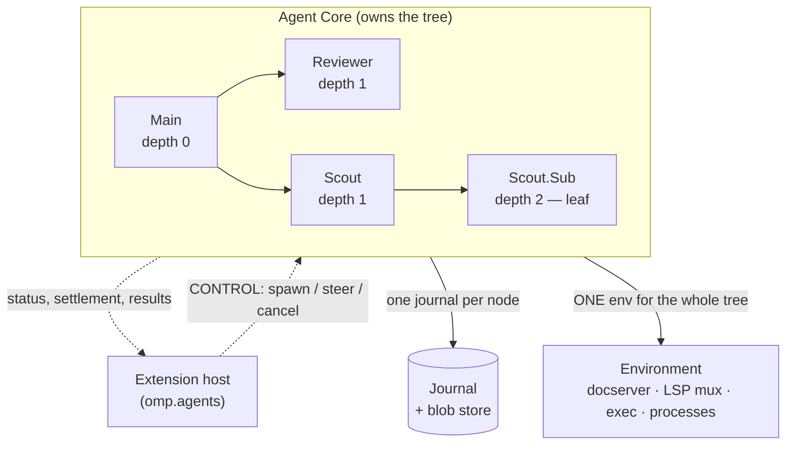
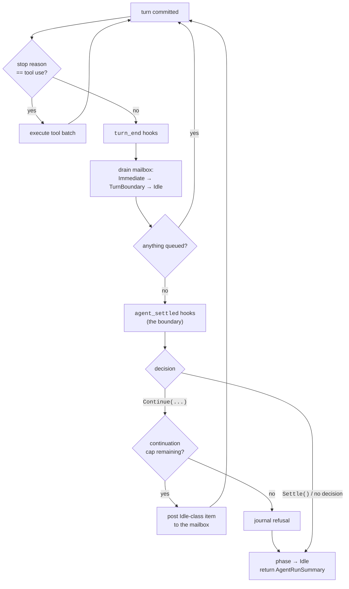
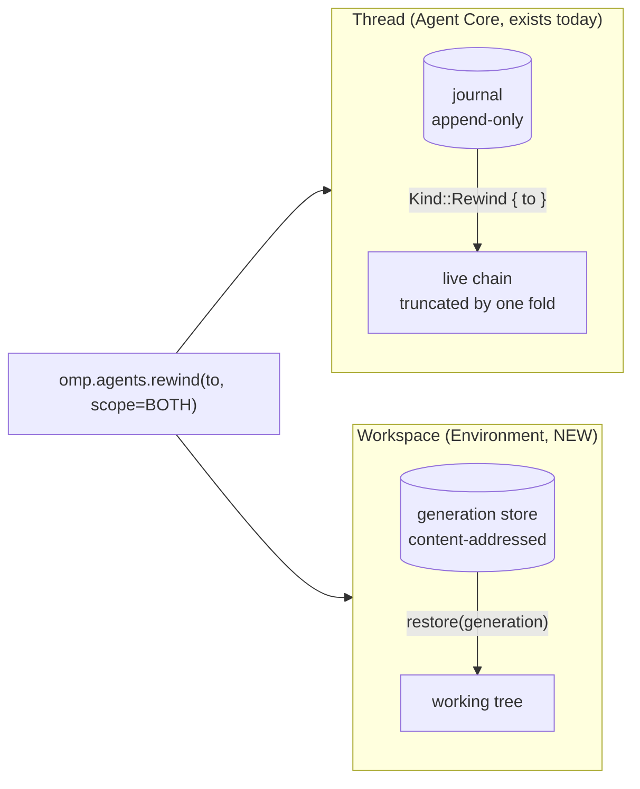
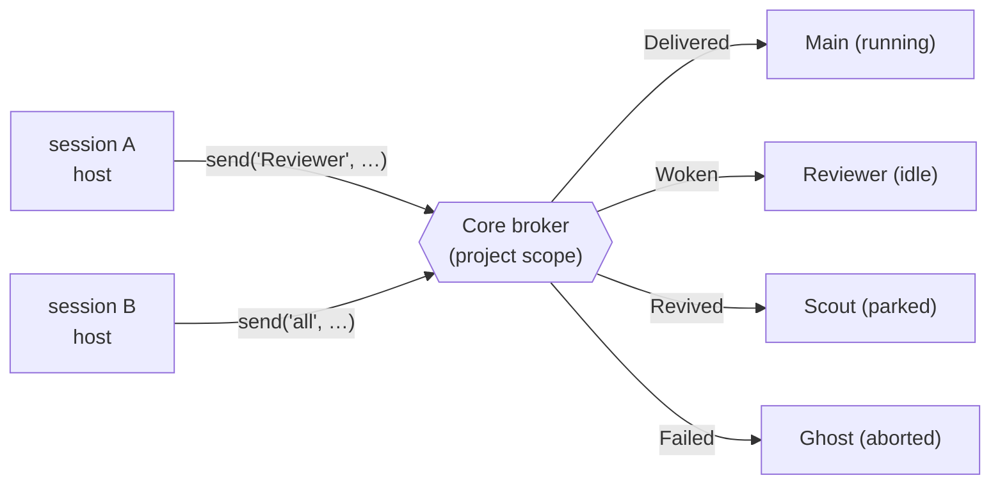

# `omp.agents` — subagents, one-shot completions, autonomous loops, schedules, messaging, time travel

> **Design document, not a runtime API guarantee.** This corpus includes proposed
> interfaces and historical implementation observations. See
> [implementation status](implementation-status.md) for current owners and known gaps.

## Purpose

`omp.agents` is the namespace an extension uses to make *more inference happen*:
to spawn a child agent and steer it, to ask a small model one constrained
question without building a conversation for it, to keep the loop running past
the point where it would have gone idle, to arrange for a prompt to arrive at
04:00 next Tuesday even though the host that asked for it exited hours ago, to
talk to a sibling session, and to move the conversation and the workspace
backwards in time together. Every one of those is a request the extension host
sends over CONTROL to the Agent Core, which owns the whole agent tree, the whole
journal, the token budget, and the only clock that survives a restart. Nothing
in this namespace forks a process, opens a socket, writes a lockfile, or shells
out to `git`.

One line explains why the one-shot lives here rather than beside the provider
registry: an extension that calls a model spends the user's money. Spawning a
subagent and classifying a bash command are the same authority at different
scales, so they answer to the same budget, the same role indirection, and the
same attribution.
Creating a new top-level interactive session is deliberately not an agent
operation. `omp.sessions.create` records a visible, non-submitted handoff and
switches the user's existing UI; it starts no inference. Use it only from an
interactive command. Use the APIs in this chapter for subagents, later
injection, scheduling, or any operation intended to make model work happen
(see `docs/py/09-journal.md`).

"Forks no process, opens no socket" is the entire point. In pi, `ExtensionAPI`
had *no* subagent primitive at all — not one member of the interface in
`/work/pi/packages/coding-agent/src/extensibility/extensions/types.ts` spawns,
awaits, steers, or cancels a child. So all 28 subagent packages in the catalog
did the only thing left and spawned the `pi` CLI as a child process:
`@tintinweb/pi-subagents`, `@narumitw/pi-subagents`, `@ferris1225/pi-subagents`,
`@gotgenes/pi-subagents`, `@nilskluewer/pi-subagent`, `@rohaquinlop/pi-subagents`,
`@pi9/subagent`, `pi-crew`, `pi-extensible-workflows`, `pi-muselinn-harness`,
`pi-team`, `pi-background-tasks`, `pi-subagents-j0k3r`, `simple-subagents`,
`pi-workflow-engine`, `@engrammic/veil-subagents`, and a dozen more. That is
Lesson #4 arriving as a bill. A child `pi` process cannot participate in a
synchronized OAuth refresh, so N children means N racing token refreshes behind
a file lock and a retry loop. It launches its own LSP server and its own
headless Chrome, so a fan-out of eight costs eight language servers. It cannot
see the parent's preview server, so it starts a ninth one. It has no message bus,
so `pi-intercom` had to spawn a *detached daemon* on
`~/.pi/intercom/broker.sock` with a hand-rolled length-prefixed JSON framing
protocol just so two sessions on the same machine could say hello. And two
children editing one file raced through the read-modify-format-write flow with
no shared document authority, which is exactly the corruption the docserver
exists to prevent.

Three more pi shapes die here. `pi-schedule-prompt` kept cron state in
`~/.pi/agent/cron-storage.json` and fired it from `setInterval` inside the plugin
process — a timer in a process that exits is not a schedule, it is an intention.
`@narumitw/pi-goal` and `pi-codex-goal` built autonomous loops by hooking
`turn_end`/`agent_end` and calling `sendMessage`, with no boundary contract, no
continuation cap, and no way to see each other, so two goal extensions in one
session inject two continuations and the loop never stops. And `@ayulab/pi-rewind`
maintained a shadow bare git repository per session under `~/.pi/checkpoints/`,
committed it with `git commit-tree` on every `turn_end`, and restored it with
`git read-tree -u --reset` — force-overwriting workspace files behind the
harness's back, invisible to the docserver, invisible to the LSP mux, and
catastrophic if two sessions share a checkout.

## Concepts

### One tree, one owner

Every agent in a session is a node in one tree the Agent Core owns. The
extension host is not a node; it is a *client* that asks the Core to add one.



Three consequences the reference below leans on:

- **Depth is the Core's, not the caller's.** `SubagentSpec.max_depth` describes
  the subtree the *child* may build. The Core clamps it against the depth
  remaining above, so an extension cannot widen the tree by asking nicely, and
  the depth cap cannot be circumvented by an extension spawning an extension
  that spawns an agent. pi enforced this with a `PI_BLOCKED_AGENT` environment
  variable read by the child process; the child could simply not read it.
- **Auth, LSP, browser, docserver, and preview processes are one per
  environment, not one per agent.** A child does not re-authenticate, does not
  start a second language server, and cannot clobber a sibling's write — its
  edits are compare-and-swap against a document revision like everyone else's.
- **The tree is addressable.** Every node has a stable id, an `agent://<id>`
  output artifact, and a `history://<id>` read-only transcript. Those URLs are
  ordinary `read` targets (see `docs/py/09-journal.md` for the URL namespace),
  so an extension hands a peer a pointer instead of a payload.

### The settled-turn boundary

An autonomous loop is not a loop the extension runs. It is the *Core's* loop,
declining to stop. The Core's turn loop already has exactly one place where it
decides between another turn and going idle, and continuation injection is that
decision, made explicit:



The two events are not interchangeable and the distinction is the whole reason
goal loops in pi misfired:

- `turn_end` fires after **every** committed turn, including the many
  tool-follow-up turns inside one user submission. It is where you account
  tokens and update a widget. Injecting a continuation here is what made
  `@narumitw/pi-goal` fight the model mid-task.
- `agent_settled` fires **once**, at the point where the loop is about to
  publish `Idle` and hand control back to the user. It is the only place a
  continuation is meaningful and the only place `Continue` is accepted.

Continuations are capped, and the cap is one budget shared by every extension —
because the harness is the only party that can see every subscriber. A
continuation refused by the cap is journaled, not silently dropped, so
`/rewind` and the telemetry firehose both show *why* the loop stopped.

### Three clocks, deliberately unequal

| Mechanism | Lives in | Survives host restart | Survives session end | Journaled |
|---|---|---|---|---|
| `omp.agents.timer(...)` | extension host | no | no | no |
| `omp.agents.schedule(..., scope=SESSION)` | core scheduler | yes | no | yes |
| `omp.agents.schedule(..., scope=PROJECT)` | core scheduler | yes | yes | yes |

A timer is a convenience for "debounce this widget refresh." A schedule is a
durable fact: a journal entry the core scheduler replays on load, fires against
its own monotonic clock, and records each firing back into the journal. The
distinction is not stylistic — `pi-schedule-prompt` chose the timer and then had
to persist state to a JSON file, reload it on `session_start`, and hope the
process it was running in stayed alive, which for a cron job scheduled a day out
it did not.

### Time travel is two restores, not one

Rewinding a conversation and rewinding a working tree are different operations
with different owners, and conflating them is what made `@ayulab/pi-rewind` a
shadow VCS.



The thread half is *already real*: `Journal::rewind` appends a `Kind::Rewind`
event and `Log::live()` folds it forward by truncating the working chain
(`crates/storage/src/transcript/reader.rs:108`). Nothing is deleted; a rewind is
a fact appended to an append-only log, which is why redo is free and why two
agents rewinding the same session do not corrupt each other.

The workspace half is new environment capability, stated plainly:
`crates/env/` has no snapshot or restore operation today, and neither does
`env/v1`. `omp.agents.snapshot()` and `omp.agents.restore()` are documented here
as the surface they must present; the closing section specifies the work.

## Reference

Everything in this namespace rides **CONTROL** unless a symbol says otherwise.
CONTROL round-trip is tens of microseconds; the latency classes below describe
how often a call is *appropriate*, not how fast it is.

Symbols owned elsewhere are referenced, never redefined: `@omp.device`,
`@omp.tool`, the `dyn` shell builtin, `omp.ToolPath`, the dynamic tool policy, and
the `omp.Effects` envelope in `docs/py/01-devices.md`;
`omp.Payload` / `omp.Fault` / `omp.PromptCaps`, `omp.CallOutcome`, and
`@omp.renderer` in `docs/py/02-verdicts.md`; the invocation state machine
(`omp.InvocationPhase`) and argument finalization in `docs/py/03-params.md`;
`place=`, `omp.workers`, and worker lifecycle in `docs/py/04-placement.md`;
`@omp.hook`, `omp.HookPhase`, `omp.HookDecision`, the full event catalog
(including the single `tool_call` event with its tagged `target` union, and
the `subagent_spawn` gate this document raises `PolicyDenied` from), and the
failure table in `docs/py/05-hooks.md`; approval tiers, `ApprovalSpec`, and
the durable approval ticket in `docs/py/06-policy.md`; `@omp.command`,
`@omp.shortcut`, `omp.ui.*`, `omp.ui.Tml`, and headless degradation in
`docs/py/07-ui.md`; `@omp.prompt_slot`, `thread_projection`, and
`ContextPatch` in `docs/py/08-context.md`; `omp.journal.*`, `omp.sessions.*`,
`omp.artifacts.*`, the typed URL classes (`ArtifactUrl`, `HistoryUrl`,
`AgentUrl`), and the durable state scopes in `docs/py/09-journal.md`;
`@omp.telemetry` in `docs/py/10-telemetry.md`; `omp.env.*`, `EnvPath`, and
`ClientPath` in `docs/py/11-env.md`; `omp.creds`, model selection, and the
inference-side budget ceilings in `docs/py/13-inference.md`; the manifest
schema, trust tiers, `omp.Context`, cancellation, `OperationSpec`, the phase
legality matrix, `omp.Duration`, and principal identity in
`docs/py/00-overview.md`; how extension code arrives, `WorkspaceUri`, and
publisher-qualified identity in `docs/py/14-deploy.md`.

Two facts from sibling namespaces are load-bearing here and are not restated
anywhere below. First, an extension registers with the **host**, never with the
**model**. The host must know a device's name, schema, and rev to answer the
device catalog behind `dyn` and `dyn <name> --help` at all — that is what `RegisterTools` is for — but the
model's tool array never grows, and a change in what the model can reach arrives
as one system-notification item rather than a re-registration. Every "spawn a
subagent" capability in the Patterns section is therefore a device, and
`omp.agents` itself is a namespace an extension *calls*, not something it
declares: a session using it has a byte-identical registration set to one that
does not. Second, an `dyn` device dispatch fires exactly one `tool_call` with
the RESOLVED `target=DeviceCall(...)` carrying decoded arguments — so a policy extension gating
`subagent_spawn` sees the decoded spec, not an envelope to re-parse, and the user is
never prompted twice for one delegation.

One inherited constraint matters here: an extension declared by a remote
workspace has its `omp.env` scoped to the **remote** environment. Therefore
`SubagentSpec.cwd`, `SubagentSpec.worktree`, `omp.agents.snapshot()`, and
`omp.agents.restore()` all resolve against the environment the extension is
bound to — never the client's disk. A schedule with `scope=PROJECT` is keyed to
that environment's project root, so the same schedule does not fire twice
because two clients are attached.

### Spawning

#### `class omp.agents.Isolation(enum.StrEnum)`

How much of the parent's conversation the child starts with.

| Member | Value | Semantics |
|---|---|---|
| `Isolation.CLEAN` | `"clean"` | Child starts with its system prompt and its task, nothing else. The default, and the only mode whose token cost is predictable. |
| `Isolation.FORK` | `"fork"` | Child's journal begins with a `ForkedFrom` lineage record and the parent's live chain projected at spawn time. Expensive; the child pays the parent's whole context on its first turn. |
| `Isolation.FILTERED` | `"filtered"` | Like `FORK`, but the parent's chain passes through the `thread_projection` hook chain first (renamed from `context` in Revision 2 — see `docs/py/08-context.md`), so extensions can prune it with bounded `ContextPatch` ops. |

#### `class omp.agents.ThinkingLevel(enum.StrEnum)`

`OFF = "off"`, `LO = "lo"`, `MED = "med"`, `HI = "hi"`. A coarse request mapped
onto the resolved model's supported reasoning range by the inference layer; a
model with no reasoning support silently receives `OFF` rather than failing the
spawn. Ceilings configured for the session clamp it.

#### `class omp.agents.MergeMode(enum.StrEnum)`

What happens to a worktree-isolated child's changes when it settles.
`MergeMode.NONE = "none"` leaves the worktree in place and reports its path.
`MergeMode.BRANCH = "branch"` commits them to `omp/agent/<id>`.
`MergeMode.PATCH = "patch"` writes `<id>.patch` as a session artifact. Ignored
when `SubagentSpec.worktree` is `False`.

#### `@dataclass(frozen=True, slots=True) class omp.agents.Budget`

Hard ceilings for one child and its entire subtree — the subagent side of the
review's budget demand. Every field is a ceiling the Core checks *before*
dispatching the next provider request, so a request that cannot be paid for is
never sent; crossing any of them settles the child as `RunStatus.EXHAUSTED`
with a structured `Fault` naming the ceiling. Hard means hard: no wrap-up
notice, no 1.5× grace (that is `request_budget`'s job).

| Field | Type | Semantics |
|---|---|---|
| `max_requests` | `int \| None` | Assistant requests, summed over the subtree. |
| `max_input_tokens` | `int \| None` | Input tokens, subtree-summed; cached reads are metered per `docs/py/13-inference.md`. |
| `max_output_tokens` | `int \| None` | Output plus reasoning tokens, subtree-summed. |
| `max_usd` | `float \| None` | Spend, subtree-summed from durable core turn receipts — never from the at-most-once telemetry firehose. |
| `max_wall` | `omp.Duration \| None` | Wall clock from admission to settlement. |

Accounting is recursive by construction: a child's `Budget` is clamped against
the unspent remainder of every ancestor's — the same shape as `max_depth`
clamping — so a subtree cannot out-spend its root by fanning out. The other
two ceilings on the review's list live beside this type rather than in it:
tree-wide subagent *concurrency* is the session ceiling
(`DEFAULT_MAX_CONCURRENCY`, counted over the whole tree, not per parent), and
the recursive *continuation* budget is `ContinuationLedger`'s subtree
accounting below. Inference-side budgets — per-provider spend, hook classifier
budgets, role ceilings — are owned by `docs/py/13-inference.md`; this type
governs subagents only.

#### `@dataclass(frozen=True, slots=True) class omp.agents.SubagentSpec`

The complete declaration of one child. Frozen because the Core records it in the
child's `session_init` journal entry verbatim; a spec that mutated after spawn
would make revival unfaithful.

| Field | Type | Default | Semantics |
|---|---|---|---|
| `task` | `str` | *required* | The assignment. Delivered as the child's first user item. Empty or whitespace-only raises `SpawnDenied`. |
| `name` | `str \| None` | `None` | Stable identifier used for addressing (`omp.agents.send`), artifact naming (`agent://<name>`), and the roster. Must match `[A-Za-z][A-Za-z0-9_]{0,31}`. Collisions within a session get a numeric suffix (`Scout`, `Scout-2`). `None` means the Core generates an adjective-animal name. |
| `agent` | `str` | `"task"` | Which agent definition to run — a bundled role, a project `.omp/agents/*.md` definition, or one an extension declared. Unknown names raise `SpawnDenied`. |
| `system_prompt` | `str \| None` | `None` | Appended to the resolved agent definition's prompt, never replacing it. Contributions that must be KV-cache-stable belong in `@omp.prompt_slot` (see `docs/py/08-context.md`), not here. |
| `model` | `str \| None` | `None` | Model pattern or role alias (`"@smol"`, `"anthropic/claude-*"`). `None` inherits the parent's resolved model. What happens when the pattern resolves to no usable credential is `on_model_unavailable`'s decision, never an automatic downgrade. |
| `on_model_unavailable` | `Literal["fail", "parent"]` | `"fail"` | Explicit fallback policy. `"fail"` refuses the spawn with `SpawnDenied`; `"parent"` runs on the parent's resolved model and sets `SubagentResult.model_fallback`. Revision 1 fell back silently and flagged it afterwards; the review is right that a model chosen for cost, privacy, or capability reasons must not be substitutable behind the caller's back, so the default refuses (`docs/py/13-inference.md` owns the inference-side fallback rules). |
| `thinking` | `ThinkingLevel \| None` | `None` | Reasoning request. `None` takes the agent definition's level. |
| `allowed_devices` | `frozenset[str] \| None` | `None` | Allowlist of device names (see `docs/py/01-devices.md`) the child may reach through the `dyn` shell builtin inside the core `shell` tool. `None` inherits the parent's set. The empty frozenset yields a child with core tools only. |
| `disallowed_devices` | `frozenset[str]` | `frozenset()` | Subtracted after `allowed_devices` resolves. Use this to make a child a leaf for one capability without enumerating the rest. |
| `isolation` | `Isolation` | `Isolation.CLEAN` | Context inheritance, above. |
| `max_depth` | `int` | `1` | How deep a subtree the child may build beneath itself. `0` makes the child a hard leaf. Clamped by the Core against remaining session depth; a value above the remaining budget is silently reduced and reported in `SubagentHandle.effective_max_depth`. |
| `cwd` | `EnvPath \| None` | `None` | Working directory as a typed environment path (`docs/py/11-env.md`); raw strings are not accepted. Resolved in the bound environment; must be inside a workspace root; escapes raise `SpawnDenied`. |
| `worktree` | `bool` | `False` | Run the child in a copy-on-write sandbox of the workspace instead of the workspace. Filesystem isolation, orthogonal to `isolation`. |
| `merge` | `MergeMode` | `MergeMode.NONE` | Disposition of a worktree child's changes. |
| `env_vars` | `Mapping[str, str]` | `{}` | Additional environment variables for the child's exec sessions. Keys must be `OMP_*` or project-specific; provider credential names are rejected — credentials reach a child through the scoped store (`docs/py/13-inference.md`), never through the environment. |
| `background` | `bool` | `False` | See below. |
| `output_schema` | `Mapping[str, object] \| None` | `None` | JSON Schema the child's structured result must satisfy. Present ⇒ the child gets the `yield` contract and `SubagentResult.data` is populated. |
| `schema_mode` | `Literal["permissive", "strict"]` | `"permissive"` | `"permissive"` accepts a retry-exhausted invalid result with `SubagentResult.warnings` set; `"strict"` fails the run. |
| `deadline` | `omp.Duration \| None` | `None` | Wall-clock cap. `None` inherits the parent's deadline; a zero duration means no cap and is refused unless the manifest grants it. |
| `request_budget` | `int \| None` | `None` | *Soft* cap on assistant requests. On exceeding it the Core injects a wrap-up notice; at 1.5× it forces a terminal yield. Advisory pacing, not authority — the hard ceilings live in `budget`. |
| `budget` | `Budget \| None` | `None` | Hard ceilings (above). `None` inherits the unspent remainder of the parent's. |
| `labels` | `Mapping[str, str]` | `{}` | Free-form metadata copied into the child's journal header and every telemetry record it emits. Not visible to the child's model. |

`background` is the one field that changes the *shape* of the call rather than
the child:

- `background=False` — the child is bracketed by the caller's invocation guard.
  If the caller is a device `call()` and its guard drops (turn loss, user
  interrupt, deadline), the child is cancelled with it. This is the right
  default: a disposable call deserves a disposable child.
- `background=True` — the child becomes a supervised job owned by the Core. Its
  settlement is delivered as a mailbox item at a later boundary, exactly like a
  detached process settlement, and the caller may exit.

Both shapes are phase-gated, and this is a Revision 2 correction. Revision 1
claimed only *backgrounding* was an effect — a speculative invocation asking
for a background child got `SpawnDenied`, while a foreground spawn was
implicitly legal at any point. That was wrong for exactly the reason the
review named: a foreground subagent spends the user's money and opens provider
traffic whether or not the world is "untouched", so speculation must not be
able to trigger it. `omp.agents.spawn` carries generated
`OperationSpec(minimum_phase=EFFECTS_AUTHORIZED, …)` metadata
(`docs/py/00-overview.md` owns `OperationSpec` and the phase legality matrix),
and the Core — not the Environment, and not author memory — enforces it for
this CONTROL operation. In v1 the distinction is invisible from inside a
device, because a device body only starts at `EFFECTS_AUTHORIZED`
(`docs/py/03-params.md`); it is load-bearing for hooks, where a REVIEW
classifier or the turn-scoped `turn_start` TRANSFORM may call `completion()`
(paid inference is legal in both) but no hook phase may spawn.

#### `async omp.agents.spawn(spec: SubagentSpec) -> SubagentHandle`

- **Channel** CONTROL. **Latency class** per-call. **Failure** fail-closed — a
  spawn that cannot be authorized raises rather than returning a degraded child.
- **Returns** a handle as soon as the Core has admitted the child, allocated its
  id and journal, and reserved a concurrency permit. It does *not* wait for the
  child's first turn.
- **Raises** `SpawnDenied` (bad spec, unknown agent, path escape, missing
  manifest capability, invocation below `spawn`'s `minimum_phase`, model
  unavailable with `on_model_unavailable="fail"`), `DepthExceeded`,
  `ConcurrencyExhausted` (only when the session's queue is also full;
  ordinarily the spawn queues), `PolicyDenied` when the `subagent_spawn` hook
  returns `Deny` (see `docs/py/05-hooks.md`).
- **Phase.** Carries generated
  `OperationSpec(minimum_phase=EFFECTS_AUTHORIZED, durability, cost, authority)`
  metadata, enforced by the Core (`docs/py/00-overview.md`). A speculative
  fragment cannot spawn a subagent — foreground or background; the Revision 1
  reversal is recorded at `background` above.

```python
import omp
from dataclasses import dataclass

@dataclass(frozen=True, slots=True)
class ReviewArgs:
	path: omp.EnvPath

@omp.device("review", family="review", rev="1")
async def review(args: ReviewArgs, ctx: omp.Context) -> omp.Payload:
	# `args` are final, policy-approved effective arguments; the body starts
	# at EFFECTS_AUTHORIZED (docs/py/01-devices.md, docs/py/03-params.md).
	handle = await omp.agents.spawn(omp.agents.SubagentSpec(
		task=f"Review {args.path.uri} for correctness and allocation discipline. Cite line numbers.",
		name="Reviewer",
		agent="reviewer",
		allowed_devices=frozenset(),
		max_depth=0,
		thinking=omp.agents.ThinkingLevel.HI,
	))
	result = await handle.wait()
	return omp.Payload({"findings": result.data, "cost_usd": result.usage.cost_usd})
```

#### `async omp.agents.spawn_all(specs: Sequence[SubagentSpec]) -> list[SubagentHandle]`

- **Channel** CONTROL, one frame. **Latency class** per-call. **Failure**
  fail-closed and all-or-nothing: every spec is validated before any child
  starts, so a batch with one bad spec spawns none. This is the behavior
  `pi-extensible-workflows` had to hand-roll as "preflight validation" because
  its per-spawn CLI invocations could half-succeed.
- Admission is a single permit acquisition against the session's concurrency
  ceiling, so a batch of 40 against a ceiling of 32 starts 32 and queues 8
  without any of them observing a failure.

### The handle

#### `class omp.agents.RunStatus(enum.StrEnum)`

| Member | Value | Meaning |
|---|---|---|
| `RunStatus.PENDING` | `"pending"` | Admitted, holding a queued permit, no turn started. |
| `RunStatus.RUNNING` | `"running"` | A turn or tool batch is in flight. |
| `RunStatus.SETTLED` | `"settled"` | The child's loop reached idle but the run is kept alive for follow-up turns; steerable. |
| `RunStatus.COMPLETED` | `"completed"` | Terminal, yielded successfully. **Does not mean its artifacts are correct** — verify claimed changes. |
| `RunStatus.FAILED` | `"failed"` | Terminal, yielded an error or violated a strict schema. |
| `RunStatus.CANCELLED` | `"cancelled"` | Terminal by `cancel()` or guard drop. Partial output is preserved. |
| `RunStatus.EXHAUSTED` | `"exhausted"` | Terminal on deadline or hard request budget. |

`RunStatus.terminal` is a read-only property: `True` for the last four.

#### `class omp.agents.SubagentHandle`

Not a dataclass — a live handle over CONTROL. Attributes are immutable
identity; status is a call.

| Attribute | Type | Semantics |
|---|---|---|
| `run_id` | `str` | Identifies this *run*. A revived agent gets a new `run_id`. |
| `session_id` | `str` | Identifies the child's journal. Stable across revival. |
| `name` | `str` | Resolved name after collision suffixing. |
| `agent` | `str` | Resolved agent definition name. |
| `depth` | `int` | The child's own depth in the tree. |
| `effective_max_depth` | `int` | `spec.max_depth` after the Core's clamp. |
| `spec` | `SubagentSpec` | The spec as recorded, including defaults filled in. |
| `worktree_path` | `EnvPath \| None` | Typed sandbox path in the bound environment (`docs/py/11-env.md`), or `None`. |
| `output_url` | `AgentUrl` | `agent://<name>` — the child's structured/markdown output (`docs/py/09-journal.md` owns the typed URL classes). |
| `transcript_url` | `HistoryUrl` | `history://<name>` — read-only transcript. |

**`async status() -> RunStatus`** — CONTROL, per-call, fail-open (returns the
last known status if the Core is momentarily unreachable, and raises only after
the socket is confirmed gone). Cheap enough to poll a UI slot with, but prefer
`@omp.telemetry(["subagent"])` (see `docs/py/10-telemetry.md`) over polling.

**`async progress() -> Progress`** — a snapshot for rendering: see `Progress`
below. Same class and failure policy as `status()`.

**`async steer(text: str, *, mode: DeliveryMode = DeliveryMode.ASIDE) -> Receipt`**
— CONTROL, per-call, fail-closed. Posts an item into the child's mailbox. The
mode selects the boundary at which the child observes it (see `DeliveryMode`).
A `RunStatus.SETTLED` child is woken and runs a new turn. A terminal child
raises `AgentGone`, whose message carries `transcript_url` so the caller can
read what happened rather than guess. This replaces `@nilskluewer/pi-subagent`'s
Unix-domain-socket approval server and `@tintinweb/pi-subagents`' `steer_subagent`
tool writing into a child process's stdin.

**`async cancel(*, reason: str = "cancelled by extension", grace: omp.Duration = STEER_GRACE) -> None`**
— CONTROL, per-call, fail-closed and idempotent. Sends an interrupt on the
child's channel; pulls the child marked `.interruptable()` resolve early and it
may yield partial truth as a normal `Done`. After `grace` the child's guard is
dropped, and because cancellation is structural that drop is real: doc leases
release, exec sessions kill their own process trees, worker supervisors SIGKILL
their children. The default matches the Core's `INTERRUPT_GRACE`
(`crates/agent/src/loop.rs:31`). There is no per-agent `interruptible` flag,
here or anywhere — see Lesson #2 and `docs/py/00-overview.md`.

**`async wait(*, timeout: omp.Duration | None = None) -> SubagentResult`** — CONTROL,
long-lived, fail-closed. Resolves when the child reaches a terminal status.
`timeout` elapsing raises `asyncio.TimeoutError` and leaves the child
*running* — `wait` observes, it does not own. Calling `wait()` on a
`background=True` child is legal and equivalent to awaiting its settlement
notification.

**`wait()` never holds a concurrency permit.** The caller's permit is released
for the duration and re-acquired on return, so a parent blocked on children
does not occupy a slot — without that rule, a parent awaiting a child that
needs a permit would deadlock a full pool. This release-while-waiting rule is
the *decided* permit-accounting model (Revision 2): not per-depth permit
pools, and not a `wait()` documented as not holding anything — the build
section records why the alternatives lost. Two visible consequences: the
re-acquire can queue, so `wait()` may resolve slightly after the child's
status went terminal (a gap, never a failure); and a deeper `spawn_all` under
a saturated ceiling *queues whole* rather than failing, so
`ConcurrencyExhausted` means the admission queue is full too — its
`running`/`queued`/`max_concurrency` fields let a caller tell saturation from
starvation, and it always fails the entire batch, never a truncated wave.

**`async result() -> SubagentResult | None`** — the terminal result if the child
has one, `None` otherwise. Never blocks.

**`async release() -> None`** — relinquishes the caller's structural ownership of
a `background=False` child, promoting it to Core-owned. The counterpart of
`RunGuard::relinquish` (`crates/env/src/guard.rs:53`) and the only way to let a
child outlive the invocation that started it without having declared
`background=True` up front.

**`__aenter__` / `__aexit__`** — `async with await omp.agents.spawn(spec) as h:`
cancels the child on scope exit unless `release()` was called. Use it for
anything speculative.

#### `@dataclass(frozen=True, slots=True) class omp.agents.Progress`

Render input, not truth. Fields: `status: RunStatus`, `turns: int`,
`requests: int`, `tool_calls: int`, `context_tokens: int`,
`context_window: int`, `usage: Usage`, `activity: str` (one sanitized line, ≤80
chars, of what the child is doing right now), `model: str`,
`last_activity_ms: int`. Fold this into a `omp.ui` slot; do not persist it.

#### `@dataclass(frozen=True, slots=True) class omp.agents.Usage`

`input_tokens: int`, `cached_input_tokens: int`, `output_tokens: int`,
`reasoning_tokens: int`, `cache_write_tokens: int`, `requests: int`,
`cost_usd: float`, `wall: omp.Duration`. Reported per node and, in
`SubagentResult.subtree_usage`, summed over the whole subtree — the number a
budget actually cares about. `cached_input_tokens` is broken out because a goal
loop that bills reused cache reads as spend, as `@narumitw/pi-goal` did, will
declare its budget exhausted after four turns.

#### `@dataclass(frozen=True, slots=True) class omp.agents.SubagentResult`

| Field | Type | Semantics |
|---|---|---|
| `run_id` | `str` | |
| `session_id` | `str` | |
| `name` | `str` | |
| `status` | `RunStatus` | Terminal member. |
| `text` | `str` | The child's final model-facing output. A **projection**, sized to the caller's `PromptCaps`, not the source of truth. |
| `data` | `object \| None` | Structured yield when `output_schema` was set. |
| `fault` | `omp.Fault \| None` | Typed failure for `FAILED`. Never a bare string — see `docs/py/02-verdicts.md`. |
| `usage` | `Usage` | This node only. |
| `subtree_usage` | `Usage` | This node plus every descendant. |
| `turns` | `int` | Committed turns. |
| `model` | `str` | The model that actually served the output. |
| `model_fallback` | `bool` | `True` when `on_model_unavailable="parent"` was selected and fired. There is no silent fallback path anymore (Revision 2). |
| `warnings` | `tuple[str, ...]` | Permissive-mode schema violations, missing yields, forced-yield-past-budget notices. |
| `output_url` | `AgentUrl` | `agent://<name>`; slice it like a file. |
| `transcript_url` | `HistoryUrl` | `history://<name>`. |
| `worktree` | `WorktreeOutcome \| None` | Present when `spec.worktree` was set. |

Large `text` spills through the central artifactization gate: past budget the
payload is stored whole and `text` becomes a bounded view plus an
`artifact://<id>` the model can slice (`docs/py/02-verdicts.md`). Extensions
never truncate a child's output themselves — that is how pi ended up with forty
ellipsis styles and lost bytes. The gate is `VerdictDetails` /
`VerdictSpill` in `crates/tool/src/lib.rs`, which exists but has no wired
environment implementation and currently materializes the whole payload before
consulting the limit; the closing section names the defect and its fix shape.

#### `@dataclass(frozen=True, slots=True) class omp.agents.WorktreeOutcome`

`path: EnvPath`, `merge: MergeMode`, `applied: bool`, `branch: str | None`,
`patch_url: ArtifactUrl | None`, `conflicts: tuple[str, ...]`. A failed merge sets
`applied=False` and keeps `patch_url` addressable — the recovery hint, not a
lost afternoon.

### Listing, revival, and limits

#### `class omp.agents.AgentKind(enum.StrEnum)`

`MAIN = "main"` (the interactive agent), `SUB = "sub"` (a task subagent),
`ADVISOR = "advisor"` (an observation-only reviewer, hidden from peer rosters
and not messageable).

#### `class omp.agents.AgentStatus(enum.StrEnum)`

`RUNNING = "running"` (turn active), `IDLE = "idle"` (live session in memory),
`PARKED = "parked"` (session disposed, journal retained, revivable),
`ABORTED = "aborted"` (terminally killed; a tombstone prevents resurrection).

#### `@dataclass(frozen=True, slots=True) class omp.agents.AgentRef`

`id: str`, `name: str`, `kind: AgentKind`, `status: AgentStatus`,
`agent: str`, `parent: str | None`, `depth: int`, `activity: str`,
`last_activity_ms: int`, `usage: Usage`, `output_url: AgentUrl`,
`transcript_url: HistoryUrl`. A roster row: enough to render and to address, no
conversation content.

#### `async omp.agents.list(*, kind: AgentKind | None = None, status: AgentStatus | None = None, include_parked: bool = True) -> list[AgentRef]`

- CONTROL, per-turn, fail-open (returns `[]` on a transient Core error rather
  than failing a render).
- Ordered by depth then dispatch order, so a tree renders without a sort.
- Includes parked agents discovered from journal headers, which is what
  `omp.sessions` (`docs/py/09-journal.md`) reads them from. This is the
  replacement for the 16 catalog packages that parsed session JSONL off disk.

#### `async omp.agents.get(ref: str) -> SubagentHandle`

Resolves a name, id, or `agent://<id>` URL to a live handle, reviving a parked
agent if needed. Raises `AgentGone` for a tombstoned agent.

#### `async omp.agents.revive(ref: str) -> SubagentHandle`

- CONTROL, per-call, fail-closed.
- Cold-revives a parked agent: the Core reads the child's `session_init` header
  for its recorded tools, prompts, output schema, model role, and depth,
  rebuilds the session, and re-binds device availability. The revived agent
  keeps its `session_id` and gets a fresh `run_id`.
- Worktree-isolated children are **not** revivable: their sandbox is torn down
  at settlement. Attempting it raises `SpawnDenied`.

#### `@dataclass(frozen=True, slots=True) class omp.agents.SpawnLimits`

`max_depth: int`, `depth: int`, `max_concurrency: int`, `running: int`,
`queued: int`, `continuation_cap: int`, `continuations_used: int`,
`spawn_allowed: bool`. One snapshot of every ceiling that can refuse the next
call, so an extension can render a disabled button instead of catching an
exception.

#### `async omp.agents.limits() -> SpawnLimits`

CONTROL, per-turn, fail-open.

#### `omp.agents.depth: int`

A module attribute, not a call: the depth of the agent this host serves,
resolved at host start. `0` in a top-level session. Read it to decide whether
to register a spawning device at all — a leaf should not advertise a capability
it cannot use.

### One-shot completions

Spawning a whole agent to answer "is this command dangerous?" is absurd, but the
cheap alternative — an extension holding a provider client — hands every
extension ambient inference authority with no budget, no attribution, and no
role indirection. So the one-shot lives here, next to spawn authority, for
exactly the reason a subagent does: it spends the user's tokens.

#### `@dataclass(frozen=True, slots=True) class omp.agents.Completion`

`text: str` (raw emission), `choice: str | None` (resolved ladder member),
`data: object | None` (structured output when `schema` was given),
`usage: Usage`, `model: str`, `fell_back: bool`,
`fault: omp.Fault | None` (why the fallback fired, when it did).

#### `async omp.agents.completion(prompt: str | Sequence[omp.TextPart | omp.BlobPart], *, role="smol", system=None, choices=None, schema=None, default=..., scope="turn", context="none", max_output_tokens=None, deadline=omp.Duration("10s"), labels={}) -> Completion`

- **Channel** CONTROL. **Latency class** per-call, network-bound. **Failure**
  depends entirely on `default`, below.
- One stateless, non-streaming, tool-less model call. No thread, no history, no
  journal item. Use it for classification, extraction, and titling — the
  `ctx.model.call` / `ctx.model.stream` shape from
  `.plan/feature-map/discovery.md:190`.
- **`context="thread"` trades statelessness for the live conversation.** The
  call becomes one non-persisted side-channel turn over the caller's projected
  thread — the same mechanism behind the interactive `/btw` command and the
  idle recap: the session model answers with the full conversation in context
  (tool catalog attached only to keep the prompt cache warm; tool calls are
  discarded), and the emission still never becomes a thread item. Because the
  session model and its live params answer, `role`, `system`, `choices`,
  `schema`, and `max_output_tokens` are stateless-only and rejected; the
  prompt must be plain text. `default`, `scope`, `deadline`, and `labels`
  keep their meaning, and usage is debited against the session task budget
  like any other completion.
- `prompt` is either plain text or an ordered sequence containing only
  `omp.TextPart` and `omp.BlobPart` values. The typed sequence is the media path
  for one-shot vision requests; blobs remain typed and are never encoded into
  prose.
- `role` is a **role selector** resolved by `docs/py/13-inference.md`, not a
  model string. A policy asks for `"smol"` and lets deployment decide; hardcoding
  a vendor model is how an extension becomes unusable on someone else's setup.
- **Output is constrained or it is not a classifier.** `choices` is an *ordered*
  ladder resolved by earliest match against the raw emission, so
  `("allow", "review", "deny")` resolves `"review — because …"` to `review` and
  a prose answer mentioning several to the first. `schema` instead rides the
  harness's constrained-sampling intent with a priority, degrading to charitable
  decoding when the grammar budget is spent — never a per-call `strict` bool
  (see `docs/py/13-inference.md`). The two are mutually exclusive; supplying
  neither yields free text and `choice is None`, which no policy path should
  use.
- **`default` is the whole failure contract.** Supplied, `completion` **never
  raises**: a timeout, transport failure, empty output, or an emission matching
  no choice returns `Completion(choice=default, fell_back=True, fault=…)` and
  journals the fallback. Omitted, those same conditions raise
  `omp.agents.CompletionFailed`. There is deliberately no library-chosen
  default — the harness cannot know that a guardian's safe answer is `deny`
  rather than `allow`, so it refuses to guess. A guard that fails open because a
  350M-parameter model timed out is worse than no guard, and that outcome is
  now a caller bug rather than a default.
- Spends against the session task budget, visible in `omp.agents.limits()`.
  Requires the `inference:completion` manifest grant. `Usage` including
  `cost_usd` is attributed to the declaring extension, with `labels` copied onto
  every telemetry record it produces (`docs/py/10-telemetry.md`).
- Like every inference-triggering CONTROL symbol it carries generated
  `OperationSpec(minimum_phase, durability, cost=PAID, authority)` metadata,
  enforced by the Core (`docs/py/00-overview.md`). Per the phase legality
  matrix it is legal from REVIEW hooks — the general budgeted paid-classifier
  phase — and from turn-scoped TRANSFORM hooks, today exactly `turn_start`
  (`docs/py/05-hooks.md`).
  Per-call TRANSFORM hooks, including `tool_call` and `before_call`-class events,
  remain illegal. It is also legal from device bodies, which in v1 begin at
  `EFFECTS_AUTHORIZED`. Nothing speculative can trigger it.

  **Resolved (2026-08-20 ruling): the once-per-turn thinking classifier had no
  legal phase: REVIEW cannot return `Modify`, while TRANSFORM could not call
  `completion()`. The narrow `turn_start` exception gives that classifier one
  legal phase without permitting paid inference in per-call transforms. It does
  not weaken the fail-safe classifier posture required by
  [`13-inference.md` §Feature-map reconciliation](13-inference.md#feature-map-reconciliation):
  use a constrained ordered-choice ladder and a caller-chosen deterministic
  fallback, never unconstrained output or a permissive library default.**
- **`scope` picks the cancellation lifetime**, and it is the same structural
  choice `SubagentHandle.release()` makes. `scope="turn"` (default) binds the
  call to the caller's invocation guard: turn loss, user interrupt, or deadline
  drops it, which is what a policy gate wants — an answer nobody is waiting for
  is waste. `scope="session"` survives the turn and dies with the session, which
  is what a background pipeline wants when its work is worth finishing even
  though the turn that started it is gone. There is no third option: nothing
  here outlives the session, because an unowned inference request is an unbilled
  one.
- **It never writes a thread item.** No journal entry, no transcript row, no
  `TOOL_REV_PROP` stamp — the emission exists only in the returned `Completion`
  and in telemetry. A caller that wants a record appends one itself
  (`docs/py/09-journal.md`), which is what the worked example below does for the
  degraded case. Callers running a deprioritized background lane over this call
  — never preempting the conversation, never spending the constraint budget,
  never forcing a call — should read `docs/py/08-context.md`, which owns that
  policy and its epoch-staleness discipline.

```python
import omp
from dataclasses import dataclass

@omp.entry_kind("dev.acme.guard.degraded", rev="v.1")
@dataclass(frozen=True, slots=True)
class GuardDegraded:
	reason: str

@omp.hook("tool_call", phase=omp.HookPhase.REVIEW, when=omp.When(name={"bash"}))
async def classify(event: omp.ToolCallEvent, ctx: omp.Context) -> omp.HookDecision:
	answer = await omp.agents.completion(
		event.bash,                   # structured bash-AST facts, not the raw string
		role="smol",
		choices=("allow", "review", "deny"),
		default="review",             # the deterministic answer, chosen by the caller
		deadline=omp.Duration("2s"),
		labels={"gate": "bash"},
	)
	if answer.fell_back:
		omp.journal.append(GuardDegraded(reason=str(answer.fault)))
	return omp.Allow() if answer.choice == "allow" else omp.Deny(answer.text)
```

### Autonomous loops

The hook decorator and the full event catalog live in `docs/py/05-hooks.md`.
What follows are the boundary decisions and helpers `omp.agents` owns.

#### `@dataclass(frozen=True, slots=True) class omp.agents.Continue`

The decision that declines to settle. Returned from an `agent_settled` hook.

| Field | Type | Default | Semantics |
|---|---|---|---|
| `prompt` | `str` | *required* | Text of the continuation item. |
| `visible` | `bool` | `False` | `False` renders it as a bookkeeping marker in the UI instead of a user message. |
| `role` | `Literal["user", "system"]` | `"system"` | Wire role of the injected item. `"system"` keeps the prefix cache intact where the provider supports mid-thread system items; `"user"` is the compatible fallback. |
| `label` | `str \| None` | `None` | Journaled with the continuation, so telemetry can attribute a loop to its owner. |
| `collapse_prior` | `bool` | `True` | Collapse this extension's earlier continuation items into markers, keeping only the newest runnable. This is `pi-codex-goal`'s context trick, promoted from an extension workaround to the default. |

#### `class omp.agents.Settle`

A decision object (no fields) meaning "I have nothing to add." Returning `None`
from the hook is equivalent; `Settle()` exists so a decision tree can be
explicit and so `Defer` (see `docs/py/05-hooks.md`) reads differently from
"stop."

#### Decision resolution at the boundary

`agent_settled` is a domain-return hook family (`docs/py/05-hooks.md` counts
three: `agent_settled`, `provider_error`, `thread_projection`): subscribers
take no `phase=` and return `Continue | Settle`, never an `omp.HookDecision`.
Multiple extensions may subscribe. Resolution is declared, not incidental:

1. Subscribers run in the catalog's deterministic
   `(layer, publisher, extension_id)` order (`docs/py/05-hooks.md`) — never in
   load order.
2. The **first** `Continue` wins. Later hooks see it in
   `ctx.pending_continuation` and may return `Settle()` to veto it, which is
   how a guard extension overrides a goal extension without either knowing
   about the other.
3. A hook that raises or times out contributes `Settle()` — `agent_settled` is
   fail-open, because an extension crash must not spin the loop.
4. If a `Continue` survives, the continuation ledger is consulted.

#### `@dataclass(frozen=True, slots=True) class omp.agents.ContinuationPolicy`

`max_consecutive: int = DEFAULT_CONTINUATION_CAP`, `max_total: int | None = None`,
`min_interval: omp.Duration = omp.Duration("0s")`, `on_exhausted: Literal["settle", "notify"] = "notify"`.
Declared per extension at load through the manifest (see
`docs/py/14-deploy.md`) or set at runtime with
`omp.agents.set_continuation_policy(policy)`. `max_consecutive` counts
continuations since the last *user* item; any real user input resets it.

Two ceilings, and the tighter one always wins. `omp.limits.SETTLE_CONTINUATION_CAP`
(`8` — `docs/py/05-hooks.md`) is what the Core enforces before it refuses
further continuation, and no policy can exceed it without a configured session
override plus the manifest grant. A policy asking for `100` on a default
session gets `8` and sees it in `ContinuationLedger.cap`; it is not an error,
because a goal loop must be able to declare its ambition without knowing the
deployment. Eight is deliberately low: a loop that genuinely needs a hundred turns of autonomy
should be raising the session ceiling in configuration where
a human can see it, not asserting it from a plugin.

#### `@dataclass(frozen=True, slots=True) class omp.agents.ContinuationLedger`

`consecutive: int`, `total: int`, `cap: int` (the *effective* ceiling after
clamping), `last_ms: int`, `refusals: int`, `owner: str | None`. Returned by
`await omp.agents.continuations()`. Journaled, so it survives a host restart —
a goal loop that restarts mid-run resumes with the budget it had spent, not a
fresh one.

The accounting is **recursive over the agent tree** (Revision 2): a
continuation accepted in a child debits the child's ledger *and* every
ancestor's, so a goal loop cannot multiply its autonomy by the width of the
tree it spawns — the "recursive continuation budget" on the review's list of
hard ceilings. Revision 1 scoped the cap to the session and left the subtree
question open (open question 6); that question is now recorded as resolved.

#### `async omp.agents.continuations() -> ContinuationLedger`

CONTROL, per-turn, fail-open.

#### `async omp.agents.set_continuation_policy(policy: ContinuationPolicy) -> None`

CONTROL, per-session, fail-closed. Raises `PolicyDenied` if the manifest did not
grant continuation authority, which is the difference between an extension that
may keep the loop alive and one that may only observe.

#### `@dataclass(frozen=True, slots=True) class omp.agents.LoopSignal`

The Core's own repetition detector, surfaced so a goal loop can consult it
rather than reimplement it. Fields: `repeats: int` (consecutive turns whose
committed tool calls hash identically), `digest: str` (the hash), `no_progress_turns: int`
(turns with no environment effect), `empty_output_retries: int` (the Core's
own counter, capped at 3 — `crates/agent/src/loop.rs:33`), `stalled: bool`
(a conservative composite the Core also uses for its own diagnostics).

#### `async omp.agents.loop_signal() -> LoopSignal`

CONTROL, per-turn, fail-open. Reading `stalled` and returning `Settle()` is the
whole of "repeat detection", which `@narumitw/pi-goal` shipped as its own
heuristic over message text.

#### `async omp.agents.set_model(model: str, *, thinking: str | None = None) -> omp.ModelRef`

CONTROL, per-call, fail-closed. Switches the active interactive session's model
for subsequent turns through the same durable session-override path as the
built-in model command. The optional portable thinking level is applied
atomically to the next-turn composition. The call requires
`EFFECTS_AUTHORIZED` and is admitted only from an interactive command or a
device body; precheck/transform hooks must patch `turn_start` instead. Unknown,
disabled, or unroutable models raise the host's typed model-switch error.
`omp.Context.current().model` and `.thinking` expose the callback's immutable
current values.

#### `async omp.agents.abort() -> None`

CONTROL, per-call, fail-closed. Requests the same out-of-band interruption as
the interactive interrupt action. The acknowledgement means Core accepted the
request; the active model stream or tool batch settles through its normal
interrupted path. Requires `EFFECTS_AUTHORIZED`.

#### `async omp.agents.shutdown(reason: str = "") -> None`

CONTROL, per-session, fail-closed. Requests a graceful interactive-session
shutdown through the user-quit path. Active work is interrupted, the loop is
allowed to settle, and the bounded `session_shutdown` hooks run before the host
exits. `reason` is an optional operator diagnostic; the lifecycle event remains
the typed `ShutdownReason.USER_EXIT`. Requires `EFFECTS_AUTHORIZED`.

#### `async omp.agents.reload_extensions() -> None`

CONTROL, per-session, fail-closed. Triggers the existing supervised
extension-host hot-reload. The request acknowledges scheduling; each reloadable
host drains its active callback before its generation is replaced. Requires
`EFFECTS_AUTHORIZED`.

#### `async omp.agents.is_idle() -> bool`

CONTROL, per-call, read-only. Returns whether the main agent loop is currently
waiting for work.

#### `async omp.agents.wait_for_idle() -> None`

CONTROL, per-call, read-only. Returns immediately when the main agent is idle,
otherwise waits for its next transition to idle.

#### `async omp.agents.pending_messages() -> int`

CONTROL, per-call, read-only. Returns the number of interrupts retained for a
future main-agent mailbox drain, including queued producer, peer, schedule, and
continuation messages.

Abort and shutdown have durable `OperationSpec` metadata; reload is an
ephemeral Core effect. All three require a minimum phase of
`EFFECTS_AUTHORIZED`. The three introspection requests are
ephemeral and legal from `OPEN` until settlement. They are async because
extension actors cross the CONTROL boundary; pi's corresponding synchronous
booleans depended on sharing the agent process.

#### `async omp.agents.inject(prompt: str, *, mode: DeliveryMode = DeliveryMode.NEXT_TURN, visible: bool = False, role: Literal["user", "system"] = "system", session: str | None = None) -> Receipt`

- CONTROL, per-call, fail-closed.
- Out-of-band injection for producers that are **not** at a settled boundary: a
  schedule firing, an inter-session message, a background child settling. It
  posts an item into this agent's mailbox and, if the loop is idle, wakes it.
  `session=None` targets the current session. A non-current `session` must have
  been created by this authenticated client; unknown and foreign IDs are
  refused. An inactive newly created target is durably buffered and reclaimed
  by its normal mailbox/startup delivery path.
- It is *not* the way to build a goal loop. A goal loop that injects from a
  timer rather than deciding at the boundary races the model mid-turn, which is
  precisely the bug that made pi goal extensions inject continuations during
  tool batches.
- Counts against the continuation ledger when it wakes an idle loop, and does
  not when it merely queues behind an in-flight turn.

A command can seed, switch, and queue the first model turn without pretending
that the visible setup prompt itself is submitted:

```python
@omp.command("handoff")
async def handoff(_: omp.CommandContext) -> None:
    created = await omp.sessions.create(
        omp.sessions.SessionSetup(
            title="Focused follow-up",
            parent=omp.sessions.current().id,
            initial_prompt="The extension prepared this follow-up.",
        )
    )
    await omp.agents.inject(
        "Continue the focused follow-up now.",
        session=created.id,
        mode=omp.agents.DeliveryMode.NEXT_TURN,
        visible=True,
        role="user",
    )
```

`create` publishes and requests the UI switch first; the targeted injection is
then durably queued under the same authenticated client ownership.

### Scheduling

A schedule is the one durable thing in this namespace: it outlives the session
that declared it, the extension host that carried the declaration, and the
process tree that was running at the time. Revision 1 gave it a trigger, a
scope, and two booleans; the review demanded journal-grade precision, and this
section now owns the full semantics — delivery guarantee, missed-run policy,
timezone rules, ownership and payment, cost ceilings, lifecycle under
uninstall and revocation, and artifact pinning. The timer-vs-schedule
distinction from the Concepts section is unchanged and deliberate: a timer is
a host-local convenience that dies with the process; everything below is
about the thing that does not.

#### Triggers

Four frozen dataclasses, one union alias.

- **`Cron(expr: str, tz: str = "UTC")`** — five- or six-field cron. `expr` is
  validated at declaration; a bad expression raises `ScheduleRejected`
  immediately rather than at 04:00. `tz` is an IANA name resolved against the
  environment's zone database. DST is resolved by rule, not by accident: a
  local time that does not exist (the spring-forward gap) fires once at the
  first valid instant after the gap; a local time that occurs twice (the
  fall-back fold) fires on the first occurrence only. Both adjustments are
  recorded on the `Firing`.
- **`Every(interval: omp.Duration, *, jitter: omp.Duration = omp.Duration("0s"), align: bool = False)`** —
  fixed interval, measured on UTC monotonic time and therefore untouched by
  DST transitions. `jitter` spreads N sessions' identical schedules so they
  do not stampede a provider. `align=True` snaps firings to wall-clock
  boundaries.
- **`At(epoch_ms: int)`** — one shot, at an absolute instant. An `At` already
  past at load time is a missed run and follows the schedule's `missed`
  policy — under the default `COALESCE` it fires **once, immediately**, and
  records `late_ms`; it is not silently dropped, because "the machine was
  asleep" is the common case and losing the firing is what made file-backed
  cron in `pi-schedule-prompt` unreliable.
- **`AfterIdle(idle: omp.Duration)`** — fires `idle` after the agent last
  settled, and is disarmed by any user input. The honest primitive behind
  "nudge me if I have been idle," which extensions previously built out of
  `setInterval` plus a timestamp file.

`type omp.agents.Trigger = Cron | Every | At | AfterIdle`

#### Delivery targets

- **`Inject(prompt: str, mode: DeliveryMode = DeliveryMode.NEXT_TURN, visible: bool = False)`**
  — `prompt` is required and goes to *this* agent.
- **`Spawn(spec: SubagentSpec)`** — the firing spawns a child. The spec's
  `background` is forced `True`; a schedule has no invocation to be bracketed
  by. This is the shape `pi-schedule-prompt` called "isolated subagent
  target" and implemented by spawning a `pi` CLI process from a timer
  callback.

`type omp.agents.Delivery = Inject | Spawn`

#### Delivery guarantee: at-least-once, deduplicated by key

A firing is delivered **at-least-once** — never at-most-once, which is a
euphemism for "sometimes lost." The scheduler journals intent, delivers, then
journals the outcome; a crash between delivery and the outcome record
re-delivers on recovery rather than losing the firing. What makes
at-least-once safe is the key: every firing carries
`idempotency_key = (schedule_id, scheduled_at_ms)`, and

- the Core deduplicates on it — a re-delivered `Inject` whose key already has
  a journaled outcome drops as `outcome="duplicate"`, and a re-delivered
  `Spawn` re-attaches to the run the first delivery started instead of
  spawning a twin;
- everything durable a firing causes should reuse it: the spawned child's
  `session_init` carries it, and a handler making its own durable appends
  uses `journal.append_atomic(entries, idempotency_key=…)`
  (`docs/py/09-journal.md`), so a replayed firing converges instead of
  double-writing.

Schedule upserts are themselves durable requests and carry the standard
`request_id, idempotency_key, host_generation, session_generation` quartet
with generation fencing (`docs/py/00-overview.md`): a re-declaration arriving
from a stale pre-reload host generation is rejected, never merged.

#### `class omp.agents.MissedRunPolicy(enum.StrEnum)`

Declared per schedule: what happens to firings that should have occurred
while the scheduler was down.

| Member | Value | Semantics |
|---|---|---|
| `MissedRunPolicy.SKIP` | `"skip"` | Missed firings increment `miss_count` and are dropped. For work where only the next firing matters. |
| `MissedRunPolicy.COALESCE` | `"coalesce"` | All missed firings collapse into exactly one catch-up firing on load, carrying `late_ms` and the count it absorbed. The default. |
| `MissedRunPolicy.BACKFILL` | `"backfill"` | One firing per missed occurrence, oldest first, each with its own idempotency key, capped at `MAX_BACKFILL` per recovery; beyond the cap the remainder coalesce into one. For ledger-shaped work where each occurrence means something. |

This replaces Revision 1's `catch_up: bool`, and the flip is recorded rather
than smoothed over: a boolean could say skip or coalesce and had no way to
say backfill, and the review's downtime question has three honest answers,
not two. `catch_up=False` was `SKIP`, `catch_up=True` was `COALESCE`, and the
default moves from skip to coalesce, because dropping firings
silently-by-default is the `pi-schedule-prompt` failure this section exists
to bury.

#### Ownership, payment, and credentials

A schedule is owned twice, and the two owners answer different questions. The
**extension** (`owner`) answers "whose code runs and whose manifest grant
authorizes it." The **principal** (`principal`) — the authenticated identity
of `docs/py/00-overview.md`, distinct from session, project, layer, and
extension — answers "who asked for this and who pays." The principal is
captured at declaration, stamped on every firing, and every cost a firing
incurs — the scheduled inference of a `Spawn`, a handler's `completion()` —
bills to it through the durable turn receipts that are billing truth
(`docs/py/10-telemetry.md`).

Credential availability is checked per firing, never assumed. A
`PROJECT`-scope schedule fires with no user present, so a firing that needs a
model resolves credentials non-interactively from the owner principal's
scoped store (`docs/py/13-inference.md`); a model whose only credential path
is an interactive OAuth dance fails the firing closed — `outcome="failed"`,
`detail="credential_unavailable"` — rather than blocking on a dialog nobody
will see. Three consecutive credential failures pause the schedule and notify
the owner at next attach; a paused-for-credentials schedule resumes
explicitly, never by lucky token refresh.

#### `@dataclass(frozen=True, slots=True) class omp.agents.ScheduleBudget`

The hard cost ceiling, per schedule: `max_usd_per_firing: float | None`,
`max_usd_per_window: float | None`, `window: omp.Duration = omp.Duration("30d")`,
`max_requests_per_firing: int | None`. Enforced before dispatch like every
budget in this document: a firing that would exceed the remaining window
budget is refused with `outcome="budget_refused"` and journaled, and a
`Spawn` child's own `SubagentSpec.budget` is clamped against the schedule's
remainder. A `PROJECT`-scope `Spawn` schedule with no `ScheduleBudget` is
rejected at declaration — unattended spend with no ceiling is exactly what
the review called out, and it is not accepted as a default.

#### `class omp.agents.UpgradePolicy(enum.StrEnum)`

`PINNED = "pinned"` (default) — every firing runs the extension artifact
whose digest was recorded at declaration, even if the extension has since
upgraded. `AUTO = "auto"` — a firing runs whatever artifact is currently
installed for the `(publisher_key, extension_id)` identity
(`docs/py/14-deploy.md`), and each `Firing` records the digest that actually
ran. Pinned is the default because a schedule is a standing authorization:
the user approved *that* code running unattended, and a silent upgrade under
a standing grant is a supply-chain hole. `AUTO` requires the
`schedules:auto_upgrade` manifest grant. A `PINNED` schedule whose artifact
is no longer resolvable (garbage-collected, publisher-yanked) pauses with
`detail="artifact_unavailable"` — it never falls forward to newer code.

#### Uninstall, revocation, and narrowing

| Event | Effect on existing schedules |
|---|---|
| Extension uninstalled | Deleted, each with a journaled tombstone naming the uninstall as cause. Never silent: `/schedules` history shows what stopped and why. |
| `schedules` grant revoked | Paused (not deleted) with `detail="grant_revoked"`; re-granting resumes explicitly. |
| Capability narrowed (a `Spawn` spec's devices no longer inside the extension's effect envelope, a path grant withdrawn) | The next firing fails closed with a structured reason and the schedule pauses. A firing never runs with more authority than the *current* grant, even under `PINNED` — pinning fixes code, not capability. |
| Owner principal removed | Paused; there is nobody to bill. |

#### Overlap

`overlap` is the concurrency policy when a firing arrives while the prior run
is still active. `"skip"` (default) drops it and records `outcome="skipped"`.
`"queue"` holds it and runs it when the prior run settles; the queue is depth
one — a further firing arriving while one is queued coalesces into it,
because a durable backlog of identical prompts is a bug reported as
diligence. Both paths are journaled.

#### `class omp.agents.ScheduleScope(enum.StrEnum)`

`SESSION = "session"` — the schedule is journaled in this session and dies with
it. `PROJECT = "project"` — journaled in the project's durable store, replayed
by the core scheduler regardless of which session (if any) is open, keyed to the
bound environment's project root so attaching two clients does not double-fire.

#### `@dataclass(frozen=True, slots=True) class omp.agents.Schedule`

`id: str`, `name: str`, `trigger: Trigger`, `delivery: Delivery`,
`scope: ScheduleScope`, `enabled: bool`, `owner: str` (declaring extension),
`principal: str` (owning principal — who pays), `artifact_digest: str` (the
digest recorded at declaration; what `PINNED` runs), `upgrade: UpgradePolicy`,
`missed: MissedRunPolicy`, `budget: ScheduleBudget | None`,
`overlap: Literal["skip", "queue"]`, `created_ms: int`, `next_ms: int | None`,
`last_ms: int | None`, `fire_count: int`, `miss_count: int`.

#### `async omp.agents.schedule(name: str, trigger: Trigger, delivery: Delivery, *, scope: ScheduleScope = ScheduleScope.SESSION, missed: MissedRunPolicy = MissedRunPolicy.COALESCE, overlap: Literal["skip", "queue"] = "skip", upgrade: UpgradePolicy = UpgradePolicy.PINNED, budget: ScheduleBudget | None = None) -> ScheduleHandle`

- CONTROL, per-session, fail-closed. Carries
  `OperationSpec(minimum_phase=EFFECTS_AUTHORIZED, durability=DURABLE, …)` —
  planting a durable standing authorization is exactly the CONTROL effect the
  phase legality matrix exists to gate (`docs/py/00-overview.md`), so nothing
  speculative can create one.
- Idempotent on `(owner, name)`: re-declaring the same name replaces the
  schedule and preserves `fire_count`. This is what makes a schedule safe to
  declare unconditionally at every activation, which is the only way a
  schedule survives a host restart without an extension writing its own
  state file.
- **Raises** `ScheduleRejected` (bad trigger, `Spawn` delivery with an
  invalid spec, interval below the floor, `PROJECT`-scope `Spawn` without a
  `ScheduleBudget`), `PolicyDenied` (manifest lacks `schedules` for the
  requested scope — `PROJECT` is a separate grant from `SESSION`, because a
  project schedule fires without a user present; `schedules:auto_upgrade`
  for `upgrade=AUTO`).

#### `class omp.agents.ScheduleHandle`

`id: str`, `name: str`. Methods, all CONTROL, per-call, fail-closed:
`async pause()`, `async resume()`, `async delete()`,
`async fire_now() -> Receipt` (a manual firing, journaled as such so metrics can
exclude it), `async info() -> Schedule`,
`async history(limit: int = 20) -> list[Firing]`.

#### `@dataclass(frozen=True, slots=True) class omp.agents.Firing`

`schedule_id: str`, `idempotency_key: str`, `at_ms: int`, `late_ms: int`,
`outcome: Literal["injected", "spawned", "skipped", "failed", "duplicate", "budget_refused"]`,
`artifact_digest: str` (what actually ran), `principal: str`,
`run_id: str | None`, `detail: str | None`. Read from the journal, so history
survives restarts and is queryable per rev like everything else
(`docs/py/10-telemetry.md`).

#### `async omp.agents.schedules(*, scope: ScheduleScope | None = None, owner: str | None = None) -> list[Schedule]`

CONTROL, per-turn, fail-open. `owner=None` lists only the calling extension's
schedules; listing another extension's requires the `schedules:read_all`
manifest grant.

#### `async omp.agents.unschedule(name_or_id: str) -> bool`

CONTROL, per-call, fail-closed. Returns `False` if nothing matched.

#### `omp.agents.timer(delay: omp.Duration, callback: Callable[[], Awaitable[None]], *, repeat: bool = False) -> TimerHandle`

- **Host-local. Not a schedule.** Runs on the extension host's event loop, is
  never journaled, and is cancelled when the host stops, reloads, or crashes —
  which, per the per-extension topology, means *this extension's* host and
  nobody else's. Synchronous — returns a handle without a round trip.
- Use it for debouncing a UI slot, expiring a host-local cache, or heartbeating
  a worker. If a missed firing would be a bug, you wanted `schedule()`.
- `TimerHandle` has `cancel() -> None` and `active: bool`. The host cancels
  every outstanding timer on unload; a callback that raises is logged once and
  the timer is cancelled, never retried into a hot loop.

### Inter-session messaging

One broker, owned by the Core, scoped to the bound environment's project root.
No daemon to spawn, no socket path to guess, no framing protocol to hand-roll.



#### Addressing

An address is a string. Resolution order, first match wins:

| Form | Resolves to |
|---|---|
| `"Main"` | The interactive agent of the current session. |
| `"Reviewer"` | An agent by name within the current session tree. |
| `"Scout.Sub"` | A dotted path within the current session tree. |
| `agent://<id>` | An agent by stable id, current session. |
| `session:<ulid>` | The `Main` agent of another session in the project. |
| `session:<ulid>/Reviewer` | A named agent inside another session. |
| `role:<agent-name>` | Every live agent running that agent definition, current session. |
| `"all"` | Every live, messageable agent in the current session (advisors excluded). |
| `"project:all"` | Every live, messageable `Main` in the project. Requires the `messaging:project` grant. |

An address that matches nothing yields `Failed`, never an exception — a
broadcast to a session that just exited is normal, not an error.

#### `class omp.agents.DeliveryMode(enum.StrEnum)`

| Member | Value | Boundary observed |
|---|---|---|
| `DeliveryMode.ASIDE` | `"aside"` | Next tool-completion boundary inside a running batch. Non-interrupting: the recipient finishes what it is doing. |
| `DeliveryMode.STEER` | `"steer"` | Immediately, as an interrupt on the recipient's channel. Pulls the recipient marked `.interruptable()` resolve early. Use only for corrections that invalidate in-flight work. |
| `DeliveryMode.NEXT_TURN` | `"next_turn"` | Queued behind the current turn; observed at the turn boundary. |

These map onto the Core's three interrupt classes (`Immediate`,
`TurnBoundary`, `Idle` — `crates/agent/src/mailbox.rs:10`). An idle recipient
is woken by any of the three.

#### `class omp.agents.Receipt(enum.StrEnum)`

| Member | Value | Meaning |
|---|---|---|
| `Receipt.DELIVERED` | `"delivered"` | Handed to a running recipient's mailbox. |
| `Receipt.WOKEN` | `"woken"` | Recipient was idle; a turn was started. |
| `Receipt.REVIVED` | `"revived"` | Recipient was parked; its session was cold-revived from its journal, then delivered. |
| `Receipt.BUFFERED` | `"buffered"` | Live hand-off failed; queued in the recipient's mailbox (capacity 100, FIFO eviction). |
| `Receipt.FAILED` | `"failed"` | No such live recipient, or it is tombstoned. Do not retry. |

Successfully delivered messages never linger in the mailbox, so a later
`inbox()` or `wait_for()` cannot re-deliver them.

#### `@dataclass(frozen=True, slots=True) class omp.agents.Message`

`id: str`, `from_: str`, `to: str`, `text: str`, `mode: DeliveryMode`,
`reply_to: str | None`, `sent_ms: int`, `session_id: str`. `text` is plain
prose by convention; large payloads travel as `local://`, `artifact://`, or
`agent://` URLs, which is why the URL namespace is one namespace.

#### `async omp.agents.send(to: str, text: str, *, mode: DeliveryMode = DeliveryMode.ASIDE, reply_to: str | None = None, await_reply: bool = False, timeout: omp.Duration = omp.Duration("60s")) -> Receipt | Message`

- CONTROL, per-call, **fail-open** — messaging is coordination, and a broker
  hiccup must not fail the sender's turn. A confirmed-gone recipient returns
  `Receipt.FAILED`; a transport error raises.
- `await_reply=True` returns the first `Message` whose `reply_to` is this
  message's id, or raises `asyncio.TimeoutError`. Invalid with `to="all"` or
  `to="project:all"`.
- Sending never blocks on the recipient's turn.

#### `async omp.agents.broadcast(text: str, *, scope: Literal["session", "project"] = "session", mode: DeliveryMode = DeliveryMode.ASIDE) -> dict[str, Receipt]`

CONTROL, per-call, fail-open. Returns a receipt per resolved recipient.

#### `async omp.agents.inbox(*, peek: bool = False, limit: int | None = None) -> list[Message]`

CONTROL, per-call, fail-open. Drains (or peeks) this agent's buffered messages.
Only failed live hand-offs are ever buffered.

#### `async omp.agents.wait_for(*, sender: str | None = None, reply_to: str | None = None, timeout: omp.Duration = omp.Duration("60s")) -> Message | None`

- CONTROL, long-lived, fail-open.
- Pre-drains the mailbox, then blocks. Returns `None` on timeout.
- Aborts early — returning `None` — if the awaited peer terminates or no live
  peer remains. Without that liveness check a blocking wait becomes a deadlock,
  which is the failure mode `pi-intercom`'s `intercom_ask` hit whenever a
  supervisor exited first.

#### `async omp.agents.peers(*, scope: Literal["session", "project"] = "session") -> list[AgentRef]`

CONTROL, per-turn, fail-open. The roster, advisors excluded. Render it, or
inject it into a child's prompt through `@omp.prompt_slot`
(`docs/py/08-context.md`) — never by string-appending to a system prompt.

### Time travel

#### `@dataclass(frozen=True, slots=True) class omp.agents.RewindTarget`

`event: int` (physical journal event index), `keep: int | None` (the previous
live item event to retain, or `None` for the transcript root), `text: str`
(concatenated text of the user message), `ts_ms: int`,
`snapshot_id: str | None` (the workspace generation captured at that point, if
any). Mirrors the Core's existing `RewindTarget`
(`crates/agent/src/loop.rs:51`) with the snapshot association added.

#### `async omp.agents.rewind_targets() -> list[RewindTarget]`

CONTROL, per-call, fail-open. Live user messages oldest-first — the selection
list a `/rewind` command renders.

#### `class omp.agents.RestoreScope(enum.StrEnum)`

`THREAD = "thread"` (journal only), `WORKSPACE = "workspace"` (files only),
`BOTH = "both"`. `@ayulab/pi-rewind` offered exactly these three choices from
its `/rewind` selector and had to implement the workspace arm itself.

#### `async omp.agents.rewind(to: int | None, *, scope: RestoreScope = RestoreScope.THREAD, snapshot_id: str | None = None, dry_run: bool = False) -> RewindReport`

- CONTROL (+ DATA for the workspace arm), per-call, fail-closed and atomic: if
  the workspace arm fails, the thread arm is not committed.
- `to=None` rewinds to the transcript root. `to` is a physical event index from
  `rewind_targets()`.
- `snapshot_id=None` with a workspace scope uses the target's associated
  generation; supplying it explicitly lets an extension pair an arbitrary
  workspace state with an arbitrary thread point.
- **Raises** `RewindPending` while a durable turn lacks its terminal receipt —
  the Core's own precondition (`JournalError::RewindWhilePending`). Cancel or
  await the turn first.
- Rewinding is an *append*: a `Kind::Rewind` event. Nothing is deleted, redo is
  another rewind forward, and a rewind is visible to every observer of the
  journal.
- Detached job facts survive a rewind; a background child that was already
  running is not un-spawned, and its settlement still arrives. Cancel it
  explicitly if that is not what you meant.

#### `@dataclass(frozen=True, slots=True) class omp.agents.RewindReport`

`head: int` (new live head), `dropped_items: int`, `scope: RestoreScope`,
`restore: RestoreReport | None`, `dry_run: bool`.

#### `@dataclass(frozen=True, slots=True) class omp.agents.Snapshot`

`id: str`, `generation: int` (monotonic per workspace; the content-addressed identity is `id`, the blob-manifest hash — see §workspace generations), `label: str | None`,
`created_ms: int`, `root: WorkspaceUri` (`docs/py/14-deploy.md` owns the
type), `parent: str | None`, `tree_hash: str`,
`entry_count: int`, `bytes: int`, `partial: bool` (`True` when a `paths`
filter was used). A snapshot is a content-addressed *generation* of the
workspace held by the environment, not a commit in anybody's git history — it
does not touch `.git`, does not create refs, and is invisible to the user's VCS.

#### `async omp.agents.snapshot(*, label: str | None = None, paths: Sequence[str] | None = None) -> Snapshot`

- **DATA** (environment), per-call, fail-closed.
- Captures the workspace as a new generation. Content-addressed, so an unchanged
  file costs one hash lookup and zero bytes; the shape that makes a per-turn
  snapshot affordable, which is the cadence `@ayulab/pi-rewind` wanted and paid
  a full `git add -A` for.
- `paths` restricts the capture and sets `partial=True`. Honors the workspace's
  ignore rules through the same walker the rest of the harness uses.
- Available only where the environment grants
  `omp.env.Capability.WORKSPACE_SNAPSHOT` (`"env:workspace.snapshot"`);
  otherwise raises `SnapshotUnsupported`. Gate the whole restore UI on
  `omp.env.has(omp.env.Capability.WORKSPACE_SNAPSHOT)` — see
  `docs/py/11-env.md`, which owns `Capability` and the `has`/`require` pair.

#### `async omp.agents.snapshots(*, limit: int = 50) -> list[Snapshot]`

DATA, per-turn, fail-open. Newest first.

#### `async omp.agents.restore(snapshot_id: str, *, paths: Sequence[str] | None = None, dry_run: bool = False) -> RestoreReport`

- **DATA**, per-call, fail-closed.
- Restores files through the document authority, not behind it: outstanding doc
  leases are invalidated with a structured conflict, the LSP mux observes one
  linear history, and a concurrent editor gets a conflict rather than a
  silently clobbered buffer. This is the entire difference from
  `git read-tree -u --reset`.
- `dry_run=True` computes the report without writing, which is how a `/rewind`
  UI shows "12 files, 3 conflicts" before the user commits.
- Snapshots the *current* state first, unconditionally, so a restore is itself
  undoable. This is load-bearing rather than polite: a local filesystem offers
  no atomic multi-path replacement, so a multi-path restore that fails halfway
  surfaces as `omp.env.Partial` with `.committed` and `.failed_index`
  (`docs/py/11-env.md`) and is **not** rolled back. The unconditional undo
  generation is what makes that survivable — `RestoreReport.undo_snapshot_id`
  is the recovery path, and it is why the report is worth reading even when the
  call raises.

#### `@dataclass(frozen=True, slots=True) class omp.agents.RestoreReport`

`from_generation: int`, `to_generation: int`, `written: int`, `deleted: int`,
`unchanged: int`, `conflicts: tuple[Conflict, ...]`, `undo_snapshot_id: str`,
`dry_run: bool`.

#### `@dataclass(frozen=True, slots=True) class omp.agents.Conflict`

`path: EnvPath`, `reason: Literal["open_lease", "modified_after_snapshot", "outside_root", "permission"]`,
`lease_holder: str | None`. Structured, per Lesson #7: a conflict is data an
extension can render and a model can act on, not a sentence.

Distinct from `omp.env.Conflict` (`docs/py/11-env.md`), which reports a
revision compare-and-swap collision and carries `.expected`, `.current`, and
`.ranges`. Different namespace, different type, different question: an
`omp.agents.Conflict` says *why a generation cannot be laid down*, an
`omp.env.Conflict` says *which revision the write lost to*. Do not conflate
them in a renderer.

### Exceptions

All derive from `omp.agents.AgentsError`, which derives from `omp.OmpError`.

| Exception | Raised when | Fields |
|---|---|---|
| `SpawnDenied` | Invalid spec, unknown agent, path escape, missing manifest capability, spawn requested below `spawn`'s `OperationSpec.minimum_phase`, model unavailable with `on_model_unavailable="fail"`, revival of a worktree child. | `reason: str`, `field: str \| None` |
| `DepthExceeded` | The tree is already at `max_depth`. | `depth: int`, `max_depth: int` |
| `ConcurrencyExhausted` | Both the running ceiling and the admission queue are full. | `running: int`, `queued: int`, `max_concurrency: int` |
| `PolicyDenied` | The `subagent_spawn` hook returned `Deny`, or the manifest lacks the grant. Carries the canonical structured denial — `PolicyDenied(reason, code, decision_id, rules)`, owned by `docs/py/02-verdicts.md` / `docs/py/06-policy.md` — never redefined here. | `reason: str`, `code: str`, `decision_id: str`, `rules: tuple[RuleRef, ...]` |
| `AgentGone` | Steering, revival, or result retrieval on a terminal or tombstoned agent. | `ref: str`, `status: AgentStatus`, `transcript_url: str` |
| `RewindPending` | A rewind was requested while a durable turn lacks its receipt. | `turn_id: str` |
| `SnapshotUnsupported` | The bound environment does not grant `omp.env.Capability.WORKSPACE_SNAPSHOT`. | `capability: str` (`"env:workspace.snapshot"`) |
| `ScheduleRejected` | Malformed trigger, interval below the floor, invalid `Spawn` spec, `PROJECT`-scope `Spawn` without a `ScheduleBudget`. | `reason: str`, `field: str \| None` |
| `CompletionFailed` | A one-shot `completion()` timed out, failed, or produced an emission matching no `choices` member — **and no `default` was supplied**. | `reason: str`, `raw: str \| None`, `usage: Usage` |

Every one of these carries enough structure to become a `omp.Fault` without
reformatting (`docs/py/02-verdicts.md`). A device that lets a `SpawnDenied`
escape produces a typed fault with a path and a worked example, not a string.

### Constants

| Constant | Value | Meaning |
|---|---|---|
| `omp.agents.DEFAULT_MAX_DEPTH` | `2` | Session depth ceiling absent configuration. Matches pi's `task.maxRecursionDepth` default, which is the number the ecosystem calibrated against. |
| `omp.agents.DEFAULT_MAX_CONCURRENCY` | `32` | Concurrent running children per session, counted **tree-wide** — the review's tree-wide subagent concurrency ceiling, not a per-parent allowance. `0` in configuration means unbounded. |
| `omp.agents.DEFAULT_CONTINUATION_CAP` | `omp.limits.SETTLE_CONTINUATION_CAP` | Alias for the core-enforced consecutive-continuation ceiling (`8`), which `docs/py/05-hooks.md` owns. Re-exported here so a `ContinuationPolicy` default and the ceiling that refuses it are provably the same number. |
| `omp.agents.MAILBOX_CAPACITY` | `100` | Per-agent buffered-message cap; FIFO eviction beyond it. |
| `omp.agents.STEER_GRACE` | `omp.Duration("500ms")` | Grace between an interrupt and a guard drop. Mirrors `INTERRUPT_GRACE`. |
| `omp.agents.MIN_SCHEDULE_INTERVAL` | `omp.Duration("30s")` | Floor for `Every`. Below it you wanted `timer()`. |
| `omp.agents.MAX_BACKFILL` | `32` | Per-recovery ceiling on `MissedRunPolicy.BACKFILL` firings; the remainder coalesce into one. |
| `omp.agents.EMPTY_OUTPUT_RETRY_CAP` | `3` | The Core's empty-output retry ceiling, exposed so a loop guard reads the same number the Core enforces. |

## Patterns

### 1. `@tintinweb/pi-subagents` — the whole package, minus the process tree

The pi original registers three tool slots (`Agent`, `get_subagent_result`,
`steer_subagent`), spawns `pi --mode rpc` child processes for background runs,
shells out to `git worktree add`/`remove`, writes `.pi/agents/<name>/memory.md`
and `~/.pi/schedules.json` by hand, publishes cross-extension RPC over
`pi.events`, and monkeypatches `session._extensionRunner` to reach internals the
API never exposed.

The omp version puts **nothing** in the model's tool array under the default
dynamic tool policy (`docs/py/01-devices.md`). One device,
registered with the host, discovered with `dyn --q agent`, documented on
demand with `dyn agent --help`, and dispatched with `dyn agent [args…]`.

```python
import omp
from dataclasses import dataclass

AGENT_DEVICE = "agent"

@dataclass(frozen=True, slots=True)
class AgentArgs:
	op: str                      # "spawn" | "steer" | "result"
	task: str | None = None
	role: str | None = None
	isolated: bool = False
	ref: str | None = None
	text: str | None = None

@omp.device(AGENT_DEVICE, family="agent", rev="1")
async def agent_device(args: AgentArgs, ctx: omp.Context) -> omp.Payload:
	"""Delegate a task to a subagent. Returns its structured result."""
	if args.op == "spawn":
		handle = await omp.agents.spawn(omp.agents.SubagentSpec(
			task=args.task,
			agent=args.role,
			# Leaf by construction: the child cannot reach this device,
			# so it cannot delegate. No depth marker in an env var that
			# the child is free to ignore.
			disallowed_devices=frozenset({AGENT_DEVICE}),
			max_depth=0,
			worktree=args.isolated,
			merge=omp.agents.MergeMode.PATCH if args.isolated else omp.agents.MergeMode.NONE,
			background=True,
			output_schema={"type": "object", "properties": {"summary": {"type": "string"}}},
		))
		return omp.Payload({
			"run_id": handle.run_id,
			"name": handle.name,
			"output": handle.output_url,
			"transcript": handle.transcript_url,
		})

	if args.op == "steer":
		handle = await omp.agents.get(args.ref)
		return omp.Payload({"receipt": (await handle.steer(args.text)).value})

	if args.op == "result":
		result = await (await omp.agents.get(args.ref)).wait()
		# No truncation here. The spill gate sizes `text` to the caller's
		# budget and hands the model an artifact:// URL past it.
		return omp.Payload({
			"status": result.status.value,
			"data": result.data,
			"text": result.text,
			"usage": result.subtree_usage,
		})

	raise omp.ArgFault(("op",), omp.ArgIssueKind.MALFORMED, f'expected "spawn" | "steer" | "result", got {args.op!r}')
```

Revision 1 wrote this device against the streaming-pull shape — `params.arg()`
field by field, a comment celebrating that "everything cheap is pulled first so
preview work overlaps streaming," and an explicit `await params.committed()`
before the spawn. That shape is gone from third-party code, and the reversal
is the one-device-contract ruling, not taste: the only v1 device shape
receives **final, policy-approved effective arguments** with the body starting
at `EFFECTS_AUTHORIZED`, so there is no partial document to pull from and no
gate to remember — `IncomingParams` is re-scoped core-internal and future
`streaming_device` (`docs/py/03-params.md`). `background=True` needs no
ceremony here for the same reason: the body cannot be running speculatively,
so `spawn`'s `minimum_phase` is satisfied by construction.

The live widget the original drove with `ctx.ui.setWidget` becomes a fold over
the telemetry stream, which never blocks a turn:

```python
@omp.telemetry(["subagent"])
async def paint(event: omp.telemetry.Event, ctx: omp.Context) -> None:
	roster = await omp.agents.list(kind=omp.agents.AgentKind.SUB)
	# `name` and `activity` are plain strings, so `ui.tml` escapes them: a child
	# that names itself `</box>` cannot rewrite the rail. Row `Tml` values are
	# inserted verbatim, in order.
	omp.ui.mount(omp.ui.Slot.SIDEBAR_RIGHT, omp.ui.tml(
		"<box title='agents'>{rows}</box>",
		rows=[
			omp.ui.tml(
				"<row>{glyph} {name} <dim>{activity}</dim></row>",
				# ui.icon returns Tml, and an unknown name degrades to the bare
				# name, so the rail stays legible before the glyphs land.
				glyph=omp.ui.icon(r.status.value), name=r.name, activity=r.activity,
			)
			for r in roster
		],
	))
```

`AgentRef.status` is `omp.agents.AgentStatus` — roster liveness
(`running`/`idle`/`parked`/`aborted`) — and is a different axis from
`RunStatus`, which describes one run. A rail that mixes them lies about a
parked agent whose last run completed.

What went away: the CLI spawn, the git shell-out, both state files, the
`pi.events` RPC bus (peers use `omp.agents.send`), the internals monkeypatch,
and three tool schemas' worth of TTFT on every turn of every session.

### 2. `pi-extensible-workflows` — a DAG whose fan-out does not cost a process each

The original reconstructs pi's runtime by hand (`ModelRuntime.create()`,
`DefaultPackageManager.resolve()`, `DefaultResourceLoader`, a private
`flushExtensionProviders`), reads five underscore-prefixed session fields
through `as unknown as Record<string, unknown>`, runs user-supplied JS DAGs in a
QuickJS sandbox, shells out to `git worktree` per step, and persists runs to
`.pi/workflows/runs/<runId>.json`.

In omp the DAG is Python, the fan-out is one CONTROL frame, and the run state is
a journal entry.

```python
import asyncio
import omp
from dataclasses import dataclass

@omp.entry_kind("dev.acme.workflow.wave", rev="v.1")
@dataclass(frozen=True, slots=True)
class WorkflowWave:
	steps: tuple[str, ...]
	usage: dict[str, omp.agents.Usage]

@dataclass(frozen=True, slots=True)
class Step:
	name: str
	agent: str
	prompt: str
	needs: tuple[str, ...] = ()
	isolated: bool = False

async def run_wave(wave: list[Step], done: dict[str, omp.agents.SubagentResult]) -> None:
	specs = [
		omp.agents.SubagentSpec(
			name=step.name,
			agent=step.agent,
			task=step.prompt.format(**{k: v.output_url for k, v in done.items()}),
			worktree=step.isolated,
			merge=omp.agents.MergeMode.PATCH if step.isolated else omp.agents.MergeMode.NONE,
			max_depth=0,
			output_schema={"type": "object"},
		)
		for step in wave
	]
	# All-or-nothing admission. A malformed step spawns nothing, instead of
	# leaving half a wave running with no way to name the survivors.
	handles = await omp.agents.spawn_all(specs)
	for step, result in zip(wave, await asyncio.gather(*(h.wait() for h in handles))):
		done[step.name] = result
	omp.journal.append(WorkflowWave(
		steps=tuple(s.name for s in wave),
		usage={s.name: done[s.name].subtree_usage for s in wave},
	))

@omp.command("workflow")
async def workflow(inv: omp.ui.Invocation, ctx: omp.Context) -> omp.ui.CommandResult:
	steps = load_workflow(inv.argv[0])   # ordinary Python, no sandbox needed
	done: dict[str, omp.agents.SubagentResult] = {}
	for wave in topological_waves(steps):
		await run_wave(wave, done)
	return omp.ui.Consumed(notice=omp.ui.tml(
		"workflow {name}: {n} steps", name=inv.argv[0], n=str(len(done))))
```

Downstream steps receive `agent://<name>` URLs, not pasted transcripts —
results reference, they do not embed. Resumability is free: the journal entries
are the run state, so streaming `omp.sessions.journal(id)`
(`docs/py/09-journal.md`) replaces `runs/<runId>.json` and works for a remote
session too. And a step whose body touches many files declares
`place="env"` (`docs/py/04-placement.md`) so its bytes never transit the host.

### 3. `@ayulab/pi-rewind` — time travel without a shadow VCS

The original keeps a bare git repo at `~/.pi/checkpoints/<sessionId>.git`, runs
`git --git-dir=… --work-tree=… add -A` plus `git commit-tree` on every
`turn_end`, intercepts `session_before_tree`/`session_tree` to restore, and
force-writes files with `git read-tree -u --reset`.

```python
import omp
from dataclasses import dataclass

@omp.entry_kind("dev.ayulab.rewind.checkpoint", rev="v.1")
@dataclass(frozen=True, slots=True)
class RewindCheckpoint:
	snapshot: str
	generation: int
	event: int

@omp.hook("turn_end", phase=omp.HookPhase.OBSERVE)
async def checkpoint(event: omp.TurnEndEvent, ctx: omp.Context) -> None:
	# Content-addressed: an unchanged file costs a hash lookup.
	# Fail-open by construction — a checkpoint miss must never fail a turn.
	if not omp.env.has(omp.env.Capability.WORKSPACE_SNAPSHOT):
		return
	snap = await omp.agents.snapshot(label=f"turn {event.turn_index}")
	omp.journal.append(RewindCheckpoint(
		snapshot=snap.id, generation=snap.generation, event=event.event_index,
	))

@omp.command("rewind")
async def rewind(inv: omp.ui.Invocation, ctx: omp.Context) -> omp.ui.CommandResult | None:
	targets = await omp.agents.rewind_targets()
	if not targets:
		return omp.ui.Consumed(notice=omp.ui.tml("<dim>nothing to rewind to</dim>"))

	# One modal, two questions: which point, and which halves.
	outcome = await omp.ui.ask_user([
		omp.ui.AskQuestion(
			id="target",
			question="Rewind to",
			options=[
				omp.ui.SelectItem(value=str(t.event), label=t.text[:60])
				for t in targets
			],
		),
		omp.ui.AskQuestion(
			id="scope",
			question="Restore what?",
			options=[
				omp.ui.SelectItem(value=s.value, label=s.value)
				for s in omp.agents.RestoreScope
			],
		),
	])
	# DISMISSED, TIMED_OUT, UNAVAILABLE (headless), SUPERSEDED — every one of
	# them means "do not touch the workspace". A destructive command is
	# fail-closed for free because no-TUI never collapses into a bare False.
	if outcome.cancelled:
		return None

	answers = {a.question_id: a.selected[0] for a in outcome.answers}
	target = next(t for t in targets if str(t.event) == answers["target"])
	scope = omp.agents.RestoreScope(answers["scope"])

	# Show the damage before doing it.
	preview = await omp.agents.rewind(target.event, scope=scope,
	                                  snapshot_id=target.snapshot_id, dry_run=True)
	if preview.restore and preview.restore.conflicts:
		confirm = await omp.ui.confirm(
			"Open documents will be invalidated",
			"\n".join(f"{c.path}: {c.reason}" for c in preview.restore.conflicts),
		)
		if not confirm.confirmed:
			return None

	report = await omp.agents.rewind(target.event, scope=scope,
	                                 snapshot_id=target.snapshot_id)
	return omp.ui.Consumed(notice=omp.ui.tml(
		"rewound to #{head}{restored}",
		head=str(report.head),
		restored=(
			f"; {report.restore.written} files restored, "
			f"undo: {report.restore.undo_snapshot_id}"
			if report.restore else ""
		),
	))
```

Four things the original could not have. The restore goes *through* the document
authority, so a racing editor gets a structured `Conflict` instead of a
clobbered buffer. The dry run is real, so the confirmation dialog states facts.
The undo snapshot is taken unconditionally, so a mis-aimed restore is one call
from repaired. And nothing in the user's `.git` was touched — no shadow repo to
leak, no refs to collide with a real branch, and it works identically against a
remote workspace, where `~/.pi/checkpoints/` would have been on the wrong
machine entirely.

### 4. `@narumitw/pi-goal` and `pi-codex-goal` — a goal loop that can be stopped

Both originals hook `turn_end`/`agent_end`, call `sendMessage` to inject a
continuation, hand-roll repeat detection over message text, and account tokens
including cache reads. `pi-codex-goal` additionally uses a `context` hook to
collapse its own older continuation markers, because otherwise they accumulate.

```python
import omp
from dataclasses import dataclass

@omp.entry_kind("dev.narumitw.goal.budget_limited", rev="v.1")
@dataclass(frozen=True, slots=True)
class GoalBudgetLimited:
	spend: int
	budget: int
	committed_turns: int

@dataclass(slots=True)
class Goal:
	objective: str
	token_budget: int | None = None

_goal: Goal | None = None
_spend = 0

# Accounting belongs on `turn_end`, which fires after every committed turn and
# carries `session_usage`. The settled boundary is a decision, not a meter.
# OBSERVE phase: this hook watches; it cannot change any decision.
@omp.hook("turn_end", phase=omp.HookPhase.OBSERVE)
async def account(event: omp.TurnEndEvent, ctx: omp.Context) -> None:
	global _spend
	u = event.session_usage
	# Reused cache reads are not spend. Billing them is how pi goal loops
	# declared their budget exhausted after four turns.
	_spend = u.input_tokens + u.cache_write_tokens + u.output_tokens

# Domain-return hook family: no phase=, returns Continue | Settle.
@omp.hook("agent_settled")
async def continue_goal(event: omp.AgentSettledEvent, ctx: omp.Context) -> omp.agents.Continue | omp.agents.Settle:
	if _goal is None:
		return omp.agents.Settle()

	# The Core's own detector, not a regex over prose.
	signal = await omp.agents.loop_signal()
	if signal.stalled:
		omp.ui.notify(f"goal stalled after {signal.repeats} identical turns", level="warn")
		return omp.agents.Settle()

	if _goal.token_budget is not None and _spend >= _goal.token_budget:
		omp.journal.append(GoalBudgetLimited(
			spend=_spend, budget=_goal.token_budget,
			committed_turns=event.committed_turns,
		))
		return omp.agents.Settle()

	ledger = await omp.agents.continuations()
	if ledger.consecutive + 1 >= ledger.cap:
		omp.ui.notify(f"goal paused at continuation cap ({ledger.cap})", level="warn")
		return omp.agents.Settle()

	return omp.agents.Continue(
		prompt=f"Continue working toward the objective:\n<objective>{_goal.objective}</objective>",
		label="goal",
		collapse_prior=True,   # what pi-codex-goal's context hook existed to do
	)
```

`event.reason` (an `omp.SettleReason`) and `event.pending_jobs` are worth
consulting in a real goal loop: settling because a background child is still
running is a different situation from settling because the model had nothing
left to say, and continuing over the former burns a turn re-asking a question
whose answer is already in flight.

The differences are structural, not cosmetic. The decision is returned at the
*settled* boundary, so it can never land mid-tool-batch. `collapse_prior` is a
field, so nobody writes a context hook to clean up after themselves. The cap is
shared, so installing two goal extensions produces one continuation and a
journaled veto instead of a runaway loop. And the ledger is journaled, so a host
restart mid-goal resumes with the budget it had, not a fresh one.

### 5. `pi-intercom` — messaging with no daemon

The original spawns a detached broker on `~/.pi/intercom/broker.sock`, invents a
length-prefixed JSON framing protocol over raw sockets, passes orchestration
identity through `PI_SUBAGENT_ORCHESTRATOR_TARGET` / `PI_INTERCOM_SESSION_ID` /
`PI_SUBAGENT_RUN_ID` environment variables, and heartbeats with `setInterval`.

```python
import omp
from dataclasses import dataclass

@dataclass(frozen=True, slots=True)
class RadioArgs:
	op: str                      # "send" | "list" | "inbox"
	to: str | None = None
	text: str | None = None
	await_reply: bool = False

@omp.device("radio", family="radio", rev="1")
async def radio(args: RadioArgs, ctx: omp.Context) -> omp.Payload:
	"""Message a peer agent or session. Ask a question and wait for the answer."""
	if args.op == "send":
		out = await omp.agents.send(args.to, args.text, await_reply=args.await_reply)
		if isinstance(out, omp.agents.Message):
			return omp.Payload({"reply": out.text, "from": out.from_})
		return omp.Payload({"receipt": out.value})

	if args.op == "list":
		peers = await omp.agents.peers(scope="project")
		return omp.Payload({"peers": [
			{"id": p.id, "name": p.name, "status": p.status.value, "activity": p.activity}
			for p in peers
		]})

	if args.op == "inbox":
		return omp.Payload({"messages": [m.text for m in await omp.agents.inbox()]})

	raise omp.ArgFault(("op",), omp.ArgIssueKind.MALFORMED, f'expected "send" | "list" | "inbox", got {args.op!r}')
```

No socket path, no framing, no environment-variable identity smuggling, no
heartbeat. `wait_for` aborts when the peer dies, which the original's
`intercom_ask` could not detect. And `contact_supervisor` — the original's
special case for a child asking its parent — is just `send("Main", …)`, because
the tree is addressable.

### 6. `pi-schedule-prompt` — a heartbeat that survives the process

The original stores cron entries in `~/.pi/agent/cron-storage.json`, evaluates
them with `croner` inside a `setInterval`, and reloads on `session_start`.

```python
import omp

@omp.hook("extension_activate")
async def arm(event: omp.ExtensionActivateEvent, ctx: omp.Context) -> None:
	# Idempotent on (owner, name): declaring unconditionally at every
	# activation is the whole persistence strategy. No state file.
	await omp.agents.schedule(
		"nightly-audit",
		omp.agents.Cron("0 4 * * *", tz="Europe/Istanbul"),
		omp.agents.Spawn(omp.agents.SubagentSpec(
			task="Audit uncommitted changes for secrets and debug leftovers. Report findings only.",
			agent="security-reviewer",
			max_depth=0,
			allowed_devices=frozenset(),
		)),
		scope=omp.agents.ScheduleScope.PROJECT,      # fires with no session open
		missed=omp.agents.MissedRunPolicy.COALESCE,  # laptop was asleep at 04:00
		overlap="skip",
		# PROJECT-scope Spawn requires a hard budget: unattended spend
		# with no ceiling is rejected at declaration.
		budget=omp.agents.ScheduleBudget(max_usd_per_firing=0.50),
	)
	await omp.agents.schedule(
		"idle-nudge",
		omp.agents.AfterIdle(omp.Duration("15m")),
		omp.agents.Inject(mode=omp.agents.DeliveryMode.NEXT_TURN, visible=True),
		scope=omp.agents.ScheduleScope.SESSION,
	)

@omp.command("schedules")
async def show(inv: omp.ui.Invocation, ctx: omp.Context) -> omp.ui.CommandResult:
	rows = await omp.agents.schedules()
	return omp.ui.Consumed(notice=omp.ui.tml("<table>{rows}</table>", rows=[
		omp.ui.tml(
			"<tr><td>{name}</td><td>{next}</td><td>{fired}/{missed}</td></tr>",
			name=s.name, next=str(s.next_ms),
			fired=str(s.fire_count), missed=str(s.miss_count),
		)
		for s in rows
	]))
```

One rename in this pattern is a Revision 2 correction, not a cosmetic one.
Revision 1 armed the schedules from `@omp.hook("session_start")`, and for a
lazily activated extension that event was a lie: the session had started long
before the extension loaded, and firing `session_start` at late activation
smuggled a false timeline into every subscriber. The arming event is
`extension_activate(reason=FIRST_REACH | RESTART | HOT_RELOAD,
session_started_at, generation)` — it fires whenever *this extension* comes up,
which is exactly the moment an idempotent re-declaration is wanted, and it is
honest about when the session actually began. `session_start` remains reserved
for the real session transition, observable only by eager extensions
(`docs/py/00-overview.md` owns the lifecycle).

`AfterIdle` is the case that most exposes the difference: in pi it required a
timer plus a timestamp file plus a `turn_end` hook to reset it, and it fired
after the process restarted whether or not the user had been idle. Here it is a
trigger the Core disarms on user input.

-----

## What this requires us to build

Everything above is one durable subsystem in the Core plus one new environment
capability. Nothing in it belongs in Python.

### What is reachable from Python today

Before any of it: the reference section above marks channels as CONTROL or DATA,
and that is the target topology, not the current one. State the gap first so
nothing below reads as a confident fiction.

- **CONTROL exists in embryo, as `toolhost/v1`.** A varint-length-delimited
  stdio frame pair, correlated by `request_id`, with hello/registration/health
  on `request_id 0`. Everything this document adds to it is additive tags on
  `HostFrame`/`WorkerFrame`, per the plan below.
- **DATA does not exist as a Python edge at all.** `EnvServer` holds
  `_documents: DocumentHost` and `_workspace: WorkspaceHost` as
  underscore-prefixed fields (`crates/app/src/envd/server.rs:179,182`) —
  constructed, never dispatched — and `env/v1` has no reachable frame for
  documents, filesystem, LSP, or search from a Python client. `env/v1` *is*
  wire-complete for exec, named processes, and blobs, so the substrate is real;
  what is missing is the socket. Therefore **every DATA-channel symbol in this
  document — `omp.agents.snapshot`, `.snapshots`, `.restore` — is unreachable
  today for two independent reasons**: the environment has no snapshot
  capability, and the host has no DATA edge to ask over. Both must land; neither
  is sufficient. The additive path `docs/py/11-env.md` recommends is passing the
  env UDS path in one `OMP_*` variable beside `OMP_PY_SITE` / `OMP_PY_MODULES`,
  because `EnvServer::serve_io` already accepts any `AsyncRead + AsyncWrite` and
  differentiates per connection through `ConnectionPolicy`.
- **Worker declarations currently leak into the model's tool array.**
  `Registry::register_worker` inserts into `self.live`
  (`crates/tool/src/registry.rs:424`) and documents that worker declarations
  "participate in identity, hashing, and advertisement" (`registry.rs:411`);
  `advertise` (`registry.rs:483-492`) then iterates all of `self.live` and lowers
  every entry with no route filter, despite its own comment saying "for one
  selected route". So Lesson #6 is violated in shipped code. The fix is small
  because route-awareness already exists next door: `invoke` refuses
  `ToolRoute::Worker` (`registry.rs:476-478`) and `live_identities` documents
  that callers must inspect `route` before granting execution
  (`registry.rs:439-440`). `advertise` simply needs the same check.
  This document depends on the fix but does not own it — see
  `docs/py/01-devices.md`. Related: `live_hash` (`registry.rs:458-467`) is one
  digest over *all* live identities, so it cannot serve as prompt-cache identity
  once devices exist; the slot-versus-device hash split is
  `docs/py/01-devices.md`'s correction, and my earlier note that `live_hash`
  answers "did the reachable capability set change" holds only for the
  model-advertised subset once that split lands.

### What already exists to build on

More than the assignment implies, which changes the shape of the work from
"invent an orchestrator" to "expose and generalize one."

- **The turn loop already has the settled boundary.**
  `crates/agent/src/loop.rs:580-597` drains `DrainPoint::Idle` and continues the
  loop if anything was queued, otherwise transitions to `AgentPhase::Idle` and
  returns `AgentRunSummary`. Continuation injection is that drain with a hook
  invocation in front of it. The interrupt-vs-continue decision at
  `loop.rs:551-553` and `loop.rs:396-404` already distinguishes producer
  interrupts (which continue the loop) from job settlements (which do not) by
  matching `InterruptSource::Producer(_)`.
- **The mailbox is exactly the right primitive.**
  `crates/agent/src/mailbox.rs` gives us `InterruptClass::{Immediate,
  TurnBoundary, Idle}` and `DrainPoint` with a nonblocking cloneable
  `MailboxSender` over a `flume::unbounded`. `DeliveryMode` in this document is
  a one-to-one renaming of `InterruptClass` for the Python surface; no new
  transport is needed for messaging, steering, injection, or schedule delivery.
- **Journal rewind is done.** `Journal::rewind`
  (`crates/agent/src/journal.rs:576`) appends `Kind::Rewind { to }`;
  `Log::live()` (`crates/storage/src/transcript/reader.rs:108-118`) folds it by
  truncating the working chain; `Agent::rewind` and `Agent::rewind_targets`
  (`crates/agent/src/loop.rs:235,251`) are public today, and `RewindTarget`
  already carries `{ event, keep, text }`. `RewindWhilePending`
  (`journal.rs:114`) is the precondition this document surfaces as
  `RewindPending`.
- **Detached jobs are the `background=True` machinery.** `JobBoard`
  (`crates/agent/src/jobs.rs:31`) registers work, watches for terminal
  settlement, uploads the artifact as a blob, and posts a settlement item into
  the mailbox with `InterruptSource::Job { id }`. `JobRef` / `JobOwner` /
  `ExpectedArtifact` / `ArtifactLifetime` (`crates/tool/src/lib.rs:330-379`)
  already model "a resource in the environment authoritatively owns this."
- **Structural cancellation is settled.** `RunGuard`
  (`crates/env/src/guard.rs`) cancels one request id on drop, is idempotent via
  a CAS on `armed`, and offers `relinquish()` for detached work.
  `SubagentHandle.__aexit__` and `SubagentHandle.release()` are the Python
  projection of exactly that pair. No per-agent `interruptible` flag is needed
  or wanted.
- **A subagent bridge exists as a prototype.**
  `ChatParentHost::agent` (`crates/app/src/chat.rs:579-658`) already spawns a
  child `Agent` with a fresh ULID, a dedicated journal under
  `sessions_dir/eval-agents/`, a filtered `enabled_tools` set, and an atomic
  `<id>.md` artifact write. It also explicitly rejects `label`, `isolated`,
  `apply`, `merge`, `schema`, and `schemaMode` (`chat.rs:590-601`), and
  `concurrency()` returns a hard-coded `{ limit: 4 }` (`chat.rs:660`). That
  rejection list is a precise inventory of the work.
- **A one-shot completion bridge exists too, and keeps its name.**
  `ParentSessionHost::completion` (`crates/app/src/envd/eval/bridge.rs:483`),
  implemented by `ChatParentHost::completion` (`crates/app/src/chat.rs:511-577`),
  already runs a single stateless turn through the `TurnClient` and returns
  `{"text": …}`. `omp.agents.completion` is that method with the three things it
  lacks: an ordered `choices` ladder, budget accounting, and the caller-supplied
  `default`.
- **The verdict architecture is implemented, not proposed.**
  `Verdict<P, F>` (`crates/tool/src/lib.rs:251`), `VerdictDetails`
  (`lib.rs:420`, inline-JSON vs blob-spilled, discriminated by
  `#[serde(tag = "storage")]`), `VerdictSpill` (`lib.rs:436`) and
  `VerdictDetailsError` all exist. `SubagentResult`'s `text`/`data`/`fault` split
  and its spill behavior are projections of these, not new machinery. Three gaps
  are load-bearing for this document and none is mine to close. `VerdictSpill`
  is a trait with no wired environment implementation, so nothing actually
  spills yet. `Tool::lift` (`lib.rs:214`) defaults to `None`, so no device
  migrates history today even though `Registry::project`
  (`crates/tool/src/registry.rs:544`) already performs the adjacent-lift walk.
  And `verdict_details` (`lib.rs:455-476`) is a **known defect**: it runs
  `serde_json::to_vec(verdict)` unconditionally at `lib.rs:466` and only then
  tests `json.len() <= inline_limit` at `lib.rs:467`, so the gate prevents
  *storing* a large payload inline but not *building* it — fully materialized,
  with byte fields inflated by JSON encoding. Under this workspace's allocation
  discipline that is not a nit, and this namespace is one of its worst callers:
  a `spawn_all` wave of 32 children each returning a few megabytes means 32 full
  JSON materializations before a single byte spills. Fix shape: decide before
  serializing, either by having the tool declare an estimated size or by
  serializing into a counting sink that diverts to the blob writer the moment it
  crosses `inline_limit` — a streaming `serde` sink, not a `Vec` inspected after
  the fact. Documented here as broken because it is; do not write code that
  assumes the gate bounds memory.
- **Per-rev attribution already has a carrier.** `TOOL_REV_PROP`
  (`crates/tool/src/lib.rs:46`, `"omp/tool-rev"`) is the namespaced thread-item
  property holding a committed revision, stamped in
  `crates/agent/src/project.rs:165,171,258` and `crates/agent/src/loop.rs:1368-1370`
  and read back at `loop.rs:1129-1131`. `Firing` records, continuation
  refusals, and rewind reports use it rather than a parallel stamp; likewise
  `Registry::live_hash()` (`registry.rs:458`, blake3) is the existing stable
  identity for the ordered live registry, so nothing new is needed to answer
  "did the reachable capability set change" — with the caveat recorded above
  that it currently digests *all* live identities, so it becomes a
  model-advertised-subset identity only once the device split in
  `docs/py/01-devices.md` lands.
- **The host protocol already exists.** `omp/toolhost/v1`
  (`crates/proto/proto/omp/toolhost/v1/toolhost.proto`) is a
  varint-length-delimited `HostFrame`/`WorkerFrame` pair with `request_id`
  correlation, a reserved `request_id 0`, declared evolution rules, and a
  namespaced `ValueMap` at tag 15 for experiments.
- **Python placement is implemented.** `crates/py/python/omp_remote.py`
  ships code by content hash in `source`/`pickle`/`code` modes, offers a mutual
  HMAC-SHA256 challenge (`_authenticate`, L138-159), moves large buffers
  out-of-band with pickle-5 (`_dumps_oob`), and serves one daemon thread per
  connection under free-threaded CPython. Worker-placed workflow steps
  (Pattern 2) need no new mechanism.

  Two known defects, recorded so this citation is not read as a clean bill of
  health. The handshake itself is *not* exposed — `_authenticate` reads only a
  fixed 32 bytes (L146, L151) and never calls `_recv`, and both `serve` (L357)
  and `Session.__init__` authenticate before their first `_recv`. The real
  exposures are narrower in one way and worse in another. First, **authentication
  is opt-in and defaults to off**: `serve(sock, authkey=None)` (L357) and
  `serve_forever(address, authkey=None)` (L414) are legal, and L360 guards the
  handshake on `authkey is not None`, so with the default `_recv` is reachable by
  anyone who can connect — and because its header is `pickle.loads`-ed
  (`omp_remote.py:121`), that is unauthenticated arbitrary code execution, over
  the network on a TCP address. Second, **framing is unbounded post-auth**:
  `hlen` is an unchecked `u32` fed straight to `_recv_exact`, which allocates
  `bytearray(n)` immediately (L108), and `nbufs` is an unbounded loop count —
  while per-buffer `blen` *is* checked against `_MAX_FRAME` (L125-126), which is
  the asymmetry that gives the bug away. The module docstring does warn to
  connect only mutually trusted peers; the defect is that the dangerous
  configuration is the default on a function whose job is to bind a socket. Fix
  shape: refuse `authkey=None` on any non-`AF_UNIX` address, and bound `hlen`
  and `nbufs` before allocating. Owned by `docs/py/04-placement.md` and
  `docs/py/06-policy.md`; a workflow fanning steps out to a worker inherits both
  until they are fixed.

### What does not exist, stated plainly

- **No worktree implementation in Rust.** Repo-wide, nothing. The Python
  docstring at `crates/tools/src/eval.rs:63` mentions `isolated`/`apply`/`merge`
  and `chat.rs:590` rejects them.
- **No workspace snapshot or restore.** Not in `crates/env/`, not in
  `env/v1`. `crates/app/src/envd/workspace.rs` is walker traversal and byte
  search only.
- **No scheduler.** No cron, no durable timer, no persistent trigger anywhere
  in `crates/agent`, `crates/app`, or `crates/storage`. The only clocks are
  `AgentSnapshot.deadline`, `RetryPolicy` backoff, and the envd worker's ping
  interval.
- **No inter-agent broker.** `Mailbox` is single-consumer and in-crate. There
  is no roster, no addressing, no cross-session routing.
- **No agent registry.** Nothing tracks kind, status, parked/revivable state,
  activity gists, or tombstones. `chat.rs` writes a child's journal to disk and
  forgets it.
- **No continuation ledger or repeat detector.** `EMPTY_OUTPUT_RETRY_CAP = 3`
  (`loop.rs:33`) is the only loop guard in the tree.
- **No per-extension usage attribution.** `Usage` is accounted per turn and per
  session; nothing ties a token to the extension that caused it.
  `SubagentResult.subtree_usage`, `Completion.usage`, and the `labels`
  propagation this document specifies all depend on a caller identity travelling
  with the request, which today it does not.
- **No constrained one-shot.** `ChatParentHost::completion` sends a plain turn
  and reads `outcome_text`; there is no ordered-choice ladder, no
  earliest-match resolution, no budget check, and no fallback path. The
  `SchemaConstraint { priority }` / `GrammarConstraint` pair in `toolhost.proto`
  is the right substrate for `schema=`, but the arbitration that spends the
  budget by priority is itself unbuilt — see `docs/py/13-inference.md`.
- **No subtree accounting.** `ChatParentHost::budget` (`chat.rs:664`) reads a
  single `TurnParams.task_budget`; nothing sums a subtree, so a fan-out cannot
  be budgeted as a unit.

### Rust work, per crate

#### `crates/proto` — additive, on the contract that already exists

`omp/toolhost/v1` (`crates/proto/proto/omp/toolhost/v1/toolhost.proto`) is
already the Python host stdio protocol, and it is the thing to extend. It
defines `WorkerHello`, `RegisterTools`, `ToolDecl`, `SchemaConstraint`,
`GrammarConstraint`, `ToolConstraint`, `GrammarSyntax`, `InvokeTool`,
`CancelTool`, `ToolUpdate`, `ToolComplete`, `ToolAborted`, `Ping`, `Pong`,
`ProtocolError`, `ProtocolErrorCode`, and the `HostFrame`/`WorkerFrame`
envelopes, carried as varint-length-delimited protobuf. Its stated evolution
rules bind every proposal below: receivers skip unknown fields and enum values,
field numbers are never reused, removed fields are reserved, experimental
extensions ride a namespaced `ValueMap` at tag 15, `request_id 0` is reserved
for hello/registration/health, and a terminal `ToolComplete`/`ToolAborted`
fuses an invocation stream. Nothing here renames or renumbers an existing
field.

Three things about the existing file shape this namespace's work:

- **`RegisterTools` is host-facing, and `omp.agents` adds nothing to it.**
  Extensions register with the *host* — the host must know a device's name,
  schema, rev, and constraints to answer the device catalog behind `dyn` at all — and never
  with the model. `omp.agents` is a namespace an extension *calls*, not a
  device it declares, so a session using it has a byte-identical `ToolDecl` set
  to one that does not.
- **The phase gate for spawning already has a wire home.** `env/v1` defines
  `ArgText` and `ArgsCommitted` in its invocation union
  (`crates/proto/proto/omp/env/v1/env.proto`), and `toolhost.proto:66-67`
  states that Python workers receive only committed args, so speculative
  `ArgText` never crosses the boundary today — in v1 a device body simply
  starts at `EFFECTS_AUTHORIZED` (`docs/py/03-params.md`) and can never be
  the speculative caller. What `OperationSpec(minimum_phase)` enforcement
  (P0#5) adds is Core-side: the Core knows every CONTROL request's
  originating invocation phase and refuses `SpawnAgent`, `ScheduleUpsert`,
  and one-shot completion frames below each symbol's `minimum_phase` with
  `SPAWN_REFUSAL_MINIMUM_PHASE` (or the schedule/completion equivalent). No
  new frame is needed — it needs the invocation phase carried on the CONTROL
  request envelope, which is `docs/py/00-overview.md`'s generated-metadata
  work, and this document depends on it rather than duplicating it.
- **Long-lived requests must respect stream fusing.** `wait()` and
  `wait_for()` outlive many other frames. They ride a nonzero `request_id`
  correlated exactly like an invocation, terminate with exactly one terminal
  response, and are cancellable by the same `request_id` — the same discipline
  `InvokeTool` already has, not a new subscription model.

Messages that already exist and are reused verbatim, not reinvented:
`omp.thread.v1.Item` (every steer, injection, continuation, and peer message is
a canonical thread item — so it lands in the journal like any other input),
`omp.thread.v1.Revision` (restore conflict reporting),
`omp.inference.v1.ValueMap` (props at tag 15 everywhere),
`omp.blob.v1` chunks and ranged `Get` (snapshot manifests and spilled child
output), and `env.v1.ClientFrame`/`ServerFrame` (the workspace messages below).

What is genuinely new is a vocabulary, not a transport. Add
`proto/omp/control/v1/control.proto` (`package omp.control.v1`) and carry it
inside `toolhost/v1` behind **two** new tags on each existing envelope rather
than forty:

```protobuf
// toolhost.proto — additive only; existing tags 1-4, 7-9, and 15 untouched.
message HostFrame {
  uint64 request_id = 1;
  oneof body {
    InvokeTool invoke_tool = 2;
    CancelTool cancel_tool = 3;
    Ping ping = 4;
    omp.control.v1.ControlResponse control_response = 10;
    omp.control.v1.ControlEvent control_event = 11;
  }
  omp.inference.v1.ValueMap props = 15;
}

message WorkerFrame {
  uint64 request_id = 1;
  oneof body {
    WorkerHello hello = 2;
    RegisterTools register_tools = 3;
    ToolUpdate tool_update = 4;
    ToolComplete tool_complete = 5;
    ToolAborted tool_aborted = 6;
    Pong pong = 7;
    Ping ping = 8;
    ProtocolError error = 9;
    omp.control.v1.ControlRequest control_request = 10;
  }
  omp.inference.v1.ValueMap props = 15;
}
```

`omp.control.v1` then owns the whole extension-host CONTROL vocabulary, of which
this document's share is:

```protobuf
syntax = "proto3";

package omp.control.v1;

import "omp/inference/v1/common.proto";
import "omp/thread/v1/thread.proto";

// Reason a spawn is refused. The host maps these onto typed Python
// exceptions; a refusal is never a free-text string.
enum SpawnRefusal {
  SPAWN_REFUSAL_UNSPECIFIED = 0;
  SPAWN_REFUSAL_INVALID_SPEC = 1;
  SPAWN_REFUSAL_UNKNOWN_AGENT = 2;
  SPAWN_REFUSAL_DEPTH_EXCEEDED = 3;
  SPAWN_REFUSAL_CONCURRENCY = 4;
  SPAWN_REFUSAL_POLICY = 5;
  SPAWN_REFUSAL_MINIMUM_PHASE = 6;  // renamed from SPAWN_REFUSAL_UNCOMMITTED (Rev 2, P0#5)
  SPAWN_REFUSAL_PATH_ESCAPE = 7;
}

enum Isolation {
  ISOLATION_UNSPECIFIED = 0;
  ISOLATION_CLEAN = 1;
  ISOLATION_FORK = 2;
  ISOLATION_FILTERED = 3;
}

message SubagentSpec {
  string task = 1;
  string name = 2;
  string agent = 3;
  string system_prompt = 4;
  string model = 5;
  string thinking = 6;
  repeated string allowed_devices = 7;
  repeated string disallowed_devices = 8;
  Isolation isolation = 9;
  uint32 max_depth = 10;
  string cwd_uri = 11;
  bool worktree = 12;
  string merge = 13;
  map<string, string> env_vars = 14;
  bool background = 16;
  bytes output_schema_json = 17;
  string schema_mode = 18;
  uint64 deadline_ms = 19;          // omp.Duration travels as integer ms on the wire
  uint32 request_budget = 20;
  map<string, string> labels = 21;
  Budget budget = 22;               // hard subtree ceilings; see Budget msg
  string on_model_unavailable = 23; // "fail" | "parent"
  omp.inference.v1.ValueMap props = 15;
}

// Interrupt class at which the recipient observes an injected item.
enum Boundary {
  BOUNDARY_UNSPECIFIED = 0;
  BOUNDARY_IMMEDIATE = 1;
  BOUNDARY_TURN = 2;
  BOUNDARY_IDLE = 3;
}

message SteerAgent {
  string ref = 1;
  omp.thread.v1.Item item = 2;
  Boundary boundary = 3;
  omp.inference.v1.ValueMap props = 15;
}
```

Plus `SpawnAgent`, `AgentHandleMsg`, `CancelAgent`, `AgentQuery`, `AgentRefMsg`,
`AgentResultMsg`, `UsageMsg`, `Budget`, `ReviveAgent`, `SpawnLimitsMsg`,
`ContinuationVerdict`, `ContinuationLedgerMsg`, `LoopSignalMsg`,
`ScheduleUpsert`/`ScheduleQuery`/`ScheduleMsg`/`ScheduleBudgetMsg`/`FiringMsg`
(carrying `missed`, `upgrade`, `principal`, `artifact_digest`, and the firing
`idempotency_key`), `SendMessage`/`ReceiptMsg`/`MessageMsg`/`InboxDrain`,
`RewindRequest`/`RewindReportMsg`, and
`ControlRequest`/`ControlResponse`/`ControlEvent` envelopes with a `oneof body`.
Every durable request among them (`ScheduleUpsert`, `SpawnAgent` with
`background=true`) carries `request_id, idempotency_key, host_generation,
session_generation` per the generation-fencing ruling
(`docs/py/00-overview.md`); the Core rejects old-generation frames after
reload rather than merging them.
Bump `SCHEMA_REV` (currently `6`, `crates/proto/src/lib.rs`).

**The tradeoff, and the recommendation.** Three viable shapes:

1. *Flat expansion of `toolhost/v1`*. Simplest to generate; adds ~40 tags to a
   `oneof` that documents "field numbers are never reused," so every future
   addition is a permanent commitment on the hot invocation frame. **No.**
2. *A second socket for CONTROL-extended traffic*. Clean separation, but the
   topology is fixed at two sockets and a third breaks the reentrancy guarantee
   that lets a callback issue CONTROL calls (a `completion()`, a notification)
   from inside a decision. **No.**
3. *Nested envelope in one new package*. Two tags on each existing frame;
   `omp.control.v1` versions independently; the invocation path keeps its small
   `oneof` and its match arms stay dense. **Recommended.**

`SubagentSpec` deliberately mirrors the Python dataclass field-for-field
(durations travel as integer milliseconds on the wire), and
skips tag 15 so `props` keeps its house position. It is a cold, once-per-spawn
message; a hand-optimized wire shape would buy nothing and cost the property
that makes drift visible in review.

One dependency worth naming because it is not mine to fix.
`SubagentResult.fault` requires a typed failure, and `ToolComplete` carries a
single `bool is_error` today (`toolhost.proto:95`) — which collapses "the
device returned a typed `Fault`", "the arguments could not be decoded", and
"the invocation aborted" into one bit. `docs/py/02-verdicts.md` owns splitting
that; until it lands, `SubagentResult.fault` can only carry a reason string,
and this document would be describing a shape the wire cannot express. Do not
implement `fault` before that split.

#### `crates/agent` — four new modules

**`src/tree.rs`** — the registry and the depth authority.

```rust
/// One node in a session's agent tree.
pub struct AgentNode {
	pub id:       Str,
	pub name:     Str,
	pub kind:     AgentKind,
	pub parent:   Option<Str>,
	pub depth:    u16,
	pub session:  SessionId,
	status:       AtomicU8,
	activity:     Mutex<Str>,
	usage:        Mutex<Usage>,
}

/// Session-scoped tree with admission control.
pub struct AgentTree {
	nodes:       AppendVec<Arc<AgentNode>>,
	by_name:     RwLock<HashMap<Str, usize>>,
	permits:     Semaphore,
	max_depth:   u16,
}

impl AgentTree {
	/// Reserves one child slot, or explains why it cannot.
	pub fn admit(&self, parent: &Str, spec: &SubagentSpec)
		-> Result<SpawnPermit<'_>, SpawnRefusal>;
}
```

`AppendVec` is the right container: nodes are appended, never removed within a
session, and read concurrently while written — exactly its contract. `by_name`
is a `HashMap` because names are unbounded strings, not a small dense index, so
`SparseMap` would be the wrong reach. `status` is an `AtomicU8` behind a strum
`#[derive(IntoStaticStr, EnumString)]` enum so a roster read is
allocation-free. `SpawnPermit` is RAII: dropping it releases the concurrency
permit, so a spawn that fails between admission and start cannot leak a slot.

One clarification, because the word "admission" is loaded here.
`PLAN.md` §D6 (**D6 — One mailbox, no gate chain**, amended 2026-08-19)
forbids exactly this word applied to tool calls: "A tool batch runs concurrently
exactly as the model issued it: no batch-level admission scheduler, no
parallelism detection, no reordering." `AgentTree::admit` is not that. It
does not order, delay, or inspect tool calls, and it does not sit on the batch
path at all; it is a resource ceiling on how many *LLM sessions* run at once —
and the thing that
stops a forty-step fan-out from opening forty concurrent provider streams. D6's
justifying clause — "safety lives in env invariants" — does not reach it either:
a docserver revision and a serialized exec session say nothing about how many
provider streams may be open.

**The test, so this paragraph cannot be used to smuggle a gate chain back in:**
if a mechanism observes, delays, reorders, or vetoes the model's issued tool
batch, D6 forbids it. If it bounds a resource no env invariant covers and sits
off the dispatch path, it is allowed. `AgentTree::admit` is the second kind.
An ordered approval chain over tool calls is the first, and remains forbidden
however it is spelled.

**Permit accounting — the decision, not a menu.** A semaphore plus nested
spawns is a classic deadlock: a parent that held its permit while blocking in
`wait()` on a child that needs one would starve the pool permanently, and
`spawn_all`'s all-or-nothing admission makes that reachable with a single wide
fan-out. Three accountings were on the table — parents release/downgrade
while awaiting children, per-depth permit pools, or documenting `wait()` as
not holding a permit at all — and the first is the decision: **a permit covers
the interval in which an agent's own turns are running, and `wait()` releases
the caller's permit for its duration, re-acquiring on return.** Per-depth
pools were rejected because they turn one ceiling into `max_depth` ceilings
that each need sizing; a `wait()` that silently never held anything was
rejected because the permit must still bound the parent's *running* turns.
`background=True` children never hold the *caller's* permit at all — they hold
their own from admission to settlement.

The failure mode when the ceiling is hit mid-tree, stated exactly because
`spawn_all` is all-or-nothing: a wave that cannot acquire every permit
**queues whole** — no member starts until all can, so no partial wave ever
runs. If the admission queue cannot hold the whole wave either,
`ConcurrencyExhausted` fails the **entire batch** — zero children spawned,
never a truncated wave — carrying `running`/`queued`/`max_concurrency` so the
caller can tell saturation from starvation. Deadlock is structurally
impossible under this accounting: every blocked parent has released its
permit, so the running set consists entirely of agents making progress, and
some leaf must eventually settle and release. Two softer consequences worth
stating rather than discovering: a parent's re-acquire on return from
`wait()` can itself queue, so `wait()` may return later than the child
settled (a gap between `RunStatus` going terminal and the `await` resolving,
never a failure); and a deeper `spawn_all` under a saturated ceiling queues
rather than failing.

Likewise the `subagent_spawn` gate (`docs/py/05-hooks.md`) is not a
loop-side approval chain. Per D6 the decision point for a tool dispatch is the
per-invocation admission query, emitted after `InvokeTool` and before effects
are authorized — the Core *runs* that decision procedure (the "pure courier"
description is retired per the hooks ruling; D6 as amended 2026-08-19 forbids
batch-level admission scheduling in the mailbox loop and explicitly permits the
per-invocation procedure — the wording amendment Rev 2 flagged as recommended
is ratified). A spawn is not an env invocation — it can originate from a
schedule firing or a continuation, where there is no dispatch to gate — so its
single hook is evaluated Core-side, and it is one hook with a `Deny`
short-circuit, never an ordered multi-phase admission chain. An earlier draft
of this document said "hook chain", inherited from a pre-D6 design note; the
wording implied ordering that does not and must not exist, and it is corrected
in the reference above rather than quietly edited away.

**`src/continuation.rs`** — the boundary decision.

```rust
/// Consecutive-continuation accounting, projected from the journal.
pub struct ContinuationLedger {
	consecutive: u32,
	total:       u64,
	cap:         u32,
	refusals:    u32,
	last_ms:     u64,
	owner:       Option<Str>,
}

/// What the settled boundary decided.
pub enum Continuation {
	Settle,
	Continue { item: Item, label: Option<Str>, collapse_prior: bool },
	Refused  { cap: u32 },
}
```

The wiring is a hook invocation between `loop.rs:583` and `loop.rs:584`, and
one new `InterruptSource` variant:

```rust
pub enum InterruptSource {
	Job { id: Str },
	/// A continuation accepted at the settled boundary.
	Continuation { owner: Str },
	/// A durable schedule firing.
	Schedule { id: Str },
	/// A peer agent or session.
	Peer { from: Str },
	Producer(Str),
}
```

`Continuation`, `Schedule`, and `Peer` must join `Producer` in the
loop-continuation predicates at `loop.rs:396-398` and `loop.rs:551-553`; `Job`
must not (a job settlement is data for the next turn, not a reason to have
one). Getting that match wrong is the difference between a goal loop that works
and a session that spins forever on background settlements — worth a dedicated
test per variant.

**`src/broker.rs`** — the roster and the routing.

One `flume` mailbox per node, already the house pattern, plus a project-scoped
routing table. Delivery is a `SmallVec<[Receipt; 4]>` per send since a broadcast
is usually two or three recipients. A `Peer` interrupt carries the message as a
canonical `Item`, so it lands in the journal like every other input and needs no
parallel store. Cross-session routing needs the daemon: the broker table lives
beside the launch broker (`crates/app`), and a session registers its node ids on
attach. Liveness for `wait_for` is a `tokio::watch` on the roster generation,
selected against the wait future — no polling.

**`src/schedule.rs`** — the durable clock.

New journal `Kind::Schedule { id, spec }` and
`Kind::Firing { id, key, at, outcome }` in
`crates/storage/src/transcript/event.rs`, with codec arms in `codec.rs`
alongside the existing `payload!(RewindPayload { … })` macro (`codec.rs:402`).
The firing `key` is the idempotency key: the scheduler journals intent before
delivery and outcome after, and recovery replays any intent without an
outcome — at-least-once by construction, deduplicated by `key` at the
delivery site. Missed-run recovery walks the trigger from `last_ms` to now
and applies the schedule's `MissedRunPolicy` (`SKIP` counts, `COALESCE`
synthesizes one firing, `BACKFILL` synthesizes one per occurrence up to
`MAX_BACKFILL`). A `PINNED` schedule resolves its recorded `artifact_digest`
through the deploy layer before delivery and pauses on resolution failure.
The scheduler itself is one `tokio` task holding a `BinaryHeap<(Instant,
ScheduleId)>`, woken by `tokio::time::sleep_until` on the head and by a `watch`
on the schedule table generation — never a polling interval, which is the whole
complaint against `setInterval`. `PROJECT`-scope schedules load from the project
store at daemon start, so they fire with no session open; `SESSION`-scope
schedules load during journal projection. `Cron` parsing wants a dependency
(`cron` or `saffron`) declared in `[workspace.dependencies]`; DST gap/fold
resolution rides the zone database the environment already resolves IANA
names against.

**`src/oneshot.rs`** — the constrained one-shot.

Thin, and deliberately so: resolve `role` through the existing route selection,
submit one turn on a throwaway `TurnClient` session with an empty tool set,
then resolve the ladder. The ladder resolution is the only interesting part and
it must not allocate: `choices` arrives as a `SmallVec<[Str; 4]>`, and
earliest-match is one pass over the emission looking for the leftmost
occurrence of any member — a plain `str::find` per candidate is correct at this
size and beats building an automaton for four short needles. Budget is checked
before the request, not after, so a call that cannot be paid for never reaches a
provider. `default` travels as an `Option<Str>` and its absence is what makes
the error path an error rather than a value; do not model it as an empty string.

#### `crates/env` + `crates/app/src/envd` — workspace generations

This is the largest genuinely new piece and the one with real design freedom.

New `env/v1` messages, following the existing `ClientFrame`/`ServerFrame`
oneof shape:

```protobuf
message SnapshotWorkspace {
  string label = 1;
  repeated string paths = 2;
  omp.inference.v1.ValueMap props = 15;
}

message WorkspaceSnapshot {
  string id = 1;
  uint64 generation = 2;
  bytes tree_hash = 3;
  uint64 entry_count = 4;
  uint64 bytes = 5;
  bool partial = 6;
  omp.inference.v1.ValueMap props = 15;
}

message RestoreWorkspace {
  string snapshot_id = 1;
  repeated string paths = 2;
  bool dry_run = 3;
  omp.inference.v1.ValueMap props = 15;
}

enum ConflictReason {
  CONFLICT_REASON_UNSPECIFIED = 0;
  CONFLICT_REASON_OPEN_LEASE = 1;
  CONFLICT_REASON_MODIFIED_AFTER_SNAPSHOT = 2;
  CONFLICT_REASON_OUTSIDE_ROOT = 3;
  CONFLICT_REASON_PERMISSION = 4;
}
```

Three storage designs:

1. **Shadow git repository** — what `@ayulab/pi-rewind` did. Cheap to
   implement, and immediately wrong: it needs a `git` binary, cannot represent a
   non-git workspace, collides with the user's refs, and has no answer for a
   remote environment. **No.**
2. **Blob-store manifest.** A snapshot is a manifest of `(path, mode, blob
   hash)` written into the existing blob store; a generation is a manifest hash.
   Reuses `omp/blob/v1` and `CommitBlobPut` wholesale, gets deduplication for
   free, is trivially remote-safe because the blob store already is, and
   restore is "diff two manifests, fetch the differing blobs, write through the
   docserver." Cost: one `stat` per candidate per snapshot, plus a content hash
   for anything whose `(mtime, size, inode)` changed. **Recommended.**
3. **Filesystem-level CoW** (APFS clone, btrfs/zfs subvolume snapshot,
   `reflink`) with an `rcopy` fallback — pi's `task.isolation.mode` ladder.
   Near-free capture where supported, but the support matrix is the whole
   problem: eleven backends in pi, each with its own failure mode, and the
   fallback is a full copy. **Ship as an optimization behind design 2's
   interface, once 2 works and only for the worktree path where a *writable*
   clone is the actual requirement.**

Design 2 shares the walker (`omp-walker`) with `WorkspaceHost`, so ignore rules
are consistent by construction, and it shares `omp_core::encoding` for the hash
representation. Snapshot capture must be cancellable through the existing
`RunGuard`/`CancellationToken` path already used by
`WorkspaceHost::search`, and must stream its manifest — a monorepo snapshot that
buffers every entry before writing is a latent OOM. Restore acquires doc leases
before writing so `Conflict { OpenLease }` is detected rather than raced, which
is what makes this a docserver-mediated operation rather than a `read-tree`.

Worktrees are a separate env capability (`CreateWorktree`/`DestroyWorktree`/
`MergeWorktree`) and genuinely want design 3 for the sandbox itself, because the
sandbox must be a writable, cheap clone. `MergeMode::Patch` reuses the same
manifest diff: two generations in, one patch artifact out, no `git worktree`
subprocess.

#### `crates/py` — the Python surface

`omp/agents/__init__.py` plus `_control.py` holding the request/response
plumbing. Dataclasses are `frozen=True, slots=True` throughout so a `Progress`
snapshot at UI cadence does not build a per-instance `__dict__`. Enums are
`enum.StrEnum` so the wire value and the Python value are one string, matching
the strum-derived Rust side.

The one thing to get right: `SubagentHandle` must hold **no** strong reference
to a Core object. It carries ids and asks. That is what makes `agent://` and
`history://` the durable interface and the handle a disposable convenience — and
it is what lets a handle survive a host restart as a re-resolvable name rather
than a dangling pointer.

#### `crates/tui` — rendering

The roster and progress rows are a fold over the update stream keyed by
`(name, rev)`, per Lesson #7; there is no separate "render subagent" path. Two
existing elements already carry the structure — `<todo>`/`<task>` do depth
indentation with `guides=`, and a `<task>` with children already renders a
group header with an automatic `done/total` over its descendant leaves, which
*is* the collapsed-batch fold line (`Todo::counts()` already exposes the leaf
pair in Rust). So the ask is two extensions, not two new elements, named here
exactly as `docs/py/07-ui.md` names them so a reviewer sees one request:

- **`status=` alias set on `<task>`**, extended to accept the `RunStatus` and
  `AgentStatus` spellings the way it already accepts
  `in_progress`/`completed`/`abandoned`. A roster rail is
  `<task status={AgentStatus}>`; a run card is a `<box>` with a `RunStatus`
  icon. They are never one column.
- **`count` prop on `<task>`**, overriding the automatic `done/total` with a
  host-supplied string, so a run card shows `12 turns · 4.1k` where a todo
  shows `3/14`.

Plus nine `icons.tsv` rows across ascii, unicode, and nerdfont, keyed so
`ui.icon(status.value)` is total and no caller needs a mapping dict: the six
`RunStatus` values `pending`/`running`/`settled`/`completed`/`failed`/`cancelled`,
and the three `AgentStatus` values not shared with them —
`idle`/`parked`/`aborted` (`aborted` exists today). Those land as reusable
props and catalog rows, never as example-local code.

### Feature-map reconciliation

**Satisfied.** `task.md`'s spawn/steer/wait/cancel surface, spawn policy and
recursion control, the process-global registry with `running`/`idle`/`parked`/
`aborted` and `main`/`sub`/`advisor`, idle-park TTL with cold revival from
transcript headers, the IRC bus with `injected`/`woken`/`revived`/`failed`
receipts and step-boundary injection, the 100-message FIFO mailbox, the
`agent://` and `history://` URL schemes, worktree isolation with branch/patch
merge modes and merge-failure recovery hints, and the session concurrency
semaphore with a resizable ceiling. `auto-loops.md`'s goal runtime — token
accounting excluding cache reads, hard budgets, `budget-limited` state,
auto-continuation dispatch, pause-on-interrupt — becomes
`ContinuationPolicy` + `Continue` + `LoopSignal` instead of a bespoke `goals/`
subsystem. `collab.md`'s launch-broker lifecycle (`starting`/`running`/`ready`/
`restarting`/`stopping`/`exited`/`failed`, restart policies, readiness probes)
is the substrate the messaging broker registers on. `FEATURES.md:1513-1516`
(`checkpoint`/`rewind` tools, session tree branching, persisted rewind-report
entry) and `FEATURES.md:1517-1520` (`omp worktree` list/clear with orphan
liveness detection) are covered by `snapshot`/`restore`/`rewind` and the
worktree capability.

**Conflicts, and how they resolve.**

- `task.md:3-21` makes `task` a registered tool with a dynamically generated
  schema. **Lesson #6 voids that.** `task` either is a core harness tool — one
  schema, in every request, because delegation is skeletal — or it is a device
  dispatched through the `dyn` shell builtin inside `shell` (soft/hard intent, surface decided by
  the dynamic tool policy — `docs/py/01-devices.md`). It is never a
  plugin-registered schema slot. The dynamic-description
  machinery (agent roster, IRC status, isolation status) becomes device
  documentation fetched on demand by `dyn agent --help`, which costs zero TTFT
  when unused.
- `task.md:90,195` (`subprocess-tool-registry.ts`) and everything else built
  around subprocess subagents. **Deleted, not ported.** Children are in-tree
  nodes.
- `task.md:59,62` caps subagent output at 5 000 chars / 500 KB / 5 000 lines
  inside the task executor. **Wrong layer.** One central spill gate
  (`docs/py/02-verdicts.md`); the tool never truncates.
- `task.md:72` prepends `SUBAGENT_WARNING_*` string prefixes to raw output.
  **Banned by Lesson #7.** Warnings are `SubagentResult.warnings`, projected by
  `prompt(view, caps)`.
- `auto-loops.md:63-91` ships a whole `goals/` subsystem with its own `goal`
  tool, five slash subcommands, and a bespoke TUI card. Most of it is
  `ContinuationPolicy` plus a device. The parts that survive are the accounting
  rules — excluding `cacheRead` from spend, flushing after every tool except
  the goal tool itself — which are correct and which this document adopts as
  `Usage.cached_input_tokens` being separate.
- `auto-loops.md:93-118` (`vibe/`) defines `vibe_spawn`/`vibe_send`/`vibe_wait`/
  `vibe_kill`/`vibe_list` — five more tool slots for what is
  `spawn`/`steer`/`wait`/`cancel`/`list`. It should be one device over this
  namespace, not a parallel runtime with its own registry and lifecycle events.
- `collab.md:120-176` puts the launch broker in a separate process reached over
  a Unix socket with a token file. For *supervised OS processes* that is right.
  For *agent messaging* it would reintroduce `pi-intercom`'s hop; agent routing
  belongs in the Core, with only cross-session lookup going through the daemon.

### Performance consequences

- **Nothing here is per-token or per-frame.** Spawn is once per child;
  `status`/`progress` are UI-cadence; `send` is per coordination event. The one
  path with real cadence is the settled-boundary hook, which fires once per
  submission — orders of magnitude below the `per_message`/`per_frame` threshold
  where `BoxFuture` and per-call `Box::pin` are prohibited. It still gets an
  unboxed future: the boundary hook is a plain RPITIT
  (`fn settle(&self, …) -> impl Future<Output = Continuation> + Send + '_`),
  because it sits on the loop's critical path to idle and a user-visible
  latency there is a user-visible latency.
- **The roster is the hot read** and must be allocation-free.
  `AgentTree::nodes` is an `AppendVec<Arc<AgentNode>>` with stable indices;
  `list()` returns `impl Iterator<Item = &AgentNode> + '_` internally and
  materializes only at the protobuf boundary. Names, activity gists, and ids are
  `Str` — inline at ≤23 bytes, `Bytes`-backed and O(1)-clone above it — so a
  roster row costs no heap traffic. `status` is an `AtomicU8`, so no lock is
  taken to read one.
- **Broadcast fan-out is a `SmallVec<[Receipt; 4]>`.** Session broadcasts are
  small; a spilled `SmallVec` on the rare wide broadcast is strictly better than
  a `Vec` allocation on every narrow one.
- **The scheduler must not poll.** A `BinaryHeap` plus `sleep_until` plus a
  `watch` on the table generation costs one timer, not one wakeup per second per
  schedule. A hundred schedules cost one sleeping task.
- **Snapshot cost is the real budget.** Per-turn checkpointing means one walk
  plus one `stat` per candidate per turn, with content hashing only for entries
  whose `(mtime, size, inode)` changed. The walker cache the harness already
  shares makes the walk nearly free; the manifest streams, so peak memory is
  one entry, not one repository. If a workspace is large enough that this
  matters, the answer is the `paths` filter or design 3's CoW capture, not a
  cheaper hash.
- **A rewind pays one projection, and must not add a second.**
  `Log::live()` (`crates/storage/src/transcript/reader.rs:81`) returns
  `Vec<u64>` and is already called per projection — it is the shipped patch
  protocol, splicing `Reset`/`Compact`/`Rewind` over the live event-index list.
  (`crates/storage/src/transcript/patch.rs` is *not* that: it defines
  `Patch<T>`, a tri-state field patch for partial record updates. Do not cite it
  as precedent here.) `omp.agents.rewind` appends one event and lets the
  existing fold do the work; it must not build a parallel index or re-walk the
  chain to compute `RewindReport.dropped_items`, which is a length difference
  over the fold the projection already produced. If the rewind path ever needs
  to plan over the live set rather than read it, follow
  `docs/py/08-context.md`'s shape — `SparseMap` plus a bitvec, Keep treated as
  a move — rather than allocating a second `Vec` beside the first.
- **`spawn_all` is one frame.** Forty children means one round trip and one
  permit acquisition, not forty. That is the measurable difference from
  `pi-extensible-workflows`, where a forty-step wave meant forty `pi` process
  spawns, forty Node startups, and forty separate auth refreshes.

### Failure and cancellation semantics

| Event | Result |
|---|---|
| `agent_settled` hook times out or raises | Contributes `Settle()`. Fail-open — an extension crash must never spin the loop. Journaled with the traceback. |
| Continuation cap reached | `Continuation::Refused { cap }` journaled; loop settles; `ContinuationLedger.refusals` increments. Never a silent drop. |
| An extension's host process crashes with `background=False` children | Their permits drop with that host's guards, so *its* children are cancelled. Doc leases release, exec sessions kill their own process trees. Other extensions' hosts and children are untouched (per-extension topology; see item 7 below). |
| An extension's host process crashes with `background=True` children | Unaffected — the Core owns them. Settlements queue in the mailbox and are delivered to the restarted host's `extension_activate(reason=RESTART)` replay. |
| Child exceeds `deadline` or crosses any `Budget` ceiling | `RunStatus.EXHAUSTED`; partial output preserved and addressable at `output_url`; a structured `Fault` naming the ceiling in `SubagentResult.fault`. Budget checks run before dispatch, so the crossing request is never sent. |
| Child ignores a `cancel()` interrupt | Guard dropped after `grace`. Structural, so the drop is real. Cleanup belongs to each resource owner, not to a per-agent declaration. |
| Steering a terminal agent | `AgentGone`, carrying `transcript_url`. Fail-closed: never a silent no-op. |
| Schedule fires while the previous run is live | `overlap="skip"` records `outcome="skipped"`; `"queue"` runs it after. Both journaled. |
| Scheduler was down over a firing | The schedule's `MissedRunPolicy` applies: `SKIP` counts and drops, `COALESCE` fires once with `late_ms`, `BACKFILL` replays per occurrence up to `MAX_BACKFILL`. Never silently lost. |
| Firing re-delivered after a crash between delivery and outcome record | Deduplicated on the firing `idempotency_key`: an `Inject` whose key has a journaled outcome drops as `outcome="duplicate"`; a `Spawn` re-attaches to the run the first delivery started. |
| Firing would exceed `ScheduleBudget` | Refused before dispatch, `outcome="budget_refused"`, journaled. |
| Firing owner's credential unavailable (no user present) | Fails closed, `outcome="failed"`, `detail="credential_unavailable"`; three consecutive failures pause the schedule. |
| Broker unreachable | `send` raises (transport); `peers`/`inbox` fail-open to empty. Coordination degrading must not fail a turn. |
| Rewind attempted mid-turn | `RewindPending`. The Core's existing precondition, surfaced rather than worked around. |
| Restore hits an open doc lease | `Conflict { OpenLease }` in the report; nothing written. `dry_run` surfaces it before the user commits. |
| Workspace restore fails mid-write with `scope=BOTH` | The thread rewind is not committed. Atomicity is the workspace arm going first, then the journal append. |
| Multi-path restore fails halfway | `omp.env.Partial` with `.committed` / `.failed_index` (`docs/py/11-env.md`). **Not** rolled back — a local filesystem gives no atomic multi-path replacement. `RestoreReport.undo_snapshot_id` from the unconditional pre-restore capture is the recovery path. |
| `completion()` times out, fails, or matches no `choices` member | `default` supplied → `Completion(choice=default, fell_back=True, fault=…)`, journaled, never raises. `default` omitted → `CompletionFailed`. The harness never picks a fallback answer on the caller's behalf. |
| `completion()` over budget | Refused before the request reaches a provider, so nothing is billed. Surfaces as `CompletionFailed` or the `default`, by the same rule. |
| A device call is cancelled while in flight | The cancelled extension's **own** process group is SIGKILLed after grace and respawned, so what dies is that extension's host-side state: its armed `timer`s, its blocked `wait_for`s and `send(await_reply=True)`s, its `scope="session"` completions, its in-flight schedule callbacks, and its `background=False` children (whose guard drop is correct). Every other extension's process — and every `background=True` child, which lives in the Core — is untouched. Per-extension topology, `docs/py/00-overview.md`; the Revision 1 claim that *every* extension's state died here is retired in item 7 below. |

### Open questions

1. **Resolved in Revision 2 — where a `PROJECT`-scope schedule's spawn gets
   its credentials.** Ownership is answered by the principal ruling: the
   schedule bills its owner principal, and a firing resolves credentials
   non-interactively from that principal's scoped store, failing closed with
   `detail="credential_unavailable"` when only an interactive path exists
   (see "Ownership, payment, and credentials" in the reference). What remains
   open is `docs/py/13-inference.md`'s share — the daemon-held
   refresh-capable token and its expiry story — which still gates how
   *useful* `PROJECT` scope is, but no longer gates its semantics.
2. **What is the correct default for `snapshot` cadence?** Per turn is what
   `@ayulab/pi-rewind` chose and what makes rewind useful, but on a large
   monorepo it is the dominant per-turn cost. Candidates: per turn with the
   walker cache carrying it, per turn but only over paths the turn's tool
   outcomes actually touched (cheap and precise, but misses out-of-band edits),
   or on demand with a documented gap. Leaning toward the second with a
   configurable full-capture interval, but this needs measurement on a real
   repository before it becomes a default.
3. **Resolved (2026-08-19 user ruling): leave them running, journal a warning, and
   let the extension cancel explicitly — the least surprising and most honest of
   the three.**
   **Does a rewind cancel background children spawned after the target?** The
   journal says they happened; the world says they may still be running. Three
   answers — cancel them (surprising: a rewind silently killed a job), leave
   them (their settlement arrives into a thread that no longer contains their
   spawn), or refuse the rewind while any exist (safe, annoying). Current
   inclination: leave them running, journal a warning, and let the extension
   cancel explicitly. It is the least surprising and the most honest, but it is
   a genuine choice and it is not obviously right.
4. **Resolved (2026-08-19 user ruling): keep it as a compatibility affordance,
   documented as the most expensive isolation mode; FILTERED plus thread_projection
   remains the recommended shape.**
   **Should `Isolation.FORK` exist at all?** It costs the child the parent's
   entire context on turn one, which is the single most expensive thing an
   extension can do, and `FILTERED` plus a `thread_projection` hook covers every catalog
   use we found. Keeping it is a compatibility affordance for a shape people
   expect; dropping it removes a footgun. Undecided.
5. **Resolved (2026-08-19 user ruling): add a project-scoped display name usable
   by models; session:<ulid>/Name stays the canonical unambiguous form.**
   **How is a name collision across sessions resolved for `project:all`
   addressing?** Within a session, suffixing works. Across sessions, two
   `Reviewer`s are ambiguous and `session:<ulid>/Reviewer` is correct but
   unusable by a model. A project-scoped display name may be needed, which is a
   naming design this document does not settle.
6. **Resolved in Revision 2 — the continuation cap is recursive.** Revision 1
   said "session-scoped for now" and admitted a subtree-summed cap was more
   correct; the budgets ruling makes the recursive continuation budget a hard
   ceiling, so a continuation accepted in a child now debits every ancestor's
   ledger (see `ContinuationLedger` in the reference). What made the subtree
   view "much harder to reason about from inside a single agent" is answered
   by the ledger being journaled and readable: an agent that wants to know
   why its continuation was refused reads `refusals` and `cap` rather than
   reconstructing the tree.
7. **Resolved by topology (Revision 2) — cancellation blast radius.** This was
   Revision 1's top unresolved item, and the resolution is a reversal worth
   spelling out rather than editing away.

   What this document previously claimed: a cancel landing during the single
   in-flight device call SIGKILLed the one warm worker's process group
   (`crates/app/src/envd/worker.rs:170-171,513-517`), and because that one
   process hosted **every** extension's interpreter state, the blast radius
   was the whole session — every extension's armed `timer`s, blocked
   `wait_for`s and `send(await_reply=True)`s, `scope="session"` completions,
   and in-flight schedule callbacks died with someone else's cancellation.
   Revision 1 presented three ways out (per-invocation child processes,
   cooperative cancellation, a finer-keyed pool), noted that subinterpreters
   are cooperative cancellation wearing process isolation's clothes (no
   process group for `killpg` to address), leaned toward stateless-host
   processes, and stopped at "it is a real reversal of D5's warm-pool
   decision and it is not mine to make."

   Why that framing is now stale: the process topology is FINAL
   (`docs/py/00-overview.md`) — one process and one site tree per extension,
   host key `(layer, tier, extension)`, callback entry serialized per
   extension with concurrency as explicit opt-in (`concurrency=N` /
   `threadsafe=True`) — and durable approval tickets
   (`docs/py/06-policy.md`) mean no approval ever suspends a Python coroutine
   that a kill could orphan. SIGKILL granularity is one extension's process
   group. The collision between D5's mechanics and Lesson #2 dissolves
   because the process boundary now coincides with the authorship boundary:
   cancellation kills only the cancelled extension's own timers, waits, and
   completions. That is the per-extension variant of Revision 1's option 3 —
   the one variant whose failure mode an author can reason about — adopted as
   the default rather than as a mitigation.

   The what-dies list, restated at its true scope. When extension E's
   in-flight call is cancelled and E's process group is killed after grace:

   - E's armed `timer`s and in-flight timer callbacks. Host-local by
     definition; no journal replays them.
   - E's blocked `wait_for`s and `send(await_reply=True)`s.
   - E's `scope="session"` completions.
   - E's in-flight schedule callbacks delivering `Inject` (the schedule
     itself is durable and unaffected; the firing is re-delivered
     at-least-once by its idempotency key).
   - E's `background=False` children — correctly, since their guards are E's.

   Nothing belonging to any other extension dies. `background=True` children
   and their journals live in the Core and survive even E's death. An
   extension that opted into `--pool` has opted into fate-sharing — failure,
   dependency, *and cancellation* fate — and gets Revision 1's blast radius
   back by its own choice; pooling documentation must say so wherever
   pooling appears.

   Two Revision 1 rules survive the reversal as normative guidance rather
   than coping strategy, and are kept deliberately: **host-side state that
   must survive is not host-side state** — it belongs in the journal
   (schedules already do), in the durable state scopes of
   `docs/py/09-journal.md`, or in a named worker (`docs/py/04-placement.md`);
   and **prefer `background=True` for anything long-running**, because
   Core-owned work survives any host death, including the extension's own.

   One flag Rev 2 stated for the user rather than smoothing over is now
   resolved: D5's pre-amendment text still said "supervised worker
   (same-binary re-entry, warm pool of one)", the shipped
   `ToolWorkerSupervisor` (`crates/app/src/envd/worker.rs:231-232`) matched
   that wording, and this document described a warm process **per active
   extension** — so Rev 2 recorded **a D5 wording amendment as recommended**
   rather than silently contradicting a locked decision. That amendment was
   ratified 2026-08-19: D5's third clause (`PLAN.md` §D5) now reads
   "supervised worker processes, one per active extension, keyed `(layer,
   tier, extension)`; pooling is explicit opt-in fate-sharing", with SIGKILL
   blast radius one extension and approval "a durable Core-owned ticket". The
   mechanics D5 always ruled on — cancel = SIGKILL + respawn, interrupts as
   courtesy never mechanism, effects-unknown reporting — are preserved
   unchanged; only the pool key changed. The Rev 2 flag is kept here as the
   historical record.

### Revision 2 (post-review)

Changes this file made for Revision 2, and the review point that drove each:

- **Schedules got journal-grade semantics** (review §"Schedules and durable
  asynchronous work"): at-least-once delivery deduplicated by per-firing
  idempotency keys; `MissedRunPolicy = SKIP | COALESCE | BACKFILL` declared
  per schedule, replacing `catch_up: bool` (reversal recorded — the default
  moves from skip to coalesce); cron DST rules (gap fires once after, fold
  fires first occurrence only; `Every` is UTC-monotonic); owner principal
  captured at declaration, pays for scheduled inference, and per-firing
  credential resolution fails closed without a non-interactive path; hard
  `ScheduleBudget`, mandatory for `PROJECT`-scope `Spawn`; explicit lifecycle
  under uninstall (delete + tombstone), grant revocation (pause), and
  capability narrowing (fail closed, then pause — pinning fixes code, not
  capability); `UpgradePolicy = PINNED | AUTO` per schedule, default pinned;
  `overlap` queue depth clarified to one. The timer-vs-schedule distinction
  is kept.
- **Hard subagent budgets** (review §"Hard inference and agent budgets"): new
  `Budget` (requests, input/output tokens, USD, wall) enforced pre-dispatch
  and clamped recursively down the tree; `DEFAULT_MAX_CONCURRENCY` stated as
  tree-wide; the continuation cap made recursive over the subtree (closes
  open question 6); silent model fallback removed in favor of
  `on_model_unavailable` defaulting to `"fail"` (reversal recorded);
  inference-side ceilings linked to `docs/py/13-inference.md`.
- **Cancellation blast radius resolved by topology** (review P0#10): open
  question 7 rewritten from "top unresolved item" to resolved — per-extension
  processes, serialized callbacks, and durable approval tickets scope a
  cancel to the cancelled extension's own state; the what-dies list restated
  per-extension with the reversal in prose; the "host-side state that must
  survive is not host-side state" rule and the `background=True` preference
  kept as normative guidance; pooling named as opting back into shared
  cancellation fate; the D5 wording amendment recommended and flagged, never
  silently applied. The failure-table cancellation and host-crash rows now
  state the per-extension scope.
- **Permit accounting decided** (review P0#10 follow-through): the
  release-while-waiting model is the decision — not per-depth permit pools,
  not a `wait()` documented as holding; the mid-tree ceiling failure mode
  under `spawn_all`'s all-or-nothing admission is specified (waves admit
  whole or queue whole; `ConcurrencyExhausted` fails the entire wave, and
  only when the admission queue is also full). The D6 boundary test is kept
  verbatim; the "pure courier" phrase in the `subagent_spawn` paragraph is
  retired per the hooks ruling, with D6's batch-scheduling prohibition and
  the recommended D6 wording amendment restated.
- **CONTROL ops phase-gated** (review P0#5): `spawn`, `spawn_all`,
  `completion`, and `schedule` carry generated
  `OperationSpec(minimum_phase, durability, cost, authority)` enforced by the
  Core; reversal recorded at `background` — Revision 1 gated only
  backgrounding and implicitly allowed speculative foreground spawns;
  `SPAWN_REFUSAL_UNCOMMITTED` renamed `SPAWN_REFUSAL_MINIMUM_PHASE`;
  `completion` stated legal from REVIEW hooks and, narrowly, the turn-scoped
  `turn_start` TRANSFORM; per-call transforms remain illegal.
- **Global rename table applied file-wide** (rulings §0, P0#8, smaller
  corrections): hook examples moved to the `(event, ctx)` ABI with
  `phase=omp.HookPhase.*` (domain-return `agent_settled` takes no phase);
  device examples moved to the v1 `(args, ctx)` contract with final effective
  args, retiring `IncomingParams.arg()` / `params.committed()` from
  third-party code (reversal recorded in Pattern 1); `session_start` schedule
  arming corrected to `extension_activate` (reversal recorded in Pattern 6);
  every duration parameter and constant moved to `omp.Duration` (`deadline`,
  `timeout`, `grace`, `min_interval`, `Every.interval`, `AfterIdle.idle`,
  `STEER_GRACE`, `MIN_SCHEDULE_INTERVAL`); raw path/URL strings replaced by
  typed locations (`EnvPath` for `cwd`/`worktree_path`/conflict paths,
  `AgentUrl`/`HistoryUrl` for outputs and transcripts, `ArtifactUrl` for
  patches, `WorkspaceUri` for the snapshot root); journal examples rewritten
  to typed `@omp.entry_kind` entries (P0#17); the `context` hook reference in
  `Isolation.FILTERED` renamed `thread_projection` (P0#11); the boundary
  flowchart's "verdict" relabeled "decision" so the retired `Verdict`
  name stops leaking into prose.
- **Schedule credentials question closed as far as this file goes** (review
  §"Principal identity"): open question 1 rewritten as resolved-for-semantics
  with the residual daemon-token work owned by `docs/py/13-inference.md`.

**Revision 2.1** — the `dyn`/`@omp.tool` rulings addendum and the PLAN.md amendment:

- **Dispatch surface.** The two load-bearing sibling facts, the `pi-subagent-scheduler`
  pattern, the `allowed_devices` row, and the `task.md` conflict entry were rewritten from
  the retired read/write device URL scheme and its transport vocabulary to the `dyn` core
  tool: discovery via `{"do_": "search"}`, docs via `{"do_": "docs/agent"}`, dispatch via
  `{"do_": "invoke/agent", …}` firing one `tool_call` with the RESOLVED
  `target=DeviceCall(...)`. Declarations carry soft/hard intent and the surface is decided
  by the dynamic tool policy; the `do_` grammar, `@omp.tool`, and `omp.ToolPath` are owned
  by `docs/py/01-devices.md`.
- **D5/D6 ratified.** `PLAN.md` §D5/§D6 was amended 2026-08-19. The `AgentTree::admit`
  clarification and the `subagent_spawn` paragraph now quote D6's amended text ("no
  batch-level admission scheduler, no parallelism detection, no reordering"; per-invocation
  procedure explicitly permitted) instead of flagging a recommended wording amendment, and
  open question 7's user-facing flag records the D5 amendment as ratified — per-extension
  worker processes keyed `(layer, tier, extension)`, pooling as opt-in fate-sharing,
  durable approval tickets (`PLAN.md` §D5). Rev 2's flags and Revision 1's "not
  mine to make" quote are kept as historical records.

**Revision 2.2** — the `dyn` shell-builtin transport ruling: the dedicated `dyn` core tool and its `do_` envelope are deleted. Devices are discovered, documented, and dispatched through the `dyn` builtin of the embedded shell, inside the core `shell` tool: `dyn` lists the catalog (`dyn --q <text>` searches), `dyn <device> --help` returns docs plus schema-derived CLI usage, and `dyn <device> [args…]` (or `dyn <device> --json '<payload>'`) invokes — arguments arrive as one nested JSON document mapped from the CLI ([01-devices.md](01-devices.md) owns the schema→CLI grammar). Staged-proposal resolution is `dyn resolve "<reason>"` / `dyn reject "<reason>"`. The `do_`/trailing-underscore reserved-parameter rule is deleted with the envelope. The one-gate rule transfers intact: an `dyn` device dispatch fires one `tool_call` with the RESOLVED `target=DeviceCall(...)`; catalog and docs reads fire `target=CoreTool("shell")` — the builtin is transport, never the policy subject. The model's tool array shrinks by the `dyn` slot; a device still has no schema in the request.

In this file, the live sibling facts, `allowed_devices` semantics, and agent-device pattern now use `dyn` discovery, help, and dispatch through `shell`.
