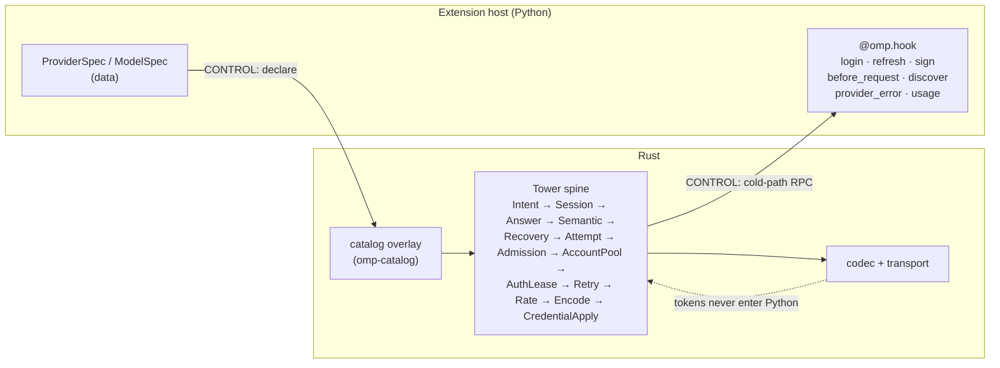
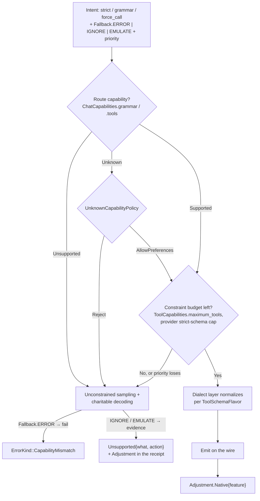

# Inference: providers, models, credentials, and request intents

> **Design document, not a runtime API guarantee.** This corpus includes proposed
> interfaces and historical implementation observations. See
> [implementation status](implementation-status.md) for current owners and known gaps.

## Purpose

`@omp.provider` is how an extension contributes to omp's inference catalog, and `omp.creds` is how it
holds a credential without ever holding a secret on the request path. Together they replace pi's
provider abstraction, which was two functions — `streamSimple` (required) and `stream` (optional),
`/work/pi/packages/ai/src/api-registry.ts:44-53` — and therefore could describe exactly one of the
fifteen things a provider actually does.

That was not a hypothetical shortfall. When pi needed image generation, the provider registry had no
slot for it, so image generation was built beside the registry instead of inside it:
`/work/pi/packages/coding-agent/src/tools/image-gen.ts` is 1,687 lines that re-derive a credential
cascade (`findImageApiKey`, lines 482-598, with a separate branch per provider), base-URL resolution
(`getOpenAIBaseUrl`, line 869), header construction including the Codex account-id quirk
(`buildOpenAIImageHeaders`, line 887), an auth-retry wrapper (`withAuth`, lines 1220-1575), and a
provider-preference fallback loop (line 1113) — every one of which already existed, correct and
tested, in the chat path. The tool then dispatches on a nine-arm `provider === "…"` ladder (lines
1127-1573). Nothing about image generation is hard. What was hard was that `stream`/`streamSimple`
gave the concept of "provider" no room to mean anything except chat, so the second modality had to
start from zero. Then the third one did too.

**Lesson #5**: a provider registry must be a single clean abstraction, and "provider" means far more
than chat completions. In omp a provider declares which of fifteen typed `Operation`s it serves, and
gets synchronized OAuth refresh, account rotation, rate reservation, retry classification, cost
accounting, and cross-route failover for all of them, because those live in the Tower spine
(`crates/ai/src/layer/stack.rs:194-221`) rather than in each provider's code.

The measure of how much room `stream`/`streamSimple` left is that it left none. Grep
`/work/pi/packages/ai/src` — the entire inference package — and the count of files mentioning
`embeddings` is zero. So is `countTokens`, `detokenize`, `speech`, `transcribe`, and `realtime`. Every
capability the Lesson #5 list names as a question was, in the harness that prompted the question,
literally unrepresentable. `tokenize` appears in four files, all of them local context-budget
estimation rather than a provider operation. Only usage query survived as a real subsystem
(`/work/pi/packages/ai/src/usage/`), and it survived because a quota widget could not be built
without it.

The second thing this namespace removes is per-tool wire flags. pi grew `strict?: boolean` and
`customFormat?: { syntax: "lark" | "regex" }` on tool definitions, which tunnel a plugin author's
guess straight to a wire that has opinions — OpenAI caps strict schemas per request, Anthropic has
never parsed a Lark grammar, and Google rejects half of JSON Schema. pi's answer was 83,284 bytes of
schema-walking (`/work/pi/packages/ai/src/utils/schema/normalize.ts`, 2,314 lines) plus a normative
contract document (`/work/pi/packages/ai/src/utils/schema/CONSTRAINTS.md`, 168 lines), per provider —
and it still let three independent extensions brick a request nobody could debug. Here, strictness,
grammars, forced calls, and service tiers are **intents**: structured requests carrying a priority,
spent against a budget the harness owns, normalized once in the dialect layer, and degraded to
unconstrained sampling with charitable decoding when the budget runs out.

---

## Concepts

### Providers are data; code is the cold path only

The catalog is facts. `crates/catalog/README.md` states it plainly: "The crate contains facts
rather than executable provider behavior." An extension's primary contribution is therefore a value,
not a function — a `ProviderSpec` that names routes, endpoints, codecs, authentication shape, models,
limits, pricing, reasoning policy, and compatibility flags. Python code exists only where a fact is
not enough: acquiring a credential interactively, refreshing one, signing a request in a scheme the
catalog cannot describe, polling a `/models` endpoint, mutating a request body, and deciding what to
do when the provider returns 429.

Every real provider extension in the pi catalog sorts into three classes, and the class determines how
much Python survives the port:

| Class | Meaning | Python in the port | Catalog examples |
|---|---|---|---|
| **(a)** | Pure catalog data. Endpoint, codec, auth mode, models, pricing. | none | `awto-pi-lot`, `@thebinaryguy/pi-fast-mode`, `pi-openai-fast`, `@jayteelabs/pi-nous-portal-provider`, every API-key search backend in `.plan/feature-map/web.md:45-56` |
| **(b)** | Catalog data plus cold-path behavior. OAuth, discovery polling, body mutation, failover policy, usage projection. | one or more `@omp.hook` bodies, none on the token path | `@zgltyq/pi-provider-kimi-code`, `pi-lmstudio`, `pi-model-fallback`, `pi-provider-litellm`, `@openference/pi-provider`, `@benvargas/pi-synthetic-provider`, `pi-provider-bedrock` |
| **(c)** | Genuinely foreign wire protocol. | a proxy process; zero Python bytes touch a token | `@rahularya01/pi-cursor` (Connect/protobuf over HTTP/2) |

Class (a) is the target. Two entries in the pi catalog that shipped as *code* are class (a) here:
`@thebinaryguy/pi-fast-mode` and `pi-openai-fast` both exist to inject `"service_tier": "priority"`
into a request body via `before_provider_request`. In omp, service tiers are a declared model
capability (`ServiceTier { name, priority }`, `crates/catalog/src/capability.rs:402-409`) and a
caller intent (`omp.intent.service_tier`). The extension becomes a data patch and a keybinding.



### The operation surface a provider may serve

`OperationKind` (`crates/catalog/src/capability.rs:95-126`) is the closed vocabulary shared by
the catalog and the request layer. Mirrored into Python as `omp.Operation`, it is the honest answer to
"what is a provider":

`CHAT`, `COUNT_TOKENS`, `TOKENIZE`, `DETOKENIZE`, `EMBED`, `GENERATE_IMAGE`, `GENERATE_VIDEO`,
`SPEAK`, `TRANSCRIBE`, `REALTIME`, `SEARCH`, `USAGE`, `DISCOVER_MODELS`, `AUTH`, `NATIVE`.

A provider declares its operations per model and per route; the machinery is shared. `SPEAK` and
`TRANSCRIBE` reach the same credential store as `CHAT`; `REALTIME` reaches the same one over WebRTC
plus a sideband WebSocket (`.plan/feature-map/voice.md:111-127`); `SEARCH` is why web search is a
provider entry rather than a bespoke subsystem (`.plan/feature-map/web.md:39-65`); `USAGE` is why a
quota badge is fourteen lines instead of a private HTTP client. `NATIVE` is the allowlisted
lossless-bytes escape valve, and it is *not* an extension slot — see "Custom wire protocols" below.

### Codecs are selected, never implemented

`api=` on a `RouteSpec` selects from a closed codec set that Rust owns
(`crates/ai/src/codec/`). An extension picks `Api.OPENAI_CHAT` or `Api.ANTHROPIC_MESSAGES`;
it never writes a codec. This is the hard line that keeps Python out of the token path, and it is what
makes class (c) a proxy rather than a plugin.

### Intents, not flags

A caller does not say `strict: true`. It says "I would like strictness, at this priority." The
harness is the only party that can see every registration, so the harness spends the budget.



Two properties matter. First, degradation is never silent: a dropped preference produces an
`Adjustment` in the execution receipt (`crates/ai/src/receipt.rs:42-79`), which reaches
telemetry (`docs/py/10-telemetry.md`) and the journal (`docs/py/09-journal.md`). Second, `REQUIRE`
fails loudly rather than degrading, so a tool that genuinely cannot work unconstrained says so once
instead of emitting garbage forever.

### The forced-call ladder

Forcing a tool call is the worked example, because the naive version is a flag and the correct version
is three rungs:

1. **Soft prompt, always.** A system-adjacent instruction that the model must call the tool next turn.
   Hosted APIs prepend this quietly; a model behind vLLM gets a hard grammar constraint it was never
   told about and flails when reasoning is on. The soft prompt levels that field, so it is
   unconditional and costs nothing.
2. **Native flag only when free.** If the route declares `ToolFeatureBits::NAMED_CHOICE` /
   `REQUIRED_CHOICE` (`crates/catalog/src/capability.rs:224-237`) *and* the wire policy does not
   attach a penalty, set `tool_choice`. Anthropic charges a cache miss on the entire conversation when
   a call is forced, so on Anthropic this rung is skipped.
3. **Escalate on non-compliance.** If the model does not call the tool, retry a bounded number of
   times; as a last resort set the flag even where it costs something, and record
   `Adjustment.Escalated{feature, penalty: Penalty.CACHE_INVALIDATED}`. Correctness beats the cache
   once persuasion has failed.

pi shipped rung 1 for exactly one provider. `google-gemini-cli.ts:1356-1358` pushes a `user` turn
carrying `forcedToolDirective` — the contents of
`packages/ai/src/providers/google-antigravity-forced-tool.md` — but only when
`isAntigravity && !isClaudeModel(model.id) && toolConfig.functionCallingConfig.mode === "ANY"`, with
the comment "Cloud Code Assist drops `toolConfig` on Antigravity's Gemini routes: the backend answers
in text under `mode: "ANY"` and still emits calls under `"NONE"`." The soft prompt was not a rung; it
was a patch, discovered once, applied to one route, and unavailable to every other model that needed
it. That is what "the forced call is a flag" costs you eighteen months in: the correct behavior exists
in the codebase, guarded behind a provider-name check, invisible to the next caller.

### Prompt-slot packing: semantic groups into marker budgets

`docs/py/08-context.md` owns the prompt head: extensions fill declared slots, each carrying a
stability class (`omp.SlotClass`), and the assembled head arrives at this layer as an ordered
sequence of semantic groups — most stable first, each with a content hash. How many groups exist is
a property of the *content*; no provider's wire limit has any say in it. What this layer owns is
the packing: fitting those groups into the selected route's cache-marker budget, declared as
`PromptCacheCaps.max_breakpoints` on `ChatCaps.prompt_caching`.

The algorithm, in full, because it is short and its properties are load-bearing:

1. Let the groups be `g1 … gn`, most stable first, and the route's marker budget be `m`.
2. `m = 0` (implicit prefix caching, or none): place no markers. Implicit-cache providers lose
   nothing; providers without caching were never going to benefit.
3. `n <= m`: place one marker at each group boundary; if a marker remains, place it trailing,
   after the last group and before the message window.
4. `n > m`: merge **adjacent** groups until `n = m`, always merging the adjacent pair closest in
   stability, breaking ties toward the volatile (tail) end — merging two volatile groups forfeits
   the least cacheable prefix, and merging non-adjacent groups would reorder content, which is
   forbidden. Group order never changes; only boundaries disappear.
5. The packing is a pure function of `(group structure, route)` and is recomputed on a slot-set
   epoch change or a route reselection — never per request. A packing that flipped between turns
   would invalidate the very prefix it exists to preserve, which is the same stability rule the
   constraint budget follows (see the closing section).

Anthropic's four `cache_control` markers are one *output* of this packing, not an input to how many
semantic classes exist. A provider with two markers gets the same groups packed into two; a
provider with six gets finer placement for free. The class vocabulary stays semantic and stable
while marker budgets vary per route — the review's correction; `docs/py/08-context.md` records the
class-count reversal on its side.

### Credentials: scoped, and secret-free by default

`omp.creds` is bound to the providers the extension declares in its manifest. There is no
cross-provider read, no enumeration of other providers' accounts, and no filesystem path to the
store. The store itself is Rust: an encrypted SQLite table
(`crates/ai/src/auth/store.rs`) whose master key comes from the OS keychain
(`crates/ai/src/auth/key.rs`), reached over CONTROL through the daemon so refresh is
serialized across every omp process on the machine.

The default is stronger than scoping: **`omp.creds` hands out metadata, not secrets.** A refresh hook
receives the material it needs as a frame argument that lives only for that call; a signing hook
receives a signing handle, not a key. `omp.creds.reveal()` exists, requires a separate manifest grant,
and is journaled every time — it is there for one purpose, which is the explicitly-granted import of a
credential the user already owns elsewhere.

That last sentence is the replacement for credential scraping. `@rahularya01/pi-cursor` runs a
four-tier harvest cascade: `security find-generic-password -s cursor-access-token` against the macOS
Keychain, then VS Code's `globalStorage/state.vscdb` SQLite database, then the Linux equivalents, then
the same paths *inside WSL* via `/mnt/c/Users/<user>/AppData/…`. An extension that can read arbitrary
credential stores is a credential exfiltration primitive with a plugin manifest. omp offers PKCE
(`OAuthFlowSpec::Pkce` with a loopback redirect captured in Rust, so extensions never bind ports) and,
for the case where the user genuinely wants their desktop app's token, one explicit command that
requests a one-time file-read grant and calls `omp.creds.import_oauth()`. Two paths, both consented,
neither silent.

---

## Reference

Cross-references: `docs/py/00-overview.md` for `omp.Context`, `omp.Duration`, `OperationSpec`, the
manifest, principal identity, and trust tiers; `docs/py/05-hooks.md` for `@omp.hook`, the
`omp.HookPhase` phases, ordering, and the `omp.HookDecision` arms
(`Allow`/`Deny`/`Modify`/`Defer`/`RequireApproval`); `docs/py/03-params.md` for
`omp.InvocationPhase`; `docs/py/08-context.md` for prompt slots and `omp.SlotClass`;
`docs/py/12-agents.md` for `omp.agents.completion` and schedules; `docs/py/11-env.md` for `omp.env`
(named processes, blobs) and the fact that the Environment may be remote; `docs/py/02-verdicts.md`
for `omp.Payload`/`omp.Fault` and the durable `omp.CallOutcome`; `docs/py/09-journal.md` for
durable state; `docs/py/10-telemetry.md` for receipt-derived metrics; `docs/py/07-ui.md` for
`@omp.command` and TML; `docs/py/14-deploy.md` for how an extension, its manifest grants, and its
declaration table arrive.

Every public symbol in this namespace carries generated `OperationSpec(minimum_phase, durability,
cost, authority)` metadata, and the phase legality matrix in `docs/py/00-overview.md` is the
per-symbol truth. Two rows matter enough to restate here. Inference-triggering operations —
`omp.agents.completion` and anything else that spends the budgets below — are durable Requests
with `minimum_phase=EFFECTS_AUTHORIZED`: a device body can trigger paid inference only once its
own invocation holds an effect token, so a speculative fragment can never spend money. Runtime
provider mutation (`ProviderHandle.replace`, `.retract`, a declaration made from a hook body) is a
CONTROL Request gated by the same matrix; declaration at import time is registration, not an
operation, and runs while CONTROL and DATA are still unavailable.

### `omp.provider`

```python
def provider(spec: ProviderSpec, /, *, priority: int = 0,
             extends: str | None = None, replaces: str | None = None) -> ProviderHandle: ...
```

Declares a provider. Dual-use by design, because class (a) and class (b) differ only in whether any
code exists:

```python
# class (a) — data only
omp.provider(ProviderSpec(id="ppq", name="PPQ.ai", routes=(...,), models=(...,)))

# class (b) — data plus cold-path behavior, scoped to this provider
@omp.provider(KIMI_SPEC)
class KimiCode:
	@omp.hook("provider_refresh")
	async def refresh(self, req: RefreshRequest, ctx: omp.Context) -> Credential: ...
```

**Arguments.** `spec` is the provider description. `priority` orders this declaration against other
extensions and against user configuration when two *unrelated* declarations touch the same provider
id: larger wins, and the losing declaration is retained as evidence rather than discarded. Two
unrelated declarations at **equal** priority are an activation-time error — activation fails naming
both declarations by `(publisher, extension_id, declaration_id)`, and the provider id stays absent
until one side yields. Revision 1 said ties break on load order. The review called that what it is:
the exact nondeterminism device precedence exists to remove, reintroduced one namespace over —
which spec won would have depended on import sequence, invisible and unstable across installs.
Load-order tie-breaking is deleted; a genuine collision is a conflict to surface, not a race to
resolve quietly.

Deliberate layering therefore says so explicitly, with the two declarations that replace the
tie-break:

- `extends="<provider-id>"` declares an **overlay**: this declaration patches the named base
  declaration, its populated fields layered over the base through the same field-granular overlay
  merge the catalog already uses (`CatalogOverlay`, `crates/catalog/src/resolve.rs:256`). The
  base must exist at activation — extending an absent provider is the same activation-time error —
  and both declarations stay visible in provenance, each field attributed to the declaration that
  set it.
Overlay declarations carry model and alias contributions in the same provider record:

```python
@dataclass(frozen=True, slots=True)
class ModelPatch:
    class_: str | None = None
    display_name: str | None = None
    wire_ids: Mapping[str, str] | None = None
    routes: tuple[str, ...] | None = None
    capabilities: object | None = None
    limits: object | None = None
    thinking: object | None = None
    thinking_routing: object | None = None
    wire_policy: object | None = None
    context: ContextSpec | None = None
    pricing: Cost | None = None
    availability: Availability | None = None
    context_promotion_target: str | None = None
    remote_compaction: object | None = None
    premium_multiplier_millionths: int | None = None
    updated_at_ms: int | None = None
    blocked_until_ms: int | None = None
    deprecated: bool | None = None

@dataclass(frozen=True, slots=True)
class ModelOverlay:
    selector: ModelRef
    added: ModelSpec | None = None
    patch: ModelPatch = ModelPatch()

@dataclass(frozen=True, slots=True)
class CatalogAlias:
    alias: str
    target: str
    rationale: str
    provenance: str

@dataclass(frozen=True, slots=True)
class ScopedAlias:
    provider: str
    definition: CatalogAlias
```

`ProviderSpec.model_overlays` and `ProviderSpec.aliases` hold these tuples. Model selectors and scoped
aliases must name the declaring provider. Duplicate model selectors, or one alias spelling assigned
to different targets, fail during declaration before the provider reaches activation. A declaration
with model overlays must use `extends=`, keeping partial records out of standalone provider
declarations.

- `replaces="<publisher>/<extension-id>"` declares a **full replacement** of that publisher's
  declaration for the same provider id. Replacement is governed by the identity rules in
  `docs/py/14-deploy.md`: publisher-qualified, explicitly declared in the workspace manifest,
  policy-permitted — and when the replacement is unavailable, malformed, or denied, the replaced
  declaration becomes active again deterministically, never by load order. The replaced spec is
  retained as evidence.

**Returns** a `ProviderHandle`. **Channel** CONTROL, at declaration. **Latency class**
declaration-time, once. **Failure** fail-closed: an invalid spec is rejected with a `SpecError`
naming the field, and the provider is simply absent — a malformed provider never half-registers.
**Raises** `SpecError` on
validation failure, `PermissionError` when the manifest does not grant `catalog` for the declared
provider id pattern.

Used as a decorator, every `@omp.hook` defined on the class body is bound with an implicit
`provider=spec.id`, and the instance is constructed once at load with no arguments.

```python
class ProviderHandle:
	id: str
	async def retract(self) -> None: ...
	async def replace(self, spec: ProviderSpec) -> None: ...
	async def models(self) -> tuple[ModelCard, ...]: ...
	async def is_authenticated(self) -> bool: ...
	async def request(self, operation: Operation, request: ImageRequest | SpeechRequest | TranscriptionRequest) -> ImageResult | SpeechResult | TranscriptionResult: ...
```

`retract()` removes the declaration; models vanish from selection at the next catalog generation and
in-flight requests holding a pinned plan complete normally. `replace()` swaps the spec atomically —
this is the supported shape for reconciliation, and it is why `pi-lmstudio`'s
`registerProvider`/`unregisterProvider` churn collapses into one call. `models()` returns the
*resolved* cards, after overlay merge and user configuration, which is not necessarily what was
declared. `is_authenticated()` answers without revealing anything.

`omp.provider.watch_models(since=None)` returns a resumable `WatchModels` subscription whose async
iterator yields ordered `ModelEvent` catalog deltas until the host closes the stream.

**Resolved (2026-08-20 ruling): GENERATE_IMAGE uses a named provider request seam.**
`ProviderHandle.request(Operation.GENERATE_IMAGE, ImageRequest(...))` is the extension-visible
CONTROL + DATA host arm; Core owns selection, credential application, wire encoding, decoding, blob
storage, and the settled cost receipt. The frozen request seam is deliberately typed rather than a
generic mapping, and an unwired host raises `NotWiredError`.

#### Activation: eager, before model selection

Every surface in this document is declared in the manifest's declaration table
(`docs/py/14-deploy.md`): `declaration_id, kind, module, static key, activation trigger, required
API level, failure class`, with the provider id pattern as the static key. The activation
classification per class:

- **Class (a) is static-no-Python.** A pure-data `ProviderSpec` ships as a catalog patch in the
  manifest; the extension's Python is never imported to make its models selectable.
- **Classes (b) and (c) are eager-before-model-selection.** The catalog must be complete before the
  session's first model resolution — a provider that appears only after some later trigger is a
  model the user cannot pick and a credential the selector cannot see — so an extension with
  provider *code* is activated with
  `extension_activate(reason=FIRST_REACH | RESTART | HOT_RELOAD, session_started_at, generation)`
  ahead of the first selection, never lazily on first reach. This is the trigger recorded per
  declaration in the manifest table. `session_start` fires only for the real session transition,
  on extensions that were already active for it.

Revision 1's class (c) pattern hooked `session_start` to start its proxy, and this document's
crash-recovery bullet had the host "replay `session_start`" after a restart. Both were the
late-activation lie the rename table deletes: an extension activated mid-session was handed a
synthetic `session_start` for a transition that happened long before it was running. The hook is
now `extension_activate`, whose `reason` says honestly why the extension is coming up and whose
`session_started_at` carries the real transition time for code that needs it.

### `ProviderSpec`

```python
@dataclass(frozen=True, slots=True)
class ProviderSpec:
	id: str
	name: str
	routes: tuple[RouteSpec, ...]
	models: tuple[ModelSpec, ...] = ()
	management: ManagementSpec = ManagementSpec()
	discovery_defaults: DiscoveryDefaults | None = None
	mapping: RegistryMapping = RegistryMapping.CONCRETE
	aliases: tuple[ScopedAlias, ...] = ()
	model_overlays: tuple[ModelOverlay, ...] = ()
```

| Field | Semantics |
|---|---|
| `id` | Stable provider identifier; the `provider` half of a `provider/model` selector. Must match the manifest's `catalog` grant. Lowercase, `[a-z0-9-]`. |
| `name` | Human-readable label for pickers and the login list. |
| `routes` | One or more concrete endpoints. A provider with three regions is one provider with three routes, not three providers. Non-empty except for an `extends=` overlay that only patches inherited facts. |
| `models` | Statically known models. May be empty when every model arrives from `models_discover`. |
| `management` | Which provider-level operations exist (see `ManagementSpec`). |
| `discovery_defaults` | Policy defaults applied to a newly discovered model whose facts the provider does not report. Required if any route sets `discovery=`. |
| `mapping` | `CONCRETE`, `RegistryMapping.alias(target, reason)`, or `RegistryMapping.replacement(component, reason)`. Aliasing is declarative and auditable; the `reason` is not decorative — it appears in `omp models --json`. |
| `aliases` | Provider-scoped model selector aliases contributed by this declaration. |
| `model_overlays` | Additions and field-granular patches applied to inherited model records; requires `extends=`. |

```python
@dataclass(frozen=True, slots=True)
class ManagementSpec:
	operations: frozenset[Operation] = frozenset()
	multiple_accounts: bool = False
	refresh: bool = False
	principal_quota: bool = False
```

`operations` are the *provider-level* operations — typically `{Operation.AUTH}`,
`{Operation.USAGE}`, `{Operation.DISCOVER_MODELS}` — as distinct from a model's operations.
`multiple_accounts` opts the provider into the account pool, so several stored principals may be
selected and rotated (`crates/ai/src/account/pool.rs`). `refresh` declares that a
credential can be renewed without changing principal, which is what makes `RetryAction::RefreshCredential`
a legal failover. `principal_quota` declares that quota observations are per-principal rather than
per-provider, which is what makes rotation on `QuotaExhausted` meaningful.

### `RouteSpec`

```python
@dataclass(frozen=True, slots=True)
class RouteSpec:
	id: str
	base_url: str
	api: Api
	transport: Transport = Transport.HTTP
	auth: AuthSpec = AuthSpec(mode=AuthMode.NONE)
	headers: Mapping[str, str] = FROZEN_EMPTY
	region: str | None = None
	discovery: DiscoverySpec | None = None
	trust: TrustDomain = TrustDomain.https()
	limits: RouteLimits = RouteLimits()
	compat: CompatFlags = CompatFlags()
	codec_profile: CodecProfile = CodecProfile.STANDARD
	priority: int | None = None
```

| Field | Semantics |
|---|---|
| `id` | Route identifier, unique within the provider. Appears in receipts and in the `:route` selector suffix. |
| `base_url` | Endpoint. May contain compiler-validated placeholders (e.g. `{region}`). Validated against `trust`. |
| `api` | Codec selector; see `Api`. |
| `transport` | Framing; see `Transport`. |
| `auth` | Credential requirements; see `AuthSpec`. |
| `headers` | Static, non-secret request headers. Rejected if the name is a credential-bearing header (`authorization`, `x-api-key`, `cookie`, …) — those come from `auth`, so a header map can never smuggle a secret into the catalog. |
| `region` | Stable region name used for routing and, when `AccountScope.REGION` is set, for credential scoping. |
| `discovery` | Remote model-list configuration; see `DiscoverySpec`. |
| `trust` | Origin and redirect boundary; see `TrustDomain`. |
| `limits` | Route-level ceilings layered *over* model capabilities; see `RouteLimits`. |
| `compat` | Wire-lowering quirks; see `CompatFlags`. |
| `codec_profile` | `STANDARD`, `GOOGLE_CCA_GEMINI_CLI`, `GOOGLE_CCA_ANTIGRAVITY`, `APPLE_FM`. Selects a codec construction variant without provider-name policy. |
| `priority` | Larger is preferred when several routes serve the same model. `None` means catalog default ordering. |

Supporting closed vocabularies are public where they are consumed:

- `omp.provider.CodecProfile`: codec construction variants `STANDARD`,
  `GOOGLE_CCA_GEMINI_CLI`, `GOOGLE_CCA_ANTIGRAVITY`, and `APPLE_FM`.
- `omp.provider.OAuthFlowKind`: authorization-flow discriminators `PKCE`, `DEVICE_CODE`,
  `PASTE`, and `CUSTOM`.
- `omp.provider.ImageFeature`, `omp.provider.SpeechFeature`,
  `omp.provider.TranscriptionFeature`, and `omp.provider.RealtimeFeature`: the closed capability
  sets carried by their corresponding `*Caps.features` fields; the member sets are listed in the
  capability table below.
- `omp.provider.MismatchPolicy`: selected-codec mismatch handling, either `REJECT` or
  `DROP_PREFERRED`.
- `omp.provider.FailoverKind`: recovery actions `RETRY`, `REFRESH_CREDENTIAL`,
  `ROTATE_ACCOUNT`, `RESELECT_ROUTE`, `SWITCH_MODEL`, `RESEED_SESSION`, `SEMANTIC_RETRY`, and
  `FAIL`.

### `Api`

Closed selector over Rust's codec set. Members, with the codec that backs each:

| Member | Codec | Notes |
|---|---|---|
| `OPENAI_CHAT` | `codec/openai_chat.rs` | Chat Completions. The default for OpenAI-compatible servers. |
| `OPENAI_RESPONSES` | `codec/openai_responses.rs` | Responses API. The only codec that currently emits Lark/regex/EBNF grammar tools. |
| `OPENAI_CODEX` | `codec/openai_codex.rs` | Codex Responses, including `use_responses_lite`. |
| `ANTHROPIC_MESSAGES` | `codec/anthropic.rs` | Messages, plus the native token-counting endpoint. |
| `GEMINI` | `codec/gemini.rs` | Google Generative AI / Vertex. |
| `GOOGLE_CCA` | `codec/google_cca.rs` | Cloud Code Assist; pair with a `codec_profile`. |
| `BEDROCK` | `codec/bedrock.rs` | Converse-stream over AWS event-stream framing. |
| `OLLAMA` | `codec/ollama.rs` | Ollama native. |
| `GITLAB_DUO` | `codec/gitlab.rs` | GitLab Duo workflow. |
| `CURSOR` | `codec/cursor.rs` | First-party Connect protocol route. Not available to extensions. |
| `DEVIN` | `codec/devin.rs` | First-party. Not available to extensions. |
| `OPENAI_EMBEDDING` | `codec/openai_embedding.rs` | `Operation.EMBED`. |
| `OPENAI_MEDIA` | `codec/openai_media.rs` | Image, video, speech, transcription. |
| `OPENAI_REALTIME` | `codec/openai_realtime.rs` | `Operation.REALTIME`. |
| `SEARCH_EXA` / `SEARCH_TAVILY` / `SEARCH_KAGI` / `SEARCH_PERPLEXITY` / `SEARCH_PARALLEL` | `codec/search_*.rs` | `Operation.SEARCH`. |
| `SEARCH_HTTP` | shared search HTTP machinery + provider `search_parse` hook | `Operation.SEARCH`. Core performs transport and credential placement; the extension parses the raw response, and the key is never revealed to Python. |
| `OMP_NATIVE` | `codec/omp_native.rs` | omp's own streaming protocol; used by the auth-gateway sidecar. |
| `LOCAL` | in-process | `Transport.LOCAL` only. |

Selecting an `Api` marked "not available to extensions" raises `PermissionError` at declaration.

### `Transport`

`HTTP`, `WEBSOCKET`, `WEBRTC`, `AWS_EVENT_STREAM`, `CONNECT`, `LOCAL`. Mirrors `TransportKind`
(`crates/catalog/src/provider.rs:32-45`). Only combinations the selected codec supports are
accepted; the pairing table is validated at declaration, not at first request.

### `AuthSpec`

```python
@dataclass(frozen=True, slots=True)
class AuthSpec:
	mode: AuthMode
	header: str | None = "authorization"
	prefix: str | None = "Bearer "
	query: str | None = None
	scopes: tuple[str, ...] = ()
	audience: str | None = None
	account_scope: AccountScope = AccountScope.PROVIDER
	sources: tuple[CredentialSource, ...] = (CredentialSource.stored(),)
	oauth: OAuthSpec | None = None
	signing: SigV4Spec | None = None
```

`AuthMode`: `NONE`, `API_KEY`, `BEARER`, `OAUTH`, `AWS_SIGV4`, `GCP_ADC`, `AZURE_AD`, `GITHUB_APP`,
`OMP_SESSION` — mirrors `AuthSpecKind` (`crates/catalog/src/provider.rs:92-111`).

`header`/`prefix`/`query` are the credential placement, mutually exclusive between header and query.
This is the field that deletes a whole category of extension code:
`@zgltyq/pi-provider-kimi-code` had to wrap the stream and override `x-api-key: null` while setting
`authorization: Bearer <token>`, because pi's Anthropic client hard-coded an `sk-ant-oat` prefix check
before it would use a bearer. Here that is `AuthSpec(mode=AuthMode.BEARER, header="authorization",
prefix="Bearer ")` — data, applied by `CredentialApplyService`
(`crates/ai/src/layer/encode.rs:209`) with no extension in the path.

`account_scope`: `PROVIDER` (one principal for everything), `ROUTE`, or `REGION`. Sets the boundary at
which a principal and its quota are shared, and therefore what "rotate to a sibling account" means.

`sources` is the acquisition order. Constructors:

| Constructor | Behavior |
|---|---|
| `CredentialSource.env(*names)` | First populated environment variable, in order. Read in Rust; the value never enters Python. |
| `CredentialSource.stored()` | The encrypted account store. |
| `CredentialSource.oauth()` | Runs the `oauth=` flow. Requires `oauth` to be set. |
| `CredentialSource.application_default(api_key_env=…, project_env=…, location_env=…)` | Google ADC chain, resolved by `auth/adc.rs`. |
| `CredentialSource.aws_chain()` | Standard AWS chain, resolved by `auth/sigv4.rs`. |
| `CredentialSource.session()` | Interactive provider session credential. |

There is deliberately **no** `CredentialSource.command(...)`. pi supported `!command` substitution for
keys and headers, resolved per request (`.plan/feature-map/FEATURES.md:157`), and
`pi-provider-litellm` used it to run `LITELLM_API_KEY_HELPER` on the turn path. Executing a shell
helper synchronously before every request is a latency cliff, an unauditable credential source, and a
policy hole. The replacement is a `@omp.hook("provider_refresh")` that runs a command through
`omp.env.sh.run` ahead of expiry and stores the result — same capability, off the request path, visible
to policy (`docs/py/06-policy.md`), and cached with a real TTL. This is a deliberate divergence from
the feature map; see the closing section.

`signing` carries the SigV4 contract for `AWS_SIGV4`:

```python
@dataclass(frozen=True, slots=True)
class SigV4Spec:
	service: str
	region: RegionSource = RegionSource.route_endpoint()
```

`RegionSource` constructors: `.route_endpoint()`, `.fixed(region)`, `.env(*names)`.

### `OAuthSpec`

```python
@dataclass(frozen=True, slots=True)
class OAuthSpec:
	client_id: str
	token_url: str
	flow: OAuthFlow
	scopes: tuple[str, ...] = ()
	audience: str | None = None
	placement: TokenPlacement = TokenPlacement.header("authorization", "Bearer ")
	token_params: Mapping[str, str] = FROZEN_EMPTY
	refresh: RefreshBehavior = RefreshBehavior.TOKEN_ENDPOINT
	principal: PrincipalResolution | None = None
```

Everything here is public. A `client_id` for an installed application is not a secret; a client
*secret* has no field, because a flow that needs one cannot be run from a distributed extension.

`OAuthFlow` variants:

```python
class OAuthFlow:
	@staticmethod
	def pkce(authorize_url: str, redirect_uri: str, *,
	         completion: Completion = Completion.CALLBACK_URL,
	         params: Mapping[str, str] = FROZEN_EMPTY) -> OAuthFlow: ...
	@staticmethod
	def device_code(device_authorization_url: str, *, max_polls: int = 180,
	                interval: omp.Duration = omp.Duration("5s"),
	                max_interval: omp.Duration = omp.Duration("30s")) -> OAuthFlow: ...
	@staticmethod
	def paste(authorization_url: str, prompt: str) -> OAuthFlow: ...
```

`Completion`: `CALLBACK_URL` (Rust binds the loopback listener and validates `state`),
`PASTE_CALLBACK_URL`, `PASTE_CODE`. Extensions never bind a port — this is the direct replacement for
pi's `callbackPort` field on `ProviderDefinition`
(`/work/pi/packages/ai/src/registry/types.ts:83`) and the `CALLBACK_PORTS` map derived from it.

`TokenPlacement`: `.header(name, prefix)`, `.query(parameter)`.

`RefreshBehavior`: `UNSUPPORTED`, `TOKEN_ENDPOINT`, `RefreshBehavior.endpoint(url, params={})`.

`PrincipalResolution` binds a refreshed credential to a stable identity so rotation and quota
attribution survive a token swap: `.id_token_claim(claim)`, `.access_token_claims(*claims)`,
`.token_response_field(pointer)`, `.userinfo(url, field)`, `.static_label(label)`.

A device-code provider is therefore entirely declarative:

```python
KIMI_OAUTH = OAuthSpec(
	client_id="kimi-code-cli",
	token_url="https://api.moonshot.cn/oauth/token",
	flow=OAuthFlow.device_code("https://api.moonshot.cn/oauth/device/code", interval=omp.Duration("5s")),
	scopes=("code",),
	placement=TokenPlacement.header("authorization", "Bearer "),
	principal=PrincipalResolution.access_token_claims("sub", "uid"),
)
```

Login, polling with server-honored slow-down, storage, expiry tracking, refresh, and cross-process
refresh serialization are all Rust. `@zgltyq/pi-provider-kimi-code` implemented the polling loop
itself (`index.ts:133-289`) and got no serialization; pi's own core needed 6,732 lines and an SQLite
lease fence with owner renewal (`/work/pi/packages/ai/src/auth-storage.ts:2420-2641`) to do it
properly. An extension was never going to.

### `TrustDomain` and `RouteLimits`

```python
@dataclass(frozen=True, slots=True)
class TrustDomain:
	origin: str
	redirects: RedirectTrust = RedirectTrust.SAME_ORIGIN
	allow_plaintext: bool = False
```

`RedirectTrust`: `DENY`, `SAME_ORIGIN`, `PUBLIC_ONLY` (cross-origin accepted, credentials not
forwarded). `TrustDomain.https()` derives the origin from `base_url` and requires TLS.
`TrustDomain.loopback()` is the only sanctioned way to set `allow_plaintext=True`, and it validates
that the host is a loopback address or a Unix socket path — which is what a local proxy or a LM Studio
server needs, and nothing else gets.

```python
@dataclass(frozen=True, slots=True)
class RouteLimits:
	operations: frozenset[Operation] | None = None
	max_context_tokens: int | None = None
	max_output_tokens: int | None = None
	disable_server_state: bool = False
	disable_prompt_caching: bool = False
```

`operations=None` leaves model capabilities unchanged; a set intersects them. Limits only ever
subtract, so a route can never claim a capability its model does not have.

### `DiscoverySpec` and `DiscoveryDefaults`

```python
@dataclass(frozen=True, slots=True)
class DiscoverySpec:
	kind: DiscoveryKind
	path: str
	label: str
	pagination: Pagination = Pagination.single_page()
	authoritative: bool = False
	interval: omp.Duration | None = None
```

`DiscoveryKind`: `OPENAI_MODELS`, `GOOGLE_MODELS`, `OLLAMA_TAGS`, `ACCOUNT_MODELS`, `SPECIALIZED`.
The first four are parsed in Rust from a declared shape — an OpenAI-compatible `/v1/models` needs no
Python at all. `SPECIALIZED` means "a `models_discover` hook supplies the rows."

`authoritative` is the field that replaces `unregisterProvider`. When a successful listing is
authoritative, absence from it is proof of unavailability, and the catalog retires the model.
When it is not, absence means "no new information" and the previous rows persist. `pi-lmstudio`
polled every turn and unregistered on failure, which meant a single dropped packet deleted the user's
model list mid-session.

`interval` is the poll period; `None` means on session start and on explicit refresh only. The
floor is `omp.Duration("5s")`, and polls are deduplicated across sessions in the daemon.

`Pagination`: `.single_page()`, `.cursor(query_parameter)`, `.page_number(query_parameter, first_page=1)`.

```python
@dataclass(frozen=True, slots=True)
class DiscoveryDefaults:
	routes: tuple[str, ...]
	cost: Cost = Cost.free()
	context_window: int | None = None
	max_output_tokens: int | None = None
	operations: frozenset[Operation] = frozenset({Operation.CHAT})
	availability: Availability = Availability.AVAILABLE
	confidence: Confidence = Confidence.INFERRED
```

Discovery is conservative by construction (`crates/catalog/src/discover.rs`): a discovered model
that reports nothing gets *unknown* capabilities, not optimistic ones, and `Confidence.INFERRED`
marks every fact that came from a default rather than from the provider. Facts from separate
observations merge by taking the conservative minimum.

### `ModelSpec`

```python
@dataclass(frozen=True, slots=True)
class ModelSpec:
	id: str
	display_name: str
	routes: tuple[str, ...]
	wire_ids: Mapping[str, str] = FROZEN_EMPTY
	operations: frozenset[Operation] = frozenset({Operation.CHAT})
	family: str | None = None
	context_window: int | None = None
	max_input_tokens: int | None = None
	max_output_tokens: int | None = None
	max_batch: int | None = None
	input_modalities: frozenset[Modality] = frozenset({Modality.TEXT})
	thinking: ThinkingSpec | None = None
	thinking_routing: ThinkingRouting = ThinkingRouting()
	cost: Cost = Cost.free()
	premium_multiplier: Decimal | None = None
	compat: CompatFlags = CompatFlags()
	context: ContextSpec = ContextSpec.replay()
	availability: Availability = Availability.AVAILABLE
	context_promotion_target: str | None = None
	remote_compaction: RemoteCompaction | None = None
	chat: ChatCaps = ChatCaps()
	embeddings: EmbeddingCaps | None = None
	image: ImageCaps | None = None
	video: VideoCaps | None = None
	speech: SpeechCaps | None = None
	transcription: TranscriptionCaps | None = None
	realtime: RealtimeCaps | None = None
	search: SearchCaps | None = None
	tokenization: TokenizationCaps | None = None
```

| Field | Semantics |
|---|---|
| `id` | Normalized model key; the `model` half of a selector. |
| `display_name` | Label for pickers. |
| `routes` | Route ids in preference order. Every id must exist in the same `ProviderSpec`. |
| `wire_ids` | Route id → opaque wire model identifier, for the case where the id sent upstream differs from the local id. This is how one upstream model appears as several local entries (a long-context tier is a client-side budget, not a served model). Absent entries default to `id`. |
| `operations` | What this model can do. A model with `{CHAT, COUNT_TOKENS}` gets Anthropic's token-counting endpoint; a model with `{GENERATE_IMAGE}` needs no chat fields at all. |
| `family` | Vendor lineage for policy grouping (`claude-opus`, `gpt-5`). Drives classification and effort-ladder inference when omitted facts must be guessed. |
| `context_window`, `max_input_tokens`, `max_output_tokens`, `max_batch` | Token and batch limits. `None` means unknown, which is distinct from unlimited: an unknown context window disables context-promotion and compaction triggers rather than assuming a value. |
| `input_modalities` | `Modality.TEXT`, `IMAGE`, `AUDIO`, `VIDEO`, `DOCUMENT`. |
| `thinking` | Reasoning capability profile; see `ThinkingSpec`. `None` means non-reasoning. |
| `thinking_routing` | Model-specific effort spellings and per-effort wire-model routing; see `ThinkingRouting`. |
| `cost` | Integer price schedule; see `Cost`. |
| `premium_multiplier` | Quota multiplier as a `Decimal`, stored at millionth precision. `Decimal("0.25")` means a request costs a quarter of a premium unit. |
| `compat` | Wire quirks; see `CompatFlags`. Model-level flags override route-level. |
| `context` | How history reaches the route; see `ContextSpec`. |
| `availability` | `UNSPECIFIED`, `AVAILABLE`, `LOGIN_REQUIRED`, `BLOCKED`, `DISABLED`. |
| `context_promotion_target` | Model to switch to when the context outgrows this one. `provider/id` or bare `id`. |
| `remote_compaction` | Provider-side compaction endpoint; see `RemoteCompaction`. |
| `chat` … `tokenization` | Per-operation capability records. `None` asserts the operation is unsupported; a record present but with `UNKNOWN` axes asserts nothing. |

### `Cap`, `UNKNOWN`, `UNSUPPORTED`

Capability axes are three-valued, because "we have not checked" and "the provider does not support
this" must not collapse (`crates/catalog/src/capability.rs:176-193`).

```python
UNKNOWN: Final[Cap]        # no evidence either way — the default
UNSUPPORTED: Final[Cap]    # positive evidence of absence
```

Any concrete value asserts support. A `REQUIRE` intent can never be satisfied by `UNKNOWN`; a
`PREFER` intent can, but only when the caller's `UnknownCapabilityPolicy` allows it. Declaring
`UNSUPPORTED` is therefore genuinely useful: it lets the planner reject a route before spending an
attempt on it.

### `ChatCaps`

```python
@dataclass(frozen=True, slots=True)
class ChatCaps:
	roles: Cap | frozenset[Role] = UNKNOWN
	mid_session_roles: Cap | frozenset[Role] = UNKNOWN
	tools: Cap | ToolCaps = UNKNOWN
	structured_output: Cap | frozenset[StructuredForm] = UNKNOWN
	grammar: Cap | frozenset[GrammarSyntax] = UNKNOWN
	text_verbosity: Cap | frozenset[Verbosity] = UNKNOWN
	reasoning: Cap | ReasoningCaps = UNKNOWN
	input_modalities: Cap | frozenset[Modality] = UNKNOWN
	hosted_tools: Cap | frozenset[HostedTool] = UNKNOWN
	prompt_caching: Cap | PromptCacheCaps = UNKNOWN
	service_tiers: Cap | tuple[ServiceTier, ...] = UNKNOWN
	sampling: Cap | frozenset[SamplingControl] = UNKNOWN
	safety: Cap | frozenset[SafetyControl] = UNKNOWN
	determinism: Cap | frozenset[DeterminismControl] = UNKNOWN
	server_state: Cap | ServerStateCaps = UNKNOWN
	logprobs: Cap | LogprobCaps = UNKNOWN
```

Member vocabularies, each mirroring a Rust bitset:

- `Role`: `SYSTEM`, `DEVELOPER`, `USER`, `ASSISTANT`, `TOOL`. `mid_session_roles` is separate because
  several providers accept a system message only at position zero.
- `ToolCaps(features: frozenset[ToolFeature], maximum_tools: int | None)` where `ToolFeature` is
  `PARALLEL`, `STRICT_SCHEMA`, `NAMED_CHOICE`, `REQUIRED_CHOICE`, `DISABLED_CHOICE`. `maximum_tools`
  and `STRICT_SCHEMA` are exactly the inputs to the constraint budget.
- `StructuredForm`: `JSON_OBJECT`, `JSON_SCHEMA`.
- `GrammarSyntax`: `REGEX`, `LARK`, `EBNF`.
- `Verbosity`: `LOW`, `MEDIUM`, `HIGH`.
- `ReasoningCaps(features, efforts, modes, max_budget_tokens)` — `ReasoningFeature` covers visibility,
  effort selection, budget selection, and signature preservation; `efforts` is a set of
  `ReasoningEffort`; `modes` is a set of `ReasoningMode` (`PRO`).
- `Modality`: `TEXT`, `IMAGE`, `AUDIO`, `VIDEO`, `DOCUMENT`.
- `HostedTool`: `WEB_SEARCH`, `CODE_EXECUTION`, `RETRIEVAL`, `URL_CONTEXT`, `DEEP_RESEARCH`.
  Declaring these is how a provider's server-side tools become available *without* occupying a
  registered schema slot.

**Resolved (2026-08-20 ruling): `URL_CONTEXT` and `DEEP_RESEARCH` are hosted-tool capabilities, not
function-call `ToolFeature` members.**
- `PromptCacheCaps(retention: frozenset[CacheRetention], min_prefix_tokens, max_breakpoints)` where
  `CacheRetention` is `REQUEST`, `SESSION`, `SHORT`, `LONG`.
- `ServiceTier(name: str, priority: int)` — `priority` is a relative scheduling preference, larger
  preferred. `ServiceTier("priority", 20)` is the entire content of two pi extensions.
- `SamplingControl`: `TEMPERATURE`, `TOP_P`, `TOP_K`, `FREQUENCY_PENALTY`, `PRESENCE_PENALTY`, `STOP`.
- `SafetyControl`: `SAFETY_SETTINGS`, `CONTEXT_FILTERS`.
- `DeterminismControl`: `SEED`, `DETERMINISTIC_MODE`.
- `ServerStateCaps(continuation: bool, expiry_evidence: bool, fork_requires_reseed: bool)`.
- `LogprobCaps(maximum_top_logprobs: int, prompt_logprobs: bool)`.

### The non-chat capability records

Each is a plain frozen dataclass; the point of documenting them individually is that pi had nowhere to
put any of them.

| Record | Fields |
|---|---|
| `EmbeddingCaps` | `inputs: frozenset[EmbeddingInput]` (`TEXT`, `TOKEN_IDS`, `IMAGE`), `formats: frozenset[EmbeddingFormat]` (`FLOAT32`, `BASE64`, `INT8`, `BINARY`), `dimensions: DimensionRange \| None`, `default_dimensions: int \| None`, `max_batch: int \| None`, `normalizes: bool` |
| `ImageCaps` | `features: frozenset[ImageFeature]` (`GENERATE`, `EDIT`, `MASK`, `REFERENCE_IMAGES`, `TRANSPARENCY`), `sizes: tuple[Dimensions, ...]`, `formats: frozenset[ImageFormat]`, `max_references: int \| None` |
| `Dimensions` | `width: int`, `height: int`; both are positive pixel counts |
| `ImageFormat` | `PNG`, `JPEG`, `WEBP` |
| `VideoCaps` | `features: frozenset[VideoFeature]` (`GENERATE`, `EDIT`, `IMAGE_TO_VIDEO`, `AUDIO`), `max_duration: omp.Duration \| None`, `fps: tuple[int, ...]`, `sizes: tuple[Dimensions, ...]` |
| `SpeechCaps` | `features: frozenset[SpeechFeature]` (`STREAMING`, `TIMESTAMPS`, `SPEED`, `VOICE_SELECTION`), `voices: tuple[str, ...]`, `formats: frozenset[AudioFormat]`, `sample_rates_hz: tuple[int, ...]` |
| `TranscriptionCaps` | `features: frozenset[TranscriptionFeature]` (`STREAMING`, `TIMESTAMPS`, `DIARIZATION`, `TRANSLATION`, `LANGUAGE_HINT`), `formats: frozenset[AudioFormat]`, `max_duration: omp.Duration \| None` |
| `RealtimeCaps` | `features: frozenset[RealtimeFeature]` (`AUDIO_IN`, `AUDIO_OUT`, `TEXT`, `TOOLS`, `SERVER_VAD`, `SEMANTIC_VAD`, `INTERRUPTION`), `voices: tuple[str, ...]`, `transports: frozenset[Transport]` |
| `SearchCaps` | `features: frozenset[SearchFeature]` (`DOMAIN_ALLOW`, `DOMAIN_DENY`, `RECENCY`, `SYNTHESIZED_ANSWER`), `max_results: int \| None` |
| `TokenizationCaps` | `features: frozenset[TokenizationFeature]` (`COUNT`, `TOKENIZE`, `DETOKENIZE`, `EXACT_COUNT`, `SPECIAL_TOKENS`), `vocabulary: str \| None` |

The typed extension operation values are:

```python
@dataclass(frozen=True, slots=True)
class ImageRequest:
    prompt: str
    dimensions: Dimensions
    format: ImageFormat
    count: int = 1

@dataclass(frozen=True, slots=True)
class ImageResult:
    images: tuple[BlobRef, ...]
    cost_nanos_usd: int

class AudioFormat(StrEnum):
    PCM16 = "pcm16"
    PCM24 = "pcm24"
    F32 = "f32"
    MP3 = "mp3"
    AAC = "aac"
    OPUS = "opus"
    FLAC = "flac"
    WAV = "wav"

@dataclass(frozen=True, slots=True)
class SpeechRequest:
    model: str
    text: str
    voice: str
    format: AudioFormat | None = None

@dataclass(frozen=True, slots=True)
class SpeechResult:
    audio: BlobRef
    format: AudioFormat
    cost_nanos_usd: int

@dataclass(frozen=True, slots=True)
class TranscriptionRequest:
    model: str
    audio: EnvPath | BlobRef
    language: str | None = None

@dataclass(frozen=True, slots=True)
class TranscriptionResult:
    text: str
    language: str | None
    cost_nanos_usd: int

class RealtimeModality(StrEnum):
    TEXT = "text"
    AUDIO = "audio"

class RealtimeEagerness(StrEnum):
    LOW = "low"
    MEDIUM = "medium"
    HIGH = "high"
    AUTO = "auto"

class RealtimeTurnDetectionMode(StrEnum):
    MANUAL = "manual"
    SERVER_VAD = "server_vad"
    SEMANTIC_VAD = "semantic_vad"

@dataclass(frozen=True, slots=True)
class TurnDetection:
    mode: RealtimeTurnDetectionMode
    threshold: float | None = None
    silence_ms: int | None = None
    prefix_padding_ms: int | None = None
    eagerness: RealtimeEagerness | None = None

class SettingKind(StrEnum):
    UNSET = "unset"
    REQUIRE = "require"
    PREFER = "prefer"

@dataclass(frozen=True, slots=True)
class Setting[T]:
    kind: SettingKind = SettingKind.UNSET
    value: T | None = None

    @classmethod
    def unset(cls) -> Setting[T]: ...
    @classmethod
    def require(cls, value: T) -> Setting[T]: ...
    @classmethod
    def prefer(cls, value: T) -> Setting[T]: ...

@dataclass(frozen=True, slots=True)
class NegotiationPolicy:
    emulation: EmulationPolicy = EmulationPolicy.FORBID
    unknown: UnknownCapabilityPolicy = UnknownCapabilityPolicy.REJECT
    vendor_option_mismatch: MismatchPolicy = MismatchPolicy.REJECT

@dataclass(frozen=True, slots=True)
class RealtimeRequest:
    instructions: str | None = None
    modalities: tuple[RealtimeModality, ...] = ()
    voice: str | None = None
    input_audio: Setting[AudioFormat] = Setting()
    output_audio: Setting[AudioFormat] = Setting()
    turn_detection: Setting[TurnDetection] = Setting()
    tools: tuple[str, ...] = ()
    negotiation: NegotiationPolicy = NegotiationPolicy()

@dataclass(frozen=True, slots=True)
class RealtimeEndpointRef:
    id: str

@dataclass(frozen=True, slots=True)
class RealtimeCredentialRef:
    id: str

@dataclass(frozen=True, slots=True)
class RealtimeSession:
    id: str
    endpoint: RealtimeEndpointRef
    credential: RealtimeCredentialRef
    expires_at_ms: int
    transport: Transport
```

**Resolved (2026-08-20 ruling): `ProviderHandle.request(Operation.REALTIME, RealtimeRequest(...))`
establishes and returns only a `RealtimeSession` negotiation descriptor. Core retains the WebRTC,
sideband WebSocket, scoped credential material, and all media; Python receives opaque endpoint and
credential references, never audio frames, sockets, or provider secrets.**

Results are blob-backed so generated image and speech bytes never expand into Python prose or a
generic response mapping; `cost_nanos_usd` is Core's settled per-call usage receipt, not an extension
estimate.

`.plan/feature-map/voice.md` names the concrete cases these serve: Kokoro-82M and xAI Grok voices for
`SpeechCaps`, Whisper and Parakeet TDT for `TranscriptionCaps`, `gpt-live-1-codex` over
WebRTC-plus-sideband-WebSocket for `RealtimeCaps`.

### `ThinkingSpec` and `ThinkingRouting`

```python
@dataclass(frozen=True, slots=True)
class ThinkingSpec:
	mode: ThinkingMode
	efforts: tuple[Effort, ...]
	default: Effort | None = None
	budgets: Mapping[Effort, int] = FROZEN_EMPTY
	supports_display: bool | None = None
	suppress_when_off: bool | None = None
	requires_effort: bool | None = None
```

`ThinkingMode`: `EFFORT` (send a named effort), `BUDGET` (send a token budget), `GOOGLE_LEVEL`,
`ANTHROPIC_ADAPTIVE`, `ANTHROPIC_BUDGET_EFFORT`.

`Effort`: `OFF`, `MINIMAL`, `LOW`, `MEDIUM`, `HIGH`, `XHIGH`, `MAX`, ordered. `efforts` must be
strictly ascending and must not contain `OFF` — `OFF` is always expressible unless
`requires_effort=True`. `SpecError` on violation, so an ill-ordered ladder cannot reach the clamping
logic. `suppress_when_off=True` means disabling reasoning requires an explicit wire field rather than
omission.

```python
@dataclass(frozen=True, slots=True)
class ThinkingRouting:
	effort_map: Mapping[Effort, str] = FROZEN_EMPTY
	effort_routing: Mapping[Effort, str] = FROZEN_EMPTY
	reasoning_mode: ReasoningMode | None = None
```

`effort_map` renames a canonical effort for the wire (`Effort.XHIGH → "x-high"`). `effort_routing`
sends a *different wire model* per effort, which is how a "pro" serving path is a routing fact rather
than a separate model entry. Capability shape and routing are separate structs because two
deployments with identical capabilities can use different opaque identifiers, and interning the
capability half is what keeps the catalog small.

### `Cost`

```python
@dataclass(frozen=True, slots=True)
class Cost:
	input: Money = ZERO
	output: Money = ZERO
	cache_read: Money = ZERO
	cache_write: Money = ZERO
	image: Money = ZERO
	video_second: Money = ZERO
	audio_second: Money = ZERO
	char_input: Money = ZERO
	request: Money = ZERO
	tiers: tuple[CostTier, ...] = ()

	@classmethod
	def free(cls) -> Cost: ...
```

`Money` accepts `int` (nano-USD, exact), `str`, or `Decimal`. It **rejects `float`** with `TypeError`,
because `0.1` is not `0.1` and money that drifts is worse than money that is missing. The token
dimensions are priced per million units; `image` and `request` are per unit; `video_second` and
`audio_second` are per second. Internally everything becomes `u64` nano-USD
(`crates/catalog/src/pricing.rs`), and cost arithmetic is checked integer math with
ceiling division.

```python
@dataclass(frozen=True, slots=True)
class CostTier:
	prompt_tokens_above: int
	cost: Cost
```

Tiers *replace* the base schedule above a prompt-token threshold, ascending. Long-context pricing is a
tier, not a second model.

```python
Cost(input="3.00", output="15.00", cache_read="0.30", cache_write="3.75",
     tiers=(CostTier(prompt_tokens_above=200_000,
                     cost=Cost(input="6.00", output="22.50",
                               cache_read="0.60", cache_write="7.50")),))
```

### `ContextSpec` and `RemoteCompaction`

```python
ContextSpec.replay()
ContextSpec.prefix_cache(retention=frozenset({...}), min_prefix_tokens=None, max_breakpoints=None)
ContextSpec.server_state(expiry_evidence=False, credential_generation_bound=False, max_lifetime=None)
```

`replay()` resends canonical history every turn. `prefix_cache()` adds deterministic cache identity
and breakpoint placement. `server_state()` declares that the provider holds the conversation and only
a delta is sent — `credential_generation_bound=True` says a credential refresh for the same principal
invalidates outstanding handles, which is the difference between a graceful reseed
(`RetryAction::ReseedSession`) and a mystery 400.

```python
@dataclass(frozen=True, slots=True)
class RemoteCompaction:
	enabled: bool | None = None
	endpoint: str | None = None
	streaming_endpoint: str | None = None
	v2_endpoint: str | None = None
	v2_streaming_enabled: bool | None = None
	api: Api | None = None
	wire_model: str | None = None
	trigger_tokens: int | None = None
	target_tokens: int | None = None
```

### `CompatFlags`

Compat is where provider reality lives. Every axis is three-valued (`None` = unspecified, so a
model-level flag can override a route-level one without a sentinel), and the axis set is closed and
versioned — a new quirk is a catalog revision, not an opaque passthrough dict. The axes an extension
is most likely to set:

**Tool axes.** `supports_tool_choice`, `named_choice`, `forced_choice`, `strict_mode`
(`ToolStrictMode.ALL_STRICT | MIXED | NONE`), `schema_flavor`
(`ToolSchemaFlavor.JSON_SCHEMA | ANTHROPIC | GOOGLE | MOONSHOT_MFJS | GRAMMAR | CCA`), `id_profile`,
`escape_builtin_names`, `requires_result_id`, `eager_input_streaming`,
`requires_assistant_content`, `thinking_conflict`, `apply_patch`, `computer_use`,
`computer_use_config`, `disable_reasoning_on_choice`, `flatten_root_unions`.

`schema_flavor` is the single field that subsumes pi's 83 KB normalizer. `GRAMMAR` is the
grammar-safe flavor a local llama.cpp-class server needs; `MOONSHOT_MFJS` is the Kimi normalization;
`flatten_root_unions` exists because xAI rejects `anyOf` at the parameter root.

**Reasoning axes.** `reasoning_wire` (how effort and history are represented), `thinking_text`,
`disable_op`, `heal_leaked_markup`, `when_thinking` (extra body fields applied only while reasoning is
on), `body_override`, `toggle`.

**Output and streaming axes.** `max_tokens_field` (which name the output cap uses),
`emit_max_tokens`, `extended_context_mode`, `stream_framing`, `watchdog`
(`omp.provider.StreamWatchdog(first_event, inter_event=None)`), `image_encoding`, `cache_marker`,
`audio_api_version`, `usage_projection`. Its `first_event` window is required; `inter_event`
optionally bounds every subsequent gap. Both are positive `omp.Duration` values.

Setting an axis the selected codec does not honor is a declaration-time `SpecError`, not a silent
no-op. This is the concrete fix for pi's opaque passthrough struct.

### Intents

```python
class Fallback(StrEnum):
	ERROR = "error"        # unsatisfiable ⇒ fail the request
	IGNORE = "ignore"      # drop the feature, always report it
	EMULATE = "emulate"    # soft strategy: prompt injection, bounded retry

@dataclass(frozen=True, slots=True)
class Intent:
	kind: IntentKind
	on_unsupported: Fallback
	priority: int
	payload: object
```

`IntentKind`: `STRICT`, `GRAMMAR`, `FORCE_CALL`, `SERVICE_TIER`, `VERBOSITY`, `CACHE_RETENTION`,
`REASONING`, `SAFETY`, `DETERMINISM`, `HOSTED_TOOL`.

`Fallback` is not a new vocabulary. It is `omp.inference.v1.Fallback`
(`crates/proto/proto/omp/inference/v1/common.proto:41-49`), already carried as `on_unsupported` on
three inference request messages (`inference.proto:268`, `:294`, `:352`). Its member comments are worth
quoting because they settle two arguments this document would otherwise have to make from first
principles:

- `FALLBACK_IGNORE` — *"Drop the feature, but report it in `unsupported` — never silent."* The
  blogpost's "degradation without notification is worse than no constraint at all", as a protocol
  guarantee rather than an aspiration.
- `FALLBACK_EMULATE` — *"Soft strategy: prompt injection, tool filtering, bounded retry loop."* That
  is the forced-call ladder: rung 1 is the prompt injection, rung 3 is the bounded retry. The ladder
  is the documented meaning of an existing enum member, not a new mechanism.

`FALLBACK_UNSPECIFIED` means "facet default (usually `FALLBACK_EMULATE`)", so omitting
`on_unsupported` opts into soft degradation, which is the right default for an extension author who
has not thought about it.

On the Rust side this lowers onto two existing types rather than one: the value plus `Fallback.ERROR`
becomes `Setting::Require`, the value plus `IGNORE`/`EMULATE` becomes `Setting::Prefer`
(`crates/ai/src/call.rs:300-308`), and the ignore-versus-emulate distinction becomes
`NegotiationPolicy.emulation` (`EmulationPolicy::Forbid | AllowLossless | AllowDeclaredLossy`,
`call.rs:311-320`) — where `Emulation::PromptInstruction` is the one classified lossy, so
`Fallback.IGNORE` maps to `Forbid` and `Fallback.EMULATE` to `AllowDeclaredLossy`.

`priority` orders competing intents within a kind. Core harness tools ride at the front and extension
intents slot in behind, so an extension's `priority` is only ever relative to other extensions. The
wire field is `uint32` (`SchemaConstraint.priority`), and the proto does not pin whether larger means
more or less preferred — see the open questions.

#### The wire home already exists

`omp.intent.strict` and `omp.intent.grammar` are the Python spelling of a protocol type that shipped
before this document: `ToolConstraint` in
`crates/proto/proto/omp/toolhost/v1/toolhost.proto:45-50`, a `oneof` over

```proto
message SchemaConstraint {
  uint32 priority = 1;
}

message GrammarConstraint {
  GrammarSyntax syntax = 1;
  string definition = 2;
  uint32 priority = 3;
}
```

carried on `ToolDecl` (line 52) alongside `rev`, under the comment: *"Constraint request retained at
registration; the host lowers it against the selected inference route rather than silently discarding
unsupported forms."* That sentence is the blogpost's constrained-sampling design, in the wire contract,
today. There is no parallel intent mechanism here and there must not be one.

Three consequences follow from the protocol rather than from taste:

1. **`priority` is on the constraint, at registration.** Not on the request, not per turn. This is why
   the assignment is recomputed on a registration-set change rather than per request — the wire has no
   place to put a per-request constraint priority, and that absence is correct, because a constraint
   that changes between turns invalidates the prompt prefix cache.
2. **`ToolConstraint` is a `oneof`, so one device carries at most one constraint.** Passing both
   `omp.intent.strict(...)` and `omp.intent.grammar(...)` in one `intents=` list is a declaration-time
   `SpecError`, not a runtime precedence puzzle. A JSON-Schema tool and a freeform-grammar tool are
   different tools.
3. **The remaining intent kinds have no toolhost frame, because they are not tool properties.**
   `FORCE_CALL`, `SERVICE_TIER`, `VERBOSITY`, `CACHE_RETENTION`, `REASONING`, `SAFETY`,
   `DETERMINISM`, and `HOSTED_TOOL` all constrain the *turn*, and in Rust they are already
   `Setting<T>` fields on `ChatRequest` (`crates/ai/src/call.rs:699-728`). They are what
   `omp.intents.set` needs a new frame for; `STRICT` and `GRAMMAR` do not.
4. **Degradation is already implemented, so the documented behavior is observed behavior.** Inside the
   environment, `ToolConstraint` becomes `omp_tool::Constraint`
   (`crates/tool/src/lib.rs:102-119`), and `Registry::advertise(caps)` (`registry.rs:483`) lowers each
   entry against `LoweringCaps { strict_schema, grammar }` via `lower()` (`registry.rs:648-711`). A
   strict request on a route without `strict_schema` ships as non-strict JSON Schema and emits
   `Adjustment::Dropped` with reason `catalog.strict-schema-unsupported`; a grammar whose syntax is
   absent from the route's `GrammarBits` degrades the same way with `catalog.grammar-unsupported`. The
   resulting `LoweredTool.disposition` is `ConstraintDisposition::Required` when the route can honor the
   constraint and `Prefer` when it cannot — which is `Fallback` arriving at its destination.
   `LoweredTool.adjustments` is annotated "Explicit degradation receipts; unsupported constraints are
   never silent."

   One consequence for the Python surface: because `lower()` always degrades and never errors,
   `Fallback.ERROR` currently has no representation on either side of the boundary. Declaring it is
   accepted and recorded, but it does not yet fail a request; treat `ERROR` as aspirational until the
   additive change in the closing section lands, and do not rely on it as a safety property today.

`GrammarSyntax` on the toolhost wire has `LARK` and `REGEX` (toolhost.proto:29-33). Every Rust-side
equivalent already carries EBNF: `omp_tool::GrammarSyntax` (`crates/tool/src/lib.rs:124-131`),
`ToolGrammarSyntax` (`call.rs:488-495`), and `GrammarBits` (`capability.rs:248-257`). So
`omp.intent.grammar(GrammarSyntax.EBNF, …)` is expressible in Python, expressible in the executor, and
blocked only by one missing enum member on one wire. The fix is additive and is listed in the closing
section.

Constructors:

| Constructor | Meaning |
|---|---|
| `omp.intent.strict(*, on_unsupported=Fallback.EMULATE, priority=0)` | Enforce the declared JSON Schema server-side. Requires `ToolFeature.STRICT_SCHEMA` and budget. Lowers to `SchemaConstraint`. |
| `omp.intent.grammar(syntax, definition, *, on_unsupported=Fallback.EMULATE, priority=0)` | Constrain a freeform input to a grammar. `syntax` is a `GrammarSyntax`. Lowers to `GrammarConstraint`. Only `Api.OPENAI_RESPONSES` currently emits these; elsewhere the intent degrades and the parser validates client-side. |
| `omp.intent.force_call(name=None, *, retries=2, allow_costly_escalation=True, on_unsupported=Fallback.EMULATE, priority=0)` | Run the forced-call ladder. `name=None` means "any tool". `allow_costly_escalation=False` stops at rung 2. `Fallback.EMULATE` is exactly this enum member's documented meaning. |
| `omp.intent.service_tier(name, *, on_unsupported=Fallback.IGNORE, priority=0)` | Select a declared `ServiceTier`. `IGNORE` is the right default: a missing tier should degrade silently-but-reported, never emulate. |
| `omp.intent.verbosity(level, *, …)` | `Verbosity` selection. |
| `omp.intent.cache_retention(retention, *, …)` | `CacheRetention` selection. |
| `omp.intent.reasoning(effort=None, budget_tokens=None, visibility=None, preserve_signatures=True, *, …)` | Reasoning controls, clamped to the model's ladder. |
| `omp.intent.safety(category, threshold, *, …)` | One safety setting. |
| `omp.intent.determinism(seed=None, deterministic=False, *, …)` | Seed or deterministic mode. |
| `omp.intent.hosted_tool(tool, *, …)` | Request a provider-hosted tool. Costs no schema slot. |

Intents reach the harness by three routes, and by no others:

| Route | Lifetime | API |
|---|---|---|
| A device declaration | while the device is mounted | `intents=[...]` on `@omp.device` — `docs/py/01-devices.md` |
| A session contribution | until cleared or the session ends | `omp.intents.set(key, *intents)` |
| A cold-path hook return | one request | the `intents` field of a `before_request` mutation |

```python
def set(key: str, /, *intents: Intent) -> None: ...
def clear(key: str, /) -> None: ...
def declared(key: str | None = None, /) -> tuple[Intent, ...]: ...
```

Keyed, last-write-wins per key, like keyed slot contributions managed by `omp.ui.mount` — an
extension owns its keys and can
neither read nor overwrite another extension's. **Channel** CONTROL, fire-and-forget. **Latency
class** per-toggle, not per-request; the assignment is recomputed on the registration-set change, not
on the turn. **Failure** fail-open: a rejected contribution leaves the previous set in place and
journals the rejection. The Python process keeps no speculative mirror:
`declared()` therefore returns an empty tuple; authoritative contributions remain harness-owned. The
intent effect carries the host and session generation, and the host validates and arbitrates it
against the extension-owned key.

They are never booleans on a tool, and an extension cannot see another extension's intents — only the
harness can, which is the whole point.

#### Intents that cannot apply

Extensions register nothing with the model (`docs/py/01-devices.md`), so under the default dynamic
tool policy an extension's capability reaches the model through the `dyn` shell builtin
inside the core `shell` tool: `dyn <name> --help` fetches docs and schema-derived CLI usage,
`dyn --q <text>` searches the catalog, and `dyn <name> [args…]` dispatches. A device therefore
has **no schema in the request**, and its arguments arrive as one nested JSON document mapped
from the CLI at `ARGS_FINALIZED`.
Sampling constraints have nothing to attach
to.

Consequently `omp.intent.strict` and `omp.intent.grammar` on a `dyn`-dispatched device resolve to
`Adjustment.Dropped(feature=…, reason="device.dyn-transport")`. **That is a normal receipt, not an
error.** It is not a budget denial either — the budget is never consulted, because there is no slot to
spend on. `omp.intent.force_call`, `service_tier`, `verbosity`, `cache_retention`, `reasoning`,
`safety`, `determinism`, and `hosted_tool` are unaffected, because they constrain the turn rather than
a tool's argument grammar.

**Status caveat, because this is target behavior rather than observed behavior.** The paragraph above
describes what happens once devices actually stay out of the advertised tool array. In the code on disk
today they do not: `Registry::advertise` (`crates/tool/src/registry.rs:483-492`) lowers every entry in
`self.live`, which `register_worker` (`:413-426`) populates with worker declarations, and it applies no
route filter despite its comment. So a device's `SchemaConstraint` currently *does* reach the wire and
*is* honored, which means `strict` on a device presently works and the `device.dyn-transport` drop
described here does not yet fire. Do not read this section as documentation of current behavior, and do
not rely on either the drop or the honoring: one is unimplemented and the other is a Lesson #6 violation
scheduled for removal. The closing section carries the fix.

Declaring them anyway is reasonable and supported: the same device promoted into a model-facing tool slot (hard intent, or the dynamic tool policy — `docs/py/01-devices.md`)
would honor them, the intent records the author's actual requirement, and the per-rev drop counts are
the evidence for whether promotion is worth it. Those counts need no new stamp —
`omp_tool::TOOL_REV_PROP` (`crates/tool/src/lib.rs:46`, the namespaced thread-item property
`"omp/tool-rev"`) already carries the committed rev onto every thread item, stamped in
`crates/agent/src/loop.rs:1368-1370` and read back at `:1129-1131`. Joining a dropped-constraint
receipt to that property is what makes "how often does this device's strict request get dropped, by
rev" a query rather than an afternoon. What is *not* supported is an extension promoting
itself — `on_unsupported=Fallback.ERROR` on `strict` or `grammar` from a device declaration is a
declaration-time `SpecError`, because a requirement that can never be satisfied is a bug in the
declaration rather than a condition to discover at turn time.

### Adjustment evidence

Every negotiation outcome is recorded. These arrive on the receipt and are surfaced through
`docs/py/10-telemetry.md`; they are documented here because their vocabulary is the inference
vocabulary.

```python
class Adjustment:
	@staticmethod
	def Native(feature: str) -> Adjustment: ...
	@staticmethod
	def Emulated(feature: str, method: Emulation) -> Adjustment: ...
	@staticmethod
	def Dropped(feature: str, reason: str) -> Adjustment: ...
	@staticmethod
	def Substituted(feature: str, from_: str, to: str) -> Adjustment: ...
	@staticmethod
	def Escalated(feature: str, penalty: Penalty) -> Adjustment: ...
```

`Penalty`: `CACHE_INVALIDATED`, `BILLABLE`, `LATENCY`, `UNKNOWN`. `Emulation` names the mechanism a
capability was reproduced by, and `Emulation.PROMPT_INSTRUCTION` is the one classified as lossy — so
`EmulationPolicy.ALLOW_LOSSLESS` permits everything except prompt-level fakery.

These mirror `Adjustment` in `crates/ai/src/receipt.rs:42-79`, which is the *receipt* form.
The *wire* form already exists too, as `omp.inference.v1.Unsupported`
(`crates/proto/proto/omp/inference/v1/common.proto:120-132`), returned as
`repeated Unsupported unsupported` on chat (`inference.proto:597`, `:644`), media (`media.proto:107`,
`:168`, `:208`, `:275`), and search (`search.proto:79`) responses. Its comment — *"A requested feature
or prop the resolved provider path could not honor. The reply to every silent-drop bug in the previous
implementation."* — is the same commitment from the other end.

The two vocabularies are not yet in bijection, and the mismatch is worth stating precisely because it
is the additive gap:

| Receipt `Adjustment` | Wire `Unsupported.Action` |
|---|---|
| `Native` | *(none — a natively honored feature is not "unsupported"; correct)* |
| `Emulated` | `ACTION_EMULATED` |
| `Dropped` | `ACTION_DROPPED` |
| `Substituted` | `ACTION_CLAMPED` |
| `Escalated` | **no wire action** |

`Escalated` is the forced-call ladder's third rung — "we paid Anthropic's cache miss because
persuasion failed" — and it is the one outcome a user most needs to see, since it has a price. It has
no `Unsupported.Action` because escalation is not a failure to honor a feature; it is honoring one
*expensively*. `Unsupported` is the wrong message for it. The fix is therefore an additive sibling
rather than a fourth `Action` value; see the closing section.

### Budgets, principals, and the model-fallback policy

A cold-path hook, a REVIEW-phase classifier, and a scheduled run can all spend money, so the
inference side owns the hard ceilings. They are harness state, enforced in the spine before a
request reaches the wire — never in Python, where a ceiling would be a suggestion.

```python
@dataclass(frozen=True, slots=True)
class InferenceBudget:
	max_requests: int | None = None
	max_input_tokens: int | None = None
	max_output_tokens: int | None = None
	max_wall_time: omp.Duration | None = None
	max_usd: Money | None = None
```

Two scopes exist per extension: **per turn** and **per session**. The effective ceiling on any
dimension is the minimum across layers — the manifest's declared envelope (`InferenceEffects`
inside `omp.Effects`, `docs/py/01-devices.md`), user/org policy, and the caller's own narrowing;
`None` means "no ceiling from this layer". Exceeding a ceiling is never silent degradation and
never a truncated response: the request fails before the wire with a structured denial, and the
initiating operation settles `Aborted(kind=POLICY_DENIED,
policy=PolicyDenied(code="inference.budget_exhausted", …))` per `docs/py/02-verdicts.md`. Spend
that already happened is not clawed back — the ceiling gates the next request, not the current
stream.

Three attribution rules make the ceilings mean something:

- **Every request is stamped with a principal.** The authenticated principal
  (`docs/py/00-overview.md`) rides the request beside the extension id, so cost accounting keys on
  `(principal, extension, session)` and "who spent this" is a query, not a reconstruction.
- **Scheduled inference pays as the schedule's owner principal** (`docs/py/12-agents.md`), never as
  whichever client happens to be attached when the schedule fires. A schedule whose owner's
  credential is unavailable fails; it does not borrow.
- **REVIEW-phase paid classifiers ride these budgets.** `omp.HookPhase.REVIEW`
  (`docs/py/05-hooks.md`) is the admission phase where budgeted paid inference is allowed —
  AUTO_REVIEW lands there — and its spend is charged against the subscribing extension's per-turn
  and per-session ceilings. A guardian that reviews every call cannot bill unboundedly; its budget
  exhausting is a visible event with a declared fallback in `docs/py/06-policy.md`, never an
  invisible free pass.

Tree-wide subagent concurrency and the recursive continuation budget are the subagent half of the
same review point and are owned by `docs/py/12-agents.md`.

#### `ModelFallback`

```python
class ModelFallback(StrEnum):
	DENY = "deny"      # unavailable ⇒ fail with the reason; never substitute
	PARENT = "parent"  # substitute the caller's session model; always reported
	CHAIN = "chain"    # try an explicit ordered list; each hop reported
```

When a caller pins a model — `omp.agents.completion(model=…)`, a schedule's declared model, a
REVIEW classifier's declared role — and that model is unavailable at selection time (absent from
the catalog, `LOGIN_REQUIRED`, budget-blocked), the caller's declared `ModelFallback` decides what
happens. **The default is `DENY`.** Silent fallback to the parent model is prohibited whenever the
model choice was a cost, privacy, or capability constraint — and the harness cannot know why a
caller pinned a model, so the default assumes the pin was load-bearing: a cheap classifier
silently upgraded to the session's frontier model is a cost leak, and a local model silently
replaced by a hosted one is a privacy incident. `PARENT` exists for interactive convenience and
must be selected explicitly; every substitution under `PARENT` or `CHAIN` emits
`Adjustment.Substituted(feature="model", from_=…, to=…)` in the receipt, so even the consented
case is never silent.

`ModelFallback` governs selection-time unavailability. Mid-request failover stays where it was:
`Failover.switch_model` from a `provider_error` hook, validated against the in-flight request's
`REQUIRE` intents. The two do not overlap — one runs before a plan exists, the other because a
plan failed.

### Cold-path hooks

All are provider-scoped: `@omp.hook("provider_error", provider="kimi")`. Hook phases
(`omp.HookPhase`), ordering, and the `omp.HookDecision` arms are `docs/py/05-hooks.md`. The events
in this table are not admission hooks: most return domain values rather than decisions —
`provider_error` is one of the three domain-return hook families that document counts. Where
several extensions subscribe to one event, ordering is the deterministic
`(layer, publisher, extension_id)` tie-break, never load order.

| Event | Payload | Returns | Channel | Latency class | On failure |
|---|---|---|---|---|---|
| `provider_login` | `LoginRequest` | `Credential` | CONTROL | interactive (seconds) | **fail-closed** — login rejected, nothing stored |
| `provider_refresh` | `RefreshRequest` | `Credential` | CONTROL + DATA | cold, ~200 ms, serialized per credential | **fail-closed** — `ErrorKind::Authentication`, credential marked disabled with cause |
| `provider_sign` | `SignRequest` | `Signature` | CONTROL | **per attempt**, hard-budgeted | **fail-closed** — attempt fails, no unsigned request is ever sent |
| `before_request` | `RequestDraft` | `HookDecision.Modify(RequestMutation)` \| `None` | CONTROL | per request, cold | fail-open — request sent unmutated, `Adjustment.Dropped` recorded |
| `models_discover` | `DiscoveryQuery` | `Sequence[ModelSpec]` \| `DiscoveryPage` | CONTROL + DATA | background | fail-open — previous rows retained |
| `provider_error` | `ProviderError` | `omp.Failover` \| `None` | CONTROL | error path, ~100 µs | **fail-closed** — original error bubbles unchanged |
| `provider_usage` | `UsageQuery` | `UsageReport` \| `None` | CONTROL + DATA | background | fail-open — stale or absent report |
| `search_parse` | `SearchQuery` plus raw HTTP response | `tuple[SearchResult, ...]` \| `SearchPage` | CONTROL + DATA | per response, cold | **fail-closed** — malformed or unavailable parser fails the search |

#### `provider_login`

```python
@dataclass(frozen=True, slots=True)
class LoginRequest:
	provider: str
	method: AuthMethod
	ui: LoginUi
```

`AuthMethod`: `API_KEY`, `OAUTH_PKCE`, `OAUTH_DEVICE`, `OAUTH_PASTE`, `AWS_PROFILE`, `ADC`, `SESSION`.
`LoginUi` is the reentrant interaction surface — `await ui.prompt(text)`,
`await ui.select(text, options)`, `await ui.open_url(url)`, `await ui.notify(text, level)` — which
degrades to an RPC dialog when headless (`docs/py/07-ui.md`).

This hook exists **only** for flows `OAuthSpec` cannot express. Declared PKCE, device-code, and paste
flows are run entirely in Rust; writing this hook for one of those is a declaration-time warning.

#### `provider_refresh`

```python
@dataclass(frozen=True, slots=True)
class RefreshRequest:
	provider: str
	identity: str | None
	refresh_token: Secret | None
	expires_at_ms: int | None
	props: Mapping[str, int | str | bool]
	reason: RefreshReason
```

`RefreshReason`: `EXPIRING`, `REJECTED_401`, `MANUAL`, `SCHEDULED`. The material arrives in the frame
and lives only for the call, so no `reveal()` grant is needed. `Secret` redacts in `repr`, in
tracebacks, in the journal, and refuses `str()`; it is consumable exactly once via
`secret.use()` inside an `omp.env` HTTP call.

**Resolved (2026-08-20 ruling): `provider_refresh` is a phase-free domain-return hook.**
Like `models_discover` and `provider_usage`, it accepts no admission `HookPhase`; it returns
`Credential` directly and remains fail-closed.

The harness holds a per-credential refresh lease across every omp process on the machine before
invoking this hook, so concurrent sessions produce one refresh, not N. Returning a `Credential` with
an unchanged `identity` keeps server-state handles valid; changing `identity` invalidates them and
triggers a reseed rather than a failure.

#### `provider_sign`

```python
@dataclass(frozen=True, slots=True)
class SignRequest:
	provider: str
	route: str
	method: str
	url: str
	headers: Mapping[str, str]
	body_sha256: bytes
	signer: Signer

@dataclass(frozen=True, slots=True)
class Signature:
	headers: Mapping[str, str]
	query: Mapping[str, str] = FROZEN_EMPTY
```

The body is never shipped to Python — only its digest — which is what keeps this hook off the
bandwidth path even for a 40 MB request. `Signer` performs keyed operations without exposing the key:
`await signer.hmac_sha256(message)`, `await signer.jwt(claims, algorithm)`,
`await signer.attest(challenge)`.

This hook is on the per-attempt path and is the one place in this namespace where Python latency is
visible. It is hard-budgeted: exceed the budget and the attempt fails closed. Do not use it for SigV4
(`auth/sigv4.rs`), Copilot session-token exchange (`auth/github_copilot.rs`), or ADC
(`auth/adc.rs`) — those are Rust. Its real target is platform attestation: the macOS DeviceCheck CBOR
envelope in `x-oai-attestation` that Live Voice requires (`.plan/feature-map/voice.md:118-122`,
`.plan/feature-map/ROADMAP.md:989`).

#### `before_request`

```python
@dataclass(frozen=True, slots=True)
class RequestDraft:
	provider: str
	route: str
	model: str
	operation: Operation
	scalars: Mapping[str, int | float | str | bool]
	headers: Mapping[str, str]
	intents: tuple[Intent, ...]
	message_count: int
	approx_prompt_tokens: int | None

@dataclass(frozen=True, slots=True)
class RequestMutation:
	body: Mapping[str, object] = FROZEN_EMPTY
	headers: Mapping[str, str | None] = FROZEN_EMPTY
	timeout: omp.Duration | None = None
```

`body` on the mutation is a shallow merge at the top level; `headers` maps to `None` to delete.
Credential-bearing headers are rejected — a mutation cannot rewrite `authorization`. Mutations are
applied after negotiation and before encoding, and every applied mutation is journaled with the
extension id, so a "works on my machine" report is answerable.

**The draft carries no messages, and this is load-bearing.** `RequestDraft` exposes `scalars` —
the top-level non-message request fields, which is all any real body mutation has ever touched — plus
`headers` and two summary numbers. It does not carry `messages`, tool definitions, or media. A chat
request is unbounded: a long session with images is tens of megabytes, and handing that to a hook
means serializing it, copying it across the CONTROL socket, and rebuilding it as Python objects, once
per request, to let an extension set one string.

There is a checked-in defect of exactly this shape worth naming, because it is the mistake this design
is avoiding rather than a hypothetical. `omp_tool::verdict_details`
(`crates/tool/src/lib.rs:455-476`) is documented as spilling a verdict above `inline_limit`, but
`let json = Bytes::from(serde_json::to_vec(verdict)?)` on line 466 runs *unconditionally* and the
`json.len() <= inline_limit` gate is only consulted on line 467. The gate prevents storing a large
payload inline; it does not prevent building it, with byte fields inflated by JSON encoding. The fix
shape is to consult a size estimate before serializing — and the same rule applies here, which is why
`approx_prompt_tokens` is a number in the draft rather than something a hook derives by walking the
messages it was handed. A hook that genuinely needs message content is not doing body mutation; it is
doing context manipulation, which is `docs/py/08-context.md` and has a patch protocol built for it.

`before_request` is a genuine escape hatch and a smell. If you are injecting a field that describes a
provider capability, the field belongs in `CompatFlags` or as a declared `ServiceTier`. Two pi
extensions exist solely to inject `service_tier`; neither needs this hook here.

#### `models_discover`

```python
@dataclass(frozen=True, slots=True)
class DiscoveryQuery:
	provider: str
	route: str
	cursor: str | None
	page_size: int | None
	trigger: DiscoveryTrigger

@dataclass(frozen=True, slots=True)
class DiscoveryPage:
	models: tuple[ModelSpec, ...]
	next_cursor: str | None = None
	authoritative: bool = False
```

`DiscoveryTrigger`: `SESSION_START`, `INTERVAL`, `MANUAL`, `POST_LOGIN`. Returning a bare sequence is
shorthand for a single non-authoritative page. Returning `authoritative=True` retires absent models;
raising retains the previous rows. Rows feed the same delta stream the rest of the harness consumes,
so a discovered model reaches the `/model` picker, the selector cascade, and the usage widget without
any of them knowing an extension was involved.

The hook body should run its HTTP through `omp.env` (`docs/py/11-env.md`) so it is subject to the
network manifest and so a probe of `http://127.0.0.1:1234` resolves in the *Environment's* network
namespace — which matters, because the Environment may be remote and a locally-running LM Studio is
not reachable from it. Say which one you mean.

#### `provider_error`

```python
@dataclass(frozen=True, slots=True)
class ProviderError:
	provider: str
	route: str
	model: str
	operation: Operation
	kind: ErrorKind
	retryability: Retryability
	status: int | None
	retry_after: omp.Duration | None
	attempt: int
	committed: bool
	message: str
	identity: str | None
```

`kind` is a typed `ErrorKind` — `RATE_LIMITED`, `QUOTA_EXHAUSTED`, `AUTHENTICATION`, `AUTHORIZATION`,
`ACCOUNT_DISABLED`, `PAYMENT_REQUIRED`, `CONTEXT_OVERFLOW`, `RESOURCE_EXHAUSTED`, `CONNECTIVITY`,
`STREAM_CORRUPTION`, `MALFORMED_MODEL_OUTPUT`, `TOOL_NON_COMPLIANCE`, `EMPTY_COMPLETION`,
`SESSION_EXPIRED`, `CONTENT_FILTER`, `SAFETY_REFUSAL`, `INVALID_REQUEST`, and the rest of
`crates/ai/src/error.rs:11-96`. `retryability` is the typed retry lane
(`docs/py/10-telemetry.md` §Retryability). `retry_after` is already parsed from the header into an
`omp.Duration`, whether it arrived as a delta or an HTTP date.

That classification is the substance of the improvement. `pi-model-fallback` had to sniff status codes
out of response metadata and regex error message text (`extensions/index.ts:160-195`) because the
information it needed had been flattened into a string.

`committed` is authoritative and non-negotiable, and it is this namespace's edge of the one
reserved sense of "commit": `InvocationPhase.ASSISTANT_ITEM_COMMITTED` (`docs/py/03-params.md`),
the model output become durable transcript. Once that has happened, no `Failover` can reroute the
request, and one that tries is rejected. Returning `None` means "no opinion", and the harness's
own classification applies.

```python
class Failover:
	@staticmethod
	def retry(*, after: omp.Duration | None = None, cooldown: omp.Duration | None = None) -> Failover: ...
	@staticmethod
	def refresh_credential() -> Failover: ...
	@staticmethod
	def rotate_account(successor: str, *, cooldown: omp.Duration | None = None) -> Failover: ...
	@staticmethod
	def reselect_route(*, route: str | None = None, cooldown: omp.Duration | None = None) -> Failover: ...
	@staticmethod
	def switch_model(target: str, *, cooldown: omp.Duration | None = None) -> Failover: ...
	@staticmethod
	def reseed_session() -> Failover: ...
	@staticmethod
	def semantic_retry() -> Failover: ...
	@staticmethod
	def fail(reason: str | None = None) -> Failover: ...
```

These map onto the seven `RetryAction` variants the spine already implements; the hook chooses, Rust
executes. `rotate_account(successor, ...)` names the stable identity that must become the next principal; Core
validates it against the provider's eligible credential pool rather than silently choosing pool
order. `cooldown` marks the current (provider, route, identity) triple ineligible for that
duration and is persisted, so a rate-limit block survives a restart — `pi-model-fallback` maintained
`~/.pi/agent/model-fallback-state.json` by hand for exactly this. `switch_model` accepts
`provider/model` and crosses provider boundaries; the harness validates the target's capabilities
against the in-flight request and refuses a switch that would silently drop a `REQUIRE` intent.

#### `provider_usage`

```python
@dataclass(frozen=True, slots=True)
class UsageQuery:
	provider: str
	identity: str | None
	scope: UsageScope
	allow_stale: bool

@dataclass(frozen=True, slots=True)
class UsageReport:
	windows: tuple[UsageWindow, ...]
	balance_nanos_usd: int | None = None
	plan: str | None = None
	observed_at_ms: int | None = None

@dataclass(frozen=True, slots=True)
class UsageWindow:
	id: str
	used: int | None = None
	limit: int | None = None
	fraction: Decimal | None = None
	resets_at_ms: int | None = None
	unit: UsageUnit = UsageUnit.REQUESTS
```

`UsageScope`: `CURRENT`, `BILLING`, `RATE_LIMIT`, `ALL`. `UsageUnit`: `REQUESTS`, `TOKENS`,
`PREMIUM_UNITS`, `NANOS_USD`. Reports feed quota-aware routing (`account/quota.rs`), the reserve
policy, and any status widget — which is why `@ogulcancelik/pi-minimal-footer` and
`@benvargas/pi-synthetic-provider`'s quota command become a declaration plus a TML slot instead of a
private HTTP client and a cache file. Fourteen providers already have Rust usage projections
(`crates/ai/src/operation/usage/`); this hook is for the fifteenth.

#### `search_parse`

`Api.SEARCH_HTTP` keeps HTTP transport, retries, trust checks, and `AuthSpec` credential placement in
Core while delegating provider-specific response interpretation to Python. `SearchQuery` has
`provider`, `query`, `count`, and optional `offset` fields; `SearchPage` has `results` and optional
`next_offset`. Every `SearchResult` carries `title`, `url`, `snippet`, and `rank`.

```python
@omp.hook("search_parse", provider="brave")
def parse_brave(query: SearchQuery, response: object) -> SearchPage:
	rows = response["web"]["results"]
	results = tuple(
		SearchResult(row["title"], row["url"], row["description"], (query.offset or 0) + i + 1)
		for i, row in enumerate(rows)
	)
	return SearchPage(results, (query.offset or 0) + len(results))
```

The extension receives the typed query and raw response only; authentication material remains inside
the shared transport. Parser absence, exceptions, or invalid return values fail the search closed.

### `omp.creds`

Scoped to the providers declared in the manifest's `credentials.allow`. Every method raises
`PermissionError` for any other provider, and there is no method that enumerates providers the
extension did not declare.

| Method | Semantics |
|---|---|
| `await omp.creds.list(provider=None) -> tuple[CredentialMeta, ...]` | Metadata for stored credentials: `id`, `provider`, `identity`, `kind`, `expires_at_ms`, `disabled`, `disabled_cause`, `blocks`. No secrets, ever. `provider=None` is legal only when exactly one provider is declared. |
| `await omp.creds.store(cred: Credential, *, provider=None) -> CredentialMeta` | Persists a credential. Returns metadata. The write is atomic and wakes peer processes. |
| `await omp.creds.refresh(*, id=None, provider=None) -> CredentialMeta` | Forces a refresh through the lease, invoking `provider_refresh` if declared. Idempotent under concurrency. |
| `await omp.creds.clear(*, id=None, provider=None) -> None` | Deletes. |
| `await omp.creds.disable(id, cause: str) -> CredentialMeta` / `await omp.creds.enable(id)` | Lifecycle without deletion. |
| `await omp.creds.report_block(*, until_ms, scope=None, id=None, provider=None) -> None` | Records a rate-limit or quota block. Shared across processes and persisted. |
| `await omp.creds.usage(*, scope=UsageScope.ALL, allow_stale=True, provider=None) -> UsageReport \| None` | The resolved usage report, from cache, a Rust projection, or `provider_usage`. |
| `await omp.creds.mint_scoped(facet: str, *, ttl: omp.Duration \| None = None, provider=None) -> ScopedToken` | Mints a short-lived, facet-restricted token. **This is how a proxy or a worker gets egress without getting the credential.** |
| `await omp.creds.import_oauth(*, refresh_token, access_token=None, expires_at_ms=None, identity=None, props=FROZEN_EMPTY, provider=None) -> CredentialMeta` | Adopts an externally-obtained OAuth credential. Requires the `credentials.import` grant and is journaled. |
| `await omp.creds.reveal(*, id=None, provider=None) -> Secret` | Returns the raw secret. Requires the separate `credentials.reveal` grant, journals every call with the extension id, and is intended for the import path only. |

```python
@dataclass(frozen=True, slots=True)
class Credential:
	kind: CredentialKind
	secret: Secret
	refresh_token: Secret | None = None
	expires_at_ms: int | None = None
	identity: str | None = None
	props: Mapping[str, int | str | bool] = FROZEN_EMPTY
```

`omp.creds.CredentialMeta` is the frozen, secret-free record returned by the lifecycle methods:
`id`, `provider`, `identity`, `kind`, `expires_at_ms`, `disabled`, `disabled_cause`, and `blocks`.

`CredentialKind`: `API_KEY`, `BEARER`, `OAUTH`, `AWS`, `SESSION`. `props` carries provider-specific
non-secret extras — account ids, plan hints, project ids. Integers stay integers: a large account id
must not be silently mangled by a float round-trip.

`Secret` construction from a Python string is allowed (a login flow has to produce one somehow) but
the resulting object redacts in `repr`, refuses `str()` and `format()`, does not appear in
tracebacks, and is stripped from journal entries and telemetry. `secret.use()` is an async context
manager that yields the raw value to an `omp.env` request builder and nothing else.

`ScopedToken` is `(token: str, expires_at_ms: int)`. The facet vocabulary is provider-declared;
`"realtime"` is the shipped example.

---

## Patterns

### 1. `@zgltyq/pi-provider-kimi-code` — class (b), and mostly (a)

The pi extension is a provider registration plus browser/device OAuth plus a stream wrapper that
existed only to fix header shaping, plus a device-id file, plus `execSync("sw_vers -productVersion")`
for fingerprinting, plus an interceptor that uploads images over 1 MB to Kimi's Files API before
dispatch. Roughly: `index.ts:25-35` protocol switch, `74-124` device id and OS probe, `133-289` OAuth
device polling and refresh, `474-515` stream wrapping and header suppression.

In omp, four of those five concerns are data or already-shipped machinery:

```python
import omp
from omp import (
	Api, AuthMode, AuthSpec, ChatCaps, Cost, CredentialSource, Effort, Modality,
	ModelSpec, OAuthFlow, OAuthSpec, Operation, PrincipalResolution, ProviderSpec,
	RouteSpec, ThinkingMode, ThinkingSpec, TokenPlacement, ToolCaps, ToolFeature,
)

KIMI_AUTH = AuthSpec(
	mode=AuthMode.BEARER,                 # deletes the stream wrapper entirely:
	header="authorization",               # no more `x-api-key: null` override
	prefix="Bearer ",
	sources=(CredentialSource.stored(), CredentialSource.env("KIMI_API_KEY")),
	oauth=OAuthSpec(
		client_id="kimi-code-cli",
		token_url="https://api.moonshot.cn/oauth/token",
		flow=OAuthFlow.device_code(
			"https://api.moonshot.cn/oauth/device/code", interval=omp.Duration("5s")
		),
		scopes=("code",),
		placement=TokenPlacement.header("authorization", "Bearer "),
		principal=PrincipalResolution.access_token_claims("sub", "uid"),
	),
)

KIMI = ProviderSpec(
	id="kimi-code",
	name="Kimi Code",
	management=omp.ManagementSpec(
		operations=frozenset({Operation.AUTH, Operation.USAGE}), refresh=True
	),
	routes=(
		RouteSpec(
			id="anthropic",
			base_url="https://api.moonshot.cn/anthropic",
			api=Api.ANTHROPIC_MESSAGES,
			auth=KIMI_AUTH,
			compat=omp.CompatFlags(schema_flavor=omp.ToolSchemaFlavor.MOONSHOT_MFJS),
		),
	),
	models=(
		ModelSpec(
			id="kimi-k2-turbo",
			display_name="Kimi K2 Turbo",
			family="kimi-k2",
			routes=("anthropic",),
			operations=frozenset({Operation.CHAT, Operation.COUNT_TOKENS}),
			context_window=262_144,
			max_output_tokens=32_768,
			input_modalities=frozenset({Modality.TEXT, Modality.IMAGE}),
			thinking=ThinkingSpec(
				mode=ThinkingMode.EFFORT,
				efforts=(Effort.LOW, Effort.MEDIUM, Effort.HIGH),
				default=Effort.MEDIUM,
			),
			cost=Cost(input="0.60", output="2.50", cache_read="0.15"),
			context=omp.ContextSpec.prefix_cache(
				retention=frozenset({omp.CacheRetention.SHORT})
			),
			chat=ChatCaps(
				tools=ToolCaps(
					features=frozenset({ToolFeature.PARALLEL, ToolFeature.NAMED_CHOICE}),
					maximum_tools=128,
				),
				input_modalities=frozenset({Modality.TEXT, Modality.IMAGE}),
			),
		),
	),
)

omp.provider(KIMI)
```

That is the whole extension. What went where:

- **Header normalization** → `AuthSpec`. Applied by `CredentialApplyService`, no Python.
- **Device-code OAuth, polling, refresh, storage** → `OAuthSpec`. Serialized across processes by the
  daemon's refresh lease, which the pi version did not have.
- **Device-id file at `~/.pi/providers/kimi-coding/device_id` with mode 0600, and `sw_vers`** → gone.
  Client identity is `PrincipalResolution` plus omp's own client identity; an extension writing a
  0600 file and shelling out to a platform binary for a fingerprint is not solving its own problem.
- **Prompt caching** → `ContextSpec.prefix_cache` + `ChatCaps.prompt_caching`, so the harness places
  breakpoints instead of the extension guessing.
- **>1 MB image auto-upload** → nothing. Large media staging is `crates/ai/src/staging.rs`
  and `MediaInput`, with `StagingReceipt` evidence. This was never an extension's job; it looked like
  one because pi's provider interface had no media concept.
- **Token counting** → one member in `operations`. pi had no slot for Anthropic's endpoint at all;
  this is exactly the gap Lesson #5 names.

### 2. `pi-lmstudio` — class (a) + (b), and no more registration churn

pi's version reads `~/.pi/agent/lmstudio.json`, probes several endpoints, and on **every**
`message_end` calls `registerProvider` for what it found and `unregisterProvider` for what it did not
(`extensions/pi-lmstudio/index.ts:40-80`, `140-195`). A dropped packet deletes the user's models
mid-session; a slow probe adds latency to every turn.

```python
import omp
from omp import (
	Api, Cost, DiscoveryDefaults, DiscoveryKind, DiscoveryPage, DiscoverySpec,
	Modality, ModelSpec, Operation, ProviderSpec, RouteSpec, TrustDomain,
)

SERVERS = {"local": "http://127.0.0.1:1234"}

LMSTUDIO = ProviderSpec(
	id="lmstudio",
	name="LM Studio",
	management=omp.ManagementSpec(operations=frozenset({Operation.DISCOVER_MODELS})),
	discovery_defaults=DiscoveryDefaults(
		routes=tuple(SERVERS), cost=Cost.free(), operations=frozenset({Operation.CHAT})
	),
	routes=tuple(
		RouteSpec(
			id=name,
			base_url=f"{url}/v1",
			api=Api.OPENAI_CHAT,
			trust=TrustDomain.loopback(),
			compat=omp.CompatFlags(
				schema_flavor=omp.ToolSchemaFlavor.GRAMMAR,
				emit_max_tokens=False,          # backend's real cap is undiscoverable
				watchdog=omp.StreamWatchdog(first_event=omp.Duration("2m")),
			),
			discovery=DiscoverySpec(
				kind=DiscoveryKind.SPECIALIZED,
				path="/api/v1/models",
				label=f"LM Studio ({name})",
				authoritative=True,
				interval=omp.Duration("30s"),
			),
		)
		for name, url in SERVERS.items()
	),
)

handle = omp.provider(LMSTUDIO)


@omp.hook("models_discover", provider="lmstudio")
async def discover(q: omp.DiscoveryQuery, ctx: omp.Context) -> DiscoveryPage:
	base = SERVERS[q.route]
	# omp.env, not urllib: subject to the network manifest, and resolved in the
	# Environment's namespace — which is the machine LM Studio actually runs on.
	resp = await omp.env.http_get(f"{base}/api/v1/models", timeout=omp.Duration("2s"))
	rows = resp.json().get("models", ())
	return DiscoveryPage(
		models=tuple(
			ModelSpec(
				id=row["key"],
				display_name=row.get("display_name", row["key"]),
				routes=(q.route,),
				context_window=row.get("max_context_length"),
				input_modalities=frozenset({Modality.TEXT, Modality.IMAGE})
				if row.get("capabilities", {}).get("vision")
				else frozenset({Modality.TEXT}),
				cost=Cost.free(),
			)
			for row in rows
			if row.get("type") == "llm"
		),
		authoritative=True,
	)
```

The frozen API reserves that exact `omp.env.http_get` call shape. The scoped-egress frame and envd
client now exist under the 2026-08-20 ruling in `docs/py/11-env.md` question 6; the pure-Python arm
continues to raise `omp.NotWiredError` until the host DATA bridge installs it.

The differences that matter: the poll is a background job on a declared interval rather than a
per-turn round-trip, so turns do not pay for it; a raised exception retains the previous rows instead
of wiping them; `authoritative=True` is a declared property of a *successful* listing, so retirement
happens for the right reason; and `TrustDomain.loopback()` is the only reason plaintext HTTP is
permitted at all, checked once at declaration rather than trusted forever. `emit_max_tokens=False` is
the Ollama-class quirk (`.plan/feature-map/FEATURES.md:148`) that pi carried as
`omitMaxOutputTokens?: boolean` on the model — same fact, now on the axis that owns it.

### 3. `pi-model-fallback` — class (b), and the string is no longer the truth

pi's version hooks `after_provider_response` and `turn_end`, regexes error text and response metadata
for `429`/`500`/`502`/`503`/`529`, calls `pi.setModel(fallback)`, and hand-maintains
`~/.pi/agent/model-fallback-state.json` with cooldown timestamps
(`extensions/index.ts:32-72`, `80-145`, `160-195`).

```python
import omp
from omp import ErrorKind, Failover, ProviderError

CHAIN = ("anthropic/claude-sonnet-4-6", "openai/gpt-5.6", "kimi-code/kimi-k2-turbo")
TRANSIENT = frozenset({ErrorKind.RESOURCE_EXHAUSTED, ErrorKind.CONNECTIVITY,
                       ErrorKind.STREAM_CORRUPTION})


@omp.hook("provider_error")
async def fallback(err: ProviderError, ctx: omp.Context) -> Failover | None:
	if err.committed:
		return None                                   # output already landed; hands off

	if err.kind is ErrorKind.RATE_LIMITED:
		# retry_after is already parsed into a Duration, seconds or HTTP date alike
		if err.retry_after is not None and err.retry_after <= omp.Duration("20s"):
			return Failover.retry(after=err.retry_after)
		return _next_model(err, cooldown=err.retry_after or omp.Duration("1h"))

	if err.kind is ErrorKind.QUOTA_EXHAUSTED:
		return _next_model(err, cooldown=omp.Duration("1h"))

	if err.kind is ErrorKind.AUTHENTICATION:
		return Failover.refresh_credential()          # once; the spine won't loop

	if err.kind is ErrorKind.CONTEXT_OVERFLOW:
		return None                                   # promotion owns this, not us

	if err.kind in TRANSIENT and err.attempt < 3:
		return Failover.retry(after=omp.Duration(f"{2 * err.attempt}s"))

	return None


def _next_model(err: ProviderError, *, cooldown: omp.Duration) -> Failover | None:
	current = f"{err.provider}/{err.model}"
	if current not in CHAIN:
		return Failover.reselect_route(cooldown=cooldown)
	nxt = CHAIN.index(current) + 1
	if nxt >= len(CHAIN):
		return None
	omp.ui.notify(f"switching to {CHAIN[nxt]}", level="warning")
	return Failover.switch_model(CHAIN[nxt], cooldown=cooldown)
```

Everything the pi version had to build itself is now either an argument or a return value.
`err.kind` is typed, so no regex. `err.retry_after` is parsed, so no header handling. `cooldown=` is
persisted and shared across processes, so no JSON state file — and the block is visible to
`omp.creds.list()` and to the account pool, which means a *sibling account* gets tried before a
different model does, which is nearly always what the user wanted. `err.committed` makes the one
genuinely dangerous case unrepresentable. `Failover.refresh_credential()` and
`Failover.rotate_account()` did not exist in pi at all: the extension could only change models,
because credential rotation was not in its vocabulary.

### 4. `@thebinaryguy/pi-fast-mode` / `pi-openai-fast` — class (b) collapses to class (a)

Both pi extensions exist to mutate a request body. Neither needs code here.

```python
import omp

# Declared once, in the provider's catalog patch:
#   chat=ChatCaps(service_tiers=(ServiceTier("flex", -10),
#                                ServiceTier("default", 0),
#                                ServiceTier("priority", 20)))

fast = False

@omp.command("fast")
async def toggle_fast(invocation: omp.ui.Invocation, ctx: omp.Context) -> None:
	global fast
	fast = not fast
	if fast:
		omp.intents.set("fast", omp.intent.service_tier("priority", priority=50))
	else:
		omp.intents.clear("fast")
	omp.ui.set_status("fast", omp.ui.tml("<ico:bolt/> fast") if fast else None)
```

No `before_request`. No body dict. If the active model does not declare a `priority` tier, the intent
is dropped with `Adjustment.Dropped(feature="service_tier", reason="capability_unsupported")` and the
user sees why, instead of a 400 from a provider that never had the field. `@omp.command`, `omp.ui`,
and `omp.journal` are `docs/py/07-ui.md` and `docs/py/09-journal.md`.

### 5. `@rahularya01/pi-cursor` — class (c), the one surviving escape hatch

Cursor's wire is Connect/protobuf over HTTP/2 with bidirectional stateful agent frames and mid-stream
interaction queries. There is no codec for it, and there will not be a Python one — a Python
per-token path would forfeit the entire allocation discipline of the streaming layer.

The sanctioned shape: the extension owns a proxy process, adopted as an env named process, that speaks
a supported transport on its local side.

```python
import omp
from omp import Api, AuthMode, AuthSpec, CredentialSource, ProviderSpec, RouteSpec, TrustDomain


@omp.hook("extension_activate")
async def start_proxy(ev: omp.ExtensionActivateEvent, ctx: omp.Context) -> None:
	# Runs beside the Environment — which may be remote. The loopback route is
	# reachable only in that Environment's network namespace.
	token = await omp.creds.mint_scoped("bridge", ttl=omp.Duration("15m"))
	proc = await omp.env.proc.ensure(
		"cursor-bridge",
		"cursor-bridge --listen http://127.0.0.1:43191",
		env={"OMP_BRIDGE_TOKEN": token.token},
		restart=omp.env.RestartPolicy(omp.Restart.ON_FAILURE),
	)

	omp.provider(ProviderSpec(
		id="cursor",
		name="Cursor",
		routes=(RouteSpec(
			id="bridge",
			base_url="http://127.0.0.1:43191",        # Environment loopback
			api=Api.OPENAI_CHAT,                      # the bridge's local dialect
			trust=TrustDomain.loopback(),
			auth=AuthSpec(mode=AuthMode.BEARER,
			              sources=(CredentialSource.session(),)),
		),),
	))
```

The decorator is `extension_activate`, not `session_start`. Revision 1 hooked `session_start`
here, which for a provider extension activated ahead of model selection was a synthetic firing for
a transition the extension never witnessed; the activation subsection in the reference records the
correction. The proxy comes up at `extension_activate`, and `reason=RESTART` is what covers the
crash-recovery replay in the failure section.

Rust streams against the bridge with its ordinary codec, retry, rate, and recovery layers intact.
Python's total involvement is one spawn, one token mint, and one declaration. Two consequences worth
stating plainly: the bridge inherits the Environment's location, so on a remote workspace it runs
remotely and its loopback listener is reachable only there (`docs/py/11-env.md`,
`docs/py/14-deploy.md`); and the credential harvest cascade is *not* ported. The user runs
`/login cursor` for PKCE, or one explicit import command; the extension does not read the Keychain,
does not open `state.vscdb`, and does not walk `/mnt/c/Users/…`.

The named gap: Cursor's mid-stream continuation checkpoints key on proprietary conversation ids. Those
live in the bridge's own state, not in omp's turn state. Session resumption across an omp restart
therefore depends on the bridge persisting them, and omp cannot verify that it did.

---

-----

## What this requires us to build

### Prerequisite: the DATA edge this document assumes does not exist yet

Several things above route through `omp.env` — `models_discover` doing its HTTP probe
(`omp.env.http_get`), the class (c) proxy (`omp.env.proc.ensure`), and the `!command` replacement
(`omp.env.sh.run`). Their Python spellings are
frozen, but the host has not installed the Python DATA binding; without that binding each arm fails explicitly
with `NotWiredError`. The scoped-egress HTTP frame and envd client themselves are implemented.

What exists is one socket, not two. The Python side is a `toolhost/v1` stdio worker: varint-length-
delimited protobuf over stdin/stdout, whose entire frame vocabulary is
`WorkerHello`/`RegisterTools`/`InvokeTool`/`CancelTool`/`ToolUpdate`/`ToolComplete`/`ToolAborted`/
`Ping`/`Pong`/`ProtocolError`. There is no world access in that list. On the environment side,
`EnvServer` (`crates/app/src/envd/server.rs:177-186`) holds `exec` and `blobs` as live dispatched
fields but `_documents`, `_document_authority`, and `_workspace` are underscore-prefixed — constructed
and never dispatched. So `env/v1` is wire-complete for exec, named processes, and blobs, and has no
reachable frame at all for documents, filesystem, LSP, or search.

That splits this document's `omp.env` dependencies into two very different buckets, and the split is
worth stating because it determines what is a wiring task versus a design task:

| Dependency | env/v1 status | Blocker |
|---|---|---|
| `omp.env.proc.ensure` (class (c) proxy) | wire-complete | no Python DATA connection |
| `omp.env.sh.run` (credential helper) | wire-complete | no Python DATA connection |
| `omp.env.blobs.put` / `omp.env.blobs.get` | wire-complete | no Python DATA connection |
| `omp.env.http_get` (discovery probe) | wire-complete scoped-egress frame and envd client | Python DATA bridge wiring outstanding |

The additive path for the first three is small and specific. `EnvServer::serve_io` already accepts any
`AsyncRead + AsyncWrite` and differentiates callers per connection through `ConnectionPolicy`, so the
environment does not need to learn anything new about Python — it needs a connection. Pass the env
socket path to the host in one `OMP_*` variable beside the existing `OMP_PY_SITE` and
`OMP_PY_MODULES_BLOB` (`crates/py/src/lib.rs:152-158`, consumed by
`crates/app/src/envd/worker.rs:60`), have the host dial it at startup, and send `ServerHello`
(`env.proto:29`) with the declaring extension's capability scope so policy is enforced env-side per
connection rather than per call. `docs/py/11-env.md` owns the method-level surface and which request
types a worker-scoped client may issue; this section only records that the inference-facing uses above
depend on it.

The fourth has a settled owner and, under the 2026-08-20 ruling in `docs/py/11-env.md` question 6,
now has an `env.net`-gated scoped-egress request and an Environment-side HTTP client. The remaining
gap is wiring the frozen Python arm through the host's DATA connection; discovery still grows no
credential-free alternative.

Nothing else in this document depends on DATA. Provider declaration, every cold-path hook payload
and return value, `omp.creds`, and `omp.intents` are all CONTROL traffic, and CONTROL is the socket
that exists in embryo as `toolhost/v1`.

### The catalog contribution path

The types are all present and the merge algebra is written. What is missing is a producer.

`crates/catalog/src/resolve.rs` already defines `CatalogOverlay` (line 256), `ModelOverlay` /
`ModelPatch` (170-219), `RouteOverlay` / `RoutePatch` (222-253), `ScopedAlias` (86), field-granular
`FieldProvenance` (160-167) over the 38-variant `ModelField` and 20-variant `RouteField` enums, the
`CatalogResolver` that layers overlays over the bundled snapshot (429-665), `validate_overlay` with
`UnsafeTrustScope` gating security-sensitive route changes (667-693), and per-field `ProvenanceSource`
attribution. `crates/catalog/src/discover.rs` has the conservative discovery normalizer with
`DiscoveryDefaults`, `RouteDiscoveryProjector`, and `merge_discovery`.

**And nothing outside the crate constructs a `CatalogOverlay`.** `grep -rn CatalogOverlay --include=*.rs crates/`
returns hits only in `crates/catalog/src/`. The overlay layer was built and never wired. So the
work is not "design a contribution format" — it is "connect the one that exists."

Concretely:

1. **`crates/catalog`** — add a `contrib` module: `OverlaySource` (`Bundled | UserConfig | Discovery | Extension { id: Str }`), an
   `OverlayStack` holding `Arc<[CatalogOverlay]>` plus a `u64` generation, and
   `OverlayStack::with_replaced(source, overlay) -> Self` returning a new stack with a bumped
   generation. Immutable-with-generation, not interior-mutable: `ExecutionPlan` already validates
   itself against `(CatalogRevision, generation)` in `plan_is_current`
   (`crates/catalog/../llm-inference/src/plan.rs:324-335`), so in-flight requests are already
   safe against a swap. This is the single strongest argument for the generation design over any
   locking scheme — the invalidation protocol is written and tested.

2. **`crates/ai/src/registry.rs`** — the real friction. `RegistryBuilder` states that
   "mutation ends permanently at `build`" (line 166) and `RouteBinding` services are preconstructed
   per route. An extension-declared route has no preconstructed stack.

   Three options:

   - **(A) Rebuild the registry on generation bump.** New `Registry` behind an
     `arc_swap::ArcSwap<Registry>`; readers take one atomic load per call. Preserves the
     preconstruction invariant exactly. Cost: reconstructing every route stack when one is added.
     Route construction is codec/transport wiring with no I/O, so the cost is allocation, not latency
     — measurable, and it happens on declaration and on discovery poll, never per request.
   - **(B) Lazy route slots.** `RouteBinding::Deferred(OnceLock<RouteProviderService>)`, constructed
     on first use. Cheapest add, but it moves construction onto the request path and makes the first
     request after a discovery poll pay for it, including its failure mode. It also breaks the
     property that a route present in the registry is a route that *can* be built.
   - **(C) A second dynamic registry consulted on miss.** Two lookup paths, two orderings, two places
     for `RouteUnavailable` evidence to disagree. Rejected on sight.

   **Recommend (A).** The invariant is worth more than the allocations, `ArcSwap` puts the reader cost
   at one atomic load, and generation-based plan invalidation already exists. The honest cost: with
   a few hundred routes, a rebuild is a few hundred small stack constructions — fine on declaration,
   and the reason `DiscoverySpec.interval` has a `5s` floor and cross-session dedup.

3. **`crates/proto`** — extend the contracts that exist; do not open a parallel family. Every proposal
   below is additive, reuses no field number, and respects `toolhost/v1`'s stated evolution rules
   (receivers skip unknown fields and enum values; experimental extensions ride a namespaced
   `ValueMap` at tag 15; removed fields are reserved).

   **`omp/toolhost/v1/toolhost.proto` — three additive changes.**

   - `GrammarSyntax` carries `LARK = 1` and `REGEX = 2` but not EBNF, while both
     `ToolGrammarSyntax` (`call.rs:488-495`) and `GrammarBits` (`capability.rs:248-257`) do. Add
     `GRAMMAR_SYNTAX_EBNF = 3`. One line, and it closes a real expressiveness gap between the Python
     surface and the wire.
   - `SchemaConstraint` and `GrammarConstraint` carry `priority` but no degradation policy, so
     `Fallback` cannot cross this boundary — a device declaring
     `on_unsupported=Fallback.ERROR` is currently indistinguishable on the wire from one declaring
     `EMULATE`. Add `omp.inference.v1.Fallback on_unsupported = 2;` to `SchemaConstraint` and `= 4;` to
     `GrammarConstraint`, reusing the existing enum rather than defining a second one. Zero is
     `FALLBACK_UNSPECIFIED`, documented as "usually `FALLBACK_EMULATE`", so existing declarations keep
     their current behavior — the change is genuinely backward-compatible, not just wire-compatible.
   - Provider declaration frames as new `WorkerFrame.body` arms: `DeclareProvider`, `RetractProvider`,
     `ReplaceProvider`, and `SetIntents` / `ClearIntents` for the turn-scoped kinds only. These take
     the next free `oneof` tags (10+), and `request_id` 0 — they are registration traffic, exactly
     like `RegisterTools`, and the protocol already reserves 0 for "hello, registration, and
     connection-level health".

   Note what does *not* need a frame. `omp.intent.strict` and `omp.intent.grammar` ride the existing
   `ToolConstraint` on `ToolDecl`; adding a second path for them would be the parallel mechanism this
   design exists to avoid. And extensions register with the **host**, never with the model —
   `RegisterTools` is host-facing, which is precisely why the host can answer the device catalog behind `dyn` at all.

   **`omp/inference/v1/models.proto` — one additive change, and one reuse.**

   - `ModelCard.Source` has `BUNDLED = 1`, `DISCOVERED = 2`, `CONFIGURED = 3`, matching
     `ProvenanceKind` — and no member for a model an extension contributed. Add
     `SOURCE_EXTENSION = 4`. Without it, an extension-declared model is indistinguishable from user
     config in every picker, `omp models --json`, and every provenance query, which defeats the
     field's purpose the first time a user asks where a model came from.
   - Extension discovery feeds the existing `WatchModels` stream. `ModelEvent` already carries
     `upserted` / `removed_id` / `reset` with a resumable `Cursor { epoch, generation }`, and the
     comment on `Cursor` states that `epoch` "rotates on gateway restart, **rebuild**, or event-log
     compaction" while `generation` is monotone within an epoch. That is not merely compatible with
     recommendation (A) above — it is the same design already written down: a registry rebuild is an
     epoch/generation event the watch protocol knows how to communicate, and clients are already
     required to handle `reset` rather than assume a silently complete replay. Any second registry
     with its own cursor loses this and races.

   **Declaration messages must reuse `omp/inference/v1/common.proto` vocabulary**, not restate it:
   `Price` (with its nine-member `Unit` enum, matching `PriceUnit` exactly), `Availability`, `Effort`,
   `Modality`, `Facet`, `ValueMap`. `ModelCard` and `ProviderCard` themselves are *read models* — they
   are lossy against `ModelSpec` (no wire ids, no routes, no `ThinkingPolicy`, no `CompatFlags`, no
   `ContextStrategy`) and `ProviderCard.AuthKind` has three members against `AuthSpecKind`'s nine. So
   the declaration messages are genuinely new, but every leaf type in them already exists.

   During development, all of the above can ride the namespaced `ValueMap` at tag 15 that every one of
   these messages already carries — which is what that field is for, and it means none of this work
   needs to land as a protocol change before it can be exercised.

4. **`crates/ai/src/layer/`** — the cold-path hooks need dispatch points. `before_request`
   fits `EncodeService`. `provider_error` needs a classification interception in the
   `Error → RetryAction` path, before `fallback_is_safe` (`registry.rs:481-489`) consumes it.
   `provider_sign` sits inside `CredentialApplyService` (`layer/encode.rs:209`) and is the only new
   dispatch on the attempt path — it must be behind a `Option<HookHandle>` so a session with no
   signing hook pays a null check, not a channel round-trip.

### Constraint-budget arbitration

`Setting<T>` (`call.rs:300-308`) is already `Unset | Require | Prefer`, `negotiate()`
(`plan.rs:339-395`) already turns requirements plus evidence into decisions plus `Adjustment`s, and
`ToolCapabilities::maximum_tools` plus `ToolFeatureBits::STRICT_SCHEMA` already carry the inputs. What
does not exist is a *budget*, and the shipped code is further from the design than the rest of this
section might suggest. Two statements, in order.

**In the target architecture, Lesson #6 shrinks the problem before we build it.** Because extensions
register with the host and never with the model, the only parties that can hold a grammar or
strict-schema slot are core harness tools, which are versioned with the harness and visible to one
another at compile time. The catastrophe the blogpost describes — a hundred independent extensions each
billing `strict: true` to a wire with a hard cap, and a user who can do nothing about the resulting
error — is then not merely mitigated, it is unrepresentable.

**In the code on disk today, that protection does not exist, and Lesson #6 is actively violated.**
`Registry::register_worker` (`crates/tool/src/registry.rs:413-426`) inserts worker declarations
straight into `self.live` at line 424, and its own doc comment says worker declarations "participate in
identity, hashing, and advertisement". `advertise` (`registry.rs:483-492`) then iterates all of
`self.live` and calls `lower()` on every entry — its comment claims it lowers "for one selected route",
but the body contains no route check whatsoever. So every Python worker declaration occupies a slot in
the model's advertised tool array right now, and its `Constraint` is lowered onto the wire alongside
the core tools'. The exact failure mode the `dyn` design exists to prevent is live.

The encouraging half is that this is a clean fix rather than a redesign, because route-awareness already
exists and `advertise` simply does not consult it. `invoke` (`registry.rs:470-473`) checks
`entry.route() == ToolRoute::Worker` and refuses; `live_identities` (`registry.rs:438-440`) documents
that "callers still need to inspect [`Self::route`] before granting an execution capability."
`advertise` needs the same check — filter `ToolRoute::Worker` out of the advertised set — plus a
separate accessor for the host-facing view that the device catalog behind `dyn` uses, since the host must still know
every device's name, schema, rev, and constraint to answer at all.

Once that filter lands, the budget has a real but far smaller job: arbitrating a bounded, known set of
core-tool constraints plus the caller's own `StructuredOutput` request against one route's ceiling, and
recording a drop when a route is stingier than the core set. Build it — `maximum_tools` varies by
route and a `Fallback.ERROR` must still fail honestly — but build it knowing the adversarial case was
designed out rather than budgeted for, and build the filter first, because until it exists the budget
would be arbitrating a set that should not be on the wire.

New: `ConstraintBudget` in `crates/ai/src/plan.rs`, holding per-route ceilings
(`maximum_tools`, provider strict-schema cap, grammar-tool cap) and an `assign(&[Intent]) -> Assignment`.

The interesting design question is not the allocation rule; it is **stability**. A greedy
priority-ordered assignment recomputed per request is trivial and wrong: grammar injection changes the
request body, so an assignment that flips between turns invalidates the prompt prefix cache — the
exact damage `pi-cache-optimizer` existed to undo. So: compute the assignment once per
*registration-set epoch* and cache it on the plan, recomputing only when the live set changes or a
route is reselected. `Registry::live_hash()` (`crates/tool/src/registry.rs:457-467`) is nearly the key:
a blake3 digest over the ordered `(name, family, rev)` identities, length-delimited, `BTreeMap`-ordered
so it is registration-order independent, and computed "without allocation or serialization" per its own
doc comment.

**But it is the wrong digest for this, for the same reason `advertise` is currently wrong.**
`live_hash` hashes all of `self.live`, which includes worker declarations. Key a prompt-cache-stable
assignment on it and every device enable/disable changes the key — which would make availability behave
like re-registration and falsify the notification-instead-of-re-registration property that
`docs/py/01-devices.md` depends on. The two digests answer different questions: "what does the model
see" must exclude workers, "what can the host dispatch" must include them. Key the assignment cache on
`(slot_hash(), route_id)` — the core-slot-only digest that must exist alongside `live_hash` once the
`advertise` route filter lands, and which `docs/py/01-devices.md` specifies. Reusing `live_hash` here
would be a correctness bug, not a shortcut.

Cost of the epoch approach either way: an extension that arrives mid-session may wait a turn for its
intent to be honored. That is the right trade — a stable prefix is worth more than one turn of
strictness, and the `Adjustment::Dropped` receipt makes the delay visible rather than mysterious.

That recommendation is not a preference; the protocol already made the choice. `priority` lives on
`SchemaConstraint`/`GrammarConstraint`, which hang off `ToolDecl` inside `RegisterTools` — `request_id`
0, registration traffic. There is nowhere on the wire to put a per-request constraint priority, so
per-request reassignment is not merely unwise, it is unrepresentable without a protocol change. The
registration-set epoch is the only cadence the contract admits. Build the budget to that cadence and
the cache-stability property comes free rather than being defended.

**A correction to an earlier draft of this section.** It claimed nothing performs the lowering that
`ToolConstraint`'s doc comment promises. That was wrong, and the check that caught it is the standard
worth applying everywhere else here: read the file before asserting the absence.

The per-tool lowering is implemented. `crates/tool/src/lib.rs:102-119` defines
`Constraint { None | Schema { priority } | Grammar { syntax, definition, priority } }`;
`registry.rs:24-31` defines `LoweringCaps { strict_schema: bool, grammar: GrammarBits }`;
`registry.rs:34-39` defines `ConstraintDisposition { Required, Prefer }`; and `lower()`
(`registry.rs:648-711`), reached through `Registry::advertise(caps)` (`registry.rs:483`), already does
the whole job. A `Constraint::Schema` on a route with `strict_schema` becomes
`ToolInputConstraint::JsonSchema { strict: true }` at `Disposition::Required`; on a route without it,
the tool still ships as non-strict JSON Schema at `Disposition::Prefer` and pushes
`Adjustment::Dropped` with the typed reason `catalog.strict-schema-unsupported`. A `Constraint::Grammar`
whose syntax is absent from the route's `GrammarBits` degrades to non-strict JSON Schema with
`catalog.grammar-unsupported`. `LoweredTool.adjustments` carries the comment "Explicit degradation
receipts; unsupported constraints are never silent."

So graceful degradation, per-provider capability checking, and non-silent receipting are all shipped.
What remains is narrower and more precise than "build the lowering":

- **The budget itself — `priority` is retained but never spent.** `lower()` takes one entry and
  `LoweringCaps` has no count ceiling: no `maximum_tools`, no strict-schema cap. `advertise()` maps
  `lower()` over every entry without arbitrating between them. The field's own doc comment is exact
  about this — "Relative request priority retained for upstream negotiation" — retained, for a
  negotiation that does not yet happen. The work is: add `maximum_strict: Option<u16>` and
  `maximum_tools: Option<u16>` to `LoweringCaps`; make `advertise` a priority-ordered pass over the
  advertised set rather than a per-entry `filter_map`; and — first, because it is a correctness
  prerequisite rather than an optimization — give `advertise` the `ToolRoute::Worker` filter it is
  missing, so the set being arbitrated is the set the model actually sees. Cache the result on the
  core-slot digest described above, **not** on `live_hash()`, which includes worker identities.
- **`Fallback::ERROR` is unrepresentable in `crates/tool` too, not just on the wire.** `Constraint` has
  a `priority` but no degradation policy, and `lower()` therefore *always* degrades — every
  unsatisfiable constraint becomes `Prefer`, never an error. So an extension declaring
  `on_unsupported=Fallback.ERROR` has nowhere to put it on either side of the boundary. The additive
  fix is a `Fallback` field on `Constraint::Schema`/`Grammar` mirroring the proto change, with
  `lower()` returning a typed error instead of a disposition when it is `ERROR`.
- **`priority` narrows across the boundary.** `crates/tool::Constraint` uses `u8`;
  `SchemaConstraint.priority` on the wire is `uint32`. A Python author writing `priority=1000` gets a
  silently truncated or rejected value depending on which side clamps. Pick one width — `u8` is ample
  for a priority band and is the one already in the executing code, so the wire field should be
  documented as `u8`-ranged rather than widening Rust.
- **EBNF is missing only on the toolhost wire.** Both `crates/tool::GrammarSyntax`
  (`lib.rs:124-131`) and `llm-inference::ToolGrammarSyntax` carry `Ebnf`; only
  `omp.toolhost.v1.GrammarSyntax` stops at `LARK`/`REGEX`. The gap is exactly one additive enum member,
  as listed above.
- **A wire home for `Adjustment::Escalated`.** As noted in the reference section, `Unsupported.Action`
  has no member for "honored, expensively", and stuffing escalation into `ACTION_EMULATED` would make
  the one priced outcome invisible in exactly the reports that should surface it. Recommend an additive
  sibling message — `Escalation { string what = 1; Penalty penalty = 2; }` with its own
  `repeated Escalation escalations` field alongside `repeated Unsupported unsupported` — rather than a
  fourth `Action` value, because the two messages answer different questions and a consumer filtering
  on `unsupported` is asking the first one.

Second question: **when to spend the ceiling on a degradable intent.** A `Fallback.ERROR` intent that
cannot fit must fail, which is easy once `ERROR` is representable at all. An `EMULATE`/`IGNORE` intent
at high priority that would displace a core tool's must not — hence the reserved band: core intents
occupy one end of the `u8` range and extension priorities are clamped into the other at declaration.
Clamping at declaration rather than at spend time means a misconfigured extension is a load-time
warning, not a turn-time surprise. `u8` is the width `omp_tool::Constraint` already uses, so the band
split should be expressed against it — see the open question on sort direction, which must be settled
before the band has a defined meaning.

### Credential scoping

More exists than expected. `crates/proto/proto/omp/auth/v1/auth.proto` already has the full lifecycle
— `ListCredentials`, `WatchCredentials`, `BeginLogin`, `SubmitCode`, `WaitLogin`, `PutApiKey`,
`PutAwsCredential`, `ImportOAuth` (line 231, with a `ValueMap props` that preserves integers exactly),
`RefreshCredential`, `DisableCredential`, `EnableCredential`, `DeleteCredential`, `ReportBlock`,
`ClearBlocks`, `GetUsage`, `MarkUsageStale`, `GetUsageHistory`, `GetClientUsage`, and
**`MintScopedToken(provider, facet, session_id) -> ScopedToken`** (line 92). The proxy pattern's
"give the bridge a token, not the credential" is already an RPC.

Remaining work:

1. **Scope enforcement at the CONTROL boundary.** A `CredentialScope` derived from the manifest's
   `credentials.allow` glob set, attached to the host's session, checked before every `omp.creds`
   frame reaches the auth service. Enforced in Rust, never in Python — a Python-side allowlist is a
   suggestion.
2. **A `Secret` type with real teeth.** New in `crates/core`: a wrapper whose `Debug`/`Display` emit
   `<redacted>`, that cannot be `Serialize`d except through an explicit sealed-frame path, and that
   zeroizes on drop. Then a PyO3 binding whose `__repr__`, `__str__`, and `__format__` all redact and
   whose value is reachable only through the `use()` context manager. Without this, `Secret` is a
   naming convention and the first `logger.debug(cred)` leaks a token.
3. **Three separate grants.** `credentials.allow` (metadata + store + refresh), `credentials.import`
   (adopt an external OAuth credential), `credentials.reveal` (raw secret). Collapsing these is how
   scraping comes back through the front door: an extension that can legitimately store a Kimi token
   has no business reading one.
4. **Journaling `reveal()` and `import_oauth()`** as first-class journal entries with the extension
   id, so "which extension read my credential" is a query.

Existing to build on: `auth/store.rs` (encrypted SQLite), `auth/key.rs` (`OsCredentialKeySource` for
macOS Keychain and Linux Secret Service, plus `HeadlessKeySource`), `auth/broker.rs`, `auth/lease.rs`,
`auth/manager.rs` with `StoredOAuthRefreshEngine`, and `crates/app/src/auth_backend.rs`'s
`open_credential_store` under service `dev.omp.llm`.

### Performance under omp's discipline

- **No per-call `Box`.** Hook dispatch is a `flume` mailbox per hook family plus a oneshot reply,
  with the frame in a `CowBytes` from a pooled buffer. Every existing layer's future is an unboxed
  `impl Future` via `impl_trait_in_assoc_type` (`lib.rs:1`); the hook layers must match. The crate's
  only `BoxCloneSyncService` is the deliberate route-erasure boundary at `layer/stack.rs:27` — the
  hook layers must not add a second one.
- **`Str` and `SmallVec` across the boundary.** `ProviderSpec` decoding produces `Str` directly, not
  `String`-then-intern. `HeaderProfile` already uses `SmallVec<StaticHeader, 4>`; keep it.
- **`provider_sign` is the only real risk.** Tens of µs RTT is fine per attempt but the Python body is
  not bounded by anything except its own author. Hard budget, `Option<HookHandle>` so the null case is
  a branch, and a telemetry counter for budget exhaustion. If field data shows sustained use for
  anything but attestation, the honest response is to move that scheme into `auth/` and remove the
  hook, not to raise the budget.
- **Discovery must not touch the turn path.** `interval` floor of `5s`, cross-session dedup in the
  daemon, and the poll runs on the host's background executor. pi-lmstudio's per-turn probe is the
  anti-pattern; the shape must make it unwritable.
- **Overlay swap allocates; requests do not.** One `ArcSwap` load per registry lookup. Rebuild cost is
  paid by declarations and discovery polls, both bounded and off the turn path.
- **Size-gate before serializing, not after.** Two hooks in this namespace carry payloads that are
  unbounded in principle: `before_request` (a chat request body) and `provider_sign` (a request body of
  any size). Both are specified to carry a bound instead — `scalars` plus summary numbers, and a
  `body_sha256` digest respectively. The rule exists because there is a checked-in counterexample:
  `omp_tool::verdict_details` (`crates/tool/src/lib.rs:455-476`) serializes unconditionally on line 466
  and consults its `inline_limit` gate on line 467, so a large verdict is fully materialized as
  JSON — with byte fields inflated by the encoding — before the gate that exists to avoid exactly that.
  Known defect, not fixed by this design work, recorded here because any hook-dispatch code written
  against this document will sit next to it and should not copy it. The fix shape is to estimate size
  from the typed value before calling `to_vec`.

### Failure and cancellation

Cold-path hooks inherit the host's cancellation model (`docs/py/00-overview.md`). The per-hook
semantics below are the design intent; read them *after* the blast-radius problem immediately
following, because that problem currently invalidates the isolation they assume.

- **`provider_refresh` cancelled mid-flight** must not leave a half-written credential. The write is
  the last step and is atomic; the refresh lease releases on drop; the credential retains its previous
  value and its `RetryAction::RefreshCredential` budget is consumed, so a cancel storm cannot loop.
- **`provider_error` cancelled** degrades to `None`, which is fail-closed for this hook: the original
  error bubbles unchanged. A `Failover` is never synthesized from a cancellation.
- **Host crash with providers declared.** The overlay is derived state, not truth. On restart the
  host fires `extension_activate(reason=RESTART)` — not a replayed `session_start`, which Revision 1
  claimed here and which the rename table deletes as a synthetic firing — the extension redeclares,
  and the generation bumps. Between crash and redeclaration those models are
  `Availability::UNSPECIFIED` rather than absent, so an in-flight plan that pinned one completes
  and a new selection does not silently fall back to a different vendor; when the pinned model
  stays unavailable, the caller's declared `ModelFallback` applies, defaulting to `DENY`.
- **`provider_sign` timeout** fails the attempt closed. There is no path that sends an unsigned or
  partially-signed request; a signing budget overrun is `ErrorKind::Authentication` with
  `RetryAction::Never`.

#### Cancelling one call kills every hook in flight — resolved by the amended D5, still true of shipped code

The isolation the four bullets above assume does not exist in shipped code, and Rev 2 carried this
as the most serious unresolved item touching this namespace. The 2026-08-19 D5 amendment resolves
it in design; the shipped supervisor has not caught up.

D5's pre-amendment text (**D5 — Cancellation is resource-owned**) had a third clause reading:
"Py/extension tools: supervised worker (same-binary re-entry, warm pool of one); cancel = SIGKILL +
respawn. Interpreter interrupts are courtesy, never the mechanism." The shipped supervisor implements
it exactly. `crates/app/src/envd/worker.rs:170-171` documents that "Dropping a live handle requests
cancellation. The supervisor then kills only the worker process group, reports effects-unknown, and
replaces the worker", and the kill is `nix::sys::signal::killpg(..., SIGKILL)` at `:514-516` after a
courtesy-interrupt grace period (`:74`).

"Only the worker process group" is scoped relative to the *machine*, not relative to the *invocation*.
There is one worker, and every extension shares its interpreter. So cancelling a single device call —
a user pressing Esc, a deadline expiring, a turn being lost — SIGKILLs the process hosting every other
extension's in-flight work. For this namespace specifically, an unrelated cancellation can kill:

- a `provider_refresh` midway through an OAuth token exchange, in a process that cannot run cleanup;
- a `provider_login` with a device-code poll in progress and a user staring at a code;
- a `provider_sign` for a different provider's in-flight attempt;
- a `models_discover` poll, and any `provider_usage` query behind it.

This is Lesson #2 reproduced one layer down, inside the mechanism built to escape it. pi could not
cancel a tool call because extensions shared the engine's isolate; here the call is cancellable, but
the cancellation is indiscriminate for the same underlying reason — one interpreter, many tenants.

Two consequences are already true and should not be papered over. First, **the design is not safe under
concurrent device calls today**, and no wording in this document should be read as claiming otherwise.
Second, some damage is bounded by where state lives rather than by the cancellation model: the refresh
lease, the credential store, and the catalog overlay are all held in Rust, so a SIGKILLed worker loses
its in-flight HTTP request but cannot leave a half-written credential or a torn overlay. The
`effects_unknown` flag on `ToolAborted` (`toolhost.proto:99-106`) exists precisely because the owner is
the only party that can say what landed. That is genuine mitigation for durable state and no mitigation
at all for liveness.

Three ways out, none free:

1. **Per-invocation isolation** — a child process or subinterpreter per call. Preserves D5's "SIGKILL is
   the mechanism" unchanged and makes the blast radius exactly one invocation. Costs process or
   subinterpreter spawn per call, which is the opposite of the warm-pool-of-one D5 chose deliberately,
   and forfeits shared warm state — the loaded index, the open session, the cached discovery result that
   `place="worker:<name>"` exists to keep.
2. **Cooperative cancellation for Python** — contradicts D5 in text ("interrupts are courtesy, never the
   mechanism") and in substance: it is exactly the guarantee JS could not make, and the blogpost's
   Lesson #2 is the argument against trusting it. An extension in an uninterruptible C call, or one that
   catches and ignores, defeats it. It could only ever be a fast path in front of SIGKILL, not a
   replacement.
3. **A pool keyed finer than one** — one worker per extension, or per trust tier, or per placement.
   Bounds the blast radius to co-tenants rather than to one call, which for this namespace is close to
   sufficient since a provider extension is usually alone in its own worker. Costs N interpreters'
   memory, and re-raises the question of which axis is the right key.

Rev 2's inclination here — (3) keyed by extension, "stated as an inclination rather than a ruling
because the decision is not local to this doc" — was adopted and is now D5's own text. The
2026-08-19 amendment (`PLAN.md` §D5) fixes exactly that: "supervised worker processes, one
per active extension, keyed `(layer, tier, extension)`; pooling is explicit opt-in fate-sharing.
Cancel = SIGKILL of that extension's process group + respawn; blast radius is one extension", with
approval "a durable Core-owned ticket" so cancellation never has to reach across extensions. That
keeps D5's mechanism intact and leaves (1) available later for the genuinely adversarial case. The
three-ways-out analysis above is kept as the historical record; what remains is implementation —
until the per-extension supervisor lands, the shipped code stays unsafe under concurrent device
calls, exactly as stated above.

### Feature-map reconciliation

**Satisfied.** `.plan/feature-map/FEATURES.md:140-146` "Custom models & providers" — provider fields
(baseUrl, headers, auth mode, discovery, compat, overrides) map to `RouteSpec`/`AuthSpec`/
`DiscoverySpec`/`CompatFlags`; model fields (context window, max tokens, reasoning, inputs, cost,
premium multiplier, compaction model, context promotion target) map to `ModelSpec` field-for-field;
"thinking control modes: effort, budget, google-level, anthropic adaptive/budget-effort" (line 145) is
`ThinkingMode` exactly. Lines 147-155 "Model discovery & registry" — line 151's "unified catalog:
bundled, models.yml, cache, extensions, OAuth" is the overlay stack, and line 153's "extension runtime
providers, model modifiers, dynamic API/OAuth registration, Codex attestation hook" is this document:
runtime providers are `@omp.provider`, model modifiers are `ModelPatch` overlays, dynamic OAuth
registration is `OAuthSpec`, and the attestation hook is `provider_sign`. Lines 161-164 "Wire
optimization modes" — per-family service tiers become declared `ServiceTier` plus
`omp.intent.service_tier`; "append-only context auto-detect" and "inline tool descriptor stripping for
Gemini" are `CompatFlags` axes. `.plan/feature-map/discovery.md:170-172` (`registerProvider` /
`unregisterProvider` / `fetchDynamicModels`) becomes `omp.provider` / `handle.retract` /
`models_discover`, and lines 168-169 (`before_provider_request` / `after_provider_response`) become
`before_request` / `provider_error`. `.plan/feature-map/voice.md` speech, STT, and realtime endpoints
are `Operation.SPEAK`/`TRANSCRIBE`/`REALTIME` with their capability records.
`.plan/feature-map/web.md:39-65` search providers are `Operation.SEARCH` plus a `SEARCH_*` codec — the
API-key engines (Exa, Tavily, Kagi, Brave, Jina, Parallel) are class (a) declarations.
`.plan/feature-map/secrets-security.md`'s reversible HMAC placeholders are orthogonal and unaffected:
obfuscation runs on message content, and credentials never transit Python to be obfuscated.
`.plan/feature-map/ROADMAP.md:709` places extension runtime providers in M3, which is consistent — the
overlay wiring (item 1 above) is a prerequisite and belongs earlier.

**Conflicts, named.**

1. **`FEATURES.md:157` — "`!command` substitution for keys/headers, cached with failure-retry TTL."**
   Refused on the request path. A shell helper resolved per request is a latency cliff, an
   unauditable credential source, and a policy hole; `pi-provider-litellm` ran
   `LITELLM_API_KEY_HELPER` on the turn path. Replacement: `provider_refresh` invoking
   `omp.env.sh.run` ahead of expiry, result stored, visible to `docs/py/06-policy.md`, with a real TTL.
   Same capability, off the hot path, auditable. This is a deliberate divergence and the feature-map
   entry should be amended rather than quietly satisfied.
2. **`FEATURES.md:158` — "`$VAR` env resolution with literal fallback."** Env resolution is kept
   (`CredentialSource.env`) but *literal fallback* is dropped: a config value that is not a resolvable
   variable is an error, not a literal secret. Silent fallback is how an unexpanded `$OPENAI_API_KEY`
   ends up on the wire as a bearer token and in a log.
3. **`FEATURES.md:159` — "three-stage key resolver: resolve → 401 refresh → sibling account
   rotation."** Satisfied in substance but relocated: those three stages are `AuthLeaseService` +
   `AttemptService`'s `RefreshCredential`/`RotateAccount` loop, not extension code. An extension that
   ports the resolver rather than the *policy* is doing it wrong, and the `Failover` vocabulary is
   deliberately shaped to make the policy expressible without the mechanism.
4. **`discovery.md:190` — "background model query API `ctx.model.call` / `ctx.model.stream`."** Not in
   this namespace, and deliberately so. An extension calling a model bills the user's tokens, so the
   entry point needs a role selector, an `ExecutionBudget`, and cost attribution into the execution
   receipt. Hanging a raw completion call off the provider namespace produces ambient inference
   authority: every extension spending money with no budget and no attribution. That is spawn
   authority, which is `docs/py/12-agents.md`. The symbol is `omp.agents.completion`; it is defined
   there, and this document links to it rather than restating its signature.

   This is a handoff, not a punt, and it has landed. The model side was already built, so the entry
   point is a wrapper rather than new machinery: `ChatParentHost::completion`
   (`crates/app/src/chat.rs:511`), reached through `ParentSessionHost::completion`
   (`crates/app/src/envd/eval/bridge.rs:483`), is the same call the eval prelude's `completion()`
   already exposes. `Operation.CHAT` against a `smol`/`tiny` role reaches
   `crates/ai/src/local/text.rs`, which has `TextAdapter::generate`, `GenerationOptions`,
   `TextCapabilities`, and idle unloading for on-device models;
   `.plan/feature-map/voice.md:146-155` names the shipped Q4 models (`lfm2-350m`, `qwen3-0.6b`,
   `gemma-270m`, `qwen2.5-0.5b`). The blogpost's "Extra: Use local models!" argues for exactly this,
   and `FEATURES.md:356-360` shows omp already doing it in Rust for auto-thinking difficulty
   classification: "online backend: tiny model, allowMax variant, 5-level output, earliest-match
   parsing, transient retry", with "fallback to provisional or previous level on failure".

   Two properties from that precedent should be non-optional in whatever surface lands, because they
   are what make a tiny-model call safe rather than merely available. Constrain the output to a small
   ladder with earliest-match parsing rather than accepting free prose — a 350M model asked for prose
   will give you prose about the question. And make classifier failure fall back to a deterministic
   heuristic or the previous decision, never to a permissive default: `docs/py/06-policy.md` has a
   worked auto-review gate that depends on this call, and a guardian that fails open because a small
   model timed out is worse than no guardian.

### Open questions

1. **Resolved (2026-08-19 user ruling): no SearchResponseShape — search backends stay class (b)
   and parse in Python; the schema-driven codec DSL slope is refused at its first step.**
   The class-(b) seam is now named `Api.SEARCH_HTTP` plus the provider-scoped `search_parse` hook.
   **Extension-declared codecs for the `SEARCH_*` family.** A search backend's wire is a single
   JSON POST with a flat result list — genuinely declarative. Should `DiscoveryKind`'s "declare the
   shape, parse in Rust" trick extend to a `SearchResponseShape` (result path, title/url/snippet
   pointers, pagination), which would make every API-key search backend class (a)? It is appealing
   and it is also the first step onto the slope that ends in a schema-driven codec DSL. Unresolved.
2. **Resolved (2026-08-19 user ruling): omp.env owns it — enforceability beats efficiency for a
   background poll; the inference transport grows no credential-free path for this.**
   **Which side owns discovery HTTP.** `models_discover` running its request through `omp.env` gets
   manifest enforcement and correct network-namespace semantics, but forfeits the connection pool,
   the retry classifier, and the trust-domain checks that `Api`-declared discovery gets for free.
   Routing it through the inference transport instead would fix that but requires a
   credential-free-request path the transport does not currently have. Leaning toward `omp.env` for
   now, on the grounds that enforceability beats efficiency for a background poll.
3. **Per-identity intent budgets.** The constraint budget is per route. Provider strict-schema caps
   may actually be per organization or per plan tier. There is no evidence either way in the catalog
   today, and guessing would bake a wrong key into the cache.
4. **Resolved (2026-08-19 user ruling): DiscoveryDefaults carries a routing template so
   discovered reasoning models get per-effort routing; a wrong template is correctable catalog
   data.**
   **`ThinkingRouting.effort_routing` versus discovery.** A discovered model cannot report which wire
   id serves which effort. Should `DiscoveryDefaults` carry a routing template, or should discovered
   reasoning models simply not get per-effort routing? The second is conservative and consistent with
   the rest of `discover.rs`, but it means a discovered pro-tier model is unreachable at its pro
   effort.
5. **Bridge state and session resumption.** For class (c), the proxy holds provider-side conversation
   ids that omp's `session/` module knows nothing about. `ContextSpec.server_state` can express *that*
   there is remote state, but not that the state lives in a process omp supervises rather than at the
   provider. Whether that distinction needs to be representable — or whether a bridge restart should
   simply force a reseed — is unresolved.
6. **Resolved (2026-08-19 user ruling): larger is preferred, matching RouteDef.priority and
   ServiceTier.priority — record it as a doc comment on both proto fields before anything reads
   them.**
   **Which direction `priority` sorts.** `SchemaConstraint.priority` and
   `GrammarConstraint.priority` are `uint32` and the proto does not say whether larger is more or less
   preferred. Elsewhere in the catalog the convention is explicit and split both ways: `RouteDef.priority`
   and `ServiceTier.priority` document "larger values are preferred", while pi's `Model.priority` meant
   "lower = higher priority" (`/work/pi/packages/catalog/src/types.ts`). Two live conventions and a
   silent field is how an extension author's high-priority constraint ends up last. This wants a doc
   comment on the proto field before anything reads it, not after. Recommend "larger is preferred", to
   match the two omp-side precedents rather than the pi one.
7. **Resolved (2026-08-19 user ruling): redesigned — the Schema/Grammar split is replaced by
   oneof { TextualConstraint, JsonConstraint }: TextualConstraint carries optional parallel
   expressions of one textual constraint (lark, regex, and future formats), the backend converts
   between formats where the route accepts one and downgrades to a plain { input: string } when it
   accepts none; JsonConstraint carries the schema form. This dissolves the schema-AND-grammar
   precedence puzzle and the oneof-to-repeated compatibility deadline together.**
   **Whether `ToolConstraint`'s `oneof` should stay a `oneof`.** One constraint per tool is right today,
   and it makes "schema *and* grammar" a declaration-time error rather than a precedence puzzle. But a
   freeform grammar tool whose output should additionally validate against a schema is a coherent thing
   to want, and the current shape forecloses it. Leaving it closed until someone produces the use case,
   noting that widening a `oneof` to a `repeated` later is not a compatible change — so this is a
   decision with a deadline, unlike most of this list.

### Revision 2 (post-review)

Changes in this file, and the review point that drove each:

- **Equal provider priority is an activation-time error** (smaller correction #6). Revision 1 broke
  priority ties by load order; the review called that the exact nondeterminism device precedence
  exists to remove, and the reversal is recorded in prose in the `omp.provider` reference.
  `omp.provider` gains explicit `extends=` (field-granular overlay over a named base declaration)
  and `replaces=` (publisher-qualified full replacement per `docs/py/14-deploy.md`) so deliberate
  layering is declared, never inferred from ordering.
- **Hard inference budgets, principal stamping, and `ModelFallback`** (review §"Hard inference and
  agent budgets"). New reference section: `InferenceBudget` ceilings — requests, input/output
  tokens, wall time, USD — per extension per turn and per session, enforced in the spine; budget
  exhaustion settles `Aborted(kind=POLICY_DENIED)` per `docs/py/02-verdicts.md`. Every request is
  stamped with its principal; scheduled inference pays as the schedule's owner principal
  (`docs/py/12-agents.md`). Silent fallback to the parent model is prohibited; `ModelFallback`
  (`DENY | PARENT | CHAIN`, default `DENY`) is the caller-selected policy. REVIEW-phase paid
  classifiers (`docs/py/05-hooks.md`, P0#6) ride these same budgets.
- **Prompt-slot packing owned here** (smaller correction #7). New concepts section: the semantic
  class count is content-owned by `docs/py/08-context.md`; this layer packs the semantic groups
  into each route's `PromptCacheCaps.max_breakpoints`, with the merge algorithm and its
  epoch-stability rule stated in full. Anthropic's four markers are an output of the packing, not
  the cause of the class count.
- **Provider activation trigger** (P0#8). New reference subsection: every surface here lives in the
  manifest declaration table (`docs/py/14-deploy.md`); class (a) is static-no-Python; classes
  (b)/(c) are eager-before-model-selection via `extension_activate`. Pattern 5 and the
  crash-recovery bullet previously hooked/replayed `session_start` for late activation — the
  synthetic firing the rename table deletes — and both are rewritten with the reversal noted in
  place.
- **Phase legality** (P0#5). Inference-triggering operations carry
  `OperationSpec(minimum_phase=EFFECTS_AUTHORIZED, …)` per `docs/py/00-overview.md`'s generated
  matrix; stated after the cross-references, with runtime provider mutation gated the same way and
  import-time declaration exempt as registration.
- **Global rename table (§0) applied file-wide.** Every timeout/interval/cooldown/TTL field and
  example now takes `omp.Duration` (`OAuthFlow.device_code`, `DiscoverySpec.interval`,
  `StreamWatchdog`, `RequestMutation.timeout` — formerly `timeout_ms` — `ProviderError.retry_after`,
  `Failover` cooldowns, `mint_scoped` ttl, `ContextSpec.server_state` `max_lifetime`, media caps
  `max_duration`). Hook `Priority` bands are gone: pattern 3's `priority=omp.Priority.MUTATE` is
  deleted, `provider_error` is documented as a domain-return hook family, and admission phases are
  `omp.HookPhase` (`docs/py/05-hooks.md`). Hook-decision vocabulary is `omp.HookDecision` (the
  `before_request` row now returns `HookDecision.Modify`); the word "verdict" no longer describes a
  hook return anywhere in this file, and `omp.CallOutcome` names the durable outcome. The command
  example uses the `(invocation, ctx)` ABI. `ProviderError.committed` is tied to
  `InvocationPhase.ASSISTANT_ITEM_COMMITTED` (`docs/py/03-params.md`), the one reserved sense of
  "commit".

**Revision 2.1** — the `dyn`/`@omp.tool` rulings addendum and the PLAN.md amendment:

- **Dispatch surface.** "Intents that cannot apply" now says a device's capability reaches
  the model through the `dyn` core tool — docs via `{"do_": "docs/<name>"}`, discovery via
  `{"do_": "search"}`, dispatch via `{"do_": "invoke/<name>", …}` with arguments flattened
  into the `do_` envelope and re-nested at `ARGS_FINALIZED` — so a device still has no
  schema in the request and the constraint-attachment argument is unchanged. Rev 2 phrased
  this on the retired read/write device URL scheme and its transport vocabulary; the Rev
  2.1 ruling deletes both, and the drop reason is respelled `device.dyn-transport`.
  Declarations carry soft/hard intent; the surface is decided by the dynamic tool policy,
  owned with `@omp.tool`, the `do_` grammar, and `omp.ToolPath` by `docs/py/01-devices.md`.
- **D5/D6 ratified.** `PLAN.md` §D5/§D6 was amended 2026-08-19. The cancellation
  section's former "Unresolved" heading is resolved in design: Rev 2's inclination —
  option (3), a worker keyed by extension — is now D5's own third clause (per-extension
  worker processes keyed `(layer, tier, extension)`, pooling as opt-in fate-sharing,
  durable approval tickets, `PLAN.md` §D5). The three-ways-out analysis is kept
  as the historical record, and the shipped single-worker supervisor is described as
  not yet caught up.

**Revision 2.2** — the `dyn` shell-builtin transport ruling: the dedicated `dyn` core tool and its `do_` envelope are deleted. Devices are discovered, documented, and dispatched through the `dyn` builtin of the embedded shell, inside the core `shell` tool: `dyn` lists the catalog (`dyn --q <text>` searches), `dyn <device> --help` returns docs plus schema-derived CLI usage, and `dyn <device> [args…]` (or `dyn <device> --json '<payload>'`) invokes — arguments arrive as one nested JSON document mapped from the CLI ([01-devices.md](01-devices.md) owns the schema→CLI grammar). Staged-proposal resolution is `dyn resolve "<reason>"` / `dyn reject "<reason>"`. The `do_`/trailing-underscore reserved-parameter rule is deleted with the envelope. The one-gate rule transfers intact: an `dyn` device dispatch fires one `tool_call` with the RESOLVED `target=DeviceCall(...)`; catalog and docs reads fire `target=CoreTool("shell")` — the builtin is transport, never the policy subject. The model's tool array shrinks by the `dyn` slot; a device still has no schema in the request.

In this file, live intent-drop and host-catalog prose now names the `dyn` transport and uses the docs-only reason `device.dyn-transport`.
