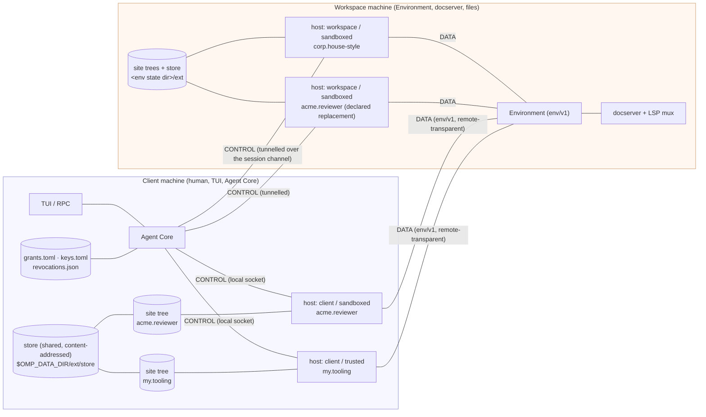
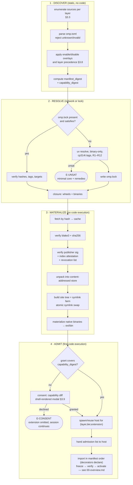

# 14 — Deployment: packaging, distribution, resolution, trust, layering

> **Design document, not a runtime API guarantee.** This corpus includes proposed
> interfaces and historical implementation observations. See
> [implementation status](implementation-status.md) for current owners and known gaps.

> **Scope.** How extension code *gets* to an interpreter: sources, layers across
> client and remote, package format, the index, dependency resolution, lockfiles,
> install/upgrade/pin/GC, integrity and revocation, install-time capability
> consent, and the `omp ext` CLI.
>
> **Not in scope, link out instead.**
> Manifest key semantics, `omp.Manifest`/`omp.Capability`/`omp.Trust` types, trust-tier
> *runtime* grants, the discovery→admit→import→declare→register→activate ordering,
> hot-reload, `omp.Context`, cancellation, crash/restart replay →
> [`00-overview.md`](00-overview.md).
> `place=` semantics, `omp_remote` ship modes, `omp.workers`, `omp.Spill` →
> [`04-placement.md`](04-placement.md). `omp.BlobRef` and typed paths → [`11-env.md`](11-env.md).
> `omp.env` request surface and env-side policy → [`11-env.md`](11-env.md).
> Hook events and the failure table → [`05-hooks.md`](05-hooks.md).
> The `dyn` shell builtin, `@omp.tool`, and `omp.ToolPath` addressing → [`01-devices.md`](01-devices.md).
> Consent presentation primitive → [`07-ui.md`](07-ui.md) §4.9.

---

## 1. Purpose

An omp extension is a Python distribution. This namespace defines everything between
"an author has a directory" and "a host interpreter has admitted a manifest": what the
artifact looks like, which index serves it, how its dependencies are resolved against a
*shared, embedded, free-threaded* interpreter that cannot simply be given a virtualenv,
how the resulting environment is locked so two machines agree, how the user consents to
what the thing is allowed to touch, and — the question that shapes all the others — where
the code runs when the files it cares about are on a different machine than the human.

### 1.1 The pi failures this removes

pi's plugin system was competent at UX and structurally unsound at distribution. Five
concrete defects, each of which this design eliminates rather than mitigates:

1. **No integrity, anywhere.** pi's marketplace and plugin installer perform no signature
   verification and no artifact hash validation. The only hash in the schema is an
   *optional git commit* `sha` on `PluginSourceGitHub`/`PluginSourceUrl`, used as a
   checkout ref, not as an integrity check
   (`/work/pi/packages/coding-agent/src/extensibility/plugins/marketplace/types.ts`).
   Installation is `bun install` against whatever npm serves today.
   → §3.10: every artifact is hash-pinned in a committed lock; extension wheels carry a
   publisher signature and an index attestation over the *capability set*.

2. **Trust is a launch flag, not a record.** `--trusted-extension` requires an absolute
   path, must name an existing regular file (`stat.isFile()`), sets
   `disableExtensionDiscovery = true` so it is strictly exclusive of all ambient
   extensions, and hard-fails startup on load error
   (`/work/pi/packages/coding-agent/src/cli/args.ts:314-329`,
   `/work/pi/packages/coding-agent/src/main.ts:1163-1180`, `:1644-1647`). There is no
   trust prompt, no trust file, no hash allowlist, and no persistent trust database.
   Trust is therefore all-or-nothing per invocation and cannot be *remembered*.
   → §3.9: a durable, per-machine grant record keyed by a capability digest, with a tier
   that survives upgrades but re-prompts when the capability set widens.

3. **One runtime, so trust could not be mixed.** Because pi loads every extension into
   its own Bun isolate, "trusted" had to mean "and nothing else is loaded". That is why
   `--trusted-extension` is exclusive. It is also why the catalog contains
   `pi-trust-defer`: when the only trust control is a modal that blocks the thing the user
   wanted, someone ships the bypass.
   → §2.2: host children keyed by `(layer, tier, extension)`. Mixing a trusted extension with
   sandboxed ones is the normal case, not a contradiction.

4. **Distribution assumed one filesystem.** Discovery walks `<cwd>/.omp/extensions` and
   `<agentDir>/extensions`, dedupes by absolute realpath, first-seen-wins
   (`/work/pi/packages/coding-agent/src/extensibility/extensions/loader.ts:634-715`,
   `:646-651`). Every path in that pipeline is a local path. There is no concept of an
   extension declared by a workspace that is not on this machine.
   → §2: two layers, two hosts, and a decision about which machine runs which.

5. **Install-time arbitrary code execution as the default path.** `bun install` runs
   `postinstall`. pi's own installer additionally *executes* every declared extension's
   factory during `install` to validate it (`#validateInstalledExtensions()`,
   `/work/pi/packages/coding-agent/src/extensibility/plugins/manager.ts:350-375`) — the
   integrity check is "did the untrusted code run without throwing".
   → §3.6 R2: binary-only installs, zero build backends, zero install-time execution of
   package code. Validation is static manifest parsing, never import.

### 1.2 What the embedded runtime forbids

Every naive answer to "how do we install Python packages" dies on one of these. They are
properties of `crates/py`, not preferences.

| Constraint | Source | Consequence for this doc |
|---|---|---|
| CPython 3.14t is statically linked; one runtime per process | `crates/py/src/lib.rs` (`INITIALIZED` one-shot guard) | A "second interpreter" means a second *process*, not a second `Py_Initialize`. §2.2. |
| Booted with `PyConfig_InitIsolatedConfig`, `site_import = 0` | `crates/py/src/lib.rs` `init_python()` | No `site-packages` processing, so **no `.pth` files, no `sitecustomize`, no namespace-package `.pth` stitching**. A site tree must be importable by raw path traversal alone. §3.5. |
| `module_search_paths_set = 1` with **exactly one** appended path | same | `sys.path` has one real entry, so a multi-tree layout must be a symlink farm inside one directory. §3.5; §6.1 explains why growing `Builder` a multi-path API is *not* the answer. |
| `write_bytecode = 0` | same | No `__pycache__` in the store; import cost is unmarshalling source every boot. §6.8. |
| stdlib + repo modules + pinned pure-Python packages are frozen into the binary as marshalled bytecode, registered via `PyImport_FrozenModules` | `crates/py/src/lib.rs` `install_frozen_modules()`, `crates/py/build.rs` | `FrozenImporter` precedes `PathFinder` on `sys.meta_path`. A frozen distribution **cannot be overridden from site-packages**. This is a silent-wrong-version trap and becomes resolver rule **R7**. |
| Native wheels are rejected at fetch time for the frozen set | `crates/py/scripts/fetch-python.sh`: `error: $REQ pulled native extensions; only pure-Python packages can be frozen — install native wheels into site-packages instead` | Anything native lives on disk, always. There is no "bundle it into the binary" escape. |
| `$OMP_PY_SITE`, default `~/.local/share/omp-py/site-packages`, is the only real search path | `crates/py/src/lib.rs` `default_site_packages()` | The deliberate filesystem exception. Native extension modules must be `dlopen`'d from disk. |
| Binaries must export the CPython C API at final link | `crates/py/build.rs`: `-Wl,-export_dynamic` (Apple) / `-Wl,--export-dynamic` (ELF) | Any binary that hosts extensions with native deps must replicate this. A downstream consumer that forgets gets `dlopen` failures at *import*, not at link. §3.15 `E-ABI-EXPORT`. |
| `uv` only, never pip; `OMP_*` env vars only; pre-release means clean cutovers | `AGENTS.md`, and `fetch-python.sh` already shells `uv pip install --link-mode=copy --python … --target …` | The resolver *is* `uv`. §6.1. |

And the wheel-tag reality, measured on `cpython-3.14.6+freethreaded-macos-aarch64` with
`uv 0.12.5` on 2026-08-19:

```
sysconfig EXT_SUFFIX  = .cpython-314t-darwin.so
sysconfig SOABI       = cpython-314t-darwin
sysconfig ABIFLAGS    = t
sys._is_gil_enabled() = False
packaging.tags ABI set = ['abi3t', 'cp314t', 'none']
  'abi3'  in sys_tags() -> False      # stable ABI is NOT accepted
  'cp314' in sys_tags() -> False      # GIL-build wheels are NOT accepted
```

`abi3` does not work under `Py_GIL_DISABLED`: the free-threaded build changes `PyObject`
layout and refcount semantics, so the pre-3.14 stable ABI is unusable and every native
package must ship a dedicated `cp314t` wheel. This is why the availability question is not
academic — see §3.11.2 for the measured matrix and why it forces a first-party build farm.

---

## 2. Concepts

> **Reading note.** This section, like the rest of the reference, is written in present
> tense as the doc set requires. Two of its assumptions are not yet true of the checked-in
> code: a host child has no DATA edge (so `omp.env` is unreachable from Python), and worker
> declarations still reach the model's advertised tool array because `advertise` lacks a
> route filter. Both are named with citations, consequences, and the additive path in
> §6.0.1. Nothing below silently depends on either being fixed already.

### 2.1 Two layers

An extension enters a session through exactly one of two **layers**.
`omp.Layer` is the corresponding string enum: `Layer.CLIENT == "client"` and
`Layer.WORKSPACE == "workspace"`.

| | **client layer** | **workspace layer** |
|---|---|---|
| Declared by | the thin client's own scopes | the workspace being worked on |
| Sources | `$OMP_DATA_DIR/config.toml` `[extensions]`, `$OMP_DATA_DIR/ext/`, `--ext` flags, `<client cwd>/.omp/` when the client *is* the workspace | `<workspace cwd>/.omp/extensions/`, `<workspace cwd>/.omp/config.toml` `[extensions]`, `<workspace cwd>/.omp/omp.lock` |
| Follows | the human | the repository |
| Default tier | `sandboxed`; `trusted` obtainable | `sandboxed`, and `trusted` requires an explicit client-side act naming the workspace identity |
| Grant origin | the operator | **never the repository** (§3.9.3) |
| `omp.env` reaches | the session's Environment (remote-transparent) | the session's Environment (local to it) |
| Executes on | the machine running Agent Core | the machine running the Environment |

The workspace layer loads **on top of** the client layer: it resolves later, it is the last
word on shared configuration, and — under the conditions of §3.8 P4 — it may *replace* a
client extension of the same publisher-qualified identity. Replacement is declared and
policied, never an automatic same-name shadow. Rationale in §3.8.



Read off the diagram: one child per extension, each with its own site tree, all sharing one
content-addressed store per machine; `tier` splits children within a layer; the client's
`acme.reviewer` is replaced by the workspace's — same publisher, declared in the workspace
manifest, permitted by policy (P4) — so its child is not spawned at all; and
every child spawns lazily, so a diagram of *declared* hosts is not a diagram of resident
processes. When client and workspace are the same machine there is one store and one set of
children, but the layer distinction survives in precedence, trust default, and grant origin.

### 2.2 Hosts are keyed by `(layer, tier, extension)`

One host child = one process = one embedded interpreter = one site tree = **one resolution
unit**. By default there is one child **per extension**. The key has three axes:

- **`layer`** — `client` | `workspace`. Forced by §2.3: the two layers may be on different
  machines, and never share code.
- **`tier`** — `trusted` | `sandboxed` (runtime meaning: [`00-overview.md`](00-overview.md)).
  A shared CPython cannot isolate tiers *within* a process, so a mixed set needs separate
  children. This is what lets omp avoid pi's exclusivity rule, and it closes a real
  escalation path: a sandboxed extension's dependency tree physically cannot shadow a
  trusted extension's imports if they do not share a `sys.path`.
- **`extension`** — the extension's `id`, i.e. the `extension_id` half of the identity
  `(publisher_key, extension_id)` (§3.8 P3); P6 makes it unique within a layer, so it
  suffices as the key axis. One child per extension is the default because the same process
  boundary simultaneously solves three otherwise-separate problems: dependency isolation
  without import shadowing (§3.6.1), a cancellation unit of loss that is one extension
  rather than a whole session (§6.5), and a long-latency approval that — even before
  [`06-policy.md`](06-policy.md)'s durable tickets remove the suspension entirely — stalls
  only its own extension rather than every extension in the session.

  Extensions may **opt into sharing** a child with `omp ext install --pool <name>`. Joining
  a pool is explicit fate-sharing, and every appearance of pooling in this document means
  exactly that: members share **failure fate** (a segfault in one native module kills the
  group), **dependency fate** (one joint resolution, so they can now conflict), and
  **cancellation fate** (one SIGKILL takes the group's in-flight work). Sharing is opt-in;
  isolation is the default. §3.6.4.

> **This is a revision.** An earlier draft keyed hosts `(layer, tier, pool)` with one shared
> child per layer-and-tier and `--pool` as a *splitting* escape hatch for dependency
> conflicts. That was wrong in the cheap direction: it left `E-UNSAT` between unrelated
> extensions as the normal case, it made cancellation kill every extension in a layer, and it
> made a suspended approval stop the session. The key is now per-extension and `pool` inverts
> to a sharing group. §3.6.1 records the full comparison, including why this beats PEP 734
> subinterpreters.
> The per-extension boundary is **final**, not provisional: the external review confirmed
> the direction, and Revision 2 purges the last `(layer, tier, pool)`-default remnants —
> the pipeline diagram and the pattern transcripts still said `pool main` where they meant
> the extension's own id.

**Actor semantics.** A host child is an actor, not a thread pool. Callback entry into an
extension is **serialized by default**: at most one hook, device, command, or renderer
callback runs at a time per extension, and reentrancy is explicit, never accidental.
Concurrency is an opt-in — `concurrency=N` or `threadsafe=True` on the declaring decorator
([`00-overview.md`](00-overview.md) owns the parameters; [`05-hooks.md`](05-hooks.md)
applies them to hooks) — and different extensions always proceed concurrently, which is
where the parallelism actually lives. Free-threaded CPython is an implementation advantage
of the host, not an invitation for every author's module globals to race: an earlier draft
of the hook runtime let sync handlers run on a worker pool and async handlers overlap by
default; that was an unsafe ecosystem default and is reversed in [`05-hooks.md`](05-hooks.md).

**Host generation.** Every spawn and respawn of a host child mints a fresh
`host_generation`, a monotonic integer scoped to the host key. The child reports it in its
hello frame (§6.2) and stamps it on every durable or effectful request it makes; Agent
Core and the Environment reject frames carrying an old generation after a reload,
crash-respawn, or reconnect, so a request from a dead incarnation can never land twice or
late ([`00-overview.md`](00-overview.md) owns the fencing rule; this document owns where
the value is minted). The generation is also the seventh element of the provenance septet
(§3.8.1).

**Cost, honestly.** One interpreter per active extension. Two facts keep that affordable and
both are packaging facts, so they belong here rather than in a performance note:

1. **Umbrella bundles are one extension, not many.** §3.2.1's granularity rule — the package
   is the distribution *and* the extension; features are the sub-unit — means `pi-toolbox`'s
   17 and `@bdsqqq/pi`'s 33 are devices and features of a single `omp.toml`, hence **one child
   each**, not 17 and 33. The cost driver is how many distinct extensions a user installs, and
   people install umbrellas precisely to keep that number small.
2. **Children of the same executable share the frozen stdlib.** The stdlib blob is
   `include_bytes!` static data in the binary (`crates/py/src/lib.rs`), so every child maps
   the same read-only pages and the OS page cache serves them once. What is genuinely
   per-child is the *unmarshalled* subset actually imported, the interpreter heap, and the
   extension's own dependency closure. [INFERENCE — the resident floor per child is not
   measured; §6.8.1's benchmark matrix is that measurement, and it gates this design's cost claim.]

**Children spawn lazily**, which is what makes per-extension keying viable: a key with no
*active* extension never boots an interpreter. Lazy spawn requires that every declared
surface — devices, hooks, and the rest of §3.1.5's declaration table — be known from the
**static manifest**, not from importing the extension. The table is authoritative for
serving the device catalog behind `dyn`, for the hook
subscription mask, and for every activation
trigger; handshake `RegisterTools` verifies rather than defines. If registration were the
source of truth, every installed extension would have to boot at session start and the
laziness would be lost. When a trigger does boot the child, the first thing the extension
observes is `extension_activate` (§3.1.5), never a counterfeit `session_start`.

**Corollary for placement.** `place="host"` means *the host that loaded this extension* —
not "the machine with the files". A client-layer extension operating on a remote workspace
runs `place="host"` next to Agent Core with a remote `omp.env`. See
[`04-placement.md`](04-placement.md), which states the same invariant from the runtime
side. A `place="worker:<name>"` worker inherits its parent host's site tree, so
`import numpy` works in both or neither. Per-extension keying sharpens this: the site tree a
worker inherits is *its own extension's*, so a worker can never acquire another extension's
dependency.

### 2.3 Where does remote-declared extension code execute?

The blogpost poses this as a parenthetical ("Load remote extensions?") and leaves it open.
It is the load-bearing decision in this namespace, because getting it wrong is not
refactorable — every one of the four options implies a different trust model, a different
capability scope, and a different latency budget.

**The options, honestly.**

**(a) Ship remote-declared code to the client host.** One host, one resolution, one
`sys.path`; hooks stay on a local socket. `omp.env` is already remote-transparent
(`crates/env` — "In-process and remote deployments feed the same frame client"), so
capability scoping would *accidentally* be right: a shipped extension's `omp.env` still
lands on the remote Environment. Fatal objection: `git pull` becomes arbitrary code
execution on the user's laptop, at whatever tier the client granted, with the client's
ambient authority for anything not routed through `omp.env` — local disk via plain
`open()`, the client's keyring, the client's network position. There is no consent UX that
fixes this, because the consent would have to re-fire on every commit that touches
`.omp/`, and a prompt on that path is exactly what produced `pi-trust-defer`. Rejected.

**(b) One host beside the Environment; tunnel CONTROL; run *everything* there.** Trust is
clean and `omp.env` is a local socket. But client-layer extensions — the human's own
tooling, which is the majority of what people actually install — would then execute inside
a workspace they may not trust, with the workspace's blast radius, and would lose access
to anything client-local. Also every hook, for every extension, pays a network round trip.
Rejected.

**(c) Split by layer: the declaring side owns the host.** Client-layer extensions run next
to Agent Core (CONTROL local, DATA remote-transparent). Workspace-layer extensions run
next to the Environment (DATA local, CONTROL tunnelled over the existing session channel).

**(d) Refuse: ignore `<remote cwd>/.omp` entirely.** Honest, and available as
`--no-workspace-ext`. But it means a repository can never ship the tooling that makes it
comprehensible, which is most of the value in the catalog.

**Decision: (c).**

The deciding argument is *not* latency. It is that (c) makes the two properties that
matter structural rather than policy-enforced:

- Remote-declared code never touches the client's machine. Not "is sandboxed on", not
  "is prompted before running on" — never arrives.
- A workspace extension's authority is exactly its own Environment's authority. Its
  `omp.env` client is local, and `omp.env` is the *only* ambient authority it has;
  everything else routes through CONTROL where Agent Core arbitrates. The bound is the
  correct one: a workspace extension can do what the workspace can do.

There is a duality here worth naming, because it is the tradeoff being accepted. Each host
has two sockets and exactly one of them can be local. Choosing which socket eats the
network is the whole design space:

| | CONTROL (hooks, decisions, UI, journal) | DATA (`omp.env`: fs, exec, blobs) |
|---|---|---|
| Host next to Agent Core | local | remote |
| Host next to Environment | **remote** | local |

Hooks are per-turn and some are keystroke-adjacent, so putting CONTROL on the wire is the
expensive choice — and (c) does exactly that, for the workspace layer. **This is the
tradeoff I accept.** Mitigations, in order of importance:

1. The CONTROL tunnel is multiplexed over the **existing** session channel to the
   Environment. No second connection, no second handshake, no second auth.
2. Agent Core dispatches to both hosts **concurrently**, so the cost of the workspace layer
   is `max(local, remote)`, not `local + remote`. Note what this is *not*: there is no
   batch-level admission scheduler inside the mailbox loop. `PLAN.md` §D6 **D6 — One
   mailbox, no gate chain** forbids exactly that — a tool batch runs concurrently as the
   model issued it, and one slow approval never serializes the batch — and does *not* forbid
   the per-invocation decision procedure, which Agent Core **runs**:
   the ordered hook phases of [`05-hooks.md`](05-hooks.md), answered into the environment's
   per-invocation admission query between `InvokeTool` and `ArgsCommitted` (the wire
   mechanism; the phase view is [`03-params.md`](03-params.md)'s `omp.InvocationPhase`).
   The environment owns the gate; Core owns the procedure that answers it. This passage has
   now been wrong in both directions, and saying so is cheaper than a third revision: an
   earlier draft put a priority-band chain with first-`Deny` short-circuit inside the loop
   (wrong — that is batch scheduling, which D6 forbids), and Revision 1 over-corrected to
   "Agent Core is a pure courier" (also wrong — a courier cannot run PRECHECK in parallel,
   order TRANSFORM, or persist a durable approval ticket). The scope split is no longer a
   reading this document must defend: **D6 was amended 2026-08-19** and the decision's own
   text now names it — "the prohibition binds the batch dispatch path, not the
   per-invocation decision procedure" (`PLAN.md` §D6) — so this passage cites
   ratified text, where Revision 2 could only flag a recommended amendment.
   See [`06-policy.md`](06-policy.md) for the authoritative framing.
3. Per-host, per-event deadlines. A host that misses its deadline yields the fail-open or
   fail-closed default for that event class ([`05-hooks.md`](05-hooks.md)) and the miss is
   journaled. Repeated misses demote that extension's subscription to non-blocking, once,
   with a system-notification item.
4. Keystroke-adjacent event classes are **not offered** to the workspace layer at all. A
   completion hook that costs an RTT per keypress is not a hook, it is a bug.

**Failure modes.**

| Situation | Behavior |
|---|---|
| **Client offline** (no index reachable) | Nothing is fetched. Each layer loads the subset of its lock that is already materialized in the store; extensions with missing artifacts are skipped with `E-OFFLINE` and one system-notification item naming them. A locked, fully-materialized session starts offline with zero degradation. `omp ext sync --offline` verifies without network. |
| **Remote unreachable mid-session** | Host B dies with the Environment. Agent Core drops workspace-layer devices via `omp.devices.refresh()` — one system-notification item, **not** a tool-array mutation ([`01-devices.md`](01-devices.md)). Workspace-layer hook subscriptions degrade by their declared failure class, never uniformly: fail-open subscriptions are treated as absent, while **fail-closed subscriptions keep a synthetic `Deny` stub built from the manifest declaration** — losing the host that enforces a security policy must not widen what is allowed ([`05-hooks.md`](05-hooks.md) failure table, [`06-policy.md`](06-policy.md)). An earlier revision treated *all* workspace hooks as absent for the remaining turn, which silently converted fail-closed policy to fail-open; that is retracted. If the lost layer had replaced a client extension (P4), the client version becomes active again on the next admission pass — deterministic fallback, never load order (§3.8). Host A is untouched. On reconnect, admission re-runs against the workspace lock; if `manifest_digest` or `capability_digest` changed, the layer is held and re-consent is requested. |
| **Version skew, client vs remote omp** | Each host admits only extensions whose `omp_api` range covers *that host's* binary, so the two hosts may legitimately admit different sets; the delta is reported by `omp ext doctor` and journaled at session start. Lockfiles carry `version`; a lock written by a newer omp is **refused** (`E-LOCK-VERSION`), never partially interpreted. Site trees are per-host, so nothing is shared across the skew and no ABI negotiation is required beyond "both are cp314t". |
| **Version skew, client vs remote platform** | Normal and expected. The workspace lock's `targets` list carries every platform it was resolved for; resolution for a platform absent from `targets` is `E-TARGET-MISSING` and is fixed by `omp ext lock --targets`. |
| **Hostile workspace extension** | It cannot execute on the client (structural). Its `omp.env` reaches only the remote Environment. It defaults to `sandboxed` with `ship = "installed"`. It cannot obtain a grant, because grants originate from the operator and never from a file inside the workspace (§3.9.3). **Residual risk, stated plainly:** it still reaches Agent Core over CONTROL, so it can return hook decisions, occupy prompt slots, and push UI effects — prompt-injection-grade influence over the agent — and it runs with the remote Environment's authority, which may include that repo's secrets and network egress. omp does not make an untrusted remote workspace safe. It bounds the blast radius to the remote environment's own authority, and makes every workspace-layer decision journaled and attributable, stamped with the provenance septet (§3.8.1) that [`07-ui.md`](07-ui.md) renders as unforgeable chrome. The off switch is `--no-workspace-ext` / `OMP_EXT_NO_WORKSPACE`. |

### 2.4 The pipeline

Four stages, strictly ordered, with a hard rule: **no extension code executes before
stage 4, and stage 4 is the only stage that imports anything.** The manifest is a static
file, parsed without executing extension code — you cannot run code to decide whether you
are allowed to run code ([`00-overview.md`](00-overview.md)).



Stages 1–3 are pure functions of (sources, lock, store, network) and are safe to run in
CI, offline, and against a workspace you have never trusted. Stage 4 is the only place
where a human decision and arbitrary code both appear, and they appear in that order.

### 2.5 Trust boundaries

Four boundaries, each enforced by a different mechanism. Naming them separately matters,
because pi conflated all four into one boolean flag.

1. **Artifact ↔ author.** Enforced cryptographically: publisher ed25519 signature over the
   wheel digest, TOFU-pinned on first install (§3.10.2).
2. **Declared ↔ granted.** Enforced by the grant record: a capability the manifest declares
   is not a capability the extension has until a digest-pinned grant covers it (§3.9).
3. **Tier ↔ process, and extension ↔ process.** Enforced by process separation:
   `(layer, tier, extension)` host keying (§2.2). A tier is a property of a host child, never
   of an extension inside a shared one; and by default an extension is alone in its child, so
   dependency shadowing between extensions is not merely policed but impossible. Joining a
   sharing group waives the second half of this, knowingly (§3.6.4).
4. **Layer ↔ machine.** Enforced by topology: workspace code is never transmitted to the
   client (§2.3).

A fifth boundary that does **not** exist, and should not be claimed: *granted ↔ actually
does*. Once code runs at a tier, the tier's runtime grants are the bound
([`00-overview.md`](00-overview.md)) and enforcement is env-side in Rust
([`11-env.md`](11-env.md)). Install-time consent is about *authorizing* a capability set,
never about proving what the code will do with it.

---

## 3. Reference

### 3.1 Package format

An omp extension **is a standard Python distribution**. There is no bespoke archive
format, no custom installer, and no build step omp owns exclusively. This is a deliberate
compatibility choice, defended in §3.12.

#### 3.1.1 Source layout (authoring)

```
acme-reviewer/
  pyproject.toml            PEP 621 metadata + [tool.omp]
  omp.toml                  OPTIONAL: explicit manifest, wins over [tool.omp]
  src/acme_reviewer/
    __init__.py             the `entry` module
    review.py
    skills/                 markdown resources, package data
  tests/
  README.md
  LICENSE
```

#### 3.1.2 Wheel layout (distribution)

A wheel does **not** contain `pyproject.toml`. The build backend therefore *projects*
`[tool.omp]` into a manifest file that ships inside the wheel:

```
acme_reviewer-2.3.0-py3-none-any.whl
  acme_reviewer/                                  importable package
    __init__.py …
    skills/…
  acme_reviewer-2.3.0.dist-info/
    METADATA                                      PEP 621, incl. Requires-Dist
    WHEEL                                          tags
    RECORD                                         every file + sha256 + size
    omp.toml                                       ← the projected manifest
    omp-capabilities.json                          ← normalized capability set (§3.9.1)
    licenses/…
```

**Manifest resolution order** (`P-MANIFEST`):

1. `omp.toml` at the distribution root of an unpacked/linked source → used verbatim.
2. Otherwise `<dist-info>/omp.toml` inside an installed wheel → used verbatim.
3. Otherwise `[tool.omp]` in a `pyproject.toml` at the root → projected in memory to the
   identical structure.
4. None of the above → the directory is not an extension. Silently skipped during ambient
   discovery; `E-NO-MANIFEST` when named explicitly.

Consequence: the parser only ever sees `omp.toml`. Key semantics are defined in
[`00-overview.md`](00-overview.md); this document defines only the *file* and the
packaging-relevant tables below.

#### 3.1.3 Packaging tables owned here

These live under `[tool.omp]` (source) / at the top level of `omp.toml` (projected), and
are the only manifest tables this document defines. Everything else in the manifest is
[`00-overview.md`](00-overview.md)'s.

```toml
[tool.omp]
id      = "acme.reviewer"      # dotted, [a-z0-9]([a-z0-9-]*[a-z0-9])?(\.…)+ ; stable identity
entry   = "acme_reviewer"      # module imported at activation
kind    = "extension"          # "extension" | "skills"  — see below

# Dependency declaration. §3.4.
requires = ["httpx>=0.27,<0.29", "tree-sitter==0.24.*"]

[tool.omp.features.review]     # sub-extension, independently enable/disable-able. §3.2
entry       = "acme_reviewer.review"
default     = true
requires    = ["unidiff>=0.7"]
description = "PR review device and hooks"
capabilities = ["env.docs.read"]

[tool.omp.vendored]            # §3.6.5
namespace = "acme_reviewer._vendor"
packages  = ["unidiff", "wcwidth"]

[[tool.omp.binaries]]          # native executables, NOT wheels. §3.3.3
name    = "acme-index"
version = "0.9.2"
[tool.omp.binaries.platforms.aarch64-apple-darwin]
url    = "https://ext.omp.dev/bin/acme-index/0.9.2/aarch64-apple-darwin.zst"
blake3 = "b3:9f2c…"
size   = 4823119
exec   = "acme-index"
[tool.omp.binaries.platforms.x86_64-unknown-linux-gnu]
url    = "https://ext.omp.dev/bin/acme-index/0.9.2/x86_64-unknown-linux-gnu.zst"
blake3 = "b3:11ab…"
size   = 5013882
exec   = "acme-index"

[tool.omp.isolation]           # §3.6.4
pool = "bundle"                # advisory hint to JOIN a sharing group; the install record is authoritative
```

| Key | Type | Default | Meaning |
|---|---|---|---|
| `id` | string | *required* | Stable dotted `extension_id`. Independent of the PyPI distribution name so a package can be renamed without breaking grants and locks. Must be unique within a layer (P6). The manifest declares only this half of the extension's identity; the other half, the `publisher_key`, comes from the wheel signature (§3.10.2), and the full identity is `(publisher_key, extension_id)` (§3.8 P3). |
| `entry` | string | *required* for `kind="extension"` | Module imported at activation. Must resolve inside this distribution's `RECORD`. |
| `kind` | `"extension"` \| `"skills"` | `"extension"` | `"skills"` declares zero executable code: no `entry`, no `requires`, no host load, no site-tree entry, no capability prompt beyond content review. See §3.2.3. |
| `requires` | array of PEP 508 strings | `[]` | Runtime Python dependencies. §3.4. |
| `features.<name>.entry` | string | *required* | Module imported when the feature is enabled. |
| `features.<name>.default` | bool | `false` | Whether enabled on install without `--features`. |
| `features.<name>.requires` | array | `[]` | Additional dependencies pulled **only** when the feature is enabled. |
| `features.<name>.description` | string | `""` | Shown in `omp ext features` and the consent diff. |
| `features.<name>.capabilities` | array | `[]` | Capabilities effective, consented, and locked only while the feature is selected. |
| `vendored.namespace` | string | — | Import prefix under which private copies live. Must be a submodule of `entry`'s top-level package. |
| `vendored.packages` | array | `[]` | Distribution names vendored under that namespace. Declared so `omp ext doctor` can report them and the resolver can *exclude* them (§3.6.5). |
| `binaries[].name` | string | *required* | Logical name; materialized as `$OMP_DATA_DIR/ext/bin/<id>/<name>`. |
| `binaries[].version` | string | *required* | Participates in the store key and in GC. |
| `binaries[].platforms.<target>.url` | string | *required* | Fetch URL. Any scheme the index client supports; `file:` permitted for bundles. |
| `binaries[].platforms.<target>.blake3` | string | *required* | `b3:` + 64 lowercase hex. Verified before the file becomes executable. |
| `binaries[].platforms.<target>.size` | integer | *required* | Cross-checked; a size mismatch is `E-INTEGRITY` without hashing the whole stream. |
| `binaries[].platforms.<target>.exec` | string | `name` | Path inside the archive to mark executable. |
| `isolation.pool` | string | *absent* (isolated) | Author's *hint* to join a sharing group (§3.6.4). Advisory only — the install record decides, because a package must not demand co-residency — and the default, no pool, is an isolated per-extension child (§2.2). |

#### 3.1.4 Build backend

`omp-build` is a thin PEP 517 backend wrapping `hatchling`. It does the projection in §3.1.2,
three static validations, and one generation step.

**Validations, all static — no extension code runs:**

1. `[tool.omp]` parses, `id` matches the grammar, `entry` and every `features.<n>.entry` name
   a module present in the built wheel's `RECORD`.
2. `requires` is valid PEP 508 and is written into `METADATA` as `Requires-Dist` so
   `uv pip install` of the wheel alone does the right thing.
3. `omp-capabilities.json` is emitted as the canonicalized capability set (§3.9.1) and its
   digest is printed, so a publisher can see the digest that will drive consent.

**Generation — the one step that imports the extension.** The backend imports the extension in
a subprocess, reads the decorator registry, and emits the `[[declarations]]` table (§3.1.5)
into the projected `omp.toml`:

```toml
[[declarations]]
id = "review";      kind = "soft";   module = "acme_reviewer.review"; key = "review@rv.2";      trigger = "lazy";  api = 1; failure = "fault"
[[declarations]]
id = "policy-gate"; kind = "hook";   module = "acme_reviewer.policy"; key = "tool_call/PRECHECK"; trigger = "eager-prompt"; api = 1; failure = "fail-closed"
[[declarations]]
id = "triage";      kind = "hard";   module = "acme_reviewer.triage"; key = "triage@rv.1";      trigger = "lazy";  api = 1; failure = "fault"
```

Key semantics are [`00-overview.md`](00-overview.md)'s; the *generation* is mine. Why build
time is the correct place, and the only correct place: it is the one moment the code is trusted
to run, on the author's own machine, by the author's own command. Everything else in this
document exists to keep extension code from running before a human decided it should.

Three properties fall out, and downstream consumers may rely on them:

- The generated table ships **inside the wheel**, so it is covered by the wheel digest and
  by `manifest_digest` in the lock (§3.7.1). A divergence between the manifest and what the
  host observes at handshake `RegisterTools` is therefore not merely a protocol violation — it
  is evidence the artifact was tampered with or built from different code than it claims.
  `omp ext verify` treats that divergence as an integrity failure (exit 4), not a warning.
- The table is **exactly enough to avoid booting a child to answer "what exists"**: the
  `dyn` catalog listing, the hook
  subscription mask, every activation trigger in §3.1.5, and
  the spawn decision all read from the manifest. Full schemas, docs, and examples come from
  import, fetched by `dyn <path> --help`, which may spawn
  the child lazily — a deliberate
  model action and an acceptable place to pay for a boot. This is what makes per-extension
  host children affordable (§2.2).
- Hand-authoring the tables stays legal, because any backend works as long as
  `<dist-info>/omp.toml` is present. `omp ext publish --dry-run` reports drift between
  hand-written tables and what an import would produce, so the fallback exists without being
  the recommended path.

`path` and `link` sources have no wheel-build step, so `omp ext link` performs the same
import-and-generate at link time — again on the developer's own machine. `--no-resolve` skips
it and falls back to hand-authored tables, with `omp ext doctor` reporting the drift.

Using the backend is **not required**. `omp ext publish --dry-run` is the supported way to
check any backend's output.

#### 3.1.5 The declaration table

> **This is a revision.** Revision 1's manifest declared only `[[devices]]` and `[[hooks]]`
> (plus workers, settings, and dependencies), while the lifecycle it relied on lazily
> activates commands, shortcuts, providers, prompt slots, completions, message renderers,
> verdict renderers, telemetry subscriptions, and services. The review's objection was
> exact: under that schema a provider-only extension could never activate before model
> selection, a renderer-only extension could never activate while drawing history, and a
> command extension could never activate before the user invoked it — the surfaces existed
> at runtime but had no static declaration to trigger a boot from. The manifest now carries
> one uniform declaration table covering **every** lazy-reachable surface; `[[devices]]`
> and `[[hooks]]` as separate tables are gone, replaced by two `kind`s among twelve.
>
> Revision 2.1 amends the vocabulary, not the structure. The rulings addendum renames the
> per-kind catalog-export table `[[devices]]` → `[[tools]]` and gives each entry
> `kind = "soft" | "hard"` (default `soft`). On the authoring surface the rename is
> literal — [`00-overview.md`](00-overview.md)'s `[tool.omp]` example shows `[[tools]]`,
> and those per-kind authoring tables lower 1:1 into this uniform table. Here, where
> `[[devices]]` had already dissolved into a `kind`, the ruling lands as a split of that
> kind: `soft` and `hard` are two of **thirteen executable** kinds, and they state **intent, not
> surface** — `@omp.tool` declares either, `@omp.device` lowers with implicit `soft`
> intent, and the surface an intent gets (a catalog entry behind the `dyn` shell builtin, or a
> model-facing tool slot) is decided by the user's dynamic tool policy (`tools.policy`,
> [`01-devices.md`](01-devices.md), which owns the decorators and the mode table).
> Rev 2.1-internal correction: an earlier draft of this revision spelled the vocabulary
> `device | tool | hard` — retracted the same day, because kind states intent, never
> surface. §3.9.2 owns the `tools.hard` capability that gates `hard` under the default
> `auto` mode.
>
> **Resolved (2026-08-20 ruling):** the table also carries shipped content for code-bearing
> extensions. The `skills`, `rules`, `context-files`, and `prompts` declaration kinds are
> content rows, distinct from the whole-package `kind = "skills"` of §3.2.3. They make an
> inventory discoverable without importing the extension; the matched bytes are opened
> lazily as data and are never code.

One `[[declarations]]` entry per executable surface or shipped content resource, generated
by `omp-build` from the decorator registry and content authoring tables (§3.1.4), or
hand-authored:

```toml
[[declarations]]
id      = "review"                  # declaration_id: unique within the extension, stable across versions
kind    = "soft"                    # closed vocabulary — table below; soft/hard state intent, not surface
module  = "acme_reviewer.review"    # module whose import materializes the implementation
key     = "review@rv.2"             # static key: kind-specific identity, resolvable without Python
trigger = "lazy"                    # activation class; fixed per kind, may only narrow lazy → eager
api     = 1                         # required omp API level
failure = "fault"                   # failure class when the implementation is unavailable
feature = "review"                 # optional owning feature; absent means base surface
```

Executable rows have exactly the fields above. Content rows have a separate, exact shape.
Today the decorator registry records `@omp.skill` as a generated content declaration during
bootstrap. Declaration lowering evaluates its zero-argument body once and deterministically
materializes the complete generated bytes and row:

```toml
[[declarations]]
kind = "skills"
path = "acme_reviewer/.omp-generated/skills/review/SKILL.md"
metadata = { name = "review", description = "Review a change.", hidden = false, disable_model_invocation = false, autoload = false }
```

The checked-in tree has no `omp-build` PEP 517 backend. The future packaging contract is exact:
a wheel builder writes those already-lowered bytes at `path`, includes that path in wheel
`RECORD`, and emits the byte-identical row above. Repeating lowering with identical decorator
inputs produces identical file bytes and row ordering; changing the body or metadata changes the
packaged artifact. Runtime FREEZE compares the decorator's generated path and metadata with this
admitted static row, but never asks a lazy child to provide skill bodies. A skills-only extension
is consequently enumerable and readable from the static manifest and recorded wheel resource
without starting Python.

Hand-authored `[[skills]]` rows use the same `kind/path/metadata` shape. The same lowering applies
to `[[rules]]`, `[[context-files]]`, and `[[prompts]]`.
`path` is a distribution-relative POSIX path or glob covered by the wheel's `RECORD`.
`metadata` is the content row's author metadata table (for example `name`, `description`,
slot, class, or priority); it is preserved verbatim for enumeration. Thus the frozen row
shape is field-for-field `kind`, `path`, `metadata`, while kind-specific metadata can grow
without turning content into an executable declaration. A glob is expanded lazily when
that content inventory is queried, in stable lexical path order; it is never expanded by
importing the extension or walking outside its recorded distribution files.

| Executable field | Meaning |
|---|---|
| `id` | The `declaration_id`. Unique within the extension; `(publisher_key, extension_id, declaration_id)` is globally unique. Journal attribution and `omp ext disable` address declarations through it. |
| `kind` | One of the thirteen executable kinds below. An unknown kind is `E-DECL-KIND` — refused, because a declaration that can never activate is dead weight the user consented to. |
| `module` | The module imported when the trigger fires. Must resolve inside this distribution's `RECORD` (§3.1.4). |
| `key` | The static, kind-specific identity: a `soft`/`hard` catalog export's `name@family.rev`, a hook's `event/phase` (phases are [`05-hooks.md`](05-hooks.md)'s `omp.HookPhase`), a command's name, a shortcut's chord, a renderer's entry kind, a provider's name, a service's dotted name. Everything the host needs to *route* to the declaration without booting it. |
| `trigger` | Activation class (below). The kind fixes it; a manifest may narrow `lazy` to an eager class, never the reverse. |
| `api` | Required API level. Each host admits only declarations whose level its binary serves; the client/workspace delta is `W-API-SKEW` (§3.13.10). |
| `failure` | What happens when the implementation is unavailable (crashed, quarantined, remote host lost): `fault` (the call faults), `fail-open` (surface treated as absent), `fail-closed` (synthetic `Deny` stub built from this declaration — [`05-hooks.md`](05-hooks.md), [`06-policy.md`](06-policy.md)). Only an explicit user/org disable removes a `fail-closed` declaration's stub. |

Content rows do not have `id`, `module`, `key`, `trigger`, `api`, or `failure`: reaching one
resolves data, not a callback. `omp.packages.own().declarations` returns their typed
`ContentDeclaration(kind, path, metadata)` values without filesystem walking.
Every executable or content row may carry one optional `feature`. The name must exist in
`[features]`; an executable row's `module` must equal that feature's `entry`, and rows
emitted by a feature entry without their `feature` owner are rejected. Projection happens
before any PUBLISH payload, trigger index, hook bitmap, `RegisterTools` expected set, or
wire encoding is built: disabled rows have no runtime identity and cannot boot a child.

Three additional signed static content kinds use the same exact `kind/path/metadata` shape:

```toml
[[declarations]]
kind = "agents"
path = "acme_reviewer/agents/*.md"
metadata = { format = "omp-agent-markdown" }

[[declarations]]
kind = "lsp-servers"
path = "acme_reviewer/catalog/lsp.json"
metadata = { format = "json" }

[[declarations]]
kind = "dap-adapters"
path = "acme_reviewer/catalog/dap.yaml"
metadata = { format = "yaml" }
```

All matches are distribution-relative, contained, and covered by `RECORD`. Agent rows feed
the native catalog at project > user > extension > bundled precedence and retain extension
identity/path provenance. LSP/DAP rows have `Manifest` provenance below native user/project
configuration. Their `command` must name a lock-materialized `[[binaries]]` entry or an
environment executable named by an explicit grant; client paths and path separators are
rejected before process spawn. These rows are static inventory: they add no tool, hook bit,
extension callback, or Python host.

**Activation classes per kind.** Four classes: **static** (served entirely from the
manifest; Python never boots for it), **lazy** (child boots on first reach),
**eager-prompt** (child boots before the first prompt of the session), **eager-ui** (child
boots before the first UI input is accepted). Kind semantics belong to the linked owner
doc, which also defines the exact trigger event; this table owns which class applies.

| `kind` | Static key | Class | Boots on | Owner |
|---|---|---|---|---|
| `soft` | `name@family.rev` (from `@omp.tool`, or `@omp.device` with implicit `soft` intent) | lazy | first `dyn <path> --help` detail fetch or first `dyn <path> [args…]` dispatch, or a direct slot call under `tools.policy = tool_only` ([`01-devices.md`](01-devices.md) owns the mode table) | [`01-devices.md`](01-devices.md) |
| `hard` | `name@family.rev` + a named slot claim | lazy — the advertised schema is served from the manifest, so occupying a slot never boots the child | first dispatch or first detail fetch, as for `soft`; under the default `tools.policy = auto` the slot exists only under a `tools.hard` grant (§3.9.2) | [`01-devices.md`](01-devices.md) |
| `hook` | `event/phase` | lazy; **eager-prompt when `failure = "fail-closed"`** | first delivery of a subscribed event; mandatory gates boot before the first prompt so admission never pays a boot inside its deadline | [`05-hooks.md`](05-hooks.md) |
| `worker` | worker name | lazy | first `place="worker:<name>"` dispatch | [`04-placement.md`](04-placement.md) |
| `provider` | provider name + priority | lazy — the *listing* is static | first inference request routed through the provider; model *selection* reads only the static key | [`13-inference.md`](13-inference.md) |
| `prompt_slot` | slot class | eager-prompt | slot content is produced by code, so the child boots before the first request that would render it | [`08-context.md`](08-context.md) |
| `command` | command name | lazy — palette listing is static | first invocation | [`07-ui.md`](07-ui.md) |
| `shortcut` | chord | lazy — the binding is static | first press of the chord | [`07-ui.md`](07-ui.md) |
| `completion` | trigger pattern | **eager-ui** | keystroke-adjacent: a boot mid-keystroke is unacceptable, so the child is resident before input begins. Never offered to the workspace layer (§2.3) | [`07-ui.md`](07-ui.md) |
| `message_renderer` | message kind | lazy | first message of the declared kind drawn | [`07-ui.md`](07-ui.md) |
| `verdict_renderer` | entry kind | lazy | first journal entry of the declared kind rendered — **including historical entries**, below | [`07-ui.md`](07-ui.md), [`02-verdicts.md`](02-verdicts.md) |
| `telemetry` | event selector | lazy | first matching event; OBSERVE-class, so a late boot blocks nothing | [`10-telemetry.md`](10-telemetry.md) |
| `service` | dotted service name | lazy | first `omp.services.connect()` naming it | [`00-overview.md`](00-overview.md) |
| `skills` | content path or glob | static; bytes lazy | never boots Python; first `skill://` inventory/read resolves matching data | [`08-context.md`](08-context.md) |
| `rules` | content path or glob | static; bytes lazy | never boots Python; the rules-slot inventory resolves matching data when rendered | [`08-context.md`](08-context.md) |
| `context-files` | content path or glob | static; bytes lazy | never boots Python; context discovery resolves matching data on demand | [`08-context.md`](08-context.md) |
| `prompts` | content path or glob | static; bytes lazy | never boots Python; prompt or command lookup resolves matching data on demand | [`07-ui.md`](07-ui.md), [`08-context.md`](08-context.md) |
| `agents` | content path or glob | static; bytes lazy | never boots Python; native agent-catalog composition reads matching markdown | [`12-agents.md`](12-agents.md) |
| `lsp-servers` | content path or glob | static; bytes lazy | never boots Python; first matching language operation may start the declared server | [`11-env.md`](11-env.md) |
| `dap-adapters` | content path or glob | static; bytes lazy | never boots Python; explicit launch/attach may start the declared adapter | [`11-env.md`](11-env.md) |

**Historical sessions.** Reopening an old session replays journal entries whose kinds may be
declared by extensions that have never booted in this session — or were installed after the
entries were written. The rule: `verdict_renderer` and `message_renderer` declarations are
matched against replayed entry kinds exactly as against live ones, and the first matching
replayed entry boots the child lazily. Rendering does **not** require the code that produced
an entry: the journal stores the originally materialized projection alongside the structured
truth ([`02-verdicts.md`](02-verdicts.md)), so a missing, disabled, or GC'd extension
degrades to the stored projection, never to an error (§3.13.9).

**Activation event.** Whichever trigger boots the child, the first callback the extension
observes is

```python
@omp.hook("extension_activate")
async def on_activate(event, ctx): ...
```

with `event.reason` one of `FIRST_REACH | RESTART | HOT_RELOAD`, plus
`event.session_started_at` and `event.generation` (the `host_generation` of §2.2). It is
**not** `session_start`. An earlier draft of the lifecycle fired `session_start` on late
activation, which told an extension activated on turn 40 that the session had just begun —
misleading for anything that timestamps, budgets, or greets. `session_start` is reserved
for the real session transition and is observable only by declarations whose class made
them resident at that moment ([`00-overview.md`](00-overview.md) owns the lifecycle).

### 3.2 Package granularity

The catalog settles this empirically. Three shapes exist in the wild and all three must
work without contortion.

#### 3.2.1 Umbrella bundles are the norm, not the exception

`.plan/user-requests/2026-08-10-pi-extension-survey/catalog.md`:

- `@bdsqqq/pi` — "Registers **33 separate extension entrypoints** covering tools,
  subagents, code review, session management, and custom UI components" (`catalog.md:26`).
- `@howaboua/pi-stuff` — "Bundles all **14** Howaboua Pi extensions and **11 skills** into
  a single all-in-one package… Aggregates 14 separate `@howaboua/pi-*` sub-extension
  packages into a unified entry point" (`catalog.md:33`).
- `pi-toolbox` — "**17 extensions**, 11 themes, skills, agents, and team orchestration
  templates" (`catalog.md:410`).
- `@zeerke/ascet-copilot` — "an umbrella package whose Pi manifest directly loads **eight**
  bundled extensions rather than a single extension factory" (`catalog.md:86`).

Design consequences:

- **The distribution unit is the package. The enable unit is the feature.** One package
  declares many devices, hooks, commands, and prompt slots; `omp ext features` toggles
  named subsets, and a disabled feature's `requires` are not resolved at all. This is a
  direct forward-port of pi's `omp.features` map
  (`/work/pi/packages/coding-agent/src/extensibility/plugins/types.ts:24-46`), which
  existed for exactly this reason.
- **A 33-entrypoint package must not cost 33× anything.** One manifest, one wheel, one
  hash, one signature, one grant, one host, one site-tree entry, one consent prompt whose
  diff is the union of enabled features' capabilities. Per-feature grants are deliberately
  *not* offered: they would multiply prompts by feature count and the prompt is the thing
  users route around.
- **Aggregation-by-dependency stays legal.** `@howaboua/pi-stuff`'s shape — a package whose
  content is other packages — maps to a `kind="extension"` package with an empty `entry`
  body and `requires` naming sibling extension distributions. §3.4.2 defines how an
  extension declares *another extension* as a dependency, which is the only way this shape
  works without a bespoke aggregation mechanism.
Install specs carry the feature request directly: shell-quote
`'pkg[review,lint]'`; `pkg[]` selects none, `pkg[*]` selects all, and named lists are
trimmed, deduplicated, and sorted. On a **new** unbracketed install, only
`features.*.default = true` expands. On reinstall or upgrade, an unbracketed spec preserves
the installed concrete set. Unknown names are `E-FEATURE` before any grant, lock, install
record, or generation changes. Only selected `requires`, capabilities, executable rows,
and content rows enter the resolution and runtime projection.

#### 3.2.2 Native binaries are the common native case, not native wheels

`catalog.md:18`: of 194 analyzed packages, **34 bundle native binaries**, 55 run local
HTTP/WS servers or daemons, 28 spawn the pi CLI as a child process, 20 use SQLite/FTS5,
18 do browser automation. `bladebro` is representative: it "runs an MCP child process" and
"dynamically fetches MCP tool schemas… from the native binary over stdio JSON-RPC"
(`catalog.md:87`).

This is decisively good news for the cp314t problem. The dominant native shape in the
ecosystem is *an executable the extension shells out to*, not *a C extension the
interpreter dlopens*. An executable has no ABI relationship to the interpreter at all.
Hence `[[tool.omp.binaries]]` (§3.1.3) is a first-class declaration, resolved by hash, and
**materialized on the side that will exec it** — env-side for a workspace extension, which
is also the only side where an `exec` capability means anything
([`11-env.md`](11-env.md)). A package that needs a binary needs no cp314t wheel.

The genuinely hard subset is *in-process* native code: `.plan/…/py-host-design.md` §9 marks
`@ff-labs/fff-node` (N-API) and `web-tree-sitter` (WASM) as dead ends — "cannot load in
CPython. Must be reimplemented as CPython/PyO3 extensions or absorbed into env as core
capability." Those become either a cp314t wheel (§3.11.2) or a core env capability, and the
choice is not the extension author's to make.

#### 3.2.3 Skills-only packages carry no code

`projectops` is the canonical example: "its package manifest declares **skills only** and
uses none of the ExtensionAPI" (`catalog.md:65`). `@danypops/papyrus` similarly "provides
backend services and schema models… without directly using Pi extension APIs"
(`catalog.md:27`).

`kind = "skills"` handles this shape exactly:

- Still a wheel, still hashed, still signed, still locked, still revocable. Uniform
  integrity is worth more than saving a build step.
- Never imported. No `entry`, no host, no site-tree entry, no interpreter cost. A session
  consisting only of skills packages boots zero extension hosts.
- `requires` is rejected at build time (`E-SKILLS-REQUIRES`): a thing with no code has no
  runtime dependencies.
- Consent shows the resource inventory (which prompt slots, which skill files) rather than
  a capability set. The capability digest of a `kind="skills"` package covers its
  `prompt_slot` declarations and its file list, so an "update" that adds a skill re-prompts.

This whole-package kind is not the `kind = "skills"` content declaration in §3.1.5. A
code-bearing `kind = "extension"` package may ship `skills` (and the other content kinds)
beside commands, tools, or hooks by declaring `kind`, `path`, and `metadata` rows. A
whole-package `kind = "skills"` instead applies the stricter zero-code rules above to the
entire distribution.

### 3.3 Sources

A source is where a *specific* extension comes from. Every source ends in the same place:
a verified wheel in the content-addressed store.

| Spec form | Kind | Meaning |
|---|---|---|
| `acme.reviewer` | `index` | Resolve `id` on the configured index list, first-index strategy. |
| `acme.reviewer@2.3.0` | `index` | Exact version. |
| `acme.reviewer@^2.3` | `index` | PEP 440-compatible range (`^` sugar for `>=2.3,<3`). |
| `index:acme.reviewer` | `index` | Explicit, disambiguates from a path named `acme.reviewer`. |
| `pypi:acme-reviewer` | `pypi` | PyPI distribution name, bypassing the omp index namespace. |
| `./ext/reviewer` `../x` `/abs/x` `~/x` | `path` | Directory containing `omp.toml` or `pyproject.toml`. Built to a wheel, then installed. |
| `file:///abs/x.whl` | `wheel` | A prebuilt wheel file. |
| `git+https://…/repo.git@<rev>` | `git` | `<rev>` **must** be a full 40-hex commit or an annotated tag; branch names are rejected (`E-GIT-FLOATING`). Built to a wheel. |
| `bundle:./offline.ompb#acme.reviewer` | `bundle` | From an air-gap bundle (§3.3.4). |

#### 3.3.1 `link` is not a source

`omp ext link <path>` records a **development pointer**, not an install. pi's `link()`
symlinked into `node_modules` and wrote a lockfile entry
(`/work/pi/packages/coding-agent/src/extensibility/plugins/manager.ts:707-750`); omp's is
narrower and safer:

- The path is recorded in the local install record with `source = { link = "<abspath>" }`.
  It is **never** written to `omp.lock`, because a lock is meant to reproduce on another
  machine and an absolute path does not.
- The manifest is re-read on every host start. Code changes need only a host respawn
  (hot-reload: [`00-overview.md`](00-overview.md)); manifest changes that alter the
  capability digest re-prompt.
- `requires` are resolved into the layer's site tree like any other extension, so a linked
  extension participates in joint resolution and can therefore *cause* `E-UNSAT`. That is
  correct: discovering the conflict during development is the point.
- A linked extension defaults to `tier = trusted` **only** with an explicit
  `--tier trusted`. Linking your own code is not consent to run it privileged.

#### 3.3.2 Ambient discovery paths

Per layer, in order. Each entry is scanned for extensions per §3.1.2 `P-MANIFEST`.

**Client layer**

1. `--ext <spec>` / `--ext-only <path>` command-line entries, in argument order.
2. `$OMP_DATA_DIR/config.toml` `[extensions]` (§3.7.3).
3. `$OMP_DATA_DIR/ext/installed.toml` — the user-scope install record.
4. `<client cwd>/.omp/extensions/*/` and `<client cwd>/.omp/config.toml`, **only when the
   client is also the workspace**. When the workspace is remote, the client's own cwd is
   not a workspace and is not scanned; this is the single most important difference from
   pi, whose `<cwd>/.omp/extensions` scan
   (`/work/pi/packages/coding-agent/src/discovery/builtin.ts:466-545`) had no such notion.

**Workspace layer**

5. `<workspace cwd>/.omp/extensions/*/` — directories, each with a manifest.
6. `<workspace cwd>/.omp/config.toml` `[extensions]`.
7. `<workspace cwd>/.omp/installed.toml` — the project-scope install record (committed, or
   not, at the repo's discretion).

**Compatibility roots.** pi's multi-root precedence `.omp > .claude > .codex > .gemini`
(`.plan/feature-map/config.md:4`, `.plan/feature-map/FEATURES.md:95`) applies to *skills,
rules, agents, and prompts* discovery, which is not this namespace. omp extensions are read
from `.omp` only. A `.claude/`-shaped plugin is not a Python distribution and there is
nothing to load; `omp ext doctor` reports such directories as `W-FOREIGN-ROOT` so the user
is told rather than silently ignored.

#### 3.3.3 Native binary materialization

Declared per §3.1.3. Resolution picks the entry matching the *materializing side's* target
triple. Fetch → verify size → verify blake3 → unpack → `chmod +x` →
`$OMP_DATA_DIR/ext/bin/<id>/<name>` (env-side path for the workspace layer). Any mismatch
is `E-INTEGRITY` and the file never becomes executable. No target entry for the
materializing platform is `E-BIN-PLATFORM`, and the *extension* is skipped — not the whole
layer.

#### 3.3.4 Air-gap bundles

`omp ext bundle` writes a single `.ompb` — a zip with a fixed layout:

```
offline.ompb
  bundle.toml            format version, created_by, targets, contents index
  omp.lock               the exact lock this bundle satisfies
  wheels/<blake3>.whl    every wheel in the closure, named by digest
  bin/<blake3>           every native binary in the closure
  keys.toml              publisher keys for everything inside
  attestations.jsonl     index attestations, one JSON object per line
  revocations.json       revocation snapshot with its valid_until
```

`omp ext sync --offline` against a bundle is byte-for-byte equivalent to an online sync of
the same lock: same digests, same store paths, same site tree. The bundle is
content-addressed throughout, so `bundle.toml` needs no ordering guarantees and two
bundles built from the same lock on different machines are identical apart from
`created_by`.

### 3.4 Dependency declaration

#### 3.4.1 Python dependencies

`requires` is an array of PEP 508 requirement strings. Environment markers are permitted
and are evaluated against the **target host's** platform, not the resolving machine's
(rule R12).

```toml
requires = [
  "httpx>=0.27,<0.29",
  "tree-sitter==0.24.*",
  "uvloop>=0.22; sys_platform != 'win32'",
]
```

Rules:

- Extras on the *dependency* are permitted (`httpx[http2]>=0.27`).
- Extras on the *extension itself* are not: `[project.optional-dependencies]` is ignored in
  favour of `features` (§3.2.1), because a feature carries an `entry` and an extra does not.
- A dependency that is frozen into the binary is a **pin, not a request** — see R7.
- Direct URL requirements (`pkg @ https://…`) are rejected in `requires`
  (`E-URL-REQUIRE`); use an index or a bundle so the artifact is hash-addressable.

#### 3.4.2 Extension dependencies

An extension may require another extension. This is how umbrella-by-aggregation works
(§3.2.1) and it is a distinct relation, because it affects admission and consent, not just
imports:

```toml
[[tool.omp.extensions]]
id      = "howaboua.git"
version = ">=1.2,<2"
```

| Key | Type | Meaning |
|---|---|---|
| `id` | string | Dotted `id` of the required extension. |
| `version` | PEP 440 specifier | Range on that extension's version. |

Semantics:

- Resolved into the **same layer** as the requiring extension. A workspace extension cannot
  pull a client-layer extension into existence, and vice versa (`E-XLAYER-DEP`).
- Resolved into the same `(layer, tier)` as the requiring extension, but into its **own host
  child** — an extension dependency is still an extension, so it gets its own interpreter and
  its own resolution (§2.2). A `sandboxed` extension requiring another does not thereby get a
  `trusted` one. Only an explicit `--pool` puts them in one child.
- The consent diff for the root install is the **union** of the closure's capability sets,
  shown grouped by extension, with the transitive ones labelled. One prompt for the whole
  closure. A user installing `howaboua.stuff` sees 14 extensions' capabilities once, not
  14 prompts.
- Cycles are `E-EXT-CYCLE`, reported with the cycle.

### 3.5 The store and site trees

Two data structures. The **store** is content-addressed and shared; a **site tree** is a
resolution's materialized view of it.

```
$OMP_DATA_DIR/ext/                 (client)   ·   <env state dir>/ext/   (workspace)
  store/
    <dist>-<version>-<tag>-<blake3-16>/       unpacked wheel, immutable
      acme_reviewer/…
      acme_reviewer-2.3.0.dist-info/…
  sites/
    <layer>-<tier>-<key>-<resolution-blake3-16>/      symlink farm; $OMP_PY_SITE for a host
                                                  <key> = extension id, or pool:<name>
      acme_reviewer -> ../../store/acme_reviewer-2.3.0-py3-none-any-1a2b…/acme_reviewer
      acme_reviewer-2.3.0.dist-info -> ../../store/…/acme_reviewer-2.3.0.dist-info
      httpx -> …
  sites/<layer>-<tier>-<key>             symlink → the current resolution dir (atomic swap)
  bin/<id>/<name>                        verified native executables
  cache/                                 downloaded artifacts by digest
  installed.toml                         install records (per scope)
  grants.toml                            local consent records — NEVER committed
  keys.toml                              TOFU-pinned publisher keys
  revocations.json                       signed revocation snapshot
```

Why a symlink farm rather than a multi-entry `sys.path`:

- `crates/py/src/lib.rs` appends exactly one `module_search_paths` entry, so one directory
  is what the runtime actually supports today.
- `site_import = 0` means `site.py` never runs, so `.pth` files are inert. A farm is the
  only mechanism that works without changing the boot config.
- One `sys.path` entry means import resolution stats one directory per module, not N. With
  cold-start dominated by unmarshalling (`write_bytecode = 0`), avoiding a stat storm
  across per-extension path entries is worth the symlinks.
- `.dist-info` directories are symlinked alongside the package, so
  `importlib.metadata.version()`, entry points, and `RECORD`-based ownership queries
  (§3.9.4) all work unchanged.
- Upgrades and rollbacks are one `renameat2`/`rename` of the `sites/<key>` symlink. The
  previous resolution directory stays intact until GC, so rollback is free and atomic.
- Store entries are immutable and deduplicated across layers, tiers, pools, and sessions.
  Two hosts needing `httpx 0.28.1` share one unpacked copy.

`OMP_PY_SITE`, if set in the environment, overrides this entirely: the host boots with that
one flat directory and layering/pool multiplexing is disabled. It is a debugging escape
hatch for reproducing an interpreter state by hand, and `omp ext doctor` reports
`W-SITE-OVERRIDE` whenever it is set.

### 3.6 Resolution

#### 3.6.1 The judgment

"Two extensions want incompatible versions of one library" is the default case in a shared
interpreter, not the edge case. Five candidate mechanisms. The fifth wins, and it arrived
after the first four were written — the comparison is preserved because the reasoning for
rejecting each is what makes the fifth's advantages legible.

**(1) Shared flat site-packages, one version per name.** What `uv pip install --target`
produces natively (measured: transitive deps land flat in the target root alongside
`.dist-info`). Simple, fast, one `sys.path` entry, native modules fine. Cannot represent a
conflict at all. → **Adopted as the storage layout** (§3.5), and now as the layout *within*
one extension's tree. Not sufficient alone.

**(2) Per-extension `sys.path` scoping inside one interpreter.** Prepend each extension's own
directory around its imports. **Rejected outright**, and the reason matters because it is what
forces the process boundary: `sys.modules` is process-global, so the first extension to
`import httpx` decides the version for every extension in that interpreter, and the second one
gets the wrong library *silently* — no error, no warning, subtly different behavior. Making it
work requires rewriting module names (`_ext_abc.httpx`), which breaks absolute imports inside
the library, breaks `importlib.metadata`, and is flatly impossible for native modules: a C
extension's init symbol is `PyInit_<final module name>`, baked into the shared object at
compile time, so one `.so` cannot be loaded under two names in one interpreter. A mechanism
whose failure mode is "silently wrong version" is worse than one whose failure mode is
"refuses to install".

**(3) PEP 734 subinterpreters, one per extension.** Genuinely isolates `sys.modules` and
`sys.path`, and `crates/py/src/lib.rs` documents that frozen modules reach subinterpreters
("registered wholesale via `PyImport_FrozenModules`, which is per-interpreter machinery:
sub-interpreters (`concurrent.interpreters`) get it too"). Three costs:
  1. Native modules must opt in via multi-phase init and `Py_mod_multiple_interpreters`
     (PEP 489/630); modules that do not are refused at import. Coverage among the packages
     extensions actually want is partial at best, and a PyO3-built module does not support
     multiple interpreters unless its author said so.
  2. Objects do not cross interpreter boundaries freely. The whole `omp.*` object model —
     `omp.Context`, `CallOutcome`/`HookDecision` values, hook payloads — would have to be
     marshalled per call, on the per-turn hook path.
  3. It buys isolation a *separate process* also buys, without the process's other benefits.

  → **Not adopted.** Option 5 dominates it: same isolation, native modules unmodified, no
  marshalling, plus a real cancellation and fault boundary. The only axis where
  subinterpreters win is resident memory, and §2.2 explains why that gap is narrower than it
  looks (shared frozen-stdlib pages, umbrella bundles counting as one extension).

**(4) Vendoring into the package.** The publisher ships a private copy under `<pkg>._vendor`,
the way `pip._vendor` does. Works for pure-Python leaves; impossible for native modules, for
the `PyInit_` reason above; puts the burden on the publisher, which is right for a small leaf
utility and wrong for `httpx`. → **Permitted and encouraged for pure-Python leaves**, declared
via `[tool.omp.vendored]` (§3.6.5). Much less necessary under option 5, but still the right
tool for an extension that wants to pin a leaf without constraining anything.

**(5) One child process per extension: shared frozen stdlib, per-extension site tree, joint
resolution only within an extension's own closure. → ADOPTED.**

Each extension gets its own host child (§2.2), hence its own interpreter, its own
`sys.modules`, its own single `sys.path` entry pointing at its own site tree. Consequences:

- **Cross-extension conflicts stop existing.** Two extensions needing incompatible `httpx`
  is not a conflict, it is two site trees. `E-UNSAT` can only fire *within* one extension's
  own dependency closure — which is the ordinary, well-understood problem of resolving one
  application's dependencies, and the one case where refusing is obviously correct because
  there is a single author who can fix it.
- **Native modules work unmodified.** No multi-phase-init requirement, no
  `Py_mod_multiple_interpreters`, no `PyInit_` renaming. Each process loads its own copy of
  each `.so`, which is what the loader has always supported.
- **It does not fight free-threading.** Nothing about `Py_GIL_DISABLED` interacts with process
  separation, whereas subinterpreters × free-threading is a composition with caveats.
- **The cancellation unit becomes an extension.** Under `PLAN.md` §D5 D5 (amended
  2026-08-19), cancel is SIGKILL of the extension's process group + respawn; with one child
  per extension the unit of loss is one extension's
  in-flight work, not every extension in the session. §6.5.
- **A suspended approval blocks only its own extension.** The shipped supervisor services one
  invocation at a time with the rest queued (`crates/app/src/envd/worker.rs:592-597`), so on a
  single shared child a Revision-1 `policy.approve`-style approval awaiting a human — latency class of *hours* —
  would stop every extension in the session. Per-extension children make that survivable
  without abandoning D5's "interrupts are courtesy, never the mechanism".
- **Faults are attributable and contained.** A segfaulting native module in one extension kills
  one child.

Costs, stated plainly: one interpreter per *active* extension in resident memory and one boot
per extension on first use. §2.2 sizes both, including why umbrella bundles do not multiply
and why the frozen stdlib is shared across children. Lazy spawn is load-bearing — it is why
"installed" does not mean "resident".

**The remaining escape hatch runs the other way.** Because isolation is now the default, the
flag opts *into* sharing: `omp ext install --pool <name>` places several extensions in one
child, trading isolation for one interpreter's cost and enabling deliberately cooperating
extensions to share process state. Sharing reintroduces joint resolution across the pool's
members, and therefore reintroduces the possibility of `E-UNSAT` — which is the honest price
of asking for it. §3.6.4.

#### 3.6.2 Resolver rules

Each rule is independently checkable and independently cited in error messages.

| Rule | Statement |
|---|---|
| **R1** | The resolution unit is the **host child**: one environment per `(layer, tier, extension)`, i.e. **one per extension** by default (§2.2). Extensions in different children never constrain each other, so a cross-extension version conflict is not a conflict. An opt-in sharing group (`--pool`) makes its members one resolution unit, and accepts joint resolution as the price. |
| **R2** | **Binary only.** Equivalent to `uv --only-binary :all:`. No sdists, no PEP 517 backends, no `setup.py`. Measured: `--only-binary :all:` makes uv refuse rather than build, and wheel installation is ZIP extraction plus `RECORD` validation with zero package code executed. This is the entire install-time-execution defence and it is a hard gate, not a default. |
| **R3** | **ABI gate.** Accepted ABI tags are exactly `cp314t`, `abi3t`, `none`. `abi3` and `cp314` are **rejected**: measured, `packaging.tags.sys_tags()` on 3.14t contains neither. A wheel tagged `cp314-cp314-<plat>` is not a candidate even though its filename looks close. |
| **R4** | **Platform gate.** Candidates must match one of the lock's `targets` for the materializing side. Resolution is performed per target and the lock records the union. |
| **R5** | **One version per distribution name** within a host child. Parallel versions in one site tree are not representable (§3.6.1 option 2). Note the scope: "within a host child" is "within one extension's own closure" by default, which is the ordinary case of resolving one application's dependencies. |
| **R6** | **Vendored packages are excluded from the graph.** A name listed in `vendored.packages` is neither resolved nor installed for that extension. Under per-extension children this matters less than it did — a differing version in another extension is already a different process — but it still lets an author pin a leaf without constraining their own closure, and it is the only mechanism for two versions of one library inside a single extension. |
| **R7** | **Frozen-first pinning.** Any distribution frozen into the binary (currently `cloudpickle==3.1.2`, `crates/py/requirements.txt`) is pre-pinned at that exact version. `FrozenImporter` precedes `PathFinder` on `sys.meta_path`, so a site-packages copy would be **silently shadowed**. A `requires` entry incompatible with the frozen version is `E-FROZEN-CONFLICT` at resolve time, never a runtime surprise. |
| **R8** | **First-index strategy** across the configured index list. A distribution is taken from the first index that has the name at all; candidate sets are never merged across indexes. This is dependency-confusion defence and matches uv's default `--index-strategy first-index`. |
| **R9** | **Reproducibility clamp.** `exclude_newer` from the lock (or `--exclude-newer`) is applied to every candidate's upload time, so re-resolving an old lock cannot drift onto artifacts published since. |
| **R10** | **Yank/revoke filtering.** Yanked versions are excluded unless pinned exactly by the lock, in which case they are allowed with `W-YANKED`. **Revoked** versions are excluded unconditionally, including when pinned (`E-REVOKED`). §3.10.3. |
| **R11** | **Disabled features do not resolve.** `features.<n>.requires` enters the graph only when that feature is enabled for that scope. Toggling a feature is a re-resolution. |
| **R12** | **Markers evaluate against the target**, not the resolving machine. `sys_platform`, `platform_machine`, `python_version`, `platform_python_implementation` and friends come from the target triple and the pinned `==3.14.*` / `cp314t`, so a macOS client can resolve a Linux workspace's environment correctly. |

#### 3.6.3 Refusal

`E-UNSAT` output is a **minimal unsat core** — the smallest set of requirements whose removal
makes the problem satisfiable — plus remedies, in a fixed order. Under per-extension children
it can arise in exactly two situations, and the message says which:

**(a) Within one extension's own closure.** The common case, and the one where refusing is
obviously right because a single author can fix it:

```
error[E-UNSAT]: no environment satisfies extension acme.reviewer
                host (client, sandboxed, acme.reviewer)

  acme.reviewer 2.3.0  requires  httpx>=0.27,<0.29
  acme.reviewer 2.3.0  requires  corp-sdk>=4.1
  corp-sdk 4.1.0       requires  httpx>=0.30

  no version of httpx satisfies both.

remedies, cheapest first:
  1  omp ext upgrade acme.reviewer          — 2.4.0 requires httpx>=0.30,<0.31
  2  omp ext features acme.reviewer --disable review
                                            — corp-sdk is only pulled by the `review` feature
  3  ask acme.reviewer's publisher to vendor httpx  (see §3.6.5)

exit: 3
```

**(b) Within an opt-in sharing group.** Only reachable because someone asked for sharing, so
the first remedy is to stop asking:

```
error[E-UNSAT]: no environment satisfies sharing group `bundle`
                host (client, sandboxed, pool:bundle)

  acme.reviewer  2.3.0 requires httpx>=0.27,<0.29
  corp.telemetry 1.4.2 requires httpx>=0.30

  no version of httpx satisfies both. These extensions share a host because
  `--pool bundle` was requested; by default they would not constrain each other.

remedies, cheapest first:
  1  omp ext install corp.telemetry --pool ''
                                     — default isolation: own child, own site tree.
                                       cost: +1 interpreter. no version conflict.
  2  omp ext upgrade acme.reviewer   — 2.4.0 requires httpx>=0.30,<0.31
  3  omp ext disable corp.telemetry --scope project

exit: 3
```

Never: pick one and hope. Never: install both and let import order decide. The refusal is the
feature; §3.6.1 option 2 explains why the alternative is a silent-wrong-version bug.

#### 3.6.4 Sharing groups (`--pool`)

Isolation is the default (§2.2). `--pool <name>` opts *into* sharing: it places several
extensions in **one** host child within their layer and tier.

- Pool names are per-layer-per-tier. The default is no pool, written as the extension's own
  `id` in the host key and omitted from the install record.
- A pool's members share one interpreter, one `sys.modules`, one site tree, and **one
  resolution** — which is the entire cost: they can now conflict (§3.6.3 case b).
- Two reasons to want it, both legitimate: saving one interpreter's resident cost when several
  small extensions have compatible closures, and letting extensions that *intend* to
  cooperate share process state. The second recovers, deliberately, the in-process
  inter-extension event bus that per-extension children otherwise remove; the default route
  for cross-extension messaging is CONTROL.
- Everything else a pool shares is a shared fate, and the triple is stated wherever pooling
  appears: **failure fate** (a segfault in one member's native module takes the group down),
  **dependency fate** (one joint resolution, §3.6.3 case b), **cancellation fate**
  (cancellation is SIGKILL of the child, §6.5, so members' in-flight work dies together).
  This is a chosen tradeoff, and `omp ext list` marks pooled extensions so it is visible.
- Pooling is **not** a security boundary, and pooling across tiers is impossible by
  construction — `tier` is a key axis above `pool`.
- `[tool.omp.isolation] pool` in a manifest is advisory. The install record decides, because a
  package must not be able to demand co-residency with another package.
- `omp ext doctor` warns `W-POOL-COUNT` when a session's total resident host cost crosses its
  budget, not on a raw child count — under per-extension keying a count warning would fire on
  ordinary use. Hard ceiling `omp.MAX_HOST_CHILDREN = 32`
  ([`00-overview.md`](00-overview.md)).

#### 3.6.5 Vendoring

An author may ship private copies of pure-Python leaf dependencies:

- They live under `vendored.namespace`, which must be a submodule of the extension's
  top-level package (so `RECORD` ownership stays unambiguous — §3.9.4).
- They must be declared in `vendored.packages`. Undeclared vendored copies are not an error
  — omp cannot detect them — but declaring them makes `omp ext doctor` able to report
  "`acme.reviewer` vendors `unidiff 0.7.5`; the layer also resolves `unidiff 0.7.6`", which
  is exactly the confusing state a user needs told about.
- Native packages must not be vendored under a renamed namespace. `PyInit_` makes it
  impossible, `omp ext publish` rejects a vendored tree containing `.so`/`.dylib`/`.pyd`
  with `E-VENDOR-NATIVE`.

### 3.7 Lockfiles and config

Two files, with a deliberate split that carries the security model: **`omp.lock` is
reproducible and shareable; the grant record is local and personal.** A repository can
describe what it wants; it can never describe what it is allowed.

#### 3.7.1 `omp.lock`

TOML. One per layer per scope: `<workspace cwd>/.omp/omp.lock` (committed — that is the
point) and `$OMP_DATA_DIR/ext/omp.lock` (not committed, it is the user's own machine).

```toml
version        = 2
generated_by   = "omp 0.4.1"
generated_at   = "2026-08-19T09:14:02Z"
layer          = "workspace"
requires_python = "==3.14.*"
abi            = "cp314t"
targets        = ["aarch64-apple-darwin", "x86_64-unknown-linux-gnu"]
exclude_newer  = "2026-08-19T00:00:00Z"
indexes        = ["https://ext.omp.dev/simple", "https://pypi.org/simple"]
index_strategy = "first-index"

[[extension]]
id                = "acme.reviewer"
version           = "2.3.0"
tier              = "sandboxed"
features          = ["review"]
source            = { index = "https://ext.omp.dev/simple", dist = "acme-reviewer" }
manifest_digest   = "b3:4c1f…"
declaration_digest = "b3:f011…"
capability_digest = "b3:9a70…"
manifest_capability_digest = "b3:aa31…"
publisher         = "ed25519:5f3a…"
signature         = "ed25519:sig:8b2c…"
attestation       = "b3:d011…"
ship              = "installed"
requires          = ["httpx>=0.27,<0.29", "unidiff>=0.7"]
extension_requires = [{ id = "acme.core", version = ">=1.0,<2" }]
[extension.wheel]
file   = "acme_reviewer-2.3.0-py3-none-any.whl"
tag    = "py3-none-any"
size   = 48213
blake3 = "b3:1a2b…"
sha256 = "sha256:77ce…"

[[package]]
name        = "httpx"
version     = "0.28.1"
index       = "https://pypi.org/simple"
requested_by = ["acme.reviewer"]
marker      = ""
[[package.wheels]]
file   = "httpx-0.28.1-py3-none-any.whl"
tag    = "py3-none-any"
size   = 73002
blake3 = "b3:aa01…"
sha256 = "sha256:1c9f…"

[[frozen]]
name    = "cloudpickle"
version = "3.1.2"
reason  = "frozen into the omp binary; see resolver rule R7"

[[binary]]
extension = "acme.reviewer"
name      = "acme-index"
version   = "0.9.2"
[[binary.platforms]]
target = "aarch64-apple-darwin"
url    = "https://ext.omp.dev/bin/acme-index/0.9.2/aarch64-apple-darwin.zst"
blake3 = "b3:9f2c…"
size   = 4823119
exec   = "acme-index"
```

**Field reference.**

*Header*

| Field | Type | Required | Meaning / failure |
|---|---|---|---|
| `version` | int | yes | Lock format version. A lock with `version` greater than the reader's is **refused** (`E-LOCK-VERSION`), never partially interpreted. |
| `generated_by` | string | yes | Informational; excluded from equivalence comparison so `omp ext lock --check` does not fail on a version bump alone. |
| `generated_at` | RFC 3339 | yes | Informational. Also excluded from `--check`. |
| `layer` | `"client"` \| `"workspace"` | yes | A lock loaded into the wrong layer is `E-LOCK-LAYER`. Prevents a repo's lock being consumed as the user's. |
| `requires_python` | PEP 440 specifier | yes | Always `==3.14.*` today. A mismatch with the running interpreter is `E-LOCK-PYTHON`. |
| `abi` | string | yes | Always `cp314t`. Recorded explicitly so a future GIL-build variant is a lock-level incompatibility, not a mystery. |
| `targets` | array of target triples | yes | Platforms this lock was resolved for. Resolving on a platform not listed is `E-TARGET-MISSING`. |
| `exclude_newer` | RFC 3339 | no | Reproducibility clamp (R9). Absent means unclamped. |
| `indexes` | array of URLs | yes | The index list at resolve time, in order. A sync whose configured list differs is `W-INDEX-DRIFT`; with `--locked` it is `E-INDEX-DRIFT`. |
| `index_strategy` | `"first-index"` | yes | Recorded so a future relaxation is explicit. Any other value is refused. |

*`[[extension]]`*

| Field | Type | Required | Meaning / failure |
|---|---|---|---|
| `id` | string | yes | Dotted identity. Duplicate `id` within a lock is `E-LOCK-DUP`. |
| `version` | PEP 440 version | yes | Exact. |
| `tier` | `"trusted"` \| `"sandboxed"` | yes | The tier **requested**. The tier *granted* comes from the grant record; a lock asking for `trusted` does not confer it. |
| `pool` | string | no | Sharing-group name. **Absent unless the extension joined a pool** (§3.6.4). An earlier draft wrote `"main"` for every unpooled extension — a `(layer, tier, pool)` remnant; the host key's default slot is the extension's own id, and the lock now says nothing rather than naming a pool that does not exist. |
| `features` | array of strings | yes | Fully expanded concrete selection, trimmed, unique, and lexically sorted. Never `null` or `"*"`. Only selected `features.*.requires` enter the graph (R11), provenance, site-tree key, and GC roots. |
| `source` | table | yes | Exactly one of `{ index, dist }`, `{ pypi }`, `{ git, rev }`, `{ url }`, `{ bundle }`. `{ link }` is **never** written (§3.3.1); encountering it is `E-LOCK-LINK`. |
| `manifest_digest` | `b3:` hex | yes | blake3 of the canonicalized `omp.toml`. Detects a manifest that changed without a version bump. |
| `declaration_digest` | `b3:` hex | yes | Canonical digest of base plus selected declaration rows. Changes with feature projection while `manifest_digest` does not. |
| `capability_digest` | `b3:` hex | yes | Canonical digest of the effective base-plus-selected capability set. This selection-specific value is the consent pin. |
| `manifest_capability_digest` | `b3:` hex | yes | Canonical digest of the complete base-and-feature capability graph. Publisher signatures cover this full graph because publishers cannot pre-sign every feature power set. |
| `publisher` | `ed25519:` key | yes for `index`/`pypi` | Publisher public key. Must match the TOFU pin in `keys.toml` or installation is `E-KEY-CHANGED`. |
| `signature` | `ed25519:sig:` | yes for `index` | Detached signature over `blake3 ‖ sha256 ‖ manifest_capability_digest`. |
| `attestation` | `b3:` hex | no | Index attestation digest (§3.10.4). Absent for `pypi:`, `git:`, `path:` sources. |
| `ship` | `"installed"` \| `"source"` \| `"pickle"` | yes | Code-shipping grant level (§3.9.2). |
| `requires` | array of PEP 508 | yes | Recorded verbatim so a `--check` can detect a manifest edit. |
| `extension_requires` | array of `{id, version}` | no | Extension-to-extension edges (§3.4.2). |
| `wheel` | table | yes | `file`, `tag`, `size`, `blake3`, `sha256`. Both digests: blake3 because `omp_storage::BlobRef` is BLAKE3-256 (`crates/storage/src/blob.rs:36-41`), sha256 because that is what PyPI and `RECORD` publish. Either mismatch is `E-INTEGRITY`. |

*`[[package]]`*

| Field | Type | Required | Meaning |
|---|---|---|---|
| `name` | string | yes | PEP 503 normalized distribution name. |
| `version` | PEP 440 version | yes | Exact; one per name per host (R5). |
| `index` | URL | yes | Which index it came from. |
| `requested_by` | array of extension `id`s | yes | Provenance. Drives GC refcounting (§3.13.9) and the `E-UNSAT` explanation. |
| `marker` | PEP 508 marker | no | Empty means unconditional. Evaluated per R12. |
| `wheels` | array of tables | yes | One entry per `target`-satisfying wheel: `file`, `tag`, `size`, `blake3`, `sha256`. Multiple entries let one lock serve all `targets`. |

*`[[frozen]]`* — informational record of R7 pins. `name`, `version`, `reason`. Present so a
reader can see why a version could not be chosen, without knowing about `crates/py`.

*`[[binary]]`* — `extension`, `name`, `version`, and a `platforms` array of
`{ target, url, blake3, size, exec }` (§3.1.3).

**Interoperability.** `omp ext lock --export-pylock <path>` writes PEP 751 `pylock.toml`
containing the `[[package]]` closure only (measured: `uv export --format pylock.toml`
supported in uv 0.12.5). That file is consumable by any standards-compliant installer and
is the right thing to hand a security scanner. It is an *export*, not the source of truth,
because it has nowhere to put `capability_digest`, `tier`, `ship`, `features`, or the
extension identity — the fields that make an omp lock an omp lock.

#### 3.7.2 Install record — `installed.toml`

Per scope. Not a lock: it is *what the operator asked for*, from which a lock is derived.

```toml
version = 2
scope   = "user"                      # "user" | "project"

[[extension]]
id       = "acme.reviewer"
spec     = "acme.reviewer@^2.3"       # as typed
source   = { index = "https://ext.omp.dev/simple" }
tier     = "sandboxed"
features = ["review"]
enabled  = true
pinned   = false                      # true when `omp ext pin` fixed the version
pin      = ""                         # exact version when pinned

[[extension]]
id      = "local.wip"
source  = { link = "/Users/x/src/wip" }
tier    = "sandboxed"
enabled = true
```

#### 3.7.3 Config overlay — `[extensions]`

In `<scope>/config.toml`. Enables, disables, features, and settings, without touching the
install record. This is the layer through which a project shapes a user's installed set.

```toml
[extensions]
disabled = ["corp.telemetry"]          # by id; wins over `enabled`
enabled  = ["acme.reviewer"]
replace  = ["acme.reviewer"]           # workspace scope only: declare replacement of a client extension (P4)

[extensions.features]
"acme.reviewer" = ["review", "lint"]   # replaces the install record's set

[extensions.settings."acme.reviewer"]
endpoint = "https://review.internal"   # non-secret settings only
```

| Key | Type | Meaning |
|---|---|---|
| `extensions.disabled` | array of `id` | Never admitted. Highest-precedence negative; `disabled` always beats `enabled` at equal scope and beats `enabled` at lower scope. |
| `extensions.enabled` | array of `id` | Admitted if installed. Does **not** install. |
| `extensions.replace` | array of `id` | **Workspace scope only.** Declares that this workspace's copy of `<id>` replaces the client's (§3.8 P4). Declaration is necessary, never sufficient: replacement additionally requires a publisher match and user/org policy permission. In client scope the key is refused (`E-REPLACE-SCOPE`). |
| `extensions.features.<id>` | array of feature names | Replaces (does not merge with) the install record's feature set. Triggers re-resolution. |
| `extensions.settings.<id>.<key>` | scalar | Non-secret settings, delivered per [`00-overview.md`](00-overview.md). Secrets are refused here (`E-SETTING-SECRET`); they belong in `omp.creds.*`. |

### 3.8 Layering and precedence

Numbered so error messages can cite them.

| Rule | Statement |
|---|---|
| **P1** | Layers resolve in order: **client, then workspace**. The workspace layer is later and therefore wins ties. |
| **P2** | Within a layer, sources are ordered per §3.3.2. Within a source, entries are ordered as written (config array order, directory entries sorted by name for determinism). |
| **P3** | **Identity is `(publisher_key, extension_id)`.** Not a path, not a distribution name, and — since Revision 2 — not the bare `id`. pi deduped by absolute realpath (`loader.ts:646-651`), which cannot express "the same extension from a different source" and is meaningless across machines. The publisher half is the TOFU-pinned signing key (§3.10.2); unsigned sources (`path`, `link`, `git`, `pypi`) get a machine-local pseudo-publisher derived from the source and marked `unsigned`, so two unsigned extensions cannot alias each other's identity either. |
| **P4** | **Cross-layer replacement is declared, publisher-matched, and policied — never an automatic shadow.** A workspace extension replaces the client extension of the same identity only when all three hold: (1) the **publisher matches** — same `publisher_key`, so only the extension's own publisher can supersede it; (2) the **workspace manifest explicitly declares** the replacement (`[extensions] replace`, §3.7.3); (3) **user or organization policy permits** that extension class to be workspace-overridden — org and user *security* policy classes are non-shadowable by workspace code, categorically ([`06-policy.md`](06-policy.md) owns the class vocabulary). Then the client's copy is not loaded, and one system-notification item names the replacement, its version delta, and its capability-digest delta. A workspace extension with the same `extension_id` under a **different** publisher is a different extension that fails to establish identity: it never replaces, and it is reported (`W-REPLACE-DENIED`) so impersonation is visible instead of silent. **Fallback is deterministic:** if the workspace candidate is unavailable, malformed, revoked, or consent-denied — or becomes so mid-session — the client version is, or becomes, the active one, recomputed from the layered records on the next admission pass. Which copy is active is a pure function of (install records, declarations, policy, grants), never of load order. |
| **P5** | **Replacement does not transfer trust.** A replacing workspace extension is admitted at *its own* layer's tier default (`sandboxed`) and needs its own grant, keyed by the workspace digest (§3.9.3). It does not inherit the grant the user gave the client-layer copy. Without this rule, replacement would be a trust-laundering primitive: a repo could pin a version whose capabilities are wider and inherit consent given to the narrower one. Consent declined → P4's fallback. |
| **P6** | **Same `extension_id` twice within one layer** is `E-DUP-ID`, reported with both sources — *regardless of publisher*, so intra-layer aliasing is impossible. Not first-wins, not last-wins — a duplicate inside one layer is a mistake and guessing hides it. (Contrast pi, where tools and commands were last-registered-wins and message renderers were first-wins, `runner.ts:898-902`, `:1076-1081` — four collision policies in one codebase.) |
| **P7** | **Config overlays merge; the negative dominates.** For a given `id`, `disabled` at any scope beats `enabled` at any scope. Otherwise the later scope (workspace > client) wins. |
| **P8** | **`--ext-only <path>` is exclusive** across both layers: ambient discovery is disabled entirely and exactly the named extensions load. Forward-port of `--trusted-extension`'s `disableExtensionDiscovery = true` (`/work/pi/…/main.ts:1163-1180`), minus the conflation with trust. |
| **P9** | **`--no-workspace-ext`** suppresses the whole workspace layer. `--no-ext` suppresses both. Neither uninstalls anything. |
| **P10** | **Locks do not merge.** Each layer resolves against its own lock. A workspace lock never constrains the client layer and vice versa. Consequence, stated honestly in §4.6 and §6.9: a dependency conflict that `E-UNSAT`s in all-local topology may resolve fine when split across machines, because the two hosts are separate resolution units. `omp ext resolve --as-if-local` reproduces the collapsed case on demand. |
| **P11** | **Device, command, and slot name collisions are not this document's problem.** Precedence among *declared capabilities* is [`01-devices.md`](01-devices.md) / [`07-ui.md`](07-ui.md). Layering decides which *extensions* load; those docs decide who wins a name. |

> **This is a reversal.** Revision 1's P4 read: "Same `id` in both layers: the workspace's
> shadows the client's. The client's is not loaded." — unconditionally, on nothing more
> than a name match, with the rationale that the repository knows which version of its own
> tooling it works with. The rationale was fine for the version question and wrong for the
> identity question: an unconditional same-name shadow lets any repository suppress or
> impersonate a user's installed extension by shipping a manifest with the same `id` —
> most dangerous precisely for policy, credential, and observability extensions, which are
> what a hostile workspace would target first. The rule is rewritten: identity is
> publisher-qualified (P3), replacement requires declaration plus publisher match plus
> policy permission (P4), and the fallback is specified rather than left to load order.

#### 3.8.1 The provenance septet

Every surface that shows or records an extension acting — `omp ext list` and `omp ext
info`, approval dialogs, extension-originated dialogs, overlays and notifications, journal
entries, device descriptions — carries the same seven fields, together or nowhere:

```text
publisher · extension id · version · artifact digest · layer · trust tier · generation
```

- **publisher** — the TOFU-pinned key fingerprint (§3.10.2), rendered with its display name.
- **extension id** — the dotted `extension_id`; with `publisher`, the full identity (P3).
- **version** — the exact PEP 440 version.
- **artifact digest** — the wheel's blake3 (§3.10.1): the identity of the exact *build* —
  code, docs, prompt projections, renderers, packaged assets. Per-build metrics key on it.
  It is deliberately not `schema_rev`: decode compatibility and `lift()` follow
  `schema_rev`, which [`02-verdicts.md`](02-verdicts.md) owns; the digest changes on every
  rebuild, the revision only on semantic change. Forcing one field to do both jobs either
  churns revisions or teaches authors never to bump them.
- **layer** — `client` | `workspace`.
- **trust tier** — `trusted` | `sandboxed`, as granted.
- **generation** — the `host_generation` (§2.2) of the incarnation that acted.

The septet is stamped structurally — typed fields, `omp.packages.Provenance` (§3.15) —
never re-derived from prose. [`07-ui.md`](07-ui.md) renders it as unforgeable chrome on
every extension-originated UI surface, using a reserved presentation that TML cannot
reproduce; this document owns the fields, that one owns the pixels.

### 3.9 Trust and capability grants

#### 3.9.1 The capability digest

Consent is pinned to a digest, not a version. `omp-capabilities.json` is the canonical
serialization of everything the manifest asks for, with a fixed normalization:

- Keys sorted lexicographically; no insignificant whitespace; UTF-8; no floats.
- Values normalized: fs scopes as sorted, `..`-free, workspace-relative globs; network
  hosts lowercased and IDNA-encoded; port lists sorted and range-merged; capability names
  from a closed vocabulary (unknown name → `E-CAP-UNKNOWN` at build and at parse).
- `manifest_capability_digest` hashes the complete base-and-feature graph with each
  feature-scoped capability tagged by feature name. It is stable across selections and is
  the digest covered by the publisher artifact signature.
- `capability_digest` hashes only the effective base-plus-selected set. Enabling a feature
  changes this consent digest; disabling one removes its authority. Install/upgrade prompts
  only for newly effective capabilities.
- The digest is `blake3-256` over that byte string, matching `omp_storage::BlobRef`'s hash
  (`crates/storage/src/blob.rs:37`) so one hash function covers the whole system.

Effect: `2.3.0 → 2.3.1` with no capability change reprompts **never**. `2.3.1 → 2.4.0`
that adds `net` reprompts **always**. This is the property that makes consent survivable,
and therefore the property that keeps a `pi-trust-defer` from being written (§3.9.5).
The same rule gives hard tools their gate: each `tools.hard` slot claim is a **named
entry** in the digest (§3.9.2), so an upgrade that claims a new hard slot re-prompts
always, while a patch upgrade of an extension already holding the slot re-prompts never.

#### 3.9.2 The capability vocabulary and how it surfaces

Runtime meaning is [`00-overview.md`](00-overview.md)'s and enforcement is env-side
([`11-env.md`](11-env.md)). What this document owns is what the user is *shown* and what
the grant records.

| Capability | Consent line shown | Notes |
|---|---|---|
| `fs.read = [globs]` | "read files matching …" | Scopes shown resolved against the workspace root, with a count of currently-matching files. |
| `fs.write = [globs]` | "**modify** files matching …" | Effects route through the docserver regardless; this is authorization, not mechanism. |
| `exec = [names]` | "run: `git`, `acme-index`" | Names, not shell strings. A bare `exec = true` is refused at build (`E-CAP-EXEC-OPEN`). |
| `net = [hosts]` | "reach: `api.acme.com:443`" | `net = true` is permitted but renders as "**reach any host on the network**" and is a distinct highlight tier in the diff. |
| `secrets = [providers]` | "read credentials for: `openai`" | Scoped per declared provider; there is no cross-provider read. |
| `proc = [names]` | "own long-lived processes: `acme-lsp`" | Named processes, adopted via env. |
| `workers = [names]` | "run code on: `env`, `worker:hpc`" | Gates `place=`. |
| `tools.hard = [names]` | "advertise model-facing tool slots: `triage`" | One named claim per `@omp.tool(kind="hard")` export ([`01-devices.md`](01-devices.md) owns the decorator; §3.1.5 the `hard` declaration kind). Each claim is listed **by name** in the digest, so adding a hard tool re-prompts (§3.9.1) while patch upgrades stay silent. The per-session hard-slot **budget** is an org/user policy knob ([`06-policy.md`](06-policy.md)), not a manifest key: the manifest asks, the grant admits, the budget caps. A claim naming a core tool is refused ([`01-devices.md`](01-devices.md) owns the prohibition). Mode interaction ([`01-devices.md`](01-devices.md) owns `tools.policy`): the grant binds under the default `auto`; it is **inert** under `device_only` (hard intent is demoted to a device, so no extension ever gets a slot); it is **subsumed** under `tool_only`, which is itself the global consent to slot growth. |
| `ship` | see below | Gates `omp_remote` code shipping. |
| `ui.slots` / `ui.shortcuts` / `ui.dialogs` / `ui.ghost` | "occupy the status bar", "bind ⌃G", … | Part of the install diff. Runtime *enforcement* is per-effect and never prompts: a `mount()` into an undeclared slot is refused and journaled ([`07-ui.md`](07-ui.md)). |

**`ship`** deserves its own row because it is the one capability that governs code
*arriving* rather than code *acting*, which makes it mine:

| Level | Prompted? | Meaning | Tier ceiling |
|---|---|---|---|
| `installed` | no | Worker code must resolve to a module inside this extension's own installed, hash-verified package. Wire mode `"import"` — see [`04-placement.md`](04-placement.md). | any |
| `source` | yes | Permits `omp_remote`'s source re-execution of a module under a synthetic name. Code that never passed the install path materializes on the worker. | any |
| `pickle` | yes | Permits cloudpickle / code-object modes. A marshalled code object is arbitrary bytecode with no source to review, and the integrity chain ends at the wheel hash. | **`trusted` only** — hard-refused at `sandboxed` regardless of manifest |

The effective level is `min(install-record level, tier ceiling)`. Refusal happens host-side
at pack time before any bytes leave, as `omp.ShipError`
([`04-placement.md`](04-placement.md)).

#### 3.9.3 Grants

```toml
# $OMP_DATA_DIR/ext/grants.toml — local, per-machine, NEVER committed
version = 1

[[grant]]
id                = "acme.reviewer"
publisher         = "ed25519:5f3a…"     # the identity's other half (P3)
layer             = "workspace"
workspace         = "b3:7d1e…"          # digest of the workspace identity (§3.9.6)
capability_digest = "b3:9a70…"
tier              = "sandboxed"
ship              = "installed"
granted_at        = "2026-08-19T09:15:41Z"
granted_by        = "interactive"       # "interactive" | "flag" | "env"
```

Invariants — these are the security core of the layering design:

1. **A grant originates from the operator.** Interactive confirmation, an explicit
   `--grant`/`--yes` on a command the operator ran, or `OMP_EXT_GRANT` in the operator's
   environment. There is **no** file inside a workspace that can produce a grant. A
   repository cannot grant itself anything, which is what makes "a remote workspace
   declares a hostile extension" a bounded event rather than a compromise.
2. **Grants live client-side, always** — even for the workspace layer, whose code runs
   remotely. The human is at the client. The remote host receives an *admission list*, not
   a decision, and cannot widen it.
3. **A grant is keyed by `(publisher_key, extension_id, layer, workspace, capability_digest)`.**
   Same extension, new workspace → new prompt. Same extension, widened capabilities → new
   prompt. Same extension, patch bump → no prompt. Same `extension_id` under a different
   publisher key → a different extension entirely, with no grant at all.
4. **A grant is not transitive across layers** (P5) and not transferable across `id`
   renames or publisher-key changes (a signed rotation per §3.10.2 preserves the grant; a
   different key does not).
5. **Declining is not an error.** The extension is omitted, one notification item names it,
   and the session continues. Exit code 5 only when consent was the point of the command
   (`omp ext install`).

#### 3.9.4 `RECORD`-based ownership

Because a host's site tree is shared by every extension in it, "does this module belong to
that extension" must be answerable. Each installed wheel's
`<dist-info>/RECORD` enumerates its files with hashes; the materializer builds an
**ownership map** from module path → owning extension `id` while it builds the site tree,
and stores it beside the tree as `ownership.json`.

Consumers:

- `ship` level `installed` verifies the shipped module resolves inside **this extension's
  own** `RECORD` paths — not merely inside *some* installed package. Without the
  extension-specific check, a sandboxed extension could ship-by-import a module belonging
  to a co-resident extension and execute it with its own arguments. `(layer, tier, extension)`
  keying closes the cross-tier case; this closes same-tier cross-extension.
- `omp ext doctor` detects store corruption by re-hashing `RECORD` entries.
- `omp ext gc` refcounts store entries.
- Fault reports attribute a traceback frame to an extension `id`.

#### 3.9.5 Consent UX, and why `pi-trust-defer` exists

`pi-trust-defer` is in the catalog because pi's trust control was a blocking prompt on the
path to the thing the user wanted, with no memory and no non-interactive route. The lesson
is not "prompt harder". It is that **a prompt on a hot path will be automated away, and if
we do not ship the automation someone else will ship a worse one.** Four consequences:

1. **Install-time first, admission fallback.** Consent is normally recorded when the
   capability set changes at install. If DISCOVER/ADMIT (or first-reach activation before
   extension code starts) finds that the effective install grant is absent or stale, an
   interactive session opens exactly one Core-owned approval ticket showing publisher,
   extension identity, requested capabilities, and the currently granted subset. The choices
   are allow once (session-scoped), allow and remember (atomically updates the client-side
   `grants.toml` through the trust owner), or deny. Headless and non-interactive sessions do
   not prompt: they preserve the typed refusal, journal it, omit/degrade the extension, and
   continue. Runtime effects after activation still refuse-and-journal rather than prompting
   ([`07-ui.md`](07-ui.md)).
2. **Digest-pinned** (§3.9.1), so ordinary upgrades are silent.
3. **First-class non-interactive paths**, documented and supported rather than grudging:
   `--yes` (grant exactly what the manifest declares, echo the full diff to the log),
   `--grant <cap>[,…]` (grant a named subset; anything undeclared-but-granted is
   `E-GRANT-UNKNOWN`, anything declared-but-ungranted means the extension is omitted), and
   `OMP_EXT_GRANT` for CI. All three are *operator* channels, preserving §3.9.3(1).
4. **The diff is the artifact.** Presentation is a Core-rendered modal built from the same
   reserved approval surface as policy tickets ([`06-policy.md`](06-policy.md) §Approvals).
   There is deliberately **no Python-visible symbol for consent**: the prompt is constructed
   only from authenticated install/lock facts, and extension code is not running. An
   extension describing or rendering its own permissions would be the fox writing the
   henhouse inspection report.

Diff rendering rules: additions highlighted, removals shown as removals (a *narrowing*
upgrade is worth showing and is auto-approved), `net = true` and `secrets` in a distinct
highlight tier, and transitive extension capabilities grouped under their requiring
extension with the edge shown (§3.4.2).

#### 3.9.6 Workspace identity

Grants for the workspace layer are keyed by a workspace digest so that "I trusted this in
repo A" does not mean "…in repo B". The digest is blake3 over, in order: the canonical
remote URL when the workspace is a git repository with exactly one remote; otherwise the
absolute path on the machine that owns the Environment, prefixed by that machine's stable
env identity. A workspace whose identity cannot be determined gets a session-scoped grant
that is never persisted, and `omp ext doctor` reports `W-WORKSPACE-ANON`.

The typed value for this identity is `omp.WorkspaceUri` (§3.15): the canonical form
described above — the git remote, or the environment-qualified absolute path — plus its
digest. Every Python-visible surface that names a workspace passes a `WorkspaceUri`, never
a raw string, per the typed-location rule ([`11-env.md`](11-env.md) owns
`EnvPath`/`ClientPath`/`BlobRef`; [`09-journal.md`](09-journal.md) owns the
`ArtifactUrl`/`HistoryUrl`/`AgentUrl` family; this document owns `WorkspaceUri`). A raw
string cannot say which machine it names; the class can.

#### 3.9.7 Mapping pi's `--trusted-extension`

| pi behavior | omp equivalent | Change and why |
|---|---|---|
| absolute path required | `omp ext link <path> --tier trusted` records an absolute path in the local install record | Same requirement, but durable: pi re-derived trust per launch and could not remember it. |
| exclusive: `disableExtensionDiscovery = true` | `--ext-only <path>` (P8) | **Decoupled from trust.** Exclusivity is a discovery decision; trust is a grant. Conflating them is what forced users to choose between "my one trusted extension" and "everything else". |
| exact module file, `stat.isFile()`, directories rejected | `link` targets a distribution root; `entry` must resolve inside `RECORD` | Directory *is* the unit, because a Python distribution is a directory. The exactness pi wanted is provided by `RECORD` membership, which is stronger than a `stat`. |
| hard-fail startup on load error | `--ext-only` and any `--tier trusted` extension hard-fail (`E-TRUSTED-LOAD`, exit 1); ambient sandboxed failures warn and continue | Kept verbatim. If you explicitly asked for exactly this code, its absence is fatal. |
| no prompt, no trust file, no hash allowlist | `grants.toml` + `keys.toml` + `capability_digest` | The whole of §3.9. |

### 3.10 Integrity, signing, revocation

#### 3.10.1 Hashes

Every artifact carries both `blake3` and `sha256` in the lock. blake3 because the rest of
omp is BLAKE3-256 (`crates/storage/src/blob.rs:36-41`,
`omp_core::encoding::hex`) so store keys, blob refs, and lock digests share one function;
sha256 because that is what PyPI's JSON API and wheel `RECORD` files publish, so a
third-party audit can check our lock against upstream without trusting us. Verification
order: size (cheap reject), then blake3 while streaming into the store, then sha256 from
the stored bytes, then `RECORD` per-file hashes on `--deep`. Any mismatch is
`E-INTEGRITY`; the partial store entry is removed and never referenced.

#### 3.10.2 Signing and key trust

Extension wheels from the omp index are signed with ed25519 over
`blake3 ‖ sha256 ‖ capability_digest` — binding the *capability set* into the signature, so
a mirror cannot serve the same bytes under a different manifest.

Key trust is **TOFU with a pin**:

- First install of an `id` records the publisher key in `keys.toml` with the version and
  timestamp that introduced it.
- Later versions must verify against the pinned key. A different key is `E-KEY-CHANGED` and
  requires `omp ext trust <id> --key <fingerprint>` — an explicit, logged operator act.
- A publisher may pre-announce a rotation: the index serves a rotation record signed by the
  **old** key naming the new one. `omp ext upgrade` accepts that transparently and reports
  `W-KEY-ROTATED`. An unsigned rotation is not a rotation.
- Why TOFU rather than a root of trust: a single signing root makes the index able to
  impersonate every publisher, which is precisely the compromise we most need to survive.
  TOFU makes a compromised index able to attack *new* installs of an `id`, not existing
  ones. That asymmetry is worth the weaker first-contact story, and first contact is
  exactly where the human is already being shown a capability diff.
- `pypi:`, `git:`, `path:`, `link:` sources have no publisher signature. They are hash-pinned
  only, and `omp ext list` marks them `unsigned`. This is not hidden.

#### 3.10.3 Yanking and revocation

Two mechanisms, deliberately different in severity:

- **Yank** — "this release is bad". Excluded from *new* resolutions; allowed when a lock
  pins it exactly, with `W-YANKED`. Matches PyPI semantics so a yank upstream behaves
  identically to a yank on the omp index.
- **Revoke** — "this release is dangerous". Excluded **unconditionally**, including when
  pinned (`E-REVOKED`). A revoked extension already in a site tree is not admitted, the
  host does not load it, and one notification item explains why. `omp ext sync` removes
  it.

The revocation list is a signed JSON document fetched with index metadata:

```json
{ "version": 1, "issued_at": "…", "valid_until": "2026-08-26T00:00:00Z",
  "revoked": [ { "id": "bad.ext", "versions": "<=1.4.2", "reason": "credential exfiltration",
                 "advisory": "https://ext.omp.dev/advisory/2026-0031" } ],
  "signature": "ed25519:sig:…" }
```

Staleness policy, stated because the alternative is worse: past `valid_until` with no
network, omp **warns and proceeds** (`W-REVOCATION-STALE`). Fail-closed on a stale
revocation list would mean losing your tooling on a plane, which trains users to pass
whatever flag disables the check. `--locked` plus `OMP_EXT_OFFLINE=strict` opts into
fail-closed for environments that genuinely want it.
The session-start update check refreshes revocations **before** selecting a version.
Ordinary offline admission keeps the warning policy above, but stale metadata is never
sufficient authority for an automatic commit: the candidate is reported as
`stale_revocations` and remains notify-only. A fresh snapshot that newly revokes an
extension in the immutable startup generation causes immediate quarantine of that
generation. Its manifest-derived `failure="fail-closed"` routes remain registered as deny
stubs, the notification is high severity, and omp will not roll forward unless a separate
candidate passes every signature, attestation, key, hash, capability, and revocation gate.

#### 3.10.4 Index attestations

For first-party extensions the index publishes an attestation over
`(wheel blake3, capability_digest, review outcome, build provenance)`, signed by the index
key. It is what lets `omp ext list` say "capabilities reviewed" rather than "capabilities
declared". It is **advisory for an explicit install**: absence downgrades a badge and the
operator may still consent. Background `auto` has no interactive consent boundary, so an
absent or invalid attestation makes that candidate notify-only. Making review mandatory for
explicit installs would make the index a gatekeeper for a pre-release ecosystem, and would
guarantee that the interesting extensions live outside it.

### 3.11 Distribution: the index

#### 3.11.1 Position

**Hybrid, and the first-party index is a resolver-and-build layer over PyPI, not a
replacement for it.** PyPI stays a first-class source (`pypi:` specs, and dependency
resolution defaults to it). The omp index exists for four jobs PyPI structurally cannot do,
and — importantly — it should not do anything else.

I want to argue this rather than assert it, because "build an index" is the answer an author
wants to hear and is usually wrong.

**The case against building one.** Package registries are a permanent operational
liability: availability, abuse, storage cost, name squatting, legal takedowns, and a
migration path you can never abandon. `uv` already resolves, caches, hash-pins, and
installs from PyPI, and PyPI already has authenticated publishing with trusted publishers.
pi's marketplace UX — `discover`, `features`, `upgrade`, auto-update
(`.plan/feature-map/FEATURES.md:72`, `:989`) — is *catalog* UX, and a catalog is a JSON file
on a CDN, not an index. Most of what people mean by "we need a registry" is satisfied by a
signed catalog plus PyPI.

**What survives that argument.** Four things, and the first is decisive.

1. **cp314t wheels for native packages, which PyPI cannot fix for us.** `abi3` is unusable
   under free-threading, so every native package needs a dedicated `cp314t` build.
   Measured on PyPI 2026-08-19 (see §3.11.2): most of the important ones now ship them —
   and a meaningful minority do not, including `orjson`, `zstandard`, `grpcio`, and
   `psycopg-c` (sdist-only for every platform). Under R2 (binary-only) those are simply
   *unavailable*, permanently, until upstream acts. An index with a build farm turns "your
   extension cannot exist" into "we built it, here is the provenance". No amount of
   client-side cleverness substitutes for someone compiling the wheel. This alone justifies
   the index, and it is a *build* service with a package server attached, not the reverse.
2. **Pre-resolved, platform-pinned dependency sets.** The index can publish, per extension
   version per target triple, a complete verified closure. A client then does one request
   and zero resolution. This matters more than it sounds: resolution is the slow, networked,
   nondeterministic part of a cold start, and it is *identical* for every user of a given
   extension version. A plain package server cannot offer it because it does not know what
   an "extension environment" is.
3. **Capability attestation.** §3.10.4 requires a party that reviews a manifest and signs
   the outcome. PyPI has no notion of a capability set.
4. **Namespace and identity.** The identity `(publisher_key, extension_id)` (P3) is stable
   and independent of PyPI distribution names, so an extension can be renamed or re-homed
   without breaking grants and locks (§3.9.3(4)); the index binds the pair by signing the
   capability set with the publisher key it serves.

**What the index deliberately does not do.** It is not the only source; it does not mirror
PyPI by default; it does not gate publication on review; it does not require an account to
*consume*; and it does not become the transport for extension code between machines —
§2.3's layering means code never crosses, so it need not.

#### 3.11.2 The measured cp314t reality

PyPI JSON API, 2026-08-19, wheel filenames inspected for a `cp314t` ABI tag. **MEASURED**
except where noted.

| Package | Version | `cp314t` macOS arm64 | `cp314t` manylinux x86_64 | Under R2 |
|---|---|---|---|---|
| numpy | 2.5.2 | yes | yes | installable |
| pandas | 3.0.5 | yes | yes | installable |
| pillow | 12.3.0 | yes | yes | installable |
| pydantic-core | 2.48.0 | yes | yes | installable |
| cryptography | 50.0.0 | yes | yes | installable (ships dedicated `cp314t`; `abi3` unusable) |
| lxml | 6.1.2 | yes (universal2) | yes | installable |
| tiktoken | 0.14.0 | yes | yes | installable |
| msgpack | 1.2.1 | yes | yes | installable |
| pyarrow | 25.0.1 | yes | yes | installable |
| scipy | 1.18.0 | yes | yes | installable |
| regex | 2026.7.19 | yes | yes | installable |
| watchfiles | 1.2.0 | yes | yes | installable |
| uvloop | 0.22.1 | yes (universal2) | yes | installable |
| greenlet | 3.5.5 | yes (universal2) | yes | installable |
| cffi | 2.1.1 | yes | yes | installable |
| ruff | 0.16.3 | n/a — `py3-none-<plat>` binary wheel | n/a | installable |
| psycopg | 3.3.4 | n/a — pure Python | n/a | installable |
| **orjson** | 3.12.0 | **no** (has `cp314`) | **no** | **REFUSED** |
| **zstandard** | 0.25.0 | **no** (has `cp314`) | **no** | **REFUSED** |
| **grpcio** | 1.83.0 | **no** (has `cp314`) | **no** | **REFUSED** |
| **psycopg-c** | 3.3.4 | **no** — sdist only, all platforms | **no** | **REFUSED** |

Measured refusal message from `uv pip install --target … --only-binary :all:` under 3.14t:

> `Because orjson has no wheels with a free-threading compatible ABI tag (cp314t)… requirements are unsatisfiable.`

Two conclusions. First, the situation is much better than the "free-threading is unusable"
folklore — fifteen of the heaviest native packages ship `cp314t` today. Second, the tail is
real and includes packages extensions actually reach for (`orjson` is a reflexive choice for
anything doing JSON at volume). The index's build farm exists for that tail, and §3.2.2's
observation — that the ecosystem's dominant native shape is a *bundled executable*, 34 of
194 catalog packages — means the tail is smaller than it first appears.

#### 3.11.3 Wire protocol

Three surfaces, all static files behind a CDN. No custom protocol, because a custom protocol
is a thing to debug.

1. **PEP 503 simple index** at `<index>/simple/`. `uv` speaks this natively with
   `--index-url`, so authoring and testing outside omp work with stock tooling.
2. **Catalog** at `<index>/catalog/v1/index.json` — `id`, distribution name, versions,
   summary, capability summary, attestation status, publisher fingerprint, deprecation and
   revocation pointers, download counts. This is what `omp ext search` and `omp ext discover`
   read, and it is cacheable and mirrorable by copying a directory.
3. **Pre-resolved closures** at
   `<index>/resolved/v1/<id>/<version>/<target>.omp.lock` — a lock fragment (§3.7.1) the
   client can adopt wholesale after verifying its signature, skipping resolution entirely.
   Advisory: a client may always resolve for itself, and `--no-preresolved` forces that.

`omp ext index add <name> <url>` records an index; the list order is the resolution order
under R8. `pypi.org` is present by default and can be removed.

#### 3.11.4 Python static index reader

`omp.index` is the import-time-inert reader for those three static surfaces. It parses
caller-provided bytes or mappings; only an explicitly constructed `omp.index.IndexClient`
performs I/O, and its async live transport routes through the active Environment rather than
opening a process-global HTTP client.

The catalog records are frozen values. `omp.index.IdentityClaim` contains `publisher`,
`extension_id`, and the publisher-key `fingerprint`. `omp.index.CapabilityAttestation`
contains the optional `capability_digest`, review `outcome`, optional `build_provenance`, and
optional `signature`; an attestation remains advisory (§3.10.4). Each
`omp.index.CatalogEntry` carries that identity, distribution name, versions, summary,
capability names, optional attestation, deprecation and revocation pointers, and optional
non-negative download count.

The PEP 691 projection uses `omp.index.SimpleFile` (`filename`, `url`, sorted hash pairs,
optional `requires_python`, and a boolean or reason-valued `yanked`) and
`omp.index.SimpleProject` (`name`, `files`). A pre-resolved lock is an
`omp.index.ResolvedClosure` with `extension_id`, `version`, `target`, the unparsed TOML
`lock`, and its optional signature; dependency interpretation remains the resolver's job.

The pure entry points are:

- `omp.index.parse_catalog(payload)` validates the catalog object and returns its frozen
  catalogue; it neither fetches nor verifies a signature.
- `omp.index.parse_simple_project(payload)` validates a PEP 691 JSON response, including API
  version, hashes, and yank shape.
- `omp.index.parse_closure(payload, *, extension_id, version, target, signature=None)` accepts
  UTF-8 TOML text (or a mapping's `lock` field) and wraps the non-empty lock without
  interpreting it.

`omp.index.IndexClient(base_url, fetcher=None, verifier=None)` accepts an async injected
fetcher for static or test use. `IndexClient.live()` installs the Environment-backed
transport; `catalog()`, `simple(distribution)`, and `closure(extension_id, version, target)`
read the corresponding surfaces. `closure_or_resolve(..., fallback)` invokes the caller's
resolver only for `omp.index.IndexTransportError`; malformed or unverified content never
falls back.

`omp.index.IndexError` is both `omp.OmpError` and `ValueError` and reports malformed static
documents. `omp.index.IndexTransportError` is both `omp.OmpError` and `RuntimeError` and
reports an unavailable or unconfigured live transport.
`omp.index.IndexVerificationError` is an `IndexError` raised when the caller-supplied
signature verifier rejects catalog or closure bytes.

#### 3.11.5 Mirroring and air-gap

A mirror is `<index>/simple/`, `<index>/catalog/`, and `<index>/resolved/` copied verbatim;
signatures are over content, so a mirror needs no trust. Air-gapped installs use §3.3.4
bundles. An organization wanting a private index adds it ahead of `ext.omp.dev` in the index
list; R8's first-index strategy then makes internal names unshadowable by public ones,
which is the correct default for dependency confusion.

### 3.12 `uvx` and standard tooling

"Compatible with standard tooling" needs a precise meaning when the runtime interpreter is
statically linked into another program and booted in isolated mode. Four separate claims,
of which three are true and one is not.

**Authoring and testing standalone: fully supported, and the point of the format.** An
extension is a `pyproject.toml` project. `uv python install 3.14t`, `uv sync`, `pytest`,
`ruff`, `mypy` all work against a real free-threaded 3.14 interpreter with no omp involved.
The `omp` module the extension imports is available as a published stub-plus-fake
distribution (`omp-stub`) providing the full typed surface and an in-process test double for
`omp.env`, `omp.ui`, `omp.journal`. This is why the format is a wheel and the manifest lives
in `pyproject.toml`: an author who cannot test without the harness will not test.

**Installing with stock tooling: supported, and how omp does it internally.** The install
path is exactly
`uv pip install --python <3.14t> --target <site tree> --only-binary :all: --require-hashes`.
A user can run that by hand into `$OMP_PY_SITE` and get a working interpreter state. Nothing
about the store or site trees is required for a wheel to import; they are a management layer
over a mechanism that works without them. That is a deliberate property: when the management
layer confuses someone, the underlying operation is one documented `uv` command.

**Building and publishing with stock tooling: supported.** `uv build` produces the wheel;
`uv publish` or `twine` uploads it to PyPI; `omp ext publish` uploads it to the omp index and
attaches the signature and attestation. `omp ext publish --dry-run` validates the projection
without uploading.

**`uvx`-style ephemeral execution: no role, and claiming otherwise would be a lie.**
`uvx` creates an ephemeral cached environment and spawns a standalone `python` to run a
console entry point. An omp extension has no console entry point; it is a library whose
caller is a host process embedding a *different* interpreter, with `omp` frozen into that
binary, `sys.path` holding one directory, and two live sockets it did not open. Running an
extension under `uvx` would import a module whose first act is to talk to a CONTROL socket
that does not exist. The honest statement is: `uvx` runs *developer tools* for extension
authors (`uvx ruff`, `uvx pytest`), and never runs an extension.

**Avoiding a bespoke toolchain nobody can debug** is the acceptance criterion for all of the
above. Concretely: every omp-specific step has a stock equivalent that a user can run and
inspect; `omp ext resolve --explain` prints the exact `uv` invocation it would run; and
`omp ext doctor` reports the site tree as a path a user can `ls`. The only genuinely
omp-specific artifacts are `omp.toml` (a TOML file), `omp.lock` (a TOML file with a PEP 751
export), and the store (a directory of unpacked wheels). Nothing is opaque, nothing is a
database, nothing needs omp to interpret.

### 3.13 CLI — `omp ext`

Fits the existing clap tree in `crates/app/src/cli.rs`: a `Command::Ext(ExtArgs)` variant
with `#[command(subcommand)]`, mirroring `Auth(AuthArgs)`/`Catalog(CatalogArgs)`. Naming
follows the existing convention — lowercase verbs, kebab-case long flags, `--value-name`
uppercase — and `--project <PATH>` matches `ChatArgs::project`, `--data-dir <PATH>` matches
`AuthArgs::data_dir`.

**Group flags** (accepted by every subcommand):

| Flag | Value | Default | Meaning |
|---|---|---|---|
| `--project <PATH>` | path | `.` | Workspace root; selects the workspace layer and its lock. |
| `--data-dir <PATH>` | path | `$OMP_DATA_DIR` | Client-scope state root. |
| `--layer <client\|workspace\|all>` | enum | command-specific | Which layer to act on. Mutating commands default to `client`; read commands default to `all`. |
| `--scope <user\|project>` | enum | `user` | Which install record / config scope to write. |
| `--json` | flag | off | Machine-readable output on stdout; human output goes to stderr. Matches the `--json` convention throughout `.plan/feature-map/cli.md`. |
| `--offline` | flag | off | No network. Equivalent to `OMP_EXT_OFFLINE=1`. |
| `--locked` | flag | off | Refuse to modify any lock; error if the lock does not already satisfy the request. The CI flag. |
| `--index <URL>` | url, repeatable | configured list | Override the index list for this invocation. |
| `-v, --verbose` | flag | off | Include resolver steps and per-artifact verification lines. |

**Exit codes** (uniform across the subtree; `2` for usage matches
`.plan/feature-map/FEATURES.md:26`'s "unrecognized-flag typo rejection, exit 2"):

| Code | Meaning |
|---|---|
| 0 | success |
| 1 | operation failed (I/O, network, index error, load failure of a `trusted`/`--ext-only` extension) |
| 2 | usage error (unknown flag, bad spec grammar, mutually exclusive flags) |
| 3 | resolution unsatisfiable (`E-UNSAT`, `E-FROZEN-CONFLICT`, `E-TARGET-MISSING`) |
| 4 | integrity or trust failure (`E-INTEGRITY`, `E-SIG`, `E-KEY-CHANGED`, `E-REVOKED`) |
| 5 | consent declined or missing (`E-CONSENT`, `E-GRANT-UNKNOWN`) |
| 6 | offline and a required artifact is not cached (`E-OFFLINE`) |
| 7 | lock drift under `--locked` (`E-LOCK-DRIFT`, `E-INDEX-DRIFT`) |

---

#### 3.13.1 `omp ext list`

Lists admitted and installed extensions.

| Flag | Meaning |
|---|---|
| `--enabled` / `--disabled` | Filter by enabled state. Mutually exclusive. |
| `--tier <trusted\|sandboxed>` | Filter by granted tier. |
| `--pool <NAME>` | Filter by sharing group. `--pool ''` selects unpooled (isolated) extensions. |
| `--outdated` | Only those with a newer version available (implies network unless `--offline`). |
| `--unsigned` | Only those without a publisher signature (`pypi`/`git`/`path`/`link` sources). |
| `--tree` | Show the dependency closure and extension-to-extension edges. |

Output columns: the provenance septet of §3.8.1 — `publisher`, `id`, `version`,
`artifact digest`, `layer`, `tier`, `generation` (of the resident child; `-` when lazy) —
plus `pool`, `source`, `features`, `state`
(`active` / `disabled` / `replaced` / `replacement-denied` / `ungranted` / `revoked` / `missing`),
and the signature badge.
Exit 0 even when the list is empty.

#### 3.13.2 `omp ext info <id>`

Full record for one extension: the provenance septet (§3.8.1), manifest with its
declaration table (§3.1.5), capability diff against the current grant, resolved dependency
closure with digests, store paths, host key, ownership summary, attestation and signature
status, and the lock entry verbatim.

| Flag | Meaning |
|---|---|
| `--capabilities` | Print only the capability set and its digest. |
| `--lock` | Print only the lock entry. |
| `--paths` | Print only store, site-tree, and binary paths. |

Exit 1 if `<id>` is unknown.

#### 3.13.3 `omp ext install <spec>…`
`<spec>` accepts a quoted feature suffix before an optional version:
`'pkg[review,lint]'`, `'pkg[]'`, or `'pkg[*]'`. Brackets and `--features` are mutually
exclusive. Absence means defaults only on a new install and preserves the concrete lock-v2
selection on reinstall/upgrade.

| Flag | Value | Meaning |
|---|---|---|
| `--tier <trusted\|sandboxed>` | enum, default `sandboxed` | Requested tier. `trusted` always prompts, even with `--yes`, unless `OMP_EXT_GRANT` names the tier explicitly. |
| `--pool <NAME>` | string, default none | Join a **sharing group**: co-reside in one host child with the group's other members, accepting shared failure, dependency, and cancellation fate (§2.2, §3.6.4). Omitted = isolated own child, which is the default. |
| `--features <a,b>` | list | Enabled features; replaces manifest defaults. `--features ''` enables none. |
| `--grant <cap>[,…]` | list | Grant exactly these capabilities. Undeclared → `E-GRANT-UNKNOWN` (5). Declared-but-ungranted → the extension installs but is not admitted, reported as `ungranted`. |
| `--yes` | flag | Grant exactly what the manifest declares; the full diff is echoed to the log. |
| `--dry-run` | flag | Resolve, verify, print the plan and the consent diff; write nothing. |
| `--allow-build` | flag | Permit sdist builds for `path`/`git` sources only. **Never** for index or PyPI sources. Prints a warning naming every backend that will execute. Refused entirely for `--tier sandboxed`. |
| `--no-preresolved` | flag | Ignore index pre-resolved closures; resolve locally. |
| `--exclude-newer <DATE>` | RFC 3339 / `YYYY-MM-DD` | Reproducibility clamp written into the lock (R9). |
| `--target <TRIPLE>` | repeatable | Resolve for these targets instead of the detected one. |
| `--no-lock` | flag | Do not write a lock. Implies the install is not reproducible; `omp ext doctor` reports `W-NO-LOCK`. |
| `--force` | flag | Reinstall even when already satisfied; re-verifies every artifact. |

Order of operations is §2.4 exactly: resolve, materialize, verify, *then* consent, then
record. Nothing is written to the install record until consent succeeds, so a declined
install leaves no trace but the (harmless, content-addressed) store entries.

#### 3.13.4 `omp ext uninstall <id>…`

| Flag | Meaning |
|---|---|
| `--keep-grant` | Leave the grant record in place (a later reinstall will not re-prompt). Default is to remove it. |
| `--keep-lock` | Leave the lock entry (useful when temporarily removing a local install of a repo-declared extension). |
| `--purge` | Also remove per-extension state directories and fetched binaries. |
| `--dry-run` | Print what would be removed. |

Store entries are never removed here; that is `omp ext gc`. Exit 0 when the extension was
not installed (idempotent), 2 when the `id` is malformed.

#### 3.13.5 `omp ext link <path>` / `omp ext unlink <id>`

| Flag | Meaning |
|---|---|
| `--tier <trusted\|sandboxed>` | Default `sandboxed`. Linking your own code is not consent to privilege it. |
| `--name <id>` | Override the manifest `id`. Lets a developer's link stand in for an installed extension of the same identity on the developer's own machine — an operator act at operator scope, not a cross-layer replacement, so P4's conditions do not apply. |
| `--features <a,b>` | Enabled features. |
| `--no-resolve` | Record the link without resolving `requires`. The host will fail at import if a dependency is missing; useful when the site tree is already correct. |

`unlink` removes the record and leaves the directory alone. §3.3.1 for semantics.

#### 3.13.6 `omp ext enable <id>` / `omp ext disable <id>`

Writes `[extensions].enabled` / `.disabled` in the `--scope`'s `config.toml`. `--scope
project` requires `--project` to be a workspace root. Disabling never uninstalls. P7 governs
merge behavior. Exit 0 if already in the requested state.

#### 3.13.7 `omp ext features <id>`

| Flag | Meaning |
|---|---|
| `--enable <a,b>` | Add to the enabled set. |
| `--disable <a,b>` | Remove from the enabled set. |
| `--set <a,b>` | Replace the enabled set. Mutually exclusive with the other two. |
| `--list` | Print available features with defaults, descriptions, and per-feature `requires`. |

Any mutation re-resolves (R11) and may therefore fail with exit 3 or require consent
(a feature's capabilities change the digest).
**`omp ext config`** opens the native alternate-buffer resource selector. `--layer
workspace` starts in workspace mode; other layer selections start in client mode. Tab switches
between the exact user `config.toml` and project `.omp/config.toml` layers without writing.
Space or a pointer click changes the focused extension or package resource; Enter/Apply commits
the staged `[extensions]` table atomically, while Escape, Cancel, Ctrl-C, or terminal closure
writes nothing.

Client extension rows toggle `enabled` / `disabled`. Workspace rows cycle an explicit delta
against the client result: `inherit` → the opposite of the inherited state → the other explicit
state → `inherit`. Skill, prompt, theme, and executable-entry rows use the same visible state
machine and persist exact `+path` / `-path` entries under
`[extensions.resources.\"<extension-id>\"]`. A workspace filter created only for such an override
has `autoload = false`, so it changes the named resource without replacing the package default;
returning every family row to `inherit` removes that empty delta. Existing plain include globs and
`!` exclusion globs are preserved.

#### 3.13.8 `omp ext lock` / `resolve` / `sync` / `upgrade` / `pin`

**`omp ext lock`** — write or verify a lock without installing.

| Flag | Meaning |
|---|---|
| `--targets <T,…>` | Target triples to resolve for. Written to the lock's `targets`. |
| `--exclude-newer <DATE>` | R9 clamp. |
| `--upgrade` | Re-resolve everything to the newest permitted versions. |
| `--upgrade-package <name>` | Re-resolve only this distribution, holding the rest. Repeatable. |
| `--check` | Do not write; exit 7 if the lock would change. The CI gate. Ignores `generated_by`/`generated_at`. |
| `--export-pylock <PATH>` | Additionally write PEP 751 `pylock.toml` of the `[[package]]` closure. |

**`omp ext resolve <spec>…`** — dry resolution and conflict explanation. Writes nothing.

| Flag | Meaning |
|---|---|
| `--explain` | Print the resolution graph, the rules applied per decision, and the exact `uv` command equivalent. |
| `--as-if-local` | Resolve both layers as one host, reproducing the collapsed all-local case (P10). The way to find a conflict that a remote split is currently hiding. |
| `--target <TRIPLE>` | Repeatable. |
| `--minimal-core` | On failure print only the minimal unsat core (§3.6.3). |

**`omp ext sync`** — make the site trees match the locks. Idempotent; the normal
reconciliation command.

| Flag | Meaning |
|---|---|
| `--prune` | Remove site-tree entries not in the lock. Without it, extra entries are reported as `W-SITE-EXTRA` and left. |
| `--worker <NAME>` | Provision a named worker's site tree on its machine. Required for a bare-host worker with no omp Environment; without it, a worker body importing a third-party dependency fails at first call as `ModuleNotFoundError` chained onto `RemoteTraceback` ([`04-placement.md`](04-placement.md)). |
| `--verify` | Re-verify every artifact against the lock (blake3, sha256). |
| `--from <BUNDLE>` | Sync from an air-gap bundle (§3.3.4). |

**`omp ext upgrade [<id>…]`**

| Flag | Meaning |
|---|---|
| `--to <VERSION>` | Exact target version for a single `id`. |
| `--dry-run` | Print the plan and the capability diff without applying. |
| `--allow-capability-widening` | Non-interactive consent to a widened capability set. Without it, a widening upgrade with `--json` and no TTY exits 5 rather than silently escalating. |

Rollback is the previous resolution directory plus a symlink swap (§3.5); `omp ext upgrade
--rollback <id>` performs it and is instantaneous.

Session startup also supports a verified, one-shot background check:

```toml
[extensions.updates]
mode = "notify"                 # "off" | "notify" | "auto"; default "notify"
interval = "24h"
```

This table is operator-owned. Workspace config may reduce the effective mode to `off`; it
may not set an interval, select `notify`, or select `auto`. The driver first freezes the
client/workspace lock snapshot used by the new session, then schedules (without awaiting)
one due-checked task for each scope. A per-scope advisory lock and durable
`last_checked` coalesce simultaneous sessions, so network failure and verification work
never delay the first prompt and each typed error is journaled only once per due window.

- `off` performs no catalog/version fetch. Normal signature and revocation admission still
  runs.
- `notify` refreshes signed revocations first, then signed index metadata, resolves into a
  temporary generation, and emits one deduplicated item containing version, concrete
  feature, declaration, effective-capability, and complete capability-graph diffs. It does
  not change lock, install, site-tree, or active-generation bytes.
- `auto` is still notify-only for a workspace lock: background work never rewrites committed
  `.omp/omp.lock`. For a client lock only, it atomically records and commits a restorable
  generation when the publisher is unchanged, every current concrete feature still exists,
  exact pins permit the version, the effective capability digest is unchanged, revocation
  metadata is fresh, and artifact hashes, publisher signature, signed key rotation, and
  index attestation all verify. The session that requested the check retains its frozen
  generation; only a later session can observe the commit.
- Feature removal, capability change, pin, stale revocations, bad signature or attestation,
  unsigned key change, yank, or revocation is a typed refusal and downgrades the whole
  candidate to notify-only. A newly discovered revocation of the startup generation follows
  §3.10.3 quarantine semantics instead of being treated as an update.

The check is a session-start one-shot, not a resident daemon and not extension-callable
authority.

**`omp ext pin <id> <version>` / `omp ext unpin <id>`** — freeze an extension's version in
the install record. `upgrade` skips pinned entries and reports them; `--force` on `upgrade`
does not override a pin (use `unpin`).

#### 3.13.9 `omp ext gc`

| Flag | Meaning |
|---|---|
| `--apply` | Actually delete. Default is a dry run. |
| `--keep-generations <N>` | Retain the last N resolution directories per host key. Default 2, which is "current plus rollback". |
| `--keep-cache` | Do not prune the download cache. |
| `--all-projects` | Consider every known workspace's locks when computing reachability, not just `--project`. |

Reachability: a store entry is live if any retained resolution directory of any considered
lock references it. Unreferenced entries and orphaned `bin/` files are removed. Because the
store is content-addressed and immutable, GC never has to rewrite anything.

**GC never holds packages hostage to history.** Reopening an old session does not make its
extensions' wheels reachable: the journal stores the originally materialized model-facing
projection and UI summary alongside the structured truth, keyed by the producing
`artifact_digest` ([`02-verdicts.md`](02-verdicts.md)), so historical replay renders from
the stored projection and **never needs old Python code just to look the same** (§3.1.5
"Historical sessions", §3.8.1). Reprojection happens only on an explicit model/dialect
transition, and only that requires the package to be present again.

#### 3.13.10 `omp ext doctor`

Diagnoses and optionally repairs. Every check has a stable code so it can be suppressed or
asserted in CI.

| Check | Code |
|---|---|
| lock present, parses, `version` supported | `E-LOCK-*` |
| site tree matches lock; no extra or missing entries | `W-SITE-EXTRA` / `E-SITE-MISSING` |
| every store entry's `RECORD` hashes verify | `E-INTEGRITY` |
| every native binary present and hash-correct | `E-INTEGRITY` |
| grants cover every admitted extension's current digest | `W-UNGRANTED` |
| pinned publisher keys match | `E-KEY-CHANGED` |
| revocation list freshness | `W-REVOCATION-STALE` |
| frozen-vs-site shadowing (R7) | `E-FROZEN-CONFLICT` |
| declared vendored copies duplicating a resolved distribution | `W-VENDOR-DUP` |
| total resident host cost over budget | `W-POOL-COUNT` |
| `OMP_PY_SITE` overriding managed layout | `W-SITE-OVERRIDE` |
| `.claude`/`.codex`/`.gemini` extension-shaped directories present and ignored | `W-FOREIGN-ROOT` |
| client/workspace `omp_api` admission delta | `W-API-SKEW` |
| workspace identity indeterminate | `W-WORKSPACE-ANON` |
| binary lacks exported CPython C API | `E-ABI-EXPORT` |
| no lock for an installed extension | `W-NO-LOCK` |

`--fix` repairs only what is mechanically repairable: re-materialize a site tree,
re-download a corrupt artifact, prune extras, refresh the revocation list. It never grants a
capability, never changes a tier, never rewrites a lock, and never rotates a key.

#### 3.13.11 `omp ext trust <id>`

| Flag | Meaning |
|---|---|
| `--show` | Print the current grant, tier, capability digest, and pinned key. |
| `--tier <trusted\|sandboxed>` | Change tier. Always prompts with the full capability diff. |
| `--ship <installed\|source\|pickle>` | Change the code-shipping level (§3.9.2). `pickle` requires `--tier trusted`. |
| `--key <FINGERPRINT>` | Accept a publisher key change after `E-KEY-CHANGED`. |
| `--revoke` | Drop the grant. The extension stays installed and becomes `ungranted`. |

#### 3.13.12 `omp ext verify` / `bundle` / `publish` / `search` / `index` / `where`

**`verify [<id>…]`** — recheck integrity without changing anything. `--deep` re-hashes every
file against `RECORD`; `--signatures` rechecks publisher signatures and attestations;
`--revocations` refreshes the revocation list first. Exit 4 on any failure.

**`bundle <OUT.ompb>`** — build an air-gap bundle (§3.3.4). `--targets <T,…>` (default: the
lock's), `--layer`, `--include-catalog` to embed catalog metadata so `omp ext search` works
offline, `--include-keys` (default on).

**`publish`** — upload to an index. `--index <URL>`, `--sign-key <PATH>` (ed25519 private
key; `OMP_EXT_SIGN_KEY` for CI), `--attest` to request index review, `--dry-run` to validate
the manifest projection, capability normalization, and `RECORD` membership of every `entry`
without uploading. Refuses a wheel lacking `<dist-info>/omp.toml` (`E-NO-MANIFEST`) and a
vendored tree containing native objects (`E-VENDOR-NATIVE`).

**`search <QUERY>`** — query the catalog. `--limit <N>` (default 20), `--capability <cap>` to
filter by declared capability, `--attested` for reviewed only, `--json`. `omp ext discover`
is a visible alias.

**`index <add|remove|list>`** — manage the index list. `add <NAME> <URL> [--first]`,
`remove <NAME>`, `list [--json]`. Order is resolution order (R8).

**`where [<id>]`** — print resolved paths: store root, site tree for each host key, `bin`
dir, lock, install record, grants file. The command to run before reading any of this
document's path claims.

#### 3.13.13 Linked development loop

`omp ext new <id>` creates a minimal manifest-first extension in `./<id>`:
`omp.toml` declares one soft tool and one observe hook, and
`src/<python_package>/__init__.py` implements them with `@omp.tool` and `@omp.hook`.
The scaffold passes the same manifest validation used by admission; no extension code runs
to discover its declarations.

Link the directory once, then iterate in place:

```console
$ omp ext new demo
$ omp ext link demo
$ $EDITOR demo/src/demo/__init__.py
$ omp ext doctor
```

A link is recorded as `source = { link = "<canonical-path>" }`. It is unsigned and
therefore exempt from artifact-signature verification, but its effective tier is pinned to
`sandboxed` unless an explicit operator grant admits a different tier. The Environment
watches the linked source tree. One burst of source changes drains and respawns only that
extension's supervised child with restart reason `HOT_RELOAD`; other extension generations
do not change. `omp ext doctor` identifies the canonical linked source and reports its
unsigned, signature-exempt state, making the edit → auto-respawn → doctor loop observable.

#### 3.13.14 Invocation setting overrides

The root-global, repeatable form is:

```console
$ omp --ext demo.verbose=true --ext demo.limit=12
```

Argument parsing treats each value only as inert `<extension-id>.<key>=<text>` data. It
does not import or spawn extension code. During ADMIT, the target extension's `omp.toml`
`[settings.<key>]` schema supplies the type, enum membership, and numeric bounds. An
unknown key or invalid value rejects that extension with a diagnostic naming its id.

Resolved extension settings use this precedence, from lowest to highest:

1. manifest default;
2. user `[extensions.settings.<id>]`;
3. project `[extensions.settings.<id>]`;
4. repeatable `--ext <id>.<key>=<value>` values, with the last occurrence for a key winning.

The resulting immutable map is the extension's `ctx.settings` snapshot for activation,
hooks, and device calls. `--extension` / `-e` remains the invocation-local extension-root
selector; `--ext` is reserved for setting overrides so parsing never needs dynamic flags.

### 3.14 Environment variables

All `OMP_*` per repository policy. Every one has a flag equivalent except where noted.

| Variable | Default | Meaning |
|---|---|---|
| `OMP_PY_SITE` | `~/.local/share/omp-py/site-packages` | **Existing** (`crates/py/src/lib.rs` `default_site_packages()`), and already the per-host mechanism: the supervisor sets it per child from `ToolWorkerConfig::python_site` (`crates/app/src/envd/worker.rs:61`, `:387-389`). omp normally points it at the host's managed site tree (§3.5). Setting it **in the ambient environment** overrides that for every host: one flat directory, no layering, no pools. Debugging escape hatch; reported as `W-SITE-OVERRIDE`. |
| `OMP_PY_MODULES` | unset | **Existing** (`crates/app/src/envd/worker.rs:1038-1039`, set at spawn from `ToolWorkerConfig::modules`, `:390-400`). Comma-separated import names admitted into this host child — i.e. the admission list of §2.4 stage 4, expressed as env. Set by the supervisor from the granted extension set; setting it by hand bypasses discovery, resolution, and consent entirely and is a debugging tool only. |
| `OMP_DATA_DIR` | platform data dir | **Existing.** Root for `ext/` state. |
| `OMP_EXT_STORE` | `$OMP_DATA_DIR/ext/store` | Content-addressed store root. Shareable read-only across users. |
| `OMP_EXT_CACHE` | `$OMP_DATA_DIR/ext/cache` | Downloaded-artifact cache. Distinct from `uv`'s own cache. |
| `OMP_EXT_INDEX` | `https://ext.omp.dev` | Primary index base URL. Comma-separated for an ordered list. |
| `OMP_EXT_INDEX_KEYS` | bundled | Path to an index public-key file, for a private index. |
| `OMP_EXT_OFFLINE` | unset | `1` = no network (fail-open on stale revocations). `strict` = no network **and** fail-closed on stale revocations. |
| `OMP_EXT_LOCKED` | unset | `1` ≡ `--locked` everywhere. |
| `OMP_EXT_EXCLUDE_NEWER` | unset | Default R9 clamp for resolutions that do not specify one. |
| `OMP_EXT_DISABLE` | unset | Comma-separated `id`s never admitted, in any layer. Highest-precedence negative, above config. The emergency brake. |
| `OMP_EXT_NO_WORKSPACE` | unset | `1` ≡ `--no-workspace-ext`: suppress the whole workspace layer (P9). |
| `OMP_EXT_GRANT` | unset | Non-interactive grants: `id:cap,cap;id2:*` or `id:*` for everything declared. `id:tier=trusted` grants a tier. Operator channel for CI (§3.9.3(1)); headless admission never opens the interactive trust dialog. |
| `OMP_EXT_ALLOW_BUILD` | unset | `1` ≡ `--allow-build` for `path`/`git` sources. Never affects index or PyPI sources. |
| `OMP_EXT_SIGN_KEY` | unset | ed25519 private key path for `omp ext publish`. |
| `OMP_EXT_UV` | discovered on `PATH` | Path to the `uv` binary. |
| `OMP_EXT_TARGETS` | detected | Default target triples for resolution. |
| `OMP_EXT_TRACE` | unset | `1` logs every resolution decision with its rule ID and every verification with its digest. |
| `OMP_EXT_ENV_SOCKET` | unset | Path to the `env/v1` socket passed at spawn for the host child DATA edge, scoped per host so client- and workspace-layer children are given different `ConnectionPolicy` scopes (§6.0.1). Sits beside the existing `OMP_PY_SITE` / `OMP_PY_MODULES` spawn variables. |

### 3.15 Python-visible symbols

Deployment is deliberately **read-only** from inside Python. There is no Python-level
`packages.install`, no `omp.ext.add`, and no way for an extension to change what is installed
or granted. An extension that could install another extension would be an
arbitrary-capability escalation with a bypass of §3.9.3's operator-origin invariant.

```text
omp.packages.list() -> list[Distribution]
    # Every distribution visible in THIS host's site tree, including frozen ones.

omp.packages.get(name: str) -> Distribution | None
    # PEP 503 normalized lookup.

omp.packages.of(module: str | ModuleType) -> Distribution | None
    # Which distribution owns a module, via the RECORD ownership map (§3.9.4).

omp.packages.own() -> Distribution
    # The calling extension's own distribution. Raises omp.PackageError outside an
    # extension (e.g. from the eval kernel).

omp.packages.site() -> SiteTree
    # This host's site tree.
```

`omp.packages.SiteTree` is the frozen description of that one import tree, and
`omp.packages.Origin` records whether a distribution is frozen, store-backed, or a
development link. `omp.packages.ContentKind` is the closed string vocabulary for
non-executable manifest content: `SKILLS = "skills"`, `RULES = "rules"`,
`CONTEXT_FILES = "context-files"`, and `PROMPTS = "prompts"`.

```text
class omp.packages.Distribution:
    name: str                 # PEP 503 normalized distribution name
    version: str              # PEP 440
    extension_id: str | None  # dotted omp id, or None for a plain dependency
    origin: Origin            # FROZEN | STORE | LINK
    tag: str | None           # wheel tag; None when FROZEN
    blake3: str | None        # b3:… ; None when FROZEN or LINK
    root: Path | None         # store path; None when FROZEN
    files: tuple[Path, ...]   # RECORD entries, relative to root
    requested_by: tuple[str, ...]   # extension ids that pulled it in
    vendored: tuple[str, ...]       # declared vendored distribution names

class omp.packages.SiteTree:
    path: Path                # the single sys.path entry
    key: str                  # "<layer>-<tier>-<extension-id-or-pool>"
    layer: str                # "client" | "workspace"
    tier: str                 # "trusted" | "sandboxed"
    pool: str | None          # sharing-group name; None when isolated (the default)
    resolution: str           # b3:… digest of the resolution
    lock: Path | None         # lock this tree was materialized from

class omp.packages.Origin(enum.Enum):
    FROZEN = "frozen"   # in the binary; version is immovable (R7)
    STORE  = "store"    # content-addressed store entry
    LINK   = "link"     # development pointer (§3.3.1)

class omp.packages.ContentKind(enum.Enum):
    SKILLS        = "skills"
    RULES         = "rules"
    CONTEXT_FILES = "context-files"
    PROMPTS       = "prompts"
```

(The two blocks above are signature catalogues, not runnable Python — dotted class names
and bare arrow signatures do not parse; they are fenced as text deliberately.)

Exceptions:

| Exception | Raised when |
|---|---|
| `omp.PackageError` | Base class. Raised directly by `omp.packages.own()` outside an extension context. |
| `omp.ResolutionError` | A deployment invariant is violated at runtime — e.g. `omp.packages.of()` finds a module inside the site tree with no `RECORD` owner (store corruption). Not raised for ordinary `ImportError`. |
| `omp.IntegrityError` | An on-demand verification (`Distribution.verify()`) fails. |
| `omp.GrantError` | An operation requires a capability whose grant is absent — raised by the deployment surface only; capability enforcement generally is [`11-env.md`](11-env.md)'s. |

`Distribution.verify(deep: bool = False) -> None` re-hashes the store entry (or its
`RECORD`) and raises `omp.IntegrityError`. It exists so a security-sensitive extension can
assert its own integrity before doing something dangerous.

Two typed values are **defined here** and importable as `omp.WorkspaceUri` and
`omp.packages.Provenance`; both are frozen and serializable:

```python
class WorkspaceUri:
    """Canonical workspace identity (§3.9.6): the git remote, or the
    environment-qualified absolute path. Passed wherever Python names a
    workspace — never a raw string, which cannot say which machine it names."""

    uri: str      # canonical form, e.g. "git+ssh://git@github.com/corp/monorepo.git"
    digest: str   # b3:… — the grant-key component (§3.9.3)

class Provenance:
    """The provenance septet (§3.8.1), stamped structurally on every surface
    where an extension acts; never re-derived from prose."""

    publisher: str        # TOFU-pinned key fingerprint (§3.10.2)
    extension_id: str     # dotted id; with publisher, the full identity (P3)
    version: str          # exact PEP 440 version
    artifact_digest: str  # b3:… wheel digest — the exact build (§3.8.1)
    layer: str            # "client" | "workspace"
    tier: str             # "trusted" | "sandboxed"
    generation: int       # host_generation of the acting incarnation (§2.2)
```

### 3.16 Failure and error reference

Python exposes the stable subset used for programmatic branching as string enums.
`omp.diagnostics.FailureCode` contains `UNSAT`, `FROZEN_CONFLICT`, `LOCK_PYTHON`,
`REVOKED`, `ABI_EXPORT`, `REPLACE_SCOPE`, `TRUSTED_LOAD`, and `SETTING_SECRET`.
`omp.diagnostics.WarningCode` contains `YANKED`, `SITE_OVERRIDE`, `API_SKEW`,
`FOREIGN_ROOT`, `REPLACE_DENIED`, and `POOL_COUNT`. `omp.diagnostics.DiagnosticCode`
contains the union of those members for decoding a frame before its severity is known; each
member's value is the corresponding `E-*` or `W-*` spelling in the table below.

| Code | Stage | Exit | Condition | Behavior |
|---|---|---|---|---|
| `E-NO-MANIFEST` | discover | 1 | Named path has no `omp.toml` and no `[tool.omp]` | Hard error when named explicitly; silent skip during ambient scan. |
| `E-MANIFEST-PARSE` | discover | 1 | Malformed TOML, bad `id` grammar, unknown top-level key | Extension omitted; layer continues; notification item. |
| `E-FEATURE` | install / build / link | 2 | Unknown, malformed, or wrongly owned feature selection/declaration | Refused before lock/install mutation; names and owning row are reported. |
| `E-CAP-UNKNOWN` | discover | 1 | Capability name outside the closed vocabulary | Refused. Prevents a typo silently granting nothing. |
| `E-CAP-EXEC-OPEN` | build/discover | 1 | `exec = true` | Refused; `exec` must name programs. |
| `E-DUP-ID` | discover | 1 | Same `extension_id` twice within one layer, any publisher (P6) | Both sources reported; neither loads. |
| `E-DECL-KIND` | discover | 1 | `[[declarations]]` entry with a `kind` outside the closed vocabulary (§3.1.5) | Refused; a declaration that can never activate is dead weight consented to. |
| `E-REPLACE-SCOPE` | discover | 1 | `[extensions] replace` in client scope (§3.7.3) | Refused; replacement is a workspace-layer declaration. |
| `E-XLAYER-DEP` | discover | 1 | Extension dependency crosses layers | Refused. |
| `E-EXT-CYCLE` | discover | 1 | Cycle in `extension_requires` | Cycle printed. |
| `E-SKILLS-REQUIRES` | build | 1 | `kind="skills"` with `requires` | Refused at publish. |
| `E-UNSAT` | resolve | 3 | No single environment satisfies a host | Minimal core + remedies (§3.6.3). Nothing installed. |
| `E-FROZEN-CONFLICT` | resolve | 3 | `requires` incompatible with a frozen version (R7) | Names the frozen distribution and version. |
| `E-TARGET-MISSING` | resolve | 3 | No wheel for a target in `targets` (R4) | Names target and package. |
| `E-ABI-REJECTED` | resolve | 3 | Only `abi3`/`cp314` wheels exist (R3) | Names the tag found and the tags accepted; points at §3.11.2. |
| `E-URL-REQUIRE` | resolve | 2 | Direct-URL requirement in `requires` | Refused; not hash-addressable. |
| `E-GIT-FLOATING` | resolve | 2 | `git+…@<branch>` | Refused; requires a commit or annotated tag. |
| `E-INDEX-DRIFT` | resolve | 7 | Configured index list differs from the lock's, under `--locked` | Warning `W-INDEX-DRIFT` without `--locked`. |
| `E-LOCK-VERSION` | resolve | 1 | Lock `version` exceeds the reader's | Refused outright, never partially read. |
| `E-LOCK-LAYER` | resolve | 1 | Lock's `layer` mismatches the loading layer | Refused. |
| `E-LOCK-PYTHON` | resolve | 1 | `requires_python` / `abi` mismatch | Refused. |
| `E-LOCK-DUP` | resolve | 1 | Duplicate `id` in a lock | Refused. |
| `E-LOCK-LINK` | resolve | 1 | `{ link = … }` source in a lock | Refused; links are local-only. |
| `E-LOCK-DRIFT` | resolve | 7 | `--locked` and the lock does not satisfy the request | Names the unsatisfied requirement. |
| `E-INTEGRITY` | materialize | 4 | size / blake3 / sha256 / `RECORD` mismatch | Partial store entry removed; artifact never referenced. |
| `E-SIG` | materialize | 4 | Publisher signature invalid | Refused. |
| `E-KEY-CHANGED` | materialize | 4 | Publisher key differs from the TOFU pin, without a signed rotation | Refused; requires `omp ext trust --key`. |
| `E-REVOKED` | materialize | 4 | Version in the revocation list (R10) | Refused even when pinned. Advisory URL printed. |
| `E-BIN-PLATFORM` | materialize | 1 | No `binaries` entry for the materializing target | That extension skipped; layer continues. |
| `E-OFFLINE` | materialize | 6 | Artifact absent from store and cache, no network | Extension skipped; notification item names it. |
| `E-VENDOR-NATIVE` | publish | 1 | Vendored tree contains `.so`/`.dylib`/`.pyd` | Refused; `PyInit_` makes it unloadable. |
| `E-CONSENT` | admit | 5 | Consent declined | Extension omitted; session continues normally. |
| `E-GRANT-UNKNOWN` | admit | 5 | `--grant` names an undeclared capability | Refused; likely a typo hiding an ungranted capability. |
| `E-SETTING-SECRET` | admit | 1 | A secret in `[extensions.settings]` | Refused; use `omp.creds.*`. |
| `E-TRUSTED-LOAD` | admit | 1 | A `trusted` or `--ext-only` extension fails to load | **Fatal.** Session does not start. |
| `E-ABI-EXPORT` | admit | 1 | Native module `dlopen` fails for missing CPython symbols | Host binary was not linked with `-Wl,-export_dynamic`. Diagnosed by `omp ext doctor`. |
| `W-YANKED` | resolve | 0 | Lock pins a yanked version | Proceeds. |
| `W-KEY-ROTATED` | materialize | 0 | Signed key rotation accepted | Proceeds; logged. |
| `W-REVOCATION-STALE` | materialize | 0 | Revocation list past `valid_until`, no network | Proceeds unless `OMP_EXT_OFFLINE=strict`. |
| `W-SITE-EXTRA` | sync | 0 | Site-tree entry not in the lock | Left in place unless `--prune`. |
| `W-VENDOR-DUP` | doctor | 0 | Vendored copy duplicates a resolved distribution | Reported. |
| `W-POOL-COUNT` | doctor | 0 | Total *resident* host cost over the configured budget. Not a raw child count — under per-extension keying (§2.2) a count warning would fire on ordinary use. | Reported with per-host RSS and which children are resident vs lazy. |
| `W-API-SKEW` | doctor | 0 | Client and workspace hosts admit different sets due to `omp_api` | Reported with the delta. |
| `W-FOREIGN-ROOT` | doctor | 0 | `.claude`/`.codex`/`.gemini` extension-shaped dirs present | Reported, never loaded. |
| `W-WORKSPACE-ANON` | admit | 0 | Workspace identity indeterminate | Grant is session-scoped, not persisted. |
| `W-REPLACE-DENIED` | admit | 0 | Workspace copy failed a P4 condition (publisher mismatch, undeclared, policy-denied) | Client version stays/becomes active (P4 fallback); the denial and its reason are named in one notification item. |
| `W-NO-LOCK` | doctor | 0 | Installed extension with no lock entry | Reported as non-reproducible. |

---

## 4. Patterns

### 4.1 Local development with `link`

```console
$ uv init --lib acme-reviewer && cd acme-reviewer
$ uv python install 3.14t
$ uv add --dev pytest omp-stub
```

`pyproject.toml`:

```toml
[project]
name = "acme-reviewer"
version = "0.1.0"
requires-python = "==3.14.*"
dependencies = ["unidiff>=0.7"]

[tool.omp]
id       = "acme.reviewer"
entry    = "acme_reviewer"
requires = ["unidiff>=0.7"]

[tool.omp.features.lint]
entry   = "acme_reviewer.lint"
default = false
requires = ["ruff>=0.16"]
```

Test with a real free-threaded interpreter, no omp involved:

```console
$ uv run --python 3.14t pytest
```

Link it into the client layer and see the state:

```console
$ omp ext link . --features lint
resolving host (client, sandboxed, acme.reviewer) … 1 extension, 2 packages
  unidiff 0.7.5   pypi   py3-none-any   b3:3f9a…
  ruff    0.16.3  pypi   py3-none-macosx_11_0_arm64  b3:c410…

acme.reviewer 0.1.0 requests:
  + fs.read   src/**, tests/**
  + exec      git
grant? [y/N] y

linked  acme.reviewer -> /Users/x/src/acme-reviewer  (sandboxed, isolated)

$ omp ext where acme.reviewer
store       ~/.local/share/omp/ext/store
site tree   ~/.local/share/omp/ext/sites/client-sandboxed-acme.reviewer
link        /Users/x/src/acme-reviewer
grants      ~/.local/share/omp/ext/grants.toml
```

Edit code, respawn the host, done — the site tree is unchanged because `requires` did not.
Edit `[tool.omp]` to add `net = ["api.acme.com:443"]` and the next host start re-prompts,
because the capability digest moved (§3.9.1). Note what did *not* happen: nothing was
written to `omp.lock`, because a link is not reproducible (§3.3.1).

### 4.2 Publishing

```console
$ omp ext publish --dry-run
manifest projection      ok   -> acme_reviewer-2.3.0.dist-info/omp.toml
entry resolves in RECORD ok   acme_reviewer/__init__.py
features                 ok   review (default), lint
capability normalization ok   digest b3:9a70e4c1…
vendored tree            ok   none
wheel tags               ok   py3-none-any
requires (all binary-installable under cp314t):
  unidiff 0.7.5   py3-none-any
  ruff    0.16.3  py3-none-<plat>
0 errors, 0 warnings

$ uv build
$ omp ext publish --sign-key ~/.keys/acme.ed25519 --attest
uploaded  acme-reviewer 2.3.0
signed    ed25519:5f3a…  over blake3‖sha256‖capability_digest
attest    requested; queued for capability review
```

Consumers get, on first install, a TOFU pin of `ed25519:5f3a…` and — once review lands —
an attestation badge in `omp ext list`. A future release signed by a different key stops
dead at `E-KEY-CHANGED` unless the *old* key signed the rotation. Publishing to PyPI
instead works identically minus signature and attestation; `omp ext list` then marks it
`unsigned`, which is honest rather than hidden.

### 4.3 A remote workspace layering over a client's

The human has `acme.reviewer 2.3.0` installed at user scope. The workspace is a remote
checkout that ships its own `.omp/`:

```
<workspace>/.omp/
  config.toml                 [extensions] enabled = ["acme.reviewer", "corp.house-style"]
                              [extensions] replace = ["acme.reviewer"]        # P4 declaration
  omp.lock                    committed
  extensions/house-style/     omp.toml + src, id = "corp.house-style"
```

and its lock pins `acme.reviewer 2.4.1` — the version this repo is known to work with.

```console
$ omp chat --project ssh://build-01/srv/monorepo
extension layers:
  client    (host A, next to Agent Core, CONTROL local)
    acme.reviewer 2.3.0   sandboxed   REPLACED by workspace (publisher match · declared · policy ok)  [P4]
  workspace (host B, next to Environment on build-01, CONTROL tunnelled)
    acme.reviewer   2.4.1   sandboxed   from ext.omp.dev
    corp.house-style 0.4.0  sandboxed   from <workspace>/.omp/extensions

first encounter with workspace b3:7d1e… (git@github.com:corp/monorepo.git)

replacement of acme.reviewer: declared by the workspace, publisher ed25519:5f3a… matches
your pinned key, and no user/org policy protects this extension class  [P4]

acme.reviewer 2.4.1 requests (workspace layer, runs on build-01):
    fs.read   **                        [same as your grant]
  + net       api.acme.com:443          [NEW]
corp.house-style 0.4.0 requests:
  + fs.read   **/*.md, .editorconfig
  + exec      git

these run on build-01 with build-01's authority, not on this machine.
grant for this workspace? [y/N] y
```

What happened, and why each part matters:

- **P4** — the workspace's `acme.reviewer 2.4.1` replaced the client's `2.3.0`, and it took
  all three conditions: the repo *declared* the replacement in its config, the publisher key
  matched the user's TOFU pin, and no user/org policy protects this extension class from
  workspace override. The client's copy was not loaded. The repository stays the authority
  on which version of its own tooling it works with — but only over its *own* publisher's
  tooling. Had `corp.house-style` shipped an `acme.reviewer` manifest under its own key, it
  would have been `W-REPLACE-DENIED`, visibly, and the client's 2.3.0 would have stayed
  active.
- **P5** — the existing user-scope grant for `acme.reviewer` did **not** carry over. A fresh
  grant was requested, keyed by `(publisher_key, extension_id, layer, workspace,
  capability_digest)`. Without this rule, replacement would launder trust: a repo could pin
  a version whose capabilities are wider and inherit the user's consent for the narrower
  one.
- **§2.3** — both workspace-layer extensions execute on `build-01`. `corp.house-style`'s
  code was never transmitted to the laptop. `2.4.1`'s wheel was fetched and materialized
  into `build-01`'s store, resolved for `build-01`'s target triple, not the Mac's.
- **§3.9.3(2)** — the grant was recorded on the *client*, in the human's `grants.toml`. The
  remote host received an admission list it cannot widen.
- The consent text names the machine, because "grant `exec git`" means something different
  when the `git` is somebody else's.

Then the network drops:

```
⚠ environment build-01 unreachable
  workspace layer unavailable: acme.reviewer, corp.house-style  (2 devices withdrawn)
  acme.reviewer 2.3.0 (client) active again — P4 fallback
  client layer otherwise unaffected
```

One system-notification item, no tool-array mutation, prefix cache intact
([`01-devices.md`](01-devices.md)). The replacement fallback is deterministic (P4): losing
the workspace candidate re-admits the client's `2.3.0` on the next admission pass, under
its existing user-scope grant. On reconnect, admission re-runs against the same lock — the
workspace copy replaces again, by the same three conditions, not by arrival order; had the
repo's lock changed while disconnected, the layer would be held pending re-consent.

### 4.4 An extension needing a native wheel

```toml
requires = ["orjson>=3.12"]
```

```console
$ omp ext install ./fast-json
error[E-ABI-REJECTED]: orjson has no cp314t wheel

  orjson 3.12.0 publishes: cp314-cp314-macosx_11_0_arm64, … (GIL build)
  3.14t accepts ABI tags: cp314t, abi3t, none
  abi3 does not exist under Py_GIL_DISABLED — see docs/py/14-deploy.md §1.2

remedies, cheapest first:
  1  use the stdlib json module, or msgpack 1.2.1 (cp314t: yes)
  2  omp ext install ./fast-json --index https://ext.omp.dev/wheels
       ext.omp.dev rebuilds this sdist as cp314t; provenance is attested
  3  vendor a pure-Python fallback (see §3.6.5)
  4  omp ext install ./fast-json --allow-build
       builds orjson from sdist: EXECUTES maturin on this machine.
       refused for --tier sandboxed. requires a Rust toolchain.

exit: 3
```

Contrast a package that *does* ship `cp314t`:

```console
$ omp ext install ./vision --features ocr
resolving host (client, sandboxed, vision) …
  pillow 12.3.0  cp314-cp314t-macosx_11_0_arm64  b3:7e21…  4.1 MiB
  numpy  2.5.2   cp314-cp314t-macosx_11_0_arm64  b3:aa8f…  6.8 MiB
materializing …
  verified blake3 + sha256, 2 wheels
  site tree client-sandboxed-vision-3c9d… (symlink swap)
```

Both native modules `dlopen` from the site tree and resolve CPython symbols out of the omp
executable, which works because `crates/py/build.rs` emits `-Wl,-export_dynamic`. A
downstream binary embedding `omp-py` without replicating that flag gets `E-ABI-EXPORT` at
first import, not at link — which is why `omp ext doctor` checks for it explicitly.

### 4.5 Air-gapped install

On a connected machine with the same lock:

```console
$ omp ext bundle ./monorepo-ext.ompb --targets x86_64-unknown-linux-gnu --include-catalog
  6 extensions, 23 packages, 2 binaries
  wheels 41.2 MiB · bin 9.8 MiB · keys 6 · attestations 6
  wrote ./monorepo-ext.ompb (52.1 MiB)  b3:d5f1…
```

Inside the air gap:

```console
$ omp ext sync --from ./monorepo-ext.ompb --offline --verify
verifying bundle b3:d5f1… against .omp/omp.lock … ok
  23 packages verified (blake3 + sha256)
  2 binaries verified
  6 publisher signatures verified against bundled keys.toml
  revocation snapshot 2026-08-19, valid_until 2026-08-26  (W-REVOCATION-STALE in 7 days)
materialized site trees for 6 extensions (workspace, sandboxed) — 91be…
```

Because everything is content-addressed, this produces byte-identical store paths and site
trees to an online sync of the same lock. The one honest caveat is surfaced, not hidden:
after `valid_until` the revocation snapshot is stale, `W-REVOCATION-STALE` fires, and the
operator chooses between refreshing the bundle and `OMP_EXT_OFFLINE=strict` (which would
then fail closed). Fail-closed is not the default for the reason in §3.10.3: a check that
strands people is a check that gets disabled.

### 4.6 A dependency conflict — the one that vanishes, and the one that remains

**The conflict that no longer happens.** Under the earlier shared-host design this was the
headline failure; under per-extension children it is a non-event, and showing that is the
point:

```console
$ omp ext install corp.telemetry
resolving host (client, sandboxed, corp.telemetry) … httpx 0.30.1
installed corp.telemetry 1.4.2

$ omp ext list --tree
acme.reviewer   2.3.0  sandboxed  isolated   httpx 0.28.1  unidiff 0.7.5
corp.telemetry  1.4.2  sandboxed  isolated   httpx 0.30.1
```

`acme.reviewer` requires `httpx>=0.27,<0.29`; `corp.telemetry` requires `httpx>=0.30`. Two
versions, two site trees, two interpreters, no conflict and no prompt. Both `httpx` copies
import correctly under their own name, which is something neither a `sys.path` trick nor a
subinterpreter could deliver (§3.6.1 options 2 and 3). The cost is one extra interpreter,
resident only while `corp.telemetry` is active.

**The conflict that remains, inside one extension.** Here a single author owns both sides, so
refusing is the right answer and the remedies are all things one party can do:

```console
$ omp ext install acme.reviewer --features review
error[E-UNSAT]: no environment satisfies extension acme.reviewer
                host (client, sandboxed, acme.reviewer)
  acme.reviewer 2.3.0 requires httpx>=0.27,<0.29
  acme.reviewer 2.3.0 requires corp-sdk>=4.1   [feature: review]
  corp-sdk 4.1.0      requires httpx>=0.30
remedies, cheapest first:
  1  omp ext upgrade acme.reviewer            — 2.4.0 requires httpx>=0.30,<0.31
  2  omp ext install acme.reviewer --features ''
                                              — corp-sdk is pulled only by `review`
  3  ask the publisher to vendor httpx        (§3.6.5)
exit: 3

$ omp ext upgrade acme.reviewer && omp ext install acme.reviewer --features review
acme.reviewer 2.3.0 -> 2.4.0   capability digest unchanged, no prompt
resolving host (client, sandboxed, acme.reviewer) … httpx 0.30.1  corp-sdk 4.1.0
```

Note the silent upgrade: same capabilities, so no prompt (§3.9.1). That is what makes consent
survivable.

**The conflict you can ask for.** Sharing groups reintroduce it, deliberately — usually
because someone wanted to save an interpreter:

```console
$ omp ext install legacy.exporter --pool bundle
error[E-UNSAT]: no environment satisfies sharing group `bundle`
                host (client, sandboxed, pool:bundle)
  legacy.exporter 0.9.1 requires protobuf>=4,<5
  corp.telemetry  1.4.2 requires protobuf>=6      [also in pool `bundle`]
  no version of protobuf satisfies both; neither publisher has a compatible release.
  These extensions share a host because `--pool bundle` was requested.
remedies, cheapest first:
  1  omp ext install legacy.exporter        — default isolation. no conflict.
                                              cost: +1 interpreter.
  2  omp ext disable corp.telemetry --scope project
exit: 3

$ omp ext install legacy.exporter
resolving host (client, sandboxed, legacy.exporter) … protobuf 4.25.8
installed legacy.exporter 0.9.1  (isolated)

$ omp ext doctor
hosts (client, sandboxed): 3 declared, 1 resident
  acme.reviewer     8 packages   resident
  corp.telemetry    4 packages   idle (lazy)
  legacy.exporter   7 packages   idle (lazy)
store 41 MiB · dedup saved 12 MiB across 3 site trees
ok, 0 errors, 0 warnings
```

Two things worth reading off that `doctor` output. Extensions are *declared* three times and
*resident* once, because children spawn lazily (§2.2) — "installed" is not "running". And the
store deduplicates across site trees, so three trees do not cost three copies of every shared
dependency; only genuinely differing versions cost twice.

**And the topology asymmetry, named honestly.** Per-extension keying shrinks this but does not
erase it: a *sharing group* still resolves jointly, and a group's members must be in the same
layer, so a group that would conflict when everything is local cannot even form when one member
is workspace-declared (P10). `omp ext resolve --as-if-local` reproduces the collapsed case on
demand:

```console
$ omp ext resolve --as-if-local
error[E-UNSAT]: sharing group `bundle` … (would conflict if this workspace were local)
```

---

-----

## 6. What this requires us to build

### 6.0 What already exists — verified on disk

Most of this document's *transport* already ships. Only the layer above it — sources,
resolution, integrity, trust, CLI — is missing. Verified before writing this section:

| Thing | Where | State |
|---|---|---|
| Python extension host process | `crates/app/src/envd/worker.rs:231` `ToolWorkerSupervisor` — "One-worker warm supervisor for Python extension tools" | **exists**, one worker |
| Host↔worker wire protocol | `crates/proto/proto/omp/toolhost/v1/toolhost.proto` — varint-length-delimited protobuf over stdio; `HostFrame`/`WorkerFrame`; `request_id` 0 for hello/registration/health | **exists** |
| Extension module loading | `crates/app/src/envd/worker.rs:910-933` `run_worker_entry()` → `serve_worker()` → `load_tools()`; modules from `configured_modules()` (`:1038`) reading **`OMP_PY_MODULES`** (`:1039`) | **exists** |
| Per-host site tree | `ToolWorkerConfig::python_site` (`worker.rs:61`) passed as `OMP_PY_SITE` at spawn (`worker.rs:387-389`) | **exists** |
| Admission list at spawn | `ToolWorkerConfig::modules` (`worker.rs:63`) joined into `OMP_PY_MODULES` (`worker.rs:390-400`) | **exists** |
| Version-skew refusal | `WorkerHello { schema_rev, python_rev, worker_id }` (`toolhost.proto:20-25`) checked into `WorkerError::SchemaRevision` / `PythonRevision` (`worker.rs:325-340`); `PYTHON_REV = "3.14t"` (`worker.rs:48`) | **exists** |
| Bounded framing | `DEFAULT_MAX_FRAME_BYTES = 64 MiB` (`worker.rs:53`), `WorkerError::FrameTooLarge` (`:308-315`) | **exists** |
| Declaration verification at handshake | `WorkerProcess::spawn` collects `registrations: Vec<ToolDecl>`; `ToolWorkerSupervisor::registrations()` (`worker.rs:254-258`) | **exists** |
| Supervisor mailboxes | `flume::unbounded()` (`worker.rs:248`), RAII cancel on `WorkerInvocation::drop` (`worker.rs:220-229`) | **exists** |
| Content-addressed store | `omp_storage::BlobStore` — BLAKE3-256 `BlobRef { hash: [u8;32], size }` (`crates/storage/src/blob.rs:36-41`), `put_reader` streaming at 64 KiB (`:179`), `has`, `verify`, `path` | **exists** |
| Blob transport | `crates/proto/proto/omp/blob/v1` — `Blob` service with `Stat`/`Get`(stream)/`Put`(stream)/`Delete` | **exists** |
| Live-set identity | `crates/tool/src/registry.rs:458` `live_hash() -> [u8; 32]` via blake3 | **exists, but see §6.0.2** |
| Rev stamping | `crates/tool/src/lib.rs:46` `TOOL_REV_PROP = "omp/tool-rev"` | **exists** |
| `uv`-driven install | `crates/py/scripts/fetch-python.sh` shells `uv pip install --link-mode=copy --python … --target …` and rejects native output | **exists** |

#### 6.0.1 What does NOT exist — corrections to the topology this document assumes

§2 describes the target architecture in present tense, as this doc set's convention requires.
Two things it assumes are **not** true of the code today, and a build section that glossed
them would be fiction.

**There is no DATA edge from Python.** The two-socket topology (CONTROL ⇄ Agent Core,
DATA → Environment) is one socket today: a `toolhost/v1` stdio pipe carrying no world access.
`crates/app/src/envd/server.rs:179,182` holds `_documents: DocumentHost` and
`_workspace: WorkspaceHost` as underscore-prefixed fields — constructed, never dispatched.
`env/v1` has `ServerHello` (`env.proto:29`) and is wire-complete for exec, named processes,
and blobs, but documents, fs, LSP, and search have no frame a Python client can reach. So
`omp.env` — which §2.3's entire capability-scoping argument rests on — is specified and
partly wire-complete, and **unreachable from Python**. Topology-as-shipped is
[`00-overview.md`](00-overview.md)'s to state; the consequences for this namespace are:

- §2.3's claim that a workspace extension's authority is bounded by its Environment is a
  claim about the *target*. Today a host child has no ambient authority at all, which is
  strictly safer and strictly less useful.
- The additive path is small and already indicated: pass the env UDS path in one `OMP_*`
  variable beside `OMP_PY_SITE`/`OMP_PY_MODULES` at spawn (`worker.rs:387-400` is where), since
  `EnvServer::serve_io` accepts any `AsyncRead + AsyncWrite` and differentiates per connection
  via `ConnectionPolicy`. That is also exactly where the per-layer capability scope of §2.1
  attaches: the *client*-layer host and the *workspace*-layer host get env connections with
  different `ConnectionPolicy`, which makes §2.3's scoping a configuration of an existing
  mechanism rather than a new one. Uses `OMP_EXT_ENV_SOCKET` for it (§3.14).
- `omp ext sync`'s remote materialization (§6.4) therefore cannot go through a Python client
  at all. It must be driven Rust-side by the supervisor, which is the right place anyway —
  an extension host should not be able to write to its own site tree.

**Devices do not yet stay out of the model's tool array.** `crates/tool/src/registry.rs`:
`register_worker` (`:413-426`) inserts into `self.live` at `:424`, and its doc comment at
`:411` says worker declarations "participate in identity, hashing, and advertisement".
`advertise` (`:483-492`) iterates all of `self.live` and lowers every entry with **no route
filter**, despite its comment claiming "one selected route". So every Python worker
declaration occupies a slot in the advertised tool array today — the exact failure Lesson #6
exists to prevent. The fix is clean because route-awareness already exists elsewhere:
`invoke` (`:476-478`) *does* check and refuses `ToolRoute::Worker`, and `live_identities`
(`:439-440`) documents that callers must inspect `route` before granting execution.
`advertise` simply does not use it.
The target behavior, fixed by the Rev 2.1 rulings, is stricter than a route filter alone
and is parameterized by the user's dynamic tool policy (`tools.policy`,
[`01-devices.md`](01-devices.md)): under the default `auto`, `advertise` lowers **core
tools + granted hard tools; devices ride the `dyn` builtin inside `shell`** — `kind="hard"` declarations admitted under a
`tools.hard` grant (§3.9.2) — and nothing else; `device_only` drops the hard set;
`tool_only` drops the `dyn` builtin and lowers every declaration as a slot, a prompt-cache and TTFT
cost the user explicitly bought.

#### 6.0.2 `live_hash` is not the availability identity

I was going to write "reuse `live_hash()` for the availability-changed notification, do not
invent anything". That is wrong. `live_hash` (`registry.rs:458-467`) is **one digest over all
live identities**, worker declarations included (`:424`). Because installing or enabling an
extension changes it, using it as the prompt-cache identity would make every extension
change look like a prompt-prefix change — falsifying the availability-as-notification
property this document's §2.3 relies on. The correct shape is the `slot_hash`/`device_hash`
split specified in [`01-devices.md`](01-devices.md): a digest over what the model actually
sees, separate from a digest over the device set. My install/enable/disable operations key
their notification on the device digest. Two deliberate exceptions exist since Revision
2.1: granting or enabling a **hard tool** (§3.1.5 `hard`, §3.9.2 `tools.hard`) changes the
advertised slot set and therefore the slot digest — by design, because the claim is named
in the consent digest, so the prompt-cache identity moves exactly when a human consented
to the model's tool array changing — and the user switching the dynamic tool policy
(`tools.policy`, [`01-devices.md`](01-devices.md)) re-keys the advertised set wholesale,
a setting change carrying its own consent, not an install operation. Nothing else in
this namespace touches the slot digest.

#### 6.0.3 One phrasing rule

Extensions register with the **host**, never with the **model**. `RegisterTools`/`ToolDecl`
(`toolhost.proto:52-64`) exist and are host-facing — the host must know a device's name,
schema, rev, and constraints to serve the device catalog and help behind `dyn` at all.
Registration adds no schema slot to the model's request; the paths that do are a granted
hard tool (§3.9.2) and the user's own `tools.policy = tool_only` setting
([`01-devices.md`](01-devices.md)) — a grant and a setting, never a registration. (Which,
per §6.0.1, is aspirational until `advertise` filters per the dynamic tool policy.) See
[`01-devices.md`](01-devices.md).

### 6.1 `crates/py`

**Do not add a multi-path `Builder`.** I initially wrote that `Builder::site_paths` was
needed. It is not, and saying so matters because the wrong change here is invasive.
`ToolWorkerConfig::python_site` is already per-child and already flows to `OMP_PY_SITE`
(`worker.rs:61`, `:387-389`), so **N host children with N different site trees works today
with no `crates/py` change at all**. That is precisely why §3.5 specifies a symlink farm
rather than multiple `sys.path` entries: one entry is what `init_python()` appends
(`crates/py/src/lib.rs`), one entry is what the spawn path configures, and a farm needs
nothing more. The only worthwhile addition is read-only: expose the resolved site path on
`Engine` so a host can report it without re-deriving `default_site_packages()`.

**Frozen-set introspection — required for R7.** Resolver rule R7 (frozen-first pinning) needs
the frozen distribution names and versions *at runtime*; today they exist only in
`crates/py/requirements.txt` at build time, and `build.rs` packs them into
`OMP_PY_MODULES_BLOB` without recording their distribution metadata. Emit a
`&[(&str, &str)]` beside the blob and expose `omp_py::frozen_distributions()`. Without it,
R7 is a constant duplicated in the resolver, and the drift produces exactly the failure R7
exists to prevent: a site-packages copy silently shadowed by `FrozenImporter`, which precedes
`PathFinder` on `sys.meta_path`.

**`ship = "import"`.** `omp_remote._default_ship` has three modes, and the `"pickle"` mode's
by-reference-vs-by-value split is a cloudpickle heuristic rather than a checkable property of
the bundle — so `ship = "installed"` cannot be gated on top of it.
[`04-placement.md`](04-placement.md) specifies a fourth, deterministic mode packing only
`(modname, qualname)`; that doc owns the mode. This document's requirement on top of it: the
host-side predicate must verify the module resolves inside **this extension's own** `RECORD`
paths (§3.9.4), not merely inside some installed distribution. Without the
extension-specific narrowing, a sandboxed extension can ship-by-import a co-resident
extension's module and execute it with its own arguments; `(layer, tier, extension)` keying closes
the cross-tier case, this closes same-tier cross-extension.

**Known defects in `omp_remote`'s framing — two, and my first reading of them was wrong.**
I initially wrote that the unbounded header allocation was reachable *pre-authentication*.
Verified on disk, it is not: `_authenticate` (`omp_remote.py:138-159`) reads only fixed 32-byte
`_recv_exact` calls at `:146` and `:151` and never calls `_recv`; `serve` authenticates at
`:360-361` before its first `_recv` at `:366`. The accurate pair of exposures is narrower in
one respect and worse in another:

1. **Authentication is opt-in and defaults to off.** `def serve(sock, authkey=None)` (`:357`)
   and `serve_forever(address, authkey=None)` (`:414`) are legal calls, and `:360` guards the
   handshake on `authkey is not None`. With the default, `_recv` is reachable by anyone who can
   connect — and `_recv` does `pickle.loads` on the header at `:121`. On a TCP address
   (`serve_forever` calls `socket.create_server(address)` for a tuple) that is **unauthenticated
   arbitrary code execution from the network**, not merely unauthenticated framing. In fairness
   the module docstring already warns to connect only mutually trusted peers and states that
   `authkey` authenticates without encrypting; the defect is that the dangerous configuration is
   the *default* on a function whose job is to bind a socket. Fix shape: refuse `authkey=None`
   for any non-`AF_UNIX` address.
2. **Post-authentication unbounded allocation.** An authenticated or compromised peer sends
   `hlen` as an unchecked `u32` and `_recv_exact`'s `bytearray(n)` (`:108`) allocates it — up to
   ~4 GiB; `nbufs` is an unbounded `u32` loop count. The asymmetry is the tell: per-buffer
   `blen` *is* checked against `_MAX_FRAME` at `:125-126`, `hlen` is not. Fix shape: bound
   `hlen` to kilobytes and `nbufs` to a small constant before allocating, and treat a violation
   as a connection-level protocol error.

This is in scope here because `omp ext sync --worker <NAME>` (§3.13.8) provisions worker
machines, which makes the worker socket part of the distribution trust boundary — a
provisioning path must not hand out a socket whose default configuration is remote code
execution. Contrast `toolhost/v1`, which is bounded correctly (`DEFAULT_MAX_FRAME_BYTES`,
`WorkerError::FrameTooLarge`); the defect is specific to `omp_remote`'s hand-rolled framing.
Neither is fixed by this documentation work; both are reported separately. The threat model
belongs to [`06-policy.md`](06-policy.md), which records the same correction.

**Hash unification, low priority.** `_pack_function` uses
`hashlib.sha256(payload).hexdigest()[:16]` (`omp_remote.py:219`). Everything else is
BLAKE3-256 (`crates/storage/src/blob.rs:36-41`). Worth unifying eventually, and worth
documenting *now* that this 64-bit truncated digest is a **cache key, not an integrity
claim**, so nobody mistakes it for a security boundary.

**Reuse, do not rebuild.** The extension installer is `fetch-python.sh`'s existing `uv`
invocation with `--only-binary :all: --require-hashes` and a different `--target`. The
native check inverts: the frozen path *rejects* native output, the site path *requires* it.

### 6.2 `crates/proto` — additive only

`toolhost/v1`'s evolution rules are explicit (`toolhost.proto:14-18`): receivers skip unknown
fields and enum values, experimental extensions use the namespaced `ValueMap` at tag 15,
field numbers are never reused, removed fields are reserved. Every proposal below is
additive at a fresh tag; none renames or renumbers anything.

**1. Declaration provenance — `ToolDecl.extension_id`, new tag 4.** `ToolDecl` today carries
`definition`, `rev`, `constraint`, `props` (`toolhost.proto:52-59`) and has no way to say
which extension produced it. Three of this document's features need that attribution and
cannot be built without it:

- `omp ext disable <id>` (§3.13.6) must know which declarations to withdraw.
- A fault must be attributable to an extension `id` for the journal and for AutoQA.
- `omp ext info --capabilities` must reconcile *declared* against *registered*.

`props` at tag 15 could carry it experimentally, but provenance is structural rather than
experimental, so a real field is right. Add `string extension_id = 4;`. Old hosts skip it;
old workers never set it and the host treats the empty string as "the single anonymous
extension", which is exactly today's behavior.

**2. Admission list as a frame — `HostFrame.admit_extensions`, new oneof tag 5.**
`HostFrame.body` has `invoke_tool = 2`, `cancel_tool = 3`, `ping = 4`
(`toolhost.proto:133-141`); there is no host→worker configuration frame, and the admission
list travels as `OMP_PY_MODULES` at spawn (`worker.rs:390-400`). Env-at-spawn is adequate and
should stay for the initial set — it is simple, it is already there, and it makes the
configuration visible in `ps`. But re-admission without a respawn is needed for two cases in
this document: a workspace lock that changed while disconnected (§2.3), and
`omp ext enable/disable` mid-session. Add `AdmitExtensions admit_extensions = 5;` carrying
`repeated AdmittedExtension { string extension_id = 1; string module = 2; string rev = 3; }`.
A worker that skips the unknown variant simply keeps its spawn-time set, which degrades to
"restart to change the set" — the correct fallback.

**3. Host identity and generation in `WorkerHello` — new tags 4–7.** `WorkerHello` carries
`schema_rev`, `python_rev`, `worker_id` (`toolhost.proto:20-25`). Add `string layer = 4;`,
`string tier = 5;`, `string pool = 6;`, and `uint64 host_generation = 7;`. The first three
let a host child report the key it was spawned for and the supervisor assert it matches
what it intended — defence against a configuration bug silently placing a sandboxed
extension in the trusted child, the one mistake in this design with no recovery. The
fourth echoes the generation the supervisor minted at spawn (§2.2): the child stamps it on
every durable or effectful request, and Core and the Environment reject old-generation
frames after a respawn, reload, or reconnect ([`00-overview.md`](00-overview.md) owns the
rejection rule; this document owns the minting). Cheap, additive, and it makes both
invariants checkable rather than assumed.

**4. Do not invent a version-skew mechanism.** `WorkerHello.schema_rev`/`python_rev` plus
`WorkerError::SchemaRevision`/`PythonRevision` (`worker.rs:325-340`) already implement the
refusal. §2.3's version-skew row and `E-LOCK-PYTHON` are grounded on these, not on anything
new. The gap is only that the check is per-worker today and must become per-host-child with
the delta surfaced as `W-API-SKEW` (§3.13.10).

**5. Do not invent an availability identity, but do not reuse `live_hash` either.** See
§6.0.2: `live_hash` (`registry.rs:458-467`) covers every live identity including worker
declarations, so keying the availability notification on it would make every install look
like a prompt-prefix change. Install, uninstall, enable, disable, and a workspace layer
appearing or vanishing key their notification on the **device** digest of
[`01-devices.md`](01-devices.md)'s `slot_hash`/`device_hash` split. Nothing in this namespace
touches the slot digest except the consented changes named in §6.0.2: admitting a hard
tool under a `tools.hard` grant, or the user switching the dynamic tool policy — both
change the model's tool array by design.

**6. Route filter on `advertise` — a prerequisite, not a nicety.** §6.0.1's second finding
means that until `advertise` (`registry.rs:483-492`) filters by route, every extension this
document installs grows the model's advertised tool array. That makes the cost of installing
an extension a per-turn token and TTFT cost, which inverts §3.2.1's whole granularity
argument (a 33-entrypoint umbrella package would tax every turn 33 times). The fix uses
machinery that already exists — `invoke` (`:476-478`) already refuses `ToolRoute::Worker`,
`live_identities` (`:439-440`) already documents route inspection as the caller's duty. I am
listing it here rather than leaving it to [`01-devices.md`](01-devices.md) because it is a
*deployment* precondition: without it, "installing an extension does not grow the model's
schema surface unless a named `tools.hard` grant — or the user's own `tools.policy`
setting — says so" is false, and that
sentence is load-bearing for this document's position on package granularity.

### 6.3 `crates/app`

**`Command::Ext(ExtArgs)`** in `crates/app/src/cli.rs:44-59`, following the
`Auth(AuthArgs)` / `Catalog(CatalogArgs)` shape: an `Args` struct with the group flags plus
`#[command(subcommand)] pub command: ExtCommand`. §3.13 is the full specification. Root-level
additions on `OmpCli`: `--ext <SPEC>` (repeatable), `--ext-only <PATH>` (repeatable,
exclusive with `--ext`), `--no-ext`, `--no-workspace-ext`. `ChatArgs` gains nothing; it
already has `--project` (`cli.rs:105-106`), which selects the workspace layer.

**Generalize `ToolWorkerSupervisor` from one worker to a keyed set.** This is the largest
piece and it is a generalization, not a rewrite. Today: one `ToolWorkerConfig` with
`modules: Vec<Str>` and `python_site: Option<PathBuf>`, one child, one `registrations` set
(`worker.rs:57-80`, `:239-258`). Needed:

- A `HostKey { layer: Layer, tier: Trust, key: HostSlot }` where `HostSlot` is `Extension(Str)` or `Pool(Str)`, and a supervisor map keyed by it, with
  lazy spawn: a key with no admitted extensions never boots an interpreter. `Str` for `pool`
  because it is short, immutable, and cloned into every log line and journal entry.
- One `ToolWorkerConfig` per key, differing in `python_site` (the site tree, §3.5) and
  `modules` (the admission list). Both fields already exist and already flow correctly.
- `registrations()` becomes per-key, and its `ToolDecl`s carry `extension_id` (§6.2 item 1) so the
  merged live set is attributable.
- Respawn/backoff (`initial_backoff`, `max_backoff`, `worker.rs:76-79`) is already per-config;
  it needs to become per-key without a shared backoff clock, so one crash-looping host cannot
  starve another's respawn.
- Hard ceiling `omp.MAX_HOST_CHILDREN = 32` ([`00-overview.md`](00-overview.md)) — raised from 8 because per-extension keying makes the ceiling a limit on *installed extensions*, which must not be tight. Advisory `W-POOL-COUNT` is a resident-cost budget, not a count (§3.13.10).

**CONTROL tunnelling for the workspace host.** The workspace child's stdio protocol must
reach Agent Core across the network. Multiplex it over the **existing** session channel to
the Environment rather than opening a second connection: a second connection means a second
auth, a second reconnect path, and a second thing to get wrong. Dispatch across hosts is
**concurrent**, per `PLAN.md` §D6 D6 (amended 2026-08-19) as read in §2.3 — no
batch-level admission
scheduler in the loop; Agent Core runs the per-invocation decision procedure and answers
the environment's admission query ([`06-policy.md`](06-policy.md),
[`05-hooks.md`](05-hooks.md)). So the workspace layer's cost is `max over hosts`, not
`sum over hosts`. Per-host, per-event deadlines (§2.3).

**Config loading.** `crates/app/src/settings.rs` is a 64-line single-field `settings.json`
today (`default_model` only), with `load()` falling back to defaults on corrupt input and
`save()` doing write-temp-then-rename. The `[extensions]` overlay (§3.7.3) needs layered TOML
with the P1–P7 precedence. There is no existing config-discovery machinery to extend, which
is an opportunity: implement the precedence rules as data (an ordered list of scopes, each a
parsed table) rather than as pi's nested control flow, so P7's "negative dominates" is one
fold instead of a special case.

**Resolver driver.** Shells `uv` with `--only-binary :all: --require-hashes
--python-platform <target> --python-version 3.14 --index-strategy first-index`, parses its
resolution into `omp.lock` (§3.7.1), and turns a failure into the minimal-core explanation of
§3.6.3. `uv` supplies unsatisfiability but not a *minimal* core, so the driver bisects the
requirement set to find one — bounded, since the input is the enabled extension set, not the
transitive graph.

**Grants, keys, revocations.** `grants.toml`, `keys.toml`, `revocations.json` readers and
atomic writers; `settings.rs`'s write-temp-then-rename is the pattern. ed25519 verification is
a new dependency; `sha2` is already in the workspace (`Cargo.toml:194`) and `blake3` is a
workspace dep (`Cargo.toml:27`), so the hashing half needs nothing new.

### 6.4 `crates/env` and `crates/storage`

**The store is `BlobStore`, not a new subsystem.** `omp_storage::BlobStore`
(`crates/storage/src/blob.rs`) is already content-addressed BLAKE3-256 with `put`,
`put_reader` (streaming, 64 KiB buffer, `:179`), `get`, `has`, `path`, and `verify`, and
`BlobRef` already serializes as `{h, n}` (`:69-98`). §3.5's store is that, plus a naming
convention for unpacked wheel directories. What is genuinely missing: unpacking (a wheel is a
zip, `BlobStore` holds bytes) and the symlink farm with atomic swap.

**Blob transport exists.** `crates/proto/proto/omp/blob/v1` defines a `Blob` service with
`Stat`, `Get` (streamed `Chunk`), `Put` (streamed `Chunk`), and `Delete`. Air-gap bundle push
to a remote store (§3.3.4, §4.5) is that service, not a new one.

**One new env/v1 request family: `site`.** Materializing a resolution remotely as a sequence
of individual fs writes from the client would be N round trips and non-atomic on failure.
Needed as one idempotent env-side operation: given a resolution (store refs + farm layout),
unpack what is missing, build the farm, swap the `sites/<key>` symlink. Additive to
`env/v1`'s request union — note `ExecRequest` is tag 10 and `ExecStarted` tag 8 in the
existing unions (`env.proto:443`, `:472`), so new variants take fresh tags there too.

**Policy scope for the site tree — the one rule that must not be forgotten.** The store and
site trees live under the env state dir. They must be writable by the installer and
**read-only to every extension**. An extension holding `fs.write` over the workspace must not
be able to rewrite its neighbour's `.so`; if it can, every hash in §3.10 is decoration.
`crates/env` is where policy is enforced ("Files, processes, document leases, workspace
search, and blob storage remain behind the environment service", `crates/env/README.md`), so
this is a new env-side scope, not a client-side check.

**Known defect noted, not inherited — spill gate ordering.** `crates/tool/src/lib.rs:455-476`
serializes `serde_json::to_vec(verdict)` unconditionally at `:466` and only then tests
`json.len() <= inline_limit` at `:467`. A large payload is therefore fully materialized as
JSON — with byte fields inflated by JSON encoding — before the gate is consulted. The gate
prevents *storing* it inline, not *building* it. Not in this namespace's scope to fix and not
relied upon here; recorded so nothing in this document is read as endorsing the current
ordering. Reported separately.

### 6.5 The cancellation and serialization blast radius — mostly closed, with a stated residue

Not strictly a distribution question, but the answer is determined by a decision this document
owns (host keying), so it belongs here.

**The facts.** `PLAN.md` §D5 **D5 — Cancellation is resource-owned**, amended
2026-08-19, is explicit for Python: "supervised worker processes, one per active
extension, keyed `(layer, tier, extension)`; pooling is explicit opt-in fate-sharing.
Cancel = SIGKILL of that extension's process group + respawn; blast radius is one
extension. Interpreter interrupts are courtesy, never the mechanism. Approval never
suspends a worker — it is a durable Core-owned ticket". The shipped code implements the
mechanism and the courtesy half but predates the keying — it still matches the
pre-amendment wording, "warm pool of one":

- `ToolWorkerSupervisor` is a **one-worker** supervisor (`crates/app/src/envd/worker.rs:231`).
  Note for anyone chasing this: the supervisor is there, not at `crates/tool/src/worker.rs`,
  which does not exist.
- Execution is **serialized**: `run_invocation` (`:592-597`) services exactly one invocation
  while the rest queue in a `VecDeque<PendingInvocation>`; `cancel_pending` (`:777`) drops a
  queued one without touching the worker.
- A running cancel goes `cancel_worker` → `terminate(interrupt_grace)` → `respawn`
  (`:545-546`, `:578-579`), where `interrupt_grace` (`:74-75`, default 150 ms at `:96`) is
  documented as "Courtesy-interrupt grace period before the process group is killed" — D5's
  courtesy, verbatim.
- `WorkerInvocation::drop` sends `SupervisorCommand::Cancel` (`:220-229`) against a child in
  its own process group (`:401-410`), so the cancel kills the group.

**Two failures follow from one shared child, and they compound.** Cancelling one device call
SIGKILLs every concurrently running device in that child — Lesson #2 reproduced one layer
down, inside the thing built to escape it. And because execution is serialized, a single
suspended call stops everything behind it: an approval ticket with an external approver has
a latency class of *hours* (the catalog's `@agentapprove/pi` routes approval to a phone), so on
a one-at-a-time shared supervisor one pending approval freezes every extension in the session.

**This is why the host key is per-extension.** §2.2's `(layer, tier, extension)` keying makes
the unit of loss and the unit of head-of-line blocking *one extension*:

- A cancelled device call kills only its own extension's in-flight work.
- A suspended approval blocks nothing at all once [`06-policy.md`](06-policy.md)'s durable
  approval tickets land — the hook returns `RequireApproval(ApprovalSpec(...))` and
  *completes*, Core holds the ticket. Even without them it would block only its own
  extension's queue, never the session.
- SIGKILL stays the mechanism and `interrupt_grace` stays courtesy — D5 is honoured, not
  worked around.
- No new machinery: the same generalization of `ToolWorkerSupervisor` from one child to a keyed
  set (§6.3) delivers it, and it is the same boundary that delivers dependency isolation
  (§3.6.1 option 5). One process boundary, three problems.

**D5 amendment, ratified.** Revision 2 flagged rather than smuggled a wording change: D5
then said "warm pool of one", this design needed a warm process per *active extension*,
and the recommendation was recorded against the locked decision instead of silently
contradicting it. The amendment has since landed: `PLAN.md` §D5 (amended
2026-08-19) now states per-extension supervised worker processes keyed
`(layer, tier, extension)`, SIGKILL granularity of one extension's process group, pooling
as explicit opt-in fate-sharing, and approval as a durable Core-owned ticket that never
suspends a worker. The amendment's own note names the driver: "per-extension processes
resolve the cancellation-vs-concurrency deadlock the docs/py review surfaced — policy
approvals force concurrency, and SIGKILL against one shared interpreter destroys every
extension's in-flight state." The pressure that made one shared warm child attractive — a
long-suspended approval occupying it — is separately removed by
[`06-policy.md`](06-policy.md)'s durable approval tickets: approval never suspends a Python
coroutine at all, so the warm-process set no longer needs to over-provision for
hours-latency calls. Per-extension processes plus durable tickets are what resolve the
cancellation-vs-concurrency deadlock the old D5 open question worried about.

**The residue, stated rather than hidden — and narrower than Revision 1 said.** Two cases
remain:

1. **An extension's own concurrent calls still share a fate.** Two devices from the same
   extension, or the same device invoked twice, are in one child; cancelling one kills
   both. Revision 1 also counted "a suspended approval blocks the sibling call" under this
   bullet; that half is **withdrawn**, because it assumed approval suspends a coroutine
   inside the child. Under durable approval tickets it does not: the hook completes, the
   child is idle, and the approval survives even a restart of the extension. What remains
   here is only genuinely long-*running* work — not long-suspended — sharing a child with
   short calls.
2. **A sharing group re-widens the radius to the group.** That is now a documented, chosen
   tradeoff (§3.6.4) rather than an unavoidable property, which is the important difference.

The remaining option for (1) is **per-invocation isolation**: a short-lived child per
concurrent call, reusing its extension's already-materialized site tree so there is no extra
resolution or materialization cost — only a boot. Whether that is affordable is exactly what
the §6.8.1 benchmark matrix measures. My recommendation is to ship per-extension keying
first, because it removes the session-wide failures with machinery already required, then
measure boot cost before deciding whether per-invocation children are worth it for the
narrow remaining case. What I will not claim is that (1) is solved: an extension whose own
long-running calls must not interfere has no answer today beyond `concurrency=N` (§2.2) —
which is opt-in shared-memory concurrency, not isolation — or splitting into two extensions.

### 6.6 Feature-map reconciliation

**Satisfied.** `.plan/feature-map/FEATURES.md:72` (`plugin`: install, uninstall, link, list,
doctor, features, config, enable/disable, marketplace, discover, upgrade) — §3.13 covers all
eleven, with `marketplace` folded into `omp ext index` + `omp ext search`.
`:73` (install target classification local/npm/marketplace) — §3.3's spec grammar, with
`npm` → `pypi`/`index` and classification made explicit rather than heuristic; pi guessed
from string shape (`/work/pi/…/classify-install-target.ts:46-67`), which is why
`pkg@marketplace` needed a dist-tag exclusion list.
`:685` (`--trusted-extension`: absolute path, exclusivity, exact-module load, hard-fail) —
§3.9.7, decomposed into `link --tier trusted` + `--ext-only` + `RECORD` membership +
`E-TRUSTED-LOAD`.
`:987` (manifest `package.json#omp`, lockfile state, feature toggles, per-plugin settings,
project overrides) — §3.1.3, §3.7.
`:988` (doctor: integrity diagnostics, auto-repair, env/API-key health) — §3.13.10.
`.plan/feature-map/cli.md:224` (`--apply` to commit, default dry-run) — §3.13.9 `gc`.

**Conflicts, deliberately.**

1. **Marketplace auto-update is adapted, not copied**
   (`FEATURES.md:989`, `/work/pi/…/marketplace-auto-update.ts:19-45`). The session-start
   runner in §3.13.8 is non-blocking and generation-based: notify is immutable, auto may
   commit only a same-publisher/same-effective-capability client generation for a later
   session, workspace locks remain notify-only, and every trust or policy refusal is typed.
2. **Multi-root config precedence** `.omp > .claude > .codex > .gemini`
   (`config.md:4`, `FEATURES.md:95`) does **not** extend to extensions (§3.3.2). A
   `.claude/` plugin is not a Python distribution. Foreign roots are reported as
   `W-FOREIGN-ROOT` rather than silently ignored, because "my extension isn't loading" with
   no message is the worst outcome.
3. **`.omp/plugins.json` and `omp-plugins.lock.json`** (`cli.md:263`,
   `/work/pi/…/plugins/types.ts:133-149`) are replaced by `installed.toml` + `omp.lock`.
   Notably, pi's lockfile stored **plugin settings including secrets** in
   `omp-plugins.lock.json#settings`; omp refuses secrets in config (`E-SETTING-SECRET`) and
   routes them through `omp.creds.*`. Pre-release, no migration shim
   (`AGENTS.md`: clean cutovers).
4. **`plugin config`** becomes `[extensions.settings]` in `config.toml` (§3.7.3) rather than
   a CLI-managed store, because config precedence should be one mechanism.

**Content-only means never code.** Every `skills`, `rules`, `context-files`, or `prompts`
declaration — including one adapted from an explicitly recognized foreign
`.claude`/`.codex`/`.gemini` content layout — **MUST** be treated only as data. A loader
**MUST NOT** import, evaluate, execute, or use a matched file as an extension entry point,
hook, module, plugin manifest, or shell script. Recognizing a foreign content layout grants
no extension discovery, code-loading path, or capability; unrecognized foreign roots remain
`W-FOREIGN-ROOT`, and a path escaping its declared distribution or configured content root
is refused rather than followed.

**Resolved (2026-08-20 ruling):** this rule is normative for both §3.1.5 content rows and
foreign-content adapters. The lazy operation is reading declared bytes as content, never
loading their code.

### 6.7 Security analysis

**Supply chain.** The chain is: publisher key → signature over `blake3 ‖ sha256 ‖
capability_digest` → lock → store → site tree → import. Every link is content-addressed and
every link is checked. Binding the capability digest into the signature is the load-bearing
detail: without it, an index or mirror could serve identical bytes under a widened manifest
and the consent prompt would be lying. Residual exposures, honestly:

- **First contact.** TOFU means the first install of an `id` trusts whatever key the index
  serves. Mitigated by the capability diff being shown at exactly that moment, and by
  attestations. Not eliminated. A future transparency log (append-only, gossipable) would
  close it; it is not in v1.
- **`pypi:` and `git:` sources** have no publisher signature — hash-pinned only. Marked
  `unsigned` in `omp ext list` and in the consent prompt. This is a real gap and the
  honest mitigation is visibility, not a claim of safety.
- **Dependency substitution** is closed by R8 first-index. Adding a private index ahead of
  the public one makes internal names unshadowable.
- **The `[[binary]]` path** fetches an executable by hash from a URL in the manifest. The
  hash makes the *bytes* trustworthy; nothing makes the *program* trustworthy. It is
  covered by the `exec` capability and it runs where the Environment runs. This is the
  weakest link in the design and it is weak because the ecosystem is: 34 of 194 catalog
  packages bundle native binaries (`catalog.md:18`) and refusing them means refusing the
  ecosystem.

**Install-time code execution.** Closed by construction, not by policy: R2 is
`--only-binary :all:`, measured to make `uv` refuse rather than build, and wheel
installation is ZIP extraction plus `RECORD` validation with zero package code executed.
`--allow-build` is the single documented hole, restricted to `path`/`git` sources, refused
for `sandboxed`, and it prints every backend that will run. Note the boundary precisely:
this closes install-time execution, **not** import-time. A malicious wheel still runs code
at import; that is what tiers and env-side enforcement are for
([`00-overview.md`](00-overview.md), [`11-env.md`](11-env.md)). Claiming otherwise would be
security theatre. Contrast pi, which executed every extension's factory *during install* as
its validation step (`/work/pi/…/plugins/manager.ts:350-375`).

**Remote code.** The structural property is that workspace code never reaches the client
(§2.3). What remains, stated without softening: a workspace extension influences the agent
over CONTROL (hook decisions, prompt slots, UI effects) and acts with the remote
Environment's authority. That is prompt-injection-grade influence plus the repo's own
authority. omp bounds the blast radius; it does not make an untrusted repo safe. The
controls are `--no-workspace-ext`, per-workspace grants (§3.9.6), `sandboxed` +
`ship=installed` defaults, and journaling every workspace-layer decision for attribution,
stamped with the provenance septet (§3.8.1).

Two honest qualifications about the code as it stands, per §6.0.1. First, a host child has
**no DATA edge today**, so "acts with the remote Environment's authority" describes the
target, not the present: today it acts with no ambient authority at all. That is safer and
much less useful, and it means the per-layer `ConnectionPolicy` scoping that makes §2.3's
argument true has to be built *as part of* wiring DATA — not bolted on after. If DATA is
wired without per-host policy differentiation, the layering's central security property
evaporates silently, and nothing in the layering design will notice. Second, `omp ext sync
--worker <NAME>` provisions machines that run `omp_remote`, whose `serve`/`serve_forever`
default to `authkey=None` and `pickle.loads` an unauthenticated header (§6.1). A
provisioning command must not hand out that default; until the fix lands,
`omp ext sync --worker` must refuse a non-`AF_UNIX` worker address outright rather than
configure one.

**Code shipping is a distribution channel, and it is the one that bypasses everything
above.** Every control in this document — hashes, signatures, revocation, consent — applies
to a *wheel*. `omp_remote`'s `ship="source"` and `ship="pickle"` move code that never passed
through any of it. That is precisely why `ship` is an install-time grant with a tier ceiling
(§3.9.2) and why the default level is statically checkable rather than heuristic
([`04-placement.md`](04-placement.md)'s `ship="import"`). Framed as a threat: an extension
with `ship="pickle"` and a compromised dependency can execute arbitrary bytecode on every
worker it can reach, and the integrity chain has nothing to say about it. The mitigation is
not cryptographic, it is that the level requires `trusted` and `trusted` requires a human.

**Signing.** ed25519 over content digests, TOFU-pinned, signed rotations only, revocation
list with a `valid_until` and a documented fail-open (§3.10.3). The fail-open is a
deliberate, argued choice: fail-closed on a stale list strands users offline and trains them
to disable the check, which is strictly worse than a warning they can see.
`OMP_EXT_OFFLINE=strict` exists for environments that genuinely want fail-closed.

**One escalation path worth calling out** because it is easy to miss: dependency shadowing
*within* a host. Two extensions in one site tree import each other's dependencies. A
sandboxed extension that could place a module on a trusted extension's `sys.path` would
achieve code execution at the higher tier. `(layer, tier, extension)` host keying closes this
across tiers; §3.9.4's `RECORD` ownership map closes ship-by-import within a tier; §6.4's
read-only site-tree policy closes it against direct writes. All three are required — any one
missing and the other two are decoration.

### 6.8 Performance

**Cold start** is dominated by resolution and import, in that order.

- **Resolution** is the expensive, networked, nondeterministic step and it is *avoidable*:
  a satisfied lock skips it entirely, and the index's pre-resolved closures (§3.11.3) skip
  it even on first install. Target: a locked, materialized session performs **zero**
  network I/O and zero resolution — only `stat` calls verifying the site-tree symlink
  target exists.
- **Import** pays for `write_bytecode = 0`: every module is unmarshalled from source each
  boot, with no `__pycache__`. A large extension with a heavy dependency tree pays this
  every host start, including every hot-reload respawn. Mitigation worth measuring before
  building: a per-resolution frozen blob in the same format as `OMP_PY_MODULES_BLOB`,
  generated at materialize time from the site tree's pure-Python content, giving imports the
  same mmap-and-point path the stdlib gets. That is a real win and a real complexity cost;
  it should be measured, not assumed.
- **Resident host count** is the multiplier, and it is now the design's main cost. One child
  per *active* extension, lazily spawned, so `omp ext list` and `dyn` catalog listings
  cost zero interpreters (§3.1.5's manifest-generated declaration
  table is what makes that possible). A child boots on first `dyn <path> [args…]` dispatch
  or first `dyn <path> --help` detail fetch. What
  is shared across children of the same executable: the frozen stdlib blob, because it is
  `include_bytes!` static data in the binary and the OS page cache serves those read-only
  pages once. What is per-child: the unmarshalled subset actually imported, the interpreter
  heap, and the extension's own dependency closure. [INFERENCE — the per-child resident floor
  and the boot time are not measured. §6.8.1's benchmark matrix is that measurement and it
  gates this design's cost claim; if the floor turns out to be large, `--pool` grouping
  becomes the recommended default for small extensions rather than an escape hatch.]

**Allocation discipline** in the Rust half, per omp's conventions:

- `omp_core::Str` for every `id`, version, tag, digest string, and store path component.
  These are cloned constantly across the supervisor, resolver, and journal, and they are
  short and immutable — exactly `Str`'s case.
- `CowBytes` for artifact bodies moving between fetch, verify, and store. Verification is
  streaming: `BlobStore::put_reader` already hashes while copying with a 64 KiB buffer
  (`crates/storage/src/blob.rs:179`), so a wheel is never fully resident.
- `SmallVec` for per-extension collections that are almost always tiny: `targets` (1–2),
  `features` (0–4), `requires` (0–8), a child's own resolution closure (usually <16).
  Heap-allocating a 2-element target list per resolution step is the kind of avoidable
  allocation the repository's discipline exists to prevent. The host *set* is no longer small
  under per-extension keying, so it is a plain map keyed by `HostKey`, sized once from the
  admitted set rather than grown incrementally.
- `flume` mailboxes between the supervisor and each host child; the resolver runs on a
  blocking pool and reports progress over a channel rather than holding a future across
  I/O.
- No `BoxFuture` on the hook fan-out path. Fan-out is per-turn and sometimes tighter; the
  per-host deadline wrapper must be a concrete future type, and hook dispatch must not
  allocate per event beyond the payload itself.
- The ownership map (§3.9.4) is built once per materialization and stored as a sorted
  `Vec<(Str, Str)>` with binary search, not a `HashMap` — it is small, read-mostly, and
  wants to be cache-friendly and cheap to serialize.

#### 6.8.1 The benchmark gate — run before the pooling advice freezes

The unmeasured numbers above are not a footnote; they gate a *structural* recommendation.
This document therefore commits to a benchmark matrix, and the pooling advice — "isolation
is the default, `--pool` is a rare explicit exception" — is frozen only after the matrix
runs. The matrix is the full cross product:

```text
extensions active      0 / 5 / 15 / 32
dependency profile     pure-Python / common-native (numpy, pydantic-core) / large-ML wheel
lifecycle              cold boot / warm restart / hot reload
environment link       local / 20 ms RTT remote / 100 ms RTT remote
hook load              1 phase subscribed / 5 phases subscribed
invocation pattern     one call / concurrent calls / cancellation mid-call
```

measuring, per cell: **RSS and PSS** (the per-child resident floor, shared pages counted
honestly), **boot time** (spawn → `RegisterTools` verified), **prompt-start latency**
(session open → first prompt accepted), **hook latency** (event emit → decision, per
phase), **reload time** (respawn under hot-reload), and **collateral loss** (work destroyed
by one cancellation, counted in in-flight calls and lost state).

What the numbers decide, stated before they exist so the decision cannot be quietly moved:

- **Small floor, fast boot** → per-extension isolation stays the default and the advice
  stands; `--pool` remains an explicit cooperation tool (§6.9 question 6's first branch).
- **Large floor or slow boot** → pooling stops being a rare exception and becomes a common
  UX path: the recommended default for small pure-Python extensions inverts, and the
  pooling UX debt named in §6.9 question 6 — automatic grouping, fate visibility — becomes
  real work. The *mechanisms* of this document are unchanged either way: key, store, site
  trees, and locks are identical, which is precisely why the advice can wait for data.
- The 20/100 ms columns decide how much of the workspace layer's hook budget survives a
  real network, and whether any eager-ui class (§3.1.5) could ever be offered remotely —
  §2.3's keystroke prohibition gets re-derived from data rather than asserted.
- The cancellation column sizes §6.5's residue: whether per-invocation isolation is worth
  a boot per concurrent call.

The measured cp314t matrix (§3.11.2) is the same discipline already applied — measured
2026-08-19, kept in the doc, re-measured before committing to the build farm (§6.9
question 7). This matrix extends that discipline from the ecosystem's wheels to our own
process model.

### 6.9 Open questions

**The load-bearing unknown is the §6.8.1 matrix**, and it is unusual in that it gates a
*structural* recommendation rather than a performance target. Per-extension host children
(§2.2) are what make dependency isolation, cancellation containment, and approval
non-blocking all work at once (§3.6.1 option 5, §6.5), and their entire cost is one
interpreter's resident floor and boot time per active extension. Those two numbers are
**not measured**; §6.8.1 specifies exactly what to run and what each outcome decides. If
they are small, this design is straightforwardly right. If the resident floor is large,
`--pool` grouping stops being an escape hatch and becomes the recommended default for
small extensions — the mechanisms are unchanged, but the advice inverts. Measure before
scaling the recommendation.

The residue of the cancellation question (an extension's own concurrent *long-running*
calls still share a fate) is stated in §6.5 and is the only item here that leaves a real
guarantee unmade rather than merely making something slower.

1. **Resolved (2026-08-19 user ruling): yes, with client fallback — the closure is the install
   default and the client re-resolves when it is stale or absent; the index becomes
   load-bearing with an escape hatch.**
   **Should the pre-resolved closure be the default?** It removes resolution from the hot
   path entirely and is the single biggest cold-start win, but it makes the index
   load-bearing for something a client can do itself, and it needs a cache-invalidation
   story when the index revises a closure. Leaning yes-with-fallback; not settled.
2. **Per-resolution frozen blobs** (§6.8) would give extension imports the stdlib's
   mmap-and-point path. Unmeasured. It could be a 5× host-start win or noise, and the answer
   determines whether hot-reload is instant or merely fast.
3. **Transparency log.** TOFU's first-contact gap wants an append-only log of
   `(id, version, key, capability_digest)`. Real value, real operational cost, and a
   pre-release ecosystem may not have enough publishers for gossip to mean anything. Deferred
   with the gap documented rather than pretended away.
4. **Resolved (2026-08-19 user ruling): the client resolves for the remote's target and
   pushes a bundle, kept and labelled — the client is a trusted resolver for that machine;
   the egress-proxy alternative is not built.**
   **Who resolves the workspace layer when the remote has no egress?** Currently: the client
   resolves for the remote's target and pushes a bundle. That requires the client to have the
   remote's platform in `targets` and makes the client a trusted resolver for a machine it
   does not control. The alternative — an egress proxy on the client that the remote resolves
   through — is more correct and more machinery. Unresolved.
5. **Resolved (2026-08-19 user ruling): wheels uniformly — one integrity, signing, and code
   path; the markdown-author friction is accepted, no signed-tarball second shape.**
   **Should `kind="skills"` packages be wheels at all?** Uniform integrity says yes. A
   markdown-only package requiring a Python build backend is friction that may push authors
   to publish outside the index, which loses the integrity we built the wheel for. A signed
   tarball with the same manifest and signature would work; the cost is a second artifact
   shape in every code path.
6. **Does the per-extension boundary make the sharing group unnecessary, or essential?** Two
   opposite outcomes are plausible and the §6.8.1 matrix decides which. If per-child
   cost is low, `--pool` is vestigial and exists only for extensions that genuinely want
   shared process state — in which case it should probably be renamed to say so. If per-child
   cost is high, pooling becomes the common configuration and needs UX it does not have:
   automatic grouping of compatible small extensions, and a way to show a user why two things
   they installed separately now share a fate. I have specified the mechanism and deliberately
   not specified an automatic grouping policy, because a policy chosen before the measurement
   would be a guess with a security-relevant blast radius.
7. **Does `abi3t` exist in practice?** `packaging.tags` on 3.14t lists it (measured), but no
   surveyed package ships an `abi3t` wheel. If a stable free-threaded ABI materializes, the
   cp314t availability problem shrinks dramatically and the index's build farm becomes much
   less load-bearing — which would change the §3.11.1 argument. Worth re-measuring before
   committing engineering to the farm.

### 6.10 Revision 2 (post-review)

Changes this file made in Revision 2, each tied to the review point that drove it.
Reversals are recorded in prose at the point of change, per this doc set's standard.

- **Publisher-qualified identity and gated replacement** (review P0 #15). §3.8 P3 is now
  `(publisher_key, extension_id)`; P4 is rewritten — reversal recorded in the blockquote
  under the table — from "same `id` in both layers: the workspace's shadows the client's,
  completely" to replacement gated on publisher match + explicit workspace declaration
  (`[extensions] replace`, §3.7.3, `E-REPLACE-SCOPE`) + user/org policy permission, with
  org/user security policy non-shadowable by workspace code and a deterministic fallback
  to the client version (`W-REPLACE-DENIED`; §2.1, §2.3 failure table, and §4.3 rewritten
  to match). Grants are keyed by the full identity (§3.9.3); the index identity claim
  (§3.11.1 item 4) follows.
- **The provenance septet** (review P0 #15, UX #3). New §3.8.1 defines
  `publisher · extension id · version · artifact digest · layer · trust tier · generation`,
  carried on `/extensions` surfaces (§3.13.1–.2), journal entries, dialogs, and device
  descriptions; `omp.packages.Provenance` added to §3.15; [`07-ui.md`](07-ui.md) renders
  the chrome.
- **The declaration table** (review P0 #8). New §3.1.5: one `[[declarations]]` schema —
  `declaration_id, kind, module, static key, activation trigger, required API level,
  failure class` — covering all twelve lazy-reachable surface kinds (devices, hooks,
  workers, providers, prompt slots, commands, shortcuts, completions, message renderers,
  verdict/entry-kind renderers, telemetry subscriptions, services), each classified
  static / lazy / eager-prompt / eager-ui, with the historical-session renderer rule and
  the `extension_activate(reason, session_started_at, generation)` activation event
  replacing the misleading late `session_start` (per the review's global rename table).
  §3.1.4's generation
  step and §2.2's lazy-spawn argument updated; reversal recorded in §3.1.5's opening
  blockquote.
- **Per-extension host final; actor semantics; remnant purge** (review P0 #10). §2.2 now
  states serialized-by-default callback entry with `concurrency=N` / `threadsafe=True`
  opt-in, and pooling as explicit failure/dependency/cancellation fate-sharing (§2.2,
  §3.6.4, §3.13.3). The surviving `(layer, tier, pool)`-default remnants are purged: the
  §2.4 pipeline node, the `pool = "main"` defaults in §3.1.3/§3.7.1/§3.7.2, and the
  `(client, sandboxed, main)` host keys in the §4.1/§4.4 transcripts.
- **D6 scope reading; the courier retraction retracted** (review P0 #6). §2.3 item 2 and
  §6.3 now state that D6 forbids batch-level admission scheduling, not the per-invocation
  decision procedure, which Agent Core runs; Revision 1's "pure courier" phrasing is
  reversed in prose, and a **D6 wording amendment was recommended** — flagged, never
  silently applied against the locked decision. Since ratified: amended 2026-08-19
  (Revision 2.1 below).
- **D5 amendment flagged; approval residue narrowed** (review P0 #10, P0 #6). §6.5
  recommended amending D5's "warm pool of one" to a warm process per active extension with
  SIGKILL granularity of one extension's process group — since ratified: amended
  2026-08-19 (Revision 2.1 below) — and withdraws the "suspended
  approval blocks the sibling call" half of its residue: durable approval tickets
  ([`06-policy.md`](06-policy.md)) complete the hook instead of suspending it.
- **Fail-closed loss alignment** (review P0 #7). §2.3's remote-loss row no longer treats
  all workspace hooks as absent for the remaining turn; fail-closed subscriptions keep a
  synthetic `Deny` stub built from the manifest declaration — reversal recorded in the
  row, failure classes declared per §3.1.5.
- **Generation fencing** (review, "Idempotency and generation fencing"). `host_generation`
  is minted here at every spawn and respawn (§2.2), echoed in `WorkerHello` tag 7 (§6.2
  item 3), stamped on every durable or effectful request, and closes the septet;
  [`00-overview.md`](00-overview.md) owns the rejection rule.
- **`artifact_digest` vs `schema_rev`** (review UX #5). §3.8.1 defines the digest side —
  the exact build; per-build metrics key on it — and defers decode compatibility and
  `lift()` to [`02-verdicts.md`](02-verdicts.md)'s `schema_rev`. §3.13.9 records the
  consequence: historical replay renders from stored projections and never needs old
  Python, so package GC is never blocked by history.
- **Benchmark gate** (review, "Benchmarks that gate structural choices"). New §6.8.1 owns
  the 0/5/15/32 × dependency-profile × lifecycle × link-latency × hook-load ×
  invocation-pattern matrix and its measurands (RSS/PSS, boot, prompt-start latency, hook
  latency, reload, collateral loss), stating in advance what each outcome decides —
  whether pooling stays a rare exception or becomes a common UX path. §6.9's preamble and
  question 6 now point at it; the measured cp314t matrix (§3.11.2) is kept unchanged.
- **`omp.WorkspaceUri`** (review UX #2). Owned here: defined in §3.9.6 and typed in §3.15;
  Python-visible surfaces pass the class, never a raw workspace string.
- **Global renames and fence hygiene** (review's rename table). The hook `priority` band in the generated declaration
  example became an `omp.HookPhase` static key (`tool_call/PRECHECK`, §3.1.4); "hook
  verdicts" became hook decisions (`omp.HookDecision`) in §2.3, §2.3's duality table, and
  §6.7; the two `omp.packages` signature catalogues in §3.15, which cannot parse as Python
  (dotted class names, bare arrow signatures), are refenced as text — and every remaining
  `python`-fenced block in this file parses.

**Revision 2.1 (rulings addendum, 2026-08-19).** Applied from decided rulings, not a
review round; reversals recorded here and at the point of change:

- **`[[devices]]` → `[[tools]]`; the declaration kind becomes intent.** Revision 2
  collapsed the per-kind manifest tables into one `[[declarations]]` schema with `device`
  the only catalog-export kind among twelve. The ruling renames the authoring-surface
  table `[[devices]]` → `[[tools]]` ([`00-overview.md`](00-overview.md) shows it; entries
  lower 1:1 into `[[declarations]]`) and re-types the kind as **intent**:
  `kind = "soft" | "hard"` (default `soft`; `@omp.tool` declares either, `@omp.device`
  lowers with implicit `soft`), two of thirteen executable kinds now (§3.1.5). The surface an intent
  gets is decided by the dynamic tool policy (`tools.policy`,
  [`01-devices.md`](01-devices.md), which owns the decorators and the mode table);
  the future `@streaming_device` spelling stays separate. Rev 2.1-internal correction: an earlier draft
  of this revision spelled the vocabulary `device | tool | hard` — retracted the same
  day, because kind states intent, never surface.
- **`tools.hard` capability.** New §3.9.2 row: a `hard` declaration is admitted only under
  a `tools.hard` grant; each slot claim is listed **by name** in the capability digest, so
  adding a hard tool re-prompts consent while patch upgrades stay silent (§3.9.1); the
  per-session hard-slot budget is an org/user policy knob, not a manifest key. The grant
  binds under `tools.policy = auto`, is inert under `device_only`, and is subsumed under
  `tool_only` (§3.9.2).
- **Dispatch vocabulary: the `dyn` core tool.** Rev 2 of the doc set kept a read/write URL
  dispatch surface with a benchmark committed on tool-vs-URI; both positions are
  superseded, and the retired device URL scheme is deleted entirely — discovery, docs, and
  dispatch are `dyn` ops only (`{"do_": "search"}`, `{"do_": "docs/<path>"}`,
  `{"do_": "invoke/<path>"}`), and typed device references are `omp.ToolPath`
  ([`01-devices.md`](01-devices.md) owns the grammar and records that reversal).
  This file never owned the dispatch surface, so the change here is vocabulary: catalog
  listings and activation triggers now name `dyn` search/docs/invoke
  (§2.2, §3.1.4, §3.1.5, §6.0.3, §6.8).
- **The advertised set, and the slot-digest exception.** Rev 2 said nothing in this
  namespace changes the model's tool array. Superseded: `advertise`'s target behavior is
  mode-dependent — under the default `auto`, core tools + `dyn` + granted hard tools;
  `device_only` drops the hard set; `tool_only` drops `dyn` and lowers everything, the
  user's explicit choice (§6.0.1) — so a hard-tool grant or a `tools.policy` change, and
  only those, move the slot digest, by consented design (§6.0.2, §6.2 items 5–6).
- **D5 ratified.** Rev 2 flagged a recommended amendment ("warm pool of one" → warm
  process per active extension). `PLAN.md` §D5 was amended 2026-08-19: supervised
  worker processes, one per active extension, keyed `(layer, tier, extension)`; SIGKILL
  granularity of one extension's process group; pooling as explicit opt-in fate-sharing;
  approval as a durable Core-owned ticket. §3.6.1 and §6.5 now cite the ratified text, and
  §6.5's "the shipped code matches" claim is reversed in prose — the one-worker supervisor
  now lags the amended decision instead of matching it.
- **D6 ratified.** Rev 2 flagged the scope-split reading as a recommended amendment.
  `PLAN.md` §D6 was amended 2026-08-19 — "the prohibition binds the batch
  dispatch path, not the per-invocation decision procedure" — and §2.3 item 2 and §6.3
  now cite it as decision text.

**Revision 2.2** — the `dyn` shell-builtin transport ruling: the dedicated `dyn` core tool and its `do_` envelope are deleted. Devices are discovered, documented, and dispatched through the `dyn` builtin of the embedded shell, inside the core `shell` tool: `dyn` lists the catalog (`dyn --q <text>` searches), `dyn <device> --help` returns docs plus schema-derived CLI usage, and `dyn <device> [args…]` (or `dyn <device> --json '<payload>'`) invokes — arguments arrive as one nested JSON document mapped from the CLI ([01-devices.md](01-devices.md) owns the schema→CLI grammar). Staged-proposal resolution is `dyn resolve "<reason>"` / `dyn reject "<reason>"`. The `do_`/trailing-underscore reserved-parameter rule is deleted with the envelope. The one-gate rule transfers intact: an `dyn` device dispatch fires one `tool_call` with the RESOLVED `target=DeviceCall(...)`; catalog and docs reads fire `target=CoreTool("shell")` — the builtin is transport, never the policy subject. The model's tool array shrinks by the `dyn` slot; a device still has no schema in the request.

In this file, live deployment activation, catalog, and policy-mode prose now uses `dyn`; under `tool_only`, the `dyn` builtin is absent and declarations are lowered as model-facing slots.
